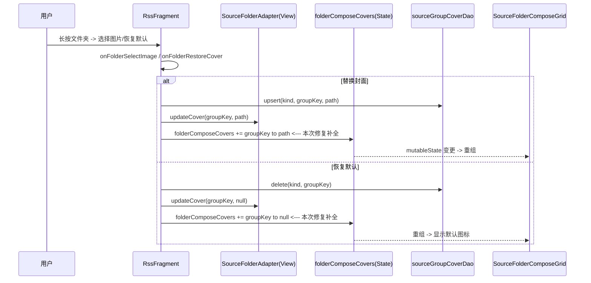
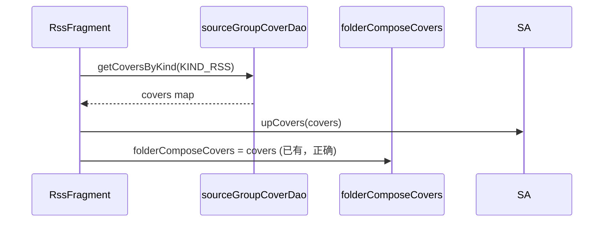

# 文件夹封面替换回归修复 — 技术设计

## Technical Approach

订阅端采用「**双数据源同步**」：保留 View 版 `SourceFolderAdapter` 的更新调用，同时把 `folderComposeCovers`（Compose 状态源）纳入替换 / 恢复的写入路径，借 `mutableState` 赋值触发 Compose 重组。

书架端通过真机验证确认是否同因；若失效，将 `BookshelfScreen` 的文件夹数据链路（`bookGroups`/`upGroup`）与替换保存后的 DB flow 对齐。

## Architecture Decisions

### AD-01: 订阅封面采用 Compose state 与 View adapter 双写
- **Context**: 订阅文件夹渲染已迁移至 `SourceFolderComposeGrid`，封面源为 `folderComposeCovers`；但替换/恢复入口只更新 View 版 `SourceFolderAdapter` 的缓存。
- **Concern**: 单点更新导致 Compose 分支视觉不刷新，形成回归。
- **Decision**: 在 `RssFragment` 的替换与恢复两个入口，成对调用 `folderAdapter.updateCover(groupKey, cover)` 与 `folderComposeCovers = folderComposeCovers + (groupKey to cover)`（恢复传 `null`）。
- **Goal**: 替换/恢复后订阅文件夹封面立即刷新。
- **Tradeoff**: 两处调用需成对维护；通过注释与 tasks 标注避免未来遗漏。
- **Status**: Accepted
- **Superseded-by**: N/A

### AD-02: 封面 reload 走本地路径由 `BookCover` 统一接管
- **Context**: 替换保存的封面是 `externalFiles/covers/{MD5}.{ext}` 绝对路径，渲染都经 `BookCover.load(context, cover).into(view)`。
- **Concern**: 若本地绝对路径被任意分支当成 URL 解析会加载失败。
- **Decision**: 复用现有 `BookCover`（Glide）对本地绝对路径的加载能力，不引入额外 type 判断。
- **Goal**: 复用成熟链路，零成本保证本地图片加载正确。
- **Tradeoff**: 依赖 `BookCover` 对本地路径的既有支持；若不支持则需加 `File` 模型包装。（当前为原版成熟逻辑，预期无障碍）
- **Status**: Accepted
- **Superseded-by**: N/A

## Data Flow

初始化视角（无修复）：

## File Changes

| 文件 | 变更 |
|------|------|
| `app/src/main/java/io/legado/app/ui/main/rss/RssFragment.kt` | 替换入口（L209-214）与恢复入口（L1287-1298）同步补 `folderComposeCovers` 更新；附注释标注双写约束 |
| `app/src/main/java/io/legado/app/ui/main/bookshelf/BookshelfScreen.kt` | （仅当书架真机验证确认失效时）对齐文件夹封面刷新链路 |
| `app/src/main/java/io/legado/app/ui/adapter/SourceFolderComposeGrid.kt` | 预期不改（纯渲染，数据源在 Fragment） |
| `docs/INDEX.md` | 登记本任务 |
| `app/src/main/assets/updateLog.md` | 版本交付同步 |