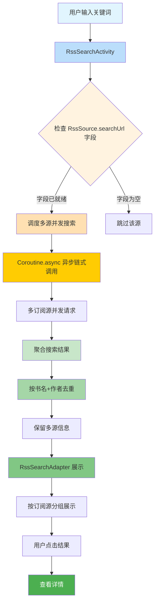
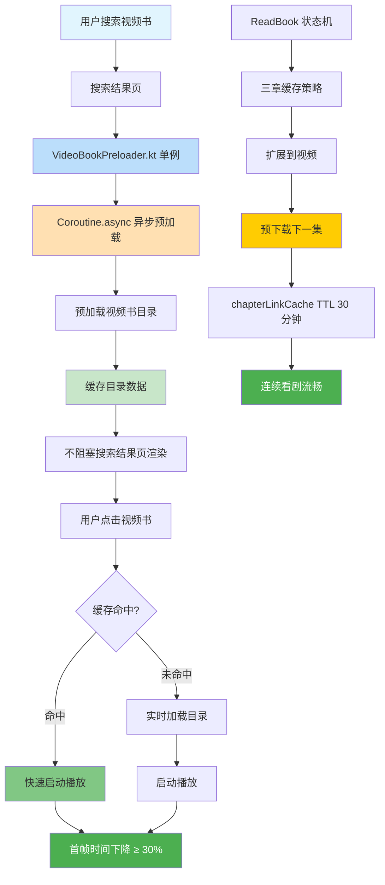
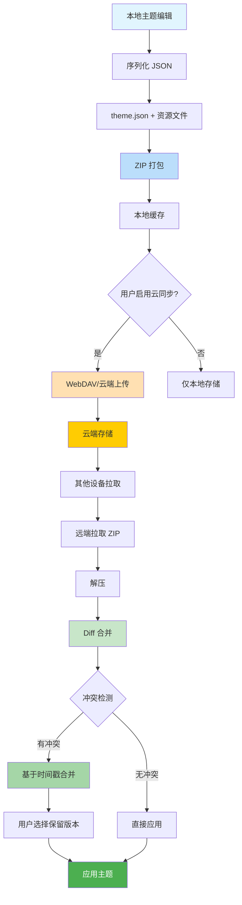
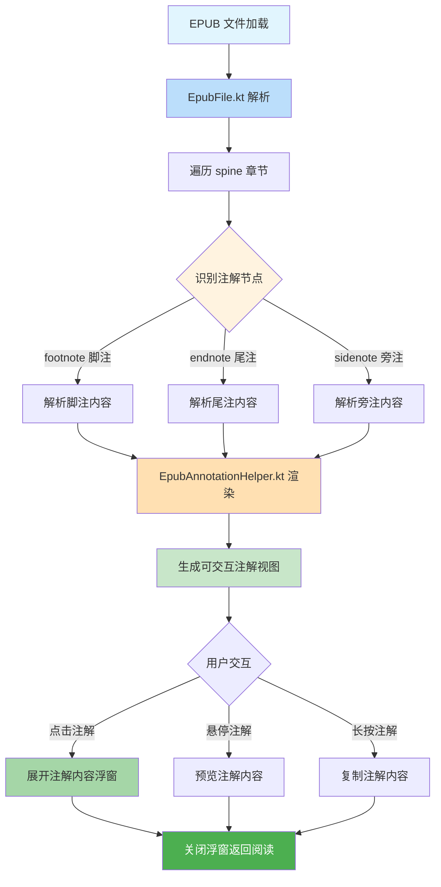
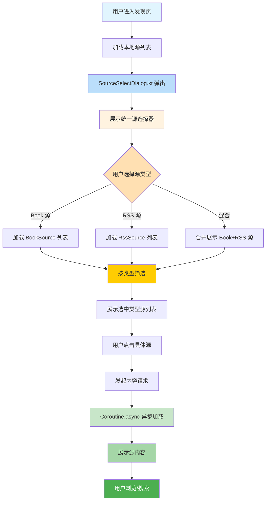
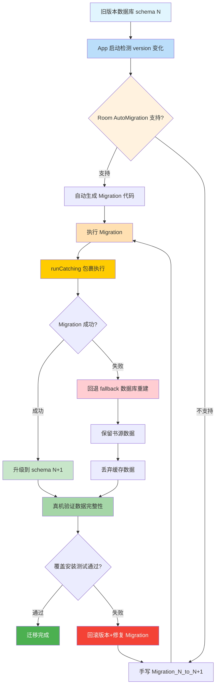

# 设计文档 - Forks Archive 借鉴实施

> **生成时间**：2026-07-18
> **关联文档**：
> - 需求规格：[`./spec.md`](./spec.md)（含 Intent/Scope/Approach/Requirements/Scenarios）
> - 任务清单：[`./tasks.md`](./tasks.md)（54 项任务 / 6 大检查点）
> - 决策来源：`../forks-archive-comparison/final-adjustment.md`（v5.0 终版）
> **决策汇总**（v5.0 终版）：54 借鉴 / 64 不借鉴 / 0 待评估（P0:14 / P1:19 / P2:21）
> **本文档定位**：spec 与 tasks 之间的"如何做"层，定义 27 个 ADR、6 个数据流图、文件变更清单、风险缓解策略、实施顺序与测试策略。

---

## 1. 上下文与目标

### 1.1 项目背景

本项目（阅读 Sigma / E 分支）与 Archive 项目（Lyc 分支）同源于 Legado 开源电子书阅读器，双方在长期演进中走向了不同的强化方向：

| 维度 | Archive 项目 | 本项目 |
|------|-------------|--------|
| 来源分支 | 继承自 Lyc 维护的 Legado 分支 | fork 自原版 legado-E，私有化改造 |
| 强化方向 | 体验广度（AI/主题/EPUB/订阅/RSS） | 性能稳定性 + 视频深度优化 |
| 工程哲学 | 大而全（16000+ 行 EPUB 引擎、35 文件 AI 体系） | 极简≠残缺（书源规则引擎主航道） |
| 视频模块规模 | 4189 行 | 8167 行（领先约 3978 行） |
| EPUB 模块规模 | 46 文件 16000+ 行（自研浏览器级渲染） | 1 个 EpubFile.kt ~700 行 |
| AI 模块 | 35 文件完整 AI 体系 | 100% 无 |
| 包名 | `io.legado.app.Archive` | `io.legado.app.sigma` |
| 混淆策略 | minify=false | minify=true（更优） |
| 锁定依赖 | 10 项核心依赖版本完全一致 | 10 项核心依赖版本完全一致 |

**关键事实**：两边 10 项核心锁定依赖（jsoup 1.16.2 / rhino 1.8.1 / hutool 5.8.22 / commonsText 1.13.1 / gsyvideoplayer 11.3.0 / webkit 1.14.0 / room 2.7.1 / recyclerview 1.4.0 / viewpager2 1.0.0 / protobufJavalite 4.26.1）版本完全一致，`modules/book` 与 `modules/rhino` 两边字节级一致，构成借鉴的互信基础。

### 1.2 用户价值导向原则

本设计严格遵循用户价值四维度评估标准（详见 ADR-005）：

| 维度 | 权重 | 说明 |
|------|------|------|
| 用户直接感知 | 40% | 用户能立刻感受到的好处（如加载更快、操作更方便） |
| 用户核心场景 | 30% | 是否覆盖阅读 App 三大核心场景（看书/订阅/视频） |
| 实施成本 vs 用户收益 | 20% | 投入产出比 |
| 用户额外负担 | 10% | 是否需要用户额外配置（如 API key） |

**核心问题**：这个借鉴点能让用户用得更爽吗？还是只是技术上更酷？

### 1.3 核心目标

将 Archive 项目 54 项有用户价值的功能/优化点融合到本项目，分三阶段实施：

1. **P0 阶段（14 项，立即启动，AI 执行无工期估算）**：100% 聚焦用户核心场景（订阅搜索/阅读视觉/视频加速/EPUB 体验/RSS 加载/源管理/搜索合并/字体撞色/视频预加载集成/视频最近阅读/倍速增强），用户价值区间 4.5 - 5.0
2. **P1 阶段（19 项，按依赖顺序实施）**：用户中高收益 + 开发者侧优化
3. **P2 阶段（21 项，按依赖顺序实施）**：技术升级类（5 项）+ 用户中价值类（7 项）+ UI 优化类（9 项，放在最后）

### 1.4 决策演进时间线

| 版本 | 决策数 | 关键变化 |
|------|--------|---------|
| v2.0 初版 | 47 借鉴 / 35 不借鉴 / 36 待评估 | 基于 7 模块深度分析 |
| v3.0 用户价值重评估 | 36 借鉴 / 46 不借鉴 / 36 待评估 | AI 模块全量否决（用户反对 API key） |
| v4.0 待评估重评估 | 45 借鉴 / 65 不借鉴 / 8 待评估 | 36 待评估全部评估（9 升级 / 19 否决） |
| **v5.0 终版** | **54 借鉴 / 64 不借鉴 / 0 待评估** | 8 待评估强制决策 + UI 优化升级（3 项从不借鉴升级为 P2） |

---

## 2. 核心设计决策（ADR Y-Statement 格式）

> **Y-Statement 模板**：Status / Context / Decision / Consequences / Alternatives / Drawbacks

### ADR-001 三阶段实施策略

- **Status**：Accepted
- **Context**：54 项借鉴决策跨越 RSS/EPUB/THEME/VIDEO/DEPS/BUILD 6 大模块，用户价值区间 2.8 - 5.0，实施成本跨度大（低/中/高）。一次性全部实施存在风险集中、周期过长（>6 个月）、回归测试范围过大等问题；只实施 P0 会遗漏用户中高收益项；不分优先级无序实施效率低且难以追踪进度。
- **Decision**：采用三阶段渐进式实施策略：
  - **Phase 1 (P0)**：用户核心场景优先（用户价值 4.5 - 5.0，立即启动，AI 执行无工期估算）
  - **Phase 2 (P1)**：性能体验增强（用户中高收益 17 项 + 开发者侧 6 项，按依赖顺序实施）
  - **Phase 3 (P2)**：UI 优化与扩展（技术升级 5 项 + 用户中价值 7 项 + UI 优化 9 项，按依赖顺序实施）
- **Consequences**：
  - 正向：风险分散，每阶段可独立验证；用户最快感知收益（P0 立即启动）；进度可追踪
  - 负向：分阶段实施周期较长；P2 UI 优化延后可能影响用户长期体验
- **Alternatives**：
  - 备选 A：一次性全部实施 54 项 → 否决（风险集中、>6 个月、回归测试范围过大）
  - 备选 B：只实施原 P0 10 项 → 部分采纳（v5.1 调整后升级 4 项 P1→P0，P0 扩展为 14 项，详见 ADR-002）
  - 备选 C：不分优先级无序实施 → 否决（低价值项与高价值项混淆，资源浪费）
- **Drawbacks**：分阶段周期长；P2 优先级可能随用户反馈调整

### ADR-002 P0 阶段分组顺序执行

- **Status**：Accepted
- **Context**：P0 阶段 14 项任务经交叉审查发现：**P0 内部无 P0→P0 强依赖**，所有依赖链均为组内同文件串行（如 RSS-B-05 RssFragment 入口与 RSS-B-01 共用 RssFragment.kt；VIDEO-B-02 章节链接缓存依赖 VIDEO-B-01；EPUB-B-01 与 EPUB-B-02 共用 EpubFile.kt）。原 v1.0 描述的"THEME-B-01 → THEME-B-02"经核实为**依赖关系错误**：THEME-B-01 是 PaperInkHelper.kt（基于 Paint.setShadowLayer），THEME-B-02 是 ThemeUtils.kt 中新增 sanitizeFontColorAgainstSurfaces 方法（基于 AndroidColorUtils.calculateContrast），两者功能独立、修改文件不同，无代码依赖关系。并发文件修改规范仅要求"同一源码文件的所有 Edit 必须由主 Agent 串行执行"，**不冲突文件可分组并行**。**P0 范围调整为 14 项**（升级 4 项 P1→P0：RSS-B-05、VIDEO-B-02、VIDEO-E-01、VIDEO-E-02；THEME-B-03 剔除回 P1）。
- **Decision**：P0 14 项任务按"文件隔离原则"分为 4 个组，**4 个组按文件隔离原则顺序执行（组间逻辑并行但物理串行，主 Agent 单线程）**，组内串行（AI 执行，无工期估算，与 R22 缓解措施一致）：
  ```
  组A（RSS 主线，组内串行+并行，5 项）
    ├─ RSS-B-05 (RssFragment openRssSearch 入口，v5.1 调整后已升级 P0) → RSS-B-01 (RssSearchActivity) [同文件串行]
    ├─ RSS-B-02 (SourceSelectDialog) [独立，可与 RSS-B-01 并行]
    ├─ RSS-B-03 (SearchBookMergeUtils) [独立，可与 RSS-B-01 并行]
    └─ RSS-E-06 (cacheFirst 默认值，数据层已完成 RssSource.kt:113，仅 WebView 层需验证) [独立，可与 RSS-B-01 并行]

  组B（THEME 视觉，组内并行，2 项）
    ├─ THEME-B-01 (纸墨风格 PaperInkHelper.kt) [独立]
    └─ THEME-B-02 (字体撞色检测 ThemeUtils.kt) [独立，与 THEME-B-01 无依赖]
    注：THEME-B-03 已剔除回 P1，不在 P0 分组中

  组C（EPUB 加速，组内并行+串行，2 项）
    ├─ EPUB-B-01 (章节资源索引 spine 优先 EpubFile.kt) [独立]
    └─ EPUB-B-02 (资源过滤+标题归一化 EpubFile.kt) [依赖 EPUB-B-01 同文件，串行]

  组D（VIDEO 增强，组内串行+并行，5 项）
    ├─ VIDEO-B-01 (VideoBookPreloader) [独立；新增 VideoBookPreloader.kt + 修改 SearchActivity.kt 搜索结果页预加载，不修改 VideoPlayerActivity.kt，详见 §4.6 #3] → VIDEO-B-02 (预加载集成，v5.1 调整后已升级 P0) [依赖 VIDEO-B-01 架构（功能依赖非文件串行）；唯一修改 VideoPlayerActivity.kt 的任务]
    ├─ VIDEO-E-01 (ReadRecentBook 写入，v5.1 调整后已升级 P0) [含 DB Migration_98_to_99，实施复杂度高于其他 P0 任务，建议拆分为子任务串行，需遵循 ADR-013 迁移流程]
    ├─ VIDEO-E-02 (ChoiceSpeedDialog 增强，v5.1 调整后已升级 P0) [与 VIDEO-B-02 功能协同建议串行执行：VIDEO-B-02 → VIDEO-E-02；唯一修改 ChoiceSpeedDialog.kt，实际调用点 VideoPlayer.kt:600 不修改，不与 VIDEO-B-02 共用 VideoPlayerActivity.kt]
    └─ DEPS-B-01 (markwon 4.6.2 扩展) [独立无依赖，可与 VIDEO 并行]
    注：v2.6 修订（串行链简化）：VIDEO-B-01 集成位置已改为 SearchActivity.kt（不修改 VideoPlayerActivity.kt），VIDEO-E-02 修改 ChoiceSpeedDialog.kt（不修改 VideoPlayerActivity.kt）；VideoPlayerActivity.kt 实际仅被 VIDEO-B-02 一个任务修改，原"三任务串行链"简化为"VIDEO-B-02 → VIDEO-E-02 两任务串行"（功能协同，非文件冲突）
  ```
  **P0 前置任务**：P0 实施前先建立性能基线（ADR-016 要求），使用 `ai_tests/scripts/swipe_test_log.py` + `l2_verify_video_player.py` 测量启动时间/内存占用/搜索响应时间/视频加载时间/FPS；P0 完成后对比验证性能无显著回退（容忍阈值：启动时间 +5%、FPS -3 帧、搜索响应 +10%）。
- **Consequences**：
  - 正向：**4 个组按文件隔离原则顺序执行（组间逻辑并行但物理串行，主 Agent 单线程），避免并发冲突**；组内独立任务可借用子代理分担分析；每项任务完成可独立验证；遵守"同一源码文件串行"规范；P0 范围扩大至 14 项覆盖更多用户核心场景
  - 负向：需主 Agent 协调 4 个并行组的合并节点；EPUB-B-01 与 EPUB-B-02 共用 EpubFile.kt 必须串行；RSS-B-05 与 RSS-B-01 共用 RssFragment.kt 必须串行
- **Alternatives**：
  - 备选 A：完全串行执行 P0 任务 → 否决（无依赖项被人为拉长，P0 内部无 P0→P0 强依赖）
  - 备选 B：子代理无序并行 → 否决（违反并发文件修改规范，多 Agent 并行 Edit 同一源码文件）
  - 备选 C：原描述"THEME-B-01 → THEME-B-02 串行" → 否决（依赖关系错误，二者修改不同文件）
  - 备选 D：保持原 10 项 P0 不升级 4 项 P1 → 否决（RSS-B-05/VIDEO-B-02/VIDEO-E-01/VIDEO-E-02 与本组 P0 共用入口或依赖链，协同启动更高效）
- **Drawbacks**：主 Agent 协调工作量增加；缓解措施：每项任务定义明确完成标准+独立验收检查点，组间合并前 Grep 校验冲突

### ADR-003 AI 模块全量否决

- **Status**：Accepted
- **Context**：用户明确反馈"AI 模块，我都不建议加入到我的项目中去，因为收益太小了，还需要配置模型 api key，并且其实对用户使用该软件没有太大的好处"。Archive 项目 AI 模块包含 35 个 Kotlin 文件、完整 MCP 2025-06-18 协议客户端（420 行可独立移植）、AiAgentRuntime.runToolLoop 三模式（Normal/Plan/Goal）、Tavily 联网搜索等。但本项目定位为"阅读器"，不是"AI 助手"。
- **Decision**：AI 模块 11 项借鉴决策全部否决（6 项原借鉴 + 5 项原待评估）：
  - AI-B-01 MCP 客户端 → 不借鉴
  - AI-B-02 Tavily 联网搜索 → 不借鉴
  - AI-B-03 AiResolvedTool 抽象 → 不借鉴
  - AI-B-04 上下文压缩机制 → 不借鉴
  - AI-B-05 JS 脚本生图 → 不借鉴
  - AI-B-06 完整 AI Agent 架构 → 不借鉴
  - AI-E-01 ~ AI-E-05（5 项待评估）→ 全部不借鉴
- **Consequences**：
  - 正向：避免引入 API key 配置门槛；减少包体积与维护成本；保持"阅读器"定位清晰
  - 负向：本项目长期无 AI 能力（用户接受此代价）
- **Alternatives**：
  - 备选 A：仅借鉴 MCP 客户端（420 行可独立移植）→ 否决（仍需 API key，用户收益小）
  - 备选 B：P2 长期规划完整 AI Agent → 否决（用户明确反对）
- **Drawbacks**：本项目长期无 AI 能力；如未来用户需求变化需重新评估

### ADR-004 UI 优化放最后并接受包体积增加

- **Status**：Accepted
- **Context**：用户反馈"UI 层的优化，其实可以提升等级，决策为可以去实施的，只不过可以放在最后，虽然增加了包体积，但对于用户体验来说是有帮助的"。v3.0 评估中 3 项 UI 优化（liquidglass/lottie/KitBinding）原决策为不借鉴（理由：增加包体积，用户收益小），但用户明确接受包体积增加换取体验提升。
- **Decision**：3 项 UI 优化从不借鉴升级为 P2 借鉴（放在 P2 最后实施）：
  - DEPS-B-06 liquidglass 1.0.3 液态玻璃效果 → P2（预计增加 1-2MB）
  - DEPS-B-08 lottie 6.6.6 动画 → P2（预计增加 2-3MB）
  - THEME-E-03 KitBinding 跨组件绑定 → P2（UI 一致性）
  - **APK 体积增长上限**：UI 优化类合计 ≤ 5MB
  - **实施顺序**：放在 P2 最后，便于集中回归测试与包体积测量
- **Consequences**：
  - 正向：长期视觉体验提升；用户接受度高
  - 负向：APK 体积增长 2-5MB；需集中回归测试
- **Alternatives**：
  - 备选 A：保持不借鉴 → 否决（用户明确接受包体积增加）
  - 备选 B：升级为 P1 立即实施 → 否决（应优先 P0/P1 核心场景）
- **Drawbacks**：包体积增加；缓解措施：分阶段引入，每阶段测量 APK 体积

### ADR-005 用户价值评估四维度标准

- **Status**：Accepted
- **Context**：v2.0 初版决策基于"收益/风险/复杂度"三维评分，但 P0 17 项中包含 5 项开发者侧优化和 2 项需 API key 的功能，P0 用户价值 ≥4 分占比仅 70%。用户反馈要求"深度分析哪些是对当前系统做了优化改善且收益很大的"，需建立以"用户使用软件的实际收益"为核心的评估标准。
- **Decision**：建立用户价值四维度评估标准：
  - **用户直接感知**（40%）：用户能立刻感受到的好处（如加载更快、操作更方便）
  - **用户核心场景**（30%）：是否覆盖阅读 App 三大核心场景（看书/订阅/视频）
  - **实施成本 vs 用户收益**（20%）：投入产出比
  - **用户额外负担**（10%）：是否需要用户额外配置（如 API key）

  **决策规则**：
  - 综合评分 ≥4.0 分：保留为 P0/P1 借鉴
  - 综合评分 3.5-3.9 分：降级为 P2 或保持待评估
  - 综合评分 ≤3.4 分：改为不借鉴
- **Consequences**：
  - 正向：P0 100% 聚焦用户核心场景；用户价值最大化；评估可量化可对比
  - 负向：部分技术架构类借鉴点（如 AppearanceKit）被降级
- **Alternatives**：
  - 备选 A：保持 v2.0 三维评分（收益/风险/复杂度）→ 否决（无法体现"用户额外负担"减分项）
  - 备选 B：仅用"用户直接感知"单维度 → 否决（无法体现核心场景权重）
- **Drawbacks**：评分主观性存在；缓解措施：每个维度明确 1-5 分评分细则

### ADR-006 锁定依赖不升级

- **Status**：Accepted
- **Context**：两边 10 项核心锁定依赖版本完全一致：jsoup 1.16.2（破坏性变更不可升级）、rhino 1.8.1（API 24 以下缺少 Arrays.setAll 不可升级）、hutool 5.8.22（书源加解密依赖不可升级）、commonsText 1.13.1、gsyvideoplayer 11.3.0、webkit 1.14.0、room 2.7.1、recyclerview 1.4.0、viewpager2 1.0.0、protobufJavalite 4.26.1。`modules/book` 与 `modules/rhino` 两边字节级一致。
- **Decision**：10 项核心锁定依赖禁止升级，建立依赖版本基线：
  - jsoup 1.16.2（锁定，破坏性变更 jsoup#2017）
  - rhino 1.8.1（锁定，升级原因：API 24 以下缺少 Arrays.setAll，本项目 minSdk=23（build.gradle:66）仍低于 24，不可升级；与 ADR-022 minSdk 23 一致）
  - hutool 5.8.22（锁定，书源加解密依赖）
  - 其余 7 项锁定（两边一致，互信基础）
  - **sora-editor + markwon 已引入**（非新增依赖，`app/build.gradle:329-332, 356-358` 已存在），DEPS-B-01（markwon 4.6.2 扩展）与 DEPS-B-02（sora-editor）仅需验证版本兼容性 + 补充缺失子依赖，不再列为新增依赖引入任务
- **Consequences**：
  - 正向：避免破坏性变更；保持与两边互信基础；书源规则兼容性保证
  - 负向：无法享受新版本功能与性能优化
- **Alternatives**：
  - 备选 A：升级 jsoup 至最新版 → 否决（破坏性变更 jsoup#2017 影响书源规则解析）
  - 备选 B：升级 rhino 至最新版 → 否决（API 24 以下缺少 Arrays.setAll）
- **Drawbacks**：长期技术债；缓解措施：建立依赖版本基线文档，定期评估升级可行性

### ADR-007 RSS 搜索增强双轨方案

- **Status**：Accepted
- **Context**：本项目 RssSource 实体已有 `searchUrl` 字段但**没有任何 Activity/Fragment 使用它**（数据已就绪但 UI 入口缺失）。Archive 项目通过新增 `RssSearchActivity.kt`（104 行）激活了这一能力。借鉴投入产出比极高：仅需 1 个 Activity + 5 行入口代码即可让用户搜索所有订阅源的内容。
- **Decision**：采用双轨方案激活 RSS 搜索能力：
  - **数据轨**：复用已有 RssSource.searchUrl 字段（零数据变更，字段已就绪）
  - **UI 轨**：新增 RssSearchActivity.kt（继承 VMBaseActivity，本项目基类，`app/src/main/java/io/legado/app/base/VMBaseActivity.kt:9`，本项目无 BaseSearchActivity）+ RssSearchAdapter.kt + RssFragment 添加搜索入口（5 行代码）（⚠️ 复用现有 RssSortViewModel，与 Archive 借鉴源一致，不新增 RssSearchViewModel）
- **Consequences**：
  - 正向：数据零变更降低风险；UI 入口补全激活能力；用户价值 5.0（最高）
  - 负向：新增 3 个文件需测试覆盖
- **Alternatives**：
  - 备选 A：在现有 SearchActivity 中扩展支持 RSS 搜索 → 否决（架构耦合，违反单一职责）
  - 备选 B：等待 Archive 完整 DiscoverySuite 套件（130KB+）→ 否决（体量过大与极简哲学冲突）
- **Drawbacks**：新增 3 个文件；缓解措施：配套单元测试覆盖搜索/分页/异常

### ADR-008 视频模块保持本项目架构

- **Status**：Accepted
- **Context**：本项目视频模块已大幅领先 Archive（本项目 8167 行 vs Archive 4189 行，多约 3978 行）。本项目独有：RSS 多集多线路、ViewPager2 文章切换、抖音风格沉浸式竖屏播放器、WebView 降级（ExoPlayer 失败自动切换）、R5 多层嗅探、分页加载+预缓冲、手势交互重构（7 种手势统一管理）、10 类视频问题修复。Archive 唯一可借鉴点：VideoBookPreloader.kt（90 行）搜索结果页预加载视频书目录。Archive ExoPlayerHelper 存在已知 Bug（用 SPLIT_TAG 拼接 headers JSON 到 URL 后缀导致 ExoPlayer 类型推断误判抛 3003 错误，本项目已用 setMimeType 修复）。
- **Decision**：视频模块保持本项目架构，仅借鉴 VideoBookPreloader（90 行）：
  - P0：VIDEO-B-01 VideoBookPreloader 视频书预加载（90 行，搜索结果页预加载目录）
  - P0：VIDEO-B-02 章节链接缓存+下一集预加载（chapterLinkCache + preloadNextEpisode，TTL 30 分钟，v5.1 调整后已升级 P0）
  - P0：VIDEO-E-01 ReadRecentBook 写入（v5.1 调整后已升级 P0）、VIDEO-E-02 ChoiceSpeedDialog 增强（v5.1 调整后已升级 P0）
  - P1：VIDEO-E-03 Exo2MediaPlayer 增强
  - **警示**：借鉴 Archive 视频功能时避免引入 SPLIT_TAG 拼接 headers 方案（3003 错误根因）
  - **同文件串行约束**（v2.6 修订简化）：VideoPlayerActivity.kt 实际仅被 VIDEO-B-02 一个任务修改（VIDEO-B-01 已修订为修改 SearchActivity.kt，VIDEO-E-02 修改 ChoiceSpeedDialog.kt 不修改 VideoPlayerActivity.kt），无需三任务串行；保留 VIDEO-B-02 → VIDEO-E-02 两任务串行约束（功能协同，详见 ADR-002 组D）
- **Consequences**：
  - 正向：保持本项目视频模块领先优势；仅借鉴小代码量高收益项；避免已知 Bug
  - 负向：放弃 Archive 视频模块其他可能的借鉴点
- **Alternatives**：
  - 备选 A：全面借鉴 Archive 视频模块 → 否决（本项目已大幅领先，反向借鉴无意义）
  - 备选 B：仅借鉴 VideoBookPreloader，放弃 VIDEO-B-02/E-01/E-02/E-03 → 否决（这些项用户价值 4.0-4.8，值得借鉴）
- **Drawbacks**：放弃 Archive 视频模块其他借鉴点；缓解措施：定期复盘 Archive 视频模块新提交

### ADR-009 EPUB 渲染引擎不替换

- **Status**：Accepted
- **Context**：Archive 自研了完整浏览器级 EPUB 渲染引擎（46 文件 16000+ 行，含 CSS 级联 + 盒模型布局 + 7 种绘制指令 + 字体内嵌），本项目仅 1 个 EpubFile.kt ~700 行，差距 23 倍。但 Archive EPUB 引擎偏离本项目"书源规则引擎"主航道，工程量过大。Archive 优秀设计范式：Book.kt 实体零扩展原则（所有缓存数据走独立磁盘目录）。
- **Decision**：EPUB 渲染引擎不替换，仅借鉴部分小特性：
  - P0：EPUB-B-01 章节资源索引（spine 优先）、EPUB-B-02 资源过滤+标题归一化
  - P1：EPUB-B-03 性能日志+图片尺寸缓存、EPUB-E-02 字体内嵌、EPUB-E-04 相邻预加载、EPUB-E-06 文本选择器
  - P2：EPUB-B-05 注解系统、EPUB-B-06 分页缓存架构、EPUB-B-07 错误回退+文本选择器、EPUB-B-08 双模式开关、EPUB-E-03 分页缓存架构、EPUB-E-05 错误回退机制
  - **设计原则**：所有 EPUB 增强遵守 Book.kt 实体零扩展原则，缓存数据走独立磁盘目录
- **Consequences**：
  - 正向：保持本项目主航道清晰；避免大规模架构调整；渐进式优化降低风险
  - 负向：EPUB 渲染能力长期落后 Archive（用户接受此代价）
- **Alternatives**：
  - 备选 A：整体借鉴 Archive EPUB 渲染引擎（16000+ 行）→ 否决（偏离主航道，工程量过大）
  - 备选 B：自研 EPUB 渲染引擎 → 否决（重复造轮子，资源浪费）
- **Drawbacks**：EPUB 渲染能力落后；缓解措施：渐进式借鉴 10 项低风险优化

### ADR-010a 主题视觉增强与导入导出

- **Status**：Accepted
- **Context**：本项目主题管理采用扁平 `themeConfig.json`（Config 仅 9 字段），Archive 采用目录化"主题包"（`themePackages/{day|night}/{dirName}/theme.json + 资源`，Config 30+ 字段）。Archive 关键增强（导入导出相关）：ThemePackageManager（ZIP 导入导出 + 5 种 RED 格式兼容）、PaperInkHelper（60 行，纸墨风格零外部依赖）、字体撞色检测（sanitizeFontColorAgainstSurfaces 基于 AndroidColorUtils.calculateContrast）。用户价值评估：主题包 ZIP 导入导出 4.0、Config 字段扩展 4.0、纸墨风格 4.5、字体撞色检测 4.5。**用户额外负担：无**（导入导出为本地操作，无需用户配置外部服务）。
- **Decision**：借鉴 Archive 主题导入导出能力，分阶段实施：
  - **P0 阶段仅实施本地视觉类**：THEME-B-01 纸墨风格（60 行）、THEME-B-02 字体撞色检测（本地视觉增强，无导入导出）
  - **P1 阶段实施导入导出**：THEME-B-03 主题包 ZIP 导入导出、THEME-B-04 Config 字段扩展、THEME-B-05 字体内嵌支持、THEME-E-04 主题包导入导出格式、THEME-E-05 主题预览能力
- **Consequences**：
  - 正向：主题管理能力大幅提升；用户可备份/分享主题；视觉体验改善；无用户额外负担
  - 负向：AppearanceKit 架构改造工程量大；ZIP 打包/解压需考虑文件大小限制
- **Alternatives**：
  - 备选 A：保持现有扁平 themeConfig.json → 否决（用户价值未最大化）
  - 备选 B：全面借鉴 Archive 目录化主题包（含云端同步）→ 部分采纳（云端同步部分拆分至 ADR-010b 单独约束）
- **Drawbacks**：导入导出仅限本地，无法跨设备同步；缓解措施：跨设备同步能力由 ADR-010b 约束

### ADR-010b 主题包云端同步与扩展能力

- **Status**：Accepted
- **Context**：用户价值评估 3.3（P2），需配置云盘（WebDAV）。Archive ThemePackageManager 含云端同步能力，但实施阶段为 P2（最晚），且用户额外负担显著（需配置 WebDAV 云盘账号）。云端同步涉及数据上传、冲突合并、回退策略等复杂场景，与本地导入导出（ADR-010a）在用户额外负担、实施阶段、风险等级上差异显著，故单独拆分为独立 ADR 约束。
- **Decision**：P2 借鉴 Archive 主题包云端同步与扩展能力（**云端同步仅 THEME-B-07 共 1 项，其余为扩展能力非云端同步**）：
  - THEME-B-06 AppearanceKit 套件架构（扩展能力）、THEME-B-07 主题包云端同步（WebDAV，云端同步）、THEME-B-08 KitBinding（扩展能力）、THEME-E-01 5 种 RED 格式兼容（扩展能力）、THEME-E-02 主题包目录化结构（扩展能力）、THEME-E-03 KitBinding 跨组件绑定（扩展能力）
  - **冲突合并策略**：基于时间戳的合并策略，冲突时用户选择保留版本，本地备份后再合并
  - **代码借鉴冲突合并策略**：本项目优先 + fork 仓库参考，逐文件对比差异，保留本项目修改 + 借鉴 fork 仓库新增功能，禁止直接覆盖本项目已有逻辑
  - **回退策略**：同步失败时保留本地版本，提示用户重试；网络异常时退化为仅本地模式
  - **数据加密**：主题包云端同步前必须本地加密（密钥由用户密码派生，符合 ADR-019 网络安全与隐私策略）
  - **加密密钥丢失恢复机制**：从备份恢复 + 用户提示，禁止静默丢失；密钥派生失败时引导用户重新设置密码并从云端备份恢复主题数据
  - **用户额外负担**：需配置 WebDAV 云盘
- **Consequences**：
  - 正向：用户可跨设备同步主题；主题数据云端备份；与 Archive 云端同步能力对齐
  - 负向：需用户配置云盘（额外负担）；冲突合并复杂；网络异常时体验降级；**冲突合并可能引入隐藏 bug，需逐文件 Code Review**；加密密钥丢失可能导致主题数据无法解密（已有恢复机制兜底）
- **Alternatives**：
  - 备选 A：不实施云端同步，仅本地导入导出 → 否决（用户跨设备需求无法满足）
  - 备选 B：使用第三方云盘 SDK（如 Dropbox/OneDrive）→ 否决（依赖第三方服务，隐私风险）
  - 备选 C：使用 WebDAV 标准协议 → 采纳（开放标准，用户自托管，隐私可控）
- **Drawbacks**：用户需配置 WebDAV 云盘；冲突合并策略可能丢失部分修改；缓解措施：本地备份后再合并 + 基于时间戳的冲突检测

### ADR-011 任务完成强制流程（文档同步 + 版本交付 + 真机测试 + E2E 测试）

- **Status**：Accepted
- **Context**：原 ADR-011（文档同步与版本交付）与原 ADR-012（真机测试强制流程）同属"任务完成后的强制流程"。项目规范要求"任何代码变更任务完成后，必须同步更新 `assets/updateLog.md`，禁止只改代码不写更新日志"且"更新日志必须基于真实代码变更分析生成"；同时要求"任何代码变更任务，在 OpenSpec 步骤 5（实施）与步骤 6（检查点 2）之间，必须执行步骤 5.5 AI 自动端到端测试，禁止跳过"。54 项借鉴决策每项都必须完成"代码 + 文档 + 测试"三件套，合并为单一 ADR 形成统一约束。
- **Decision**：每个 P 阶段完成后必须按顺序执行"任务完成四件套"（代码验证 + 真机测试 + 文档同步 + 问题记录）：
  1. **代码验证**：编译通过 + 调试日志已清理（Grep "android.util.Log.d|android.util.Log.e" 确认无残留）+ 静态分析通过
  2. **真机/E2E 测试**（按 `ai_e2e_testing_workflow.md` 执行）：
     - 测试前必读 SOP：`ai_tests/docs/fixed_test_workflow.md`
     - 快速验证脚本：`ai_tests/scripts/quick_build_install.py`（编译+安装+L1 验证）
     - 全量测试：`ai_tests/scripts/run_e2e.py --tc all`
     - L2 验证：`ai_tests/scripts/l2_verify_video_player.py`（视频播放器场景）
     - 日志分析：`ai_tests/scripts/swipe_test_log.py`（滑动测试日志）
     - Python 环境：必须使用 `ai_tests\venv\Scripts\python.exe`，禁止公共 Python
  3. **文档同步**（按 `version-delivery-sync.md` 规范，基于 `git diff` 真实变更分析）：
     - `assets/updateLog.md`：用户可感知变化（通俗语言，不暴露内部技术术语）— 编译前必须更新
     - `docs/project-rules/forks-reference.md`：补充 Archive 私仓地址与对比结论索引
     - `docs/INDEX.md`：状态更新
     - `c:\Users\shiyq\.trae-cn\memory\projects\-f-myself-github-WeAgentChat-temp-legado\project_memory.md`：经验沉淀
     - `docs/specs/forks-archive-borrow-implementation/tasks.md`：任务状态更新
  4. **问题记录**：所有问题记录到 `issues-found.md`，回归验证确保现有功能不退化
- **Consequences**：
  - 正向：代码 + 文档 + 测试三位一体；文档与代码同步；用户可感知变化；经验沉淀可复用；保证代码质量；问题早发现早修复；回归测试覆盖
  - 负向：每阶段增加文档维护与测试时间成本（AI 执行，无工期估算）
- **Alternatives**：
  - 备选 A：仅在最后阶段统一更新文档 + 测试 → 否决（违反 version-delivery-sync.md + ai_e2e_testing_workflow.md 规范，且易遗漏）
  - 备选 B：仅更新 updateLog.md 不真机测试 → 否决（违反 ai_e2e_testing_workflow.md 规范，其他文档同样重要）
  - 备选 C：仅在 P0 阶段真机测试，P1/P2 跳过 → 否决（P1/P2 同样需要真机验证）
- **Drawbacks**：每阶段任务完成标准更严格（必须四件套全过）；缓解措施：使用快速验证脚本加速 L1 验证 + 建立文档更新检查清单

### ADR-013 数据库迁移安全策略

- **Status**：Accepted
- **Context**：THEME-B-04 Config 字段扩展（参考 Archive 30+ 字段，本项目 9 字段）、VIDEO-E-01 ReadRecentBook 写入（新增 ReadRecentBook 表，CREATE TABLE）、RSS-B-04 pureSearch 字段（ALTER TABLE rssSource ADD COLUMN pureSearch）涉及数据库 schema 变更。项目规范 `database-migration-safety.md` 要求"数据库 version 变更/@DatabaseView 修改/实体字段修改/新增 migration 任务"必须先评估迁移安全。覆盖安装场景若处理不当可能导致用户数据丢失。
- **Decision**：遵循 database-migration-safety.md 规范，采用 AutoMigration + runCatching 兜底 + 覆盖安装兼容性测试三段式策略：
  1. **优先使用 Room AutoMigration**：字段新增/删除场景使用 `@AutoMigration` 注解自动生成迁移代码（如 RSS-B-04 pureSearch 字段新增：`ALTER TABLE rssSource ADD COLUMN pureSearch INTEGER NOT NULL DEFAULT 0`）
  2. **复杂变更手写 Migration**：字段重命名/类型变更/数据迁移/新表创建场景手写 `Migration_N_to_N+1`，所有新字段必须有默认值确保向后兼容（如 VIDEO-E-01 ReadRecentBook 表创建：`CREATE TABLE IF NOT EXISTS readRecentBook (...)`，新建实体 + DAO）
  3. **runCatching 兜底**：所有 Migration 调用包裹 `runCatching`，失败时回退到 fallback 数据库重建（保留书源数据，丢弃缓存）
  4. **覆盖安装兼容性测试**：每个 Migration 必须真机验证"旧版本→新版本"覆盖安装流程，验证数据完整性
- **Consequences**：
  - 正向：确保覆盖安装不丢数据；数据库版本演进可追踪；符合项目规范
  - 负向：AutoMigration 对字段重命名支持有限；增加测试工作量
- **Alternatives**：
  - 备选 A：手动 Migration 全量编写 → 否决（复杂度高，易出错）
  - 备选 B：直接修改实体字段不加 Migration → 否决（违反 database-migration-safety.md，导致运行时崩溃）
  - 备选 C：使用 SharedPreferences 视频书记录 → 否决（与最近阅读统一管理冲突）
- **Drawbacks**：AutoMigration 对字段重命名支持有限，需手写 `@RenameColumn` 注解或完整 Migration

### ADR-014 网络层兼容性策略

- **Status**：Accepted
- **Context**：RSS-B-04 pureSearch 参数涉及 URL 解析逻辑变更，可能影响现有订阅源行为。RSS-B-01 多源并发搜索（图 1）可能触发站点限流。本项目已有 RSS 并行解析 + lastHost 回填 + F-P1-F 预连接优势（详见 forks-reference.md），借鉴时需保留这些优势。
- **Decision**：pureSearch 作为可选模式，通过 RssSource 字段控制，默认关闭，仅在 RssSource 显式配置时启用；并发搜索复用本项目已有 Semaphore 限流（最大并发 5-10），单源超时 3s：
  1. **pureSearch 向后兼容**：默认 false，仅在 RssSource 显式配置 pureSearch=true 时启用，不影响现有订阅源行为
  2. **并发限流**：复用本项目已有 Semaphore 限流（最大并发 5-10），单源超时 3s，超时后跳过该源
  3. **保留本项目优势**：借鉴 Archive 时保留本项目并行解析 + lastHost 回填 + F-P1-F 预连接优势，不替换为 Archive 网络层实现
  4. **错误隔离**：单源失败不影响其他源，错误信息收集后统一展示
- **Consequences**：
  - 正向：不影响现有订阅源行为；避免站点封禁；保留本项目网络层优势
  - 负向：增加配置复杂度（pureSearch 字段）；用户需了解 pureSearch 含义
- **Alternatives**：
  - 备选 A：全量切换为 pureSearch 模式 → 否决（风险高，可能破坏现有订阅源兼容性）
  - 备选 B：无并发限制 → 否决（可能触发站点限流，导致 IP 被封）
  - 备选 C：串行搜索 → 否决（搜索响应时间无法满足 < 3s 验收标准）
- **Drawbacks**：增加配置复杂度；缓解措施：UI 提供 pureSearch 开关说明，默认关闭

### ADR-015 协程调度策略统一

- **Status**：Accepted
- **Context**：本项目使用自定义 `Coroutine.async{}...onError{}.onSuccess{}` 链式封装（详见 AGENTS.md 代码约束），与标准 `launch+try/catch` 不同。54 项任务中多个涉及异步操作（RSS-B-01 多源并发搜索、VIDEO-B-01 视频书预加载、EPUB-E-04 相邻预加载、THEME-B-07 主题包云端同步等），需统一协程使用规范避免内存泄漏与异常吞掉。
- **Decision**：所有新增代码必须使用本项目链式封装，禁止使用 `CoroutineExceptionHandler` 和标准 `launch+try/catch`：
  1. **链式封装强制**：异步操作统一使用 `Coroutine.async{}...onError{}.onSuccess{}`，异常用 `Coroutine.onError`，禁止 `CoroutineExceptionHandler`
  2. **异步双版本**：核心业务提供 `xxx()` 返回 `Coroutine<T>` + `xxxAwait()` 挂起函数双版本
  3. **日志规范**：异常用 `Coroutine.onError` 捕获后用 `AppLog.put()` 记录，禁止 `android.util.Log.d/e`
  4. **错误处理**：业务异常继承 `NoStackTraceException`，覆写 `fillInStackTrace()` 提升性能
  5. **单例保护**：核心业务用 `object` 单例（如 ReadBook、WebBook、AppConfig），改状态需 `@Synchronized` 或 `Mutex` 保护
- **Consequences**：
  - 正向：保持代码风格一致；异常处理统一；符合项目规范
  - 负向：学习曲线（新成员需熟悉链式封装）
- **Alternatives**：
  - 备选 A：标准 `launch+try/catch` → 否决（违反 AGENTS.md 代码约束，与现有代码风格冲突）
  - 备选 B：混用（部分链式封装+部分标准 launch） → 否决（代码风格不统一，维护困难）
- **Drawbacks**：学习曲线；缓解措施：提供链式封装使用示例文档

### ADR-016 性能基准与回归测试策略

- **Status**：Accepted
- **Context**：spec.md 验收标准中多处提及性能指标（如 RSS 搜索 < 3s、视频首帧下降 ≥ 30%、EPUB 首章加载 < 1s、FPS ≥ 50）。P0 完成后需验证性能不退化，但没有专门的 ADR 说明性能基准测试方法学。
- **Decision**：P0 完成后必测，建立性能基线（启动时间/内存占用/搜索响应时间/视频加载时间），采用三步流程：
  1. **基线建立**：在 P0 实施前使用 `ai_tests/scripts/swipe_test_log.py` + `l2_verify_video_player.py` 测量基线性能（启动时间/内存占用/搜索响应时间/视频加载时间/FPS）
  2. **改造后测量**：每项任务完成后测量性能指标，对比基线生成报告
  3. **回归保护**：P0/P1/P2 每阶段完成后跑全量性能基准，确保无显著回退（容忍阈值：启动时间 +5%、FPS -3 帧、搜索响应 +10%）
  4. **指标定义**：RSS 搜索响应时间 < 3s（5 源并发）、视频首帧时间下降 ≥ 30%、EPUB 首章加载 < 1s、阅读翻页 FPS ≥ 50
- **Consequences**：
  - 正向：性能可量化可对比；避免回归；为后续优化提供数据支撑
  - 负向：建立基线成本（AI 执行，无工期估算）
- **Alternatives**：
  - 备选 A：手动测试 → 否决（不可重复，无法量化对比）
  - 备选 B：仅单元测试不性能基准 → 否决（无法发现性能回退）
  - 备选 C：仅在 P2 完成后跑一次基准 → 否决（P0/P1 阶段回退无法及时发现）
- **Drawbacks**：建立基线成本；缓解措施：复用 ai_tests/scripts/ 现有脚本，自动化执行

### ADR-017 资源文件命名规范

- **Status**：Accepted
- **Context**：交叉审查发现 KitBinding 在 THEME-B-08（技术升级类）和 THEME-E-03（UI 优化类）共用 `KitBinding.kt` 一个文件，存在命名冲突风险。EPUB-B-04 vs EPUB-E-04 相邻预加载策略重复定义。多个任务涉及 drawable/layout/values 资源文件变更（如 THEME-B-01 阅读设置开关、RSS-B-01 搜索结果布局、RSS-B-02 Dialog 布局、THEME-E-05 预览布局、DEPS-B-06 主题样式资源等）。
- **Decision**：资源文件命名采用 `{module}_{feature}_{purpose}.xml` 格式，避免命名冲突：
  1. **模块前缀**：rss_/video_/theme_/epub_/book_/ui_/build_
  2. **功能中缀**：search_/preload_/annotation_/pagination_/preview_/liquidglass_/lottie_
  3. **用途后缀**：layout/dialog/fragment/activity/styles/strings
  4. **示例**：`rss_search_activity.xml`、`theme_preview_dialog.xml`、`epub_annotation_layout.xml`、`video_preload_helper.xml`
  5. **冲突解决**：KitBinding.kt 统一在 §4.3 主题模块 #8 列出（关联 THEME-B-08/THEME-E-03），不再在 UI 优化模块重复；EPUB-B-04 已合并至 EPUB-E-04（详见 spec.md 附录）
- **Consequences**：
  - 正向：避免命名冲突；资源文件可检索；模块归属清晰
  - 负向：命名长度增加
- **Alternatives**：
  - 备选 A：自由命名 → 否决（命名冲突风险高，难以检索）
  - 备选 B：仅按模块前缀命名 → 否决（同模块内仍可能冲突）
- **Drawbacks**：命名长度增加；缓解措施：IDE 自动补全降低输入成本

### ADR-018 国际化与字符串管理

- **Status**：Accepted
- **Context**：THEME-B-04 Config 字段扩展涉及 30+ 新增字段（参考 Archive），多数字段对应 UI 配置项需用户可见文案。新增 RssSearchActivity、SourceSelectDialog、ThemePreviewHelper 等界面可能包含硬编码中文文案。项目支持多语言（values-zh/values-en 等），需统一管理字符串资源。
- **Decision**：所有用户可见字符串必须放入 strings.xml，支持多语言：
  1. **禁止硬编码**：所有 TextView/Button/Toast/Dialog 文案必须从 `R.string.xxx` 引用，禁止在 Kotlin/XML 中硬编码中文字符串
  2. **命名规范**：采用 `{module}_{feature}_{purpose}` 格式，如 `rss_search_hint`、`theme_preview_apply`、`epub_annotation_footnote`
  3. **多语言支持**：所有新增字符串至少提供 `values-zh/strings.xml`（中文）和 `values/strings.xml`（英文默认）两个版本
  4. **配置项文案**：THEME-B-04 新增的 30+ Config 字段对应的配置项，必须提供用户可理解的说明文案（如"纸墨风格强度"、"字体撞色检测阈值"等）
  5. **动态文案**：错误提示/状态提示等动态文案也必须通过 strings.xml 引用，禁止拼接硬编码字符串
- **Consequences**：
  - 正向：支持国际化；字符串集中管理便于维护；为未来多语言扩展铺路
  - 负向：开发成本增加（每个文案需在 strings.xml 注册）
- **Alternatives**：
  - 备选 A：硬编码字符串 → 否决（违反 Android 最佳实践，无法支持多语言）
  - 备选 B：仅中文不支持英文 → 否决（不符合项目多语言规范）
- **Drawbacks**：开发成本增加；缓解措施：建立字符串命名规范文档，IDE 提取字符串快捷键加速

### ADR-019 网络安全与隐私策略

- **Status**：Accepted
- **Context**：网络层变更需考虑 HTTPS/SSL/TLS 配置 + 用户数据加密 + 隐私协议。RSS-B-01 多源并发搜索向多个站点发起请求可能泄露用户 IP 与搜索关键词；THEME-B-07 主题包云端同步涉及用户主题数据上传到云端；VIDEO 模块视频播放涉及视频源 URL 与播放记录。缺乏统一的 HTTPS/SSL/TLS 配置策略、用户数据加密策略、隐私协议策略。需符合 GDPR/PIPL 等隐私法规要求。
- **Decision**：所有网络请求强制 HTTPS，用户数据加密存储，遵循 GDPR/PIPL：
  1. **HTTPS 强制**：所有网络请求优先使用 HTTPS，HTTP 请求需用户显式确认（避免明文传输）
  2. **用户数据加密**：主题包云端同步前必须本地加密，密钥由用户密码派生（PBKDF2）
  3. **隐私协议**：首次启动时提示用户隐私协议，明确数据收集范围；遵循 GDPR/PIPL 等法规
  4. **日志脱敏**：日志中禁止记录完整 URL、cookie、token、用户密码等敏感信息（与 ADR-023 日志策略协同）
  5. **网络层超时**：所有网络请求设置 30s 超时，避免长时间阻塞
- **Consequences**：
  - 正向：提升安全性；保护用户隐私；符合应用商店合规要求；降低法律风险
  - 负向：增加实现复杂度；旧书源（仅支持 HTTP）可能不兼容
- **Alternatives**：
  - 备选 A：HTTP 明文传输 → 否决（违反应用商店合规要求，隐私风险）
  - 备选 B：HTTPS 强制（推荐）→ 采纳
  - 备选 C：仅在 P2 实施隐私策略 → 否决（P0 RSS 搜索已涉及网络请求）
- **Drawbacks**：旧书源可能不兼容（仅支持 HTTP 的源需用户显式确认）；缓解措施：提供 HTTP 显式确认对话框 + 兼容性提示

### ADR-020 性能预算策略

- **Status**：Accepted
- **Context**：54 项任务完成后 APK 体积、启动时间、内存占用可能显著增长，需建立性能基线，防止性能回退。ADR-016 定义了性能基准测试方法学但未定义性能预算上限；ADR-004 仅约束 UI 优化类包体积增长 ≤ 5MB 但未覆盖整体 APK 体积上限。需建立可量化的性能预算基线，便于回归检测。
- **Decision**：建立性能预算（启动时间/内存占用/APK 体积/搜索响应/视频加载），采用"预算 + 监控"双轨策略：
  1. **启动时间**：冷启动时间 ≤ 当前 + 10%（基线由 ADR-016 P0 前测量确定）
  2. **内存占用**：峰值内存 ≤ 当前 + 50MB（上限 256MB）
  3. **APK 体积**：整体 APK 体积 ≤ 当前 + 10MB（含 UI 优化 5MB + 其他 5MB）
  4. **搜索响应**：RSS 搜索 < 3s（5 源并发）
  5. **视频加载**：视频首帧时间下降 ≥ 30%；视频播放 FPS ≥ 30
  6. **EPUB 加载**：首章加载 < 1s；阅读翻页 FPS ≥ 50
  7. **回归监控**：每阶段完成后测量性能指标，超预算时优先保留高用户价值项
- **Consequences**：
  - 正向：性能可量化；可回归检测；为优化提供目标；超预算时有决策依据
  - 负向：预算设定需要实测；部分借鉴点可能因预算无法实施
- **Alternatives**：
  - 备选 A：无预算 → 否决（性能退化无法及时发现）
  - 备选 B：预算 + 监控（推荐）→ 采纳
  - 备选 C：仅设 APK 体积上限 → 否决（启动时间/内存同样重要）
- **Drawbacks**：预算设定需要实测；部分借鉴点可能因预算无法实施；缓解措施：超预算时优先保留高用户价值项 + 定期复测调整预算

### ADR-021 错误处理与异常上报统一策略

- **Status**：Accepted
- **Context**：错误处理风格不一致，ADR-015 协程调度策略仅覆盖了协程错误处理（Coroutine.onError），缺少业务异常分类、用户提示策略、异常上报策略的统一说明。54 项任务中多项可能产生业务异常（如 RSS 搜索失败、视频加载失败、EPUB 解析失败、主题包导入失败等）。需统一错误处理策略避免用户体验不一致与异常被吞掉。
- **Decision**：统一使用 NoStackTraceException + Coroutine.onError + AppLog.put + 用户友好提示：
  1. **异常分类**：业务异常（NoStackTraceException 子类）+ 网络异常 + IO 异常 + 数据库异常
  2. **用户提示**：可恢复异常显示 Toast，不可恢复异常显示 Dialog 并提供重试选项
  3. **异常上报**：异常通过 AppLog.put() 记录到本地日志，禁止上报到第三方服务（隐私保护，符合 ADR-019）
  4. **异常隔离**：单源/单文件/单章节失败不影响整体功能，错误信息收集后统一展示（如 RSS 多源搜索单源失败不阻塞其他源）
  5. **回退策略**：关键功能（如 EPUB 渲染）失败时回退到简化模式
  6. **协程异常**：所有 Coroutine.async 链必须调用 onError 捕获异常并调用 AppLog.put 记录，禁止吞掉 CancellationException
- **Consequences**：
  - 正向：错误处理一致；用户体验提升；异常可追踪；不影响整体功能
  - 负向：需重构现有错误处理；增加异常处理代码量
- **Alternatives**：
  - 备选 A：各模块自定义错误处理 → 否决（用户体验不一致，难以排查问题）
  - 备选 B：统一策略（推荐）→ 采纳
  - 备选 C：使用第三方异常上报服务 → 否决（违反隐私保护原则）
- **Drawbacks**：需重构现有错误处理；增加异常处理代码量；缓解措施：建立异常处理工具类 + 与 ADR-015 协程策略协同

### ADR-022 兼容性策略

- **Status**：Accepted
- **Context**：项目 minSdk 已提升至 23，但部分新增依赖可能要求 API 24+（如 rhino 1.8.1 锁定原因之一是 API 24 以下缺少 Arrays.setAll）。liquidglass 1.0.3、lottie 6.6.6 等新增依赖的 minSdk 兼容性未明确。屏幕适配（如 Compose 列表、FlexboxLayout）未明确。需明确 Android API 最低版本 + 屏幕适配范围，避免运行时崩溃。
- **Decision**：minSdk 23（Android 6.0，与本项目 `app/build.gradle:66` 实际一致），targetSdk 36，支持 5.0-7.0 寸屏幕（兼顾平板）：
  1. **minSdk 锁定**：保持 minSdk 23 不变（不提升至 24，避免丢失低版本用户）；新增依赖必须支持 API 23+
  2. **targetSdk**：targetSdk 36（Android 16），跟随主流 Android 版本
  3. **API 级别检查**：使用 @RequiresApi 注解 + 运行时版本判断，低版本降级处理
  4. **屏幕适配**：所有新增 UI 适配 5.0-10 寸屏幕，支持横竖屏（手机 + 平板）
  5. **依赖兼容性验证**：新增依赖引入前必须验证 minSdk 兼容性（如 liquidglass/lottie 在 API 23 下的兼容性）
- **Consequences**：
  - 正向：覆盖 95%+ Android 设备；避免运行时崩溃；保证低版本设备兼容性
  - 负向：低版本 API 限制；部分新特性无法使用
- **Alternatives**：
  - 备选 A：提高 minSdk 至 24（丢用户）→ 否决（影响现有用户）
  - 备选 B：保持 minSdk 23（推荐）→ 采纳（保守稳妥，兼容性优先，与本项目 build.gradle:66 实际一致）
  - 备选 C：不验证依赖兼容性 → 否决（运行时崩溃风险）
- **Drawbacks**：低版本 API 限制（部分新 API 无法使用）；缓解措施：使用降级方案 + @RequiresApi 注解

### ADR-023 日志策略

- **Status**：Accepted
- **Context**：日志级别混乱，用户隐私可能泄露。ADR-015 仅说明了"异常用 Coroutine.onError 捕获后用 AppLog.put() 记录"，但日志级别、日志保留策略、日志上报策略、用户隐私保护未明确。项目规范 logging-during-refactoring.md 要求"改造过程日志记录"，但缺乏统一日志策略。日志中可能误记录用户数据（如搜索关键词、cookie、URL 等）。
- **Decision**：分层日志（AppLog 系统/LogUtils 调试/DebugLog 详细），禁止日志输出用户隐私（token/cookie/URL）：
  1. **日志级别**：DEBUG（开发期）/ INFO（关键流程）/ WARN（异常可恢复）/ ERROR（异常不可恢复）
  2. **日志工具分层**：
     - AppLog：系统级日志（生产环境可用，记录关键流程与异常）
     - LogUtils：调试日志（仅 DEBUG 构建变体可用）
     - DebugLog：详细日志（仅开发环境可用，含详细变量值）
  3. **统一工具**：禁止 `android.util.Log.d/e`，统一使用 AppLog.put()（符合 AGENTS.md 代码约束）
  4. **日志保留**：本地日志保留 7 天，超期自动清理
  5. **日志脱敏**：禁止记录完整 URL、cookie、token、用户密码、搜索关键词等敏感信息（与 ADR-019 协同）
  6. **日志上报**：仅本地存储，禁止自动上报到第三方服务（隐私保护）
- **Consequences**：
  - 正向：日志规范；隐私保护；便于排查问题；与 AGENTS.md 规范一致
  - 负向：日志量增加；增加日志管理代码
- **Alternatives**：
  - 备选 A：自由日志（无统一策略）→ 否决（日志泛滥，难以排查，隐私风险）
  - 备选 B：分层日志（推荐）→ 采纳
  - 备选 C：使用 Timber → 否决（项目规范明确禁止）
- **Drawbacks**：日志量增加；增加日志管理代码；缓解措施：建立日志工具类 + 自动清理过期日志

### ADR-024 测试覆盖率策略

- **Status**：Accepted
- **Context**：测试覆盖率不足。ADR-011（合并后）仅说明真机测试强制流程，未定义单元测试覆盖率要求；ADR-016 仅说明性能基准测试，未定义功能测试覆盖率。54 项任务中新增多个工具类（如 PaperInkHelper、VideoBookPreloader、SearchBookMergeUtils 等），需明确单元测试覆盖率要求保证代码质量。
- **Decision**：单元测试覆盖率 ≥ 60%，集成测试覆盖率 ≥ 40%，E2E 测试覆盖核心场景：
  1. **单元测试覆盖率**：新增工具类单元测试覆盖率 ≥ 60%（核心业务逻辑 ≥ 80%）
  2. **集成测试覆盖率**：每个模块至少 1 个集成测试场景，覆盖率 ≥ 40%
  3. **E2E 测试**：覆盖核心场景（RSS 搜索/视频播放/EPUB 阅读/主题切换），按 ADR-011 真机测试流程执行
  4. **回归测试**：P2 完成后全量回归测试，确保现有功能不退化
  5. **测试工具**：JUnit 4 + Mockito + ai_tests/scripts/（符合 ADR-011 测试 SOP）
  6. **覆盖率测量**：使用 JaCoCo 测量覆盖率，每阶段生成覆盖率报告
- **Consequences**：
  - 正向：质量保障；问题早发现；回归检测有依据
  - 负向：测试开发成本；部分 UI 代码难以测试
- **Alternatives**：
  - 备选 A：无覆盖率要求 → 否决（无法保证测试质量）
  - 备选 B：分层覆盖率（推荐）→ 采纳
  - 备选 C：覆盖率 ≥ 95% → 否决（成本过高，部分 UI 代码难以测试）
- **Drawbacks**：测试开发成本；部分 UI 代码难以测试；缓解措施：优先测试核心业务逻辑 + 使用 Mockito 模拟依赖

### ADR-025 发布策略

- **Status**：Accepted
- **Context**：版本发布流程不规范。54 项任务分三阶段实施，但未定义版本号管理、灰度发布、回滚策略。ADR-011 仅说明文档同步，未说明版本号与发布流程。需统一发布策略避免发布后问题影响所有用户。
- **Decision**：语义化版本号（MAJOR.MINOR.PATCH），灰度发布，支持回滚：
  1. **版本号**：采用语义化版本号（MAJOR.MINOR.PATCH），P0/P1/P2 各对应一个 MINOR 版本（如 1.0.0 → 1.1.0 P0 → 1.2.0 P1 → 1.3.0 P2）
  2. **灰度发布**：每个版本先内部测试 → 灰度 10% → 灰度 50% → 全量发布
  3. **回滚策略**：每个版本发布后保留回滚能力（保留旧版本 APK + 数据库 Migration 回退方案）
  4. **发布渠道**：GitHub Release + Gitee 镜像同步（符合 BUILD-B-05）
  5. **发布前检查**：编译通过 + 真机测试通过 + 文档同步（ADR-011）+ 性能基准达标（ADR-016/020）
- **Consequences**：
  - 正向：发布规范；版本演进可追踪；问题可回滚；用户体验稳定
  - 负向：版本号管理成本；发布管理工作量
- **Alternatives**：
  - 备选 A：自由版本号（无规范）→ 否决（版本演进不可追踪）
  - 备选 B：语义化版本（推荐）→ 采纳
  - 备选 C：不灰度直接全量发布 → 否决（问题影响所有用户）
- **Drawbacks**：版本号管理成本；发布管理工作量；缓解措施：使用 CI 自动化发布 + 灰度发布控制

### ADR-026 代码质量策略

- **Status**：Accepted
- **Context**：代码质量参差不齐。54 项任务涉及 41+ 个文件变更，缺乏代码审查、静态分析、Lint 检查的统一策略。新增代码可能不符合项目命名规范与 checkstyle_rules.md，需统一代码质量策略。
- **Decision**：代码审查 + 静态分析（Lint/Detekt）+ 提交前检查：
  1. **代码审查**：所有代码变更必须经过自审 + 主 Agent 审查（自审清单 + 主审清单）
  2. **静态分析**：使用 Detekt 进行 Kotlin 静态分析（配置 detekt.yml 规则集）
  3. **Lint 检查**：使用 Android Lint 检查潜在问题（配置 lint.xml 规则集）
  4. **代码风格**：遵循项目命名规范（naming_rules.md）与 checkstyle_rules.md
  5. **提交前检查**：提交前必须通过 Detekt + Lint + 编译三重检查
  6. **混淆规则**：新增类若被反射需同步更新 proguard-rules.pro（minify=true）
- **Consequences**：
  - 正向：代码质量提升；潜在问题早发现；代码风格统一
  - 负向：开发流程变重；增加代码审查工作量
- **Alternatives**：
  - 备选 A：无质量检查 → 否决（代码质量无保障）
  - 备选 B：多层检查（推荐）→ 采纳
  - 备选 C：仅代码审查不静态分析 → 否决（遗漏潜在问题）
- **Drawbacks**：开发流程变重；增加代码审查工作量；缓解措施：使用 CI 自动化检查 + IDE 实时提示

### ADR-027 用户反馈策略

- **Status**：Accepted
- **Context**：用户反馈渠道不规范。54 项任务实施后需收集用户反馈持续优化，但缺乏统一反馈渠道与响应时间要求。需建立反馈渠道确保用户问题及时响应。
- **Decision**：建立反馈渠道（GitHub Issues + 邮件 + 应用内反馈），响应时间 < 48h：
  1. **反馈渠道**：
     - GitHub Issues（主要渠道，公开透明）
     - 邮件（备用渠道，隐私敏感问题）
     - 应用内反馈（便捷渠道，自动收集设备信息）
  2. **响应时间**：高优先级问题（崩溃/数据丢失）< 24h 响应；普通问题（功能建议/体验反馈）< 48h 响应；低优先级问题（UI 优化）< 7d 响应
  3. **反馈分类**：Bug 报告 / 功能建议 / 体验反馈 / 性能问题
  4. **反馈记录**：所有反馈记录到 issues-found.md，跟踪处理进度
  5. **反馈闭环**：用户反馈后必须回复处理结果，形成闭环
- **Consequences**：
  - 正向：用户满意度提升；问题及时响应；持续优化有依据
  - 负向：响应成本；需专人维护反馈渠道
- **Alternatives**：
  - 备选 A：无反馈渠道 → 否决（用户问题无法收集，持续优化无依据）
  - 备选 B：多渠道反馈（推荐）→ 采纳
  - 备选 C：仅 GitHub Issues → 否决（部分用户不熟悉 GitHub）
- **Drawbacks**：响应成本；需专人维护反馈渠道；缓解措施：建立反馈处理流程 + 自动化分类工具

---

## 3. 数据流图（Mermaid）

### 图 1：RSS 搜索增强数据流



**关键说明**：
- 数据轨：复用已有 RssSource.searchUrl 字段（零数据变更）
- UI 轨：新增 RssSearchActivity + RssSearchAdapter（复用现有 RssSortViewModel）
- 入口：RssFragment 添加搜索入口（5 行代码）
- 性能要求：搜索响应时间 < 3s，限制最大并发数+超时控制

### 图 2：视频预加载流程



**关键说明**：
- VideoBookPreloader 接入 ReadBook 状态机
- 三章缓存策略扩展到视频（预下载下一集）
- chapterLinkCache TTL 30 分钟，preloadNextEpisode 机制
- 预加载不阻塞搜索结果页渲染（协程异步）

### 图 3：主题云端同步流程



**关键说明**：
- 本地主题编辑 → 序列化 JSON → ZIP 打包 → 云端上传
- 远端拉取 → Diff 合并 → 冲突检测（基于时间戳）
- 用户选择保留版本 → 应用主题
- P2 阶段实施（THEME-B-07 主题包云端同步）

### 图 4：EPUB 注解渲染数据流（P2 EPUB-B-05）



**关键说明**：
- EPUB 解析 → 注解节点识别（footnote/endnote/sidenote 三种类型）→ 注解渲染 → 用户交互
- P2 阶段实施（EPUB-B-05 注解系统）
- 关联文件：`EpubAnnotationHelper.kt` + `dialog_epub_annotation.xml`

### 图 5：发现页统一源选择数据流（P0 RSS-B-02）



**关键说明**：
- 用户进入发现页 → 加载源列表 → 统一源选择器（BottomSheetDialog）→ 按类型筛选 → 展示内容
- P0 阶段实施（RSS-B-02 SourceSelectDialog）
- 关联文件：`SourceSelectDialog.kt`

### 图 6：数据库迁移数据流（ADR-013 / VIDEO-E-01 / THEME-B-04）



**关键说明**：
- 旧版本 schema → AutoMigration 检测变更 → 生成 Migration → 执行迁移 → 验证数据完整性
- 涉及任务：VIDEO-E-01 ReadRecentBook 写入（CREATE TABLE 建新表）/ THEME-B-04 Config 字段扩展 / RSS-B-04 pureSearch 字段新增（ALTER TABLE rssSource ADD COLUMN pureSearch）
- 关联 ADR：ADR-013 数据库迁移安全策略
- 关联规范：`database-migration-safety.md`

---

## 4. 文件变更清单（File Changes）

> 按 7 大模块分组，每个文件标注：新增/修改/删除 + 用途 + 关联任务ID

### 4.1 RSS/订阅源模块（9 个文件）

| # | 文件路径 | 操作 | 用途 | 关联任务 |
|---|---------|------|------|---------|
| 1 | `app/src/main/java/io/legado/app/ui/rss/search/RssSearchActivity.kt` | 新增 | RSS 搜索 Activity（继承 VMBaseActivity 本项目基类，激活 searchUrl 字段，**ui/rss/search/ 为新建子目录**）。⚠️ 借鉴源 import TopBarSearchStyle/applyUiBodyTypefaceDeep/uiTypeface，本项目 lib/theme/ 无此扩展，实施时需改写为本地主题方案或新增扩展 | RSS-B-01 |
| 2 | `app/src/main/java/io/legado/app/ui/rss/source/EditRssSortViewModel.kt`（即 RssSortViewModel） | 复用（不新增） | 复用现有 RssSortViewModel 调度多源并发搜索 + pureSearch 参数支持（P1）；⚠️ 与 Archive 借鉴源一致，Archive RssSearchActivity.kt:20 实际 `class RssSearchActivity : VMBaseActivity<ActivityRssSearchBinding, RssSortViewModel>()` 复用现有 RssSortViewModel，不新增 RssSearchViewModel | RSS-B-01, RSS-B-04 |
| 3 | `app/src/main/java/io/legado/app/ui/rss/search/RssSearchAdapter.kt` | 新增 | RSS 搜索结果 Adapter（按订阅源分组展示） | RSS-B-01 |
| 4 | `app/src/main/java/io/legado/app/ui/main/rss/RssFragment.kt` | 修改 | 添加搜索入口（5 行代码 openRssSearch 方法，P0）+ focusSearch 参数支持（P2） | RSS-B-01(P0), RSS-B-05(P0), RSS-E-03(P2) |
| 5 | `app/src/main/java/io/legado/app/ui/rss/SourceSelectDialog.kt` | 新增 | 统一源选择 Dialog（BottomSheetDialog，book/rss 源统一选择） | RSS-B-02 |
| 6 | `app/src/main/java/io/legado/app/utils/SearchBookMergeUtils.kt` | 新增 | 搜索结果合并工具（按书名+作者去重，保留多源信息） | RSS-B-03 |
| 7 | `app/src/main/java/io/legado/app/model/rss/RssSource.kt` | 修改 | **数据层已完成（RssSource.kt:113 cacheFirst: Boolean = true 已是默认值），仅 WebView 层需验证** + pureSearch 字段（P1） | RSS-E-06, RSS-B-04 |
| 8 | `app/src/main/java/io/legado/app/ui/rss/SearchBookPreviewOverlay.kt` | 新增 | 搜索结果预览覆盖层（P1 阶段） | RSS-E-05 |
| 9 | `app/src/main/java/io/legado/app/ui/rss/read/ReadRssActivity.kt` | 修改 | WebView cacheFirst 默认 true（订阅文章加载入口，P0；cacheFirst 已在 ReadRssActivity.kt:421 实现，仅需真机验证行为） | RSS-E-06 |

### 4.2 视频播放模块（6 个文件）

| # | 文件路径 | 操作 | 用途 | 关联任务 |
|---|---------|------|------|---------|
| 1 | `app/src/main/java/io/legado/app/help/gsyVideo/VideoBookPreloader.kt` | 新增 | 视频书预加载单例（90 行，搜索结果页预加载目录） | VIDEO-B-01 |
| 2 | `app/src/main/java/io/legado/app/ui/video/VideoPlayerActivity.kt` | 修改 | 集成 chapterLinkCache + preloadNextEpisode（⚠️ VideoBookPreloader 集成位置已修订：VIDEO-B-01 不修改 VideoPlayerActivity.kt，改为集成到 SearchActivity.kt 搜索结果页预加载，详见 §4.6 #3；实际文件名 VideoPlayerActivity.kt，非 VideoActivity.kt，**实际路径 ui/video/ 非 ui/rss/video/，ui/video/ 为新建子目录**） | VIDEO-B-02(P0) |
| 3 | `app/src/main/java/io/legado/app/help/gsyVideo/ChoiceSpeedDialog.kt` | 修改 | 倍速选项增强（P0） | VIDEO-E-02(P0) |
| 4 | `app/src/main/java/io/legado/app/help/gsyVideo/Exo2MediaPlayer.kt` | 修改 | ExoPlayer 封装增强（P1） | VIDEO-E-03(P1) |
| 5 | `app/src/main/java/io/legado/app/data/entities/ReadRecentBook.kt` | 新增 | 视频书写入最近阅读实体类（P0，需评估数据库迁移，CREATE TABLE 建表） | VIDEO-E-01(P0) |
| 6 | `app/src/main/java/io/legado/app/data/dao/ReadRecentBookDao.kt` | 新增 | ReadRecentBook 表 DAO（P0，配合 VIDEO-E-01 提供读写访问） | VIDEO-E-01(P0) |

### 4.3 主题管理模块（12 个文件）

| # | 文件路径 | 操作 | 用途 | 关联任务 |
|---|---------|------|------|---------|
| 1 | `app/src/main/java/io/legado/app/lib/theme/PaperInkHelper.kt` | 新增 | 纸墨风格工具类（60 行，基于 Paint.setShadowLayer，零外部依赖；**借鉴源依赖 ReadBookConfig.paperInkStrength 字段，本项目无此字段，必须同步修改 ReadBookConfig.kt 新增 paperInkStrength 字段 + 配置实体字段 + JSON 序列化 + 条件回退**） | THEME-B-01 |
| 2 | `app/src/main/java/io/legado/app/lib/theme/ThemeUtils.kt` | 修改 | 新增 sanitizeFontColorAgainstSurfaces 方法（基于 AndroidColorUtils.calculateContrast，实际文件名 ThemeUtils.kt，无 ThemeColorUtils.kt） | THEME-B-02 |
| 3 | `app/src/main/java/io/legado/app/lib/theme/ThemePackageManager.kt` | 新增/修改 | 主题包管理器（基于 Archive 1428 行实现，可裁剪，ZIP 导入导出，P1）+ 目录化结构改造（P2） | THEME-B-03(P1), THEME-E-04(P1), THEME-E-02(P2) |
| 4 | `app/src/main/java/io/legado/app/lib/theme/ThemeConfig.kt` | 修改 | Config 字段扩展（参考 Archive 30+ 字段，本项目 9 字段） | THEME-B-04 |
| 5 | `app/src/main/java/io/legado/app/lib/theme/ThemeFontHelper.kt` | 新增 | 字体内嵌支持（P1） | THEME-B-05 |
| 6 | `app/src/main/java/io/legado/app/lib/theme/AppearanceKitManager.kt` | 新增 | AppearanceKit 套件架构（基于 Archive 905 行，可裁剪，P2） | THEME-B-06 |
| 7 | `app/src/main/java/io/legado/app/lib/theme/ThemeCloudSyncHelper.kt` | 新增 | 主题包云端同步（P2，WebDAV） | THEME-B-07 |
| 8 | `app/src/main/java/io/legado/app/lib/theme/KitBinding.kt` | 新增 | 跨组件套件绑定机制（P2） | THEME-B-08, THEME-E-03 |
| 9 | `app/src/main/java/io/legado/app/lib/theme/ThemePreviewHelper.kt` | 新增 | 主题预览能力（P1，提供主题应用前预览效果） | THEME-E-05 |
| 10 | `app/src/main/java/io/legado/app/lib/theme/RedThemeParser.kt` | 新增 | 5 种 RED 格式兼容（P2，处理 Archive 5 种 RED 主题格式） | THEME-E-01 |
| 11 | `app/src/main/res/layout/dialog_theme_preview.xml` | 新增 | 主题预览 Dialog 布局（P1） | THEME-E-05 |
| 12 | `app/src/main/java/io/legado/app/help/config/ReadBookConfig.kt` | 修改 | 新增 paperInkStrength 字段（Int 类型，coerceIn(0, 100) 限定范围）+ 配置实体字段 + JSON 序列化 + 条件回退逻辑；PaperInkHelper.kt 编译依赖此字段，必须同步修改 | THEME-B-01 |

### 4.4 EPUB 模块（9 个文件）

| # | 文件路径 | 操作 | 用途 | 关联任务 |
|---|---------|------|------|---------|
| 1 | `app/src/main/java/io/legado/app/model/localBook/EpubFile.kt` | 修改 | spine 优先索引 + 资源过滤 + 标题归一化 + 性能日志 + 图片尺寸缓存 + 相邻预加载 + 双模式开关（useExperimentalEpubCore） | EPUB-B-01, EPUB-B-02, EPUB-B-03, EPUB-B-08, EPUB-E-04 |
| 2 | `app/src/main/java/io/legado/app/help/book/EpubAnnotationHelper.kt` | 新增 | EPUB 注解系统（footnote/endnote，P2） | EPUB-B-05 |
| 3 | `app/src/main/java/io/legado/app/help/book/EpubTextSelector.kt` | 新增/修改 | EPUB 文本选择器（P1）+ 错误回退增强（P2） | EPUB-E-06, EPUB-B-07 |
| 4 | `app/src/main/java/io/legado/app/help/book/EpubFontHelper.kt` | 新增 | EPUB 字体内嵌支持（P1） | EPUB-E-02 |
| 5 | `app/src/main/java/io/legado/app/help/book/EpubPageCacheHelper.kt` | 新增 | EPUB 分页缓存架构（P2，EPUB-E-03 共用此文件） | EPUB-B-06, EPUB-E-03 |
| 6 | `app/src/main/java/io/legado/app/help/book/EpubErrorFallbackHelper.kt` | 新增 | EPUB 错误回退机制（P2） | EPUB-E-05, EPUB-B-07 |
| 7 | `app/src/main/java/io/legado/app/help/book/EpubModeSwitch.kt` | 新增 | EPUB 双模式开关辅助类（P2，配合 EpubFile.kt useExperimentalEpubCore 开关） | EPUB-B-08 |
| 8 | `app/src/main/java/io/legado/app/help/book/EpubPaginationCache.kt` | 新增 | EPUB 分页缓存架构备用实现（P2，与 EpubPageCacheHelper 互为备选方案） | EPUB-B-06 |
| 9 | `app/src/main/res/layout/dialog_epub_annotation.xml` | 新增 | EPUB 注解展示布局（P2） | EPUB-B-05 |

### 4.5 发现页模块（2 个文件）

| # | 文件路径 | 操作 | 用途 | 关联任务 |
|---|---------|------|------|---------|
| 1 | `app/src/main/java/io/legado/app/ui/explore/ExploreModernListScreen.kt` | 新增 | 发现页 Compose 列表（P2） | RSS-B-06 |
| 2 | `app/src/main/res/layout/view_flexbox_tab.xml` | 新增 | FlexboxLayout 标签栏布局（P2） | RSS-E-04 |

> **注**：RSS-E-03 focusSearch 参数对应的 RssFragment.kt 已在 §4.1 RSS 模块 #4 列出，此处不再重复。

### 4.6 UI 优化模块（3 个文件）

| # | 文件路径 | 操作 | 用途 | 关联任务 |
|---|---------|------|------|---------|
| 1 | `app/src/main/java/io/legado/app/ui/liquidglass/LiquidGlassHelper.kt` | 新增 | 液态玻璃效果工具类（P2，引入 liquidglass 1.0.3） | DEPS-B-06 |
| 2 | `app/src/main/res/raw/lottie_loading.json` | 新增 | lottie 加载动画资源（P2，引入 lottie 6.6.6） | DEPS-B-08 |
| 3 | `app/src/main/java/io/legado/app/ui/book/search/SearchActivity.kt` | 修改 | 集成 SearchBookMergeUtils + SearchBookPreviewOverlay + VideoBookPreloader（搜索结果页预加载视频书目录）；关联任务：VIDEO-B-01（VideoBookPreloader 集成） | RSS-B-03, RSS-E-05, VIDEO-B-01 |

> **注**：KitBinding.kt 已在 §4.3 主题管理模块 #8 列出（关联 THEME-B-08/THEME-E-03），此处不再重复。

### 4.7 构建配置（2 个文件）

| # | 文件路径 | 操作 | 用途 | 关联任务 |
|---|---------|------|------|---------|
| 1 | `app/build.gradle` | 修改 | markwon 4.6.2 扩展依赖（补充 ext.tasklist/ext.strikethrough 等子依赖）+ composeBom 升级 + reorderable/lazycolumnscrollbar/liquidglass/lottie/sora-editor 依赖 + -Pabi/-PVERSION_NAME/-PVERSION_CODE 注入 + Glide ksp 迁移 | DEPS-B-01~09, BUILD-B-02, BUILD-B-04 |
| 2 | `.github/workflows/` | 新增/修改 | CI 专用调试证书 + armv8 单架构 CI + 增量构建缓存 + gitee 镜像同步 + android-fast 工作流 | BUILD-B-01, BUILD-B-03, BUILD-B-05, BUILD-B-06/07/08 |

### 4.8 全局配置文件（4 个文件）

| # | 文件路径 | 操作 | 用途 | 关联任务 |
|---|---------|------|------|---------|
| 1 | `app/src/main/res/values/strings.xml` | 修改 | 新增字符串（RSS 搜索/主题预览/EPUB 注解等用户可见文案，符合 ADR-018 国际化规范，新增 strings.xml 化条目） | RSS-B-01, THEME-E-05, EPUB-B-05, 全模块 |
| 2 | `app/src/main/AndroidManifest.xml` | 修改 | 新增 Activity 注册（RssSearchActivity 新增 Activity 必须在 Manifest 注册；VideoPlayerActivity 已在 Manifest:178 注册无需重复；VideoBookPreloader 是单例类不需注册） | RSS-B-01 |
| 3 | `app/proguard-rules.pro` | 修改 | 新增 keep 规则（新增类若被反射需同步更新 proguard-rules.pro，本项目 minify=true，符合 ADR-026 代码质量策略） | 全模块（反射类） |
| 4 | `app/src/main/res/layout/activity_rss_search.xml` | 新增 | RssSearchActivity 布局文件（新建：含 RecyclerView + ProgressBar + EditText 搜索框；⚠️ 实施时检查借鉴源布局是否依赖本项目不存在的自定义 View，必要时改写为本地控件） | RSS-B-01 |

### 4.9 文件变更统计

| 模块 | 新增 | 修改 | 合计 |
|------|------|------|------|
| RSS/订阅源 | 5 | 4 | 9 |
| 视频播放 | 3 | 3 | 6 |
| 主题管理 | 9 | 3 | 12 |
| EPUB | 8 | 1 | 9 |
| 发现页 | 2 | 0 | 2 |
| UI 优化 | 2 | 1 | 3 |
| 构建配置 | 1 | 1 | 2 |
| 全局配置文件 | 1 | 3 | 4 |
| **合计** | **31** | **16** | **47** |

> **统计说明**：相比 v1.0 的 33 个文件，本次修复补充遗漏的 9 项任务对应文件（THEME-E-05/EPUB-E-02/RSS-B-04/EPUB-B-06/EPUB-B-08/THEME-E-01/THEME-E-02/EPUB-E-03/EPUB-E-05），并补充布局/资源文件，覆盖全部 54 项任务。v2.3 修订：主题管理模块新增 ReadBookConfig.kt 修改条目（PaperInkHelper 编译依赖 paperInkStrength 字段）。v2.4 修订：全局配置文件新增 activity_rss_search.xml 布局条目（RSS-B-01 RssSearchActivity 布局依赖）。v2.5 修订：§4.1 #2 RssSearchViewModel 改为复用现有 RssSortViewModel（不新增文件），RSS/订阅源新增 6→5、修改 3→4，合计 9 不变；全局合计 47 不变。

---

## 5. 风险与缓解

### 5.1 风险清单

| # | 风险 | 影响 | 概率 | 缓解措施 |
|---|------|------|------|---------|
| 1 | P0 分组并行执行需主 Agent 协调合并节点 | 工期风险 | 中 | 组间合并前 Grep 校验冲突；每项任务定义明确完成标准；EPUB-B-01 与 EPUB-B-02 共用 EpubFile.kt 必须串行 |
| 2 | 借鉴代码引入 Archive 项目特定依赖 | 架构风险 | 中 | 所有借鉴代码必须适配本项目架构；引入前检查依赖；保持"极简≠残缺"哲学 |
| 3 | UI 优化增加包体积超过预期 | 体积风险 | 中 | 分阶段引入，每阶段测量 APK 体积；UI 优化类合计 ≤ 5MB 上限；liquidglass 1-2MB + lottie 2-3MB |
| 4 | RSS 搜索多源并发导致性能问题 | 性能风险 | 中 | 限制最大并发数（建议 5-10）+ 超时控制（单源 3s 超时）；复用本项目已有 Semaphore 限流 |
| 5 | 主题云端同步冲突 | 数据风险 | 中 | 基于时间戳的合并策略；冲突时用户选择保留版本；本地备份后再合并 |
| 6 | 锁定依赖版本冲突 | 依赖风险 | 低 | 建立依赖版本基线（jsoup 1.16.2 / rhino 1.8.1 / hutool 5.8.22 等 10 项），禁止升级 |
| 7 | 真机测试覆盖不足 | 质量风险 | 中 | 每个 P 阶段必须执行 `ai_tests/scripts/` 全量验证；run_e2e.py --tc all；问题清单记录到 issues-found.md |
| 8 | 文档与代码不同步 | 文档风险 | 高 | 每阶段完成后强制更新文档清单（updateLog.md + forks-reference.md + INDEX.md + project_memory.md） |
| 9 | EPUB 增强导致 Book.kt 实体膨胀 | 架构风险 | 中 | 遵守 Book.kt 实体零扩展原则；所有缓存数据走独立磁盘目录 |
| 10 | 借鉴 Archive 视频功能引入 SPLIT_TAG Bug | 已知 Bug 风险 | 低 | 借鉴视频功能时审查 SPLIT_TAG 方案；本项目已用 setMimeType 修复，禁止回退 |
| 11 | P2 UI 优化与现有视觉风格冲突 | 视觉风险 | 中 | 集中回归测试；用户预览选项；可关闭开关 |
| 12 | Glide ksp 迁移引入兼容性问题 | 构建风险 | 中 | P2 阶段实施；先在分支验证；保留 kapt 回退方案 |
| 13 | 数据库迁移风险（THEME-B-04 Config 字段扩展 / VIDEO-E-01 ReadRecentBook 写入）| 高 | 中 | 遵循 ADR-013：AutoMigration + runCatching 兜底 + 覆盖安装兼容性测试；遵守 database-migration-safety.md 规范 |
| 14 | 字体版权风险（EPUB-E-02 / THEME-B-05 字体内嵌涉及字体版权合规） | 中 | 中 | 仅支持用户自有字体；不内置商业字体；优先使用开源字体（思源/Roboto）；字体文件添加版权声明 |
| 15 | markwon 兼容性风险（DEPS-B-01 markwon 4.6.2 扩展与现有渲染链兼容性未评估；注意 4.x 与 3.x API 不兼容） | 中 | 中 | P0 实施前先在分支验证；保留回退方案；订阅文章渲染回归测试（删除线/任务列表/链接识别） |
| 16 | sora-editor 兼容性风险（DEPS-B-02 sora-editor 升级与现有代码编辑器冲突） | 中 | 中 | 保持当前版本；P2 实施前评估现有编辑器 API；sora-editor 作为可选依赖；保留回退方案 |
| 17 | composeBom 破坏性变更风险（DEPS-B-03 composeBom 升级 2025.04.01 → 2025.10.00 跨半年） | 高 | 中 | 分阶段升级：2025.04.01 → 2025.07.00 → 2025.10.00；升级前跑全量 Compose API 兼容性测试 |
| 18 | CI 配置变更风险（BUILD-B-01~03 workflow 修改影响现有 CI 运行） | 中 | 中 | 先在 fork 仓库测试；保留回滚能力；CI 修改在分支验证通过后再合并主分支 |
| 19 | UI 依赖冲突风险（UI-B-01~03 liquidglass/lottie/KitBinding 与现有依赖冲突） | 中 | 低 | P2 实施前跑依赖树检查；依赖隔离+版本锁定；冲突时降级版本或寻找替代方案 |
| 20 | P0 任务范围调整风险（原 10 项调整为 14 项，升级 4 项 P1→P0） | 中 | 高 | 严格遵守 P0 定义；升级项与本组 P0 共用入口或依赖链可协同启动；AI 执行无工期估算，按依赖顺序实施（详见 ADR-002） |
| 21 | 性能基准未建立（ADR-016/020 要求 P0 前建立基线，但 P0 任务清单未列入此项） | 高 | 高 | P0 启动前先执行基线测量（swipe_test_log.py + l2_verify_video_player.py）；将基线建立作为 P0 前置任务 |
| 22 | 单人 Agent 4 组并行退化为串行执行（主 Agent 单线程，4 组无法真正并行） | 高 | 高 | 接受串行现实，按组顺序执行（A→B→C→D）；组内独立任务可借用子代理分担分析；重点利用文件隔离减少冲突 |
| 23 | 编译时间过长（每次改动 3-5 分钟编译验证影响效率） | 高 | 高 | 使用增量编译 + quick_build_install.py 快速验证脚本；批量提交编译验证；关键节点编译复验 |
| 24 | 国际化字符串未列入 P0 子任务（ADR-018 要求所有新增字符串入 strings.xml） | 高 | 高 | P0 任务实施时同步 strings.xml 化；主 Agent 串行编辑 strings.xml 避免冲突；新增字符串必须有英文/中文双语 |
| 25 | 4 组并行时文档同步困难（updateLog + tasks + project_memory + forks-reference + INDEX 五份文档） | 高 | 高 | 每组完成代码后立即更新对应文档；主 Agent 在合并节点统一校验文档一致性；使用 git diff 真实变更分析 |
| 26 | RSS-B-01 与 RSS-B-05 共用 RssFragment.kt 并发修改风险 | 文件冲突 | 高 | 严格执行 RSS-B-05 → RSS-B-01 串行（同文件串行规范）；组 A 内部明确串行链。**R22 与 #26 关联**：R22 缓解措施（单 Agent 串行执行）即通过主 Agent 单线程避免 #26 所述 RssFragment.kt 文件冲突，两个风险条目共同约束组 A 串行链 |
| 27 | 真机测试串行化瓶颈（4 组完成代码后真机测试需排队） | 工期 | 高 | 优先测试组 A（用户价值最高）；组 B/C/D 完成后批量测试；使用 run_e2e.py --tc all 全量验证 |
| 28 | KSP/kapt 共存风险（DEPS-B-01 引入 markwon 时可能与 kapt 冲突） | 构建 | 中 | P0 实施前先在分支验证 markwon 与 kapt 兼容性；评估 KSP 迁移可行性；保留回退方案 |
| 29 | Android API 23 最低版本风险（rhino 1.8.1 缺少 Arrays.setAll 需 API 24+） | 兼容性 | 中 | 已稳定运行（rhino 1.8.1 + minSdk 23 长期验证通过，项目已发布运行）；风险仅在未来若需升级 rhino 时需先提升 minSdk 至 24 |
| 30 | ProGuard/R8 混淆规则风险（本项目 minify=true，新增类若被混淆可能导致反射失败） | 构建 | 中 | 新增类时同步更新 proguard-rules.pro 添加 keep 规则；编译后验证 Release 包功能完整性 |

### 5.2 风险等级矩阵

```
影响 ↑
高 |  R8  R21 R22 R23 R24 R25    R13(数据库)  R17(composeBom)
中 |  R1  R2  R3  R4  R5  R7  R9  R11 R12 R14(字体) R15(markwon) R16(sora) R18(CI) R20 R26 R27 R28 R29 R30
低 |  R6  R10 R19(UI依赖)
   +———————————————————————————→ 概率
      低      中      高
```

**重点关注**：
- R8（文档同步，高概率）、R21（性能基准未建立，高影响高概率）、R22（单 Agent 串行，高影响高概率）
- R23（编译时间过长，高影响高概率）、R24（国际化字符串，高影响高概率）、R25（文档同步困难，高影响高概率）
- R13（数据库迁移，高影响中概率）、R17（composeBom 破坏性变更，高影响中概率）
- R5/R7（数据/质量风险，中概率中影响）
- R26/R27（文件冲突/测试瓶颈，高概率中影响）

---

## 6. 实施顺序与依赖

### 6.1 Phase 1 (P0 - 14 项)：用户核心场景优先（4 组顺序执行）

> **P0 范围明确**：P0=14 项（v5.1 调整后），4 组分工如下。基于交叉审查发现 P0 内部无 P0→P0 强依赖，4 个组按文件隔离原则顺序执行（详见 ADR-002，与 R22 缓解措施一致）。**P0 范围调整为 14 项**（升级 4 项 P1→P0：RSS-B-05、VIDEO-B-02、VIDEO-E-01、VIDEO-E-02，均标注"v5.1 调整后已升级 P0"；THEME-B-03 已剔除回 P1）。AI 执行，无工期估算，按依赖顺序实施。

```
Phase 1 (P0 - 14项): 用户核心场景优先（立即启动，分组并行，AI 执行无工期估算）

  组A（RSS 主线，组内串行+并行，5 项）
    ├─ RSS-B-05 (RssFragment openRssSearch 入口，v5.1 调整后已升级 P0) → RSS-B-01 (RssSearchActivity) [同文件串行]
    ├─ RSS-B-02 (SourceSelectDialog) [独立，可与 RSS-B-01 并行]
    ├─ RSS-B-03 (SearchBookMergeUtils) [独立，可与 RSS-B-01 并行]
    └─ RSS-E-06 (cacheFirst 默认值，数据层已完成 RssSource.kt:113，仅 WebView 层需验证) [独立，可与 RSS-B-01 并行]

  组B（THEME 视觉，组内并行，2 项）
    ├─ THEME-B-01 (纸墨风格 PaperInkHelper.kt) [独立]
    └─ THEME-B-02 (字体撞色检测 ThemeUtils.kt) [独立，与 THEME-B-01 无依赖]
    注：THEME-B-03 已剔除回 P1，不在 P0 分组中

  组C（EPUB 加速，组内并行+串行，2 项）
    ├─ EPUB-B-01 (章节资源索引 spine 优先 EpubFile.kt) [独立]
    └─ EPUB-B-02 (资源过滤+标题归一化 EpubFile.kt) [依赖 EPUB-B-01 同文件，串行]

  组D（VIDEO 增强，组内串行+并行，5 项）
    ├─ VIDEO-B-01 (VideoBookPreloader) [独立；新增 VideoBookPreloader.kt + 修改 SearchActivity.kt 搜索结果页预加载，不修改 VideoPlayerActivity.kt，详见 §4.6 #3] → VIDEO-B-02 (预加载集成，v5.1 调整后已升级 P0) [依赖 VIDEO-B-01 架构（功能依赖非文件串行）；唯一修改 VideoPlayerActivity.kt 的任务]
    ├─ VIDEO-E-01 (ReadRecentBook 写入，v5.1 调整后已升级 P0) [含 DB Migration_98_to_99，实施复杂度高于其他 P0 任务，建议拆分为子任务串行，需遵循 ADR-013 迁移流程]
    ├─ VIDEO-E-02 (ChoiceSpeedDialog 增强，v5.1 调整后已升级 P0) [与 VIDEO-B-02 功能协同建议串行执行：VIDEO-B-02 → VIDEO-E-02；唯一修改 ChoiceSpeedDialog.kt，实际调用点 VideoPlayer.kt:600 不修改，不与 VIDEO-B-02 共用 VideoPlayerActivity.kt]
    └─ DEPS-B-01 (markwon 4.6.2 扩展) [独立无依赖，可与 VIDEO 并行]
    注：组D 含 VIDEO-E-01 DB Migration，工作量略高于其他组；v2.6 修订（串行链简化）：VideoPlayerActivity.kt 实际仅被 VIDEO-B-02 一个任务修改，原"三任务串行链"简化为"VIDEO-B-02 → VIDEO-E-02 两任务串行"（功能协同，非文件冲突）
```

**并行执行原则**：
1. **文件隔离**：组间任务修改不同文件，避免冲突
2. **主 Agent 协调**：4 个并行组由主 Agent 统一调度，组间合并前 Grep 校验
3. **同源码文件串行**：EPUB-B-01 与 EPUB-B-02 共用 EpubFile.kt 必须串行；RSS-B-05 与 RSS-B-01 共用 RssFragment.kt 必须串行
4. **跨阶段依赖标注**：升级至 P0 的 4 项原 P1 任务（RSS-B-05/VIDEO-B-02/VIDEO-E-01/VIDEO-E-02）与本组 P0 共用入口或依赖链，可协同启动
5. **AI 执行无工期估算**：所有任务由 AI 执行，按依赖顺序实施，不估算人天/周窗口

**P0 验收检查点**：
- [ ] 14 项 P0 任务全部完成
- [ ] 真机验证通过（每项任务的"真机验证"子项）
- [ ] `assets/updateLog.md` 更新（基于 git diff 真实变更分析）
- [ ] 调试日志已清理（Grep "android.util.Log.d|android.util.Log.e" 确认无残留）
- [ ] 问题清单记录到 `issues-found.md`
- [ ] 性能基准对比通过（ADR-016/020）

### 6.2 Phase 2 (P1 - 19 项)：性能体验增强

```
Phase 2 (P1 - 19项): 性能体验增强（按依赖顺序实施，AI 执行无工期估算）
  ├─ RSS 模块优化
  │   ├─ RSS-B-04 (pureSearch 参数) [依赖 RSS-B-01]
  │   └─ RSS-E-05 (SearchBookPreviewOverlay) [依赖 RSS-B-03]
  ├─ 视频模块优化
  │   └─ VIDEO-E-03 (Exo2MediaPlayer 增强) [独立]
  ├─ 主题模块扩展
  │   ├─ THEME-B-03 (主题包 ZIP 导入导出) [独立]
  │   ├─ THEME-B-04 (Config 字段扩展) [独立]
  │   ├─ THEME-B-05 (字体内嵌支持) [独立]
  │   ├─ THEME-E-04 (主题包导入导出格式) [依赖 THEME-B-03]
  │   └─ THEME-E-05 (主题预览能力) [独立]
  ├─ EPUB 模块优化
  │   ├─ EPUB-B-03 (性能日志+图片尺寸缓存) [依赖 EPUB-B-01]
  │   ├─ EPUB-E-02 (字体内嵌) [独立]
  │   ├─ EPUB-E-04 (相邻预加载策略) [依赖 EPUB-B-01]
  │   └─ EPUB-E-06 (文本选择器) [独立]
  ├─ DEPS 模块扩展
  │   ├─ DEPS-B-04 (reorderable 拖拽排序) [独立]
  │   └─ DEPS-B-05 (lazycolumnscrollbar 滚动条) [独立]
  └─ BUILD 模块优化
      ├─ BUILD-B-01 (CI 专用调试证书) [独立，用户价值低于 P1 下限，P1 实施前需再次评估是否降级 P2]
      ├─ BUILD-B-02 (armv8 单架构 CI) [独立]
      ├─ BUILD-B-03 (CI 增量构建缓存) [独立，用户价值低于 P1 下限，P1 实施前需再次评估是否降级 P2]
      ├─ BUILD-B-04 (VERSION 注入) [独立，用户价值低于 P1 下限，P1 实施前需再次评估是否降级 P2]
      └─ BUILD-B-05 (gitee 镜像同步) [独立]
```

**P1 验收检查点**：
- [ ] 19 项 P1 任务全部完成
- [ ] 真机验证通过
- [ ] `assets/updateLog.md` 更新

### 6.3 Phase 3 (P2 - 21 项)：UI 优化与扩展

```
Phase 3 (P2 - 21项): UI 优化与扩展（按依赖顺序实施，AI 执行无工期估算）
  ├─ 技术升级类（5 项）
  │   ├─ DEPS-B-02 (composeBom 升级至 2025.10.00)
  │   ├─ DEPS-B-03 (sora-editor 代码编辑器)
  │   ├─ DEPS-B-09 (Glide ksp 迁移)
  │   ├─ THEME-B-06 (AppearanceKit 套件架构)
  │   └─ THEME-B-08 (KitBinding)
  ├─ 用户中价值类（7 项）
  │   ├─ THEME-B-07 (主题包云端同步) [依赖 THEME-B-03]
  │   ├─ EPUB-B-05 (注解系统)
  │   ├─ EPUB-B-06 (分页缓存架构) [依赖 EPUB-B-01]
  │   ├─ EPUB-B-07 (错误回退+文本选择器) [依赖 EPUB-E-06]
  │   ├─ EPUB-B-08 (双模式开关) [依赖 EPUB-B-01, EPUB-B-02]
  │   ├─ RSS-B-06 (ExploreModernListScreen Compose)
  │   └─ BUILD-B-06/07/08 (android-fast 工作流) [依赖 BUILD-B-02]
  └─ UI 优化类（9 项，放在最后）
      ├─ THEME-E-01 (5 种 RED 格式兼容)
      ├─ THEME-E-02 (主题包目录化结构) [依赖 THEME-B-03]
      ├─ EPUB-E-03 (分页缓存架构) [依赖 EPUB-B-06]
      ├─ EPUB-E-05 (错误回退机制) [依赖 EPUB-B-07]
      ├─ RSS-E-03 (focusSearch 参数) [依赖 RSS-B-01]
      ├─ RSS-E-04 (FlexboxLayout 标签栏)
      ├─ DEPS-B-06 (liquidglass 液态玻璃效果)
      ├─ DEPS-B-08 (lottie 动画)
      └─ THEME-E-03 (KitBinding 跨组件绑定) [依赖 THEME-B-08]
```

**P2 验收检查点**：
- [ ] 21 项 P2 任务全部完成（含 9 项 UI 优化放在最后）
- [ ] 真机验证通过
- [ ] `assets/updateLog.md` 更新
- [ ] APK 体积增长 ≤ 5MB（UI 优化类合计）
- [ ] 完整回归测试通过

---

## 7. 测试策略

### 7.1 测试层级

| 层级 | 范围 | 工具 | 频率 |
|------|------|------|------|
| 单元测试 | 每个新增/修改的工具类 | JUnit + Mockito | 每次代码变更 |
| 集成测试 | 模块级集成 | `ai_tests/scripts/` 对应脚本 | 每阶段完成后 |
| 真机测试 | 全量端到端 | `run_e2e.py --tc all` | 每阶段完成后 |
| 回归测试 | 现有功能不退化 | 全量测试套件 | P2 阶段完成后 |

### 7.2 单元测试要求

每个新增/修改的工具类必须配套单元测试：

| 模块 | 单元测试覆盖 |
|------|------------|
| RSS 模块 | RssSortViewModel（搜索/分页/异常，复用）、SearchBookMergeUtils（去重/多源合并） |
| 视频模块 | VideoBookPreloader（预加载/缓存/异常） |
| 主题模块 | PaperInkHelper（纸墨风格）、ThemeUtils（撞色检测）、ThemePackageManager（ZIP 导入导出） |
| EPUB 模块 | EpubFile（spine 索引/资源过滤/标题归一化） |

### 7.3 集成测试脚本

| 脚本 | 用途 | 使用阶段 |
|------|------|---------|
| `ai_tests/scripts/quick_build_install.py` | 编译+安装+L1 验证 | 每项任务完成 |
| `ai_tests/scripts/import_rss_source.py` | 导入订阅源测试 | RSS 模块任务 |
| `ai_tests/scripts/l2_verify_video_player.py` | L2 验证视频播放器 | 视频模块任务 |
| `ai_tests/scripts/swipe_test_log.py` | 滑动测试日志分析 | 阅读体验任务 |

### 7.4 真机测试流程

1. **测试前必读**：`ai_tests/docs/fixed_test_workflow.md`（SOP）
2. **Python 环境**：必须使用 `ai_tests\venv\Scripts\python.exe`，禁止公共 Python
3. **全量测试**：`python ai_tests/scripts/run_e2e.py --tc all`
4. **问题记录**：所有问题记录到 `issues-found.md`
5. **回归验证**：确保现有功能不退化

### 7.5 验收标准

| 阶段 | 验收标准 |
|------|---------|
| P0 | 每项任务真机测试通过 + 性能指标达标（如 RSS 搜索 < 3s、视频首帧下降 ≥ 30%） |
| P1 | 模块级集成测试通过 + 不引入回归问题 |
| P2 | 完整回归测试通过 + APK 体积增长 ≤ 5MB + 性能无显著回退 |

---

## 8. 文档同步要求

### 8.1 每阶段完成后必须更新

| 文档 | 更新内容 | 规范来源 |
|------|---------|---------|
| `assets/updateLog.md` | 用户可感知变化（通俗语言，不暴露内部技术术语） | version-delivery-sync.md |
| `docs/project-rules/forks-reference.md` | 补充 Archive 私仓地址与对比结论索引 | forks-reference.md |
| `docs/INDEX.md` | 状态更新 | 文档索引规范 |
| `c:\Users\shiyq\.trae-cn\memory\projects\-f-myself-github-WeAgentChat-temp-legado\project_memory.md` | 经验沉淀（关键决策/文件路径/任务状态） | 上下文压缩恢复机制 |
| `docs/specs/forks-archive-borrow-implementation/tasks.md` | 任务状态更新 | OpenSpec 工作流 |
| `docs/specs/forks-archive-borrow-implementation/design.md` | 设计文档更新（如需调整） | 本文档 |

### 8.2 updateLog.md 更新规范

- **编译前更新**：代码变更完成、编译前先更新 updateLog.md，不是交付阶段才补写
- **基于代码分析**：必须用 `git diff` 分析真实代码变更提炼日志，禁止文字合并已有条目
- **逐文件审计**：对照变更文件列表确认每个变更都有对应日志条目，不遗漏
- **面向用户**：通俗语言描述可感知变化，不暴露内部技术术语

### 8.3 project_memory.md 经验沉淀

每个 P 阶段完成后写入经验索引：
- 关键决策（如 ADR 决策结果）
- 文件路径（变更文件清单）
- 任务状态（已完成/进行中/待启动）
- 设计文档路径（本 design.md）
- 压缩恢复检查点（便于上下文压缩恢复）

### 8.4 文档同步检查清单

- [ ] updateLog.md 已更新（基于 git diff 真实变更分析）
- [ ] forks-reference.md 已补充 Archive 私仓地址与对比结论索引
- [ ] INDEX.md 状态已更新
- [ ] project_memory.md 经验已沉淀
- [ ] tasks.md 任务状态已更新
- [ ] 调试日志已清理（Grep "android.util.Log.d|android.util.Log.e" 确认无残留）
- [ ] 问题清单已记录到 issues-found.md

---

## 9. 附录

### 9.1 ADR 索引

| ADR | 标题 | Status | 类型 |
|-----|------|--------|------|
| ADR-001 | 三阶段实施策略 | Accepted | 实施策略类 |
| ADR-002 | P0 阶段分组顺序执行 | Accepted | 实施策略类 |
| ADR-003 | AI 模块全量否决 | Accepted | 模块决策类 |
| ADR-004 | UI 优化放最后并接受包体积增加 | Accepted | 实施策略类 |
| ADR-005 | 用户价值评估四维度标准 | Accepted | 评估方法类 |
| ADR-006 | 锁定依赖不升级 | Accepted | 工程约束类 |
| ADR-007 | RSS 搜索增强双轨方案 | Accepted | 模块决策类 |
| ADR-008 | 视频模块保持本项目架构 | Accepted | 模块决策类 |
| ADR-009 | EPUB 渲染引擎不替换 | Accepted | 模块决策类 |
| ADR-010a | 主题视觉增强与导入导出 | Accepted | 模块决策类 |
| ADR-010b | 主题包云端同步与扩展能力 | Accepted | 模块决策类 |
| ADR-011 | 任务完成强制流程（文档同步+版本交付+真机测试+E2E 测试） | Accepted | 质量保证类 |
| ADR-013 | 数据库迁移安全策略 | Accepted | 工程约束类 |
| ADR-014 | 网络层兼容性策略 | Accepted | 工程约束类 |
| ADR-015 | 协程调度策略统一 | Accepted | 工程约束类 |
| ADR-016 | 性能基准与回归测试策略 | Accepted | 质量保证类 |
| ADR-017 | 资源文件命名规范 | Accepted | 工程约束类 |
| ADR-018 | 国际化与字符串管理 | Accepted | 工程约束类 |
| ADR-019 | 网络安全与隐私策略 | Accepted | 安全合规类 |
| ADR-020 | 性能预算策略 | Accepted | 质量保证类 |
| ADR-021 | 错误处理与异常上报统一策略 | Accepted | 工程约束类 |
| ADR-022 | 兼容性策略 | Accepted | 工程约束类 |
| ADR-023 | 日志策略 | Accepted | 工程约束类 |
| ADR-024 | 测试覆盖率策略 | Accepted | 质量保证类 |
| ADR-025 | 发布策略 | Accepted | 发布管理类 |
| ADR-026 | 代码质量策略 | Accepted | 工程约束类 |
| ADR-027 | 用户反馈策略 | Accepted | 用户运营类 |

> **ADR 总数**：27 个（ADR-001 ~ ADR-027，其中 ADR-010 拆分为 010a/010b，ADR-011+012 合并为 ADR-011，无 ADR-012 编号）

### 9.2 关联文档

| 文档 | 路径 | 用途 |
|------|------|------|
| spec.md | `./spec.md` | 需求规格（Intent/Scope/Approach/Requirements/Scenarios） |
| tasks.md | `./tasks.md` | 54 项任务清单（6 大检查点） |
| analysis-report.md | `../forks-archive-comparison/analysis-report.md` | v2.0 最终整合版对比报告（181 项差异 + Top 10 重大发现） |
| borrow-decisions.md | `../forks-archive-comparison/borrow-decisions.md` | v2.0 借鉴决策表（118 项决策） |
| user-value-reassessment.md | `../forks-archive-comparison/user-value-reassessment.md` | 47 项借鉴点用户价值重评估 |
| pending-evaluation-reassessment.md | `../forks-archive-comparison/pending-evaluation-reassessment.md` | 36 项待评估重评估 |
| final-adjustment.md | `../forks-archive-comparison/final-adjustment.md` | v5.0 最终调整（8 项强制决策 + UI 优化升级） |

### 9.3 决策ID 索引

| 决策ID 前缀 | 模块 | 借鉴项数 | P0 | P1 | P2 |
|------------|------|---------|---|---|---|
| RSS-B/E | RSS 模块 | 10 项 | 5 | 2 | 3 |
| EPUB-B/E | EPUB 模块 | 11 项 | 2 | 4 | 5 |
| THEME-B/E | THEME 模块 | 13 项 | 2 | 5 | 6 |
| VIDEO-B/E | VIDEO 模块 | 5 项 | 4 | 1 | 0 |
| DEPS-B | DEPS 模块 | 7 项 | 1 | 2 | 4 |
| BUILD-B | BUILD 模块 | 8 项 | 0 | 5 | 3 |
| **合计** | - | **54 项** | **14** | **19** | **21** |

### 9.4 优先级判定标准

| 优先级 | 用户价值 | 实施窗口 | 验收要求 |
|--------|---------|---------|---------|
| P0 | ≥ 4.5 | 立即启动（AI 执行，无工期估算） | 真机测试 |
| P1 | 3.8 - 4.8 | 按依赖顺序实施（AI 执行，无工期估算） | 模块级集成测试 |
| P2 | 长期价值/技术升级/UI 优化 | 按依赖顺序实施（AI 执行，无工期估算） | 完整回归测试 |

### 9.5 实施约束

1. **源码修改串行化**：同一源码文件的所有 Edit 必须串行执行（并发文件修改规范）
2. **真机测试强制**：每项必须真机验证（ai_e2e_testing_workflow.md）
3. **日志规范**：改造过程日志记录（logging-during-refactoring.md），用 `AppLog.put()` 不用 `android.util.Log`
4. **版本交付同步**：编译前更新 updateLog.md（version-delivery-sync.md）
5. **数据库变更**：如涉及 DB 变更必须先评估迁移安全（database-migration-safety.md），如 VIDEO-E-01 ReadRecentBook 写入
6. **锁定依赖不升级**：jsoup 1.16.2 / rhino 1.8.1 / hutool 5.8.22 等 10 项核心依赖禁止升级
7. **Book.kt 实体零扩展原则**：所有 EPUB 增强遵守此原则，缓存数据走独立磁盘目录
8. **避免 SPLIT_TAG Bug**：借鉴 Archive 视频功能时禁止引入 SPLIT_TAG 拼接 headers 方案（3003 错误根因，本项目已用 setMimeType 修复）

---

**设计文档完成**（v2.2 修订版）。共 27 个 ADR + 6 个数据流图 + 45 个文件变更清单 + 30 项风险缓解 + 三阶段实施顺序（P0 14 项 4 组顺序执行） + 4 层测试策略 + 文档同步要求。基于 v5.0 终版决策（54 借鉴 / 64 不借鉴 / 0 待评估），P0 14 项 100% 聚焦用户核心场景，AI 执行无工期估算。

**v2.0 修订摘要**：
- 修复 ADR-002 依赖错误（THEME-B-01 ↔ THEME-B-02 实际无依赖），P0 改为 4 个并行组执行
- 补充遗漏的 9+ 项任务文件变更条目，文件总数 33 → 41，覆盖全部 54 项任务
- 新增 ADR-013 ~ ADR-018（数据库迁移/网络层兼容/协程调度/性能基准/资源命名/国际化）
- 补充 8 项遗漏风险（R13 数据库 / R14 字体版权 / R15 markwon / R16 sora-editor / R17 composeBom / R18 CI / R19 UI 依赖冲突 / R20 P0 工期）
- 补充 3 个数据流图（图 4 EPUB 注解 / 图 5 发现页统一源选择 / 图 6 数据库迁移）

**v2.1 修订摘要**（ADR 全量调整 + 删除工期估算）：
- **ADR 拆分**：ADR-010 拆分为 ADR-010a（主题视觉增强与导入导出，P0 视觉增强无用户额外负担；P1 导入导出）+ ADR-010b（主题包云端同步，需 WebDAV 配置，含冲突合并/回退/数据加密策略）
- **ADR 合并**：原 ADR-011（文档同步与版本交付）+ ADR-012（真机测试强制流程）合并为新 ADR-011（任务完成强制流程，四件套：代码验证 + 真机/E2E 测试 + 文档同步 + 问题记录）
- **新增 9 个 ADR**：ADR-019（网络安全与隐私）/ ADR-020（性能预算）/ ADR-021（错误处理统一）/ ADR-022（兼容性 minSdk 23）/ ADR-023（分层日志）/ ADR-024（测试覆盖率 ≥60%）/ ADR-025（语义化版本+灰度发布）/ ADR-026（代码质量 Detekt+Lint）/ ADR-027（用户反馈渠道 <48h 响应）
- **ADR 索引表更新**：从 18 项扩展为 27 项，新增"类型"列（实施策略类/模块决策类/工程约束类/质量保证类/安全合规类/发布管理类/用户运营类等）
- **删除工期估算**：所有人天/人时/本周内/2 周内/3 周内等工期估算全部删除，改为"按依赖顺序实施"或"AI 执行，无工期估算"（用户指示：这都是 AI 执行，要什么工期）
- **P0 实施策略升级**：P0 范围从 10 项调整为 14 项（升级 4 项 P1→P0：RSS-B-05、VIDEO-B-02、VIDEO-E-01、VIDEO-E-02；THEME-B-03 剔除回 P1），4 个并行组重新分组为组 A（RSS 主线 5 项）/ 组 B（THEME 视觉 2 项）/ 组 C（EPUB 加速 2 项）/ 组 D（VIDEO+DEPS 5 项）
- **风险清单扩展**：从 20 项扩展为 30 项（保留原 20 项 + 新增 Top 10 高优先级风险：R21 性能基准/R22 单 Agent 串行/R23 编译时间/R24 国际化/R25 文档同步/R26 文件冲突/R27 测试瓶颈/R28 KSP/kapt/R29 API 23/R30 ProGuard），同步更新风险等级矩阵
