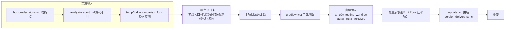

# design.md — 阅读M 功能借鉴整体实施设计（三视角通盘版）

> 本文档为**实施就绪级**设计。每个 Borrow 功能点均含五要素设计卡：**前端入口**（产品视角：用户在哪里操作/如何触发）→ **后端数据流**（架构视角：完整调用链）→ **代码改动**（架构视角：文件+函数+行号+具体改法）→ **集成测试**（测试视角：用例+验证脚本）→ **回归风险**（测试视角：影响面+缓解）。
> P0/P1（B1-B7）已完成源码级验证（改法精确到行）；P2（B8-B16，含 B11-B16）为中深设计（入口+链路+改动点已定，实施前按 AD-02 再核 fork 源码）。

## Technical Approach

### 阶段总览

```mermaid
flowchart LR
    subgraph 分析产物（已完成）
        R[analysis-report.md<br/>9领域分析+版本基线] --> D[borrow-decisions.md<br/>Borrow15/Evaluate13/Not15]
    end
    D --> A[阶段A P0<br/>网络层+规则引擎 4项]
    D --> B[阶段B P1<br/>数据安全 3项]
    D --> C[阶段C P1-P2<br/>阅读+稳定性 3项]
    D --> E[阶段D P2<br/>优化补缺 5项]
    A --> V1[test + 真机验证<br/>quick_build_install.py]
    B --> V2[test + 覆盖安装验证<br/>101→102迁移]
    C --> V3[test + 真机验证]
    E --> V4[test + 真机验证]
```

---

### 日志埋点总纲（全部 15 项，支撑真机验收）

> **目的**：用户要求新增功能点全部可观测。统一使用本项目唯一带 TAG 的日志入口 `AppLog.putDebugWithTag(tag, message, throwable, level)`（`constant/AppLog.kt:123`，recordLog 关闭时 ERROR/WARN/INFO 仍输出 logcat，可 `adb logcat -s <Tag>` 过滤供 ai_tests）。❌ 禁用 Timber / android.util.Log。
>
> **TAG 常量**：在 `constant/AppLog.kt` L12-27 现有 11 个 TAG 后追加 15 个（`TAG_CRYPTO_SCOPE = "CryptoScope"` 等），命名遵循 `TAG_XXX` 规范。
>
> **采集方式（真机）**：`adb logcat -s CryptoScope:V Decompress:V ...` 或全量 `adb logcat | grep -E "CryptoScope|Decompress"`；正式包 recordLog 默认关但 ERROR/WARN/INFO 仍进 logcat，用户回传日志即可逐项核对。

| 功能 | TAG | 关键埋点（触发时机 → 级别） |
|------|-----|------------------------------|
| B1 CryptoJS | `CryptoScope` | cryptoScope 缓存命中→INFO；asset 首次读取成功(含 size)→INFO；eval 异常→ERROR；asset 加载失败→ERROR |
| B2 Brotli | `Decompress` | br 响应解压成功(host)→INFO；解压异常回退透传→ERROR(throwable) |
| B3 resolveIp | `AnalyzeUrl` | 反序列化前检测到 `"resolveIp"` 旧键→INFO；dnsIp 生效(value)→INFO |
| B4 网络日志 | `HttpLog` | 慢请求>3000ms / status>=500 / error 非空→INFO/ERROR；开关切换→INFO |
| B5 搜索上限 | `SearchStorage` | 单条整跳(含超限字段清单)→WARN；字段截断(字段+字节数)→INFO |
| B6 URL 迁移 | `BookOriginMigrate` | 检测到 URL 变更(old/new)→INFO；迁移完成(受影响行数)→INFO；迁移异常→ERROR |
| B7 回收站 | `SourceRecycleBin` | 回收入库(type/count/保留至)→INFO；恢复成功(type/key)→INFO；清理过期(count)→INFO；恢复冲突/解析失败→WARN |
| B8 特殊内容 | `SpecialContent` | protect 占位(useHtml/img/newpage 计数)→INFO；restore 成功(残留=0)→INFO；restore 残留占位符→ERROR |
| B13 内存监控 | `MemoryPressure` | onTrimMemory 级别+内存快照→INFO；实际降级执行→WARN；节流跳过→DEBUG(高频降噪) |
| B9 书架进度 | `ShelfProgress` | 开关切换→INFO；readProgress 计算异常→ERROR(低频) |
| B11 缓存分项 | `CacheStats` | 分项统计完成(各维度字节)→INFO；分项删除完成(释放字节)→INFO；删除异常→ERROR |
| B12 并发率 | `CacheConcurrent` | 限流注入(source/旧值/生效值)→INFO；设置变更→INFO；任务结束恢复→INFO；实际等待→INFO |
| B14 WebDAV | `WebDavBackup` | 删除成功/失败(HTTP code)→INFO/ERROR；重命名成功/失败(HTTP code)→INFO/ERROR |
| B15 高亮样式 | `HighlightStyle` | 捕获组解析完成(组数)→INFO；未知标签跳过→WARN；颜色解析失败→WARN；正则超时→WARN |
| B16 批注导出 | `ThoughtExport` | Markdown 生成完成(条数/字节)→INFO；API 导出成功/失败→INFO/ERROR；本地导出成功/失败→INFO/ERROR；全量汇总→INFO；自动导出静默失败→WARN |

> **降噪策略**：高频路径（B13 节流跳过、B12 每次等待）用 DEBUG 级（recordLog 关时不出 logcat）；常规成功路径 INFO；异常/冲突 WARN/ERROR 且透传 throwable。bookUrl 等长串经 `truncateSafely`（AppLog.kt:48）自动截断，无需手动。

---

### 阶段 A：网络层 + 规则引擎（P0，一次合并实施）

#### B1 内置 CryptoJS（P0）

- **前端入口**：无新增 UI。书源编辑页中任意规则字段（搜索/详情/正文/URL 的 `@js:`/`{{js}}`/`<js></js>` 表达式）与登录 JS，以及**订阅源编辑页的 ruleTitle/ruleDescription/ruleContent/ruleImage/ruleLink 等 JS 规则**，可直接调用 `CryptoJS.MD5/SHA256/AES/DES/RC4/PBKDF2`。用户价值：无 jsLib 的 JSON 书源/订阅源不再需要网络下载加密库。
- **后端数据流**：
  `书源/订阅源规则 → AnalyzeRule.evalJS / AnalyzeUrl.evalJS / BaseSource.evalJS → getShareScope()（help/source/BaseSourceExtensions.kt:11-13）→ SharedJsScope.getScope(jsLib, ctx) → jsLib 空 → 【新增】getCryptoScope()（assets 读 cryptojs.min.js + Rhino eval + LruCache(8) 缓存）→ scope 作为 prototype → RhinoScriptEngine.eval`。**`getShareScope()` 是 `BaseSource` 接口扩展，`BookSource`/`RssSource`/`HttpTTS` 均实现 `BaseSource`（RssSource.kt:128），订阅源解析（`Rss.kt` + `RssParserByRule.kt` 均实例化 AnalyzeRule/AnalyzeUrl）与书源共用同一注入点，一处改动三链路生效。**
- **代码改动**（已核实注入点）：
  1. 新增 asset `app/src/main/assets/scripts/cryptojs.min.js`（**legados 实测 64KB**，webpack 打包 crypto-js，MIT 许可内嵌文件头 `(c) 2012 by Cédric Mesnil`，无需额外 LICENSE.md）
  2. `model/SharedJsScope.kt`：加 `CRYPTO_JS_ASSET` 常量 + `@Volatile cryptoJsText` + `@Volatile cryptoScope: WeakReference<Scriptable>?` + `cryptoLock` + `loadCryptoJs()`（asset 惰性读取 + 失败缓存 ERROR_KEY）+ `getCryptoScope(coroutineContext)`（缓存→synchronized 二次检查→eval→preventExtensions→WeakReference 缓存，参考 legados L32-73）；**`getScope()` 内先 `loadCryptoJs()?.let { RhinoScriptEngine.eval(it, scope) }` 再 eval jsLib**（参考 legados L132-134，保证共享 scope 全局带 CryptoJS）
  3. **3 个回退调用点**（参考源共 4 处回退，本项目对应 3 处，均需加 `?: SharedJsScope.getCryptoScope(...)`）：
     - `help/source/BaseSourceExtensions.kt:11-13`：`getShareScope()` jsLib 空时回退 `getCryptoScope()`（覆盖 BaseSource.kt:336/AnalyzeUrl.kt:384/AnalyzeRule.kt:852 三条 evalJS 链路，书源+订阅源+HttpTTS 通用）
     - `AnalyzeRule.kt:852`：`getShareScope(...) ?: topScopeRef?.get() ?: getCryptoScope(...)`
     - `AnalyzeUrl.kt:384`：`source?.getShareScope(...) ?: getCryptoScope(...)`
  4. 回退失败返回 null 时，3 个调用点已有 `if (sharedScope == null)` 空白兜底分支，无需额外处理
- **日志埋点**（TAG `CryptoScope`）：`loadCryptoJs()` 读取成功→`INFO "CryptoScope: asset loaded, size=$size"`；`getCryptoScope()` 缓存命中→`INFO "cache hit"`；eval 抛异常→`ERROR(throwable)`；asset 加载失败→`ERROR(throwable)`
- **集成测试**：
  - 单元：新增 `SharedJsScopeTest`——`getCryptoScope()` 后 eval `CryptoJS.MD5("legado")`，与 `io.legado.app.utils.MD5Utils.md5Encode("legado")` 比对一致；再测 `CryptoJS.SHA256` 固定向量
  - 真机：测试包 `io.legado.miss.app.debug`，导入无 jsLib 书源（URL 规则含 `@js:CryptoJS.MD5(...)`），搜索/详情正常；复测常见 jsLib 书源（有 jsLib 时仍走 getScope，行为不变）
  - 性能：LruCache 命中后第二次 eval 无额外耗时（Rhino scope 缓存生效）
- **回归风险**：低。① 空 jsLib 书源 scope 从"空白"变为"含 CryptoJS"，全局变量增加一个 `CryptoJS`，与用户 JS 变量冲突概率极低（先 `typeof CryptoJS` 判定防护）；② asset 约 100KB，包体微增；③ `preventExtensions` 语义与现有 jsLib scope 一致，不破坏隐性全局变量机制。

参考 fork：`temp/forks-comparison/legados/app/src/main/java/io/legado/app/model/SharedJsScope.kt:32-73`

#### B2 Brotli 解压（P0，OkHttp 通道）

- **前端入口**：无 UI，透明网络层优化。用户价值：OkHttp 通道（Cronet 已支持）也能解压 br 响应，部分强制 br 的 CDN 站点可正常抓取。**书源与订阅源请求同链路生效**（订阅源列表/正文/搜索均走 `AnalyzeUrl`/`SourceNetworkClient` → 全局 `okHttpClient`）。
- **后端数据流**：`书源/订阅源 HTTP 请求 → 全局 okHttpClient（HttpHelper.kt:188 挂 DecompressInterceptor）→ 声明 Accept-Encoding: gzip, deflate, br → 响应 Content-Encoding: br → BrotliInputStream 解压 → 重建 ResponseBody（移除 Content-Encoding/Content-Length）`
- **代码改动**（legadoT 同构，3 处小改 + 1 依赖）：
  1. `gradle/libs.versions.toml`：加 `brotli = "0.1.2"`（legadoT 实测版本） + `brotli-dec = { module = "org.brotli:dec", version.ref = "brotli" }`
  2. `app/build.gradle` dependencies：`implementation(libs.brotli.dec)`（纯 Java 实现，无 JNI，兼容 minSdk=23）
  3. `DecompressInterceptor.kt:21`：`Accept-Encoding` 改为 `"gzip, deflate, br"`
  4. `DecompressInterceptor.kt:32-36`：`when(encoding)` 加 `"br" -> BrotliInputStream(body.byteStream()).source().buffer()`；**br 分支内 try-catch，解压异常回退原样透传（防个别坏 br 响应崩请求链）**——这是本项目新增项（legadoT 无 catch，直接上抛）
- **日志埋点**（TAG `Decompress`）：br 分支构造 source 成功后→`INFO "br handled, url=${host}"`；try-catch 捕获异常→`ERROR(throwable) "br inflate failed, fallback passthrough"`（catch 后移除 Content-Encoding/Content-Length 头、原样返回 body）
- **通道说明**：Cronet 通道已 enableBrotli（`lib/cronet/CronetHelper.kt:76` Java 回退分支 L92），由 Cronet 透明解压并剥离 Content-Encoding；本项目 br 分支服务 OkHttp 通道（非 Cronet / Cronet 降级路径），两条通道互不影响，DecompressInterceptor 在 Cronet 拦截器之后执行（HttpHelper.kt:188）
- **集成测试**：
  - 单元：构造 br 编码的 MockWebServer 响应（BrotliOutputStream 预压缩），经拦截器断言解压后 body 与原文一致、Content-Encoding 头被移除
  - 真机：用强制 br 的测试 URL（或 Charles/代理改写 Content-Encoding），书源搜索/正文正常
- **回归风险**：低。① 新依赖纯 Java 无 native；② `Accept-Encoding` 是协商式，服务器不支持 br 会回退 gzip/deflate；③ Range 请求仍不声明 Accept-Encoding（现有逻辑已处理，DecompressInterceptor.kt:19）；④ Cronet 通道已有 br（lib/cronet/CronetHelper.kt:76），两条通道互不影响。

参考 fork：`temp/forks-comparison/legadoT/app/src/main/java/io/legado/app/help/http/DecompressInterceptor.kt:10,23,37`

#### B3 旧书源 resolveIp 兼容（P0）

- **前端入口**：无新增 UI。用户价值：旧书源/旧订阅源（字段名 `resolveIp`）导入即生效，无需手工改成 `dnsIp`。
- **后端数据流**：`书源/订阅源 URL 字符串 → AnalyzeUrl.analyzeUrl（AnalyzeUrl.kt:224-274；Rss.kt:54,104,160,306 订阅源请求同样实例化 AnalyzeUrl）→ paramPattern 截取 {…} 参数段（:226-234）→ GSONStrict.fromJsonObject<UrlOption>（:235，Gson+Strictness.STRICT，注解机制不受影响）→ @SerializedName(alternate) 把 resolveIp 映射到 dnsIp → getDnsIp()（:265）→ customIp LruCache / dns{} 覆盖（:626-640）`
- **代码改动**（已核实）：
  1. `AnalyzeUrl.kt:858`：`private var dnsIp: String? = null,` 加注解 `@SerializedName(value = "dnsIp", alternate = ["resolveIp"])`，需 import `com.google.gson.annotations.SerializedName`（全文件当前 grep `@SerializedName` = 0 命中，仅 dnsIp 一处新增；`@Keep` 已存在于 L829，ProGuard 不混淆）
  2. `setDnsIp`（:968 现裸赋值）：补 `value?.trim()`（对齐 LegadoTeam L976）
- **日志埋点**（TAG `AnalyzeUrl`）：反序列化前（:234-235 之间）对 `urlOptionStr` 正则 `["']resolveIp["']` 预扫描，命中→`INFO "legacy alias resolveIp detected"`；:265 `dnsIp = option.getDnsIp()` 非空→`INFO "dnsIp applied, value=$dnsIp"`（IP 非敏感可完整打）

> **实施偏差（2026/08/06）**：TAG 实际复用现有 `AppLog.TAG_ANALYZE`（值 `"AnalyzeRule"`），未新增 `TAG_AnalyzeUrl`。原因：AnalyzeUrl 与 AnalyzeRule 共用 setDnsIp 链路、归属同一日志域，AppLog 已存在 14 个 B 系列 TAG，避免 TAG 碎片化。真机过滤命令改为 `adb logcat -s AnalyzeRule:I`。（决策待用户确认，见交付汇报）
- **集成测试**：
  - 单元：`GSONStrict.fromJson<UrlOption>` 分别喂 `{"dnsIp":"1.2.3.4"}` 与 `{"resolveIp":"1.2.3.4"}`，断言两者 getDnsIp 均为 `1.2.3.4`；新增 `AnalyzeUrlTest` 验证带 `{...resolveIp...}` 的完整书源 URL 解析
  - 真机：导入含 `resolveIp` 的旧书源，抓包确认请求命中指定 IP（或 DNS 覆盖生效）
- **回归风险**：极低。纯注解兼容，不影响现有 dnsIp 书源；Gson strictness 只影响未声明字段的解析严格性，不影响已声明字段的 alternate 映射。

参考 fork：`temp/forks-comparison/LegadoTeam_legado/app/src/main/java/io/legado/app/model/analyzeRule/AnalyzeUrl.kt`（commit 1370e7440 #573）

#### B4 网络日志（敏感头脱敏，P1）

- **前端入口**：设置 → 通用 → 日志：新增"记录 HTTP 日志"开关（`AppConfig.recordNetworkLog`，默认 **false**，参考源用独立开关 `recordNetworkLog` 而非 `recordHttpLog`）。开启后书源/订阅源请求摘要（含敏感头脱敏）可查。用户价值：网络问题可自助定位，敏感信息不落盘。
- **后端数据流**：`HttpHelper 构建 OkHttpClient（help/http/HttpHelper.kt:188）→ recordNetworkLog=true 时挂 NetworkLogInterceptor（参考源挂在 OkHttpExceptionInterceptor 之后，本项目对应 L141 后位序）→ 书源+订阅源所有请求/响应摘要 → 内存环形缓冲 + 可选 LogUtils 落盘`
- **代码改动**：
  1. 新增 `help/http/NetworkLog.kt`（移植 legado_NG 核心 298 行，去 UI 依赖）：`sensitiveHeaderNames`（10 项：authorization/proxy-authorization/cookie/set-cookie/x-api-key/api-key/x-auth-token/x-access-token/x-csrf-token/csrf-token）、`redactUrlForLog`（正则去 query 中 access_token/api_key/token/secret/password 值）、`data class Entry(id/time/source/type/method/url/statusCode/tookMs/requestHeaders/requestBody/responseHeaders/responseBody/error + summary/detail)`、`MAX_LOG_SIZE=500` 环形缓冲 + `BODY_PREVIEW_SIZE=512KB`
  2. 新增 `help/http/NetworkLogInterceptor.kt`（46 行移植，应用拦截器，`isEnabled` 关时直接透传；计时后 record，异常 record+rethrow）
  3. `AppConfig.recordNetworkLog`（默认 false，对应 `PreferKey.recordNetworkLog`）
  4. `HttpHelper.kt`：按开关条件挂拦截器
  - **落盘决策**：参考源**纯内存不落盘**（仅 UI `NetworkLogDialog` 手动导出）。本项目按用户"回传日志分析"需求**增加落盘**：追加 Entry 时同时 `LogUtils.d(tag, entry.detail)` 写 `externalCacheDir/logs/`，复用现有 7 天清理（LogUtils.kt:61-68）零新基建
- **集成测试**：
  - 单元：构造含 `Authorization`/`Cookie` 的请求与响应，断言脱敏后不包含原始值；`redactUrlForLog` 对含 `?token=xxx` URL 输出不含 token
  - 真机：开启开关 → 书源搜索 → 打开日志文件，确认摘要可读且无敏感头；关闭开关 → 无新日志
- **回归风险**：低。拦截器只读不改；默认关零开销；脱敏保证不泄漏。
- **日志埋点**（TAG `HttpLog`）：慢请求 `tookMs>3000`→INFO（含脱敏 summary）；`statusCode>=500`→ERROR；error 非空→ERROR；开关切换→INFO

参考 fork：`temp/forks-comparison/legado_NG/app/src/main/java/io/legado/app/help/http/NetworkLog.kt`

---

### 阶段 B：数据安全（P1，一次合并实施）

#### B5 搜索存储字节上限（P1）

- **前端入口**：无 UI，透明防崩溃。用户价值：搜索返回超大结果的坏书源不再触发 CursorWindow 崩溃（关联 app-stability-round2 P1-1 SQLiteBlobTooBig）。
- **后端数据流**：`搜索 → model/webBook/SearchModel.kt 保存/解析（:32-234）→ 单条结果字节校验（SearchBookStoragePolicy，MAX_STORED_ROW_BYTES=512KB，各字段逐项上限）→ 超限截断/跳过并记日志 → Room searchBooks 表`
- **代码改动**：
  1. 新增 `data/entities/SearchBookStoragePolicy.kt`（移植 Rimchars 186 行：`MAX_STORED_ROW_BYTES=512KB` + 13 字段逐项上限 + `sanitize(book): SearchBook?`——标识字段 bookUrl/origin/name/author/tocUrl/variable 任一超限返回 null 整条跳过；展示字段 originName/kind/wordCount/latestChapterTitle/chapterWordCountText 用 `takeUtf8Bytes` 截断、coverUrl 超限置 null、intro 用 `limitTaggedText` 保留标签完整性）
  2. `data/dao/SearchBookDao.kt`：现 `insert` 改名为 `insertRaw`（@Insert 裸插），新增 `@Transaction insert` 包装——逐条 `sanitizedForStorage()`，null 跳过返回 -1L，16 条一批 flush（参考 L96-125）；**同步加 SQL 守卫常量** `SAFE_SEARCH_BOOK_ROW` 追加到所有 SELECT 查询（防存量脏数据物化崩溃）+ `clearUnsafeRows()` 清理存量
  3. 5 个 insert 调用点（SearchModel.kt:114 / ExploreShowViewModel / AddToBookshelfDialog / ChangeCoverViewModel / ChangeBookSourceViewModel）无需改，DAO 层一处覆盖全部来源
- **集成测试**：
  - 单元：构造 >512KB 的假 SearchBook 字段，断言被截断/跳过且不抛异常
  - 真机：用超大响应书源搜索，连续翻页无崩溃；对照修复前行为
- **回归风险**：中低。改动在搜索结果写入路径，需回归书源搜索聚合与"搜索-缓存-书架"链路；对正常小结果零影响（校验只拦截超限行）。
- **日志埋点**（TAG `SearchStorage`）：`insert` 包装内 sanitize 返回 null（整条跳过）→`WARN "跳过存储: origin=<源> name=<书> bookUrl=<截断> totalBytes=<storedUtf8ByteCount>"`；字段截断仍入库→`INFO "字段截断: origin=.. name=.."`（低频 WARN 起防搜索高频刷屏）。**实现注记**：Policy 保持纯函数（不内嵌 AppLog，JVM 单测可全量覆盖），日志实际埋在 SearchBookDao @Transaction insert 包装内

参考 fork：`temp/forks-comparison/Rimchars_legado/app/src/main/java/io/legado/app/data/entities/SearchBookStoragePolicy.kt`

#### B6 书源 URL 变更迁移书架书籍（P1）

- **前端入口**：我的 → 书源管理 → 编辑书源 → 修改"书源URL" → 保存 → 若检测到 N 本书记载此旧 URL，弹窗"是否将书架中 N 本书迁移到新源？"（是/否）。
- **后端数据流**：`BookSourceEditActivity.saveSource()（VM.save 的包装方法，4 处 menu 调用均改走它；参考 Suml-1 saveSource 模式）→ viewModel.save 成功后 → urlChanged && oldUrl!=null → hasBookByOrigin(oldUrl)（BookDao）→ alert 弹窗 → 确认后 updateOrigin(oldUrl, newUrl)（BookDao @Query）→ 受影响行数日志 → 完成`
- **代码改动**：
  1. `BookDao.kt`：加 `@Query("update books set origin = :newUrl where origin = :oldUrl") fun updateOrigin(oldUrl, newUrl): Int` + `@Query("select exists(select 1 from books where origin = :origin)") hasBookByOrigin(origin): Boolean`（参考 Suml-1 L116-120）
  2. `BookSourceEditActivity.kt` 新增 `saveSource(source, onSuccess)` 私有方法（照 Suml-1 :657-690）：VM.save 成功后 URL 变化且 `hasBookByOrigin` → AlertDialog；确认迁移则 `withContext(IO) { updateOrigin }`（updateOrigin 在 VM 内删旧源逻辑之后执行，修孤儿书）+ `affected` 行数日志；取消直接 onSuccess。4 处 `viewModel.save(getSource())`（menu_save/menu_debug_source/menu_login/menu_search）改走 saveSource；menu_set_source_variable 仍走原 setSourceVariable() 内 save
  3. `strings.xml`：补 `migrate_book_origin_title/msg/yes/no` 4 个文案（中英双语）
  4. 注意：本项目"换源"是逐本 migrateTo（ReadBookViewModel.kt:287-305），本次仅补**批量 origin 迁移**，两者并存不冲突
- **集成测试**：
  - 单元：构造 books 表数据，断言 `updateOrigin` 只改指定 origin 行、返回受影响行数
  - 真机：书架 N 本书 → 编辑书源换域名保存 → 弹窗确认 → 书架书籍仍可点击进正文；阅读进度不受影响
- **回归风险**：中。改动书源保存主流程，需回归：普通保存（URL 未变不弹窗）、新建书源（无 oldUrl 不弹窗）、迁移后书籍可读。
- **日志埋点**（TAG `BookOriginMigrate`）：检测到 URL 变更→`INFO "old=$oldUrl new=$newUrl"`；`updateOrigin` 返回 n>0→`INFO "迁移完成 受影响=$n"`；异常→`ERROR(throwable)`

参考 fork：`temp/forks-comparison/Suml-1_Legado_Max/app/src/main/java/io/legado/app/data/dao/BookDao.kt:119` + `BookSourceEditActivity.kt:655-678`

#### B7 规则回收站（P1，Room 迁移）

- **前端入口**：设置开关 `sourceRecycleBinEnabled`（默认 **false**）；开启后：书源/订阅源/替换规则/TTS/字典/高亮/目录规则 7 类规则删除 → 进回收站（7 天）；"源管理"内新增回收站入口 → 列表 → 恢复（可选覆盖/冲突检测）/彻底删除。
- **后端数据流**：`删除规则（7 类删除入口）→ SourceRecycleBinHelp.recycle()（help/source/SourceRecycleBinHelp.kt，RETENTION_DAYS=7，TYPE_* 常量）→ 序列化 payload → sourceRecycleBin 表 → 恢复时 restore(overwrite) 反序列化回写对应表 → cleanupExpired 定时清理`
- **代码改动**（Room 版本风险最高，见 AD-03）：
  1. 新增 `data/entities/SourceRecycleBin.kt` + `data/dao/SourceRecycleBinDao.kt`（新表 `sourceRecycleBin`，参考 youfengknight：type/key/name/groupName?/payload/deletedAt/expireAt + 索引 type/key/expireAt）
  2. `AppDatabase.kt`：entities 加表，version 101→102（:79）
  3. `DatabaseMigrations.kt`：手动 `MIGRATION_101_102`（CREATE TABLE IF NOT EXISTS + 索引），禁 AutoMigration（本项目 89→101 已是手动链）
  4. 新增 `help/source/SourceRecycleBinHelp.kt`（移植 youfengknight 220 行：recycle/restore/cleanupExpired/hasConflict，`TYPE_*` 常量；restore 反序列化 `getOrNull() ?: return` 静默失败）
  5. `AppConfig.sourceRecycleBinEnabled`（默认 false，对应 PreferKey）
  6. **类型裁剪**：参考源 8 类含 SEARCH_ENGINE（依赖项目不存在的 ReadWebSearchPanel/SearchEngine），本项目**裁剪为 7 类**（book_source/rss_source/replace_rule/txt_toc_rule/http_tts/dict_rule/highlight_rule）；删除入口接线：`SourceHelp.deleteBookSourceParts/deleteBookSources/deleteBookSource/deleteRssSources/deleteRssSource`（:108-160，5 方法回收钩子）+ ReplaceRuleController L47 / DictRuleViewModel L27 / TxtTocRuleViewModel L20 / SpeakEngineDialog L333 / HighlightRuleConfigDialog L253
  7. UI 三件套：参考源为 Compose（`ui/source/recycle/` Activity/Screen/ViewModel），本项目 UI 多为传统 View，**按本项目风格重写为 View 版**（Activity + ViewModel + adapter）
- **集成测试**：
  - 单元：`SourceRecycleBinHelp` 单测——recycle→restore(overwrite=true/false)→cleanupExpired 过期清理；`hasConflict` 冲突检测
  - 迁移：**覆盖安装验证 101→102**（旧包 → 新包升级，数据不丢、表结构正确）；`MIGRATION_101_102` 用 `MigrationTestHelper` 跑 schema 验证
  - 真机：关闭开关时删除直接删（原行为）；开启后删除进回收站 → 恢复可选覆盖 → 冲突检测弹窗
- **回归风险**：中高（Room 迁移）。缓解：手动迁移幂等建表；覆盖安装全量回归（书架/书源/订阅/高亮数据不丢）；开关默认关不影响现删除行为。
- **日志埋点**（TAG `SourceRecycleBin`）：recycle insert 后→`INFO "回收入库 type=.. count=.. 保留至=.."`；restore 成功→`INFO "恢复成功 type=.. key=.. name=.. overwrite=.."`；cleanupExpired 后→`INFO "清理过期 count=.."`（需把 deleteExpired 改为返回 Int）；冲突/解析失败→`WARN "恢复冲突/失败 type=.. 原因=.."`

参考 fork：`temp/forks-comparison/youfengknight_Legado_Max/app/src/main/java/io/legado/app/help/source/SourceRecycleBinHelp.kt`

> **实施状态（2026/08/06）**：已全部完成（tasks.md 2.3.1-2.3.7 勾选，2.3.8 真机待用户）。实际落地偏差记录：
> 1. UI 三件套已按本项目 View 风格实现：`ui/source/recycle/`（RecycleBinActivity + RecycleBinViewModel + RecycleBinAdapter + activity/item 布局 + recycle_bin/recycle_bin_sel 菜单），入口在"源管理-书源管理"菜单 menu_recycle_bin（ic_restore）跳 RecycleBinActivity；恢复时 hasConflict→弹窗可选覆盖。
> 2. 高亮规则删除钩子实际接在 `HighlightRuleViewModel.delete`（ui/highlight/），非 design 预估的 HighlightRuleConfigDialog（该对话框无删除入口，已核实）。
> 3. `pref_config_other.xml` 已加 sourceRecycleBinEnabled SwitchPreference（AppConfig 已处理 key，无需 OtherConfigFragment 改动）。
> 4. `MigrationTestHelper` 新增 `migrate101To102` 专项测试（MigrationTest.kt），验证建表幂等。
> 5. `SourceRecycleBinHelpTest` 为 JVM 单测（8 测试）：7 常量 + 各类型 payload GSON 往返 + malformed 失败断言；recycle/restore/cleanupExpired 的 DAO 路径依赖 Android 环境，留待真机 2.3.8 验证。
> 6. 顺带修复 androidTest 基线编译问题：DaoTest.kt 的 `kotlin.test.*` 引用改为 `org.junit.Assert.*`（androidTest classpath 无 kotlin-test，原文件无法编译）。

---

### 阶段 C：阅读 + 稳定性（P1-P2，独立小步）

#### B8 特殊内容保护（P1）

- **前端入口**：无 UI，透明。用户价值：正文含 `<usehtml>`/``/`[newpage]` 的章节在净化/分段后格式块保持完整。
- **后端数据流**：`正文获取 → 净化/分段流程（help/book/ContentProcessor.kt getContent()）→ 预处理占位保护（SpecialContentProtector.protect）→ 替换净化规则 → 还原占位符（restore）`
- **代码改动**（已核实本项目现状，3 处缺口 + 1 处改进）：
  1. 新增 `help/book/SpecialContentProtector.kt`（legados 41 行移植：`imgRegex` + `newPageRegex`，PUA 占位键 `"\uE000LEGADO_SPECIAL_${n}\uE001"`，protect/restore + `ProtectedContent` data class）
  2. **接入点**：`ContentProcessor.getContent()` 替换净化阶段（本项目 :160-195），protect 包裹（:180 protect → 替换规则 :181 → :213 restore）
  3. **`` 未保护（最大缺口）**：本项目替换规则直接跑在含 `` 的原文上，用户正则规则可误伤图片标签——`ImageProvider.kt:186-189` 注释「src为空白时 可能被净化替换掉了」即现实佐证。保护范围必须含 imgRegex
  4. **`[newpage]` 未保护**：分页符在替换净化阶段会被替换规则删掉（TextChapterLayout.kt:329-341 按 `text == "[newpage]"` 整段匹配分页，删除即失效）
  5. **usehtml 占位符改进**：本项目 useHtmlMap 占位符是**可见中文文本**「特殊格式的占位不应该被看见N。」（:152-159），用户替换规则恰好匹配会残留显示；legados 用 PUA 字符规避碰撞——Borrow 时统一改为 PUA 占位
  - 可选同步：`model/webBook/BookContent.kt` 抓取阶段（:236-250 usehtml 占位 `{usehtml_N}` → HtmlFormatter.formatKeepImg）视需要同步（该处主要防护 formatKeepImg 前的 usehtml）
- **集成测试**：单元构造含三种特殊内容的正文，净化后断言格式块完整；真机打开此类章节肉眼核验。
- **回归风险**：中。改动正文处理主链路，需回归常规净化/替换规则不回归（保护只在命中特殊标签时启用）。
- **日志埋点**（TAG `SpecialContent`）：protect 后（命中任意占位）→`INFO "protect useHtml=$n img=$n newpage=$n"`；restore 后残留校验（含 `\uE000LEGADO_SPECIAL_`）→ 残留=0 `INFO "restore ok"` / 残留>0 `ERROR "restore FAIL residual=$n"`；restore 异常→ERROR(throwable)；TextChapterLayout 分段渲染前（:334 附近）做兜底残留检测

参考 fork：`temp/forks-comparison/legados/app/src/main/java/io/legado/app/help/book/SpecialContentProtector.kt`

#### B13 内存压力监控（P2）

- **前端入口**：无 UI，系统触发。用户价值：低内存设备浏览大量图片时系统 onTrimMemory 触发降级，减少闪退。
- **后端数据流**：`系统 onTrimMemory/onLowMemory → App 回调（App.kt，参考 legados :155-167）→ MemoryPressure.shouldTrimNow()（1.5s 节流 throttleTrim，参考 :47-53）→ trimAppMemory(level) 联动 6 处缓存降级`
- **代码改动**（**最大遗漏点：本项目 6 个缓存类均无 trimMemory 函数，只建 MemoryPressure 则回调无实际动作**）：
  1. 新增 `help/MemoryPressure.kt`（legados 90 行移植：maxMemory/isSmallHeap/shouldTrimNow/trimLevelForCurrentState/throttleTrim/setTrimCallback/trimNow/trimIfNeeded/dispatchTrim）
  2. `App.kt`：`onTrimMemory(level)` + `onLowMemory()`（CRITICAL + Glide.clearMemory）+ `memoryTrimRunnable` 轮询（小堆 3s/大堆 10s，参考 :79-85）+ `setTrimCallback(::trimAppMemory)` + `trimAppMemory(level)` 联动函数（参考 :169-179）
  3. **联动降级（6 处全缺，逐一补）**：
     - `ImageProvider.kt`：加 `trimMemory(level)`（>=BACKGROUND/RUNNING_LOW/RUNNING_CRITICAL → clear()+gifFileCache.clear()；UI_HIDDEN/RUNNING_MODERATE → trimToSize(maxSize/2)），挂到现有 `clear()`（:208-210）；`put()` 前调用 `MemoryPressure.trimIfNeeded()`（参考 :95）；`cacheSize` 加堆上限 `min(userSize, maxMemory/8, 8M..64M)`（参考 :50-60）
     - `CacheManager.kt`：`memoryLruCache` 固定 50MB 改动态 `(maxMemory/16).coerceIn(8M, 50M)` + 加 `trimMemory(level)`（参考 :27-30/:78）
     - `WebViewPool.kt`：加 `trimMemory(level)`（销毁 idle/resetting 池，参考 :310-324）
     - `CoverImageView.kt`：加 `trimMemory(level)`（参考 :113-127）
     - `TextLine.kt`：加 `trimBgBitmapCache(level)`（参考 :894-907）
     - `LegadoGlideModule.kt`：`isSmallHeap` 时缩小 `MemorySizeCalculator` 池（参考 :46-56）
  4. 参考源 `App.kt:155-167` 是本项目 `ui/book/manga/ReadMangaActivity.kt:403-406` 的局部 onLowMemory 的全局化（局部保留不冲突）
- **集成测试**：`adb shell am send-trim-memory <pid> BACKGROUND`（或模拟器设置）触发后断言图片缓存容量下降、无崩溃；`MemoryPressureTest`：throttleTrim 1.5s 节流断言。
- **回归风险**：低。回调是增量，只在系统低内存时触发；正常浏览 isSmallHeap 判定阈值（maxMemory<=320MB）可防误触发。
- **日志埋点**（TAG `MemoryPressure`）：onTrimMemory 回调→`INFO "level=$level avail=${availableMemory()}MB used=.. max=.. smallHeap=.."`；trimAppMemory 实际降级→`WARN "trim executed level=$level"`；throttleTrim 跳过→`DEBUG "throttle skip reason=avail/interval"`（DEBUG 级降噪，recordLog 关不出 logcat）

参考 fork：`temp/forks-comparison/legados/app/src/main/java/io/legado/app/help/MemoryPressure.kt`

> **实施状态（2026/08/06）**：已实现并单测通过（MemoryPressureTest 7 项全过，全量单测仅 AnalyzeRuleTest 5 项基线 JVM 环境失败）。
> **实施偏差**：①**TextLine 联动跳过**——本项目 TextLine 无 legados 特供的 bgBitmapCache/bgScaledBitmapCache（用固定容量 CanvasRecorder 池：CanvasPool/PicturePool/RenderNodePool 各 64），trimBgBitmapCache 无适用目标，记录偏差不移植；②MemoryPressure 所有 AppLog 调用包 `kotlin.runCatching`（AppLog.putDebugWithTag 触碰 AppConfig.recordLog，JVM 单测会 NoClassDefFoundError）；③增加测试注入点 `availableMemoryProvider/currentTimeProvider`（internal var）+ `resetForTest()`，生产环境为 null 走真实 Runtime；④ImageProvider 无 gifFileCache，trimMemory 省略该项；⑤CoverImageView 缓存按条目数（nameBitmapCache=33/needNameBitmap=99），trimMemory 只降 nameBitmapCache。

#### B9 书架阅读进度（P2）

- **前端入口**：书架 → 右上角设置/菜单 →"书架显示阅读进度"开关（默认 **false**）。开启后列表底部进度条+百分比、网格封面叠加进度条。
- **后端数据流**：`书架 adapter（ui/main/bookshelf/style1/Grid/List/List2 + style2/Grid/List，共 5 个）→ BookExtensions.readProgress()（基于 durChapterIndex/durChapterPos/totalChapterNum）→ 绘制进度条`
- **代码改动**（**全套 7 项均为空，逐一补**）：
  1. `help/book/BookExtensions.kt`：加 `readProgress(): Float?`（参考 legados :389-394——**未读返回 null**，单章书 totalChapterNum<=1 已读即 1f，`durChapterIndex/totalChapterNum-1` 计算，忽略 durChapterPos）
  2. `constant/PreferKey.kt`：加 `showBookshelfReadProgress`
  3. `help/config/AppConfig.kt`：加 `showBookshelfReadProgress`（默认 false，即时读 pref 模式）
  4. 配置弹窗：`dialog_bookshelf_config.xml` 加 `sw_show_read_progress`（位于 sw_show_unread 与 sw_show_last_update_time 之间）+ `BaseBookshelfFragment.configBookshelf()`（:168-263）读写 + `BOOKSHELF_REFRESH` 事件（参考 legados :199/:237-240）
  5. **5 个适配器**（style1/books/BooksAdapterList+Grid+List2、style2/BooksAdapterList+Grid）：加 `upReadProgress()`（list 显示进度条+百分比、grid 仅进度条；null → gone）；`BaseBookshelfAdapter.getChangePayload()`（:38-67）加 "progress" key 增量刷新
  6. **4 个 item 布局**（item_bookshelf_list/grid/list2/grid2）+ group 变体：加 `pb_read_progress`（`com.google.android.material.progressindicator.LinearProgressIndicator` 高 2dp）+ `tv_read_percent`（list 类 11sp 右侧百分比，参考 legados :192-224）
  7. `strings.xml`：加 `show_bookshelf_read_progress`
- **集成测试**：真机开启后各类书架样式显示进度；关闭后布局无回归；`readProgress()` 单测（未读 null/已读 1f/正常比例/越界钳制）。
- **回归风险**：中。书架 adapter 是核心 UI，改动面分散（5 文件）；默认关保证现有布局零影响。
- **日志埋点**（TAG `ShelfProgress`）：开关切换→`INFO "showBookshelfReadProgress switched -> $value"`；readProgress 计算异常→`ERROR(throwable)`（正常路径 null/正常值不打日志，防书架刷新高频刷屏）

参考 fork：`temp/forks-comparison/legados/app/src/main/java/io/legado/app/help/book/BookExtensions.kt:389`

> **实施状态（2026/08/06）**：B9 已完成。6 项改动全落地（readProgress/PreferKey/AppConfig/配置弹窗/5 adapter+2 BaseBooksAdapter/4 item 布局/strings en+zh）。偏差记录：
> ①**独立 `"progress"` payload key**：design 要求独立 key，fork 实为挂在 `"refresh"` key 上顺带刷新；本项目按 design 在 style1/style2 两个 BaseBooksAdapter.getChangePayload() 加 `durChapterIndex/durChapterPos` 变化判定→`putBoolean("progress",true)`，adapter 端 `"progress" -> upReadProgress(...)`，比 fork 更精细（读进度只刷进度条，不触发 upRefresh）。
> ②**布局约束适配**：本项目 item 布局 tv_last 锚定底部（fork 版 tv_last 在上方），pb_read_progress 插在 tv_read 与 tv_last 之间（list 系：Bottom_toTopOf=tv_last + Top_toBottomOf=tv_read）；grid2 版 pb 加 `Top_toBottomOf=tv_name` 放在书名渐变之下，避免与底部书名重叠。
> ③**readProgress 用裸 totalChapterNum**（同 legados fork），未用本项目 simulatedTotalChapterNum()/readSimulating()（模拟追读场景进度略偏，留待后续可选增强）。
> ④**日志位置**：开关切换 INFO 在 BaseBookshelfFragment okButton 保存处；readProgress 计算异常 ERROR 在 adapter upReadProgress 的 runCatching.onFailure 处（保持 readProgress 纯函数可 JVM 单测）。
> ⑤单测 `BookExtensionsReadProgressTest` 6 项全过；全量 121 tests 仅 5 项 AnalyzeRuleTest 基线失败（非本次引入）。

---

### 阶段 D：优化补缺（P2，独立小步）

#### B11 缓存分项统计（P2）

- **前端入口**：我的 → 缓存管理 → 分项展示（书籍/音频/视频/主题 占用 + 删除临时缓存）。
- **后端数据流**：`CacheManageViewModel（新增）→ 遍历目录级分项：book_cache（书籍文本，BookHelp.cachePath）/ exoplayer（视频，ExoPlayerHelper SimpleCache）/ audio_exoplayer（音频）/ themePackages（主题，只统计不删）→ buildStorageBreakdown 分类 → UI 分项`
- **代码改动**（**需适配本项目现状，简化目录级分项**）：
  1. 新增/改造 `ui/book/cache/CacheManageViewModel.kt`（移植 refgd 核心 loadStats/buildStorageBreakdown/deleteStorageDetail；**裁剪 manifest 书籍级分类**——参考源依赖 CacheManifestHelper 基建本项目无，且本项目 book_cache 只存文本章节，音频/视频在 externalCache/exoplayer）
  2. **四维目录级分项**：`book_cache`(书籍文本)、`exoplayer`(视频)、`audio_exoplayer`(音频)、`themePackages`(主题，参考源该组无 deleteTarget 只统计)
  3. **⚠ AD-05 护栏冲突处理**：`ExoPlayerHelper.kt` 位于 `help/exoplayer/`（护栏目录，禁止改动），**不补 clearAudioCache/clearVideoCache**；`deleteStorageTarget` 改为在 `CacheManageViewModel` 内按路径 `FileUtils.delete(exoplayer / audio_exoplayer 目录)` 直接删除
  4. 删除保护：播放中视频目录加锁（CacheManageViewModel 内检查 ExoPlayer 是否播放中，不触碰护栏内代码）
  5. 尺寸计算：参考源用 native `Os.stat(...).st_blocks * 512`（allocatedSize）+ `directorySize()` 递归，本项目可用 `FileUtils` 现有能力递归 `length()`（无需 native）
- **集成测试**：真机产生各类缓存后断言分项正确、删除生效；单测目录分类统计断言。
- **回归风险**：中低。只读遍历 + 删除按钮，需确认视频缓存目录（exoplayer）不误删正在播放。
- **日志埋点**（TAG `CacheStats`）：buildStorageBreakdown 完成→`INFO "分项统计: 书籍=${..}B 音频=.. 视频=.. 主题=.. 总计=.."`；deleteStorageTarget 完成→`INFO "分项删除完成 target=.. 释放=..B"`；删除 catch→`ERROR(throwable)`

参考 fork：`temp/forks-comparison/refgd_legado/app/src/main/java/io/legado/app/ui/book/cache/CacheManageViewModel.kt`

> 实施状态（2026/08/06）：
> - 四维裁剪为**三维**：①本项目**无 `audio_exoplayer` 目录**，音频缓存实际在 `cacheDir/httpTTS`（HttpReadAloudService ttsFolderPath）→ 音频维度统计/删除该路径；②**本项目无 `themePackages` 目录**（主题为 SharedPreferences 驱动，无独立缓存目录）→ 主题维度跳过
> - 目录级分项实现：`buildStorageBreakdown()` 三维（书籍=BookHelp.cachePath/视频=externalCache/exoplayer/音频=cacheDir/httpTTS）+ `directorySize()`（纯 File.length() 递归，无 native）+ `formatBytes()`
> - 删除保护：视频维度删除前用只读库调用 `GSYVideoManager.instance()?.isPlaying()`（外部库 com.shuyu.gsyvideoplayer，非护栏内文件）判播放中锁定
> - UI：缓存管理页（CacheActivity，书架"下载"进入）菜单新增 `menu_cache_stats`「缓存分项」，selector 展示三维+总计，点击项弹确认删除
> - 日志：统计 INFO/删除 INFO（释放字节）/删除 catch ERROR 均包 `kotlin.runCatching`（保 JVM 单测）
> - 单测 `CacheStorageStatsTest` 6 项（directorySize 递归/缺失/空目录/单文件 + formatBytes 单位换算），全量 127 tests 5 failed（AnalyzeRuleTest 既有基线）

#### B12 缓存并发率（P2）

- **前端入口**：设置 → 缓存 →"缓存并发率"（格式同书源 `次数/毫秒`，如 `20/60000` 或 `1500`）。
- **后端数据流**：`CacheBookService（service/CacheBookService.kt）→ applyRateToAll() 遍历 cacheBookMap 注入 source.concurrentRate（内存字段，不改 DB）→ CacheBook.startProcessJob → ConcurrentRateLimiter 限流 → 任务结束 restoreAllRates() 恢复`
- **代码改动**（**关键兼容差异 + 4 处缺失**）：
  1. `AppConfig.cacheConcurrentRate` + `PreferKey`（参考 youfengknight AppConfig :386-394，null/空=不限制）
  2. `help/ConcurrentRateLimiter.kt`：补 `effectiveRate(userRate, source.concurrentRate)`（取吞吐量更小者）+ `isValidRate` + `throughput`（参考 :53-72/:80-97）；已有 `concurrentRecordMap`/`updateConcurrentRate`（:12/:16-46）
  3. **⚠ 本项目 `fetchStart` 用构造时快照 `private val concurrentRate = source?.concurrentRate`（:57），参考源每次实时读 `source?.concurrentRate`（:129-179）——注入后若不生效必须改为实时读取**（否则 applyRateToAll 注入无效）
  4. `CacheBookService`：`download()` 流程加 `applyRateToAll → startProcessJob → restoreAllRates`；`onDestroy`（:94-100，现直接 cachePool.close()）插入 `restoreAllRates()` 清 `concurrentRecordMap`+`sourceKeyOrder`
  5. UI：`CacheActivity` 加 `menu_cache_rate` 菜单项（标题显示当前值）+ `showCacheRateDialog`（isValidRate 校验非法阻止关闭）+ 3 个 strings（cache_concurrent_rate/cache_rate_desc/cache_rate_hint/cache_rate_invalid）
- **集成测试**：设置后批量缓存速率受限；默认空走原逻辑。
- **回归风险**：低。默认不启用；注入的是内存字段、任务结束恢复，不污染正常阅读请求。
- **日志埋点**（TAG `CacheConcurrent`）：applyRateToAll 注入分支→`INFO "限流注入 source=$key 原=$old 生效=$effective"`；设置变更→`INFO "设置变更 $old -> $new"`；restoreAllRates 完成→`INFO "已恢复 $n 个书源并发率"`；fetchStart 实际等待 waitTime>0→`INFO "限流生效 key=.. 等待${..}ms"`

> 实施状态（2026/08/07）：
> - 全落地（tasks.md 4.2.1-4.2.5 勾选，4.2.6 真机待用户），单测 `ConcurrentRateLimiterTest` 9 项全过（BUILD SUCCESSFUL）。偏差记录：
> - **fetchStart 实时读取**：按 design 设计改为动态 `source?.concurrentRate`（非构造快照），但用 `compute()` 平滑接管——`recordToRate(record)!=sourceRate` 时取 `effectiveRate` 更严者重建 record（`isNewRecord=true`），否则保留旧 record，避免已累积令牌被重建清零
> - **applyRateToAll 遍历源**：fork 用 `CacheBook.getOrCreate(source)` 后循环；本项目改 `CacheBook.cacheBookMap.values`（getOrCreate 已在 addDownloadData 调用过，缓存书必然已注册，无需二次创建）+ `sourceKeyOrder` 去重记录注入过的 key
> - **恢复策略**：`restoreAllRates()` 仅清 `concurrentRecordMap` 对应 key（不限流对象为 `AnalyzeUrl` 的 key=bookSourceUrl）+ 清 `sourceKeyOrder`；`onDestroy` 在 `cachePool.close()` **前**调用（close 后 CacheBook.cacheBookMap 已清，恢复遍历会漏）
> - **日志**：设置变更/注入/恢复/实际等待均包 `kotlin.runCatching`（AppConfig.recordLog JVM 单测会崩，基线 5 failed 根因）；TAG `CacheConcurrent`

#### B14 WebDAV 删除/重命名（P2）

- **前端入口**：我的 → 备份与恢复 → 云端备份列表 → 长按 → 删除/重命名。
- **后端数据流**：`BackupConfigFragment 恢复列表长按菜单 → AppWebDav.deleteBackup/renameBackup → lib/webdav/WebDav.delete()/move()（DELETE/MOVE 方法）`
- **代码改动**（**硬依赖：WebDav lib 必须先补 move()**）：
  1. `lib/webdav/WebDav.kt`：**补 `move(destUrl)`（MOVE 方法 + Destination 头 + `Overwrite: F`，davs://→https:// 转换，参考 Jingshiro :431-451）**——renameBackup 的硬依赖，不补无法重命名；`delete()`（:410-424）已有可复用
  2. `help/AppWebDav.kt`：补 `deleteBackup(name)`（参考 :140-145）+ `renameBackup(oldName, newName)`（@Throws WebDavException，参考 :151-159）；`getBackupFileList()` 可选（本项目 getBackupNames :106-121 只返名无 lastModify，删除/重命名用名字列表即可不阻塞）
  3. `ui/config/BackupConfigFragment.kt`：恢复列表（selector 单选 :347-369）加长按菜单（删除/重命名，参考 CloudBackupActivity L198/L219 行为）；405/501/Not Allowed/Not Implemented → toast `webdav_move_not_supported`（参考 CloudBackupViewModel :56-82）
  4. 若做批量删除需新增 CloudBackupViewModel（参考 :23-54 逐名删除统计 successCount）
- **集成测试**：真机坚果云等 WebDAV 备份删除/重命名成功；单测 delete/rename 请求构造断言。
- **回归风险**：低。独立入口；WebDav lib 只加 move() 不改 delete()。
- **日志埋点**（TAG `WebDavBackup`）：deleteBackup 成功→`INFO "删除备份成功 $name"` / 失败→`ERROR "删除备份失败 $name (HTTP ${code})"`；renameBackup 成功→`INFO "重命名 $old -> $new"` / 失败→`ERROR (HTTP ${code})`（HTTP code 从 WebDavException.message 提取 `response.code:response.message` 或补结构化字段）

> 实施状态（2026/08/07）：
> - 全落地（tasks.md 4.3.1-4.3.5 勾选，4.3.6 真机受限通过——云端删除/重命名需真实 WebDAV 服务器，本地备份/恢复/降级提示已验），单测 `WebDavMoveTest` 6 项全过。偏差记录：
> - **move() 实现**：完全按 fork（MOVE + `Destination` + `Overwrite: F`），`checkResult` 复用现有（失败抛 WebDavException `"url\ncode:message"`，异常 message 含 HTTP code 可被 UI 匹配 405/501）；`davs://`→`https://`/`dav://`→`http://` 抽取为 companion 纯函数 `toHttpUrl()` 供单测
> - **AppWebDav 入口**：deleteBackup/renameBackup 均已补，返回 Boolean；重命名 @Throws WebDavException 向上透传（UI 侧 catch 判 MOVE 不支持）
> - **UI 长按菜单**：selector 单选列表本身无长按能力 → AndroidSelectors.kt 新增 `selector(title, items, onClick, onLongClick)` 重载（show() 后 `dialog.listView.setOnItemLongClickListener`）；恢复列表长按弹 `删除/重命名` 二级菜单，删除前 alert 二次确认，重命名用 DialogEditTextBinding
> - **单测范围**：因无 MockWebServer 依赖（与 ProxyClientCacheTest 已知上限一致），只测 `toHttpUrl` 转换纯函数（davs/https/http/纯路径/查询串 6 例），MOVE 方法与头字段留待真机验证
> - **strings**：新增 rename/rename_backup/input_new_name/rename_backup_success/rename_backup_fail/webdav_move_not_supported/delete_backup_success（en+zh）
> - **日志**：成功用 putDebugWithTag(tag,msg)（默认 ERROR 级别，logcat 可采集），失败用 putDebugWithTag(..., level=ERROR)；TAG `WebDavBackup`；包 runCatching（AppLog JVM 单测基线）

参考 fork：`temp/forks-comparison/Jingshiro_legado/app/src/main/java/io/legado/app/help/AppWebDav.kt:126-170`

#### B15 高亮规则捕获组样式（P2）

- **前端入口**：阅读页 → 高亮规则编辑 → 替换规则加 `isHighlight` + `$N` 捕获组样式（b/i/u/font/span 标签）。
- **后端数据流**：`替换规则 → 现有 HighlightRuleMatcher（help/HighlightRuleMatcher.kt:8-64，不替换）→ 增强：捕获组（$N）样式解析 + LRU 缓存 → 排版渲染`
- **代码改动**（**核心改动点：匹配结果模型需扩展**）：
  1. `ui/book/read/config/HighlightRule.kt`（:135，无 replacement 字段）：加 `replacement` 模板字段 + 可选 `isDotAll`
  2. **新增 `utils/CssStyleParser.kt`**（参考 Jingshiro :70-187）：`parseStyle/parseHtmlStyle/parseColor（#RGB/#RRGGBB/#AARRGGBB+20 颜色名）/extractGroupStyles（正则提取 `<b>..</b>$N..` 组样式）+ groupStylesCache(LRU 100)`
  3. **⚠ 匹配结果模型扩展**：现有 `RuleMatch(start, end, ruleId, style)` 单样式无法表达"组内再分区段"。需在 `HighlightRuleMatcher` 增加"带模板解析"变体，产出**组内子样式段列表**（或 RuleMatch 携带 subSpans），这是 B15 的核心改动（现有 match() 签名无法表达）
  4. **CSS 样式 → 项目 HighlightStyle 通道映射**：参考源 CssStyleParser 的 HighlightStyle（六通道：bold/italic/underline/color/fontSizeSp/fontFamily）与本项目 `help/HighlightStyle.kt` 通道（fill/textColor/bold/italic/underline(kind,color)/strike/box/emphasis/fontPath）结构不同——需映射：CSS color→textColor、font-weight→bold、text-decoration→underline.kind、font-size→项目无字号通道需降级或扩展
  5. LRU 缓存（可选增强）：参考源 content-level LRU（4MB，key 含 content.length/hashCode/rule 全字段），本项目现有整章版本缓存（ReadBook.ruleMatchesOfChapter，`highlightRulesVersion++` 失效）可保持，不强制引入
- **集成测试**：`规则1|规则2` 分组样式正确套用；现有高亮规则不回归。
- **回归风险**：中。高亮引擎是已沉淀能力，只增强不重构，逐条规则回归。
- **日志埋点**（TAG `HighlightStyle`）：extractGroupStyles 解析完成→`INFO "捕获组解析 $n 组"`；LRU 命中→INFO；parseColor null/未知标签→`WARN "样式未知标签跳过 $tag"`；正则超时（matchRegex deadline）→`WARN`；ReadBook.ruleMatchesOfChapter 匹配完成→`INFO "匹配完成 规则$n 命中$n 耗时$ms"`（每章一次频率）

> 实施状态（2026/08/07）：
> - 全落地（tasks.md 4.4.1-4.4.5 勾选，4.4.6 真机已执行），单测 `CssStyleParserTest` 17 项 + `HighlightRuleMatcherTest` 11 项全过，全量 164 tests 仅 AnalyzeRuleTest 5 基线失败无回归。偏差记录：
> - **HighlightRule 字段**：加 `replacement`（捕获组样式模板）+ `isDotAll`（点号匹配换行）；`HighlightRuleStore.sanitizeRule` 与 builtin merge 分支均补字段保留（防保存丢失/内置规则刷新清空）
> - **CssStyleParser（utils/）纯函数无 Android 依赖**：parseStyle/parseHtmlStyle/parseColor（#RGB/#RRGGBB/#AARRGGBB+20 颜色名）/extractGroupStyles + groupStylesCache(LRU 100，`LinkedHashMap(accessOrder=true)` 同步访问，因 JVM 单测不可用 android.util.LruCache)；嵌套 `CssStyle` 六通道 + `toHighlightStyle()` 映射（color→textColor、bold→bold、italic→italic、underline→Underline(SOLID)；font-size/font-family 降级忽略——项目无字号/字体族通道）
> - **HighlightRuleMatcher 变体**：`matchWithTemplate(text, rules)` 与 match() 并存（现有 match() 不替换）；RuleMatch 加 `subSpans: List<SubSpan>`（默认空，旧调用方无感）；规则带 replacement 且 isRegex 时按模板解析组样式 → `mr.groups[i].range` 映射绝对章内偏移产出子段；无样式标签的裸 `$N` 组不产子段（CssStyle 默认 hasStyle=false）；isDotAll 在变体路径生效（RegexOption.DOT_MATCHES_ALL）
> - **ContentTextView 渲染**：设计文件清单外的小偏差——upHighlight 把主命中 Range + 各 subSpan Range 一并 emit（主命中在前、子段在后，HighlightMatcher.resolve 逐通道 last-wins 使子段样式覆盖主样式），否则捕获组样式不显示
> - **ReadBook.ruleMatchesOfChapter**：改调 matchWithTemplate，Rule 映射补 replacement/isDotAll；匹配完成日志 `INFO "匹配完成 规则$n 命中$n 耗时$ms"`（放在缓存命中早退之后，每章实际匹配一次）；AppLog 调用包 runCatching（JVM 单测基线）
> - **日志埋点**：TAG `HighlightStyle` 已存在（AppLog.kt:41）；组解析完成/LRU 命中→INFO；未知标签（parseHtmlStyle 未识别/parseColor null）→WARN；正则超时→WARN
> - **单测范围**：parseColor 各格式/颜色名/非法、parseStyle/parseHtmlStyle 属性与标签、extractGroupStyles 带标签组+裸组+LRU 同实例断言、toHighlightStyle 通道映射、matchWithTemplate 捕获组子段偏移/裸组无子段/空模板退化/isDotAll 跨行/match() 无子段回归
> - **真机补充修复（BUG-D01，2026/08/07）**：真机验证发现 `HighlightRuleEditDialog` 无 UI 读写 replacement/isDotAll（功能端到端不可用）。已补：strings `highlight_rule_replacement`（含 XML 转义示例）+ `highlight_rule_dot_all`；布局 `et_replacement` + `cb_dot_all`；对话框 upView/getRule 字段读写。真机复验通过（详见 issues-found.md）

参考 fork：`temp/forks-comparison/Jingshiro_legado/app/src/main/java/io/legado/app/help/book/ContentProcessor.kt:348-413`

#### B16 想法批注导出（P2）

- **前端入口**：阅读页 → 划线/批注 → 批注对话框新增"导出/分享"→ 导出 .md 或推送 Obsidian（REST API/本地文件双模式）。
- **后端数据流**：`BookHighlight（已有表，data/entities/BookHighlight.kt，字段可完全映射：bookText≈selectedText/note≈thought/time≈createTime）→ ThoughtMarkdownGenerator 生成 .md → ThoughtObsidianExporter（ObsidianApi REST 或本地 vault 文件）`
- **代码改动**（**数据源决策：基于 BookHighlight 零迁移**）：
  1. **数据源决策（必选）**：本项目无 BookThought 表。方案 (a) 基于 BookHighlight 导出（字段完全映射，**零 DB 迁移**，AD-04 已定）✓；(b) 新建 BookThought 表 + Room v89→v90 迁移 + 想法编辑 UI（改动大，否决）
  2. 新增 `ui/book/thought/ThoughtMarkdownGenerator.kt`（参考 Jingshiro 76 行：书名/作者/封面 ``/简介/按 chapterIndex 分组/selectedText+`> thought` 引用+`<font>` 时间+`---`）
  3. 新增 `ui/book/thought/ThoughtObsidianExporter.kt`（参考 105 行：exportBook/exportBookAsync(obsidianAutoExport)/exportAll/generateUniqueFileName/exportViaApi/exportViaLocalFile）
  4. 新增 `ui/book/thought/ObsidianApi.kt`（参考 44 行：putFile URL 逐段 encode + `PUT /vault/{path}` + Bearer + Content-Type markdown；checkConnection）
  5. `AppConfig` 6 配置项 + PreferKey：obsidianExportMethod(0=API/1=本地)/obsidianApiUrl/obsidianApiKey/obsidianVaultSubPath/obsidianLocalDirUri/obsidianAutoExport
  6. UI 入口：`HighlightFragment`（:108 长按菜单）或 `TocActivity` 加"导出到 Obsidian"（参考入口在 TocActivity/AllBookmarkActivity）
- **集成测试**：真机导出 .md 成功；Obsidian REST 推送成功；单测 Markdown/Obsidian 生成断言。
- **回归风险**：低。增量入口；不新表不改批注编辑主流程。
- **日志埋点**（TAG `ThoughtExport`）：generate 完成→`INFO "Markdown 生成 $bookName ${thoughts.size}条"`；exportViaApi 成功→`INFO "API 导出成功 $filePath"` / 失败→`ERROR(throwable)`；exportViaLocalFile 成功→`INFO "本地导出 $fileName"` / IOException→ERROR；exportAll→`INFO "全量导出 成功$success/$total"`；exportBookAsync 静默路径→`WARN "自动导出失败 $bookName"`（参考源静默失败，本项目必须留日志）

> **实施状态**：全落地（tasks.md 4.5.1-4.5.6 勾选，4.5.7 真机已执行），编译通过 + 单测 `ThoughtMarkdownGeneratorTest` 6 项 + `ObsidianApiTest` 5 项全过，全量 175 tests 仅 AnalyzeRuleTest 5 基线失败无回归。偏差记录：
> - `ObsidianApi` 新增 `encodePath(filePath)` 纯函数（逐段 URLEncoder + `+`→`%20`）供单测，`putFile`/`checkConnection` 均用纯函数拼接 vault 路径
> - `ObsidianExportDialog` 省略参考源菜单 help item（本项目无 obsidian_api_tutorial help asset）；布局用现成传统 widget（androidx Toolbar + ThemeEditText/ThemeCheckBox/AccentTextView/TextInputLayout）
> - UI 入口落在 `TocActivity` 书目录标注页 group（`book_toc.xml` 的 `menu_group_bookmark` 加 `menu_export_obsidian`），非 HighlightFragment 长按菜单
> - exportBook 的封面/简介取 `Book.getDisplayCover()/getDisplayIntro()`；空书无高亮则早期返回成功（不报错）
> - 日志埋点 TAG `ThoughtExport` 按设计（API/本地成功 INFO、失败 ERROR、全量 INFO、自动导出静默失败 WARN），所有 AppLog 调用包 runCatching

参考 fork：`temp/forks-comparison/Jingshiro_legado/app/src/main/java/io/legado/app/ui/book/thought/`

---

## 集成测试与回归验证总纲

### 测试体系（必读 SOP）

- 测试前必读：`ai_tests/docs/fixed_test_workflow.md`；必须用 `ai_tests\venv\Scripts\python.exe`（禁止公共 Python）
- 固定脚本入口：`ai_tests/scripts/quick_build_install.py`（编译+安装+L1）、`l2_verify_video_player.py`、`swipe_test_log.py`、`import_rss_source.py`
- 全量回归：`python ai_tests/run_e2e.py --tc all`（检查点3 前执行）
- 代码优化用测试包：`io.legado.miss.app.debug`（禁止与正式包混用同一模拟器实例）
- 覆盖安装回归：`./gradlew assembleAppDebug` 装旧版 → 装新版（验证 Room 101→102 迁移）

### 各功能点测试用例矩阵

| 功能 | 单元测试（./gradlew test） | 真机验证（测试包） | 覆盖安装 | 回归重点 |
|------|---------------------------|---------------------|----------|----------|
| B1 CryptoJS | SharedJsScopeTest（MD5/SHA256 向量比对） | 无 jsLib 书源 + 有 jsLib 书源各一个 | 无需 | jsLib 书源行为不变 |
| B2 Brotli | MockWebServer br 响应解压断言 | br 测试 URL 抓取 | 无需 | gzip/deflate 书源不回归 |
| B3 resolveIp | Gson 反序列化 alternate 断言 | 含 resolveIp 旧书源导入 | 无需 | dnsIp 书源不回归 |
| B4 网络日志 | 脱敏断言（Authorization/Cookie/token） | 开启→书源搜索→查日志 | 无需 | 默认关零影响 |
| B5 搜索上限 | 超大记录截断断言 | 超大响应书源连续翻页 | 无需 | 搜索-缓存-书架链路 |
| B6 URL 迁移 | updateOrigin SQL 断言 | 改域名→弹窗→书架可读 | 无需 | 书源保存主流程 |
| B7 回收站 | RecycleBinHelp 单测 + MigrationTestHelper | 开关/删除/恢复/过期清理 | **必测 101→102** | 8 类规则删除入口、书架数据 |
| B8 特殊内容 | 占位符保护还原断言 | 含特殊内容章节核验 | 无需 | 常规净化/替换规则 |
| B13 内存监控 | shouldTrimNow 节流断言 | adb trim-memory 触发 | 无需 | 正常浏览不误触发 |
| B9 书架进度 | readProgress() 计算断言 | 4 种书架样式显示 | 无需 | 关闭时布局零变化 |
| B11 缓存分项 | 目录分类统计断言 | 分项占用/删除 | 无需 | 不误删播放中视频缓存 |
| B12 并发率 | 限流参数解析断言 | 设置后批量缓存 | 无需 | 默认不限流 |
| B14 WebDAV | delete/rename 请求构造断言 | 坚果云删除/重命名 | 无需 | 备份恢复主流程 |
| B15 高亮样式 | 捕获组样式解析断言 | 分组高亮核验 | 无需 | 现有高亮规则 |
| B16 批注导出 | Markdown/Obsidian 生成断言 | 导出.md / 推送 Obsidian | 无需 | 批注编辑主流程 |

> **日志验证列（正式包阶段）**：每功能点真机验证时通过 `adb logcat -s <TAG>:I`（ERROR/WARN/INFO 在 release 包仍输出）采集对应 TAG 日志（TAG 见各设计卡），确认预期日志出现且无 ERROR/WARN 异常；`CryptoScope`/`Decompress`/`AnalyzeUrl`/`HttpLog`/`SearchStorage`/`BookOriginMigrate`/`SourceRecycleBin`/`SpecialContent`/`ShelfProgress`/`MemoryPressure`/`CacheStats`/`CacheConcurrent`/`WebDavBackup`/`HighlightStyle`/`ThoughtExport`。真机日志回传后由 AI 做**日志分析子任务**（见 tasks.md 阶段 5），逐项核验功能是否真正生效。

### 回归风险总表（产品/架构/测试三视角汇总）

| 风险 | 等级 | 涉及功能 | 缓解措施 |
|------|------|----------|----------|
| Room 迁移破坏数据 | **高** | B7 | AD-03 手动迁移幂等建表 + MigrationTestHelper schema 验证 + 覆盖安装全量回归 |
| 书架 adapter 改动回归 | 中 | B9 | 开关默认关；分 4 文件逐步验证；书架样式截图对比 |
| 书源保存主流程改动 | 中 | B6 | URL 未变/新建不弹窗分支单测覆盖 |
| 正文净化主链路改动 | 中 | B8 | 保护仅在命中特殊标签时启用；常规净化规则回归 |
| 高亮引擎增强回归 | 中 | B15 | 只增强捕获组解析不重构；现有规则逐条回归 |
| 搜索结果写入路径 | 中低 | B5 | 校验只拦截超限行 |
| 视频缓存误删 | 中低 | B11 | 分项删除前确认；播放中目录加锁保护 |
| 新增依赖/资产 | 低 | B1/B2 | brotli-dec 纯 Java；cryptojs MIT 许可标注；禁 native 依赖 |
| 网络层行为漂移 | 低 | B2/B4 | br 解压异常回退透传；日志拦截器只读 |
| 领先领域被破坏 | - | 全部 | AD-05 护栏：model/VideoPlay.kt、help/video/、help/image/、help/exoplayer/、help/gsyVideo/、ui/video/、ui/image/、model/rss/Rss.kt 禁止改动 |

## Architecture Decisions

### AD-01: 分阶段实施（P0→P1→P2）而非一次性全量
- **Context**: 15 项 Borrow 功能点，风险差异大（P0 纯增量 vs P2 涉及书架/RSS UI）
- **Decision**: 按优先路线分 A/B/C/D 四阶段实施，每阶段独立验证（test + 真机），P0 阶段 4 项合并为一次"网络层+规则引擎"任务
- **Goal**: 逐阶段可验收、可回退，避免大 PR 难验证
- **Tradeoff**: 总实施周期拉长，但每阶段风险可控
- **Status**: Accepted

### AD-02: 每项移植先读 fork 源码适配，禁止整文件覆盖
- **Context**: 本项目基线与 fork 差异大（Room 101 vs fork 99/100、架构、包名）
- **Decision**: 每项实施前在 `temp/forks-comparison/{fork}/` 读源码，按本项目结构适配移植（落地路径见 spec/design 各功能点）
- **Goal**: 避免编译错误与行为漂移
- **Status**: Accepted

### AD-03: Room 迁移采用手动 Migration（101→102），禁用 AutoMigration
- **Context**: B7 需新增 sourceRecycleBin 表；本项目 89→101 已是手动 Migration（AppDatabase.kt:136-142）
- **Decision**: DatabaseMigrations 加 101→102 手动迁移，建表语句幂等，覆盖安装验证 + MigrationTestHelper schema 验证
- **Goal**: 保证升级数据安全
- **Tradeoff**: 手动迁移代码量多于 AutoMigration
- **Status**: Accepted

### AD-04: B15/B16 复用本项目已有基础，仅移植增量
- **Context**: 本项目已有 HighlightRuleMatcher（help/HighlightRuleMatcher.kt）与 BookHighlight（data/entities/BookHighlight.kt）划线批注体系
- **Decision**: B15 只增强捕获组样式解析（不替换现有引擎）；B16 只补导出链路（Markdown/Obsidian），不新表不改现有 UI 结构
- **Goal**: 最小改动获取增量价值，避免与既有体系冲突
- **Status**: Accepted

### AD-05: 不触碰本项目领先领域（视频/图片嗅探与播放器）
- **Context**: 检查点2核验确认本项目在订阅源视频/图片嗅探、自动滚动播放、内置播放器优化上生态领先
- **Decision**: 本次实施不修改 model/VideoPlay.kt、help/video/、help/image/、help/exoplayer/、help/gsyVideo/、ui/video/、ui/image/、model/rss/Rss.kt 等领先领域代码；refgd 无缝过渡队列仅作 E1 评估
- **Goal**: 避免破坏已沉淀的稳定能力
- **Status**: Accepted

### AD-06: AI 集成整体暂缓
- **Context**: 用户检查点2明确"暂不考虑接入 AI 集成"
- **Decision**: Rimchars Agent / Jingshiro 助手 / NG MCP / HapeLee 云TTS/翻译 全部移入 Not/Evaluate，不在本次实施范围，仅记录能力事实
- **Status**: Accepted

### AD-07: 每功能点以三视角设计卡交付（实施门禁）
- **Context**: 用户检查点2要求站在产品/架构设计/测试角度通盘考虑
- **Decision**: 每个 Borrow 功能点实施前必须完成五要素设计卡（前端入口/后端数据流/代码改动/集成测试/回归风险），缺任一要素不得开工；P0/P1 已在本 design 落地，P2 实施时补全
- **Goal**: 杜绝"只改代码不理解业务"的空转
- **Status**: Accepted

### AD-08: 日志埋点门禁 + 正式包交付闭环（用户检查点2新增）
- **Context**: 用户检查点2明确"新增功能点比较多，该加日志的加上对应的日志；之后打包正式包，我会根据正式包做真机测试，然后提供日志让你分析本次优化项是否都 OK"
- **Decision**: ①每功能点必须含日志埋点（TAG 表见「日志埋点总纲」，统一走 `AppLog.putDebugWithTag`，release 包 ERROR/WARN/INFO 仍输出 logcat）；②tasks.md 末尾加「打包正式包」任务（`build-legado.bat release`，正式包 `io.legado.miss.app.release`，**禁止与测试包混用同一模拟器实例**）；③用户真机测试后回传日志，AI 执行**日志分析子任务**逐项核验 15 项功能是否真正生效（预期日志出现 / 无 ERROR/WARN 异常 / 行为符合设计）
- **Goal**: 用可采集日志证明功能生效，形成"实施→打包→真机→日志分析→确认"闭环
- **Status**: Accepted

## Data Flow



## File Changes

### 新增文件

| 文件 | 关联功能 |
|------|----------|
| `app/src/main/assets/scripts/cryptojs.min.js` | B1 |
| `app/src/main/java/io/legado/app/help/NetworkLog.kt` | B4 |
| `app/src/main/java/io/legado/app/help/NetworkLogInterceptor.kt` | B4 |
| `app/src/main/java/io/legado/app/data/entities/SearchBookStoragePolicy.kt` | B5 |
| `app/src/main/java/io/legado/app/data/entities/SourceRecycleBin.kt` | B7 |
| `app/src/main/java/io/legado/app/data/dao/SourceRecycleBinDao.kt` | B7 |
| `app/src/main/java/io/legado/app/help/source/SourceRecycleBinHelp.kt` | B7 |
| `app/src/main/java/io/legado/app/help/book/SpecialContentProtector.kt` | B8 |
| `app/src/main/java/io/legado/app/help/MemoryPressure.kt` | B13 |
| `app/src/main/java/io/legado/app/utils/CssStyleParser.kt` | B15 |
| `app/src/main/java/io/legado/app/ui/book/thought/ThoughtMarkdownGenerator.kt` | B16 |
| `app/src/main/java/io/legado/app/ui/book/thought/ThoughtObsidianExporter.kt` | B16 |
| `app/src/main/java/io/legado/app/ui/book/thought/ObsidianApi.kt` | B16 |
| `app/src/main/java/io/legado/app/ui/book/thought/ObsidianExportDialog.kt` | B16 |
| `app/src/main/java/io/legado/app/ui/book/cache/CacheManageViewModel.kt` | B11 |
| 测试：`SharedJsScopeTest` / `AnalyzeUrlTest` / `NetworkLogTest` / `DecompressInterceptorTest` / `SearchBookStoragePolicyTest` / `SourceRecycleBinHelpTest` / `MigrationTestHelper_101_102` / `SpecialContentProtectorTest` / `MemoryPressureTest` / `readProgressTest` | B1-B16 对应（B10 已移除） |

### 修改文件

| 文件 | 关联功能 | 变更 |
|------|----------|------|
| `app/src/main/java/io/legado/app/constant/AppLog.kt` | 全部 | 新增 15 个 TAG 常量（CryptoScope/Decompress/AnalyzeUrl/HttpLog/SearchStorage/BookOriginMigrate/SourceRecycleBin/SpecialContent/ShelfProgress/MemoryPressure/CacheStats/CacheConcurrent/WebDavBackup/HighlightStyle/ThoughtExport），遵循现有 TAG_XXX 命名 |
| `app/src/main/java/io/legado/app/constant/PreferKey.kt` | B4/B7/B9/B12/B16 | recordNetworkLog / sourceRecycleBinEnabled / showBookshelfReadProgress / cacheConcurrentRate / obsidianExportMethod+obsidianApiUrl+obsidianApiKey+obsidianVaultSubPath+obsidianLocalDirUri+obsidianAutoExport |
| `gradle/libs.versions.toml` | B2 | 加 brotli-dec 依赖（org.brotli:dec:0.1.2） |
| `app/build.gradle` | B2 | implementation(libs.brotli.dec) |
| `app/src/main/java/io/legado/app/help/http/DecompressInterceptor.kt` | B2 | Accept-Encoding 加 br + br 解压分支（try-catch 回退透传，本项目新增项） |
| `app/src/main/java/io/legado/app/model/SharedJsScope.kt` | B1 | CRYPTO_JS_ASSET + loadCryptoJs() + getCryptoScope()（assets 惰性读取 + WeakReference 缓存）+ getScope() 内先 eval crypto |
| `app/src/main/java/io/legado/app/help/source/BaseSourceExtensions.kt` | B1 | getShareScope 无 jsLib 回退 getCryptoScope（覆盖书源+订阅源+HttpTTS 三实现） |
| `app/src/main/java/io/legado/app/model/analyzeRule/AnalyzeUrl.kt` | B3/B1 | UrlOption.dnsIp 加 @SerializedName(alternate=["resolveIp"]) + setDnsIp trim + resolveIp 旧键预扫描日志 + getScope 回退 getCryptoScope |
| `app/src/main/java/io/legado/app/model/analyzeRule/AnalyzeRule.kt` | B1 | getShareScope 回退 getCryptoScope（L852） |
| `app/src/main/java/io/legado/app/model/BaseSource.kt` | B1 | getShareScope 回退 getCryptoScope（L336） |
| `app/src/main/java/io/legado/app/help/config/AppConfig.kt` | B4/B9/B12/B7/B16 | recordNetworkLog / showBookshelfReadProgress / cacheConcurrentRate / sourceRecycleBinEnabled / obsidian 6 配置 |
| `app/src/main/java/io/legado/app/help/http/HttpHelper.kt` | B4 | 按开关挂 NetworkLogInterceptor（OkHttpExceptionInterceptor 后） |
| `app/src/main/java/io/legado/app/model/webBook/SearchModel.kt` | B5 | 搜索结果写入前字节校验（sanitize 由 DAO 层做，调用点不变） |
| `app/src/main/java/io/legado/app/data/dao/SearchBookDao.kt` | B5 | @Insert 改名 insertRaw + 新增 @Transaction insert 包装（sanitize+分批+跳过返回-1L）+ SQL 守卫常量追加 SELECT + clearUnsafeRows |
| `app/src/main/java/io/legado/app/data/dao/BookDao.kt` | B6 | updateOrigin + hasBookByOrigin |
| `app/src/main/java/io/legado/app/ui/book/source/edit/BookSourceEditViewModel.kt` | B6 | save() 内 URL 变更分支保留删旧源（不动）；孤儿书修复在 Activity.saveSource 层 updateOrigin 补迁移 |
| `app/src/main/java/io/legado/app/ui/book/source/edit/BookSourceEditActivity.kt` | B6 | 新增 saveSource() 包装（URL 变更检测+迁移弹窗+updateOrigin+日志），4 处 menu save 改走它 |
| `app/src/main/java/io/legado/app/data/AppDatabase.kt` | B7 | 加 SourceRecycleBin 表 + version 101→102 |
| `app/src/main/java/io/legado/app/data/DatabaseMigrations.kt` | B7 | MIGRATION_101_102 手动迁移（幂等建表） |
| `app/src/main/java/io/legado/app/help/source/SourceHelp.kt` | B7 | 5 个删除方法挂回收钩子 |
| `app/src/main/java/io/legado/app/help/book/ContentProcessor.kt` | B8 | 替换净化阶段 protect→规则→restore 包裹（:160-195）+ usehtml 占位改 PUA 字符 |
| `app/src/main/java/io/legado/app/help/book/BookContent.kt` | B8 | 抓取阶段 usehtml 占位保留（可选同步） |
| `app/src/main/java/io/legado/app/ui/book/read/page/provider/TextChapterLayout.kt` | B8 | 分段渲染前残留占位符兜底检测（:334 附近） |
| `app/src/main/java/io/legado/app/App.kt` | B13 | onTrimMemory/onLowMemory + memoryTrimRunnable 轮询（小堆3s/大堆10s）+ trimAppMemory 联动 |
| `app/src/main/java/io/legado/app/help/glide/LegadoGlideModule.kt` | B13 | isSmallHeap 时缩小 MemorySizeCalculator 池 |
| `app/src/main/java/io/legado/app/help/glide/ImageProvider.kt` | B13 | trimMemory(level) + cacheSize 堆上限 min(userSize,maxMemory/8,8M..64M) + put 前 trimIfNeeded |
| `app/src/main/java/io/legado/app/help/CacheManager.kt` | B13 | trimMemory(level) + memoryLruCache 动态上限 maxMemory/16 |
| `app/src/main/java/io/legado/app/help/WebViewPool.kt` | B13 | trimMemory（销毁 idle/resetting 池） |
| `app/src/main/java/io/legado/app/help/book/CoverImageView.kt` | B13 | trimMemory(level) |
| `app/src/main/java/io/legado/app/help/book/TextLine.kt` | B13 | trimBgBitmapCache(level) |
| `app/src/main/java/io/legado/app/help/book/BookExtensions.kt` | B9 | readProgress()（未读 null/单章已读 1f/越界钳制） |
| `app/src/main/java/io/legado/app/ui/main/bookshelf/BaseBookshelfFragment.kt` | B9 | 配置弹窗开关（:168-263）+ BOOKSHELF_REFRESH 事件 |
| `app/src/main/java/io/legado/app/ui/main/bookshelf/style1/books/` + `style2/`（5 个 adapter + BaseBookshelfAdapter） | B9 | upReadProgress() + payload "progress" key 增量刷新 |
| `app/src/main/res/layout/`（item_bookshelf_list/grid/list2/grid2 + group 变体）+ `strings.xml` | B9 | pb_read_progress + tv_read_percent + show_bookshelf_read_progress |
| `app/src/main/java/io/legado/app/ui/book/cache/` | B11 | 分项统计 VM/UI（四维目录级，不含护栏文件） |
| `app/src/main/java/io/legado/app/service/CacheBookService.kt` | B12 | applyRateToAll/restoreAllRates + onDestroy 恢复 |
| `app/src/main/java/io/legado/app/help/ConcurrentRateLimiter.kt` | B12 | **fetchStart 改实时读 source?.concurrentRate（:57 构造快照改动态）+ effectiveRate/isValidRate/throughput** |
| `app/src/main/java/io/legado/app/ui/book/cache/CacheActivity.kt` | B12 | menu_cache_rate 菜单 + showCacheRateDialog |
| `app/src/main/java/io/legado/app/lib/webdav/WebDav.kt` | B14 | **move(destUrl)（MOVE + Destination + Overwrite:F，硬依赖必须先补）** |
| `app/src/main/java/io/legado/app/help/AppWebDav.kt` | B14 | deleteBackup/renameBackup |
| `app/src/main/java/io/legado/app/ui/config/BackupConfigFragment.kt` | B14 | 恢复列表长按菜单（删除/重命名）+ webdav_move_not_supported toast |
| `app/src/main/java/io/legado/app/help/HighlightRuleMatcher.kt` | B15 | 增加带模板解析变体产出组内子样式段（现有 match() 保留不替换） |
| `app/src/main/java/io/legado/app/ui/book/read/config/HighlightRule.kt` | B15 | 加 replacement 模板字段 + isDotAll |
| `app/src/main/java/io/legado/app/model/ReadBook.kt` | B15 | ruleMatchesOfChapter 调用新变体 + 匹配完成日志 |
| `app/src/main/java/io/legado/app/ui/book/toc/TocActivity.kt` | B16 | 目录标注页 group 加"导出到 Obsidian"入口（实际实现落此，非 HighlightFragment） |
| `app/src/main/assets/updateLog.md` | 全部 | 每阶段更新 |

### 不修改（领先领域护栏，AD-05）

- `model/VideoPlay.kt`、`help/video/`、`help/image/`、`help/exoplayer/`、`help/gsyVideo/`、`ui/video/`、`ui/image/`、`model/rss/Rss.kt` 等（本项目生态领先能力）
