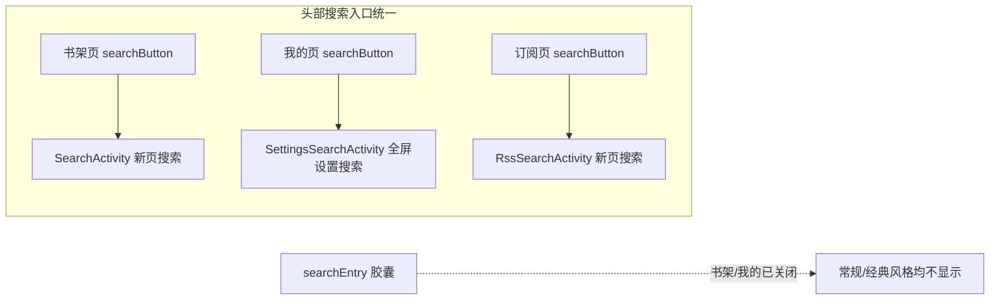
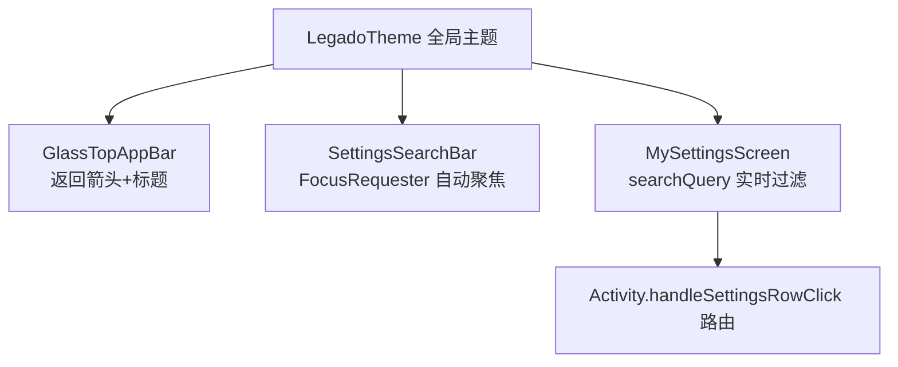
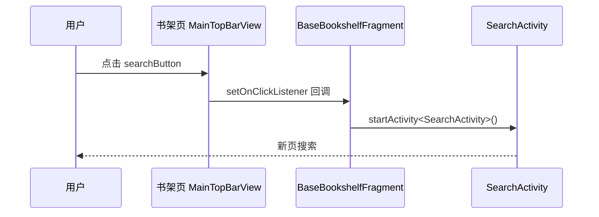
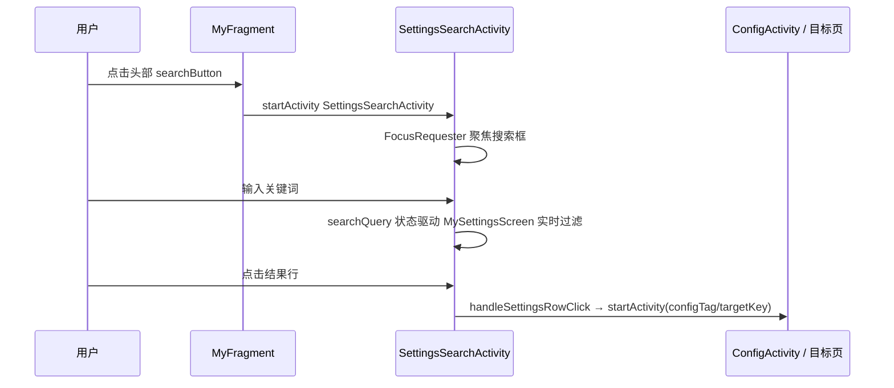

# 主Tab头部搜索入口统一 — 技术设计（design.md）

## Technical Approach

### 现状链路

三个主 Tab 共用头部组件 `MainTopBarView`（[MainTopBarView.kt](file:///f:/myself/github/WeAgentChat/temp/legado/app/src/main/java/io/legado/app/ui/widget/MainTopBarView.kt)）：

- 标题行：`searchEntry`（胶囊搜索框，`searchEntryRequested` 控制显隐）、`titleSelect`（标题+下拉箭头）、动作区（`searchButton` 等）；
- `applyRegularStyle()`：`searchEntry.isVisible = searchEntryRequested`；`applyDefaultStyle()`：`searchEntry.isVisible = false`；
- 即 **regular（标准）风格下胶囊才显示**。

宿主现状：

| 宿主 | searchEntry 点击 | searchButton 点击 |
|------|----------------|------------------|
| RssFragment（订阅，标准） | `openRssSearch()`（打开 RssSearchActivity） | 同左 |
| BaseBookshelfFragment（书架） | **未绑定（点击无响应）** | `startActivity<SearchActivity>()` |
| MyFragment（我的） | `showSettingsSearch()`（就地展开 view_search） | 同左 |

### 目标链路

| 宿主 | searchEntry | searchButton |
|------|------------|--------------|
| RssFragment | 按源能力动态显隐（不变） | 打开 RssSearchActivity（不变） |
| BaseBookshelfFragment | `setSearchEntryVisible(false)` 关闭 | 打开 SearchActivity（不变） |
| MyFragment | `setSearchEntryVisible(false)` 关闭 | 打开 **SettingsSearchActivity**（新） |

### 全屏设置搜索页（SettingsSearchActivity）

**布局**（`activity_settings_search.xml`）：单个全屏 `ComposeView`，一次 `setContent` 承载全部 UI（对齐订阅搜索页的 Compose 顶栏范式）。

**Compose 结构**：

**主题零破坏关键点**：

- 全部 Compose 包在 `LegadoTheme`（全局主题 token 唯一来源）内；
- `MySettingsScreen` 内部 `rememberAppSettingPalette()`（随主题 signature 记忆）+ `UiCorner.panelImageDrawable` + `LocalTextStyle`，颜色/圆角/字体全量走主题 token，**复用即继承主题**；
- `GlassTopAppBar` / `SettingsSearchBar` 取 MaterialTheme token（与 RssSearchActivity 同款）；
- 新页面纯展示+跳转，不监听 themeMode / 不干预主题切换。

**数据共享（MySettingsData.kt）**：从 MyFragment 平迁以下逻辑为共享顶层函数/扩展，两宿主（Fragment + Activity）共用，禁止复制：

| 共享项 | 来源（MyFragment 原私有方法） | 签名 |
|--------|-----------------------------|------|
| `buildSettingsSections` | `buildSections` + `actionRow` | `(context: Context): List<MySettingsSectionModel>` |
| `buildSettingsSubSearchItems` | `buildSubSearchItems` + `buildPreferenceXmlSearchItems` + `collectPreferenceAttr` | `(context: Context): List<MySettingsSubSearchItem>` |
| `buildSettingsThemeOptions` | `buildThemeOptions` | `(context: Context): List<MySettingsThemeOption>` |
| `handleSettingsRowClick` | `handleRowClick` | `Activity.(key: String, searchTarget: MySettingsSubSearchItem?)` |
| 主题模式弹框 / Web 服务启停 | `showThemeModeActions` / `setThemeMode` / `setWebServiceEnabled` / `showWebServiceActions` / `handleWebServiceClick` | `Activity` 扩展，参数化当前状态 |

**MyFragment 收敛**：`initTopBar()` 增 `setSearchEntryVisible(false)`；searchButton → `SettingsSearchActivity.start(requireContext())`；删除 `settingsSearchView` / `showSettingsSearch` / `initSearchView` / `applySearchBarStyle` / `applySearchQuery` / `searchQueryState`；`fragment_my_config.xml` 删除 `view_search` include；`installComposeContent` 中 `searchQuery` 传空串常量、回调改指共享函数。

## Architecture Decisions

### AD-01: 使用宿主侧 setSearchEntryVisible(false) 关闭胶囊，而非修改 MainTopBarView
- **Context**: 无效搜索框（searchEntry 胶囊）由 MainTopBarView 的 regular 风格渲染；书架/我的两个宿主未正确接线点击；订阅页需要保留按源动态显隐胶囊。
- **Concern**: 从组件层删除/禁用 searchEntry 将影响订阅页动态显隐逻辑，波及面不可控。
- **Decision**: 组件不变，宿主初始化时调用 `topBar.setSearchEntryVisible(false)`。
- **Goal**: 最小侵入地使书架/我的头部只保留 searchButton，订阅页零变化。
- **Tradeoff**: 组件内保留 searchEntry 渲染代码（default 风格本不渲染，仅 regular 多一次可见性判断），换取订阅页能力完整性。
- **Status**: Accepted

### AD-02: 我的页面搜索改为新建全屏设置搜索页（SettingsSearchActivity），移除就地搜索
- **Context**: 用户明确要求我的页面"参考订阅"——点搜索按钮弹开新页面搜索；同时强调不得破坏现有主题设置体系。
- **Concern**: 就地展开 SearchView 与"弹开新页面"诉求不符；若新页面自绘 UI 则会破坏主题一致性。
- **Decision**: 新增 `SettingsSearchActivity`，复刻订阅搜索页组件体系（`LegadoTheme` + `GlassTopAppBar` + `SettingsSearchBar` + 复用 `MySettingsScreen`），内容列表与数据逻辑零复制（提取共享函数）。
- **Goal**: 交互完全对齐订阅页 + 主题零破坏 + 两宿主行为不漂移。
- **Tradeoff**: 新增 1 Activity + 1 布局 + 1 共享文件；搜索需跳页而非就地。换取交互一致与主题安全。
- **Status**: Accepted

### AD-03: 设置数据构建与行点击路由提取为共享顶层函数，禁止两处复制
- **Context**: sections/subSearchItems/themeOptions 构建与行点击路由原为 MyFragment 私有方法；新搜索页需要完全一致的行为。
- **Concern**: 若在 Activity 中复制粘贴，两处代码漂移后搜索页与我的页行为将分叉（用户强调功能一致）。
- **Decision**: 平迁为 `MySettingsData.kt` 共享顶层函数/扩展；原方法签名仅增加 `Context`/`Activity` 接收者，逻辑逐行保留。
- **Goal**: DRY，单一事实来源，两宿主行为恒等。
- **Tradeoff**: MyFragment 调用点需修改指向共享函数；提取不改变任何业务行为。
- **Status**: Proposed（实施前经检查点 1 用户确认，已确认）

### AD-04: 新搜索页全量复用既有主题体系，禁止任何硬编码主题样式
- **Context**: 用户强调"别破坏了现在的主题设置"；此前视频播放器等存在孤儿样式前科。
- **Concern**: Compose 页面若绕过 `LegadoTheme`/`AppSettingPalette`/Material token 直接写色值，主题切换/主题设置更新时页面样式会脱离全局控制。
- **Decision**: 全部 UI 包 `LegadoTheme`；列表用 `MySettingsScreen`（内部 palette 全量走 token）；顶栏/搜索框用既有组件；新文案资源化进 strings.xml。
- **Goal**: 新页面与全局主题/顶栏/样式设置 100% 联动，无孤儿样式。
- **Tradeoff**: 无（复用成本低于自绘）。
- **Status**: Accepted

### AD-05: 新搜索页订阅主题模式/Web 服务状态刷新，对齐 MyFragment 既有监听
- **Context**: MyFragment 通过 `registerOnSharedPreferenceChangeListener`（themeMode/webService/recordLog）+ `observeLiveBus(EventBus.WEB_SERVICE)` 保持 UI 状态实时；新搜索页若只读一次状态，返回页面/开关变化后展示会陈旧。
- **Concern**: 忽略监听会让搜索页的"主题模式"行 label 与"Web 服务"开关状态失真，与我的页行为漂移（违反 AD-03 恒等目标）。
- **Decision**: SettingsSearchActivity 复用同一套监听：
  - `registerOnSharedPreferenceChangeListener`（PreferKey.themeMode → 刷新 themeModeState；PreferKey.webService → 启停 WebService + 刷新 webServiceState）
  - `observeLiveBus(EventBus.WEB_SERVICE)` 刷新 webServiceState；onDestroy 注销
- **Goal**: 搜索页与我的页状态恒等，无陈旧展示。
- **Tradeoff**: 与 MyFragment 重复 ~20 行监听样板（两处受控复制，非业务逻辑复制），换取状态一致性。
- **Status**: Accepted

## Data Flow

书架（不变）：

我的页面（新链路）：

## File Changes

| 文件 | 变更 | 级别 |
|------|------|------|
| [BaseBookshelfFragment.kt](file:///f:/myself/github/WeAgentChat/temp/legado/app/src/main/java/io/legado/app/ui/main/bookshelf/BaseBookshelfFragment.kt) | `initComposeTopBar()` 追加 `topBar.setSearchEntryVisible(false)` | 修改（+1 行） |
| [MyFragment.kt](file:///f:/myself/github/WeAgentChat/temp/legado/app/src/main/java/io/legado/app/ui/main/my/MyFragment.kt) | 追加 `setSearchEntryVisible(false)`；searchButton → SettingsSearchActivity；删除就地搜索逻辑；数据构建/路由改指共享函数 | 修改 |
| fragment_my_config.xml | 删除 `view_search` include（就地搜索框） | 修改 |
| **新增** MySettingsData.kt（`io.legado.app.ui.main.my`） | sections/subSearchItems/themeOptions 构建 + 行点击路由 + 主题模式/Web 服务交互（Activity 扩展）平迁为共享 | 新增 |
| **新增** SettingsSearchActivity.kt（`io.legado.app.ui.config.search` 或 `io.legado.app.ui.main.my`） | 全屏设置搜索页（Compose：GlassTopAppBar + SettingsSearchBar + MySettingsScreen） | 新增 |
| **新增** activity_settings_search.xml | 单 ComposeView 全屏布局 | 新增 |
| AndroidManifest.xml | 注册 SettingsSearchActivity（`windowSoftInputMode="adjustResize\|stateHidden"`） | 修改 |
| [RssFragment.kt](file:///f:/myself/github/WeAgentChat/temp/legado/app/src/main/java/io/legado/app/ui/main/rss/RssFragment.kt) | 无（回归确认） | 只读 |

**不修改**：MainTopBarView.kt、两种书架布局 XML、SearchActivity、RssSearchActivity、MySettingsScreen.kt（仅读取复用）。