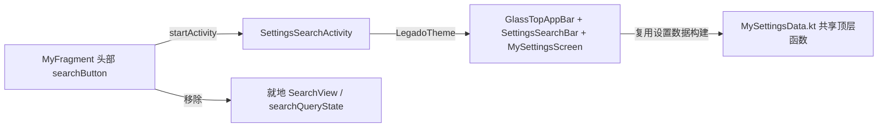

# 主Tab头部搜索入口统一 — 需求规格（spec.md）

## Intent

当前三个主 Tab（书架 / 我的 / 订阅）头部搜索入口形态不一致：

- 订阅页已是"仅搜索按钮 → 打开新页面搜索"的标准形态；
- 书架页在 regular 顶栏风格下会额外显示一个 searchEntry 胶囊"搜索框"，但该胶囊**没有任何点击绑定（点击无效）**，实际可用的是右侧 searchButton（已绑定打开 SearchActivity）；
- 我的页面同样显示 searchEntry 胶囊 + searchButton，两者点击就地展开一个 SearchView 过滤设置项。

本次目标：

1. **书架页**：移除无效 searchEntry 胶囊，统一为"仅搜索按钮"形态（点击打开 SearchActivity 新页搜索）；
2. **我的页面**：移除 searchEntry 胶囊，点击搜索按钮**弹开全屏设置搜索新页面（SettingsSearchActivity）**，完全对齐订阅页"点搜索按钮 → 新页面"的交互；
3. **主题零破坏**：新搜索页全部复用现有主题体系（`LegadoTheme` + `AppSettingPalette`/`UiCorner` + Material3 token），不允许出现孤儿样式或新建主题旁路。

## Scope

### In Scope（本次实现）

1. 书架页（`BaseBookshelfFragment`，覆盖 style1 + style2）：隐藏 searchEntry 胶囊，保留 searchButton（打开 SearchActivity 新页搜索）。
2. 我的页面（`MyFragment`）：隐藏 searchEntry 胶囊；searchButton 点击改为打开全屏设置搜索页；**移除就地搜索逻辑**（view_search / settingsSearchView / searchQueryState / initSearchView / applySearchBarStyle / applySearchQuery）。
3. 新增全屏设置搜索页 `SettingsSearchActivity`：
   - 顶栏 `GlassTopAppBar`（返回箭头 + 设置搜索标题，样式资源化走 strings.xml）+ `SettingsSearchBar`（自动聚焦）——与订阅搜索页同款组件，全量接入主题；
   - 内容复用 `MySettingsScreen`（设置列表 + 关键词过滤 + 点击跳转能力原样保留）；
   - 设置数据构建逻辑（sections / subSearchItems / themeOptions / 行点击路由）从 MyFragment 提取为共享顶层函数，两个宿主复用，**禁止复制粘贴**。
4. `AndroidManifest.xml` 注册新 Activity（`windowSoftInputMode="adjustResize|stateHidden"`，与订阅搜索页一致）。

### Out of Scope（不实现）

1. **订阅页（`RssFragment`）**：已是标准形态，不改动。
2. **发现页（DISCOVERY）**：头部搜索入口不在本次范围。
3. **各搜索页内部逻辑**：SearchActivity / RssSearchActivity 本身不改。
4. **MainTopBarView 组件**：不重写、不删除 searchEntry 组件（显隐由 `setSearchEntryVisible()` 控制，本次仅从宿主侧关闭）。
5. **设置列表的既有硬编码中文**（如 `EmptySettingsFrame` 的"没有匹配的设置"）：属既有遗留，不纳入本次。

## Approach

### Selected Approach（选定方案）

**部件 A：关闭无效 searchEntry 胶囊**

利用 `MainTopBarView.setSearchEntryVisible(Boolean)` 既有能力，两个宿主各 +1 行：

1. `BaseBookshelfFragment.initComposeTopBar()` 末尾追加 `topBar.setSearchEntryVisible(false)`；
2. `MyFragment.initTopBar()` 末尾追加 `topBar.setSearchEntryVisible(false)`。

**部件 B：我的页面全屏设置搜索页**

1. 新增 `SettingsSearchActivity`（`BaseActivity`，无需 ViewModel）：
   - 布局 `activity_settings_search.xml`：单个 `ComposeView` 全屏，单次 `setContent` 承载全部 UI；
   - `LegadoTheme { Column { GlassTopAppBar(...) ; SettingsSearchBar(...) ; MySettingsScreen(...) } }`——与 [RssSearchActivity.kt](file:///f:/myself/github/WeAgentChat/temp/legado/app/src/main/java/io/legado/app/ui/rss/search/RssSearchActivity.kt#L109-L147) 同款组件体系；
   - `searchQuery` 为 `mutableStateOf("")`，`SettingsSearchBar.onQueryChange` 直接驱动 `MySettingsScreen.searchQuery` 实时过滤；
   - 进入页面 `FocusRequester` 自动聚焦搜索框（对齐订阅页无 key 行为）；
   - 行点击/主题模式/Web 服务交互回调全部接共享路由函数。
2. 设置数据逻辑提取为共享顶层函数（`MySettingsData.kt`，包 `io.legado.app.ui.main.my`）：
   - `buildSettingsSections(context)` / `buildSettingsSubSearchItems(context)` / `buildSettingsThemeOptions(context)`（从 `MyFragment` 原私有方法平迁，签名仅加 `Context` 参数）；
   - `Activity.handleSettingsRowClick(key, searchTarget)`：行点击路由（原 `MyFragment.handleRowClick` 全部分支平迁，含 `searchTarget → ConfigActivity`、书源管理/替换规则/精准管理/主题设置等跳转）；
   - 主题模式弹框 / Web 服务启停：同理提取 `Activity` 扩展，两宿主共用。
3. `MyFragment` 收敛：接入共享函数 + 打开新页面，删除就地搜索全部代码。

**部件 C：主题零破坏约束（贯穿设计）**

| 层面 | 约束 |
|------|------|
| 主题包装 | 新页面所有 Compose 一律包在 `LegadoTheme` 内（全局主题 token 来源） |
| 设置列表 | 复用 `MySettingsScreen`——内部已用 `rememberAppSettingPalette()` + `UiCorner.panelImageDrawable` + `LocalTextStyle`，颜色/圆角/字体全部随主题 token 自动刷新 |
| 顶栏/搜索框 | `GlassTopAppBar` / `SettingsSearchBar` 全部取 MaterialTheme token，与订阅搜索页同款 |
| 文案 | 新页面标题/占位符全部走 `strings.xml` 资源 |
| 副作用 | 新 Activity 不监听、不干预主题模式切换（`themeMode` 等），纯展示 + 跳转 |

### Alternatives Considered（否决的替代方案）

| 方案 | 说明 | 否决理由 |
|------|------|---------|
| 我的页面保持就地展开搜索框 | 点击按钮在当前页展开 `view_search` | 用户明确选择"新建全屏搜索页"，要对齐订阅页"弹开新页面"交互 |
| 新搜索页独立重写设置列表 UI | 不复用 MySettingsScreen，自绘列表 | 必然造成与"我的页"观感/主题两套体系，破坏用户强调的主题一致性；复用组件可从根上避免 |
| 只从 MyFragment 复制数据构建代码 | Activity 内复制 buildSections/buildSubSearchItems | 违反 DRY，两处代码漂移后搜索页与我的页行为会分叉 |
| 修改 MainTopBarView 删除 searchEntry | 从组件层移除胶囊 | 影响订阅页按源能力动态显隐胶囊，波及面大；宿主侧关闭已足够 |
| 书架 searchEntry 点击改为打开 SearchActivity | 给书架胶囊补绑定 | 头部保留两处搜索入口观感冗余，违背"只留一个搜索入口"诉求 |

### Drawbacks（已知缺点与接受理由）

| 缺点 | 影响 | 接受理由 |
|------|------|---------|
| 新增 1 个 Activity + 1 布局 + 1 共享数据文件，改动面从"2 行"扩大 | 变更文件增多，需编译+真机验证 | 用户明确选择全屏搜索页方案，换取交互完全对齐订阅页与主题零破坏 |
| 设置搜索改为新页面后，我的页面 Tab 无法"就地看搜索" | 交互形态变化：需跳页才能搜索设置 | 这正是用户期望的"参考订阅"交互；点击跳转成本极低 |
| 设置数据构建逻辑提取后，MyFragment 调用方式微调 | 编辑 MyFragment 原有私有方法调用处 | 提取为共享函数避免两宿主行为漂移，是值得的架构收敛 |
| default（经典）风格下书架搜索按钮受 `TopBarConfig.showSearchInDefaultStyle` 开关控制 | 关闭该开关时经典风格书架无搜索入口 | 搜索入口收敛为单按钮后，显隐由既有顶栏配置统一管理，符合"头部样式全量受顶栏配置管理"原则 |

### Prior Art

- 订阅页 `RssFragment`：`searchEntry/searchButton → openRssSearch()` + `setSearchEntryVisible(hasSearch)`，标准形态；
- `RssSearchActivity`：全屏搜索页范式（`GlassTopAppBar` + `SettingsSearchBar` + `LegadoTheme`），新页面直接对齐；
- `MySettingsScreen`：已具备 `searchQuery` 参数 + `buildVisibleSections` 过滤逻辑，设置搜索能力开箱即用；
- 设置搜索行点击跳转：`MyFragment.handleRowClick` → `ConfigActivity(configTag, targetKey)`，本方案提取复用。

## Requirements

### 功能需求

- [x] FR-1：书架页（style1/style2 共用基类）头部不再显示 searchEntry 胶囊搜索框
- [x] FR-2：书架页 `searchButton` 点击打开 SearchActivity（新页面搜索），行为不变
- [x] FR-3：我的页面头部不再显示 searchEntry 胶囊搜索框
- [x] FR-4：我的页面 `searchButton` 点击打开全屏设置搜索页（SettingsSearchActivity）
- [x] FR-5：全屏设置搜索页支持关键词实时过滤设置项、点击行跳转（与我的页行为一致），自动聚焦搜索框
- [x] FR-6：我的页面移除就地搜索相关代码（view_search 展开 / settingsSearchView / searchQueryState）
- [x] FR-7：设置数据构建逻辑与行点击路由提取为共享函数，我的页与新搜索页共用（无复制粘贴）
- [x] FR-8：新搜索页接入 `LegadoTheme` + `MySettingsScreen` 既有主题体系
- [x] FR-9：订阅页头部行为保持不变（回归确认）

### 非功能需求

- NFR-1：default 与 regular 两种顶栏风格下均不出现无效搜索框
- NFR-2：新页面标题/占位符全部字符串资源化，无硬编码中文
- NFR-3：新 Activity 注册 Manifest，`windowSoftInputMode="adjustResize|stateHidden"`
- NFR-4：改动不引入新依赖、不修改 MainTopBarView 组件源码
- NFR-5：新页面不干预主题模式切换，随主题设置自动刷新

## Scenarios

### 场景 1：书架页去除无效搜索框（主要场景）

**Given** 用户处于书架页，顶栏风格为 regular（标准）
**When** 正常浏览书架
**Then** 头部仅显示标题 + 搜索按钮 + 更多菜单，无 searchEntry 胶囊
**And** 点击搜索按钮打开书籍搜索页（SearchActivity）

### 场景 2：我的页面 → 全屏设置搜索

**Given** 用户处于我的页面
**When** 点击头部搜索按钮
**Then** 打开全屏设置搜索页（返回箭头 + 搜索框 + 设置列表），搜索框自动聚焦
**And** 输入关键词实时过滤设置项；点击结果行跳转对应目标（与我的页一致）
**And** 主题样式与我的页/全局一致，随主题设置切换自动刷新

### 场景 3：经典风格搜索入口

**Given** 顶栏风格为 default（经典），开启"经典风格显示搜索按钮"配置
**When** 用户处于书架/我的页面
**Then** 头部显示搜索按钮，点击进入对应搜索页；不出现任何无效输入框

### 场景 4：订阅页回归

**Given** 用户处于订阅页（modern 形态且有搜索能力源）
**When** 点击头部搜索按钮或胶囊
**Then** 打开 RssSearchActivity，行为与本次改动前完全一致