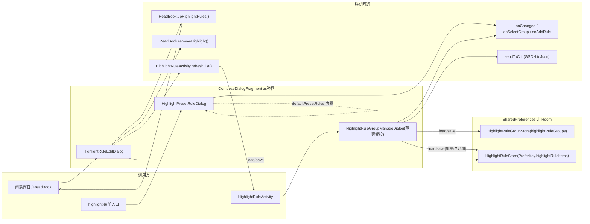

# design.md — Highlight 三弹框 Compose 化迁移

## Technical Approach

三弹框统一采用「基于 `ComposeDialogFragment` 基类 + `AppDialogFrame`/`AppComposeDialogs` 容器」的 Compose 迁移：

1. **基类收敛**：`HighlightRuleEditDialog` / `HighlightRuleGroupManageDialog` / `HighlightPresetRuleDialog` 全部改为 `abstract class ... : ComposeDialogFragment()`。原 `BaseDialogFragment(R.layout.xxx, true)` 的 `setLayout` 语义改由基类 `dialogWidth` / `dialogHeight` / `dialogSize` / `dialogGravity` 表达。三弹框档位：

   | 弹框 | 原布局/尺寸 | 基类配置 |
   |------|-----------|---------|
   | `HighlightRuleEditDialog` | `MATCH_PARENT` 全屏 | `setLayoutCompat(MATCH_PARENT, MATCH_PARENT)`（或基类全宽全高档） |
   | `HighlightRuleGroupManageDialog` | `MATCH_PARENT x 0.85f + Gravity.BOTTOM` | `dialogGravity = Gravity.BOTTOM` + 底部高度档（如 `Management` / 显式高度） |
   | `HighlightPresetRuleDialog` | `MATCH_PARENT x 0.85f + Gravity.BOTTOM` | 同上底部 + 高度档 |

2. **容器统一**：内容包 `AppDialogFrame(title, message, scrollContent, content, actions)`，样式取 `rememberAppDialogStyle()`（内置 `520.dp` 内容高上限 + `imePadding`），保证键盘弹起与不同字号下的布局稳定。

3. **三弹框各自落地方案**：

   - **`HighlightPresetRuleDialog`（低中复杂）**：`content` 内 `LazyColumn(Modifier.fillMaxSize())` 渲染 `defaultPresetRules`；每行 Compose 卡片：标题 + `displayPattern()` 文案 + `HighlightRulePreview.build(item)` 预览描线 + `ivAdd`（`IconButton`）；`ivBack` 由 `AppDialogFrame` 的关闭动作承载或卡片顶部返回图标。点击 `onAddRule(item.copy(group = defaultGroup ?: DEFAULT_GROUP))` → `dismiss()`。
   - **`HighlightRuleGroupManageDialog`（中复杂）**：直接对照 `GroupManageComposeDialog` 薄壳受控模式。薄壳类持有 `groups` 状态与外层回调，内容复用 `ComposeGroupManageDialogContent(groups, onAddGroup, onRenameGroup, onDeleteGroup, onDismiss)`：`LazyColumn(items, key={it})`；新增/重命名用内联编辑卡片（`OutlinedTextField` + `GroupManageTextField`，`heightIn(min=240.dp, max=420.dp)`），就地校验空/重名；每行 `tvMore` 用 Compose 菜单（等同原 `R.menu.highlight_rule_group_item` 的 rename / export / delete）；删除确认子弹框（默认分组禁删，删除后批量改回 `DEFAULT_GROUP`）。导出走 `sendToClip(GSON.toJson(目标规则))`。
   - **`HighlightRuleEditDialog`（高复杂）**：`content` 拆两块——
     - **基础字段区**：参照 `AppEditDialog` 的多字段表单风格，受控 `mutableStateListOf`；字段 `name` / `pattern` / `useRegex`（`Switch`）/ `replacement` / `dotAll`（`Switch`）。
     - **样式通道区**：通道选择 + 实时预览。按 AD-03 决策，优先 Compose 内联（通道 chips / 开关集：fill / textColor / bold / italic / underline / strike / fontPath），预览用固定文案以 `AnnotatedString` 渲染对应 Span；如需 `FontSelectDialog` 字体通道则保留该子组件或等价转 Compose（见 AD-03 权衡）。
     - 动作区 `tvCancel` / `tvOk`：`tvOk` 校验后 `HighlightRuleStore.save(...)`，再触发 `ReadBook.upHighlightRules()`、`ReadBook.removeHighlight()`、`HighlightRuleActivity.refreshList()`（存在性调用）。
   - **内嵌子弹框处置**：`HighlightStyleDialog`（`StyleHost`：`curFontPath` / `onHighlightStyleChanged` / `pickHighlightColor` / `pickHighlightFont`）、`FontSelectDialog`、`ColorPickerDialog`（jaredrummler，`dialogId + applyChannelColor` 映射）——按 AD-03 决策，能内联化的通道选择在 Compose 主弹框内联实现，无法单层表达的保留为对应 Compose 子弹框（经 `ComposeDialogFragment` 承载），不强制全平铺。

4. **数据层零改动**：`HighlightRuleStore` / `HighlightRuleGroupStore`（SharedPreferences + `@Volatile`，非 Room）读取、`Bundle` 传参（`id: String` 用于 `edit(id)`）、回调契约不变。

## Architecture Decisions

### AD-01: 三弹框归一到 ComposeDialogFragment 基类

- **Context**: 三弹框现均 `BaseDialogFragment(R.layout.xxx, true)` + 手写 `setLayout(...)` 指定尺寸/重力（`MATCH_PARENT` 全屏 / `0.85f + Gravity.BOTTOM`），且沿用 `BaseDialogFragment` 二参构造。项目已交付 `ComposeDialogFragment` 基类统一弹框直径/重力/动画/墨水屏能力。
- **Concern**: 若继续用旧基类只替换 View 内容，尺寸/重力/动画/墨水屏仍零散手写于各弹框，双轨并存未消除。
- **Decision**: 三弹框全部改继承 `abstract class ComposeDialogFragment`，用 `dialogWidth` / `dialogHeight` / `dialogSize` / `dialogGravity` / `dialogWindowAnimations` 表达原 `setLayout` 语义；保留基类 `setLayout` 兼容点在需要精确控制的场景兜底。
- **Goal**: 弹框框架单轨化；尺寸/重力/动画/墨水屏能力集中一处，三弹框行为一致。
- **Tradeoff**: 需接受基类档位与旧 `setLayout` 的映射收敛；对特殊直径（全屏/底部 0.85f）可能需基类补充非标准档位，属基类小幅扩展。换取消无双框架、后续弹框可复用。
- **Status**: Proposed
- **Superseded-by**: —

### AD-02: 分组管理采用 GroupManageComposeDialog 薄壳受控模式

- **Context**: `HighlightRuleGroupManageDialog` 的分组列表 + 增删改删行为与已交付的 `GroupManageComposeDialog`（含 `ComposeGroupManageDialogContent` 受控内容、`LazyColumn(items, key={it})`、内联编辑卡片 `heightIn(240..420.dp)`）高度重合。
- **Concern**: 若从零另写一套分组列表 Compose UI，产生重复实现，样式与行为无法对齐既有组件。
- **Decision**: `HighlightRuleGroupManageDialog` 改为薄壳受控模式——薄壳持有 `groups` 状态与 `onChanged` / `onSelectGroup` 回调，内容复用 `ComposeGroupManageDialogContent(...)`；导出、删除确认、PopupMenu 等超出通用组件范围的项在薄壳内包装补全。
- **Goal**: 最大程度复用已验证组件，减少差异面，行为与既有分组管理一致。
- **Tradeoff**: 通用内容组件被绑定强（新增/重命名语义必须与之一致）；超出通用范围的槽位（导出/删除确认）需薄壳自绘，边界清晰但代码分布两处。
- **Status**: Proposed
- **Superseded-by**: —

### AD-03: Edit 弹框样式通道区——Compose 内联 vs 保留子弹框

- **Context**: `HighlightRuleEditDialog` 样式区现状内嵌 `HighlightStyleDialog`（`StyleHost` 接口：`curFontPath` / `onHighlightStyleChanged` / `pickHighlightColor` / `pickHighlightFont`）、`FontSelectDialog`、以及第三方 `ColorPickerDialog`（jaredrummler，`dialogId + applyChannelColor` 映射样式通道）。
- **Concern**: 三子弹框嵌套链路复杂；完全平铺进单个 Compose 弹框会放大布局与状态提升成本；但保留 View 子弹框又与「不留尾巴」目标冲突。
- **Decision**: 样式通道在 Compose **主弹框内联实现为主**（fill / textColor / bold / italic / underline / strike / fontPath 用 Compose 开关集 / chips / 颜色块选择，映射到 `HighlightRule.styleJson` 通道）；对需要独立选择界面的通道（`pickHighlightFont` 字体、`pickHighlightColor` 取色）优先转 Compose 子弹框；第三方取色器（jaredrummler）作为不可简单内联边界，经 `ComposeDialogFragment` 承载的 Compose 子弹框包住调用，不重新造轮子。
- **Goal**: 一打通样式编辑闭环与预览，消除弹框对 View 子弹框的硬耦合。
- **Tradeoff**: 内联化成本集中在 `HighlightStyleDialog` 的 `StyleHost` 回调与 `applyChannelColor` 通道映射重写；字体/取色子弹框仍有一层嵌套。换取样式区完全 Compose、无 View 残留。
- **Status**: Proposed
- **Superseded-by**: —

### AD-04: 预览 Span 方案（保留原局限 vs 引入自定义 Span）

- **Context**: 现 `tvStylePreview` 用固定文案渲染 `BackgroundColorSpan` / `ForegroundColorSpan` / `StyleSpan(BOLD|ITALIC)` / `UnderlineSpan` / `StrikethroughSpan`，且已知使用限制：underline 不区分波浪/虚线/点线，box / emphasis / fontPath 字体不预览。
- **Concern**: Compose `AnnotatedString` + `TextStyle` 只能表达有限的 Span 类型；自定义 Span 需引入 `VisualTransformation`（较复杂），与预览原生能力不完全等同。
- **Decision**: 采用**保留原局限**方案——Compose 预览用 `AnnotatedString(style = ...)` 表达既有五种 Span 的等价效果（bold / italic / underline / strikethrough / 前景背景色），对 previewSpan 圈同样用 `SpanStyle` 施加；对原版不支持的波浪/虚线/点下划线与 box / fontPath 字体，维持「不预览」现状，不引入自定义 `VisualTransformation`。
- **Goal**: 预订体现有支持范围的等价迁移，避免为预览引入复杂自定义渲染而放大风险。
- **Tradeoff**: 预览能力不因迁移而增强（用户可见的现状限制保留）；但迁移面与回归风险最小化。未来如需增强，作为独立功能 Spec 另行设计。
- **Status**: Proposed
- **Superseded-by**: —

### AD-05: migration-registry 状态登记与 tasks 对齐

- **Context**: 项目以 migration-registry 跟踪 archive 迁移进度，三弹框 View → Compose 属收尾项，需反映到登记表。
- **Concern**: 若不登记，状态与 `tasks.md` 脱节，收尾完成度无法核查。
- **Decision**: migration-registry 新增三弹框条目，状态与 `tasks.md` 各阶段勾选保持一致（实施完成即标 Compose 化完成，XML/ databinding 删除完成后标资源清理完成）。
- **Goal**: 迁移状态可审计，与任务清单单一事实源对齐。
- **Tradeoff**: 需在实施各阶段同步登记表与任务清单两处状态，属低额维护成本。
- **Status**: Proposed
- **Superseded-by**: —

## Data Flow

- 三弹框均继承 `ComposeDialogFragment`，尺寸/重力/动画/墨水屏由基类配置。
- 数据存储延续 SharedPreferences（`@Volatile` 进程内缓存），非 Room；保存后按回调触发阅读/列表刷新，行为与旧版一致。

## File Changes

| 文件 | 变更类型 | 说明 |
|------|---------|------|
| `app/src/main/java/io/legado/app/ui/highlight/edit/HighlightRuleEditDialog.kt` | 重写 | `BaseDialogFragment + ViewBinding` → `ComposeDialogFragment`，基础字段 + 样式通道区（内联）+ Span 预览 |
| `app/src/main/java/io/legado/app/ui/highlight/HighlightRuleGroupManageDialog.kt` | 重写 | 薄壳受控模式，复用 `ComposeGroupManageDialogContent` + 导出/删除确认/PopupMenu 包装 |
| `app/src/main/java/io/legado/app/ui/highlight/HighlightPresetRuleDialog.kt` | 重写 | `ComposeDialogFragment` + `LazyColumn` 预设列表 + 预览描线 |
| `app/src/main/java/io/legado/app/ui/widget/compose/HighlightComposeDialogs.kt`（新增，可并入既有文件） | 新增 | 收藏三弹框的 Compose 内容/状态，或新增专用内容组合（按实现聚合） |
| `app/src/main/res/layout/dialog_highlight_rule_edit.xml` | 删除 | 布局已 Compose 化 |
| `app/src/main/res/layout/dialog_highlight_rule_group_manage.xml` | 删除 | 布局已 Compose 化 |
| `app/src/main/res/layout/dialog_highlight_preset_rule.xml` | 删除 | 布局已 Compose 化 |
| `app/src/main/res/layout/item_highlight_rule_group.xml` | 删除 | 列表项已 Compose 化 |
| `app/src/main/res/layout/item_highlight_preset_add.xml` | 删除 | 列表项已 Compose 化 |
| 对应 ViewBinding / DataBinding 生成类（如 `DialogHighlightRuleEditBinding` / `DialogHighlightRuleGroupManageBinding` / `DialogHighlightPresetRuleBinding` / `ItemHighlightRuleGroupBinding` / `ItemHighlightPresetAddBinding`） | 删除 | 随布局移除自动消失，无残留 |
| migration-registry 状态登记 | 更新 | 新增三弹框条目，与 `tasks.md` 对齐 |
| `app/src/main/assets/updateLog.md` | 更新 | 追加三弹框 Compose 化条目（编译前） |
| `docs/INDEX.md` | 更新 | 登记本 spec |

## 深度审查补充（2026-08-25，用户检查点1 追问"遗漏点/阻塞点/主题管理"）

### 遗漏点核查结论（Grep 全量调用方 + 布局引用）
- **调用方全集**：三弹框均仅 `HighlightRuleActivity` 调用（`showDialogFragment(HighlightRuleEditDialog.create()/edit(id))`、`HighlightRuleGroupManageDialog(...)`、`HighlightPresetRuleDialog(...)`），无其它页面引用；Compose 化后 `create`/`edit`/`showDialogFragment` 接口签名保持不变，迁移影响面收敛为单页面。
- **XML 可删性（证据）**：`dialog_highlight_rule_edit`/`dialog_highlight_rule_group_manage`/`dialog_highlight_preset_rule` + `item_highlight_rule_group`/`item_highlight_preset_add` 的 `R.layout` 引用者均为对应弹框自身（仅各 1 处），**可安全删除**；`R.menu.highlight_rule_group_item` 仅 GroupManage 使用（1 处），Compose 化后 menu XML 一并删除；对应 ViewBinding 类随布局自动消失。

### 阻塞点清单（1 项，有处理路径）
| 阻塞点 | 证据 | 影响 | 处理方案 |
|--------|------|------|---------|
| 第三方 `ColorPickerDialog`（jaredrummler 库）强制 `R.style.AppTheme_Light` 亮色主题 | HighlightRuleEditDialog.kt L109-128 `createColorPickerDialog()`，注释说明为避免暗色主题下预设色块显示异常 | 内部取色弹框与全局主题/夜间模式不一致 | 短期：保留亮色强制（现状行为不回退）；长期（ADR-03 升级路径）：替换为项目 Compose 自绘色板，复用 `HighlightColors.bg(text)` 预设通道 + `rememberAppDialogStyle` 动态色，彻底消除孤立亮色窗口 |

### 主题设置管理覆盖结论（用户核心关切）
- **取色统一**：三弹框 Compose 化后全部颜色走 `rememberAppDialogStyle()`（AppComposeDialogs.kt L117-158：读 `AppConfig.isNightTheme`/`dialogAlpha`/`isEInkMode` + `ThemeStore` 派生色 + `UiCorner` 描边/圆角 + 字体族），**替换旧 `shape_card_view` 静态背景与 `?attr` 色** → 主题/夜间/角标/字体管理覆盖能力较 View 版增强。
- **打开即跟随**：弹框打开时读取当前主题配色（`ComposeDialogFragment` 基类 + `AppDialogFrame` 容器），主流程（高亮管理页操作）无实时切换需求。
- **切换即时刷新**：主题设置触发 `ThemeSync.bump()`（ThemeSync.kt L19-27：所有读 `version` 的 Composable 立即失效重组，栈内后台页面同样生效）+ `EventBus.RECREATE`（MainActivity/ConfigActivity 订阅重建）；`ComposeDialogFragment` 已统一处理墨水屏（`setStyle(STYLE_NO_TITLE, if(isEInkMode) 0 else dialogTheme)` + 去 dim）。
- **遗留已知上限标注**（迁移后消除）：GroupManage 旧注释"无主题切换实时响应"随静态背景迁移消亡；Edit 弹框 Span 预览局限（underline 不区分线型/box/fontPath 不预览）为 `HighlightStyle` 通道既有能力，Compose 化保持同一能力边界。