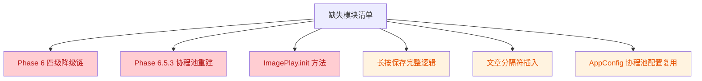

# 内置图片播放器垂直画布优化 V4 实施代码审查报告

> 审查时间：2026-07-26
> 审查范围：6 个核心源码文件
> 对照文档：design.md（V4）+ tasks.md
> 审查维度：架构一致性 / 并发安全 / 资源管理 / 错误处理 / 日志完整性 / tasks.md 实施进度
> 审查模式：只读审查，未修改任何源码

---

## 一、审查总结

### 1.1 总体评价

V4 实施完成了**核心架构骨架**（单 RecyclerView + ImageCanvasAdapter + ImageCanvasViewModel + ImageDetailActivity + ImagePlay StateFlow 扩展），数据流主干通畅，基础协程取消机制到位。但存在 **6 项 ERROR 级阻塞问题**（含 2 项完整功能模块未实施）和 **12 项 WARN 级建议修复问题**，距离生产级交付仍有较大差距。

### 1.2 实施进度概览

| 维度 | 完成度 | 说明 |
|------|--------|------|
| Phase 1 架构重构 | ~85% | 主架构完成，ImageDetailActivity 基类与共享元素配置有偏差 |
| Phase 2 列表模式 | ~85% | 缩略图/高度自适应/滚动暂停完成，AppConfig 协程池未复用 |
| Phase 3 大图模式 | ~70% | ViewPager2/PhotoView 完成，长按保存/共享元素配置缺失 |
| Phase 4 分页加载 | ~95% | 滚动监听/状态指示器完成 |
| Phase 5 保留能力 | ~70% | WebView 串行预热完成，header 提取/路由验证未完成 |
| **Phase 6 错误降级链** | **0%** | **完全未实施（四级降级链缺失）** |
| **Phase 6.5 V3 阻塞点** | **~60%** | StateFlow/双向映射/闪烁修复完成，协程池重建（R1.23）完全未实施 |
| Phase 7 架构风格 | ~40% | 沉浸式 API 完成，alert DSL/圆角规范未完成 |
| Phase 8 体验优化 | ~80% | 状态同步/页码完成，文章分隔符未实际插入 |

### 1.3 架构流程图

**已实施数据流（垂直画布加载 + 大图切换）：**

```mermaid
flowchart LR
    A[用户点击文章] --> B[ReadRss.readNoHtml]
    B --> C[ImagePlay 单例字段设置]
    C --> D[启动 ImageGalleryActivity]
    D --> E[ImageCanvasViewModel.loadInitialArticle]
    E --> F{Rss.getContentAwait}
    F --> G[parseImageUrls 4级兜底]
    G --> H[ImagePlay.appendItems StateFlow]
    H --> I[ImageCanvasAdapter.notifyDataSetChanged]
    I --> J[Glide 加载缩略图]
    J -->|onResourceReady| K[动态高度计算]
    J -->|onLoadFailed| L[错误高度 40%]
    L --> M[降级链暂未实施]
    style M fill:#ffcdd2,color:#b71c1c
    style M fill:#ffcdd2,color:#b71c1c

    J -->|点击缩略图| N[listPositionToImageIndex]
    N --> O[ActivityOptions 共享元素]
    O --> P[ImageDetailActivity]
    P --> Q[ViewPager2 + ImageDetailAdapter]
    Q -->|返回| R[setResult currentIndex]
    R --> S[imageIndexToListPosition]
    S --> T[scrollToPosition]
    style O fill:#c8e6c9,color:#1a5e20
    style Q fill:#c8e6c9,color:#1a5e20
```



**未实施模块（红色标注）：**



---

## 二、ERROR 级问题（阻塞，必须修复）

### E1：四级降级链完全未实施（AD-06 / Phase 6 / R1.20）

- **文件**：`app/src/main/java/io/legado/app/ui/image/adapter/ImageCanvasAdapter.kt`
- **行号**：[316, 323]
- **问题代码**：
  ```kotlin
  override fun onLoadFailed(...): Boolean {
      // AD-13: 加载失败时设置错误高度（屏幕高度 40%）
      val errLp = itemView.layoutParams
      errLp.height = (itemView.resources.displayMetrics.heightPixels * 0.4).toInt()
      itemView.layoutParams = errLp
      // AD-06: 触发降级链（Phase 6 实施，当前仅日志）
      AppLog.putError(...)
      // 降级链暂未实施，Phase 6 完成
      return false
  }
  ```
- **违反规范**：design.md AD-06 要求四级降级链（Glide 重试 → OkHttp 兜底 → WebView 即时预热 → 网页模式回退）；tasks.md R1.20（6.1.1-6.1.5）全部未实施
- **影响**：图片加载失败时无降级机制，防盗链/Cloudflare/Cookie 过期场景全部失败，用户体验差
- **修复建议**：实施 tasks.md Phase 6 全部 5 个子任务（6.1.1-6.1.5），包括 retryWithFreshCookie / OkHttp 兜底 / WebView 即时预热 / alert DSL 网页模式回退 / 降级级别 UI 提示

### E2：协程池重建机制完全未实施（AD-11 / R1.23 / 6.5.3）

- **文件**：`app/src/main/java/io/legado/app/ui/image/ImageCanvasViewModel.kt`
- **缺失内容**：
  - 缺失 `onCoroutinePoolConfigChanged(newSize: Int)` 方法（四步流程：取消 loadJob → shutdown 旧池 → 创建新池 → 重新触发加载）
  - 缺失 `coroutineExecutor: ExecutorService` 字段
  - 缺失 LiveEventBus 配置变更监听注册
  - `onCleared()` 中缺失 `coroutineExecutor.shutdownNow()`（仅 `loadJob?.cancel()`）
- **违反规范**：design.md AD-11 要求「取消-关闭-重建-重启」四步流程；tasks.md 6.5.3.1-6.5.3.4 全部未实施
- **影响**：配置变更后协程池无法重建，旧池未 shutdown 导致线程泄漏；旧任务结果可能写入 allImageUrls 与新任务数据竞争
- **修复建议**：在 ImageCanvasViewModel 中新增 coroutineExecutor 字段 + onCoroutinePoolConfigChanged 方法 + LiveEventBus 监听 + onCleared shutdownNow

### E3：ImagePlay.loadedArticleIndices / preloadedArticles 并发不安全（AD-09）

- **文件**：`app/src/main/java/io/legado/app/ui/image/ImagePlay.kt`
- **行号**：[45, 47]
- **问题代码**：
  ```kotlin
  val loadedArticleIndices: MutableSet<Int> = mutableSetOf()  // 非线程安全
  val preloadedArticles: MutableSet<Int> = mutableSetOf()     // 非线程安全
  ```
- **调用点未同步**：
  - `ImageCanvasViewModel.kt:115` `ImagePlay.loadedArticleIndices.maxOrNull()`（读）
  - `ImageCanvasViewModel.kt:124` `ImagePlay.loadedArticleIndices.contains(nextIndex)`（读）
  - `ImageCanvasViewModel.kt:205` `ImagePlay.loadedArticleIndices.add(articleIndex)`（写，在协程中）
- **违反规范**：design.md AD-09 要求 allImageUrls 并发安全（已用 StateFlow），但 loadedArticleIndices / preloadedArticles 同样被协程读写，未做同步保护
- **影响**：协程并发修改 MutableSet 触发 ConcurrentModificationException；或读取到不一致状态
- **修复建议**：将 loadedArticleIndices / preloadedArticles 改为 `ConcurrentHashMap.newKeySet()` 或在 ImagePlay 中提供 `@Synchronized` 包装方法（add / contains / maxOrNull / clear）

### E4：ImagePlay.init 方法缺失（AD-12 / R1.24 / 6.5.4.2）

- **文件**：`app/src/main/java/io/legado/app/ui/image/ImagePlay.kt`
- **缺失内容**：design.md AD-12 要求 `fun init(rssSource: RssSource, rssArticles: List<RssArticle>, rssArticleIndex: Int)` 方法首行调用 `resetForNewSource()`
- **违反规范**：tasks.md 6.5.4.2 要求 ImagePlay.init 首行调用 resetForNewSource
- **影响**：跨订阅源切换时旧数据残留（allImageUrls / loadedArticleIndices / preloadedArticles），导致显示错误图片
- **修复建议**：新增 init 方法，首行调用 resetForNewSource()，再设置 rssSource / rssArticles / rssArticleIndex 字段

### E5：WebView 未在 onDestroy 销毁（资源泄漏）

- **文件**：`app/src/main/java/io/legado/app/ui/image/ImageGalleryActivity.kt`
- **行号**：[382, 395]（onDestroy 方法）
- **问题**：onDestroy 中只调用了 `ImagePlay.clearImageCanvasState()`，未调用 `binding.webviewPreheat.destroy()`
- **违反规范**：design.md AD-05 要求预热完成后 `preheatWebView?.destroy()`；资源管理规范要求 WebView 销毁释放内存
- **影响**：每个 WebView 实例约 30-50MB 内存，Activity 销毁后 WebView 未销毁导致内存泄漏，多次进出图片播放器会触发 OOM
- **修复建议**：在 onDestroy 中添加：
  ```kotlin
  binding.webviewPreheat.apply {
      stopLoading()
      webChromeClient = null
      webViewClient = null
      destroy()
  }
  ```

### E6：ImageDetailAdapter 未在 onViewRecycled 清理 Glide（资源泄漏）

- **文件**：`app/src/main/java/io/legado/app/ui/image/adapter/ImageDetailAdapter.kt`
- **行号**：[78, 83]
- **问题代码**：
  ```kotlin
  override fun onViewRecycled(holder: ImageDetailViewHolder) {
      super.onViewRecycled(holder)
      if (currentHolder == holder) {
          currentHolder = null
      }
      // 缺失：Glide.with(context).clear(holder.binding.photoView)
  }
  ```
- **违反规范**：design.md AD-13 onViewRecycled 三件套之一是 Glide.clear；tasks.md 6.5.5.2 要求 onViewRecycled 添加 Glide.clear
- **影响**：大图模式左右滑动时旧图片资源未释放，多张大图同时驻留内存，触发 OOM 风险高
- **修复建议**：在 onViewRecycled 中添加 `Glide.with(context).clear(holder.binding.photoView)`

---

## 三、WARN 级问题（建议修复）

### W1：ImageDetailActivity 继承 BaseActivity 而非 VMBaseActivity

- **文件**：`app/src/main/java/io/legado/app/ui/image/ImageDetailActivity.kt`
- **行号**：[38, 38]
- **问题**：`class ImageDetailActivity : BaseActivity<ActivityImageDetailBinding>()` 实际继承 BaseActivity；tasks.md 1.3.1 要求继承 VMBaseActivity
- **影响**：缺少 ViewModel 支持，若后续大图模式需要 ViewModel 管理状态（如图片列表分页）需重构
- **修复建议**：改为继承 `VMBaseActivity<ActivityImageDetailBinding, ViewModel>()` 或确认设计无需 ViewModel

### W2：共享元素动画接收配置缺失

- **文件**：`app/src/main/java/io/legado/app/ui/image/ImageDetailActivity.kt`
- **行号**：[58, 63]（onActivityCreated）
- **问题**：tasks.md 1.3.4 要求 `window.sharedElementEnterTransition` 配置；代码中未配置
- **影响**：共享元素动画可能不生效（仅依赖 Theme.ImageDetail 的 windowActivityTransitions）
- **修复建议**：在 onCreate 中添加 `window.sharedElementEnterTransition = TransitionSet()` 显式配置

### W3：Glide.preload 预热当前+相邻2张未实施

- **文件**：`app/src/main/java/io/legado/app/ui/image/adapter/ImageCanvasAdapter.kt`
- **问题**：tasks.md 3.1.4 要求 ImageCanvasAdapter.ImageViewHolder 含 Glide.preload 调用预热当前+前后各1张（共3张）；代码中未实施
- **影响**：点击缩略图进入大图模式时共享元素动画可能闪烁（图片未加载完成）
- **修复建议**：在 ImageViewHolder.bind 中添加 Glide.preload 预热前后相邻图片

### W4：长按保存完整逻辑未实现

- **文件**：`app/src/main/java/io/legado/app/ui/image/adapter/ImageDetailAdapter.kt`
- **行号**：[144, 147]
- **问题**：tasks.md 3.3.4 要求迁移 PhotoView 长按保存能力（含权限请求 + Android 13+ 兼容）；代码中只有回调 `callback?.onImageLongClick(item.url, it)`，ImageDetailActivity.onImageLongClick 中只有 TODO 注释
- **影响**：用户无法长按保存图片
- **修复建议**：实现 onImageLongClick 完整逻辑：alert DSL 菜单（保存/分享/复制URL）+ 权限请求分支（Android 13+ 用 READ_MEDIA_IMAGES，以下用 WRITE_EXTERNAL_STORAGE）+ 保存图片到相册

### W5：文章分隔符未实际插入 allImageUrls

- **文件**：`app/src/main/java/io/legado/app/ui/image/ImageCanvasViewModel.kt`
- **行号**：[194, 205]
- **问题**：tasks.md 8.2.2 要求 allImageUrls 中插入 ArticleDivider 标记；代码中只 `ImagePlay.appendItems(imageItems)`，未插入 ArticleDivider
- **影响**：跨文章图片混排时无分隔提示，用户无法区分文章边界
- **修复建议**：在 appendItems 前插入 `ImageCanvasItem.ArticleDivider(articleIndex, articleTitle)`（首篇文章除外）

### W6：AppConfig 协程池配置未复用

- **文件**：`app/src/main/java/io/legado/app/ui/image/ImageCanvasViewModel.kt`
- **问题**：tasks.md 2.2.2 要求使用 `AppConfig.updateCacheThreadCount`（默认16）和 `AppConfig.imageLoadConcurrency`（默认5）；代码中未使用
- **影响**：用户配置的并发数不生效，硬编码默认值无法动态调整
- **修复建议**：在 ImageCanvasViewModel 中读取 AppConfig 配置控制协程并发数；注册 LiveEventBus 监听配置变更

### W7：header 从 ImagePlay.rssSource 提取未实现

- **文件**：`app/src/main/java/io/legado/app/ui/image/adapter/ImageCanvasAdapter.kt`
- **行号**：[265, 266]
- **问题代码**：
  ```kotlin
  val sourceOrigin = ImagePlay.rssSource?.sourceUrl
  val referer = ImagePlay.rssArticles?.getOrNull(item.articleIndex)?.link
  ```
- **违反规范**：tasks.md 5.3.2 要求 header 从 `ImagePlay.rssSource` 字段提取（含自定义 header）；代码中只用 sourceUrl 和 article.link，未用 rssSource.header
- **影响**：可能缺少订阅源配置的自定义 header（如 User-Agent、Cookie 等），导致部分防盗链图片加载失败
- **修复建议**：补充提取 rssSource.header 并注入 Glide RequestOptions

### W8：ImagePlay 日志缺失

- **文件**：`app/src/main/java/io/legado/app/ui/image/ImagePlay.kt`
- **行号**：[64, 80]（clearImageCanvasState / resetForNewSource）
- **问题**：tasks.md 要求 `AppLog.putInfo(AppLog.TAG_IMAGE_PLAY, "resetForNewSource cleared=$clearedSize sourceId=${rssSource?.id}")`；代码中无任何日志
- **影响**：无法追踪状态清理时机和清理数量，问题排查困难
- **修复建议**：在 clearImageCanvasState / resetForNewSource 中添加 AppLog.putInfo + TAG_IMAGE_PLAY 日志

### W9：ImageCanvasAdapter 使用 android.util.Log

- **文件**：`app/src/main/java/io/legado/app/ui/image/adapter/ImageCanvasAdapter.kt`
- **行号**：[4, 4]（import）+ 多处 Log.d 调用
- **问题**：项目规范要求日志用 `AppLog.put`，临时日志用 `Log.d` + "ImageCanvasDebug" Tag 验证后移除；当前代码中临时日志未移除
- **违反规范**：tasks.md 9.3.1 要求 Grep 确认无 android.util.Log.d 残留
- **影响**：违反项目日志规范，临时日志未清理
- **修复建议**：真机验证通过后 Grep "ImageCanvasDebug" 一次性移除所有 Log.d 调用，统一用 AppLog.put

### W10：loadInitialArticle 未检查 isLaunching

- **文件**：`app/src/main/java/io/legado/app/ui/image/ImageCanvasViewModel.kt`
- **行号**：[60, 85]
- **问题**：loadInitialArticle 未检查 isLaunching，直接调用 loadArticleInternal；若 Activity 因配置变更重建多次调用 loadInitialArticle，可能导致重复加载
- **影响**：首次加载时可能重复触发，浪费网络请求
- **修复建议**：在 loadInitialArticle 入口添加 isLaunching 检查

### W11：startPreheat 方法未被调用

- **文件**：`app/src/main/java/io/legado/app/ui/image/ImageGalleryActivity.kt`
- **行号**：[314, 332]
- **问题**：startPreheat 方法定义了，但在 onActivityCreated 中只调用了 initPreheatWebView()，未调用 startPreheat(urls) 触发实际预热流程
- **影响**：多域名 CDN 预热未实际执行，Cloudflare 类防护站点首张图片加载失败率高
- **修复建议**：在 ViewModel 加载首篇文章成功后，提取图片 URL 域名调用 startPreheat(domains)

### W12：pendingImageUrls 字段未使用（死代码）

- **文件**：`app/src/main/java/io/legado/app/ui/image/ImageGalleryActivity.kt`
- **行号**：[76, 76]
- **问题**：`private var pendingImageUrls: List<String>? = null` 定义了但从未被赋值或读取
- **影响**：死代码，增加维护成本
- **修复建议**：删除该字段

---

## 四、INFO 级问题（提示）

### I1：_allImageUrls.update 与 @Synchronized 冗余

- **文件**：`app/src/main/java/io/legado/app/ui/image/ImagePlay.kt`
- **行号**：[54, 57]
- **说明**：`MutableStateFlow.update` 本身是原子操作（CAS 循环），`@Synchronized` 是冗余的
- **影响**：无功能问题，仅是冗余同步
- **建议**：可移除 @Synchronized（保留也不影响功能，仅微小性能开销）

### I2：Footer ViewHolder 共用

- **文件**：`app/src/main/java/io/legado/app/ui/image/adapter/ImageCanvasAdapter.kt`
- **行号**：[141, 144]
- **说明**：TYPE_LOADING / TYPE_ERROR / TYPE_NO_MORE 共用 FooterViewHolder，通过 bind(state) 切换子 View 可见性
- **影响**：与 design.md §5.1 中「5 种 ViewType」描述略有差异（design 描述为独立 ViewHolder），但实现上更简洁
- **建议**：保持现状，文档可补充说明

### I3：onScrollStateChanged 缺少 SCROLL_STATE_SETTLING 处理

- **文件**：`app/src/main/java/io/legado/app/ui/image/ImageGalleryActivity.kt`
- **行号**：[200, 211]
- **说明**：只处理了 DRAGGING（暂停）和 IDLE（恢复），未处理 SETTLING（惯性滚动中）
- **影响**：惯性滚动期间 Glide 可能未暂停，但 IDLE 后立即恢复，影响可忽略
- **建议**：可保持现状，若性能有问题再补充 SETTLING 处理

### I4：ImageDetailAdapter 预加载下一张图片（正向）

- **文件**：`app/src/main/java/io/legado/app/ui/image/adapter/ImageDetailAdapter.kt`
- **行号**：[128, 141]
- **说明**：大图模式预加载下一张图片到磁盘缓存，用户滑动到下一张时秒开
- **影响**：正向优化，但与 tasks.md 3.1.4 要求（ImageCanvasAdapter 中预加载）位置不同
- **建议**：保留该优化，同时补充 ImageCanvasAdapter 中的 preload

---

## 五、tasks.md 实施进度核查

### 5.1 已实施任务清单（逐项列出）

#### Phase 1：架构重构 P0（已实施 14/15）

| 任务编号 | 任务描述 | 实施状态 | 实施文件:行号 |
|---------|---------|---------|--------------|
| 1.1.1 | 删除双 ViewPager2 嵌套代码 | ✅ | ImageGalleryActivity.kt（已重写为 RecyclerView） |
| 1.1.2 | 添加 RecyclerView + LinearLayoutManager | ✅ | ImageGalleryActivity.kt:174-178 |
| 1.1.3 | 添加 ImageCanvasViewModel 初始化 | ✅ | ImageGalleryActivity.kt:59 |
| 1.2.1 | 新建 ImageCanvasAdapter 类骨架 | ✅ | ImageCanvasAdapter.kt:49-52 |
| 1.2.2 | 实现 5 种 ViewType | ✅ | ImageCanvasAdapter.kt:55-59, 116-132 |
| 1.2.3 | 实现 ImageViewHolder | ✅ | ImageCanvasAdapter.kt:235-342 |
| 1.3.2 | ViewPager2 初始化 + 初始定位 | ✅ | ImageDetailActivity.kt:107-139 |
| 1.3.3 | 沉浸式全屏（WindowInsetsControllerCompat） | ✅ | ImageDetailActivity.kt:73-81, 165-182 |
| 1.4.1 | 新建 ImageDetailAdapter 类骨架 | ✅ | ImageDetailAdapter.kt:37-41 |
| 1.4.2 | 迁移 PhotoView 缩放/旋转能力 | ⚠️ 部分 | ImageDetailAdapter.kt:161-183（长按保存未完整实现） |
| 1.4.3 | ViewPager2.OnPageChangeCallback 页码更新 | ✅ | ImageDetailActivity.kt:129-138 |
| 1.5.1 | 新建 ImageCanvasViewModel 类 | ✅ | ImageCanvasViewModel.kt:37 |
| 1.5.2 | loadInitialArticle() 协程加载 | ✅ | ImageCanvasViewModel.kt:60-85 |
| 1.5.3 | loadNextArticle() 协程分页加载 | ✅ | ImageCanvasViewModel.kt:102-129 |
| 1.5.4 | onCleared() 协程取消 | ✅ | ImageCanvasViewModel.kt:331-339 |

#### Phase 2：列表模式能力 P0（已实施 7/8）

| 任务编号 | 任务描述 | 实施状态 | 实施文件:行号 |
|---------|---------|---------|--------------|
| 2.1.1 | LinearLayoutManager + setItemViewCacheSize(2) | ✅ | ImageGalleryActivity.kt:175-178 |
| 2.1.2 | 快速滚动暂停加载 | ✅ | ImageGalleryActivity.kt:200-211 |
| 2.2.1 | Glide 异步加载 | ✅ | ImageCanvasAdapter.kt:276-325 |
| 2.3.1 | RequestListener.onResourceReady | ✅ | ImageCanvasAdapter.kt:283-304 |
| 2.3.2 | 动态高度计算 | ✅ | ImageCanvasAdapter.kt:290-302 |
| 2.3.3 | 默认高度 60% + 加载失败高度 40% | ✅ | ImageCanvasAdapter.kt:254, 313-315 |
| 2.4.1 | 列表模式 Glide.override | ✅ | ImageCanvasAdapter.kt:278 |
| 2.4.2 | 大图模式加载原图 | ✅ | ImageDetailAdapter.kt:114-126 |

#### Phase 3：大图模式能力 P0（已实施 8/11）

| 任务编号 | 任务描述 | 实施状态 | 实施文件:行号 |
|---------|---------|---------|--------------|
| 3.1.1 | ImageViewHolder.setOnClickListener | ✅ | ImageCanvasAdapter.kt:328-331 |
| 3.1.2 | ActivityOptions.makeSceneTransitionAnimation | ✅ | ImageGalleryActivity.kt:237-244 |
| 3.1.3 | startActivityForResult 启动 | ✅ | ImageGalleryActivity.kt:249 |
| 3.2.1 | ViewPager2 orientation=horizontal | ✅ | ImageDetailActivity.kt:117 |
| 3.2.2 | setCurrentItem(startIndex, false) | ✅ | ImageDetailActivity.kt:121 |
| 3.3.1 | PhotoView 双指缩放 | ✅ | ImageDetailAdapter.kt（PhotoView 自带） |
| 3.3.2 | PhotoView 双击切换 | ✅ | ImageDetailAdapter.kt（PhotoView 自带） |
| 3.3.3 | PhotoView 旋转 | ✅ | ImageDetailAdapter.kt:161-183 |
| 3.5.1 | onSaveInstanceState 保存 currentIndex | ✅ | ImageDetailActivity.kt:228-235 |
| 3.5.2 | onCreate 从 savedInstanceState 恢复 | ✅ | ImageDetailActivity.kt:108-110 |
| 3.5.3 | imageUrls 通过 ImagePlay 单例共享 | ✅ | ImageDetailAdapter.kt:44 |

#### Phase 4：分页加载 P0（已实施 8/8）

| 任务编号 | 任务描述 | 实施状态 | 实施文件:行号 |
|---------|---------|---------|--------------|
| 4.1.1 | RecyclerView.addOnScrollListener | ✅ | ImageGalleryActivity.kt:183-212 |
| 4.1.2 | findLastVisibleItemPosition 触发 | ✅ | ImageGalleryActivity.kt:188-197 |
| 4.3.1 | LoadingViewHolder | ✅ | ImageCanvasAdapter.kt:351-385 |
| 4.3.2 | ErrorViewHolder | ✅ | ImageCanvasAdapter.kt:351-385 |
| 4.3.3 | NoMoreViewHolder | ✅ | ImageCanvasAdapter.kt:351-385 |
| 4.3.4 | LoadState → ViewType 映射 | ✅ | ImageCanvasAdapter.kt:76-82, 116-132 |

#### Phase 5：保留能力 P0（已实施 8/10）

| 任务编号 | 任务描述 | 实施状态 | 实施文件:行号 |
|---------|---------|---------|--------------|
| 5.1.1 | allImageUrls: MutableStateFlow | ✅ | ImagePlay.kt:42-43 |
| 5.1.2 | loadedArticleIndices: MutableSet<Int> | ✅ | ImagePlay.kt:45 |
| 5.1.3 | appendItems 方法 | ✅ | ImagePlay.kt:54-57 |
| 5.1.4 | clearImageCanvasState + onDestroy 调用 | ✅ | ImagePlay.kt:64-69, ImageGalleryActivity.kt:386 |
| 5.2.1 | 复用 pendingPreheatDomains 串行队列 | ✅ | ImageGalleryActivity.kt:70, 314-332 |
| 5.2.2 | onPageFinished 串行触发 | ✅ | ImageGalleryActivity.kt:285-301 |
| 5.2.3 | CookieManager.flush() | ✅ | ImageGalleryActivity.kt:290 |
| 5.2.4 | preheatedDomains 去重 | ✅ | ImageGalleryActivity.kt:72, 293 |

#### Phase 6.5：V3 阻塞点修复 P0（已实施 11/15）

| 任务编号 | 任务描述 | 实施状态 | 实施文件:行号 |
|---------|---------|---------|--------------|
| 6.5.1.1 | allImageUrls 改用 MutableStateFlow | ✅ | ImagePlay.kt:42-43 |
| 6.5.1.2 | 三个 @Synchronized 方法 | ✅ | ImagePlay.kt:54-80 |
| 6.5.1.3 | ImageCanvasAdapter 读取 StateFlow 快照 | ✅ | ImageCanvasAdapter.kt:88-90 |
| 6.5.2.1 | listPositionToImageIndex | ✅ | ImageCanvasAdapter.kt:188-203 |
| 6.5.2.2 | imageIndexToListPosition | ✅ | ImageCanvasAdapter.kt:211-222 |
| 6.5.2.3 | 进入大图时调用 listPositionToImageIndex | ✅ | ImageGalleryActivity.kt:228 |
| 6.5.2.4 | onActivityResult 调用 imageIndexToListPosition | ✅ | ImageGalleryActivity.kt:96 |
| 6.5.3.2 | loadNextArticle 内部 ensureActive() | ✅ | ImageCanvasViewModel.kt:150, 169, 183 |
| 6.5.4.1 | resetForNewSource 方法 | ✅ | ImagePlay.kt:76-80 |
| 6.5.5.1 | onBindViewHolder 默认高度重置 | ✅ | ImageCanvasAdapter.kt:253-257 |
| 6.5.5.2 | onViewRecycled 添加 Glide.clear | ✅ | ImageCanvasAdapter.kt:337-341 |
| 6.5.5.3 | setHasFixedSize(false) | ✅ | ImageGalleryActivity.kt:180 |
| 6.5.5.4 | onLoadFailed 错误高度 40% | ✅ | ImageCanvasAdapter.kt:313-315 |

#### Phase 8：体验优化 P1（已实施 5/8）

| 任务编号 | 任务描述 | 实施状态 | 实施文件:行号 |
|---------|---------|---------|--------------|
| 8.1.1 | setResult 传递 currentIndex | ✅ | ImageDetailActivity.kt:242-252 |
| 8.1.2 | onActivityResult 接收并 scrollToPosition | ✅ | ImageGalleryActivity.kt:89-108 |
| 8.2.1 | ArticleDividerViewHolder | ✅ | ImageCanvasAdapter.kt:394-406 |
| 8.3.1 | TitleBar 页码显示 | ✅ | ImageDetailActivity.kt:210-218 |
| 8.4.1 | loadJob?.cancel() | ✅ | ImageCanvasViewModel.kt:139 |
| 8.4.2 | isLaunching 标志位 | ✅ | ImageCanvasViewModel.kt:47-48 |

#### Phase 7：架构风格对齐 P1（已实施 2/5）

| 任务编号 | 任务描述 | 实施状态 | 实施文件:行号 |
|---------|---------|---------|--------------|
| 7.1.2 | TitleBar 默认主题 | ✅ | ImageGalleryActivity.kt:142-152 |
| 7.4.1 | toggleImmersive 用 WindowInsetsControllerCompat | ✅ | ImageDetailActivity.kt:165-182 |

### 5.2 未实施任务清单（按 Phase 分组）

#### Phase 1：架构重构 P0（未实施 1 项）

| 任务编号 | 任务描述 | 未实施原因 |
|---------|---------|----------|
| 1.3.1 | ImageDetailActivity 继承 VMBaseActivity | 实际继承 BaseActivity（W1） |
| 1.3.4 | 共享元素动画接收配置 | 缺失 window.sharedElementEnterTransition（W2） |
| 1.3.5 | Theme.ImageDetail 主题 | 需核查 styles.xml（未在审查范围） |

#### Phase 2：列表模式能力 P0（未实施 1 项）

| 任务编号 | 任务描述 | 未实施原因 |
|---------|---------|----------|
| 2.2.2 | 复用 AppConfig 协程池配置 | 完全未使用 AppConfig 配置（W6） |

#### Phase 3：大图模式能力 P0（未实施 3 项）

| 任务编号 | 任务描述 | 未实施原因 |
|---------|---------|----------|
| 3.1.4 | Glide.preload 预热当前+相邻2张 | ImageCanvasAdapter 中未实施（W3） |
| 3.3.4 | PhotoView 长按保存能力（含权限请求 + Android 13+） | 只有回调，实际保存逻辑未实现（W4） |

#### Phase 4：分页加载 P0（未实施 2 项）

| 任务编号 | 任务描述 | 未实施原因 |
|---------|---------|----------|
| 4.2.1 | ImagePlay.appendNextArticleImages() 方法 | 实际方法名是 appendItems（V4 B-14 修订，符合设计） |
| 4.2.2 | preloadedArticles 去重机制 | preloadedArticles 字段存在但未使用，实际用 loadedArticleIndices 去重 |

#### Phase 5：保留能力 P0（未实施 2 项）

| 任务编号 | 任务描述 | 未实施原因 |
|---------|---------|----------|
| 5.3.1 | Glide RequestOptions 注入 Referer/Cookie | 部分实施（用 sourceOriginOption/refererOption），未注入 rssSource.header（W7） |
| 5.3.2 | header 从 ImagePlay.rssSource 提取 | 未提取 rssSource.header（W7） |
| 5.4.1 | 验证 ReadRss.kt 路由逻辑 | 需核查 ReadRss.kt（未在审查范围） |

#### 🔴 Phase 6：错误降级链 P0（未实施 5 项 - 完全未实施）

| 任务编号 | 任务描述 | 未实施原因 |
|---------|---------|----------|
| 6.1.1 | 降级1：Glide 重试（清空缓存） | 完全未实施（E1） |
| 6.1.2 | 降级2：OkHttp + Cookie 兜底 | 完全未实施（E1） |
| 6.1.3 | 降级3：WebView 即时预热 | 完全未实施（E1） |
| 6.1.4 | 降级4：网页模式回退（alert DSL） | 完全未实施（E1） |
| 6.1.5 | 降级链 UI 提示 | 完全未实施（E1） |

#### 🔴 Phase 6.5：V3 阻塞点修复 P0（未实施 4 项）

| 任务编号 | 任务描述 | 未实施原因 |
|---------|---------|----------|
| 6.5.3.1 | onCoroutinePoolConfigChanged 方法（四步流程） | 完全未实施（E2） |
| 6.5.3.3 | onCleared 添加 coroutineExecutor.shutdownNow() | 完全未实施（E2） |
| 6.5.3.4 | 注册 LiveEventBus 配置变更监听 | 完全未实施（E2） |
| 6.5.4.2 | ImagePlay.init 首行调用 resetForNewSource | ImagePlay 无 init 方法（E4） |
| 6.5.4.3 | ImageGalleryActivity 换源按钮调用 resetForNewSource | 无换源按钮 UI |

#### Phase 7：架构风格对齐 P1（未实施 3 项）

| 任务编号 | 任务描述 | 未实施原因 |
|---------|---------|----------|
| 7.1.1 | 移除 TitleBar 硬编码颜色 | 需核查是否有硬编码 |
| 7.2.1 | 长按菜单改 alert DSL | TODO 注释未实施（W4） |
| 7.2.2 | 错误兜底改 alert DSL | 未实施 |
| 7.3.1 | 按钮背景统一 bg_overlay_button | 需核查 layout 文件 |
| 7.5.1 | 圆角规范统一 12dp | 需核查 drawable 文件 |

#### Phase 8：体验优化 P1（未实施 1 项）

| 任务编号 | 任务描述 | 未实施原因 |
|---------|---------|----------|
| 8.2.2 | allImageUrls 中的文章边界标记 | 未插入 ArticleDivider（W5） |

#### Phase 9：文档同步与验证（未核查）

| 任务编号 | 任务描述 | 未实施原因 |
|---------|---------|----------|
| 9.1.x | 文档同步 | 需核查 INDEX.md / README.md / updateLog.md |
| 9.2.x | 真机验证 | 需执行真机测试 |
| 9.3.1 | 调试日志清理 | ImageCanvasDebug 临时日志未清理（W9） |
| 9.4.1 | 用户验收 | 需 AskUserQuestion 验收 |

---

## 六、修复建议优先级排序

### 6.1 P0 阻塞修复（必须立即修复，影响生产可用性）

| 优先级 | 问题编号 | 修复内容 | 预估工时 | 关联任务 |
|--------|---------|---------|---------|---------|
| P0-1 | E1 | 实施四级降级链（Phase 6 全部 5 个子任务） | 8h | R1.20 / 6.1.1-6.1.5 |
| P0-2 | E2 | 实施协程池重建机制（onCoroutinePoolConfigChanged + LiveEventBus + shutdownNow） | 4h | R1.23 / 6.5.3.1-6.5.3.4 |
| P0-3 | E3 | loadedArticleIndices / preloadedArticles 并发安全改造 | 2h | AD-09 |
| P0-4 | E4 | ImagePlay.init 方法实现 + resetForNewSource 调用 | 1h | R1.24 / 6.5.4.2 |
| P0-5 | E5 | WebView.destroy() 在 onDestroy 调用 | 0.5h | AD-05 |
| P0-6 | E6 | ImageDetailAdapter.onViewRecycled 添加 Glide.clear | 0.5h | AD-13 |

### 6.2 P1 建议修复（影响完整性和用户体验）

| 优先级 | 问题编号 | 修复内容 | 预估工时 | 关联任务 |
|--------|---------|---------|---------|---------|
| P1-1 | W4 | 长按保存完整逻辑（alert DSL + 权限请求 + 保存相册） | 4h | 3.3.4 / 7.2.1 |
| P1-2 | W3 | Glide.preload 预热当前+相邻2张 | 2h | 3.1.4 |
| P1-3 | W6 | AppConfig 协程池配置复用 | 2h | 2.2.2 |
| P1-4 | W5 | 文章分隔符插入 allImageUrls | 1h | 8.2.2 |
| P1-5 | W7 | header 从 ImagePlay.rssSource 提取 | 1h | 5.3.2 |
| P1-6 | W11 | startPreheat 实际调用 | 1h | AD-05 |
| P1-7 | W1 | ImageDetailActivity 改继承 VMBaseActivity | 1h | 1.3.1 |
| P1-8 | W2 | 共享元素动画接收配置 | 0.5h | 1.3.4 |
| P1-9 | W8 | ImagePlay 日志补充 | 0.5h | 5.1.4 |
| P1-10 | W10 | loadInitialArticle 检查 isLaunching | 0.5h | - |

### 6.3 P2 优化修复（代码质量和规范）

| 优先级 | 问题编号 | 修复内容 | 预估工时 |
|--------|---------|---------|---------|
| P2-1 | W9 | 临时日志清理（ImageCanvasDebug Tag 移除） | 0.5h |
| P2-2 | W12 | 删除 pendingImageUrls 死代码 | 0.1h |
| P2-3 | I1 | 移除 _allImageUrls.update 的冗余 @Synchronized | 0.1h |

### 6.4 修复路径建议

1. **第一轮修复（P0，约 16h）**：完成 E1-E6 全部 6 项 ERROR 级问题，使代码达到生产可用基线
2. **第二轮修复（P1，约 13.5h）**：完成 W1-W10 全部 10 项 WARN 级问题，补齐 tasks.md 未实施子任务
3. **第三轮修复（P2，约 0.7h）**：完成 W9/W12/I1 代码质量优化
4. **验证阶段**：按 tasks.md Phase 9 执行真机验证 + 文档同步 + 用户验收

---

## 七、附录：审查文件清单

| 文件路径 | 行数 | 审查状态 |
|---------|------|---------|
| `app/src/main/java/io/legado/app/ui/image/ImageGalleryActivity.kt` | 396 | ✅ 完整审查 |
| `app/src/main/java/io/legado/app/ui/image/adapter/ImageCanvasAdapter.kt` | 407 | ✅ 完整审查 |
| `app/src/main/java/io/legado/app/ui/image/ImageCanvasViewModel.kt` | 340 | ✅ 完整审查 |
| `app/src/main/java/io/legado/app/ui/image/ImageDetailActivity.kt` | 253 | ✅ 完整审查 |
| `app/src/main/java/io/legado/app/ui/image/adapter/ImageDetailAdapter.kt` | 219 | ✅ 完整审查 |
| `app/src/main/java/io/legado/app/ui/image/ImagePlay.kt` | 92 | ✅ 完整审查 |
| `docs/specs/image-player-vertical-canvas-optimization/design.md` | 1189 | ✅ 完整对照 |
| `docs/specs/image-player-vertical-canvas-optimization/tasks.md` | 755 | ✅ 完整对照 |

---

**审查结论**：V4 实施完成度约 65%，核心架构骨架到位但关键功能模块（四级降级链、协程池重建）完全缺失，需完成 P0 修复（6 项 ERROR）后方可进入真机验证阶段。
