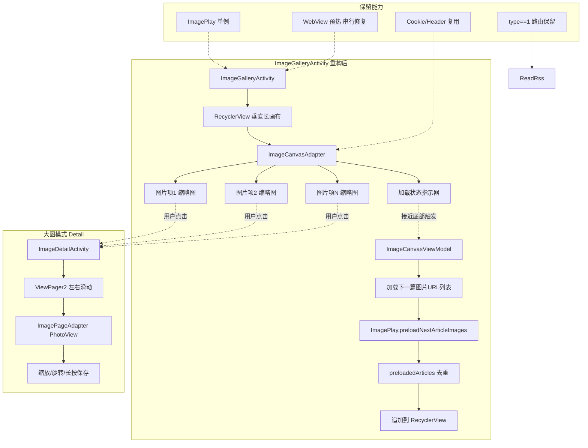

# 内置图片播放器垂直画布优化方案 spec

> 状态：🔄 设计中（V4 源码对齐修订完成，待用户审查）
> 来源：用户 2026-07-26 反馈"为什么不是将所有的图片按顺序在一个画布按上到下依次多线程去请求加载获取，当用户点击其中一个图片的时候，再使用现在的这种左右滚动式的播放查看呢？并且一个画布加载所有当看到最后一个用户下拉的时候开始下一个列表内容的加载"
> 上游依赖：
> - [player-review-and-optimization](../player-review-and-optimization/spec.md)（图片播放器审查与优化整合，本 spec 取代其图片部分）
> - [thread-pool-split-config](../thread-pool-split-config/spec.md)（提供 `AppConfig.updateCacheThreadCount` 配置，默认16，用于 ViewModel 协程并发）
> - [rss-concurrency-and-checksource-optimization](../rss-concurrency-and-checksource-optimization/spec.md)（提供 `AppConfig.imageLoadConcurrency` 配置，默认5，用于 Glide 图片加载并发）

## 1. Intent（意图）

用户 2026-07-26 在审查 player-review-and-optimization 设计方案时，对图片播放器的核心交互架构提出了根本性质疑："为什么不是将所有的图片按顺序在一个画布按上到下依次多线程去请求加载获取，当用户点击其中一个图片的时候，再使用现在的这种左右滚动式的播放查看呢？并且一个画布加载所有当看到最后一个用户下拉的时候开始下一个列表内容的加载"。

本 spec 的核心意图是：**从根本上重构图片播放器的交互架构**，从现有"双 ViewPager2 嵌套（外层文章垂直切换 + 内层图片水平切换）"重构为"单 RecyclerView 垂直长画布（所有图片按顺序多线程加载）+ 点击进入 ViewPager2 大图模式（左右滑动）+ 滚动到底部自动加载下一篇"，对齐小红书/抖音图文/漫画阅读器等主流移动端图片浏览体验。

**V2 上游依赖说明**：本 spec 复用两个上游 spec 提供的协程池配置项：
- `AppConfig.imageLoadConcurrency`（默认5，Glide 图片加载并发，由 `LegadoGlideModule.setSourceExecutor` 应用到 Glide 自带线程池）—— 用于列表模式 Glide 异步加载
- `AppConfig.updateCacheThreadCount`（默认16，更新+缓存场景，语义匹配"缓存文章图片 URL 列表"）—— 用于 ViewModel 协程并发（Rss.getContentAwait 解析文章图片 URL）
- 若上游 spec 未实施，本 spec 降级为硬编码默认值（详见 tasks 0.5 任务）

**核心诉求清单**（基于用户 2026-07-26 反馈）：

| # | 用户原话摘要 | 本 spec 响应 |
|---|------------|------------|
| 1 | "所有图片按顺序在一个画布按上到下依次多线程去请求加载" | 单 RecyclerView 垂直长画布 + Glide 多线程异步加载（复用 AppConfig.imageLoadConcurrency 默认5）+ ViewModel 协程并发（复用 AppConfig.updateCacheThreadCount 默认16） |
| 2 | "当用户点击其中一个图片的时候，再使用现在的这种左右滚动式的播放查看" | 点击缩略图进入 ViewPager2 大图模式（左右滑动），保留 PhotoView 缩放/旋转/长按能力 |
| 3 | "一个画布加载所有当看到最后一个用户下拉的时候开始下一个列表内容的加载" | RecyclerView 滚动监听 + 接近底部触发加载下一篇图片 URL 列表 + 加载状态指示器 |
| 4 | "这样是不是更合理" | 深度分析后确认更合理（见 §3 Approach 的 Alternatives Considered 对比矩阵） |
| 5 | "深度分析并补充" | 本 spec 完整覆盖 Intent/Scope/Approach/Requirements/Scenarios 五要素，含 Alternatives Considered + Drawbacks |

## 2. Scope（范围）

### 2.1 在范围内（必须覆盖）

**核心架构重构**：
- 重写 `ImageGalleryActivity`：从双 ViewPager2 嵌套改为单 RecyclerView 垂直长画布 + 嵌套 ViewPager2 大图模式
- 新建 `ImageCanvasAdapter`：RecyclerView 适配器，管理所有图片的垂直列表
- 新建 `ImageDetailActivity`（或保留 ImageGalleryActivity 内嵌大图模式）：ViewPager2 左右滑动大图
- 新建 `ImageCanvasViewModel`：管理所有图片 URL 列表 + 分页加载状态

**列表模式能力**：
- 单 RecyclerView 垂直长画布（LinearLayoutManager）
- 多线程并行加载（Glide 异步 + 协程池限流）
- 图片尺寸自适应（宽度填满，高度按宽高比计算）
- 加载中/加载失败/重试状态指示

**大图模式能力**：
- 点击缩略图进入 ViewPager2 大图模式（左右滑动）
- 保留 PhotoView 缩放/旋转/长按保存
- 初始定位到用户点击的图片索引
- 沉浸式全屏（WindowInsetsControllerCompat）
- 返回列表模式保持点击位置可见
- **V2 O-2 补充**：大图模式横屏保留 horizontal（与竖屏一致，不切换为垂直滚动）；横屏时 ViewPager2 仍左右滑动，PhotoView 缩放/旋转能力不受影响

**分页加载能力**：
- RecyclerView 滚动监听（LinearLayoutManager.findLastVisibleItemPosition）
- 接近底部触发加载下一篇图片 URL 列表
- 加载状态指示器（加载中/加载失败/没有更多了）
- 去重机制（preloadedArticles）

**保留现有架构能力**：
- ImagePlay 单例状态传递（rssSource / rssArticles / rssArticleIndex）（V4 B-14：删除 currentPlayHeaders，header 从 rssSource 提取；position → rssArticleIndex 与源码一致）
- WebView 预热机制（initPreheatWebView / startPreheat / preheatedDomains，**修复 Bug2 串行预热**，V4 C-3：复用现有 pendingPreheatDomains 字段）
- Cookie/Header 复用（sourceOriginOption + refererOption 注入，从 rssSource 提取 header）
- type==1 路由保留（ReadRss.kt L24-44，V4 B-13：articleStyle==2 → record.type==1）
- 图片旋转工具栏（仅大图模式显示）
- 图片保存/分享长按菜单
- 沉浸式 API 升级（SYSTEM_UI_FLAG → WindowInsetsControllerCompat）

**错误降级链**（对齐视频播放器四级降级）：
- 降级1：Glide 直接加载（含 Referer/Cookie 注入）
- 降级2：OkHttp + sourceOriginOption + refererOption 兜底
- 降级3：WebView 预热获取 Cloudflare cookies 后重试
- 降级4：降级为网页模式（ReadRssActivity，用户主动选择）

**架构风格对齐**（继承 player-review-and-optimization 风格统一诉求）：
- TitleBar 颜色硬编码改主题色（#80000000/Color.WHITE → primaryColor/primaryTextColor）
- AlertDialog 改走 alert DSL + applyTint()
- 按钮背景统一 bg_overlay_button（12dp 圆角 + #80000000）
- 圆角规范统一 12dp

### 2.2 不在范围内（明确排除）

- **视频播放器相关改造**：仍在 player-review-and-optimization 中进行，本 spec 不涉及
- **音频路径（AudioPlayService）改造**：与图片播放器无关
- **图片订阅源规则引擎改造**：本 spec 仅涉及图片播放器 UI 层，规则引擎（AnalyzeRule/AnalyzeUrl）保持不变
- **RSS 文章列表 UI 改造**：本 spec 仅涉及图片播放器内部，RSS 文章列表（RssArticlesFragment）保持不变
- **PhotoView 第三方库改造**：保留现有 PhotoView 库，不修改其内部实现
- **Glide 库升级**：保留现有 Glide 版本，仅调整 RequestOptions 配置
- **图片加密解密（coverDecodeJs）改造**：保持现有解密机制，本 spec 不涉及
- **横屏适配完整重写**：本期保留现有横屏 centerCrop 决策，仅评估垂直画布在横屏的体验下降（P2 长期建议）
- **图片格式扩展（WebP/AVIF）**：保留现有 Glide 自动识别，不扩展新格式支持
- **图片本地缓存策略重写**：保留 Glide 默认磁盘缓存策略，仅调整缓存大小（P2 可选优化）

## 3. Approach（方案）

### 3.1 Selected Approach（选定方案）

**垂直画布 + 点击大图 + 分页加载** 三层架构：

#### 3.1.1 架构总览

#### 3.1.2 核心改造决策

1. **架构层**：废弃双 ViewPager2 嵌套，改用 RecyclerView + ViewPager2 分离架构
   - 列表模式：单 RecyclerView（垂直长画布，所有图片按顺序排列）
   - 大图模式：独立 ImageDetailActivity（ViewPager2 左右滑动，PhotoView 缩放）
   - 模式切换：用户点击缩略图进入大图模式，大图模式返回键回到列表模式

2. **数据层**：扁平化图片 URL 列表 + 分页加载
   - 当前文章所有图片 URL 一次性加载到 RecyclerView（多线程并行下载）
   - 滚动到底部自动加载下一篇文章的图片 URL，追加到 RecyclerView 末尾
   - 跨文章图片按"文章1图片1, 文章1图片2, ..., 文章2图片1, 文章2图片2, ..."顺序排列

3. **加载层**：Glide 多线程异步 + 协程池限流
   - 所有图片 Glide 异步加载（Glide 自带线程池）
   - 协程池限流（默认 4 并发）控制总并发数，避免内存压力
   - 缩略图模式（Glide override(targetWidth, targetHeight)）减少内存占用

4. **状态层**：ImagePlay 单例扩展（V4 B-14：字段名核实）
   - 保留现有字段：rssSource / rssArticles / rssArticleIndex / currentImageUrls（单文章缓存）
   - 删除假设字段：currentPlayHeaders（不存在，header 从 rssSource 提取）/ position（实际为 rssArticleIndex）
   - 新增字段：allImageUrls: MutableStateFlow<List<ImageCanvasItem>>（V3 B-6 StateFlow 封装）/ loadedArticleIndices: MutableSet<Int> / preloadedArticles: MutableSet<Int>
   - 新增方法：appendItems() / clearImageCanvasState() / resetForNewSource()

5. **复用层**：保留 WebView 预热 + Cookie 复用
   - WebView 预热改为串行队列（修复 Bug2）
   - sourceOriginOption + refererOption 注入 Glide RequestOptions
   - CookieManager.flush() 同步 cookies 到 CookieStore 供 Glide 复用

### 3.2 Alternatives Considered（否决的替代方案）

| 替代方案 | 否决理由 |
|---------|---------|
| **方案A：保留双 ViewPager2 嵌套，仅修复 Bug1/Bug2/Bug3** | 否决：用户明确质疑"为什么不是将所有图片按顺序在一个画布按上到下依次多线程去请求加载"——本质是要求**重构交互架构**而非修补 Bug。即便修复 Bug1/Bug2/Bug3，双 ViewPager2 嵌套仍存在交互维度混乱（外层垂直+内层水平）、跨文章预加载受限、无法快速概览全部图片等根本性问题。修补无法满足用户对"现代图片浏览体验"的核心诉求。 |
| **方案B：保留双 ViewPager2 嵌套，外层改垂直 RecyclerView** | 否决：外层改 RecyclerView 后，每个文章项仍需嵌套 ViewPager2 显示图片，本质上仍是双 ViewPager2 嵌套（仅外层换为 RecyclerView），并未消除交互维度混乱。同时 RecyclerView 嵌套 ViewPager2 的内存泄漏风险更高（每个 ViewHolder 持有 ViewPager2 + adapter 引用）。本 spec 的方案是**完全扁平化**所有图片到单个 RecyclerView，彻底消除嵌套。 |
| **方案C：使用 Coil 替代 Glide** | 否决：项目已深度集成 Glide（OkHttpStreamFetcher / RequestOptions / GlideApi），改用 Coil 需重写整个图片加载链路（包括 sourceOriginOption/refererOption 注入、Cookie 复用、磁盘缓存策略等），工作量巨大且收益不明确。Glide 的多线程异步加载 + lifecycle 感知 + RecyclerView 自动回收已能满足本 spec 需求。 |
| **方案D：大图模式用 Fragment 而非独立 Activity** | 否决：用 Fragment 嵌套在 ImageGalleryActivity 内虽能减少 Activity 切换开销，但 Fragment 生命周期复杂（onHiddenChanged/onResume/onPause 时序混乱），且与现有 ImagePageAdapter 的 PhotoView 能力迁移成本高。独立 ImageDetailActivity 生命周期清晰，且可通过 ActivityOptions 共享元素动画实现平滑过渡。**作为 P2 长期优化保留**：未来可评估 Fragment 方案减少 Activity 切换开销。 |
| **方案E：使用 Compose 重写图片播放器** | 否决：项目主体仍用 View 体系（XML + ViewBinding + RecyclerView），仅 SearchActivity 等少数页面用 Compose。Compose 重写图片播放器需引入 Compose ViewModel 集成、rememberable 状态管理、Coil-Compose 等新依赖，与现有架构割裂。本 spec 优先保持架构一致性，**Compose 重写作为 P3 长期建议**保留。 |
| **方案F：大图模式直接复用现有 ImagePageAdapter 不拆分** | 否决：现有 ImagePageAdapter 与 ImageArticlePagerAdapter 强耦合（通过 ImageArticlePagerAdapter.bind 持有内层 adapter 引用），直接复用会带入双 ViewPager2 嵌套的历史包袱。本 spec 拆分 ImageDetailActivity + ImageDetailAdapter（基于现有 ImagePageAdapter 逻辑精简），剥离与 ImageArticlePagerAdapter 的耦合，保留 PhotoView 缩放/旋转/长按能力。 |
| **方案G：分页加载用 Paging3 库** | 否决：Paging3 引入新的数据源（PagingSource）、响应式流（Flow）、UI 集成（LazyListItemsSnapshot）等概念，学习成本高且与现有 ImagePlay 单例 + Rss.getContentAwait 协程模型不匹配。本 spec 用 RecyclerView.OnScrollListener + 协程 async 实现简单分页加载，足够满足"滚动到底部加载下一篇"需求。**作为 P2 长期优化保留**：未来若需支持无限滚动 + 复杂分页策略可评估 Paging3。 |
| **方案H：垂直画布用 LazyColumn（Compose）而非 RecyclerView** | 否决：同方案E，项目主体是 View 体系，引入 Compose LazyColumn 需重写整个 UI 层。RecyclerView + LinearLayoutManager + Glide 已是成熟方案，性能足够。 |
| **方案I：图片高度固定（统一 16:9 或 4:3）避免布局抖动** | 否决：固定高度会扭曲图片宽高比，违反"适配性最大展示"诉求。本 spec 采用**宽度填满 + 高度按宽高比计算**方案，对未知宽高比的图片（如 WebP/GIF）通过 Glide 的 RequestListener.onResourceReady 回调动态获取尺寸后更新 ViewHolder 布局。 |

### 3.3 Drawbacks（选定方案的缺点）

1. **重构范围较大**：需重写 ImageGalleryActivity 主架构 + 新建 ImageCanvasAdapter/ImageDetailActivity/ImageCanvasViewModel 等 4+ 文件，实施周期较长（预估 2-3 周含真机验证）

2. **大图模式与列表模式的状态同步复杂**：用户在大图模式切换图片后返回列表，列表需通过 `recyclerView.scrollToPosition(currentIndex)` 滚动到对应位置，可能存在位置计算偏差（如列表已回收该位置的 ViewHolder）

3. **图片高度预测与布局抖动**：垂直画布要求每张图片在加载前已知高度（避免布局抖动）。对未知宽高比的图片，需先用 Glide 的 RequestListener.onResourceReady 获取尺寸后更新 ViewHolder 布局，加载期间显示默认高度（如屏幕高度的 60%），可能导致轻微抖动

4. **内存压力增加**：垂直画布同时加载多张图片（可视区域 + 缓存项），相比双 ViewPager2 仅相邻 2-3 张预加载，内存占用增加。缓解措施：Glide override(targetWidth, targetHeight) 限制缩略图尺寸 + RecyclerView.setItemViewCacheSize(2) 控制缓存项数

5. **大图模式独立 Activity 的过渡动画**：从列表模式缩略图过渡到大图模式原图，需用 ActivityOptions.makeSceneTransitionAnimation 实现共享元素动画，若图片尚未加载完成则过渡动画可能闪烁

6. **横屏体验下降**：横屏时垂直画布可见图片数减少，用户需更多滚动。**接受理由**：图片订阅源主要用于竖屏浏览（手机自然握持），横屏为次要场景；保留现有横屏 centerCrop 决策（player-review-and-optimization AD-06 R3），横屏时大图模式仍可用

7. **跨文章图片混排可能误导用户**：所有文章的图片扁平化排列，用户可能误以为是同一文章的图片。**缓解措施**：在文章边界处显示分隔符（如"—— 下一篇 ——"分隔条），且大图模式 TitleBar 显示"文章N/M 图片X/Y"页码

8. **WebView 预热时机调整**：现有架构在 ImageGalleryActivity 初始化时预热所有域名，新架构需在 RecyclerView 滚动到包含未预热域名的图片时触发预热，可能增加首张图片加载延迟。**缓解措施**：保留初始化时预热当前文章所有域名，滚动到新文章时再预热新域名

9. **取代 player-review-and-optimization 图片部分导致文档迁移成本**：原 player-review-and-optimization 的图片相关 ADR（AD-03/04/05/06/07）需迁移到本 spec，且原 spec 的图片任务清单需标记为"已废弃，由 image-player-vertical-canvas-optimization 取代"

### 3.4 Prior Art（类似工作的参考）

| 参考方案 | 借鉴点 | 差异点 |
|---------|--------|--------|
| **小红书图文流** | 垂直 RecyclerView + 缩略图 + 点击进入大图 ViewPager | 小红书是混合内容流（图文+视频+商品），本 spec 是纯图片流；小红书大图模式用 Fragment，本 spec 用独立 Activity |
| **抖音图文** | 垂直滚动 + 全屏沉浸式 + 自动播放 | 抖音是单图全屏切换，本 spec 是列表浏览 + 按需大图 |
| **漫画阅读器（Tachiyomi/Mihon）** | 垂直长画布 + 多线程加载 + 分页加载下一篇 | 漫画是连续长图，本 spec 是离散图片；漫画用 Coil，本 spec 用 Glide |
| **legado 漫画阅读（ReadManga）** | ReadBook 内嵌 RecyclerView 垂直滚动漫画 | 漫画是书籍章节，本 spec 是 RSS 文章图片流；漫画无大图模式（已是大图） |
| **player-review-and-optimization 图片部分** | WebView 预热 / Cookie 复用 / type==1 路由保留（V4 B-13：articleStyle → record.type）/ 图片降级链 / 沉浸式 API 升级 | 原 spec 是修补双 ViewPager2，本 spec 是彻底重构；保留原 spec 的能力补全（header/cookie/预加载/降级链/路由回退） |

## 4. Requirements（需求，按优先级）

### 4.1 P0 必须（核心架构重构，阻断交付）

#### 架构重构 P0（5 项）

**R1.1 重写 ImageGalleryActivity 主架构（双 ViewPager2 → 单 RecyclerView + 大图 Activity）**
- 需求：废弃双 ViewPager2 嵌套架构，改为单 RecyclerView 垂直长画布 + 点击进入 ImageDetailActivity 大图模式
- 验证：Grep 确认 ImageGalleryActivity 中无 ImageArticlePagerAdapter 引用；Read 确认 ImageGalleryActivity 持有 RecyclerView 实例
- 文件：`app/src/main/java/io/legado/app/ui/image/ImageGalleryActivity.kt`

**R1.2 新建 ImageCanvasAdapter（RecyclerView 适配器）**
- 需求：新建 RecyclerView.Adapter，管理所有图片的垂直列表，支持多 ViewType（图片项/加载状态指示器/文章分隔符）
- 验证：Read 确认 ImageCanvasAdapter 继承 RecyclerView.Adapter；包含 onCreateViewHolder/onBindViewHolder/getItemViewType 实现
- 文件：`app/src/main/java/io/legado/app/ui/image/adapter/ImageCanvasAdapter.kt`（新建）

**R1.3 新建 ImageDetailActivity（大图模式 Activity）**
- 需求：新建独立 Activity 承载 ViewPager2 左右滑动大图，保留 PhotoView 缩放/旋转/长按能力
- 验证：Read 确认 ImageDetailActivity 继承 VMBaseActivity；持有 ViewPager2 实例；初始定位到用户点击的图片索引
- 文件：`app/src/main/java/io/legado/app/ui/image/ImageDetailActivity.kt`（新建）

**R1.4 新建 ImageDetailAdapter（大图模式适配器）**
- 需求：新建 FragmentStateAdapter 或 RecyclerView.Adapter 承载 PhotoView 大图，剥离与 ImageArticlePagerAdapter 的耦合
- 验证：Read 确认 ImageDetailAdapter 含 PhotoView 缩放/旋转/长按保存实现
- 文件：`app/src/main/java/io/legado/app/ui/image/adapter/ImageDetailAdapter.kt`（新建）

**R1.5 新建 ImageCanvasViewModel（列表模式 ViewModel）**
- 需求：新建 ViewModel 管理所有图片 URL 列表 + 分页加载状态 + 协程取消
- 验证：Read 确认 ImageCanvasViewModel 含 allImageUrls/loadedArticleIndices 字段；含 loadNextArticle() 方法；含 loadJob 取消机制
- 文件：`app/src/main/java/io/legado/app/ui/image/ImageCanvasViewModel.kt`（新建，取代现有 ImageGalleryViewModel）

#### 列表模式能力 P0（4 项）

**R1.6 单 RecyclerView 垂直长画布实现**
- 需求：使用 LinearLayoutManager + RecyclerView 实现垂直滚动；setItemViewCacheSize(2) 控制缓存；Glide.with(this).pauseRequests() 在快速滚动时暂停加载
- 验证：Read 确认 ImageGalleryActivity 含 RecyclerView + LinearLayoutManager 初始化
- 文件：`app/src/main/java/io/legado/app/ui/image/ImageGalleryActivity.kt`

**R1.7 多线程并行加载（Glide 异步 + 协程池配置复用）**
- 需求：所有图片 Glide 异步加载（复用 `AppConfig.imageLoadConcurrency` 默认5，Glide 自带线程池由 LegadoGlideModule.setSourceExecutor 控制）；ViewModel 协程并发（Rss.getContentAwait 解析文章图片 URL）复用 `AppConfig.updateCacheThreadCount` 默认16（语义匹配：缓存文章图片 URL 列表）；监听 LiveEventBus 配置变更事件，运行时重建协程池
- 上游依赖：`thread-pool-split-config`（提供 updateCacheThreadCount 配置）+ `rss-concurrency-and-checksource-optimization`（提供 imageLoadConcurrency 配置）
- 验证：Grep 确认 ImageCanvasAdapter 中 Glide.with(itemView.context).load(url).into(imageView) 异步加载；Grep 确认 ImageCanvasViewModel 中使用 AppConfig.updateCacheThreadCount 控制协程并发数
- 文件：`app/src/main/java/io/legado/app/ui/image/adapter/ImageCanvasAdapter.kt` + `app/src/main/java/io/legado/app/ui/image/ImageCanvasViewModel.kt`

**R1.8 图片尺寸自适应（宽度填满 + 高度按宽高比计算）**
- 需求：宽度 match_parent，高度通过 Glide RequestListener.onResourceReady 获取原始尺寸后动态计算（height = screenWidth * bitmap.height / bitmap.width）；加载期间显示默认高度（屏幕高度 60%）
- 验证：Read 确认 ImageCanvasAdapter 含 RequestListener.onResourceReady 回调；含动态高度计算逻辑
- 文件：`app/src/main/java/io/legado/app/ui/image/adapter/ImageCanvasAdapter.kt`

**R1.9 缩略图模式（Glide override 限制尺寸）**
- 需求：列表模式默认加载缩略图（Glide.override(screenWidth, screenWidth * 2)），点击进入大图时加载原图
- 验证：Grep 确认 ImageCanvasAdapter 中 Glide.override 调用
- 文件：`app/src/main/java/io/legado/app/ui/image/adapter/ImageCanvasAdapter.kt`

#### 大图模式能力 P0（3 项）

**R1.10 点击缩略图进入大图模式（ActivityOptions 共享元素动画）**
- 需求：用户点击缩略图，通过 ActivityOptions.makeSceneTransitionAnimation 启动 ImageDetailActivity，传递点击的图片索引
- 验证：Read 确认 ImageCanvasAdapter 中 setOnClickListener 启动 ImageDetailActivity；含 ActivityOptions 共享元素动画
- 文件：`app/src/main/java/io/legado/app/ui/image/adapter/ImageCanvasAdapter.kt` + `app/src/main/java/io/legado/app/ui/image/ImageDetailActivity.kt`

**R1.11 ViewPager2 左右滑动 + 初始定位**
- 需求：ImageDetailActivity 中 ViewPager2 orientation=horizontal；初始定位到用户点击的图片索引（viewPager.setCurrentItem(index, false)）
- 验证：Read 确认 ImageDetailActivity 含 ViewPager2 初始化；含 setCurrentItem(index, false)
- 文件：`app/src/main/java/io/legado/app/ui/image/ImageDetailActivity.kt`

**R1.12 PhotoView 缩放/旋转/长按保存（保留现有能力）**
- 需求：迁移现有 ImagePageAdapter 的 PhotoView 能力到 ImageDetailAdapter；保留双指缩放、双击切换、旋转、长按保存
- 验证：Read 确认 ImageDetailAdapter 含 PhotoView 缩放/旋转/长按实现
- 文件：`app/src/main/java/io/legado/app/ui/image/adapter/ImageDetailAdapter.kt`

#### 分页加载 P0（3 项）

**R1.13 RecyclerView 滚动监听（接近底部触发加载）**
- 需求：RecyclerView.addOnScrollListener 监听 LinearLayoutManager.findLastVisibleItemPosition；接近底部（剩余 3 项）时触发 loadNextArticle()
- 验证：Read 确认 ImageGalleryActivity 含 RecyclerView.addOnScrollListener；含 findLastVisibleItemPosition 判断
- 文件：`app/src/main/java/io/legado/app/ui/image/ImageGalleryActivity.kt`

**R1.14 加载下一篇图片 URL 列表（ImagePlay.preloadNextArticleImages）**
- 需求：调用 ImagePlay.preloadNextArticleImages(currentIndex) 解析下一篇文章图片 URL；preloadedArticles 去重；追加到 allImageUrls
- 验证：Read 确认 ImagePlay.preloadNextArticleImages 实现；含 preloadedArticles 去重
- 文件：`app/src/main/java/io/legado/app/ui/image/ImagePlay.kt`

**R1.15 加载状态指示器（加载中/失败/没有更多）**
- 需求：RecyclerView 底部显示加载状态指示器（多 ViewType）；加载中显示 ProgressBar；加载失败显示重试按钮；没有更多显示"没有更多了"
- 验证：Read 确认 ImageCanvasAdapter 含加载状态 ViewType；含三种状态切换
- 文件：`app/src/main/java/io/legado/app/ui/image/adapter/ImageCanvasAdapter.kt`

#### 保留能力 P0（4 项）

**R1.16 ImagePlay 单例扩展（allImageUrls / loadedArticleIndices 字段，V4 B-14：现状字段核实）**
- 需求：ImagePlay **新增**字段（V4 B-14：现状仅有 rssArticleIndex/rssSource/rssArticles/currentImageUrls 等字段，allImageUrls/loadedArticleIndices/preloadedArticles 均不存在需新增）：
  - allImageUrls: MutableStateFlow<List<ImageCanvasItem>>（V3 B-6 StateFlow 封装，替代 V2 假设的 MutableList<String>）
  - loadedArticleIndices: MutableSet<Int>
  - preloadedArticles: MutableSet<Int>
  - appendItems(items: List<ImageCanvasItem>) / clearImageCanvasState() / resetForNewSource() 方法（@Synchronized 保护）
- 验证：Read 确认 ImagePlay 含上述新字段和方法；@Synchronized 保护并发访问；Grep 确认无外部直接访问 _allImageUrls.value（仅 ImagePlay 内部）
- 文件：`app/src/main/java/io/legado/app/ui/image/ImagePlay.kt`

**R1.17 WebView 预热机制保留 + 串行修复（Bug2）**
- 需求：保留 initPreheatWebView / startPreheat / preheatedDomains；修复 Bug2（forEach loadUrl 改为串行队列）
- 验证：Read 确认 WebView 预热改为串行（onPageFinished 后再加载下一个域名）；preheatedDomains 去重生效
- 文件：`app/src/main/java/io/legado/app/ui/image/ImageGalleryActivity.kt`

**R1.18 Cookie/Header 复用（sourceOriginOption + refererOption 注入，V4 B-14：删除 currentPlayHeaders）**
- 需求：保留 OkHttpStreamFetcher 的 sourceOriginOption + refererOption 注入；header 从 ImagePlay.rssSource 提取（V4 B-14：currentPlayHeaders 字段不存在，改为从 rssSource 字段提取 header）
- 验证：Grep 确认 ImageCanvasAdapter 中 Glide RequestOptions 注入 Referer/Cookie；Grep 确认无 ImagePlay.currentPlayHeaders 引用
- 文件：`app/src/main/java/io/legado/app/ui/image/adapter/ImageCanvasAdapter.kt` + `app/src/main/java/io/legado/app/ui/image/ImagePlay.kt`

**R1.19 type==1 路由保留（ReadRss.kt L24-44，V4 B-13：articleStyle → record.type）**
- 需求：保留 ReadRss.kt L24-44 的路由逻辑（record.type==1 走 readNoHtml 启动 ImageGalleryActivity，record.type==0 走 ReadRssActivity 网页模式，record.type==2 走 VideoPlayerActivity）；ReadRss.readNoHtml 仍设置 ImagePlay 单例字段后启动 ImageGalleryActivity
- 验证：Read 确认 ReadRss.kt L24-44 路由逻辑不变；record.type==1 仍启动 ImageGalleryActivity
- 文件：`app/src/main/java/io/legado/app/ui/rss/read/ReadRss.kt`

#### 错误降级链 P0（1 项）

**R1.20 图片加载失败四级降级链**
- 需求：实现 Glide→OkHttp+Cookie→WebView 预热→网页模式 四级降级链；Glide RequestListener.onLoadFailed 触发降级
- 验证：Read 确认 ImageCanvasAdapter 含 retryWithFreshCookie 函数；四级降级链完整
- 文件：`app/src/main/java/io/legado/app/ui/image/adapter/ImageCanvasAdapter.kt`

#### V3 新增阻塞点修复 P0（5 项，对应 B-6~B-10）

**R1.21 allImageUrls 多线程并发安全（V3 B-6）**
- 需求：ImagePlay.allImageUrls 改用 `MutableStateFlow<List<ImageCanvasItem>>` 替代 `MutableList<ImageCanvasItem>`；所有读写通过 `@Synchronized` 方法封装（appendItems/clearImageCanvasState/resetForNewSource）；Adapter 读取时通过 `ImagePlay.allImageUrls.value` 获取不可变快照
- 验证：Read 确认 ImagePlay 含 `private val _allImageUrls = MutableStateFlow<List<ImageCanvasItem>>(emptyList())`；Grep 确认无直接访问 `_allImageUrls.value =` 的外部代码（仅 ImagePlay 内部）
- 文件：`app/src/main/java/io/legado/app/ui/image/ImagePlay.kt`
- 关联 ADR：design.md AD-09

**R1.22 列表 position 与大图 imageIndex 双向映射（V3 B-7）**
- 需求：ImageCanvasAdapter 新增 `listPositionToImageIndex(listPos: Int): Int` 和 `imageIndexToListPosition(imageIdx: Int): Int` 双向映射方法；ImageGalleryActivity 进入大图时调用 listPositionToImageIndex 转换并传给 ImageDetailActivity；onActivityResult 时调用 imageIndexToListPosition 转换回 listPos 调用 scrollToPosition
- 验证：Read 确认 ImageCanvasAdapter 含两个映射方法；Read 确认 ImageGalleryActivity 含转换调用
- 文件：`app/src/main/java/io/legado/app/ui/image/adapter/ImageCanvasAdapter.kt` + `ImageGalleryActivity.kt`
- 关联 ADR：design.md AD-10

**R1.23 协程池重建任务处理（V3 B-8）**
- 需求：ImageCanvasViewModel 新增 `onCoroutinePoolConfigChanged(newSize: Int)` 方法；执行「取消 loadJob → shutdown 旧协程池（awaitTermination 5 秒）→ 创建新协程池 → 重新触发 loadNextArticle」四步流程；loadJob 内部加 `ensureActive()` 检查支持协程取消
- 验证：Read 确认 ImageCanvasViewModel 含 onCoroutinePoolConfigChanged 方法；含 awaitTermination(5, SECONDS)；Grep 确认 loadNextArticle 内含 ensureActive() 调用
- 文件：`app/src/main/java/io/legado/app/ui/image/ImageCanvasViewModel.kt`
- 关联 ADR：design.md AD-11

**R1.24 跨订阅源切换 allImageUrls 清理（V3 B-9）**
- 需求：ImagePlay 新增 `@Synchronized fun resetForNewSource()` 方法（清空 allImageUrls + loadedArticleIndices + preloadedArticles）；ImagePlay.init() 方法首行调用 resetForNewSource()；用户主动切换订阅源时（ImageGalleryActivity 换源按钮）调用 resetForNewSource()
- 验证：Read 确认 ImagePlay 含 resetForNewSource 方法；Read 确认 ImagePlay.init() 首行调用 resetForNewSource()
- 文件：`app/src/main/java/io/legado/app/ui/image/ImagePlay.kt`
- 关联 ADR：design.md AD-12

**R1.25 ViewHolder 复用闪烁修复（V3 B-10）**
- 需求：ImageCanvasAdapter.onBindViewHolder 中先重置高度为默认值（屏幕高度 60%）再加载新图片；onViewRecycled 中调用 `Glide.with(ctx).clear(imageView)` 释放图片资源；ImageGalleryActivity 配置 `recyclerView.setHasFixedSize(false)` 允许动态高度；onLoadFailed 时高度设为屏幕高度 40%
- 验证：Read 确认 onBindViewHolder 含 `lp.height = defaultHeight` 重置；Grep 确认含 `Glide.with(...).clear(imageView)` 调用；Read 确认 setHasFixedSize(false)
- 文件：`app/src/main/java/io/legado/app/ui/image/adapter/ImageCanvasAdapter.kt` + `ImageGalleryActivity.kt`
- 关联 ADR：design.md AD-13

### 4.2 P1 应该（架构风格对齐 + 体验优化）

#### 架构风格对齐 P1（5 项，继承 player-review-and-optimization）

**R2.1 TitleBar 颜色硬编码改主题色**
- 需求：移除 ImageGalleryActivity.initTitleBar() 中 setBackgroundColor(Color.parseColor("#80000000")) + setTextColor(Color.WHITE) 硬编码，改用 TitleBar 默认主题机制
- 验证：Grep 确认 ImageGalleryActivity 无 Color.parseColor / Color.WHITE 硬编码
- 文件：`app/src/main/java/io/legado/app/ui/image/ImageGalleryActivity.kt`

**R2.2 AlertDialog 改走 alert DSL + applyTint()**
- 需求：长按菜单从 AlertDialog.Builder().setItems() 改为 alert {} DSL；错误兜底从 tvError+btnRetry 改为 alert {} 四级降级
- 验证：Grep 确认 ImageDetailActivity 使用 alert {} DSL
- 文件：`app/src/main/java/io/legado/app/ui/image/ImageDetailActivity.kt`

**R2.3 按钮背景统一 bg_overlay_button（12dp 圆角）**
- 需求：旋转工具栏容器和按钮从 bg_rotate_toolbar（24dp 圆角）改为 bg_overlay_button（12dp 圆角）
- 验证：Grep 确认 ImageDetailActivity 布局无 bg_rotate_toolbar 引用
- 文件：`app/src/main/res/layout/activity_image_detail.xml`（新建）

**R2.4 沉浸式 API 统一（WindowInsetsControllerCompat）**
- 需求：toggleImmersive() 从 window.setFlags(FLAG_LAYOUT_NO_LIMITS) + systemUiVisibility 改为 toggleSystemBar(show) 工具方法
- 验证：Grep 确认 ImageDetailActivity 无 window.setFlags / systemUiVisibility
- 文件：`app/src/main/java/io/legado/app/ui/image/ImageDetailActivity.kt`

**R2.5 圆角规范统一 12dp**
- 需求：旋转工具栏圆角从 24dp 改为 12dp，与页码指示器和视频播放器统一
- 验证：Grep 确认图片模块内部圆角统一 12dp
- 文件：`app/src/main/res/drawable/bg_overlay_button.xml`

#### 体验优化 P1（4 项）

**R2.6 大图模式返回列表保持点击位置可见**
- 需求：用户在大图模式切换图片后返回列表，列表通过 recyclerView.scrollToPosition(currentIndex) 滚动到对应位置
- 验证：Read 确认 ImageDetailActivity 返回时通过 setResult 传递 currentIndex；ImageGalleryActivity 接收后 scrollToPosition
- 文件：`app/src/main/java/io/legado/app/ui/image/ImageDetailActivity.kt` + `ImageGalleryActivity.kt`

**R2.7 文章边界分隔符（"—— 下一篇 ——"）**
- 需求：在文章边界处显示分隔符 ViewType，避免用户误以为所有图片属于同一文章
- 验证：Read 确认 ImageCanvasAdapter 含文章分隔符 ViewType
- 文件：`app/src/main/java/io/legado/app/ui/image/adapter/ImageCanvasAdapter.kt`

**R2.8 大图模式 TitleBar 显示页码（文章N/M 图片X/Y）**
- 需求：大图模式 TitleBar 显示"文章N/M 图片X/Y"页码，让用户清楚当前位置
- 验证：Read 确认 ImageDetailActivity 含页码显示逻辑
- 文件：`app/src/main/java/io/legado/app/ui/image/ImageDetailActivity.kt`

**R2.9 协程取消机制（loadJob?.cancel()）**
- 需求：ImageCanvasViewModel.loadNextArticle() 入口添加 loadJob?.cancel()；快速滚动时避免重复加载
- 验证：Read 确认 ImageCanvasViewModel 含 loadJob 取消机制
- 文件：`app/src/main/java/io/legado/app/ui/image/ImageCanvasViewModel.kt`

### 4.3 P2 可选（架构优化 + 长期建议）

- **R3.1 横屏适配完整重写**：评估横屏时切换为左右滑动模式（保留现有横屏 centerCrop 决策）
- **R3.2 大图模式改 Fragment 减少 Activity 切换开销**：评估 Fragment 嵌套方案（方案D）
- **R3.3 图片格式扩展（WebP/AVIF）**：扩展 Glide 支持新格式
- **R3.4 图片本地缓存策略优化**：调整 Glide 磁盘缓存大小 + 缓存策略
- **R3.5 Compose 重写图片播放器**：评估 Compose LazyColumn + Coil-Compose 方案（方案E）
- **R3.6 Paging3 库引入**：评估 Paging3 支持无限滚动 + 复杂分页（方案G）
- **R3.7 图片预加载策略优化**：基于用户滚动方向预测加载下一篇

## 5. Scenarios（核心验证场景）

### 5.1 列表模式场景

**场景1：进入图片播放器，所有图片按顺序垂直排列多线程加载**
- 前置条件：用户点击图片类型订阅源（type==1）的文章
- 操作：ReadRss.readNoHtml → 设置 ImagePlay 单例字段 → 启动 ImageGalleryActivity
- 预期：RecyclerView 垂直长画布显示；所有图片 Glide 异步加载；宽度填满屏幕；高度按宽高比计算；加载中显示 placeholder
- 验证：logcat Grep "ImageCanvasAdapter.*onBindViewHolder" 确认所有图片项绑定；真机观察垂直滚动流畅

**场景2：快速滚动时暂停加载避免卡顿**
- 前置条件：用户在垂直画布快速滑动
- 操作：用户快速滑动 RecyclerView
- 预期：Glide.with(this).pauseRequests() 暂停加载；滚动停止后 resumeRequests() 恢复加载
- 验证：logcat Grep "Glide.*pauseRequests|Glide.*resumeRequests" 确认暂停/恢复触发

**场景3：图片加载失败显示错误图标 + 重试按钮**
- 前置条件：图片 URL 失效或网络异常
- 操作：Glide 加载失败
- 预期：显示错误图标 + "重试"按钮；点击重试触发四级降级链
- 验证：logcat Grep "ImageCanvasAdapter.*onLoadFailed" 确认失败回调触发

### 5.2 大图模式场景

**场景4：点击缩略图进入大图模式（共享元素动画）**
- 前置条件：用户在列表模式点击某张图片
- 操作：用户点击缩略图
- 预期：通过 ActivityOptions.makeSceneTransitionAnimation 启动 ImageDetailActivity；共享元素动画平滑过渡；ViewPager2 初始定位到点击的图片索引
- 验证：真机观察过渡动画无闪烁；logcat Grep "ImageDetailActivity.*setCurrentItem" 确认初始定位

**场景5：大图模式左右滑动切换图片**
- 前置条件：用户已进入大图模式
- 操作：用户左右滑动 ViewPager2
- 预期：ViewPager2 左右滑动切换图片；PhotoView 支持双指缩放/双击切换/旋转/长按保存
- 验证：真机观察左右滑动流畅；PhotoView 缩放/旋转/长按功能正常

**场景6：大图模式返回列表保持点击位置可见**
- 前置条件：用户在大图模式切换到第 5 张图片后按返回键
- 操作：用户按返回键
- 预期：返回 ImageGalleryActivity；RecyclerView 滚动到第 5 张图片位置；该位置可见
- 验证：真机观察列表滚动到对应位置；logcat Grep "scrollToPosition" 确认滚动触发

### 5.3 分页加载场景

**场景7：滚动到底部自动加载下一篇**
- 前置条件：用户滚动到当前文章最后一张图片
- 操作：用户继续向下滚动
- 预期：RecyclerView 滚动监听触发 loadNextArticle()；显示"加载中..."指示器；加载完成后追加下一篇图片到列表；显示"—— 下一篇 ——"分隔符
- 验证：logcat Grep "loadNextArticle|preloadNextArticleImages" 确认加载触发；真机观察下一篇图片追加显示

**场景8：所有文章加载完成显示"没有更多了"**
- 前置条件：用户已滚动到最后一张图片且无下一篇文章
- 操作：用户继续向下滚动
- 预期：显示"没有更多了"指示器；不再触发加载
- 验证：真机观察底部显示"没有更多了"

**场景9：加载失败显示重试按钮**
- 前置条件：下一篇图片 URL 列表加载失败（网络异常或规则解析失败）
- 操作：loadNextArticle() 失败
- 预期：显示"加载失败 重试"按钮；点击重试重新加载
- 验证：logcat Grep "loadNextArticle.*failed" 确认失败；真机观察重试按钮可点击

### 5.4 保留能力场景

**场景10：多域名 CDN 场景 WebView 串行预热**
- 前置条件：图集包含多个 CDN 域名（如站点A/站点B/站点C），且防护系统A（Cloudflare 类）启用 JS 挑战
- 操作：用户进入图集
- 预期：needPreheat 列出所有域名 → 串行预热（一个域名 onPageFinished 后再加载下一个）→ CookieManager.flush() 同步 cookies → Glide 复用 cookies
- 验证：logcat Grep "preheat.*serial|CookieManager.*flush" 确认串行预热；所有域名图片加载成功

**场景11：图片防盗链失败重试（四级降级链）**
- 前置条件：图片加载返回 401/403（防盗链）
- 操作：Glide 加载失败
- 预期：降级1 Glide 直接加载失败 → 降级2 OkHttp + sourceOriginOption + refererOption 兜底 → 降级3 WebView 预热获取 cookies 后重试 → 降级4 提示用户切换网页模式
- 验证：logcat Grep "retryWithFreshCookie|fallback" 确认降级链触发

**场景12：type==1 路由保留（用户主动选择网页模式时走 ReadRssActivity，V4 B-13：articleStyle → record.type）**
- 前置条件：用户在 RssArticlesFragment 主动选择"网页模式"打开文章（record.type==0）
- 操作：用户点击文章
- 预期：ReadRss.readRss 检测到 record.type==0 → 走 ReadRssActivity → 不启动 ImageGalleryActivity；record.type==1 才启动 ImageGalleryActivity
- 验证：ReadRss.kt L24-44 路由逻辑生效；真机观察 record.type==0 走 ReadRssActivity，record.type==1 走 ImageGalleryActivity

**场景13：快速切换文章协程正确取消**
- 前置条件：用户在垂直画布快速滚动触发多次 loadNextArticle()
- 操作：用户连续快速滚动
- 预期：loadJob?.cancel() 取消上一个加载请求；仅最后一次加载请求执行；postValue 不被覆盖
- 验证：logcat Grep "loadJob.*cancel" 确认协程取消生效；无数据错乱

### 5.5 架构风格场景

**场景14：图片播放器 TitleBar/按钮/弹框风格与视频播放器视觉一致**
- 前置+操作：用户先后进入图片播放器和视频播放器 → 对比 TitleBar 背景/文字色、悬浮按钮背景/圆角、长按菜单/错误对话框样式
- 预期：图片 TitleBar 用 primaryColor（非 #80000000 硬编码）；图片按钮用 bg_overlay_button 12dp 圆角；图片长按菜单/错误用 alert {} DSL；圆角统一 12dp
- 验证：R2.1-R2.5 修复后两者视觉风格一致

**场景15：图片播放器亮/暗主题切换**
- 前置+操作：用户切换亮色/暗色主题 → 进入图片播放器
- 预期：所有颜色跟随主题切换（无硬编码残留）；RecyclerView 背景/TitleBar/按钮/弹框颜色一致
- 验证：真机切换主题观察颜色跟随

### 5.6 边界场景

**场景16：超长图（高度 > 5 倍屏幕高度）垂直滚动**
- 前置条件：图片高度极大（如长截图/长漫画）
- 操作：用户在列表模式浏览超长图
- 预期：图片宽度填满屏幕，高度按宽高比计算（可能超过屏幕高度）；用户可垂直滚动浏览完整图片；不卡顿
- 验证：真机观察超长图垂直滚动流畅；logcat 确认无 OOM

**场景17：图片加载中切换主题**
- 前置条件：图片正在加载中
- 操作：用户切换亮/暗主题
- 预期：placeholder 和已加载图片的颜色跟随主题切换；不出现颜色异常
- 验证：真机切换主题观察颜色一致

---

## 6. 用户反馈响应矩阵

| # | 用户诉求（2026-07-26） | 对应需求 | 对应 ADR | 验证场景 |
|---|---------|---------|---------|---------|
| 1 | "所有图片按顺序在一个画布按上到下依次多线程去请求加载" | R1.6/R1.7/R1.8/R1.9 | AD-01/AD-02/AD-03 | 场景1 |
| 2 | "用户点击其中一个图片的时候，再使用现在的这种左右滚动式的播放查看" | R1.10/R1.11/R1.12 | AD-04/AD-05 | 场景4/5 |
| 3 | "一个画布加载所有当看到最后一个用户下拉的时候开始下一个列表内容的加载" | R1.13/R1.14/R1.15 | AD-06/AD-07 | 场景7/8/9 |
| 4 | "这样是不是更合理" | 完整 Alternatives Considered 对比矩阵（§3.2） | - | - |
| 5 | "深度分析并补充" | 完整五要素（Intent/Scope/Approach/Requirements/Scenarios） | 全部 ADR | 全部场景 |

## 7. 验收标准

### 7.1 代码验收

- 5 个 P0 架构重构任务（R1.1-R1.5）全部完成，Grep 验证无残留双 ViewPager2 嵌套
- 4 个 P0 列表模式能力（R1.6-R1.9）全部完成，真机验证垂直滚动流畅
- 3 个 P0 大图模式能力（R1.10-R1.12）全部完成，真机验证共享元素动画 + 左右滑动 + PhotoView 缩放
- 3 个 P0 分页加载（R1.13-R1.15）全部完成，真机验证滚动到底部加载下一篇
- 4 个 P0 保留能力（R1.16-R1.19）全部完成，Grep 验证 ImagePlay/WebView 预热/Cookie 复用/路由回退无残留
- 1 个 P0 错误降级链（R1.20）完成，真机验证四级降级链触发
- 5 个 P1 架构风格对齐（R2.1-R2.5）完成，Grep 验证无硬编码颜色/旧沉浸式 API/原生 AlertDialog
- 4 个 P1 体验优化（R2.6-R2.9）完成，真机验证状态同步/分隔符/页码/协程取消
- logcat 无"数据错乱"/"适配器复用失效"/"WebView 预热覆盖"警告
- 调试日志无 Log.d/Log.e 残留（统一用 AppLog.put）

### 7.2 文档验收

- design.md 包含完整 ADR Y-Statement（AD-01~AD-07）
- design.md 包含数据流图（垂直画布加载流 + 大图模式切换流 + 分页加载流）
- design.md 包含文件变更清单（新建 4 文件 + 修改 5 文件）
- tasks.md 包含完整任务清单（按 Phase 分层 + AOAdapt 日志模板）
- README.md 状态同步（设计中 → 实施中 → 已完成）
- 取代关系文档化（player-review-and-optimization 图片部分标记为"已废弃，由 image-player-vertical-canvas-optimization 取代"）

### 7.3 用户验收

- 用户核心诉求 5 条 100% 落地（见第 6 节矩阵）
- 真机测试 17 个场景全部通过（场景1-17）
- updateLog.md 同步更新（含垂直画布重构变更条目）
- AskUserQuestion 三选项结构验收通过
