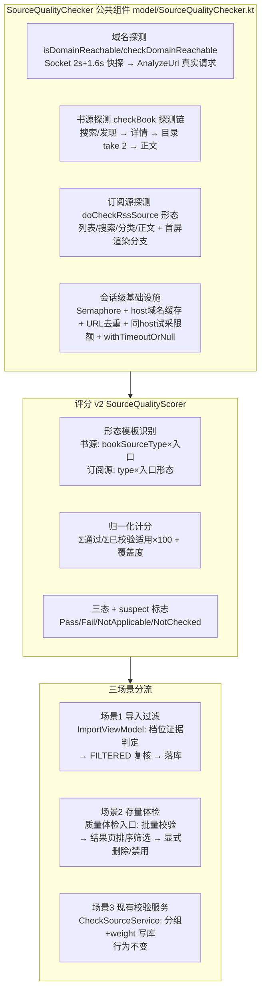
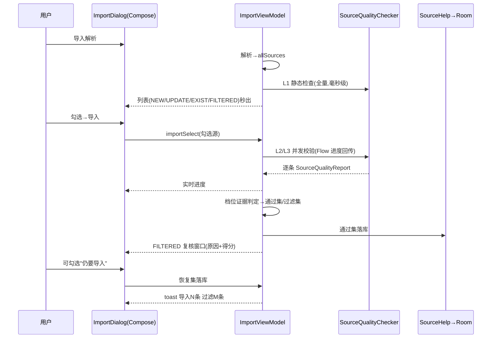

# design：导入源质量过滤与公共源质量校验组件

## Technical Approach

### 公共组件分层架构



### 从 CheckSourceService 剥离清单（实证）

| 现函数 | 位置 | 迁移形态 |
|---|---|---|
| `doCheckSource(source)` | CheckSourceService.kt L201-368 | `suspend checkBookSource(source, options): SourceQualityReport`（分组写库副作用剥离，返回 Report） |
| `checkBook(book, source, isSearchBook)` | L379-427 | 纯探测零依赖，直接平移 |
| `isDomainReachable(domain)` | L166-177 | 零依赖，直接平移 |
| `checkDomainReachable(source)` | L184-199 | 平移（依赖 AnalyzeUrl，可用） |
| 异常分类段（Timeout/js失效/网站失效） | L144-161 | 抽 `classifyCheckFailure(e)` |
| `doCheckRssSource(source)` | CheckRssSourceService.kt L203-359 | `suspend checkRssSource(source, options)` |
| `dedupSources(results)` | L364-387 | 体检场景可选复用 |

可直接复用零改动：WebBook Await 系（searchBookAwait L69 / exploreBookAwait L127 / getBookInfoAwait L180 / getChapterListAwait L253 / getContentAwait L477）；BookSource/RssSource 的 addGroup/hasGroup/removeInvalidGroups/getCheckKeyword；onEachParallel（FlowExtensions L27）。

### SourceQualityReport 字段级定义（A4，实施依据）

```kotlin
data class SourceQualityReport(
    val sourceUrl: String,
    val sourceType: Int,                    // BookSource.bookSourceType / RssSource.type
    val checkedDepth: Int,                  // 1=L1 / 2=L2 / 3=L3
    val dimensions: Map<DimKey, DimResult>, // 各维度结果
    val suspect: Boolean = false,
    val suspectReasons: List<SuspectReason>,// Login/JSLib/SourceVariable/WebView/PrivateAddress 五类
    val failureKind: FailureKind = FailureKind.None, // Timeout/Script/Network/Empty/None（供现有服务映射分组）
    val deterministicFail: Boolean = false, // 宽松档过滤证据
    val score: Int,                         // 归一化 0-100
    val coverage: Float                     // 已校验适用维度数/适用维度总数
)
data class DimResult(
    val state: DimState,                    // Pass/Fail/NotApplicable/NotChecked
    val resultCount: Int = 0,               // 采集条数（搜索/列表维度）
    val durationMs: Long = 0,
    val evidence: String = ""               // 白话原因素材（"网址打不开"等）
)
```

用户层四态映射（P5）：失效=存在 Fail 维度；存疑=suspect；未测=适用维度含 NotChecked；可用=其余。"低分"筛选口径=无 Fail 但 score<60。

### 评分算法 v2：形态模板

现有算法实证缺陷（深研结论）：①file/video 型书源无目录/正文却被按满分缺额计分；②纯发现源被"搜索链接规则为空"惩罚；③RSS startHtml webview 型四维度全跳过→"未校验计满分"虚高；④源变量缺失/登录/jsLib/useWebView 依赖源被系统性误判失效。

v2 修正：**按形态选维度模板 + 已校验维度归一化 + 三态区分 + suspect 存疑**。

书源模板（按 bookSourceType.kt L8-12 常量）：

| 形态 | 适用维度（权重） | 说明 |
|------|----------------|------|
| 文本/音频/图片 + 搜索源 | 域名20 / 搜索30 / 详情15 / 目录15 / 正文20 | searchUrl 空且非 enabledExplore = 结构残缺（L1 滤） |
| 文本/音频/图片 + 发现源 | 域名20 / 发现30 / 详情15 / 目录15 / 正文20 | searchUrl 空**合法**，搜索维度 NotApplicable |
| 文件型(3) | 域名30 / 搜索或发现70 | 无详情/目录/正文（CheckSourceService L394 本就跳过） |
| 视频型(4) | 域名20 / 搜索或发现40 / 目录20 / 正文20 | MacCMS 零规则合法（WebBook.kt L307-313），详情 NotApplicable |

订阅源模板（RssSource.kt type L109-111）：

| 形态 | 适用维度 | 说明 |
|------|---------|------|
| sortUrl/singleUrl 解析型 | 域名20 / 列表40 / 正文20 / 搜索20（searchUrl 空则 NotApplicable） | ruleArticles 空合法（RssParserByRule.kt L49-52 走默认 XML 规则） |
| startHtml webview 型 | 域名20 / 首屏渲染80 | 列表规则本就不存在，改测渲染；宽松档渲染探测失败=存疑放行 |
| 视频型(2) | 域名20 / 列表40 / 线路集数40 | ruleRoutes/ruleEpisodes（L74-76），正文 NotApplicable |

计分公式：`score = Σ(通过维度权重) / Σ(已校验且适用维度权重) × 100`，报告附 `coverage = 已校验适用数/适用总数`。三态：Pass / Fail / NotApplicable（形态不需要或字段缺失合法）/ NotChecked（本次未测）。

suspect 判定五类（实证误判来源）：登录依赖（loginCheckJs/loginUi 存在，未登录 500→整链失败）、jsLib 依赖（searchUrl 引用 jsLib 函数）、源变量依赖（规则含 `{{source.getVariable()}}` 类拼接）、useWebView 型、**内网地址**（S1：字面回环/私有/169.254 网段，默认跳过联网探测防被恶意集合利用做内网扫描，但不过滤不误杀局域网源——宽松档放行+标注）。suspect 源 Fail 不作为导入过滤证据（宽松/标准档强制放行）。

模板实现形态（A7）：维度模板表**数据化**（`List<DimTemplate>` 常量表而非 when 分支硬编码），新增源类型只需加模板数据；TTS 等异构实体的 `SourceProbe` 接口抽象留扩展路径（本期不引入）。

### 导入过滤判定规则表

| 证据 | 产生条件 | 宽松 | 标准 | 严格 |
|------|---------|------|------|------|
| 结构残缺 | L1 必备字段/入口缺失 | 滤 | 滤 | 滤 |
| 域名不可达 | 快探+真实请求均失败 | 滤 | 滤 | 滤 |
| 搜索/列表 0 结果 | 换词重试（可关）后仍 0 | 滤 | 滤 | 滤 |
| 搜索/列表异常 | 重试后仍超时/连接失败 | 放行 | 滤 | 滤 |
| 发现失败 | 发现试采 0 结果/异常 | 放行 | 放行 | 滤 |
| 目录/正文失败 | L3 探测失败 | 放行 | 放行 | 滤 |
| 任何上述证据但 suspect=true | 五类依赖 | 放行 | 放行 | 用户显式选择 |

**断网豁免（四方审查裁决，攻击6 采纳；v4 二轮修正实现方向）**：双信源预检 = 系统网络状态（ConnectivityManager，注意 captive portal 下 isAvailable 仅判 transport 会误报"有网"，NetworkUtils.kt L24-40 实证）+ 实测探针（国内外高可用地址各一，任一可达即正常）。确认断网/探针全不可达 → 全部源标 NotChecked+存疑放行，判定规则表整体短路 + **toast 告知"网络异常，N 条未校验"**（防静默失效）。反向约束：网络正常时不得误触发短路（坏源集合首探失败是常态，须以探针结果而非单源失败判定）。

**结论缓存（四方审查裁决，攻击7 采纳；v4 二轮修正键设计）**：`CacheManager` 键 `importCheckResult:{url}:{严格度档位}:{校验深度}:v{schemaVersion}`，值 = Report 序列化 + lastUpdateTime + 时间戳，TTL 24h；命中条件 = URL 相同 && lastUpdateTime 未变 && 未超 TTL && **档位/深度/版本完全匹配**（防 L2 结论被严格档误用、防评分算法演进后旧缓存反序列化异常）。命中源跳过联网校验直接复用判定（体验：重复导入同集合秒级完成）。Tradeoff：作者改规则不改 lastUpdateTime 仍会命中旧结论（与现有对比逻辑同一盲区，登记接受）；缓存期内源站状态可能已变。

**EXIST 校验范围（攻击8 采纳；v4 二轮补全选语义）**：L1 残缺源不参与 comparisonSource 对比标记；EXIST 源默认不勾选不校验；**"全选"属用户显式行为、含 EXIST**，全选或手动勾选后与 NEW 同规则校验。

**长集合分批落库（v4 二轮裁决5 采纳，ProcessDeath 补强）**：勾选源 > 200 时自动切换分批落库（每 50 条一批），进度条标注"已导入 X 条"；进程被杀后已落库部分保留。≤200 保持整批原子落库（取消 = 无残留）。此消除"校验期 25 分钟长窗口被杀全灭"与第一轮 A6"复核窗口短"论据的不自洽。

### 导入场景时序



### 体检场景流程

管理页菜单"质量体检" → 范围弹框（选中源/当前分组/全部 + 深度选择） → 批量校验（onEachParallel + Flow 进度，无写库） → 体检结果页（新 Activity：四态白话标签筛选 可用/失效/存疑/未测 + 得分排序 + 覆盖度详情 + suspect 标注 + 多选底栏） → 禁用（主按钮）/删除（自动 JSON 备份） → 二次确认 → 执行 → 列表刷新。

**体检会话单例 QualityCheckSession**：应用级 object，**按源类型分书源/订阅源两个独立会话**（A5：防书源/订阅源两管理页同时体检互相覆盖），各持 校验 Job（挂应用级 CoroutineScope，不依赖页面生命周期）、范围源列表、结果 Map、进度 StateFlow；结果页重进即重新订阅；覆盖上一轮前必须**先 cancel 旧 Job 再清结果 Map**（防旧 Flow 继续污染新结果）；完成后可手动释放内存。千条体检中途切页/息屏不中断；进程被杀即中断（接受，重跑）；此模式对齐 CheckSourceService"校验可后台继续"的既有体验，但不引入前台 Service（校验几分钟内完成，进程被杀风险可接受）。

导入场景原子性说明（A6）：importSelect 现状为单事务批量 insert，本身原子；"通过集→复核恢复集"两段落库间被杀仅丢过滤集（本就不落库），可接受；复核窗口被杀则内存态全丢需重导——**不做** CacheManager 暂存（复核窗口存在时间短、被杀概率低、集合重导成本低，暂存反增状态管理复杂度）。

## Architecture Decisions

### AD-01: 校验能力抽象为公共组件，三场景分流消费

- **Version**: v2.0
- **UpdateTime**: 2026-09-13
- **Context**: 用户裁决——导入过滤与存量体检必须共用统一组件；实证 CheckSourceService 的探测函数已是"结果收集"形态（Phase 6 重构红利），剥离成本低
- **Concern**: 两套独立校验逻辑会导致判定标准漂移、双倍维护
- **Decision**: `SourceQualityChecker`（suspend 单源校验器，零写库副作用）+ `SourceQualityReport`；导入=不入库消费、体检=只读展示+显式删除、现有校验服务=分组+weight 写库（底层改调公共组件，行为不变）
- **Goal**: 判定标准单一权威源，场景扩展零成本
- **Tradeoff**: CheckSourceService 改造涉及等价重构需回归验证
- **Status**: Accepted
- **Superseded-by**: 无
- **ChangeLog**: v1.0 仅导入场景；v2.0 按用户裁决扩展公共组件+体检场景

### AD-02: 评分算法 v2 = 形态模板 + 已校验维度归一化 + 三态 + suspect

- **Version**: v2.0
- **UpdateTime**: 2026-09-13
- **Context**: 用户质疑现有算法合理性；深研实证四类缺陷（形态歧视/误判失效/未校验计满分虚高/合法形态被惩罚）
- **Concern**: 直接沿用会误杀合法源（file/video/纯发现/webview RSS/登录源/变量依赖源）
- **Decision**: 见"评分算法 v2：形态模板"章节；判定（导入过滤）与展示（得分）解耦，判定只看证据
- **Goal**: 零形态歧视、分数可比、误判可控可标注
- **Tradeoff**: 归一化口径下"只测域名"的源可得高分（分数意义弱化）→ 以覆盖度字段补偿，UI 展示覆盖度；模板表需随源类型演进维护
- **Status**: Accepted
- **Superseded-by**: 无
- **ChangeLog**: v1.0 直接复用 SourceWeightCalculator；v2.0 深研后重设计

### AD-03: 校验时机 = 勾选导入后、落库前（L1 例外前置）

- **Version**: v1.2
- **UpdateTime**: 2026-09-13
- **Context**: 千条集合导入列表需秒出
- **Decision**: L1（0 网络成本）解析后同步标记；L2/L3 勾选导入后执行，通过源与复核恢复源合并落库
- **Tradeoff**: 导入按钮到落库增加等待；进度+取消缓解
- **Status**: Accepted
- **Superseded-by**: 无
- **ChangeLog**: v1.0 初版；v1.2 四方审查裁决——驳回"先落库后校验"替代案（违反零静默误伤：失效源入库用户开读即受害，且"待筛分组"重新引入分组污染），维持"校验后落库"主体；补大集合强制提示与半程导入缓解

### AD-04: 过滤判定 = 严格度档位 + 确定性失败证据，非纯分数阈值

- **Version**: v1.1
- **UpdateTime**: 2026-09-13
- **Decision**: 三档严格度映射证据组合；网络异常宽松档存疑放行；换词重试后才可判"0 结果"；suspect 源强制放行（宽松/标准）
- **Tradeoff**: 宽松档放过"域名可达但规则全坏"源（体检场景可深度识别）
- **Status**: Accepted
- **Superseded-by**: 无
- **ChangeLog**: v1.0 初版；v1.1 补 suspect 强制放行规则

### AD-05: 过滤复核窗口 + 体检显式删除，全链路零静默丢弃

- **Version**: v1.1
- **UpdateTime**: 2026-09-13
- **Decision**: 导入 FILTERED 态可恢复；体检过程只读、删除/禁用需多选+二次确认
- **Status**: Accepted
- **Superseded-by**: 无
- **ChangeLog**: v1.1 补体检场景

### AD-06: 千条集合性能设计（公共组件内置）

- **Version**: v1.1
- **UpdateTime**: 2026-09-13
- **Decision**: Semaphore(默认8) + host 域名缓存 + 同 URL 去重 + 同 host 试采限额（8 次/会话，超限按首次结果推断） + withTimeoutOrNull 单源硬超时 + Flow 流式聚合 + 弹框销毁 Job.cancel() + **断网预检短路**（见判定规则表后说明） + **结论缓存 TTL 24h**（重复导入同集合秒级完成）。**探测请求防拖库**（S4）：域名真实请求探测优先 HEAD（失败回退 GET），试采响应体超 2MB 截断（AnalyzeUrl 能力核实列入 tasks 1.1）。**JS 桥阻塞上界**（S2）：Rhino 纯 JS 死循环可被超时可靠中断（instructionObserverThreshold 机制，RhinoScriptEngine.kt L327/L340），阻塞在 java.ajax 等桥调用的线程有 OkHttp callTimeout 60s 上界，超时释放信号量后弃线程——接受，报告按维度标注 durationMs。
- **Tradeoff**: 深度模式耗时长（设置弹框提示大集合用快速模式）；同 IP 并发上限（S3）本期不做（DohDns 负缓存+Semaphore+取消已兜底，留扩展路径）
- **Status**: Accepted
- **Superseded-by**: 无
- **ChangeLog**: v1.1 移入公共组件 options

### AD-07: 配置存储 = CacheManager 单例（ImportCheck），零迁移

- **Version**: v1.0
- **UpdateTime**: 2026-09-13
- **Decision**: 键名前缀 `importCheck*`，模式仿 CheckSource；书源/订阅源共用
- **Status**: Accepted
- **Superseded-by**: 无
- **ChangeLog**: 初版

### AD-08: 本期不整体迁移 CheckSourceService，底层探测核心统一即可

- **Version**: v1.1
- **UpdateTime**: 2026-09-13
- **Context**: CheckSourceService 是已稳定交付功能，整体迁移（UI/通知/写库）回归风险与工作量不成比例
- **Decision**: 本期仅将 doCheckSource/doCheckRssSource 的探测段平移至公共组件，服务改为调用组件（等价重构+回归验证）；分组写库/通知/去重等服务层职责保留原地；整体迁移（含 dedupSources/checkDomain 模式统一）留后续迭代
- **等价重构防走样清单**（A2，实施时逐项核对）：
  1. respondTime 回填依赖 `Debug.startChecking`+`Debug.getRespondTime` 计时，平移后服务侧必须保留调用时序，否则 respondTime 恒 0
  2. 服务侧异常分类（超时/js失效/网站失效）依赖组件抛异常，而组件用 withTimeoutOrNull 吞超时 → 组件提供 `failureKind` 枚举，服务映射 failureKind→分组，禁止双通道
  3. 组件内 `ensureActive()` 必须保留，防"协程取消被误记为校验失败"
  4. 现有书源侧探测硬编码 30s 超时、订阅源侧用 CheckRssSource.timeout → 全部参数化为 ProbeOptions，服务侧按原值传入保持行为
  5. 服务自身 onEachParallel(threadCount) 与组件 Semaphore 双层限流相乘 → 组件 options 允许 service 注入并发数（服务传 threadCount，组件默认 8）
  6. removeInvalidGroups/removeErrorComment/lastHost/weight 回填等写库副作用归属边界在组件 API 注释中钉死（组件绝不写库）
- **依赖方向约束**（A1）：ImportCheck/SourceQualityChecker 禁止 import service 包（CheckSource.kt import CheckSourceService 的反向依赖为既有污点，不仿效）
- **Goal**: 统一判定核心的同时控制回归风险
- **Tradeoff**: 服务层仍有两套编排代码并存（有意分层非债务）；公共组件 options 与 CheckSource 配置项短期并存
- **Status**: Accepted
- **Superseded-by**: 无
- **ChangeLog**: v1.0 初版；v1.1 补防走样清单与依赖方向约束

### AD-09: 探测参数统一 ProbeOptions，配置双轨仅作预设档

- **Version**: v1.0
- **UpdateTime**: 2026-09-13
- **Context**: ImportCheck（新）与 CheckSource/CheckRssSource（旧）配置并存，timeout/domainCheckMode 等语义重复，同一源两种校验结论可能矛盾（A3）
- **Decision**: 公共组件唯一入口参数为 `ProbeOptions`（concurrency/timeout/retry/depth/domainProbeMode）数据类；CheckSource 与 ImportCheck 各自映射为 ProbeOptions 预设（旧服务按原值映射保持行为，新场景按新默认值），**禁止两份探测字段独立定义**；语义统一留后续迭代
- **Goal**: 探测语义单一权威源，防漂移
- **Tradeoff**: 短期用户面对两套配置项（入口命名差异化+分工说明缓解 P7）
- **Status**: Accepted
- **Superseded-by**: 无
- **ChangeLog**: 初版（多维红队 A3 产出）

## File Changes

| 文件 | 变更类型 | 说明 |
|------|---------|------|
| `app/src/main/java/io/legado/app/model/ImportCheck.kt` | 新增 | 导入校验配置单例（CacheManager，仿 CheckSource） |
| `app/src/main/java/io/legado/app/model/SourceQualityChecker.kt` | 新增 | 公共单源校验器（剥离自 CheckSourceService L166-427 + CheckRssSourceService L203-359）+ SourceQualityReport + 会话级基础设施（Semaphore/缓存/限额） |
| `app/src/main/java/io/legado/app/model/SourceQualityScorer.kt` | 新增 | 评分 v2：形态模板表 + 归一化计分 + 三态 + suspect 判定 |
| `app/src/main/java/io/legado/app/service/CheckSourceService.kt` | 修改 | doCheckSource/checkBook/isDomainReachable/checkDomainReachable 改调公共组件（等价重构，分组写库/通知保留） |
| `app/src/main/java/io/legado/app/service/CheckRssSourceService.kt` | 修改 | 同上 |
| `app/src/main/java/io/legado/app/ui/config/ImportCheckConfigDialog.kt` | 新增 | 导入校验设置弹框（Compose，仿 CheckSourceConfig） |
| `app/src/main/java/io/legado/app/ui/book/source/manage/BookSourceActivity.kt` | 修改 | 菜单：导入校验设置（L403-424）+ 质量体检入口 |
| `app/src/main/java/io/legado/app/ui/rss/source/manage/RssSourceActivity.kt` | 修改 | 同上（L228-246） |
| `app/src/main/java/io/legado/app/ui/book/source/manage/SourceQualityReportActivity.kt`（含 rss 共用或订阅源侧同构） | 新增 | 体检结果页：得分排序/状态筛选/多选删除禁用/二次确认 |
| `app/src/main/java/io/legado/app/ui/association/ImportBookSourceViewModel.kt` | 修改 | importSource 接 L1；importSelect L96-139 接 L2/L3 + 判定 + 过滤集回传 |
| `app/src/main/java/io/legado/app/ui/association/ImportRssSourceViewModel.kt` | 修改 | 同上（L73-114） |
| `app/src/main/java/io/legado/app/ui/association/ImportBookSourceDialog.kt` | 修改 | FILTERED 态 + 校验进度 + 复核弹框 |
| `app/src/main/java/io/legado/app/ui/association/ImportRssSourceDialog.kt` | 修改 | 同上 |
| `app/src/main/AndroidManifest.xml` | 修改 | 注册体检结果 Activity |
| `app/src/main/res/values/strings.xml`（含 zh-rCN） | 修改 | 新增文案 |

依赖核实项（tasks 1.1）：ImportRssSourceDialog 实际文件名；ImportViewModel 同 URL 去重现状；CheckRssSourceService 首入口采集签名；video 型书源在 WebBook 的零规则分支细节；体检结果页复用 AppManagementScaffold 组件族的可行性。
