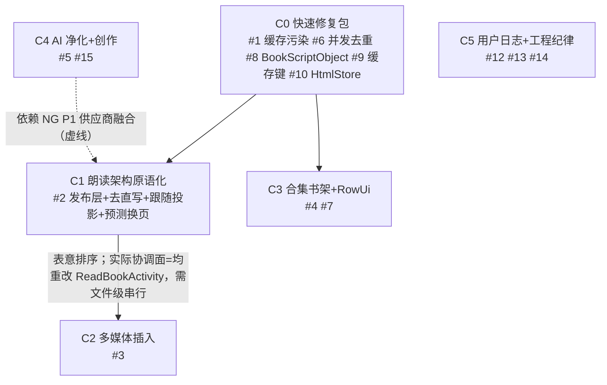

# design.md — legadoC（阅读C）深度对比与迁移总体设计（设计前置版）

> 数据来源：`CCSSNE/legadoC` own 分支 zipball 快照（v3.26.082723c，2026-08-27），本地 `F:\myself\github\WeAgentChat\temp\legadoC_src\legadoC-own`
> 对比基线：本项目 f:\myself\github\WeAgentChat\temp\legado（DB v108）
> 方法：8 轮子代理分析（朗读架构/AI 多媒体/前端 UI/工程安全四域深读 + 网络/规则引擎/数据层/UI 全景四维逐文件 diff），统一事实源 [evidence-pack.md](./evidence-pack.md)
> 定位：**本文件是总体设计。实施级设计前置在 [migration-designs/](./migration-designs/)，未经审查不进入实施。本 spec 独立于 ng-benchmark-analysis（不同对标对象、不同分期体系）。**

## 0. 设计前置声明

1. 每个迁移项必须有实施级设计（legadoC 源码证据→本项目对接点→逐文件映射→DB 变更→风险→验证），过检查点才可写代码
2. legadoC 为**纯 View 体系（0 Compose）且血统不同（阅读R/Archive 系）**——借鉴以"模式+组件级移植"为主，整目录照搬禁止
3. legadoC 与 NG 结论叠加性已验证：朗读原语化架构与 NG 多角色 TTS **正交可叠加**（引擎只需发布 ReadAloudPosition 流）
4. 书源生态零破坏红线同 NG 任务；发现的本项目自有 bug（AnalyzeRule 缓存污染）修复优先级最高

## 1. 全景对比矩阵（8 维度）

| 维度 | legadoC 现状 | 本项目现状 | 判定 |
|------|-------------|-----------|------|
| 网络/协程 | Archive 系基线+cronet 128 动态下载+lazy 引擎（ANR 隐患形态）；CookieStore 原版缺陷；无 CancellationException 守卫 | 8 独有文件+P 系列修复+熔断降级+cronet-bundled 锁定 | **本项目超集**；唯一可借 WebViewHtmlStore（49 行） |
| 规则引擎 | **ResolvedSourceRule 不可变快照**（修复缓存污染）+章节列表并发去重+RowUi 发现页规则渲染+BookScriptObject 防篡改+exploreKinds 多因素缓存+浏览器钩子 3 API | 有 **AnalyzeRule 缓存污染 bug**（makeUpRule 原地改污染 LruCache）+其余工程性收敛 | **互有输出**：legadoC 的缓存污染解法+并发去重+RowUi 必借；本项目 P 系列保留 |
| 数据层 | v112：13 独有实体（合集/插画/AI 净化/创作/听书角色簇）+虚拟 Book 模式+Bookmark style 组 | v108：独有 DAO 20 个（实测 dao 目录 43 文件）、广度大 | 互有输出；legadoC 的合集/插画/净化实体簇为迁移目标 |
| 朗读架构 | **原语化重构**（发布层/纯函数跟随/绘制期投影/EMA 预测换页/双引擎）——全 fork 生态独此一家 | 引擎直写显示+页级存储态高亮+无预测+流式无兜底+死事件 | **legadoC 代际领先**，C1 主攻 |
| 多媒体插入 | 正文级插图/音频块/视频块体系（锚点+排版列+内嵌播放器+EPUB sidecar） | 完全空白（有独立视频播放器但无正文级体系） | **legadoC 独有**，C2 主攻 |
| AI 体系 | AI 净化规则沉淀（幂等指纹）+创作工作台（生图模板协议）+供应商分层（聊天/生图独立 ProviderConfig） | 净化=静态过滤（SourceContentFilter 为 WebView URL 过滤）+已有生图执行层超集 AiImageService（四协议），缺规则沉淀与编排 | **legadoC 领先**，C4 主攻；NG 仍是 AI 地基对标源 |
| 前端 UI | 番茄化（胶囊底栏/双书架样式/合集马赛克/RowUi 发现页/沉浸菜单）+UiCorner 三表面组+SurfaceStyle+用户日志勾选 | M3 统一进行中+四组件族+三轨取色痛点 | 互有输出：UiCorner 模式正中三轨痛点；本项目 Compose 路线保留 |
| 工程/广度 | 宪法式 AGENTS+双仓防泄露+产物验证纪律+桌面小组件×2；**无 CI 无沙箱无 E2E**，DB schema 缺口 | OpenSpec+ai_tests+视频生态+广度 110 Activity | **本项目广度与测试工程领先**；legadoC 防泄露/产物验证纪律可借 |

## 2. 双向优缺点客观对比

### 2.1 本项目相对 legadoC 的优势（不该丢的）
1. **视频多媒体生态**：播放器套件 13 文件（文件数口径：13=ui/video 全套 vs 11=help/exoplayer；PiP/预加载/画质增强）+IDM 下载引擎——legadoC ui/video 仅 4 文件基础版
2. **测试工程**：ai_tests E2E（固化 L1/L2+SOP+崩溃回灌）——legadoC 无断言用例（tools/ 仅诊断探针），AGENTS 禁 AI 跑测试
3. **广度**：110 Activity vs 62；高亮规则/自动任务/中继/调试工具/图片画廊/订阅搜索 7 项实证独有
4. **网络健壮性**：逐文件 diff 实证超集（唯一可借 WebViewHtmlStore）
5. **治理体系**：OpenSpec+子规范加载表+记忆体系 vs legadoC 单文件宪法+docs 实况漂移（AGENTS 声明与实际不符）
6. 订阅搜索/modern-rss 增强版/Compose 迁移路线

### 2.2 legadoC 的劣势与风险（迁移前看清）
1. **0 Compose**：明确拒绝 Compose 路线——其 UI 组件只能以"模式/View 组件"借入，与本项目 Compose 化方向需翻译层
2. **无 CI/无 E2E/无沙箱**：工程质量依赖单人纪律；安全仅属性隐藏级（NG 级沙箱仍是唯一对标源）
3. **文档漂移**：AGENTS.md 声明与 docs 实况不符；DB schema 缺 97/106/111 三快照
4. **纯 View 遗留债**：动画/模糊用代数防乱序手工管理（menuBlurGeneration），正是本项目 Compose 声明式可天然消解的问题
5. 文音融合与本项目 AudioPlay 体系冲突，直接搬会双轨

### 2.3 本项目的劣势（诚实自查）
1. **AnalyzeRule 缓存污染 bug**（真实存在于本项目，二次命中缓存规则残留上次拼接——用户可感知的内容错乱源；三向量：V1 LinkedTreeMap 复用共享引用（AnalyzeRule.kt:234-236/:329）、V2 三字段跨请求残留、V3 重入交叉污染）
2. 朗读链引擎直写显示+无预测换页+流式无兜底+死事件——听书体验代差
3. 正文级多媒体插入空白
4. AI 净化仅静态过滤，无规则沉淀闭环
5. 书架无合集/虚拟 Book 能力
6. 日志纯 AI 向，用户报障缺自助诊断输入

### 2.4 结论修正

**legadoC 与本项目是"体验深度 vs 平台广度"的互补对**：legadoC 把朗读/阅读页体验做到 fork 生态最深（原语化+投影+预测），本项目把平台能力/测试/治理做到最广。迁移策略=取其体验深度三件（朗读架构/多媒体插入/合集书架）+两个即时修复（缓存污染 bug/RowUi 链）+两项工程纪律（用户日志/防泄露），**不复制**其 0 Compose 路线与无测试纪律。

## 3. 借鉴决策表

评分口径同 NG 任务（用户价值/复杂度/风险 1-5）

| 排名 | 迁移项 | 来源位置 | 价值 | 复杂度 | 风险 | 建议 |
|---|------|----------|:---:|:---:|:---:|------|
| 1 | **AnalyzeRule 缓存污染修复**（ResolvedSourceRule 不可变快照对齐） | AnalyzeRule.kt:800 | 5 | 1 | 1 | **强烈推荐**（本项目真实 bug） |
| 2 | **朗读架构原语化**（发布层+引擎去直写+UI 跟随+绘制投影+预测换页） | ReadAloud.kt:40-125 等 | 5 | 3 | 3 | **推荐**（C1） |
| 3 | **多媒体插入体系**（插图/音频块/视频块） | IllustrationHelp/ImageColumn/AudioBlockPlayer | 5 | 4 | 3 | **推荐**（C2，本项目空白） |
| 4 | **合集书架**（BookCollection/Shortcut/虚拟 Book/马赛克） | BookShortcutHelp/BookCollectionDao | 4 | 3 | 2 | **推荐**（C3） |
| 5 | **AI 章节净化**（规则沉淀幂等闭环） | AiChapterPurifyService | 4 | 2 | 2 | **推荐**（C4，3-5 天） |
| 6 | 章节列表并发去重 | WebBook.kt chapterListJobs | 3 | 1 | 1 | **强烈推荐**（并入 C0） |
| 7 | RowUi 发现页规则渲染链 | RowUiForm/ViewFactory+ExploreFragment 接线 | 3 | 2 | 2 | 推荐（并入 C3 或独立小项） |
| 8 | BookScriptObject 防篡改注册 | BookScriptObject.kt+App.kt:245 | 3 | 1 | 1 | **强烈推荐**（并入 C0，安全缺口） |
| 9 | exploreKinds 多因素缓存键+校验 | BookSourceExtensions.kt | 3 | 1 | 1 | 推荐（并入 C0） |
| 10 | WebViewHtmlStore 大 HTML 落盘 | WebViewHtmlStore.kt:15-49 | 3 | 1 | 1 | 推荐（并入 C0） |
| 11 | 浏览器钩子 3 API（评论快照配套） | JsExtensions.kt:322/:327/:1177 | 2 | 2 | 2 | 可选（有评论快照需求才迁） |
| 12 | **用户日志模块勾选体系**（LogModule.classify） | LogModule.kt/AppLog.kt | 4 | 2 | 1 | **推荐**（C5，用户报障闭环） |
| 13 | 防泄露发布纪律（pre-push hook+filter-repo 清洗脚本） | .githooks/publish-oss-source.ps1 | 3 | 1 | 1 | 推荐（C5，工程纪律） |
| 14 | 交付产物验证纪律（aapt/apksigner 门禁+基线滚动） | AGENTS.md:209-217 | 3 | 1 | 1 | 推荐（C5，补 apk-publish-workflow） |
| 15 | AI 创作工作台（生图） | AiCreationDialog/Helper | 3 | 3 | 2 | 可选（C4 二期，视频半成品不迁） |
| 16 | 文音融合 AudioTextFusion | AudioTextFusion.kt | 3 | 4 | 4 | 暂缓（与本项目 AudioPlay 冲突，需产品裁决） |
| 17 | UiCorner 三表面组模式 | UiCorner.kt:15-127 | 4 | 2 | 2 | 推荐（融入 ui-standards，与 NG AD-05 模式互补——View 侧直接可抄） |
| 18 | 桌面小组件×2 | ReadGoalWidget/ReadRankWidget | 2 | 2 | 2 | 可选 |

## 4. 分期路线与设计前置产物

> 说明：C0→C1/C0→C3 边为建议序非硬依赖；C1→C2 边为表意排序，实际协调面见边注；C4→C1 为虚线软依赖（NG P1 供应商融合先行）。

实施级设计文档（设计前置，未审查不实施）：

| 分期 | 设计文档 | 覆盖 |
|------|----------|------|
| C0 | [migration-designs/C0-quick-fixes.md](./migration-designs/C0-quick-fixes.md) | #1 #6 #8 #9 #10 |
| C1 | [migration-designs/C1-aloud-primitives.md](./migration-designs/C1-aloud-primitives.md) | #2 |
| C2 | [migration-designs/C2-multimedia-illustration.md](./migration-designs/C2-multimedia-illustration.md) | #3 |
| C3 | [migration-designs/C3-collection-shelf.md](./migration-designs/C3-collection-shelf.md) | #4 #7 |
| C4 | [migration-designs/C4-ai-purify-creation.md](./migration-designs/C4-ai-purify-creation.md) | #5（#15 二期） |
| C5 | [migration-designs/C5-logging-engineering.md](./migration-designs/C5-logging-engineering.md) | #12 #13 #14 |

后置项 #11/#16/#18 在前置期落地后按需补设计。#17（UiCorner 模式）融入 ui-standards 与 NG 任务 AD-05 合并推进，不单独立期。

### 跨 spec DB 版本链登记机制（V4 收编）

五批 DB 变更来源盘点（叠加在本项目 v108 基线之上）：

| 批次 | 来源 spec | DB 变更概要 | 版本号 |
|------|-----------|------------|--------|
| NG P1 | ng-benchmark-analysis | NG 分期一 DB 变更（详见 NG spec 设计前置，实施前登记） | planned |
| NG P3 | ng-benchmark-analysis | NG 分期三 DB 变更（详见 NG spec 设计前置，实施前登记） | planned |
| C2 | 本 spec（AD-04） | 多媒体插入实体簇（插图/音频块/视频块），DB 走本项目 v109+ 自增序列 | planned |
| C3 | 本 spec | 合集/虚拟组实体簇（BookCollection/Shortcut 等，含 BookGroup 并存裁决） | planned |
| C4 | 本 spec | AI 净化规则沉淀表（幂等指纹） | planned |

占号规则：
1. **实施前登记**：任何批次写入 migration 前必须在登记文件占号（`planned` → 落版转正），禁止臆断版本号
2. **合并先得**：两个批次同日合并时，先合入 master 者取得当前号，后者顺延
3. **同时仅一个 version 分支**：同一时间只允许一个批次持有未发布的 DB 版本变更，避免 Room 版本冲突

建议新建 `docs/project-rules/db-version-registry.md` 作为登记权威源（AppDatabase.kt `version` 字段 + 本表同步）。

全链覆盖安装用例（最终版 108→113）：逐版升级（108→109→…→113）+ 108 直达 113 两类路径，由**最后升版批次**负责补齐到 ai_tests 回归集。

### 规范提升清单（V3 轮收编）

| # | 提升条目 | 落点规范 |
|---|---------|---------|
| 1 | 入缓存对象必须不可变或快照化 | checkstyle_rules 新节 |
| 2 | 同 key 在飞任务去重惯用法 | checkstyle 协程节 |
| 3 | 代数守卫模式（防乱序回写） | checkstyle 协程节 |
| 4 | @IntDef vs enum 裁决边界 | checkstyle |
| 5 | migration DDL DEFAULT 与 @ColumnInfo 逐列一致（R7） | database-migration-safety |
| 6 | EventBus 键全库 Grep 证明发布方+消费方 | global-thinking-checklist |
| 7 | .classify 归属+落盘脱敏门禁 | logging_rules |
| 8 | .githooks 机械兜底范式 | git-repo-management |

### 规范保证与回灌执行机制

**交付期规范保证三道关**（每期实施强制）：
1. **规范核查表执行**：实施 spec 的 tasks.md 强制包含"规范核查表执行"任务项——每完成一个任务项，对照该期设计文档的规范符合性核查表逐条打勾（审查可 Grep 复核勾选记录）。
2. **门禁五件套**（已有，各期设计文档 §实施顺序+门禁 处固化）。
3. **AD-02 偏离门禁**：实施中发现设计文档/规范冲突，先回写设计文档再改代码，禁止"代码先行、文档补记"。

**规范回灌执行机制**：提升清单条目（#1-#8，后续轮次收编扩展亦适用）按"随期回灌"执行——每期实施 spec 的 tasks.md 强制包含"规范回灌"任务项（列明该期对应的提升点编号 + 目标规范文件 + 回灌内容），回灌完成后由验证轮（或检查点）复核规范文件实际变更与清单一致；本 spec 阶段不动规范原文（同 NG 任务约定）。

**回灌验收标准**：规范文件新增条款必须含"触发场景 + 反模式示例 + 可 Grep 判定"三要素（对齐既有沉淀规范 spec-sedimentation-mechanism 风格）。

## 5. Architecture Decisions

### AD-01: 对比方法沿用"能力域深读+四维逐文件 diff"双轨
- **Context**: NG 任务已验证该方法能消灭臆断（发现本项目超集事实与缓存污染 bug）
- **Decision**: 四域深读+网络/引擎/数据/UI diff 双轨，证据沉淀 evidence-pack.md
- **Tradeoff**: 分析轮次多（接受：用户要求透彻）
- **Status**: Accepted

### AD-02: 本项目 bug 修复（#1 缓存污染）列 C0 最高优先
- **Context**: AnalyzeRule 缓存污染是本项目真实缺陷（LruCache(64) 原地污染），非借鉴项
- **Decision**: 对齐 legadoC ResolvedSourceRule 不可变快照方案；列入 C0 与其他低成本修复同批（三向量一句话：LinkedTreeMap 共享引用（:234-236/:329）+三字段残留+重入交叉污染，快照化一并消解）
- **Goal**: 消除用户可感知的内容错乱源
- **Tradeoff**: 触及规则引擎核心路径需充分回归（接受：单测+书源回归覆盖）
- **Status**: Accepted

### AD-03: 朗读架构迁移"三步走"且与 NG 多角色声明正交
- **Context**: legadoC 原语化架构对引擎唯一要求=发布 ReadAloudPosition 流；本项目未来可能叠 NG 多角色
- **Decision**: C1 按"发布层→引擎去直写→UI 跟随投影"三步实施；架构选型文档明示与 NG 多角色正交可叠加（多角色=另一种引擎实现）
- **Goal**: 听书体验代差消除且不锁死 NG 路线
- **Tradeoff**: 绘制期投影触及 ContentTextView 绘制路径，回归成本高（接受）
- **Status**: Accepted（2026-08-31 经三轨总线编排检查点 1 裁决通过）

### AD-04: 多媒体插入全量迁 DB+排版+播放三层
- **Context**: 本项目空白且已有视频播放器资产；legadoC 体系含锚点/存储/排版/播放/导出全链
- **Decision**: C2 全量移植但播放端复用本项目 ExoPlayer 资产（AudioBlockPlayer/PhotoDialog 适配本项目播放器治理），DB 走本项目 v109+ 自增序列
- **Tradeoff**: 2-3 周最大单项（接受：用户价值 5 分）
- **Status**: Accepted（2026-08-31 经三轨总线编排检查点 1 裁决通过）

### AD-05: UI 借鉴限定"模式+View 组件"，不引 legadoC 页面
- **Context**: legadoC 0 Compose 且血统不同；本项目 Compose 化进行中
- **Decision**: UiCorner 三表面组/SurfaceStyle 作为模式融入 ui-standards（与 NG AD-05 合并推进）；合集书架按本项目组件族规范重写 UI 层（数据层照搬）；BookGroup 与合集并存策略+matchesGroup 虚拟组映射裁决归 C3 设计前置
- **Tradeoff**: UI 层不能照搬（接受：避免 0 Compose 债务入库）
- **Status**: Accepted（2026-08-31 经三轨总线编排检查点 1 裁决通过）

### AD-06: 工程纪律借入"用户日志+防泄露+产物验证"三件，不借其禁测宪法
- **Context**: legadoC AGENTS 禁 AI 跑测试与其无 E2E 现状自洽；本项目 ai_tests 是核心资产不可动摇
- **Decision**: C5 只迁 LogModule 用户日志体系+pre-push/发布清洗脚本范式+aapt/apksigner 产物门禁；工作模式五级分层不引入
- **Status**: Accepted（2026-08-31 经三轨总线编排检查点 1 裁决通过）

## 6. File Changes

本 spec 为调研+设计文档，零源码变更。产出：`docs/specs/legadoc-benchmark-analysis/` 全套 + `docs/INDEX.md` 行 + `docs/project-rules/forks-reference.md` NG 条目旁补 legadoC 条目（实施裁决后）。
