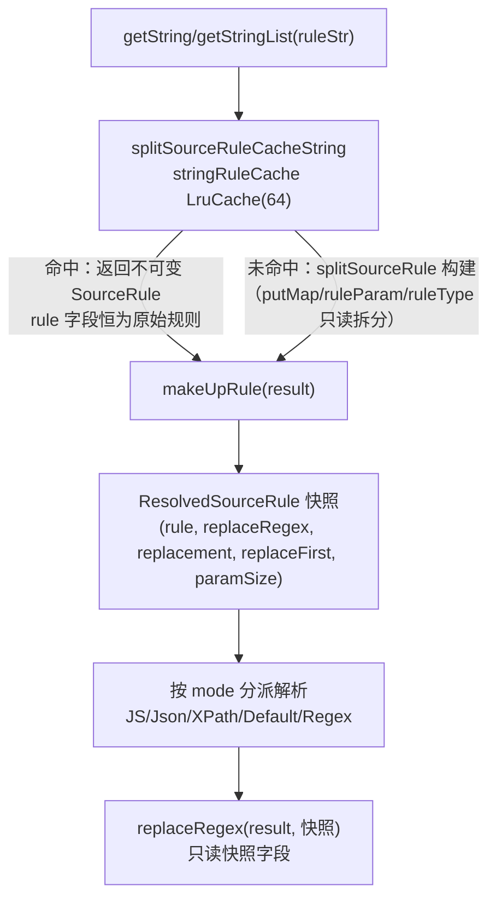
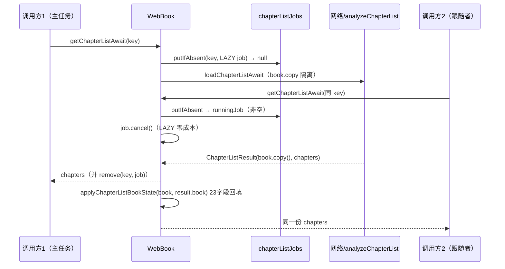

# C0 快速修复包 — 实施级设计（legadoC 迁移）

> 上游依据：`docs/specs/legadoc-benchmark-analysis/evidence-pack.md` I/H 节；`design.md` AD-02（Accepted）。
> legadoC 根：`F:\myself\github\WeAgentChat\temp\legadoC_src\legadoC-own`（下文简称 LC）。本项目根省略前缀 `app/src/main/java/io/legado/app/`。
> 行号为本设计撰写时的快照，实施时以函数名定位为准。

## 1. 目标与非目标

**五项范围**

| # | 项 | 类型 | 优先级 |
|---|----|------|--------|
| F1 | AnalyzeRule 缓存污染修复（ResolvedSourceRule 不可变快照对齐） | 本项目真实缺陷修复（AD-02） | P0 |
| F2 | 章节列表并发去重（chapterListJobs + ChapterListResult + applyChapterListBookState） | 借鉴加固 | P0 |
| F3 | BookScriptObject 注册（Rhino 防篡改缺口） | 借鉴加固 | P0 |
| F4 | exploreKinds 多因素缓存键 + isValidExploreKindsRule 校验 | 借鉴加固 | P1 |
| F5 | WebViewHtmlStore 落盘（大 HTML 走 Bundle → 文件引用） | 借鉴加固 | P1 |

F5 核实结论：**不降级**。本项目 `ui/widget/dialog/BottomWebViewDialog.kt:104/:116` 存在 `html` 参数直入 Fragment arguments 的路径（`ReadBookActivity.kt:4211-4218` 评论浏览器快照场景传入实际 HTML），`onSaveInstanceState` 时全量序列化，触发 Binder 1MB 限制（TransactionTooLargeException）的风险真实存在。详见 §3.5。

**非目标**
- 不改 `stringRuleCache` 的实例级定位与容量 64（F-P1-C4 决策不回退，见 DR-C0-2）。
- 不引入沙箱级安全（NG 安全体系另立任务）。
- 不动 RSS 解析路径的 AnalyzeRule 使用方式（仅内部 API 变化，外部调用方零改动）。
- 不做 webview_html 目录的启动清理策略（列入 Open Questions Q3）。
- 不迁移 `preloadJs` 参数（JS 片段体量小，无 Binder 风险，见 DR-C0-7）。

## 2. legadoC 源码证据（逐函数 + 文件:行）

### 2.1 ResolvedSourceRule 不可变快照（LC model/analyzeRule/AnalyzeRule.kt）

- **:566-572 `internal data class ResolvedSourceRule`**：字段 `rule / replaceRegex="" / replacement="" / replaceFirst=false / paramSize=0`，全部 `val`。解析产物与规则定义分离。
- **:671-675 `inner class SourceRule`**：`internal var rule: String` 在构造 init 中赋值后**永不再写**（LC 全文无二次赋值点；本项目对应 :767 `rule = infoVal.toString()` 是差异根源）。
- **:796-856 `makeUpRule(result: Any?): ResolvedSourceRule`**：`resolvedRule` 为**局部变量**（:801 `var resolvedRule = rule`，:845 `resolvedRule = infoVal.toString()`）；`##` 分离（:848-853）作用于局部变量，返回快照五元组。原 `rule` 字段全程只读。
- **:540-564 `replaceRegex(result: String, rule: ResolvedSourceRule)`**：消费快照字段，签名从"消费可变 SourceRule"改为"消费不可变快照"。
- **5 个 makeUpRule 调用点（:274/:297/:374/:390/:443）+ 3 个 replaceRegex 消费点（:288/:319/:459）**：统一模式 `val resolvedRule = sourceRule.makeUpRule(result)` → 后续读 `resolvedRule.rule / .replaceRegex / .paramSize`，不再读 SourceRule 实例字段。
- **:587-592 `splitSourceRuleCacheString`**：`stringRuleCache.getOrPut(ruleStr) { splitSourceRule(ruleStr) }`——缓存的是**不可变规则对象**，命中复用安全。

### 2.2 章节列表并发去重（LC model/webBook/WebBook.kt）

- **:35-38 `private data class ChapterListResult(book: Book, chapters: List<BookChapter>)`**：book 用 `book.copy()` 隔离（:391）。
- **:40 `chapterListJobs = ConcurrentHashMap<String, Deferred<Result<ChapterListResult>>>()`**：以 key 去重在飞的目录加载。
- **:294-325 `getChapterListAwait`**：`key = chapterListLoadKey(...)`（:300）；LAZY async（:301-303）；`putIfAbsent`（:304）——主任务走 `job.await()` 后 `chapterListJobs.remove(key, job)`（:312，两参 remove 防误删后继任务）；跟随任务 `job.cancel()`（:315，LAZY 未启动取消零成本）→ `runningJob.await()` → `onSuccess { applyChapterListBookState(book, it.book) }`（:317-319）→ `.map { it.chapters }`。
- **:397-408 `chapterListLoadKey`**：`listOf(bookSourceUrl, book.bookUrl, book.tocUrl, runPerJs).joinToString("\n")`——**不含 isFromBookInfo**（跟随者直接复用主任务结果）。
- **:410-434 `applyChapterListBookState(target, source)`**：23 字段逐一回填（bookUrl/tocUrl/origin/originName/name/author/kind/coverUrl/intro/charset/type/latestChapterTitle/latestChapterTime/lastCheckTime/lastCheckCount/totalChapterNum/wordCount/originOrder/variable/syncTime/infoHtml/tocHtml/downloadUrls），保证"跟随者拿到的 book"与"主任务实际解析用的 book"状态一致，防止半初始化共享。
- **:327-395 `loadChapterListAwait`**：`book.removeAllBookType(); book.addType(bookSource.getBookType())`（:333-334）在加载体内执行；返回 `ChapterListResult(book.copy(), chapters)`（:391）。

### 2.3 BookScriptObject（LC help/rhino/BookScriptObject.kt 全文 31 行 + App.kt:236-248）

- **:10-15 `has(name, start)`** / **:17-22 `get(name, start)`**：拦截 `"setUseReplaceRule"` 返回 `false` / `NOT_FOUND`——JS 侧 `book.setUseReplaceRule(...)` 静默失效，防脚本篡改替换规则开关。
- **:27-29 `val factory = JavaObjectWrapFactory { scope, javaObject, staticType -> BookScriptObject(...) }`**。
- **LC App.kt:245 `RhinoWrapFactory.register(Book::class.java, BookScriptObject.factory)`**——仅对 Book 类型实例生效，BookSource/RssSource 等仍走 NativeBaseSource.factory（LC :238-240）。

### 2.4 exploreKinds 多因素缓存键 + 校验（LC help/source/BookSourceExtensions.kt）

- **:31-48 `getExploreKindsKey()`**：两层——内层 `sourceState = [md5Encode16(getVariable()), get("type"), get("order"), get("hostIndex"), get("host")].joinToString("|")`；外层 `md5Encode([bookSourceUrl, exploreUrl, jsLib, lastUpdateTime, sourceState].joinToString("\n"))`。注释明示"采用 md5 作为 key 可以在分类修改后自动重新计算，不需要手动刷新"。
- **:58-128 `exploreKinds()`**：`@js:`/`<js>` 两个分支执行 JS 后，**先校验再落盘**（:82-84 / :98-100 `if (rule.isValidExploreKindsRule()) aCache.put(...)`）；非 JS 分支解析前 :107-109 `if (!ruleStr.isValidExploreKindsRule()) return@runCatching`。
- **:130-136 `isValidExploreKindsRule()`**：trim 后非空、非 `"null"`、非 `"undefined"`（忽略大小写）。
- **:138-152 `clearExploreKindsCache()`**：BookSourcePart/BookSource 双版本，同时清 aCache 与 exploreKindsMap。

### 2.5 WebViewHtmlStore 落盘（LC help/webView/WebViewHtmlStore.kt 全文 49 行 + BottomWebViewDialog 集成点）

- **WebViewHtmlStore.kt:15-49**：`write(html): String`（UUID 文件名落 `filesDir/webview_html/`，失败删半成品后抛 IOException）；`read(reference)`（`[0-9a-fA-F-]{36}\.html` 白名单正则校验，防路径穿越）；`delete(reference)`。类头注释：大 HTML 走 Bundle 会在状态保存时全量序列化并可超 Binder 事务限制。
- **BottomWebViewDialog.kt（LC ui/widget/dialog/）集成四点**：
  - :148-149 构造器：`htmlFileReference = html?.let(WebViewHtmlStore::write)`，Bundle 只存引用（:158-159），注释明示"Large HTML must not enter Fragment arguments"（本项目不照搬构造器内同步落盘——主线程同步 IO 有 StrictMode 违规与掉帧风险，落盘时机后置见 §4.5 V3-12 说明）。
  - :204-208 onCreate：迁移旧版本创建的 Fragment 遗留的大 HTML argument（读出→落盘→换引用→移除 legacy 键），在下次状态保存前完成。
  - :593-603 加载处：`WebViewHtmlStore.read(reference) ?: throw NoStackTraceException(...)`。
  - :880-888 onDestroy：`activity?.isChangingConfigurations != true` 时 delete——旋转重建保留文件供恢复后的对话框重读。

## 3. 本项目对接点现状（真实行号 + bug 复现推演）

### 3.1 AnalyzeRule（model/analyzeRule/AnalyzeRule.kt）

- **:81 `private val stringRuleCache = android.util.LruCache<String, List<SourceRule>>(64)`**——**实例级**缓存（类体属性，非 companion；注释注明 F-P1-C4 修复无界 HashMap 泄漏）。
- **:593-606 `inner class SourceRule`**：`internal var rule`（:597）、`internal var replaceRegex = ""`（:598）、`replacement`（:599）、`replaceFirst`（:600）——**四个可变字段**。
- **:722-781 `fun makeUpRule(result: Any?)`**（无返回值）：:767 `rule = infoVal.toString()`（原地重写）；:770-780 `rule.split("##")` 后 `rule = ruleStrS[0].trim()`，`replaceRegex/replacement/replaceFirst` 仅在 `ruleStrS.size > 1/2/3` 时赋值，**从不清零**。
- **消费点**：:226-232/:255-263（getStringList）、:317-340 附近（getString）、:386（getString else 分支）读 `sourceRule.rule/.replaceRegex`；:494 `replaceRegex(result: String, rule: SourceRule)`。
- **缓存入口**：:527-532 `splitSourceRuleCacheString`；:583-586 `getOrCreateSingleSourceRule`（makeUpRule 内嵌套规则 :742 也入同一缓存）。
- **makeUpRule 外部调用面**：仅本文件 :217/:240/:317/:333/:386 五处（本次 Grep 全文件确认）；`getParamSize()`（:790）为实例方法。

### 3.2 WebBook（model/webBook/WebBook.kt，共 397 行）

- **:234-282 `getChapterListAwait`**：无任何去重——直接 `book.removeAllBookType(); book.addType(...)`（:241-242，**原地改调用方传入的 book**）→ `runPreUpdateJs`（:244-246）→ 本地 tocHtml 分支或 `SourceNetworkClient.requestWithLoginCheck`（:265-269，本项目 M6 统一网络封装）→ `BookChapterList.analyzeChapterList`。失败仅 `ensureActive()`。
- 并发触发场景：正文加载/目录刷新/搜索转详情多入口同 key 并发进入时重复拉取同一目录页（网络×N + `analyzeChapterList`×N + book 字段被并发交叉写）。

### 3.3 App.kt initRhino（:448-459）

已注册：BookSource/RssSource/HttpTTS→NativeBaseSource.factory，ExploreRule/SearchRule/BookInfoRule/ContentRule/BookChapter/Book.ReadConfig→ReadOnlyJavaObject.factory。**缺 `Book::class.java` 注册**——JS 中 `java.book`/`book` 为普通 NativeJavaObject，`book.setUseReplaceRule(true/false)` 可被书源 JS 调用篡改替换规则开关（防篡改缺口）。基础设施已齐备：`help/rhino/` 目录现有 `NativeBaseSource.kt:41` 已使用 `JavaObjectWrapFactory` 机制。

### 3.4 BookSourceExtensions（help/source/BookSourceExtensions.kt）

- **:31-33 `getExploreKindsKey() = MD5Utils.md5Encode(bookSourceUrl + exploreUrl)`**——仅两因素。
- **:43-105 `exploreKinds()`**：:58/:72 aCache 读缓存；:66-68/:80-82 JS 结果**无条件** `aCache.put(...)`（"null"/"undefined"/空串也会固化进缓存，且下次同 key 命中坏值）；:87 起解析无合法性校验；:97-100 onFailure 时把 `ERROR:...` kinds 写入 :102 `exploreKindsMap`（内存缓存同样固化错误态——LC 同样如此，维持不动）。
- 本项目 BookSource 实体：有 `jsLib`(:55)/`lastUpdateTime`(:76)/`lastHost`(:105)，无 `hostIndex/host` 实体字段（LC 的 get("hostIndex")/get("host") 走 BaseSource 变量机制，本项目同款 `get(key)` 可用，未写入时返回空串无害）。

### 3.5 BottomWebViewDialog + 大 HTML Bundle 路径

- **:100-121 构造器**：`html: String? = null`（:104）→ `arguments = Bundle().apply { ... putString("html", html) ... }`（:112-120）。
- **:450 加载**：`val html = args.getString("html") ?: analyzeUrl.getStrResponseAwait().body`。
- **调用方**：`ReadBookActivity.kt:4211-4224`（评论浏览器，传入评论快照 `html`——真实大 HTML 来源）；`SourceLoginJsExtensions.kt:121`（登录 UI，html 通常小但同路径）。
- 复现推演：评论页快照 HTML 含完整 DOM（数百 KB～1MB+）→ 进入 arguments → 后台/旋转触发 `onSaveInstanceState` → Binder 序列化超 1MB → `TransactionTooLargeException` 崩溃或静默丢状态。**结论：F5 为正式项。**

### 3.6 【F1 核心】缓存污染 bug 复现推演

污染根因 = **缓存实例可变** × **makeUpRule 原地写四个字段**。三个已核实向量：

**向量 V1（跨分支键访问，最强可复现）**：`getStringList` 的 LinkedTreeMap 分支（:234-236）`result = result[ruleList.first().rule]` **不调用 makeUpRule**、直接读 `.rule` 作 JSON 键。构造场景：同一 AnalyzeRule 实例内，同一 ruleStr 先以 NativeObject 内容进入（:217 makeUpRule 把 `.rule` 改写为"上次模板解析结果去掉 ## 后缀的值"），后同一 ruleStr 以 LinkedTreeMap 内容再次进入 → 缓存命中拿到的是**上次的解析产物**而非原始规则 → `result["上次解析值"]` 返回 null/错键。修复后 `.rule` 恒为原始规则串，该分支自动恢复正确语义。**佐证（V2 复核）**：:329（getString 路径 LinkedTreeMap 分支）存在第二处 `result[ruleList.first().rule]?.toString()` 裸键访问——V1 影响面 +1，修复后同享该自动修复。

**向量 V2（replaceRegex 三字段残留）**：`replaceRegex/replacement/replaceFirst` 只增不清。当某次调用后规则被 `ruleStrS[0].trim()` 截短，且下一次 makeUpRule 重建的 infoVal 不含 `##`（init :648-683 的 evalMatcher 拆分边界与 `##` 文本段的组合存在此类形态），`split("##")` 得 size==1 → 三字段保持上次值 → **对新结果应用了本不该存在的正则替换**（内容被错误改写，用户可感知）。

**向量 V3（重入/并发半更新）**：makeUpRule 的字段写序列（写 rule → 写 replaceRegex → 写 replacement → 置 replaceFirst）非原子；`jsRuleType` 分支 :742 递归 `getString` → 同缓存中其他 SourceRule 的 makeUpRule 重入。LruCache 线程安全不覆盖 SourceRule 字段一致性，重入/并发下读到半更新状态。

> 注：`ruleParam/ruleType` 在 init 期拆分后只读，多数"参数化重建"路径可幂等——这是污染呈**低频/难复现**（选择性触发）的原因，也正是 AD-02 要求快照化根因修复而非打补丁的依据。

## 4. 改造方案（逐文件函数级）

### 4.1 F1 AnalyzeRule 快照化（对齐 LC :566-572/:799-856）

**新增 data class**（AnalyzeRule 类体内、SourceRule 之前）：

```kotlin
/**
 * 规则解析结果快照（不可变）——对齐 legadoC ResolvedSourceRule
 * makeUpRule 的产物与规则定义分离，缓存命中的 SourceRule 永不被改写
 */
internal data class ResolvedSourceRule(
    val rule: String,
    val replaceRegex: String = "",
    val replacement: String = "",
    val replaceFirst: Boolean = false,
    val paramSize: Int = 0
)
```

**SourceRule 改造**（:593-606）：
- `internal var rule` → `internal val rule`（init 赋值后只读）。
- 删除 `replaceRegex/replacement/replaceFirst` 三个可变字段（产物入快照）。
- `getParamSize()`（:790-792）保留（调用方 :218/:318 仍需；实现不变）。

**makeUpRule 改造**（:722-781，diff 式）：

```kotlin
// 改造前（:722）                    // 改造后（对齐 LC :799）
fun makeUpRule(result: Any?) {      internal fun makeUpRule(result: Any?): ResolvedSourceRule {
    val infoVal = StringBuilder()       val infoVal = StringBuilder()
    ...                                 var resolvedRule = rule          // 局部变量，不写回字段
    if (ruleParam.isNotEmpty()) {       if (ruleParam.isNotEmpty()) {
        ...（循环体逐字保留）                ...（循环体逐字保留）
        rule = infoVal.toString()           resolvedRule = infoVal.toString()
    }                                   }
    //分离正则表达式                     //分离正则表达式
    val ruleStrS = rule.split("##")     val ruleStrS = resolvedRule.split("##")
    rule = ruleStrS[0].trim()           return ResolvedSourceRule(
    if (ruleStrS.size > 1) {                rule = ruleStrS[0].trim(),
        replaceRegex = ruleStrS[1]          replaceRegex = ruleStrS.getOrElse(1) { "" },
    ...（:772-780 删除）                    replacement = ruleStrS.getOrElse(2) { "" },
}                                           replaceFirst = ruleStrS.size > 3,
                                            paramSize = ruleParam.size
                                        )
                                    }
```

**调用方适配清单**（5 处 + 消费点，签名统一为 LC 模式）：

| 位置 | 改造前 | 改造后 |
|------|--------|--------|
| :217（getStringList NativeObject 分支） | `sourceRule.makeUpRule(result)` | `val resolvedRule = sourceRule.makeUpRule(result)` |
| :218-231 | 读 `sourceRule.rule/.getParamSize()/.replaceRegex` | 读 `resolvedRule.rule/.paramSize/.replaceRegex` |
| :236（LinkedTreeMap 分支） | `result[ruleList.first().rule]`（读污染值） | **不改**——`.rule` 恢复原始语义，自动修复（V1） |
| :329（getString LinkedTreeMap 分支裸键访问） | 同 :236 模式 | **不改**——同享 V1 自动修复（影响面 +1，佐证见 §3.6） |
| :240-263（getStringList else 分支） | 同上模式 | 同上模式 |
| :317-345（getString NativeObject 分支） | 同上模式 | 同上模式 |
| :333/:386（getString else 分支×2） | 同上模式 | 同上模式 |
| :494 `replaceRegex(result, rule: SourceRule)` | 消费可变字段 | 签名改 `rule: ResolvedSourceRule`，函数体逐字保留（LC :540 同构） |

**实施时全库 Grep 门禁**：`makeUpRule|getParamSize|\.replaceRegex` 确认无 AnalyzeRule.kt 之外的消费点（本次已确认 makeUpRule 仅内部调用；getParamSize/replaceRegex 需同法复核）。

### 4.2 F2 章节列表并发去重（model/webBook/WebBook.kt）

1. 新增（对齐 LC :35-40）：`private data class ChapterListResult(val book: Book, val chapters: List<BookChapter>)`；`private val chapterListJobs = ConcurrentHashMap<String, Deferred<Result<ChapterListResult>>>()`（补 import：Deferred/CoroutineStart/async/ConcurrentHashMap）。
2. 现有 `getChapterListAwait`（:234-282）函数体**整体搬移**为 `private suspend fun loadChapterListAwait(bookSource, book, runPerJs, isFromBookInfo): Result<ChapterListResult>`，收尾改 `ChapterListResult(book.copy(), chapters)`；**保留本项目 `SourceNetworkClient.requestWithLoginCheck`（:265-269）**，禁止退回 LC 裸写法。
3. 新 `getChapterListAwait` 按 LC :294-325 结构实现：key 四因素 `listOf(bookSource.bookSourceUrl, book.bookUrl, book.tocUrl, runPerJs).joinToString("\n")`；`putIfAbsent` + LAZY async；主路 `job.await().onFailure { ensureActive() }.map { it.chapters }.also { chapterListJobs.remove(key, job) }`；从路 `job.cancel()` + `runningJob.await()` + `onSuccess { applyChapterListBookState(book, it.book) }`。
4. 新增 `chapterListLoadKey`（LC :397-408 同构）与 `applyChapterListBookState`（LC :410-434 的 23 字段清单为基线；实施时以本项目 `data/entities/Book.kt` 核对逐字段存在性，本项目独有 `lastHost` 不纳入回填——网络层职责，见 DR-C0-4）。
5. 对外 API（:210-218 Coroutine 包装）签名不变。

### 4.3 F3 BookScriptObject（新文件 + 一行注册）

1. 新建 `help/rhino/BookScriptObject.kt`：31 行照搬 LC（同包名 `io.legado.app.help.rhino`，依赖 `com.script.rhino.JavaObjectWrapFactory` 已在本项目 NativeBaseSource.kt:3/41 验证可用），中文 KDoc 注明"拦截 setUseReplaceRule 防书源 JS 篡改替换规则开关"。
2. `App.kt` initRhino（:448-459）在 :457（BookChapter 注册行）后插入：`RhinoWrapFactory.register(Book::class.java, BookScriptObject.factory)`（Book.ReadConfig 行保持其后）。

### 4.4 F4 exploreKinds 多因素缓存键 + 校验（help/source/BookSourceExtensions.kt）

1. `getExploreKindsKey()`（:31-33）改为对齐 LC :31-48 双层结构；sourceState 因素 = `[md5Encode16(getVariable()), get("type"), get("order"), get("hostIndex"), get("host"), lastHost.orEmpty()]`（追加本项目独有 `lastHost`，见 DR-C0-4；无 hostIndex/host 写入点时取空串无害）。
2. 新增 `private fun String.isValidExploreKindsRule(): Boolean`（LC :130-136 同构：trim 后非空、非 null、非 undefined，忽略大小写）。
3. `exploreKinds()` 三处加固：:66-68 与 :80-82 的 `aCache.put` 包 `if (it.isValidExploreKindsRule())`；:87 解析前 `if (!ruleStr.isValidExploreKindsRule()) return@runCatching`。
4. `clearExploreKindsCache`（:107-121）与 `exploreKindsJson`（:123-128）自动随新键工作，无需改。

### 4.5 F5 WebViewHtmlStore（新文件 + BottomWebViewDialog 集成）

1. 新建 `help/webView/WebViewHtmlStore.kt`：49 行照搬 LC（object + write/read/delete + UUID 文件 + 白名单正则），注释保留 LC 原文语义并补中文 KDoc。
2. `ui/widget/dialog/BottomWebViewDialog.kt` 四个集成点（对齐 LC 四点，按本项目结构裁剪为单 html 参数，无 fallbackHtml；**落盘时机偏离 LC，不照搬构造器同步写**）：
   - 构造器 :112-120：**不在构造器内落盘**（LC :148-149 的 `html?.let(WebViewHtmlStore::write)` 属主线程同步 IO，见下方 V3-12 说明）——`putString("html", html)` 暂保留原键作过渡态；新增 `private const val ARG_HTML_FILE = "htmlFile"`；Binder 风险窗口从"永久驻留 arguments"缩窄为"构造→落盘完成"的毫秒级窗口。
   - onViewCreated 前置协程（统一覆盖新路径与"升级前进程残留 legacy html"场景，原 onCreate 迁移点并入此处）：`viewLifecycleOwner.lifecycleScope.launch { val raw = arguments?.getString("html"); if (raw != null && arguments?.getString(ARG_HTML_FILE) == null) { val ref = withContext(Dispatchers.IO) { WebViewHtmlStore.write(raw) }; arguments?.apply { putString(ARG_HTML_FILE, ref); remove("html") } } }`——落盘完成并 remove legacy 键后，保存态不再携带大 HTML。
   - :450 加载处：`args.getString(ARG_HTML_FILE)?.let { ref -> WebViewHtmlStore.read(ref) ?: throw NoStackTraceException("WebView HTML file is missing: $ref") } ?: args.getString("html") ?: analyzeUrl.getStrResponseAwait().body`——引用优先，协程未完成的窗口期回退 legacy 键，均缺失走网络。
   - onDestroy：新增 override，`if (activity?.isChangingConfigurations != true) WebViewHtmlStore.delete(htmlFileReference)`。

   > **V3-12 StrictMode 风险说明**：Fragment 构造器在主线程执行，构造器内同步落盘会触发 StrictMode `detectDiskWrites` 违规，且大 HTML 写盘（毫秒~百毫秒级）有掉帧/ANR 风险，故后置至 onViewCreated 的 IO 协程。残余风险：落盘完成前发生 `onSaveInstanceState` → 保存态仍含 raw html（Binder 风险回退至该窗口期）——协程同帧启动、毫秒级完成，窗口极窄可接受；进程死亡丢失未落盘 html 时走网络回退（R6 语义），不崩溃。

## 5. 数据流

**F1 规则解析（改造后）**



**F2 章节列表并发去重（改造后）**



**F5 HTML 落盘（改造后）**：构造器 `html` 暂入 Bundle（legacy 键，毫秒级过渡态）→ onViewCreated IO 协程 `WebViewHtmlStore.write` → Bundle 换存 `ARG_HTML_FILE` 引用并 remove legacy 键 → 加载处 `read(ref)`（legacy 键兜底）→ onDestroy（非旋转）`delete(ref)`。

## 6. 风险清单

| # | 风险 | 等级 | 缓解 |
|---|------|------|------|
| R1 | 规则快照化影响面：5 处调用点 + replaceRegex 消费点改读快照，漏改编译期即暴露（字段被删）；行为差异集中在 LinkedTreeMap 分支（V1 修复向）与残留正则（V2 修复向）——均为**修复**而非回归，但存在依赖污染态的畸形书源行为变化可能 | 高 | L3 固定书源集全流程回归对比基线（§8.3）；实施时全库 Grep `makeUpRule|getParamSize` 复核外部消费面 |
| R2 | 并发去重取消语义：跟随者 `job.cancel()` 对 LAZY 未启动任务安全；主任务失败时所有等待者收同一 Result.failure；`remove(key, job)` 两参防误删后继任务；`book.copy()` + 23 字段回填隔离半初始化状态。残余风险：跟随者传入的 book 上调用方已有字段（如自定义封面 variable）不在回填清单内——回填清单为 LC 全量覆盖（含 variable），实施时按本项目 Book.kt 核对 | 中 | 单测覆盖四场景（§8.1）；字段核对进实施 checklist |
| R3 | exploreKinds 缓存键变更 → 旧 aCache 键成孤儿（不再命中也不清理），磁盘滞后至 ACache TTL 自然淘汰；内存 map 键变更即时重建 | 低 | 接受（ACache 自带过期）；手动"刷新分类"路径 clearExploreKindsCache 照常工作 |
| R4 | BookScriptObject 拦截：依赖 `book.setUseReplaceRule` 的存量书源该调用静默无效（LC 已验证同取舍）；仅拦截 has/get，`java.book` 其他成员不受影响 | 低 | L3 回归关注替换规则开关类书源 |
| R5 | WebViewHtmlStore 文件泄漏：进程被杀/onDestroy 未走 → webview_html 孤儿文件累积 | 低 | Open Question Q3（启动清理策略，C0 不做）；read 白名单正则防路径穿越 |
| R6 | HtmlStore read 失败（文件被清理/损坏）→ NoStackTraceException，评论浏览器回退网络刷新路径（:450 `?:` 链语义保持"引用优先、缺失走网络"） | 低 | 加载失败日志 putDebugWithTag(TAG_WEB_BOOK) |
| R7 | F1 触及规则引擎核心路径，RSS/订阅源/TTS 同用 AnalyzeRule | 中 | makeUpRule 签名变化为纯内部重构；L2 真机回归覆盖 RSS 场景（§8.2） |

## 7. 规范符合性核查表

| 规范 | 要求 | 本设计符合点 |
|------|------|--------------|
| checkstyle_rules | 协程 Coroutine 链式封装 | F2 沿用 Coroutine.async 包装不变；去重内部用 LAZY async + await（LC 同构） |
| checkstyle_rules | `kotlin.runCatching` 带 `kotlin.` 前缀 | loadChapterListAwait 保留既有 `kotlin.runCatching`（:243） |
| checkstyle_rules | object 单例可变状态需并发保护 | chapterListJobs 为 ConcurrentHashMap；exploreKindsMap 已是 ConcurrentHashMap |
| checkstyle_rules | data class 字段默认值 | ResolvedSourceRule 四字段带默认值 |
| checkstyle_rules | 显式 import / 中文注释 / KDoc | 全部遵守；新公开成员中文 KDoc |
| naming_rules | Rule 后缀规则数据类 | ResolvedSourceRule ✓ |
| naming_rules | Await 后缀挂起版 | getChapterListAwait 保持 ✓ |
| naming_rules | apply/isValid 动词约定 | applyChapterListBookState / isValidExploreKindsRule ✓ |
| naming_rules | Extensions 按目标实体组织 | BookSourceExtensions.kt 内私有扩展 ✓ |
| exception_rules | 业务异常继承 NoStackTraceException | HtmlStore read 失败用 NoStackTraceException（LC 同款）✓ |
| exception_rules | 长操作 ensureActive | loadChapterListAwait onFailure/失败链保留 `currentCoroutineContext().ensureActive()` ✓ |
| exception_rules | 禁 CoroutineExceptionHandler | 未引入 ✓ |
| logging_rules | catch 块 putDebugWithTag | 新增 catch/失败分支补 `AppLog.putDebugWithTag(AppLog.TAG_ANALYZE/TAG_WEB_BOOK, ...)` |
| logging_rules | 脱敏铁律 | 日志只记规则名/结果数量/引用文件名，禁记源名称与完整 HTML |
| global-thinking-checklist 6 维 | 见下 | |

**6 维盘点**：前端入口——零 UI 入口变更（BottomWebViewDialog 两调用方签名不动）；后端接口——AnalyzeRule 内部 API、WebBook.getChapterListAwait 语义增强（签名不变）、exploreKinds 内部；数据库改动——无（零 schema 变更，零 migration）；覆盖安装——兼容（无 DB 变更）；使用场景——正文/详情规则解析、目录加载、发现页分类、评论浏览器、登录页五场景逐一覆盖；回填点——applyChapterListBookState 23 字段即回填点全集（真实使用层 WebBook 一处集中回填，无需多层）。

## 8. 测试设计

### 8.1 单元测试（app/src/test，JVM）

> 前置：AnalyzeRule :81 使用 android.util.LruCache——若现有 test 配置无 Robolectric，F1 相关用例改挂 Robolectric runner 或降级并入 L2（Open Question Q1，实施首日裁决）。

`AnalyzeRuleCachePollutionTest`：
- `makeUpRule_cacheHit_secondCall_notPollutedByFirst`——同一 AnalyzeRule 两次 getString 同一 `{{...}}+##` 规则、不同 content：断言第二次结果独立正确（V1/V2 复现用例，修复前红）。
- `getStringList_linkedTreeMap_afterMakeUpRule_usesOriginalRuleAsKey`——先 NativeObject 后 LinkedTreeMap 同规则：断言键访问使用原始规则（V1 直接复现，修复前红）。
- `makeUpRule_replaceRegex_notLeakedAcrossCalls`——首调用含 ## 后续重建不含 ##：断言新结果未被旧正则改写（V2，修复前红）。
- `splitSourceRuleCacheString_ruleFieldImmutableAfterMakeUpRule`——直接断言 `sourceRule.rule == 原始串` after makeUpRule。

`WebBookChapterListDedupTest`：
- `getChapterListAwait_concurrentSameKey_singleLoad`——并发 N 同 key：断言加载体执行 1 次、N 份结果一致。
- `getChapterListAwait_follower_appliesChapterListBookState`——断言跟随者 book 23 字段与主任务结果一致。
- `getChapterListAwait_failure_propagatesToAllWaiters`——主任务失败：主/从调用方均收到 failure。
- `getChapterListAwait_jobRemovedAfterCompletion`——完成后同 key 再次调用触发新加载。

`BookSourceExploreKindsKeyTest`：
- `getExploreKindsKey_changesWhenVariableOrLastHostChanges`——getVariable/lastHost 变化 → 键变化。
- `isValidExploreKindsRule_rejectsBlankNullUndefined`。

`WebViewHtmlStoreTest`：
- `write_read_roundTrip` / `read_invalidReference_throwsIllegalArgument` / `delete_missingReference_noThrow`。

### 8.2 L2 真机（ai_tests，`ai_tests\venv\Scripts\python.exe`，测试包 `io.legado.miss.app.debug`）

- 步骤 S1：`quick_build_install.py` 编译安装 + L1 冒烟。
- 步骤 S2（F1）：导入含 `@get`/`{{}}`/`##` 组合规则的验证书源 → 连续阅读 ≥2 章 → `adb logcat -s AnalyzeRule:E` 断言 0 行；正文内容与基线快照一致。
- 步骤 S3（F2）：构造同书双入口（阅读页刷新 + 目录页手动刷新）1s 内并发触发 → logcat 断言 `WebBook` tag "获取目录开始" 仅 1 次、目录结果正常入库。
- 步骤 S4（F5）：打开评论浏览器大快照页 → 旋转屏幕 2 次 + 切后台恢复 → `adb logcat -s AndroidRuntime:E` 断言无 TransactionTooLargeException；对话框恢复后内容正常；退出后 `filesDir/webview_html/` 目录清空。
- 步骤 S5（F3/F4）：书源调试面板执行含 `book.setUseReplaceRule` 的 JS → 断言替换规则开关状态不变；发现页刷新 → 分类正常加载。
- 步骤 S6：RSS/订阅源打开与刷新回归（R7）→ 无新增异常日志。

### 8.3 L3 书源回归

固定书源集（≥10 本项目实测书源，覆盖 JS/Json/XPath/正则四种规则形态 + 含 ## 替换规则书源 ≥2 本）全流程：搜索→详情→目录→正文→发现页，与修复前基线逐字段 diff；重点比对正文替换结果与目录章节列表一致性。

## 9. 实施顺序 + 门禁五件套

**顺序**（每步完成后 `./gradlew assembleAppDebug` 编译 + 对应单测，禁止攒批）：
1. F3 BookScriptObject（独立、零耦合，先行热身）→ 2. F4 exploreKinds（独立）→ 3. F5 HtmlStore（独立 UI 层）→ 4. F1 AnalyzeRule 快照化（核心，单测先行：先提交红测试再改造）→ 5. F2 章节去重 → 6. 全量单测 + L2 + L3。

**门禁五件套**：
1. updateLog.md：编译前基于 git diff 逐文件更新（追加于 `## cronet版本:` 之后）——五项均面向用户语言（如"修复部分规则组合下正文偶发错乱"、"目录加载防重复联网"）。
2. AI 端到端测试：步骤 5.5 执行 §8.2（SOP：`ai_tests/docs/fixed_test_workflow.md`；禁止 `temp/` 建脚本）。
3. 测试包选择：开发验证用 `io.legado.miss.app.debug` 测试包，禁混用。
4. 任务完成检查清单：Grep `android.util.Log.d|android.util.Log.e` 零残留；issues-found.md 记录真机问题；文档同步（tasks/INDEX/ai_memory_main）。
5. 构建 daemon 清场：直接 gradlew 构建后必须执行 `stop-daemons.bat`。

**规范回灌**：按 design.md 提升清单执行本期对应条目——#1 快照不可变（"入缓存对象必须不可变或快照化"，checkstyle_rules 新节，落点 F1 ResolvedSourceRule）+ #2 同 key 在飞任务去重惯用法（checkstyle 协程节，落点 F2 chapterListJobs putIfAbsent/LAZY async 模式）；随回灌一并执行"规范核查表"逐条打勾（§7）。

## 10. Open Questions

- **Q1**：AnalyzeRule 单测的 JVM 环境（LruCache 需 Robolectric）——app/src/test 现状待查；无则 F1 用例降级并入 L2 S2（实施首日裁决）。
- **Q2**：applyChapterListBookState 23 字段在本项目 Book.kt 的逐字段核对；本项目独有字段（lastHost 等）确认不纳入（DR-C0-4）。
- **Q3**：webview_html 孤儿文件是否加启动清理（App.onCreate 全清或 TTL）——LC 未做；建议 C0 后单独小任务。
- **Q4**：get("hostIndex")/get("host") 变量在本项目当前无写入点，保留键因素是否引起误失效——保留无害（空串稳定），暂不动。
- **Q5**：stringRuleCache 是否未来升级 companion 全局缓存——C0 明确否决（快照化是其前提条件，可在快照化稳定后另议，届时缓存对象天然线程安全）。

## 11. 工作量（函数粒度）

| 文件 | 函数/位置 | 动作 | 估行 | 估时 |
|------|-----------|------|------|------|
| AnalyzeRule.kt | 新增 ResolvedSourceRule | 新增 | +10 | 0.1d |
| AnalyzeRule.kt | SourceRule 字段删除 rule/replaceRegex/replacement/replaceFirst 可变化 | 修改 | ~6 | 0.1d |
| AnalyzeRule.kt | makeUpRule 返回快照 | 重写 | ~60 | 0.5d |
| AnalyzeRule.kt | 5 处调用方 + 2 组消费点适配 | 修改 | ~40 | 0.4d |
| AnalyzeRule.kt | replaceRegex 签名 | 修改 | ~4 | 0.05d |
| WebBook.kt | getChapterListAwait 拆分 loadChapterListAwait + 去重壳 | 重构 | ~90 | 0.6d |
| WebBook.kt | chapterListLoadKey + applyChapterListBookState + ChapterListResult | 新增 | ~55 | 0.2d |
| help/rhino/BookScriptObject.kt | 全文 | 新增 | 31 | 0.1d |
| App.kt | initRhino +1 行 | 修改 | 1 | — |
| BookSourceExtensions.kt | getExploreKindsKey + isValidExploreKindsRule + exploreKinds 三处 | 修改 | ~45 | 0.3d |
| help/webView/WebViewHtmlStore.kt | 全文 | 新增 | 49 | 0.1d |
| BottomWebViewDialog.kt | 构造器/onViewCreated 协程/加载/onDestroy 四点 | 修改 | ~35 | 0.4d |
| 单测 4 类 ~14 用例 | 新增 | ~320 | 0.8d |
| L2 脚本适配 + 真机回归 + L3 书源回归 | 验证 | — | 1.0d |
| **合计** | | | **~750** | **~4.2d** |

## 12. 设计决策记录

- **DR-C0-1**：F1 采用 LC ResolvedSourceRule 不可变快照**根因修复**，而非"makeUpRule 后重置字段"补丁——补丁无法覆盖 V1（未调 makeUpRule 的读路径）与 V3（半更新窗口）；快照化使缓存对象天然不可变，一并消除三类污染向量。（依据 design.md AD-02）**与 LC 的有意差异**：本项目删除三 var 字段方案比 legadoC 更彻底（LC :676-678 保留 var 已成死字段），属有意增强而非对齐。
- **DR-C0-2**：stringRuleCache 保持**实例级 LruCache(64)** 不动——F-P1-C4 修复无界泄漏的决策不回退；升全局缓存留待 Q5（快照化为其前置条件）。
- **DR-C0-3**：章节去重 key 四因素不含 isFromBookInfo（对齐 LC :397-408）——跟随者复用主任务结果，isFromBookInfo 仅影响解析上下文不改变目录结果正确性。
- **DR-C0-4**：exploreKinds 缓存键在 LC 五因素基线上**追加本项目独有 lastHost**（换线路后 exploreUrl 实际指向变化）；applyChapterListBookState 回填清单以 LC 23 字段为基线、不含 lastHost（网络层职责归属）。
- **DR-C0-5**：F5 列为正式项不降级——§3.5 已证实本项目评论快照走 Bundle 的真实路径；单 html 参数集成（无 fallbackHtml/networkRefresher，本项目构造器无此参数）。
- **DR-C0-6**：BookScriptObject 拦截语义照搬 LC（仅 has/get 拦 setUseReplaceRule，返回 NOT_FOUND）——不扩大拦截面，行为差异面最小。
- **DR-C0-7**：preloadJs 不走落盘（JS 片段体量小，非 HTML 大文档场景），控制 F5 改动面。
- **DR-C0-8**：实施顺序独立项先行（F3/F4/F5）、核心项殿后（F1/F2）——降低核心路径改动的环境噪音，且 F1 采用"红测试先行"保证污染可复现可验证。
- **DR-C0-9**：F5 落盘时机后置至 onViewCreated 前置协程（偏离 LC 构造器同步写，见 §4.5 V3-12 说明）——规避主线程同步 IO 的 StrictMode 违规与掉帧风险；构造器 raw html 暂留 arguments 作毫秒级过渡态，加载路径 legacy 键兜底，残余窗口风险已在 §4.5 定量说明。
