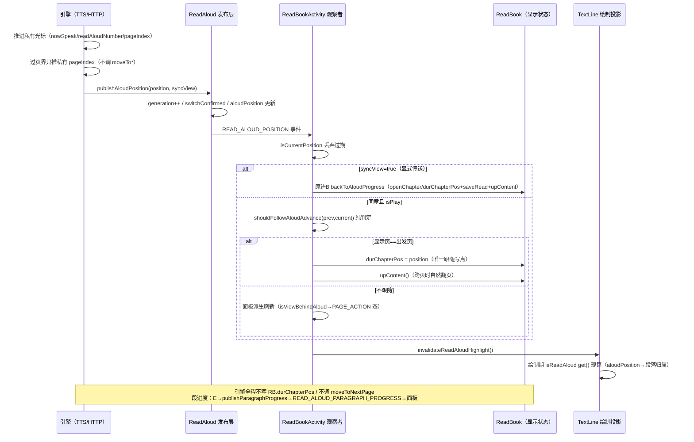
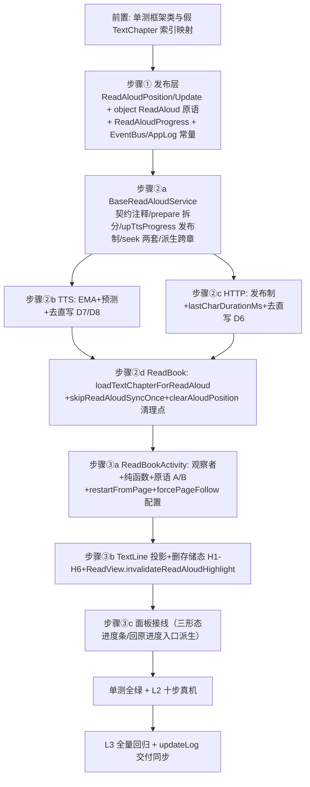

# C1 朗读架构原语化 — 实施级设计（legadoC 迁移）

> 状态：设计前置（未过检查点不实施）
> 对应总设计：[design.md](../design.md) §3 #2 / AD-03（三步走，Proposed）
> 证据源：[evidence-pack.md](../evidence-pack.md) §A；legadoC own 分支 v3.26.082723c（`F:\myself\github\WeAgentChat\temp\legadoC_src\legadoC-own`，下文 LC/ 前缀）
> 本项目基线：`f:\myself\github\WeAgentChat\temp\legado`，DB v108，行号以 2026-08-30 工作区实测为准
> 本文档行号均为实测锚点；实施时若行号漂移，以函数名定位为准

---

## 1. 目标与非目标

### 1.1 目标

1. **引擎只发布"读到哪里"**：朗读引擎（HTTP TTS / 系统 TTS）对外的唯一输出是 `ReadAloudPosition` 位置事件流（generation 单调防乱序），引擎不直写显示进度（`ReadBook.durChapterPos`）、不直翻页（`moveToNextPage` 等）。
2. **显示跟随全部 UI 侧纯函数现算**：是否跟随（`shouldFollowAloudAdvance`）、是否脱节（`isViewBehindAloud`）、面板模式，全部派生，零存储跟随状态。
3. **红字高亮改为绘制期投影**：`TextLine.isReadAloud` 从存储态 var 改为 get() 现算，删除 `AloudSpan` 系命令式存储（`upPageAloudSpan`/`removePageAloudSpan`）。
4. **补齐预测换页**：系统 TTS 用 EMA 实测语速 + 页界预测调度；HTTP 引擎按 ExoPlayer 真实时长/字符数步进，流式无时长退化为 `lastCharDurationMs` 兜底（现状是直接放弃，句内不推进）。
5. **用户原语归一**：双击换段 / 从本页读 / 选择朗读 / 强制追页翻页，全部归一到"只写朗读起点"（原语 A `setAloudStart`）与"唯一允许直写显示的对齐动作"（原语 B `backToAloudProgress`）。

### 1.2 非目标（明示边界）

1. **与 NG 多角色正交，不在本设计实现**：AD-03 决策方向（Proposed，设计验收时随总体验收确认）为两者正交可叠加——NG 多角色是"另一种引擎实现"，对架构的唯一要求同样是发布 `ReadAloudPosition` 流。本设计只保证接口不锁死（见 §6 风险 R7 接口预留）。
2. **引擎范围 = HTTP TTS + 系统 TTS 两套**：本项目独有的 AudioPlayService（有声书）、AiReadAloudRoleService（AI 多角色朗读）、书源音频（未引入）均不在改造面。它们的共存与接入方式见 §6 R6 与 §10 OQ-3。
3. **零数据库变更**：无 Room 实体/版本/migration 改动；新增配置走 SharedPreferences（`PreferKey.forcePageFollow`），声明见 §7 门禁表。
4. **不动朗读面板三形态骨架**：本项目系统悬浮窗/应用胶囊/播放面板三形态 UI 结构保留，仅接线数据源（进度条接位置事件、回原进度按钮接脱节派生）。legadoC 的 `ReadAloudUiState.readerPanelMode` 只移植派生判定思想，不整搬其对话框形态。
5. **不迁 legadoC 的 TTS-Wav 模式 / V2 数据驱动引擎层 / SourceAudio 引擎**（LC/model/ReadAloud.kt:76-88/:182-270 属其独立演进）。

---

## 2. legadoC 技术架构（逐类逐函数解读）

### 2.1 全景图

```mermaid
graph TD
    subgraph 引擎侧[引擎侧：只发布，不直写]
        BRAS[LC BaseReadAloudService<br/>引擎私有光标 contentList/nowSpeak/<br/>readAloudNumber/pageIndex/paragraphStartPos]
        TTS[LC TTSReadAloudService<br/>EMA measuredCharRate<br/>schedulePageBreakPrediction]
        HTTP[LC HttpReadAloudService<br/>upPlayPos 真实时长步进<br/>lastCharDurationMs 兜底]
        BRAS --> TTS
        BRAS --> HTTP
    end

    subgraph 发布层[发布层：唯一出口]
        RA[LC object ReadAloud<br/>publishAloudPosition<br/>generation 单调 / isCurrentPosition<br/>beginPositionSwitch / clearAloudPosition]
        RAP[LC ReadAloudPosition /<br/>ReadAloudPositionUpdate<br/>LC ReadAloudProgress 段进度]
        RA --> RAP
    end

    subgraph UI侧[UI 侧：现算跟随 + 绘制投影]
        OBS[LC ReadBookActivity 观察者 :3369-3424<br/>syncView→原语B / shouldFollowAloudAdvance→写显示]
        FOLLOW[shouldFollowAloudAdvance 纯函数<br/>isViewBehindAloud 派生]
        PRIM[原语A setAloudStart :2231<br/>原语B backToAloudProgress :2112<br/>onManualPageChanged :2289]
        TL[TextLine.isReadAloud get()<br/>绘制期投影 :74-82<br/>ReadView.invalidateReadAloudHighlight :1075]
        OBS --> FOLLOW
        OBS --> TL
        PRIM --> BRAS
    end

    TTS -->|upTtsProgress| BRAS
    HTTP -->|upTtsProgress| BRAS
    BRAS -->|ReadAloud.publishAloudPosition| RA
    RA -->|READ_ALOUD_POSITION 事件| OBS
```

### 2.2 发布层原语（LC/model/ReadAloud.kt）

| 成员 | 位置 | 语义 |
|------|------|------|
| `ReadAloudPosition(chapterIndex, chapterPosition)` | :40-43 | 章节绝对字符位，全引擎+UI 共享的"位置货币" |
| `ReadAloudPositionUpdate` | :46-58 | position + previousPosition + switchConfirmed + generation + syncView（用户显式传送标记，事件元数据非存储态） |
| `beginPositionSwitch/cancelPositionSwitch` | :70-81 | 起点切换两阶段握手：UI 先登记 pending，引擎确认（switchConfirmed）后清除；启动失败 cancel 兜底（:1096-1100 / :384 / :396） |
| `publishAloudPosition(position, syncView)` | :84-110 | **引擎唯一发布点**：@Synchronized，generation 单调自增，匹配 pending 则确认，postEvent 广播 |
| `isCurrentPosition(update)` | :112-115 | 消费端防乱序闸门：generation 与 position 双比对，过期事件丢弃 |
| `clearAloudPosition` | :117-125 | 停止时清空 + generation++（使所有在途事件失效） |
| `play/seekToProgress/prevChapter/nextChapter` | :377-401/:478-492/:509-525 | 命令层：`seekToProgress` 与上/下一章 Intent 携带 `syncView=true`（显式传送语义） |

### 2.3 引擎私有光标与所有权契约（LC/service/BaseReadAloudService.kt）

- **所有权契约注释**（:166-174）：`contentList/nowSpeak/readAloudNumber/textChapter/pageIndex/currentChapterIndex/paragraphStartPos` 是引擎私有位置光标，只能由引擎推进方法（`prepareReadAloudChapter/moveToNextParagraph/prevP/nextP/seek 系列`）读写，**对外唯一出口是两个发布点**；UI 与阅读模型不得直接读写。
- **段进度发布点** `publishReadAloudProgress`（:130-133，companion）：写 `@Volatile readAloudProgress` 快照 + postEvent。`publishParagraphProgress`（:1286-1299）由引擎在单元推进时调用。
- **页间分段挂载点契约**（:289-292）：`pageSplit=false` 时预测换页只允许影响位置事件发布时机，不得新增显示进度写点、不得绕过位置事件直改 UI。
- **章节准备** `prepareReadAloudChapter`（:1102-1148）：校验 isCompleted/pageSize/page 有效 → `readAloudNumber = getReadLength(pageIndex) + startPos` → `contentList = getNeedReadAloud(0, pageSplit, 0).split("\n")` → `nowSpeak = getParagraphNum(readAloudNumber+1, pageSplit)-1` clamp → toLast 回退段尾（:1135-1139）→ `paragraphStartPos = resolveParagraphStartPos(chapter)` → 首次 `publishParagraphProgress()`。
- **起点偏移解析** `resolveParagraphStartPos`（:1157-1169）：paragraphStartPos 必须是朗读单元内部偏移（绝不能是页内偏移），页分段/段分段共用公式 `readAloudNumber - paragraph.chapterPosition`，跨页段落续读语义由此保持。
- **位置发布** `postReadAloudTextPosition`（:1275-1284）：preparedRequest 代数守卫（:1276）防过期启动；注释明文"引擎只发布朗读位置，绝不直写显示进度"；`upTtsProgress(progress, syncView)`（:1270-1273）= 段进度发布 + 位置发布。
- **seek 两套**（:1301-1357 / :1359-1385）：`seekToReadAloudProgress(chapterIndex, paragraph, syncView)` 段号→段落映射→目标页换算→写光标→`upTtsProgress(+1, syncView)`→按需恢复播放；`seekToReadAloudTextPosition` 字符位→`paragraphs.indexOfFirst { chapterPosition in it.chapterIndices }`→复用前者。章不一致时忽略并重发段进度（:1310-1317）。
- **单步推进** `prevP/nextP`（:1403-1449）：只推引擎私有光标与页光标（pageIndex--/++），无任何 ReadBook 显示直写，推进后 `upTtsProgress(readAloudNumber + 1)`。
- **跨章派生跟随**（:1804-1847）：`followDisplay = syncView || ReadBook.durChapterIndex == currentChapterIndex`——用户显式传送或显示一直在跟 → `ReadBook.moveToPrev/NextChapter(true, fromReadAloud=true)`（显示+朗读一起切，`fromReadAloud=true` 让 ReadBook.curPageChanged 链接管重启）；显示在别处 → `switchReadAloudChapterKeepingView`（:1864-1906）只切朗读章节，`loadTextChapterForReadAloud`（LC/model/ReadBook.kt:575-611，三章缓存优先+离线缓存+异步排版 await）加载正文后 `prepareReadAloudChapter`，显示视角保持。

### 2.4 系统 TTS：EMA 语速校准 + 页界预测（LC/service/TTSReadAloudService.kt）

- **速率状态**（:60-74）：`measuredCharRate` 初值 480 字/分钟；`utteranceStartRealtime` 计时基准；`lastRangeOffset` 句内已读偏移；注释明文契约"预测只影响位置事件的发布时机"。
- **预测调度** `schedulePageBreakPrediction`（:180-206）：pageSplit ON 不调度（单元已在页界裂开）；单元 `[utteranceStart, utteranceEnd)` 覆盖下一页页界 `nextPageStart` 时，`delayMs = breakOffset / measuredCharRate`，postDelayed 到点 `upTtsProgress(nextPageStart)`；`speakGeneration` 代数防乱序（暂停/停止/重试后调度失效，:199）；`lastRangeOffset + utteranceStart >= nextPageStart` 则跳过（onRangeStart 真实信号已先发布，:200）。
- **EMA 校准** `onRangeStart`（:988-1013）：`start > 0 && elapsed > 500ms` 时 `measuredCharRate = measuredCharRate*0.7 + (start/elapsed)*0.3`；过页界只推私有页光标 + 发布位置（:1009-1011）。`onDone` 段落完成时按整句真实总时长再校准一次（:1035-1047）后作废旧预测。
- **onStart 推进**（:955-971）：跨页界推私有页光标（:964-966 注释"只推进引擎私有页光标，显示翻页由 UI 侧跟随规则处理"）+ `upTtsProgress` + 重置计时并调度预测。

### 2.5 HTTP TTS：真实步进 + 流式兜底（LC/service/HttpReadAloudService.kt）

- `lastCharDurationMs`（:105-108）：上一句实测单字符毫秒时长，流式播放拿不到总时长时的步长估计，初值 100ms。
- `upPlayPos`（:775-815）：`duration > 0` → `sleep = duration / speakTextLength`（并回写 lastCharDurationMs :792）、句内起点按 `currentPosition/duration` 比例换算；`duration <= 0`（流式）→ `sleep = lastCharDurationMs`、起点按 `currentPosition/sleep` 换算；轮询扫过页界只推私有页光标 + `upTtsProgress`（:803-811）；pageSplit ON 时句内无页界直接返回（:786-788）。

### 2.6 UI 跟随与投影（LC/ui/book/read/ReadBookActivity.kt 等）

- **跟随纯函数** `shouldFollowAloudAdvance(prev, current)`（:2083-2095）：`prev != null`（首事件不跟随）&& `current.chapterIndex == ReadBook.durChapterIndex` && 当前排版章一致 && **前进**（`current.chapterPosition > prev.chapterPosition`，显示永不被朗读拽向后退的单调性规则）&& **显示页 == 朗读出发页**（`currentDisplayPageIndex() == chapter.getPageIndexByCharIndex(prev.chapterPosition)`）。回退型起点（从本页读段首在上一页）期间显示页≠出发页 → 不跟随，语音追上后自然恢复。
- **脱节派生** `isViewBehindAloud`（:2101-2110）：每帧现算（章不同 / 显示页≠朗读页），无存储。
- **原语 B** `backToAloudProgress`（:2112-2135）：跨章走 `ReadBook.openChapter(position.chapterIndex, position.chapterPosition) { applyAloudPositionToReader }` + `skipReadAloudSyncOnce` 防重启循环；同章直接 `applyAloudPositionToReader`（:2137-2144）：写 `durChapterPos` → `saveRead(true)` → `upContent(resetPageOffset=false)` → 面板刷新。**这是全架构唯一允许直写显示的路径**。
- **原语 A** `setAloudStart(position)`（:2231-2280）：`beginPositionSwitch` → 校验章节/页有效 → 只切朗读（`ReadBook.readAloud(startPos = chapterPosition - pageStart, pageIndex)`，:2252-2257 注释"只切朗读位置，绝不直写显示进度"）→ 跨章时 `openChapter` 后补切；起点回退造成的补读期显示保持由跟随规则天然保证。
- **强制追页** `onManualPageChanged`（:2289-2301）：`forcePageFollow` ON → 手动翻页翻译成 `restartFromPage()`（=对"新页第一段"执行原语 A）；OFF → 只刷新面板，脱节由派生条件现算。
- **位置观察者**（:3369-3424，observeEventSticky READ_ALOUD_POSITION）：`isCurrentPosition` 丢弃过期 → syncView 直接走原语 B（:3377-3390）→ 未播放忽略 → 跨章忽略（:3401-3407）→ `shouldFollowAloudAdvance` 通过则写 `ReadBook.durChapterPos` + `upContent()`（:3408-3414，**显示进度的唯一跟随写点**）→ 每次先 `readView.invalidateReadAloudHighlight()`（:3400）失效绘制缓存让红字投影重录。
- **绘制期投影** LC/ui/book/read/page/entities/TextLine.kt:74-82：`isReadAloud` 为 get()——`paragraphNum > 0 && aloudPosition != null && isPlay() && 章节一致 && getParagraphNum(position.chapterPosition+1, false) == paragraphNum`。红字与声音永远指向同一段（与引擎 nowSpeak 定位同源）。消费点：TextLine.kt:188/:211/:238、TextColumn.kt:88/:94、TextHtmlColumn.kt:78/:92。
- **高亮失效** LC ReadView.kt:1073-1088：`invalidateReadAloudHighlight()` 清 CanvasRecorder 缓存并重绘，滚动模式三页缓存全失效。

---

## 3. 本项目对接点现状（直写点全清单）

> 本项目引擎与显示的耦合全部为"引擎直写 ReadBook 显示状态 + 死事件半死链"，无发布层。逐点实测如下：

### 3.1 引擎→显示直写点（必须拆除）

| # | 文件:行 | 现状代码要点 | 问题 |
|---|---------|-------------|------|
| D1 | service/BaseReadAloudService.kt:375 | `prevP()` 内过页时 `ReadBook.moveToPrevPage()` | 引擎直写显示翻页（后退方向） |
| D2 | service/BaseReadAloudService.kt:401 | `nextP()` 内过页时 `ReadBook.moveToNextPage()` | 引擎直写显示翻页（前进方向） |
| D3 | service/BaseReadAloudService.kt:382 | `prevP()` 章首时 `toLast=true; ReadBook.moveToPrevChapter(true)` | 无派生跟随判定，显示章被引擎无条件拖走 |
| D4 | service/BaseReadAloudService.kt:783 | `prevChapter()` → `ReadBook.moveToPrevChapter(true, toLast = false)` | 同上 |
| D5 | service/BaseReadAloudService.kt:790 | `nextChapter()` → `ReadBook.moveToNextChapter(true)`，失败 stopSelf | 同上 |
| D6 | service/HttpReadAloudService.kt:561-562 | `upPlayPos()` 扫过页界 `pageIndex++; ReadBook.moveToNextPage()` | 引擎直写显示翻页 |
| D7 | service/TTSReadAloudService.kt:215-216 | `onStart` 过页 `pageIndex++; ReadBook.moveToNextPage()` | 同上 |
| D8 | service/TTSReadAloudService.kt:240-241 | `onRangeStart` 过页 `pageIndex++; ReadBook.moveToNextPage()` | 同上 |

### 3.2 事件链断裂（死事件 + 半死链）

| # | 文件:行 | 现状 | 问题 |
|---|---------|------|------|
| E1 | service/BaseReadAloudService.kt:356-358 | `upTtsProgress(progress)` 仅 `postEvent(EventBus.TTS_PROGRESS, progress)`（Int） | **TTS_PROGRESS 全库零观察者**（死事件）；位置/进度信息无处可去 |
| E2 | ui/book/read/ReadBookActivity.kt:5135-5156 | `observeEvent<ReadAloudProgressState>(EventBus.READ_ALOUD_PROGRESS)`：喂面板 `onTtsProgress` + **直写** `ReadBook.durChapterPos`（:5145）+ `upPageAloudSpan`（:5148）+ 跨页 `upContent()` | **READ_ALOUD_PROGRESS 全库零发布者**（半死链，观察者孤儿化）；且观察者内直写显示进度=UI 侧反向直写 |
| E3 | constant/EventBus.kt:11-12 | `TTS_PROGRESS = "ttsStart"`、`READ_ALOUD_PROGRESS = "readAloudProgress"` | 两键均为历史遗留命名，键名冲突风险见 §4.1 AD-C1-2 |

### 3.3 高亮存储态（必须删除）

| # | 文件:行 | 现状 | 问题 |
|---|---------|------|------|
| H1 | ui/book/read/page/entities/TextLine.kt:64-73 | `var isReadAloud` 带 setter（变更触发 invalidate + 写 `textPage.hasReadAloudSpan`） | 页级存储态；谁写谁负责重绘，易漏 |
| H2 | ui/book/read/page/entities/TextPage.kt:245-254 | `removePageAloudSpan()` 遍历清行标志 | 命令式清理，调用点分散 |
| H3 | ui/book/read/page/entities/TextPage.kt:260-281 | `upPageAloudSpan(aloudSpanStart)` 页内行区间写 true | 与绘制脱耦的存储态（红字=段落内从朗读位置到段尾） |
| H4 | ui/book/read/page/provider/TextPageFactory.kt:263/:307/:323 | 排版/换页时 `page.removePageAloudSpan()` | 存储态的配套清理点（投影化后整体删除） |
| H5 | ui/book/read/ReadBookActivity.kt:5109-5117 | ALOUD_STATE STOP/PAUSE 时 `removePageAloudSpan()+upContent` | 投影化后改为 `invalidateReadAloudHighlight()` |
| H6 | model/ReadBook.kt:554 | `moveToNextPage` 内 `it.getPage(durPageIndex)?.removePageAloudSpan()` | 显示翻页与高亮清理耦在模型层 |

### 3.4 能力缺失

| # | 位置 | 缺失 |
|---|------|------|
| M1 | service/TTSReadAloudService.kt 全文件 | 无 EMA 语速校准、无页界预测调度、无 speakGeneration 代数守卫（`onRangeStart` 只有老版过页直写） |
| M2 | service/HttpReadAloudService.kt:548 | `if (exoPlayer.duration <= 0) return@launch`——流式播放句内进度直接放弃（无 lastCharDurationMs 兜底），翻页只能等下一句 onStart |
| M3 | service/BaseReadAloudService.kt:260-303 | `newReadAloud` 起点换算为页内/段内混算（:273-295），无 `resolveParagraphStartPos` 的统一单元内偏移语义 |
| M4 | 全库 | 无 `seekToReadAloudProgress/seekToReadAloudTextPosition` 两套 seek；无 `syncView` 显式传送语义 |
| M5 | model/ReadBook.kt | 无 `loadTextChapterForReadAloud`（引擎侧独立加载正文的入口；本项目引擎跨章完全依赖 `moveTo*` 直写链 + `curPageChanged`（:747-761，`fromReadAloud` 分支 readAloud() 重启）） |
| M6 | ui/book/read/ReadBookActivity.kt:4305-4352 | 朗读按钮/滚动翻页恢复链 `getReadAloudPos()+readAloud(startPos=...)` 直写 `durChapterPos`（:4312/:4335）后重启朗读——原语化后归一到 setAloudStart |
| M7 | PreferKey | 无 `forcePageFollow`（强制追页）配置 |

---

## 4. 改造方案（三步，逐文件函数级）

### 4.0 总原则

- legadoC 为蓝本"模式移植"：类名/函数名/契约注释对齐 LC，实现细节适配本项目既有设施（Coroutine 链、AppLog、EventBus、三形态面板）。
- 引擎侧改动后，所有原直写点 D1-D8 消失；UI 侧观察者成为显示进度的唯一跟随写点；原语 B 是唯一例外。

### 4.1 步骤①：发布层新建（~250 行，纯新增）

**新增数据类与原语**（新建 `app/src/main/java/io/legado/app/model/ReadAloudPosition.kt`，与 LC :39-58 对齐）：

```kotlin
package io.legado.app.model

/** 全引擎与阅读 UI 共享的朗读位置（章节绝对字符位）。 */
data class ReadAloudPosition(
    val chapterIndex: Int,
    val chapterPosition: Int,
)

/** 引擎确认的位置更新：携带被替换的前一位置与单调代数。 */
data class ReadAloudPositionUpdate(
    val position: ReadAloudPosition,
    val previousPosition: ReadAloudPosition?,
    val switchConfirmed: Boolean,
    val generation: Long,
    /** 用户显式传送标记（拖进度条/上一章/下一章）：观察者直接走原语 B，不走跟随判定。 */
    val syncView: Boolean,
)
```

**`object ReadAloud`（model/ReadAloud.kt，现 :24 起）追加位置原语成员**（对齐 LC :60-125）：

```kotlin
    @Volatile
    var aloudPosition: ReadAloudPosition? = null
        private set
    private var pendingSwitchPosition: ReadAloudPosition? = null
    private var positionGeneration = 0L

    /** 原语 A 前置：登记待确认的朗读起点（UI 调）。 */
    @Synchronized
    fun beginPositionSwitch(position: ReadAloudPosition) { pendingSwitchPosition = position }

    @Synchronized
    fun cancelPositionSwitch() { pendingSwitchPosition = null }

    /** 引擎是唯一有权更新并发布此位置的主体（LC :83 注释契约）。 */
    @Synchronized
    fun publishAloudPosition(
        position: ReadAloudPosition,
        syncView: Boolean = false,
    ): ReadAloudPositionUpdate {
        val previousPosition = aloudPosition
        aloudPosition = position
        val generation = ++positionGeneration
        val switchConfirmed = pendingSwitchPosition == position
        if (switchConfirmed) pendingSwitchPosition = null
        AppLog.putDebugWithTag(
            AppLog.TAG_READ_ALOUD,
            "发布位置 ch:${position.chapterIndex} pos:${position.chapterPosition} " +
                "gen:$generation confirmed:$switchConfirmed syncView:$syncView",
            level = AppLog.Level.INFO
        )
        return ReadAloudPositionUpdate(position, previousPosition, switchConfirmed, generation, syncView)
            .also { postEvent(EventBus.READ_ALOUD_POSITION, it) }
    }

    /** 消费端防乱序：过期事件直接丢弃。 */
    @Synchronized
    fun isCurrentPosition(update: ReadAloudPositionUpdate): Boolean =
        update.generation == positionGeneration && update.position == aloudPosition

    @Synchronized
    fun clearAloudPosition() {
        aloudPosition = null
        positionGeneration++
        pendingSwitchPosition = null
    }
```

> **补记（generation 溢出推演）**：`positionGeneration` 用 `Long`（0L 起），`publishAloudPosition`/`clearAloudPosition`/`isCurrentPosition` 均 `@Synchronized` 保护。按极端每 1ms 发布一次计，耗尽 2^63 需约 2.9 亿年，远超任何朗读会话与应用生命周期——溢出不可达，无需回绕/重置处理。

**常量与事件键**（`constant/EventBus.kt` 追加、`constant/AppLog.kt` 追加模块 Tag）：

```kotlin
// EventBus.kt
const val READ_ALOUD_POSITION = "readAloudPosition"          // 位置事件流（ReadAloudPositionUpdate）
const val READ_ALOUD_PARAGRAPH_PROGRESS = "readAloudParagraphProgress" // 段进度（ReadAloudProgress）
// AppLog.kt（对齐 logging_rules.md 模块 Tag 规范）
const val TAG_READ_ALOUD = "ReadAloud"
```

> **AD-C1-2（事件键决策）**：不复用既有 `READ_ALOUD_PROGRESS`（"readAloudProgress"）——该键已被孤儿化的 `ReadAloudProgressState` 观察者占用（E2），同键双类型在 LiveBus 下不可靠。新增 `READ_ALOUD_PARAGRAPH_PROGRESS` 承载段进度；旧键处置见 §10 OQ-2。`TTS_PROGRESS` 死键在步骤②后删除常量。

**段进度数据类**（新建 `app/src/main/java/io/legado/app/service/ReadAloudProgress.kt`，对齐 LC/service/ReadAloudProgress.kt:1-26）：

```kotlin
package io.legado.app.service

data class ReadAloudProgress(
    val chapterIndex: Int,
    val position: Int,
    val total: Int,
    val kind: Kind,
) {
    init {
        require(chapterIndex >= 0) { "chapterIndex must be non-negative: $chapterIndex" }
        require(total > 0) { "total must be positive: $total" }
        when (kind) {
            Kind.PARAGRAPH -> require(position in 0 until total) {
                "paragraph position must be within total: position=$position, total=$total" }
            Kind.TIME -> require(position in 0..total) {
                "time position must be within total: position=$position, total=$total" }
        }
    }
    enum class Kind { PARAGRAPH, TIME }
}
```

> **AD-C1-9（内嵌 enum Kind——对齐 C5 DR-C5-2 留痕）**：`Kind` 采用 enum 而非 @IntDef——非位标志场景，且需 name 持久化反解 + entries 遍历展示；对 checkstyle_rules.md :94-107 @IntDef 倡导的偏离，已在 §7 规范核查表留痕自评（与 C5 R7/DR-C5-2 同款处理）。

**BaseReadAloudService companion 追加发布点**（对齐 LC :126-133）：

```kotlin
    @Volatile
    var readAloudProgress: ReadAloudProgress? = null
        private set

    fun publishReadAloudProgress(progress: ReadAloudProgress) {
        readAloudProgress = progress
        postEvent(EventBus.READ_ALOUD_PARAGRAPH_PROGRESS, progress)
    }
```

### 4.2 步骤②：引擎侧去直写（1.5-2 天，删除/替换）

#### 4.2.1 删除直调点清单

| 原点（§3.1） | 处置 | 替代 |
|--------------|------|------|
| D1 :375 `moveToPrevPage()` | 删除调用 | 只保留 `pageIndex--`（引擎私有页光标），位置发布交给统一 `upTtsProgress` |
| D2 :401 `moveToNextPage()` | 删除调用 | 只保留 `pageIndex++` |
| D3 :382 `moveToPrevChapter(true)` | 替换 | `advanceToPrevChapter(toLast = true, syncView = false)`（§4.2.3） |
| D4 :783 | 替换 | `prevChapter(syncView)` + `advanceToPrevChapter` 派生跟随 |
| D5 :790 | 替换 | `nextChapter(syncView)` + `advanceToNextChapter` 派生跟随 |
| D6 HttpReadAloudService.kt:562 | 删除调用 | `pageIndex++` + `upTtsProgress(readAloudNumber + i)`（发布制，LC :803-811） |
| D7 TTSReadAloudService.kt:216 | 删除调用 | `pageIndex++`（LC :964-966），upTtsProgress 已有 |
| D8 TTSReadAloudService.kt:241 | 删除调用 | `pageIndex++` + `upTtsProgress(readAloudNumber + start)`（LC :1009-1011） |

#### 4.2.2 BaseReadAloudService 重构（函数级）

1. **所有权契约注释**：在 `contentList/nowSpeak/readAloudNumber/textChapter/pageIndex/paragraphStartPos` 声明处（现 :143 附近）写入 LC :166-174 同文契约（私有光标、两个发布点、UI 禁读写）。`readAloudByPage` 更名说明：本项目键为 `PreferKey.readAloudByPage`，LC 为 `pageSplit`——**保留本项目键名不动**（避免配置迁移），代码内变量同步保留 `readAloudByPage`，新增注释映射两概念。
2. **`newReadAloud` 拆分**（:260-303 → 两函数）：
   - `prepareReadAloudChapter(chapter, pageIndex, startPos): Boolean`（LC :1102-1148）：校验与光标初始化；起点偏移一律经 `resolveParagraphStartPos`；
   - `resolveParagraphStartPos(chapter): Int`（LC :1157-1169）：`readAloudNumber - paragraph.chapterPosition` 单元内偏移（替代现 :273-295 的页内/段内混算循环与 toLast 特判；toLast 分支保留在 prepare 内，对齐 LC :1135-1139）；
   - 成功后调用 `publishParagraphProgress()`（LC :1146）。
3. **`upTtsProgress` 重写**（:356-358 → LC :1270-1284）：

```kotlin
    fun upTtsProgress(progress: Int, syncView: Boolean = false) {
        publishParagraphProgress()
        postReadAloudTextPosition(progress, syncView)
    }

    protected fun postReadAloudTextPosition(progress: Int, syncView: Boolean = false) {
        if (preparedReadAloudStartRequest != readAloudStartRequest) return  // 新增代数守卫（LC :1276）
        val chapterIndex = currentChapterIndex.takeIf { it >= 0 } ?: ReadBook.durChapterIndex
        // 引擎只发布朗读位置，绝不直写显示进度；显示是否跟随/何时翻页由 UI 跟随规则现算。
        ReadAloud.publishAloudPosition(ReadAloudPosition(chapterIndex, progress), syncView)
    }
```
   启动代数守卫：`readAloudStartRequest`（每次 play 请求 ++）与 `preparedReadAloudStartRequest`（prepare 成功时落值）两个 @Volatile 字段（LC :298-301/:1276），防旧启动会话的迟发事件污染新会话。
4. **`publishParagraphProgress`**（新增，LC :1286-1299）：textChapter/contentList/nowSpeak 有效时 `publishReadAloudProgress(ReadAloudProgress(chapterIndex, nowSpeak, contentList.size, PARAGRAPH))`。
5. **`publishPreparedAloudPosition`**（新增，LC :1171-1177）：prepare 完成后立即发布一次位置（无前值，UI 收 prev=null 不跟随，仅作面板/投影输入）。
6. **seek 两套**（新增，LC :1301-1385）：`seekToReadAloudProgress(chapterIndex, position, syncView)` 与 `seekToReadAloudTextPosition(chapterIndex, chapterPosition)`，逻辑照 LC（章不一致忽略+重发段进度；越界 stopReadAloudOnInvalidPosition；恢复播放守卫 `resumeAfterSeek`）。`ReadAloud` 命令层新增 `seekToProgress(context, chapterIndex, position, syncView)` 与 `seekToTextPosition`（LC :478-502），`IntentAction` 新增 `seekReadAloudProgress`/`seekReadAloudTextPosition`，onStartCommand 分派（现 :234-256）补两分支。
7. **跨章派生跟随**（新增三函数，LC :1778-1847）：

```kotlin
    open fun prevChapter(syncView: Boolean = false) { resumeReadAloudInternal(); advanceToPrevChapter(false, syncView) }
    open fun nextChapter(syncView: Boolean = false) { ReadBook.upReadTime(); resumeReadAloudInternal(); advanceToNextChapter(syncView) }

    private fun advanceToPrevChapter(toLast: Boolean, syncView: Boolean = false) {
        this.toLast = toLast
        val followDisplay = syncView || ReadBook.durChapterIndex == currentChapterIndex
        if (!followDisplay) {
            switchReadAloudChapterKeepingViewByOffset(-1, toLast)          // 只切朗读，显示不动
        } else {
            ReadBook.moveToPrevChapter(true, toLast = toLast, fromReadAloud = true)  // 显示+朗读一起切
        }
    }
    // advanceToNextChapter 同构（LC :1827-1847），失败 stopSelf()
```
   `switchReadAloudChapterKeepingView`（LC :1864-1906）：目标章越界 stopSelf；`ReadBook.loadTextChapterForReadAloud(targetIndex, lifecycleScope)` 异步取正文 → `prepareReadAloudChapter` → `upTtsProgress(readAloudNumber + 1)` → play()。用本项目 `Coroutine.async(scope){}.onError{}` 链封装（checkstyle_rules.md 协程规范）。
8. **`ReadBook.loadTextChapterForReadAloud`**（新增，model/ReadBook.kt，蓝本 LC :575-611）：`suspend fun loadTextChapterForReadAloud(index, scope): TextChapter? = withContext(IO)`——prev/cur/next 三章缓存命中直接返回；否则 `appDb.bookChapterDao.getChapter` + `cachedReadContent ?: downloadAwait` + ContentProcessor 取标题/正文 + ChapterProvider 排版 await（实施时以本项目 ChapterProvider 现有签名对齐，禁止照抄 LC 方法签名细节）。
9. **`ReadBook.curPageChanged`（:747-761）保留不动**：`fromReadAloud=true` 的 `moveTo*` 调用经此链 `readAloud()` 重启朗读——与 LC 行为一致（LC :1800-1802 注释同款机制）。
10. **停止清理**：`onDestroy`/stopSelf 路径追加 `ReadAloud.clearAloudPosition()`。
11. **AI 多角色分支保持**：`moveToCue`/`playFromPosition` 相关 IntentAction（:24-25）与 `ReadAloudProgressState(cueIndex/planKey)` 不在本步触碰（见 OQ-3）。

#### 4.2.3 TTSReadAloudService：EMA + 预测调度（对齐 LC :60-206/:955-1047）

新增字段：`predictHandler/predictRunnable/utteranceStartRealtime/lastRangeOffset/speakGeneration/@Volatile measuredCharRate = 480.0/60_000.0`。

**EMA 语速校准算法**（伪码，LC :996-1001/:1035-1047）：

```text
常量: EMA_ALPHA = 0.3（新样本权重）, MIN_SAMPLE_ELAPSED_MS = 500
初值: measuredCharRate = 480 字/分钟 → 480.0 / 60_000.0 (字/ms)

onRangeStart(utteranceId, start, ...):              # 句中真实信号
    elapsed = now - utteranceStartRealtime
    if start > 0 and elapsed > MIN_SAMPLE_ELAPSED_MS:
        sample = start / elapsed                    # 字/ms
        measuredCharRate = measuredCharRate * (1 - EMA_ALPHA) + sample * EMA_ALPHA
    lastRangeOffset = start

onDone(utteranceId):                                # 整句总时长更准，权重同式
    len = 当前单元文本长度; elapsed = now - utteranceStartRealtime
    if len > 0 and elapsed > MIN_SAMPLE_ELAPSED_MS:
        measuredCharRate = measuredCharRate * 0.7 + (len / elapsed) * 0.3
    cancelPageBreakPrediction()                     # 作废旧单元预测；下一单元 onStart 重调度
```

**预测调度** `schedulePageBreakPrediction(utteranceTextLength)`（LC :180-206 直译，readAloudByPage 映射 pageSplit）：

```text
前置: pageSplit=ON 不调度 | 无正文 | len<=0 | 已是最后一页 → return
nextPageStart = chapter.getReadLength(pageIndex + 1)
utteranceStart = readAloudNumber; utteranceEnd = utteranceStart + len
if nextPageStart 不在 (utteranceStart, utteranceEnd) 内 → return     # 本句不跨页界
breakOffset = nextPageStart - utteranceStart
delayMs = (breakOffset / measuredCharRate).coerceAtLeast(0)
generation = speakGeneration
postDelayed(delayMs) {
    if generation != speakGeneration or pause → return   # 代数防乱序
    if lastRangeOffset + utteranceStart >= nextPageStart → return  # 真实信号已先发布
    upTtsProgress(nextPageStart)                          # 只发布位置，不翻页
}
```
   `speakGeneration` 在 speak 提交/暂停/停止/重试时 ++（LC :192/:199 语义）；onStart 重置计时并调度（LC :968-971）。

#### 4.2.4 HttpReadAloudService：发布制 + 流式兜底（对齐 LC :105-108/:775-815）

- 新增 `@Volatile private var lastCharDurationMs = 100L`；
- `upPlayPos()`（现 :543-568）重写为 LC :775-815 直译：
  - 删除 :548 `duration <= 0 → return`（M2 缺陷根除）；
  - `duration > 0` → `sleep = duration / speakTextLength` 并回写 `lastCharDurationMs`；`duration <= 0`（流式）→ `sleep = lastCharDurationMs`，起点按 `currentPosition / sleep` 换算；
  - 循环内过页界：删除 `ReadBook.moveToNextPage()`（D6），改为 `pageIndex++; upTtsProgress(readAloudNumber + i)`；
  - `readAloudByPage=ON` 时句内无页界，直接 return（LC :786-788）。

### 4.3 步骤③：UI 跟随 + 投影（1.5-2 天 + 真机回归）

#### 4.3.1 ReadBookActivity：跟随与原语（新增函数，蓝本 LC :2083-2301）

```kotlin
    /** 当前显示页（派生）：本项目 ReadBook.durPageIndex 即 durChapterPos→页 的派生 getter（ReadBook.kt:777-780）。 */
    private fun currentDisplayPageIndex(): Int? =
        ReadBook.curTextChapter?.getPageIndexByCharIndex(ReadBook.durChapterPos)?.takeIf { it >= 0 }

    /** 跟随规则（纯判定，无存储）：显示页 == 朗读出发页时才跟随；前进单调；首事件不跟随。 */
    private fun shouldFollowAloudAdvance(prev: ReadAloudPosition?, current: ReadAloudPosition): Boolean {
        if (prev == null) return false
        if (current.chapterIndex != ReadBook.durChapterIndex) return false
        val chapter = ReadBook.curTextChapter ?: return false
        if (chapter.chapter.index != current.chapterIndex) return false
        if (current.chapterPosition <= prev.chapterPosition) return false
        val displayPage = currentDisplayPageIndex() ?: return false
        return displayPage == chapter.getPageIndexByCharIndex(prev.chapterPosition)
    }

    /** 派生脱节（每帧现算）：显示页 != 朗读位置所在页。 */
    private fun isViewBehindAloud(): Boolean {
        val position = ReadAloud.aloudPosition ?: return false
        if (!BaseReadAloudService.isRun || !BaseReadAloudService.isPlay()) return false
        if (ReadBook.durChapterIndex != position.chapterIndex) return true
        val chapter = ReadBook.curTextChapter ?: return false
        if (chapter.chapter.index != position.chapterIndex) return true
        val displayPage = currentDisplayPageIndex() ?: return false
        return displayPage != chapter.getPageIndexByCharIndex(position.chapterPosition)
    }

    /** 原语 B：唯一允许直写显示的对齐动作。 */
    private fun backToAloudProgress() {
        val position = ReadAloud.aloudPosition ?: return
        if (ReadBook.durChapterIndex != position.chapterIndex) {
            ReadBook.skipReadAloudSyncOnce = true   // ReadBook 新增 @Volatile var（LC :2120 同名同义）
            val opened = ReadBook.openChapter(position.chapterIndex, position.chapterPosition) {
                ReadBook.skipReadAloudSyncOnce = false
                applyAloudPositionToReader(position)
            }
            if (!opened) { ReadBook.skipReadAloudSyncOnce = false; throw NoStackTraceException("return to aloud position failed") }
        } else applyAloudPositionToReader(position)
    }

    private fun applyAloudPositionToReader(position: ReadAloudPosition) {
        ReadBook.durChapterPos = position.chapterPosition
        ReadBook.saveRead(true)
        binding.readView.upContent(resetPageOffset = false)
        upSeekBarProgress()
        readAloudPlayerPanel.refresh()   // 以面板现行为准接线
    }

    /** 原语 A：只写朗读起点，不联动任何显示状态。 */
    private fun setAloudStart(position: ReadAloudPosition) {
        ReadAloud.beginPositionSwitch(position)
        val start = {
            val chapter = ReadBook.curTextChapter ?: throw NoStackTraceException("no chapter")
            if (chapter.chapter.index != position.chapterIndex) throw NoStackTraceException("chapter changed while switching")
            val pageIndex = chapter.getPageIndexByCharIndex(position.chapterPosition)
            if (pageIndex !in 0 until chapter.pageSize) throw NoStackTraceException("no page")
            // 只切朗读位置，绝不直写显示进度
            ReadBook.readAloud(startPos = (position.chapterPosition - chapter.getReadLength(pageIndex)).coerceAtLeast(0))
        }
        if (ReadBook.curTextChapter?.chapter?.index == position.chapterIndex) { start(); return }
        ReadBook.skipReadAloudSyncOnce = true
        val opened = ReadBook.openChapter(position.chapterIndex, position.chapterPosition, false) {
            ReadBook.skipReadAloudSyncOnce = false; start()
        }
        if (!opened) { ReadBook.skipReadAloudSyncOnce = false; ReadAloud.cancelPositionSwitch() }
    }

    /** 强制追页：手动翻页翻译成"从新页第一段重读"（= 对新页第一段执行原语 A）。 */
    private fun restartFromPage() {
        val page = binding.readView.curPage.textPage
        val line = page.lines.firstOrNull { it.paragraphNum > 0 } ?: return
        // 段首在上一页的跨页段：回退到全章真段首（LC resolveTrueParagraphStart :2200-2213 逻辑）
        val pos = resolveTrueParagraphStart(line) ?: line.chapterPosition
        setAloudStart(ReadAloudPosition(ReadBook.durChapterIndex, pos))
    }

    /** 手动翻页挂钩（LC onManualPageChanged :2289-2301）。 */
    private fun onManualPageChanged() {
        if (!BaseReadAloudService.isRun || ReadBook.skipReadAloudSyncOnce) return
        if (getPrefBoolean(PreferKey.forcePageFollow, false)) handler.post { restartFromPage() }
        else updateReadAloudPanelsFollowState()
    }
```

**位置观察者**（替换 E2 孤儿观察者 :5135-5156，蓝本 LC :3369-3424）：

```kotlin
    observeEvent<ReadAloudPositionUpdate>(EventBus.READ_ALOUD_POSITION) { update ->
        if (!ReadAloud.isCurrentPosition(update)) return@observeEvent   // 防乱序闸门
        val position = update.position
        lifecycleScope.launch(Main) {
            // 先失效当前页绘制缓存，同页推进时重绘才会重录红字投影
            binding.readView.invalidateReadAloudHighlight()
            if (update.syncView) {            // 用户显式传送：等同再点一次"回原进度"
                backToAloudProgress(); updateReadAloudPanelsFollowState(); return@launch
            }
            if (!BaseReadAloudService.isPlay()) return@launch
            if (ReadBook.curTextChapter?.chapter?.index != position.chapterIndex) return@launch
            if (shouldFollowAloudAdvance(update.previousPosition, position)) {
                ReadBook.durChapterPos = position.chapterPosition   // 显示进度的唯一跟随写点
                upContent()
            }
            updateReadAloudPanelsFollowState()
        }
    }
```
   注意：**sticky 语义**直接采用本项目既有 `observeEventSticky`（utils/EventBusExtensions.kt:40，LiveEventBus `observeSticky` + Lifecycle 作用域自动移除观察，OQ-6 已收口），与 LC 观察者同款；无需 onResume 快照补刷兜底。

**旧链路删除/改造**：
- 删 E2 观察者（:5135-5156）内 `durChapterPos` 直写、`upPageAloudSpan`、`upContent/invalidateContentView` 分支；
- 段进度观察者改接新键：`observeEvent<ReadAloudProgress>(EventBus.READ_ALOUD_PARAGRAPH_PROGRESS) { readAloudPlayerPanel.onTtsProgress(...) }`（面板进度条数据源，`ReadAloudPlayerPanel.onTtsProgress(chapterStart)` :516 签名不变，改由位置事件或段进度事件喂入——实施取其一，见 OQ-5）；
- H5（:5109-5117）STOP/PAUSE 清 span 改为 `binding.readView.invalidateReadAloudHighlight()`；
- M6（:4305-4352）`getReadAloudPos()+durChapterPos 直写+readAloud(startPos)` 链归一到 `setAloudStart(ReadAloudPosition(index, line.chapterPosition))`（朗读按钮/滚动翻页恢复两处）；
- 手动翻页挂钩：`ReadBook.moveToNextPage/moveToPrevPage/setPageIndex` 的 UI 手势入口（fromReadAloud=false 路径）回调 `onManualPageChanged()`——实施落在 `ReadBook.CallBack.pageChanged` 扩展位或翻页函数的 UI 侧调用点（见 OQ-7）；
- 新增 `resolveTrueParagraphStart(line)`/`firstParagraphVisibleStart(page)`（LC :2200-2223，跨页段真段首回退，供 restartFromPage 与"从本页读"用）；
- "回原进度"按钮/菜单可见性接 `isViewBehindAloud()` 派生（本项目三形态面板各自接线，骨架不动）。

**配置**：`PreferKey.forcePageFollow` 新增（布尔，默认 false，SharedPreferences 零迁移）；设置入口追加在 `ui/book/read/config/ReadAloudConfigDialog.kt`（朗读配置对话框，前端入口见 §7）。

#### 4.3.2 TextLine 绘制投影（diff 式）

**ui/book/read/page/entities/TextLine.kt:64-73**：

```diff
-    var isReadAloud: Boolean = false
-        set(value) {
-            if (field != value) {
-                invalidate()
-            }
-            if (value) {
-                textPage.hasReadAloudSpan = true
-            }
-            field = value
-        }
+    /**
+     * 朗读红字是 aloudPosition 的绘制期投影，不是存储状态：
+     * 本行所属段落（全局段号 paragraphNum）包含朗读位置、章节一致且引擎播放中才为 true。
+     * 段落归属判定与引擎 nowSpeak 定位使用同一个 TextChapter.getParagraphNum，
+     * 保证红字与声音永远指向同一段；任何地方都不写行级高亮状态。
+     */
+    val isReadAloud: Boolean
+        get() {
+            if (paragraphNum <= 0) return false
+            val position = ReadAloud.aloudPosition ?: return false
+            if (!BaseReadAloudService.isPlay()) return false
+            val chapter = textPage.textChapter
+            if (chapter.chapter.index != position.chapterIndex) return false
+            return chapter.getParagraphNum(position.chapterPosition + 1, false) == paragraphNum
+        }
```

> 语义变化（AD-C1-4）：旧存储态为"段落内从朗读位置到段尾"（H3 半段红）；投影后为 LC 同款**整段红**（正在读的段落整体高亮）。粒度从句内起点变为段级，换取无状态与跨页一致性；若真机体验回归不接受，备选公式 `position.chapterPosition >= chapterPosition && 同段`（行级起点，段尾仍红）已预留，见 OQ-8。

**连带删除**：TextPage.kt `hasReadAloudSpan`（:88）/`removePageAloudSpan`（:245-254）/`upPageAloudSpan`（:260-281）；TextPageFactory.kt:263/:307/:323 三处调用；ReadBook.kt:554 `removePageAloudSpan()` 调用（D 系列删除后 moveToNextPage 只在用户手势路径触发，`invalidateReadAloudHighlight` 由 `upContent` 全量重绘覆盖）。消费点 TextLine.kt:180/:203/:230、TextColumn.kt:65/:87、TextHtmlColumn.kt:77/:91 **零改动**（属性名不变，var→val）。

**ReadView.kt 新增**（LC :1073-1088 直译）：

```kotlin
    /** 清绘制缓存并重绘，让朗读红字按最新 aloudPosition 投影重新现算；滚动模式三页缓存都要失效。 */
    fun invalidateReadAloudHighlight() {
        if (isScroll) for (relativePos in 0..2) curPage.relativePage(relativePos).invalidateAll()
        else curPage.textPage.invalidateAll()
        curPage.invalidateContentView()
    }
```

### 4.4 EMA/预测/发布在两引擎中的挂点对照

| 挂点 | 系统 TTS | HTTP TTS |
|------|----------|----------|
| 单元开始 | onStart：重置计时 + schedulePageBreakPrediction | upPlayPos：协程轮询（真实时长步长） |
| 句内信号 | onRangeStart：EMA 校准 + 过界发布 | 轮询步进扫过页界发布 |
| 单元结束 | onDone：整句 EMA 校准 + 作废预测 | ExoPlayer STATE_ENDED → nextParagraph |
| 流式兜底 | 不适用（无时长概念，预测本身就是兜底） | lastCharDurationMs（初值 100ms） |
| 防乱序 | speakGeneration 代数 | preparedReadAloudStartRequest 代数 |
| 显示翻页 | ❌ 从不（UI 跟随规则判定） | ❌ 从不（UI 跟随规则判定） |

---

## 5. 数据流（改造后）



---

## 6. 风险清单

| # | 风险 | 等级 | 缓解 |
|---|------|------|------|
| R1 | **绘制路径回归**：`isReadAloud` var→val 涉及 TextLine/TextColumn/TextHtmlColumn 六个消费点与 CanvasRecorder 缓存体系；投影现算在每行绘制时调用 `getParagraphNum`，若该函数非线性查找会拖慢快绘路径 | 高 | TextChapter.getParagraphNum（TextChapter.kt:238）基于 paragraphs 列表定位（本设计实施时确认复杂度，必要时在 get() 内做行序单调缓存——同一页行 paragraphNum 非降）；e-ink 分支（TextLine.kt:180）与 styledColumnCount 快绘禁用逻辑一并回归；L2 覆盖滚动/翻页/覆盖三页动画 |
| R2 | **跨页段**：段首在上一页的段落，投影判定按全章段号（getParagraphNum 全章段落），红字跨页天然连续；但 restartFromPage/从本页读需要真段首回退（resolveTrueParagraphStart），漏做则跨页段起点错位 | 高 | §4.3.1 已含 LC :2200-2213 同款回退；L2 用例专测跨页段（§8） |
| R3 | **回退起点**：从本页读/双击前文段首时 readAloudNumber 回退，跟随规则的"前进单调+出发页判定"必须保证显示不被拽后退、补读期不闪烁 | 高 | shouldFollowAloudAdvance 纯函数与 LC 逐条对齐（首事件不跟随/前进单调/出发页比对）；表驱动单测覆盖回退序列 |
| R4 | **流式无时长**：流式 HTTP 句内进度依赖 lastCharDurationMs 估计，语速突变时翻页时机偏差可达数秒 | 中 | 兜底只为"翻页时机"体验（预测只影响发布时机不影响正确性）；每句 STATE_ENDED 后回写实测值收敛；页间分段开关 OFF 用户才受影响 |
| R5 | **与本项目 AudioPlay 听书并存**：AudioPlayService 是独立引擎不发布 ReadAloudPosition——若用户从朗读切有声书，aloudPosition 残留旧值，投影可能在有声书播放中误红正文 | 中 | **OQ-4 已收口**：AudioPlayService 持独立 companion `isRun`（AudioPlayService.kt:71 声明/:131 置 true/:204 置 false），运行状态自持、不触碰 BaseReadAloudService 状态（已实证），`BaseReadAloudService.isPlay()` 在有声书播放时恒 false，投影不会误红；切引擎路径（ReadAloud.stop / upReadAloudClass / openAudioPlayActivity）统一调 `ReadAloud.clearAloudPosition()` 清场保留 |
| R6 | **与 AI 多角色朗读（AiReadAloudRoleService）并存**：其进度经 AI_READ_ALOUD_ROLE_STATE 独立事件；C1 后它仍走 BaseReadAloudService 派生（若继承）或独立链——语义未核实 | 中 | C1 不触碰 moveToCue/playFromPosition/ReadAloudProgressState 链（§4.2.2-11）；接口预留见 R7；实施前核实其服务继承关系（OQ-3） |
| R7 | **与未来 NG 多角色叠加的接口预留**：多角色引擎=另一种引擎实现，要求同样发布 ReadAloudPosition 流；若发布层被本项目 AI 链字段污染（cueIndex 混入 Update）会锁死 | 中 | ReadAloudPositionUpdate 五字段与 LC 完全一致，不扩字段；多角色进度细节走各自旁路事件；AD-C1-5 记录 |
| R8 | **时间闩与新跟随规则的语义重叠**：ReadBook.kt:136-146 `readAloudUserNavigationUntil` 时间闩（旧机制）与纯派生跟随并存，可能出现"闩内 upContent 被抑制"的旧路径干扰 | 中 | C1 保留时间闩不删（渐进式）；跟随写点是唯一显示写点后，时间闩作用域重新审计（OQ-9） |
| R9 | **LC `observeEventSticky` 与本项目 LiveBus 能力差异**：重建后无 sticky 则投影/面板可能短暂 stale | 低 | **已收口（OQ-6 关闭）**：本项目 utils/EventBusExtensions.kt:40 已有 `observeEventSticky`（LiveEventBus `observeSticky` + Lifecycle 自动移除），设计直接采用；风险不复存在，onResume 快照补刷兜底方案作废 |
| R10 | **speakGeneration 泄漏**：TTS 重试/句间停顿（本项目 ttsParagraphPauseMs 静音项 R7.1 特性）路径若漏 ++，预测误触发 | 低 | 静音项 utterance 不调度预测（utteranceTextLength 按静音文件场景传 0）；单测覆盖 |
| R-BGM | **与 BGM 体系共存**（AiReadAloudBgmService/ReadAloudBgmDao/ManageActivity 等 15 文件）：朗读背景音乐为独立旁路体系 | 无 | **零耦合（Grep 实证）**：BGM 体系不监听 ALOUD_STATE、不依赖引擎直写点（§3.1 D 系/§3.2 E 系均无 BGM 消费点），C1 拆直写+改事件键对其零影响；C1 也不触碰 BGM 任何文件，无共存风险 |

---

## 7. 规范符合性核查表

| 规范 | 符合性 |
|------|--------|
| checkstyle_rules.md | 新增协程（loadTextChapterForReadAloud 调用、switchReadAloudChapterKeepingView）用 `Coroutine.async{}.onError{}` 链；异常 `kotlin.runCatching`；位置原语为 object 单例成员 + `@Synchronized`（可变状态并发保护）；无 star import；中文注释+KDoc |
| naming_rules.md | `dur` 前缀沿用（durChapterPos/durPageIndex）；新函数名与 LC 对齐（publishAloudPosition/shouldFollowAloudAdvance/invalidateReadAloudHighlight）；常量 UPPER_SNAKE_CASE（READ_ALOUD_POSITION）；`Await` 挂起版命名（loadTextChapterForReadAloud 本身 suspend） |
| enum vs @IntDef（checkstyle_rules.md :94-107） | ReadAloudProgress 内嵌 enum Kind——⚠️ 偏离但留痕（AD-C1-9）：非位标志、需 name 持久化反解 + entries 遍历展示，对齐 C5 DR-C5-2 同款裁决 |
| exception_rules.md | 不引入 CoroutineExceptionHandler；失败路径走 `Coroutine.onError` + `AppLog.put`；seek 越界复用 `stopReadAloudOnInvalidPosition`；业务路径异常（setAloudStart/backToAloudProgress 章节与页校验失败）直接抛 `NoStackTraceException`（对齐 D-C4-4 同款先例），不新增自定义子类 |
| logging_rules.md | 全部经 `AppLog.putDebugWithTag(AppLog.TAG_READ_ALOUD, ...)`；新增模块 Tag 常量 TAG_READ_ALOUD；关键操作 INFO（位置发布/切换章）、失败 WARN；不含任何 URL/敏感字段 |
| global-thinking-checklist.md | 6 维盘点见下方门禁表 |
| database-migration-safety.md | **本 C 期零 DB 变更声明**：不新增/修改任何 Room 实体、@DatabaseView、migration、version（v108 不动）；forcePageFollow 走 SharedPreferences 无迁移语义 |

### 全局思考检查清单（6 维门禁）

| 维度 | 结论 |
|------|------|
| 前端入口 | ①阅读页朗读按钮/双击换段/选择朗读（ReadBookActivity :4305/:1435）②朗读配置对话框开关（ReadAloudConfigDialog，新增 forcePageFollow）③三形态面板（悬浮窗/胶囊/播放面板：回原进度按钮接 isViewBehindAloud、进度条接段进度事件）④通知栏/线控 prev/next（经 prevChapter(syncView=true)）——共 4 组入口，全部纳入改造 |
| 后端接口 | 动了 BaseReadAloudService.upTtsProgress 签名（增 syncView 默认参，旧调用点兼容）、ReadAloud 命令层新增 seek/同步标记；EventBus 新增两键、删一死键（TTS_PROGRESS）；ReadBook 新增 skipReadAloudSyncOnce/loadTextChapterForReadAloud，moveTo* 函数体删 H6 一行。调用方影响：TTS/HTTP 两服务全部调用点在改造清单内 |
| 数据库 | 零变更（见上） |
| 覆盖安装 | 兼容：无 schema 变更；SharedPreferences 新键缺省 false 行为等同现状；旧版升级后首启无在途朗读会话，无状态残留问题 |
| 使用场景 | 听书全场景：顺读/跨章/上一章/下一章/拖进度/双击换段/从本页读/选择朗读/强制追页/滚动翻页恢复/暂停恢复/定时停止/流式与非流式 HTTP/系统 TTS 有无 onRangeStart 两种实现（部分引擎不回调，EMA 靠 onDone 兜底）——覆盖于 §8 |
| 回填点 | 无新增持久化字段；forcePageFollow 三层回填：设置 UI 写入（ReadAloudConfigDialog）→ 读取（onManualPageChanged/面板派生）→ 默认值兜底（false）；aloudPosition 生命周期回填：publish（引擎）/clear（停止/切引擎）/消费（观察者+投影） |

---

## 8. 测试设计

### 8.1 单元测试（`app/src/test/java/io/legado/app/`）

| 测试类 | 方法 | 覆盖 |
|--------|------|------|
| `ShouldFollowAloudAdvanceTest` | `follow_whenDisplayOnDeparturePage_andForward()` / `notFollow_firstEvent()` / `notFollow_backward()` / `notFollow_chapterMismatch()` / `notFollow_displayOnOtherPage()` / `notFollow_backfillPeriod_thenResume()` | 纯函数表驱动（构造 ReadAloudPosition 序列 + 假 TextChapter 索引映射），重点 R3 回退起点序列 |
| `ReadAloudPositionGenerationTest` | `publish_incrementsGeneration()` / `isCurrentPosition_rejectsStale()` / `clearAloudPosition_invalidatesInflight()` / `switchConfirmed_afterBegin()` / `rapidDoubleTap_converges_lastBeginWins()` | generation 单调与两阶段握手；**快速双击换段收敛性**：`begin(P1)`→`begin(P2)`→`publish(P2)` → switchConfirmed=true 且 pending 清空；若 P1 事件迟于 begin(P2) 到达发布，其 `switchConfirmed=false` 且 generation 落后，被 isCurrentPosition 闸门丢弃/观察者忽略——P1 短暂错位为预期行为，最终收敛到最后一次 begin（P2），不产生持久错位 |
| `MeasuredCharRateEmaTest` | `initialRate_is480cpm()` / `onDoneSample_emaConverges()` / `smallElapsed_sampleIgnored()` | EMA 伪码表驱动（500ms 门槛、0.7/0.3 权重） |
| `PageBreakPredictionTest` | `noSchedule_whenPageSplitOn()` / `noSchedule_whenUtteranceNotCrossBoundary()` / `fire_atBreakOffset()` / `staleGeneration_skipped()` / `realRangeSignal_preemptsPrediction()` | 预测调度全分支（R10 静音项含内） |
| `ReadAloudProgressValidateTest` | `paragraph_outOfRange_throws()` / `time_allowsEqualTotal()` | init require 边界 |

### 8.2 L2 真机验证（脚本预登记：`ai_tests/scripts/l2_verify_aloud_primitives.py`，用 ai_tests\venv\Scripts\python.exe，测试包 io.legado.miss.app.debug）

| 步骤 | 操作 | 断言（logcat -s ReadAloud / AppLog + 截图比对） |
|------|------|------|
| 1 | 导入测试书+开朗读，同页推进 | 收到 READ_ALOUD_POSITION 流 gen 单调；显示 pos 跟随；无 `moveToNextPage` 引擎侧调用日志 |
| 2 | 双击下一段（双击换段） | `beginPositionSwitch` → 引擎 switchConfirmed；显示不跳转（原语 A 只写起点）；红字投影到新段 |
| 3 | 双击前文段首（回退起点）→ 等语音追上 | 显示保持不动（不跟随/不后退），追上出发页后恢复跟随；红字从回退段重算 |
| 4 | 朗读中手动翻走 2 页 | 不跟随；回原进度入口出现（isViewBehindAloud=true）；点回原进度（原语 B）→ 显示对齐朗读位置 |
| 5 | 朗读至章尾 | 派生跟随切章（显示+朗读同切）；跨章事件被观察者忽略不写显示 |
| 6 | 用户翻走后朗读至章尾 | 只切朗读章（视角保持）；显示章不变 |
| 7 | 拖朗读面板进度条 | syncView=true 显式传送 → 直接对齐（等同回原进度） |
| 8 | 系统 TTS 预测换页 | pageSplit OFF 下日志出现"预测换页调度/触发"，翻页时机与语音过界差 < 2s |
| 9 | HTTP 流式（streamReadAloudAudio ON） | 句内位置持续发布（不再因 duration<=0 停摆）；lastCharDurationMs 收敛日志 |
| 10 | 红字投影跨页段 | 跨页段落两页均整段红；翻页/滚动/暂停恢复后红字重算正确；停止朗读红字消失 |

### 8.3 L3 回归

`python ai_tests/run_e2e.py --tc all` 全量回归（听书全场景：定时/线控/通知栏/悬浮窗/胶囊面板/滚动翻页恢复/AI 角色朗读冒烟）；issues-found.md 记录所有真机问题。

---

## 9. 实施顺序依赖图 + 门禁五件套



**门禁五件套**（任务完成前强制）：
1. `updateLog.md` 基于 git diff 追加（编译前完成，逐文件审计不漏项）；
2. Grep `android.util.Log.d|android.util.Log.e` 确认改造文件零残留调试日志（改造验证期临时 tag 统一后必须清零）；
3. L2 真机十步全过 + `l2_verify_aloud_primitives.py` 入库 ai_tests/scripts/；
4. 文档同步：issues-found.md / tasks / INDEX / ai_memory_main 按交付规范更新；落地时同步 logging_rules.md 模块 Tag 表加行 TAG_READ_ALOUD（对齐 P3 TAG_TTS 先例）；
5. 构建后 `stop-daemons.bat` 清场（直接 gradlew 构建时）。
6. **规范回灌**：按 design.md 提升清单执行本期对应条目——#3 代数守卫模式（"防乱序回写"，checkstyle 协程节，落点 positionGeneration/speakGeneration/preparedReadAloudStartRequest 三代数）+ #6 EventBus 键治理（"键全库 Grep 证明发布方+消费方"，global-thinking-checklist，落点 READ_ALOUD_POSITION/READ_ALOUD_PARAGRAPH_PROGRESS 新键与 TTS_PROGRESS 死键删除）；随回灌一并执行"规范核查表"逐条打勾（§7）。

---

## 10. Open Questions（≥8）

1. **OQ-1（投影性能）**：`TextLine.isReadAloud` get() 每行绘制调用 `TextChapter.getParagraphNum`（TextChapter.kt:238），其实现复杂度需实测；若非 O(1)/O(log n)，是否在 TextPage 内做行序单调缓存（同页行 paragraphNum 非降、单次绘制只二分一次）？
2. **OQ-2（旧键处置）**：孤儿事件链 `READ_ALOUD_PROGRESS`+`ReadAloudProgressState`（E2，含 cueIndex/planKey/sessionId AI 字段）——保留给 AI 多角色链未来接入，还是 C1 内整体删除？删除会动 AiReadAloudRoleService 的预留接口面。
3. **OQ-3（AI 朗读引擎归属）**：`AiReadAloudRoleService` 是否继承 BaseReadAloudService？若是，其进度发布是否可经本设计的发布层统一（D 系列直写点是否也存在于该链）？C1 范围外但需核实共存矩阵。
4. **OQ-4（isPlay 归属）【已关闭】**：已实证 AudioPlayService 持独立 companion `isRun`（AudioPlayService.kt:71 声明/:131 置 true/:204 置 false），运行状态自持、不触碰 BaseReadAloudService 状态——`BaseReadAloudService.isPlay()` 在有声书播放时恒 false，投影 get() 守卫无需 runningClass 判别；`clearAloudPosition` 清场保留（R5 缓解措施不变）。
5. **OQ-5（面板数据源二选一）**：播放面板进度条喂 `READ_ALOUD_PARAGRAPH_PROGRESS`（段/总数，LC 语义）还是直接喂位置事件现算段号？前者多一事件链，后者面板需持 TextChapter 引用。
6. **OQ-6（sticky 能力）【已关闭】**：本项目 utils/EventBusExtensions.kt:40 已实证存在 `observeEventSticky`（LiveEventBus `observeSticky` + Lifecycle 作用域自动移除观察），观察者直接采用 observeEventSticky 实现；onResume 快照补刷方案作废。
7. **OQ-7（手动翻页挂钩点）**：`onManualPageChanged` 挂在 ReadBook.moveTo* 的 UI 路径（fromReadAloud=false）还是 ReadBookActivity.CallBack.pageChanged？后者会混入引擎驱动的翻页，需排除逻辑。
8. **OQ-8（红字粒度）**：整段红（LC 语义）vs 行级起点红（本项目旧体验 `position.chapterPosition >= chapterPosition && 同段`）——真机对比后裁决，影响 TextLine get() 一处公式。
9. **OQ-9（时间闩退役）**：`readAloudUserNavigationUntil` 时间闩（ReadBook.kt:136-146）在纯派生跟随落地后是否保留一版观察（防抖价值）再删？删除涉及 :548/:565/:585/:624/:664/:694/:704 七个 markReadAloudUserNavigation 调用点。
10. **OQ-10（moveTo/playFromPosition 死发送）**：`ReadAloud.moveToCue/playFromPosition` 发送的 IntentAction（:24-25）在 service 层 onStartCommand 无分派分支（全库仅 ReadAloud.kt 引用）——选句朗读（ReadBookActivity:1435）实际消费点在哪？是否为半接线特性？C1 seek 两套落地时需避免与它语义撞车。
11. **OQ-11（upTtsProgress 进度语义）**：现有调用混用 `readAloudNumber + 1`（段推进）与 `readAloudNumber + i`（句内绝对位）两种 progress 值（如 TTS :218/:242、HTTP :547/:563），发布制下位置发布统一为章节绝对字符位（不含 +1 偏移）——所有调用点需逐一换算，需在实施中建立对照表防 off-by-one。

---

## 11. 工作量（函数粒度，基准复核：3.5-4.5 天）

| 步骤 | 文件/函数 | 量 | 工时 |
|------|-----------|----|------|
| ① 发布层 | ReadAloudPosition.kt 新建（2 data class）；ReadAloud.kt +6 成员函数；ReadAloudProgress.kt 新建；BaseReadAloudService companion +2；EventBus/AppLog 常量 3 处 | ~250 行 | 0.5d |
| ② 引擎 | BaseReadAloudService：契约注释、newReadAloud→prepare+resolveParagraphStartPos 拆分、upTtsProgress/postReadAloudTextPosition/publishParagraphProgress/publishPreparedAloudPosition、seekToReadAloudProgress/seekToReadAloudTextPosition、advanceToPrev/NextChapter+switchReadAloudChapterKeepingView(+ByOffset)、prevP/nextP 去直写、onStartCommand 分派扩展；TTSReadAloudService：EMA/预测/代数守卫/onStart/onRangeStart/onDone 改造；HttpReadAloudService：lastCharDurationMs+upPlayPos 重写；ReadAloud.kt 命令层 seek/prev/next syncView；ReadBook：loadTextChapterForReadAloud+skipReadAloudSyncOnce+clearAloudPosition 挂点；IntentAction 2 常量 | ~600 行改/删 | 1.5-2d |
| ③ UI+投影 | ReadBookActivity：currentDisplayPageIndex/shouldFollowAloudAdvance/isViewBehindAloud/backToAloudProgress/applyAloudPositionToReader/setAloudStart/restartFromPage/onManualPageChanged/resolveTrueParagraphStart/firstParagraphVisibleStart/观察者重写/旧链删除/M6 归一；ReadAloudConfigDialog 开关；TextLine var→val 投影；TextPage/TextPageFactory/ReadBook 删存储态 5 点；ReadView.invalidateReadAloudHighlight；三形态面板接线 3 文件 | ~450 行 | 1.5-2d |
| 测试 | 5 单测类 ~20 方法；l2_verify_aloud_primitives.py 十步；L3 回归 | — | 并入上值 |
| **合计** | 13 文件 | ~1300 行 | **3.5-4.5d ✅（与 evidence-pack 基准一致，复核通过）** |

---

## 12. 设计决策记录

| # | 决策 | 依据 |
|---|------|------|
| AD-C1-1 | 三步走（发布层→引擎去直写→UI 跟随投影），与 design.md AD-03 一致 | 每步可独立编译验证；引擎改动集中一步降低回归面 |
| AD-C1-2 | 位置流新键 `READ_ALOUD_POSITION`；段进度新键 `READ_ALOUD_PARAGRAPH_PROGRESS`；不复用被孤儿链占用的 `READ_ALOUD_PROGRESS`；死键 `TTS_PROGRESS` 删除 | LiveBus 同键双类型不可靠；旧键与 AI 链预留字段（cueIndex/planKey）解耦（OQ-2 收口前不删旧链） |
| AD-C1-3 | 引擎跨章保留 `ReadBook.moveTo*（fromReadAloud=true）` 路径 + 新增 `switchReadAloudChapterKeepingView` 派生不跟随路径 | LC 同款设计（:1804-1847）：跟随与否是派生判定而非"引擎零调用 ReadBook"；章级切换复用既有正文加载/回调链，改动面最小 |
| AD-C1-4 | 红字投影取 LC 整段红语义，本项目旧"段内起点到段尾"半段红语义变更；行级备选公式预留 | 无状态投影与跨页一致性的架构收益 > 句内起点精度；真机裁决（OQ-8） |
| AD-C1-5 | `ReadAloudPositionUpdate` 字段与 LC 五字段完全一致，不混入 AI 链字段 | NG 多角色叠加预留（R7）：多角色引擎同样只需发布此流 |
| AD-C1-6 | `forcePageFollow` 走 SharedPreferences 新键，默认 false；`readAloudByPage` 保留本项目键名不随 LC 更名 pageSplit | 零迁移语义；配置键名变更会破坏老用户设置 |
| AD-C1-7 | 本项目 `readAloudUserNavigationUntil` 时间闩暂留（渐进退役，OQ-9） | 纯派生跟随已覆盖其主职责；一次性删除回归面不可控 |
| AD-C1-8 | C1 引擎范围锁定 HTTP+系统 TTS；AudioPlayService/AiReadAloudRoleService 只做清场（clearAloudPosition）与冒烟回归 | scope 纪律（§1.2）；共存矩阵核实归 OQ-3/OQ-4 |
| AD-C1-9 | ReadAloudProgress 内嵌 enum Kind 用 enum 而非 @IntDef | 非位标志场景 + 需 name 持久化反解 + entries 遍历展示；沿用 C5 DR-C5-2 同款裁决，偏离 checkstyle :94-107 已在 §7 核查表留痕 |

---

> 审查通过后：本文件进入实施（OpenSpec 步骤 2 起），实施顺序严格按 §9 依赖图，步骤①②③ 各自构建复验后才进下一步。
