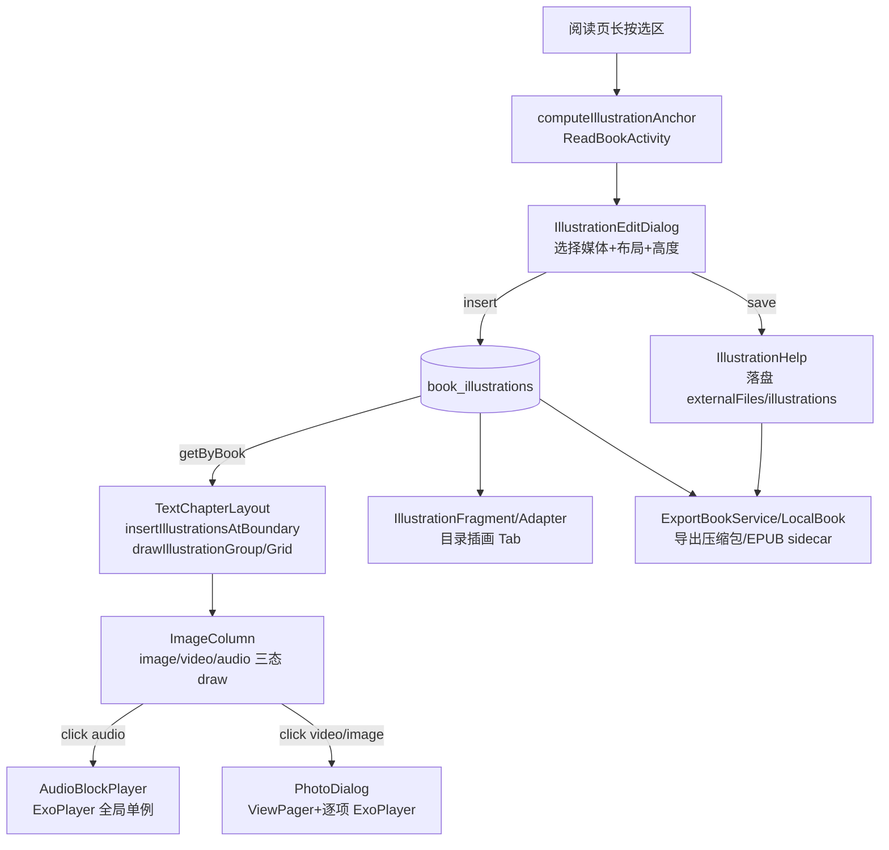
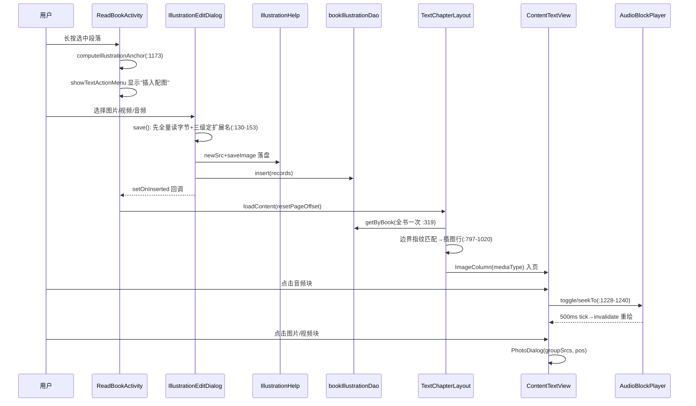
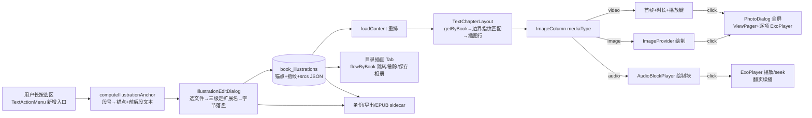

# C2 多媒体插入体系 — 实施级设计（legadoC → 本项目）

> 来源：`docs/specs/legadoc-benchmark-analysis/design.md` AD-04（多媒体插入全量迁 DB+排版+播放三层）＋ evidence-pack.md B 节。
> legadoC 源码根：`F:\myself\github\WeAgentChat\temp\legadoC_src\legadoC-own`（下文 `LC/` 前缀）；本项目根：仓库根（下文 `本项目/` 前缀）。
> 状态：**设计前置，未经检查点裁决不进入实施**（design.md §0.1）。
> 约束声明：遵守 AGENTS.md 强制规则（updateLog/E2E 真机/测试包选择/daemon 清理）与 checkstyle/naming/exception/logging/database-migration-safety/global-thinking-checklist 六份子规范；前端遵守 `docs/project-flow/ui-standards/architecture.md`。

## 1. 目标与非目标

### 1.1 目标
1. 正文级"段间/章末"插图体系：用户选中正文段落 → 插入图片/视频/音频 → 排版渲染 → 点击播放/查看全链路。
2. 三类媒体统一：图片（宫格/独占/显示高度）、视频（首帧+时长+点击全屏）、音频（内嵌播放块，翻页续播）。
3. 随书生命周期：随书备份/恢复、TXT 导出压缩包、EPUB 导出/导入 sidecar（`legado_illustrations.json`）。
4. DB 层新增 `book_illustrations` 表（v10x 自增序列），DAO+Flow 支撑目录页插画 Tab。
5. 前端对齐本项目四组件族与取色基线（编辑对话框走弹框族 A；目录 Tab 走 TocComposeScreen 页签扩展）。

### 1.2 非目标（本期不做）
1. PDF 页热区导出/再导入（LC cropPdfRegion/PdfIllustrationJson，IllustrationHelp.kt:583-711）——实体保留 `pdfPage/pdfRect` 字段一步建终态，链路留待后续。
2. 在线 URL 媒体插入（仅本地文件选择器来源；illustration:// 协议仅指向本地落盘文件）。
3. AI 生图结果直接插入正文（属 C4 范畴，仅预留 src 协议兼容）。
4. 文音融合 AudioTextFusion（design.md #16 暂缓）。
5. Web 端（modules/web）插图展示。

## 2. legadoC 技术架构（逐类逐函数）

### 2.1 模块关系



### 2.2 数据层

| 类/函数 | 位置 | 职责 |
|---|---|---|
| `BookIllustration` | LC/data/entities/BookIllustration.kt:18-65 | 表 `book_illustrations`；索引 `[bookUrl]`+`[bookUrl,chapterIndex]`；FK books.bookUrl CASCADE；字段 id/bookUrl/chapterIndex/chapterUrl/chapterName/anchorType/anchorPos/front(Back)ParagraphText/front(Back)Fingerprint/imageSrcs(JSON)/layoutType/displayHeight/pageBreak/sortOrder/pdfPage/pdfRect |
| 布局常量 | 同上:56-65 | `ANCHOR_BETWEEN_PARAGRAPHS`/`ANCHOR_CHAPTER_END`；`LAYOUT_SINGLE/DOUBLE/TRIPLE/QUAD/QUAD_GRID` |
| `BookIllustrationDao` | LC/data/dao/BookIllustrationDao.kt:13-47 | all/flowByBook/getByBook/getByBookAndChapter(+Flow)/countByBook/insert(REPLACE)/update/delete/deleteByIds/deleteByBook |

### 2.3 帮助层 help/illustration/

| 函数 | 位置 | 关键点 |
|---|---|---|
| `SRC_PREFIX="illustration://"` 等常量 | IllustrationHelp.kt:43-51 | `EPUB_SIDECAR_NAME="legado_illustrations.json"`；`EXPORT_IMAGES_DIR="images"` |
| 扩展名集合 | :53-59 | VIDEO 9 种/AUDIO 12 种/IMAGE 11 种 |
| `newSrc(ext)` | :64-69 | `illustration://{uuid}.{ext}`；ext 小写、无点号兜底（防视频落成 jpg） |
| `getImageDir/getImageFile/saveImage/deleteImages` | :71-93 | 目录 `externalFiles/illustrations/{book.getFolderName()}/`，独立于章节缓存目录 |
| `srcType/isImageSrc/isVideoSrc/isAudioSrc` | :96-109 | 按扩展名推断 image/video/audio |
| `queryDisplayName/resolveMediaExt/sniffMediaExt` | :112-207 | 扩展名→MIME→文件头嗅探三级判断（ftyp/EBML/RIFF/flac/ogg/ID3/MP3 帧同步/JPEG/PNG/GIF） |
| `getMediaDurationMs/formatDuration` | :210-240 | MediaMetadataRetriever+LruCache(32)；mm:ss / h:mm:ss |
| `getVideoFrame/getMediaSize` | :243-286 | 首帧缩放 LruCache(8)；视频原始宽高 |
| `saveToAlbum/saveImageToGallery/saveToMediaStore` | :289-383 | 图片→Pictures/Legado，视频→Movies，音频→Music；Q+ MediaStore IS_PENDING，旧版公共目录+MediaScanner |
| `fingerprint(text,head)` | :386-393 | 归一化空白后取头/尾 24 字符 |
| `findForBoundary` | :396-412 | anchorPos 优先、指纹兜底匹配段间配图 |
| 导出 JSON 族 | :416-519 | `buildExportJson/restoreFromExport`（images/ 相对路径，整本 deleteByBook+insert） |
| EPUB sidecar 族 | :521-581 | `buildEpubSidecarJson/epubImageHref`（`Images/{md5Encode16(src)}.{ext}`，视频首帧同源 `.jpg`） |
| `IllustrationAnchor` | IllustrationAnchor.kt:10-15 | anchorType/anchorPos/frontParagraph/backParagraph 四字段 data class |
| `AudioBlockPlayer` | AudioBlockPlayer.kt:16-127 | object 单例；单 ExoPlayer 互斥；`stateChangeListeners` 多实例监听（:29-43）；500ms tick Handler（:45-52）；`toggle/seekTo/stop`（:57-127）；翻页不停播，退出阅读 stop（ReadBookActivity.kt:3296） |

### 2.4 排版层（LC/ui/book/read/page/provider/TextChapterLayout.kt）

| 函数 | 位置 | 逻辑 |
|---|---|---|
| 全书预取 | :317-320 | `getByBook(book.bookUrl)` 一次 + `placedIllustrationIds` 防重放 |
| 段间插入 | :454-460 | `contents.forEachIndexed` 相邻两段调 `insertIllustrationsAtBoundary` |
| 边界匹配 | :797-830 | `boundaryPos=currentChapterOffset()`（:790 lastPageEnd+stringBuilder.length）；**指纹双双非空才用指纹**，双双空白才用 anchorPos，互斥匹配；`sortedBy(sortOrder)` |
| 章末插入 | :648-657 | 仅 `ANCHOR_CHAPTER_END` 且未放置；段间未匹配**不**堆章末（防 TXT 重导入索引错位堆书头） |
| `insertIllustrationLine` | :833-857 | srcs 按 layoutType→cellCount chunked 分组；pageBreak 前后翻页 |
| `drawIllustrationGroup` | :863-958 | 音频单块=整行 52dp；单图 displayHeight 按比例；宫格等分 gap 4dp；放不下整页换页不缩放；TextLine(isImage=true)+ImageColumn(mediaType) |
| `drawIllustrationGrid` | :964-1020 | QUAD_GRID 两行两列，行内等高，整组超页缩放 |

### 2.5 端到端交互时序（LC 实测形态）



### 2.6 列与交互（LC ImageColumn/ContentTextView/PhotoDialog/ReadBookActivity）

- `ImageColumn`（LC .../column/ImageColumn.kt:26-258）：字段 `start/end/src/click/lazyLoad/mediaType`；`draw`（:37-43）按 mediaType 分发 `drawImage`（:45-81，lazyLoad 时 cacheImageAsync+loadingBitmap）/`drawVideo`（:83-126，首帧+半透明播放键+时长角标）/`drawAudioBlock`（:128-210，圆角底+播放暂停键+进度条+时长）；`audioTrackRectF/audioTrackHit`（:216-238）供触摸 seek 命中。
- 点击分发（LC ContentTextView.kt:1227-1268）：音频→`audioTrackHit` 命中进度条则 `audioTrackSeek`，否则 `AudioBlockPlayer.toggle`；视频/配图→`illustrationGroupSrcs`（:1172-1176 查同记录同组 srcs）→ `PhotoDialog(groupSrcs, groupPos, isBook=true)`；普通网络图才走 `AppConfig.clickImgWay` 老逻辑。
- `PhotoDialog`（LC ui/widget/dialog/PhotoDialog.kt:44-255）：`srcs` 列表+ViewPager2（单媒体禁滑 :93）；`players: HashMap<Int,ExoPlayer>`（:76）；翻页 `playWhenReady=当前页`（:96-105）；VideoHolder 每 item 独立 ExoPlayer 本地文件（:163-178）；onViewRecycled release（:195-202）；横屏切换（:213-220）；图片单击关闭、长按保存相册（:182-190）。
- 锚点计算（LC ReadBookActivity.kt:1173-1209）：选区取第一段（跨段取 min(start,end) 段号）；该段为章末段→`ANCHOR_CHAPTER_END`；否则 `anchorPos = frontParagraph.lastLine.chapterPosition + lastLine.charSize + (isParagraphEnd?1:0)`，front/backParagraphText 取相邻两段全文。菜单入口 `menu_illustration`（:1216-1225）→ 弹框 `setOnInserted { ReadBook.loadContent(resetPageOffset=true) }`。
- `IllustrationEditDialog`（LC ui/book/read/config/IllustrationEditDialog.kt:34-249）：`SelectImagesContract`（:57-63）；`save()`（:119-192）**先全量读字节+三级定扩展名再落库**（避免半条记录）；音频永不参与宫格（:163-172 单独成块）；ThumbAdapter 缩略图（:228-249）。
- 目录页 `IllustrationFragment`（LC ui/book/toc/IllustrationFragment.kt:36-265）：`flowByBook` collect；列表/2/3 宫格切换（:92-126）；多选+长按保存/删除（:158-245）；点击 `setResult(index, chapterPos)` 跳阅读（:247-265）。`IllustrationAdapter`（:19-220）双布局；视频 Glide 直接解码首帧、音频 ic_music_note（:155-188）。

## 3. 本项目对接点现状

### 3.1 排版列体系
- 列类型：`page/entities/column/` 下 BaseColumn/TextBaseColumn/TextColumn/TextHtmlColumn/ReviewColumn/ButtonColumn/**ImageColumn（仅图片，:19-57，无 mediaType/lazyLoad/audio/video 分支）**。
- `TextChapterLayout`（provider/TextChapterLayout.kt）：类声明 :94；`stringBuilder` :130；`getTextChapter` :255-525，`contents.forEachIndexed` :360-513（含 adaptSpecialStyle 的 `[newpage]`/NATIVE_CONTENT_FLAG/`<usehtml>` 分支 :363-383）；`setTypeImage` :534-619；ImageColumn 创建点 :609/:1689（均命名参数构造，加默认值字段兼容）。**无** `insertIllustrationsAtBoundary`/`currentChapterOffset`/章末插图挂点。
- 关键可复用原语：`TextLine` 有 `chapterPosition/charSize/paragraphNum/isParagraphEnd`（TextLine.kt:37-58）；`TextChapter.paragraphs` by lazy（TextChapter.kt:66）；`prepareNextPageIfNeed/calcTextLinePosition/durY` 机制与 LC 同构（本项目同源 Sigma 系，LC 的排版插入代码形态可直接对照移植）。

### 3.2 点击分发
`ContentTextView.click`（:549-624）：`ImageColumn` 分支仅 `AppConfig.clickImgWay` 四态（:572-614）；`onImageLongPress` :502；`touch` :738（y 命中→列回调，与 LC 相同）；`CallBack.oldClickImg/clickImg` :1236-1237。**音频 seek/视频组播需要前置新分支**。

### 3.3 数据库（v108）
- `AppDatabase.kt`：version=108 :126；实体清单 :128-146（无 BookIllustration）；`addMigrations(*DatabaseMigrations.migrations)` :119；AutoMigration 止 88→89；手写 migration 90→108 在 DatabaseMigrations.kt:384-1480（`migration_107_108` :1430-1480 含 `runCatchingSql` 分号拆分范式可直接复用）。

### 3.4 播放器资产盘点（口径注记：help/exoplayer/ 11 文件；ui/video 全套口径为 13 文件——本节仅盘 help/exoplayer 侧 11 文件，ui/video 侧 2 文件与 C2 本地媒体链路无关）
| 文件 | 与 C2 关系 |
|---|---|
| ExoPlayerHelper（createLoadControlByTier/createMediaSource/sniffVideoType） | 面向在线 HLS/DASH 流；本地音频块**不直接依赖**，仅 TrackSelector 教训继承 |
| PlayerInstancePool（池 3，acquire/recycle，TrackSelector 每实例独立 :58-60） | 阅读页音频单实例互斥场景**不需要池**；PhotoDialog 逐项播放器独立创建即可 |
| VideoPreloader/FirstFramePreloader/M3u8PreCheckDataSource/HlsKeyDataSourceFactory/InputStreamDataSource/MimeSniffer(+Cache)/DeviceInfoHelper/ImageEnhanceEffects | 在线视频链路资产，C2 本地媒体不用；MimeSniffer 思路与 LC sniffMediaExt 等价（文件头嗅探），实现取其一 |

结论：**AudioBlockPlayer 以本地文件 Progressive 播放为主，不强行套用在线流治理**；只需继承"TrackSelector 不得跨实例共享""release 纪律"两条铁证教训。

### 3.5 其余对接点
- `BookHelp.getImage`（:379-385）：固定 `downloadDir/{cacheFolderName}/{bookFolder}/images/md5.ext`，**无 illustration:// 分流**（LC BookHelp.kt:290-294 有，需补齐）。
- `Backup.kt`：`stageBookCache` :271-326 按 `BookCacheSelectorConfig` 选中书 `copyRecursively(BookHelp.cachePath/{folder})`；**插图目录 externalFiles/illustrations/ 不在任何备份链**。
- `PhotoDialog`（ui/widget/dialog/PhotoDialog.kt:25+）：**仅图片单图**，无 ViewPager/无视频。
- `TocComposeScreen`：`TocPage {Chapters, Bookmarks}`（:90，页签 :610-617）。
- `TextActionMenu`（ui/book/read/TextActionMenu.kt）：ACTION_* 常量 :154-162、`upMenu` :185；宿主 ReadBookActivity 实现 CallBack :240。
- `ImageProvider`：cacheImageAsync :161/getImageSize :187/getImage :211/getImageOrNull :241（无 LC 的 `loadingBitmap` 常驻占位字段——用既有占位 drawable 等价替代）。
- 无 `SelectImagesContract`（LC utils 有）——需新增；`externalFiles` 扩展已有（Backup.kt:97 使用）。

### 3.6 锚点原语两侧对齐核查（可行性结论：零阻塞）

| LC 锚点依赖原语 | 本项目对应 | 结论 |
|---|---|---|
| `TextChapter.paragraphs`（TextChapter.kt:61-95，paragraphs[i].num=i+1） | `TextChapter.paragraphs` by lazy（TextChapter.kt:66），无 num 字段→用 index+1 替代 | ✅ 可用 |
| `paragraph.text`（TextParagraph 拼接） | `TextParagraph.text`（TextParagraph.kt:8 textLines joinToString） | ✅ 同构 |
| `frontParagraph.lastLine.chapterPosition/charSize` | `TextLine.chapterPosition :39`/`charSize :55` | ✅ 同构 |
| `isParagraphEnd` 判定 +1 | `TextLine.isParagraphEnd :42` | ✅ 同构 |
| 选区段号 `getLine(pos.lineIndex).paragraphNum` | `TextLine.paragraphNum :37` + ReadView 选区 `selectStartPos/selectEndPos` | ✅ 可用 |
| `currentChapterOffset()` 排版期边界 | 本项目排版期直接用"上一已排行 chapterPosition+charSize"现算（同 info 等价） | ✅ 免新增状态 |

## 4. 改造方案（逐文件函数级）

### 4.1 legadoC → 本项目文件映射总表

| legadoC 源文件 | 本项目目标文件 | 动作 |
|---|---|---|
| data/entities/BookIllustration.kt | data/entities/BookIllustration.kt | 新增（照搬结构+本项目实体规范：字段全默认值/@Parcelize） |
| data/dao/BookIllustrationDao.kt | data/dao/BookIllustrationDao.kt | 新增；AppDatabase.kt 抽象 fun 注册 |
| help/illustration/IllustrationHelp.kt | help/illustration/IllustrationHelp.kt | 移植，裁剪 PDF 段（非目标），保留媒体嗅探/相册/指纹/导出导入 |
| help/illustration/IllustrationAnchor.kt | help/illustration/IllustrationAnchor.kt | 原样新增 |
| help/illustration/AudioBlockPlayer.kt | help/illustration/AudioBlockPlayer.kt | 移植+改造（见 4.3） |
| ui/.../column/ImageColumn.kt | 就地扩展 ImageColumn.kt | +mediaType/lazyLoad 字段与三态 draw（见 4.4） |
| provider/TextChapterLayout.kt 插图函数 | 就地扩展 provider/TextChapterLayout.kt | +插图预取/边界匹配/行插入（见 4.5） |
| ContentTextView.kt 点击分发 | 就地扩展 ContentTextView.kt click() | +audio/video/配图前置分支（见 4.6） |
| IllustrationEditDialog.kt | ui/book/read/config/IllustrationEditDialog.kt | **按弹框族 A 用 Compose 重写**（见 7.1） |
| IllustrationFragment/Adapter | ui/book/toc/IllustrationScreen.kt（Compose） | 按 TocComposeScreen 页签模式重写（见 7.2） |
| PhotoDialog（媒体版） | 就地扩展 ui/widget/dialog/PhotoDialog.kt | +ViewPager+视频页（见 4.7） |
| LocalBook sidecar 导入 | model/localBook/LocalBook.kt | +readEpubSidecar/restoreFromExport 调用 |
| ExportBookService 打包 | service/ExportBookService.kt | +插图 JSON+images/ 进导出包 |
| Backup.kt | help/storage/Backup.kt | +插图目录备份/恢复（见 4.8） |
| utils/SelectImagesContract | utils/SelectImagesContract.kt | 新增（照搬 LC 同名 Contract） |

### 4.2 数据层新增（Phase A）
1. `data/entities/BookIllustration.kt`：字段与 LC 全对齐（含 pdfPage/pdfRect 一步建终态）；表名 `book_illustrations`；索引/FK 同 LC。
2. `data/dao/BookIllustrationDao.kt`：方法集同 LC（naming_rules：Dao 后缀+get/flow/up/delete 前缀）。
3. `AppDatabase.kt`：entities 数组追加 + `abstract fun bookIllustrationDao(): BookIllustrationDao` + version 自增（见 §6）。
4. `BookHelp.kt getImage`（:379 处）补分流：`if (storageSrc.startsWith(IllustrationHelp.SRC_PREFIX)) return IllustrationHelp.getImageFile(book, storageSrc)`，使封面/正文渲染统一入口可解析插图。
5. **src 防路径穿越强制校验（移植安全项，红队中高-B1）**：LC `IllustrationHelp.kt:75-80` `getImageFile` 直接 `File(getImageDir(book), "$name.$ext")` 无 `..` 校验——恶意 EPUB sidecar 可构造含 `../` 的 src 实现**任意文件读→保存相册外泄链**（PhotoDialog 长按保存、目录 Tab 批量保存均为外泄出口）。移植时 `getImageFile/resolveSrc` 强制双保险：① src 文件名段必须匹配 UUID 格式白名单正则（`^[0-9a-fA-F]{8}-[0-9a-fA-F]{4}-[0-9a-fA-F]{4}-[0-9a-fA-F]{4}-[0-9a-fA-F]{12}$`，`newSrc` 产物天然满足）；② 解析后 `File.canonicalPath` 必须位于 `getImageDir(book).canonicalPath` 前缀内（先例：LC AiCreationImageFile.fileOf:39-42 的 `require(!fileName.contains(".."))`，本设计加强为 canonicalPath 前缀判定）。校验失败→按文件缺失占位处理（E8），EPUB 导入场景同时计入跳过数（§4.8-1 恢复链）。

### 4.3 AudioBlockPlayer 复用映射（ExoPlayer 资产适配）

| LC 实现 | 本项目改造 | 理由 |
|---|---|---|
| `ExoPlayer.Builder(context).build()` 裸建 | 保留裸建（本地 Progressive），**独立 TrackSelector**，不进 PlayerInstancePool | 单实例互斥无池化收益；继承 PlayerInstancePool.kt:30-36 的共享崩溃铁证 |
| 无音频焦点 | **新增 AudioFocusRequest 获取/放弃**（transientMayDuck）；焦点互斥矩阵依 OQ-1 裁决（**实施前阻塞项**，建议默认：TTS 持焦点→音频块自动暂停） | 本项目已有 TTS/BGM/AudioPlayService 并存，LC 未处理属其缺陷 |
| `stateChangeListeners` + 500ms tick | 原样保留（ContentTextView 注册重绘） | 已支持多视图实例监听 |
| `stop()` 时机 | ReadBookActivity.onDestroy / 退出阅读调用（对照 LC ReadBookActivity.kt:3296） | 翻页续播天然成立（播放器生命周期独立于页） |
| 异常 | `kotlin.runCatching` 包裹 setDataSource/prepare，`AppLog.putDebugWithTag(TAG_CONTENT,...)` | logging_rules 维度1 |

> 自评留痕（checkstyle object 单例条款）：AudioBlockPlayer 为 object 单例且含可变播放状态（currentPlayer/positionMs/durationMs 等），设计限定为**阅读页 UI 线程单实例使用**——toggle/seekTo/stop 仅由 ContentTextView 点击分发与 ReadBookActivity 生命周期在主线程触发，故不加锁；若后续出现非 UI 线程调用场景，须回补 `@Synchronized` 或 Mutex 保护。

### 4.4 ImageColumn 扩展（Phase B）
1. 字段：`var mediaType: String = "image"`、`var lazyLoad: Boolean = false`（默认值保证 :609/:1689 既有调用点零改动）。
2. `draw()`：按 mediaType 分发（LC :37-43）；`drawImage` 加 lazyLoad（本地插图恒存在，网络图 lazyLoad=false 维持现状）。
3. 新增 `drawVideo/drawAudioBlock/audioTrackRectF/audioTrackHit/drawPlayTriangle`：逐行对照 LC ImageColumn.kt:83-238 移植；颜色使用既有阅读页画布绘制约定（正文/媒体画布主题体系外豁免类，登记至 ui-standards 豁免清单说明）。
4. 音频块绘制所需 `AudioBlockPlayer.positionMs/durationMs` 现算进度，500ms tick 触发 `textLine.invalidate()` 重绘。

### 4.5 TextChapterLayout 插图接入（Phase B，核心风险区）
1. `getTextChapter` 开头（本项目 :261 后）：`val illustrations = appDb.bookIllustrationDao.getByBook(book.bookUrl)`（全书一次）+ `val placedIllustrationIds = hashSetOf<Long>()`。
2. `contents.forEachIndexed` 中 `contentIndex > 0` 时（本项目 :360 后，adaptSpecialStyle 特殊分支**跳过**边界插图，见 §8-E13）：调 `insertIllustrationsAtBoundary(book, contents[contentIndex-1], content, illustrations, placedIllustrationIds)`——匹配逻辑照 LC :797-830（指纹互斥匹配+sortOrder）。
3. 正文循环结束后（本项目 :513 后）：章末插图循环（LC :648-657，仅 ANCHOR_CHAPTER_END 且未放置）。
4. 新增私有函数 `insertIllustrationLine/drawIllustrationGroup/drawIllustrationGrid`：逐行对照 LC :833-1020；行几何走本项目 `prepareNextPageIfNeed/calcTextLinePosition/durY/paddingTop` 同名机制；边界偏移用"上一行 chapterPosition+charSize"现算（本项目 TextLine 已带 :39-58，无需 LC 的 lastPageEnd 变量）。
5. `stringBuilder.append(" ")` 占位 + `TextLine(isImage=true)` 与本项目 setTypeImage :607-612 同构。

#### 4.5.1 关键函数签名（实施对照稿）

```kotlin
// TextChapterLayout.kt 内新增（对照 LC :797-830）
private suspend fun insertIllustrationsAtBoundary(
    book: Book,
    frontText: String,
    backText: String,
    illustrations: List<BookIllustration>,
    placedIds: MutableSet<Long>
) {
    val frontFp = IllustrationHelp.fingerprint(frontText, head = false)
    val backFp = IllustrationHelp.fingerprint(backText, head = true)
    val matched = illustrations.filter {
        it.id !in placedIds &&
            it.anchorType == BookIllustration.ANCHOR_BETWEEN_PARAGRAPHS && (
            (it.frontFingerprint.isNotBlank() && it.backFingerprint.isNotBlank() &&
                it.frontFingerprint == frontFp && it.backFingerprint == backFp) ||
                (it.frontFingerprint.isBlank() && it.backFingerprint.isBlank() &&
                    it.anchorPos == currentBoundaryOffset())
            )
    }.sortedBy { it.sortOrder }
    matched.forEach { placedIds.add(it.id); insertIllustrationLine(book, it) }
}

/** 边界字符偏移：取当前 pendingTextPage 末行 chapterPosition+charSize（免 LC 的 lastPageEnd 状态） */
private fun currentBoundaryOffset(): Int =
    pendingTextPage.lines.lastOrNull()
        ?.let { it.chapterPosition + it.charSize } ?: 0
```

说明：`currentBoundaryOffset()` 与 LC `currentChapterOffset()`（:790 lastPageEnd+stringBuilder.length）语义等价——LC 的 stringBuilder 逐段累计即"最后已排版字符的章节偏移"，本项目直接从末行 TextLine.chapterPosition 现算，少一个可漂移状态。指纹互斥匹配（指纹齐→忽略 anchorPos；双空白→才比 anchorPos）保证插图自身占位字符导致的偏移漂移不影响后续匹配。**指纹碰撞处置（红队 B3）**：同指纹命中多条记录（多边界）时不得全插，在 `filter` 后追加 anchorPos 邻近约束——取 `anchorPos` 与 `currentBoundaryOffset()` 差值绝对值**最小**者为命中（实施：`minByOrNull { abs(it.anchorPos - currentBoundaryOffset()) }` 于同指纹分组内取最近），其余视为陈旧失配静默跳过（记录保留，目录 Tab 可见可重插），防替换净化/重导入后同指纹在多个相似边界重复堆图。

### 4.6 ContentTextView 点击分发（Phase B）
1. `click()` 的 `is ImageColumn` 分支最前置加：`if (column.mediaType == "audio" && column.src.startsWith(IllustrationHelp.SRC_PREFIX))` → `audioTrackHit(x)` ? `audioTrackSeek` : `AudioBlockPlayer.toggle(context, book, src)`（LC :1228-1240）；`mediaType == "video"` → `PhotoDialog(illustrationGroupSrcs(src), pos)`（LC :1241-1250）。
2. `mediaType == "image" && src.startsWith(SRC_PREFIX)` → `PhotoDialog(groupSrcs, groupPos)`（绕过 clickImgWay）。
3. 新增私有 `illustrationGroupSrcs/hitAudioTrack/audioTrackSeek`（LC :1172-1176/:1336-1350），DAO 查询走 `appDb.bookIllustrationDao`（主线程 allowMainThreadQueries 已开，AppDatabase.kt:120）。
4. `AudioBlockPlayer.stop()` 挂 ReadBookActivity 退出阅读点。

### 4.7 PhotoDialog 媒体化（Phase C）
1. 新增构造 `constructor(srcs: List<String>, position: Int, isBook: Boolean)`（Bundle srcs/position/isBook，向后兼容旧单图构造）。
2. 布局改 ViewPager2 容器：TYPE_IMAGE=PhotoView 页（单击关闭/长按保存相册），TYPE_VIDEO=PlayerView 页（独立 ExoPlayer 本地文件，`playWhenReady=当前页`，onViewRecycled release）——对照 LC PhotoDialog.kt:84-255。
3. 横屏按钮：`requestedOrientation` 切换+onDestroy 还原（LC :213-220）。
4. 保存相册复用 `IllustrationHelp.saveToAlbum`（IO 协程+toast）。

### 4.8 备份/导出/导入（Phase C）
1. **随书备份（文件+DB 双轨，红队 B2）**：`Backup.kt stageBookCache`（:271-326）在 `bookFolder.copyRecursively` 后追加 `IllustrationHelp.getImageDir(book)` 递归拷贝至 `<root>/book_cache/{folderName}/illustrations/`；**同时将 `book_illustrations` 表纳入 `BackupConfig` 备份实体清单**（`help/storage/BackupConfig.kt` 实体清单随书导出插图记录——若仅备份文件目录，恢复后"文件在、记录无"，插图全灭且无法通过重排还原锚点）。恢复链定义：① 先还原记录（备份无记录字段→跳过该轨）；② 再还原文件目录（旧备份无 illustrations 目录→跳过，不报错）；③ **悬空 src**（记录存在但媒体文件缺失）与**非法 src**（未过 §4.2-5 白名单/canonicalPath 校验）统一**跳过+计数**，恢复完成 toast 汇总"插图跳过 N 条"，不中断、不报错；悬空渲染兜底见 E8。
2. **TXT 导出**：`ExportBookService` 打包处（对照 LC ExportBookService.kt:582）：查询 `getByBook` → `buildExportJson` 写 `illustrations.json`，媒体文件按 `images/{uuid}.{ext}` 入包。
3. **EPUB 导出**：EPUB 生成链写 `legado_illustrations.json` sidecar + `Images/{md5Encode16}.{ext}` 资源；**EPUB 导入**：`LocalBook` 导入完成回调 `readEpubSidecar`（对照 LC LocalBook.kt:473-483）→ `restoreFromExport`。
4. 书籍删除：级联删 DB（FK CASCADE），文件目录清理挂现有删书文件清理点（随 `deleteImages(book, srcs)` 与目录遍历，具体挂点实施时核对 BookHelp 删书链）。

> 协程双版本条款自评（checkstyle 首条）：本设计新增的异步点——`saveToAlbum`/`saveImageToGallery`（§4.7）、插图目录备份拷贝与 EPUB sidecar 导入导出（§4.8）、编辑对话框选择回调后的落盘落库（§7.1）——均走本项目 `Coroutine.async{}...onError{}.onSuccess{}` 链式封装；IllustrationHelp 对外异步能力按需提供 `xxx()` 返回 `Coroutine<T>` + `xxxAwait()` 挂起双版本，禁止标准 launch+try/catch 与 CoroutineExceptionHandler。

## 5. 数据流



## 6. DB 变更设计

### 6.1 表 DDL（migration 内 SQL，与实体 Room schema 严格一致、无 DEFAULT 子句）
```sql
CREATE TABLE IF NOT EXISTS `book_illustrations` (
  `id` INTEGER PRIMARY KEY AUTOINCREMENT NOT NULL,
  `bookUrl` TEXT NOT NULL,
  `chapterIndex` INTEGER NOT NULL,
  `chapterUrl` TEXT NOT NULL,
  `chapterName` TEXT NOT NULL,
  `anchorType` TEXT NOT NULL,
  `anchorPos` INTEGER NOT NULL,
  `frontParagraphText` TEXT NOT NULL,
  `backParagraphText` TEXT NOT NULL,
  `frontFingerprint` TEXT NOT NULL,
  `backFingerprint` TEXT NOT NULL,
  `imageSrcs` TEXT NOT NULL,
  `layoutType` TEXT NOT NULL,
  `displayHeight` INTEGER NOT NULL,
  `pageBreak` INTEGER NOT NULL,
  `sortOrder` INTEGER NOT NULL,
  `pdfPage` INTEGER NOT NULL,
  `pdfRect` TEXT NOT NULL,
  FOREIGN KEY(`bookUrl`) REFERENCES `books`(`bookUrl`) ON UPDATE NO ACTION ON DELETE CASCADE
)
CREATE INDEX IF NOT EXISTS `index_book_illustrations_bookUrl` ON `book_illustrations` (`bookUrl`)
CREATE INDEX IF NOT EXISTS `index_book_illustrations_bookUrl_chapterIndex` ON `book_illustrations` (`bookUrl`, `chapterIndex`)
```

### 6.2 版本衔接（自适应条款）
- 本项目当前 version=108（AppDatabase.kt:126）。C2 实施时 **version 以实施刻度 AppDatabase 当前 version+1 为准**；下文以 v109 示例。若 NG 任务 P1 已先行占用 109，则 C2 自动顺延取 110，migration 对象命名 `migration_{N-1}_{N}` 同步顺延，**禁止硬编码 109**（AGENTS.md 已有"版本号以 AppDatabase.kt 为准，文档禁止硬编码快照"同源条款）；跨 spec（NG P1 ↔ C2）版本占用冲突按 design.md §4 的跨 spec DB 版本登记机制登记协调。
- 新增表属纯 additive 变更：`Migration(108, 109)` 仅 6.1 三条 SQL，**不触碰任何 @DatabaseView**（book_sources_part 免重建，规避 database-migration-safety R1）。按 R2 用 `kotlin.runCatching`+AppLog 包裹（复用 `runCatchingSql` 范式，DatabaseMigrations.kt:1466-1479）；R3/R4 单向递增；R5 覆盖安装真机验证（v108 装数据→覆盖→无 `Migration didn't properly handle`）。
- 实体注册：AppDatabase entities 数组 + `abstract fun bookIllustrationDao()`；`exportSchema=true` 自动产出 v109 schema JSON（入 `app/schemas/`，git 提交）。

### 6.3 migration 代码草案（照 runCatchingSql 范式，DatabaseMigrations.kt:1466-1479）

```kotlin
private val migration_108_109 = object : Migration(108, 109) {
    override fun migrate(db: SupportSQLiteDatabase) {
        runCatchingSql(db, "108→109 create book_illustrations") {
            """CREATE TABLE IF NOT EXISTS `book_illustrations` (
                `id` INTEGER PRIMARY KEY AUTOINCREMENT NOT NULL,
                /* …18 列同 §6.1，此处省略与 §6.1 严格一致… */
                FOREIGN KEY(`bookUrl`) REFERENCES `books`(`bookUrl`)
                    ON UPDATE NO ACTION ON DELETE CASCADE
            )"""
        }
        runCatchingSql(db, "108→109 index bookUrl") {
            "CREATE INDEX IF NOT EXISTS `index_book_illustrations_bookUrl` " +
                "ON `book_illustrations` (`bookUrl`)"
        }
        runCatchingSql(db, "108→109 index bookUrl_chapterIndex") {
            "CREATE INDEX IF NOT EXISTS `index_book_illustrations_bookUrl_chapterIndex` " +
                "ON `book_illustrations` (`bookUrl`, `chapterIndex`)"
        }
        AppLog.put("AppDatabase Migration 108→109: book_illustrations 创建完成")
    }
}
// 注册进 DatabaseMigrations.migrations 数组；实施时若版本顺延则整体改名，SQL 不变
```

**§6.1 为唯一 DDL 源，实施禁止从本节誊抄**（本节省略 18 列仅为文档去重）。要点：新表 DDL 与实体 Room 导出 schema **逐列核对**（NOT NULL/无 DEFAULT 子句，同 migration_107_108 注释先例 :1428）；纯新增表不触碰既有表，无数据拷贝步骤；回滚不需要（R3 单向）。

## 7. 前端改造方案（对齐 ui-standards/architecture.md）

### 7.1 编辑对话框 IllustrationEditDialog（弹框族 A 基线）
1. 形态：`ComposeDialogFragment` + `AppDialogFrame`/`rememberAppDialogStyle()`（铁律 3：**禁止**新建 BaseDialogFragment 子类 / alert{} DSL）。
2. 内容区（Compose）：已选媒体横向缩略图行（LazyRow）、"选择文件"按钮（`SelectImagesContract`，`*/*` 后三级定扩展名过滤）、布局 RadioRow（single/double/triple/quad/quad_grid）、显示高度输入、独占一页开关、底部取消/确定。
3. 取色：`rememberAppSettingPalette()`（page/row/text/accent）；**无硬编码色号**（门禁 §四.5）；圆角走 `UiCorner`。
4. 保存成功 → `ReadBook.loadContent(resetPageOffset = true)` + toast（对照 LC ReadBookActivity.kt:1219-1221）。

### 7.2 目录页插画 Tab
1. `TocComposeScreen` 的 `TocPage` 枚举加 `Illustrations`，页签行 :610-617 扩展；空态/列表/2-3 宫格三种密度；列表行用既有行基线组件（行取色 `palette.settings.row`，根背景 `palette.settings.page`）。
2. 交互：点击→`chapterIndex+anchorPos` 跳转阅读（走 TocActivity 既有 setResult 回传机制）；长按→ModernActionPopup 视觉菜单（保存相册/保存所有/删除）；多选批量删除。
3. 顶栏沿用 GlassTopAppBar（TocActivity 现状），新页签不新增顶栏形态（门禁 §四.1）。

### 7.3 阅读页渲染与菜单入口
1. `TextActionMenu` 加 `menu_illustration` 项 + `ContentSelectConfig.ACTION_ILLUSTRATION` 常量；`upMenu` 宽度自适应含新项；菜单图标语义保留（门禁 §四.0）。
2. 画布内音频块/视频覆盖层绘制属"阅读正文可配置色/媒体画布"豁免类（architecture.md 铁律 1 豁免清单需登记，注明由阅读背景色派生 α 叠加）。
3. PhotoDialog 全屏背景固定黑（媒体画布豁免，同 LC PhotoDialog.kt:86 注释理由），登记同上。

## 8. 边界条件（≥14 条）

| # | 场景 | 设计处置 |
|---|---|---|
| E1 | 大图内存（8000×8000 png） | 走 ImageProvider 既有按列宽高采样；宫格 cellWidth≤屏宽/4；显示高度上限约束；首帧/缩略图 LruCache（LC :243 上限 8；**首帧按字节上限改造见 E20**） |
| E2 | 视频编解码不支持（AV1/HEVC 旧机） | `getVideoFrame/getMediaSize/MediaMetadataRetriever` 全 `runCatching`，失败回落 `image_loading_error` 占位，点击仍可试播（ExoPlayer 自身报错 toast） |
| E3 | 锚点段落被替换净化/重缓存删除 | 指纹失配→静默不渲染；**不堆章末**（LC :648-657 同款防堆书头）；记录仍在，目录 Tab 可见可删可重插 |
| E4 | 翻页续播 | AudioBlockPlayer 生命周期独立于页：翻页/翻章不停；退出阅读 stop；同 src 点击=暂停/继续 |
| E5 | 多插图同段 | sortOrder 升序逐条插行；placedIds 防跨边界重复放置 |
| E6 | 备份恢复 | `book_illustrations` 记录纳入 `BackupConfig` 备份实体清单（文件+DB 双轨，§4.8-1，红队 B2）；旧备份无 illustrations 目录/无记录字段→对应轨跳过；恢复链悬空 src（记录在文件缺）与非法 src（白名单/canonicalPath 校验失败）统一**跳过+计数**，完成 toast 汇总；记录在文件缺的渲染兜底→E8 |
| E7 | EPUB 导入导出 | sidecar `version=1` 字段向前兼容；导入 `deleteByBook+insert` 整本替换（LC :464-467）；视频/音频文件同样入包（restoreFromExport 通用） |
| E8 | 媒体文件丢失 | drawVideo→loadingBitmap 占位；drawAudioBlock 时长 0 不画进度；toggle 播放前 `file.exists()` 守卫（LC AudioBlockPlayer.kt:72） |
| E9 | 横竖屏 | 旋转→重排版→指纹匹配重放（与宽度无关）；PhotoDialog 横屏态 onDestroy 还原 UNSPECIFIED |
| E10 | 超长音频（>10h） | durationMs 溢出无（Long）；格式化 h:mm:ss；tick 500ms 内存无累积 |
| E11 | 音频块与朗读/TTS/BGM 并发出声 | AudioFocusRequest 获取/放弃；互斥矩阵见 OQ-1（**实施前阻塞裁决项**，Phase B 门禁前置，建议默认：TTS 持焦点→音频块自动暂停保进度，反向按 TTS 侧既有策略） |
| E12 | 选择器选到非媒体文件 | `resolveMediaExt` 三级判断；任一文件读取失败/非媒体→整体中止 toast，**先全量校验后落盘**防半条记录（LC IllustrationEditDialog.kt:130-153） |
| E13 | EPUB/HTML 排版分支 | `adaptSpecialStyle` 的 NATIVE/usehtml/`[newpage]` 章节不执行段间插入（contents 项非纯文本段）；入口对该类章节隐藏；仅章末锚点仍可用 |
| E14 | 选区跨段/末段 | 跨段取第一段语义；第一段=章末段→chapter_end；anchorPos=末行 chapterPosition+charSize(+1) |
| E15 | 换源/删书 | FK CASCADE 随 bookUrl 删记录；换源 bookUrl 变更→旧书记录随旧 book 条目级联删除（用户可感知，写入 README/更新日志）；文件目录清理挂删书链 |
| E16 | 排版性能 | 每章仅一次 getByBook（主线程 allowMainThreadQueries，百条级 filter 无压力）；指纹为 O(n) 字符串比较，24 字符窗口 |
| E17 | 同段重复 anchorPos 漂移（插图自身占位字符） | 指纹互斥匹配优先（LC :797-830 注释：指纹对内容偏移不敏感），anchorPos 仅双指纹空白时兜底 |
| E18 | 恶意 sidecar src 路径穿越（`../`/绝对路径→任意文件读→保存相册外泄，红队中高-B1） | `getImageFile/resolveSrc` 强制双保险：UUID 格式白名单正则 + `canonicalPath` 必须位于 `getImageDir` 前缀内（§4.2-5，先例 LC AiCreationImageFile.fileOf:39-42）；失败→按文件缺失占位（E8）+ 导入/恢复跳过计数（§4.8-1） |
| E19 | 指纹碰撞（同指纹命中多边界，红队 B3） | anchorPos **邻近**约束：同指纹分组内取 `anchorPos` 与当前边界偏移差值最小者渲染，其余静默跳过（§4.5.1 说明）；记录保留目录 Tab 可重插 |
| E20 | 视频首帧内存（4K 首帧单张 ≈33MB，LC 按张数缓存 8 个 ≈264MB，红队 B4） | 首帧解码强制缩放至 ≤屏宽（inSampleSize 按原始宽高计算采样率，必要时 Matrix 二次缩放）；首帧 LruCache **改按字节上限**（按 `Bitmap.allocationByteCount` 累计，总上限随堆规模取 24-32MB，超限 LRU 淘汰），弃 LC 的"8 张"张数制 |

## 9. 规范符合性核查表

| 规范 | 符合性设计 |
|---|---|
| checkstyle（协程双版本/runCatching/object 单例/实体规范） | BookIllustration data class+@Parcelize+全默认值；IllustrationHelp/AudioBlockPlayer 为 object；落盘/IO 全 `kotlin.runCatching`；无新增异常类（无需 NoStackTraceException 子类，失败路径均为返回值/占位） |
| naming（up/Await/Help 后缀/常量大写） | `upSelected/upMenu` 沿用；常量 UPPER_SNAKE_CASE（SRC_PREFIX/ANCHOR_*）；DAO/Help 命名符合 |
| exception（catch 日志维度） | 所有 catch `AppLog.putDebugWithTag(TAG_CONTENT,...)`；CancellationException 不捕获场景排除 |
| logging（脱敏铁律） | 日志只记 src 长度/类型/结果布尔，不记段落全文（段落文本可能含用户书内容）；mediaDurationCache 命中数 |
| database-migration-safety（R1-R6） | 纯建表免 view 重建；runCatchingSql 范式；覆盖安装真机验证纳入 L2 |
| global-thinking-checklist（6 维） | 前端入口=阅读选区菜单/目录 Tab/PhotoDialog/编辑对话框 4 处全列出；后端接口=getByBook/DAO 7 方法；DB=新增表；覆盖安装=v10x 自增；使用场景=正文阅读+目录页 2 场景；回填点=排版消费/目录展示/导出备份 3 层 |
| architecture.md（四组件族+取色） | 弹框族 A/菜单 ModernActionPopup/顶栏不新增/根背景 palette；媒体画布豁免登记 |
| AGENTS 门禁 | updateLog 编译前更新；l2_verify_illustration.py 真机；测试包 io.legado.miss.app.debug；stop-daemons.bat 清场 |

## 10. 测试设计

### 10.1 单元测试（./gradlew test）
1. `IllustrationHelpTest`：newSrc 扩展名归一（mp4 不落 jpg）；fingerprint 24 字符+空白归一；srcType 三类覆盖；resolveMediaExt 三级优先（伪造文件头 byte[]）。
2. `BookIllustrationDaoTest`（in-memory Room）：insert/flowByBook/CASCADE 删书验证。
3. 匹配算法抽纯函数测：指纹互斥匹配矩阵（指纹齐/缺 × anchorPos 齐/缺）。

### 10.2 L2 真机脚本 `ai_tests/scripts/l2_verify_illustration.py`（预登记，步骤+断言）
| 步骤 | 动作 | 断言 |
|---|---|---|
| S1 | 推送测试书（含 ≥3 段章节）+ 打开阅读 | 阅读页可达，logcat 无 FATAL |
| S2 | 长按第二段→选区菜单 | 菜单含"插入配图"入口 |
| S3 | 弹框选择 png+mp3+mp4 → 确定 | logcat `IllustrationHelp` 成功标记；DB `book_illustrations` 3 行（db_query 脚本） |
| S4 | 翻页观察 | 图片行/音频块渲染（截图像素采样非空白）；无 OOM |
| S5 | 点击音频块 | logcat ExoPlayer STATE_READY；进度推进（两次 dump positionMs 递增） |
| S6 | 翻页后回翻 | 音频仍播放（续播） |
| S7 | 点击视频块 | PhotoDialog 全屏视频起播 |
| S8 | 目录页插画 Tab | 列表 3 条；点击图片条目跳回对应章 |
| S9 | 删书记录→重排 | 插图消失且正文重排无残留空白行 |
| S10 | 覆盖安装链 | 旧 v(N-1) 装数据→覆盖 v(N)→启动无 `Migration didn't properly handle` |

### 10.3 L3
`python ai_tests/run_e2e.py --tc all` 回归全量（重点 ChapterLayout 相邻用例：EPUB 渲染/替换净化/朗读高亮不回归）。

### 10.4 测试夹具约定
- 媒体样本：小尺寸 png（<100KB）/ 3 秒静音 mp3 / 1 秒 720p mp4（生成脚本入 `ai_tests/fixtures/`，禁止 `temp/` 临时脚本——AGENTS 门禁）。
- 测试书：3 段短章节 TXT（段落指纹稳定，跨字号/跨屏宽重排不变）。
- 日志锚点：落盘/插入/匹配成功路径统一 `AppLog.putDebugWithTag(AppLog.TAG_CONTENT, "IllustrationHelp ...")` 前缀，供 `adb logcat -s ContentProcess:E` 过滤断言；只断言技术标记与计数，不断言段落内容（logging_rules 脱敏铁律）。

## 11. 实施顺序 + 门禁

| Phase | 内容 | 门禁 |
|---|---|---|
| A 数据层 | 实体/DAO/迁移 v(N)/BookHelp 分流 | 覆盖安装真机（R5）+ DAO 单测绿 |
| B 排版+列+分发 | ImageColumn 扩展/TextChapterLayout 插图/ContentTextView 分发/AudioBlockPlayer | **OQ-1 焦点矩阵已裁决（阻塞前置）**；真机 S1-S6；EPUB/朗读回归不破 |
| C 查看层 | PhotoDialog 媒体化/目录插画 Tab/编辑对话框（Compose 族 A） | 真机 S7-S9；UI 门禁 checklist §四逐项 |
| D 随书链 | 备份恢复/ExportBookService/EPUB sidecar/SelectImagesContract 收尾 | S10+导出→删除→导入还原用例 |
| 收尾 | updateLog/文档同步/issues-found/记忆沉淀 | AGENTS §强制规则 4-6 |
| 规范回灌 | 按 design.md 提升清单执行本期对应条目——object 单例留痕范式补全（checkstyle object 单例条款：可变状态单例的线程边界自评留痕，落点 AudioBlockPlayer §4.3 自评，沉淀为 checkstyle 可 Grep 判定条款）+规范核查表执行（§9 逐条打勾） | 回灌完成后验证轮复核规范文件变更与 design.md 清单一致 |

依赖：无前置分期硬依赖（C0 的 AnalyzeRule 修复与其正交）；与 NG 任务共用 DB 版本刻度需在实施时协调（§6.2 条款）。

## 12. Open Questions（检查点裁决项）

1. **OQ-1【实施前阻塞裁决项，红队 B5】TTS 与音频块音频焦点互斥矩阵**：AudioBlockPlayer 落码依赖该结论（§4.3 焦点行），**Phase B 开工前必须裁决**，未裁决不放行。建议方案：**TTS 持焦点时音频块自动暂停**（AudioBlockPlayer 收到焦点丢失→`pause` 而非 `stop`，保留进度条位置，用户回点续播）。互斥矩阵（持焦点方 → 对方行为）：

   | 持焦点方 ↓ \ 对方 → | 音频块（AudioBlockPlayer） | TTS 朗读 | 朗读 BGM | AudioPlayService（有声书） |
   |---|---|---|---|---|
   | TTS 朗读 | **自动暂停（保进度）** | — | duck（TTS 侧既有策略） | 互斥停播（TTS 侧既有策略） |
   | 音频块 | — | 暂停（按 TTS 侧既有焦点策略，属 TTS 模块职责） | duck | 互斥停播 |
   | AudioPlayService | 互斥停播（音频块收到焦点丢失→暂停） | 互斥 | duck | — |

   待裁决点：① 音频块 vs TTS 是否允许 duck 混音替代暂停（建议否，人声叠人声不可懂）；② 朗读 BGM 开启时音频块 duck 还是暂停；③ 焦点丢失 pause vs stop（建议 pause）。LC 未处理属其缺陷，本项目有意修正（AD-C2-8）。
2. OQ-2 换源丢图：换源导致 bookUrl 变更→插图记录级联丢失是否可接受？或迁移策略按 (书名,作者) 搬运记录？
3. OQ-3 PhotoDialog 视频是否直接接本项目 VideoPlayerActivity（在线播放器全功能）而非内嵌 ExoPlayer？一期取内嵌（简单可控），二期升级。
4. OQ-4 插图目录是否纳入"自动全量备份"而非仅 stageBookCache 选择器链？
5. OQ-5 EPUB/HTML 章节是否开放章末锚点（当前设计：开放章末、关闭段间）？
6. OQ-6 音频块固定 52dp 还是随阅读字号缩放（LC 固定值，老花用户可读性问题）？
7. OQ-7 LAYOUT_QUAD（一行四格）与 QUAD_GRID（2×2）是否都暴露给用户，还是默认只留 2×2？
8. OQ-8 媒体文件体积上限（选择器无限制，10 分钟 4K 视频入包导出膨胀）——是否加单文件上限提示？
9. OQ-9 `getByBook` 主线程查询在万条级书是否需切 IO（现状 allowMainThreadQueries，百条级实测无感，超大插画书留观察）。
10. OQ-10 目录插画 Tab 跳转 anchorPos 的落点精度（直接字符偏移定位 vs 定位到段落首行）。

## 13. 工作量（2-3 周基准，按函数粒度复核）

| 包 | 明细（函数级） | 人日 |
|---|---|---|
| A 数据层 | BookIllustration 实体 0.5 / DAO 0.5 / migration+schema 1 / BookHelp 分流 0.5 / 覆盖安装验证 1 | 3.5 |
| B 排版 | insertIllustrationsAtBoundary 1 / insertIllustrationLine 1 / drawIllustrationGroup 1.5 / drawIllustrationGrid 1 / 回归 EPUB+朗读 1.5 | 6 |
| B 列+播放 | ImageColumn 三态 draw+hit 2 / AudioBlockPlayer+焦点 1.5 / click 分发 1 | 4.5 |
| C 查看层 | PhotoDialog 媒体化 2 / IllustrationScreen（Compose）2 / IllustrationEditDialog（Compose+Contract）2 / UI 门禁自查 1 | 7 |
| D 随书链 | Backup 备份恢复 1 / ExportBookService 1 / EPUB sidecar 导出导入 1.5 / L2 脚本 1.5 | 5 |
| 收尾 | updateLog/文档/issues/沉淀 1 | 1 |
| **合计** | | **27 人日 ≈ 2.5-3 周**（量级评估引自 evidence-pack §B（2-3 周）；风险集中在 Phase B 排版回归） |

## 14. 设计决策记录

| # | 决策 | 理由 | Tradeoff |
|---|---|---|---|
| AD-C2-1 | 全量迁三层（DB+排版+播放），播放端复用本项目 ExoPlayer 治理 | design.md AD-04 既定；本项目播放资产为在线流而建，本地媒体不套池化 | AudioBlockPlayer 独立小实现，未复用 PlayerInstancePool（单实例场景无收益） |
| AD-C2-2 | 实体字段含 pdfPage/pdfRect 一步建终态 | PDF 导出属非目标但字段先行，避免二次迁移；同 Bookmark style 先例（evidence-pack J） | 两列短期零写入 |
| AD-C2-3 | 版本号自适应条款（实施时 version+1，禁硬编码 109） | NG P1 亦规划 v109，撞车时零成本顺延 | 文档 DDL 示例与实施可能差一版 |
| AD-C2-4 | 指纹优先、anchorPos 兜底的互斥匹配（照 LC） | 对替换净化/重缓存/重导入鲁棒；LC 实测语义（:794-796 注释） | anchorPos 精确语义弱化（OQ-10） |
| AD-C2-5 | 编辑对话框与目录 Tab 用 Compose 重写，不搬 LC View XML | architecture.md 铁律 3 + AD-05（不引 0 Compose 债务） | UI 层无法逐行照搬，工期 +2 人日 |
| AD-C2-6 | 段间插入在 adaptSpecialStyle 特殊分支跳过 | HTML/EPUB native 章节无"纯文本段落边界"概念 | 该类章节仅章末锚点可用（E13） |
| AD-C2-7 | PhotoDialog 一期内嵌 ExoPlayer | 本地文件 Progressive 最小实现；全功能在线播放器接入留 OQ-3 | 横屏/字幕/倍速等能力一期缺失 |
| AD-C2-8 | 音频焦点补齐（LC 缺陷修正） | 本项目 TTS/BGM 共存现实 | 与 LC 行为不一致，属有意修正 |
