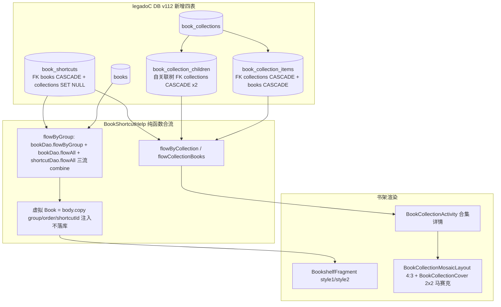
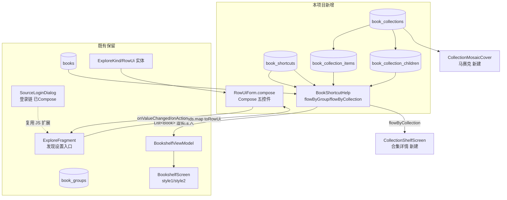

# C3 实施级设计 — 合集书架 + RowUi 发现页渲染链

> 来源：`docs/specs/legadoc-benchmark-analysis/design.md`（#4 合集书架 / #7 RowUi 链，AD-05）
> 事实源：`evidence-pack.md` §E（前端）/§J（数据层）
> legadoC 源根：`F:\myself\github\WeAgentChat\temp\legadoC_src\legadoC-own`（下文 `LC/` 前缀）
> 本项目源根：`app/src/main/java/io/legado/app`（下文 `LP/` 前缀）
> 状态：Draft（设计前置，未审查不实施）

## 1. 目标与非目标

### 1.1 目标

| # | 目标 | 说明 |
|---|------|------|
| G1 | 合集三表 + Shortcut 表落地 | `book_collections` / `book_collection_items` / `book_collection_children` / `book_shortcuts`，数据层照搬 legadoC（含递归 CTE/环检测/事务 move） |
| G2 | 虚拟 Book 模式 | `BookType.notShelf` 位 + `Book.shortcutId`（@Ignore）+ `body.copy` 注入不落库，快捷方式/合集条目以虚拟 Book 出现在书架 |
| G3 | 书架 UI（本项目组件族重写） | 合集卡片（马赛克封面 2x2 + 4:3 容器）、长按多选、加入/解散合集；Compose 按 ui-standards 四组件族 |
| G4 | RowUi 发现页渲染链 | `RowUiForm`/`RowUiDialog`（按本项目组件族重写为 Compose）+ `ExploreFragment` 散装发现设置对话框收敛接线 |
| G5 | 真机验证 | L2 用例 `l2_verify_collection_shelf.py` 预登记 + 覆盖安装 migration 验证 |

### 1.2 非目标

- 不迁移 legadoC `BookCollectionActivity` 的 View 拖拽动画逐帧实现（`DraggingViewState` 堆叠动画属体验增强，一期用多选操作栏替代，拖拽列为 P2 可裁剪项，见 §12 Q2）。
- 不引入 legadoC 0-Compose UI 路线与 `lib/theme/UiCorner` 三表面组实体代码（模式已由 ui-standards 吸收，AD-05）。
- 不改 `BookGroup` 分组体系与主 Tab 结构（并存裁决见 §3.2）。
- 不迁移 legadoC `style1/style2` 双书架样式机制（本项目已有独立书架布局配置）。
- 不涉及书源 `loginUi` 登录链重构（LP `SourceLoginDialog` 已 Compose 化，仅发现页复用其 JS 扩展）。

## 2. legadoC 技术架构

### 2.1 数据流总览（三表 combine 合流 + RowUi 渲染链）



```mermaid
flowchart LR
    subgraph Rule[规则数据]
        EK[ExploreKind url/text/button/toggle/select + action/chars/default/viewName/style]
        RJ[loginUi JSON 含动态 js]
    end
    sub chain[RowUi 渲染链]
        MAP[DiscoverTagItem.toDiscoverRowUi ExploreFragment:1010-1026]
        D[RowUiDialog.show AlertDialog + FlexboxLayout 容器]
        F[RowUiForm.render 五控件分派 text/password/select/toggle/button]
        VF[RowUiViewFactory selectView/buttonView 样式工厂]
    end
    subgraph CB[回填]
        VC[onValueChanged 写 InfoMap + upVariable]
        AC[onAction evalSourceJs / URL 跳转]
        N[resolveViewName 动态 viewName JS]
    end
    EK --> MAP --> D --> F --> VF --> CB
    RJ --> F
```

### 2.2 数据层逐类

| 类（LC 路径） | 关键成员 | 语义 |
|---|---|---|
| `data/entities/BookCollection.kt` | `collectionId`(autoGenerate PK)/name/order/createdTime/updatedTime | 合集根实体，全部字段 defaultValue |
| `data/entities/BookCollectionItem.kt` | 复合 PK(collectionId,bookUrl) + 双 FK CASCADE + Index 双列 | 合集↔书 多对多；书删→条目级联删 |
| `data/entities/BookCollectionChild.kt` | 复合 PK(parentCollectionId,childCollectionId) + 双 FK（均指向 BookCollection，CASCADE） | 合集自关联树边 |
| `data/entities/BookShortcut.kt` | shortcutId(autoGenerate PK)/bookUrl/group/order/collectionId?/createdTime；FK books CASCADE + collections SET NULL；Index(bookUrl/group/collectionId) | 书架排序/入口层；一本书可多入口 |
| `data/entities/BookShortcutWithBook.kt` | @Embedded shortcut + @Relation(bookUrl) book | DAO Flow 载体 |
| `data/entities/BookCollectionWithItems.kt` | @Embedded collection + Junction(items)→books + Junction(children)→childCollections | 列表页聚合载体 |

### 2.3 DAO 逐函数（LC BookCollectionDao.kt，共 289 行）

| 函数 | 行号 | 要点 |
|---|---|---|
| `flowCollections/flowRootCollections` | :20-34 | flowRoot 用 `NOT IN (SELECT childCollectionId …)` 过滤非根；`@Transaction` 让 Relation 同载 |
| `flowBooks(collectionId)` | :39-48 | JOIN items 按 `order,addedTime` 排序 |
| `previewBooksInCollection(collectionId,limit)` | :149-171 | **递归 CTE** `collection_tree(collectionId,depth)`（UNION 防环死循环 + 自环过滤 `child!=parent`），JOIN books 取前 N 本做马赛克预览 |
| `descendantCollectionIds(collectionId)` | :173-188 | 递归 CTE 全部后代集，供环检测 |
| `createCollection` | :190-201 | @Transaction，order=maxCollectionOrder+1 |
| `addBookUrls` | :203-222 | @Transaction：先 `deleteItemsByBookUrls`（一本书只属一个合集）再插入、时间戳递增 `now+index` 防排序冲突、`updateAllCollectionTimes` |
| `normalizeLocations` | :224-229 | `deleteDuplicateBookItems/deleteDuplicateChildCollections` 用 EXISTS 子查询保留 addedTime 最新一条（同刻再比 collectionId 大小，消除并列歧义） |
| `moveItemsToRoot` | :231-243 | @Transaction 移除条目/子边到根 |
| `deleteCollectionAndRelease` | :253-263 | 解散合集：书/子合集**上提**到所有父合集再删自身（非 CASCADE 丢弃） |
| `addChildCollectionIds` | :265-289 | **应用层环检测**：过滤 `child==parent` 与 `parent ∈ descendants(child)`（把 A 挂到其子孙下会成环），先删旧边再插入 |

`BookShortcutDao.kt`：`flowAll/flowByCollection`（@Transaction + WithBook）；`maxOrder`（`group=:gid AND collectionId IS NULL` 作用域）；`moveToCollection/moveToRoot` @Transaction 重排 order。

`help/book/BookShortcutHelp.kt`（:18-160）：

- `Book.isShortcut`（shortcutId>0）与 `shelfKey`（`shortcut:{id}` / `book:{url}`）——书架选择/diff 的稳定键。
- `flowByGroup`：三流 combine——本体书 `flowByGroup` + `flowAll` 全量书 + shortcuts 全量；对 collectionId==null 的 shortcut，取本体 `body.copy(group=shortcut.group, order=shortcut.order, shortcutId=…)` 注入虚拟 Book；`flowAll` 的书流先 `filterNot isNotShelf`。
- `matchesGroup`：groupId 分派 IdAll/IdRoot/IdUngrouped/IdNovel/IdLocal/IdAudio/IdImage/IdVideo/IdError + 位掩码 `shortcut.group and groupId > 0`。
- `delete(books,deleteBody,deleteOriginal)`：仅删映射 vs 连删本体，先显式 `deleteByBookUrl` 再 `bookDao.delete`（FK CASCADE 兜底）。
- `BookShortcut.update(book)`：虚拟 Book 的改动只写回 shortcut 的 group/order（不落 books）。

### 2.4 UI 层逐类（仅作数据/交互事实，代码不照搬——AD-05）

| 类 | 要点 |
|---|---|
| `BookCollectionMosaicLayout.kt`(:12-21) | FrameLayout.onMeasure 强制 `height = width*4/3`（4:3 容器） |
| `BookCollectionCover.kt`(:21-28) | 2x2 四封面；缺书空位 `INVISIBLE` 占位不放大剩余封面；行始终占位；dialogSurface 透明度不嵌套相乘 |
| `BookCollectionActivity.kt`(:57-836) | 合集详情：4 流 combine（books+shortcuts+childCollections+collectionShortcuts）→ `buildCollectionShelfItems`（previewBooks = 可见书 + CTE 递归预览 distinctBy shelfKey 取 4）→ 排序 → Grid；长按多选（selectedBooks/selectedCollections LinkedHashMap）、二次长按堆叠收束动画、拖拽命中检测（`findCollectionAt/findBookAt/raw 坐标`）、rootDropTarget 移回根 |
| `BookCollectionSelectDialog.kt`(:37-120) | BottomSheet 选择目标合集；空白区域点击=移到根；侧滑=移出 |
| `BookCollectionShelfItem.kt` | 纯 data class（collection+books+childCollections+previewBooks+count） |

### 2.5 RowUi 链逐函数

| 类 | 要点 |
|---|---|
| `RowUi.kt`(实体) | name/type(text/password/button/toggle/select)/action/chars/default/viewName/style；isChoice/isAction 派生；`modernBackgroundRes` 为 View 资源绑定（本项目不迁） |
| `RowUiForm.kt`(:18-316) | `render(container,rows,values,callback,idOffset=1000)`：FlexboxLayout 逐行 createRow 分派五控件；text/password=浮动 label 输入行；select=Spinner（`isInitializing` 防初始化误触发）；toggle=按钮循环 chars 值（`nextValue` floorMod）；button/toggle 共用 `bindActionTouch`（防 200ms 双击 + 长按 666ms 判定）；`createRowLayoutParams` 按 FlexChildStyle（flexBasisPercent>=0 → weight=0/flexGrow>0 → WRAP/MATCH）；`resolveViewName` 允许动态 JS 计算 viewName |
| `RowUiDialog.kt`(:28-121) | `show(context,Config,callback)`：标题行+ScrollView(FlexboxLayout)；dismiss 策略三开关（dismissOnAction/Select/Toggle，toggle 默认不 dismiss）；透明窗+SurfaceBackdrop |
| `ExploreFragment` 接线(:974-1029) | `buildDiscoverSettingItems`（select/text/button/url-kind 过滤）→ `toDiscoverRowUi`（ExploreKind→RowUi 类型映射，select 用 kind.title 其余用 text）→ RowUiDialog；`onValueChanged` 按 type 分派 select/text；`onAction` 分派 button/URL kind；`selectDiscoverSettingUrl`（含 URL JS 执行短路） |

## 3. 本项目对接点现状

### 3.1 现状盘点（LP）

| 接入点 | 现状 | 结论 |
|---|---|---|
| `constant/BookType.kt` | **`notShelf = 0b100_0000_0000` 已存在**（:54，"未正式加入书架的临时阅读书"） | G2 的类型位零改动 |
| `data/entities/Book.kt` | 有 `group:Long`(:79)/`order:Int`(:118)/`variable`；无 `shortcutId`；已有多个 `@Ignore` 字段 | 需加 `@Ignore var shortcutId: Long = 0L`（不进 schema，**无需升版**） |
| `data/entities/rule/RowUi.kt` | 与 LC 逐字段一致（含 style/FlexChildStyle），仅少 `modernBackgroundRes/applyModernStyle` View 辅助 | 实体**补零字段**（View 样式辅助按本项目组件族替代，不迁） |
| `data/entities/rule/ExploreKind.kt` | 与 LC 逐字段一致（type/action/chars/default/viewName/style） | 零改动 |
| `ui/login/SourceLoginDialog.kt` | **登录链已 Compose 化**：`rowUis by mutableStateOf` + `LoginRowsContent(source,style=AppDialogStyle)` + `evalUiJs` 动态 loginUi JS + `buildRows/onRowPress` | RowUi 渲染参照物；发现页收敛后可与登录链共享 RowUi 组件 |
| `ui/main/explore/ExploreFragment.kt` | **散装 View 实现**：`renderDiscoverDialogKinds`(:2225) + `renderDiscoverDialogUrl/Button/Toggle/Select/TextInput`(:2255-2464) + `applyDiscoverDialogFlexStyle`(:2651) + `createDiscoverDialogTextView`(:2465) ≈500 行自写 FlexboxLayout 接线（evidence-pack"E 无接线"指无统一 RowUi 链，实际有散装等价实现） | C3-G4 = 用 RowUiForm 收敛替换，非从零接线 |
| `ui/main/bookshelf/` | **已全 Compose**：`BookshelfScreen`(:87)（bookGroups+books 参数化；style1 分组 Tab 由 MainTopBarView 顶栏驱动；style2 Folder 平铺分组头 `FolderGroupList`）+ `compose/BookshelfComposeItems.kt`（BookshelfBookItemUi/BookshelfFolderItemUi/BookshelfGridItem）+ `BookshelfComposeList.kt`（BookshelfListItem/rememberBookshelfListPalette 取色基线）+ `BookshelfComposeCover.kt` | UI 层重写落点；分组头/书条目组件可直接复用 |
| `data/entities/BookGroup.kt` | `book_groups` 实体；虚拟组：IdRoot(-100)/IdAll(-1)/IdLocal(-2)/IdAudio(-3)/IdNetNone(-4)/IdLocalNone(-5)/IdVideo(-6)/IdError(-11)；`Book.group` 位掩码多分组 | 与合集的关系裁决见 §3.2 |
| `data/AppDatabase.kt` | v108（:126），89+ 全手动 Migration；注释列 98→99…107→108 演进 | 版本衔接见 §6.2 |

### 3.2 裁决：虚拟 Book 模式 vs 本项目 BookGroup —— **并存 + 映射**

| 维度 | BookGroup（保留） | 合集/Shortcut（引入） |
|---|---|---|
| 语义 | 分组/筛选维度（一本书可属多组，位掩码 `group`） | 组织/展示维度（书架顺序 `order` + 入口 + 嵌套树 + 马赛克封面） |
| 存储 | `books.group` 位掩码 + `book_groups` 表 | 四张新表，不触碰 books |
| UI 挂点 | 主 Tab 顶栏分组切换 / style2 Folder 分组头 | 合集卡片（含子合集嵌套）/ 合集详情页 |

- **不替代**：BookGroup 承载刷新/更新等既有业务（enableRefresh/onlyUpdateRead），改造风险不可控；合集是纯展示层，FK 均不指向 book_groups。
- **不映射入 book_groups**：legadoC 合集树是"多父 + 递归 CTE + 环检测"的图结构，book_groups 是扁平位掩码，强行映射需改 books.group 语义，破坏现有备份/WebDAV。
- **matchesGroup 适配**（唯一映射点）：LC 的 `IdNovel/IdPrimaryAll` 本项目不存在；LP 的 `IdUngrouped` 拆为 IdNetNone(-4)/IdLocalNone(-5)。迁移时 `matchesGroup` 按本项目虚拟组重写：IdNetNone→`group==0 && type and local==0`、IdLocalNone→`group==0 && type and local>0`，其余一一对应，删除 IdNovel 分支。
- **双写语义**：shortcut.group 与 body.group 独立（LC 语义：虚拟 Book 的分组归 shortcut 管）。本体书 `book.group` 变更不影响 shortcut 入口（见 §12 Q3）。

## 4. 改造方案（逐文件函数级）

### 4.1 数据层（照搬，目标零语义偏移）

| # | 文件（LP） | 动作 | 来源（LC） |
|---|---|---|---|
| D1 | `data/entities/BookCollection.kt` | 新建 | LC 同名，原样（data class+@Parcelize+@Entity+全默认值） |
| D2 | `data/entities/BookCollectionItem.kt` | 新建 | LC 同名（复合 PK+双 FK CASCADE+双 Index）+ 补 @Parcelize（对齐 C2/C4 本项目 Room 实体铁律） |
| D3 | `data/entities/BookCollectionChild.kt` | 新建 | LC 同名（自关联双 FK）+ 补 @Parcelize（同上铁律） |
| D4 | `data/entities/BookShortcut.kt` | 新建 | LC 同名（双 FK CASCADE/SET NULL；实体 Kotlin 侧 @ForeignKey SET_NULL 注解不变） |
| D5 | `data/entities/BookShortcutWithBook.kt` / `BookCollectionWithItems.kt` | 新建 | LC 同名（@Relation 聚合载体） |
| D6 | `data/entities/Book.kt` | 追加 `@Ignore @IgnoredOnParcel var shortcutId: Long = 0L` | LC BookShortcutHelp.toShelfBook 依赖 |
| D7 | `data/dao/BookCollectionDao.kt` | 新建（289 行全量：flow×4/递归 CTE×2/duplicate 清理/事务 move/addChildCollectionIds 环检测） | LC 同名；`@Suppress("ConstPropertyName")` 不涉及；SQL 原样 |
| D8 | `data/dao/BookShortcutDao.kt` | 新建 | LC 同名 |
| D9 | `help/book/BookShortcutHelp.kt` + `BookExtensions.kt`（isShortcut/shelfKey 扩展） | 新建 | LC :18-160；`matchesGroup` 按 §3.2 映射重写 |
| D10 | `data/AppDatabase.kt` | entities 追加 4 + DAO 抽象属性 2 + version 递增 | §6 |
| D11 | `data/DatabaseMigrations.kt` | 新增 `migration_108_109`（runCatching 包裹+AppLog） | §6.3 DDL |

### 4.2 书架 UI（重写映射表，AD-05）

| legadoC（View） | 本项目（Compose） | 映射说明 |
|---|---|---|
| `BookCollectionMosaicLayout`（4:3 FrameLayout） | `CollectionMosaicCover`（新，`compose/CollectionMosaicCover.kt`）：`Modifier.aspectRatio(3f/4f)` + Column{Row,Row} 2x2 | 4:3 锁定由 aspectRatio 承担；空位策略照搬：缺书格渲染占位 Box（非 null 跳过），行高始终参与布局 |
| `BookCollectionCover.loadCollectionCovers` | `CollectionMosaicCover(books,name)`：每格复用 `BookshelfComposeCover`；容器取色 `rememberBookshelfListPalette()`（ThemeStore 直读），禁 M3 surface | 透明度嵌套相乘问题在 Compose 天然不存在（单层 graphicsLayer） |
| `BookCollectionActivity`（Grid 详情+多选+拖拽） | `CollectionShelfScreen`（新，compose）+ `CollectionDetailActivity`（薄壳 Activity）：顶栏 `GlassTopAppBar`（组件族 §三.1）；列表复用 `BookshelfGridItem`/`BookshelfListItem`；合集卡片项 `CollectionShelfCard`（马赛克+名称+计数） | 多选状态 `selectedKeys: Map<String,Item>`（shelfKey 稳定键）；操作栏三动作（详情/加入合集/移除）走既有 ActionMode 等价 Compose 状态；拖拽见 §4.3 |
| `BookshelfItems` 合流 | `BookshelfViewModel`/`BookshelfFragment1/2` 数据流接入 `BookShortcutHelp.flowByGroup(groupId)`，`BookshelfComposeItems.buildBookshelfItems` 增加 `CollectionShelfItemUi` 变体（folder 与合集卡片同级渲染） | style1：groupId==IdRoot 时列表头插入合集区；style2：FolderGroupList 顶部插入合集卡片区 |
| `BookCollectionSelectDialog`（BottomSheet） | `CollectionSelectComposeDialog`：`ComposeDialogFragment` + `AppDialogFrame`（弹框族基线 A）；列表项 `AppManagementListRow` | "空白点击=移到根/侧滑移出"语义在 Compose 重实现（列表尾部加"移出合集"行） |
| `BookCollectionShelfItem` | 原样保留为纯 data class（放 `ui/main/bookshelf/compose/` 旁） | — |
| `RowUiDialog`+`RowUiForm`+`RowUiViewFactory` | `ui/widget/compose/RowUiForm.kt`：`@Composable RowUiForm(rows,values,onValueChanged,onAction,resolveViewName)`；容器 Column+FlowRow（替代 FlexboxLayout）；**render 入口截断：rows≤50（超出丢弃+计数提示）、select options≤100（防恶意书源万行 ANR——resolveViewName 逐行 JS eval 成本随行数放大）**；五控件：text/password=`OutlinedTextField`（浮动 label 对齐 LC）、select=`AppDropdownMenu`、toggle/button=`Surface+clickable` 文本按钮 | 取色走 `rememberAppDialogStyle()`；`modernBackgroundRes` 不迁；`idOffset` 不需要（Compose 无 view id 需求）；防双击 200ms/长按 666ms 判定逻辑保留在回调层 |
| `RowUiDialog.show` | `RowUiComposeDialog`：`ComposeDialogFragment`（基线 A）+ 标题行 + `RowUiForm`；dismiss 三开关保留 | — |
| `ExploreFragment` 散装 render*（≈500 行） | 接线替换：`renderDiscoverDialogKinds` 等 6 函数体改为 `kinds.map{ it.toRowUi() }` + `RowUiComposeDialog`；删除 `createDiscoverDialogTextView/applyDiscoverDialogFlexStyle/applyDiscoverKindTextStyle` 等散装辅助 | `toDiscoverRowUi` 映射照搬 LC :1010-1026；`SourceLoginJsExtensions`/`evalDiscoverDialogButtonClick`/`InfoMap` 回填链保留不动 |

### 4.3 拖拽多选（P2 增强项）

LC 拖拽 = raw 坐标 + `findCollectionAt/findBookAt` 逐 child 命中 + 堆叠动画。Compose 等价：`pointerInput { detectDragGesturesAfterLongPress }` + `onGloballyPositioned` 缓存条目布局 bounds → 落点求所属 grid item → 命中合集卡片调 `addItemsToCollection`。**一期门禁**：多选操作栏"加入合集"路径（`CollectionSelectComposeDialog`）先落地（覆盖 90% 场景），拖拽命中/堆叠动画/根投递区为 P2，允许裁剪（§12 Q2）。

### 4.4 虚拟 Book 下游联动（回填点盘点，global-thinking-checklist §6）

| 层 | 回填点 | 动作 |
|---|---|---|
| 打开书 | `startActivityForBook` 等价跳转（LP BookInfo/阅读入口） | 虚拟 Book 正常携带 bookUrl 打开本体 |
| 更新 | 书架刷新任务（`flowByGroup` 消费方） | `filterNot isNotShelf` 保证虚拟书不进更新队列；本体书照常 |
| 删除 | `BookShortcutHelp.delete` | 三选项弹窗（仅删入口/删本体/本地删文件），映射 LC :379-433 |
| 详情页操作 | BookInfo"移出书架" | 增加"仅移出合集入口"分支（isShortcut 时写 shortcut 而非 book） |
| Web 服务/WebDAV | `web/BookController` books 列表 | 过滤 `isNotShelf`（虚拟书不落库天然无此问题；shortcut 表不在 web 暴露范围，Q10） |

## 5. 数据流（本项目合并后）



## 6. DB 变更设计

### 6.1 DDL（四表，FK 依赖顺序 collections → items/children → shortcuts）

```sql
CREATE TABLE IF NOT EXISTS book_collections (
    collectionId INTEGER PRIMARY KEY AUTOINCREMENT NOT NULL,
    name TEXT NOT NULL,
    `order` INTEGER NOT NULL,
    createdTime INTEGER NOT NULL,
    updatedTime INTEGER NOT NULL);
CREATE TABLE IF NOT EXISTS book_collection_items (
    collectionId INTEGER NOT NULL,
    bookUrl TEXT NOT NULL,
    `order` INTEGER NOT NULL,
    addedTime INTEGER NOT NULL,
    PRIMARY KEY(collectionId, bookUrl),
    FOREIGN KEY(collectionId) REFERENCES book_collections(collectionId) ON UPDATE NO ACTION ON DELETE CASCADE,
    FOREIGN KEY(bookUrl) REFERENCES books(bookUrl) ON UPDATE NO ACTION ON DELETE CASCADE);
CREATE INDEX IF NOT EXISTS index_book_collection_items_collectionId ON book_collection_items(collectionId);
CREATE INDEX IF NOT EXISTS index_book_collection_items_bookUrl ON book_collection_items(bookUrl);
CREATE TABLE IF NOT EXISTS book_collection_children (
    parentCollectionId INTEGER NOT NULL,
    childCollectionId INTEGER NOT NULL,
    `order` INTEGER NOT NULL,
    addedTime INTEGER NOT NULL,
    PRIMARY KEY(parentCollectionId, childCollectionId),
    FOREIGN KEY(parentCollectionId) REFERENCES book_collections(collectionId) ON UPDATE NO ACTION ON DELETE CASCADE,
    FOREIGN KEY(childCollectionId) REFERENCES book_collections(collectionId) ON UPDATE NO ACTION ON DELETE CASCADE);
CREATE INDEX IF NOT EXISTS index_book_collection_children_parent ON book_collection_children(parentCollectionId);
CREATE INDEX IF NOT EXISTS index_book_collection_children_child ON book_collection_children(childCollectionId);
CREATE TABLE IF NOT EXISTS book_shortcuts (
    shortcutId INTEGER PRIMARY KEY AUTOINCREMENT NOT NULL,
    bookUrl TEXT NOT NULL,
    `group` INTEGER NOT NULL,
    `order` INTEGER NOT NULL,
    collectionId INTEGER,
    createdTime INTEGER NOT NULL,
    FOREIGN KEY(bookUrl) REFERENCES books(bookUrl) ON UPDATE NO ACTION ON DELETE CASCADE,
    FOREIGN KEY(collectionId) REFERENCES book_collections(collectionId) ON UPDATE NO ACTION ON DELETE SET NULL);
CREATE INDEX IF NOT EXISTS index_book_shortcuts_bookUrl ON book_shortcuts(bookUrl);
CREATE INDEX IF NOT EXISTS index_book_shortcuts_group ON book_shortcuts(`group`);
CREATE INDEX IF NOT EXISTS index_book_shortcuts_collectionId ON book_shortcuts(collectionId);
```

**FK 顺序铁律**：items/children/shortcuts 均引用 books 或 book_collections，建表顺序必须 collections 最先、shortcuts 最后（其 FK 同时指向 books 与 collections）。Room 实体声明顺序与 migration execSQL 顺序一致。
**语法约定**：SQL 侧 FK 子句统一 `ON UPDATE NO ACTION ON DELETE CASCADE/SET NULL`（对齐 C2 风格；`SET NULL` 为 SQLite 合法语法）；实体 Kotlin 侧 `@ForeignKey(deleteAction = ForeignKey.SET_NULL / CASCADE)` 注解写法不变。

### 6.2 版本衔接自适应条款

- 本文档撰写基线 = `AppDatabase.kt version = 108`。**实施时以 `AppDatabase.kt` 实况 `version` 字段为准**：若 C0/C2 等先行任务已升版至 N，则本设计取 `migration_N_(N+1)`，文档中 108/109 全部按占位符理解，禁止照抄数字。
- 手动 `Migration`（本项目 89 之后全手动，无 AutoMigration）注册进 `DatabaseMigrations.migrations` 数组。
- 四表均为新建，无既有表结构变更、无 @DatabaseView 修改 → R1（view 重建）不触发，但 migration 内仍按 R2 全部 `kotlin.runCatching` 包裹 + `AppLog.put("migration_X_Y failed", it)`。
- **覆盖安装门禁**（R5）：旧 v108 包导入书/分组数据 → 覆盖安装新版 → 启动无 `Migration didn't properly handle`；四表存在、既有数据完整。
- **默认值模式对齐（R6）**：本设计采用 **C2 式**——实体字段 Kotlin 默认值（`var name: String = ""` 等）+ DDL/migration **无 DEFAULT 子句**（对齐 migration_107_108 注释先例与 C2 §6.1）；四表全表统一，禁止混合模式。若实施时改选逐列 `@ColumnInfo(defaultValue=…)` 模式，则 DDL 必须逐列带 DEFAULT 且与实体注解逐字一致，并同步回改 §6.1——二选一，全表只能存在一种模式。依据：Room 打开库时按实体注解导出 schema 与实际表结构逐列比对，DEFAULT 声明不一致直接触发 `Migration didn't properly handle`（R6 运行时校验失败）。

### 6.3 环检测与一致性

- **环检测在应用层**（LC 模式照搬）：`addChildCollectionIds` 插入前过滤 `childId==parentId` 与 `parentId ∈ descendantCollectionIds(childId)`（递归 CTE）。DB 层 FK 无法表达环约束；递归 CTE 的 `UNION`（去重）保证即使脏环数据入库查询不无限循环。
- **恢复路径强制归一（D1 红队修复）**：WebDAV/本地备份的 GSON 整批 insert 不经过 `addChildCollectionIds`（应用层环检测被绕过）→ 恢复流程末尾强制执行：① `normalizeLocations()` 消除 items/children 双归属；② 环清理——用 `descendantCollectionIds` 逐合集检出成环边并删除+计数上报。恢复后不变式：children 表无环、items 无双归属（与运行期 addChildCollectionIds 前置检测等价兜底）。
- **悬空引用插入粒度（D3 红队修复）**：恢复 shortcuts/children/items 逐条 `kotlin.runCatching`——FK 约束插入抛异常（shortcuts.bookUrl 不在 books、children 父/子合集 id 不在 collections）→ 跳过该条+计数，恢复完成提示"跳过 N 条悬空引用"；禁止整批单事务（防一条悬空引用致全量回滚）。
- **重复归一**：`normalizeLocations()` 在合集详情页进入时执行一次（LC :115 同位），EXISTS 子查询按 `addedTime DESC, collectionId DESC` 保留最新，消除并发/重复添加的双归属。
- **单归属约束**：一本书同一时刻只属一个合集（`addBookUrls` 先 `deleteItemsByBookUrls` 再插入）；`moveToRoot/moveItemsToRoot` 负责移出。
- **解散合集**：走 `deleteCollectionAndRelease`（内容上提到父合集后删除），仅 `deleteByIds` 直删时 items CASCADE 丢失引用、shortcuts SET NULL 保书不保合集归属——两语义并存，UI 层解散入口统一用 release 版本。

## 7. 前端改造方案（对齐 ui-standards 门禁 0-8 逐项）

| 门禁项 | 本设计落点 |
|---|---|
| 0 图标语义 | 合集详情顶栏 action（多选/新建合集/排序）均挂真实 onClick；GlassTopAppBar actions 槽直写，不收拢 |
| 1 顶栏 | `CollectionDetailActivity` 用 `GlassTopAppBar`；无自绘 Row/M3 TopAppBar |
| 2 菜单 | 合集卡片长按菜单 = `AppDropdownMenu`（渲染层已对齐基线）；禁 PopupMenu |
| 3 弹框 | `CollectionSelectComposeDialog`/`RowUiComposeDialog`/解散确认 = `ComposeDialogFragment`+`AppDialogFrame`；禁 BaseDialogFragment/alert{} |
| 4 根背景 | `palette.settings.page`（rememberAppSettingPalette 直读） |
| 5 取色 | 马赛克容器/卡片取 `rememberBookshelfListPalette()`；RowUi 控件取 `rememberAppDialogStyle()`；Grep `#(?:[0-9A-Fa-f]{6,8})` 自查零命中 |
| 6 列表/卡片 | 合集卡片/选择列表 = `AppManagementListRow` 口径；书条目复用 `BookshelfGridItem/BookshelfListItem`（不新造） |
| 7 同屏一致 | 合集区嵌入既有 `BookshelfScreen` 骨架（骨架屏/空态/PullToRefreshBox 全复用） |
| 8 更新记录 | `docs/project-flow/ui-standards/components.md` + `migration-registry.md` 登记新组件 |

Compose 强跳过红线（frontend-ui-standards §4.5）：合集选择状态更新一律 `data class copy(...)` 新实例（`BookCollectionShelfItem` 为 val 字段天然满足；多选 Map 用 `toMutableMap()+put` 后整体赋值），禁止原地改字段回流。

## 8. 边界条件（≥12 条）

| # | 边界 | 处置 |
|---|---|---|
| B1 | 合集成环（A→B→A） | `addChildCollectionIds` 前置 descendantCollectionIds 预检拒绝；递归 CTE UNION 去重兜底不炸查询 |
| B2 | 嵌套深度失控（深链 CTE） | CTE 无显式上限，实施时给 `previewBooksInCollection` 的 depth 附加应用层上限（建议 32，Q8），超深不再下钻；**`descendantCollectionIds`（环检测依赖）同样附加返回节点数上限（建议 ≤1024）**：超限视为疑似脏环/超大树，拒绝本次挂载+提示，防环检测自身被脏数据放大成 O(n²) |
| B3 | 删书级联 | `books` 删除 → items/shortcuts CASCADE 自动清；`deleteCollectionAndRelease` 先上提后删，防 CASCADE 误吞子合集内容 |
| B4 | 解散合集 SET NULL | shortcuts.collectionId 置 null（书回书架根），collection 条目 CASCADE 删；release 路径保证内容不丢 |
| B5 | 未上架书引用 | shortcut.bookUrl 指向的本体被删 → FK CASCADE 删 shortcut；`flowByGroup` 内 `mapNotNull` + `filterNot isNotShelf` 双防御，避免虚拟书渲染半态 |
| B6 | 排序冲突（order 并列） | 插入用 `maxOrder+1` 且 addedTime=`now+index` 毫秒递增；`normalizeLocations` 消除双归属并列（addedTime 同刻再比 collectionId） |
| B7 | 书架样式并存 | style1（分组 Tab）/style2（Folder）均接合集区：合集卡片渲染在 `IdRoot` 视图顶部；虚拟 Book 走 matchesGroup 正常落入分组筛选，两样式无特判分叉 |
| B8 | RowUi 恶意规则 | `onAction` 的 JS 走既有 `SourceLoginJsExtensions`（Rhino 沙箱属性隐藏）；`action` 执行包 runCatching + 超时沿用 AnalyzeUrl 既有约束；不新增 API 面；**行数/选项数截断（§4.2）：rows≤50、select options≤100，超出丢弃+计数提示**（防恶意书源万行渲染 ANR 与 resolveViewName 逐行 JS eval 放大） |
| B9 | 动态 loginUi JS（viewName/reUiView） | `resolveViewName`/`reUiView` 复用登录链 `evalUiJs`；`reUiView` 重渲染加代数/深度防递归（LC 未防，本项目补一次性重入锁） |
| B10 | shortcut 与本体 group 双写 | 虚拟 Book 的 group/order 改动只写 shortcut（`BookShortcutHelp.update`）；本体 group 独立。合集详情页排序读 shortcut |
| B11 | 马赛克空位 | 预览书 <4 时空位渲染占位不放大剩余封面（LC INVISIBLE 语义 → Compose 占位 Box）；0 书+0 子合集的空合集不渲染（buildCollectionShelfItems 过滤） |
| B12 | 备份/恢复兼容 | 新四表加入 WebDAV/本地备份实体清单（BackupConfig Books/groups 同族）；旧备份导入到新版 = 四表为空，无 migration 反向问题；新备份导入旧版 = 未知表忽略（既有 GSON 行为），Q9 确认；**恢复完成后强制跑 normalizeLocations+环清理**（GSON 整批 insert 绕过 addChildCollectionIds 应用层环检测，见 §6.3）；**悬空引用逐条 runCatching 跳过+计数**（shortcuts.bookUrl/children 父子合集 id 失联时 FK 抛异常→单条跳过，完成提示"跳过 N 条"，失败粒度=单条非整批回滚，见 §6.3） |
| B13 | 同书多入口 | 一本书可有 N 个 shortcut（含不同 group/order），shelfKey=`shortcut:{id}` 保证选择/diff 不串；删除入口不影响其他入口 |
| B14 | 大合集性能 | flowAll 全量 combine 在书架万书级仍为内存过滤（LC 同款）；CTE 查询仅合集详情页触发且 LIMIT 4；实施后用 1000 书数据集真机滚动帧率验证 |

## 9. 规范符合性核查表

| 规范 | 条款 | 符合性 |
|---|---|---|
| checkstyle | Coroutine 链式 `Coroutine.async{}...onError{}.onSuccess{}` | §4.4 回填/UI 事件全部走该链，禁 launch+try/catch |
| checkstyle | object 单例 + @Synchronized/Mutex | `BookShortcutHelp` 为 object（LC 同款）；无共享可变态 |
| checkstyle | `kotlin.runCatching` 前缀 | migration/JS 执行处显式带前缀 |
| checkstyle | 实体 data class+@Parcelize+@Entity+全默认值 | D1-D5 全部满足：Item/Child 一并补 @Parcelize（Room 实体铁律，对齐 C2/C4），D5 聚合载体非 @Entity 表不适用；全默认值=R6 C2 式 Kotlin 默认值 |
| checkstyle | @IntDef 位标志 | 复用既有 `BookType`（含 notShelf），不新增常量 |
| naming | Helper/Await/up 后缀 | `BookShortcutHelp`✓；DAO 挂起查询如需加 `Await` 后缀版本 |
| naming | 包结构 | 实体 `data/entities/`、DAO `data/dao/`、Help `help/book/`、UI `ui/main/bookshelf/compose/` |
| db-safety R1-R6 | view 重建/runCatching/递增/不重跑/覆盖安装/运行时校验 | §6.2 逐条对应；R5 列入 L2 |
| global-thinking 6 维 | 入口/接口/DB/覆盖安装/场景/回填 | §3.1 入口盘点、§4.4 回填点、§6 DB、§8 B7 场景 |
| ui-standards 门禁 0-8 | §7 逐项 | 全过 |
| frontend-ui-standards | AppShapes/取色/强跳过 copy | §7 末段 |
| AD-05 | 不引 0-Compose 页面 | UI 全部重写，数据层照搬 |
| AGENTS 强制 5 | 书源自测不适用 | 本期无书源规则改动 |

## 10. 测试设计

### 10.1 单测（JVM，`./gradlew test`）

| 用例 | 目标 |
|---|---|
| `BookCollectionDaoTest`（Robolectric/in-memory Room） | createCollection 顺序；addBookUrls 单归属（二次添加自动迁出）；moveItemsToRoot；addChildCollectionIds 环检测（A→B 后拒 B→A 挂 A 子孙、拒自挂）；descendantCollectionIds 递归正确性；deleteCollectionAndRelease 内容上提 |
| CTE 语义 | previewBooksInCollection 在 3 层嵌套合集返回深度序前 4 本；脏环数据（手工 SQL 注入环边）查询不挂起 |
| `BookShortcutHelpTest` | flowByGroup 三流合流：虚拟 Book 注入字段正确（group/order/shortcutId）且本体未落库；matchesGroup 本项目虚拟组映射（IdNetNone/IdLocalNone 分立）；delete 三分支（仅入口/含本体/本地文件） |
| normalizeLocations | 构造同书双合集条目 → 保留 addedTime 最新 |

### 10.2 L2 真机（预登记 `ai_tests/scripts/l2_verify_collection_shelf.py`）

1. 造书 → 长按多选 → 加入新建合集 → 书架根出现合集卡片（马赛克 2x2）。
2. 点入合集详情 → 显示成员书 → 拖出（或操作栏移出）→ 回根。
3. 建子合集并嵌套 → 详情页预览含子合集书 → 解散父合集 → 内容上提。
4. 删除本体书 → 快捷入口随之消失（无幽灵卡片）。
5. 发现页：含 select/toggle/button/text 探索规则的书源 → 打开发现设置弹窗 → 切换 select 项刷新列表、toggle 循环取值、button 执行 JS 动作。
6. 覆盖安装：v108 包（含书/分组）→ 升级包 → 启动正常、数据完整、logcat 无 migration 异常。
7. 退出码/产物校验：`quick_build_install.py` 走 `assembleAppDebug`（测试包 `io.legado.miss.app.debug`）。
8. migration SET NULL 行为断言：覆盖安装启动后（步骤 6 同机），解散一个含成员书 shortcut 的合集（直删路径）→ 断言 `book_shortcuts` 中对应行 `collectionId` 全为 NULL 且 shortcut 行保留（FK ON DELETE SET NULL 生效），证明 migration 建表 FK 真机可用。

### 10.3 L3

全量 `python ai_tests/run_e2e.py --tc all` 回归（书架/发现/阅读入口不受虚拟 Book 影响的旁证）。

## 11. 实施顺序 + 门禁

| Phase | 内容 | 门禁 |
|---|---|---|
| P0 数据层 | D1-D11（实体/DAO/Help/migration v→v+1） | 编译过；单测 §10.1 全绿；覆盖安装真机通过（R5）；migration 真机跑一次 SET NULL 行为断言（§10.2 步骤 8）；updateLog 更新（编译前） |
| P1 书架最小可用 | 合集卡片+马赛克+flowByGroup 接线+多选操作栏（无拖拽） | ui-standards 门禁 0-8 自查；L2 用例 1-2/4/6 通过 |
| P2 合集详情+嵌套 | CollectionShelfScreen/SelectDialog/release 解散；拖拽（可裁剪，Q2 裁决） | L2 用例 3 通过；1000 书帧率抽测（B14） |
| P3 RowUi 链 | RowUiForm.compose/RowUiComposeDialog 新建 + ExploreFragment 散装 render* 替换删除 | L2 用例 5 通过；登录弹窗回归（共用组件不回归登录链） |
| 收尾 | 文档同步（components/migration-registry/INDEX/issues-found）+ 记忆沉淀 | 全量 L3 |
| 规范回灌 | 按 design.md 提升清单执行本期对应条目——R7 DEFAULT 一致性条款（database-migration-safety：migration DDL DEFAULT 与 @ColumnInfo 逐列一致/二选一全表统一，落点 §6.2 默认值模式对齐条款）+规范核查表执行（§9 逐条打勾） | 回灌完成后验证轮复核规范文件变更与 design.md 清单一致 |

## 12. Open Questions（≥8）

| # | 问题 | 影响面 | 建议默认 |
|---|---|---|---|
| Q1 | 合集入口挂书架哪一层？style1 根视图顶部横滑区 / style2 Folder 顶部区块 / 独立第 5 Tab？ | UI 主结构 | style2 根视图顶部区块 + style1 根视图顶部（跟随 LC 心智） |
| Q2 | Compose 拖拽命中是否一期落地？ | P2 范围 ±1.5d | 先操作栏路径，拖拽按独立子任务后补 |
| Q3 | 本体书 group 变更时 shortcut.group 是否跟随同步？ | 语义 | 不跟随（LC 语义：入口独立），详情页提供"同步到入口"批量动作 |
| Q4 | 备份恢复是否包含四新表？ | 备份体积/兼容 | 包含（与 books 同族）；旧版还原忽略未知键 |
| Q5 | 合集封面是否允许用户指定固定封面（第 1 格锁定）？ | CollectionMosaicCover 参数 | 一期纯自动取前 4，二期再议 |
| Q6 | LC IdNovel 等虚拟组是否在 matchesGroup 补齐？ | 分组一致性 | 不补（本项目虚拟组体系为准），仅做 §3.2 映射 |
| Q7 | RowUiForm 是否反向替换登录链 `LoginRowsContent`？ | 登录回归风险 | 一期不动登录链；二期统一时单独回归 |
| Q8 | CTE 嵌套深度上限取值（16/32/64）？ | B2 | 32（应用层下钻截断 + 超深提示） |
| Q9 | 新备份在旧版本 App 导入的降级行为是否需要提示？ | UX | 静默忽略（既有行为），文档说明 |
| Q10 | web 服务 `BookController` 是否暴露合集/shortcut 只读接口？ | Web API 面 | 一期不暴露，避免扩 API 审计面 |
| Q11 | 合集数量/成员数上限（防脏数据无限增长）？ | DB | 不硬限，normalizeLocations 定期收敛 |
| Q12 | 虚拟 Book 是否允许"阅读进度/更新"操作直达本体？ | 交互 | 允许（bookUrl 直达本体，与 LC 一致） |
| Q13 | migration 是否需真机单独跑一次断言（FK SET NULL 行为验证）？ | L2 覆盖 | 是——P0 门禁含 §10.2 步骤 8：覆盖安装后解散合集，断言 shortcuts.collectionId 全 NULL |

## 13. 工作量

| 模块 | 估算 |
|---|---|
| 数据层（D1-D11 + migration + 单测） | 2.0d |
| 书架 UI P1（卡片/马赛克/多选/接线） | 2.0d |
| 合集详情+嵌套+SelectDialog | 1.5d |
| 拖拽（P2 可裁剪） | 1.0-1.5d |
| RowUi 链（Form/Dialog/ExploreFragment 收敛删码） | 1.5d |
| L2/L3 真机测试 + 覆盖安装 + 文档同步 | 1.5d |
| **合计** | **9.5-10d**（evidence-pack §E 量级评估 1-2 周为本期上限锚点，函数粒度复核 9.5-10d；裁剪 Q2 后 ≈8d） |

## 14. 设计决策记录

| # | 决策 | 依据 |
|---|---|---|
| AD-C3-1 | 数据层照搬 LC（四表+DAO+Help），语义零偏移；仅 matchesGroup 按本项目虚拟组重写 | 递归 CTE/环检测/事务 move 是验证过的正确实现；LC 虚拟组与本项目存在差异（IdNovel/IdPrimaryAll vs IdNetNone/IdLocalNone） |
| AD-C3-2 | BookGroup 与合集**并存**：分组=位掩码筛选维度，合集=树形展示维度，互不映射入库 | books.group 位掩码是既有业务地基（备份/WebDAV/刷新），改映射风险不可控（§3.2） |
| AD-C3-3 | UI 层全部按本项目组件族 Compose 重写，不引 LC View 代码 | AD-05；四组件族门禁 |
| AD-C3-4 | `Book.shortcutId` 用 @Ignore（不落 schema），本期 DB 升版仅因新增四表 | 与 LC 一致；避免 books 表变更触发备份兼容问题 |
| AD-C3-5 | RowUi 部分定位为"收敛"而非"新建"：ExploreFragment ≈500 行散装 Flexbox 实现替换为统一 RowUiForm，与已 Compose 化的登录链同构 | §3.1 实况核查（evidence-pack"E 无接线"为统一链意义的表述） |
| AD-C3-6 | 拖拽多选列 P2 可裁剪增强；一期多选操作栏覆盖主场景 | Compose 拖拽命中实现成本高、LC 实现为 raw 坐标逐 child 命中，Compose 等价物需布局缓存，性价比后置（§4.3/Q2） |
| AD-C3-7 | 版本号自适应：文档所有 108/109 为占位基线，实施以 AppDatabase.kt 实况为准 | AGENTS"版本号以 version 字段为准，文档禁止硬编码快照" |
| AD-C3-8 | 环检测留在应用层（LC 模式）+ CTE UNION 去重兜底，不引入 DB 触发器 | FK 无法表达环约束；触发器引入不可控副作用 |
| AD-C3-9 | V6 红队修复四项：①恢复路径（WebDAV/备份 GSON 整批 insert）后强制 normalizeLocations+环清理（§6.3/B12）②悬空 shortcut/children 逐条 runCatching 跳过+计数，失败粒度=单条（§6.3/B12）③RowUiForm.render rows≤50、select options≤100 截断（§4.2/B8）④descendantCollectionIds 附加节点数上限 ≤1024（B2） | GSON 整批 insert 绕过 addChildCollectionIds 应用层环检测；FK 约束失败需单条粒度防全量回滚；恶意书源万行 ANR+resolveViewName 逐行 JS eval 放大；环检测自身防脏数据 O(n²) 放大 | Accepted（V6 红队） |
