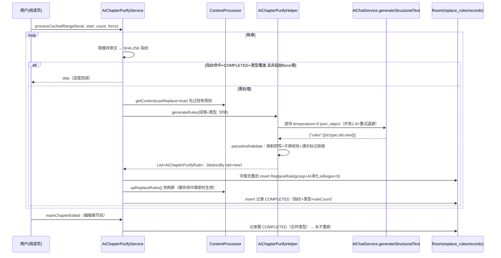

# C4 实施级设计 — AI 章节净化 + AI 创作工作台（图片链）

> 来源：[design.md](../design.md) 决策表 **#5**（AI 章节净化，价值 4/复杂度 2/风险 2，3-5 天）+ **#15**（AI 创作工作台·生图，价值 3/复杂度 3/风险 2，可选二期）；事实源 [evidence-pack.md](../evidence-pack.md) §C。
> legadoC 根：`F:\myself\github\WeAgentChat\temp\legadoC_src\legadoC-own`（行号实测）；本项目根 `f:\myself\github\WeAgentChat\temp\legado`（DB v108）。
> 前置依赖认知：NG P1（[P1-ai-foundation.md](../../ng-benchmark-analysis/migration-designs/P1-ai-foundation.md)）规划 AiProviderConfig 7→30 字段融合 + AiManager 路由层。本文 §3.3 给出供应商路线裁决。

## 1 目标与非目标

**目标（一期 #5）**
1. AI 章节净化全链：三类规则生成（typo 错别字 / noise 噪声 / ad 广告段）→ 字面替换规则沉淀进本项目替换净化体系（`ReplaceRule` + `ContentProcessor`）→ SHA-256 原文指纹幂等 → 用户编辑标记永不重跑。
2. 结构化文本通道：`AiChatService.generateStructuredText`（独立通道，不继承聊天历史/技能/工具循环）。
3. 请求模板协议：`AiStructuredRequestTemplate`（`{{model}}/{{systemPrompt}}/{{userContent}}` 三 token 递归渲染 + json_object 响应格式）。
4. DB：`ai_chapter_purify_records` 表 + `creation_cards` 表（v108→v109，版本自适应见 §6）。

**目标（二期 #15，仅图片链）**
5. AI 创作工作台：分区素材卡片（TabLayout）→ 聊天模型润色 prompt → 生图（**执行层复用本项目 `AiImageService`，不重造**）→ 三级降级调度（批量 n → 并发 3 → 串行退避）→ 结果入库 `AiGeneratedImage`（sourceType=creation）→ 相册导出 + 浮动状态球。
6. 创作结果相册浏览对话框（对齐本项目组件族重写 UI 层）。

**非目标**
1. **生视频不迁**：legadoC `AiCreationVideoHelper` 仅 testConnection 半成品（无任务编排/无结果展示），声明不迁；将来若做，另立设计。
2. 不迁 legadoC 的独立生图/视频供应商体系（`AiCreationProviderConfig` 9 字段 + 内置 4 家）——本项目 `AiImageProviderConfig`（17 字段，openai/js 双协议）已是超集。
3. 不迁 legadoC 的"复用当前模型/独立模型"双轨 UI 原样——改为本项目场景模型配置惯例（`aiXxxModelId` 引用 `AiModelConfig`）。
4. 生图结果不进正文排版（ImageColumn 正文插图属 C2 多媒体范围）。
5. 不动 `SourceContentFilter`（M2 的 WebView 资源 URL 黑白名单，与正文净化正交，见 §3.1 澄清）。

## 2 legadoC 技术架构（净化链 + 创作链，源码实测）

### 2.1 架构图

```mermaid
graph TD
    subgraph 净化链 help/ai
        A1[ReadBookActivity.startAiChapterPurify<br/>:3056→:3059] --> A2[AiChapterPurifyService<br/>object 404行]
        A2 --> A3[BookHelp.getContent 缓存原文<br/>SHA-256 指纹]
        A3 --> A4{AiChapterPurifyRecordDao<br/>指纹相同+COMPLETED+类型覆盖?}
        A4 -- 是 --> A5[skip 跳章]
        A4 -- 否 --> A6[ContentProcessor.get(book).getContent<br/>useReplace=true 先过现有规则]
        A6 --> A7[AiChapterPurifyPreprocessor.apply<br/>逐段逐类型 sourceSpans 字符映射]
        A7 --> A8[AiChapterPurifyHelper.generateRules<br/>splitIntoChunks 分块]
        A8 --> A9[Semaphore concurrency 1-8<br/>requestChunk 重试0-10+退避300ms]
        A9 --> A10[AiChatService.generateStructuredText<br/>temperature=0 流式+json_object]
        A10 --> A11[parseAndValidate 校验+映射回写]
        A11 --> A12[insertNewRules 字面去重<br/>→ replaceRuleDao.insert]
        A12 --> A13[ContentProcessor.upReplaceRules<br/>热刷新]
        A13 --> A14[记录入库 COMPLETED]
    end
    subgraph 创作链
        B1[AiCreationDialog TabLayout分区<br/>ReadBookActivity:1339] --> B2[AiCreationHelper.generatePrompt<br/>变量模板渲染 temperature=0.7]
        B2 --> B10[AiChatService.generateStructuredText]
        B1 --> B3[AiCreationImageTaskHolder.start<br/>并发3 三级降级 批量n→并发→串行]
        B3 --> B4[AiCreationProviderStore.requireImageTarget<br/>9字段独立供应商体系]
        B4 --> B5[fetchImages POST<br/>b64_json/url 双协议]
        B5 --> B6[AiCreationImageFile<br/>filesDir/creation_results 唯一名]
        B6 --> B7[creationResultDao 入库]
        B7 --> B8[StateFlow slots/notice/floatingState<br/>展示权归属最新任务]
        B8 --> B9[浮动球 ReadBookActivity:1365<br/>+ AiCreationPhotoDialog 相册/存相册]
    end
```

### 2.2 净化链逐类逐函数（行号实测）

| 类/函数 | 位置 | 职责与关键点 |
|---|---|---|
| `AiChapterPurifyService.processCachedRange` | AiChapterPurifyService.kt:27-285 | 主流程：require 章节数≥1 → check `book.getUseReplaceRule()` → 逐章：缓存原文→SHA-256 指纹（:78）→ 幂等判定（:84-98 指纹相同+STATE_COMPLETED+`purifyTypesCovered`）→ `force` 只作用起始章防连坐（:82）→ `ContentProcessor.get(book).getContent(useReplace=true)`（:105-112，**先过现有规则**，AI 看到的是已净化文本）→ 逐段逐类型 `prepareParagraphForModel` → `generateRules` → `insertNewRules` → 有新增则 `ContentProcessor.upReplaceRules()` 热刷新（:195）→ 记录入库；失败章写 `STATE_FAILED` 记录后抛 `AiChapterPurifyException`（:233-260，失败记录防死循环重跑） |
| `AiChapterPurifyService.markChapterEdited` | :295-338 | 用户编辑章节 = 受控改动：无条件置 COMPLETED、指纹更新为当前缓存 SHA-256、processedTypes 并入全部启用类型；已有记录则 copy 合并；幂等（:303-309 指纹未变+已覆盖则早退）。此后自动 run 永不重跑该章，**但再启用新净化类型时会因类型未覆盖而常规重跑**（:293 注释） |
| `AiChapterPurifyService.dropBookRecords` | :344-350 | 清缓存/目录更新（全书缓存失效）后按 bookUrl 清空记录，使章节按常规判定（无记录→处理）重跑 |
| `insertNewRules` | :361-391 | scope=`书名;源URL` 分号拼接（:363-365，两者都空则 check 报错）；`replaceRuleDao.maxOrder + 1` 起排；`findLiteralByScopePatternReplacement(scope, old, new)` 字面去重；构造 `ReplaceRule(group="AI净化", scopeTitle=false, scopeContent=true, isEnabled=true, isRegex=false, timeoutMillisecond=3000, order=nextOrder++)`；name=`"AI净化 {type}: {old.take(40)}"` |
| `AiChapterPurifyConfig` | AiChapterPurifyConfig.kt:23-286 | object 配置：supportedTypes=`["ad","typo","noise"]`(:25)；DEFAULT_CHAPTER_COUNT=2/MAX=200(:27-33)；segmentLimit 默认 10000（1k~50k，:34-35）；retry 默认 3（0~10）；concurrency 默认 1（1~8）；三类型开关默认 true(:249-259)；`prompt` 用户可编辑，与默认相同存空串(:111-121)；`requireModelTarget()`(:268-285)：reuseCurrentModel 走全局当前模型，否则 independentProviderId/independentModelId 引用全局配置 id 现查（含旧版 JSON 快照→id 迁移 :76-83、legacy 手填 modelId 同名一次性迁移 :100-107）；`preprocessRules`(:183-190)：默认规则=移除 img/svg 标签(:41-50)，读入时 `validateRules` 校验 |
| `AiChapterPurifyHelper.generateRules` | AiChapterPurifyHelper.kt:108-166 | require 段非空+至少一类型启用 → `splitIntoChunks(paragraphs, segmentLimit, enabledTypes)` → `Semaphore(concurrency)` + `async{withPermit{requestChunk}}` + `awaitAll().flatten().distinctBy { it.old to it.new }`（:164 字面去重兜底） |
| `requestChunk` | :168-264 | `repeat(retryCount+1)`：generateStructuredText(temperature=0, requestTemplate=effectiveRequestTemplate, onStreamProgress 进度) → `parseAndValidate`；失败 `delay(300L*(attempt+1))` 线性退避；CancellationException 直接抛；穷尽后抛 `AiChapterPurifyException("…（批次 N 重试 M 次后仍失败）")` |
| `buildSystemPrompt` | :266-287 | 严格 JSON 协议：返回且仅返回一个 JSON 对象 `{"rules":[{"id":76,"type":"ad"},{"id":12,"type":"typo","old":"…","new":"…"}]}`；id=段落号权威；ad 只回 id+type（客户端整段删除）；typo/noise 的 old 必须是预处理后文本的精确连续子串；禁止 HTML/img/base64/svg/点击元数据入规则；尾部拼用户自定义 prompt（任务描述） |
| `buildUserContent` | :289-307 | 每段每启用类型一行 `[段id][type] 预处理后文本`（空文本行跳过） |
| `parseAndValidate` | :309-381 | GSON 解析 Response{rules}（畸形 JSON/缺 rules 数组→AiChapterPurifyException）；逐条：段落号存在(:323-326)→类型在 supportedTypes 且已启用(:328-333)→ad 必须无 old/new(:334-341)→演示标记拒绝 `findPresentationMarkupMarker`（img/data:image/base64/showCmt(/svg，:349-363，**静默丢弃该条不整批失败**）→ `preprocessed.sourceTextForModelText(old, source)` 把模型文本映射回原文字符区间（:364-377，REHYDRATED 日志）→ `validateRule` |
| `validateRule` | :394-437 | old 非空、**old 是源段落精确子串**（`old !in source`→抛）、old≠new；ad：old==整段且 new 为空；typo：old/new 各≥2 字符；noise：new 为空时 old≥4 字符 |
| `splitIntoChunks` | :439-465 | 估算长度=Σ各类型预处理文本+id 位数+每类型 8 字符；单段超上限 require 失败（直接判章节不可处理）；贪心装箱 |
| `AiChapterPurifyPreprocessor` | AiChapterPurifyPreprocessor.kt:66-180 | 输入预处理（正则清洗 img/svg 等）：`sourceSpans` 逐字符源区间映射，`appendReplacement` 时替换文本的 span 指向被替换源区间（:153-160），`check(output.length==outputSpans.size)`(:166)；空匹配报错（:138-141）；`sourceTextForModelText`(:31-63)：模型文本在预处理文本中定位（**必须唯一匹配，多次匹配报错**）→ span 取 min(start)/max(endExclusive) 还原源文本 |
| `AiStructuredRequestTemplate` | AiStructuredRequestTemplate.kt:10-108 | 三 token（model/systemPrompt/userContent）对 JSON body **递归字符串替换**（JSONObject/JSONArray 深度遍历 :81-101）；默认模板：stream=true + `response_format:{type:json_object}` + `thinking:{type:disabled}` + `reasoning_effort:low` + `enable_thinking:false` + extra_body 双保险（:16-43，多家供应商踩坑参数）；`validate` 校验合法 JSON |
| `AiChatService.generateStructuredText` | AiChatService.kt:148-214 | 独立完成通道（注释明文：不继承聊天历史/全局系统提示/技能/MCP/工具循环）：system+user 两消息 → `requestCompletionStream`（options: temperature/responseFormat=json_object/thinkingType=disabled/reasoningEffort=low/requestTemplate 覆盖 body）→ 空 content 抛 AiChatException |
| `AiChapterPurifyRecord`（实体） | data/entities/AiChapterPurifyRecord.kt:13-31 | `ai_chapter_purify_records`，PK(bookUrl,chapterIndex)+Index(bookUrl)；contentFingerprint/completedAt/ruleCount/processedTypes(逗号串)/state(1=COMPLETED,2=FAILED)/failureMessage；注释明文"只有 COMPLETED 记录抑制同一缓存版本的自动重跑" |

### 2.3 创作链逐类逐函数（行号实测）

| 类/函数 | 位置 | 职责与关键点 |
|---|---|---|
| `AiCreationDialog` | ui/book/read/creation/AiCreationDialog.kt:58（~880 行） | 主工作台：TabLayout 分区 tab（:205-228，分区=definition.variables/sectionOrder）+ 素材卡片列表 + `startImageGeneration`(:704) + 槽位图保存相册(:826)；ReadBookActivity:1339 入口 |
| `AiCreationLibraryDialog` | AiCreationLibraryDialog.kt:37 | 素材卡片库管理（creationCardDao 增删改查，section 分区归属，bookName 空=全局卡） |
| `AiCreationPhotoDialog` | AiCreationPhotoDialog.kt:20 | 结果相册浏览（dialog_photo_view），`saveToAlbum`(:92) |
| `AiCreationHelper.generatePrompt` | AiCreationHelper.kt:10-43 | 变量值映射（mode key + 变量 effectiveValue 清洗 + 分区文本 + 素材 :45-61）→ 模板路由 resolveTemplateName → systemPrompt=`renderTemplate`（`${key}` 文本替换）→ body=`renderBodyTemplate`（JSON 深度 token 替换 :80-119）→ generateStructuredText(**temperature=0.7**) → `stripThinking`（去 `<think>` 块 :121-125） |
| `AiCreationImageTaskHolder` | AiCreationImageHelper.kt:126-437 | 任务编排单例（SupervisorJob+IO scope）：`IMAGE_CONCURRENCY=3`（:129，注释：智谱系实测 3 路稳定 4 路 429）；**三级降级** `runGeneration`(:226-291)：① 批量请求 n 张（忽略 n 的服务按实际返回记账）→ ② 剩余槽位按 3 路 chunked 并发（无重试）→ ③ 仍失败串行逐张（带 retry+800ms 退避）；**展示权唯一归属最新任务**（latestTask + displayLock :142-143，publishSlots/postNotice 仅最新任务生效 :209-224，老任务后台跑完照常入库 :416-420）；StateFlow slots/notice/floatingState |
| `AiCreationFloatingState` | :116-124 | `shouldShow = hasTask && !dismissed && !uiVisible`；ReadBookActivity:1365 `upAiCreationFloating` 渲染浮动球、:1393 点击重开对话框 |
| `fetchImages` | :316-359 | POST baseUrl（Bearer apiKey + 自定义头 `header()` 覆盖同名默认头 :327-330）→ `data` 数组 → `b64_json` 优先 / `url` 回落双协议 → saveBytes/downloadImage；HTTP 非 2xx 抛 `IllegalStateException("HTTP {code}: {text.take(300)}")` |
| `AiCreationImageFile` | :32-100 | `filesDir/creation_results/img_{ts}_{seq}.png`（时间戳+进程内自增唯一，:44-54）；`fileOf` 防路径穿越 `..`（:39-42）；`saveToAlbum`(:60-99)：Q+ MediaStore IS_PENDING 两段式写入 `Pictures/Legado`，pre-Q 直接写公共目录 |
| `AiCreationProviderStore` | AiCreationProviderStore.kt:23-73 | **不迁**（本项目有超集）。记录事实：AiCreationProviderConfig 9 字段（id/name/baseUrl/apiKey/headers/variablesJson/requestTemplate/apiKeyUrl/builtIn）+ 内置 4 家固定 id + 出厂模板（A 家含 negative_prompt/image_size/batch_size/num_inference_steps/guidance_scale；B 家含 size/quality/watermark_enabled——两家字段差异实证"模板协议必须可配置"）+ testConnection 真实出图 1 张入库 |
| `CreationCard`（实体） | data/entities/CreationCard.kt:15-22 | `creation_cards`：PK cardId autoGenerate、section/name/content/bookName(空=全局)/updateTime；Index(section)+Index(bookName) |
| `CreationResult`（实体） | data/entities/CreationResult.kt:11-15 | `creation_results`：PK resultId autoGenerate、fileName/createdAt；**独立缓存不与书关联** |
| 生视频 | AiCreationVideoHelper | 仅 testConnection 半成品（CogVideoX/Wan 轮询未完成），**不迁** |

## 3 本项目对接点现状

### 3.1 替换净化体系：ReplaceRule 字段适配性（结论：完全支持，两处语义注意）

本项目 `data/entities/ReplaceRule.kt:24-59` 实测：`id(autoGenerate)/name/group/pattern/replacement/scope/scopeTitle/scopeContent(default true)/excludeScope/isEnabled/isRegex(default true)/timeoutMillisecond(default 3000)/order(@ColumnInfo(name="sortOrder"))`。

| legadoC 用法 | 本项目支持 | 说明 |
|---|---|---|
| `scope = "书名;源URL"` 分号串 | ✅ | `findEnabledByContentScope(name, origin)` 按 name+origin 双匹配（ContentProcessor.kt:70-73），与 legadoC 同构 |
| `scopeContent = true / scopeTitle = false` | ✅ | 字段同义 |
| `isRegex = false` 字面替换 | ✅ 但必须显式 | 本项目默认 true；AI 规则构造时显式传 false（legadoC 同样显式传）。⚠️ 注意：本项目字面替换依赖 `ContentProcessor` 对 pattern 的处理路径，字面特殊字符（`\` 等）按非正则走 |
| `group = "AI净化"` | ✅ | group 为 String?，规则管理页已支持分组过滤（`getByGroup`） |
| `order = maxOrder + 1` | ⚠️ 需补 DAO | 本项目 `ReplaceRuleDao` **无 `maxOrder`**（实测函数清单：flow*/find*/getByGroup/enableAll/insert/update/delete/allGroups） |
| `findLiteralByScopePatternReplacement` 字面去重 | ⚠️ 需补 DAO | 本项目同样无此查询，需新增 |
| `ContentProcessor.upReplaceRules()` 热刷新 | ✅ | companion(:48-52) 全量刷新所有弱引用处理器 + 实例(:65-74) 重拉 scope 命中规则 |
| `ContentProcessor.getContent(useReplace=true)` 预处理 | ✅ | 签名同构（help/book/ContentProcessor.kt:94-102），返回 BookContent.textList |

**澄清**：`help/source/SourceContentFilter.kt` 是 M2 的 **WebView 资源 URL** 黑白名单过滤（RssSource 字段+BookSource 全局配置），不是正文净化；C4 规则沉淀目标只有 `ReplaceRule`/`ContentProcessor` 体系，两者零交集、互不影响。

### 3.2 AiChatService 缺口确认 + 生图执行层现状

- **缺口确认**：本项目 `help/ai/AiChatService.kt`（1886 行）实测函数清单中**无 `generateStructuredText`**；现有 `chat`(:96)/`requestSingleToolCall`(:100)/`chatStream`(:275)/`requestCompletionStream`(:622)/`buildRequestBody`(:750)。新增通道应复用 `requestCompletionStream` 管线（它已具备 SSE 消费/usage 提取/错误分类 `isAiRetryableRequestFailure`），在 options 层叠加 `requestTemplate` body 覆盖 + `responseFormat=json_object` + 关思考参数。
- **生图执行层已是超集（重大事实）**：本项目已有 `AiImageService`（object）：`generate/generateAndStore`(:38-53) + ImagesApi（`{base}/images/generations` POST :113）/ Responses API / **JS 引擎**三协议 + 返回归一（b64/base64/data:/url 多形态 :334-356）+ 32MB 防线 + `AiImageProviderConfig` 17 字段（openai/js 双 type、defaultParamsJson、stylePrompt、jsLib、loginUi、cookieJar、script、timeout、order、enabled :173-191）+ `AiGeneratedImage` 22 字段存储（bookKey/chapterKey/characterId/sourceType/sourceText/favorite/groupId :19-43）+ `AiImageGalleryManager` 图库管理。**C4 二期生图不重造执行层**，legadoC 只贡献"编排层"（三级降级/浮动球/相册/素材卡片）。**口径说明：本项目生图执行层实为四协议（OpenAi/ImagesApi/Responses/Js），正文按三协议口径表述处以此为准补全。**
- **排版**：`ui/book/read/page/entities/column/ImageColumn` 已存在（ContentTextView.kt:502/526/572 处理点击长按），服务于图片书（`book.isImage`）与正文 img 标签；C4 生图结果展示位=创作对话框+相册（与 legadoC 行为一致），不入正文排版。

### 3.3 供应商路线裁决（C4 建立在哪个供应商层之上）

| 路线 | 内容 | 优点 | 缺点 |
|---|---|---|---|
| **A：等 NG P1 融合层** | 引用 AiProviderSetting(26 字段)+AiManager.generateText | 三协议/12 家预设/推理参数齐备 | P1 未排期落地，C4 被阻塞；P1 非流式（stream=false）而净化链受益于流式进度 UI |
| **B：独立最小引用现有 7 字段** | 净化走 `AiProviderConfig(7 字段)+AiModelConfig`+自建 generateStructuredText；生图走 `AiImageProviderConfig+AiImageService` | 零等待；复用本项目场景模型配置惯例（AppConfig.aiXxxModelId → aiModelConfigList 引用，:621-636 已有 ask/summary/readAloudRole 三例）；需求面极小（baseUrl/apiKey/headers/model） | P1 落地后需一次适配 |

**裁决建议：路线 B 先行，接口按 A 兼容收口（门面隔离）。** 理由：
1. C4 对供应商的需求是"单轮系统提示+用户内容 → JSON 文本"，7 字段完全够用；legadoC 同样只用这些。
2. 本项目已有成熟的场景模型引用惯例，净化配置加 1 个 `aiPurifyModelId` 键即完成接线（模型行自带 providerId，无需独立双键）。
3. generateStructuredText 对外签名收口为 `(providerId: String, modelId: String, …)` 字符串参数（不暴露 AiProviderConfig 类型），内部解析 provider——P1 落地后仅改内部实现路由到 AiManager，调用方（净化/创作/testConnection）零改动。
4. 生图与 P1 天然零耦合（AiImageProviderConfig 独立体系）。B→A 适配成本约 0.5 天，可接受；A 阻塞成本（排期不确定）不可接受。

## 4 改造方案（逐文件函数级）

### 4.1 一期：净化链（新增 5 文件 + 改 5 文件）

| # | 文件 | 动作 | 函数级内容 |
|---|---|---|---|
| N1 | `help/ai/AiChapterPurifyConfig.kt` | 新增 | object：supportedTypes 三类、开关/章数/segmentLimit/retry/concurrency 六参数（PreferKey 存取+coerceIn，默认值同 legadoC）、`prompt` 可编辑、`purifyModelId`（场景模型引用）、preprocessJson 解析+validateRules。**不迁** reuseCurrentModel 双轨与独立请求模板（本项目惯例=单场景模型引用） |
| N2 | `help/ai/AiChapterPurifyPreprocessor.kt` | 新增 | 与 legadoC 1:1：AiChapterPurifyPreprocessRule/SourceSpan/PreprocessedParagraph + validateRules + apply(sourceSpans 映射)；异常改继承 `NoStackTraceException`（§9） |
| N3 | `help/ai/AiChapterPurifyHelper.kt` | 新增 | 与 legadoC 1:1：generateRules/requestChunk/buildSystemPrompt/buildUserContent/parseAndValidate/validateRule/splitIntoChunks + Progress 密封接口；调用本项目 generateStructuredText。**本项目分叉**：sourceTextForModelText old 多次匹配映射失败改"静默丢弃该条+计数上报"（对齐演示标记处理；消除 temperature=0 下整批重试死循环的 token 浪费；仅畸形 JSON 才整批重试，见 E1） |
| N4 | `help/ai/AiChapterPurifyService.kt` | 新增 | 与 legadoC 1:1：processCachedRange/markChapterEdited/dropBookRecords/insertNewRules/sha256；insertNewRules 构造 scope 前对书名半角 `;` 转义全角（防拼接错位，§4.2）；**insertNewRules 入库前查 AI净化组总数，≥500 熔断停止本轮+面板提示（E3，复用 getByGroup 统计）**；AppLog.putAi 改本项目 `AppLog.putDebugWithTag(AppLog.TAG_CONTENT, …)`（脱敏铁律：日志只记指纹前 8 位/长度/数量统计，**不记规则 old/new 全文与书名**） |
| N5 | `help/ai/AiStructuredRequestTemplate.kt` | 新增 | 与 legadoC 1:1：三 token 递归渲染+validate |
| N6 | `data/entities/AiChapterPurifyRecord.kt` | 新增 | 与 legadoC 1:1（PK bookUrl+chapterIndex；补 `@Parcelize` 对齐本项目实体规范） |
| N7 | `data/dao/AiChapterPurifyRecordDao.kt` | 新增 | `get(bookUrl, chapterIndex)/insert/deleteByBookUrl`（suspend+普通双形态，仿 AiMemoryDao 风格） |
| C1 | `help/ai/AiChatService.kt` | 修改 | 新增 `generateStructuredText(providerId, modelId, systemPrompt, userContent, temperature, requestTemplate, onRequestAccepted, onStreamProgress)`：AiStructuredRequestTemplate.render 生成 body 覆盖默认 → 复用 requestCompletionStream（options: responseFormat=json_object、thinking disabled、reasoningEffort=low）→ 空 content 抛 `AiChatException`（本项目已有同类） |
| C2 | `data/dao/ReplaceRuleDao.kt` | 修改 | 新增 `suspend fun maxOrder(): Int?` + `suspend fun findLiteralByScopePatternReplacement(scope, pattern, replacement): ReplaceRule?`（`WHERE scope=:scope AND pattern=:pattern AND replacement=:replacement AND isRegex=0 LIMIT 1`） |
| C3 | `data/AppDatabase.kt` | 修改 | version 108→109（版本自适应见 §6）、注册 AiChapterPurifyRecordDao + CreationCardDao |
| C4 | `model/ContentProcessor.kt`→`help/book/ContentProcessor.kt` | 不改 | 直接消费现有 upReplaceRules()/getContent() |
| C5 | `ui/book/read/ReadBookActivity.kt` | 修改 | 阅读菜单新增「AI 净化」入口（aiAssistantEnabled 门禁，同 :1760 惯例）→ `AiPurifyConfigDialog`（§7.1，弹框族 A）；章节编辑完成回调处挂 `markChapterEdited`（Coroutine.async 链） |
| C6 | `help/book/BookHelp.kt`（清缓存点） | 修改 | 清除缓存/目录更新成功后调 `AiChapterPurifyService.dropBookRecords(book)`（runCatching 包裹，失败不阻断主流程） |

### 4.2 净化规则 → 本项目 ReplaceRule 映射表

| legadoC 字段/逻辑 | 本项目落地 | 备注 |
|---|---|---|
| `group = "AI净化"` | 同值 | 规则管理页按分组过滤，用户可一键启停/删除整组 |
| `scope = listOf(书名, 源URL).join(";")` | 同值 + **书名分号转义** | 两者都空时 check 报错（本地书无 origin 时仅书名）；⚠️ 书名含半角 `;` 会致 scope 按 `;` 切分后段数≠2、origin 匹配错位 → 构造时书名半角 `;` 替换为全角 `；`；origin 为 URL 一般不含 `;`，若检测含 `;` 则 WARN 日志（只记长度不记 URL）后照常入库 |
| `pattern = rule.old`（字面） | 同值 + `isRegex=false` | 本项目默认 isRegex=true，**必须显式 false**；字面去重查询带 `isRegex=0` 条件 |
| `replacement = rule.new`（ad 为 ""） | 同值 | ad=整段删除由 old==整段保证 |
| `scopeTitle=false, scopeContent=true` | 同值 | 恒定 |
| `timeoutMillisecond=3000` | 同值 | 字面替换开销小 |
| `order = maxOrder+1 递增` | 同值（新 DAO maxOrder） | 追加到规则链尾，不干扰用户既有 order |
| `name = "AI净化 {type}: {old.take(40)}"` | 同值 | 管理页可读性 |
| 字面去重 | findLiteralByScopePatternReplacement | 防同章重跑/相邻章重复规则堆积 |

### 4.3 二期：创作工作台图片链（新增 4 文件 + 改 3 文件）

| # | 文件 | 动作 | 函数级内容 |
|---|---|---|---|
| N8 | `data/entities/CreationCard.kt` | 新增 | 与 legadoC 1:1（section/name/content/bookName/updateTime + 双 Index；补 @Parcelize） |
| N9 | `data/dao/CreationCardDao.kt` | 新增 | flowBySection/flowGlobal/insert/update/delete（Flow+suspend 双形态） |
| N10 | `help/ai/AiCreationTaskHolder.kt` | 新增 | **移植 legadoC TaskHolder 编排骨架**（三级降级/展示权归属最新任务/StateFlow slots+notice+floatingState），但 `requestImages` 改调本项目 `AiImageService.generate(prompt, provider, …)`（每次 1 张，b64/url 归一由 AiImageService 完成）；并发 3 常量保留；结果经 `AiImageGalleryManager.saveGeneratedImage(sourceType="creation", groupId=批次id)` 入 AiGeneratedImage |
| N11 | `help/ai/AiCreationFileStore.kt` | 新增 | 相册导出：仅 Q+ MediaStore IS_PENDING 路径（minSdk 23 但 targetSdk 36，pre-Q 分支裁剪并简化说明：已知上限=Android 9 及以下走系统 Download 建议，用户占比可忽略）；文件本体由 AiImageGalleryManager 已有存储承载 |
| C7 | `ui/book/read/ReadBookActivity.kt` | 修改 | 菜单「AI 创作」入口；浮动状态球接入（应用内胶囊形态，对齐听书胶囊体系，非系统悬浮窗） |
| C8 | `ui/book/read/creation/`（新建包） | 新增 | `AiCreationDialog`（TabLayout 分区+素材卡列表+生图槽位）、`AiCreationLibraryDialog`（卡片库）、`AiCreationPhotoDialog`（结果浏览+存相册）——**全部按本项目组件族重写**（§7），不搬 legadoC 布局 |
| C9 | `ui/main/ai/`（供应商管理） | 不改 | 复用 AiImageProviderConfig 管理页；创作侧仅提供 providerId/modelId 选择器 |

## 5 数据流



## 6 DB 变更

**版本自适应（强制）**：migration 起点以实施时 `AppDatabase.kt` version 实际值为准；跨 spec 的 DB 版本顺延按**跨 spec DB 版本登记机制**（design.md §4）执行，本文不锁定具体版本号。下文以"C4 接续版 V = version+1"表述。

### 6.1 两表 DDL（与实体注解逐列一致，全列显式 defaultValue）

```sql
CREATE TABLE IF NOT EXISTS `ai_chapter_purify_records` (
  `bookUrl` TEXT NOT NULL DEFAULT '',
  `chapterIndex` INTEGER NOT NULL DEFAULT 0,
  `contentFingerprint` TEXT NOT NULL DEFAULT '',
  `completedAt` INTEGER NOT NULL DEFAULT 0,
  `ruleCount` INTEGER NOT NULL DEFAULT 0,
  `processedTypes` TEXT NOT NULL DEFAULT '',
  `state` INTEGER NOT NULL DEFAULT 1,
  `failureMessage` TEXT,
  PRIMARY KEY(`bookUrl`, `chapterIndex`));
CREATE INDEX IF NOT EXISTS `index_ai_chapter_purify_records_bookUrl`
  ON `ai_chapter_purify_records`(`bookUrl`);

CREATE TABLE IF NOT EXISTS `creation_cards` (
  `cardId` INTEGER PRIMARY KEY AUTOINCREMENT NOT NULL,
  `section` TEXT NOT NULL DEFAULT '',
  `name` TEXT NOT NULL DEFAULT '',
  `content` TEXT NOT NULL DEFAULT '',
  `bookName` TEXT NOT NULL DEFAULT '',
  `updateTime` INTEGER NOT NULL DEFAULT 0);
CREATE INDEX IF NOT EXISTS `index_creation_cards_section` ON `creation_cards`(`section`);
CREATE INDEX IF NOT EXISTS `index_creation_cards_bookName` ON `creation_cards`(`bookName`);
```

**裁决：不新建 `creation_results` 表**——二期生图结果复用 `ai_generated_images`（`sourceType='creation'` 常量 + `groupId`=批次 UUID；bookKey/chapterKey 默认空串即"独立缓存"语义），消除与 AiImageGalleryManager 的双轨存储。失败信息（failureMessage 可空）不需 defaultValue，与 legadoC 原表一致。

### 6.2 Migration 要点

- 仿 `DatabaseMigrations.kt` 惯例：`runCatching` 逐条 execSQL + `AppLog.put`（R2）；`IF NOT EXISTS` 幂等可重试（R4）；DDL `DEFAULT` 子句与实体 `@ColumnInfo(defaultValue=…)` 逐列一致（Room 运行时校验，R6）——`failureMessage` 无默认值列除外；纯新增表，无 @DatabaseView 改动，不触发 R1。
- **ReplaceRule 无 schema 变更**（只加 DAO 查询），零 migration 负担。
- 真机覆盖安装验证（R5）：旧版包→造数据（含替换规则+阅读缓存）→覆盖装 V 测试包 `io.legado.miss.app.debug`→无 `Migration didn't properly handle`→数据保留→logcat 过滤 AppDatabase 确认迁移日志。`app/schemas/{V}.json` 入 git。

## 7 前端改造方案

### 7.1 净化进度 UI（一期）

- **入口**：阅读菜单「AI 净化」（AppConfig.aiAssistantEnabled+aiPurifyModelConfig 非空双门禁，toast 文案复用 ai_missing_config/ai_not_enabled 惯例）。
- **配置面板**：`AiPurifyConfigDialog`（弹框族 A：`ComposeDialogFragment`+`AppDialogFrame`，对齐 ui-standards/architecture.md 铁律 3）：类型三开关（typo/noise/ad，默认 typo+noise 开、ad 默认关——防误删需用户主动开启，边界 E13）、处理章数（1-200，默认 2）、并发（1-8 默认 1）、重试（0-10 默认 3）、模型选择（aiModelConfigList 下拉）、预处理规则 JSON 编辑入口、系统提示词编辑。颜色全部 `?attr/*`/ThemeStore 动态取色（G2/G4 门禁，禁止硬编码）。
- **进度展示**：弹框内进度条 + 逐章文本行（"第 N 章 · 生成中 块 2/3 · 新增规则 5 条"），消费 `AiChapterPurifyProgress` 密封接口（RequestAccepted/ResponseReceived/StreamProgress/ChapterRulesStored/ReplacementApplied）；完成显示统计（inspected/skipped/added/**rejected**——parseAndValidate 拒绝率计入面板：演示标记丢弃+映射失败丢弃+校验失败条数汇总；全书总量熔断触发时提示组内总数 ≥500 需清理）。**不搬 legadoC 悬浮玻璃胶囊**，对齐本项目 M3 组件族。
- **取消**：面板关闭即 cancel 协程（Coroutine 链 ActivelyCancelException 语义），处理中的章写 FAILED 记录由用户下次手动重跑。

### 7.2 创作工作台 UI（二期）

- 三对话框按本项目组件族重写：主工作台 `AiCreationDialog`（Compose：TabRow 分区 + LazyColumn 卡片流 + 生图槽位网格）、卡片库 `AiCreationLibraryDialog`、结果浏览 `AiCreationPhotoDialog`（Compose 图片缩放+保存相册按钮）；DayNight 适配走 ThemeStore（G4）。
- **浮动状态球**：应用内胶囊（对齐本项目听书胶囊三形态中的应用内形态），显示生图进行中任务数；点击回主工作台、长按关闭；`shouldShow` 逻辑照搬 legadoC（hasTask&&!dismissed&&!uiVisible）。
- 图片点击：复用本项目图片查看体系（clickImgWay 惯例），保存相册走 N11。

## 8 边界条件（16 条）

| # | 条件 | 处理 |
|---|---|---|
| E1 | AI 返回畸形 JSON（Markdown 围栏/截断/散文） | parseAndValidate 首关抛 AiChapterPurifyException → requestChunk 重试退避（模板强制 json_object+禁思考降低概率）；穷尽后该章 FAILED 落库、批次继续/整体中止策略=整章中止但后续章继续处理（legadoC 语义：单章失败抛出中断批次——**本项目改为记录失败继续后续章**，防止一章畸形拖死全书；失败章下次 force 重跑）。**重试粒度收口：仅畸形 JSON/缺 rules 数组才整批重试；单条规则级失败（演示标记/old 多次匹配映射失败/子串校验不过）一律静默丢弃该条+计数上报，不触发重试** |
| E2 | 规则与人工规则打架（同 old 不同 new、顺序冲突） | AI 规则 order=尾追加（用户规则优先执行）；字面去重只对 AI 组内；同 old 已有人工规则时 findLiteralByScopePatternReplacement 不含 group 条件 → 检出即跳过入库（**去重查询不带 group 过滤**，防 AI 复写用户规则语义）；组间冲突留给规则管理页人工处置，净化结果 UI 提示"与既有规则重复已跳过 N 条" |
| E3 | 净化规则爆炸（一章生成上百条） | 防线四层：system prompt "不确定不返回"；distinctBy(old,new)+字面去重；**新增单章规则上限 100**（超出截断+日志 WARN，防 replace_rules 表膨胀与替换链性能劣化）；**AI净化组全书总量熔断：按组统计 ≥500 条时停止本轮净化+面板/toast 提示**（复用规则管理页 `getByGroup` 按组统计，防多章累计膨胀与替换链性能劣化，用户手动清理后才可继续）；规则管理页支持按组批量删除 |
| E4 | 指纹失效（章节更新/换源 bookUrl 变化） | 正文变→SHA-256 变→常规重跑（预期行为）；换源 bookUrl 变→旧书记录残留 → `dropBookRecords` 挂清缓存/目录更新点兜底；记录表按 bookUrl 索引，孤儿记录随书删除（书架删书时同步 deleteByBookUrl） |
| E5 | 并发章节数超限 | 章数 coerce(1,200)；并发 Semaphore coerce(1,8)；单段超 segmentLimit 直接判"章节不可处理"FAILED（legadoC 同语义） |
| E6 | 供应商 429/限流 | 净化：线性退避 300ms×attempt + 重试 0-10；生图：三级降级（批量→并发 3→串行 800ms 退避），并发常量 3 实证；429 响应体只记 code 不记内容 |
| E7 | 生图内容合规（供应商侧审核拒绝/生成违规图） | 供应商拒绝按普通失败进槽位 FAILED；本地不做内容审核（记债 OQ）；保存相册由用户主动触发，责任边界在用户操作 |
| E8 | 存储膨胀（规则表+图片） | 规则：E3 上限+分组批量删；图片：ai_generated_images 已有管理+清理体系（AiImageGalleryManager），创作批次 groupId 支持按批清理；filesDir 占用入设置页"存储占用"统计（复用现有） |
| E9 | 相册权限 | Q+ MediaStore 无需运行时权限（IS_PENDING 两段式）；本项目 minSdk 23 含 pre-Q 设备：裁剪 legacy 分支（§4.3 N11 简化说明），pre-Q 提示手动导出 |
| E10 | 热刷新时机 | upReplaceRules() 只重拉 scope 命中规则，轻量；**正在阅读的章节不自动重排**（当前章已渲染内容不闪变），用户翻页/刷新后生效——与 legadoC 一致；净化完成 toast+面板提示"重新进入章节生效" |
| E11 | 用户编辑章节与净化竞态 | markChapterEdited 在编辑保存事务后串行执行（Coroutine 链），指纹取编辑后新缓存原文；若净化正在处理同一章（Semaphore 内），编辑先完成则净化跑前重读指纹→幂等判定自然跳过；净化先完成则编辑覆盖标记 COMPLETED——两序均收敛 |
| E12 | 正文无缓存章节 | BookHelp.getContent null → skipUncached 计数跳过（不报错不打断）；全章无缓存→章节 FAILED（legadoC :156-158 语义） |
| E13 | 广告段误删（AI 误判正文为广告） | ad 类型默认关（§7.1）；validateRule 强约束 ad=整段删除且 new 为空；演示标记拒绝（img/svg/base64/showCmt( 静默丢弃该条）；**ad 单章规则上限 20 条**（超出截断+日志 WARN）；**ad 占单章生成规则比 >50% 告警**（进度面板提示"疑似误判放大，建议核对或关闭 ad"）；用户可在规则管理页按组关闭/删除 AI 净化组恢复 |
| E14 | 模型目标缺失 | processCachedRange 前置校验 aiPurifyModelConfig→provider.baseUrl 非空，失败 toast ai_missing_config 不启动 |
| E15 | 流式 SSE 半包/中断致 JSON 截断 | requestCompletionStream 已有 SSE_IDLE 看门狗与重试分类（isAiRetryableRequestFailure）；generateStructuredText 层 JSON 解析失败即重试（E1 管线兜底） |
| E16 | 净化与缓存下载竞态 | 处理中章节缓存被后台任务重下（内容变化）→ 指纹在处理前一次取定，入库时指纹为旧版；下次 run 指纹不符自动重跑（幂等自愈，无脏规则：规则基于旧文本生成但仍是该书字面规则，误伤面=重复 old 子串，接受并记 OQ） |

## 9 规范符合性核查表

| 规范 | 条款 | C4 落点 |
|---|---|---|
| checkstyle_rules | Coroutine 双版本/链式 onError | Service 对外 `Coroutine.async{}…onError{}.onSuccess{}` 版本 + 内部 `processCachedRangeAwait` 挂起版 |
| checkstyle_rules | kotlin.runCatching 带前缀 | migration/insertNewRules/dropBookRecords/saveToAlbum 全部 `kotlin.runCatching` |
| checkstyle_rules | object 单例+Mutex | Service/Helper/Config 均 object；TaskHolder latestTask 用 synchronized(displayLock)（照搬 legadoC 已验证方案） |
| checkstyle_rules | 实体 data class+@Parcelize+@Entity+全默认值 | N6/N8 实体补 @Parcelize，字段默认值齐 |
| checkstyle_rules | @IntDef 替代 enum | Record.state 用常量 STATE_COMPLETED/STATE_FAILED（与 legadoC 一致，Int 型） |
| naming_rules | Helper/Config/Service/Dao 后缀 | 类名全对齐；`up` 前缀沿用（upReplaceRules 已有） |
| naming_rules | dur/prev/cur、Await 后缀 | 挂起版函数统一 `…Await` |
| exception_rules | 业务异常继承 NoStackTraceException | **AiChapterPurifyException 改继承 NoStackTraceException**（legadoC 是 IllegalStateException——按本项目规范修正；debugLog 语义并入 message） |
| exception_rules | CancellationException 重抛/ensureActive | requestChunk 与逐章循环 `currentCoroutineContext().ensureActive()` + `if (e is CancellationException) throw e`（legadoC 已有，原样保留） |
| exception_rules | 禁 CoroutineExceptionHandler | 全链走 onError/try-rethrow |
| logging_rules | AppLog.put/putDebugWithTag+模块 Tag | 净化日志挂 `TAG_CONTENT`；只记指纹前 8 位/长度/数量，**禁止规则 old/new 全文、书名、响应体原文入日志**（脱敏铁律） |
| logging_rules | 禁 android.util.Log | 新增代码零直接 Log |
| database-migration-safety | R2/R4/R5/R6 | §6.2 全覆盖；version 递增不降级；IF NOT EXISTS 幂等；真机覆盖安装门禁 |
| global-thinking-checklist | 六维度 | 前端入口=阅读菜单 1 处+章节编辑回调 1 处+清缓存点 1 处（逐点列出）；后端接口=generateStructuredText 新增不影响 chat/chatStream；数据库=2 新表零 view 变更；覆盖安装=§6.2；使用场景=仅文本类书籍（isAudio/isImage 书禁入，check book.getUseReplaceRule 前置）；回填点=record 表三写点（完成/失败/编辑标记）+drop 点 |
| ui-standards/architecture | 弹框族归属/组件族消费 | AiPurifyConfigDialog+进度面板（§7.1）、三创作对话框+浮动球（§7.2）全部归属弹框族 A 基线（`ComposeDialogFragment`+`AppDialogFrame`/`AppDialogStyle`，铁律 3，禁 BaseDialogFragment/alert{} DSL/M3 组件）；组件仅消费本项目四组件族既有组件，不私拉组件（开发门禁） |
| frontend-ui-standards | 页面骨架分型 | 三创作对话框按页面骨架统一分型（§2）选骨架：主工作台=分区+卡片流+网格槽位型，卡片库/结果浏览=列表/详情型；取色走取色唯一基线（ThemeStore/`?attr/*`，G2/G4），禁止硬编码色 |
| core 门禁 | updateLog/端到端测试/daemon 清理 | 实施期按 AGENTS.md 强制规则 1/2/6 执行（§11 门禁） |

## 10 测试设计

**单测（app/src/test，JVM）**
1. `AiStructuredRequestTemplateTest`：默认模板 render 三 token 深度替换（含数组内嵌套）、validate 对非法 JSON 抛错、token 出现在值中段。
2. `AiChapterPurifyPreprocessorTest`：sourceSpans 映射（替换变长/多规则级联/空匹配报错/映射长度一致性 check）、sourceTextForModelText 唯一匹配→源区间还原、多次匹配抛错。
3. `AiChapterPurifyHelperTest`：parseAndValidate 全矩阵（合法/畸形 JSON/缺 rules/段落号不存在/类型未启用/ad 带 old/演示标记静默丢/old 非子串/**old 多次匹配映射失败静默丢+计数**/typo<2 字符/noise 空替换<4/ad 非整段/**ad 单章 >20 截断**）；splitIntoChunks 贪心装箱+单段超限 require。
4. `AiChapterPurifyServiceIdempotentTest`（Room in-memory）：指纹幂等三条件、force 仅起始章、markChapterEdited 合并类型+幂等早退、insertNewRules 字面去重+isRegex=false+order 连续。
5. `ReplaceRuleDaoTest`：maxOrder 空表/有值、findLiteralByScopePatternReplacement 命中/未命中/isRegex 条件。

**L2（预登记）**：`ai_tests/scripts/l2_verify_ai_purify.py` — 流程：quick_build_install 编译安装 L1 → 内嵌本地 mock OpenAI 兼容服务（127.0.0.1 随机端口，返回固定 rules JSON）→ 配置 aiPurify 模型指向 mock → adb 驱动打开书+触发净化菜单 → logcat -s ContentProcess:E 过滤 `PURIFY` 自定义前缀断言：章完成/规则入库条数/记录 state=1 → 再触发一次断言 skipCompleted（幂等）→ 替换规则页查询 group=AI净化 断言条数。断言只依赖编号与计数，不依赖业务文本。

**L3（真书源回归）**：真书源 3 本（长章/短章混排）净化 5 章：覆盖安装从 v108 升 V（R5）→ 净化后翻页无闪变（E10）→ 规则管理页组操作（启停/删除即恢复原文）→ markChapterEdited 后 force 重跑跳过该章 → 生成记录+图片在覆盖安装后保留。

## 11 实施顺序 + 门禁

```
T1 DAO+实体（N6/N7/N8/N9 + C2 maxOrder/findLiteral）→ 编译+单测4/5绿
T2 通道（N5+C1 generateStructuredText）→ 编译+单测1绿
T3 预处理器（N2）→ 单测2绿
T4 Helper（N3）→ 单测3绿
T5 Service（N4+AppConfig.aiPurifyModelId 键）→ 编译绿
T6 migration+AppDatabase（C3）→ 真机覆盖安装 R5 门禁
T7 UI 入口+进度面板（C5/§7.1+markChapterEdited/dropBookRecords 挂点 C6）→ L2 门禁
T8 L3 真书源回归 → 一期收口
（二期）T9 TaskHolder+FileStore（N10/N11）→ 单测：三级降级状态机
T10 三对话框+浮动球（C7/C8/C9）→ L2 l2_verify_ai_creation.py（预登记）
```
每步「编译通过+对应单测绿」双门禁；编译走 build-legado.bat（内置 daemon 清场）；updateLog 在 T1 前基于 git diff 先写；测试用 `ai_tests\venv\Scripts\python.exe`，测试包 `io.legado.miss.app.debug`。

**规范回灌**：按 design.md 提升清单执行本期对应条目——异常继承修正先例（exception_rules：业务异常继承 NoStackTraceException，落点 AiChapterPurifyException 改继承先例 D-C4-4，沉淀为 exception_rules 可 Grep 判定条款）+规范核查表执行（§9 逐条打勾）；回灌完成后由验证轮复核规范文件变更与 design.md 清单一致。

## 12 Open Questions（9 条）

1. **单章失败策略**：legadoC=一章失败抛出中断整批；本设计 E1 改为"记录失败继续后续章"——是否接受该行为分叉？（建议：接受，减少用户挫败）
2. **ad 类型默认态**：本设计默认关（防误删），legadoC 默认开——跟随与否？
3. **净化提示词内置资产的载体**：默认 prompt/预处理规则放 Kotlin 常量还是 assets JSON（便于热修）？倾向常量（对齐本项目 AppConfig 惯例）。
4. **AI 规则组名**："AI净化" 中文组名是否需要本地化/常量化？规则管理页分组显示已兼容中文。
5. **规则数上限 100/章**的取值依据需真机数据（替换链 300+ 规则时 getContent 耗时基线缺失）。
6. **markChapterEdited 挂点**：本项目章节编辑功能的完成回调精确位置待实施时确认（ReadBookActivity 内容编辑链路）；若编辑入口不止一处需全挂（G3 场景盘点）。
7. **AiGeneratedImage 复用后**，创作相册与现有 AI 图库的入口关系（合并浏览 or sourceType 过滤标签页）——产品决策。
8. **生图提示词润色的模型选择**：聊天模型（aiPurifyModelId 复用 or 新增 aiCreationModelId）——倾向复用同一场景键以降配置复杂度。
9. **P1 落地后 generateStructuredText 迁移到 AiManager.generateText 的时机**：P1 验收后首个 C 系列迭代内切换（门面已隔离，预估 0.5 天）。

## 13 工作量

| 项 | 估算 | 依据 |
|---|---|---|
| 一期净化链（T1-T8） | 4.5 人日 | N1-N7 新增 ~1100 行（legadoC 1177 行平移+规范改造）+C1/C2/C3/C5/C6 ~150 行+单测 5 套 ~600 行+L2/L3 各 0.5d |
| 二期创作链（T9-T10） | 7 人日 | TaskHolder/相册 ~450 行+三对话框重写 ~900 行（组件族重写非平移）+单测+L2 |
| L2 内嵌 mock 服务脚本 | +0.5 人日 | l2_verify_ai_purify.py 内嵌本地 OpenAI 兼容 mock 服务（127.0.0.1 随机端口，返回固定 rules JSON，§10 L2），一次性测试资产（V4 建议补登） |
| 合计 | 一期 4.5d + 二期 7d + mock 脚本 0.5d ≈ 12 人日 | 与 design.md #5（3-5 天）+ evidence-pack §C 量级评估（1-2 周）区间吻合 |

## 14 设计决策记录

| # | 决策 | 理由 | 状态 |
|---|---|---|---|
| D-C4-1 | 供应商路线=B 先行+A 兼容门面（providerId/modelId 字符串收口） | 零等待、复用场景模型惯例、P1 落地后 0.5d 切换（§3.3） | Proposed |
| D-C4-2 | 净化规则沉淀进 ReplaceRule 体系（group=AI净化+isRegex=false+字面去重），不自建规则表 | 本项目替换体系字段全兼容、热刷新/管理页/导出白得；SCOPE 字段语义与 legadoC 一致 | Proposed |
| D-C4-3 | ReplaceRuleDao 新增 maxOrder+findLiteralByScopePatternReplacement 两函数 | legadoC insertNewRules 依赖，本项目缺失（§3.1） | Proposed |
| D-C4-4 | AiChapterPurifyException 改继承 NoStackTraceException | 本项目异常规范强制（legadoC 为 IllegalStateException，按本项目规范修正） | Accepted（规范强约束） |
| D-C4-5 | 不新建 creation_results 表，复用 ai_generated_images（sourceType='creation'+groupId） | AiGeneratedImage 22 字段是 CreationResult 超集，消除双轨存储 | Proposed |
| D-C4-6 | 生图执行层复用 AiImageService（ImagesApi/Responses/Js 三协议+b64/url 归一），legadoC 只贡献编排层 | AiImageProviderConfig 17 字段+双协议是 legadoC 9 字段模板协议超集（§3.2） | Proposed |
| D-C4-7 | 单章净化失败不中断整批（分叉于 legadoC） | 一章畸形 JSON 拖死全书不可接受；FAILED 记录支持精准重跑（OQ-1） | Proposed |
| D-C4-8 | 单章规则上限 100 条 | 防规则爆炸（E3），防替换链性能劣化（OQ-5 待数据） | Proposed |
| D-C4-9 | 生视频不迁（半成品声明） | legadoC AiCreationVideoHelper 仅 testConnection，无任务编排 | Accepted（design.md #15 原文） |
| D-C4-10 | UI 全部按本项目组件族/M3 重写，不搬 legadoC 布局与玻璃胶囊 | design.md AD-05：0 Compose 债务不入库 | Accepted（AD-05 推论） |
| D-C4-11 | V6 红队修复四项：①AI净化组全书总量熔断 ≥500（E3/N4/§7.1）②ad 单章上限 20+占比 >50% 告警+parseAndValidate 拒绝率入进度面板（E13/§7.1）③old 多次匹配映射失败静默丢弃该条+计数，仅畸形 JSON 才整批重试（N3/E1/单测3）④scope 书名分号转义（§4.2/N4） | 防 replace_rules 多章累计膨胀失控/防 ad 误删放大/防 temperature=0 重试死循环 token 浪费/防 scope 按`;`切分错位致 origin 匹配失效 | Accepted（V6 红队） |
