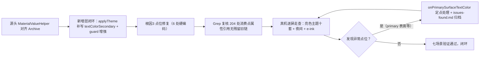

# Design：亮色主题文字对比度系统性修复

> **状态**：🔄 设计中 ｜ **创建日期**：2026-08-31
> **关联文档**：[README.md](./README.md) ｜ [spec.md](./spec.md) ｜ [tasks.md](./tasks.md)

## Technical Approach

### 根因全景（源码铁证）

#### 根因1（机制性，主因）：`MaterialValueHelper.kt` 判定源语义错位

- `lib/theme/MaterialValueHelper.kt` L131-132：
  `val Context.isDarkTheme: Boolean get() = ColorUtils.isColorLight(ThemeStore.primaryColor(this))` —— 用 primary 色亮度冒充主题深浅判定。
- L22-28 `getPrimaryTextColor(dark)`：dark=true → `R.color.md_light_primary_text`（实际值 #DE000000 黑）；dark=false → `R.color.md_dark_primary_text`（实际值 #FFFFFFFF 白）。资源值已核实（`res/values/colors_material_design.xml` L14/L17/L34）。
- L78-79：`Context.primaryTextColor = getPrimaryTextColor(isDarkTheme)`；L88-89 secondaryTextColor 同构（primaryDisabledTextColor / secondaryDisabledTextColor 同模式）。
- 完整推演链：亮色主题 primary=#795548（深）→ isColorLight=false → isDarkTheme=false → primaryTextColor=白 → 白字画在 backgroundColor=#F5F5F5 浅底上 → 不可见。
- 夜间主题 primary 深+背景深 → 白字碰巧正确（负负得正），所以历史上从未暴露。
- **设计意图溯源（2026-08-31 用户质询后升级为迁移完整性实锤）**：该模式来自 Phonograph（`@author kabouzeid`）。**学习源 Archive（`archive-ref/legado-08172114`）早已修复此缺陷**：其 MaterialValueHelper.kt L171-172 `isDarkTheme = AppConfig.isNightTheme`、L85-87 `primaryTextColor = AppConfig.uiFontColor ?: defaultThemeTextColor(isNightTheme)`、L96-99 `secondaryTextColor = 主字色 alpha 0.72 派生`、L101-105 disabled 变体按 `!isNightTheme` 取反。本项目迁移时属**部分拷贝**：尾部工具函数 `toThemeTextColorOrNull`/`defaultThemeTextColor` 与 Archive 逐字一致，但四个核心文字色属性与 isDarkTheme 的修正未搬——即"学了上层配置体系（ThemeConfig/ThemeStore/sanitize），漏了下层取色根基的 Archive 修正版"。
- **git 考古实锤（时间线）**：本项目 MaterialValueHelper.kt 全历史仅 2 个提交——`4c3935cf5`（2026-06-28 fork 初始全量，旧语义随 fork 进入）与 `3c8aa5c7b`（2026-08-23 "archive UI 迁移续作"，921 files）。**部分拷贝发生于 `3c8aa5c7b` 单提交内**：该提交追加了 titleTextColor/dialogSurfaceBackground/三个工具函数（+36 行），同提交引入了 sanitize 体系（fontSurfaceContrast/applyUiFontColor），且当时知道该文件与字色体系相关（titleTextColor 正是消费 uiFontColor sanitize 链），但未做全文件对齐——diff 中 `primaryTextColor/isDarkTheme` 等仅作为上下文行存在，一字未改，无注释说明保留原因。客观判定：迁移范围裁剪遗漏，非有意保留。
- **消费层零差异（2026-08-31 深挖净增结论）**：弹窗/样式/顶栏/主界面全部消费点写法与 Archive **逐行一致**——AppComposeDialogs.kt rememberAppDialogStyle（仅行号偏移1）、UiTypography.kt（同行号）、TopBarSearchStyle.kt（逐字节一致）、MainTopBarView.kt 搜索入口/titleArrow、MainActivity.kt tab 文字、RoundedTagBarView.kt（含 readableTagTextColor 对比度保护）、AppConfig.uiFontColor getter/setter（两边 setter 均无校验）。**结论：204 处消费点无需逐点修改，源头 MaterialValueHelper 单文件对齐后全链自动修复**。
- **根因2 定性修正**：`ThemeStore.textColorSecondary` fallback View attr 是两边**共有**逻辑（逐字一致），Archive 消费链不读它（走 MaterialValueHelper 0.72 alpha 派生）；本项目 LegadoTheme.kt/ThemeSpec.kt（M3 34 槽位构建）为**本项目新增层**，其中 onSurfaceVariant 消费了 ThemeStore.textColorSecondary → 该 fallback 的"不可控"问题由新增层引入暴露，修复须在本项目新增层内闭环（补写或改派生源）。
- **消费面规模**：primaryTextColor/secondaryTextColor/primaryDisabledTextColor/secondaryDisabledTextColor 合计 **204 处 / 50 文件**（Grep 实测）。关键点位：
  - `MainTopBarView.kt`：搜索入口文字 L459/L511、titleArrow L647
  - `MainActivity.kt`：tab 文字 L1183-1185
  - `RoundedTagBarView.kt` L110
  - `UiTypography.kt` L151/L165（全局 label 样式）
  - `AppComposeDialogs.kt` L150-151（Compose 弹窗文字）
  - `ReadRecordFragment.kt`（15 处）、`SearchActivity.kt`（9 处）

#### 根因2（结构性）：`textColorSecondary` 写入缺失 + Compose guard 阈值过低

- `ThemeConfig.applyTheme()`（`help/config/ThemeConfig.kt` L1045-1101）三个分支都只写 `textColorPrimary`（经 L1029 `applyUiFontColor`），从不写 `KEY_TEXT_COLOR_SECONDARY`。
- `ThemeStore.kt` L287-292 的 textColorSecondary fallback 到 `android.R.attr.textColorSecondary`（View 主题 attr，值不可控，跟随 Activity 当前主题且切主题不重建时可能解析旧值）。该值进入 M3 `onSurfaceVariant`（`ThemeSpec.kt`）与弹窗 secondaryText。
- Compose 侧唯一兜底 `withContrastGuard`（`ThemeSpec.kt` L155/166-191）阈值 `MIN_FONT_SURFACE_CONTRAST=1.3` 过低（WCAG 要求 4.5），只防"同色"不防"勉强可辨"，且只覆盖 onSurface/onBackground/onSurfaceVariant 三槽。

#### 根因3（点状但多处）：主题取色浅底 + 硬编码亮前景

**已知 6 处**（第一轮定位）：

| 点位 | 问题 |
|------|------|
| `BookshelfScreen.kt` L825-830 | 未读角标 hasNew=false 时背景=themeUiPalette.mutedColor（亮色默认 #EEEEEE）+ `color = Color.White` → 必然不可见（对比度≈1.16） |
| `BookshelfScreen.kt` L521-528 | 封面角标白字无遮罩（浅色封面上不可见） |
| `BookshelfItems.kt` L111 | `tint = Color.White.copy(alpha=0.55f)` 配浅色渐变占位 |
| `BookshelfComposeItems.kt` L185 | 同型 |
| `LegadoMiuixComponents.kt` L106 | `onAccent: Color = Color.White` data class 默认值，浅 accent 主题下白字隐形（正规调用点 `AppComposeDialogs.kt` L147、`AppSettingComponents.kt` L153 已有 isColorLight(accent)→黑 的正确纠正模式可复用） |
| `styles.xml` L192/L205 | VideoCtrlButton/VideoPanelButton textColor=@color/primaryText 配视频控制器固定黑面板 → 亮色主题下黑字黑底不可见（夜间正常） |

**深挖净增 15 处**（第三轮全库地毯扫描，模式A-E 定案）：

| 分级 | 点位 | 问题 |
|------|------|------|
| 高 | `res/layout/activity_manga.xml` L58 | `app:indicatorColor="@color/white"` 配 `fl_loading` 背景=主题动态色 → 亮色主题白圈不可见 |
| 高 | `ui/book/read/config/ClickActionConfigDialog.kt` L221-244 / L296-308 | 白字半透明卡叠阅读页黑遮罩（0.54），亮色阅读页合成底≈#8B8B8B → 白字对比≈3.4:1 |
| 中 | `SearchScopeDialog.kt` L295 / `ReaderComposeComponents.kt` L359/L390 / `AiChatScreen.kt` L1890 / `ReadAiFloatingPanel.kt` L1926 / `LegadoMiuixComponents.kt` L715 / `BookInfoComposeRoute.kt` L1227 | **accent 底白字家族**（浅 accent 主题下不可见），与已知 L106 共 8 处，统一收敛为 `onAccentFor(bg)` 工具（isColorLight 自适应选黑白） |
| 中低 | `BookInfoComposeRoute.kt` L1614/L1699-1732/L1760 | 封面模糊图 scrim 0.28-0.30 偏淡，白字/白 chip 弱对比 |
| 中低 | `EpubReadView.kt` L143/L1674 | loading 白字叠 40% 黑遮罩+EPUB 白页，合成底≈#999999 对比≈2.8:1 |
| 清理 | `res/layout/activity_rss_artivles.xml` L22 | `textColor="@color/background_card"` 挂在 LinearLayout 上为死属性，删除防误导 |
| 备注 | `ReadAloudSystemFloatingWindow.kt` L958 / `ReadAloudPlayerPanel.kt` L2530/L3574/L3607 | White 12-13% 仅按钮底弱化，图标仍 primaryText，可不动 |

**isDarkTheme 修复回归面（全量清查定案）**：唯一非文字消费点 `SourceFolderAdapter.kt` L46-47（ripple 按压色 White/Black 0.06-0.08 alpha，语义翻转方向合理，真机回归观察即可）；`ThemeConfig.isDarkTheme()`（L102）体系 4 处消费点（ChangeThemeDialog/CodeEditActivity）语义已正确，**禁止顺手"统一"**（会引入 EInk 语义回归）。

#### 根因4（Compose 自创层，第三轮 34 槽位全量推演净增）：无守卫槽位低对比 + guard 语义缺陷

本项目 `ThemeSpec.kt`（M3 34 槽位构建）为自创层（Archive 无对应物），修复根因1/2 后仍残留：

| 严重度 | 槽位 | 问题 |
|--------|------|------|
| 高 | `inversePrimary` | =primaryC 原样；夜间浅主色 vs 固定 inverseSurface #E6E0E9 → **1.05:1 必然不可见** |
| 中 | `onErrorContainer` | 恒 =error 色对浅红/暗红容器，3.28:1/2.6:1 永不达标，无守卫 |
| 中 | `surfaceContainer` 族（5 槽位） | 亮色 lerp 幅度 0.02~0.08 过小，与 background ΔRGB≤0.8 → **表面层级不可辨（弹框与背景同色观感，即"组件看不见"的一部分）** |
| 中 | `outline`/`outlineVariant` | 亮色 1.31:1/1.28:1 输入框描边近乎不可见 |
| 低 | `withContrastGuard` | ①仅覆盖 3 槽位（31 槽零守卫）②压平 alpha 校验：半透明文字（#8A000000）被当纯黑校验得虚高值，守卫对带 alpha 文字形同虚设 ③阈值 1.3 只防同色 |

已定案无冲突：`textSecondary` 补写（根因2 修复）在 toM3Scheme 仅消费 1 次（onSurfaceVariant 原样透传），无双重 alpha。

### 其他已核实事实（修复约束）

- `values/colors.xml`：background_card=md_grey_100(#F5F5F5)、background_menu=md_grey_200(#EEEEEE)、bg_divider_line=#8fe0e0e0；values-night 下为深色（md_grey_850/md_grey_800）。
- `ThemeConfig.isDarkTheme()`（ThemeConfig.kt L100-102）已有正确语义 `getTheme()==Theme.Dark`（按 themeMode 判定）可作修复参照。
- `ThemeRuntimeKeys.activeColorKey`（ThemeRuntimeKeys.kt L105-115）按 AppConfig.isNightTheme 动态映射 day/N 键，静态设计无残留污染。
- e-ink 分支（ThemeConfig.kt L1047-1055）primary=WHITE → isColorLight=true → isDarkTheme=true → 黑字，e-ink 白底黑字碰巧正确，**修复必须保持**。
- 正确修复参照模式已存在：`AppComposeDialogs.kt` L147 / `AppSettingComponents.kt` L153 的 `if (isColorLight(accent)) 黑 else 白` 按实际表面亮度选字色。

### 选定方案：对齐 Archive 修正版取色派生（Archive-aligned text color）

1. **MaterialValueHelper.kt 以 `archive-ref/legado-08172114` 同名文件为基线逐行对齐**（Archive 生产验证过，非自创方案）：
   - `isDarkTheme = AppConfig.isNightTheme`（Archive L171-172）
   - `primaryTextColor = AppConfig.uiFontColor.toThemeTextColorOrNull() ?: defaultThemeTextColor(AppConfig.isNightTheme)`（自定义字色优先，按主题模式派生默认，Archive L85-87）
   - `secondaryTextColor = 主字色 alpha 0.72 派生`（Archive L96-99）
   - `primaryDisabledTextColor/secondaryDisabledTextColor = 按 !AppConfig.isNightTheme 取反`（Archive L101-105）
   - `buttonDisabledColor = 按 AppConfig.isNightTheme`（Archive L164-169）
   - Fragment 扩展（primaryTextColor/secondaryTextColor/disabled×2/isDarkTheme）同步对齐（Archive L122-135/L174-175）
   - 本项目自有演进差异**不回退**：backgroundColor 的 e-ink 背景图分支、filletBackground/dialogSurfaceBackground 的 UiCorner 实现保持本项目现状。
   - 新增 `onPrimarySurfaceTextColor`（本项目扩展，Archive 无此项）承接真正画在 primary 表面上的少数消费点（= `getPrimaryTextColor(!isColorLight(primaryColor))` 保持旧逻辑）。
2. **消费层零改动**：深挖实锤 204 处消费点写法与 Archive 逐行一致（弹窗/样式/顶栏/主界面），源头对齐后全链自动修复，**不做逐点甄别与批量替换**；仅对源头上仍有专用语义需求的少数点保留 `onPrimarySurfaceTextColor` 扩展（真机逐屏发现问题时的备选手段）。
3. **ThemeConfig.applyTheme() 三分支补写 textColorSecondary**（主文字色降 alpha 或按 Material 规范 secondary 档：亮色 #8A000000 系 / 夜间 #B3FFFFFF 系），消除 View attr fallback 不可控。
4. **根因3 清单点位修复**（已知 6 处+净增 15 处）：统一用"底色亮度选黑白"模式；accent 白字家族（8 处）收敛为单一 `onAccentFor(bg)` 工具（放 MaterialValueHelper，isColorLight 自适应选黑白）后逐点替换；遮罩偏淡点位（BookInfo hero 区/EpubReadView loading）加深遮罩至对比达标；XML 死属性清理。
5. **Compose guard 增强**：`MIN_FONT_SURFACE_CONTRAST` 1.3→3.0，覆盖槽位扩展到 onPrimary/onSecondary/onErrorContainer（防止未来回归）。
6. **根因4 Compose 自创层槽位治理**（ThemeSpec.kt）：`inversePrimary` 改按 inverseSurface 亮度派生（M3 语义：在 inverseSurface 上可读）；`onErrorContainer` 改 contrastOn(errorContainer) 模式；`surfaceContainer` 族亮色 lerp 幅度 0.02-0.08→0.04-0.14（夜间保持现有 0.06-0.20 不变）；`outline` 族亮色 lerp 0.12→0.22（夜间 0.24 保持）；guard 压平 alpha 缺陷修复（对半透明前景先合成到底色再校验）。
7. **isDarkTheme 修复边界**：只动 MaterialValueHelper 的 `isDarkTheme` 定义；`ThemeConfig.isDarkTheme()` 体系（ChangeThemeDialog/CodeEditActivity 4 处消费）禁止顺手改动；`SourceFolderAdapter` ripple 点纳入真机回归观察清单。

## Architecture Decisions

### AD-01：MaterialValueHelper 取色派生对齐 Archive 修正版

- **Context**：`MaterialValueHelper.isDarkTheme` 用 primary 色亮度冒充主题深浅判定，导致 204 处消费点在亮色主题下解析出白字画浅底；夜间因负负得正从未暴露。用户质询后查实：学习源 Archive 同名文件已修复（`isDarkTheme=AppConfig.isNightTheme` + `primaryTextColor=自定义?:按主题模式派生` + secondary 0.72 alpha 派生 + disabled 按 `!isNightTheme`），本项目迁移时属部分拷贝，漏搬了这一层修正。
- **Concern**：如何以最低风险消除机制性判定错位，且不破坏夜间/e-ink 碰巧正确的现状？
- **Decision**：以 `archive-ref/legado-08172114` 同名文件为基线逐行对齐四个核心文字色属性+isDarkTheme+buttonDisabledColor（含 Fragment 扩展），本项目自有演进（e-ink 背景图分支/UiCorner 弹窗底）不回退；新增本项目扩展 `onPrimarySurfaceTextColor` 承接真正画在 primary 表面的少数消费点。
- **Goal**：取色根基与学习源 Archive 一致（生产验证过），自定义字色优先，默认字色按主题模式正确派生；primary 表面点位由显式专用属性承接。
- **Tradeoff**：放弃自创"背景亮度派生"方案（语义更细但无生产验证）；204 处中 primary 表面点位需甄别，风险由真机逐屏回归兜底。
- **Status**：Accepted（2026-08-31 检查点1 用户质询后由 Surface-based 方案修订为 Archive-aligned 方案）

### AD-02：textColorSecondary 由 applyTheme 单点写入

- **Context**：`applyTheme()` 三分支只写 textColorPrimary，textColorSecondary fallback 到不可控的 View 主题 attr（切主题不重建时可能解析旧值），污染 M3 onSurfaceVariant 与弹窗次要文字。
- **Concern**：次要文字色如何获得确定性的、随主题切换即时生效的值？
- **Decision**：applyTheme() 三个分支（含 e-ink 分支）统一补写 `KEY_TEXT_COLOR_SECONDARY`：亮色 #8A000000 系 / 夜间 #B3FFFFFF 系（或主文字色降 alpha 的 Material secondary 档）。
- **Goal**：次要文字色单点可控，消除 attr fallback 的时机不确定性。
- **Tradeoff**：写入时机影响所有弹窗/菜单次要文字，夜间模式需全场景回归防"修亮色坏夜间"。
- **Status**：Accepted（2026-08-31）

### AD-03：硬编码点位统一亮度选色 + onAccentFor 家族收敛

- **Context**：根因3 点位（已知 6 处+第三轮地毯扫描净增 15 处）各自硬编码亮/暗前景，与实际表面亮度错配；其中 accent 底白字家族达 8 处（LegadoMiuixComponents/SearchScopeDialog/ReaderComposeComponents×2/AiChatScreen/ReadAiFloatingPanel/BookInfoComposeRoute），各自内联 isColorLight 纠正会继续发散。
- **Concern**：点位分散、表面各异，如何避免修一处漏一处、新写一处错一处？
- **Decision**：①新增统一工具 `Context.onAccentFor(bg: Int)`（= if(isColorLight(bg)) 黑 else 白，放 MaterialValueHelper.kt）②accent 白字家族 8 处全部替换为该工具③遮罩偏淡点位（BookInfo hero 区 scrim 0.28-0.30→≥0.45、EpubReadView loading 遮罩 0x66000000→0x99000000）加深至对比达标④activity_manga.xml indicator 改主题感知色⑤styles.xml 视频面板按钮字色恒亮色（与主题解耦）⑥activity_rss_artivles.xml 死属性清理。
- **Goal**：家族收敛单点工具化，新增/存量点位共用同一选色模式，遮罩类按"合成底对比达标"定量修正。
- **Tradeoff**：遮罩加深会轻微改变封面/阅读页浮层观感（向更清晰方向），需真机确认可接受。
- **Status**：Accepted（2026-08-31 v4 扩充）

### AD-06：Compose 自创层槽位治理（ThemeSpec 34 槽）

- **Context**：第三轮 34 槽位全量推演发现 4 处净增缺陷——inversePrimary 夜间 1.05:1 必然不可见（唯一必然级）、onErrorContainer 恒不达标（3.28/2.6:1）、surfaceContainer 族亮色层级坍缩（ΔRGB≤0.8，弹框与背景同色观感）、outline 族 1.3:1 描边近乎不可见；且 withContrastGuard 存在压平 alpha 校验缺陷（半透明文字被当纯黑校验，虚高放行）。
- **Concern**：自创层无 Archive 蓝本可对齐，如何在不推翻现有正常观感的前提下修掉低对比槽位？
- **Decision**：①inversePrimary 改按 inverseSurface 亮度派生（对齐 M3 语义）②onErrorContainer 改 contrastOn(errorContainer) 模式③surfaceContainer 族亮色 lerp 幅度 0.02-0.08→0.04-0.14（夜间 0.06-0.20 不动）④outline 族亮色 lerp 0.12→0.22（夜间不动）⑤guard 对半透明前景先合成底色再校验（复用 AndroidColorUtils.compositeColors）⑥guard 阈值 1.3→3.0 并扩槽（并入 AD-04）。
- **Goal**：34 槽位在亮/夜两组典型主题下无"必然不可见"与"恒不达标"派生结果，表面层级可辨。
- **Tradeoff**：亮色表面层级/描边加深为轻微视觉变化（向可辨方向），参数为一次性定案不引入配置项；自创层后续演进仍需靠 guard 兜底。
- **Status**：Accepted（2026-08-31 v4 新增）

### AD-04：Compose guard 阈值与槽位增强

- **Context**：`ThemeSpec.withContrastGuard` 阈值 MIN_FONT_SURFACE_CONTRAST=1.3 过低（WCAG 要求 4.5），只防"同色"不防"勉强可辨"，且仅覆盖 onSurface/onBackground/onSurfaceVariant 三槽。
- **Concern**：如何在不改变现有正常配色观感的前提下，防住未来回归？
- **Decision**：阈值提升至 3.0（大字号 WCAG AA 档，作为兜底线而非替换 WCAG 4.5 的验收线，验收仍按 ≥4.5 执行）；覆盖槽位扩展到 onPrimary/onSecondary/onErrorContainer。
- **Goal**：guard 从"防同色"升级为"防勉强可辨"，覆盖更多 M3 颜色槽位，拦截未来新增消费点的对比度缺陷。
- **Tradeoff**：阈值 3.0 低于 4.5，为避免对既有合法低对比设计过度纠偏，guard 定位为下限兜底而非达标保证。
- **Status**：Accepted（2026-08-31）

### AD-05：消费层零改动 + 真机逐屏回归兜底

- **Context**：深挖实锤 204 处消费点写法与 Archive 逐行一致，风险全部集中在源头 MaterialValueHelper 单文件；此前设计的"按文件批次甄别 204 处"计划基于错误假设（以为消费层需要逐点改），已作废。
- **Concern**：源头单文件修复后，如何确保无漏网点位与未预期回归？
- **Decision**：消费层零改动；修复后以"Grep 复核消费点属性引用 + 真机逐屏走查（亮色主题十套+夜间+e-ink）"作为最终裁决；发现个别 primary 表面点位异常时用本项目扩展 `onPrimarySurfaceTextColor` 定点处理。
- **Goal**：最小改动面（源头 1 文件+新增层 2 文件+根因3 点位），消费层保持与 Archive 逐行一致。
- **Tradeoff**：真机逐屏耗时长；个别点位需二轮补修（issues-found.md 归档）。
- **Status**：Accepted（2026-08-31 深挖后由"批次甄别"修订为"零改动+回归兜底"）

## Data Flow

### 修复前后判定链对比

```mermaid
flowchart TD
    subgraph Before["修复前（根因1 推演链）"]
        A1["亮色主题 primary=#795548 深"] --> B1["isColorLight(primaryColor)=false"]
        B1 --> C1["isDarkTheme=false（语义错位）"]
        C1 --> D1["primaryTextColor=白 #FFFFFFFF"]
        D1 --> E1["画在 backgroundColor=#F5F5F5 浅底"]
        E1 --> F1["不可见 ✗"]
    end

    subgraph After["修复后（对齐 Archive 派生链）"]
        A2["AppConfig.uiFontColor（sanitize 链保证对比度）"] --> C2["primaryTextColor = uiFontColor ?: defaultThemeTextColor(isNightTheme)"]
        B2["isDarkTheme = AppConfig.isNightTheme（正确语义）"] --> C2
        C2 --> D2["亮色主题 → 黑系字 / 夜间 → 白系字"]
        D2 --> E2["204 处消费点（写法与 Archive 一致）全链自动修复"]
        E2 --> F2["浅底深字 对比度达标 ✓"]
    end

    subgraph Special["primary 表面消费点（少数，保留原逻辑）"]
        G["onPrimarySurfaceTextColor"] --> H["getPrimaryTextColor(!isColorLight(primaryColor))"]
        H --> I["深色 Toolbar → 白字 ✓"]
    end

    subgraph Secondary["根因2 修复链"]
        J["ThemeConfig.applyTheme() 三分支"] --> K["显式写入 KEY_TEXT_COLOR_SECONDARY"]
        K --> L["ThemeStore.textColorSecondary 不再 fallback View attr"]
        L --> M["M3 onSurfaceVariant / 弹窗 secondaryText 确定性"]
    end

    subgraph Guard["Compose 兜底（AD-04）"]
        N["withContrastGuard 阈值 1.3→3.0"] --> O["覆盖槽位 onSurface/onBackground/onSurfaceVariant + onPrimary/onSecondary/onErrorContainer"]
    end
```

### 回归验证执行流

## File Changes

| 文件 | 变更类型 | 说明 |
|------|----------|------|
| `app/src/main/java/io/legado/app/lib/theme/MaterialValueHelper.kt` | 核心对齐 | 以 `archive-ref/legado-08172114` 同名文件为基线：`isDarkTheme`/`primaryTextColor`/`secondaryTextColor`/两个 disabled 变体/`buttonDisabledColor` 对齐 Archive 修正版（含 Fragment 扩展）；新增本项目扩展 `onPrimarySurfaceTextColor`；自有演进（e-ink 背景图分支等）不回退 |
| `app/src/main/java/io/legado/app/help/config/ThemeConfig.kt` | 补写 | `applyTheme()` 三分支补写 `KEY_TEXT_COLOR_SECONDARY`（含 e-ink 分支保持白底黑字）——定性：本项目新增层（LegadoTheme/ThemeSpec）消费了共有 fallback，在本项目新增层内闭环 |
| `app/src/main/java/io/legado/app/lib/theme/ThemeSpec.kt` | 增强 | `MIN_FONT_SURFACE_CONTRAST` 1.3→3.0；guard 槽位扩展 onPrimary/onSecondary/onErrorContainer |
| `app/src/main/java/io/legado/app/ui/main/bookshelf/BookshelfScreen.kt` | 点修 | L825-830 未读角标、L521-528 封面角标（底色亮度选黑白/加遮罩） |
| `app/src/main/java/io/legado/app/ui/main/bookshelf/BookshelfItems.kt` | 点修 | L111 占位 tint 按渐变底色选色 |
| `app/src/main/java/io/legado/app/ui/main/bookshelf/BookshelfComposeItems.kt` | 点修 | L185 同型占位 tint |
| `app/src/main/java/io/legado/app/lib/theme/LegadoMiuixComponents.kt` | 点修 | L106 `onAccent` 默认值复用 isColorLight(accent)→黑 纠正模式；L715 白底圆点同批 |
| `app/src/main/res/values/styles.xml` | 点修 | L192/L205 VideoCtrlButton/VideoPanelButton 字色与固定黑面板匹配（恒亮色，与主题解耦） |
| `ui/book/read/config/ClickActionConfigDialog.kt` | 点修 | L221-244/L296-308 白字半透明卡（高危）：底色改不透明深色或按合成底动态选字 |
| `res/layout/activity_manga.xml` | 点修 | L58 indicatorColor 由固定 white 改主题感知色（高危） |
| `ui/book/search/SearchScopeDialog.kt`、`ui/book/read/config/ReaderComposeComponents.kt`、`ui/main/ai/compose/AiChatScreen.kt`、`ui/book/read/ReadAiFloatingPanel.kt`、`ui/book/info/compose/BookInfoComposeRoute.kt` | 点修 | accent 白字家族替换 `onAccentFor`；BookInfo hero 区遮罩加深（L1614/L1699-1732/L1760） |
| `ui/book/read/epub/EpubReadView.kt` | 点修 | L143/L1674 loading 遮罩 0x66000000→0x99000000 |
| `res/layout/activity_rss_artivles.xml` | 清理 | L22 死属性删除 |
| `app/src/main/assets/updateLog.md` | 交付同步 | 编译前基于 git diff 更新（追加在 `## cronet版本:` 之后、已有条目之前） |

### 范围外观察项（P1，单独评估不进本 spec）

| 项 | Archive 实现 | 本项目现状 | 暂不纳入理由 |
|------|------------|-----------|------------|
| `backgroundColor` 背景图透明化 | 有可用背景图时返回 `Color.TRANSPARENT`（Archive L75-80） | 直读 ThemeStore | 影响叠层视觉行为，非文字对比度问题 |
| `dialogSurfaceBackground` 取色 | `themeCardColor ?: R.color.dialog_surface`（Archive L196-201） | `backgroundColor` | 涉及弹窗视觉体系，需单独评估 |
| `filletBackground`/`filletTopBackground` | UiCorner.panelRounded + filletTopBackground 扩展 | 手写 3dp GradientDrawable | 本项目 UiCorner 体系已覆盖同场景 |
