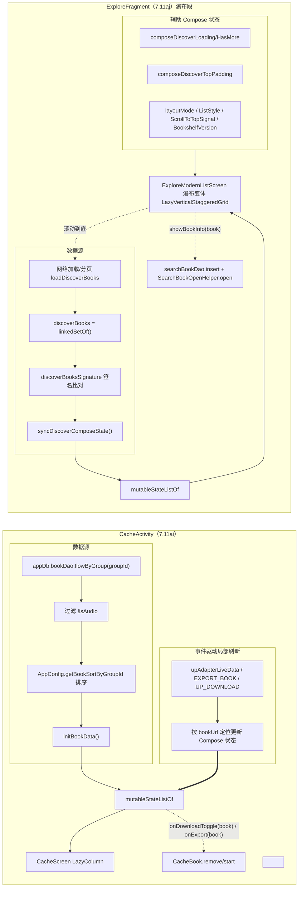

# design.md — 遗留列表 Compose 化收尾（CacheActivity + ExploreFragment 瀑布列表）

## Technical Approach

两处列表均采用「纯 Compose 壳层」范式：**宿主负责状态与数据源与回调闭包，Screen 纯 Compose 接收 `items` + `onXxx` 自绘列表**。并行两项改造，逐项回归。

### A. 缓存列表页（7.11ai）

1. **新建 `CacheScreen.kt`**：纯 Compose，`LazyColumn` + `itemsIndexed(key = { it.bookUrl })`。item 为 private @Composable，承载 7 字段：
   - `tvName` / `tvAuthor` → `name` / `author` 文本。
   - `tvDownload` → 下载进度文本 / 本地已缓存标记。
   - `ivDownload` → 播放/停止图标，点击闭包 `onDownloadToggle(book)`。
   - `tvExport` → 导出文字/按钮，点击闭包 `onExport(book)`。
   - `tvMsg` / `progressExport` → 导出消息 + 导出进度条（由 `exportMsg` / `exportProgress` 状态驱动）。
2. **`CacheActivity.kt` 改造**：
   - 保留已 Compose 的顶栏 `GlassTopAppBar` 与 `AppDropdownMenu` 三类菜单，`downloadRunning` 等 `mutableStateOf` 保留。
   - 移除 `initRecyclerView()`/adapter 分支，`setContent` 内容改为装配 `CacheScreen` 并传入列表状态与回调。
   - `upDownloadIv` / `upExportInfo` 从逐-View 更新改为写 Compose 状态（按 `bookUrl` 收紧更新范围）。
   - 菜单里 `adapter.getItems()` / `getItem(position)` 改为读取 `mutableStateListOf<Book>`（或按 `bookUrl` 查表）。
3. **事件驱动局部刷新**：`upAdapterLiveData` / `EXPORT_BOOK` / `UP_DOWNLOAD` 触发时不再 `notifyItemChanged(bookUrl)`，而是仅更新目标 `bookUrl` 对应的 Compose 条目状态；`mutableStateListOf` 用 Diff/按 key 局部重组，避免整表刷新。

### B. 探索瀑布段（7.11aj）

1. **瀑布列表 Compose 化**：在 `ExploreModernListScreen` 之上支持瀑布变体（`LazyVerticalStaggeredGrid`），瀑布 item @Composable 承载封面，`aspectRatio` 由 `ExploreShowWaterfallAdapter` 原 `setImageSizeRatio` 宽高比字段等价换算。
2. **`ExploreFragment.kt` 瀑布分支替换**：`rvDiscoverBooks` + `ExploreShowWaterfallAdapter` 移除，瀑布布局改走 `composeDiscoverBooks`（`ComposeView`）的 Compose 状态；瀑布点击复用 `showBookInfo(book)`；滚动到底通过 `derivedStateOf` / `LaunchedEffect` 检测触发 `loadDiscoverBooks(false)`。
3. **状态接管**：`currentDiscoverScrollTarget()` 的 `rvDiscoverBooks` 分支 → Compose 状态；`updateModernTopBarOverlay()` 的 padding / `clipToPadding` / swipeRefresh offset 由 `composeDiscoverTopPadding` 统一接管；`applyDiscoverBookContainerMargins()` → Compose `modifier.padding`。
4. **辅助状态复用**：`composeDiscoverLoading` / `composeDiscoverHasMore` / `composeDiscoverTopPadding` / `layoutMode` / `listStyle` / `ScrollToTopSignal` / `BookshelfVersion` 沿用，瀑布分支接入同一状态源。

### 数据流统一

- 列表数据：`adapter.setItems()` → `mutableStateListOf` 就地 `add`/`update`/`clear`。
- 局部更新：`notifyItemChanged(bookUrl)` → 按 `bookUrl` 维度的 Compose 状态 Diff/按 key 重组。
- 滚动与 overlay：View 滚动监听 / setPadding → Compose `derivedStateOf` + `LazyListState`。

## Architecture Decisions

### AD-01: CacheActivity 列表按「UrlRecordScreen 纯 Compose 壳层」范式整页迁移（删除 Adapter）

- **Context**: 缓存页顶栏已 Compose，主列表仍为 `RecyclerView` + `CacheAdapter`（`DiffRecyclerAdapter<Book, ItemDownloadBinding>`），item 含下载进度/本地标记/播放停止/导出/导出进度等多状态字段，靠 `notifyItemChanged(bookUrl)` 事件局部刷新。
- **Concern**: 若不删除 adapter 仅做 LazyColumn 过渡，item 状态被拆到 View 与 Compose 双份，事件驱动局部刷新分叉，后续维护成本高；且无法兑现「存量 Adapter 退役」目标。
- **Decision**: 按已验收的 `UrlRecordScreen` 壳层范式整页迁移：`CacheAdapter.kt` 删除，`CacheScreen.kt` 纯 Compose 承载 7 字段 item 并暴露 `onDownloadToggle(book)` / `onExport(book)`；`CacheActivity` 保留状态与菜单构建，仅解耦 adapter 依赖；数据流与局部刷新迁移到 `mutableStateListOf` + 按 `bookUrl` Compose 状态。
- **Goal**: 消除缓存页最后一个存量 View 列表，UI 栈单 Compose，局部刷新语义（`UP_DOWNLOAD` / `EXPORT_BOOK`）不丢。
- **Tradeoff**: item 多状态 + 事件局部刷新迁移工作量较大；换取 UI 栈收敛、无 View/Compose 双实现。
- **Status**: Proposed
- **Superseded-by**: 无

### AD-02: Explore 瀑布作为 `ExploreModernListScreen` 的 ListStyle 变体，不建独立瀑布 Compose 区块

- **Context**: 探索现代模式由 `composeDiscoverBooks`（`ComposeView`）承载 `ExploreModernListScreen`；瀑布（`layoutMode==2`）目前走独立 `rvDiscoverBooks` + `ExploreShowWaterfallAdapter`。
- **Concern**: 瀑布与既有列表共享大量状态与回调（loading / HasMore / 滚动到底 / 顶栏 overlay / 空态 / 点击 `showBookInfo`）。若建成独立 Compose 区块，需重复接线这些状态，且与 `ExploreModernListScreen` 双实现。
- **Decision**: 不建独立瀑布区块；将瀑布量化为 `ExploreModernListScreen` 的一个布局变体（`LazyVerticalStaggeredGrid`），复用同一状态源与回调闭包；瀑布 item 为内部 private @Composable，`aspectRatio` 由原 `setImageSizeRatio` 字段换算。
- **Goal**: 瀑布与既有列表共享状态/回调单源，减少重复接线，滚动到底与顶栏 overlay 一致。
- **Tradeoff**: `ExploreModernListScreen` 签名需小幅扩展（新增瀑布分支参数），存在少量状态协同回归；换取无双 Sanity 实现与统一 overlay 接管。
- **Status**: Proposed
- **Superseded-by**: 无

### AD-03: `mutableStateListOf` 替代 `adapter.setItems`；`notifyItemChanged` → 按 `bookUrl` Diff 局部重组

- **Context**: 原 adapter 事件驱动局部刷新依赖 `notifyItemChanged(bookUrl)`（`upAdapterLiveData` / `EXPORT_BOOK` / `UP_DOWNLOAD`）；全量数据用 `setItems()`。
- **Concern**: Compose 下无 `notifyItemChanged`；直接整表重组性能与语义不符「单条目局部更新」。
- **Decision**: 列表数据源统一为 `mutableStateListOf<Book>`；item 用 `LazyColumn.itemsIndexed(key = { it.bookUrl })` / `LazyVerticalStaggeredGrid.itemsIndexed(key = { it.bookUrl })`，事件仅更新目标 `bookUrl` 对应 Compose 状态，Compose 依据 Diff 只重组受影响的 item。
- **Goal**: 局部更新语义保留，滚动性能（item 复用）与 Compose 重组模型对齐。
- **Tradeoff**: 需将「按 index 更新」改写为「按 `bookUrl` 定位更新」；换取单数据源、无 `notifyItemChanged` 残留。
- **Status**: Proposed
- **Superseded-by**: 无

### AD-04: 顶栏 padding / topBarOverlay 由 View 字段迁移到 Compose 状态（`composeDiscoverTopPadding` 统一接管）

- **Context**: 探索现代模式顶栏 overlay / padding / `clipToPadding` / swipeRefresh offset 由 `updateModernTopBarOverlay()` 操作 View（`rvDiscoverBooks`/`composeDiscoverBooks`）；布局间距由 `applyDiscoverBookContainerMargins()` 操作 View。
- **Concern**: 转移到 Compose 后仍操作 View 的 setPadding / setClipToPadding 会造成 Compose 与 View 层状态分叉，overlay 在主题/顶栏切换时不稳。
- **Decision**: 将顶栏 padding / overlay 收敛为 Compose 状态 `composeDiscoverTopPadding`；`currentDiscoverScrollTarget()` 的 `rvDiscoverBooks` 分支、`updateModernTopBarOverlay`、`applyDiscoverBookContainerMargins` 全部改为驱动同一 Compose 状态；瀑布与列表共用同一 overlay 计算。
- **Goal**: 顶栏 overlay / 间距单源，主题/顶栏切换全局跟随，瀑布/列表行为一致。
- **Tradeoff**: 需重构 3 处 View 方法为状态写入点；换取单状态源、无 View/Compose 双层分叉。
- **Status**: Proposed
- **Superseded-by**: 无

## Data Flow

`CacheActivity`：DAO flow → 过滤排序 → `mutableStateListOf` → `CacheScreen`；事件 `EXPORT_BOOK`/`UP_DOWNLOAD` 按 `bookUrl` 局部更新。

`ExploreFragment`（瀑布段）：网络分页 → `discoverBooks`（`linkedSetOf`）→ `syncDiscoverComposeState()`（签名比对后同步 `mutableStateListOf`）→ 瀑布变体；滚动到底触发 `loadDiscoverBooks(false)`；点击 `showBookInfo(book)`；overlay 由 `composeDiscoverTopPadding` 单一状态驱动。

## File Changes

| 文件 | 变更类型 |
|------|---------|
| `app/src/main/java/io/legado/app/ui/book/cache/CacheActivity.kt` | 重写：移除 `initRecyclerView()`/adapter，装配 `CacheScreen`；保留顶栏 Compose 与菜单；数据流改 `mutableStateListOf`；局部刷新改按 `bookUrl` |
| `app/src/main/java/io/legado/app/ui/book/cache/CacheAdapter.kt` | 删除（7 字段 item 转 Compose，收敛进 `CacheScreen.kt`） |
| `app/src/main/java/io/legado/app/ui/book/cache/CacheScreen.kt` | 新增：纯 Compose `LazyColumn` + 7 字段 item + `onDownloadToggle`/`onExport` |
| `app/src/main/java/io/legado/app/ui/main/explore/ExploreFragment.kt` | 瀑布段替换：`rvDiscoverBooks` 分支 → Compose 状态驱动；`updateModernTopBarOverlay`/`applyDiscoverBookContainerMargins`/`currentDiscoverScrollTarget` 瀑布分支改 Compose 状态 |
| `app/src/main/java/io/legado/app/ui/main/explore/ExploreModernListScreen.kt` | 扩展：新增瀑布变体（`LazyVerticalStaggeredGrid`）+ 瀑布 item private @Composable + 滚动到底检测 + overlay 状态接入 |
| `app/src/main/java/io/legado/app/ui/book/explore/ExploreShowWaterfallAdapter.kt` | 删除（封面瀑布 item 转 Compose，收敛进 `ExploreModernListScreen`） |
| `docs/project-flow/ui-standards/migration-registry.md` | 更新：登记 7.11ai / 7.11aj 迁移状态 |
| `app/src/main/assets/updateLog.md` | 更新：追加迁移条目（编译前） |

> 待 Compoose 化点明细与转换表见 `spec.md`；分批验收见 `tasks.md`。

## 深度审查补充（2026-08-25，用户检查点1 追问"遗漏点/阻塞点/主题管理"）

### 遗漏点核查结论（Grep 全量调用方 + 依赖）
- **调用方全集**：`CacheActivity` + `CacheAdapter` 仅缓存管理页自用（顶栏菜单 `buildMenuActions` 经 `getItems()`/`getItem()` 引用 adapter 的两个取数点，迁移时改为访问 `mutableStateListOf` 列表状态）；`ExploreShowWaterfallAdapter` 仅 `ExploreFragment` 瀑布分支使用（1 处），删除无其它引用。
- **版本依赖（无阻塞）**：`composeBom = "2025.04.01"`（gradle/libs.versions.toml L6），Compose foundation 1.7.x 已含 `LazyVerticalStaggeredGrid`（自 1.4 起稳定）→ 瀑布迁移无版本阻塞。
- **瀑布布局参数**：`ExploreShowWaterfallAdapter` 依赖 `setImageSizeRatio` 封面宽高比字段，Compose item 需保留该参数（spec.md B 需求已覆盖）。

### 阻塞点清单（无硬阻塞）
| 潜在点 | 证据 | 结论 |
|--------|------|------|
| `updateModernTopBarOverlay`/`applyDiscoverBookContainerMargins` View padding | ExploreFragment 现有 Compose 状态 `composeDiscoverTopPadding` 已建 | 瀑布 padding 并入既有 Compose 状态统一接管（AD-04），无阻塞 |
| CacheAdapter payload 增量更新（`cacheChapters` 计数） | convert payload 分支 + `notifyItemChanged(bookUrl)` | Compose 侧按 `bookUrl` key 做 Diff 局部重组（AD-03），无阻塞 |

### 主题设置管理覆盖结论（用户核心关切）
- **取色统一**：`CacheScreen` / `ExploreModernListScreen` 瀑布变体均走 `MaterialTheme`（LegadoTheme.kt L57-96：读 `AppConfig.isNightTheme` + `ThemeStore` 主/辅/背景/文字色生成 scheme）+ `rememberAppDialogStyle`/`ThemeStore` 动态色，替代 `ItemDownloadBinding` 静态 `?attr` 色；`GlassTopAppBar` 已直读 ThemeStore。
- **切换即时刷新**：主题设置触发 `ThemeSync.bump()`（ThemeSync.kt L19-27：`LegadoTheme`、`GlassTopAppBar` 等读 `version` 的 Composable 立即失效重组，栈内后台页面同样生效）+ `EventBus.RECREATE`；缓存/探索页在后台场景同样即时刷新 → Compose 化后主题管理覆盖较 RecyclerView + 静态 item 增强（旧 `ItemDownloadBinding` 色值随 activity recreate 才整体刷新）。