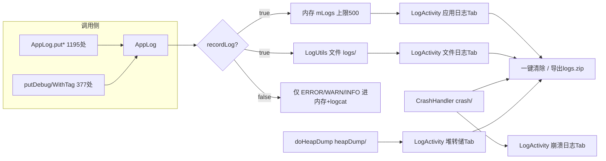
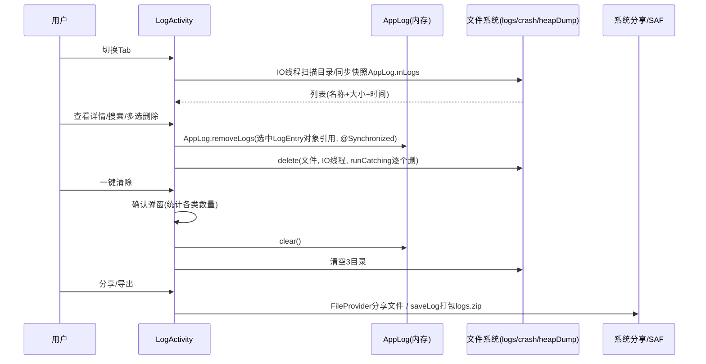

# design.md - 日志系统升级改造

## Technical Approach

在现有三层日志体系（AppLog 内存+LogUtils 文件+logcat）之上做守卫逻辑调整与 UI 层统一整合，不替换基础设施。

## Architecture Decisions

### AD-01: recordLog 默认值按包类型区分
- **Version**: v1.0
- **UpdateTime**: 2026-09-06
- **Context**: 项目双包发布（debug 测试包/release 正式包），AI 真机测试（ai_tests）依赖日志采集解析；当前 recordLog 默认 false，377 处 putDebug/putDebugWithTag 调用点在默认状态下全部丢弃
- **Concern**: 测试包默认状态日志信息量不足，AI 解析经常拿不到足够上下文；用户需每次手动开记录日志
- **Decision**: `AppConfig.recordLog` getter 改为：无 PreferKey.recordLog 偏好值时，debug 包默认 true、release 包默认 false；用户显式设置后写入偏好值，两包行为一致
- **Goal**: 测试包开箱即得详细日志，release 包默认行为零变化
- **Tradeoff**: debug 包磁盘写入量增加（AsyncFileHandler 异步写 + 7 天自动清理兜底）
- **Status**: Accepted
- **Superseded-by**: 无
- **ChangeLog**: 初版

### AD-02: DEBUG 级日志记录守卫调整（最小侵入）
- **Version**: v1.0
- **UpdateTime**: 2026-09-06
- **Context**: AppLog.putEntry 中 putDebug/putDebugWithTag 在 recordLog=false 时直接 return；内存记录/文件写入开关均挂在该单一开关上
- **Concern**: 关闭开关时 DEBUG 级全丢，但 ERROR/WARN/INFO 仍进内存——行为不对称导致排障信息缺失
- **Decision**: 保持单一开关不变；仅将「DEBUG 级丢弃」分支改为「recordLog=true 时 DEBUG 级与其它级别同等记录（内存+文件）」。release 包下 DEBUG 级 logcat 输出仍由 BuildConfig.DEBUG 守卫，行为不变
- **Goal**: 开关语义变为唯一权威：「开=全量四级，关=ERROR/WARN/INFO」
- **Tradeoff**: recordLog 开启后日志量增大，内存 100 条上限不够 → 由 AD-03 承接
- **Status**: Accepted
- **Superseded-by**: 无
- **ChangeLog**: 初版

### AD-03: 内存日志容量 100 → 500
- **Version**: v1.0
- **UpdateTime**: 2026-09-06
- **Context**: mLogs 上限 100 条，DEBUG 全量记录后数十秒即被冲掉；AppLogDialog 与悬浮球注释均自认此上限
- **Concern**: AI 解析需要回溯窗口，100 条不够；过大则有内存压力
- **Decision**: 上限改为 500（常量，不做配置项）。单条经 truncateSafely 限 2000 字符，峰值约 1MB，可接受
- **Goal**: 全量记录下仍有约分钟级回溯窗口
- **Tradeoff**: 内存占用增加约 1MB 峰值
- **Status**: Accepted
- **Superseded-by**: 无
- **ChangeLog**: 初版

### AD-04: 新建全屏 Compose 日志管理中心，Dialog 体系保留
- **Version**: v1.1
- **UpdateTime**: 2026-09-06
- **Context**: 现有 AppLogDialog（约 20 处入口）/CrashLogsDialog 为 Dialog 形态，无搜索/多选删除/文件列表；精准管理页三件套入口分散
- **Concern**: 日志管理交互（多选、搜索、4 类数据源）在 Dialog 内承载极差；但 Dialog 入口分布广，全量迁移风险大
- **Decision**: 新建 `ui/log/LogActivity`（Compose + TabRow 4 Tab），作为日志管理唯一全功能入口；AppLogDialog/CrashLogsDialog 及其 20 处入口**原样保留**（轻量查看场景）。实施遵循 `ui-standards/architecture.md` 四组件族基线与取色唯一基线，禁止硬编码色
- **v1.1 修订（用户反馈收口）**：精准管理页「崩溃日志」「保存日志」「创建堆转储」三项菜单移除，仅保留「日志管理」入口；右上角按规范收口为三个竖点（MoreVert）+ AppDropdownMenu 溢出菜单承载全部操作（多选/创建堆转储/导出日志/一键清除）；createHeapDump 逻辑自 PreciseManageFragment 平移至 LogActivity（完成后 onFinally 刷新列表）；崩溃日志=切换 Tab 即达
- **Goal**: 全功能集中、菜单收口统一、可增量演进
- **Tradeoff**: 短期内 Dialog 与全屏页并存，功能有重叠（接受：演进期过渡态）
- **Status**: Accepted
- **Superseded-by**: 无
- **ChangeLog**: v1.0 初版；v1.1 用户反馈收口修订（三点溢出菜单+三件套菜单移除+createHeapDump 迁移）

### AD-05: 文件查看采用尾部截断策略
- **Version**: v1.0
- **UpdateTime**: 2026-09-06
- **Context**: appLog-*.txt 单文件可能数 MB（全量 DEBUG 记录下）；应用内无分页查看器
- **Concern**: 全文读入内存可能 OOM（低配真机 heapSize 256MB）
- **Decision**: 文件日志/崩溃日志查看统一读尾部最多 500 行、单行超长截断，顶部提示「已截断，完整内容请导出」；分享/导出走文件流不经内存
- **Goal**: 查看永不 OOM，大数据量引导走导出通道
- **Tradeoff**: 超大文件无法在应用内看头部内容（接受：头部为设备信息，价值低）
- **Status**: Accepted
- **Superseded-by**: 无
- **ChangeLog**: 初版

### AD-06: 一键清除对占用文件与锁文件的容错处理
- **Version**: v1.0
- **UpdateTime**: 2026-09-06
- **Context**: LogUtils 经 java.util.logging FileHandler+AsyncFileHandler 写盘，当前日志文件句柄被占用且存在 .lck 锁文件；一键清除/多选删除会对 logs 目录全量删除
- **Concern**: 删除占用中文件在部分系统上失败，异常上抛导致清除中断或写入异常
- **Decision**: 删除逐文件 runCatching，失败文件跳过；完成后 toast 汇总「已清除 N 项，M 项占用中被跳过（7 天自动清理兜底）」；.lck 文件一并纳入删除范围（与 LogUtils 既有 7 天清理策略对齐）
- **Goal**: 清除操作永不中断、不破坏正在进行的写盘
- **Tradeoff**: 当次操作可能残留个别占用文件（有 7 天自动清理兜底）
- **Status**: Accepted
- **Superseded-by**: 无
- **ChangeLog**: 初版（红队 R2/R5 审查补充）

## Data Flow

删除/清除/扫描全部经 `Coroutine.async` IO 线程；列表状态 Compose `mutableStateOf` 驱动重组。

## File Changes

| 文件 | 变更类型 | 内容 |
|------|---------|------|
| `app/src/main/java/io/legado/app/constant/AppLog.kt` | 修改 | MAX_LOG_SIZE 100→500；putDebug/putDebugWithTag 守卫分支调整（recordLog=true 即记录）；新增 `removeLogs(entries)` @Synchronized 按对象引用删除（供多选删除，避免实时插入导致索引漂移）；新增快照读取方法（@Synchronized 返回不可变副本） |
| `app/src/main/java/io/legado/app/help/config/AppConfig.kt` | 修改 | recordLog getter 增加包类型默认值逻辑 |
| `app/src/main/java/io/legado/app/ui/log/LogActivity.kt` | 新增 | 全屏日志管理页宿主（TabRow + 4 Tab 接线 + 顶栏操作）；支持 Intent extra 指定初始 Tab（供跨页跳转直达崩溃 Tab） |
| `app/src/main/java/io/legado/app/ui/log/*.kt` | 新增 | 4 个 Tab Compose 组件 + 多选模式 + 确认弹框组件 |
| `app/src/main/java/io/legado/app/ui/config/PreciseManageFragment.kt` | 修改 | 「日志与诊断」区新增日志管理入口；崩溃日志入口改跳转 |
| `app/src/main/java/io/legado/app/ui/config/PreciseManageScreen.kt` | 修改 | 对应 Compose 项调整 |
| `app/src/main/AndroidManifest.xml` | 修改 | 注册 LogActivity |
| `app/src/main/assets/updateLog.md` | 修改 | 编译前基于 git diff 更新 |
| `docs/project-rules/logging_rules.md` | 修改 | 同步新守卫语义与日志管理页说明 |
| `docs/INDEX.md` | 修改 | 状态流转 |

**复用不改**：LogUtils（轮转/清理）、NetworkLog（脱敏）、CrashHandler（双写+heapDump）、saveLog（logs.zip 打包）、AppLogDialog/CrashLogsDialog（原样保留）、30+ 模块 Tag 体系。
