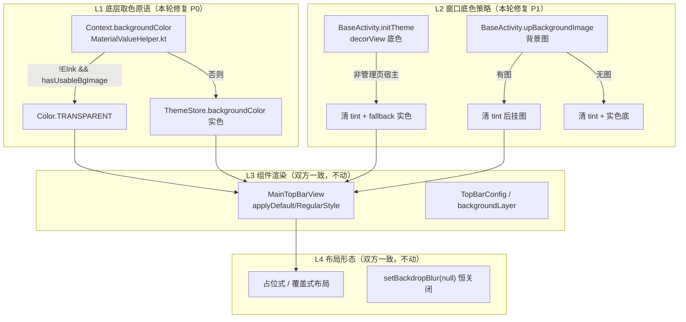
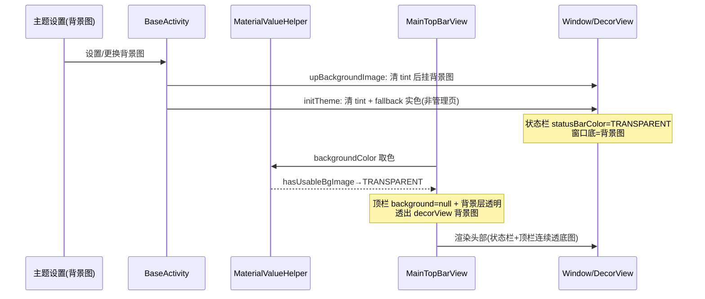

# design.md — main-topbar-transparent-align

## Technical Approach

在透明链路四层结构中，仅修复被删除的底层原语（L1）与窗口着色策略（L2），上层结构（L3/L4）双方已一致，不动。



### 修复点 1：MaterialValueHelper.kt（P0，路径 `lib/theme/MaterialValueHelper.kt`）
本项目现状（L72-75/L109-111）：
```kotlin
val Context.backgroundColor: Int
    get() = ThemeStore.backgroundColor(this)
val Fragment.backgroundColor: Int
    get() = ThemeStore.backgroundColor(requireContext())
```
恢复为 Archive 版（L74-79/L118）：
```kotlin
val Context.backgroundColor: Int
    get() = if (!AppConfig.isEInkMode && ThemeConfig.hasUsableBgImage(this)) {
        Color.TRANSPARENT
    } else {
        ThemeStore.backgroundColor(this)
    }
val Fragment.backgroundColor: Int
    get() = requireContext().backgroundColor
```
**同文件连带修复（红队 R2/R5 捕获）**：本项目 `dialogSurfaceBackground`（L178-180）消费 `backgroundColor`，透明原语恢复后弹窗底色在背景图模式下会整体透明穿帮；Archive 同属性走独立来源（`themeColorOrNull(PreferKey.themeCardColor) ?: R.color.dialog_surface`，Archive L196-200），需一并对齐摘除 `backgroundColor` 依赖。`filletBackground`（L171-176）两边均消费 backgroundColor（Archive 同样透明），保持对齐不动。

**热点文件约束（master-track 热点⑧/X1 裁决）**：MaterialValueHelper.kt 为三方串行热点文件，light-theme-contrast-fix 已交付对齐（isDarkTheme/字色派生）禁止回退；本次仅动 `backgroundColor`/`Fragment.backgroundColor`/`dialogSurfaceBackground` 三个属性，其余属性逐行 diff 确认零改动。

### 修复点 2：BaseActivity.kt（P1）
- `initTheme`：非管理页宿主路径恢复 Archive `applyWindowBackgroundColor()` 等效行为（清 decorView tint + `ThemeConfig.getFallbackBackgroundColor` 实色）；管理页宿主保留本项目 `manageHostTintColor()` tint 钩子（管理页背景透明度消费链，architecture.md L134，2026-09-03 新增，不可破坏）。
- `upBackgroundImage`（基类）：恢复 Archive 三分支——无图→清 tint+实色；有图→清 tint 后挂 drawable；异常→实色。MainActivity 已 override（`refreshMainThemeBackground`）不受影响。
- 保留本项目 RECREATE 主题切换机制，不恢复 Archive 的 `MAIN_THEME_BACKGROUND_CHANGED` 软刷新事件（见 AD-02）。

## Architecture Decisions

### AD-01: 恢复 backgroundColor 透明原语而非新增透明度配置
- **Version**: v1.0
- **UpdateTime**: 2026-09-06
- **Context**: Archive 的 `Context.backgroundColor` 含"背景图→TRANSPARENT"分支；本项目迭代中被删除且透明分支零调用方（静默回归），导致四 Tab 头部在背景图模式下不透底图。
- **Concern**: 透明链路失效的根因在底层原语，上层组件（MainTopBarView 等）代码逐行一致却"无辜"表现异常。
- **Decision**: 恢复 Archive 版透明分支实现（含 Fragment 委托），不新增任何配置开关。
- **Goal**: 取色唯一基线语义回归 Archive，四 Tab 头部恢复透底图能力。
- **Tradeoff**: 所有 `backgroundColor` 消费点在背景图模式下从实色变透明（这正是 Archive 行为），需全量盘点+回归；放弃"渐进式开关"带来的可控性。
- **Status**: Accepted
- **Superseded-by**: 无
- **ChangeLog**: v1.0 初版

### AD-02: BaseActivity 着色策略条件对齐，保留 RECREATE 机制
- **Version**: v1.0
- **UpdateTime**: 2026-09-06
- **Context**: 本项目 `initTheme` 用 `applyBackgroundTint(manageHostTintColor())` 常驻 tint，基类 `upBackgroundImage` 挂图不清 tint；但管理页 tint 钩子是 2026-09-03 管理页背景透明度消费链的一部分；主题切换已从 Archive 的软刷新事件改为 ThemeSync+RECREATE 体系。
- **Concern**: 盲目照抄 Archive 的 `applyWindowBackgroundColor` 会破坏管理页 tint 链；恢复软刷新事件会与 RECREATE 体系冲突。
- **Decision**: `initTheme`/`upBackgroundImage` 仅对齐"非管理页宿主"路径的终态行为（清 tint+实色/挂图）；管理页 tint 钩子保留；主题刷新继续走 RECREATE，不恢复 `MAIN_THEME_BACKGROUND_CHANGED` 事件。
- **Goal**: 窗口底色终态与 Archive 一致，同时不回退本项目已建立的 ThemeSync 体系。
- **Tradeoff**: 放弃软刷新的性能优势（接受 RECREATE 的重建成本，维持现状）；普通 Activity 背景图切换路径需重点回归。
- **Status**: Accepted
- **Superseded-by**: 无
- **ChangeLog**: v1.0 初版

### AD-03: overlay/blur 链路不动
- **Version**: v1.0
- **UpdateTime**: 2026-09-06
- **Context**: 探索初期假设"毛玻璃被关闭/overlay 缺失"是根因；逐行 diff 证实双方 `setBackdropBlur` 恒传 null、overlay 判定代码一致。
- **Concern**: 若按初期假设改造（激活 blur/重构 overlay），将引入 Archive 不存在的行为，偏离"对齐"目标且有穿帮风险。
- **Decision**: `MainTopBarView`、`ExploreFragment.updateModernTopBarOverlay`、`RssFragment`、布局文件一律不改。
- **Goal**: 最小变更面，避免回归。
- **Tradeoff**: 发现页覆盖式布局下透明顶栏的行为与 Archive 完全一致（含其潜在局限），不做超出对齐范围的优化。
- **Status**: Accepted
- **Superseded-by**: 无
- **ChangeLog**: v1.0 初版

## Data Flow（透明链路）



## File Changes

| 文件 | 变更类型 | 说明 |
|------|---------|------|
| `app/src/main/java/io/legado/app/lib/theme/MaterialValueHelper.kt` | 修改 | 恢复 `Context.backgroundColor`/`Fragment.backgroundColor` 透明分支；`dialogSurfaceBackground` 摘除 backgroundColor 依赖对齐 Archive |
| `app/src/main/java/io/legado/app/base/BaseActivity.kt` | 修改 | `initTheme` 非管理页路径清 tint+实色；`upBackgroundImage` 恢复三分支 |
| `app/src/main/assets/updateLog.md` | 修改 | 面向用户追加变更条目（编译前） |
| `docs/INDEX.md` | 修改 | 状态流转 |

### 回归盘点对象（只验证不修改）
`backgroundColor` 扩展（lib.theme）全量消费点 17 文件（实施时 Grep 实测）：
- 核心 UI：`MainTopBarView.kt`（overlayOpaque 场景，7 个子页 Activity）、`AppManagementScaffold.kt` L90-164、`AppSettingComponents.kt` L141/143、`BookCoverImage.kt`
- Activity 族：`BaseActivity.kt`（tint 钩子）、`RssSourceEditActivity`、`RssSearchActivity`、`RssArticleInfoActivity`、`WelcomeActivity`、`VideoPlayerActivity`、`BookInfoActivity`、`BookSourceEditActivity`
- 列表/组件族：`CoverImageView`、`AiImageProviderEditScreen`、`SourceFolderAdapter`、`BookAdapter`、`PreferenceCategory`
- 同文件连带（已修复）：`MaterialValueHelper.dialogSurfaceBackground`（弹窗底色，摘除 backgroundColor 依赖）

### 明确不动
`MainTopBarView.kt`、`TopBarConfig.kt`、`MainActivity.kt`、`ExploreFragment.kt`、`RssFragment.kt`、四大 Tab 布局 XML、`ActivityExtensions.kt`、`ThemeStore.kt`
