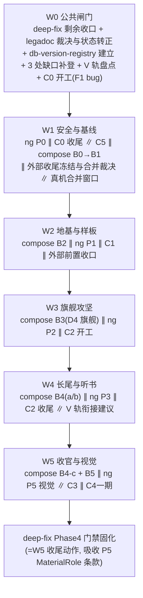
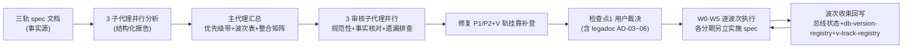

# design.md — 三轨总线任务编排

## Technical Approach

### 1. 三轨分期全景与优先级分级

| 优先级带 | 分期 | 轨 | 性质 | 工作量 | 依据 |
|---------|------|----|------|--------|------|
| P0 真 bug | C0-F1 AnalyzeRule 缓存污染 | B | 缺陷修复 | 小（C0 全期 4.2d） | 全三轨唯一 bug 修复项；用户可感知内容错乱源；红测试先行；三向量已源码逐点核实命中（AnalyzeRule.kt :234-236/:327-329 裸键访问、makeUpRule :721-780 replaceRegex 残留、:742 重入半更新，行号随并行改动可能漂移，以函数名定位为准） |
| P0 安全 | ng P0 书源沙箱加固 5 项 | C | 安全加固 | 7.7d | 用户已裁决先行；观察式开关可回退 |
| P0 闸门 | deep-fix 剩余收口（实况：Phase1/2/S/H/T/X 已完成，剩 Phase3 D1/D2 复杂弹框 + Phase4 防回潮；R3 终测合并至 B0 执行） | 外部 | 既有任务 | — | 轨 A B0 与轨 C P5 的公共前置 |
| P1 基线 | compose B0→B1 / C0 其余 F2-F5 / C5 | A/B | 验证+登记+加固 | 小-中 | 低成本高杠杆；B1 消除 10.7% 文档过期口径 |
| P2 地基 | compose B2 / ng P1 / legadoc C1 | A/B/C | 基建+DB+引擎 | 中 | B2 测试基建被后续复用；P1 v109 规划→顺延 v110 实施（v109 已被 video-sniff 实占）；C1 引擎原语化 |
| P3 旗舰 | compose B3（D4 Rss 旗舰）/ ng P2 / C2 多媒体 | A/B/C | 结构性迁移 | 大 | D4 五代 Adapter 收敛；P2 硬前置 P1；C2 27 人日最大单项 |
| P4 长尾 | compose B4（a/b，c 顺延 W5）/ ng P3 多角色听书 / C2 收尾 | A/B | 迁移+新表 | 大 | B4 含 D2 表单压轴；P3 v110 规划→顺延 v111 实施（v110 归 P1） |
| P5 收官 | compose B4-c + B5 / ng P5 视觉（载体文件 P4-visual-patterns.md，文件名历史原因）/ C3 合集书架 / C4 AI 净化 | A/B/C | 收官+视觉+UI | 中 | B5 KPI 终值为轨 A 关闭件；P5 窗口=deep-fix Phase2 收尾后（已满足）、Phase4 门禁固化前 |

> 编号说明：ng 侧"P4 期"=AI 应用层二期（决策表 #15，**暂缓**，二期清单落点见 tasks 3.7.2）；"P5 期"=视觉三模式（载体文件名 P4-visual-patterns.md 为创建序命名）。本设计文档正文统一称"ng P5 视觉"。

### 2. 波次编排（W0-W5）

| 波次 | 纳入分期 | 进入条件（开工前可判定） | 文件域隔离论证 | 窗口内推荐序（编号≠执行序，执行以本列为准） |
|------|---------|----------------------|---------------|------------------------------------------|
| W0 | deep-fix 剩余收口（Phase3 D1/D2 + Phase4 防回潮，R3 终测合并至 B0 执行）+ legadoc 裁决与状态转正 + db-version-registry.md 建立（登记 video-sniff 4.8e 已实占 v109）+ 3 处缺口/状态补登 + V 轨活跃任务盘点登记 + C0 开工（红测试→F1） | 检查点 1 通过后立即开工 | C0 触规则引擎（AnalyzeRule 等 6 文件），与 deep-fix（弹框/主题文件）、V 轨（视频域）零交集 | deep-fix 剩余收口 → legadoc 裁决（用户）→ registry 落盘 → V 轨盘点登记 → C0 红测试 → F1（F3-F5 视窗口余量顺延 W1） |
| W1 | ng P0 全期 ∥ C0 收尾（F3→F2→F4→F5）∥ C5 ∥ compose B0→B1 ∥ 外部收尾冻结（bugfix-20260822/20260824）∥ cronet-global-enable + network-perf-stability + thread-pool-audit 与 video-sniff 4.8c 开关双逻辑合并裁决 ∥ 澄清补注（2.13/2.14）∥ 真机合并窗口（B0 终测 = deep-fix R3 继承 + light-theme S1-S9 + video-sniff 1.11/2.9 待真机项，一次打包覆盖；video-sniff 项未就绪则拆包先行，由 W4 走查兜底） | deep-fix 剩余收口回执 + legadoc 状态转正完成 | 五方：ng P0 触书源执行链、C0 触规则引擎（与 ng P0 同为热点⑦，须函数名定位+串行 Edit）、C5 触 AppLog/脚本（与 ng P0 新增 Tag 同文件，热点⑪）、B0/B1 纯验证+文档、外部裁决纯文档 | ng P0（已裁决先行）→ B0 收口（含真机合并窗口）→ B1 校准 → C0 收尾 → C5 → 澄清补注（2.13/2.14）→ 外部裁决 |
| W2 | compose B2 ∥ ng P1 ∥ C1 ∥ 外部前置（cache-entry-relocate 收口；fix-rss-search-scope + rss-folder-subtag-fix 收口为 B3 前置；thread-pool-audit 与 video-sniff 钳制定稿为 W2 内首项；ng P2 前置登记 3.7） | B1 回执 + 2.12 ai-test scripts 批先行完成（B2 L2 模板依赖 ai_tests 目录口径；2.12 须于 W1 收束前完成） | B2 触样板页+测试脚本；ng P1 触 help/ai/ + DB v110 实施；C1 触朗读引擎 13 文件；外部前置触搜索/书架独立域；零交集 | 3.6 钳制定稿（W2 内首项）→ B2（样板冻结是 C3/P5 复用前提）→ ng P1 → C1 → 外部前置收口（3.4/3.5/3.7） |
| W3 | compose B3（D4 旗舰打头）∥ ng P2 ∥ C2 开工 | B2 全收口（轨 A AD-07 禁跳批）+ B0 订阅切换回归通过 + 3.5 Rss 域前置收口回执 + ng P2 硬前置 ng P1 收口（C2 OQ-1 焦点矩阵为 C2 开工前分期级闸门，见 4.4.1） | B3 触 Rss 列表域（A8 回归清单须含 video-sniff Phase0 padding 改动）；ng P2 触 MCP 四模块（零 DB）；C2 触排版内核（属 compose 红线页，不抢迁移地盘）；零交集 | B3 D4 → B3 其余 9 页 → P2 → C2 Phase A |
| W4 | compose B4-a/B4-b（B4-c 顺延 W5）∥ ng P3 ∥ C2 收尾 ∥ V 轨衔接建议（事件驱动，见 5.5） | B3 回执（D4 组件是 B4 前置）+ ng P3 前置 ng P0 合入确认（DD3 Segmenter 评审为 P3 开工前分期级闸门，见 5.3.1） | B4 触长尾 20+ 文件；ng P3 触 tts/ 新目录 6 新表 v111 实施；C2 触排版内核；V 轨衔接为建议单不改源码；零交集 | B4-a 登记 → B4-b 收口（D2 压轴）→ P3 → C2 Phase B-C（排版回归高风险，独占真机窗口，R8）→ V 轨衔接 |
| W5 | compose B4-c + B5 ∥ ng P5 视觉 ∥ C3 ∥ C4 一期 ∥ KPI 终值复盘 + NG/legadoC 代差分析 | B4-b 回执（可判定：tasks 5.1/5.2 全勾）+ C3 前置 B2 样板冻结回执（3.1 全勾）+ B3-5.2 ExploreFragment 回执（4.2 勾）+ ng P5 前置 light-theme 真机闭环（2.6.3 勾）；C4 一期可零等待（B 路线收口） | B4-c/B5 触长尾收尾+销号；ng P5 触 lib/theme/ + palette 三入口；C3 触书架 Compose 重写；C4 触净化编排层；零交集 | ng P5 视觉先落（先于 Phase4 门禁固化；与 deep-fix 关系=Phase3(W0)→P5(W5)→Phase4 固化(W5 末) 三段序）→ C3 → B4-c → C4 一期 → B5 收官 → KPI 终值 → deep-fix Phase4 门禁固化（吸收 P5 MaterialRole 条款：取色+材质双检查） |

### 3. 共性问题整合矩阵

| # | 共性问题 | 涉及轨 | 整合方案 | 沉淀位置 |
|---|---------|--------|---------|---------|
| 1 | DB 版本链抢占：P1 规划 v109、P3 规划 v110、C2 新 1 表、C3 新 4 表、C4 无 schema、**video-sniff 4.8e 方案 A 已实施（v109 已实占，源码 AppDatabase.kt:126 version=109 实测核实）** | A/B/C/V | 建立 `docs/project-flow/database/db-version-registry.md` 唯一占号权威源：占号制（先合先得）+ 实施时 version+1 自适应门禁；ng P1 实施时自适应顺延 v110、P3 顺延 v111（v109 已被 video-sniff 占用，先合先得已生效） | AD-02 |
| 2 | 文件级串行热点 14 对（方向均为单向，依据见括号）：①ReadBookActivity（C1(W2)→C2(W3-W4)→reader-overlay-compose(不早于 W4)）②HttpReadAloudService（C1(W2)→P3(W4)）③palette 三入口与弹框族文件（deep-fix Phase3(W0)→P5 视觉(W5)→Phase4 固化(W5 末)）④RssFragment 四波队列（deep-fix S 批✅→fix-rss-search-scope(3.5)→tag-mode-unify(2.7.3 吸收裁决，其实施排 3.5 后)→B3-A8(4.1)）⑤VideoPlay/VideoFragment/Exo2MediaPlayer（video-sniff→enhance-switch→video-back-fullscreen/rss-video-player，按 §4 串行序衔接建议）⑥HlsDownloader/ChunkDownloader/DownloadService（video-sniff 4.4/4.6→download-hls-complete-fix→download-manager-maturity）⑦AnalyzeRule.kt 双期（C0-F1(W0)→ng P0 evalJS 区(W1)，函数不相交但行号漂移，函数名定位+串行；另 C0↔source-arch-mutual-borrow 同域串行裁决见 §4）⑧MaterialValueHelper/ThemeSpec 三方（light-theme 已交付→B3-E2 ThemeSpecPresets(W3)→ng P5 contrastOn(W5)，E2 产物纳入 P5 截图回归面兜底，X1 裁决）⑨VideoPlay 域四层（video-sniff Phase4→multiline-on-demand-extraction）⑩ExploreFragment.kt 两轨（B3-5.2 classic 收敛(W3)→B-C3-G4 RowUi 500 行替换(W5)）⑪AppLog/EventBus/PreferKey/BackupConfig 常量文件多点追加（ng P0+ng P1+ng P2+C5+C1+C2+ng P3，追加式共存串行 Edit）⑫BookshelfScreen 域（A3/A4 冻结回执(W2)→B-C3 UI 层(W5)）⑬NetworkLog（ng P0 期内零语义变更→ng P1 补敏感头(W2)）⑭OtherConfigFragment 五文件追加式共存（ng P1(W2)→ng P2(W3)） | A/B/C/V | 热点表逐对单向列明；同文件 Edit 串行化铁律沿用 | AD-03 |
| 3 | 公共前置单点：deep-fix 剩余收口阻塞 B0 与 P5（V 轨依据：video-sniff RssFragment Phase0 改动在 B3-A8 回归清单内，见热点④） | A/C/V | deep-fix Phase3/4 剩余提为 W0 首项；P5 实施窗口硬性钉在 deep-fix Phase4 门禁固化之前 | AD-01 |
| 4 | 测试基建复用：B2 产出的 L2 脚本模板（l2_verify_compose_*.py）+ 断言函数库 | A/B/C | C3 Compose UI 验收、P5 截图对比回归、C2 排版回归均复用 B2 模板；前置=ai-test-system-refinement scripts 批先行；补登到 ai_tests 文档索引 | AD-05 |
| 5 | UI 规范基线复用：ui-standards 四组件族+取色唯一基线 | A/B/C | C3 AD-C3-3、P3 §7、P5 MaterialRole 均已声明对齐；总线确认统一以 ui-standards 为唯一基线，禁各轨私设 | AD-04 |
| 6 | 文档缺口补登 3 处：①轨 C P3 缺 C1 正交声明 ②P5 缺 B3/B4 Rss 域时序条款 ③轨 B README 状态滞后 | B/C | 三处补登动作列入 W0 任务清单 | tasks.md |

### 4. 外部活跃任务协调面（V 轨挂靠）

> 审核子代理全量扫描 INDEX 64 spec：37 个 🔄 活跃 spec 中，三轨源 3 个 + 本 spec + deep-fix 公共闸门 + ng P4（AI 应用层二期，决策表 #15 暂缓，二期清单落点=3.7.2 登记）显式声明后，其余 31 个逐一定轨：**实质协调面 18 个**（video-sniff/bugfix-20260822/bugfix-ui-20260824/cronet-global-enable/network-perf-stability/thread-pool-audit/light-theme/ai-test-system-refinement/cache-entry-relocate/fix-rss-search-scope/rss-folder-subtag-fix/enhance-switch/video-back-fullscreen/rss-video-player/video-extractor/multiline/download-hls/download-manager-maturity）+ 顶栏集群 4 + 低冲突 4 + 不占波次 5，**全量登记以下表为准（计数以表内实列数为准，誊录勿自行重数）**。

| 落点 | 挂靠项 | 协调动作 |
|------|--------|---------|
| W0 | video-sniff-403-and-rss-classic-fix（并行会话执行中，Phase 3 已落地 4.8e 方案 A） | 盘点登记到 v-track-registry.md；4.8e v109 实占入 registry；**总线不接管其实施节奏（R9）** |
| W1 | bugfix-20260822 / bugfix-ui-20260824；cronet-global-enable + network-perf-stability + thread-pool-audit | 收尾或显式冻结；与 video-sniff 4.8c 开关双逻辑合并裁决 |
| W1 | light-theme-contrast-fix（已实施待真机） | S1-S9 九场景并入 B0 真机合并窗口同包走查；其 MaterialValueHelper/ThemeSpec 改动面是 P5 前置基线，W5 前必须闭环 |
| W2 前 | ai-test-system-refinement（scripts 批）；cache-entry-relocate | scripts 批先行（B2 L2 模板依赖）；cache-entry-relocate 于 B2 样板冻结前收口 |
| W3 前 | fix-rss-search-scope / rss-folder-subtag-fix | Rss 搜索域收口，B3-D4 动工前置 |
| W3-W4 | video 域串行序建议：enhance-switch-governance-fix → video-back-fullscreen-fix / rss-video-player-enhancement → video-extractor-enhancement → multiline-on-demand-extraction | video-sniff Phase3 收口事件后由总线出衔接建议单，顺序经并行会话确认后登记（R9）；下载域 download-hls-complete-fix / download-manager-maturity 排 4.6 落地之后 |
| B1 | my-topbar-unify / subpage-topbar-unify / tag-mode-unify / topbar-icon-semantics-fix 顶栏集群 | B1 基线校准时盘点吸收/注销（tag-mode 实施时点排 3.5 后） |
| 低冲突 | rss-image-load-optimization / image-player-vertical-canvas-optimization / folder-cover-ratio-archive-align / image-thread-coordination-fix | 随窗插入，不设专门条目 |
| 不占波次 | forks-ecosystem-analysis / ui-redesign-m3（伞形容器）、global-spec-restructure / legado-skill-v2-rebuild（非代码轨）、ui-theme-gap-audit、player-mature-solutions-alignment、source-arch-mutual-borrow（与 C0 串行裁决）、reader-overlay-compose（热点①，实施不早于 W4） | 登记 |

### 5. 交叉打架推演矩阵（逐对核实结论）

| 打架点 | 性质 | 核实结论 | 化解方式 |
|--------|------|---------|---------|
| video-sniff 4.8e 方案 A（Room v109）vs ng P1（v109） | **真占号冲突 → 已实锤发生** | 用户 19:27 已裁决 4.8e 选方案 A，v109 已被 video-sniff 实占（源码实测 version=109） | registry 占号机制即时生效：ng P1 实施时自适应顺延 v110、P3 顺延 v111；实证了 AD-02 占号制必要性 |
| C0-F1（改 AnalyzeRule）vs source-arch-mutual-borrow（活跃 spec，同域） | **真热点冲突** | 两 spec 均动规则引擎域 | 热点⑦串行；W0 开工前 R7 检查该 spec 是否并行执行中，是则 F1 协调后动 |
| ng P5 MaterialSurface 双栈 vs compose AD-04 单一组件来源 | **真门禁冲突（语义级）** | P5 引入 View/Compose 双实现，与 miuix/M3 双体系性质不同（语义单源、实现双栈），但会撞 B 批次门禁误判 | ui-standards 登记"双栈豁免"条款：MaterialSurface 同语义角色双实现视为单源（tasks 1.7） |
| C1 vs ng P3 | 表面打架，实为正交 | C1 只要求引擎发布 ReadAloudPosition 流，P3 是另一种引擎实现（两 spec 原文互证）；同改 HttpReadAloudService 由时序化解（C1=W2 → P3=W4） | 波次天然串行+热点② |
| C2 改排版内核 vs compose 红线页"永久原生" | 表面打架，实为地盘不同 | C2 在 View 内核**扩展**（插图列/音频块），非 Compose 化，不抢迁移地盘；代价=红线页代码量增大（已接受 tradeoff） | C2 UI 新增面对齐四组件族 |
| C4 vs ng P1 | 表面打架，实为软依赖 | C4 一期用 B 路线（providerId/modelId 收口）零等待，P1 落地后 0.5d 切 AiManager 门面（OQ-9） | 时序 P1=W2 → C4=W5 天然满足 |
| P5 改主题布线 vs B3-D4 | 表面打架，实为后置回归 | P5 等价替换语义，D4 页面需回归 | D4 页面纳入 P5 截图对比回归面（tasks 6.1.3） |
| 编号碰撞：compose 页级 C3（B3 批次页）vs legadoc 分期 C3（合集书架） | 文档可读性问题 | 两 spec 编号体系独立 | 实施spec 引用带轨前缀（A-C3/B-C3，tasks 1.7） |

### 5.1 全覆盖两两扫描新增发现（3 域分组子代理矩阵式扫描）

> 检查点 1 二轮用户质询触发：对三轨全部分期做矩阵式两两交叉（三域分组：轨C×轨B 15 对/阅读朗读 DB 域 15 对/UI 域约 20 对）。结果：0 对"两套方案不兼容级"真冲突；新增真冲突/需协调项与语义交叉合计 14 项（X1-X14）、正交实证 2 项（此前怀疑的 C0-F4 vs P0 缓存、C0-F3 vs P0 类导入均核实为不同文件/机制分层）。

| # | 新发现 | 等级 | 化解/落点 |
|---|--------|------|----------|
| X1 | P5 视觉 vs light-theme：ThemeSpec.kt 双改（guard 增强 vs contrastOn 委托）+ MaterialValueHelper.kt 双改 | 真冲突（时序） | P5 必须基于 light-theme 已交付版本实施，禁止回退 guard/Archive 派生；实施时逐行 diff 确认（热点⑧，tasks 6.1.1）。B3-E2 与 contrastOn 序依赖：E2 保持 W3 实施（不破轨 A 禁跳批），其 ThemeSpecPresets 产物纳入 6.1.3 P5 截图回归面兜底 |
| X2 | subpage-topbar-unify 与 compose B4 待迁 View 页名单（B5/B14/B15/D2/D3/D5/D7）未互斥声明 | 真冲突（时序） | 同页禁止"先换 View 顶栏再整页 Compose"双重改造（tasks 2.14） |
| X3 | P2 MCP 触发源 JS（book_search/explore_kinds_get 等）不在 P0 弹窗拦截/类策略覆盖内，LLM 驱动调试可达验证码弹窗 | 安全盲区 | P2 实施 spec 裁决项：显式挂 SourceInteractionPolicy 或登记二期（tasks 3.7.2） |
| X4 | C1→P3 契约传递：C1 确立"引擎唯一出口=发布层"后，P3 多角色逐段推进须同样经发布层，P3 文档无此条款 | 契约缺口 | P3 rebase 后补发布制接线条款 + OQ-11 off-by-one 覆盖 P3 新调用点（tasks 5.3.2） |
| X5 | C2 插图占位空格 × C1 朗读单元流：占位行若进 getNeedReadAloud contentList 产生空朗读单元，扰动 EMA 校准 | 语义交叉 | C1 或 C2 任一侧声明"插图占位行跳过朗读单元构建"（tasks 4.4.2） |
| X6 | AppLog.kt 单文件四期触碰（P0/P1/P2/C5），三方均声称"第 27 个 TAG"基线互斥；C5 fromTag 表若锚定 26 TAG 将漏登 6 个新 tag | 声明矛盾 | Tag 序号按落地顺序顺延；C5 fromTag 按实施时实际全集登记（tasks 1.8） |
| X7 | 音频焦点三方：C2 OQ-1 焦点矩阵缺 P3 多角色参与者；P3 缺 AudioFocusRequest 声明 | 设计缺口 | C2 OQ-1 矩阵补"单音色 TTS+P3 SCRIPT 引擎"两参与者；P3 补焦点声明（tasks 4.4.1/5.3.3） |
| X8 | P0×C0 同周合入（W0-W1）：AnalyzeRule/JS 环境双侧改动 | 流程协调 | L3 书源基线回归合并跑一轮（tasks 2.13.2） |
| X9 | ExploreFragment.kt 两轨同改（B3-5.2 classic 收敛 vs B-C3 RowUi 500 行替换） | 同文件热点 | 热点⑩；C3-P1 排 B3-5.2 回执后（tasks 6.2.1） |
| X10 | C2×V 播放器正交实证（AudioBlockPlayer 不进 PlayerInstancePool/不用 SimpleCache）+3 条协调：播放器纪律归口/sniffMediaExt vs MimeSniffer 命名区分/C2 OQ-3 二期必须走 SniffEngine | 正交+登记 | 播放器纪律归口登记 + OQ-3 走向登记（tasks 5.6） |
| X11 | B12 断言文件域若含整个排版目录会误伤 C1/C2 原生内核功能增量 | 断言误伤风险 | B12 断言严格限定 manga 内核路径（tasks 6.3） |
| X12 | 轨A×B-C3 书架同文件域（BookshelfScreen/ViewModel）：C3-P1/P2 UI 层 vs A3/A4 冻结回执 | 同文件热点 | C3 数据层可并行；UI 层排 B2 A3/A4 回执后，实施后补一次回执复验（tasks 6.2.2） |
| X13 | B0 与 deep-fix 剩余为同一剩余项，双账本 | 流程风险 | 执行以 deep-fix tasks §4/§5 为权威账本，B0 引用不复制（tasks 2.6） |
| X14 | P1×P2 NetworkLog"零修改 vs 必改"声明矛盾 + P2 未登记 C0-F4 依赖 + P2 replace 族工具可删禁 C4 净化规则未披露 | 文档缺口 | 三处文档补注列入对应实施 spec 前置（tasks 2.13.1/3.7） |

## Architecture Decisions

### AD-01: 波次模型作为总线调度形态 + 真机窗口排程面
- **Context**: 三轨设计均闭环，单人+AI 单线推进，存在公共闸门、文件热点与单设备真机资源竞争
- **Concern**: 如何在不打破各 spec 轨内门禁的前提下排出全局序，且真机验证不互相抢占
- **Decision**: 采用 W0-W5 波次时间窗模型，窗口内给推荐序，窗口间以进入条件闸门衔接；真机窗口作为共享资源显式排程（R8），同包合并验证优先（B0 终测 + light-theme S1-S9 + video-sniff 待真机项一次打包覆盖；未就绪项拆包先行由 W4 走查兜底）
- **Goal**: 真 bug/安全项最先落地，公共闸门不阻塞，热点零碰撞，真机窗口零抢占
- **Tradeoff**: 接受波次内交替推进的上下文切换成本
- **Status**: Proposed

### AD-02: db-version-registry.md 作为跨轨 DB 版本唯一权威源
- **Context**: P1/P3/C2/C3 分期 + video-sniff 4.8e 均有 DB 变更；v109 已被 video-sniff 实占（占号冲突实锤发生）
- **Concern**: 并行推进时版本号抢占导致 migration 链断裂
- **Decision**: 新建 db-version-registry.md 占号制权威源，实施时以 AppDatabase.kt 实际 version+1 为准，禁止写死规划号（当前 version=109：P1 顺延 v110、P3 顺延 v111）
- **Goal**: 任意实施顺序下 migration 链不断裂
- **Tradeoff**: 增加一次占号登记流程
- **Status**: Proposed

### AD-03: 文件级串行热点表作为跨轨改动治理机制（14 对，全部单向）
- **Context**: 三轨 + V 轨存在 14 对同文件热点（详见整合矩阵 #2，含 AnalyzeRule 双期、ExploreFragment 两轨、常量文件多点追加等）
- **Concern**: 双轨先后改同一文件导致回归互相污染
- **Decision**: 热点表逐对单向固定（C1(W2)→C2(W3-W4)、C1(W2)→P3(W4)、Phase3(W0)→P5(W5)→Phase4(W5 末)、V 轨按衔接建议单），同文件 Edit 串行化铁律沿用
- **Goal**: 热点文件变更可追溯、回归不互相污染
- **Tradeoff**: 热点轨对无法窗口内并行
- **Status**: Proposed

### AD-04: ui-standards 作为三轨 UI 改造唯一规范基线
- **Context**: C3/P3/P5 均涉及 Compose UI 新增/重写，轨 A 已有四组件族+取色基线门禁
- **Concern**: 各轨私设组件族或硬编码取色造成双体系扩散（miuix 教训）
- **Decision**: 三轨 UI 改造统一对齐 ui-standards（四组件族+取色唯一基线+取色+材质双检查），写入各实施 spec 门禁；MaterialSurface"语义单源、实现双栈"登记豁免条款
- **Goal**: 全项目 UI 体系单一来源
- **Tradeoff**: legadoC/NG 原生样式迁移时需做设计转换
- **Status**: Proposed

### AD-05: 测试基建与 L2 脚本模板跨轨复用
- **Context**: 轨 A B2 建立 l2_verify_compose 模板+断言函数库；C3/P5/C2 均有 Compose/排版回归需求
- **Concern**: 各轨重复建测试基建，浪费且口径不一
- **Decision**: B2 产出的 L2 模板与断言库作为三轨共用测试基建，C3/P5/C2 实施时按模板派生；前置=ai-test-system-refinement scripts 批先行
- **Goal**: 测试口径统一，基建成本一次投入
- **Tradeoff**: B2 必须先于 C3/P5 实施（已由波次序保证）
- **Status**: Proposed

### AD-06: legadoc 悬置检查点并入总线检查点裁决
- **Context**: 轨 B 实况 tasks 全勾、设计闭环，仅缺 AD-03~06（legadoc design.md :173/:179/:185/:190）用户裁决与 README 状态转正
- **Concern**: 独立检查点多消耗用户一轮完整审查流程
- **Decision**: 轨 B 裁决项并入本总线检查点 1 显式列出，通过后一次转正
- **Goal**: 一次审查解锁两 spec
- **Tradeoff**: 本总线检查点信息量增大
- **Status**: Proposed

### AD-07: 外部活跃任务以 V 轨挂靠方式纳入协调面
- **Context**: 审核发现视频/下载/网络域 18 个实质协调面活跃 spec（全列 §4 表）与总线存在 DB 占号、RssFragment、真机窗口、热点文件四处硬/中交集；video-sniff 由并行会话执行中
- **Concern**: 完全不纳入则 v109 占号冲突与真机抢占无法预防；全量接管则越权破坏并行会话节奏
- **Decision**: 设 V 轨挂靠机制：video-sniff 升格为挂靠轨（登记+占号+串行闸门+真机窗口协调，不接管实施），其余 17 个按 design §4 落点挂靠；V 轨衔接为事件驱动建议单（收口事件→总线出建议单→并行会话确认→登记），确认前不排程（R9）
- **Goal**: 跨域冲突可预防，并行会话自主权不受侵
- **Tradeoff**: 总线需维护 v-track-registry.md 并在每波次收束向并行会话拉取一次进度快照
- **Status**: Proposed

## Data Flow

编排信息流：三 spec 文档 → 子代理分析报告（一次性事实源）→ 本 design.md 波次表（调度权威）→ 3 审核子代理闭环（规范性/事实/遗漏）→ 3 终审子代理闭环（内部一致性/外部引用/逻辑闭环）→ 各分期实施 spec（引用原设计）→ 波次收束回写本 spec tasks.md 与 README 状态。

### 6. 测试验证与交付策略（检查点 1 四轮用户质询补全）

#### 6.1 四层验证体系

| 层级 | 范围 | 验证内容 | 执行时点 |
|------|------|---------|---------|
| L1 分期级 | 各分期实施 spec 内 | **沿用各轨原分册验证设计，总线门禁=验证强度不得低于原分册声明**（R10）：轨 A 每批固定验证链（编译门禁→5.5 E2E→L2 场景脚本→registry 回执→daemon 清场→检查点）；轨 B C0 红测试先行+4 类单测+L3 书源基线回归、C1 红队三高险缓解、C2 四 Phase 各自门禁；轨 C ng P0 22 单测+观察式开关+灰度回退、ng P1/P2 红队收编门禁、ng P3 真机断言 | 每分期实施中 |
| L2 波次级 | 每波次收束（总线新增，防跨轨回归污染） | ①整包编译（build-legado.bat 测试包）②`./gradlew test` 全量单测 ③E2E 冒烟（`run_e2e.py` 核心用例集）④**热点文件 git diff 审计**：对照 14 对热点表逐文件核对变更仅来自本窗口预期分期 ⑤波次验收单核销（进入条件逐项+验证结果记录+registry/v-track 同步） | 每波次收束（tasks §8.1；W5 的 Z 收尾动作比照执行） |
| L3 里程碑级 | W2/W4/W5 三个收束点（依据：W1 真机验证已被 B0 合并窗口吸收；W3 后 D4 真机顺延至 W4 期 C2 独占窗一并执行；W2/W4/W5 为三轨均有实质合入的收束点） | W2 后：样板+AI 地基+朗读引擎三合入基线包真机回归；W4 后：视频域/朗读域/Rss 域三大热点域跨域集中走查（同包覆盖）；W5 后：`run_e2e.py --tc all` 全量 + kpi-final.md | 三个里程碑（tasks §8.2） |
| L4 交付级 | 发布 | publish.bat 五阶段（构建→校验→gh release→tag），--dry-run 预览先行；真机包选择按 package-naming（代码开发=测试包 debug，Skill 书源测试=正式包 release） | 用户触发（tasks §7.5） |

#### 6.2 回退预案（万无一失防线）

| 防线 | 机制 |
|------|------|
| 实施前备份 | 每分期实施前 bak 目录备份（项目铁律） |
| 运行时回退 | ng P0 四个观察式开关（bookSourceFileSandbox/bookSourceCacheScoped/blockSourceDialogs/类导入灰度）可独立关闭；C2/C3 新功能门控 |
| 热点审计回退 | 波次收束发现回归污染→按热点表定位污染源分期→revert 该分期提交（一期一提交单元保证可粒度回退） |
| 断言守护 | B12 manga 内核 git diff 零变更断言（严格限定路径，X11）；P5 截图对比铁证；D4 12 场景 L2；完成级别 G1 代码完成/G2 功能验证/G3 场景验证（禁止混用，避免与验证层 L1-L4 编号撞名；消费点=tasks §8.1.5 波次验收单核销判定） |

#### 6.3 提交策略

| 项 | 规则 |
|----|------|
| 粒度 | **一期一提交单元**（分期收束=编译通过+L1/L2 验证过→一期一 commit）；大型分期（B3/B4/C2）按页/Phase 拆子提交，保证回退粒度 |
| 消息 | Conventional Commits，master 分支（git-repo-management.md） |
| 提交前置门禁（每期） | ①updateLog 基于 git diff 真实变更更新（编译前）②文档同步（INDEX/README/registry 回执/热点表状态）③daemon 清场 ④Grep `android.util.Log.d\|e` 残留=0 ⑤临时日志 Tag 清理确认 |
| 不入库 | temp/、output/、*.log、*.jks（.gitignore） |
| 波次收束提交 | 合并回归（L2 层验证）通过后，波次汇总提交+回写本 spec tasks 状态 |

## File Changes

| 文件 | 变更 | 波次 |
|------|------|------|
| docs/specs/master-track-orchestration/*（本四文档） | 新增 | W0 前 |
| docs/INDEX.md | 增加"三轨总线编排"条目（对应 tasks 0.3，已完成） | W0 前 |
| docs/project-flow/database/db-version-registry.md | 新增（占号权威源，含 video-sniff 4.8e 已实占条目；对应 tasks 1.2） | W0 |
| docs/specs/master-track-orchestration/v-track-registry.md | 新增（V 轨 14 spec 挂靠登记；对应 tasks 0.4） | W0 |
| docs/specs/legadoc-benchmark-analysis/README.md | 状态转正：🔄 设计中 → ✅ 设计完成（对应 tasks 0.2） | W0（裁决后） |
| docs/specs/ng-benchmark-analysis/migration-designs/P3-tts-multirole.md | 补登 C1 正交声明章节（对应 tasks 1.5） | W0-W1 |
| docs/specs/ng-benchmark-analysis/migration-designs/P4-visual-patterns.md | 补登 compose B3/B4 Rss 域时序条款（对应 tasks 1.6） | W0-W1 |
| docs/project-rules/forks-reference.md | NG 条目核对（已存在则跳过，防重复登记；对应 tasks 2.9） | W1 |
| 各分期实施 spec（另立，每分期开工首个动作） | 按波次逐个新建 | 各波次 |

