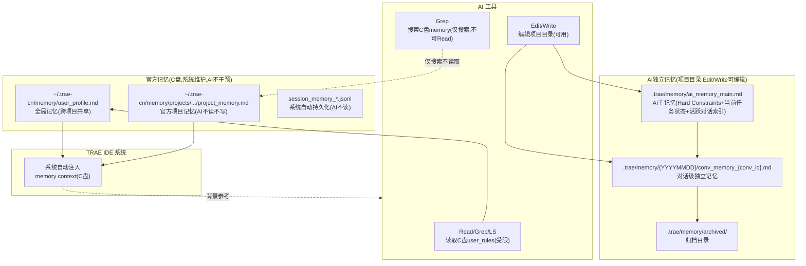
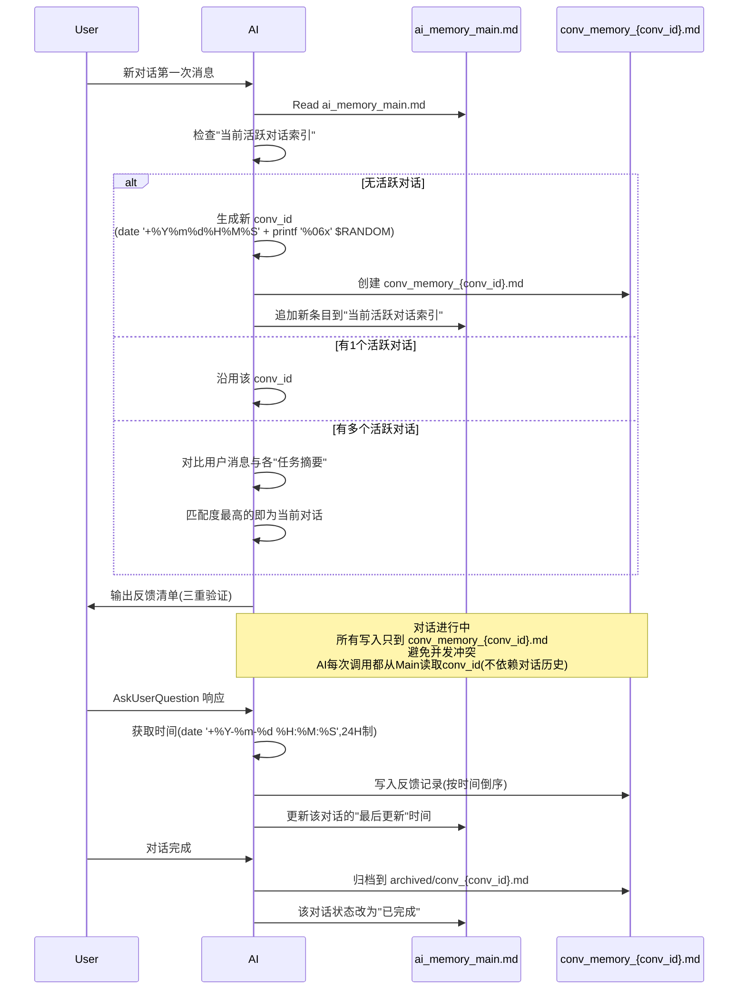

# Design: 项目记忆机制改造

> ⚠️ **重大修订说明（2026-07-27 22:51）**：用户决策废弃 conv_id 机制。AD-02/AD-04 标记废弃，AD-11/AD-14/AD-15 简化。简化方案：所有对话共享 ai_memory_main.md，多任务并发时 AskUserQuestion 确认。本文档保留原 ADR 作为历史记录，但实施以简化方案为准。详见 [tasks.md](./tasks.md)。

## Technical Approach（技术方案）

### 1. 整体架构：AI 独立记忆系统（AD-11）



**架构说明**：
- 官方记忆（C盘）：TRAE IDE 系统维护，AI 不读不写不干预。系统自动注入的 memory context 作为背景参考（P3 优先级）
- AI 独立记忆（项目目录 `.trae/memory/`）：AI 完全自主管理，Edit/Write 可用（P1 权威源）
- 两个系统独立运行，不试图同步、不试图替换（AD-11 完全分离原则）

### 2. 对话 ID 生成与生命周期（完整机制，解决一致性核心痛点）

> 🔧 **简化方案（2026-07-27 22:51）**：本章节原 conv_id 机制设计已废弃（AD-02/AD-04 Deprecated）。原因：闭环漏洞——三对话并发压缩恢复场景无法判断当前 conv_id；AI 无状态无法可靠生成/沿用 conv_id。简化方案：所有对话共享 ai_memory_main.md，多任务并发时 AskUserQuestion 询问用户当前窗口处理哪个任务。下方保留原设计作为历史记录。



**对话 ID 持久化机制（3处，确保可靠）**：
1. **P1 主持久化**：`ai_memory_main.md` 的"当前活跃对话索引"字段（支持多任务并发，列表形式）
2. **P2 文件系统持久化**：`conv_memory_{conv_id}.md` 文件名（文件存在即表示对话存在）
3. **P3 自描述持久化**：`conv_memory_{conv_id}.md` 文件内首行"对话元信息"包含 conv_id

**关键设计**：conv_id 不依赖对话历史（压缩后会丢失），而是通过文件持久化。AI 每次调用时从 ai_memory_main.md 读取活跃对话索引获取 conv_id。

### 3. 数据分工（AD-11 完全分离）

| 数据类型 | 官方位置(C盘) | AI独立记忆(项目目录) |
|---------|--------------|-------------------|
| user_profile.md | ✅ 主记忆(全局共享,AI只读) | ❌ 不复制 |
| Hard Constraints | ❌ AI不写 | ✅ 主记忆(ai_memory_main.md) |
| 用户反馈与决策记录 | ❌ AI不写 | ✅ 详细记录(conv_memory) |
| 当前任务状态 | ❌ AI不写 | ✅ 主记忆(ai_memory_main.md) |
| 活跃对话索引 | ❌ AI不写 | ✅ 主记忆(ai_memory_main.md) |
| archived_feedback/ | ✅ 保留(历史,不迁移) | ✅ 新归档(archived/feedback/) |
| session_memory_*.jsonl | ✅ 系统自动持久化(AI不读) | ❌ 不复制 |
| project_memory.md | ✅ 保留(标记deprecated) | ❌ 不读写 |

## Architecture Decisions（架构决策）

### AD-01: 双轨制存储（已被 AD-11 替代）
- **Status**: Deprecated（被 AD-11 替代）
- **Superseded-by**: AD-11
- **历史**: 原方案为双轨制（官方索引+项目主记忆），用户 2026-07-26 否定，要求完全分离

### AD-02: ~~对话 ID 格式与生成时机（完整修订，解决一致性痛点）~~ 【Deprecated 2026-07-27 22:51】

> 🔧 **已废弃**：用户决策废弃 conv_id 机制。原因：闭环漏洞——三对话并发压缩恢复场景无法判断当前 conv_id；AI 无状态无法可靠生成/沿用 conv_id。简化方案：不生成 conv_id，多任务并发时 AskUserQuestion 询问用户。下方保留原 ADR 作为历史记录。
- **Context**: AI 无状态，无法直接获取 TRAE 运行时分配的 session_id；且 conv_id 需要在对话中保持一致、压缩恢复后可获取
- **Concern**: 如何为每个对话生成唯一标识、在整个对话中保持一致、压缩恢复后仍可获取
- **Decision**:
  1. **格式**：`conv-{YYYYMMDDHHmmss}-{6位hex}`（如 `conv-20260727222000-a3b4c5`）
  2. **生成时机**：对话第一次用户消息时（AI 检测到 ai_memory_main.md 无活跃对话，或活跃对话均已完成）
  3. **生成方法**：`date '+%Y%m%d%H%M%S'` + `printf '%06x' $RANDOM`（gitbash 兼容）
  4. **持久化机制（3处，不依赖对话历史）**：
     - P1 主持久化：`ai_memory_main.md` 的"当前活跃对话索引"字段
     - P2 文件系统持久化：`conv_memory_{conv_id}.md` 文件名
     - P3 自描述持久化：`conv_memory_{conv_id}.md` 文件内首行元信息
  5. **AI 每次调用获取 conv_id 流程**：
     - Read ai_memory_main.md → 检查"当前活跃对话索引"
     - 若有1个活跃对话 → 沿用该 conv_id
     - 若有多个活跃对话 → 对比用户消息与各"任务摘要"，匹配度最高的即为当前对话
     - 若无活跃对话 → 生成新 conv_id，追加到索引
  6. **压缩恢复时获取 conv_id**：从 ai_memory_main.md 读取（不依赖对话历史）
- **Goal**: 对话级隔离，避免多任务并发冲突；conv_id 不依赖对话历史，压缩恢复可可靠获取
- **Tradeoff**: conv_id 依赖 ai_memory_main.md 文件存在；文件损坏风险通过 .bak 备份缓解
- **Status**: Accepted（2026-07-27 修订，解决用户质疑的一致性问题）

### AD-03: 官方位置 project_memory.md 瘦身（已被 AD-11 替代）
- **Status**: Deprecated（被 AD-11 替代）
- **历史**: 原方案为官方位置瘦身为索引，AD-11 改为 AI 不动官方位置
- **现状**: 官方 project_memory.md 保留原样，标记为 deprecated，AI 不读不写

### AD-04: ~~对话级独立文件隔离~~ 【Deprecated 2026-07-27 22:51】

> 🔧 **已废弃**：废弃 conv_id 后无对话级文件，所有对话共享 ai_memory_main.md，靠 Edit 串行化 + old_string 匹配保证安全。下方保留原 ADR 作为历史记录。
- **Context**: 多对话并发写同一 project_memory.md 会互相覆盖
- **Concern**: 如何避免并发写入冲突
- **Decision**: 每个对话独立 `conv_memory_{conv_id}.md` 文件，对话内只 Edit 自己的文件
- **Goal**: 彻底消除并发写入冲突
- **Tradeoff**: 跨对话状态共享需通过 ai_memory_main.md 的"活跃对话索引"协调
- **Status**: Accepted

### AD-05: user_profile.md 不迁移
- **Context**: user_profile.md 是全局记忆，跨项目共享
- **Concern**: 是否一并迁移到项目目录
- **Decision**: 不迁移，保留官方位置（C盘 ~/.trae-cn/memory/user_profile.md）
- **Goal**: 保留全局记忆跨项目共享能力
- **Tradeoff**: user_profile.md 编辑仍需 PowerShell 间接写入（但变更频率低，可接受）；AI 只读不写
- **Status**: Accepted

### AD-06: 旧记忆一次性迁移
- **Context**: 现有 C盘 project_memory.md 包含大量历史数据
- **Concern**: 迁移过程如何处理旧数据
- **Decision**: 一次性迁移——用 Grep 分段读取 C盘 project_memory.md（Read 受限），拆分到 ai_memory_main.md + archived/feedback/legacy_{YYYYMMDD}.md
- **Goal**: 平滑迁移，不丢失历史数据
- **Tradeoff**: 迁移期需人工确认数据完整性；C盘 Read 受限增加迁移复杂度
- **Status**: Accepted

### AD-07: 强制时间戳获取规范（修订，兼容 gitbash）
- **Context**: 用户反馈"使用的获取时间工具有问题，并且还不是24小时制的"——铁证：2026-07-26 真实时间 10:38，但项目记忆记录 `[2026-07-26 12:00]`（比当前时间晚1小时22分，不可能）
- **Concern**: 时间戳错乱导致 AI 压缩恢复时无法准确判断"当前任务进度"
- **Decision**:
  1. **禁止使用 mcp_Time**（时区处理有问题，返回 `+08:00` 但时间值不准）
  2. **禁止使用12H制**（容易把上午/下午混淆）
  3. **强制使用兼容命令**（2026-07-27 修订，原 AD-07 强制 PowerShell 但 gitbash 不可用）：
     - gitbash: `date '+%Y-%m-%d %H:%M:%S'`（已验证24H制准确）
     - PowerShell: `Get-Date -Format 'yyyy-MM-dd HH:mm:ss'`（PowerShell 终端可用）
  4. **写入前时间合理性校验**：新时间戳必须 >= 已有最新时间戳，否则报错并使用真实时间
  5. **每次写入前重新获取时间**：禁止缓存时间戳（避免跨多次AI调用时间漂移）
  6. **相对日期必须转绝对日期**（2026-07-27 追加，借鉴 Claude Code）：如"下周三"→`2026-08-03`
- **Goal**: 消除时序错乱，确保压缩恢复时任务进度准确
- **Tradeoff**: 每次写入前需多一次时间获取（成本极低）
- **Status**: Accepted（2026-07-27 修订）

### AD-08: 增量归档机制
- **Context**: 用户反馈"当前项目目录里面项目记忆持续记录内容越来越多，如何归档的问题"
- **Concern**: 主记忆文件持续增长导致检索效率下降、上下文占用过大
- **Decision**:
  1. **按时间归档**：用户反馈超过7天自动归档到 `archived/feedback/YYYYMM.md`
  2. **按容量归档**：`ai_memory_main.md` 超过 50KB 触发归档（旧反馈移至 `archived/main_history_{YYYYMMDD}.md`）
  3. **对话级归档**：对话完成时 `conv_memory_{conv_id}.md` 移至 `archived/conv_{conv_id}.md`
  4. **永不归档**：Hard Constraints（永久保留）+ 当前任务状态（永久保留）+ 活跃对话索引（活跃期保留）
  5. **归档触发时机**：对话启动时检查（每次新对话开始时检查归档条件）
  6. **定期整理机制**（2026-07-27 追加，借鉴 Claude Code Auto Dream）：每次对话启动时合并冲突记忆、删除无效笔记
- **Goal**: 控制主记忆文件大小，提升检索效率，保留历史可追溯
- **Tradeoff**: 需定期执行归档操作（每次对话启动时自动检查，成本极低）
- **Status**: Accepted

### AD-09: 全局规范适配性改造
- **Context**: 用户反馈"要考虑当前项目全局规范的适配性改造"
- **Concern**: 新机制需要适配 user_rules/ 下所有规范文件 + docs/project-rules/ 项目级规范
- **Decision**:
  1. **全局规范（~/.trae-cn/user_rules/）- 共10个文件**：
     - 🔴 **直接适配（3个）**：context-recovery.md / core-spec.md / user_rules.md
     - 🟡 **间接适配（3个）**：concurrent-editing.md / budget-management.md / danger-ops.md
     - ⚪ **无需适配（4个）**：coding-philosophy.md / complex-task.md / openspec-workflow.md / output-safety.md
  2. **项目级规范（docs/project-rules/）- 3个文件**：
     - logging-during-refactoring.md / version-delivery-sync.md / spec-sedimentation-mechanism.md
  3. **项目主规范**：AGENTS.md
  4. **适配原则**：
     - 全局规范保留在 `~/.trae-cn/user_rules/`（不迁移，跨项目共享）
     - 直接适配：更新路径引用为 `.trae/memory/`（去掉 project key）
     - 间接适配：在原条款后追加"补充说明"，不删除原条款
     - 标注格式：`[memory-mechanism-redesign 补充 - 2026-07-27]`
     - 条件触发语句："若项目启用 AI 独立记忆系统（.trae/memory/ 存在），则..."
- **Goal**: 确保新机制与全局规范一致，AI 行为统一
- **Tradeoff**: 需更新10个规范文件，但采用"追加补充"方式最小破坏
- **Status**: Accepted

### AD-10: 与官方项目记忆不冲突保证（已被 AD-11 替代）
- **Status**: Deprecated（被 AD-11 替代）
- **历史**: 原方案为双轨制共存保证，AD-11 改为完全分离，自然不冲突

### AD-11: 方案重构 - AI 独立记忆系统（用户2026-07-26反馈，重大方向调整）
- **Context**: 用户明确表态"官方记官方的，我们自己记录我们的就好"——否定双轨制（AD-01/AD-03/AD-10），要求 AI 建立完全独立的记忆系统
- **Concern**: 如何在不修改官方记忆的前提下，建立 AI 自主管理的独立记忆系统
- **Decision**:
  1. **完全分离原则**：
     - 官方记忆（C盘 `~/.trae-cn/memory/`）：TRAE IDE 系统维护，AI 不读不写不干预
     - AI 记忆（项目目录 `.trae/memory/`）：AI 完全自主管理
     - 两个系统独立运行，不试图同步、不试图替换
  2. **AI 记忆存储结构**（2026-07-27 修订，去掉冗余 project key）：
     ```
     .trae/memory/
     ├── ai_memory_main.md              # AI 主记忆（Hard Constraints + 当前任务状态 + 活跃对话索引）
     ├── {YYYYMMDD}/
     │   └── conv_memory_{conv_id}.md   # 对话级独立记忆
     └── archived/                       # 归档目录
         ├── feedback/YYYYMM.md
         ├── main_history_{YYYYMMDD}.md
         └── conv_{conv_id}.md
     ```
  3. **读取流程**（AI 优先读自己的记忆）：
     - 系统注入的 memory context（C盘）→ AI 作为 P3 背景参考，不作为权威源
     - AI 主动读项目目录 `ai_memory_main.md` → 作为 P1 权威源
     - 当前对话 `conv_memory_{conv_id}.md` → P2 详细状态
  4. **写入流程**（AI 只写自己的记忆）：
     - 所有反馈、任务状态、决策 → 写入项目目录
     - 不写 C 盘官方位置（除非用户明确要求）
     - 每个对话只 Edit 自己的 `conv_memory_{conv_id}.md`
  5. **替代 AD-01/AD-03/AD-10**：
     - AD-01（双轨制）→ 替换为 AD-11（独立记忆系统）
     - AD-03（官方位置瘦身）→ 取消（AI 不动官方位置）
     - AD-10（与官方不冲突保证）→ 简化（完全分离，自然不冲突）
- **Goal**: 建立完全独立的 AI 记忆系统，获得 Edit/Write 工作区编辑权限，不干扰官方机制
- **Tradeoff**: 丢失系统注入的官方记忆内容（但 AI 主动读项目目录补偿）
- **Status**: Accepted（替代 AD-01/AD-03/AD-10，2026-07-27 修订路径去掉 project key）

### AD-12: 验证与回滚机制
- **Context**: 用户反馈"缺验证/回滚机制"
- **Concern**: 迁移后如何确保 AI 记忆系统正常工作？失败如何回滚？
- **Decision**:
  1. **验证机制**（4项）：
     - V1: 验证 Edit/Write 可编辑项目目录记忆文件（写入测试文件→读取确认）
     - V2: 验证对话 ID 生成与一致性（生成 conv_id→写入 ai_memory_main.md→重新读取确认一致）
     - V3: 验证多任务并发隔离（模拟2个对话→各自写入→确认不互相覆盖）
     - V4: 验证压缩恢复读取（模拟压缩→读取项目目录主记忆→确认状态正确）
  2. **回滚机制**（3步）：
     - R1: 实施前备份项目目录原有 `.trae/memory/` 内容（如有）到 `.bak`
     - R2: 失败时删除项目目录 `.trae/memory/`，回退到官方单轨
     - R3: 回滚后 AI 重新读取官方位置（系统注入仍正常，未受影响）
  3. **监控机制**（运行期）：
     - 每次对话启动时检查 `ai_memory_main.md` 是否存在
     - 检查文件大小是否异常（>100KB 触发归档）
     - 检查时间戳是否合理（最新时间戳 >= 上次记录）
- **Goal**: 确保迁移可验证、可回滚、可监控
- **Tradeoff**: 增加4项验证+3步回滚+监控逻辑，但提升可靠性
- **Status**: Accepted

### AD-13: 深度集成（2026-07-26 11:09 修订移除 basic-memory）
- **Context**: 用户反馈"缺深度集成"；2026-07-26 11:09 用户反馈"别使用 basicmemory 了，你现在玩不明白"——移除 basic-memory 集成
- **Concern**: AI 独立记忆系统如何与现有机制（OpenSpec / session_memory）集成？
- **Decision**:
  1. **~~basic-memory MCP 集成~~（已移除）**：
     - **替代方案**：AI 记忆完全自主，不依赖任何外部 MCP 记忆工具
  2. **OpenSpec 工作流集成**：
     - OpenSpec 任务的反馈写入项目目录 `conv_memory_{conv_id}.md`
     - OpenSpec 设计文档路径在 `ai_memory_main.md` 中记录
     - OpenSpec 检查点响应写入项目目录
  3. **session_memory_*.jsonl 集成**：
     - 系统自动持久化的 jsonl 文件不干预（TRAE IDE 维护）
     - AI 不读取 jsonl 文件（用项目目录主记忆替代）
     - jsonl 文件作为系统级备份，不作为 AI 读取源
  4. **user_profile.md 集成**：
     - 全局记忆保留官方位置（C盘），跨项目共享
     - AI 读取 user_profile.md 作为背景参考
     - 项目级偏好写入项目目录 `ai_memory_main.md`
  5. **AskUserQuestion 响应集成**：
     - 响应后写入项目目录 `conv_memory_{conv_id}.md`
     - 同时更新 `ai_memory_main.md` 的活跃对话索引
- **Goal**: AI 独立记忆系统与现有机制无缝集成（不依赖 basic-memory）
- **Tradeoff**: 移除 basic-memory 后，跨会话经验索引能力减弱，但 AI 记忆完全自主，无外部依赖
- **Status**: Accepted

### AD-14: 任务级记忆记录机制
- **Context**: 用户问"你打算如何记录任务级的项目记忆，就是你问我我回答的内容"
- **Concern**: AskUserQuestion 响应如何记录？任务状态如何流转？多任务并发如何隔离？
- **Decision**:
  1. **conv_memory_{conv_id}.md 文件结构**（标准化模板）：
     ```markdown
     # 对话级记忆 {conv_id}
     
     ## 对话元信息
     - conv_id: conv-{YYYYMMDDHHmmss}-{6位hex}
     - 启动时间: {时间戳24H制}
     - 任务摘要: {一句话描述}
     - 状态: 进行中/已完成/已归档
     - 关联设计文档: {路径}
     
     ## 任务列表（本对话处理的任务）
     - [ ] 任务1: {描述} (状态: 设计中/实施中/已完成)
     - [x] 任务2: {描述} (状态: 已完成, 完成时间: {时间戳})
     
     ## 用户反馈与决策记录（按时间倒序，最新在最前）
     ### [{时间戳}] {类型}
     - **问题**: {复述问题}
     - **用户选择**: {选项}
     - **附加意见**: {Other 输入}
     - **影响**: {1.xxx 2.xxx}
     
     ## 关键决策（ADR）
     - AD-XX: {决策摘要}
     
     ## 待办事项
     - [ ] {待办1}
     ```
  2. **任务级记忆格式**（AskUserQuestion 响应标准格式）：
     ```markdown
     ### [{时间戳24H制}] AskUserQuestion 响应
     - **问题**: {完整复述问题}
     - **用户选择**: {选项标签}
     - **附加意见**: {用户 Other 输入原文}
     - **影响**: {编号列表}
     - **写入位置**: conv_memory_{conv_id}.md
     - **同步更新**: ai_memory_main.md 的活跃对话索引
     ```
  3. **任务状态流转机制**：
     - 状态枚举: `设计中 → 设计完成 → 实施中 → 实施完成 → 已验收 → 已归档`
     - 每次状态变更必须记录: `{旧状态} → {新状态}` + 时间戳 + 变更原因
     - 状态变更同步写入: conv_memory + ai_memory_main 的"当前任务状态"字段
  4. **多任务并发隔离**：
     - 每个对话独立 conv_memory 文件（基于 conv_id 隔离）
     - 任务列表只记录本对话处理的任务
     - 跨对话任务状态通过 ai_memory_main 的"活跃对话索引"协调
  5. **写入时机**（强制）：
     - AskUserQuestion 响应后立即写入（不等待任务完成）
     - 任务状态变更时立即写入
     - 关键决策（ADR）确定后立即写入
  6. **压缩前状态传递**（2026-07-27 追加，借鉴 Cline new_task）：
     - 上下文>50%时主动传递结构化上下文到 conv_memory
     - 写入"压缩前检查点"字段：当前任务+已完成项+待办项+关键决策
- **Goal**: 标准化任务级记忆记录，确保 AskUserQuestion 响应不丢失
- **Tradeoff**: conv_memory 文件结构稍复杂，但提升可读性和可恢复性
- **Status**: Accepted

### AD-15: 压缩恢复防错乱机制
- **Context**: 用户担心"压缩上下文之后你的恢复机制不会导致任务级的记忆错乱情况"
- **Concern**: 压缩后 AI 如何准确恢复任务状态？如何防止错乱？
- **Decision**:
  1. **恢复优先级**（三级）：
     - **P1 第一优先级**: `ai_memory_main.md` 的"当前任务状态"字段（权威源）
     - **P2 第二优先级**: 当前对话 `conv_memory_{conv_id}.md`（详细状态）
     - **P3 第三优先级**: 系统注入的 memory context（C盘，背景参考）
  2. **ai_memory_main.md 的"当前任务状态"字段设计**：
     ```markdown
     ## 当前任务状态（压缩恢复第一权威源）
     
     ### 当前活跃对话索引（支持多任务并发）
     
     #### 对话1
     - conv_id: conv-{YYYYMMDDHHmmss}-{6位hex}
     - 任务: {任务描述}
     - 阶段: {当前阶段}
     - 启动时间: {时间戳24H制}
     - 最后更新: {时间戳24H制}
     - 状态: 进行中
     
     ### 任务进度
     - [x] 已完成项1: {描述}
     - [ ] 待实施项1: {描述}
     
     ### 压缩恢复检查点
     - 上次压缩时间: {时间戳}
     - 上次压缩时任务状态: {状态摘要}
     - 恢复时必须读取:
       1. ai_memory_main.md（本文件）
       2. conv_memory_{conv_id}.md（当前对话）
       3. AGENTS.md（项目主规范）
       4. TaskList（任务列表）
     - 恢复后必须执行: AskUserQuestion 确认当前任务
     ```
  3. **防错乱机制**（5项校验）：
     - **C1 时间戳校验**: 恢复时读取最新时间戳，对比当前真实时间，确保合理（不能晚于当前时间）
     - **C2 conv_id 校验**: 恢复时从 ai_memory_main.md 读取 conv_id（不依赖对话历史）
     - **C3 状态字段校验**: 恢复时读取"当前任务状态"字段，确保非空且包含必需字段
     - **C4 多源对比**: ai_memory_main + conv_memory + 系统注入，三方对比确保一致
     - **C5 旧消息识别**: 对比用户最新消息与"当前任务状态"字段，若不符则用 AskUserQuestion 确认
  4. **恢复流程**（详细7步）：
     ```
     步骤1: Read ai_memory_main.md → 获取"当前任务状态"字段
     步骤2: 提取 conv_id（从"当前活跃对话索引"）→ Read 对应 conv_memory_{conv_id}.md
     步骤3: Read AGENTS.md（项目主规范）
     步骤4: Read TaskList（任务列表，唯一权威源）
     步骤5: 对比用户最新消息 → 判断续接 or 新对话
            - 续接: 沿用 conv_id，继续任务
            - 新对话: 生成新 conv_id，创建新 conv_memory
     步骤6: 执行5项校验（C1-C5）
     步骤7: 输出三重验证清单 → AskUserQuestion 确认当前任务
     ```
  5. **错乱处理预案**：
     - 若 C1 时间戳不合理: 标记为"时间戳异常"，用真实时间覆盖
     - 若 C2 conv_id 不一致: 询问用户确认当前对话
     - 若 C3 状态字段缺失: 从 conv_memory 重建状态
     - 若 C4 多源不一致: 以 ai_memory_main 为准，记录差异
     - 若 C5 旧消息: 用 AskUserQuestion 确认，不直接执行旧消息
- **Goal**: 确保压缩恢复后任务状态准确，不错乱；conv_id 从文件获取，不依赖对话历史
- **Tradeoff**: 恢复流程增加5项校验，但确保可靠性
- **Status**: Accepted

### AD-16: "记忆只是提示"原则（2026-07-27 新增，借鉴 Claude Code）
- **Context**: 研究 Claude Code 发现"记忆只是提示"原则能降低幻觉
- **Concern**: AI 可能凭记忆产生幻觉，不核对真实代码
- **Decision**: ai_memory_main.md 顶部声明"本记忆为线索，行动前必须核对真实代码/文件"
- **Goal**: 降低凭记忆产生幻觉的概率
- **Tradeoff**: 行动前多一次核对，但提升准确性
- **Status**: Accepted

### AD-17: "只记上下文无法派生的认知"原则（2026-07-27 新增，借鉴 Claude Code）
- **Context**: 研究 Claude Code 发现"只记无法派生的认知"能避免冗余
- **Concern**: 记忆冗余 + 过期风险
- **Decision**: 写入前筛检"是否能通过读代码重新得到"，能则不写
- **Goal**: 避免记忆冗余和过期风险
- **Tradeoff**: 写入前多一次筛检，但减少记忆体积
- **Status**: Accepted

### AD-18: 4类记忆分类（2026-07-27 新增，借鉴 Claude Code）
- **Context**: Claude Code 的 user/feedback/project/reference 分类更语义化
- **Concern**: 记忆分类不够语义化，检索效率低
- **Decision**: ai_memory_main.md 内容按四类组织（user/feedback/project/reference）
- **Goal**: 语义化分类提升检索效率
- **Tradeoff**: 需重构 ai_memory_main.md 结构，但提升可读性
- **Status**: Accepted（可延后实施，先完成核心改造）

### AD-19: 索引文件200行限制（2026-07-27 新增，借鉴 Claude Code）
- **Context**: MEMORY.md 200行限制控制上下文占用
- **Concern**: 主记忆无限增长
- **Decision**: ai_memory_main.md 限制200行，超出移至主题文件
- **Goal**: 控制上下文占用
- **Tradeoff**: 需定期归档，但控制上下文预算
- **Status**: Accepted

### AD-20: 版本控制集成（2026-07-27 新增，借鉴 Cline/Claude Code）
- **Context**: 记忆文件进 Git 可追溯
- **Concern**: 记忆不可追溯，无法回滚
- **Decision**: `.trae/memory/` 纳入 Git 管理（除敏感信息，通过 .gitignore 排除）
- **Goal**: 可追溯、可回滚
- **Tradeoff**: 敏感反馈可能泄露 Git，需通过 .gitignore 排除 conv_memory 中的敏感内容
- **Status**: Proposed（需权衡敏感信息泄露风险，建议 .gitignore 排除 conv_memory，仅纳入 ai_memory_main.md）

## Data Flow（数据流）

### 写入流程（用户反馈持久化）
```
AskUserQuestion 响应
  ↓
1. 获取当前时间(date '+%Y-%m-%d %H:%M:%S', 24H制)
  ↓
2. 写入 conv_memory_{conv_id}.md(按时间倒序)
  ↓
3. 更新 ai_memory_main.md 的"活跃对话索引"中该对话的"最后更新"时间
  ↓
4. (对话完成时)归档 conv_memory 到 archived/conv/
```

### 读取流程（压缩恢复五件套，AD-11 完全分离）
```
1. AGENTS.md(项目主规范,工作区直接读)
2. .trae/memory/ai_memory_main.md(AI主记忆,P1权威源,Edit可读)
3. .trae/memory/{YYYYMMDD}/conv_memory_{conv_id}.md(对话级,P2详细状态)
4. TaskList(任务列表,唯一权威源)
5. 系统注入的memory context(C盘,P3背景参考,不作权威源)
  ↓
输出三重验证清单 → AskUserQuestion 确认当前任务
```

## File Changes（文件变更）

### 新增文件
| 文件 | 位置 | 用途 |
|------|------|------|
| ai_memory_main.md | .trae/memory/ | AI主记忆(Hard Constraints+当前任务状态+活跃对话索引) |
| conv_memory_{conv_id}.md | .trae/memory/{YYYYMMDD}/ | 对话级独立记忆 |
| archived/feedback/legacy_{YYYYMMDD}.md | .trae/memory/archived/feedback/ | 旧反馈归档 |
| archived/conv_{conv_id}.md | .trae/memory/archived/ | 对话归档 |

### 修改文件（规范同步）
| 文件 | 变更内容 |
|------|---------|
| ~/.trae-cn/user_rules/context-recovery.md | 五件套路径更新(改为 .trae/memory/ai_memory_main.md) + conv_id机制 + 时间戳规范 |
| ~/.trae-cn/user_rules/core-spec.md | 追加 conv_id 机制 + 路径配置 |
| ~/.trae-cn/user_rules/user_rules.md | 第8行明确路径(.trae/memory/) + 禁 mcp_Time + 强制 date/PowerShell |
| ~/.trae-cn/user_rules/concurrent-editing.md | 追加"对话级文件隔离"条款 |
| ~/.trae-cn/user_rules/budget-management.md | 追加"归档触发"+"缓存路径"条款 |
| ~/.trae-cn/user_rules/danger-ops.md | 追加"记忆文件操作边界"条款 |
| docs/project-rules/logging-during-refactoring.md | 追加反馈日志写入 conv_memory |
| docs/project-rules/version-delivery-sync.md | 追加版本交付同步检查 ai_memory_main.md |
| docs/project-rules/spec-sedimentation-mechanism.md | 追加错误沉淀写入 conv_memory + 归档触发 |
| AGENTS.md | 项目记忆章节同步(AD-11独立记忆系统+AD-14任务级+AD-15防错乱+路径配置) |
| docs/INDEX.md | 新增本设计文档索引 |

### 不变文件
- user_profile.md（保留官方位置，跨项目共享，AI 只读）
- C盘 archived_feedback/（保留现有归档机制）
- C盘 session_memory_*.jsonl（系统自动持久化，不干预）
- C盘 project_memory.md（保留原样，标记 deprecated，AI 不读不写）

## 风险与缓解

| 风险 | 影响 | 缓解措施 |
|------|------|---------|
| 丢失系统注入 | TRAE IDE 注入 C盘内容，AI 不读 | AI 主动读项目目录 ai_memory_main.md 作为 P1 权威源补偿 |
| 对话 ID 依赖文件持久化 | ai_memory_main.md 损坏导致 conv_id 丢失 | .bak 备份 + conv_memory 文件名仍可恢复 |
| 多任务并发索引写入冲突 | Edit 并发可能失败 | 时间戳+随机hex 几乎不冲突；失败重试；最坏情况索引丢失，conv_memory 仍存在 |
| 迁移期数据丢失 | 旧记忆未完整迁移 | .bak 备份 + Grep 分段读取 + 行数对比 |
| 时间戳工具问题复发 | 时序错乱 | 禁 mcp_Time + 强制 date/PowerShell + 写入前校验 |
| 敏感反馈泄露 Git | conv_memory 含敏感信息 | .gitignore 排除 conv_memory，仅纳入 ai_memory_main.md（AD-20） |
