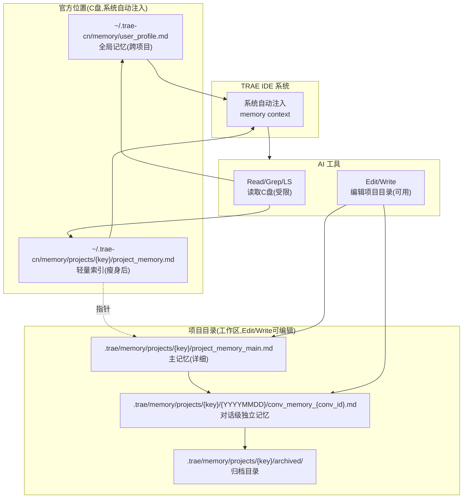
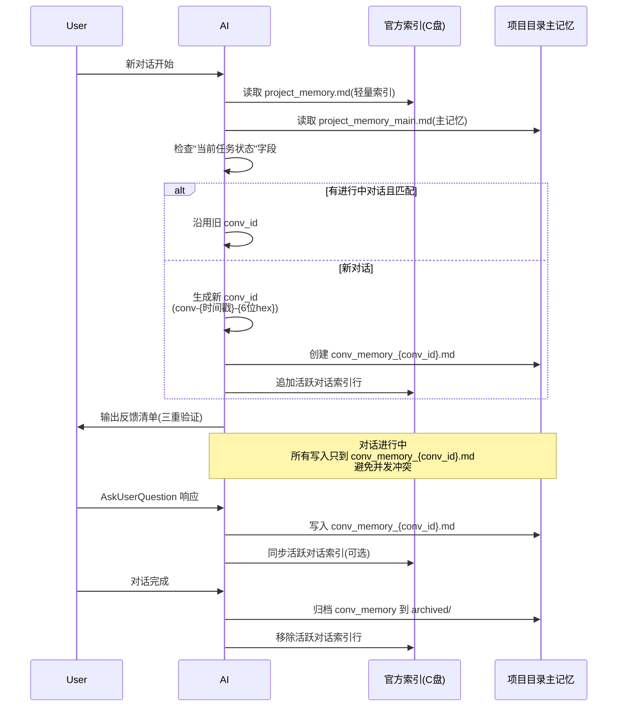

# Design: 项目记忆机制改造

## Technical Approach（技术方案）

### 1. 整体架构：双轨制存储



### 2. 对话 ID 生成与生命周期



### 3. 双轨制数据分工

| 数据类型 | 官方位置(C盘) | 项目目录(工作区) |
|---------|--------------|----------------|
| user_profile.md | ✅ 主记忆(全局共享) | ❌ 不复制 |
| Hard Constraints | ✅ 索引引用 | ✅ 主记忆 |
| 用户反馈与决策记录 | ❌ 仅索引摘要 | ✅ 详细记录(conv_memory) |
| 当前任务状态 | ✅ 索引(conv_id指针) | ✅ 主记忆(详细) |
| 活跃对话索引 | ✅ 主索引 | ✅ 镜像 |
| archived_feedback/ | ✅ 保留(历史) | ✅ 新归档 |
| session_memory_*.jsonl | ✅ 系统自动持久化 | ❌ 不复制 |

## Architecture Decisions（架构决策）

### AD-01: 双轨制存储（选定方案A）
- **Context**: 官方位置在 C 盘，TRAE IDE 系统自动注入 memory context 仅识别官方位置；但 Edit/Write 工具因工作区限制无法编辑 C 盘文件
- **Concern**: 如何兼顾"系统自动注入能力"和"工作区编辑权限"
- **Decision**: 采用双轨制——官方位置保留为轻量索引，项目目录作为重量主记忆
- **Goal**: 保留系统注入能力 + 获得 Edit/Write 工作区编辑权限
- **Tradeoff**: 需维护两份数据，但官方位置仅作索引(轻量)
- **Status**: Proposed

### AD-02: 对话 ID 格式与生成时机
- **Context**: AI 无状态，无法直接获取 TRAE 运行时分配的 session_id
- **Concern**: 如何为每个对话生成唯一标识并保持一致
- **Decision**: 格式 `conv-{YYYYMMDDHHmmss}-{6位hex}`；对话开始时由 AI 主动生成；同一对话内通过历史保持一致
- **Goal**: 对话级隔离，避免多任务并发冲突
- **Tradeoff**: 跨多次 AI 调用依赖对话历史保持一致，压缩恢复时通过"当前任务状态"字段传递
- **Status**: Proposed

### AD-03: 官方位置 project_memory.md 瘦身
- **Context**: 原 project_memory.md 持续增长（Hard Constraints + 反馈记录 + 任务状态混在一起）
- **Concern**: 如何在保留系统注入的同时减轻官方位置负担
- **Decision**: 官方位置瘦身为"索引"——保留 Hard Constraints + 活跃对话索引（对话ID + 任务摘要 + 启动时间）
- **Goal**: 减少官方位置写入频率（仅追加索引行），降低并发冲突概率
- **Tradeoff**: 详细状态需读项目目录主记忆（多一次读取）
- **Status**: Proposed

### AD-04: 对话级独立文件隔离
- **Context**: 多对话并发写同一 project_memory.md 会互相覆盖
- **Concern**: 如何避免并发写入冲突
- **Decision**: 每个对话独立 `conv_memory_{conv_id}.md` 文件，对话内只 Edit 自己的文件
- **Goal**: 彻底消除并发写入冲突
- **Tradeoff**: 跨对话状态共享需通过主 project_memory_main.md 协调
- **Status**: Proposed

### AD-05: user_profile.md 不迁移
- **Context**: user_profile.md 是全局记忆，跨项目共享
- **Concern**: 是否一并迁移到项目目录
- **Decision**: 不迁移，保留官方位置
- **Goal**: 保留全局记忆跨项目共享能力
- **Tradeoff**: user_profile.md 编辑仍需 PowerShell 间接写入（但变更频率低，可接受）
- **Status**: Proposed

### AD-06: 旧记忆一次性迁移
- **Context**: 现有 project_memory.md 包含大量历史数据
- **Concern**: 迁移过程如何处理旧数据
- **Decision**: 一次性迁移——旧 project_memory.md 内容拆分到 project_memory_main.md + archived/legacy_{YYYYMMDD}.md
- **Goal**: 平滑迁移，不丢失历史数据
- **Tradeoff**: 迁移期需人工确认数据完整性
- **Status**: Proposed

### AD-07: 强制时间戳获取规范（用户2026-07-26反馈追加）
- **Context**: 用户反馈"使用的获取时间工具有问题，并且还不是24小时制的，导致项目记忆里面的时序是有严重问题的"——铁证：2026-07-26 真实时间 10:38，但项目记忆记录 `[2026-07-26 12:00]`（比当前时间晚1小时22分，不可能）
- **Concern**: 时间戳错乱导致 AI 压缩恢复时无法准确判断"当前任务进度"，时序错乱频繁且严重
- **Decision**:
  1. **禁止使用 mcp_Time**（时区处理有问题，返回 `+08:00` 但时间值不准）
  2. **禁止使用12H制**（容易把上午/下午混淆）
  3. **强制使用 PowerShell** `Get-Date -Format 'yyyy-MM-dd HH:mm:ss'`（已验证24H制准确）
  4. **写入前时间合理性校验**：新时间戳必须 >= 已有最新时间戳，否则报错并使用真实时间
  5. **每次写入前重新获取时间**：禁止缓存时间戳（避免跨多次AI调用时间漂移）
- **Goal**: 消除时序错乱，确保压缩恢复时任务进度准确
- **Tradeoff**: 每次写入前需多一次 PowerShell 时间获取（成本极低）
- **Status**: Proposed

### AD-08: 增量归档机制（用户2026-07-26反馈追加）
- **Context**: 用户反馈"当前项目目录里面项目记忆持续记录内容越来越多，如何归档的问题"——原设计仅有一次性迁移归档，缺乏运行期增量归档
- **Concern**: 主记忆文件持续增长导致检索效率下降、上下文占用过大
- **Decision**:
  1. **按时间归档**：用户反馈超过7天自动归档到 `archived/feedback/YYYYMM.md`
  2. **按容量归档**：`project_memory_main.md` 超过 50KB 触发归档（旧反馈移至 `archived/main_history_{YYYYMMDD}.md`）
  3. **对话级归档**：对话完成时 `conv_memory_{conv_id}.md` 移至 `archived/conv_{conv_id}.md`
  4. **永不归档**：Hard Constraints（永久保留）+ 当前任务状态（永久保留）+ 活跃对话索引（活跃期保留）
  5. **归档触发时机**：对话启动时检查（每次新对话开始时检查归档条件）
  6. **归档文件命名**：`archived/{type}_{YYYYMMDD}_{seq}.md`（type=feedback/main_history/conv）
- **Goal**: 控制主记忆文件大小，提升检索效率，保留历史可追溯
- **Tradeoff**: 需定期执行归档操作（每次对话启动时自动检查，成本极低）
- **Status**: Proposed

### AD-09: 全局规范适配性改造（用户2026-07-26反馈追加，深度审查后修订）
- **Context**: 用户反馈"要考虑当前项目全局规范的适配性改造"+质疑"你确定你分析的透彻到位吗？考虑全面吗？"——深度审查后发现原清单遗漏3个关键文件
- **Concern**: 新机制需要适配 user_rules/ 下所有规范文件 + docs/project-rules/ 项目级规范，否则规范冲突会导致 AI 行为不一致
- **Decision**:
  1. **深度审查后的完整清单**（10个文件需适配）：
  
     **全局规范（~/.trae-cn/user_rules/）- 共10个文件**：
     - 🔴 **直接适配（3个，含项目记忆路径引用）**：
       - `context-recovery.md`：五件套路径更新 + 时序规则 + 反馈持久化
       - `core-spec.md`：项目记忆路径配置（双轨路径）
       - `user_rules.md`：第10行"用户回复必须第一时间记录到项目记忆中"+"24H制"（**原清单遗漏**）
     - 🟡 **间接适配（3个，无直接路径引用但需追加补充条款）**：
       - `concurrent-editing.md`：追加"对话级文件隔离"条款
       - `budget-management.md`：追加"归档触发"条款
       - `danger-ops.md`：追加"记忆文件备份"条款
     - ⚪ **无需适配（4个）**：
       - `coding-philosophy.md`、`complex-task.md`、`openspec-workflow.md`、`output-safety.md`
  
     **项目级规范（docs/project-rules/）- 3个文件**：
     - 🔴 **直接适配**：
       - `logging-during-refactoring.md`（**原清单遗漏**）
       - `version-delivery-sync.md`（**原清单遗漏**）
       - `spec-sedimentation-mechanism.md`
  
     **项目主规范**：
     - 🔴 `AGENTS.md`：项目记忆章节同步
  
  2. **适配原则**：
     - 全局规范文件保留在 `~/.trae-cn/user_rules/`（不迁移，跨项目共享）
     - 直接适配：更新路径引用为双轨制路径
     - 间接适配：在原条款后追加"双轨制补充说明"，不删除原条款
     - 标注格式：`[双轨制补充 - memory-mechanism-redesign] ...`
  3. **冲突检测**：
     - 实施前 Grep 全局规范+项目级规范中所有"项目记忆路径"引用
     - 已确认：3个全局直接 + 3个全局间接 + 3个项目级直接 + 1个项目主规范 = **10个文件**
- **Goal**: 确保新机制与全局规范一致，AI 行为统一
- **Tradeoff**: 需更新10个规范文件，但采用"追加补充"方式最小破坏
- **Status**: Proposed

### AD-10: 与官方项目记忆不冲突保证（用户2026-07-26反馈追加）
- **Context**: 用户反馈"明确不和官方自带的项目记忆冲突"——官方项目记忆在 `~/.trae-cn/memory/projects/{key}/project_memory.md`，TRAE IDE 系统自动注入
- **Concern**: 新机制（项目目录主记忆）如何与官方机制共存，不冲突
- **Decision**:
  1. **官方位置保留**：`~/.trae-cn/memory/projects/{key}/project_memory.md` 不删除、不破坏
  2. **官方位置角色**：瘦身为"轻量索引"（Hard Constraints + 活跃对话索引 + 指针）
  3. **项目目录角色**：补充主记忆（详细状态 + 对话级文件），不是替代
  4. **系统自动注入不干扰**：TRAE IDE 仍读取官方位置，注入 memory context，AI 行为正常
  5. **AI 主动读取增强**：AI 额外读取项目目录主记忆，获取更详细状态
  6. **数据分工明确**：
     - 官方=轻量索引（Hard Constraints + 活跃对话索引 + 指针）
     - 项目=详细主记忆（用户反馈 + 任务状态 + 对话级文件）
  7. **user_profile.md 完全不动**：全局记忆保留官方位置，跨项目共享不受影响
  8. **冲突检测点**：迁移后验证系统注入的 memory context 仍正常（对比迁移前后系统注入内容）
- **Goal**: 保证与官方机制共存不冲突，TRAE IDE 系统注入能力不受影响
- **Tradeoff**: 双轨制维护成本（已接受，AD-01 已确认）
- **Status**: Superseded by AD-11

### AD-11: 方案重构 - AI 独立记忆系统（用户2026-07-26反馈追加，重大方向调整）
- **Context**: 用户明确表态"官方记官方的，我们自己记录我们的就好"——否定双轨制（AD-01/AD-03/AD-10），要求 AI 建立完全独立的记忆系统
- **Concern**: 如何在不修改官方记忆的前提下，建立 AI 自主管理的独立记忆系统
- **Decision**:
  1. **完全分离原则**：
     - 官方记忆（C盘 `~/.trae-cn/memory/projects/{key}/`）：TRAE IDE 系统维护，AI 不读不写不干预
     - AI 记忆（项目目录 `.trae/memory/projects/{key}/`）：AI 完全自主管理
     - 两个系统独立运行，不试图同步、不试图替换
  2. **AI 记忆存储结构**：
     ```
     .trae/memory/projects/{key}/
     ├── ai_memory_main.md              # AI 主记忆（Hard Constraints + 当前任务状态 + 活跃对话索引）
     ├── {YYYYMMDD}/
     │   └── conv_memory_{conv_id}.md   # 对话级独立记忆
     └── archived/                       # 归档目录
         ├── feedback/YYYYMM.md
         ├── main_history_{YYYYMMDD}.md
         └── conv_{conv_id}.md
     ```
  3. **读取流程**（AI 优先读自己的记忆）：
     - 系统注入的 memory context（C盘）→ AI 作为背景参考，不作为权威源
     - AI 主动读项目目录 `ai_memory_main.md` → 作为权威源
     - 当前对话 `conv_memory_{conv_id}.md` → 对话级详细状态
  4. **写入流程**（AI 只写自己的记忆）：
     - 所有反馈、任务状态、决策 → 写入项目目录
     - 不写 C 盘官方位置（除非用户明确要求）
     - 每个对话只 Edit 自己的 `conv_memory_{conv_id}.md`
  5. **替代 AD-01/AD-03/AD-10**：
     - AD-01（双轨制）→ 替换为 AD-11（独立记忆系统）
     - AD-03（官方位置瘦身）→ 取消（AI 不动官方位置）
     - AD-10（与官方不冲突保证）→ 简化（完全分离，自然不冲突）
- **Goal**: 建立完全独立的 AI 记忆系统，获得 Edit/Write 工作区编辑权限，不干扰官方机制
- **Tradeoff**: 丢失系统注入的官方记忆内容（但 AI 主动读项目目录补偿）
- **Status**: Accepted（替代 AD-01/AD-03/AD-10）

### AD-12: 验证与回滚机制（用户2026-07-26反馈追加）
- **Context**: 用户反馈"缺验证/回滚机制"
- **Concern**: 迁移后如何确保 AI 记忆系统正常工作？失败如何回滚？
- **Decision**:
  1. **验证机制**（4项）：
     - V1: 验证 Edit/Write 可编辑项目目录记忆文件（写入测试文件→读取确认）
     - V2: 验证对话 ID 生成与一致性（生成 conv_id→对话内多次引用→确认一致）
     - V3: 验证多任务并发隔离（模拟2个对话→各自写入→确认不互相覆盖）
     - V4: 验证压缩恢复读取（模拟压缩→读取项目目录主记忆→确认状态正确）
  2. **回滚机制**（3步）：
     - R1: 实施前备份项目目录原有 `.trae/memory/` 内容（如有）到 `.bak`
     - R2: 失败时删除项目目录 `.trae/memory/projects/{key}/`，回退到官方单轨
     - R3: 回滚后 AI 重新读取官方位置（系统注入仍正常，未受影响）
  3. **监控机制**（运行期）：
     - 每次对话启动时检查 `ai_memory_main.md` 是否存在
     - 检查文件大小是否异常（>100KB 触发归档）
     - 检查时间戳是否合理（最新时间戳 >= 上次记录）
- **Goal**: 确保迁移可验证、可回滚、可监控
- **Tradeoff**: 增加4项验证+3步回滚+监控逻辑，但提升可靠性
- **Status**: Proposed

### AD-13: 深度集成（用户2026-07-26反馈追加，2026-07-26 11:09 修订移除 basic-memory）
- **Context**: 用户反馈"缺深度集成"；2026-07-26 11:09 用户反馈"别使用 basicmemory 了，你现在玩不明白"——移除 basic-memory 集成
- **Concern**: AI 独立记忆系统如何与现有机制（OpenSpec / session_memory）集成？
- **Decision**:
  1. **~~basic-memory MCP 集成~~（已移除，用户反馈"玩不明白"）**：
     - ~~basic-memory 作为补充经验索引~~（取消）
     - ~~AI 记忆 + basic-memory 双写~~（取消）
     - **替代方案**：AI 记忆完全自主，不依赖任何外部 MCP 记忆工具
  2. **OpenSpec 工作流集成**：
     - OpenSpec 任务的反馈写入项目目录 `conv_memory_{conv_id}.md`
     - OpenSpec 设计文档路径在 `ai_memory_main.md` 中记录
     - OpenSpec 检查点响应写入项目目录
  3. **session_memory_*.jsonl 集成**：
     - 系统自动持久化的 jsonl 文件不干预（TRAE IDE 维护）
     - AI 不读取 jsonl 文件（用项目目录主记忆替代）
     - jsonl 文件作为系统级备份，不作为 AI 读取源
  4. **user_profile.md 集成**：
     - 全局记忆保留官方位置（C盘），跨项目共享
     - AI 读取 user_profile.md 作为背景参考
     - 项目级偏好写入项目目录 `ai_memory_main.md`
  5. **AskUserQuestion 响应集成**：
     - 响应后写入项目目录 `conv_memory_{conv_id}.md`
     - 同时更新 `ai_memory_main.md` 的活跃对话索引
- **Goal**: AI 独立记忆系统与现有机制无缝集成（不依赖 basic-memory）
- **Tradeoff**: 移除 basic-memory 后，跨会话经验索引能力减弱，但 AI 记忆完全自主，无外部依赖
- **Status**: Proposed（已修订）

### AD-14: 任务级记忆记录机制（用户2026-07-26反馈追加，核心痛点）
- **Context**: 用户问"你打算如何记录任务级的项目记忆，就是你问我我回答的内容"——之前设计只提到 conv_memory 文件，未详细说明任务级记忆的记录格式
- **Concern**: AskUserQuestion 响应如何记录？任务状态如何流转？多任务并发如何隔离？
- **Decision**:
  1. **conv_memory_{conv_id}.md 文件结构**（标准化模板）：
     ```markdown
     # 对话级记忆 {conv_id}
     
     ## 对话元信息
     - conv_id: conv-{YYYYMMDDHHmmss}-{6位hex}
     - 启动时间: {时间戳24H制}
     - 任务摘要: {一句话描述}
     - 状态: 进行中/已完成/已归档
     - 关联设计文档: {路径}
     
     ## 任务列表（本对话处理的任务）
     - [ ] 任务1: {描述} (状态: 设计中/实施中/已完成)
     - [x] 任务2: {描述} (状态: 已完成, 完成时间: {时间戳})
     
     ## 用户反馈与决策记录（按时间倒序，最新在最前）
     ### [{时间戳}] {类型}
     - **问题**: {复述问题}
     - **用户选择**: {选项}
     - **附加意见**: {Other 输入}
     - **影响**: {1.xxx 2.xxx}
     
     ## 关键决策（ADR）
     - AD-XX: {决策摘要}
     
     ## 待办事项
     - [ ] {待办1}
     ```
  2. **任务级记忆格式**（AskUserQuestion 响应标准格式）：
     ```markdown
     ### [{时间戳24H制}] AskUserQuestion 响应
     - **问题**: {完整复述问题}
     - **用户选择**: {选项标签}
     - **附加意见**: {用户 Other 输入原文}
     - **影响**: {编号列表}
     - **写入位置**: conv_memory_{conv_id}.md
     - **同步更新**: ai_memory_main.md 的活跃对话索引
     ```
  3. **任务状态流转机制**：
     - 状态枚举: `设计中 → 设计完成 → 实施中 → 实施完成 → 已验收 → 已归档`
     - 每次状态变更必须记录: `{旧状态} → {新状态}` + 时间戳 + 变更原因
     - 状态变更同步写入: conv_memory + ai_memory_main 的"当前任务状态"字段
  4. **多任务并发隔离**：
     - 每个对话独立 conv_memory 文件（基于 conv_id 隔离）
     - 任务列表只记录本对话处理的任务
     - 跨对话任务状态通过 ai_memory_main 的"活跃对话索引"协调
  5. **写入时机**（强制）：
     - AskUserQuestion 响应后立即写入（不等待任务完成）
     - 任务状态变更时立即写入
     - 关键决策（ADR）确定后立即写入
- **Goal**: 标准化任务级记忆记录，确保 AskUserQuestion 响应不丢失
- **Tradeoff**: conv_memory 文件结构稍复杂，但提升可读性和可恢复性
- **Status**: Proposed

### AD-15: 压缩恢复防错乱机制（用户2026-07-26反馈追加，核心痛点）
- **Context**: 用户担心"压缩上下文之后你的恢复机制不会导致任务级的记忆错乱情况"——时序错乱问题（AD-07）的延伸，需确保压缩恢复后任务状态准确
- **Concern**: 压缩后 AI 如何准确恢复任务状态？如何防止错乱？
- **Decision**:
  1. **恢复优先级**（三级）：
     - **P1 第一优先级**: `ai_memory_main.md` 的"当前任务状态"字段（权威源）
     - **P2 第二优先级**: 当前对话 `conv_memory_{conv_id}.md`（详细状态）
     - **P3 第三优先级**: 系统注入的 memory context（C盘，背景参考）
  2. **ai_memory_main.md 的"当前任务状态"字段设计**：
     ```markdown
     ## 当前任务状态（压缩恢复第一权威源）
     
     ### 当前活跃对话
     - conv_id: conv-{YYYYMMDDHHmmss}-{6位hex}
     - 任务: {任务描述}
     - 阶段: {当前阶段}
     - 启动时间: {时间戳24H制}
     - 最后更新: {时间戳24H制}
     
     ### 任务进度
     - [x] 已完成项1: {描述}
     - [ ] 待实施项1: {描述}
     
     ### 压缩恢复检查点
     - 上次压缩时间: {时间戳}
     - 上次压缩时任务状态: {状态摘要}
     - 恢复时必须读取:
       1. ai_memory_main.md（本文件）
       2. conv_memory_{conv_id}.md（当前对话）
       3. AGENTS.md（项目主规范）
       4. TaskList（任务列表）
     - 恢复后必须执行: AskUserQuestion 确认当前任务
     ```
  3. **防错乱机制**（5项校验）：
     - **C1 时间戳校验**: 恢复时读取最新时间戳，对比当前真实时间，确保合理（不能晚于当前时间）
     - **C2 conv_id 校验**: 恢复时读取 conv_id，与对话历史对比，确保一致
     - **C3 状态字段校验**: 恢复时读取"当前任务状态"字段，确保非空且包含必需字段
     - **C4 多源对比**: ai_memory_main + conv_memory + 系统注入，三方对比确保一致
     - **C5 旧消息识别**: 对比用户最新消息与"当前任务状态"字段，若不符则用 AskUserQuestion 确认
  4. **恢复流程**（详细7步）：
     ```
     步骤1: 读取 ai_memory_main.md → 获取"当前任务状态"字段
     步骤2: 提取 conv_id → 读取对应 conv_memory_{conv_id}.md
     步骤3: 读取 AGENTS.md（项目主规范）
     步骤4: 读取 TaskList（任务列表，唯一权威源）
     步骤5: 对比用户最新消息 → 判断续接 or 新对话
            - 续接: 沿用 conv_id，继续任务
            - 新对话: 生成新 conv_id，创建新 conv_memory
     步骤6: 执行5项校验（C1-C5）
     步骤7: 输出三重验证清单 → AskUserQuestion 确认当前任务
     ```
  5. **错乱处理预案**：
     - 若 C1 时间戳不合理: 标记为"时间戳异常"，用真实时间覆盖
     - 若 C2 conv_id 不一致: 询问用户确认当前对话
     - 若 C3 状态字段缺失: 从 conv_memory 重建状态
     - 若 C4 多源不一致: 以 ai_memory_main 为准，记录差异
     - 若 C5 旧消息: 用 AskUserQuestion 确认，不直接执行旧消息
- **Goal**: 确保压缩恢复后任务状态准确，不错乱
- **Tradeoff**: 恢复流程增加5项校验，但确保可靠性
- **Status**: Proposed

## Data Flow（数据流）

### 写入流程（用户反馈持久化）
```
AskUserQuestion 响应
  ↓
1. 获取当前时间(24H制)
  ↓
2. 写入 conv_memory_{conv_id}.md(按时间倒序)
  ↓
3. (可选)同步官方位置索引的活跃对话行
  ↓
4. (对话完成时)归档 conv_memory 到 archived/
```

### 读取流程（压缩恢复五件套）
```
1. AGENTS.md(项目主规范,工作区直接读)
2. 官方位置 project_memory.md(轻量索引,Grep读取)
3. 项目目录 project_memory_main.md(主记忆,Edit可读)
4. TaskList(任务列表)
5. 当前 conv_memory_{conv_id}.md(对话级,Read读取)
  ↓
输出三重验证清单 → AskUserQuestion 确认当前任务
```

## File Changes（文件变更）

### 新增文件
| 文件 | 位置 | 用途 |
|------|------|------|
| project_memory_main.md | .trae/memory/projects/{key}/ | 主记忆(替代原 project_memory.md 详细内容) |
| conv_memory_{conv_id}.md | .trae/memory/projects/{key}/{YYYYMMDD}/ | 对话级独立记忆 |
| archived/legacy_{YYYYMMDD}.md | .trae/memory/projects/{key}/archived/ | 旧记忆归档 |

### 修改文件（规范同步）
| 文件 | 变更内容 |
|------|---------|
| ~/.trae-cn/user_rules/context-recovery.md | 五件套路径更新(新增项目目录主记忆读取) |
| ~/.trae-cn/user_rules/core-spec.md | 路径配置+对话ID机制 |
| ~/.trae-cn/memory/projects/{key}/project_memory.md | 瘦身为轻量索引 |
| AGENTS.md | 项目记忆章节同步(规范引用) |
| docs/INDEX.md | 新增本设计文档索引 |

### 不变文件
- user_profile.md（保留官方位置，跨项目共享）
- archived_feedback/（保留现有归档机制）
- session_memory_*.jsonl（系统自动持久化，不干预）

## 风险与缓解

| 风险 | 影响 | 缓解措施 |
|------|------|---------|
| 系统注入失效 | TRAE IDE 不识别项目目录记忆 | 双轨制保留官方位置索引 |
| 对话 ID 不一致 | 跨多次 AI 调用 ID 丢失 | 通过"当前任务状态"字段传递 |
| 双轨数据不同步 | 官方索引与项目主记忆不一致 | 以项目目录主记忆为权威源 |
| 迁移期数据丢失 | 旧记忆未完整迁移 | 一次性迁移 + 人工确认 + .bak 备份 |
