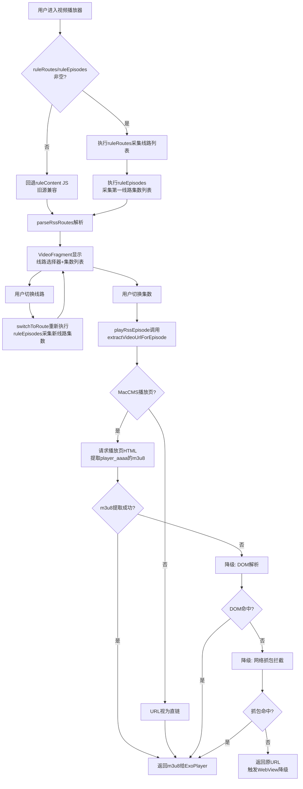
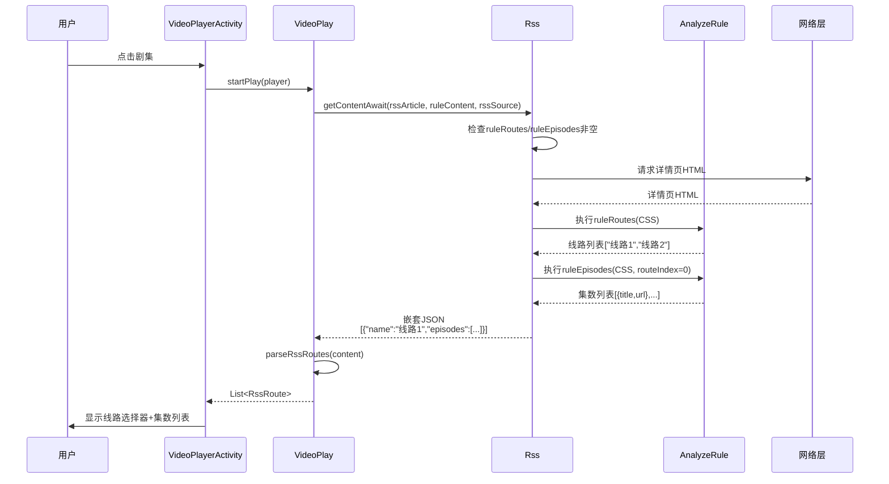
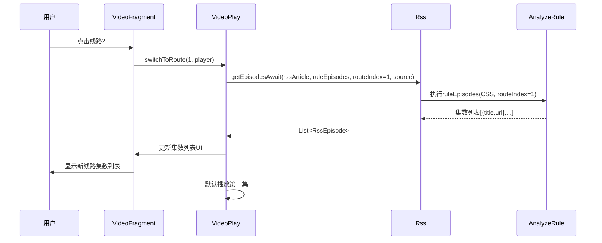
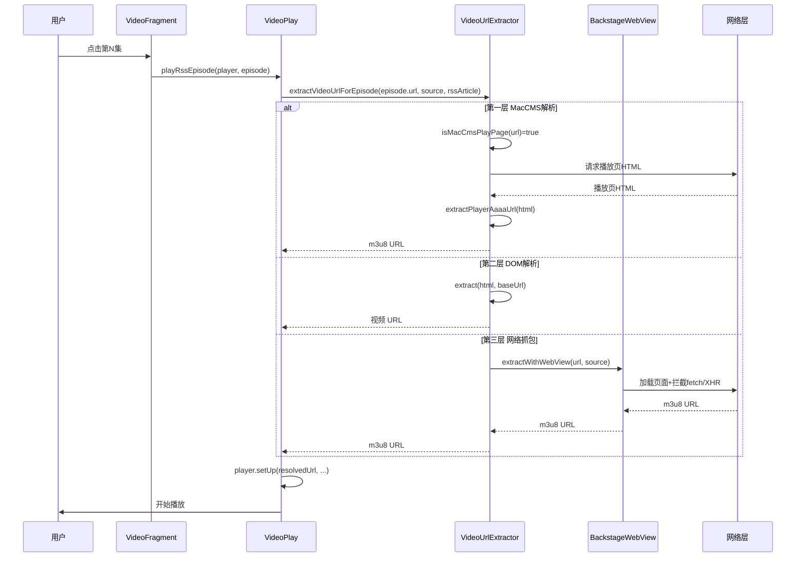

# Design：多线路多集按需采集架构技术设计

## Technical Approach（技术方案）

### 整体架构

将多线路多集采集从"ruleContent JS 全量采集"重构为"结构化字段+两阶段按需采集"架构：



### 关键组件设计

#### 1. RssSource 新增字段（ruleRoutes + ruleEpisodes）

**字段定义**（`app/src/main/java/io/legado/app/data/entities/RssSource.kt`）：
```kotlin
@Parcelize
@Entity(tableName = "rssSources")
data class RssSource(
    // ... 现有字段 ...
    var ruleContent: String? = null,      // 现有：旧源兼容
    // 新增字段（多线路多集按需采集模式）
    var ruleRoutes: String? = null,       // 多线路规则：从详情页采集线路列表（线路名）
    var ruleEpisodes: String? = null,     // 多集规则：从详情页采集集数列表（集数标题+播放页URL）
    // ... 其他现有字段 ...
)
```

**字段用途**：
- `ruleRoutes`：CSS/JSONPath/XPath/JS 规则，从详情页采集线路 tab 列表，返回线路名数组（用 AnalyzeRule.getStringList）
- `ruleEpisodes`：CSS/JSONPath/XPath/JS 规则，从详情页采集集数列表，返回**嵌套 JSON 字符串**（含 title 和 url 两个字段）

**ruleEpisodes 采集方式（按写法分流）**：
1. **JS 写法（推荐，结构化输出）**：
   ```js
   <js>
   var links = doc.select(".sort-list.tab-list:nth-child(" + (java.getVar("routeIndex")+1) + ") .module-play-list-link");
   var result = [];
   for (var i = 0; i < links.size(); i++) {
       var link = links.get(i);
       result.push({"title": link.text(), "url": link.attr("href")});
   }
   JSON.stringify(result);
   </js>
   ```
   Rss.getEpisodesAwait 解析返回的 JSON 字符串为 List<RssEpisode>
2. **CSS 写法（简化，仅返回 url）**：
   `.sort-list.tab-list:nth-child({routeIndex+1}) .module-play-list-link@href`
   返回 List<String>（仅 url），title 由 RssEpisode 默认"第N集"
3. **CSS + 文本组合写法（同时采集 title+url）**：
   利用 Legado 多规则分隔符 `||` 和 `@text&&@href` 语法（需在 Skill 文档示例中验证是否可用，若 AnalyzeRule 不支持则回退 JS 写法）

**支持线路索引（需新增 AnalyzeRule 占位符预处理）**：
- CSS：`.sort-list.tab-list:nth-child({routeIndex+1}) .module-play-list-link`
  - 实现方式：在 Rss.getEpisodesAwait 调用 AnalyzeRule.getStringList 前，对 rule 字符串做 `replace("{routeIndex+1}", (routeIndex+1).toString()).replace("{routeIndex}", routeIndex.toString())` 预处理
  - 不在 AnalyzeRule 内部改，避免污染通用解析路径
- JSONPath：`$.routes[{routeIndex}].episodes[*]`（同样在调用前预处理占位符）
- XPath：`//div[@class="sort-list tab-list"][{routeIndex+1}]//a`（同样预处理）
- JS：`<js>
  java.ajax(url);  // 请求详情页
  var routeIndex = java.getVar("routeIndex");  // 通过 getVar 获取（Legado JS 惯例）
  // ... 用 routeIndex 选择对应线路的集数 ...
  </js>`
  - 实现方式：Rss.getEpisodesAwait 在 evalJS 前调用 `analyzeRule.putVar("routeIndex", routeIndex)` 注入变量

#### 2. 数据库迁移（migration 脚本）

**新增 migration**（参考 `database-migration-safety.md`）：
```kotlin
// 在 DatabaseMigrations.kt 的 migrations 数组中追加
val migration_99_100 = object : Migration(99, 100) {
    override fun migrate(database: SupportSQLiteDatabase) {
        // 新增字段，用 runCatching 包裹防止重复执行报错（参考 v3.26.0717-bug-fix-batch 经验）
        runCatching {
            database.execSQL("ALTER TABLE rssSources ADD COLUMN ruleRoutes TEXT")
        }.onFailure { e ->
            AppLog.put("migration_99_100: ruleRoutes 已存在或失败", e)
        }
        runCatching {
            database.execSQL("ALTER TABLE rssSources ADD COLUMN ruleEpisodes TEXT")
        }.onFailure { e ->
            AppLog.put("migration_99_100: ruleEpisodes 已存在或失败", e)
        }
    }
}
```

**版本号递增**：`AppDatabase.kt` 第 77 行 `version = 99` → `version = 100`
**注意表名**：源码表名是 `rssSources`（AppDatabase.kt#L176 `RSS_SOURCE_TABLE_NAME = "rssSources"`），不是 `rss_sources`

**覆盖安装兼容**：参考 v3.26.0717-bug-fix-batch 的数据库迁移修复经验，migration 失败不阻塞应用启动

#### 3. 订阅源编辑页 UI 改造

**修改文件**：`app/src/main/java/io/legado/app/ui/rss/source/edit/RssSourceEditActivity.kt` + 对应布局 XML + EditEntity + EditAdapter

**改造点（最小侵入方案）**：
1. **EditEntity 新增 ViewType.textVideoOnly**：在 EditEntity.kt 中新增一种 ViewType，标识"仅视频源显示"
2. **EditAdapter 新增 type 过滤逻辑**：在 `onCreateViewHolder`/`onBindViewHolder` 时，根据外层传入的 `currentSourceType` 过滤掉非匹配项（不占位、不渲染）
3. **RssSourceEditActivity 构造 listEntities 时**：
   ```kotlin
   listEntities.apply {
       add(EditEntity("ruleArticles", rs.ruleArticles, R.string.r_articles))
       // ... 其他现有字段 ...
       // 新增：仅 type=2 显示的输入框（ViewType.textVideoOnly）
       add(EditEntity("ruleRoutes", rs.ruleRoutes, R.string.r_routes, EditEntity.ViewType.textVideoOnly))
       add(EditEntity("ruleEpisodes", rs.ruleEpisodes, R.string.r_episodes, EditEntity.ViewType.textVideoOnly))
   }
   ```
4. **type Spinner 切换时刷新**：在 `binding.spType.onItemSelectedListener` 中通知 EditAdapter 刷新（传入新的 currentSourceType）
5. **保存逻辑新增**（在 `getRssSource()` 第 462-477 行 webViewEntities.forEach 后追加）：
   ```kotlin
   // 新增 ruleRoutes/ruleEpisodes 保存
   listEntities.forEach {
       it.value = it.value?.takeIf { s -> s.isNotBlank() }
       when (it.key) {
           "ruleRoutes" -> source.ruleRoutes = it.value
           "ruleEpisodes" -> source.ruleEpisodes = it.value
       }
   }
   ```
6. **字符串资源新增**：`strings.xml` 新增 `<string name="r_routes">多线路规则</string>` 和 `<string name="r_episodes">多集规则</string>`
7. **输入框旁提示**：EditAdapter 在 textVideoOnly 类型渲染时，hint 显示"为空时回退到 ruleContent（旧源兼容）"

#### 4. Rss.getContent 新增分支

**修改文件**：`app/src/main/java/io/legado/app/model/rss/Rss.kt`

**新增方法** `getRoutesContentAwait`（含完整实现，独立构造 AnalyzeUrl + AnalyzeRule）：

**getContentAwait 修改**：
```kotlin
suspend fun getContentAwait(rssArticle: RssArticle, ruleContent: String, rssSource: RssSource): String {
    // 新增分支：仅 type=2 且 ruleRoutes/ruleEpisodes 非空时走新模式（必须在请求详情页前判断）
    if (rssSource.type == 2
        && !rssSource.ruleRoutes.isNullOrBlank()
        && !rssSource.ruleEpisodes.isNullOrBlank()) {
        return getRoutesContentAwait(rssArticle, rssSource.ruleRoutes!!, rssSource.ruleEpisodes!!, rssSource)
    }
    // 以下为现有逻辑（Rss.kt#L125-L172），保持不变
    AppLog.putDebugWithTag(...)
    val analyzeUrl = AnalyzeUrl(rssArticle.link, ...)
    // ... 现有请求详情页 + 执行 ruleContent 逻辑 ...
}
```

**getRoutesContentAwait 内部需独立构造 AnalyzeUrl + AnalyzeRule**：
```kotlin
suspend fun getRoutesContentAwait(
    rssArticle: RssArticle,
    ruleRoutes: String,
    ruleEpisodes: String,
    rssSource: RssSource
): String {
    // 构造 AnalyzeUrl 请求详情页（复用 getContentAwait 第 126-133 行模式）
    val analyzeUrl = AnalyzeUrl(
        rssArticle.link,
        baseUrl = rssArticle.origin,
        source = rssSource,
        ruleData = rssArticle,
        coroutineContext = currentCoroutineContext(),
        hasLoginHeader = false
    )
    val res = kotlin.runCatching { analyzeUrl.getStrResponseAwait() }.getOrElse { throw it }
    val html = res.body ?: ""
    // 构造 AnalyzeRule 解析（复用 getContentAwait 第 165-169 行模式）
    val analyzeRule = AnalyzeRule(rssArticle, rssSource)
    analyzeRule.setContent(html)
        .setBaseUrl(NetworkUtils.getAbsoluteURL(rssArticle.origin, rssArticle.link))
        .setCoroutineContext(currentCoroutineContext())
        .setRedirectUrl(res.url)
    // 采集线路列表
    val routeNames = analyzeRule.getStringList(ruleRoutes) ?: emptyList()
    // 采集第一线路集数（routeIndex=0，占位符预处理）
    val firstRouteEpisodes = getEpisodesListByIndex(analyzeRule, ruleEpisodes, 0, rssArticle)
    // 构造嵌套 JSON 返回
    val routeJson = JSONArray()
    val firstRoute = JSONObject().apply {
        put("name", routeNames.getOrNull(0) ?: "线路1")
        put("episodes", JSONArray(firstRouteEpisodes.map { JSONObject().apply {
            put("title", it.title); put("url", it.url)
        }}))
    }
    routeJson.put(firstRoute)
    // 其他线路名暂不采集集数（按需在 switchToRoute 时采集）
    for (i in 1 until routeNames.size) {
        routeJson.put(JSONObject().apply { put("name", routeNames[i]); put("episodes", JSONArray()) })
    }
    return routeJson.toString()
}

// 新增：按线路索引采集集数（占位符预处理）
private suspend fun getEpisodesListByIndex(
    analyzeRule: AnalyzeRule,
    ruleEpisodes: String,
    routeIndex: Int,
    rssArticle: RssArticle
): List<RssEpisode> {
    // 占位符预处理（AD-03 决策）
    val processedRule = ruleEpisodes
        .replace("{routeIndex+1}", (routeIndex + 1).toString())
        .replace("{routeIndex}", routeIndex.toString())
    // JS 模式注入 routeIndex 变量
    analyzeRule.putVar("routeIndex", routeIndex)
    val result = analyzeRule.getString(processedRule)
    // 解析为 List<RssEpisode>（参考 VideoPlay.parseRssEpisodes）
    return parseEpisodesJson(result, rssArticle.link)
}
```

**注意**：parseRssRoutes（VideoPlay.kt#L804-L860）已能解析嵌套 JSON，新模式返回的 JSON 可直接被 parseRssRoutes 解析为 List<RssRoute>。但 switchToRoute 调用 getEpisodesAwait 时，返回的是 List<RssEpisode>（不是 JSON 字符串），需新增 getEpisodesAwait 方法。

**parseRssRoutes 保留但仅用于新模式**：
- 当前 parseRssRoutes 解析嵌套 JSON（含 episodes 字段）为 List<RssRoute>
- 新模式下：parseRssRoutes 仅解析 getRoutesContentAwait 返回的嵌套 JSON
- **废弃老模式**：ruleContent 返回的嵌套 JSON 不再被 parseRssRoutes 解析（type=2 且 ruleRoutes/ruleEpisodes 为空时，ruleContent 返回单 URL，不走 parseRssRoutes）

#### 5. VideoPlay 新增 switchToRoute 方法

**修改文件**：`app/src/main/java/io/legado/app/model/VideoPlay.kt`

**新增方法（修正类型转换）**：
```kotlin
/**
 * 切换线路：重新执行 ruleEpisodes 采集新线路集数列表
 *
 * @param routeIndex 线路索引（0-based）
 * @param player 播放器实例（与 playRssEpisode 一致用 GSYBaseVideoPlayer 父类）
 * @return true 切换成功，false 切换失败
 */
fun switchToRoute(routeIndex: Int, player: GSYBaseVideoPlayer): Boolean {
    // 修正1：source 是 BaseSource，需 cast 为 RssSource 才能访问 ruleEpisodes
    val rssSource = source as? RssSource ?: return false
    val ruleEpisodes = rssSource.ruleEpisodes ?: return false
    // 修正2：rssStar/rssRecord 转换与 playRssEpisode 第 1029 行保持一致
    val rssArticle = rssStar?.toRssArticle() ?: rssRecord?.toRssArticle()
        ?: rssArticles?.getOrNull(rssArticleIndex) ?: return false
    // 重置集数状态
    rssRouteIndex = routeIndex
    rssEpisodeIndex = 0
    // 修正3：竞态守卫——记录切换序号，异步回调时校验是否过期
    val switchToken = ++switchToRouteToken
    Coroutine.async(loadScope, IO) {
        // 执行 ruleEpisodes 采集新线路集数列表
        val episodes = Rss.getEpisodesAwait(rssArticle, ruleEpisodes, routeIndex, rssSource)
        withContext(Main) {
            // 竞态守卫：若用户在采集期间又切换了线路，丢弃本次结果
            if (switchToken != switchToRouteToken) {
                AppLog.putInfo("switchToRoute 丢弃过期结果: token=$switchToken, current=${switchToRouteToken}")
                return@withContext
            }
            rssEpisodes = episodes
            // 更新 VideoFragment 集数列表 UI
            postEvent(EventBus.UP_VIDEO_INFO, arrayListOf(1))
            // 默认播放新线路第一集
            episodes?.firstOrNull()?.let { playRssEpisode(player, it) }
        }
    }.onError {
        AppLog.put("切换线路采集集数失败: routeIndex=$routeIndex", it, true)
    }
    return true
}

// 新增：switchToRoute 竞态守卫序号（每次切换递增，异步回调校验）
private var switchToRouteToken: Int = 0
```

**重要约束**：
1. player 参数类型用 `GSYBaseVideoPlayer`（与 playRssEpisode 第 1028 行一致），不要用 `StandardGSYVideoPlayer`（子类，会限制调用）
2. `source as? RssSource` 转换失败时返回 false（防御书源场景）
3. `switchToRouteToken` 解决竞态：用户快速切换线路时，后发起的采集先完成会覆盖前一次，需丢弃过期结果

#### 6. VideoUrlExtractor.extractVideoUrlForEpisode（新增统一入口）

**修改文件**：`app/src/main/java/io/legado/app/help/video/VideoUrlExtractor.kt`

**方法签名**：
```kotlin
/**
 * 按需采集视频流 URL（统一入口，三层降级）
 *
 * 调用时机：用户切换线路/集数时由 playRssEpisode 调用
 * 降级顺序：MacCMS 播放页解析 → DOM 解析 → 网络抓包拦截
 *
 * @param url 集数 URL（可能是播放页 URL 或直链）
 * @param source 订阅源（用于构造 AnalyzeUrl 获取 headerMap）
 * @param rssArticle RSS 文章（用于 AnalyzeUrl ruleData）
 * @return 真实视频流 URL（m3u8/mp4 等）；三层均失败时返回原 URL
 */
suspend fun extractVideoUrlForEpisode(
    url: String,
    source: BaseSource?,
    rssArticle: RssArticle?
): String {
    // 内部构造 AnalyzeUrl（参考 VideoPlay.playRssEpisode 第 1037-1041 行）
    val analyzeUrl = AnalyzeUrl(url, source = source, ruleData = rssArticle)
    // 注入 Referer（参考 VideoPlay 第 1043-1045 行）
    if (!analyzeUrl.headerMap.any { it.key.equals("Referer", ignoreCase = true) }) {
        analyzeUrl.headerMap["Referer"] = rssArticle?.link ?: url
    }
    // ... 三层降级逻辑 ...
}
```

**内部逻辑（HTML 复用优化）**：
1. **第一层 MacCMS 播放页解析**：
   - 调用 `isMacCmsPlayPage(url)` 判断
   - 若是 MacCMS 播放页：构造 AnalyzeUrl → 请求 HTML → 缓存到 `playPageHtml` 变量
   - 调用 `extractPlayerAaaaUrl(playPageHtml)` 提取 m3u8
   - 提取成功返回 m3u8，失败进入第二层（**传递 playPageHtml 避免重复请求**）
2. **第二层 DOM 解析（复用第一层 HTML）**：
   - 若第一层已请求 HTML（playPageHtml 非空）：直接调用 `extract(playPageHtml, baseUrl)`
   - 若第一层未请求 HTML（URL 非 MacCMS 播放页）：跳过本层（无 HTML 可解析）
   - 命中返回，未命中进入第三层
3. **第三层 网络抓包拦截**：
   - 调用 `extractWithWebView(url, source, delayTime=3000, timeout=10000)`
   - BackstageWebView 加载页面，拦截 fetch/XHR，正则匹配 m3u8/mp4 等
   - 命中返回，未命中返回原 URL
4. **协程取消守卫**：每层均 try-catch，CancellationException 重新抛出

**重要约束**（R5.5）：不修改现有 extract/extractWithWebView/resolvePlayerPageUrl/isMacCmsPlayPage/extractPlayerAaaaUrl 方法，新方法仅调用它们

#### 7. VideoPlay.playRssEpisode 修改

**修改前**（当前已修改的 MacCMS 单层解析）：
```kotlin
var resolvedUrl = VideoUrlExtractor.resolvePlayerPageUrl(analyzeUrl.url)
val isMacCms = VideoUrlExtractor.isMacCmsPlayPage(resolvedUrl)
if (resolvedUrl == analyzeUrl.url && isMacCms) {
    try {
        val playPageHtml = analyzeUrl.getStrResponseAwait().body ?: ""
        val m3u8Url = VideoUrlExtractor.extractPlayerAaaaUrl(playPageHtml)
        if (!m3u8Url.isNullOrBlank()) {
            resolvedUrl = m3u8Url
        }
    } catch (e: Exception) {
        AppLog.put("MacCMS解析播放页失败", e, true)
    }
}
```

**修改后**（调用统一入口）：
```kotlin
val resolvedUrl = VideoUrlExtractor.extractVideoUrlForEpisode(
    url = analyzeUrl.url,
    source = source,
    rssArticle = rssArticle
)
```

**保留逻辑**：Referer 注入、AppLog.put、Coroutine.async、withContext(Main)

## Architecture Decisions（架构决策）

### AD-01：采用结构化字段+两阶段按需采集架构（B 方案修订版）

- **Context**：当前 ruleContent JS 一次性采集所有线路所有集的 URL（含 m3u8），导致性能差、开发者编写复杂、AI 不友好、失败降级链路长。用户明确要求新增"多线路选择器"和"多集选择器"字段。
- **Concern**：如何在支持按需采集的同时，让开发者/AI 更容易编写多线路多集订阅源？
- **Decision**：新增 ruleRoutes 和 ruleEpisodes 两个结构化字段，分离线路采集和集数采集；ruleContent 回归旧源兼容角色
- **Goal**：结构化字段 AI 友好、开发者分离关注点、与现有字段风格一致、旧源兼容
- **Tradeoff**：数据库迁移成本+UI 改造成本，但项目已有机制可控
- **Status**：Proposed
- **Superseded-by**：无

### AD-02：新增 ruleRoutes 和 ruleEpisodes 字段（修订原 AD-02）

- **Context**：原 AD-02 否决了新增字段方案，理由是"数据库迁移成本+UI 改造成本+旧源兼容性破坏"。用户反馈明确要求新增字段，且强调"让 AI 也能更方便处理"。
- **Concern**：原否决理由是否充分？
- **Decision**：修订原 AD-02，采纳新增字段方案。理由：1. 数据库迁移成本可控（已有机制）2. UI 改造成本可控（复用现有样式）3. 旧源兼容可通过"为空时回退 ruleContent"实现 4. AI 友好性是核心诉求（结构化字段比大 JS 脚本更易生成验证）
- **Goal**：满足用户明确要求，提升 AI 友好性
- **Tradeoff**：增加数据库迁移和 UI 改造工作量，但符合用户长期利益
- **Status**：Proposed（修订原 AD-02）
- **Superseded-by**：无

### AD-03：ruleEpisodes 支持线路索引切换（占位符预处理方案）

- **Context**：用户切换线路时需要重新采集新线路的集数列表，ruleEpisodes 规则需支持按线路索引采集
- **Concern**：如何让 CSS/JSONPath/XPath/JS 四种写法都支持线路索引？
- **Decision**：
  1. **CSS/JSONPath/XPath 用占位符预处理**：在 Rss.getEpisodesAwait 调用 AnalyalyzeRule.getStringList 前，对 rule 字符串做字符串替换：
     - `rule.replace("{routeIndex+1}", (routeIndex+1).toString())`
     - `rule.replace("{routeIndex}", routeIndex.toString())`
  2. **JS 用 putVar 注入**：Rss.getEpisodesAwait 在执行 JS 前调用 `analyzeRule.putVar("routeIndex", routeIndex)`，JS 内用 `java.getVar("routeIndex")` 获取
  3. **不在 AnalyzeRule.kt 内部添加占位符逻辑**：避免污染通用解析路径（影响其他规则字段）
- **Goal**：四种写法统一支持线路索引切换，且不破坏 AnalyzeRule 通用性
- **Tradeoff**：占位符预处理增加 Rss.kt 少量代码，但隔离性更好
- **Status**：Proposed
- **Superseded-by**：无

### AD-04：VideoUrlExtractor 新增统一按需采集入口

- **Context**：当前按需采集能力分散在 VideoUrlExtractor 多个方法，playRssEpisode 需手动串联
- **Concern**：如何让按需采集逻辑清晰可维护，且支持三层降级？
- **Decision**：新增 `extractVideoUrlForEpisode(url, source, rssArticle)` 统一入口，封装 MacCMS 解析 + DOM 解析 + 网络抓包三层降级
- **Goal**：playRssEpisode 只需调用一个方法，降级逻辑集中管理
- **Tradeoff**：VideoUrlExtractor 代码量增加，但比分散逻辑更清晰
- **Status**：Proposed
- **Superseded-by**：无

### AD-05：保留已修改的 4 处源码作为兜底降级

- **Context**：用户已修改 switchToWebViewMode/retryExoPlayback/getOverlayControls/playRssEpisode 4 处源码解决 WebView 降级时 UI 隐藏问题
- **Concern**：配合架构优化后（按需采集优先），是否可简化这 4 处修改？
- **Decision**：保留全部 4 处修改作为兜底降级，不主动简化
- **Goal**：在按需采集三层均失败的极端场景，ExoPlayer 仍会收到 HTML 报 3003 错误，WebView 降级兜底仍需保留 UI 可见性修复
- **Tradeoff**：代码稍显冗余，但保证极端场景下用户体验
- **Status**：Proposed
- **Superseded-by**：无

### AD-06：playRssEpisode MacCMS 单层解析迁移到统一入口

- **Context**：playRssEpisode 当前已修改的 MacCMS 单层解析逻辑与新增的 extractVideoUrlForEpisode 第一层重复
- **Concern**：如何避免代码重复？
- **Decision**：将 playRssEpisode 的 MacCMS 单层解析代码迁移到 extractVideoUrlForEpisode 内，playRssEpisode 只调用统一入口
- **Goal**：代码职责清晰，按需采集逻辑集中在 VideoUrlExtractor
- **Tradeoff**：playRssEpisode 代码量减少，但需确保迁移后行为一致（真机回测验证）
- **Status**：Proposed
- **Superseded-by**：无

### AD-07：不引入影视仓字符串编码协议（`$$$#/`）

- **Context**：影视仓用 `$$$#/` 分隔符编码多线路多集，是否引入 Legado？
- **Concern**：字符串编码是否比结构化字段更好？
- **Decision**：不引入影视仓字符串编码，用结构化字段（ruleRoutes + ruleEpisodes）替代
- **Goal**：与 Legado 声明式规则风格一致，AI 友好（结构化字段比字符串编码更易理解）
- **Tradeoff**：与影视仓不兼容，但 Legado 有自己的规则风格
- **Status**：Proposed
- **Superseded-by**：无

### AD-08：不引入硬编码"通用采集器"（方案 F 否决）

- **Context**：用户提出"ruleRoutes/ruleEpisodes 是否也能配置通用采集器去采集"，需评估是否在 VideoUrlExtractor 内置 MacCMS 通用 CSS 规则（开箱即用无需配置）
- **Concern**：硬编码通用采集器 vs 用户自定义规则（软通用采集器）哪个更好？
- **Decision**：不引入硬编码通用采集器，用"软通用采集器"（Skill 文档提供 MacCMS 模板标准写法示例）替代
- **Goal**：兼顾 AI 友好性、灵活性、可维护性
- **Tradeoff**：
  - 得：AI 友好（结构化字段可生成验证）+ 灵活性（支持任意模板站点）+ 可维护（新模板只需更新 Skill 文档）+ 与 Legado 声明式规则风格一致
  - 失：用户需手动配置规则（但 AI 可辅助生成，Skill 文档提供标准示例可复制）
- **Status**：Proposed
- **Superseded-by**：无
- **分析依据**：详见 temp/multiline-deep-analysis.md 第三章 3.2 节"通用采集器深度分析"

### AD-09：废弃 ruleContent 多线路多集模式（不兼容老版本）

- **Context**：用户明确要求"完全可以废弃老旧的在 ruleContent 中去适配采集多线路多集这种模式，没一点好处，完全可以改造实现新的这种模式，不用考虑兼容老版本，老版本现在更多的都是单集视频采集"
- **Concern**：是否保留 ruleContent 多线路多集嵌套 JSON 模式以兼容老版本？
- **Decision**：废弃 ruleContent 多线路多集模式，ruleContent 仅支持单集视频 URL。老版本多线路多集订阅源需迁移到新字段（ruleRoutes + ruleEpisodes）
- **Goal**：架构清晰，职责分离，避免 ruleContent 既是"单集采集器"又是"多线路多集采集器"的职责混乱
- **Tradeoff**：
  - 得：架构清晰+代码简化（parseRssRoutes 仅用于新模式）+ AI 友好（ruleContent 只返回单 URL）
  - 失：老版本多线路多集订阅源需迁移（但用户确认老版本主要是单集视频采集，影响可控）
- **Status**：Proposed
- **Superseded-by**：无

### AD-10：switchToRoute 替代 switchRssRoute（真正按需采集）

- **Context**：当前 switchRssRoute 从内存缓存取线路集数（ruleContent JS 阶段一次性采集所有线路所有集数），不是真正的按需采集
- **Concern**：如何实现切换线路时真正按需采集新线路集数？
- **Decision**：新增 switchToRoute(routeIndex, player) 方法，切换线路时重新执行 ruleEpisodes 采集新线路集数列表，替代 switchRssRoute 的内存缓存模式
- **Goal**：真正按需采集，进入播放器更快（不一次性采集所有线路），切换线路更智能（按需采集）
- **Tradeoff**：切换线路有一次 ruleEpisodes 执行开销（详情页已缓存，仅执行 CSS/JSONPath/XPath/JS 解析，<100ms）
- **Status**：Proposed
- **Superseded-by**：无

## Data Flow（数据流）

### 第一阶段：ruleRoutes + ruleEpisodes 执行（用户进入播放器）



### 第二阶段：切换线路（switchToRoute）



### 第三阶段：按需采集 m3u8（用户切换集数）



## File Changes（文件变更）

### 1. `app/src/main/java/io/legado/app/data/entities/RssSource.kt`（修改）

**新增字段**：
- `var ruleRoutes: String? = null`
- `var ruleEpisodes: String? = null`

**改动范围**：新增 2 个字段声明，不修改现有字段

### 2. `app/src/main/java/io/legado/app/data/AppDatabase.kt` + `DatabaseMigrations.kt`（修改）

**新增 migration**：
- `migration_99_100`：ALTER TABLE rssSources ADD COLUMN ruleRoutes TEXT; ADD COLUMN ruleEpisodes TEXT;
- 版本号 99→100（AppDatabase.kt 第 77 行）

### 3. `app/src/main/java/io/legado/app/model/rss/Rss.kt`（修改）

**新增方法**：
- `getRoutesContentAwait(rssArticle, ruleRoutes, ruleEpisodes, rssSource): String`（采集第一线路集数）
- `getEpisodesAwait(rssArticle, ruleEpisodes, routeIndex, rssSource): List<RssEpisode>`（按线路索引采集集数）

**修改方法**：
- `getContentAwait`：新增 ruleRoutes/ruleEpisodes 非空分支

### 4. `app/src/main/java/io/legado/app/model/VideoPlay.kt`（修改）

**新增方法**：
- `switchToRoute(routeIndex, player): Boolean`（切换线路）

**修改方法**：
- `playRssEpisode`：MacCMS 单层解析替换为调用 `extractVideoUrlForEpisode`

### 5. `app/src/main/java/io/legado/app/help/video/VideoUrlExtractor.kt`（修改）

**新增方法**：
- `extractVideoUrlForEpisode(url, source, rssArticle): String`（统一按需采集入口）

**不修改现有方法**：extract/extractWithWebView/resolvePlayerPageUrl/isMacCmsPlayPage/extractPlayerAaaaUrl 保持不变

### 6. `app/src/main/java/io/legado/app/ui/rss.source.edit/RssSourceEditActivity.kt` + 布局 XML（修改）

**改造点**：
- type=2 时显示"多线路规则"和"多集规则"输入框
- 复用 ruleContent 输入框样式
- 保存时持久化新字段

### 7. `app/src/main/java/io/legado/app/model/analyzeRule/AnalyzeRule.kt`（不修改）

**说明**：占位符预处理在 Rss.getEpisodesAwait/getEpisodesListByIndex 完成，不在 AnalyzeRule 内部改（AD-03 决策，避免污染通用解析路径）。JS 的 routeIndex 通过 putVar 注入。

### 8. `.trae/skills/legado-source-creator/SKILL.md`（修改）

**新增章节**：
- "多线路多集按需采集标准写法"
- MacCMS 模板站点标准 ruleRoutes + ruleEpisodes 写法示例（CSS/JSONPath/XPath/JS 四种）
- 规范说明（优先使用新字段，ruleContent 仅作旧源兼容）
- AI 生成 ruleRoutes/ruleEpisodes 的指引

### 9. `app/src/main/assets/updateLog.md`（修改）

**新增条目**：
- 多线路多集按需采集架构优化说明（面向用户通俗描述）

### 10. 已修改的 4 处源码（保留，不修改）

- `VideoFragment.kt` switchToWebViewMode：保留 leftBottomContainer 可见性修复
- `VideoFragment.kt` retryExoPlayback：保留 controlsLayer 可见性恢复
- `VideoFragment.kt` getOverlayControls：保留 WebView 模式下不自动隐藏 leftBottomContainer
- `VideoPlay.kt` playRssEpisode MacCMS 解析：被统一入口替代（迁移到 extractVideoUrlForEpisode 内）

### 11. 订阅源 JSON 简化（验证用）

**文件**：`temp/rss/rssSource_202607131357/DownloadsrssSource_奈飞中文网--内置视频播放器.(1)..json`

**修改**：用 ruleRoutes + ruleEpisodes（CSS 写法）替代 ruleContent JS，移除镜像站请求和 player_aaaa 提取逻辑

## 风险评估

| 风险 | 概率 | 影响 | 缓解措施 |
|------|------|------|---------|
| 数据库迁移失败导致覆盖安装报错 | 低 | 高 | runCatching 包裹 + 参考 v3.26.0717-bug-fix-batch 经验 |
| ruleEpisodes 线路索引切换不生效 | 中 | 高 | 真机回测验证 + 四种写法分别测试 |
| 按需采集失败率高于 JS 全量采集 | 中 | 高 | 三层降级兜底 + 真机回测验证 + 保留旧源兼容 |
| 用户切换集数等待时间长 | 中 | 中 | MacCMS 解析覆盖 80%+ 场景（<1s）+ 预缓冲下一集 |
| 旧订阅源回归（ruleContent 模式） | 低 | 高 | getContentAwait 回退逻辑 + 真机回测验证 |
| 订阅源编辑页 UI 改造影响其他字段 | 低 | 中 | 仅 type=2 显示新输入框，复用现有样式 |
| VideoUrlExtractor 现有方法被破坏 | 低 | 高 | R5.5 约束：不修改现有方法，新方法仅调用 |
| 用户快速切换线路导致竞态 | 中 | 高 | switchToRouteToken 序号守卫，异步回调校验是否过期 |

## 验证策略

### Level 1 - 代码完成
- Grep 确认 `ruleRoutes`/`ruleEpisodes` 字段存在
- Grep 确认 `extractVideoUrlForEpisode`/`switchToRoute`/`getRoutesContentAwait` 方法存在
- Grep 确认 migration 脚本存在
- RunCommand 编译通过（gradle assembleDebug）

### Level 2 - 功能验证
- 真机安装 debug 包
- 订阅源编辑页 type=2 时显示新输入框
- 导入用新字段配置的奈飞中文网订阅源
- 验证用户切换线路/集数能正确播放 m3u8

### Level 3 - 场景验证
- MacCMS 模板站点真机回测（奈飞中文网）
- 验证场景 1-7 全部通过
- AppLog 模块过滤确认降级链路日志
- 旧订阅源（ruleContent 模式）回归测试
- 数据库覆盖安装兼容性测试
