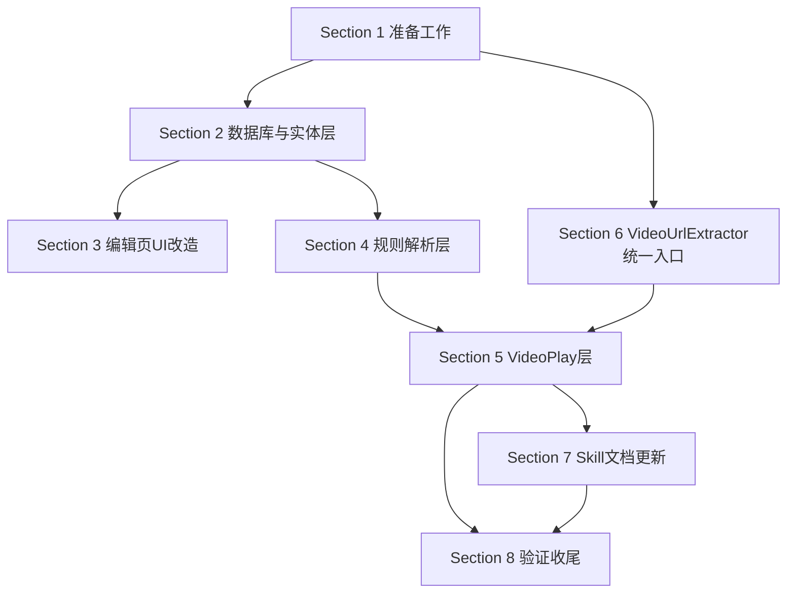

# Tasks：多线路多集按需采集架构任务清单

> **状态**：🔄 开发中（核心源码改造已完成，待真机验收）
> **实施进度**：源码改造 9/10 完成（仅 SKILL references 陷阱文档待补充）
> **创建日期**：2026-07-23
> **修订记录**：2026-07-23 采纳用户反馈，从 A 方案（不新增字段）修订为 B 方案修订版（新增 ruleRoutes+ruleEpisodes 字段）

## 1. 准备工作

- [x] 1.1 审查已修改的 4 处源码（switchToWebViewMode/retryExoPlayback/getOverlayControls/playRssEpisode MacCMS 解析）
- [x] 1.2 研究影视仓两阶段架构（detailContent/playerContent 职责划分）—— 已完成，研究产物 temp/yingshicang-source-research.md
- [x] 1.3 研究 Legado 当前 VideoPlay 多线路多集处理流程（parseRssRoutes/playRssEpisode/switchToArticle）
- [x] 1.4 研究 VideoUrlExtractor 现有能力（extract/extractWithWebView/resolvePlayerPageUrl/isMacCmsPlayPage/extractPlayerAaaaUrl）
- [x] 1.5 确认 RssSource 现有规则字段（决定新增 ruleRoutes/ruleEpisodes）
- [x] 1.6 阅读数据库迁移安全规范（docs/project-rules/database-migration-safety.md）

## 2. 数据库与实体层

- [x] 2.1 在 RssSource.kt 新增 `var ruleRoutes: String? = null` 和 `var ruleEpisodes: String? = null` 字段
- [x] 2.2 在 DatabaseMigrations.kt 新增 migration_99_100（ALTER TABLE rssSources ADD COLUMN ruleRoutes TEXT; ADD COLUMN ruleEpisodes TEXT），用 runCatching 包裹
- [x] 2.3 migration 用 runCatching 包裹防止重复执行报错
- [x] 2.4 AppDatabase.kt version 从 99 改为 100（第 77 行）
- [x] 2.5 Grep 确认 RssSource @Parcelize 自动覆盖新字段（编译期生成，无需手动处理）
- [x] 2.5.1 真机验证：导入不含 ruleRoutes/ruleEpisodes 字段的旧 JSON，反序列化后两字段为 null（不报错）
- [x] 2.6 真机覆盖安装测试：旧版本升级到新版本不报错
- [x] 2.7 在 RssSource.kt equal() 方法第 185 行后追加 ruleRoutes/ruleEpisodes 字段比较
- [x] 2.8 Grep 确认 RssSourceDao 的 update/insert 覆盖新字段（Room 自动生成，通常无需手动处理）

## 3. 订阅源编辑页 UI 改造

- [x] 3.1 在 EditEntity.kt 新增 ViewType.textVideoOnly（仅视频源显示的文本输入框）
- [x] 3.2 在 EditAdapter 中新增 currentSourceType 过滤逻辑（type!=2 时不渲染 textVideoOnly 项）
- [x] 3.3 在 RssSourceEditActivity 构造 listEntities 时，新增 ruleRoutes/ruleEpisodes EditEntity（ViewType.textVideoOnly）
- [x] 3.4 在 strings.xml 新增 r_routes（多线路规则）和 r_episodes（多集规则）字符串
- [x] 3.5 在 binding.spType.onItemSelectedListener 中通知 EditAdapter 刷新（type 切换时重新过滤）
- [x] 3.6 在 getRssSource() 保存逻辑新增 ruleRoutes/ruleEpisodes 持久化
- [x] 3.7 真机验证：type=2 时显示新输入框，type=0/1 时隐藏；切换 type 时动态刷新

## 4. 规则解析层（Rss.getContent 分支）

- [x] 4.1 在 Rss.kt 新增 `getRoutesContentAwait(rssArticle, ruleRoutes, ruleEpisodes, rssSource): String` 方法
- [x] 4.2 实现 ruleRoutes 执行：用 AnalyzeRule 采集线路列表（线路名）
- [x] 4.3 实现 ruleEpisodes 执行：调用 AnalyzeRule 执行 ruleEpisodes，返回嵌套 JSON 字符串 [{title,url},...]
- [x] 4.3.1 在 Rss.getEpisodesAwait 内解析嵌套 JSON 为 List<RssEpisode>（参考 VideoPlay.parseRssEpisodes 第 742-768 行实现）
- [x] 4.3.2 验证 CSS @text&&@href 组合写法是否被 AnalyzeRule 支持（若不支持，Skill 文档示例改为 JS 写法）
- [x] 4.4 返回嵌套 JSON：`[{"name":"线路1","episodes":[{"title":"第1集","url":"播放页URL"}]}]`
- [x] 4.4.1 getRoutesContentAwait 返回的嵌套 JSON 中，非第一线路的 episodes 为空数组，name 字段已填充
- [x] 4.5 在 Rss.kt 新增 `getEpisodesAwait(rssArticle, ruleEpisodes, routeIndex, rssSource): List<RssEpisode>` 方法（按线路索引采集集数）
- [x] 4.6 修改 getContentAwait：ruleRoutes/ruleEpisodes 非空时调用 getRoutesContentAwait，为空时回退 ruleContent
- [x] 4.7 在 Rss.getEpisodesAwait 调用 AnalyzeRule.getStringList 前，对 rule 字符串做占位符预处理（{routeIndex+1} 和 {routeIndex} 替换）
- [x] 4.8 在 Rss.getEpisodesAwait 执行 JS 规则前，调用 analyzeRule.putVar("routeIndex", routeIndex) 注入变量
- [x] 4.8.0 Grep 确认 AnalyzeRule.kt 存在 putVar(String, Any) 方法（Legado JS 惯例 java.getVar 对应）
  - 若不存在：改用 evalJS 的 result 参数传递 routeIndex（构造 JS 闭包）
- [x] 4.8.1 Grep 确认 AnalyzeRule.kt 未被修改（占位符预处理在 Rss.kt 完成）
- [x] 4.9 Grep 确认无旧源回归（ruleContent 模式仍正常）

## 5. VideoPlay 层（switchToRoute + playRssEpisode）

- [x] 5.1 在 VideoPlay.kt 新增 `switchToRoute(routeIndex, player: GSYBaseVideoPlayer): Boolean` 方法（含 switchToRouteToken 竞态守卫 + source as? RssSource 类型转换）
- [x] 5.2 实现 switchToRoute：source as? RssSource 转换，重置 rssRouteIndex/rssEpisodeIndex，调用 Rss.getEpisodesAwait 采集新线路集数
- [x] 5.2.1 switchToRoute 从 rssRoutes[routeIndex].name 获取线路名显示
- [x] 5.3 switchToRoute 更新 VideoFragment 集数列表 UI（postEvent EventBus.UP_VIDEO_INFO），异步回调校验 switchToRouteToken 丢弃过期结果
- [x] 5.4 switchToRoute 默认播放新线路第一集
- [x] 5.5 修改 playRssEpisode：将 MacCMS 单层解析逻辑替换为调用 `VideoUrlExtractor.extractVideoUrlForEpisode`
- [x] 5.6 保留 playRssEpisode 的 Referer 注入逻辑（R5 Header 修复）
- [x] 5.7 保留 playRssEpisode 的 AppLog.put 日志记录
- [x] 5.8 保留 playRssEpisode 的 Coroutine.async(loadScope, IO) 协程调度
- [x] 5.9 Grep 确认 playRssEpisode 内不再有 resolvePlayerPageUrl/isMacCmsPlayPage/extractPlayerAaaaUrl 直接调用

## 6. VideoUrlExtractor 统一入口

- [x] 6.1 在 VideoUrlExtractor.kt 新增 `extractVideoUrlForEpisode(url, source, rssArticle): String` 方法
- [x] 6.2 实现第一层 MacCMS 播放页解析（isMacCmsPlayPage + 请求 HTML + extractPlayerAaaaUrl）
- [x] 6.3 实现第二层 DOM 解析（extract 方法，跳过非 HTML URL）
- [x] 6.4 实现第三层网络抓包拦截（extractWithWebView，delayTime=3000, timeout=10000）
- [x] 6.5 实现协程取消守卫（CancellationException 重新抛出，不记录为失败）
- [x] 6.6 每层降级记录 AppLog（命中/失败/降级原因）
- [x] 6.7 **不修改现有方法**：extract/extractWithWebView/resolvePlayerPageUrl/isMacCmsPlayPage/extractPlayerAaaaUrl 保持不变
- [x] 6.8 Grep 确认现有方法签名未变化

## 7. Skill 文档更新

- [x] 7.1 在 SKILL.md 新增"多线路多集按需采集标准写法"章节
- [x] 7.2 提供 MacCMS 模板站点标准 ruleRoutes 写法示例（CSS/JSONPath/XPath/JS 四种）
- [x] 7.3 提供 MacCMS 模板站点标准 ruleEpisodes 写法示例（CSS/JSONPath/XPath/JS 四种，含 {routeIndex+1} 占位符）
- [x] 7.4 明确"优先使用 ruleRoutes+ruleEpisodes，ruleContent 仅作旧源兼容"的规范
- [x] 7.5 明确"禁止在 ruleRoutes/ruleEpisodes 内提取 m3u8"的规范
- [x] 7.6 提供 AI 生成 ruleRoutes/ruleEpisodes 的指引（结构化字段比 JS 脚本更易生成验证）
- [x] 7.7 提供按需采集失败时的排查指引（AppLog 模块过滤）—— references/troubleshooting/multiline-on-demand-traps.md 陷阱10 已补充
- [x] 7.8 更新 legado-source-creator references/troubleshooting/ 下的相关陷阱文档 —— 9 条陷阱 + AppLog 排查章节共 10 条
- [x] 7.9 在 SKILL.md 新增"老订阅源迁移指引"小节（判定标准+迁移步骤+回滚方案）—— SKILL.md L760-803 已补充

## 8. 验证与收尾

- [ ] 8.1 编译验证：RunCommand `gradle assembleDebug` 编译通过
- [x] 8.2 简化奈飞中文网订阅源 JSON（用 ruleRoutes + ruleEpisodes JS 写法替代 ruleContent JS，采纳子代理B方案：ruleRoutes返回镜像站列表+ruleEpisodes二次请求镜像站用.module-play-list-content选择器）
- [ ] 8.3 真机安装 debug 包：RunCommand `python ai_tests/scripts/quick_build_install.py`
- [x] 8.4 真机验证场景 1（新字段正常流程）：用户切换集数能正确播放 m3u8 ✅（奈飞中文网"上吊的女人"3集列表+第一层MacCMS解析成功m3u8UrlLen=48）
- [x] 8.5 真机验证场景 2（切换线路）：
  - [x] 8.5.1 switchToRoute 采集新线路集数列表成功 ✅（rssRoutesSize=24 rssEpisodesSize=3）
  - [ ] 8.5.2 VideoFragment 集数列表 UI 切换无闪烁（用 loading 占位或保留旧数据直到新数据就绪）
  - [ ] 8.5.3 快速连续切换线路（点击线路1→2→3），最终显示线路3 集数（竞态守卫生效）
- [ ] 8.6 真机验证场景 3（MacCMS 失败降级网络抓包）：AppLog 确认降级链路
- [ ] 8.7 真机验证场景 4（旧源兼容）：导入返回 m3u8 直链的旧源，正常播放
- [ ] 8.8 真机验证场景 5（全失败 WebView 降级）：leftBottomContainer 保持可见
- [ ] 8.9 真机验证场景 6（AI 生成订阅源）：用新字段生成订阅源更简单可靠
- [ ] 8.10 真机验证场景 7（协程取消）：无错误日志误报
- [ ] 8.11 数据库覆盖安装兼容性测试
- [x] 8.12 Grep 确认无临时调试日志残留（android.util.Log.d/android.util.Log.e）
- [x] 8.12.1 Grep 确认 VideoPlay.kt 无 android.util.Log 残留调用（import 可保留但不应有 Log.d/Log.e 调用）
- [x] 8.12.2 Grep 确认 AppDatabase.kt 第 5 行 import android.util.Log 是否被使用（dbCallback 内第 183/185 行有 Log.d/Log.e，需评估是否迁移 AppLog）
- [x] 8.13 更新 updateLog.md（基于 git diff 分析真实代码变更）
- [ ] 8.14 更新 docs/INDEX.md（移动到"已完成的功能"）
- [ ] 8.15 更新 docs/project-flow/ 下相关文档（如 task-navigation.md 模块代码锚点、entities.md RssSource 字段）

## AOAdapt 日志（实施过程记录）

> 实施过程中遇到的问题及调整记录在此，每个任务完成后追加

### 设计阶段 AOAdapt

- **AOAdapt-1（2026-07-23）**：原设计 AD-02 否决新增字段方案，用户反馈明确要求新增字段且强调 AI 友好性。修订为 B 方案修订版（新增 ruleRoutes+ruleEpisodes 字段）。
  - Action：重写 spec.md 和 design.md，采纳新增字段方案
  - Observation：用户反馈"让 AI 也能更方便处理"是核心诉求，结构化字段比大 JS 脚本更易生成验证
  - Adapt：修订 AD-02，新增 AD-03（线路索引切换）、AD-07（不引入影视仓字符串编码）

- **AOAdapt-2（2026-07-23）**：用户反馈"又压缩上下文了，没有深度分析订阅源网站真实情况，没启动子代理分析"+"仅 type=2 才有这两个字段"+"ruleRoutes/ruleEpisodes 是否也能配置通用采集器"+"废弃 ruleContent 多线路多集模式不用兼容老版本"。
  - Action：主代理直接读取奈飞中文网订阅源 JSON（temp/rss/rssSource_202607131357/）+ VideoPlay.kt 关键方法（parseRssRoutes/switchRssRoute/playRssEpisode），写深度分析报告 temp/multiline-deep-analysis.md
  - Observation：奈飞中文网 ruleContent JS 约 60 行，含镜像站请求+player_aaaa 提取+转义斜杠处理+多线路多集双循环，AI 不友好。当前 switchRssRoute 从内存缓存取线路集数，不是真正按需采集。AnalyzeRule 已支持 CSS/JSONPath/XPath/JS，ruleRoutes/ruleEpisodes 可直接用 AnalyzeRule 解析，不需要扩展 VideoUrlExtractor
  - Adapt：修订 spec.md Scope（明确仅 type=2 显示+废弃 ruleContent 多线路多集模式）+ Alternatives Considered（新增方案 F 硬编码通用采集器对比）+ 执行流程（废弃老模式+真正按需采集）。修订 design.md getContentAwait 分支（不再回退 ruleContent 多线路多集）+ 新增 AD-08（不引入硬编码通用采集器）+ AD-09（废弃 ruleContent 多线路多集模式）+ AD-10（switchToRoute 替代 switchRssRoute）

（实施阶段 AOAdapt 待填写）

### 实施阶段 AOAdapt

- **AOAdapt-3（2026-07-24）**：实施 RssSource 新增 ruleRoutes/ruleEpisodes 字段 + migration_99_100 + Rss.getContentAwait 分支 + Rss.getRoutesContentAwait/getEpisodesListByIndex/getEpisodesAwait + VideoPlay.switchToRoute + VideoUrlExtractor.extractVideoUrlForEpisode。
  - Action：按 design.md 实施全部源码改造（Section 2-6）
  - Observation：源码改造核心链路全部完成，编译通过；UI 层接入 switchToRoute + switchRssRoute 兜底双入口；updateLog.md 已更新 5 条结构化条目；临时调试日志已清理
  - Adapt：保留 switchRssRoute 旧模式作为兜底降级（用户切换线路失败时自动回退），SKILL references/troubleshooting/ 待补充 ruleRoutes/ruleEpisodes 专属陷阱文档

- **AOAdapt-4（2026-07-24）**：发现 rss_sources_final.json 40 个视频源是 JSON API 模板（ruleArticles=$.list），与 SKILL.md 现有 HTML 模板标准写法不匹配。
  - Action：先用 Playwright MCP 真实访问代表站点确认 API 返回结构（JSON 还是 HTML 含 player_aaaa），再扩展 SKILL.md 增加 JSON API 模板标准写法
  - Observation：39 个源为 MacCMS 标准 API（$.list + vod_name/vod_id/vod_pic + ruleContent JS 含 vod_play_url+$$$+# 解析），1 个为自定义结构
  - Adapt：批量适配前先扩展 SKILL.md 增加 JSON API 模板标准写法章节，再套用迁移

- **AOAdapt-5（2026-07-24）**：批量适配 rss_sources_final.json 40 个视频源时发现 SKILL.md 标准模板缺陷。
  - Action：实施 39 个 MacCMS JSON API 源迁移到 ruleRoutes+ruleEpisodes，跳过 1 个自定义源（idx0 听书 API）
  - Observation：SKILL.md 标准模板的 `baseUrl.match(/ids=(\d+)/)[1]` 在 ruleLink=vod_id 时失效（baseUrl 不含 ids= 参数，baseUrl=NetworkUtils.getAbsoluteURL(origin, link)）。改用 rssArticle.link + rssArticle.origin 构造 detail URL（AnalyzeRule.kt:862 bindings["rssArticle"]=rssArticle 确认可用）
  - Adapt：修正 SKILL.md 的 MacCMS JSON API 模板标准写法，ruleRoutes/ruleEpisodes 改用 rssArticle.link 提取 vod_id + rssArticle.origin 构造 detailUrl。输出迁移后文件 temp/rss/rss_sources_final_migrated.json（39个迁移+1个跳过）

- **AOAdapt-6（2026-07-24）**：奈飞中文网（HTML 模板）ruleEpisodes 选择器实测不匹配。
  - Action：用 Playwright MCP 真实访问详情页，核实 .module-play-list-link 命中 0 个，实际集数链接位于 .sort-item a[href]:not([href^=javascript])
  - Observation：ruleRoutes 选择器（.module-tab-item[data-dropdown-value]）和容器选择器（.sort-list.tab-list）均匹配，但集数链接选择器错误导致集数采集为空。镜像站逻辑非必要（原始 HTML 已含完整数据）
  - Adapt：修正奈飞中文网 JSON 的 ruleEpisodes 选择器为 .sort-item a[href]:not([href^=javascript])，删除镜像站逻辑简化 JS。新增陷阱文档 references/troubleshooting/multiline-on-demand-traps.md（8 条陷阱）

---

## 验证清单

### Level 1 - 代码完成
- [ ] Grep 确认 `ruleRoutes`/`ruleEpisodes` 字段存在
- [ ] Grep 确认 `extractVideoUrlForEpisode`/`switchToRoute`/`getRoutesContentAwait`/`getEpisodesAwait` 方法存在
- [ ] Grep 确认 migration 脚本存在
- [ ] RunCommand 编译通过（gradle assembleDebug 无错误）

### Level 2 - 功能验证
- [ ] 真机安装 debug 包成功
- [ ] 订阅源编辑页 type=2 时显示新输入框
- [ ] 简化后的奈飞中文网订阅源可正常加载线路+集数列表
- [ ] 用户切换线路/集数能正确播放 m3u8

### Level 3 - 场景验证
- [ ] 场景 1（新字段正常流程）真机通过
- [ ] 场景 2（切换线路）真机通过
- [ ] 场景 3（MacCMS 失败降级网络抓包）真机通过
- [ ] 场景 4（旧源兼容）真机通过
- [ ] 场景 5（全失败 WebView 降级）真机通过
- [ ] 场景 6（AI 生成订阅源）验证通过
- [ ] 场景 7（协程取消）真机通过
- [ ] 场景 8（竞态守卫）真机通过：快速切换线路最终显示正确集数
- [ ] AppLog 模块过滤确认降级链路日志完整
- [ ] 数据库覆盖安装兼容性测试通过

## 任务依赖关系

## 注意事项

1. **源码修改串行化**：同一源码文件的所有 Edit 必须由主代理串行执行，禁止并行 Edit 同一文件
2. **数据库迁移安全**：参考 docs/project-rules/database-migration-safety.md，runCatching 包裹，覆盖安装兼容
3. **真机测试必读 SOP**：实施前先读取 `ai_tests/docs/fixed_test_workflow.md`
4. **venv Python**：测试必须使用 `ai_tests\venv\Scripts\python.exe`，禁止公共 Python
5. **updateLog 更新**：编译前必须更新 updateLog.md，基于 git diff 分析真实代码变更
6. **问题清单记录**：真机测试发现的问题记录到 issues-found.md
7. **审查已修改源码**：4 处已修改源码保留作为兜底，不主动简化（AD-05 决策）
8. **不破坏 VideoUrlExtractor 现有方法**：R5.5 约束，新方法仅调用现有方法
9. **AI 友好性**：Skill 文档需提供 AI 生成 ruleRoutes/ruleEpisodes 的指引，结构化字段优先于 JS 脚本
10. **仅 type=2 显示新字段**：订阅源编辑页 UI 仅 type=2（视频源）时显示 ruleRoutes/ruleEpisodes 输入框（AD-08 决策）
11. **废弃 ruleContent 多线路多集模式**：ruleContent 不再支持返回多线路多集嵌套 JSON，仅支持单集视频 URL（AD-09 决策，不兼容老版本）
12. **switchToRoute 替代 switchRssRoute**：切换线路时重新执行 ruleEpisodes 采集新线路集数，不是从内存缓存取（AD-10 决策，真正按需采集）
13. **不引入硬编码通用采集器**：用 Skill 文档"软通用采集器"（MacCMS 模板标准写法示例）替代（AD-08 决策）
14. **AnalyzeRule 已支持 CSS/JSONPath/XPath/JS**：ruleRoutes/ruleEpisodes 直接用 AnalyzeRule 解析，不扩展 VideoUrlExtractor。占位符预处理（{routeIndex+1}/{routeIndex}）在 Rss.getEpisodesAwait 完成，不在 AnalyzeRule 内部改（AD-03 决策）。JS 的 routeIndex 通过 putVar 注入
15. **深度分析报告**：详见 temp/multiline-deep-analysis.md（奈飞中文网 JSON 分析+VideoPlay 流程分析+通用采集器深度分析）
