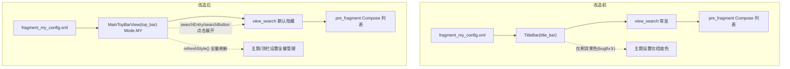
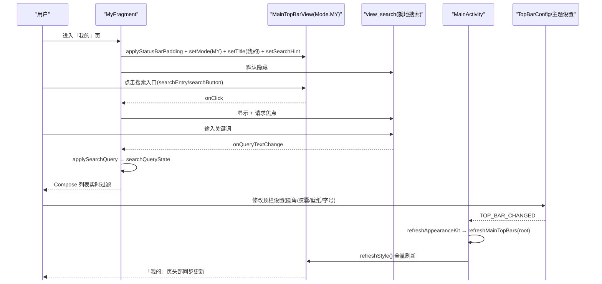

# design.md — 我的页头部统一

## Technical Approach

将「我的」页头部从 `TitleBar` 迁移到 `MainTopBarView`，复用书架/订阅/发现已验证的顶栏体系，为「我的」页新增 `Mode.MY` 形态，使四个主 Tab 页头部观感一致且全部受 `TopBarConfig` + 主题 token + `TOP_BAR_CHANGED` 事件管理。

整体改造示意：

## Architecture Decisions

### AD-01: 「我的」页头部改用 MainTopBarView 并新增 Mode.MY
- **Context**: 书架/订阅/发现三页共用 `MainTopBarView`，样式受 `TopBarConfig` 全量管理；「我的」页用传统 `TitleBar`，仅背景色接入（bugfix ③），观感不一致且无法被顶栏设置全量控制。
- **Concern**: 「我的」页头部与其他三页不一致，且用户多次要求统一未生效。
- **Decision**: 将 `fragment_my_config.xml` 的 `TitleBar` 替换为 `MainTopBarView`，在 `setMode` 中新增 `Mode.MY` 分支（`searchButton`/`moreButton` 可见，标题字号 20f）。
- **Goal**: 四页观感完全一致，头部样式被顶栏设置/主题设置/样式管理全量管理。
- **Tradeoff**: 顶栏高度略增压缩列表可视区；就地搜索框改为点击入口后展开。
- **Status**: Accepted

### AD-02: 保留就地搜索框而非跳转全屏搜索页
- **Context**: 书架/订阅/发现的 `searchEntry` 点击均跳转全屏搜索 Activity（`SearchActivity`/`RssSearchActivity`）；「我的」页现有能力是设置项就地过滤（`view_search` + `applySearchQuery`）。
- **Concern**: 「我的」页无全屏搜索 Activity，跳转方案需新建页面，改动大且偏离"头部统一"目标。
- **Decision**: 顶栏搜索入口点击 → 显示并聚焦就地 `view_search`，保留现有过滤链路。
- **Goal**: 保留「我的」页已有搜索体验，避免新建页面。
- **Tradeoff**: 交互从"常显搜索框"变为"点击展开"，一次交互变化。
- **Status**: Accepted

### AD-03: 复用 MainActivity 既有刷新链路，不新增事件
- **Context**: `MainActivity.refreshMainTopBars`（[MainActivity.kt#L697-L709](../../../app/src/main/java/io/legado/app/ui/main/MainActivity.kt#L697-L709)）已对 `MainTopBarView` 调用 `refreshStyle()` 全量刷新，对 `TitleBar` 仅 `refreshTopBarAppearance()`。
- **Concern**: 是否需要额外事件接入让「我的」页刷新。
- **Decision**: 不新增事件。「我的」页改用 `MainTopBarView` 后自动进入 `refreshStyle()` 刷新分支，`TOP_BAR_CHANGED` → `refreshAppearanceKit` → `refreshMainTopBars(root)` 链路天然覆盖。
- **Goal**: 最小改动达成全量管理，避免重复造轮子。
- **Tradeoff**: 无（复用现有已验证链路）。
- **Status**: Accepted

### AD-04: moreButton 承接原 main_my 菜单（帮助）
- **Context**: 「我的」页原 `TitleBar` 通过 `setSupportToolbar` 挂载 `main_my` 菜单（`menu_help` 帮助）。
- **Concern**: 移除 `TitleBar` 后帮助入口需迁移。
- **Decision**: `moreButton` 点击 → `showHelp("appHelp")`，保留帮助能力；若后续需多菜单动作再扩展 `ModernActionPopup`。
- **Goal**: 帮助入口不丢失。
- **Tradeoff**: 原菜单结构（仅一项）简化为单按钮直接触发。
- **Status**: Accepted

## Data Flow

## File Changes

| 文件 | 变更 |
|------|------|
| `app/src/main/res/layout/fragment_my_config.xml` | `TitleBar` → `MainTopBarView`（id=`top_bar`）；`view_search` 默认 `gone` |
| `app/src/main/java/io/legado/app/ui/widget/MainTopBarView.kt` | `setMode` 新增 `Mode.MY` 分支：`searchButton`/`moreButton` 可见，标题字号 20f；`applyDefaultStyle` 中 `Mode.MY` 与 `Mode.BOOKSHELF` 一致显示搜索按钮 |
| `app/src/main/java/io/legado/app/ui/main/my/MyFragment.kt` | 移除 `setSupportToolbar(binding.titleBar.toolbar)`；`onFragmentCreated` 接线 `binding.topBar`（Mode.MY/标题/搜索入口/更多菜单）；新增 `showSettingsSearch()`；移除 `onCompatCreateOptionsMenu`/`onCompatOptionsItemSelected`（迁移至 moreButton） |
| `app/src/main/assets/updateLog.md` | 编译前同步新增功能说明（统一「我的」页头部 + 顶栏主题全量管理） |

> `MainActivity.kt` / `TitleBar.kt` / `MySettingsScreen.kt` 本轮不改。
