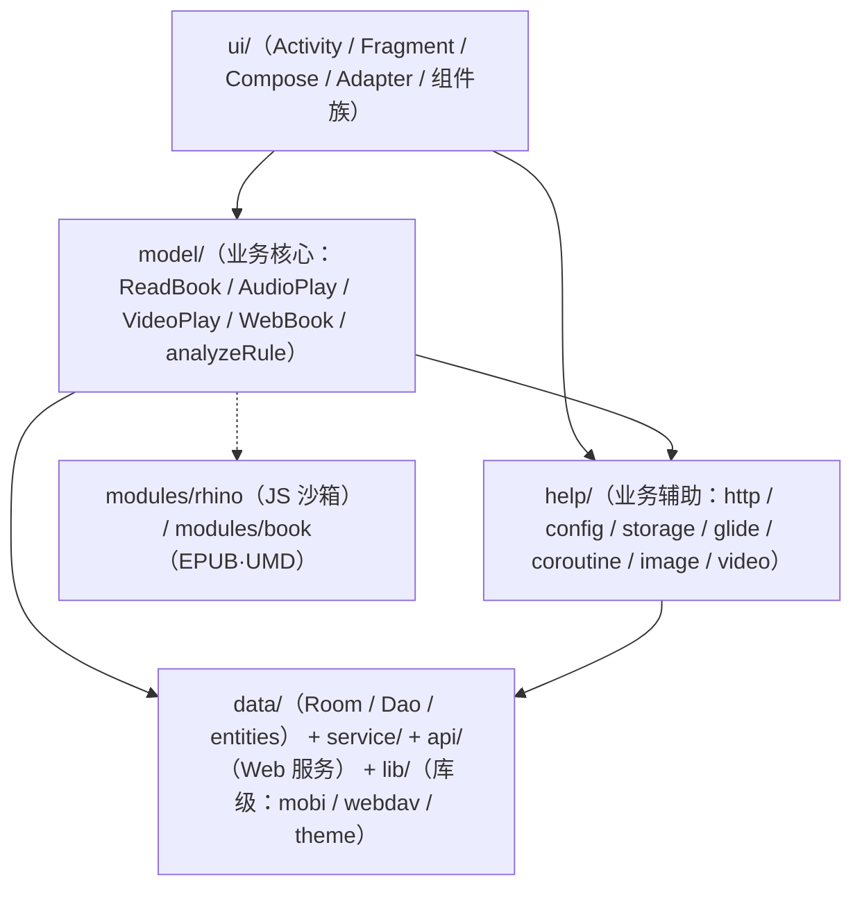
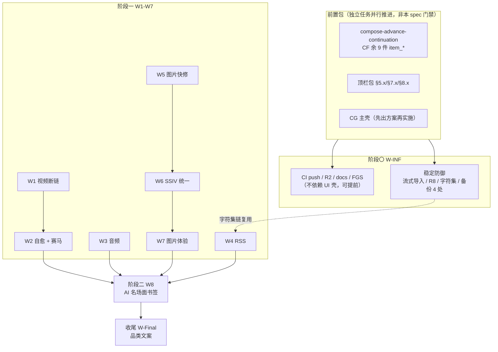
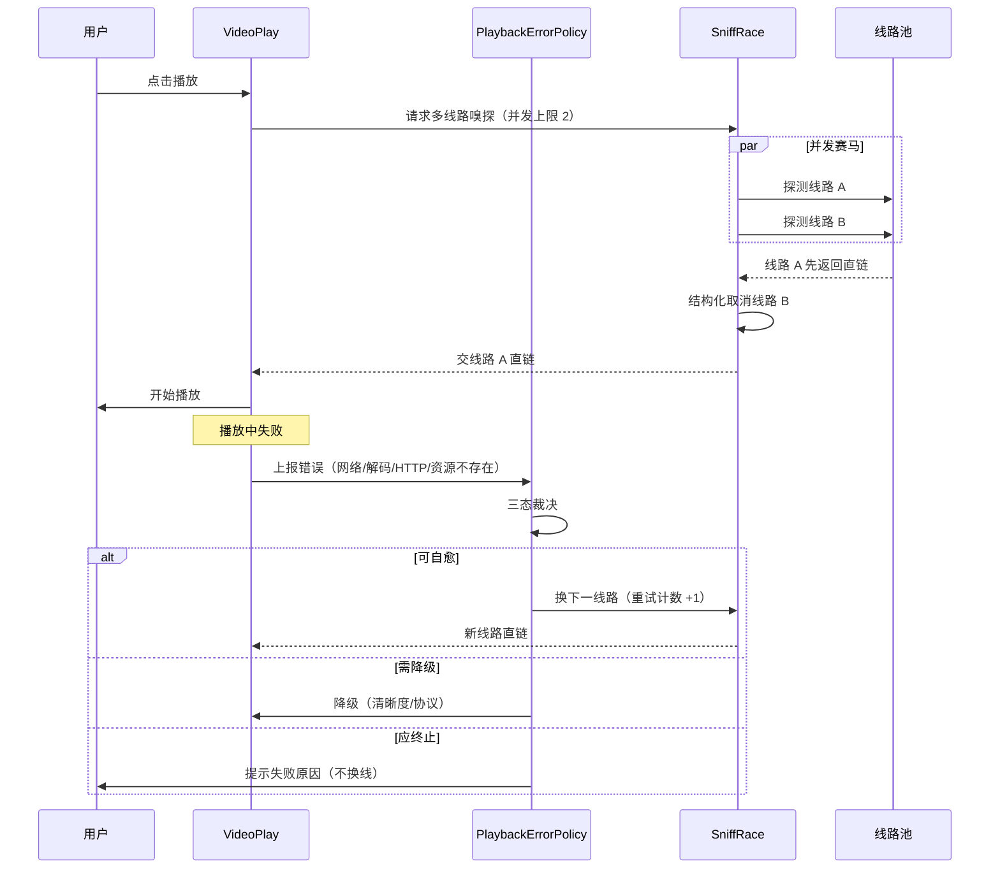
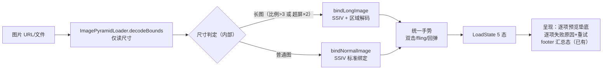
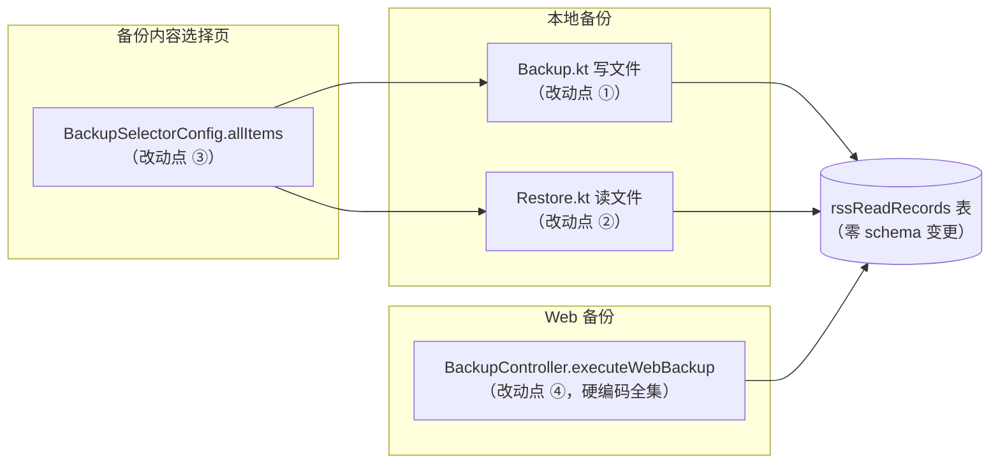

# design · 全内容平台下一阶段主线

> 状态：**设计完成**（检查点 1 通过 2026-09-27）｜ 版本：v4.0 ｜ 2026-09-27
> **所有落点均在 2026-09-27 经源码实证核实**（三路子代理 + 两轮深挖，60+ 锚点）；标注 `[校准]` 的为相对原需求文档已修正，标注 `[自校]` 的为本轮自我纠错。
> **本文档不给工时估算**：批次按依赖序执行，完成判据见 [tasks.md](./tasks.md) 与本文 §4 防线矩阵。

---

## 0. 产品与架构分析（为什么是这些批次、这个顺序、这样落地）

### 0.1 产品视角

#### (1) 产品定位与「六合一」

| 项 | 内容 | 来源 |
|---|------|------|
| **伞形定位句** | 「千方百计让用户看到想看的内容：**不挑源、不挑格式、不挑网络**」 | `M全内容平台产品定位纲领.md` §3.1 |
| **「六合一」** | 文字 / 漫画 / 图片 / 视频 / 音频 / RSS 六类内容全保（纲领原文：竞品最多二合一，M 是六合一） | 纲领 §3.7 |
| **旧定位（待替换）** | `README.md:13`/`:54` 现存「fork 自…（本项目**功能基座**）…UI 体系**深度对齐**…」= **附庸表述** | README 现状 |
| **去附庸化含义** | 由「上游 fork 的附庸/派生」转为**独立品类**；目标句「**用户因 M 而来，不是因 Archive 而来**」 | W8 详设原文 |
| **顺序铁律** | 「**先品类实，后品类名**」（品类实底未完成时改宣言是空头承诺） | 需求清单 §16 |

> ⚠️ **素材缺口**：需求清单排序依据引用的《M 去附庸化改造方案》v2（品类反转版）**在仓库中不存在**（`**/*附庸*` 零命中，仅被 3 处文档引用）。本 spec 的去附庸化论述由「纲领 §3.1/§3.7 + W8 详设 + 清单 §16」反推，**完整方案需另行补档**。

#### (2) 五维品类子定位 ↔ 本主线批次映射（**产品主线**）

> 这是本主线的**产品逻辑内核**：每个批次都对应一条**已定义的品类承诺**，而非"顺手修 bug"。

| 品类 | 子定位（纲领原文） | 承诺的四个维度 | 现状差距 | 对应批次 |
|------|-----------------|--------------|---------|---------|
| **文字** | 千方百计让用户**读到正文** | — | ✅ 已实践（自动换源） | 不在本主线 |
| **视频** | **必须看到视频** | 任何**线路** / 任何**格式** / 任何**防盗链**都要播 | ⚠️ RSS 视频路由断链 + `extractPrecise` 缺失 + 无自动换线 | **W1（断链）+ W2（自愈/赛马）** |
| **音频/TTS** | **听到书** | 听**得到** / 听**得连续** / 听**得算数** / 听**得安心** | ⚠️ 听书时长未计入、朗读段落未持久化 | **W3**（对应「听得算数」+「听得连续」） |
| **RSS** | **不错过更新** | 订**得上** / 记**得住** / 看**得见** | ⚠️ 已读不进备份（记不住）、无 OPML（订得上）、无全标已读（看得见） | **W4** |
| **图片/漫画** | **一直有图看** | 看**得见** / 看**得爽** / 看**得回来** | ⚠️ **「37 处断点」系纲领口径（仓库内无对应文件，无法复算）**；双轨手势不一致、长按无响应、加载无垫底（**后三项有源码实证**） | **W5（快修）+ W6（轨统一）+ W7（体验闭环）** |
| — | **代表作** | 「用户因 M 而来」的差异化 | Archive 无漫画无 AI | **W8** |
| — | **品类名收口** | 先实后名 | — | **W-Final** |

#### (3) 四横切承诺 ↔ 本主线支撑关系

纲领 §3.3 定义四条跨品类承诺（来源竞品基因：C1/C4←NewPipe，C2←Aniyomi，C3←Kavita）：

| # | 承诺（原文） | 本主线是否支撑 | 说明 |
|---|------------|--------------|------|
| **C1** | **零账号阅读**：不注册任何网站就能看所有内容 | ➖ 已实践 | about 页需显式宣告（**W-Final REQ-35**） |
| **C2** | **追踪跨内容统一**：阅读目标/时长/状态**跨所有内容类型共享** | ✅ **直接支撑** | 缺口正是「听书未进、视频未进」⇒ **W3 REQ-15** 是 C2 的关键拼图；`ReadRecordDailyHelper` 是 C2 的唯一实现载体 |
| **C3** | **你的图书馆**：本地文件与在线内容同为一等公民 | ➖ 长期项 | 本地书籍支持存在但入口偏深（不在本主线） |
| **C4** | **无广告是底线**：不是功能而是承诺 | ➖ 已实践 | about 页需显式宣告（**W-Final REQ-35**） |

#### (4) 用户旅程与断点

| 品类 | 旅程资料 | 本主线补齐 |
|------|---------|-----------|
| 图片/漫画 | ✅ 有**旅程地图（断点标注版）**：路径 A 图文订阅 8 阶段（进入→刷图流→看细节→保存分享→看前面→文章衔接→断网→退出）、路径 B 漫画 9 阶段 | W5 修 A4「重进回第一张」、B2「开箱默认禁用缩放」、B8「长按存图完全无响应」；W7 修 A7「断网」与加载垫底 |
| 视频 / 音频 / RSS / 文字 | ⚠️ 仅**断点清单**，无旅程地图 | 本主线按「断点 → 批次」归位（见 §0.1(2)）；**旅程地图缺失本身是产品债**，建议后续补 |

#### (5) 代表作与竞品定位

| 维度 | 内容 |
|------|------|
| **W8 项目定位（克制表述）** | 覆盖 3 条内容路径（正文 / 图片 / 漫画）的「跨内容场景书签」；**事实层差异点** = 本项目具备 AI 相关能力与漫画·图片能力（**不宣称「唯一 / 生态独一份 / 代差」** —— 未做竞品横向实测；原纲领的「代差」属**未经实证的定性判断**） |
| **必须补平**（基本功，非加分项） | OPML 标准、智能过滤、全文搜索、跨设备同步 ⇒ **W4 REQ-19（OPML）正是此项** |
| **相对差异点（项目自评，非实测；克制表述）** | 内容类型覆盖较广 + 来源开放 + 具备 AI 能力 + 具备多源赛跑能力 ⇒ W2（赛跑）、W8（AI）为强化项；**不宣称「唯一」**（未做竞品横向实测） |

> **🔴 表述纪律（用户 2026-09-27：「品牌化吹牛逼别吹过头了，懂了么」）**：本 spec 及 W-Final 交付物**一律**——① 只陈述**已交付 / 将交付能力**（可与代码或 REQ 逐条核对）；② **禁**竞品对比性夸张词（`唯一` / `独一份` / `生态唯一` / `代差` / `碾压` / `颠覆` / `无法跟进`）；③ 纲领原文的定性判断**须标注「项目自评，非实测」**；④ 纲领术语（「去附庸化」「品类宣言」「六合一」）在**实施文案中降级为平实描述**（如「全内容阅读器」）；⑤ 完整纪律见 [tasks.md](./tasks.md) §10 文案纪律（5 条）。

#### (6) 产品级取舍（本主线**不做**什么）

| 不做 | 产品理由 |
|------|---------|
| 双平台发布（Gitee） | 既有裁决：App 内置 GitHub 加速通道即够（避免维护双渠道） |
| telephoto 图片查看器 | 用户不可感（内部实现替换），留 P1 |
| 长尾 P1 池（≈45 项）与长期池（≈35 项） | 品类实底未完成前不铺长尾（避免"什么都做一点"） |
| 品类宣言文案（W-Final）提前 | **先实后名**——承诺未兑现就宣告会加速失望 |

### 0.2 架构视角

#### (1) 分层与依赖方向（实证）



- **四层**：UI → `model/`（业务）→ `analyzeRule/`（规则引擎）→ 基础设施（`data/` 网络/服务）
- **包语义**：`help/` = 业务辅助；`lib/` = 库级独立代码（不得反向依赖 model）
- **Gradle 模块**：`:app` 依赖 `:modules:rhino` 与 `:modules:book`（二者互不依赖）
- **无 DI 框架**：全局组件一律 `object` 单例或顶层 `by lazy`

#### (2) 本主线改动落点分布（架构影响面）

| 层 | 涉及文件数（估） | 批次 |
|---|---------------|------|
| `ui/` | 最多（W4 菜单 / W5 图片 / W6 消费点 / W7 漫画 / W8 库页 / W-Final about） | W4-W8, W-Final |
| `model/` | 中（W1 `VideoPlay` / W3 `AudioPlay`） | W1, W3 |
| `help/` | 中（W-INF `http`·`storage` / W2 新增 `player` / W4 新增 `rss` / W6 `image`） | W-INF, W2, W4, W6, W8 |
| `data/` | 少（W4 Dao 新增 `@Query` / W8 新增实体+迁移） | W4, W8 |
| `service/` | 少（W3 `BaseReadAloudService`） | W3 |
| 仓库外 | R2 Worker + `latest.json` | W-INF |

#### (3) 可复用共享设施（本主线**必须复用、不得新造**）

| 设施 | 位置 | 本主线复用批 |
|------|------|------------|
| 网络层 | `help/http/{HttpHelper,OkHttpUtils,SSLHelper,DecompressInterceptor}.kt`、`Cronet.kt` | W-INF, W1, W2, W4 |
| 协程封装 | `help/coroutine/Coroutine.kt`（`async/onStart/onSuccess/onError/onFinally`） | **全部批次** |
| 配置体系（五层） | `constant/PreferKey.kt`、`help/config/AppConfig.kt`、`ReadBookConfig.kt`（书籍级覆盖）、`ThemeConfig.kt`、`TopBarConfig.kt` | W1, W3, W4, W5, W7 |
| 存储与备份 | `help/storage/{Backup,Restore,BackupRestoreLock,BackupSelectorConfig}.kt`、`AppWebDav.kt` | W-INF, W4, W8 |
| 图片链 | `help/glide/*`（加载单源）、`help/image/ImageUrlExtractor.kt`、`ui/image/ImagePyramidLoader.kt` | W5, W6, W7 |
| 解析 | `model/analyzeRule/*`（五种解析 + `AnalyzeUrl`） | W1, W4, W8 |
| UI 组件族 | `ui/widget/components/*`、`ui/widget/compose/AppManagementScaffold.kt`、`ModernActionPopup.kt` | W4, W7, W8, W-Final |
| 工具横切 | `utils/EncodingDetect.kt`、`compress/ZipUtils.kt`、`help/CacheManager.kt`、`ConcurrentRateLimiter.kt` | W-INF, W4 |
| 进度持久化 | `data/entities/Book.kt` 的 `durChapterIndex/durChapterPos/durChapterTitle` | **W3**（AD-07） |
| 日志 / 事件总线 | `constant/AppLog.kt`、`constant/EventBus.kt` | 全部批次 |

#### (4) 硬约束（本主线必须遵守，摘自 `architecture_rules.md` / `naming_rules.md`）

1. **禁止 DI 框架**（Hilt/Dagger/Koin）；全局组件用 `object` 单例或顶层 `by lazy`
2. 共享态 `object`（`ReadBook` 等）改状态须 `@Synchronized`/`Mutex`
3. **Room 版本以 `AppDatabase.kt` 的 `version` 为准**（文档禁硬编码快照）；**禁 `fallbackToDestructiveMigration`**
4. 业务异常继承 `NoStackTraceException` 并覆写 `fillInStackTrace()`
5. 协程统一 `Coroutine.async{}...onError{}.onSuccess{}`；**禁 Timber / `CoroutineExceptionHandler`**；双版本 `xxx()` + `xxxAwait()`
6. 日志用 `AppLog.put`，**禁直接用 `android.util.Log`**（release 会被移除）
7. `kotlin.runCatching`（带 `kotlin.` 前缀）；判空 `isNullOrBlank()`
8. 命名后缀约定：`Helper/Config/Extensions/Controller/Service/Dao/Rule/Manager/Interceptor`；方法 `up` 前缀、`Await` 后缀；变量 `dur` 前缀
9. Compose 列表写回**禁** `SnapshotStateList.set(index, x)`，统一 `SnapshotListUpdates.replaceAt`
10. Compose 取色**禁**硬编码色号与 M3 派生色（`surface/surfaceVariant/onSurface/secondaryContainer`）
11. **依赖锁定**：jsoup 1.16.2 / rhino 1.8.1 / commons-text 1.13.1 / hutool 5.8.22 / protobuf 4.26.1 禁升级
12. Gson 反序列化模型（含 `List<Model>`/`Map<K,Model>`）**一律 `@Keep`**（R8 会剥离未 pin 的签名）

#### (5) 技术债 ↔ 本主线偿还关系（架构治理视角）

| # | 技术债（实证） | 本主线是否偿还 |
|---|--------------|--------------|
| 1 | **图片呈现双轨**（`ImageCanvasAdapter` 长图→SSIV、普通图→`PhotoView`，两套手势） | ✅ **W6 偿还**（呈现轨归一 + `PhotoView` 退役） |
| 2 | 音/视频状态双轨（`AudioPlay.status` 与 pause 双轨；GSY `currentState` 与 Media3 回调双轨） | ⚠️ **部分**：W2 会在 `PlaybackErrorPolicy` 中统一错误态口径，但状态双轨整体不属本主线 |
| 3 | **事件三机制并存**（LiveEventBus + MutableLiveData + MutableStateFlow，无统一口径） | ➖ 不偿还（本主线不新增第四种；新代码跟随所在模块既有机制） |
| 4 | View/Compose 双栈残留（`ReadRecordActivity` 壳层自绘、主界面 TitleBar managed 分支） | ➖ 不偿还（属 compose 包范围） |
| 5 | 常量命名两派（UPPER_SNAKE vs camelCase） | ➖ 新增常量一律 UPPER_SNAKE_CASE（不追溯存量） |
| 6 | 适配器/行组件重复（`CacheManageScreen` 未挂单源） | ➖ 不偿还（属 UI 收敛范围）；**但 W7 长按菜单与 W8 库页必须复用组件族，不得新增第三种** |
| 7 | 历史 API 面冗余（`UrlRecordDao` 窄查询未删；544 未用 string + 15 drawable；47 测试文件复写探针 —— **以上计数出自项目既有架构分析/交接文档，本 spec 未独立复算**） | ⚠️ **部分**：W6/W7 收口项（`photo/` 包与布局按引用评估退役）+ **G-14 死件门禁**兜底；存量 544 string / 15 drawable 不在本主线 |
| 8 | 遗留注释代码（`BaseReadAloudService.kt:809` `putLong` 注释残片） | ✅ **W3 处置**（**删除注释残片**，改走「新增专用字段」路径；不留悬空注释） |
| 9 | 备份并发（曾双 Mutex，已由 `BackupRestoreLock` 统一） | ✅ **W-INF REQ-07 补齐最后一处**（`executeWebBackup`） |
| 10 | 单源缺失（`sourceSharedCache` 未落地；图片消费点 6 处待替换） | ⚠️ **部分**：W6 完成消费点替换；`sourceSharedCache` 不在本主线 |

#### (6) 跨批次共享模式：判断与建议

> 原则：**能复用就复用，但不为"统一"而引入过度抽象**（对齐项目「极简 = 无冗余」哲学）。

| # | 模式 | 是否存在 | 判断与建议 |
|---|------|---------|-----------|
| 1 | **外部数据解析边界层** | ❌ **不存在统一层** | 现状"按入口各写各的"（`EncodingDetect` 只管编码、`ImageUrlExtractor` 图片专用）。**不建议合成单一 parse 层**（OPML / 万条 JSON / `<video>` / 字符集语义差异过大，会造出万能参数对象）。**建议只提炼两个薄边界**：(a)「大文件流式读取 + 字符集探测 + 失败明细报告」（W-INF / W4 共用）；(b)「文本/DOM → 候选媒体 URL 多策略降级」（W1 `<video>` 检测与 `ImageUrlExtractor` 静态策略集**同形态**，可复用其策略集）（注：此「同形态」为**判断，非实证**；实施前需先核对 `ImageUrlExtractor` 策略集是否可直接复用） |
| 2 | **图片加载轨** | ✅ **加载轨已统一**（**证据**：`help/glide/{ImageLoader,OkHttpModelLoader,LegadoGlideModule,OkHttpStreamFetcher}.kt` 构成唯一加载链 + 磁盘缓存 + 失败回退），双轨**仅存于呈现层**（呈现分流见 `ImageCanvasAdapter.kt:754` 一带） | W6 收敛**呈现轨**；W7 把「归一 + 状态呈现 + 离线预取」定义为**图片消费契约**（Adapter 侧统一入口），**禁止再新增第三种视图**。这修正了 §1.7 的表述：不是"两套加载轨"，而是"一套加载轨 + 两套呈现" |
| 3 | **配置项新增（六步流水线）** | ⚠️ **已有雏形未成流水线** | 固化为六步：`PreferKey` 常量 → `AppConfig` 属性（默认值 + 预加载监听）→ `DefaultData` 迁移（如需）→ 备份覆盖判定（`LocalConfig` 不备份）→ 设置页 key → **消费点回执**。W1/W3/W4/W5/W7 的新增开关全部套用此流水线 |
| 4 | **菜单项新增** | ✅ **已成熟且已有门禁** | Compose 侧 `AppManagementAction`/`AppManagementMenuAction` + `AppDropdownMenu` + `MenuAction`（`alwaysShow`/`danger`）；View 侧 `ModernActionPopup`。**`ui-standards/architecture.md` 明文禁止新建系统菜单/PopupMenu/自绘浮层** ⇒ W4 双入口菜单直接复用 |
| 5 | **备份项新增（四处同名）** | ⚠️ **存在但无显式登记表** | 显式化为检查表：① `Backup` 清单 ② `Restore` 反序列化 ③ `BackupSelectorConfig` 勾选 ④ Web 控制器（+ 前端）。W4 与 W8 均须走此表（**AD-20**） |
| 6 | **进度持久化** | ⚠️ **既有 `dur*` 系列不可复用（多义）** | `Book.durChapterPos` 被**文字（首行字符索引）**与**漫画（图片序号，`ReadManga.kt:255-256`/`:337`）**共享 ⇒ **W3 必须新增专用字段 + 自成迁移**（AD-07 v3），不得复用 |

#### (7) 本主线对架构的净影响（**以下为估算，非实测**）

| 维度 | 净影响 |
|------|-------|
| **单源化** | +3（图片呈现轨归一；备份项四处登记表；错误裁决策略单源） |
| **技术债** | −3（双轨呈现、备份并发最后一处、悬空注释）；+0 新增债（不引入新依赖、不新建菜单体系、不新增第三种图片视图） |
| **新增抽象** | +2 **薄**边界（大文件流式读取边界、媒体 URL 多策略降级边界）——**克制范围**，不做万能 parse 层 |
| **架构模式新增** | 图片消费契约（W7 定义）、配置项六步流水线、备份项四处检查表 |

### 0.3 本主线自设设计原则

| # | 原则 | 落地要求 |
|---|------|---------|
| P1 | **只增不换** | 改动优先"新增分支/参数"而非"替换既有行为"（如 `postForm` 加可选 charset、`getEncode` 加降级分支），降低回归面 |
| P2 | **复用既有单源** | 见 §0.2(3)；**不得新造**加载轨 / 菜单体系 / 配置体系 / 备份体系 / 进度存储 |
| P3 | **不引入新依赖** | 继承 compose 包约束；SSIV 已在、`JsonReader`/`jsoup` 已在、OPML 手写（无需新库） |
| P4 | **不做过度抽象** | 仅在"两处以上真实同形态"时才提炼（如 §0.2(6) 的 (a)(b) 两薄边界），其余保持就地实现 |
| P5 | **每批可回滚** | 每任务独立提交；**高风险任务显式回滚点**（见 §4.3）；开关类改动优先用开关降级而非 revert |
| P6 | **遵守全部子规范与卡点** | 见 §7 合规矩阵；**子规范不是可选项** |

---

## 1. Technical Approach（逐批实施细节）

### 1.0 通用实施约定

| 约定 | 内容 |
|------|------|
| 新增配置项范式 | ① `constant/PreferKey.kt` 加 `const val`（范本 `:283 disableMangaScale`）；② `help/config/AppConfig.kt` 加 object 代理（范本 `:2703-2706`）；③ 配置页 UI + 回执；④ 中文案入 `values/strings.xml` + `values-zh/strings.xml` |
| 新增菜单项范式（Compose） | 不加 menu XML：`buildList { add(MenuAction(icon, title, onClick)) }`（范本 `ReadRssActivity.buildMenuActions():447-537`）；管理页用 `AppManagementMenuAction`（范本 `RssSourceActivity.pageMenuActions():227-254`） |
| 新增备份项范式 | **必须四处同名同文件**（见 1.5） |
| 协程 | 用 `Coroutine.async{}.onError{}.onSuccess{}` 链式；异常用 `Coroutine.onError`；日志 `AppLog.put` |
| 注释 | 复杂/非自明处必须注释，且与代码行为一致；改动致旧注释过时须同步纠正 |

---

### 1.1 W-INF · 工程基建与稳定防御

#### (1) CI push 触发重启用（REQ-01）
- 现状：`test.yml:4-14` 与 `release.yml:4-8` 的 `on: push` 被注释；注释原文说明「本 fork secrets 未配置，push 只产生幽灵失败记录」（`test.yml:4-5`）。当前触发 = `pull_request` + `workflow_dispatch`。
- 改动：**先决条件为 secrets 就绪**；就绪后取消 `on: push` 注释，保留 `workflow_dispatch`；`paths-ignore`（web 模块）保持。
- 可测判据：`workflow_dispatch` 手测产包成功 → 开 push → `git push` 后 30 分钟内 Actions 出签名 APK。

#### (2) R2 download-gate（REQ-02）
- 现状：`download-gate` / `latest.json` / Worker **全仓零匹配**；仅 `lib/cloud/S3Config.kt:70-79,156` 识别 `*.r2.cloudflarestorage.com` 自动区域（与本项无关）。
- 交付物（仓库外 + CI 末端）：
  - Worker：请求校验凭证 → 命中则 `302` 到 R2 对象（或流式回源） → 未命中拒绝；
  - `latest.json`：发布链末端写入（版本号、产物名、大小、sha256、发布时间）；
  - 客户端：更新检查可用门控 URL（与既有 GitHub 加速通道并存，非替换）。
- **凭证边界（AD-17）**：凭证存服务端环境变量，**不发版可轮换，客户端不硬编码**；若必须客户端携带则明示「软门控」定位。

#### (3) docs 口径定义（REQ-03）
- 现状：`project-flow`=87 篇、`project-rules`=27 篇 ⇒ 「4→8 篇」**口径不明**。
- 改动：**先定义清单再补齐**。**「8 篇」=「主题覆盖清单」的 8 个主题**（非文件数）：
  ① 构建发布 → `docs/project-flow/build-apk-guide.md`（已存在）
  ② 测试指南 → `docs/project-rules/ai_e2e_testing_workflow.md`（已存在）
  ③ 自动任务 → `docs/project-flow/`（核对）
  ④ 网络栈 → `docs/project-flow/`（核对）
  ⑤ 数据库迁移 → `docs/project-rules/database-migration-safety.md`（已存在）
  ⑥ 前端 UI → `docs/project-rules/frontend-ui-standards.md`（已存在）
  ⑦ 门禁体系 → `docs/project-rules/process-gate-architecture.md`（已存在）
  ⑧ 发布流程 → `docs/project-flow/`（核对）
  逐项核对，**仅补确缺主题**，不得为凑数新增。
- 验收：`docs/INDEX.md` 无死链、8 个主题各有入口文档。

#### (4) FGS 时限风险处置（REQ-04）`[校准]`
- 现状：`AndroidManifest.xml:700-786` **所有 service 均显式声明 type**（`dataSync` ×10 / `mediaPlayback` ×5 / `dataSync|shortService`（`AutoTaskService:756`）/ `specialUse`（`RelayService:781`））⇒ **无「缺 type」缺陷**。
- 真风险：Android 15 对 `dataSync` 有 **每 24h 累计 6h** 上限；先例 = `DlnaCastService` 已改 `mediaPlayback`（注释 `:745-746`）。
- 改动：**评审 + 登记**，不改 type 除非评审认定受影响：① 对累计可能超 6h 的 `dataSync` 服务评估切 `mediaPlayback`/`shortService`；② 结论写入 `docs/project-rules/`（含已知上限与用户可见表现）。
- 回滚：纯评估文档 ⇒ 独立提交 revert（零代码影响）；若评审决定改 type，则该处单独提交并保留回退点。

#### (5) 大文件流式导入（REQ-05 / AD-13 / AD-18）
- 现状（实证）：`ui/association/ImportBookSourceViewModel.kt` 三处一次性入内存：
  - `:214` 文本分支 `GSON.fromJsonArray<BookSource>(mText)`
  - `:230` uri/本地流分支 `GSON.fromJsonArray<BookSource>(inputS)`
  - `:298` 网络流分支 `GSON.fromJsonArray<BookSource>(it)`
- 改动：抽公共增量解析函数，三条路径统一：

```kotlin
// 新增（落点定为 help/source/BookSourceIncrementalParser.kt —— 预置决策 §9.2#4；单源）
suspend fun parseBookSourcesIncremental(
    reader: Reader,
    onEach: (BookSource) -> Unit,
    maxBytes: Long = MAX_IMPORT_BYTES,      // 读取阶段上限（AD-18）
    maxCount: Int = MAX_IMPORT_COUNT,
): Int
// 实现要点：JsonReader.beginArray() 后逐条 next() → GSON.fromJson(reader, BookSource::class.java) → onEach
//          计数达 maxCount 即抛（防 DoS）；读取累计字节达 maxBytes 即抛；异常带条目序号便于定位
```
- 三处替换为：`parseBookSourcesIncremental(...) { allSources.add(it) }`；**保留原 `when` 分支语义**（`sourceUrls` / 单对象 / 数组 / URL / uri / 报错），仅替换「整表反序列化」这一动作。
- 边界：超限在**读取阶段**拒绝并提示；解析失败不留半成品（`allSources` 仅在成功完成时定型，或用临时列表再 `addAll`）。
- **能力边界澄清（自校，四方审查反方命中）**：**本项不是「内存 O(1)」** —— 解析结果经 `onEach` 累积进成员 `allSources`（`ImportBookSourceViewModel.kt:76` 的 `arrayListOf<BookSource>()`），而 `comparisonSource()`（`:308-318`：空源剔除 + 查重后 `allSources.clear()/addAll(kept)`）与 `importSelect`（`:156` 按下标取值、`:332` `forEachIndexed` 校验）**都需全量列表**。因此流式改造消除的是**「原始 JSON 文本」与「中间 List 副本」两份额外常驻**（峰值约 2-3N → 约 1N），**峰值仍为 O(N)**。若要真正 O(1) 需重构 `comparisonSource`/`importSelect` 为「流式消费 + 增量落库」，**远超本项范围**（列为长期项，不在本主线）。

#### (6) R8 JNI keep 兜底（REQ-06）
- 现状：`app/proguard-rules.pro` 共 **69 条** `-keep`；JNI 相关集中在 `:141-214`（Cronet provider / `org.chromium.**` / `internal.org.jni_zero.**`）；**无通用 native 兜底**（`native` 仅出现在注释 `:160`/`:185`）。
- 改动（新增一行 + 门禁）：

```proguard
# JNI 通用兜底：声明 native 方法的类的成员名不得被混淆/移除
-keepclasseswithmembernames class * { native <methods>; }
```
- 验收：release 包运行无 native 缺失；跑 `audit_gson_generic_signature.py` 双包审计（连带回归）；体积对比无明显增长。

#### (7) 备份失败消息非空兜底（REQ-08）
- 现状三条路径：
  - `api/controller/BackupController.kt:131` → `setErrorMsg("备份失败: ${error.message}")`（`message` 可 null）
  - `ui/config/BackupConfigFragment.kt:615-623` → `e.localizedMessage`（可 null）
  - `lib/webdav/WebDav.kt:473-484` → `code:xxx:`，`:484` 已有「未知错误」兜底
- 改动：统一非空口径，例如 `error.message?.takeIf { it.isNotBlank() } ?: "未知错误"`；三处一致。

#### (8) Web 备份纳入共享锁（REQ-07）`[校准]`
- 现状（实证）：`help/storage/BackupRestoreLock.kt:19-28` = 单例 `Mutex` + `withStorageLock`；`Backup.autoBack` / `backupLocked` / `Restore.restoreAll` / `restoreLocked` **均已持锁**；仅 `api/controller/BackupController.kt:100-108`（`backupScope.launch { executeWebBackup() }`）**未纳锁**，其 `:171-192 executeWebBackup()` 逐条 `writeListToJson(..., webBackupPath)`。
- 改动：`executeWebBackup()` 主体包进 `BackupRestoreLock.withStorageLock { ... }`。
- **铁律（`BackupRestoreLock.kt:13-17`）**：唯一清空/写 `Backup.backupPath` 的入口须经锁；**锁不可重入** ⇒ 临界区内**禁止**再调 `Restore.restoreLocked` / `Backup.backupLocked` / `withStorageLock`。

#### (9) 字符集与 form 编码补强（REQ-09）`[自校]`
- 现状（实证，**推翻了原文档与本 spec v1.0 的判断**）：
  - `OkHttpUtils.text():96-112` **已实现三级优先**：显式 `encode` → `contentType()?.charset()` → `EncodingDetect.getHtmlEncode(bytes)` ⇒ **第一级不需要新增**。
  - `EncodingDetect`：`getHtmlEncode(bytes):18`（`<head>` 内 meta charset/http-equiv）→ `getEncode(bytes):55`（`CharsetDetector().setText(bytes).detect()`，无匹配回落 `"UTF-8"`）→ `getEncode(filePath):63` / `getEncode(file):70`；`getFileBytes(file):78` 固定读 **8000 字节**。
  - `AppConst.kt:100-101` 已有候选表 `["UTF-8","GB2312","GB18030","GBK","Unicode","UTF-16","UTF-16LE","ASCII"]`（但**未被 `EncodingDetect` 使用**）。
  - `postForm(encodedForm)` / `postForm(map, encoded)` 用 `FormBody`，**默认 UTF-8，无 charset 参数**。
- 改动收敛为两件：
  1. `EncodingDetect.getEncode` 命中 GBK/GB2312 时按 `AppConst.charsets` 顺序尝试 **GB18030 降级**（GBK 超集），失败再回落 UTF-8；日志记录最终采用与来源（meta/统计/回落）。
  2. `postForm` 增可选 `charset`（默认 UTF-8，保持零变化）：指定非 UTF-8 时改用带 charset 的 `MediaType` + `toRequestBody`。
- 影响面：`text()` 入口广（书源/订阅/OPML/导入共享），改动以**只增不换**为原则。

---

### 1.2 W1 · 视频断链修复

#### 现状（实证）
`VideoPlay.startPlay`（`:1021-1104`）内对 `content` 三分支：
- `content.isEmpty()` → `VideoUrlExtractor.extractWithWebView(url, source, R5_DELAY_TIME, R5_TIMEOUT)`
- `content.contains("<MPD")` → 另一支
- else → `NetworkUtils.getAbsoluteURL(rssArticle.link, content)` → `isValidVideoContentUrl(resolved)` 成功即用；**失败则直接降级 R5 嗅探**（日志 `"P3-1: ruleContent返回非视频URL, 降级R5嗅探"`）→ 未命中回退 `rssArticle.link`

`VideoUrlExtractor`（`help/video/VideoUrlExtractor.kt`）：
- `fun extractPrecise(html: String, baseUrl: String): List<String>`（`:179`）
- `suspend fun extractWithWebView(url: String, source: BaseSource?, delayTime: Long = R5_DELAY_TIME, timeout: Long = R5_TIMEOUT): SniffCandidate?`（`:234`）；**含内存去重锁** `r5InProgress`（**`:70`**，说明注释块 `:56-68`），key = 完整 URL ⇒ 改造时**勿破坏去重 key**。
- `isValidVideoContentUrl` 定义在 `VideoPlay.kt:1650`。

`ReadRssViewModel.loadContent`（`:117-132`）：`Rss.getContent(...).onSuccess { body -> ...; contentLiveData.postValue(body) }` ⇒ **原样送 WebView，无 `<video>` 检测**。入口 `refresh():134-149` 仅在 `ruleContent` 非空时调用。

内置播放器路由目标（`ReadRss.kt:172-177` Fragment 版 / `:97` Activity 版）：
```kotlin
startActivity<VideoPlayerActivity> {
    putExtra("sourceKey", rssArticle.origin)
    putExtra("sourceType", SourceType.rss)
    putExtra("record", rssArticle.link)
    putExtra("videoTitle", rssArticle.title)
}
```
**跳转前必须**先备好上下篇上下文。**不得逐字段名各写一遍** —— 抽**单一实现** `prepareVideoPlayContext(article, articles, index, hasMore)`（置于 `VideoPlay` 或 `ReadRss` 既有写入路径旁），内部复用 `ReadRss.kt:77-96` / `:141-171` 的既有写入（`VideoPlay.rssArticles` / `rssArticleIndex` / `rssSort*` / `rssNextPageUrl` / `rssArticlePage` / `rssArticlesHasMore`）；**两处调用点**（`ReadRss` 原路由 + `ReadRssViewModel` 新增路由）**均调此函数**，避免两条路由分叉。

#### 改动
1. **REQ-10 `extractPrecise` 补位**：在 `else` 分支 `isValidVideoContentUrl(resolved)` 失败处，**先**试 `extractPrecise(content, rssArticle.link)`：
   - 返回非空 → 取首个（或按既有单/多 URL 语义）作为 `mUrl`；
   - 返回空 → **保持原 R5 嗅探链**（两层防护不删）；
   - 日志补 `extractPrecise` 命中/未命中与耗时，便于度量「秒级出直链」。
2. **REQ-11 `<video>` 自动路由**：在 `ReadRssViewModel.loadContent` 的 `onSuccess(IO)` 内，`body` 落库**之前**插入检测（见下方伪码），命中则走与 `ReadRss.kt:172-177` **同一路由**（抽公共函数避免两处分叉），失败/未命中保持原 `contentLiveData.postValue(body)`。

```kotlin
// 检测（置于 help/rss/RssVideoDetector.kt 单源；空/极短直接跳过；超长按上限截断——AD-18）
private fun detectVideoInHtml(body: String): Boolean {
    if (body.length < MIN_VIDEO_SCAN_LEN) return false
    val html = if (body.length > MAX_VIDEO_SCAN_LEN) body.substring(0, MAX_VIDEO_SCAN_LEN) else body
    return runCatching { Jsoup.parse(html).select("video").isNotEmpty() }.getOrDefault(false)
}
```
3. **REQ-12 提示开关**：新增配置键**必须为 `rssAutoVideoToPlayer`**（默认 `true`；**禁止改键名**，须过 `PreferKeyUniquenessTest`；预置决策见 §9.2#2）+ 设置项 + RSS 阅读菜单项（双入口）；关闭时不检测/不路由。

#### 边界
- 检测**不阻断**正文落库；任何检测异常一律视为「未命中」走原路径（不因检测失败丢正文）。
- 自动路由后用户仍可经返回回到阅读页（不改返回语义）。

---

### 1.3 W2 · FongMi 播放体系

详设已备，**直接实施**，但**必须**按 AD-04/AD-05 加约束：
- 新 `help/player/PlaybackErrorPolicy.kt`：错误分类（网络 / 解码 / HTTP 状态 / 资源不存在）→ 三态裁决（自愈换线 / 降级 / 终止）；**重试上限 3 次 / 冷却 60s**（预置决策见 §9.2#16）；不可自愈类**不换线**。
- 新 `help/player/SniffRace.kt`（约 150 行，含 `Strategy`/`race`）：并发上限 **2**；先到即**结构化取消**其余；**连续失败 3 次进冷却（60s）**；可配开关（预置决策见 §9.2#1）。
- 视频侧接入 `help/gsyVideo/Exo2MediaPlayer.kt`（已有 IO_BAD_HTTP_STATUS 重试 / 7001 重建 / 指数退避 ⇒ 策略需与之**合并而非叠加**，避免双重重试）。
- **音频侧补齐**（现为**零自愈**）：接入点 = `service/AudioPlayService.kt` 的 `onPlayerError`（**`:411`**）；**同类点** = `service/HttpReadAloudService.kt` 的 `onPlayerError`（**`:786`**，HTTP 朗读链路）。两处均返回策略裁决结果（换源 / 降级 / 终止），**不**自行 `release()`；策略实例与播放会话同生命周期，会话结束即复位重试计数与冷却态。

#### 实施收口（2026-09-27 落地，与上文的差异逐条登记）

1. **落点**：`help/player/PlaybackErrorPolicy.kt`（本 spec 口径；两份 2025 详设写的 `help/exoplayer/` 已按 tasks 3.1 更正）。
2. **三态命名**：`PlaybackErrorAction.SELF_HEAL / DEGRADE / ABORT`（本 spec AD-04 口径；详设的 `RECOVERED/RETRY_DECODE/FATAL` 未采用）。
3. **视频侧接入点 = 4 个「终端点」**（不是整条 1265 行长链）：`Exo2MediaPlayer.onPlayerError` 中 SSL 失败 / 末端解析失败 / 不可恢复阈值耗尽 / 通用终端四处，插入 `if (handleTerminalErrorByPolicy(error)) return`。既有分支**逐行未改** ⇒ 满足「合并而非叠加」（无双重重试）；`DEGRADE` 复用既有 `tryNextFallback()`。
4. **线路级换线落在 UI 层**：`VideoPlay.routeSelfHealSession`（单例，播放器侧与 UI 侧共用）+ `VideoPlay.lastPlaybackErrorKind`（播放器侧写入）；`VideoPlayerActivity` 的统一错误观察点调用纯函数 `PlaybackErrorPolicy.decideRouteSelfHeal(kind, routeCount, currentIndex, session)` 决定「换下一条线路（末条回卷）」或「弹错误框」；成功换线给线路名 toast（用户可见）。
5. **音频 DEGRADE 实现**：`AudioPlay.reloadPlayUrl()`（**先清 `durPlayUrl` 再走既有 `loadOrUpPlayUrl`**）—— 否则同地址非空时等价原地重播，等于没有换链。
6. **朗读链阈值统一**：`HttpReadAloudService` 原硬编码「连续 5 次」改为同一 `PlaybackErrorSession`（3 次 + 冷却 60s）；自愈动作（删坏缓存 + 推进下一段落）与终止动作（`pauseReadAloud`）**沿用原代码**，只换判据来源。
7. **赛马策略集**：`Extension`（零请求 / `canWin=false` / **不占并发额度**）+ `Range`（权威）+ `M3u8PreCheck`（**仅当 `guessTypeByUrl(url) == null` 时加入**，控请求面）；「并发上限 2」只约束网络类策略 ⇒ 瞬时兜底不会被慢策略饿死。开关 `sniffRaceEnabled`（默认 true）与冷却期均回落 `sniffVideoTypeSerial`（原串行链逐行保留 = 零回归回滚点）。
8. **实施期挖出的连带缺陷**：W1 2.2 的自动路由因 `rssArticles=null` 而「进了播放器但不播」⇒ 已在 `ReadRss.prepareVideoPlayContext` 兜底单篇列表并加回归用例（见 `issues-found.md` IF-01）。

---

### 1.4 W3 · 音频

#### 现状（实证，含本轮自我校准）
`model/AudioPlay.kt`（**注意：不在 `model/audio/` 下**）的 `upReadTime()`（`:139-149`）：
```kotlin
fun upReadTime() {
    if (!AppConfig.enableReadRecord) return
    executor.execute {
        readRecord.readTime = readRecord.readTime + System.currentTimeMillis() - readStartTime
        readStartTime = System.currentTimeMillis()
        readRecord.lastRead = System.currentTimeMillis()
        runBlocking(IO) { appDb.readRecordDao.insert(readRecord) }
    }
}
```
→ **只写 `readRecord`，未调用 `ReadRecordDailyHelper.record()`**。
`AudioPlay.pause()`（`:268-275`）：仅 `readStartTime = System.currentTimeMillis()` + 发 `IntentAction.pause` ⇒ **只重置不结算**。

正确范式（`ReadBook.upReadTime():574-587`）末尾调用 `ReadRecordDailyHelper.record(delta, now, forceWidgetUpdate)`（`:585`）。
`ReadRecordDailyHelper.record(readTime: Long, timestamp: Long = now, forceWidgetUpdate: Boolean = false)`（`help/ReadRecordDailyHelper.kt:16-42`）：按 `timestamp` 归日 → `readRecordDailyDao.get(dateKey)` 累加 → `insert` → 刷新 `ReadGoalWidgetProvider` / `ReadRankWidgetProvider`；`readTime <= 0` 直接 return。

#### 改动
1. **REQ-15 听书时长**
   - `upReadTime()`：计算 `delta = now - readStartTime` 后，除既有 `readRecord` 写入外，**同处调用** `ReadRecordDailyHelper.record(delta, now, forceWidgetUpdate = false)`；**保持** `AppConfig.enableReadRecord` 早退语义。
   - `pause()`：**先结算再重置**（`upReadTime()` 一次，再置 `readStartTime = now`），消除「最后一次 `upReadTime` 到 pause 之间时长丢失」的 B5 偏差。
   - 注意：`record()` 内有 `readTime <= 0` 守卫，天然防重复计数；但须确保**同一次 delta 不被两处各记一次**（`upReadTime` 与 `pause` 不叠加）。
2. **REQ-16 段落级恢复（专用字段 + 自成迁移；口径二次反转）**
   - ~~复用 `Book.durChapterPos`~~ **已否决（四方审查实证）**：`Book.durChapterPos`（`Book.kt:105` 注释「首行字符的索引位置」）是**多义共享字段** —— **漫画路径把它当图片序号**（`ReadManga.kt:255-256` `durChapterPos.coerceIn(0, it.imageCount - 1)`；`:337` `book.durChapterPos = durChapterPos`）。第三处（TTS）复用会与文字滚动位置 / 漫画页码**互相覆盖**。
   - `Book` 现有进度字段（`data/entities/Book.kt:93-110`）：`durChapterIndex` / `durChapterPos`（多义，见上）/ `durVolumeIndex` / `chapterInVolumeIndex` / `durChapterTitle` / `durChapterTime`。
   - 改动：**新增朗读专用锚点字段**（如 `voiceParagraphAnchor: Int = 0`）+ **W3 自成一次迁移 `110 → 111`**；写入时机 = 段落切换 / 暂停 / 服务销毁（避免高频写库）；重进朗读读回该字段定位段落。
   - **校验口径修正**：`readAloudNumber`（`:137`）实测语义 = `getReadLength() + startPos` 的**字符长度累计**，**不是段落序号** ⇒ 不得当"段落序号"做一致性校验；改用「锚点字段 + 当前位置重算」校验，冲突回落段落起点。
   - **`:809` 注释残片处置（明确动作）**：`BaseReadAloudService.kt:809` 的 `putLong` 为**注释态**（历史遗留、非活跃）。**裁决 = 随本任务删除** —— 本任务已走「新增专用锚点字段」路径，**不复用旧 `putLong`**；保留即留悬空注释（违反注释与行为一致性）。
   - 持久化时机：段落切换 / 暂停 / 服务销毁，避免高频写库。

#### 实施收口（2026-09-27 落地，与上文的差异逐条登记）

1. **锚点字段为 2 个**：`Book.voiceParagraphAnchor`（章内字符索引 = `readAloudNumber - paragraphStartPos`）+ `Book.voiceParagraphAnchorChapter`（归属章节，-1 = 无）。理由：单字段无法判断锚点属于哪一章，切章后拿旧锚点会跳错位置 ⇒ 成对写入 + 读回校验。
2. **写入点 6 处**（覆盖两条链路）：基类 `prevP`/`nextP`、`HttpReadAloudService.updateNextPos`、`TTSReadAloudService.nextParagraph`、`pauseReadAloud`、`onDestroy`；语义 = 写「当前正在读的段落起点」（段落切换在**变更前**写入）。
3. **读回门禁**：仅当调用方给「章首默认位置」（`play && !toLast && pageIndex == 0 && startPos == 0`）时用锚点覆盖 —— 选句朗读 / 面板拖进度 / 选章等显式定位**不被劫持**；冲突三律（章节不匹配 / 越界 / 页号无效）静默回落段落起点。
4. **4.1 增加会话内周期结算**：实证 `AudioPlay.upReadTime()` 只被章节切换调用 ⇒ 仅改函数体无法兑现「听得算数」；故 `AudioPlayService` 500ms 进度循环加 `if (!pause) upReadTime()`，结算节流 10s（`READ_TIME_SETTLE_INTERVAL_MS`），暂停/切章用 `force = true` 结清。
5. **迁移**：`110 → 111` 两条 `ALTER TABLE books ADD COLUMN`（不 DROP 不重建）；schema `111.json` 由 Room 导出；G-12 ③ 覆盖安装证据已录入 `ai_tests/config/db_migration_evidence.json`（v110 真实库 → 覆盖安装 v111 → 四表行数逐项一致 + 两新列补齐 + 无 IllegalStateException）。

---

### 1.5 W4 · RSS

#### (1) REQ-17 `RssReadRecord` 进备份 —— **必须改 4 处**`[自校]`

| # | 位置 | 改动 | 漏改后果 |
|---|------|------|---------|
| 1 | `help/storage/Backup.kt:453-468` 区 | 加 `if (selectedFiles.contains("rssReadRecord.json")) { writeListToJson(appDb.rssReadRecordDao.getRecords(), "rssReadRecord.json", backupPath) }` | 备份不含该数据 |
| 2 | `help/storage/Restore.kt:186-198` 区 | 加 `fileToListT<RssReadRecord>(path, "rssReadRecord.json")?.let { withContext(IO) { appDb.rssReadRecordDao.insertRecord(*it.toTypedArray()) } }` | 恢复不还原 |
| 3 | **`help/storage/BackupSelectorConfig.kt:25-69 allItems`** | 加一条 `BackupItem(key, fileName, title, group)`（`getSelectedFileNames()` 在 **`:105-107`** 产出文件名集合） | **导入/导出 UI 里根本看不到该类别**，等于没加 |
| 4 | **`api/controller/BackupController.kt:171-192 executeWebBackup()`** | 该函数**硬编码全集、不走选择器** ⇒ 加一条 `writeListToJson(appDb.rssReadRecordDao.getRecords(), "rssReadRecord.json", webBackupPath)` | Web 备份不含该数据 |

- **命名铁律**（**实证**：`BackupSelectorConfig.kt:41` 注释原文写「**三处**」；`Backup.kt:109/112` 亦有同名约定。本 spec 按实证**扩为四处**并显式登记）：**选择器 key / 文件名 / Backup 分支 / Restore 分支四处必须完全同名**。`[校准：原写「`Restore.kt:41-44` 注释明确」——该区间实为 import 语句，注释不在此处]`
- 可选：`BackupController.generateBackupOverview` 的 `backupItems` 列表（**`api/controller/BackupController.kt:307`**，列表起于 `:311`）同步，保持概览一致。`[校准：原写「`generateBackupOverview`（`:311-366`）」未标文件——该函数**不在 `Backup.kt`**]`
- `RssReadRecord` 字段（`data/entities/RssReadRecord.kt:8-27`）：`record`（PK，链接）、`title`、`readTime`、`read:Boolean=true`、`origin`、`sort`、`image`、`type`、`durPos`、`pubDate`。
- **零 schema 变更**（实体与 Dao 已存在：`AppDatabase.kt:132` entities / `:227` Dao）。

#### (2) REQ-18 一键全标已读
- `RssReadRecordDao`（`:7-35`）现有方法：`insertRecord`(**`@Insert(onConflict = IGNORE)`**)、`getRecords`、`getRecordsByOrigin`、`getRecord`、`update`、`countRecords`、`countRecordsByOrigin`、`deleteAllRecord`、`deleteRecordsByOrigin`。
- **关键约束**：插入是 `IGNORE` ⇒ **不能靠 insert 覆盖已读**，必须新增：
```kotlin
@Query("update rssReadRecords set read = 1 where record in (select record from rssReadRecords)")
suspend fun markAllRead()                       // 全部
@Query("update rssReadRecords set read = 1 where origin = :origin")
suspend fun markAllReadByOrigin(origin: String) // 当前源
```
  （「当前分组」若需按分组筛选，需经分组↔源的映射先取 origin 集合再批量；实现时以实际分组模型为准。）
- 入口两处（Compose 菜单，**不加 menu XML**）：
  - 文章列表页 `ReadRssActivity.buildMenuActions():447-537` → 在 `addGroup(R.string.rss_read_menu_group_reading)` 段内 `add(MenuAction(icon, title, onClick))`；文案入 `strings.xml`。
  - 源管理页 `RssSourceActivity.pageMenuActions():227-254` → 加 `AppManagementMenuAction(getString(R.string.xxx)) { ... }`；挂载点 `initComposeContent():131-135` 的 `AppManagementAction(menuActions = ::pageMenuActions)`。
- 交互：确认对话框 + 结果回执（复用既有 `AlertDialog`/toast 范式）。

#### (3) REQ-19 OPML
- 新增 `help/rss/OpmlParser.kt`（解析）+ `OpmlExporter.kt`（导出）；OPML 2.0：`outline` 递归、`type=rss`、`xmlUrl`/`htmlUrl`/`title`/`text`。
- **分组映射规则（必须按此实现，四方审查·反方命中的冲突在此解决）**：
  - 项目分组模型 = **逗号分隔扁平串**（实证 `RssSource.kt:208/217` 写入用 `TextUtils.join(",", set)`；读取用 `AppPattern.splitGroupRegex` 拆分 ⇒ **无层级语义**）。
  - ① **导入**：单层 outline 的 `title/text` → 直接作为一个扁平标签；**多级嵌套** → 按 `父/子/孙` 拼成**单个扁平标签**（用 `/` 连接，避免与逗号分隔符冲突），并在回执中报「已扁平化 N 个嵌套分组」；**禁止**承诺"层级 100% 还原"。
  - ② **导出**：每个扁平标签导出为一个**单层** `outline`（不含嵌套），保证 Feedly/Inoreader 可导入。
  - ③ 往返一致性判据 = **标签集合一致**（不是层级树一致）。
- **安全（AD-18）**：解析器**禁用 DTD 与外部实体**；限制**嵌套深度 ≤ 8、文件大小 ≤ 2MB（必须 —— 已定稿，预置决策见 §9.2#3）**；超限拒绝并提示。
- 编码：导入复用 REQ-09 的字符集链；导出统一 UTF-8 + XML 声明。
- 目标模型：订阅实体 `RssSource`（`sourceGroup: String?` 为**逗号分隔扁平标签串**）；导入后按上述**扁平化规则**写入，**不做层级还原**。

#### 实施收口（2026-09-27 落地 · commit `bf7481f`，与上文的差异逐条登记）

1. **(2) 的 Dao 双函数未采用，收敛为「按 origin 集合」两函数**：原文 `markAllRead()` / `markAllReadByOrigin(origin)` 会让「全部/当前源/当前分组」三态各自长出一套 SQL。实际落地：
   - `markAllReadByOrigins(List<String>): Int` — `update rssReadRecords set read = 1 where read = 0 and origin in (:origins)`
   - `insertMissingAsReadByOrigins(List<String>, Long)` — `insert into rssReadRecords (…) select link, title, :now, 1, origin, … from rssArticles where origin in (:origins) and not exists (…)`
   - 范围换算（全部 / 当前源 / 当前分组 → origin 集合）留在编排层 `help/rss/RssReadRecordMarker.kt`（`allOrigins()` / `originsOfGroup(tag)`）。
2. **(2) 必须补记录 —— 原文只写「置读」不足以兑现功能（实证根因）**：文章未读判定是 `left join rssReadRecords` + `ifNull(read, 0)` ⇒ **没有记录的文章**永远命中不了 `update`。故编排顺序固定为**先补缺失记录、再统一置读**（`insert` 的 `read` 已是 1，第二次 `update` 仅作幂等兜底）。体现为 L2 的 **C3 幂等复跑**判据（`inserted=0, updated=0`）。
3. **(2) 新增行数用 `countRecords` 差值统计**（Room 的 `INSERT…SELECT` 查询函数只能返回 void/long 且 rowid 无意义）；诊断日志只记技术字段：`RssMarkRead: origins=N, inserted=X, updated=Y`（不落源名与标题）。
4. **(1) 的「可选」概览同步已在 `BackupController.generateBackupOverview` 落地**：`executeWebBackup` 走**硬编码全集**、不读选择器 ⇒ 只改选择器会形成「Web 备份缺该文件」的静默漏项，故四处一并接入并逐处断言（`BackupRssReadRecordParityTest` / `BackupControllerRssReadRecordTest`）。
5. **(3) 落地文件为三个**（原文只写两个）：新增 `help/rss/OpmlImporter.kt`（xmlUrl 去重；已存在则只合并分组），与 `OpmlParser` / `OpmlExporter` 分离，避免「解析器里混入落库依赖」。导入读取走 `RssSourceActivity.readBounded(uri)`（**带上限**，超 `OpmlParser.MAX_BYTES` 立即中止）+ 复用 `EncodingDetect.resolveEncode`（REQ-09 链）。
6. **(3) 入口位置按 tasks §5.3 精确落位**：`importOpml` 插在 `import_check_config` 之后、`opml_export_library` 插在 `help` 之前；导出走 SAF（`HandleFileContract.EXPORT`）落盘 `rssLibrary.opml`，回执与既有 JSON 导出**分开**（避免串用 DirectLink 提示）。

---

### 1.6 W5 · 图片/漫画快修

| REQ | 现状（实证） | 改动 |
|-----|------------|------|
| REQ-20 漫画缩放默认开 | `PreferKey.kt:283` + `AppConfig.kt:2703-2706`（getter 默认 **`true`**）；**另有书籍级覆盖** `ReadConfig.mangaDisableScale`（`Book.kt:523`）与 `ReadMangaActivity:208`：`ReadManga.book?.config?.mangaDisableScale ?: AppConfig.disableMangaScale` | 把全局默认改 `false`（仅默认值，**不动书籍级覆盖语义**）；配置页文案同步 |
| REQ-21 漫画内存缓存 | `model/BookCover.kt` 的 `loadManga()`（**定义 `:136`**）→ `.skipMemoryCache(true)`（**调用 `:152`**）；**且 `.override(widthPixels, SIZE_ORIGINAL)`（`:150`）按原图高全量解码** | 取消 `skipMemoryCache`；**并把解码高由 `SIZE_ORIGINAL` 收敛为 `ImagePyramidLoader.normalDisplayHeight(...)`（`ImagePyramidLoader.kt:81`，与 W6 同口径）**防长图 OOM；缓存上限只在 `LegadoGlideModule` 单源调整，不另建缓存 |
| REQ-22 音量键翻页可关 | `ui/book/manga/ReadMangaActivity.kt:976-989 onKeyDown()`：`KEYCODE_VOLUME_UP→scrollToPrev()` / `VOLUME_DOWN→scrollToNext()`，**硬编码无 gate** | 新增配置（默认 `true` 保持现状）；`onKeyDown` 首行判 gate，关闭则 `return false` 交回系统 |
| REQ-23 真分享 | `ui/image/ImageGalleryActivity.kt:1360-1362 shareImage()` → `sendToClip(imageUrl)`（伪分享）；同实现 `ImageDetailActivity.kt:529`（`:527` 标 TODO ACTION_SEND） | 两处改 FileProvider + `ACTION_SEND`（`image/*`）；路径声明落在 **`app/src/main/res/xml/file_paths.xml`（实测存在）**，核对/追加覆盖缓存与下载目录的 path 项（**不新建 XML**） |
| REQ-24 文件名规范化 | `ui/image/ImageCanvasViewModel.kt` 的 `saveImage()`（**`:373`**）→ `"${AppConst.fileNameFormat.format(Date(...))}.jpg"` | 改语义化命名（来源/章节/序号 + 去非法字符 + 同名去重）；保留时间戳作为可选后缀 |

#### 实施收口（2026-09-27 落地 · commit `b906012`，与上表的差异逐条登记）

1. **REQ-21 的 `normalDisplayHeight(imgW, imgH, …)` 无法照抄行**：`loadManga()` 的调用点 `MangaVH.loadImageWithRetry()` 只持有 URL，**拿不到原图宽高**（解码边界要先有文件）。落地为**等价口径**：`.override(屏宽, 4×屏高)` + `.downsample(DownsampleStrategy.FIT_CENTER)` ⇒ 解码高 = `min(按屏宽折算高, 4 屏高)`，上限取自 `ImagePyramidLoader.NORMAL_MAX_HEIGHT_SCREEN_MULTIPLIER`（**口径同源，不复制数字**）；Glide 不放大 ⇒ 对 ≤4 屏的图**零变化**。
2. **必须显式 `FIT_CENTER`（原表未写）**：Glide 默认 `DownsampleStrategy.CENTER_OUTSIDE` 只保证「覆盖」目标盒 ⇒ 长图解码高仍会远超上限（等于不设防），故 `.downsample(FIT_CENTER)` 是**生效前提**而非优化项。
3. **REQ-22 增加 `PreferKey` + 双栈 UI 入口**：原表只写「新增配置 + gate」。落地为新键 `mangaVolumeKeyPage`（默认 true），入口落 **`设置 → 其它设置`**（`pref_config_other.xml` 的 `SwitchPreference` + `OtherConfigFragment.otherSettingItems()` 的 `switch(...)`）——**不**放漫画菜单：菜单内相邻项写的是**书籍级** `ReadConfig`，与「全局开关」语义不同。
4. **REQ-24 覆盖面由 1 处扩为 2 处**：`ImageDetailActivity.saveImageInternal()` 亦为秒级时间戳（同一缺陷），故一并接入新命名器；命名上下文（来源名/文章标题/序号）由 `ImagePlay.nameContextOf(url)` **单源**推导，供两处保存 + W7 分享复用。
5. **REQ-23 落点与实现**：新 `help/image/ImageShareHelper.kt`（`Glide.asFile` → 复制到 `cacheDir/share_image/` **保留扩展名** → `FileProvider.getUriForFile(AppConst.authority)` → `ACTION_SEND`/`image/*`/读权限）；`file_paths.xml` **无需追加**（既有 `<cache-path path=".">` 已覆盖 cacheDir）。W7 8.1 的「长按分享」必须复用本入口。
6. **REQ-23 验收口径收窄（如实登记）**：真机上「分享面板 + 落盘文件名」的端到端取证**本轮未完成** —— 自动化路径「订阅 Tab → 源 → 文章列表 → 点文章」落回 `ReadRssActivity`（列表刷新后文章 `type` 非 1，路由不进图库）。已取到的是：接线单测（5+6+4 例）、`file_paths` 覆盖断言、**运行时 provider 注册**（`dumpsys package` 命中 `<pkg>.fileProvider`）。⇒ 遗留项登记于 §12.3，UI 端到端待补。

---

### 1.7 W6 · SSIV 替换（关键架构批）

> **实施状态（2026-09-27 · 部分完成）**：**7.1 / 7.2 / 7.3 已落地并推送 `450d291`**（统一入口 `bindImage`/`bindNormalImage`/`bindNormalBitmap` + `bindLongImage` 纯委托；画布删双轨判定；预览三处换 SSIV）。**7.4（详情类）/ 7.5（裁剪页例外登记）/ 7.6（内存与行数验收）未做**。
> 差异逐条登记见 **[tasks.md](./tasks.md) §7「W6 部分完成记录」**；接手所需的进度真相、环境事实与未取证项见 **[交接文档-20260927.md](./交接文档-20260927.md)**。

#### 现状（实证）
`ImagePyramidLoader.kt`（141 行，`object`）公开 API：
```kotlin
fun isLongImage(imgW: Int, imgH: Int, screenH: Int): Boolean                       // :47
fun decodeBounds(file: File): IntArray?                                            // :58
fun normalDisplayHeight(imgW: Int, imgH: Int, screenW: Int, screenH: Int): Int     // :81
fun ssivDisplayHeight(imgW: Int, imgH: Int, screenW: Int, screenH: Int): Int       // :93
fun bindLongImage(ssiv: SubsamplingScaleImageView, file: File,
                  imgW: Int, imgH: Int, viewW: Int, viewH: Int)                    // :113
```
常量（`:29-38`）：`LONG_ASPECT_RATIO=3f` / `LONG_HEIGHT_SCREEN_MULTIPLIER=2` / `NORMAL_MAX_HEIGHT_SCREEN_MULTIPLIER=4` / `SSIV_MAX_HEIGHT_SCREEN_MULTIPLIER=20`。

双轨判定（`ui/image/adapter/ImageCanvasAdapter.kt`）：
- `onImageFileReady(file, url, position)`（`:733-761`）：`decodeBounds` → `isLongImage` → 真 `showSsivImage(...)` / 假 `loadIntoPhotoView(...)`
- `showSsivImage`（`:770-800`）：`ssivDisplayHeight` 定 `lp.height` → `Glide.clear(photoView)` → `ssivView.VISIBLE` → `bindLongImage(...)` → `setOnClickListener { onItemClick(currentPosition, binding.photoView) }`
- `loadIntoPhotoView`（**`:812` 起，函数体延伸至约 `:873`**）：`normalDisplayHeight` → 按 `MemoryPressure.isSmallHeap` 收敛 decodeH → `Glide.load(file).override(screenW, decodeH).dontTransform().thumbnail(0.1f)`

`PhotoView` 引用（**实测：6 处持控件 + 1 处继承 + 2 处仅注释 + 3 个布局** —— 逐点明细见 §11.2#4；`PhotoView.kt` 本体 1294 行）：持控件 = `ui/image/adapter/ImageCanvasAdapter.kt` / `ui/image/adapter/ImageDetailAdapter.kt` / `ui/widget/dialog/PhotoDialog.kt` / `ui/main/ai/AiImagePreviewDialog.kt` / `ui/book/read/ReadSelectionImageDialog.kt` / `ui/image/ImageCropActivity.kt`（**例外**）；继承 = `ui/image/adapter/ImageDetailViewPagerAdapter.kt`；仅注释 = `ui/image/ImageDetailActivity.kt` / `ui/image/ImagePyramidLoader.kt`；布局 `item_image_canvas.xml` / `item_image_page.xml` / `dialog_photo_view.xml`。
SSIV 依赖**已引入**：`gradle/libs.versions.toml:251`（`subsampling-scale-image-view-androidx`）+ `app/build.gradle:428`。

#### 改动（四步，见 AD-10）
1. **通用化（REQ-26）**：`ImagePyramidLoader` 增通用入口，**长图轨零行为变化**：
```kotlin
fun bindImage(ssiv: SubsamplingScaleImageView, file: File, imgW: Int, imgH: Int,
              viewW: Int, viewH: Int) =           // 内部按 isLongImage(需 screenH) 分流
    if (isLongImage(imgW, imgH, viewH)) bindLongImage(ssiv, file, imgW, imgH, viewW, viewH)
    else bindNormalImage(ssiv, file, imgW, imgH, viewW, viewH)   // 新增：标准 CENTER_CROP/INSIDE 绑定
```
   冻结 5 个既有方法签名；新增方法只增不改。
2. **删呈现分流（REQ-25）**`[表述校准，见 AD-21：加载轨本已单源，双轨仅在呈现层]`：`onImageFileReady` 取消 `isLongImage` 呈现分流，统一 `showSsivImage` 路径（其内部改调 `bindImage`）；`loadIntoPhotoView` 退役（先保留一版用于回退，W7 收口后删）。
3. **逐消费点替换（除裁剪页）**：每点**独立提交 + 回滚点 + 手势回归录屏对比**；顺序：预览类（`PhotoDialog` / `AiImagePreviewDialog` / `ReadSelectionImageDialog`）→ 详情类（`ImageDetailActivity` + 两个 Adapter）；**`ImageCropActivity` 不替换**（见 AD-10：SSIV 无裁剪 API 等价物 ⇒ 技术硬例外）。
4. **收口（REQ-27）**：**`PhotoView.kt` 本体保留**（裁剪页依赖）；`photo/` 包与 3 个布局（`item_image_canvas.xml` / `item_image_page.xml` / `dialog_photo_view.xml`）**按实际引用逐个评估**后删（无引用者删）。**删除前扫 5 个编译相关区**（java/res/Manifest/test+androidTest/assets）确认零引用；删除后 Grep 复查符号名残留为 0（**例外清单内引用不计**）。

---

### 1.8 W7 · 图片体验

| REQ | 现状（实证） | 改动 |
|-----|------------|------|
| REQ-28 长按存图 | `ui/book/manga/` 共 21 文件；长按**唯一出口** = `WebtoonRecyclerView.longTapListener`（声明 `:44`、调用 `:258`，**全仓零赋值点 = 空转**）；`GestureDetectorWithLongTap` 的 `Listener.onLongTapConfirmed(ev)`（`:60-63`）**空实现**；`book_manga.xml`（实测 **18** 个 `<item>`）**无保存/分享**；当前页图 URL = `(mAdapter.getItem(binding.recyclerView.findCenterViewPosition()) as? MangaPage)?.mImageUrl`（`ReadMangaActivity:246/271/353/971` 同法） | ① 给 `longTapListener` 赋值（`WebtoonRecyclerView` 使用处），命中时弹菜单；② `book_manga.xml` 加保存/分享（或在菜单构造处加项）；③ 保存/分享复用 W5 的 FileProvider + 命名规范化 |
| REQ-30 文章级离线 | 磁盘缓存**已在**：预加载 `ImageCanvasAdapter.kt:405-411` `Glide...downloadOnly().load(item.url)`；加载 `:678-682` 同法（回调须 `itemView.post{}` 切主线程 `:693-699`）；绑定 `:841-847` `diskCacheStrategy(ALL)` | 新增**文章级预取开关**；**挂钩点定为一处** = `ui/image/ImageCanvasViewModel.kt` 的 `ImageUrlExtractor.extractImageList(...)`（**`:288`**）⇒ 开关开启时对该文章全部 URL 逐条 `downloadOnly()`（复用既有 API，不另建缓存层）；**上限：并发 2 / 单文章 ≤200 张 / 单张失败不阻塞 / 默认仅 WiFi**；开关态可查、可清 |
| REQ-29 加载体验`[自校]` | `LoadState` 5 态（**`:120-125`**）+ `currentLoadState`（`:128-130`）+ `setLoadState()`（`:256-269`）+ `getItemViewType()`（`:276-292`）+ **`FooterViewHolder.bind(state)`（`:1052-1097`）已含 ERROR 分类文案 + `tvErrorHint` + `btnRetry` + `btnBackToTop`** ⇒ 列表 footer 级三态**已具备** | 缺口收敛为**逐项**：① 加载中显示**预览/占位垫底**（当前项无逐项占位）；② 单项失败显示**逐项**失败原因 + 重试（复用 `ERROR(error)` 携带的 throwable 分类文案，与 footer 同口径）；不新增状态机，仅扩展现有 `LoadState` 的**逐项呈现**。**帧耗时测法 = `ai_tests/scripts/perf_gfxinfo.py`，基线取改造前同页 3 次中位数**（劣化 >10% 回退）。**附加产出：图片消费契约**（AD-21） |

---

### 1.9 W8 · AI 名场面书签

详设已备（`2026-09-26/W8-代表作施工详设_AI名场面书签.md`，168 行，含实体/DAO/三路径/AI 描述/库页/备份/验收 5 条/测试 4 文件）。
- 新建：`data/entities/SceneBookmark.kt`（`@Parcelize` + `@Entity` + 字段全默认值）、`data/dao/SceneBookmarkDao.kt`、`help/book/SceneBookmarkHelper.kt`、`help/ai/AiSceneDescService.kt`、`ui/scene/SceneBookmarkActivity.kt` + `SceneBookmarkScreen.kt`
- 修改：`data/AppDatabase.kt`（`version` **111→112** + entities + Dao + Migration，**仅 `CREATE TABLE`**；口径修正：W3 先占 `110→111`，W8 顺延 `111→112`）、`ReadMangaActivity`、`ImageGalleryActivity`、`ReadBookActivity`、`Backup.kt` / `Restore.kt`（+ 按 1.5 的**四处**口径扩展）
- 三路径触发方式：① 正文 = `ReadBookActivity` **阅读菜单项 + 划词菜单项**（参考 `:1483-1510`）② 图片 = `ImageGalleryActivity` **菜单项** ③ 漫画 = `res/menu/book_manga.xml`（**18** 个 `<item>`）**菜单项**
- 降级判定点：生成 AI 描述前判「**AI provider 配置为空**」⇒ **跳过描述生成、仅存原文片段**（书签主体照常落库），非阻塞提示；配置就绪后可在库页手动补生成
- 复用基座：`help/ai/`（**36** 个 `.kt`，`AiChatService.kt` 1868 行）+ 划线范式 `ReadBookActivity.kt:1483-1510 addHighlightFromSelection` + `ui/book/character/compose/BookCharacterComposeScreens.kt`
- **强制**：Gson 模型一律 `@Keep`（含 `List`/`Map` 字段）；UI 取色先做 **K1 取色归属三步**（查面 token 表 → 查同语义既有实现 → 排除 M3 派生色禁区）。

---

### 1.10 W-Final · 文案

`README.md`（现 `:13`/`:54` 含「功能基座/深度对齐」）→ 品类宣言 + 血缘移文末；`ui/about/AboutFragment.kt`（Compose 设置页，现无定位句）→ 增宣言 + 四横切承诺；`momoa` 索引描述为**外部动作**（全仓零匹配）。

---

## 2. Architecture Decisions（ADR）

### AD-01: 纠错先行 —— 已实现/部分实现/作废项均不重复排期
- **Version**: v2.0
- **UpdateTime**: 2026-09-27
- **Context**: 外部需求文档多项「待做」经源码实证后分为三类：**3 项已实现**（W-INF Q6 书架快照、W5 P0-1 点击进大图、W7 P0-4 长图解码上限）、**7 项部分实现**（Gitee 逻辑、备份并发锁、字符集两级、FGS type 声明、W7 磁盘缓存、W7 5 态状态机、W7 footer 三态）、**1 项作废**（Gitee 双发布 —— 用户既有裁决不支持双平台）。
- **Concern**: 照原文档排期会产生重复开发与重复造轮子，并可能引入与既有实现的冲突回归。
- **Decision**: 「先源码实证、后进入排期」为准入规则；已实现项剔除、部分实现项降级为「补差」并重算范围、**与既有用户裁决冲突项直接作废**（不得以「外部文档说要」为由翻案）。
- **Goal**: 消除重复开发；范围收敛为真实缺口；建立「锚点必须实证 + 既有裁决必须核对」双纪律。
- **Tradeoff**: 增加核实成本（60+ 锚点 + 两轮深挖）；接受以换排期正确性。
- **Status**: Accepted
- **Superseded-by**:
- **ChangeLog**: v1.0 初版 → v2.0 补「作废项」与「footer/字符集自我纠错」（2026-09-27）

### AD-02: W-INF 作为主线起点（基建前置）
- **Version**: v1.0
- **UpdateTime**: 2026-09-27
- **Context**: 当前 push 不自动产包；国内下载受 GitHub 限流；稳定防御项（流式导入、R8 JNI）越晚做暴露面越大。
- **Concern**: 基建后置会让后续每批验收/交付都慢。
- **Decision**: W-INF 排为首批；其中 **CI / R2 部分可提前**（不依赖 UI 壳，不受 compose 前置阻塞）。
- **Goal**: 后续批次交付闭环提速；风险防御尽早落地。
- **Tradeoff**: 基建期用户无新功能感知。
- **Status**: Accepted
- **Superseded-by**:
- **ChangeLog**: v1.0 初版（2026-09-27）

### AD-03: 图片线内部依赖序 W5 → W6 → W7
- **Version**: v1.0
- **UpdateTime**: 2026-09-27
- **Context**: W5 不动加载轨；W6 统一双轨；W7 的状态/离线/长按建立在统一后的加载轨上。
- **Concern**: 先做 W7 则需在两套轨上各实现一遍（状态/缓存/手势），且 W6 替换后 W7 成果作废。
- **Decision**: 图片线强序 `W5 → W6 → W7`；W6 的 `ImageCropActivity` 单列一批。
- **Goal**: W7 只需在单一加载轨上实现，零返工。
- **Tradeoff**: 牺牲图片线并行度。
- **Status**: Accepted
- **Superseded-by**:
- **ChangeLog**: v1.0 初版（2026-09-27）

### AD-04: 视频错误自愈采用「三态裁决」而非无限重试
- **Version**: v1.0
- **UpdateTime**: 2026-09-27
- **Context**: 视频侧已有基础重试链（`Exo2MediaPlayer.kt`：IO_BAD_HTTP_STATUS 重试 / 7001 重建 / 指数退避），但**无自动换线路**；音频侧 `AudioPlayService.onPlayerError` **零自愈**。
- **Concern**: 朴素「失败就换线」在网络全断时会快速遍历所有线路并反复请求，等待时间 = Σ(超时)。
- **Decision**: 新建 `PlaybackErrorPolicy.kt` 按错误类型三态裁决（自愈换线 / 降级 / 终止）；不可自愈类不换线；重试有上限 + 冷却；与既有重试链**合并而非叠加**。
- **Goal**: 换线路真正生效且不失控；音频侧补齐零自愈。
- **Tradeoff**: 需按错误类型逐项定义裁决表。
- **Status**: Accepted
- **Superseded-by**:
- **ChangeLog**: v1.0 初版（2026-09-27）

### AD-05: 嗅探赛马化（并发 + 先到先用 + 失败淘汰 + 上限）
- **Version**: v1.0
- **UpdateTime**: 2026-09-27
- **Context**: 两份详设文档（`FongMi-P0-2_嗅探赛马化施工详设.md`）**给出** `SniffRace.kt` 的骨架（`Strategy` + `race`）；但**代码全仓零匹配**（`app/src/main` 无 `SniffRace`；`help/player/` 现有仅 `ErrorMapper.kt`）⇒ 本批为**从零新建**（非"改造既有骨架"）。当前无并发赛马。
- **Concern**: 无上限并发增加网络/CPU 压力；无淘汰让失效线路反复参与。
- **Decision**: 并发上限 **2**（预置决策，见 §9.2#1，不再保留「2-3」区间）；先到即**结构化取消**其余；**连续失败 3 次进冷却（冷却期 60s）**；提供开关。
- **Goal**: 用户等待 = max(最快线路)。
- **Tradeoff**: 多消耗并发请求与带宽（以冷却 + 上限控资源）。
- **Status**: Accepted
- **Superseded-by**:
- **ChangeLog**: v1.0 初版（2026-09-27）

### AD-06: 听书时长走 `ReadRecordDailyHelper.record()` 单源
- **Version**: v1.0
- **UpdateTime**: 2026-09-27
- **Context**: `ReadBook.upReadTime():574-587`（`record()` 在 `:585`）已正确接入每日统计；`AudioPlay.upReadTime():139-149` 未接入；`pause():268-275` 只重置不结算。
- **Concern**: 双路径各写一套计时会导致口径分裂与丢时长（产品承诺「听得算数」无法兑现）。
- **Decision**: `AudioPlay` **复用** `record()` 单源（不新建统计路径）；`pause()` 改「先结算再重置」；确保同一次 delta 不被两处各记一次。
- **Goal**: 听书与阅读共用同一每日统计口径。
- **Tradeoff**: 需处理暂停结算边界与重复计数守卫。
- **Status**: Accepted
- **Superseded-by**:
- **ChangeLog**: v1.0 初版（2026-09-27）

### AD-07: 朗读段落锚点用**专用字段 + 自成迁移**（不得复用 `durChapterPos`）
- **Version**: v3.0
- **UpdateTime**: 2026-09-27
- **Context**: `nowSpeak`（**`:136`**）/ `readAloudNumber`（**`:137`**，实测语义 = `getReadLength() + startPos` 的**字符长度累计**，**非**段落序号）/ `paragraphStartPos`（`:149`）全为内存态。`Book.durChapterPos`（`Book.kt:105`）注释为「首行字符的索引位置」，看似合适，但**实证其为多义共享字段**。
- **Concern**: **复用 `durChapterPos` 会立即冲突** —— 漫画路径把它当**图片序号**用（`ReadManga.kt:255-256` `durChapterPos.coerceIn(0, it.imageCount - 1)`；`:337` `book.durChapterPos = durChapterPos`），文字路径当**首行字符索引**；TTS 再写入会与二者**互相覆盖**（「朗读进度污染阅读位置 / 漫画页码跳错」）。属**静默数据损坏**，代价远大于"多一次迁移"。
- **Decision**: **新增朗读专用锚点字段**（如 `voiceParagraphAnchor: Int = 0`），**W3 自成一次迁移 `110 → 111`**；**不得**复用任何多义字段；书面登记「`durChapterPos` 为多义共享字段，禁止第三处复用」。
- **Goal**: 朗读段落级恢复可靠，且不干扰文字滚动位置与漫画页码；迁移边界清晰。
- **Tradeoff**: 全主线迁移由 1 处变 **2 处**（W3 `110→111`、W8 `111→112`，顺序依赖 **W3 先**）；接受以换数据正确性。
- **Status**: Accepted
- **Superseded-by**:
- **ChangeLog**: v1.0 初版（原写「并入 W8 迁移」）→ v2.0 改为「零迁移复用 `durChapterPos`」（红队修正"字段不存在"）→ **v3.0 再反转为「专用字段 + 自成迁移」**（四方审查实证 `durChapterPos` 多义共享、复用会互相覆盖）

### AD-08: RSS 已读进备份（零 DB 迁移，但必须改 4 处）
- **Version**: v2.0
- **UpdateTime**: 2026-09-27
- **Context**: `RssReadRecord` 实体与 Dao 已存在（`AppDatabase.kt:132` / `:227`）；备份清单（`Backup.kt:435-495`）漏登记。实证进一步发现改点不止 2 处：`BackupSelectorConfig.allItems`（选择器可见性）与 `BackupController.executeWebBackup`（Web 备份硬编码全集）。
- **Concern**: 漏改选择器 ⇒ 功能「加了却看不见」；漏改 Web 备份 ⇒ 数据不全。二者均为**静默失效**。
- **Decision**: **零 schema 变更**（不动 version）；改点固定为 **4 处**（Backup / Restore / BackupSelectorConfig / BackupController），四处**同名同文件**；命名与书籍侧 `readRecord.json` 明确区分。
- **Goal**: 换设备已读状态保留，且类别可见、Web 备份完整。
- **Tradeoff**: 改动面比预期大（4 处），但均为 1-3 行增量。
- **Status**: Accepted
- **Superseded-by**:
- **ChangeLog**: v1.0 初版（写 2 处）→ **v2.0 修正为 4 处**（本轮实证）

### AD-09: OPML 采用 OPML 2.0 规范 + 复用字符集链
- **Version**: v1.0
- **UpdateTime**: 2026-09-27
- **Context**: 全工程 OPML 零匹配；W-INF 同期交付字符集补强。
- **Concern**: 自造格式丧失互操作；编码不一致致中文乱码。
- **Decision**: 严格 OPML 2.0（`outline` 递归 / `type=rss` / `xmlUrl`/`htmlUrl`/`title`/`text`）；导入编码复用 REQ-09 链；导出 UTF-8 + XML 声明。
- **Goal**: 与主流 RSS 服务 100% 互操作。
- **Tradeoff**: 需处理 BOM 与 `type` 缺失容错。
- **Status**: Accepted
- **Superseded-by**:
- **ChangeLog**: v1.0 初版（2026-09-27）

### AD-10: 图片查看器 SSIV 轨统一（**除裁剪页外**收口，telephoto 留 P1）
- **Version**: v1.0
- **UpdateTime**: 2026-09-27
- **Context**: 双轨并存（`isLongImage` 判定于 `ImageCanvasAdapter:754` 附近）；`PhotoView.kt`（1294 行）引用 **实测 = 6 处持控件 + 1 处继承 + 2 处仅注释 + 3 布局**（逐点见 §11.2#4）；SSIV 依赖已引入（`libs.versions.toml:251`）。
- **Concern**: 双轨是 W7 全部体验问题的根因；替换回归面大（**5 处待替换 + 1 处例外**，`ImageCropActivity` 涉及裁剪矩阵互操作）。
- **Decision**: **先统一到 SSIV 轨**（通用化 → 删判定 → **除裁剪页外**逐点替换 → 收口）；**`ImageCropActivity` 保留 `PhotoView`**（SSIV 无 `setScaleType/setMaxScale`/`cropOverlay.getCropRect` 等价 API，实证 `ImageCropActivity.kt:216-303`）⇒ **登记为技术硬例外**，`PhotoView.kt` 本体**不删**；telephoto 不纳入（留 P1，遵循「两步走」）；其余消费点替换后可回退窗口保留
- **Goal**: 单一呈现轨（**除裁剪页例外**），W7 零重复实现；净减行数**以台账实测为准**。
- **Tradeoff**: 牺牲并行度与一次到位。
- **Status**: Accepted
- **Superseded-by**:
- **ChangeLog**: v1.0 初版（2026-09-27）

### AD-11: 长图保护复用既有四级上限（不加新依赖）
- **Version**: v1.0
- **UpdateTime**: 2026-09-27
- **Context**: `ImagePyramidLoader.kt:29-38` 已有四级常量 + `BitmapRegionDecoder` 区域解码（`:15`），原需求文档误判为「待做」。
- **Concern**: 新建解码上限会重复实现并与既有常量冲突。
- **Decision**: 该方向**不新增实现**，只做「覆盖校验」（确认四级上限在统一后的 SSIV 轨各分支均生效）；**不引入新依赖**。
- **Goal**: 1080×20000 长图内存 <40MB 且无回归。
- **Tradeoff**: 无。
- **Status**: Accepted
- **Superseded-by**:
- **ChangeLog**: v1.0 初版（2026-09-27）

### AD-12: W8 引入**第二处** DB 迁移（`version 111 → 112`）
- **Version**: v2.0
- **UpdateTime**: 2026-09-27
- **Context**: `AppDatabase.kt:128` 现 `version = 110`；`SceneBookmark` 需持久化。**全主线共两处迁移**：AD-07 的 W3（`110 → 111`，朗读专用锚点字段）与本条的 W8（`111 → 112`）；**顺序依赖 W3 先**（批次序 W3 早于 W8，已满足）。
- **Concern**: 迁移写错会致覆盖安装崩溃或数据丢失（项目历史已有「数据库升级致覆盖安装问题」教训）。
- **Decision**: 迁移**仅 `CREATE TABLE`**（无列变更、无数据搬迁）；强制**覆盖安装路径测试**（迁移测试起点 = 本 App 真实最低发布版本，确保覆盖用户升级路径）；备份清单按 1.5 口径扩展；schema JSON 快照入 `app/schemas/`。
- **Goal**: 书签持久化且覆盖安装零风险。
- **Tradeoff**: 一次迁移与测试成本。
- **Status**: Accepted
- **Superseded-by**:
- **ChangeLog**: v1.0 初版 → v2.0「仅此一处」→ **v3.0 改为「第二处」**（AD-07 反转为专用字段 + 自成迁移后，W3 先占 `110→111`）（2026-09-27）

### AD-13: 大文件导入改增量解析
- **Version**: v1.0
- **UpdateTime**: 2026-09-27
- **Context**: `ImportBookSourceViewModel` 三条路径（`:214` / `:230` / `:298`）均一次性入内存。
- **Concern**: 万条合集同时常驻「原始串 + 完整 List」有 OOM 风险。
- **Decision**: 抽公共 `parseBookSourcesIncremental(reader, onEach, maxBytes, maxCount)`，三路径统一；超限在读取阶段拒绝；失败不留半成品。
- **Goal**: 峰值内存不随条目数线性增长。
- **Tradeoff**: 自写增量解析，错误定位需额外携带条目序号。
- **Status**: Accepted
- **Superseded-by**:
- **ChangeLog**: v1.0 初版（2026-09-27）

### AD-14: 字符集补强收敛为两件（第一级已实现）`[自校]`
- **Version**: v2.0
- **UpdateTime**: 2026-09-27
- **Context**: `OkHttpUtils.text():96-112` **已实现**「显式 encode → HTTP header charset → EncodingDetect」三级优先；`AppConst.kt:100-101` 候选表存在但未被使用；`postForm` 无 charset。
- **Concern**: 若按「缺第一级」新增会**重复实现**；真实缺口只有 GB 系降级与 form 编码。
- **Decision**: 收敛为两件 —— ① `getEncode` 命中 GBK/GB2312 时按候选表尝试 **GB18030 降级**；② `postForm` 增可选 `charset`（默认 UTF-8，保持零变化）。
- **Goal**: 中文站点/表单乱码率下降，且不重复实现既有能力。
- **Tradeoff**: 改动以「只增不换」为原则，`text()` 影响面广需回归。
- **Status**: Accepted
- **Superseded-by**:
- **ChangeLog**: v1.0 初版（写「缺 Content-Type charset 优先」）→ **v2.0 修正**（该级已实现）

### AD-15: CI push 触发启用（secrets **已裁定按「已配置」处理**，须首步实证）
- **Version**: v1.1
- **UpdateTime**: 2026-09-27
- **Context**: `test.yml:4-14` / `release.yml:4-8` 的 `on: push` 被注释，注释说明「本 fork secrets 未配置，push 只产生幽灵失败记录」。**用户 2026-09-27 裁定：secrets 此前已提供 ⇒ 按「已配置」处理**（原文「之前不是给过你么？」）。
- **Concern**: 若实际未配就启用会持续产生失败记录、污染 CI 可信度 ⇒ 必须**先实证再启用**。
- **Decision**: ① 开工首步以 `gh secret list`（或 `gh api repos/{owner}/{repo}/actions/secrets`）**实证** keystore secrets 存在；② 以 `workflow_dispatch` 手测一次产包；③ 实证存在 ⇒ 取消 `on: push` 注释、启用 push 触发；④ 实证**缺失** ⇒ 1.1.1 降级「跳过 + 登记待配」，**不阻塞**其余任务。
- **Goal**: push 后 30 分钟内出签名 APK 且无幽灵失败。
- **Tradeoff**: 「唯一用户交互点」表述已删除（secrets 视为就绪）；残余不确定性由首步实证兜底。
- **Status**: Accepted
- **Superseded-by**:
- **ChangeLog**: v1.0 初版（2026-09-27）→ **v1.1**：按用户裁定改为「已配置 + 首步实证」，删除「唯一交互点」表述（2026-09-27）

### AD-16: 品类文案改造最后做（顺序铁律）
- **Version**: v1.0
- **UpdateTime**: 2026-09-27
- **Context**: README 现含「功能基座/深度对齐」；about 页无定位句。
- **Concern**: 品类实底未完成时改宣言是空头承诺。
- **Decision**: W-Final 排在全部代码批次之后；宣言中每条横切承诺须有对应已交付能力。
- **Goal**: 文案与能力一致。
- **Tradeoff**: 文案最晚体现。
- **Status**: Accepted
- **Superseded-by**:
- **ChangeLog**: v1.0 初版（2026-09-27）

### AD-17: 门控凭证可轮换且不硬编码
- **Version**: v1.0
- **UpdateTime**: 2026-09-27
- **Context**: REQ-02 要求 R2 download-gate 凭证门控，原需求文档未定义凭证生命周期。
- **Concern**: 硬编码进客户端可被反编译提取，且每次更换需发版，泄露无法止损。
- **Decision**: 凭证放**服务端配置侧**，**不发版可轮换，客户端不硬编码**；若架构限制必须客户端携带，则**明示「软门控」定位**（仅防误用不防破解）并写入文档。
- **Goal**: 门控可运维、泄露可止损、定位诚实。
- **Tradeoff**: 服务端配置与文档维护成本。
- **Status**: Accepted
- **Superseded-by**:
- **ChangeLog**: v1.0 新增（2026-09-27，红队审查第 5 轮）

### AD-18: 外部数据输入的解析边界
- **Version**: v1.0
- **UpdateTime**: 2026-09-27
- **Context**: 本主线引入三类外部解析：OPML 导入（REQ-19）、万条书源 JSON 导入（REQ-05）、RSS 正文 `<video>` 检测（REQ-11）。
- **Concern**: ① OPML 朴素 XML 解析可致 **XXE**；② 超大 JSON 在读取阶段即可能打满内存（DoS）；③ 超长 HTML 解析拖慢加载。
- **Decision**: 统一边界口径 —— ① OPML 禁 DTD 与外部实体 + 深度/大小上限；② 大文件导入在**读取阶段**校验大小与条目上限；③ `<video>` 检测跳过空/极短正文，超长按解析长度上限截断。
- **Goal**: 外部输入不成为攻击面或性能黑洞。
- **Tradeoff**: 增加边界校验代码与常量维护。
- **Status**: Accepted
- **Superseded-by**:
- **ChangeLog**: v1.0 新增（2026-09-27，红队审查第 5 轮）

### AD-19: 退役项须走「零引用 + 编译区扫描」双闸（新增）
- **Version**: v1.0
- **UpdateTime**: 2026-09-27
- **Context**: 本主线含两类退役：`PhotoView.kt` + `photo/` + 3 布局（REQ-27）与 W7 收口后的临时保留代码；项目既有规范要求「死件删除前扫 5 个编译相关区」。
- **Concern**: 静态引用未清就删文件 ⇒ 编译失败；或删除后残留悬空引用 ⇒ 隐雷。
- **Decision**: 任何退役必须 ① 扫 `java` / `res` / `Manifest` / `test+androidTest` / `assets` 五区确认零引用；② 删除后用 Grep 复查符号名残留为 0；③ 涉布局的文件需同时确认 `viewBinding` 无消费。
- **Goal**: 退役干净、可编译、无悬空引用。
- **Tradeoff**: 多一轮检索成本。
- **Status**: Accepted
- **Superseded-by**:
- **ChangeLog**: v1.0 新增（2026-09-27）

### AD-20: 备份项新增一律走「四处同名」检查表
- **Version**: v1.0
- **UpdateTime**: 2026-09-27
- **Context**: 备份体系（`Backup` / `Restore` / `BackupSelectorConfig` / `BackupController.executeWebBackup`）始于"只加一行"，但实测存在**两处静默失效点**：漏改 `BackupSelectorConfig.allItems` ⇒ 导入/导出 UI **看不到该类别**；漏改 `executeWebBackup`（**硬编码全集、不走选择器**）⇒ Web 备份**数据不全**。原需求文档与本 spec v1.0 均误判为"改 2 处"。
- **Concern**: 漏改无任何报错，功能"加了却看不见/数据不全"，属最难发现的一类缺陷。
- **Decision**: 任何新增备份项**必须**走固定四步检查表：① `Backup.kt` 写文件 ② `Restore.kt` 读文件 ③ `BackupSelectorConfig.allItems` 加 `BackupItem` ④ `BackupController.executeWebBackup` 加写出（另可选同步 `generateBackupOverview.backupItems`）；**四处 key 与文件名必须完全一致**（实证注释见 `BackupSelectorConfig.kt:41`（原文写「三处」）与 `Backup.kt:109/112`；本 spec 扩为四处）。W4（`rssReadRecord`）与 W8（`sceneBookmark`）均适用。
- **Goal**: 备份项新增零静默失效；该检查表沉淀为可复用清单。
- **Tradeoff**: 每次多改 2 处（均为 1-3 行）；接受以换"不漏"。
- **Status**: Accepted
- **Superseded-by**:
- **ChangeLog**: v1.0 新增（2026-09-27，来源：本轮实证 + 架构分析 §0.2(6)#5）

### AD-21: 图片「加载轨已统一，呈现轨待收敛」——W6 收敛呈现轨并定义消费契约
- **Version**: v1.0
- **UpdateTime**: 2026-09-27
- **Context**: 架构分析更正了本 spec 早期表述：**加载轨已是单源**（`ImageLoader` + `OkHttpModelLoader` + 磁盘缓存 + 失败回退链），双轨**仅存在于呈现层**（长图 → SSIV，普通图 → `PhotoView`）。
- **Concern**: 若按"两套加载轨"理解，会把 W6 做成"统一加载"，实际会重复改造已有的单源加载链；真正要收敛的是**呈现层与手势语义**。
- **Decision**: ① W6 定位为**呈现轨收敛**（不碰加载链）；② W7 把「轨道归一 + 状态呈现（逐项垫底/失败原因/重试）+ 离线预取」正式定义为**图片消费契约**（Adapter 侧统一入口）；③ **禁止再新增第三种图片视图**（新需求一律走该契约）；④ 原 §1.7 中"删双轨判定"表述更正为"删呈现分流"。
- **Goal**: 呈现层单轨 + 消费契约显式化；避免第三套实现出现。
- **Tradeoff**: 需在 W7 补一份契约说明（文档成本）。
- **Status**: Accepted
- **Superseded-by**:
- **ChangeLog**: v1.0 新增（2026-09-27，来源：架构分析 §0.2(6)#2）

### AD-22: 外部数据解析只提炼两个薄边界，拒绝「万能 parse 层」
- **Version**: v1.0
- **UpdateTime**: 2026-09-27
- **Context**: 本主线引入四类外部解析：OPML（REQ-19）、万条书源 JSON（REQ-05）、RSS 正文 `<video>` 检测（REQ-11）、字符集探测（REQ-09）。架构分析指出：现状是"按入口各写各的"（`EncodingDetect` 只管编码、`ImageUrlExtractor` 图片专用），**并不存在统一解析层**。
- **Concern**: 若为"统一"强行合成单一 parse 层，四者语义差异过大（XML 树 / JSON 流 / HTML DOM / 字节编码），必然造出**万能参数对象**，违反项目「极简 = 无冗余」哲学与"不做过度抽象"。
- **Decision**: **只提炼两个薄边界**：(a)「**大文件流式读取 + 字符集探测 + 失败明细报告**」——W-INF（REQ-05/REQ-09）与 W4（REQ-19）共用；(b)「**文本/DOM → 候选媒体 URL 的多策略降级**」——W1（REQ-11）与既有 `ImageUrlExtractor` 静态策略集同形态，**复用其策略集**而非另写。其余保持就地实现。
- **Goal**: 复用真实同形态的部分，同时避免过度抽象与万能对象。
- **Tradeoff**: 需要判断"是否真的同形态"（判断成本）；接受。
- **Status**: Accepted
- **Superseded-by**:
- **ChangeLog**: v1.0 新增（2026-09-27，来源：架构分析 §0.2(6)#1）

### AD-23: 配置项新增走「六步流水线」
- **Version**: v1.0
- **UpdateTime**: 2026-09-27
- **Context**: 项目已有五层配置模型（`PreferKey` → `AppConfig` → 书籍级 `ReadBookConfig` 覆盖 → `ThemeConfig` / `TopBarConfig`），但**未成显式流水线**；本主线 W1/W3/W4/W5/W7 均有新增开关（`rssAutoVideoToPlayer` / 文章级离线 / 音量键翻页等）。
- **Concern**: 漏掉任一步都有实际后果 —— 漏 `DefaultData` 迁移 ⇒ 老用户无默认值；漏书籍级覆盖判定 ⇒ 全局开关压掉书籍设置（W5 缩放的既有教训：`ReadMangaActivity:208` 走 `ReadConfig.mangaDisableScale ?: AppConfig.disableMangaScale`）；漏"消费点回执"⇒ 开关切了却不即时生效（项目已有多起同类缺陷）。
- **Decision**: 固化六步：① `PreferKey` 常量 ② `AppConfig` 属性（默认值 + 预加载监听）③ `DefaultData` 迁移（如需）④ 备份覆盖判定（`LocalConfig` 不备份）⑤ 设置页 key ⑥ **消费点回执/即时刷新**。W5 缩放还须额外确认**书籍级覆盖链**不被破坏。
- **Goal**: 新增开关"一次做对"，无"切了不生效"类缺陷。
- **Tradeoff**: 流程变长；接受以换确定性。
- **Status**: Accepted
- **Superseded-by**:
- **ChangeLog**: v1.0 新增（2026-09-27，来源：架构分析 §0.2(6)#3）

### AD-24: 子规范与卡点合规为批次准入前置（不可选）
- **Version**: v1.0
- **UpdateTime**: 2026-09-27
- **Context**: 项目已建立 **27 份子规范 + 20 条门禁（G-01~G-20）+ 六类卡点（G1-G6）** 体系（`process-gate-architecture.md` 卡点总纲 + `gate_registry.json` 唯一登记处）。本 spec v1.0/v2.0 早期版本**未把该体系映射进批次**。
- **Concern**: 子规范是"越过后有真实后果"的约束而非建议 —— 如 G-12 数据库迁移门禁在 commit/deliver **阻断**、G-14 死件门禁 deliver 阻断、**G-16 工具层在 `PreToolUse(Edit|Write)` 拦取色违规与绕卡点命令**。缺失映射 ⇒ 实施时必然漏（项目已实证"只写文档的约束一律失效"）。
  - **卡点归属澄清（重要）**：**K1 开工卡属 G1 流程层**（执行方 = AI 自检，证据 = 勾选表写入 tasks.md），**不是工具层强制**；**6 维盘点同为 G1 流程层**（条件式触发）。G-16 工具层只拦"取色违规 + 绕卡点命令"，**不校验勾选表是否存在**。
- **Decision**: ① [design.md](./design.md) §7 建立**批次 × 子规范 × 卡点 × 门禁** 合规矩阵；② [tasks.md](./tasks.md) 每批标注**适用子规范**，§11 给出四阶段门禁命令；③ 所有批次**开工前**必须过 K1（涉 UI）与 6 维盘点（`global-thinking-checklist`）；④ **禁止**改门禁为恒 PASS / 删 hook / 注释 CI job；跳过唯一通道 `SKIP_GATES=1` + 三处留痕。
- **Goal**: 子规范与卡点成为实施的内建约束，而非事后补的证据。
- **Tradeoff**: 每批前置自检成本增加；接受（项目已有"裸奔"教训）。
- **Status**: Accepted
- **Superseded-by**:
- **ChangeLog**: v1.0 新增（2026-09-27，来源：子规范体系分析 + 用户反馈）

---

## 3. 数据流与依赖拓扑

### 3.1 批次依赖拓扑



### 3.2 视频播放自愈 + 赛马时序



### 3.3 图片加载轨（W6 统一后）



### 3.4 RSS 已读进备份的数据流（4 处改动点）



---

## 4. 回归防线矩阵（不引入新 bug）

> **原则**：每批交付必须同时给出「纵深防线」证据；防线未跑 = 该批未完成。

### 4.1 批次 → 主要回归风险 → 防线

| 批次 | 主要回归风险 | 防线（必须执行） |
|------|------------|----------------|
| **W-INF** | ① 流式导入改变解析语义致**合法源被丢**；② R8 keep 规则过宽致**体积膨胀**；③ 字符集改动影响**全网络文本解码**（面极广）；④ 备份纳锁引入**死锁**（锁不可重入） | ① 逐条比对「流式 vs 一次性」结果一致性用例；② 体积前后对比 + Gson 签名双包审计；③ 字符集「只增不换」+ 既有解码回归用例；④ 并发/重入用例 + 代码评审确认临界区无嵌套调用 |
| **W1** | ① `<video>` 误判致**正常文章被强制跳转**；② 检测拖慢正文加载；③ 破坏 R5 嗅探去重 key | ① 开关默认可用 + 误判回归样本（含 `<video>` 的无视频页）；② 加载耗时可感对比；③ 代码评审保留去重 key = 完整 URL |
| **W2** | ① 无限换线**循环**；② 与既有重试链**双重重试**；③ 赛马协程**泄漏** | ① 全线路失败用例断言有上限；② 评审合并策略（非叠加）；③ 结构化取消 + 泄漏检测用例 |
| **W3** | ① 听书时长**重复计数**（两处各记一次）；② 段落锚点错位致**跳到错误位置**；③ 高频写库致卡顿 | ① 同 delta 只记一次断言；② 三分支用例（偏移准/序号准/冲突）+ 正文微调场景；③ 持久化时机限定（段落切换/暂停/销毁） |
| **W4** | ① 备份类别**看不见**（漏改选择器）；② Web 备份**数据不全**；③ 标已读用 insert 致**不生效**（`onConflict=IGNORE`）；④ OPML **XXE / 乱码** | ① 选择器清单用例断言含新项；② Web 备份产物含新文件断言；③ 用 `@Query update` 而非 insert + Dao 单测；④ XXE 样本 + GBK/GB18030 样本用例 |
| **W5** | ① 开内存缓存**OOM**；② 缩放默认变化影响**老用户手感**；③ 文件名改动致**覆盖丢图**；④ FileProvider 路径**权限异常** | ① 高分辨率连续浏览回归；② 仅改默认值、不动书籍级覆盖；③ 同名去重用例；④ 两处入口（Gallery/Detail）实测分享 |
| **W6** | ① 手势语义不等价致**体验倒退**；② `ImageCropActivity` 裁剪矩阵错位；③ 退役残留致**编译失败** | ① 逐消费点**手势回归录屏对比**；② 裁剪结果与替换前逐像素/尺寸一致；③ AD-19 双闸（五区扫描 + Grep 残留为 0） |
| **W7** | ① 长按接线**干扰既有手势**；② 预取过多致**流量/内存压力**；③ 逐项垫底致**滚动性能下降** | ① 翻页/缩放手势回归；② 预取加开关 + 上限 + 仅当前文章；③ 滚动帧耗时实测（劣化 >10% 回退） |
| **W8** | ① DB 迁移致**覆盖安装失败/数据丢失**；② Gson 泛型签名被 R8 剥离致**ClassCastException**；③ UI 取色违规 | ① 覆盖安装测试（起点 = 最低发布版本）+ schema 快照；② 模型一律 `@Keep` + `audit_gson_generic_signature.py` 双包审计；③ K1 取色归属三步 + 取色门禁 |
| **W-Final** | 文案与能力**不一致**（空头承诺） | 逐条承诺 ↔ 已交付能力对照表；缺能力则删承诺 |

### 4.2 全批通用防线（每批必跑）

| # | 防线 | 判据 |
|---|------|------|
| 1 | **配对测试（G-01）** | `audit_code_change_has_test.py --base HEAD` exit 0；未配对即阻断提交 |
| 2 | **全量单测** | `run_unit_tests.py` 全绿（0 失败 / 0 错误） |
| 3 | **提交门禁** | `run_gates.py --stage commit` 全 PASS（附退出码） |
| 4 | **L1 + 全量 L2 + 读图目视** | 编译/安装/启动无崩溃；L2 全 PASS；**逐页读图核验三区在场、无大片空白**（L2「节点数>0」会放走整页空白，见项目既有教训） |
| 5 | **Gson 签名**（涉 Gson 模型时） | `audit_gson_generic_signature.py` 双包审计 exit 0 |
| 6 | **取色门禁**（涉 UI 取色时） | `audit_theme_token_violation.py` + `audit_host_refresh_coverage.py` exit 0 |
| 7 | **交付同步** | `updateLog.md` 编译前更新（基于 `git diff`、只登用户可感、一天一条 ≤40 字）；提交仅指定路径；push 后只信 HEAD 前进 |
| 8 | **四态截图前置**（涉 UI 且取四态时） | **先确认「无活动主题包、无外观套件」再出图**（残留主题包会造成 inject 假态：T2 自定义主题色被整体覆盖面 token，实测假态）；残留时处置 = 重置默认主题 → 卸载主题包 → 重启 App（必要时 `memuc stop/start`）→ 复核后再出图，并把该确认留作截图证据 |

### 4.3 回滚点设计

| 批次 | 回滚粒度 | 回滚方式 |
|------|---------|---------|
| W-INF | 按任务（9 项独立） | 各任务独立提交，`git revert <commit>` |
| W1 | 按任务 + 开关 | 开关置关即回原路径（无需回滚代码） |
| W2 | 按任务 + 开关 | 赛马/自愈各带开关，关闭即回原行为 |
| W3 | 按任务 | 独立提交 revert；段落锚点异常时**忽略读回**即回页首（渐进降级） |
| W4 | 按任务 | 独立提交 revert；OPML 为新增入口，删入口即回原状 |
| W5 | 按任务 | 缩放回默认 `true`；缓存回 `skipMemoryCache(true)`；分享回 `sendToClip` |
| W6 | **按消费点** | 每消费点独立提交；`PhotoView` 文件延后删除 ⇒ 单点 revert 即可恢复 |
| W7 | 按任务 | 预取开关关闭；长按接线独立提交 revert |
| W8 | **迁移不可回滚**（前向） | 迁移仅 `CREATE TABLE` ⇒ 不破坏既有数据；功能层可 revert（表残留无害）；**禁止**写 destructive migration |
| W-Final | 文案独立提交 | revert 即回原文案 |

---

## 5. File Changes（汇总）

### 5.1 W-INF

| 类型 | 文件 | 变更 |
|------|------|------|
| 改 | `.github/workflows/test.yml` / `release.yml` | 取消 `on: push` 注释（secrets 就绪后） |
| 改 | `scripts/publish_release.py` | **不涉及平台变更**（Gitee 项已作废） |
| 新 | R2 Worker + `latest.json` 生成（CI 末端） | download-gate + 凭证门控 |
| 改 | `docs/INDEX.md` + 新增 docs 若干 | 按 REQ-03 口径清单补齐 |
| 出 | `docs/project-rules/`（**REQ-04 FGS 时限评估结论**） | 受影响服务清单 + 降级/登记方案（不改 type） |
| 改 | `ui/association/ImportBookSourceViewModel.kt` | `:214` / `:230` / `:298` 三处改增量解析 |
| 新 | 增量解析函数（`ui/association/` 或 `help/` 下单源） | `parseBookSourcesIncremental(...)` |
| 改 | `app/proguard-rules.pro` | 增通用 native keep 兜底 |
| 改 | `api/controller/BackupController.kt` | 非空兜底（`:131`）+ `executeWebBackup` 纳锁（`:171-192`） |
| 改 | `ui/config/BackupConfigFragment.kt` | 非空兜底（`:615-623`） |
| 改 | `lib/webdav/WebDav.kt` | 非空兜底（`:473-484`，`:484` 已有兜底，统一口径） |
| 改 | `utils/EncodingDetect.kt` | GB 系 → GB18030 降级（用 `AppConst.charsets`） |
| 改 | `help/http/OkHttpUtils.kt` | `postForm` 增可选 charset（默认 UTF-8） |

### 5.2 W1

| 类型 | 文件 | 变更 |
|------|------|------|
| 改 | `model/VideoPlay.kt` | `else` 分支失败处前置 `extractPrecise`（`:1055-1073` 区） |
| 改 | `ui/rss/read/ReadRssViewModel.kt` | `loadContent`（`:117-132`）加 `<video>` 检测 + 路由 |
| 新 | `help/rss/` 视频检测单源 | `detectVideoInHtml(body)`（含 AD-18 长度上限） |
| 改 | 配置 + RSS 阅读菜单 | 新增开关（双入口） |

### 5.3 W2

| 类型 | 文件 | 变更 |
|------|------|------|
| 新 | `help/player/PlaybackErrorPolicy.kt` | 三态裁决 + 上限 + 冷却 |
| 新 | `help/player/SniffRace.kt` | 赛马（`Strategy` / `race` / 并发上限 / 取消 / 淘汰） |
| 改 | `help/gsyVideo/Exo2MediaPlayer.kt` | 与既有重试链**合并** |
| 改 | `AudioPlayService` | 接入裁决策略（补零自愈） |

### 5.4 W3

| 类型 | 文件 | 变更 |
|------|------|------|
| 改 | `model/AudioPlay.kt`（**不在 `model/audio/`**） | `upReadTime():139-149` 接 `record()`；`pause():268-275` 先结算再重置 |
| 改 | `service/BaseReadAloudService.kt` | `paragraphStartPos`（`:149`）/ `nowSpeak`（`:136`）/ `readAloudNumber`（`:137`，字符长度累计）→ 写入**新锚点字段**；读回续读 + 校验（**不复用 `durChapterPos`**） |
| 改 | `model/Book.kt` + `data/AppDatabase.kt`（**W3 自成迁移 `110→111`**） | **新增朗读专用锚点字段**（如 `voiceParagraphAnchor`）+ Migration（仅 `ADD COLUMN`）；**⛔ 禁止复用 `durChapterPos`**（多义共享：文字=首行字符索引 / 漫画=图片序号） |

### 5.5 W4

| 类型 | 文件 | 变更 |
|------|------|------|
| 改 | `help/storage/Backup.kt` | 加 `rssReadRecord.json` 写出（`:453-468` 区） |
| 改 | `help/storage/Restore.kt` | 加 `rssReadRecord.json` 读入（`:186-198` 区） |
| 改 | **`help/storage/BackupSelectorConfig.kt`** | `allItems`（`:26-70`）加一条 `BackupItem` |
| 改 | **`api/controller/BackupController.kt`** | `executeWebBackup`（`:171-192`）加写出 |
| 改 | `data/dao/RssReadRecordDao.kt` | 新增 `markAllRead()` / `markAllReadByOrigin(origin)`（`@Query update`） |
| 改 | `ui/rss/read/ReadRssActivity.kt` | `buildMenuActions():447-537` 加菜单项 |
| 改 | `ui/rss/source/manage/RssSourceActivity.kt` | `pageMenuActions():227-254` 加菜单项 |
| 新 | `help/rss/OpmlParser.kt` + `OpmlExporter.kt` | OPML 2.0 双向（含 XXE 防护） |
| 改 | `res/values/strings.xml` + `values-zh/strings.xml` | 新菜单文案 |

### 5.6 W5

| 类型 | 文件 | 变更 |
|------|------|------|
| 改 | `help/config/AppConfig.kt` | `disableMangaScale` 默认 `true` → `false`（`:2703-2706`） |
| 改 | `model/BookCover.kt` | `loadManga()`（定义 `:136`；`skipMemoryCache` 调用 `:152`）取消内存缓存跳过 + 加内存约束 |
| 改 | `ui/book/manga/ReadMangaActivity.kt` | `onKeyDown():976-989` 加 gate |
| 改 | `ui/image/ImageGalleryActivity.kt` | `shareImage():1360-1362` 改 FileProvider |
| 改 | `ui/image/ImageDetailActivity.kt` | `:527-529` 同改 |
| 改 | `ui/image/ImageCanvasViewModel.kt` | `saveImage()`（`:373`）文件名规范化 |
| 改 | `res/xml/file_paths.xml`（或等价） | FileProvider 路径覆盖 |

### 5.7 W6

| 类型 | 文件 | 变更 |
|------|------|------|
| 改 | `ui/image/ImagePyramidLoader.kt` | 增 `bindImage` / `bindNormalImage`；既有 5 方法冻结 |
| 改 | `ui/image/adapter/ImageCanvasAdapter.kt` | 删**呈现分流**（AD-21：不碰加载链）；`showSsivImage` 内部改调 `bindImage`；`loadIntoPhotoView` 退役 |
| 改 | `ui/widget/dialog/PhotoDialog.kt` | 换 SSIV 轨 |
| 改 | `ui/main/ai/AiImagePreviewDialog.kt` | 换 SSIV 轨 |
| 改 | `ui/book/read/ReadSelectionImageDialog.kt` | 换 SSIV 轨 |
| 改 | `ui/image/ImageDetailActivity.kt` + `ImageDetailAdapter.kt` + `ImageDetailViewPagerAdapter.kt` | 换 SSIV 轨 |
| **保留** | `ui/image/ImageCropActivity.kt` | **技术硬例外**：SSIV 无 `setScaleType/setMaxScale`/`cropOverlay.getCropRect` 等价 API ⇒ 保留 `PhotoView`（不替换） |
| **保留** | `ui/widget/image/PhotoView.kt` | **不删**（裁剪页依赖）；其余消费点已切 SSIV 轨 |
| 删（确认零引用后） | `res/layout/item_image_canvas.xml` / `item_image_page.xml` / `dialog_photo_view.xml` | 按实际引用**逐个评估**后删；仍被引用者保留并登记 |

### 5.7.1 W6 技术硬例外登记（7.5 · 2026-09-27 落地）

| 要素 | 内容 |
|------|------|
| **页面** | `ui/image/ImageCropActivity.kt`（图片裁剪页：裁剪框 + 网格 + 旋转/翻转工具条 + 保存） |
| **依赖 API（PhotoView 独有）** | ① `photoView.setScaleType(ImageView.ScaleType.MATRIX)`；② `photoView.setMaxScale(...)`；③ `cropOverlay.getCropRect()`（裁剪框矩形）；④ `android.graphics.Matrix`（`photoView.imageMatrix` 与裁剪框矩阵互操作）。实证位置 `ImageCropActivity.kt:216-303` |
| **保留理由** | `SubsamplingScaleImageView` **无等价 API**：其缩放/平移由内部 `scaleAndCenter` 驱动，**不暴露** `setScaleType/setMaxScale`；亦无 `imageMatrix` 语义 ⇒ 替换等于重写裁剪坐标换算，回归风险远高于收益 |
| **替代评估结论** | ① 本主线：**保留 `PhotoView`（不替换）**；② 中期（P1 候选，不在本主线）：把裁剪框换算改为「归一化坐标（0~1）× 源图尺寸」的独立实现，即可与 SSIV 解耦；③ **冻结口径**：`ImageCropActivity` 的引用**不计入** W7 8.4「`PhotoView` 零引用」双闸断言（`PhotoView.kt` 本体因此不删） |
| **零回归验证** | 真机裁剪一次并核对产物（记录见 tasks.md §7 完成记录） |

#### 5.7.2 W6 技术硬例外（补充）· 详情类「横向 ViewPager2 + 旋转工具条」组合（7.4 · 2026-09-27 裁定）

> **裁定背景**：7.4 原计划把 `ImageDetailAdapter`（详情大图页 / 图库全屏层）换 SSIV 轨。**实施前可行性核查**发现 AD-10 未覆盖的两个组合约束，任一都构成**真实功能退化**⇒ 与 7.5 同范式登记为技术硬例外（**本主线不替换**），并给出 P1 替代路径。这是「发现设计不合理主动优化」的落地，不是逃避工作量。

| 要素 | 内容 |
|------|------|
| **页面** | `ui/image/ImageDetailActivity.kt` + `ui/image/adapter/ImageDetailAdapter.kt` + `ui/image/adapter/ImageDetailViewPagerAdapter.kt` |
| **依赖能力（SSIV 无等价）** | ① **横向 `ViewPager2` 翻页**：`viewPager.orientation = ViewPager2.ORIENTATION_HORIZONTAL`（`ImageDetailActivity.kt:350`）与**图片平移手势竞争** —— SSIV 在 `minScale`（未放大）下**默认仍消费单指拖动**（`panEnabled` 默认 true）⇒ 直接替换会让「左右滑动翻页」失效（**比原双轨更严重**）；需专项实现「未放大时让位父容器」（`setOnScaleChangedListener` 动态 `setPanEnabled`），并在横向翻页/双指缩放/长按/单击四态逐一回归。② **旋转工具条**：`photoView.rotation`（R1b 系列，`ImageDetailAdapter.kt:216-236`）与 PhotoView 内部矩阵一致；SSIV 只有 `View.rotation`（纯绘制变换）⇒ **旋转后触摸坐标系与图像坐标系不再一致**（手势方向错位） |
| **保留理由** | 上述两条**均无 SSIV 现成等价能力**；在「无录屏验证手段 + 图库链路自动化不可达（交接文档 §4.4）」条件下替换，等于把「手势一致性」这一**不可自动回归**的维度交给运气 |
| **替代评估结论** | ① 本主线：**保留 `PhotoView`（不替换）**；② **P1 替代路径**（需专项设计 + 录屏基线）：**(a)** 未放大时 `setPanEnabled(false)` 让位 `ViewPager2`、放大后接管（配 `setOnScaleChangedListener`）；**(b)** 旋转改「保留 PhotoView 仅用于旋转」或「归一化裁剪 + 自绘」；**(c)** 采用后必须补「横向翻页 / 双指缩放 / 旋转后手势 / 长按」**四态录屏对比** |
| **冻结口径** | `ImageDetailAdapter` 的 `PhotoView` 引用**不计入** W7 8.4「零引用」双闸断言；`res/layout/item_image_page.xml` 随之一并保留 |
| **零回归验证** | 该页代码**本批未改动**（无回归面）；真机开图取证受图库链路自动化不可达阻塞 ⇒ 如实登记为未取证项（同 W5/W6 既有口径） |

#### 5.7.3 W7 8.4 收口结论 · `PhotoView` 引用收敛（**待删项 = 空集**）（2026-09-28）

> **结论**：按 tasks §8 8.4「无引用者删、仍被引用者保留并登记」逐项评估后，**无任何候选项可删** ——
> 「呈现轨归一」（W6 7.1/7.2）收敛的是**呈现**，`PhotoView` 仍以三种身份存活：
> **① 两处技术硬例外的依赖本体**（§5.7.1 / §5.7.2）；**② `item_image_canvas.xml` 的共享元素动画载体**；
> **③ 被本体引用的 `photo/` 旋转工具类**。故 8.4 的交付物是**引用收敛审计 + 双向锁测试**，而非删除。

| 候选 | 引用者 | 结论 | 登记位置 |
|------|--------|------|---------|
| `ui/widget/image/PhotoView.kt` | 例外①（裁剪页）/ 例外②（详情·图库全屏层）/ 共享元素载体 | **保留** | §5.7.1 + §5.7.2 + 本条 |
| `ui/widget/image/photo/Info.kt`、`RotateGestureDetector.kt` | `PhotoView.kt` 本体（`import io.legado.app.ui.widget.image.photo.*`） | **随本体保留** | 本条（新增登记） |
| `res/layout/item_image_canvas.xml` | `ImageCanvasAdapter`（在用；`photo_view` 作 `transitionName` 共享元素载体） | 保留 | 本条（新增登记） |
| `res/layout/item_image_page.xml` | 例外② 的 item 布局 | 保留 | §5.7.2（既有） |
| `res/layout/dialog_photo_view.xml` | `PhotoDialog`（**W6 7.3 已换 SSIV 轨，布局内无 `PhotoView` 标签**） | 保留 | 本条（新增登记） |

**⚠ 共享元素载体口径（勿误删）**：`item_image_canvas.xml` 的 `photo_view` 在 W6 7.2 后**不再承担呈现**
（成功走 `ssiv_view`），但仍作为 `ImageCanvasAdapter` 的 `onItemClick(position, binding.photoView)`
与 `transitionName = "shared_image_$position"` 的**动画载体** ⇒ **不得**以「已无呈现职责」为由删除该标签。

**双闸（AD-19）取证**：① 五区扫描（`java` / `res` / `Manifest` / `test+androidTest` / `assets`）确认**待删项为空集** ⇒ 断言自动成立；
② 无删除 ⇒ Grep 残留 = 0；③ 编译通过；④ 例外与在用清单已登记（本节 + §5.7.1 / §5.7.2）。

**回归防线（防未来失守）**：`app/src/test/java/io/legado/app/ui/image/adapter/ImagePhotoViewRetentionAuditTest.kt`（3 用例）——
① 全仓 `PhotoView` 的**实际引用**（`import` / XML 标签，注释不计）必须收敛在 8 条白名单内（防扩散）；
② 白名单中的消费点必须**仍在直接引用**（防例外过期不清理）；③ 本体与 `photo/` 工具类不得被删除（防误删）。

### 5.8 W7

| 类型 | 文件 | 变更 |
|------|------|------|
| 改 | `ui/book/manga/recyclerview/WebtoonRecyclerView.kt` | 给 `longTapListener`（`:44`）赋值 → 弹菜单 |
| 改 | `res/menu/book_manga.xml` | 增保存/分享项（或在菜单构造处加） |
| 改 | `ui/book/manga/ReadMangaActivity.kt` | 长按处理 + 取当前页 URL |
| 改 | `ui/image/ImageCanvasViewModel.kt` | `:287` / `:327-334` 挂钩文章级预取（+ 开关） |
| 改 | `ui/image/adapter/ImageCanvasAdapter.kt` | 逐项预览垫底 + 逐项失败原因/重试 |
| 改 | 配置项 | 文章级离线开关 |

### 5.9 W8

| 类型 | 文件 | 变更 |
|------|------|------|
| 新 | `data/entities/SceneBookmark.kt` / `data/dao/SceneBookmarkDao.kt` | 实体 + DAO（`@Keep`） |
| 新 | `help/book/SceneBookmarkHelper.kt` / `help/ai/AiSceneDescService.kt` | 业务 + AI 描述 |
| 新 | `ui/scene/SceneBookmarkActivity.kt` + `SceneBookmarkScreen.kt` | 库页（Compose，遵 K1 取色） |
| 改 | `data/AppDatabase.kt` | `version 111 → 112` + entities + Dao + Migration（**`110→111` 已被 W3 占用**；顺序依赖 W3 先） |
| 改 | `ReadMangaActivity` / `ImageGalleryActivity` / `ReadBookActivity` | 三路径入口 |
| 改 | `help/storage/Backup.kt` / `Restore.kt` / `BackupSelectorConfig.kt` / `api/controller/BackupController.kt` | 按 1.5 **四处**口径扩展 |
| 新 | `app/schemas/.../112.json` | schema 快照（**W3 已先产出 `111.json`**） |

### 5.10 W-Final

| 类型 | 文件 | 变更 |
|------|------|------|
| 改 | `README.md` | 首屏品类宣言；血缘移文末 |
| 改 | `ui/about/AboutFragment.kt` | 定位句 + 四横切承诺 |
| 改 | `res/values/strings.xml` + `values-zh/strings.xml` | 新增文案 |

---

## 6. Risks

| 风险 | 等级 | 缓解 |
|------|------|------|
| 前置包（CF 余 9 件 + 顶栏包 + CG）与本案并行 | 低 | **已裁定不构成本 spec 门禁**（§9.1#1）；本 spec 无 `item_*` 改造项、与 CF 无文件重叠；实施前以 tasks §0.4 锚点复核确认 |
| W6 替换致手势回归 | 高 | 逐消费点独立提交 + 回滚点 + 录屏对比；`PhotoView` 延后删除 |
| W8 DB 迁移致覆盖安装失败 | 高 | 仅 `CREATE TABLE`；覆盖安装路径测试（起点 = 最低发布版本）；schema 快照入版本库 |
| 流式导入改变语义致合法源丢失 | 高 | 逐条比对一致性用例 |
| 字符集改动影响全网络文本解码面 | 高 | 只增不换 + 既有解码回归用例 |
| W2 赛马致网络压力 | 中 | 并发上限 **2**（§9.2#1）+ 结构化取消 + 失败淘汰（连续 3 次 / 冷却 60s）+ 可配开关 |
| W3 段落锚点在正文变更后错位 | 中 | 偏移 + 序号双写 + 校验 + 回落段落起点 |
| W4 漏改选择器/Web 备份致静默失效 | 中 | 固定 4 处改点 + 两处专项用例断言 |
| W-INF `dataSync` 6h/24h 时限 | 中 | 评估 + 按需切 `mediaPlayback`/`shortService` + 文档登记 |
| OPML 编码不一致致中文乱码 | 中 | 复用字符集链 + BOM/GBK 容错 + 导出 UTF-8 声明 |
| 门控凭证泄露或无法轮换 | 中 | 服务端保管 + 不发版轮换；否则明示「软门控」（AD-17） |
| OPML XXE / 超大输入 DoS | 中 | 禁 DTD 与外部实体 + 深度/大小上限（AD-18） |
| W5 开漫画内存缓存致 OOM | 中 | 下采样或缓存上限 + 高分辨率连续浏览回归 |
| W7 预取致流量/内存压力 | 中 | 开关 + 上限 + 仅当前文章 |
| R8 native 兜底规则过宽致体积增长 | 低 | 规则范围限定 `native <methods>`；构建后对比体积 |
| 退役残留致编译失败 | 低 | AD-19 双闸（五区扫描 + Grep 残留为 0） |
| ~~W3 借用 W8 迁移致交付后字段缺失~~ | — | **已消除**：AD-07 v3 改为「**专用字段 + W3 自成迁移**」（`110→111`），不再跨批借用 |

---

## 7. 子规范与卡点合规矩阵（AD-24）

> 项目已建立 **27 份子规范 + 20 条门禁（G-01~G-20）+ 六类卡点（G1-G6）**。**子规范不是可选项**——`process-gate-architecture.md` 卡点总纲 + `ai_tests/config/gate_registry.json`（唯一登记处）+ `ai_tests/scripts/hooks/pre-commit`（已装 `.git/hooks/`）。

### 7.1 六类卡点 ↔ 本主线落点（G1-G6）

| 卡点 | 定义 | 本主线的具体落点 |
|------|------|----------------|
| **G1 开工卡** | 动手前自检 + **有记录**，无记录 ⇒ 禁止开工 | ① 涉 UI 批次（W4/W5/W6/W7/W8/W-Final）**必须**产出 K1 取色归属三步勾选表 + 新组件登记；② **全部批次均满足** 6 维盘点的条件式触发，故逐批填 `global-thinking-checklist.md` 的 **6 维盘点**（前端入口 / 后端接口 / 数据库改动 / 覆盖安装兼容 / 使用场景 / 回填点）；③ W8 额外：迁移摘除三查（`database-migration-safety` R0） |
| **G2 提交卡** | 工具层阻断，退出码 ≠ 0 ⇒ commit 失败 | 每批 commit 前跑 `run_gates.py --stage commit`（8 条阻断：G-01/02/03/10/12/17/18/20）；**工具层（G-16）**在 `PreToolUse(Edit\|Write)` 时 deny 的是**取色违规与绕卡点命令**（如 M3 派生色、`--no-verify`），**不校验 K1 勾选表**（见 §7.4 卡点归属澄清） |
| **G3 审核卡** | 截图/证据清单，缺 ⇒ 不予验收 | **检查点 1 / 检查点 2** 提交：**四态截图基线**（默认 / 自定义主题色 / 主题包 / 夜间）+ **15 条红线逐条勾选**（涉 UI 批次）+ 全量 L2 + 逐页读图目视 |
| **G4 发布卡** | fail-fast，校验不过 ⇒ 不许发版 | 本主线**不涉发版**（W-INF 的 CI push 触发恢复后，`publish_release.py --dry-run` = G-09 由发布链自动把关） |
| **G5 沉淀卡** | 子规范条目 + 门禁断言；**未沉淀 ⇒ 视为未完成** | 本主线预期沉淀：① 备份项"四处同名"检查表（AD-20）② 配置项六步流水线（AD-23）③ 图片消费契约（AD-21）④ 大文件流式读取边界（AD-22）。**发现新失守必须补门禁断言** |
| **G6 交付卡** | 交付清单 + 审计报告，缺项 ⇒ 不得交付/归档 | §12 收尾：`run_gates.py --stage deliver`（10 条）+ 台账刷新 + 声明式映射同步 |

### 7.2 批次 × 适用子规范 矩阵

| 批次 | 适用子规范（必加载） |
|------|-------------------|
| **W-INF** | `openspec-workflow` · `testing-iron-rule` · `version-delivery-sync` · `ai_e2e_testing_workflow` · `real-device-test-reuse` · `logging-during-refactoring` · **`database-migration-safety`**（如涉 schema，本批不涉） · `package-naming` · `build-apk-guide`（CI/R2） |
| **W1** | 上述通用 + **`global-thinking-checklist`**（改动前 6 维：`VideoPlay` 调用方受影响面） · `forks-reference`（视频侧竞品跟踪） |
| **W2** | 通用 + `global-thinking-checklist` · `forks-reference` + `forks_comparison_methodology`（FongMi/mediamp 对标） · `sub-agent-quality-management`（若用子代理） |
| **W3** | 通用 + `global-thinking-checklist`（`AudioPlay`/`BaseReadAloudService` 调用方 + 进度字段回填点） · `architecture_rules`（`object` 单例共享态） |
| **W4** | 通用 + `global-thinking-checklist`（菜单双入口 + 备份四处） · **`frontend-ui-standards`**（菜单复用组件族） · `ui-standards/architecture` |
| **W5** | 通用 + **`theme-consistency-iron-rule`（K1-K4）** · `frontend-ui-standards` · `global-thinking-checklist`（配置项 + 书籍级覆盖链） |
| **W6** | 通用 + **`theme-consistency-iron-rule`** · `compose-ui-engineering` · `ui-standards/architecture` + `component-registry` · **`spec-sedimentation-mechanism`**（退役 + 新边界需沉淀） |
| **W7** | 通用 + **`theme-consistency-iron-rule`** · `compose-ui-engineering` · `frontend-ui-standards` · `global-thinking-checklist`（长按/预取影响面） |
| **W8** | 通用 + **`database-migration-safety`（R0-R7 全量）** · **`theme-consistency-iron-rule`（K1-K4）** · `compose-ui-engineering` · `package-naming`（R8×Gson `@Keep` 红线） · `work-methodology`（多模块改动） |
| **W-Final** | 通用 + **`theme-consistency-iron-rule`**（about 页取色） · `frontend-ui-standards` |

> **全部批次通用**：`openspec-workflow` · `testing-iron-rule` · `testing_rules` · `version-delivery-sync` · `ai_e2e_testing_workflow` · `real-device-test-reuse` · `logging-during-refactoring` · `architecture_rules` · `naming_rules` · `checkstyle_rules` · `exception_rules` · `logging_rules` · `git-commit-workflow` · `process-gate-architecture`（卡点总纲）

### 7.3 关键门禁 ↔ 本主线批次映射

| 门禁 | 名称 | 阶段 | 本主线触发批次 |
|------|------|------|--------------|
| **G-01** | 改码↔测试配对 | commit, ci | **全部批次**（`audit_code_change_has_test.py --base HEAD`，未配对 exit 1） |
| **G-02** | UI 取色 token | commit, ci, publish | **W4/W5/W6/W7/W8/W-Final**（`audit_theme_token_violation.py --base`） |
| **G-03** | 宿主刷新钩子覆盖 | commit, publish | **W4/W5/W6/W7/W8**（涉刷新/列表宿主；W6 改 `ImageCanvasAdapter` 列表宿主） |
| **G-04** | R8×Gson 泛型签名 | deliver, publish | **W8**（新增 `SceneBookmark` 及备份模型；`audit_gson_generic_signature.py <测试包> <正式包>`） |
| **G-08** | 全量单元测试 | ci, deliver | **全部批次**（`run_unit_tests.py`，实测约 468s，**禁挂 commit**） |
| **G-09** | 发布门禁 | publish | W-INF（CI push 触发恢复后由发布链把关） |
| **G-10** | 临时排查日志清零 | commit, deliver | **全部批次**（`audit_temp_debug_log.py`；正式诊断日志如 TtsTrace **必须保留**） |
| **G-11** | 子规范加载合规 | deliver | 收尾（`audit_subrule_loading.py`） |
| **G-12** | **数据库迁移安全** | commit, deliver | **W8**（`audit_db_migration.py`；版本变更强制三件证据：schema json / `migration_(N-1)_N` / `db_migration_evidence.json`） |
| **G-14** | **死代码/死资源零引用** | deliver | **W6/W7**（`PhotoView.kt` + `photo/` + 3 布局退役；`audit_dead_code.py`） |
| **G-15** | 元门禁·门禁自检 | ci, deliver | 收尾（`audit_gate_selfcheck.py`） |
| **G-16** | Trae Hook 工具层门禁 | tool | **全部批次**（`PreToolUse(Edit\|Write)` 拦**取色违规与绕卡点命令**，如 M3 派生色 / `--no-verify`；**不校验 K1 勾选表**） |
| **G-17** | 规范漂移检测 | commit, ci, deliver | **全部批次**（改规范 md 的 `gate-config` 后须 `sync_gate_rules.py --write`） |
| **G-18** | 反例库回归 | commit, ci | **全部批次**（`audit_regression_samples.py`） |
| **G-19** | 独立抽查（H5） | deliver | 收尾（`audit_independent_spotcheck.py`） |
| **G-20** | 顶栏硬编码图标/尺寸 | commit | **W4/W7/W8**（若涉顶栏/菜单动作槽） |

> 未列出的 G-05/G-06/G-07/G-13 分别为「UI token（蓝图 a5，非阻断）」「公仓敏感文件（publish）」「文档引用完整性（非阻断）」「lint（todo）」——按阶段自动挂载即可。

### 7.4 五份关键铁律的具体落地动作（本主线强制）

| 铁律 | 本主线必须做的动作 |
|------|------------------|
| **`testing-iron-rule`（T1-T6）** | ① 每个受改源文件**必须**有配对测试（文件级优先，退化为目录级 `PAIR-DIR`）；② 新功能含**正常 + ≥1 边界/异常**用例；③ 优化/重构**先有回归用例再动刀**；④ **修 Bug 先写能复现的失败用例（先红后绿）** —— 本主线属"修既有缺陷"的任务（W1/W3/W4/W5/W7）**必须**先红后绿；⑤ 测试未通过禁提交；⑥ 收尾附「测试更新证据」（文件路径 + 用例数 + 门禁退出码）。**本主线的「REQ ↔ 测试矩阵」与各批必增用例清单见 §8（含四层验证与 5 条强制机制）** |
| **`theme-consistency-iron-rule`（K1-K4）** | **K1 开工卡**：取色归属三步（查 `ui-standards/color.md` 面 token 表 → 查同语义既有实现 **Compose+View 双栈** → 排除 M3 派生色禁区 `surface/surfaceVariant/onSurface/secondaryContainer` 与硬编码 `Color(0x..)`/`R.color.md_*`）+ 新组件登记 + 6 维盘点，**无勾选记录禁止编码**；**K2 提交卡**：G-02/G-03/G-01 退出码全 0，非 0 ⇒ commit 失败；**K3 审核卡**：**四态截图基线**（执行前须确认「无活动主题包、无外观套件」，否则 inject 假态）+ 15 条红线逐条勾选，**缺证据不予验收**；**K4 沉淀卡**：新失守必须补子规范条目 + 门禁断言 + 失守登记表，**未沉淀视为未完成** |
| **`process-gate-architecture`（G1-G6）** | 见 §7.1；统一 runner `run_gates.py --stage commit\|ci\|publish\|deliver`；跳过唯一通道 `SKIP_GATES=1` + 三处留痕（commit message + 项目记忆 + 审计抽查）；**禁**删 hook / 改门禁恒 PASS / 注释 CI job |
| **`global-thinking-checklist`（6 维）** | 每批**开工前**逐维填（本主线各批**均满足**其**条件式触发**：3+ 文件改动 / 涉 schema / 多场景交互 / 字段回填 / UI 组件新增迁移）：① 前端入口盘点（几个入口/精确文件行号）② 后端接口影响（改动方法/调用方受影响面）③ 数据库改动评估（是否改 schema/`@DatabaseView`/migration 重建 view）④ 覆盖安装兼容性（version 递增/旧版真机覆盖升级）⑤ 使用场景盘点（逐场景入口是否都改）⑥ 回填点盘点（新增字段回填覆盖真实使用/调试/校验三层）。**未填不得进入实施** |
| **`database-migration-safety`（R0-R7）** | **仅 W8 触发**：R0 迁移摘除三查（摘必挂 / **版本=链长**（`migrations` 数组须有 `migration_(version-1)_version`）/ 旧库实测）；R1 改 `@DatabaseView` 须 `DROP VIEW`+`CREATE VIEW`；R2 migration 用 `kotlin.runCatching` 包裹 + `AppLog.put`；R3 version 递增不可降级、不可删改已发布 migration；R4 migration 单向不可重跑，有 bug 新增 `migration_X_(X+1)`；R5 覆盖安装五步（装旧版→导数据→覆盖新版→验证启动数据保留→logcat 无 `IllegalStateException`）；**R6 Room schema 校验是运行时的**（编译期不报，migration 执行后才抛 ⇒ 必须真机跑通）；**R7 测试起点 = 本 App 真实发布过的最低 DB 版本**（非"有迁移最早版本"）；**禁 `fallbackToDestructiveMigration`** |

### 7.5 `docs/project-rules/` 子规范全清单（27 份 + 1 流程指南）

| 文件 | 作用 | 本主线是否触发 |
|------|------|--------------|
| `openspec-workflow.md` | 四文档 + 红队五轮 + 禁则 N1-N5 + 检查点 1/2 | ✅ 全程 |
| `process-gate-architecture.md` | 卡点总纲 G1-G6 + 26 份归属矩阵 + 裸奔清单 | ✅ 全程 |
| `global-thinking-checklist.md` | 改动前 6 维盘点门禁 | ✅ 全程（每批开工前） |
| `testing-iron-rule.md` | 动代码即更新工程级测试（T1-T6） | ✅ 全程 |
| `theme-consistency-iron-rule.md` | 取色/刷新 K1-K4 四道卡点 | ✅ W4/W5/W6/W7/W8/W-Final |
| `version-delivery-sync.md` | updateLog 同步 + 量化标准（一天一条/≤40 字/≤600 字） | ✅ 全程（编译前更新） |
| `package-naming.md` | 包名规范 + 双包模式 + **R8×Gson 泛型红线** | ✅ W-INF（CI）/ W8（`@Keep`） |
| `apk-publish-workflow.md` | APK 发布流程（双包/Cronet/验签/正文区间） | ⚪ 本主线不涉发版（W-INF 恢复 push 后由发布链自动把关） |
| `git-commit-workflow.md` | 多远程提交规范 + pre-push 敏感文件拦截 | ✅ 全程（每批独立提交） |
| `ai_e2e_testing_workflow.md` | 步骤 5.5 E2E 八子步骤（5.5.1-5.5.8） | ✅ 全程（每批 L2） |
| `real-device-test-reuse.md` | 真机测试脚本复用清单（**禁 `temp/` 建脚本**） | ✅ 全程 |
| `test-case-design-guide.md` | 用例 V3 双轨 + 源码溯源字段 | ✅ 写测试时 |
| `database-migration-safety.md` | DB 升级安全 R0-R7 | ✅ **仅 W8** |
| `frontend-ui-standards.md` | 前端 UI / token 规范 | ✅ W4-W8 / W-Final |
| `logging_rules.md` | 日志规范（临时排查 tag / **正式诊断日志必须保留**） | ✅ 全程 |
| `logging-during-refactoring.md` | 改造期日志记录规范 | ✅ 全程 |
| `naming_rules.md` | 命名规范（后缀约定 / `up` 前缀 / `dur` 前缀） | ✅ 全程 |
| `checkstyle_rules.md` | 代码风格规范 | ✅ 全程 |
| `exception_rules.md` | 异常处理（`NoStackTraceException` / 禁空 catch） | ✅ W1/W3/W4 |
| `architecture_rules.md` | 架构模式（`object` 单例 / 写回门禁） | ✅ 全程 |
| `complex-task-pipeline.md` | 50+ 文件五阶段流水线 | ⚪ 单批不涉；若累计改动面大则触发 |
| `sub-agent-quality-management.md` | 子代理质量管理与监控 | ✅ 若使用子代理（本 spec 取证阶段已用） |
| `spec-sedimentation-mechanism.md` | 错误 → 沉淀 → 子规范闭环 | ✅ W6/W7（退役与新边界） |
| `work-methodology.md` | 工作方法论（10+ 文件 / 多 Issue） | ✅ W8 |
| `forks-reference.md` | 开源阅读生态竞品跟踪 | ✅ W1/W2 |
| `forks_comparison_methodology.md` | 延伸版本对比方法论 | ✅ W2 |
| `testing_rules.md` | 测试运行命令与既有约定 | ✅ 全程 |
| `build-apk-guide.md`（在 `docs/project-flow/`） | 打包流程指南（**交付一律走 `build-legado.bat`**） | ✅ 每批 L1/交付 |

---

## 8. 测试策略与 REQ ↔ 测试矩阵（**回答「怎么保证后续 AI 执行时必做测试验证」**）

> 本节是「任务 ↔ 测试」的**唯一映射权威**：每条 REQ 都必须落到「工程级用例（新增或扩展既有）+ 层次 + 门禁」。**矩阵中任何一行无证据 ⇒ 该 REQ 不得标记完成**（tasks §12.1 逐行取证）。

### 8.1 四层验证与门禁强度（缺一层不算验证）

| 层 | 内容 | 执行入口 | 强度（不做即停） |
|---|------|---------|----------------|
| **L0 工程级单测（JVM）** | 纯逻辑 / 解析 / DAO / 配置 / 取色断言 | `run_unit_tests.py`（**交付前手工跑**） | **G-08 全量绿**（0 失败 / 0 错误）；**G-01 配对** commit 阶段**阻断** |
| **L1 构建安装** | 编译 + 安装 + 启动 | `quick_build_install.py`（或 `build-legado.bat`） | 编译 / 安装 / 启动无崩溃 |
| **L2 真机 UI·E2E** | 页面 / 交互 / 读图 | `ai_tests/scripts/l2_verify_*.py` + 逐页读图目视 | 全 PASS + 三区在场（无大片空白） |
| **L3 门禁** | 取色 / 迁移 / 死件 / Gson 签名等 | `run_gates.py --stage commit \| ci \| deliver` | 退出码 = 0 |

> **既有测试底座（实测，非估计）**：`app/src/test/**` **200+ 个测试文件**；`ai_tests/scripts/l2_verify_*.py` **70+ 个脚本**。本主线**优先扩展同域既有测试**（如 `VideoUrlExtractorTest` / `BackupRestoreLockTest` / `BackupSelectorBehaviorTest` / `AppUpdateChannelTest` / `ListeningPlaybackCoordinatorTest` / `DownloadFilterTest`），**避免新建平行体系**。

### 8.2 「任务必有测试」的强制机制（5 条，机器可验）

| # | 机制 | 作用 | 证据形态 |
|---|------|------|---------|
| 1 | **G-01 配对门禁**（`audit_code_change_has_test.py`，commit **阻断**） | 改 `app/src/main/java/**` 却无同包测试变更 ⇒ **提交失败** | 退出码 0 |
| 2 | **本矩阵逐行取证**（tasks §12.1） | 每条 REQ 必须有「用例文件 + 用例名 + 层次」三项证据，缺行不得归档 | 矩阵勾选 + 文件路径 |
| 3 | **G-19 独立抽查**（deliver 阶段） | 独立子代理抽查「矩阵行 ↔ 真实用例」是否一致（打破"自己给自己出考卷"） | 抽查报告 |
| 4 | **G-08 全量单测**（交付前手工跑） | 防「新增用例写错但没跑」；实测约 468s | 全绿输出 |
| 5 | **「先红后绿」证据**（修 Bug 批 W1/W3/W4/W5/W7） | 修缺陷前**必须先有能复现失败的用例**；提交证据含「红灯输出」 | 失败输出片段 + 修复后绿灯 |

**诚实边界**：机制 1 只保证「同包有测试变更」的**配对性**，**不保证**覆盖该任务的功能点（可被"加个无关用例"形式化绕过 —— 项目已登记 L4「形式化伪造」风险）；因此必须有机制 2/3 兜底。**这正是本矩阵存在的根本理由。**

### 8.3 REQ ↔ 测试矩阵（35 条，逐条）

> 列义：**用例** = `新`（新建）或 `扩`（扩展既有）+ 文件路径；**L2** = 真机验证入口。

| REQ | L0 工程级用例 | L1/L2 真机 | 对应 tasks |
|-----|--------------|-----------|-----------|
| REQ-01 CI push | ⚪ 无单测（外部 CI） | `gh run list --limit 3` 观察产包 | 1.1.1 |
| REQ-02 R2 门控 | **扩** `help/update/AppUpdateChannelTest.kt`（门控 URL 组装 / 凭证空 ⇒ 回原通道 / `latest.json` 解析） | `l2_verify_update_check.py`（未配置时行为与现状一致） | 1.1.2 |
| REQ-03 docs 口径 | ⚪ 无单测；**G-07 文档引用完整性**（非阻断） | 人工核对 8 主题入口 | 1.1.3 |
| REQ-04 FGS 时限 | **新** `AndroidManifestServiceTypeTest.kt`（断言所有 `service` 均显式声明 `foregroundServiceType`） | ⚪ 无运行时（静态合规） | 1.1.4 |
| REQ-05 流式导入 | **新** `ImportBookSourceIncrementalParseTest.kt`（逐条一致性 / 超 `maxCount` / 超 `maxBytes` / 失败无半成品）；**扩** `ImportBookSourceEmptyConfigTest.kt` | `l2_verify_import_check.py` | 1.2.1 |
| REQ-06 R8 JNI | ⚪ 无单测 | `audit_gson_generic_signature.py`（G-04）+ release 包运行 | 1.2.2 |
| REQ-07 Web 备份纳锁 | **扩** `help/storage/BackupRestoreLockTest.kt`（断言 `executeWebBackup` 在锁内 + 不可重入） | 并发备份实测（Web + 定时） | 1.2.4 |
| REQ-08 备份消息非空 | **新** `BackupErrorMessageFallbackTest.kt`（`message == null` 时三处文案均非空） | 界面文案目视 | 1.2.3 |
| REQ-09 字符集 | **新** `EncodingDetectGb18030Test.kt`（GBK 含扩展字符 → GB18030；失败回落 UTF-8）+ **新** `OkHttpUtilsPostFormCharsetTest.kt` | GBK 站真机解码 | 1.2.5 |
| REQ-10 `extractPrecise` 补位 | **扩** `help/video/VideoUrlExtractorTest.kt`（含直链 HTML 命中 / 未命中回落 R5） | `l2_verify_video_player.py` | 2.1 |
| REQ-11 `<video>` 自动路由 | **新** `RssVideoDetectTest.kt`（空 / 极短跳过、超长截断、含 `<video>` 命中、异常不抛） | 新增 `l2_verify_video_route.py`（样本清单入证据） | 2.2 |
| REQ-12 识别开关 | **新** `AppConfigRssAutoVideoTest.kt`（默认 `true`；关闭后不检测不路由） | 关闭态保持 WebView | 2.3 |
| REQ-13 播放错误自愈 | **新** `help/player/PlaybackErrorPolicyTest.kt`（四类错误 → 三态裁决；上限 / 冷却；不可自愈不换线） | `l2_verify_video_player.py`（首线路失败自动换线） | 3.1 / 3.2 |
| REQ-14 嗅探赛马 | **新** `help/player/SniffRaceTest.kt`（并发上限、先到取消其余、无泄漏、冷却） | 多线路首帧时间 | 3.3 |
| REQ-15 听书时长 | **扩** `model/ListeningPlaybackCoordinatorTest.kt` + **新** `AudioPlayDailyRecordTest.kt`（同 delta 只记一次；`pause` 先结算） | `l2_verify_tts_read.py`（每日统计数值增长） | 4.1 |
| REQ-16 段落锚点 | **新** `ReadAloudAnchorResolveTest.kt`（三分支：偏移准 / 序号准 / 冲突回落；跨章） | `l2_verify_tts_read.py`（重进落在上次段落） | 4.2 |
| REQ-17 已读进备份 | **扩** `help/storage/BackupSelectorBehaviorTest.kt` + `ui/config/BackupContentSelectTest.kt`（清单含新项）+ **新** `RssReadRecordBackupRoundTripTest.kt` | 换设备恢复实测 | 5.1 |
| REQ-18 全标已读 | **新** `data/dao/RssReadRecordDaoMarkAllTest.kt`（`@Query update` 生效；全部 / 按源） | 双入口实测 | 5.2 |
| REQ-19 OPML | **新** `help/rss/OpmlParserTest.kt` + `help/rss/OpmlExporterTest.kt`（五类样本：单层 / 多级嵌套扁平化 / 编码异常 / XXE / 超限） | 导入 Feedly 产物实测 | 5.3 |
| REQ-20 缩放默认 | **新** `AppConfigMangaScaleDefaultTest.kt`（默认 `false`；书籍级覆盖仍生效） | `l2_verify_image_gallery.py` | 6.1 |
| REQ-21 内存缓存 | **新** `BookCoverDecodeHeightTest.kt`（`normalDisplayHeight` 收敛；取消 `skipMemoryCache` 的尺寸口径） | 20 张连续翻页 + `dumpsys meminfo` | 6.2 |
| REQ-22 音量键 gate | **新** `AppConfigMangaVolumeKeyTest.kt`（默认 `true`；关闭后 `onKeyDown` 返回 `false`） | 关闭后音量键交回系统 | 6.3 |
| REQ-23 真分享 | **新** `ImageShareUriTest.kt`（`FileProvider.getUriForFile` 不抛；`file_paths.xml` 覆盖缓存/下载目录） | 两处入口弹系统面板 | 6.4 |
| REQ-24 文件名规范化 | **新** `ImageSaveNameTest.kt`（语义命名 / 去非法字符 / 同名去重；范式参照 `DownloadFilterTest.kt`） | 保存图文件名目视 | 6.5 |
| REQ-25 呈现轨归一 | **新** `ImageCanvasRouteTest.kt`（统一入口判定；不再分流） | 逐消费点手势回归录屏 | 7.2-7.4 |
| REQ-26 Loader 通用化 | **新** `ui/image/ImagePyramidLoaderBindTest.kt`（`bindImage` 按尺寸分流；**5 个既有方法签名冻结**断言） | 长图行为与改造前一致 | 7.1 |
| REQ-27 PhotoView 收口 | ⚪ 无单测（死件清理） | **G-14 死件门禁** + 五区扫描 + Grep 残留 0 | 8.4 |
| REQ-28 长按存图 | **新** `WebtoonLongTapMenuTest.kt`（当前页 URL 取用 / 空项与越界防护） | 长按弹菜单 + 翻页缩放手势回归 | 8.1 |
| REQ-29 逐项垫底 | **新** `ImageCanvasItemStateTest.kt`（逐项占位 / 失败原因映射；与 footer 同口径） | 慢网垫底 + `perf_gfxinfo.py`（3 次中位数） | 8.3 |
| REQ-30 文章级预取 | **新** `ImagePrefetchPolicyTest.kt`（并发 2 / ≤200 张 / 单张失败不阻塞 / 仅 WiFi 判定） | 飞行模式翻看 | 8.2 |
| REQ-31 SceneBookmark 数据层 | **新** `data/dao/SceneBookmarkDaoTest.kt`（详设已列） | 覆盖安装路径（起点 = 最低发布版本 89） | 9.1 |
| REQ-32 三路径 + AI | **新** `SceneBookmarkHelperTest.kt` / `help/ai/AiSceneDescServiceTest.kt`（详设已列；**AI provider 空配置 ⇒ 降级仅存片段**） | 三路径各创建一次 | 9.2-9.4 |
| REQ-33 书签进备份 | **扩** `help/storage/BackupSelectorBehaviorTest.kt` + **新** `SceneBookmarkBackupRoundTripTest.kt` | 恢复后书签与 AI 描述保留 | 9.5 |
| REQ-34 README 文案 | **新** `ReadmePositioningTextTest.kt`（断言首屏无「基座 / 对齐」表述） | 人工目视 | 10.1 |
| REQ-35 about 页 | **新** `ui/about/AboutPromiseTextTest.kt`（四条承诺字符串存在） | about 页目视 | 10.2 |

> **无单测的 4 条（REQ-01 / REQ-03 / REQ-06 / REQ-27）为显式登记**：均为「外部产物 / 文档 / 静态合规 / 死件清理」，**以 L2 或门禁判据替代**，不得留空 —— 这是"不留空"原则的具体落地（对齐 `AGENTS.md` 规则 8 与 `testing-iron-rule` T1）。

### 8.4 每批收尾必须提交的「测试更新证据」（格式固定）

```
批次：W<N>
① 新增用例：<文件路径>（用例名 ×N）
② 修改用例：<文件路径>（用例名）
③ 红灯证据（仅修 Bug 批）：<失败输出片段 / 截图>
④ 门禁退出码：G-01=0 / G-08=全绿（通过数/0/跳过数）/ G-02=0 / G-03=0 / G-12=0（W8）
⑤ L2：<脚本名> 通过数/总数；读图目视：<截图路径>
```

> 该证据包与 tasks §12.1 的「矩阵逐行取证」共同构成**完成定义（DoD）**；缺任一项 ⇒ 该批**不得**标记完成、不得归档。

---

## 9. Goal 模式执行约定与预置决策（**用户已拍板 + AI 自主决策，Goal 模式有据可依**）

> 背景：用户预告后续将以 **Goal 模式**让 AI 自助完成本 spec 全部实施。**Goal 模式下禁用 AskUserQuestion** ⇒ 所有需拍板项必须**现在**落定，所有可自主项必须**写明依据与结论**，否则执行时会卡住或猜错。

### 9.1 用户已拍板（4 项，2026-09-27）

| # | 决策点 | 用户裁定（原文） | 落文档动作 |
|---|-------|----------------|-----------|
| 1 | 开工前置 | **「只审核文档，另外一个任务已经在收口了，你不用关心这个」** | `compose-advance-continuation` 收口由**另一独立任务并行推进** ⇒ 本 spec **不将其写成自身阻塞门禁**（tasks §0.1 已改写）；本 spec 范围 = **设计文档交付**；实施前以当时代码实态做 **§0.4 锚点复核** |
| 2 | CI secrets | **「之前不是给过你么？」（= 已配置）** | 按「**已配置**」处理 ⇒ 1.1.1 可直接启用 push 触发；**开工首步仍以 `gh secret list` + `workflow_dispatch` 手测实证**；若实测缺失 = 该任务降级「跳过 + 登记」，**不阻塞**其余任务 |
| 3 | DB 迁移授权 | **「授权自主执行」** | W3 `110→111` / W8 `111→112` **授权自主执行**（视为常规交付：仅 `ADD COLUMN` / `CREATE TABLE`、不破坏既有数据；须走 `database-migration-safety` R0-R7 + G-12 三件证据 + 覆盖安装实测） |
| 4 | 专项排位与清理 | **「均不排入 + 顺带清 Gitee」** | W-MCP / W-AI **仅登记不展开**；**Gitee 残留死代码**（`publish_release.py:997-1092` 的 `gitee_*` 五函数 + `test.yml` 的 `gitee` job）**纳入 W-INF 顺带清理** |

### 9.2 AI 自主决策清单（预置结论 —— Goal 模式直接执行，不再询问）

| # | 原含糊 / 未定项 | **预置决策（结论）** | 依据 |
|---|----------------|--------------------|------|
| 1 | W2 赛马「并发上限 2-3」 | 定 **2** | 保守控资源：赛马目标「先到先用」，2 路已显著降等待；3 路增加抢带宽风险 |
| 2 | REQ-12 配置键「建议 `rssAutoVideoToPlayer`」 | **必须**用 `rssAutoVideoToPlayer`，并纳入 `PreferKeyUniquenessTest` 唯一性校验 | 单源键名，避免同义键漂移（项目已有 `PreferKeyUniquenessTest`） |
| 3 | OPML「嵌套深度 ≤8 / 文件 ≤2MB（建议）」 | **必须** ≤8 / ≤2MB，超限拒绝并提示 | AD-18 安全边界；值已在 v3.2 定稿 |
| 4 | REQ-05 增量解析落点「`ui/association/` **或** `help/`」 | 定为 **`help/source/BookSourceIncrementalParser.kt`**（`help/source/` 已存在，属业务辅助层） | 分层约定：`help/` = 业务辅助；解析逻辑不放 `ui/` |
| 5 | L2 脚本不存在时 | **允许新建** `ai_tests/scripts/l2_verify_<name>.py`（如 `l2_verify_video_route.py`） | 遵守 `real-device-test-reuse.md`：**禁在 `temp/` 建脚本**，一律落 `ai_tests/scripts/` |
| 6 | 某用例需 Robolectric 而项目零 Robolectric | **抽纯逻辑函数 + JVM 单测**；UI 交互仍由 L2 覆盖 | 项目 `app/src/test` **零 `@RunWith`/Robolectric**（既有 1300+ 纯 JVM 用例）；引入 = 新依赖 |
| 7 | 模拟器被占用 / L2 大面积「节点=0」 | ① 单页复跑确认；② 仍失败则 `memuc stop -i 0` + `memuc start -i 0` 重启实例后复跑；③ 若为 **WebView 多进程数据目录锁冲突**（`AwDataDirLock`）按同法处置；④ 单页仍抖动判为噪声并记录 | 已两次实证（2026-09-26）；本项目「节点=0 + 崩溃」的典型环境噪声 |
| 8 | 门禁重复执行成本 | 每批：`--stage commit`（1 次/批）；全量单测（交付前 1 次/批）；L2 全量（1 次/批）；**`--stage deliver` 仅在交付/归档前跑** | `run_unit_tests.py` 实测约 468s；禁挂 commit 阶段 |
| 9 | 锚点漂移（行号因前置批次变动而偏移） | 以**当时代码实读**为准（Grep 函数名 / 符号名定位，**不依赖行号**）；偏移则更新 design §1/§5 | §0.4 已定；行号仅为定位辅助 |
| 10 | 外部产物不可控（R2 Worker / `latest.json`） | 若用户未提供凭证 / 域名：**客户端可配置项照做 + 文档说明**，Worker 侧登记为遗留项，**不阻塞**其他任务 | tasks 1.1.2 已披露「仓库外产物不受 repo 门禁覆盖」 |
| 11 | 外部动作（momoa 索引描述，tasks 10.3） | 登记为**仓库外动作**，不阻塞归档 | 全仓零匹配，属仓库外维护 |
| 12 | P1 池（≈45）/ 长期池（≈35）是否顺带做 | **不做**（Out of Scope） | spec §2.2；品类实底未完前不铺长尾 |
| 13 | 是否发版（publish） | **不发版**；交付 = 推送 `origin/master` + 交付 APK 落 `output/apk/` | spec §2.2 + tasks「本主线不涉发版」 |
| 14 | 版本号 / updateLog 日期 | 按既有规范（当日序号 / `yyyy.MMddHH`），**以发布脚本实读为准** | `version-delivery-sync.md` |
| 15 | 某 REQ 实测无对应能力（如某页无菜单挂载点） | **先源码实证**；仍无 ⇒ 用该页**既有等价入口**并**登记差异**（禁止静默改设计） | 对齐「禁止越界改」与诚实披露原则 |
| 16 | `PlaybackErrorPolicy`「重试上限 + 冷却」未给值 | 重试上限 **3** 次、冷却 **60s** | 与嗅探赛马阈值一致（§9.2#1），便于统一观测与记忆 |
| 17 | 流式导入 `MAX_IMPORT_BYTES` / `MAX_IMPORT_COUNT` 未给值 | **32MB** / **20000 条** | 对齐 AD-18 读取阶段上限；万条级源合集（实测最大量级）留 2 倍余量 |
| 18 | 检查点 2（tasks §12.4）在 Goal 模式下如何处置 | Goal 模式：**纯文字汇报后自主继续**（不暂停等确认）；非 Goal：保持「强制暂停 + AskUserQuestion 三选项」 | 项目规范「Goal 模式禁用 AskUserQuestion」；见 §9.4 |

### 9.3 不可逆操作边界（Goal 模式：不询问也不执行 → 跳过并在完成报告说明）

**已被明确授权（可自主执行）**：DB 迁移（仅 `ADD COLUMN` / `CREATE TABLE`，见 §9.1#3）；文件删除（死件退役，须过 AD-19 双闸 + G-14）；`git revert` / 独立提交回滚点。

**仍禁止（跳过并在报告说明）**：
1. `git clean -fdx`（`-x` 会删 `.gitignore` 排除项，含签名证书 —— **铁证：曾误删 `legado.jks`**）
2. 任何 `--force` 推送 master/main；`git reset --hard` 覆盖未提交改动
3. 删除非空目录 / 用户数据（书籍、书源、订阅、备份）/ `.trae/memory/` 整体 / 系统目录
4. 改系统配置 / 注册表 / 环境变量 / 装卸软件；改 `git config`
5. 覆盖已发布的 migration（R3/R4 双向禁止）；启用 `fallbackToDestructiveMigration`
6. 删 hook / 改门禁为恒 PASS / 注释 CI job 绕卡点

### 9.4 Goal 模式下的留痕与报告约定

1. **每项自主决策**：写入项目记忆 `.trae/memory/ai_memory_main.md`（含依据），并在完成报告中**集中披露**
2. **每批证据包**：按 §8.4 固定格式留存（缺失即该批未完成）
3. **跳过项**：单列「Goal 模式跳过清单」（原因 + 建议后续动作），**不混入完成项**
4. **阶段性汇报**：纯文字（Goal 模式禁用 AskUserQuestion），**不中断执行**
5. **完成报告结构**：批次完成度 → **测试矩阵逐行取证结果** → 门禁 / L2 退出码 → 自主决策披露 → 跳过项清单 → 遗留项（P1 / 长期池 / W-MCP / W-AI）

---

## 10. 前端设计与子规范符合性（**涉 UI 批的可照做规格**）

> 起因：用户追问「有前端功能改造么？做好前端设计了么？符合子规范么？」⇒ 本章补齐三件事：**改造清单**（§10.1）、**页面/组件设计规格**（§10.2）、**子规范符合性 + K1 预填**（§10.3-§10.5）。规格值全部取自项目既有子规范（`ui-standards/*`、`frontend-ui-standards.md`、`color.md`、`component-registry.md`），**未自带新数值**。

### 10.1 本主线前端改造清单（涉 UI 共 7 批）

| 批 | 前端改造项 | 类型 | 落点 | 组件族归属（architecture §三） |
|---|-----------|------|------|------------------------------|
| **W1** | RSS 阅读页「自动转内置播放器」开关菜单项 | 菜单项 | `ReadRssActivity.buildMenuActions()` | 菜单族 |
| **W4** | ① 阅读页「全部标为已读」菜单项 ② 源管理页同名菜单项（**双入口**）③ 确认对话框 + 结果回执 | 菜单项 + 弹框族 + 反馈 | `ReadRssActivity:447-537` / `RssSourceActivity:227-254` | 菜单族 + 弹框族 |
| **W5** | ① 配置页缩放默认文案 ② 分享改系统分享面板（由复制链接改真分享） | 文案 + 交互 | `AppConfig` 设置项 / `ImageGalleryActivity:1360-1362` | 卡片·列表·根背景族 |
| **W6** | **图片查看器呈现轨替换**（PhotoView → SSIV 呈现轨）：普通图首次并入 SSIV ⇒ **手势语义变化** | 交互轨 | `ImageCanvasAdapter.onImageFileReady` 等 8+ 消费点 | 卡片·列表族（图片画布） |
| **W7** | ① 漫画**长按菜单弹层**（保存/分享/复制）② **加载中占位垫底 + 逐项失败态** ③ 预取开关设置项 | 弹层 + 视觉态 + 设置项 | `WebtoonRecyclerView` / `ImageCanvasAdapter` / `PreloadConfig` | 菜单族 + 卡片·列表族 |
| **W8** | ① **新增页面 `SceneBookmarkScreen`（库页）** ② 三路径入口菜单项（正文/图片/漫画）③ 设置项 | **新页面** + 菜单项 | `ui/scene/*` + 三页菜单 | 卡片·列表族（管理页基线） |
| **W-Final** | about 页定位句 + 四横切承诺区块 | 文案 + 区块 | `AboutFragment` | 卡片·列表·根背景族 |

> **前端改造的真实体量**：**1 个新页面 + 8 处菜单项 + 2 处弹层/弹框 + 1 处交互轨替换 + 2 处视觉态 + 3 处文案/设置项**。

### 10.2 页面 / 组件设计规格（逐项给到"可照做"）

#### (1) W8 库页 `SceneBookmarkScreen`（**唯一新页面**）
| 项 | 规格 |
|---|------|
| 页面骨架 | `AppManagementScaffold`（标题「名场面书签」+ 溢出菜单）；一/二级动作 **≤3**，超出下沉溢出 |
| 列表容器 | `AppManagementLazyColumn`（项间距 `AppListSpacing.Normal` = **8dp**，**行间分隔线清零**，自带快速滚动条 + 导航栏内边距） |
| 行组件 | **复用 `AppManagementListRow`**（`minHeight = 56.dp`，`drawPanelImage = false`）—— 行内：缩略图（`FilletImageView`，圆角 **12dp**）+ 主文本（`primaryText`，`bodyMedium` 14sp）+ 副文本（原文片段，`secondaryText`，单行省略）+ 行尾时间 |
| 承载卡片 | `AppManagementCard`（内边距 `PaddingValues(horizontal = 14.dp, vertical = 10.dp)`） |
| 按书聚合 | `CollapseSectionHeader`（已登记可折叠组头，复用；**不新建**） |
| 空态 | `EmptyStatePlaceholder`（单槽 `primaryAction` =「去阅读」），**禁页内自拼空态** |
| 取色 | 页面根 `Context.backgroundColor`；卡片/行 `ThemeUiPalette.cardColor`（经 `AppUiTokens.managementPalette()`）；文本/强调/危险 走 `AppSettingPalette.{primaryText, secondaryText, accent, danger}` |
| 圆角 | 卡片 `AppShapes.Card` = **18dp**；chip = **8dp**；胶囊 = `AppShapes.Capsule`(999dp) |
| 禁止 | 自建 `colorScheme`/M3 派生色；`colorScheme.surface` 页面级取色；新建菜单体系；新建 XML layout 弹框 |

#### (2) W7 漫画长按菜单 + 加载态视觉
| 项 | 规格 |
|---|------|
| 长按菜单 | View 侧 **`ModernActionPopup`**（视觉基线）/ Compose 侧 **`AppDropdownMenu`**；**禁**新建 `PopupMenu`/自绘浮层/系统 `menuInflater` |
| 菜单三项 | 保存 / 分享 / 复制；无危险项（**无 danger 标注**）；图标经 `TopBarConfig.Icons` 单源，`iconRes` 必须透传（禁静默退化三点） |
| 加载中占位 | **必须显底色 token**（`cardColor`）+ 居中轻量进度/占位图 + 文案「加载中…」（12sp `secondaryText`）⇒ **消灭纯黑/纯白空洞** |
| 逐项失败 | 占位容器 + 失败原因（复用 footer `ERROR(error)` 分类文案，**同口径**）+「重试」文字按钮（`accent`） |
| 预取开关 | 设置项（`SettingsToggleRow` 或管理页 `AppManagementListRow` + 开关），文案入双 `strings.xml` |

#### (3) W4 / W1 菜单项规格
| 项 | 规格 |
|---|------|
| Compose 管理页 | `AppManagementMenuAction`（挂 `AppManagementAction(menuActions = ::...)`）；**禁** menu XML |
| 阅读页 | `MenuAction(iconRes, title, onClick)`，按既有分组插入（`addGroup(R.string.rss_read_menu_group_reading)` 段内），`alwaysShow` 默认 false |
| 行为 | 需确认的操作（全标已读）**必须** `AppConfirmDialog` + 结果回执（复用 `toastOnUi` 或状态驱动横幅） |
| 文案 | 双 `strings.xml`（默认 values 直接写中文 + 各 locale） |

#### (4) W6 图片手势规格（**验收预期行为**，参数以源码实读为准）
| 手势 | 规格（普通图与长图**必须一致**） |
|------|--------------------------------|
| 双击 | 放大到固定倍率（居中）→ 再次双击回到适配态；倍率以既有 SSIV 配置实读为准，**改造前后不得变化** |
| 缩放 | 上下限沿用既有 `ImagePyramidLoader` 口径；长图轨**零行为变化**（`LONG_ASPECT_RATIO = 3f` / `SSIV_MAX_HEIGHT_SCREEN_MULTIPLIER = 20` / `NORMAL_MAX_HEIGHT_SCREEN_MULTIPLIER = 4` 常量不动） |
| fling / 回弹 | 沿用 SSIV 内置（`PAN_LIMIT_INSIDE` 语义）；**判据 = 同一图集内普通图与长图四项行为一致**（逐消费点录屏对比） |
| 长图定位 | `bindLongImage` 既有行为不变；`ImagePyramidLoader` **5 个既有方法签名冻结**（`:47/:58/:81/:93/:113`） |
| 例外 | `ImageCropActivity` **不替换**（技术硬例外，裁剪矩阵依赖 PhotoView 独有 API） |

#### (5) W-Final about 区块
复用 `SettingsCard` + 文本行（`SettingsClickRow` 只读态）呈现「定位句 + 四横切承诺」；取色 `page`/`row` + `primaryText`/`secondaryText`；**不引入新组件**。

### 10.3 K1 取色归属三步**预填**（涉 UI 批直接抄，开工时只需勾选确认）

**S1 查归属（面 → 唯一 token，出自 `color.md` §六 面 token 归属铁律）**

| 要画的「面」 | 唯一 token | 本主线用到处 |
|-------------|-----------|-------------|
| 页面根背景 | `Context.backgroundColor`（`ThemeStore`） | W8 库页、W7 漫画页 |
| 卡片 / 列表行 / 设置行 | `ThemeUiPalette.cardColor` | W8 行与卡片、W7 设置项 |
| chip / Tab / 次级表面 | `ThemeUiPalette.tabBackgroundColor` | W8 空态按钮/标签（若用） |
| 搜索框底 | `ThemeUiPalette.searchFieldBackgroundColor` | W8 库页若有搜索 |
| 分隔线 | `ThemeUiPalette.dividerColor` | 全批（管理页已清零，按需） |
| 弹框内输入底 | `mutedColor`（**全项目仅 3 处合法**） | 不涉及（本主线无输入弹框） |
| 图标 | `TopBarConfig.Icons` 单源 | W1/W4/W7/W8 菜单项 |

**S2 查同语义既有实现（**双栈**都要查，取同一 token 与同一派生阶段）**

| 语义 | Compose 侧既有实现 | View 侧既有实现 |
|------|------------------|---------------|
| 管理页行/卡片 | `AppManagementListRow` / `AppManagementCard`（`BookSourceScreen` 为基准） | — |
| 设置行 | `SettingsCard` / `SettingsClickRow` / `SettingsToggleRow` | —（H9 已归位直色） |
| 右上角三点菜单 | `AppDropdownMenu` | `ModernActionPopup` |
| 空态 | `EmptyStatePlaceholder` | — |

**S3 排禁区（一律不得出现）**
- M3 派生色：`surface` / `surfaceVariant` / `onSurface` / `onSurfaceVariant` / `background` / `secondaryContainer` / `outline`（机读键 `surface|surfaceVariant|outline|outlineVariant|secondaryContainer`）
- 硬编码：`Color(0x..)` / `Color.White|Black|Gray|...` / `Color.parseColor` / `android.graphics.Color.*` / `R.color.md_*` / `R.color.(white|black|darker_gray|background_card|background_menu)`
- 取色门面**必须**走 `AppUiTokens.{managementPalette, settingPalette, dialogStyle, onAccent}`；**禁自建取色链**
- 例外（须登记 `ai_tests/config/theme_token_allowlist.json`）：语义 Danger 红（单源 `AppSemanticColors.Danger` = `#D44848`）、媒体画布、阅读正文可配置色、视频控制层、中性灰浮层/遮罩、调试工具输入框

### 10.4 组件复用 / 登记清单（K1 第二产出）

| 动作 | 组件 | 说明 |
|------|------|------|
| **复用（禁新建）** | `AppManagementScaffold` / `AppManagementCard` / `AppManagementListRow` / `AppManagementLazyColumn` / `AppManagementMenuAction` / `AppDropdownMenu` / `ModernActionPopup` / `EmptyStatePlaceholder` / `CollapseSectionHeader` / `SettingsCard` / `SettingsToggleRow` / `FilletImageView` / `AppShapes` / `AppUiTokens` | 语义检索确认同语义（**禁只按符号名 Grep**，须按**语义**检索，见 `components.md` §5.1） |
| **预计新增** | **0 个** | 若实施中确需新建 ⇒ 必须①查 §二 是否已有同语义 ②确定面 token ③在 `component-registry.md` 追加一行（字段：组件 / **归属组件族** / 取色来源 token / 唯一性 / 登记人·日期）；**未登记 = 任务未完成**（K4） |

### 10.5 子规范符合性矩阵（逐份 × 本主线要求 × 批 × 证据）

| 子规范 | 本主线必须遵守的要点 | 涉及批 | 证据形式 |
|--------|-------------------|-------|---------|
| `ui-standards/architecture.md` | 四组件族复用；**禁**新建系统菜单/`PopupMenu`/自绘浮层；禁 M3 派生色做页面级取色；弹框根节点必须显式背景；自绘顶栏须 `LocalContentColor` 包裹 | W1/W4/W6/W7/W8/W-Final | K1 勾选表 + Grep 断言（无新建菜单体系） |
| `frontend-ui-standards.md` | 列表写回走 `SnapshotListUpdates`（**禁** `list[i] = x`）；数据对象须 `copy()` 新实例回流（防强跳过吞重组）；顶栏一级动作 ≤3；空态/任务条用共享件；**禁 `@Preview`**（项目渲染即崩） | W4/W7/W8 | 单测断言 + 真机截图 |
| `ui-standards/color.md` | 面 token 归属表（§10.3）；三层优先级；`mutedColor` 仅 3 处；**禁** `colorScheme.surface` 页面级取色 | 全 UI 批 | G-02 取色门禁 exit 0 |
| `theme-consistency-iron-rule`（K1-K4） | K1 取色归属三步勾选表（本 §10.3 已预填）；K2 提交卡三脚本；**K3 四态截图 + 15 条红线逐条勾选**；K4 新失守沉淀 | 全 UI 批 | 勾选表 + 四态截图 + 门禁退出码 |
| `component-registry.md` | 登记字段 5 项；同语义必须复用；未登记 = 未完成 | W6/W7/W8 | 登记表行 |
| `compose-ui-engineering` | 重组性能（`copy()` 回流 / 强跳过陷阱）；列表状态写回；`@Preview` 不可用 | W6/W7/W8 | 代码审查 + 单测 |
| `dialog-shell.md` | 新弹框一律 `AppComposeDialogs` + `ComposeDialogFragment`；**禁** XML layout 弹框与 `alert{}` DSL；`AppDialogFrame` 滚动嵌套禁令（`scrollContent=false` 时内层 `LazyColumn` 须 `heightIn(max=420.dp)`） | W4/W7 | 代码审查 |
| `frontend-ui-standards` 数值基线 | 卡片圆角 `AppShapes.Card` 18dp / chip 8dp；管理行 `minHeight` 56dp；项间距 8dp；页面水平 16dp（`AppPageSpacing` **未落地，禁引用**）；顶栏标题 20sp Medium；顶栏图标 20dp | W4/W7/W8/W-Final | 截图 + 代码审查 |

### 10.6 子规范自身的 4 处未同步（实测发现，**本主线执行口径**）

| # | 矛盾 | 本主线口径（裁定） |
|---|------|------------------|
| 1 | **「四组件族」命名两套**：`architecture.md` §三 = 顶栏族 / 菜单族 / 弹框族 / 卡片·列表·根背景族；但 `component-registry.md` §一 与 `iron-rule` §五 的「归属组件族」字段 = 卡片/列表/表单/操作 | **以 `architecture.md` §三 为准**（能力面划分）；登记时「归属组件族」按该四族填；**不在本主线改子规范**，登记为同步待办 |
| 2 | 列表项卡片归位进度：`architecture.md` = **6/6 ✅**；`page-skeleton.md` 仍写 5/6（过时快照） | 以 `architecture.md` 6/6 为准；`page-skeleton` 属过时 |
| 3 | 组件登记落点：`iron-rule` §五 仍写「`migration-registry.md` 或新建 `component-registry.md`，实施时定」 | **以 `component-registry.md` 为唯一登记处**（已强制生效 2026-09-23） |
| 4 | 列表写回工具类名：`frontend-ui-standards.md` 写 `SnapshotListUpdates`；`components.md` 写 `SnapListUpdates.kt` | **实施时以源码实读类名为准**（Grep 实际类名），不以文档名称为准 |

> 处置：4 项均在 tasks §12.3 登记为「子规范同步待办」（**另单独立项**，不属本主线改动范围）；本主线执行时按上表口径。

### 10.7 涉 UI 批的验收口径（与 §8 / §11 联动）

涉 UI 批 = **W1 / W4 / W5 / W6 / W7 / W8 / W-Final**，每批收尾必须齐备：
1. **K1 取色归属三步勾选表**（§10.3 预填基础上逐项勾选；写入该批 tasks 记录）
2. **K3 四态截图**（默认 / 自定义主题色 / 主题包 / 夜间；**执行前确认无活动主题包、无外观套件**）
3. **15 条红线逐条勾选**（每条给「是否触及 + 证据 file:line / 不适用理由」）
4. **逐页读落盘截图目视**（顶部/中部/底部三区在场、无大片空白）
5. **视觉验证禁 `@Preview`**（项目渲染即崩）⇒ 一律真机截图基线
**缺任一项 ⇒ 该批不予验收。**

---

## 11. 功能完整性与死代码防控（**「确保功能完整、不新开辟死代码」的机检口径**）

> 起因：用户追问「确保功能完整性，以及没有新开辟的死代码了么」。本节把两件事**变成可机检清单**：完整性三查（§11.1-§11.3）、死代码双向防控（§11.4-§11.5）。**本轮已实测补出 4 个入口/清单缺口 + 1 个既有死件**（§11.2 / §11.4(2)）。

### 11.1 功能完整性「三查」（每批必做）

| 查 | 内容 | 机检口径（可执行） |
|---|------|------------------|
| **查 1：REQ ↔ tasks 双向无悬空** | 每条 REQ 有 tasks 项；每条 tasks 项有归属 REQ 或显式标注「外部动作/无 REQ」 | 对照 §8.3 矩阵逐行核对；反查 tasks 中每条 `REQ-xx` 引用是否都能在 spec 找到 |
| **查 2：每条 REQ 的 6 维盘点**（`global-thinking-checklist`） | ① 前端入口（几个、精确 file:line）② 后端接口（改动方法与调用方）③ DB 改动 ④ 覆盖安装兼容 ⑤ 使用场景（逐入口是否都改）⑥ 回填点（真实使用/调试/校验三层） | 每批开工前填；**本 §11.3 已对 12 条高风险 REQ 预填**，开工只需补 file:line 确认 |
| **查 3：入口与消费点穷举** | 新功能必须有**可达入口**（否则 = 死代码）；改造类必须列**全部消费点**（逐点处置） | §11.2 已补 3 个入口缺口 + 1 份消费点穷举清单 |

### 11.2 本轮实测补出的完整性缺口（4 项，**已落 tasks**）

| # | 缺口（原文档未指定） | 实测落点（子代理核实） | 处置 |
|---|--------------------|---------------------|------|
| 1 | **W4 OPML 无 UI 入口** ⇒ 解析器/导出器若不被调用 = **新开辟死代码**（全仓 `[Oo]pml` 零实现） | `RssSourceActivity.pageMenuActions():227-254`（现 7 项：`import_local:229` / `import_on_line:235` / `import_by_qr_code:238` / `import_default_rule:241` / `import_check_config:244` / `quality_report_title:247` / `help:250`）；既有导入弹框 `ImportRssSourceDialog:19`（触发 `:75/:77`）；既有导出走**多选底栏** `export_selection:162-165` / `share_selected_source:166-169`（核心 `exportSelected():321-331`） | 新增两项挂 `pageMenuActions()`：**「导入 OPML」插在 `import_check_config:244` 之后**；**「导出 OPML（整库）」加在 `help` 之前**（多选底栏只导选中，不适用整库导出） |
| 2 | **W8 库页无入口** ⇒ 新页面不可达 = **死页面** | 「我的」页真实路径 `ui/main/my/MySettingsScreen.kt` + 数据源 `MySettingsData.kt`（分区 `buildSettingsSections():47`；**工具分区** `config_category_tools:108`；既有 `bookmark:116` = `AllBookmarkActivity`）；行组件 `SettingsActionRow`（`MySettingsScreen.kt:377`）；点击路由 `handleSettingsRowClick:289-341`。**修正**：该页**并无**回收站/角色管理/主题管理入口（分别在 `BookSourceActivity:464` / `ReadBookActivity:3631` / `ThemeConfigFragment:109`） | 入口加在**工具分区** `bookmark(:116)` **之后**，用 `actionRow(...)`；并在 `handleSettingsRowClick`（`:297` 附近）加跳转 `SceneBookmarkActivity` 分支 |
| 3 | **W7 预取「可查、可清」无挂载** | 缓存分项统计 = `CacheManageViewModel.buildStorageBreakdown():31-70`（现 4 维：`book_cache:33` / `exoplayer:38` / `httpTTS:43` / WebView `:53`，**无图片维**）；两宿主 `CacheActivity.kt:697 showCacheStatsDialog()` / `StorageManageActivity.kt:67`；清除 `deleteStorageTarget():75` | **不新建页面**：①「可查」= `buildStorageBreakdown()` 追加**第 5 维**（图片/预取缓存，新增 1 条 string，两宿主自动呈现）②「可清」= 复用 `deleteStorageTarget()` 指向预取目录；若预取走 Glide 磁盘则接线 `MultiDiskCache.clear()/clearAll()`（见 §11.4(2)） |
| 4 | **W6 消费点清单未穷举**（原写「10 个 .kt + 3 布局」） | 实测**文件引用 9 处**：**持控件 6 处** = `ImageCanvasAdapter.kt:299,551-558,787-840`（画布）/ `ImageDetailAdapter.kt:19,65-71,117-236`（详情）/ `PhotoDialog.kt:12,35,47-69`（预览弹窗）/ `AiImagePreviewDialog.kt:47,104`（AI 预览）/ `ReadSelectionImageDialog.kt:62,144`（划词预览）/ `ImageCropActivity.kt:47,217`（裁剪，**例外**）；**继承 1 处** = `ImageDetailViewPagerAdapter.kt:9,26`；**仅注释 2 处** = `ImageDetailActivity.kt:198` / `ImagePyramidLoader.kt:16,79`；**布局 3 个** = `item_image_canvas.xml:14`(+SSIV `:20`) / `item_image_page.xml:7` / `dialog_photo_view.xml:7` | 口径校准为「**6 持控件 + 1 继承 + 2 注释 + 3 布局**」；逐点处置：**5 处替换**（画布 / 详情 adapter / 3 处预览）+ **1 处例外**（裁剪）；`ImageDetailActivity` 经 adapter 无需直改；**2 处注释随实现同步纠正** |

### 11.3 高风险 REQ 的 6 维预填（12 条；其余按 §11.1 查 2 在开工时填）

| REQ | ① 前端入口 | ② 后端接口 | ③ DB | ④ 覆盖安装 | ⑤ 使用场景（逐入口） | ⑥ 回填点 |
|-----|-----------|-----------|------|-----------|--------------------|---------|
| REQ-11 `<video>` 路由 | RSS 阅读（`ReadRssViewModel.loadContent`）+ 开关双入口 | `detectVideoInHtml` / `prepareVideoPlayContext` | 无 | 无 | ① type=0 文章 ② 关闭开关 | 命中/未命中/耗时日志 |
| REQ-12 识别开关 | 设置项 + RSS 阅读菜单 | `AppConfig` 新键 | 无 | 无 | 开/关两态 | 键名唯一性用例 |
| REQ-15 听书时长 | 无（自动） | `AudioPlay.upReadTime/pause` | 无 | 无 | ① 正常听 ② 暂停 ③ 切书 | 统计组件 + 每日目标 |
| REQ-16 段落锚点 | 无（自动） | `BaseReadAloudService` 读写 | **新字段 `110→111`** | **必须**（起点 89） | ① 段落切换 ② 暂停 ③ 服务销毁 | 读回校验三分支 |
| REQ-17 已读备份 | 备份内容选择页（勾选可见） | `Backup`/`Restore` + 选择器 + Web 备份 | 无 | 无 | ① 手动 ② 定时 ③ Web ④ 恢复 | 选择器清单断言 |
| REQ-18 全标已读 | **双入口**（阅读页 / 源管理页菜单） | `RssReadRecordDao.markAllRead*` | 无 | 无 | ① 全部 ② 当前源 ③ 当前分组 | 未读数回执 |
| REQ-19 OPML | **订阅源管理页菜单两项**（§11.2#1） | `OpmlParser` / `OpmlExporter` | 无 | 无 | ① 导入单层 ② 导入多级 ③ 导出整库 | 扁平化回执 + 标签集合 |
| REQ-23 真分享 | 图片预览两处分享 | FileProvider + `ACTION_SEND` | 无 | 无 | ① 图库 ② 详情页 | Uri 构造用例 |
| REQ-28 长按存图 | 漫画长按菜单 | `WebtoonRecyclerView` + 菜单构造 | 无 | 无 | ① 长按单页 ② 越界/空项 | 保存/分享复用 W5 |
| REQ-30 预取 | 设置项 + **缓存管理页可查可清**（§11.2#3） | `ImagePrefetchPolicy` | 无 | 无 | ① 开/浏览 ② 飞行模式 ③ 清理 | 上限生效回执 |
| REQ-31~33 书签 | 三路径菜单 + **我的页工具区入口**（§11.2#2）+ 备份勾选 | `SceneBookmarkHelper` / `AiSceneDescService` | **新表 `111→112`** | **必须**（起点 89） | ① 三路径创建 ② 库页浏览 ③ 备份恢复 | AI 空配置降级 |
| REQ-35 about | about 页 | 无 | 无 | 无 | 单一入口 | 文案 ↔ 能力对照 |

### 11.4 死代码防控（**双向**）

**(1) 新增项「必须接线」检查（防**新开辟**死代码）**

| 新增物 | 必须有调用方 | 落点 |
|-------|-------------|------|
| `parseBookSourcesIncremental` | 三处替换点（`:214`/`:230`/`:298`） | tasks 1.2.1 |
| `detectVideoInHtml` | `ReadRssViewModel.loadContent` | tasks 2.2 |
| `prepareVideoPlayContext` | 两处路由（`ReadRss` + `ReadRssViewModel`） | tasks 2.2 |
| `PlaybackErrorPolicy` / `SniffRace` | `Exo2MediaPlayer` / `AudioPlayService.onPlayerError:411` / `HttpReadAloudService.onPlayerError:786` | tasks 3.1-3.3 |
| 朗读锚点字段 | 服务写入 + 重进读回 | tasks 4.2 |
| `OpmlParser` / `OpmlExporter` | **订阅源管理页菜单两项**（§11.2#1） | tasks 5.3 |
| 三个新开关（识别/音量键/预取） | **均须设置项入口** + 各自消费判点 | tasks 2.3 / 6.3 / 8.2 |
| `ImagePrefetchPolicy` | `ImageCanvasViewModel:288` 挂钩 | tasks 8.2 |
| `bindImage` / `bindNormalImage` | `showSsivImage`（统一入口） | tasks 7.1-7.2 |
| `SceneBookmark*` / `AiSceneDescService` | 三路径 + 库页 + 备份 | tasks 9.1-9.5 |
| `SceneBookmarkScreen`（新页面） | **我的页工具区入口** + `handleSettingsRowClick` 分支（§11.2#2） | tasks 9.4 |
| 新常量（`MIN/MAX_VIDEO_SCAN_LEN` / `MAX_IMPORT_*` / 并发上限 2 / 冷却 60s） | 各消费点引用（禁「定义了没人用」） | 各批 |
| 新 string（双 `strings.xml`） | 各菜单/设置项引用 | 各批 |

**(2) 既有死件登记（本轮新发现，属 G-14 范畴）**

| 死件 | 证据 | 处置 |
|------|------|------|
| `MultiDiskCache.clear()`（`MultiDiskCacheFactory.kt:141`）与 `clearAll()`（`:146`）**全仓零调用点**；亦无 `Glide.clearDiskCache()` 调用 | 现存仅**内存**清理：`App.kt:328` / `ReadMangaActivity.kt:465` / `ImageGalleryActivity.kt:602`（均 `clearMemory()`） | **本主线可选接线**：W7「可清」若走 Glide 磁盘 ⇒ 调 `clear()/clearAll()`（**死件转活件**）；若不接线 ⇒ 登记为既有死件（G-14 报告），**不得留在文档外** |
| `publish_release.py:997-1092` 的 `gitee_*` 五函数 + `test.yml` 的 `gitee` job | 双平台发布已作废 | **W-INF 顺带清理**（tasks 12.3） |

**(3) 改造类「不得留悬空」**
- `BaseReadAloudService.kt:809` 注释残片 ⇒ **删除**（tasks 4.2）
- `ImageDetailActivity.kt:198` / `ImagePyramidLoader.kt:16,79` 的 PhotoView 相关**注释** ⇒ 随 W6 实现**同步纠正**（禁留过时注释）
- W6 `loadIntoPhotoView` ⇒ 先保留一版供回退，**W7 收口后必须删除**（有明确删除时机，禁长期挂）

### 11.5 机检口径（每批 + 交付）

1. **G-14 死件门禁**（deliver）：零引用扫描 exit 0
2. **AD-19 双闸**（退役项）：五区扫描（java / res / Manifest / test+androidTest / assets）+ Grep 符号残留 = 0
3. **新增接线自查**：按 §11.4(1) 表逐项 Grep 调用方 **≥1**（无调用方 ⇒ 该任务未完成）
4. **§11.1 查 1 / 查 3**：REQ↔tasks 双向核对 + **入口可达性**（新页面必须能从「我的」或既有菜单到达）
5. **覆盖安装实测**（涉 DB 批）：起点 = 最低发布版本 89

---

## 12. 功能整合与深度测试方案（**「哪些要整合、哪些要深测、怎样才算达标合规」**）

> 起因：用户追问「有没有思考过，哪些功能需要整合，哪些功能需要深度测试，测试方案是怎样的，才算达标合规」。本节给出：整合分析（§12.1）、测试深度**分档**（§12.2）、**D3 深度测试方案 6 类**（§12.3）、D3 任务清单（§12.4）、**准出标准**（§12.5）。

### 12.1 功能整合（避免碎片化）

| # | 现状（易碎片化） | 整合方式 | 依据 |
|---|----------------|---------|------|
| 1 | 本线新增 **4 个配置项**（识别开关 / 音量键 / 预取 / 预取仅 WiFi）易散落 | 统一走**配置六步流水线**（`PreferKey` → `AppConfig`（默认值 + 预加载）→ `DefaultData` 迁移（如需）→ 备份覆盖判定 → 设置页 key → **消费点回执**）+ **设置页归位**（阅读类入「阅读」、图片类入「图片/漫画」分组；**禁新建孤立设置页**） | AD-23 |
| 2 | 新增菜单入口共 **7 处**（W1×1 / W4×2 / W7×1 / W8×3） | 全部走**菜单族单源**（Compose `AppManagementMenuAction` / 阅读页 `MenuAction`）；**按各页既有分组插入**，禁新建分组、禁 menu XML、禁自绘浮层 | `ui-standards/architecture.md` §三 |
| 3 | 图片链路（W6 轨 + W7 加载态 + W7 预取） | 统一为**图片消费契约**（Adapter 侧单一入口 = 轨道归一 + 状态呈现 + 离线预取）；**禁第三种视图** | AD-21 |
| 4 | 外部数据解析（W-INF 流式导入 + W4 OPML + 字符集） | 只提炼**两个薄边界**（大文件流式读取 + 字符集 + 失败报告 / 文本 → 候选媒体 URL 多策略降级）；**拒万能 parse 层** | AD-22 |
| 5 | 备份项（W4 已读 + W8 书签） | 统一走**四处同名检查表**（`Backup` / `Restore` / `BackupSelectorConfig.allItems` / `BackupController.executeWebBackup`） | AD-20 |
| 6 | 播放链路（W1 路由 + W2 自愈） | **同一路由**（`prepareVideoPlayContext` 单源）+ **同一错误策略**（`PlaybackErrorPolicy` 同时服务视频与音频） | AD-04 / tasks 2.2 |
| 7 | 音频两改点（W3 听书时长 + 段落锚点） | **同批一次改**（同处 `AudioPlay` / `BaseReadAloudService` 域）—— 禁分两次动同文件 | tasks 4.1 / 4.2 |
| 8 | 三个新开关的设置项入口 | 归位到既有设置页分组（阅读 / 图片漫画），并在 tasks 记录**归位点**；禁「随手加在关于页」 | AD-23 |

> **整合后净效果**：新增配置 **1 条流水线**、菜单 **1 套组件族**、图片 **1 份契约**、解析 **2 个薄边界**、备份 **1 张检查表**、播放 **1 条链路**；**无新增第三种机制**。

### 12.2 测试深度**分档**（三级；缺档不算达标）

| 档 | 名称 | 内容 | 适用 |
|---|------|------|------|
| **D1** | 冒烟 | L2 单页可达 + 关键路径人工走一遍 | 每批必做（所有 REQ） |
| **D2** | 常规 | L0 工程级用例（§8.3 矩阵）+ L2 全量自动化 + 逐页读图目视 | 所有 REQ |
| **D3** | **深度** | **专项方案**（§12.3 六类）：并发竞态 / 长跑资源 / 往返一致 / 恶意输入 / 迁移覆盖 / 兼容矩阵 | **§12.4 列出的 22 项**（涉边界 / 并发 / 大数据 / 持久化 / 安全 / 迁移） |

### 12.3 D3 深度测试方案（6 类，逐类给 目标 / 步骤 / 达标线 / 证据 / 工具）

| # | 类别 | 目标 | 步骤（可执行） | 达标线 | 证据 | 工具 |
|---|------|------|---------------|-------|------|------|
| **I** | **并发与竞态** | 证明锁 / 上限 / 取消真实生效 | ① W-INF：Web 备份与定时备份**同时触发**（`BackupRestoreLock`），观察串行且无文件竞争 ② W2：赛马并发 **≤2**、先到即取消、**连跑 20 次**无协程泄漏 ③ W7：预取并发 ≤2 且单张失败不阻塞 | 无死锁 / 无竞争 / 无泄漏；并发不超上限；**连跑 20 次结果稳定** | 锁获取与取消计数日志 + 并发断言 + 泄漏探针 | 新增 `ai_tests/scripts/l2_verify_backup_concurrency.py`（或扩展既有 `l2_verify_*`）+ JVM 并发用例 |
| **II** | **长跑与资源** | 证明内存 / 帧耗时不劣化 | ① W5：**20 张连续翻页 + 回看**，采 `dumpsys meminfo` 曲线 ② W6：1080×20000 长图内存 ③ W7：慢网滚动帧耗时（**改造前 3 次中位数 vs 改造后 3 次中位数**） | 内存无异常增长；**W6 <40MB**；帧耗时劣化 **≤10%** | meminfo 输出 + gfxinfo 中位数对比表 | `dumpsys meminfo` / `ai_tests/scripts/perf_gfxinfo.py` |
| **III** | **数据一致性往返** | 证明持久化 / 备份**不丢不串** | ① W4 OPML：导入 → 导出 → 再导入，**标签集合一致** ② W4/W8 备份：备份 → 恢复 → 比对（已读保持 / 书签与 AI 描述保留），且**选择器可见 + Web 产物含文件** ③ W3 锚点：读写三分支（偏移准 / 序号准 / 冲突回落） | 往返**逐条一致**；无丢失、无串号 | 往返比对报告 + 断言用例 | JVM 用例 + 真机脚本 |
| **IV** | **异常与恶意输入** | 证明边界安全且**不丢正文 / 不崩溃** | ① W4 OPML：**XXE 样本**（DTD / 外部实体）+ **超限**（深度 >8 / 文件 >2MB）+ 编码异常（BOM / GBK）② W-INF 导入：超 `maxBytes`(32MB) / 超 `maxCount`(20000) / 中途失败（无半成品）③ W1：畸形 HTML 检测异常**不丢正文**；超 512KB 截断 ④ W2：全线路失败**不循环** | 恶意输入**被安全拒绝**；超限在**读取阶段**拒绝；异常**不丢数据 / 不崩溃 / 不循环** | 样本集 + 拒绝日志 + 无残留断言 | 新增畸形样本目录 + 用例 |
| **V** | **迁移与覆盖安装** | 证明老用户升级不丢数据 | W3（`110→111`）/ W8（`111→112`）：**R5 五步**（装旧版 → 导数据 → 覆盖新版 → 验证启动与数据保留 → logcat 无 `IllegalStateException`）；**起点 = 最低发布版本 89** | 覆盖安装**成功且数据保留**；无 Room schema 异常 | schema 快照 + `migration_(N-1)_N` + `db_migration_evidence.json`（G-12 三件）+ logcat | 真机覆盖安装脚本 + `audit_db_migration.py` |
| **VI** | **兼容矩阵** | 证明多环境 / 多样本稳定 | ① W-INF：GBK / GB18030 / BOM 三样本解码正确 ② W1：**≥10 个 type=0 源样本**命中率（清单入证据）③ UI 批：**四态截图**（默认 / 自定义主题色 / 主题包 / 夜间；前置 = 无活动主题包、无外观套件） | 矩阵**逐格通过**（不接受"部分通过"） | 样本清单 + 四态截图 + 解码断言 | 真机脚本 + 截图 |

### 12.4 D3 深度测试任务清单（**22 项**，逐项落在 tasks 批次）

| 类别 | 任务（批次/task 号） |
|------|-------------------|
| **I 并发** | 1.2.4（备份纳锁）/ 3.3（赛马并发 + 无泄漏）/ 8.2（预取并发上限 + 失败不阻塞） |
| **II 长跑资源** | 6.2（20 张连续翻页 + meminfo）/ 7.1 + 7.6（长图 <40MB）/ 8.3（帧耗时 3 次中位数） |
| **III 往返一致** | 5.3（OPML 往返标签集合）/ 5.1（已读备份往返）/ 9.5（书签备份往返）/ 4.2（锚点三分支） |
| **IV 恶意输入** | 5.3（XXE + 超限 + 编码）/ 1.2.1（超限 + 无半成品）/ 2.2（检测异常不丢正文 + 512KB 截断）/ 3.1（全线路失败不循环） |
| **V 迁移覆盖** | 4.3（`110→111`）/ 9.1（`111→112`） |
| **VI 兼容矩阵** | 1.2.5（GBK / GB18030 / BOM）/ 2.2（≥10 源样本）/ **四态截图共 7 批**（W1 / W4 / W5 / W6 / W7 / W8 / W-Final） |

### 12.5 准出标准（**「达标合规」的定义**）

**单批准出（缺一不可）**
1. **D1 + D2 全过**（§12.2）
2. **本批 D3 项全过**（§12.4 对应行；判定按 §12.3 达标线）
3. **测试更新证据包**齐全（§8.4：新增·修改用例路径 / 红灯证据 / 门禁退出码 / L2 结果）
4. **§8.3 矩阵逐行取证**（每条 REQ：用例文件 + 用例名 + 层次）
5. **入口可达性**（新页面 / 新入口，§11.5）
6. **新增接线 Grep ≥1 调用方**（§11.4(1)）
7. 涉 UI 批：**K1 勾选表 + K3 四态 + 15 红线 + 读图**（§10.7）

**整线准出（归档前）**
1. **全量单测全绿**（`run_unit_tests.py`，0 失败 / 0 错误）
2. **门禁 deliver 10 条全 PASS**（`run_gates.py --stage deliver`）
3. **全量 L2 全 PASS + 逐页读图目视**（无大片空白）
4. **D3 六类全部留证**（§12.3 证据形态）
5. **覆盖安装实测通过**（W3 / W8，起点 89）
6. **性能达标**（长图 <40MB；帧耗时劣化 ≤10%；W-INF 峰值 ≤ 基线约 1/2）
7. **文档同步**（updateLog / INDEX / registry / 本 tasks 勾选）
8. **零新增死代码**（§11.4 全绿 + G-14 PASS）

> **不满足以上任一条 = 未达标 ⇒ 不得标记完成、不得归档。**

---

## 13. 本期报障缺陷分析与处置（用户 2026-09-27 报障 4 项，**均已源码实测**）

> 用户报障 4 项。本节逐项给「实测根因（file:line）→ 处置 → 归属」。**不臆断、不照抄用户描述** —— 其中 **2 项与用户表述不符，已如实订正**（#1 的"恢复 10 项"、#2 的"已裁决删除"）。

### 13.1 报障 1：备份 31 项，恢复只有 10 项

| 项 | 实测结论 |
|---|---------|
| 「备份 31 项」 | ✅ **属实**：`BackupSelectorConfig.allItems` 共 **31 项**（`BackupSelectorConfig.kt:26-70`）；设置页摘要「已选 N / 共 31 项」（`BackupConfigFragment.kt:521-525`） |
| 「恢复 10 项」 | ❌ **与代码不符**：`Restore.restore()` 实际还原 **26 项**（`Restore.kt:130-372`）。全仓唯一的「10 项清单」是**相邻的「恢复忽略列表」**（`BackupConfig.ignoreKeys:29-40` / `ignoreTitle:43-54`，各 10 条）⇒ 极可能把**两个相邻设置项**当成同一对照物 |
| **真实缺陷（P0）** | 恢复侧**漏还原 5 类**（备份有 / 恢复无）：`coverGallery` / `highlightRule` / `runtimeSourceCache` / `backgroundImages` / `bookCache`（含 `bookCacheIndex.json` / `bookChapterCache.json`）—— `Restore.kt` 全文**零处**引用这 5 类 |
| 附带缺陷 | ① **Web 备份路径**（`BackupController.executeWebBackup():171-293`）亦不写 `coverGallery` / `runtimeSourceCache`；② `Backup.backupFileNames`（`Backup.kt:100-132`，27 条）**全仓零引用 = 死清单**（且与本 spec 早前"31 条"描述有落差） |

**处置**：纳入本主线 **W-INF 任务 1.2.7「备份/恢复对等性修复」** —— ① 补 **5 类还原**（逐类按既有 `Restore` 范式）；② Web 备份补 **2 类**；③ 删死清单 `backupFileNames`；④ 新增**对等性断言用例**（`allItems` 每项断言「备份侧有写 + 恢复侧有读」，防再漏 —— 即 §8.3 REQ-17 的强化）。

### 13.2 报障 2：「隐藏主界面搜索框」是死功能

| 项 | 实测结论 |
|---|---------|
| 是否死配置 | ❌ **不是死键**：`PreferKey.floatingBottomBarHideSearch`（`:442`）→ `AppConfig:2266-2268` → 消费点 `MainActivity.kt:911-912`（`searchButtonContainer.isVisible`）+ `MainTopBarView.kt:449/454`（隐藏后顶栏补搜索入口）；UI 元素仍在（`activity_main.xml:117-162`） |
| 「死感」真因 | ① **仅 `bottomBarLayoutMode == "floating"` 生效**；② **非 floating 模式被 `NavigationBarIconConfig.kt:246`（`applyCurrentBottomConfig`）把该 pref 覆写为 `false`** ⇒ 用户勾选被**静默回退**（真缺陷）；③ 隐藏底栏搜索后**顶栏自动补搜索按钮** ⇒ 观感"没效果" |
| 裁决记录 | ⚠️ **未找到**任何「去掉底栏搜索框（删除 `searchButtonContainer`）」的裁决/登记；`docs/` 仅两处：2026-09-06「**补齐**入口」（`archive/ui-settings-fix-pack`）、2026-09-14「默认**隐藏**」（`archive/main-bottom-nav-simplify`） |

**处置（拆两件）**：
1. **静默回退修复（P1）** → 本主线 **W-INF 1.2.8**：`NavigationBarIconConfig.applyCurrentBottomConfig(:246)` **不再回写用户值**（仅在用户显式操作时写）⇒ 修复"开关不落定"。
2. **底栏搜索框 ⇒ 已裁决：删除**（用户 2026-09-27「确认删除（落成裁决）」）—— 删除清单：① 删 `activity_main.xml:117-162` 的 `search_button_container` / `search_button`（**仅删底栏悬浮搜索按钮**；**主 Tab 顶栏搜索入口保留**）② 清 `MainActivity:912`（`searchButtonContainer.isVisible`）/ `:957-967`（约束重排）/ `:988`（AI 悬浮球分支），以及 `MainTopBarView:263-265` / `:449-454` 的「隐藏底栏后顶栏补搜索」联动（删除后该联动失去前提）③ **清理配置链**：`PreferKey.floatingBottomBarHideSearch(:442)` + `AppConfig:2266-2268` + `MainLayoutPresetConfig:48-50/70` + `NavigationBarIconConfig:216/228/246/717`（含 `applyCurrentBottomConfig` 的**静默回退**回写）+ `AppearanceKitManager:305/681/807/1043` + 设置开关 `OtherConfigFragment:136-142`，**键与开关一并删除**（**静默回退缺陷随键删除而消解**）④ **恢复兼容**：旧 `config.xml` 中该键在恢复侧加入忽略（`BackupConfig.ignorePrefKeys`），防旧备份写回已删键 ⑤ 双 `strings.xml` 删文案 ⑥ `MainActivity:539-555` 的 `searchButton` 点击/长按监听一并清理。
   > **本条为用户可感变更的正式裁决记录**（原「仅补入口 / 默认隐藏」的两次历史记录见 `archive/ui-settings-fix-pack`、`archive/main-bottom-nav-simplify`，本次为**删除**）。

### 13.3 报障 3：下载管理页头部标签左右贴边

| 项 | 实测结论 |
|---|---------|
| 根因 | 标签栏为 `AndroidView(RoundedTagBarView)`（`DownloadManageScreen.kt:208-232`），Modifier **仅** `fillMaxWidth().height(38.dp)`（`:229-232`）—— **无水平外边距**；组件自身内边距仅 **3dp**（`RoundedTagBarView.kt:89-91` + `dimens.xml:146`）；脚手架内容槽 `Box(weight(1f))`（`AppManagementScaffold.kt:140`）**不给水平留白** |
| 对照（不变量） | **同一组件**在顶栏族走「**16dp 外边距**（`bookshelf_tag_bar_margin_horizontal`，`dimens.xml:143`）+ 3dp 内边距」（`MainTopBarView.kt:127-128`）；同页列表 `contentPadding` = **16dp**（`DownloadManageScreen.kt:246-248`）⇒ 标签 0dp vs 列表 16dp，构成视觉不一致 |
| 落稿状态 | **未见任何落稿**（未处理） |

**处置**：纳入本主线 **W-INF 1.2.9** —— 给标签栏补 **16dp 水平外边距**（与 `MainTopBarView` 同源同值）；验收 = 截图对照（标签左右留白与列表对齐）。

### 13.4 报障 4：下载页列表超一屏上滑后内容消失 / 收缩到最上面

| 项 | 实测结论 |
|---|---------|
| 用户描述机制 | 「items 因 tab 不匹配变空 ⇒ 整页换空态」—— 与历史根因（`onTabChange` 只写 `tabIndex`、`composeItems` 仅在 `tasks.collect` 内重算）**完全一致** |
| **代码现状** | ✅ **该根因已修复**（commit `e77de35`）：新增 `DownloadFilter.apply(tasks, tab)` 纯函数（`DownloadFilter.kt:22-34`）+ **双路径** `renderItems()`（`DownloadManageActivity.kt:99-103` 点 Tab 即时重算、`:125-128` collect 重算）+ 空态三分（`DownloadManageScreen.kt:234-281`，**筛后空改为「保留列表容器 + 叠加 `EmptyStatePlaceholder`」**，不再整页替换） |
| 落稿 | `docs/specs/archive/2026-09-24-compose-advance-continuation/`（AD-CP-02 / REQ-CP-2 / CP-2 已完成 + L2 PASS，`tasks.md:40-48`） |
| 静态结论 | **当前源码不存在「筛后空即整页替换」路径 ⇒ 静态层面不可复现** |

**处置**：**真机复测**（纳入本主线 **W-INF 1.2.10**）—— ① 复测三态：无任务点 Tab / 有任务点 Tab / 列表超一屏上滑；② **若复现 ⇒ 属 CP-2 同源解释之外的新根因**，按新缺陷走修复流程（**先红后绿**）+ 登记；③ 若不复现 ⇒ 记录"已在 `e77de35` 修复"并关闭该报障。**禁**在未复现情况下"顺手改"（避免破坏已修路径）。

### 13.5 处置汇总与本主线归属

| # | 报障 | 结论 | 归属 / 任务 |
|---|------|------|-----------|
| 1 | 备份 31 / 恢复 10 | 用户对照物混淆，但**确有 P0 缺陷**：恢复漏 5 类 + Web 备份漏 2 类 + 死清单 1 份 | **本主线 W-INF 1.2.7** |
| 2 | 搜索框「死功能」 | **非死键**；真缺陷 = 非 floating 模式**静默回退**；**「删除底栏搜索框」无裁决记录 ⇒ 待裁决** | **本主线 1.2.8**（修静默回退）+ 删除动作 **待用户裁决** |
| 3 | 标签贴边 | **该页缺 16dp 水平外边距**（同组件在顶栏族为 16dp） | **本主线 1.2.9** |
| 4 | 上滑内容消失 | **根因已修**（`e77de35`）；静态不可复现 | **本主线 1.2.10**（真机复测 + 按需重开） |

> **纪律**：本 4 项**均已源码实测**；用户描述与代码不符处已如实订正（#1 的"10 项"、#2 的"已裁决"），**不因用户表述而改动正确代码**。#2 的 UI 删除属用户可感变更且无裁决记录 ⇒ **Goal 模式下不执行、只登记**。

---

## 14. 解析主线路零影响防火墙（**书源 / 订阅源解析不得被本主线影响**）

> 起因：用户明确要求「**现在的所有功能，千万不能影响了现有书源订阅源的解析主线路功能**」。原文档仅在 §4 零散写了「字符集只增不换」等，**未系统盘点** —— 本章按任务逐一盘点触点，并给出**不变量断言 + 防火墙规则 + 回归验证**。

### 14.1 主线路定义（**视为不可回归区**）

| 环节 | 组成（**一律禁改**，除非 §14.2 明确列为"受控触点"） |
|------|--------------------------------------------------|
| **规则引擎** | `model/analyzeRule/**`：`AnalyzeRule` / `AnalyzeUrl` / `AnalyzeByJSoup` / `AnalyzeByJSonPath` / `AnalyzeByXPath` / `AnalyzeByRegex` / `AnalyzeByJS` / `AnalyzeByRule`（五种解析） |
| **文字书核心** | `model/WebBook.kt` 与取章链路 |
| **订阅核心** | `model/rss/**`（`Rss`）与 `ReadRss*` 的**取正文**链路 |
| **网络层** | `help/http/**`（`HttpHelper` / `OkHttpUtils` / `Cronet` / `SSLHelper` / `DecompressInterceptor` / `CookieStore`）的**公开签名与默认行为** |
| **实体与库** | `data/entities/BookSource.kt` / `RssSource.kt`（**字段语义与序列化**）、`AppDatabase` 既有表结构 |

### 14.2 本主线对主线路的触点（**逐一盘点：仅 3 处受控触点**）

| # | 任务 | 触点 | **受控方式（防火墙）** |
|---|------|------|----------------------|
| **T1** | **W-INF 1.2.5 字符集补强** ⚠️ **最高风险** | `utils/EncodingDetect.getEncode(:55)` + `help/http/OkHttpUtils.text()/postForm` —— **全网络文本解码共享**（书源 / 订阅 / OPML / 导入） | ① **只增不换**：`text():96-112` 三级优先（显式 encode → `contentType()?.charset()` → `EncodingDetect`）**逻辑零改动**；`postForm` **仅新增可选参数且默认 = 现状（UTF-8）** ② `getEncode` **仅在 GBK/GB2312 命中时**尝试 GB18030 降级，**失败回落 UTF-8（= 现状）** ③ **不新增第四条探测级、不改探测顺序** ④ 既有解码用例**全绿**为硬门槛 ⑤ 回归：**同源同章正文逐字比对** |
| **T2** | **W1 2.1/2.2 视频提取与路由** | `VideoPlay.startPlay` 的 RSS content 分支 + `ReadRssViewModel.loadContent`（**插入点在订阅取正文链路内**） | ① `extractPrecise` **仅作新增前置尝试**（未命中**保持原 R5 链**，两层防护不删；`r5InProgress` 去重 key = 完整 URL **不得改**）② `<video>` 检测**只读**：**不得修改 `body`**、异常一律视为未命中、**不阻断落库**（`contentLiveData.postValue(body)` 原样）③ **开关默认开但可关**，关闭后走原路径 ④ 回归：**无 `<video>` 文章正文与改造前逐字一致** |
| **T3** | **W4 5.3 OPML** | `RssSource` 的**写入**（新增导入入口） | ① **只新增独立入口**（不影响既有导入与 `Rss.getContent`）② `sourceGroup` 仍按**逗号扁平串**写（**不得改实体语义**）③ 导入**不静默覆盖既有订阅**（按既有导入语义） |
| — | **其余 66 项** | **零触点** | W2（播放层）/ W3（音频服务）/ W5-W7（图片层）/ W8（新域 `SceneBookmark` + 我的页入口）/ W-INF 其余（导入 / CI / docs / FGS / R8 / 备份 / 死代码）/ W-Final（文案）/ 1.2.7-1.2.10（备份恢复 UI / 主界面 UI / 下载页）**均不进入解析主线路** —— 但仍须过 §14.3 回归 |

> ⚠️ **T2 边界**：`ReadRssViewModel.loadContent` **属订阅取正文链路** ⇒ 该触点**四条防火墙**（只读 / 不改 body / 不阻断落库 / 可开关）**缺一不可**。

### 14.3 不变量断言（**每批必跑，纳入 §11.7 准出**）

| # | 不变量 | 验证方式（可执行） |
|---|-------|------------------|
| **I1** | **书源解析结果不变**：同源 + 同章，改造前后**正文逐字一致** | 用 ≥3 个真实文字书源（CSS / JSONPath / JS 各一）同章抓取 → **逐字 diff = 0**；样本与结果入证据 |
| **I2** | **订阅解析结果不变**：同订阅 + 同文章，改造前后**正文逐字一致** | 订阅样本 ≥3（含 type=0 与图文型）→ **逐字 diff = 0** |
| **I3** | **网络层默认行为不变**：`HttpHelper` / `OkHttpUtils` **公开签名与默认参数**不变；未指定 charset 的请求**行为同改造前** | `EncodingDetectGb18030Test` + `OkHttpUtilsPostFormCharsetTest`（默认路径用例）+ 签名 Grep 对照 |
| **I4** | **规则引擎零改动** | `git diff --name-only` 过滤 `model/analyzeRule/` 与 `WebBook.kt` = **空**（**硬断言**） |
| **I5** | **实体与既有表不变**：`BookSource` / `RssSource` 字段语义与序列化不变；`AppDatabase` 既有表**无列变更**（W3/W8 仅新增字段 / 新表） | schema 快照 diff + `BookSourceConfigurationTest` 等用例全绿 |

### 14.4 防火墙规则（**违反即阻断**）

1. **禁改** `model/analyzeRule/**`、`WebBook.kt`、`Rss` 取正文链路、`BookSource`/`RssSource` **字段语义**（**I4 硬断言**）
2. **禁改** `HttpHelper` / `OkHttpUtils` 的**公开签名与默认行为**（只允许**新增可选参数**）
3. **禁**在解析链路上新增「前置阻断式」逻辑 —— 任何插入必须**只读、可关闭、失败即回退原路径**
4. **禁**改 `VideoUrlExtractor.r5InProgress` 的**去重 key 语义**（完整 URL）
5. **禁**借"顺手优化"改动解析相关既有代码（**越界改动 = 未走流程**）
6. 任何**跨入**主线路的改动 ⇒ 该批 `tasks` 必须标记 **`[主线路触点]`** 并附 **I1/I2 证据**

### 14.5 与既有防线的衔接

- §4 批次防线（"字符集只增不换"等）是**零散条目** ⇒ 本章**升级为体系**：触点表（§14.2）+ 不变量（§14.3）+ 规则（§14.4）
- **§11.7 准出**：涉主线路触点批**强制**附 I1/I2 回归证据；其余批**抽查**
- **§12.3 D3**：将 **I1/I2 提升为独立不变量**（不再依赖"是否属往返类"）