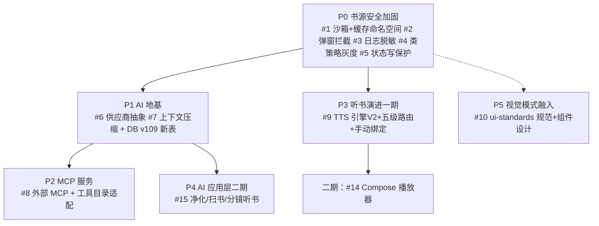

# design.md — legado_NG 深度对比与迁移总体设计（设计前置版）

> 数据来源：`joestar817/legado_NG` main 快照（3.26.082815，2026-08-28），本地 `F:\myself\github\WeAgentChat\temp\legado_NG_src\legado_NG-main`
> 对比基线：本项目 f:\myself\github\WeAgentChat\temp\legado（DB v108）
> 方法：8 轮子代理分析（四能力域深读 + 网络/规则引擎/数据层/UI 全景四维度逐文件 diff），统一事实源 [evidence-pack.md](./evidence-pack.md)
> 定位：**本文件是总体设计。实施级设计前置在 [migration-designs/](./migration-designs/) 五份分期设计文档中，未经审查不进入实施。**

## 0. 设计前置声明（回应审查意见）

本 spec 明确禁止"边学边改"式迁移。执行规则：
1. 每个迁移项必须有实施级设计文档（NG 源码证据→本项目对接点→逐文件映射→DB 变更→风险清单→验证方案），经检查点审查后才可写代码
2. 迁移禁止整目录照搬：NG 单文件过重（AiTtsStoryboardHelper ~2800 行/McpServer ~1600 行/AiChatContextManager ~750 行），必须按本项目架构拆分
3. 逐期收口：每期结束编译+真机 L2 验证后才启动下一期设计实施
4. 书源生态零破坏红线：任何影响书源 JS 行为的变更首期只记日志观察，不允许直接拦截

## 1. 全景对比矩阵（8 维度，含本项目领先域）

| 维度 | NG 现状 | 本项目现状 | 判定 |
|------|---------|-----------|------|
| 网络/协程 | 继承 Sigma 原版 + cronet 128 动态下载（单点风险）+ NetworkLog 仅内存 | FaviconCache/DoH/Brotli/307-308/StreamResetRetry/熔断降级/ANR 修复/CookieStore P 系列修复/cronet-bundled 锁定 | **本项目超集**，NG 仅 2 项可借（按源 Cookie 隔离概念、JSBridge 按源缓存） |
| WebView | 单全局池，回池清理完整 | 多 Scope 池+resettingPool+主线程 destroy+互斥守卫，回池清理为 NG 超集 | **本项目超集**，无可借 |
| 规则引擎 | evalJS 类沙箱包裹（2 接入点）+按源 cookie/cache 绑定+弹窗拦截 | API 全集无缺口+编译缓存+容错+RSS 并行/搜索+SourceNetworkClient 工程性收敛 | NG 强在**沙箱**，本项目强在**工程性与功能**；互有输出 |
| 数据层 | v114，13 新实体（AI/角色/工具回执），全列显式默认值，workKey 域键 | v108 但广度大（69 实体/44 DAO），v108 起分叉 | **基线已分叉**：NG 迁移链不可复用；亮点（显式默认值/幂等哈希/workKey）可吸收 |
| AI | 全套（供应商/MCP/压缩/技能/净化/扫书/聊天） | 仅 AiMcpClient（客户端方向）；无供应商地基 | **NG 代际领先**，P1/P2 主攻 |
| 听书 | 多角色 AI 演播全链（引擎层/路由/实体/Compose 播放器） | 单音色逐段合成+自研 TTS 参数绑定（与 NG 绑定体系不同构） | **NG 代际领先**，P3 分两期 |
| 视觉 | ui/design 自建设计系统+液态玻璃+材质语义角色+快照取色 | 无 design 包；M3 统一靠规范+审查；H9/H11 取色分裂痛点 | NG 架构模式领先；**只借模式不搬代码** |
| UI 广度 | 页面更少（RSS 全 Compose、删欢迎页），AI/分镜/角色页 | 多 30 Activity+5 Service（视频/下载/高亮/自动任务/调试/外观） | **本项目广度领先**；反向核对全部成立 |

## 2. 双向优缺点客观对比

### 2.1 本项目相对 NG 的优势（不该丢的）
1. **视频多媒体生态**：抖音式沉浸播放器+IDM 分片下载引擎（m3u8 重封装）+画质增强三级+多线路多集按需采集——NG 完全空白（help/exoplayer 仅 1 文件、ui/video 4 文件、无 PiP）
2. **测试工程**：ai_tests 自动化 E2E（固化 L1/L2+pytest+SOP+崩溃栈回灌）——NG 无等价物，质量靠单人手测
3. **稳定性治理**：竞态复现/WebView 池互斥/协程取消守卫/issues-found 闭环——NG 未见系统性轮次
4. **文档治理**：OpenSpec 流程+14 模块导航+对比方法论——NG CHANGELOG 停更 2022、安全波未收录 updateLog
5. **网络/WebView 健壮性**：全景对比实证本项目为超集（§1）
6. 订阅现代/经典双模、RSS 搜索、段落规则、自动任务、高亮规则系统（NG 均无或弱等价）

诚实标注：网络层两分支同源，本轮已做逐文件 diff，上述"超集"判定有 diff 证据支撑；除此之外未做 assert 的维度不宣称领先。

### 2.2 NG 的劣势与风险（迁移必须规避的代价）
1. **单文件过重**：2800/1600/750 行级实现，照搬=复制技术债；迁移必须拆分（P2 设计将 McpServer 拆为协议/路由/工具注册/执行四模块）
2. **日更+无自动化测试**：不可持续的工程文化，本项目不复制
3. **bus factor**：单人主导，上游 Sigma 本身 3 周一动
4. **液态玻璃性能代价**：作者自建降级链（E-Ink 禁用/API 分级/回退）即成本自证；低端机用户多的本项目只借模式缓落地
5. **激进白名单**：app 类仅放行 StrResponse，直接跟进破坏存量书源；NG 自己也要求"新增白名单需书源证据+回归测试"
6. **AI 隐私面**：MCP 开放书架正文+净化上传云端 LLM，必须默认关闭+显式授权
7. **数据破坏性变更先例**：NG v113 DROP httpTTS——本项目 httpTTS 有扩展在用，不照搬

### 2.3 本项目的劣势（诚实自查）
1. AI 能力为零且成代际差（缺的是整层基建，非单功能）
2. 打包发版全手动无 CI
3. 书源安全欠账敞开（文件越界/缓存跨源互读/JS 滥弹窗/JS 可持久篡改书架——网络日志脱敏除外，实测已具备）
4. Compose 化进度落后（NG 交互面 70-80% vs 本项目 S 批刚起步）
5. 多角色听书空白
6. 主动发现能力不足（用户已批评），测试覆盖密度待提升

### 2.4 结论修正

两分支分叉演化：**NG 压注 AI+听书+视觉纵深（代价：重实现/高风险/文档脱节），本项目压注视频+测试工程+稳定性+广度（代价：AI 代际差/发版低效）**——互补而非替代。迁移=只取兼容长板+规避其工程文化缺陷。

## 3. 修正后借鉴决策表（v2，综合 8 轮证据）

变化标注：➕新增/✏️修订（对比 v1）

| 排名 | 迁移项 | 价值 | 复杂度 | 风险 | 建议 | v2 修订依据 |
|---|------|:---:|:---:|:---:|------|------|
| 1 | ✏️ **书源文件沙箱+缓存命名空间**（BookSourceFileAccessPolicy+StorageScope+BookSourceCacheStore） | 5 | 2 | 2 | 强烈推荐 | 规则引擎轮证实 JsExtensions 的 getFile/deleteFile/unzipFile 限 `cache/bookSourceCache/{ns}/`，且 cache 绑定（scriptCacheObject）一并解决跨源缓存互读 |
| 2 | ➕ **弹窗拦截 SourceInteractionPolicy** | 4 | 1 | 1 | 强烈推荐 | 仅 28 行+3 个 ViewModel 挂载点，零生态破坏；防批量搜索/换源中书源滥弹验证码 |
| 3 | ✏️ **网络日志凭据脱敏** | 4 | 1 | 1 | ~~迁移~~→**保护项** | ⚠️P0 起草实测修正：本项目 NetworkLog.kt:30-61 已具备完整脱敏（敏感 header 集合+四组正则）+持久化，与 NG 同构且为超集——降级为"回归验证+零修改保护"，不再迁移 |
| 4 | ✏️ **类导入策略灰度引入**（RhinoClassShutter+withBookSourceClassPolicy） | 4 | 2 | 2 | 推荐（只记日志首期） | 接入点仅 2 处（AnalyzeUrl:375/AnalyzeRule:831）；首期 enabled+只记 AppLog，收集真实 import 面后再启白名单 |
| 5 | ✏️ **书籍状态写保护**（NativeBook 拦截+GuardLog） | 4 | 2 | 3 | 推荐（两阶段） | 先 GuardLog 观察再切拦截 |
| 6 | **AI 供应商抽象层**（AiProvider+3 协议+12 预设+AiManager+ModelRegistry） | 5 | 3 | 2 | 推荐 | ⚠️P1 起草实测修正：本项目已有 AiProviderConfig（7 字段单协议）+供应商管理三件套 UI——P1 走**配置融合**路线（扩展现有实体承载 NG 26 字段超参），非新建双轨 |
| 7 | **上下文压缩**（AiChatContextManager 核心+context_compaction.md） | 4 | 2 | 1 | 推荐 | 纯算法；须拆 750 行单文件 |
| 8 | **外部 MCP 服务**（McpService+拆分后的 McpServer+Tools 适配） | 5 | 3 | 3 | 推荐 | 本项目已有反向 AiMcpClient，方向互补；默认关闭 |
| 9 | **TTS 引擎 V2+多角色路由最小闭环**（手动绑角色先行） | 4 | 3 | 3 | 推荐 | ⚠️P3 起草实测修正：①自研 currentToneID 等字段属 AI 聊天播报链（唯一消费方 AiChatSpeechPlayer），与听书路由无交集，并存不合并 ②NG 无分镜时全兜底 NARRATION 致手动绑定失效——新增 LocalDialogueSegmenter（引号对白切分，NG 无对应物，待评审） |
| 10 | **视觉三模式融入 ui-standards**（材质语义角色/单一调度点/快照取色） | 4 | 3 | 2 | 推荐 | 只借模式；治 H9/H11 |
| 11 | ✏️ 按源 Cookie 命名空间隔离 | 4 | 3 | 4 | 谨慎（后置） | 12+ 调用点+与本项目 P5 修复绑定深；只借概念重实现 |
| 12 | Rhino 白名单全量收紧 | 3 | 3 | 5 | 暂缓 | 存量书源反射技巧多；两阶段灰度 |
| 13 | CI/CD 自动发版 | 3 | 2 | 2 | 可选 | 签名 secrets 化前置 |
| 14 | Compose 听书播放器+动效+跨章无缝 | 4 | 4 | 4 | 暂缓 | 依赖 #9；NG=全屏 Activity vs 本项目面板/悬浮窗体系，UI 形态需重新设计非照搬 |
| 15 | AI 应用层（净化/扫书/分镜/选角） | 5 | 5 | 3 | 暂缓二期 | 依赖 #6/#7；复用 NG 技能包 assets 协议 |

## 4. 分期路线与设计前置产物

实施级设计文档（设计前置，未审查不实施）：

| 分期 | 设计文档 | 覆盖决策表项 |
|------|----------|------------|
| P0 | [migration-designs/P0-source-security-hardening.md](./migration-designs/P0-source-security-hardening.md) | #1 #2 #3 #4 #5 |
| P1 | [migration-designs/P1-ai-foundation.md](./migration-designs/P1-ai-foundation.md) | #6 #7 + DB v109 |
| P2 | [migration-designs/P2-mcp-service.md](./migration-designs/P2-mcp-service.md) | #8 |
| P3 | [migration-designs/P3-tts-multirole.md](./migration-designs/P3-tts-multirole.md) | #9 |
| P5 | [migration-designs/P4-visual-patterns.md](./migration-designs/P4-visual-patterns.md) | #10 |

后置项（#11 #12 #13 #14 #15）在对应前置期落地后再补实施级设计，本轮不做深度设计（避免为暂缓项过度设计）。

## 5. Architecture Decisions

### AD-01: 对比方法采用"能力域分组深读+全维度逐文件 diff"双轨
- **Context**: 单靠能力域深读会漏掉隐藏差异（初版漏判了网络层本项目超集的事实）
- **Concern**: 如何在有限上下文内做到全面且不臆断
- **Decision**: 第一轮四能力域深读 + 第二轮网络/规则引擎/数据层/UI 全景四维逐文件 diff（git diff --stat 判量级+关键文件精读），统一沉淀 evidence-pack.md
- **Goal**: 每个"领先/落后"判定都有文件级证据，消灭臆断
- **Tradeoff**: 分析轮次翻倍（接受：用户明确要求深度全面）
- **Status**: Accepted

### AD-02: 迁移执行采用"设计前置+分期收口"模式
- **Context**: 用户裁定"边学边改"会四不像且引入未知 bug；初版报告不足以保证迁移交付
- **Concern**: 如何保证迁移按既定设计落地而非实施时即兴发挥
- **Decision**: 每期实施前必须有实施级设计（NG 证据→对接点→逐文件映射→DB→风险→验证）并过检查点；实施中如需偏离设计，先改设计文档再改代码
- **Goal**: 消灭"四不像"，交付物与设计一致可审计
- **Tradeoff**: 前置设计投入大、启动慢（接受：返工成本更高）
- **Status**: Accepted

### AD-03: 安全加固采用"观察先行、渐进收紧"
- **Context**: 类白名单/状态写保护直接拦截会破坏存量书源；本项目书源生态与 NG 同源但无法假定行为一致
- **Concern**: 安全收益与书源零破坏红线如何兼得
- **Decision**: P0 组成=文件沙箱+缓存命名空间（无行为变化）+弹窗拦截（仅拦弹窗类）+日志脱敏（无行为变化）+类策略灰度（记日志不拦截）+状态写保护（GuardLog 记录模式）；全量收紧延后且以观察数据为准
- **Goal**: P0 零书源破坏
- **Tradeoff**: 首期安全闭环不完整（接受：渐进收紧是唯一可持续路径）
- **Status**: Proposed（待检查点裁决）

### AD-04: AI 体系以供应商抽象层为第一切入点，DB 版本链自起重编
- **Context**: NG AI 全家桶构建在 AiProvider 之上；两侧 DB v108 已分叉（本项目独有 35 表），NG migration 链不可复用
- **Concern**: 地基选择与数据库升级路径
- **Decision**: 先迁供应商抽象（拆分后适配本项目）；DB 从本项目 v109 起自增重编，NG 的建表 SQL/显式默认值/workKey 模式吸收，版本号与迁移语义不复用
- **Goal**: 地基正确且数据库演进可控可回溯
- **Tradeoff**: 无短期用户可见 AI 功能（接受）
- **Status**: Proposed（待检查点裁决）

### AD-05: 视觉体系只借三个架构模式，不引 NG 组件
- **Context**: NG ui/design 是完整设计系统，液态玻璃成本高；本项目 ui-style-unify-deep-fix 进行中且有四组件族基线
- **Concern**: 引组件还是吸收模式
- **Decision**: 只吸收材质语义角色参数化（role→spec）、单一调度点+优雅降级、ThemeResolver 不可变快照三模式，产出 ui-standards 规范条款+本项目组件设计；液态玻璃视觉效果单独立项不混入
- **Goal**: 架构层防取色回潮，治 H9/H11
- **Tradeoff**: 无玻璃视觉效果短期交付（接受）
- **Status**: Proposed（待检查点裁决）

### AD-06: 听书一期"非 AI 最小闭环"且与自研 TTS 绑定体系做映射
- **Context**: NG 路由/实体与本项目自研 TTS 参数绑定（currentToneID/currentSpeakerName/currentEmotion*）不同构；BookCharacter 同名不同构
- **Concern**: 如何避免两套角色/绑定体系冲突
- **Decision**: 一期迁引擎层（TtsEngineStore 等 20 类裁剪）+五级路由+手动绑定，实体采用 NG 结构但类名规避冲突（本项目 BookCharacter 保留，NG 体系命名 NgTtsCast* 或合并方案在 P3 设计中裁决）；AI 分镜二期
- **Goal**: 手动绑角色即可用，二期无缝升级
- **Tradeoff**: 一期选角手动（接受）
- **Status**: Proposed（待检查点裁决）

## 6. File Changes

本 spec 为调研+设计文档，零源码变更。产出：
- `docs/specs/ng-benchmark-analysis/`：README/spec/design/evidence-pack/tasks + migration-designs/ 五份实施级设计
- `docs/INDEX.md`（活跃 Specs 表）
- `docs/project-rules/forks-reference.md`（追加 NG 条目，待裁决后）
