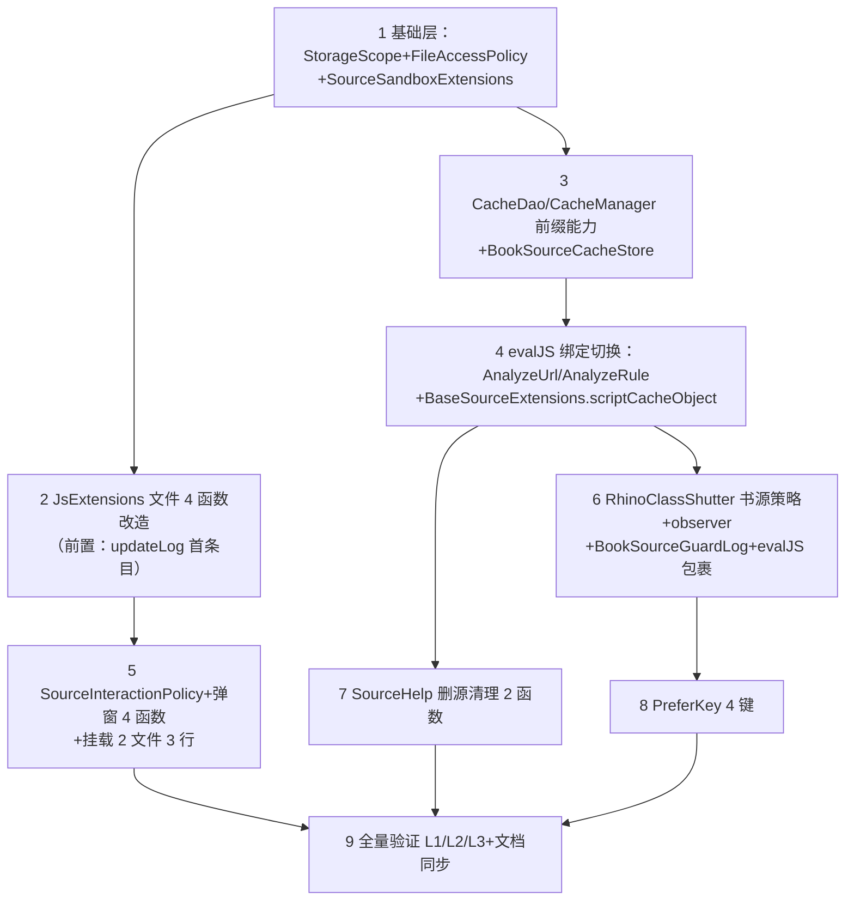

# P0 书源安全加固实施级设计（第三轮深化·函数/代码级）

> NG 证据源：`F:\...\legado_NG-main`（快照 3.26.082815），全部行号已第三轮逐文件精读复核；统一事实源 [evidence-pack.md](../evidence-pack.md)；总体设计 [design.md](../design.md)（AD-03+决策表 #1/#2/#4/#5）
> 红线：**零书源破坏**。除 D11 明示的 CookieManager 实拦外，所有拦截类变更首期只记 AppLog；所有安全行为带开关可回退。
> 规范基线：`docs/project-rules/`（checkstyle/naming/exception/logging/database-migration-safety/global-thinking-checklist）已逐文件 Read 并落入 §8 核查表。

## 0. 前轮结论继承声明（本轮精读全部复核通过）

| # | 结论 | 本轮验证 |
|---|------|---------|
| 1 | 弹窗拦截挂载=本项目 2 文件 3 行（SearchModel.kt:89、ChangeBookSourceViewModel.kt:227/:378）；本项目无 otherWorks 多源搜索，NG BookInfoViewModel.kt:321 挂载点无对应物 | ✅ 三处 launch 行均核实；NG:318-321 为 otherWorks 专用，本项目 BookInfoViewModel 无此功能 |
| 2 | 两根分离：NG BookSourceCacheStore 文件缓存根=`appCtx.cacheDir`（BookSourceCacheStore.kt:24），文件沙箱根=`appCtx.externalCache`（JsExtensions.kt:104） | ✅ 复核成立，§2/§4 显式分离表述 |
| 3 | D9 修订：Kotlin interface private 方法合法（NG JsExtensions.kt:101-128 即此形态）；混合方案=文件沙箱→独立 SourceSandboxExtensions（可单测），弹窗拦截→JsExtensions 内 private fun | ✅ NG :101-128 正是 interface private fun |
| 4 | D11：`android.webkit.CookieManager/CookieSyncManager`（NG RhinoClassShutter.kt:60-63）首期即实拦，不随观察档放行 | ✅ NG :258-262 书源模式命中即 return false |
| 5 | 本项目 RhinoClassShutter `visibleToScripts(clazz):167-174` 不回查 name matcher（NG :190-197 回查） | ✅ 本项目 :173 直接 `return true`，本期保持现状记 Open Question |
| 6 | jsLib 观察盲区：本项目 SharedJsScope.getScope 无 policy 参数（SharedJsScope.kt:101，BaseSourceExtensions.kt:11-14 无 policy 透传） | ✅ NG getScope(:32-45) 有 policy 三参数；本项目本期不改 |
| 7 | CacheDao 无 getByPrefix/deleteByPrefix/deleteMemoryByPrefix → 新增 @Query LIKE 前缀查询免 migration；D7 裁剪 NG registry 记账 | ✅ 全文核实，且 ：42-49 deleteSourceVariables 已有 LIKE 先例 |
| 8 | downloadFile 语义：两侧均返回相对路径，兼容闭环成立 | ✅ 本项目 :447 / NG :501-502 |
| 9 | 工作量 ≈7.2 人日 | §12 按函数粒度重算后维持 |

---

## 1. 目标与非目标

**目标（本期 5 项）**
1. **文件沙箱**：书源上下文 `getFile/readTxtFile/deleteFile/unzipFile/un7zFile/unrarFile/unArchiveFile/downloadFile` 收敛到沙箱根 `externalCache/source/{ns}/`（ns=SHA-256("book\0"+sourceUrl) hex64），带开关回退到现状 externalCache 根
2. **脚本缓存命名空间**：`bindings["cache"]` 由全局 `CacheManager` 换成按源 `BookSourceCacheStore`（DB+内存+文件三处，前缀清理），删源联动清理
3. **弹窗拦截**：批量流程（搜索/换源）协程树中书源 `getVerificationCode/startBrowserAwait` 抛 `SourceInteractionBlockedException`，`toast/longToast` 静默+记日志
4. **类导入策略灰度**：`RhinoClassShutter` 书源模式首期 enabled=true **只观察放行**（AppClass 类），CookieManager/CookieSyncManager 按 D11 实拦
5. **网络日志凭据脱敏**：现状已具备（NetworkLog.kt:30/196/219/259），本期零修改仅回归验证

**非目标（明确排除）**
- 书籍状态写保护（NativeBook 拦截）→ 后续期（决策表 #5 两阶段）
- 类导入白名单实际拦截（决策表 #12）、按源 Cookie 命名空间（#11）、SharedJsScope scopeNamespace 隔离（结论 #6）
- BookSourceWebCacheStore（WebView JSBridge 侧，D8）
- NetworkLog/CookieStore/P 系列修复等已领先文件，本期禁止触碰语义

---

## 2. NG 技术架构与逐类逐函数解读

### 2.1 策略链总图

```mermaid
flowchart TD
    subgraph E[求值入口（NG）]
        AU[AnalyzeUrl.evalJS :375]
        AR[AnalyzeRule.evalJS :831]
    end
    BSE[BaseSourceExtensions:25-32<br/>BaseSource?.withBookSourceClassPolicy] --> WP
    AU --> WP[RhinoClassShutter.withBookSourceClassPolicy :199-225<br/>ThreadLocal 深度计数+label 恢复]
    AR --> WP
    WP --> EVAL[RhinoScriptEngine.eval]
    EVAL --> V{visibleToScripts(name) :253-273}
    V -->|protectedClassNamesMatcher 命中| REJ[拒绝]
    V -->|书源模式+CookieManager/CookieSyncManager :60-63| REJ
    V -->|书源模式+io.legado.app.* :266-271| WL{directClassImports :56-58}
    WL -->|仅 StrResponse| PASS[放行]
    WL -->|其余| REJ
    V -->|默认| PASS
    subgraph B[JS API 层（JsExtensions interface）]
        R[resolveBookSourceFile :109-111] --> P[BookSourceFileAccessPolicy<br/>resolveSourceRoot :14-21 / resolvePath :23-39<br/>requireStrictChild :79-88 / requireContainedTree :48-66]
        D[requireSourceDialogAllowed :123-128] --> S[SourceInteractionPolicy<br/>协程上下文 Element :11-25]
    end
    subgraph C[绑定层]
        CB[bindings cache = scriptCacheObject :151-153<br/>BookSource→BookSourceCacheStore / 其他→CacheManager]
        CO[bindings cookie = BookSourceCookieStore]
    end
    MOUNT[批量流程挂载：SearchModel:46-48 /<br/>BookInfoViewModel:318-321 / ChangeBookSourceViewModel:102-104<br/>launch 上下文追加 policy Element]
```

### 2.2 BookSourceStorageScope（`help/source/BookSourceStorageScope.kt:5-13`）

```kotlin
internal object BookSourceStorageScope {
    private const val identityPrefix = "book\u0000"                       // :7
    fun namespace(sourceUrl: String): String                              // :9-13
    // SHA-256(identityPrefix+sourceUrl) 逐字节 "%02x" 拼接 hex64
}
```
- 纯 JVM 计算，无 Android 依赖，可直接单测。`\0` 前缀防与任意字符串拼接碰撞。

### 2.3 BookSourceFileTarget + BookSourceFileAccessPolicy（`help/source/BookSourceFileAccessPolicy.kt`）

| 函数 | 签名 | 逻辑要点（NG 行号） |
|---|---|---|
| （数据类） | `internal data class BookSourceFileTarget(val file: File, val relativePath: String)` | :5-8；file=canonical 后目标，relativePath=相对沙箱根（供 downloadFile 返回） |
| resolveSourceRoot | `(cacheRoot: File, sourceUrl: String): File` | :14-21；cacheRoot.canonicalFile → `File(root, "source/{ns}").canonicalFile`（sourceRootFolder="source" :12/:17）→ requireStrictChild 自检 → 返回 |
| resolvePath | `(sourceRoot: File, path: String): BookSourceFileTarget` | :23-39；①path 空或 "/" 抛 SecurityException（:25-27）②绝对路径且位于根内→直用 canonical（:28-29），否则相对拼接+canonical（:31-32）③requireStrictChild 校验（:34）④relativePath=`target.path.substring(root.path.length)`（:37） |
| requireContainedFile | `(sourceRoot: File, file: File): File` | :41-46；单文件 canonical+strictChild，返回 canonical file |
| requireContainedTree | `(sourceRoot: File, file: File)` | :48-66；递归校验子树内每个目录（visitedDirectories 防环 :60），防符号链接/嵌套逃逸；非目录即返回 |
| isAbsolutePathInsideSourceRoot | private `(canonicalRoot, path): Boolean` | :68-77；root 前缀补齐 File.separator 后 startsWith 判定 |
| requireStrictChild | private `(canonicalRoot, canonicalTarget)` | :79-88；`target.path.startsWith(rootPrefix)` 不满足抛 SecurityException("书源文件路径超出缓存目录") |

- **两根声明（结论 #2）**：本类不做根选择；根由调用方传入。NG 传入的是 `appCtx.externalCache`（JsExtensions.kt:104），沙箱根最终为 `externalCache/source/{ns}`——与 BookSourceCacheStore 的文件缓存根 `cacheDir/bookSourceCache/{ns}`（:24）**互不相干**。

### 2.4 SourceInteractionPolicy（`help/source/SourceInteractionPolicy.kt:11-28`）

```kotlin
class SourceInteractionPolicy(blockDialogs: Boolean) : AbstractCoroutineContextElement(Key) {  // :11-13
    private val blockDialogsState = AtomicBoolean(blockDialogs)                                // :15
    val blockDialogs: Boolean get() = blockDialogsState.get()                                  // :17-18
    fun updateBlockDialogs(blockDialogs: Boolean)                                              // :20-22
    companion object Key : CoroutineContext.Key<SourceInteractionPolicy>                       // :24
}
class SourceInteractionBlockedException(action: String) : NoStackTraceException("已禁止书源弹窗：$action")  // :27-28
```
- Element 可随协程上下文继承树传播（launch(ctx + policy) 后子协程均可见）；AtomicBoolean 支持运行中翻转。

### 2.5 BookSourceCacheStore（`help/source/BookSourceCacheStore.kt:16-157`）

| 成员 | 签名 | 逻辑要点（行号） |
|---|---|---|
| （构造） | `class BookSourceCacheStore(sourceUrl: String)` | :16-18；@Keep+@Suppress("unused")（被 JS 反射调用需防混淆） |
| namespace/storagePrefix | 私有属性 | :20-21；`book_source_cache_{ns}:` |
| registryPrefix/remember | :22/:29-32 | **本期裁剪（D7）**：NG 用 registry 记账支持精确清理，本项目改前缀查询后整段删除 |
| fileCache | `private val fileCache by lazy` | :23-25；`ACache.get(File(appCtx.cacheDir, "bookSourceCache/{ns}"))` —— **文件缓存根=cacheDir** |
| scopedKey | `(key: String): String` | :27；storagePrefix+key |
| put | `(key: String, value: Any, saveTime: Int = 0)` | :34-43；ByteArray→fileCache.put，其余→CacheManager.put |
| putMemory/getFromMemory/deleteMemory | :45-53 | 直通 CacheManager 对应方法（key 已 scoped） |
| get ×2 / getInt / getLong / getDouble / getFloat | :55-67 | 直通 CacheManager（scopedKey） |
| getByteArray | `(key): ByteArray?` | :69；fileCache.getAsBinary |
| putFile / getFile | :71-76 / :78 | fileCache.put / getAsString |
| delete | `(key)` | :80-84；CacheManager.delete+fileCache.remove |
| clear (companion internal) | `(sourceUrl: String)` | :86-101；NG 四步：registry 逐条 delete→deleteByPrefix(storage)→deleteByPrefix(registry)→deleteMemoryByPrefix×2→ACache.clear；**本项目裁剪为三步（D7）：deleteByPrefix(storagePrefix)→deleteMemoryByPrefix→ACache.clear** |
| （伴生扩展） | `bookSourceCacheStoreOrNull(): BookSourceCacheStore?` :147-149 / `scriptCacheObject(): Any` :151-153 / `webCacheObject(): Any` :155-157 | scriptCacheObject：`(this as? BookSource)?.let { BookSourceCacheStore(it.bookSourceUrl) } ?: CacheManager`；webCacheObject 本期不迁（D8） |
| BookSourceWebCacheStore | :107-145 | 本期不迁（D8） |

### 2.6 RhinoClassShutter 书源策略（NG `modules/rhino/.../RhinoClassShutter.kt`）

| 成员 | 行号 | 逻辑要点 |
|---|---|---|
| bookSourceDirectClassImports | :56-58 | 书源可直导白名单仅 `{io.legado.app.help.http.StrResponse}`，注释明示"新增条目需现有书源证据+默认拒绝回归测试" |
| bookSourceProtectedClassNames | :60-63 | `{android.webkit.CookieManager, android.webkit.CookieSyncManager}` 书源模式实拦 |
| bookSourcePolicyDepth / bookSourceLabel | :65/:67 | ThreadLocal\<Int\>/ThreadLocal\<String\>，可重入深度计数 |
| hostObjectClassAccess | :69 | withHostObjectClassAccess(:229-241) 临时放行集（NativeBook 场景，本期不涉及） |
| withBookSourceClassPolicy | :199-225 | enabled=false 直接 block()（:204）；depth+1、label 非空才覆盖（:207-210）；**finally 恢复 depth 与 label**（:213-224） |
| visibleToScripts(obj: Any) | :168-188 | 实例类型黑名单（ClassLoader/Class/Member/Context/okio… :169-186）→ matcher.match(类名)（:187） |
| visibleToScripts(clazz: Class<*>) | :190-197 | protectedClasses.isAssignableFrom 判定（:191-195）→ **回查 visibleToScripts(clazz.name)（:196）**——本项目对应函数缺这一步（结论 #5） |
| visibleToScripts(name: String) | :253-273 | 四段判定：①matcher 命中→false（:254-256）②书源模式∧CookieManager 集→false（:257-262）③hostObject 放行集→true（:263-265）④书源模式∧`io.legado.app.` 前缀→白名单判定（:266-271）⑤默认 true |

### 2.7 NativeBook（`help/rhino/NativeBook.kt:10-78`）——本期只作参考

- `has/get/put` 三拦截点（:18-34/:36-42）：被拦方法名返回 no-op LambdaFunction 并 BookSourceGuardLog.noOp（:28-31）；被拦属性写静默忽略并 ignoredWrite（:37-40）。
- blockedMethods 10 项（save/delete/setUseReplaceRule… :45-56）+ blockedProperties 8 项（:58-67）；`isBlockedMethod` 支持 `name` 与 `name(` 前缀双形态（:69-73）。
- 本期不实施，仅确认其 GuardLog 去重观察模式（BookSourceGuardLog :20-30，evidence-pack 2.11）为本期类策略观察日志的模板。

### 2.8 NG SharedJsScope（`model/SharedJsScope.kt:24-139`）——对照物，本期不迁

- `getScope(jsLib, coroutineContext, bookSourceClassPolicy: Boolean = false, bookSourceLabel: String? = null, scopeNamespace: String? = null)`（:32-38）——NG 签名带 policy 三参数，内部 `RhinoClassShutter.withBookSourceClassPolicy` 包裹（:42-45），scope 缓存键 `"$policyPrefix:{md5}"`（:123-137，书源前缀 `bookSource:{ns}` 且强制要求 namespace）。
- 本项目 `getScope(jsLib, coroutineContext)`（SharedJsScope.kt:101）无 policy 参数（结论 #6）→ 本期不改，观察盲区见 §7-E14。

### 2.9 JsExtensions 文件/弹窗 API（NG `help/JsExtensions.kt`）

| 函数 | 行号 | 逻辑要点 |
|---|---|---|
| bookSourceFileRoot | :101-107 | `getSource() as? BookSource ?: return null` → `BookSourceFileAccessPolicy.resolveSourceRoot(appCtx.externalCache, bookSourceUrl)`——**沙箱根=externalCache**（结论 #2） |
| resolveBookSourceFile | :109-111 | `bookSourceFileRoot()?.let { resolvePath(it, path) }`；书源上下文越界**抛 SecurityException 不回退** |
| context/blockSourceDialogs | :113-117 | `context[SourceInteractionPolicy]?.blockDialogs == true`（协程上下文消费点） |
| logBlockedSourceDialog / requireSourceDialogAllowed | :119-128 | 记 AppLog 后抛 SourceInteractionBlockedException；**interface private fun（结论 #3 的合法性证据）** |
| startBrowserAwait | :382-390 | `rhinoContext.ensureActive()` → `requireSourceDialogAllowed("验证网页")`（:384）→ SourceVerificationHelp |
| getVerificationCode | :395-399 | `requireSourceDialogAllowed("验证码")`（:397） |
| downloadFile | :478-503 | fileName=`md5Encode16(url).{type}`（:482）→ `resolveBookSourceFile(fileName)` 命中沙箱则写 target.file、返回 `target.relativePath`（:483-488/:501-502）；未命中走 `FileUtils.getCachePath()` 旧路径同样返回相对路径——**两侧语义一致（结论 #8）** |
| getFile | :873-889 | `resolveBookSourceFile(path)?.let { return it.file }`（:874-876）→ 回退 externalCache 拼接+parent 校验（:877-888，即本项目现状逻辑） |
| readTxtFile ×2 / readFile | :899-916/:891-897 | 全部经 getFile——getFile 沙箱化后**零改动即沙箱化** |
| deleteFile | :921-928 | getFile 后，`bookSourceFileRoot()?.let { requireContainedTree(root, file) }`（:924-926）→ FileUtils.delete——root 为 null（非书源/开关关）时与现状完全一致 |
| unzipFile/un7zFile/unrarFile | :935-957 | 全部转 unArchiveFile |
| unArchiveFile | :965-987 | 沙箱分支（root 非空）：解压临时目录=`resolvePath(root, TEMP_FOLDER_NAME)`（:970-973）、输出=`TEMP/{md5(文件名)}`（:974-979）、deCompress 后 requireContainedTree（:981）、**返回相对路径**（:982）；回退分支与本项目现状一致（:984-986） |

### 2.10 NG 批量流程挂载（3 处）

| 挂载点 | 行号 | 代码形态 |
|---|---|---|
| SearchModel | :46-48 | `private val interactionPolicy = SourceInteractionPolicy(blockDialogs = appCtx.getPrefBoolean(PreferKey.searchBlockSourceDialogs))` |
| BookInfoViewModel（otherWorks） | :318-321 | `execute(context = IO + SourceInteractionPolicy(blockDialogs))`——**本项目无此功能，不挂（结论 #1）** |
| ChangeBookSourceViewModel | :102-104 | 属性构造同 SearchModel |

---

## 3. 本项目对接点现状（第三轮逐处 Read 复核）

| 对接点 | 现状（真实行号） | 结论 |
|---|---|---|
| `help/JsExtensions.kt`（interface :89-95） | `getSource():91 / getTag():92 / private val context:94-95`；getFile(:701-714)：根=externalCache，parent 校验（:709-711）抛 SecurityException("非法路径") | 沙箱接入点 ①③④ 齐备 |
| `getFile :701-714` | `val cachePath = appCtx.externalCache.absolutePath; val file = File(aPath); if (!file.canonicalPath.startsWith(safePath)) throw SecurityException("非法路径"); return file` | 越界面=externalCache.parent 内任意目录（跨源互读） |
| `deleteFile :747-751` | `val file = getFile(path); return FileUtils.delete(file, true)` | 无子树校验 |
| `unArchiveFile :788-794` | `ArchiveUtils.deCompress(zipFile.absolutePath)` 固定返回 `TEMP/{md5}`（:792） | 解压输出在全局 externalCache/TEMP |
| `downloadFile :426-448` | 写 `FileUtils.getPath(File(FileUtils.getCachePath()), md5.type)`（:430-433），返回 `path.substring(FileUtils.getCachePath().length)`（:447） | 返回相对路径；写根=getCachePath（FileUtils.kt:92-94=externalCache） |
| `toast/longToast :1088-1099` | `appCtx.toastOnUi("${getTag()}: ${msg}")` | 无任何拦截 |
| `startBrowserAwait :342-349 / getVerificationCode :354-357` | 仅 `rhinoContext.ensureActive()` 后直入 SourceVerificationHelp | 弹窗拦截接入点 |
| `model/analyzeRule/AnalyzeUrl.kt evalJS :392-421` | `bindings["cache"] = CacheManager`（:397）、`bindings["cookie"] = CookieStore`（:396）、`source?.getShareScope(coroutineContext)`（:412） | ②④接入点 |
| `model/analyzeRule/AnalyzeRule.kt evalJS :836-867` | `bindings["cache"] = CacheManager`（:840）；`compileScriptCache(:869-871)` 编译缓存 | ②④接入点；compileScriptCache 保持不动 |
| `modules/rhino/.../RhinoClassShutter.kt` | matcher(:48-120)/protectedClasses(:126-143)/visibleToScripts(obj)(:145-165)/**visibleToScripts(clazz)(:167-174，:173 直接 return true 不回查 matcher)**/wrapJavaClass(:176-184)/visibleToScripts(name)(:186-188 仅 matcher) | ④增量添加；全局防护行为不变 |
| `help/source/BaseSourceExtensions.kt :11-14` | `getShareScope = SharedJsScope.getScope(jsLib, coroutineContext) ?: cryptoScope 回退`，无 policy 参数 | 结论 #6；本期仅**追加**扩展函数不改既有 |
| `model/SharedJsScope.kt` | `fun getScope(jsLib: String?, coroutineContext: CoroutineContext?): Scriptable?`（:101） | 本期不改（D6） |
| `data/dao/CacheDao.kt :11-65` | 无 getByPrefix/deleteByPrefix；**先例**：deleteSourceVariables(:42-49) 已用 `like 'v_' || :key || '_%'` 语法 | 结论 #7；新增 @Query 不改 schema 免 migration |
| `help/CacheManager.kt :68-185` | put(:74)/putMemory(:88)/getFromMemory(:93)/deleteMemory(:97)/delete(:165)/trimMemory(:173)；无 deleteMemoryByPrefix | 需新增前缀清理 |
| `help/source/SourceHelp.kt` | deleteBookSourceInternal(:126-139)/deleteRssSourceInternal(:155-)；均 kotlin.runCatching 回收+逐项删除 | ②删源清理挂点 |
| 弹窗挂载点 | `model/webBook/SearchModel.kt:89`（`searchJob = scope.launch(searchPool!!)`，位于 startSearch(:86)）；`ui/book/changesource/ChangeBookSourceViewModel.kt:227`（search()）/`:378`（refreshList()） | 结论 #1：2 文件 3 行 |
| `help/config/AppConfig.kt` | `var recordLog`(:91)、`var recordNetworkLog = getPrefBoolean(PreferKey.recordNetworkLog, false)`(:2794)；PreferKey(:64-65) | 开关风格参照；**本期开关不进 AppConfig**（D15） |
| `help/http/NetworkLog.kt` | sensitiveHeaderNames(:30)/recordOkHttp(:79)/persist(:148)/formatHeaders(:196,:208)/redactCredentialsForLog(:219)/redactUrlForLog(:259) | 目标⑤已实现且为 NG 超集，**零修改** |

---

## 4. 改造方案

### 4.1 新增类骨架草案

**① `io.legado.app.help.source.BookSourceStorageScope`（NG 1:1）**
```kotlin
internal object BookSourceStorageScope {
    private const val IDENTITY_PREFIX = "book\u0000"
    fun namespace(sourceUrl: String): String =
        MessageDigest.getInstance("SHA-256")
            .digest((IDENTITY_PREFIX + sourceUrl).toByteArray(Charsets.UTF_8))
            .joinToString("") { byte -> "%02x".format(byte.toInt() and 0xff) }
}
```

**② `io.legado.app.help.source.BookSourceFileAccessPolicy`（NG 1:1，含内部 data class）**
```kotlin
internal data class BookSourceFileTarget(val file: File, val relativePath: String)

internal object BookSourceFileAccessPolicy {
    private const val SOURCE_ROOT_FOLDER = "source"   // 沙箱二级目录：externalCache/source/{ns}
    fun resolveSourceRoot(cacheRoot: File, sourceUrl: String): File        // NG :14-21
    fun resolvePath(sourceRoot: File, path: String): BookSourceFileTarget  // NG :23-39
    fun requireContainedFile(sourceRoot: File, file: File): File           // NG :41-46
    fun requireContainedTree(sourceRoot: File, file: File)                 // NG :48-66（私有递归+防环）
    // 私有：isAbsolutePathInsideSourceRoot(:68-77) / requireStrictChild(:79-88)
}
```
纯 java.io 实现，JVM 可单测；异常统一 SecurityException（OQ-6）。

**③ `io.legado.app.help.source.SourceInteractionPolicy`（NG 1:1）**
```kotlin
class SourceInteractionPolicy(blockDialogs: Boolean) : AbstractCoroutineContextElement(Key) {
    private val blockDialogsState = AtomicBoolean(blockDialogs)
    val blockDialogs: Boolean get() = blockDialogsState.get()
    fun updateBlockDialogs(blockDialogs: Boolean) = blockDialogsState.set(blockDialogs)
    companion object Key : CoroutineContext.Key<SourceInteractionPolicy>
}
class SourceInteractionBlockedException(action: String) :
    io.legado.app.exception.NoStackTraceException("已禁止书源弹窗：$action")   // 项目异常规范
```

**④ `io.legado.app.help.source.BookSourceCacheStore`（NG :16-103 裁剪，D7 去 registry）**
```kotlin
@Keep
@Suppress("unused")
class BookSourceCacheStore(sourceUrl: String) {
    private val namespace = BookSourceStorageScope.namespace(sourceUrl)
    private val storagePrefix = "book_source_cache_$namespace:"
    // 文件缓存根 = cacheDir/bookSourceCache/{ns}（NG :24，两根之一，≠沙箱根）
    private val fileCache by lazy {
        ACache.get(File(appCtx.cacheDir, "bookSourceCache${File.separator}$namespace"))
    }
    private fun scopedKey(key: String): String = storagePrefix + key
    fun put(key: String, value: Any, saveTime: Int = 0)   // ByteArray→fileCache / 其余→CacheManager
    fun putMemory / getFromMemory / deleteMemory / get / get(key, onlyDisk)
    fun getInt / getLong / getDouble / getFloat / getByteArray
    fun putFile(key: String, value: String, saveTime: Int = 0) / getFile(key: String): String?
    fun delete(key: String)
    internal companion object {
        fun clear(sourceUrl: String) {   // 三步（D7）：DB 前缀删→内存前缀删→文件目录 clear
            val ns = BookSourceStorageScope.namespace(sourceUrl)
            val prefix = "book_source_cache_$ns:"
            appDb.cacheDao.deleteByPrefix(prefix)
            CacheManager.deleteMemoryByPrefix(prefix)
            kotlin.runCatching {
                ACache.get(File(appCtx.cacheDir, "bookSourceCache${File.separator}$ns")).clear()
            }.onFailure { AppLog.putDebugWithTag("SourceCache", "clear fileCache failed", it) }
        }
    }
}
// 扩展（替代 NG :147-157，去 webCacheObject）：
internal fun BaseSource?.scriptCacheObject(): Any =
    (this as? BookSource)
        ?.takeIf { appCtx.getPrefBoolean(PreferKey.bookSourceCacheScoped, true) }
        ?.let { BookSourceCacheStore(it.bookSourceUrl) }
        ?: CacheManager
```

**⑤ `io.legado.app.help.source.SourceSandboxExtensions`（NG 私有助手独立化，可单测）**
```kotlin
internal object SourceSandboxExtensions {
    fun sandboxEnabled(): Boolean = appCtx.getPrefBoolean(PreferKey.bookSourceFileSandbox, true)
    fun bookSourceFileRoot(source: BaseSource?): File? {
        if (!sandboxEnabled()) return null
        val bookSource = source as? BookSource ?: return null   // RssSource/纯 JS 任务不沙箱
        return BookSourceFileAccessPolicy.resolveSourceRoot(appCtx.externalCache, bookSource.bookSourceUrl)
    }
    fun resolveBookSourceFile(source: BaseSource?, path: String): BookSourceFileTarget? =
        bookSourceFileRoot(source)?.let { BookSourceFileAccessPolicy.resolvePath(it, path) }
    fun requireContainedTree(source: BaseSource?, file: File) {
        bookSourceFileRoot(source)?.let { BookSourceFileAccessPolicy.requireContainedTree(it, file) }
    }
}
```

**⑥ `io.legado.app.help.rhino.BookSourceGuardLog`（观察日志，仿 NG :20-30 去重模式）**
```kotlin
object BookSourceGuardLog {
    private val reportedKeys = ConcurrentHashMap.newKeySet<String>()
    private fun put(tag: String, key: String, msg: String) {
        if (reportedKeys.add(key)) AppLog.putDebugWithTag(tag, msg, level = AppLog.Level.INFO)
    }
    fun observeClass(sourceLabel: String?, className: String)   // tag=SourceGuard，key=label+className
    fun blockedClass(sourceLabel: String?, className: String)   // tag=SourceGuard，CookieManager 实拦
    fun sandboxViolation(sourceLabel: String?, action: String, pathShape: String)  // tag=SourceSandbox
    fun blockedDialog(sourceLabel: String?, action: String)     // tag=SourceDialog
    fun reset()                                                 // 测试用清空去重集
}
```
- 源标识统一用 **ns 短码**（namespace.take(8)），不记源名/URL（logging_rules 脱敏铁律）；路径只记形态（如 `..` 穿越标记），不记原值。

### 4.2 修改函数清单（15 项"当前→目标"）

| # | 函数（文件:行） | 当前 | 目标 |
|---|---|---|---|
| 1 | `JsExtensions.getFile`（:701-714） | externalCache 拼接+parent 校验 | 首行插 `SourceSandboxExtensions.resolveBookSourceFile(getSource(), path)?.let { return it.file }`；其余回退逻辑逐行不动 |
| 2 | `JsExtensions.deleteFile`（:747-751） | getFile+FileUtils.delete | getFile 后插 `SourceSandboxExtensions.requireContainedTree(getSource(), file)`（root=null 时 no-op，NG :924-926 同构） |
| 3 | `JsExtensions.unArchiveFile`（:788-794） | 全局 deCompress 固定 `TEMP/{md5}` | root 非空分支：temp/output 均 `resolvePath(root, …)`，deCompress 到沙箱内，`requireContainedTree` 后返回沙箱内相对路径；root=null 走原逻辑（NG :965-987 同构） |
| 4 | `JsExtensions.downloadFile`（:426-448） | 写 getCachePath 根，返回相对路径 | `resolveBookSourceFile(getSource(), fileName)` 命中→写 target.file、返回 target.relativePath；未命中→原逻辑（NG :478-503 同构） |
| 5 | `JsExtensions.toast`（:1088-1091） | 直接 toastOnUi | `if (blockSourceDialogs) { BookSourceGuardLog.blockedDialog(nsLabel, "toast"); return }`——静默不抛（D4） |
| 6 | `JsExtensions.longToast`（:1096-1099） | 直接 longToastOnUi | 同 #5（与 #5 同模式，合计 1 项两函数） |
| 7 | `JsExtensions.getVerificationCode`（:354-357） | ensureActive 后直入 | `requireSourceDialogAllowed("验证码")`（抛 SourceInteractionBlockedException） |
| 8 | `JsExtensions.startBrowserAwait`（:342-349） | ensureActive 后直入 | `requireSourceDialogAllowed("验证网页")` |
| 9 | `RhinoClassShutter.visibleToScripts(fullClassName)`（本项目 :186-188） | 仅 matcher 判定 | 前置 matcher 段不变；新增书源段：depth>0∧CookieManager 集→observer.blockedClass+return false（D11）；depth>0∧`io.legado.app.` 前缀→observer.observeClass+return true（首期放行，D5）。**visibleToScripts(clazz)(:167-174) 本期不动**（OQ-1） |
| 10 | `AnalyzeUrl.evalJS`（:392-421） | 无策略包裹；cache=CacheManager(:397) | 函数体包 `source.withBookSourceClassPolicy { … }`；`bindings["cache"] = source.scriptCacheObject()`；cookie(:396) 不动 |
| 11 | `AnalyzeRule.evalJS`（:836-867） | 同上（:840） | 同 #10；compileScriptCache(:869-871) 路径保持 |
| 12 | `SourceHelp.deleteBookSourceInternal`（:126-139） | 删 DB+变量缓存+限流记录 | 追加 `kotlin.runCatching { BookSourceCacheStore.clear(key) }` + `kotlin.runCatching { 删沙箱目录 externalCache/source/{ns} }`（失败仅 SourceCache 日志，不阻断删源） |
| 13 | `SourceHelp.deleteRssSourceInternal`（:155-） | 删 RSS 相关 | 同 #12（RssSource 用 sourceUrl 作 key；沙箱对 RssSource 不生效但 clear 前缀清理无副作用） |
| 14 | `SearchModel.startSearch`（:86-89） | `searchJob = scope.launch(searchPool!!)` | 新增属性 `interactionPolicy`（读 PreferKey）+ launch 上下文追加 `searchPool!! + interactionPolicy` |
| 15 | `ChangeBookSourceViewModel.search`(:226-227) / `refreshList`(:377-378) | 同上形态（2 处） | 同 #14（同模式两行，合计 1 项） |

### 4.3 其余增量（新增成员/函数，不改既有函数体）

| 文件 | 新增 | 说明 |
|---|---|---|
| `JsExtensions`（interface 内 private，结论 #3） | `private val blockSourceDialogs: Boolean`（=context[SourceInteractionPolicy]?.blockDialogs==true）、`private fun requireSourceDialogAllowed(action)`、`private fun nsLabel(): String`（ns 短码） | NG :116-128 同构 |
| `RhinoClassShutter`（modules/rhino，**不可依赖 app 模块**） | `const val APP_CLASS_PREFIX`、`bookSourceProtectedClassNames`、`bookSourcePolicyDepth/bookSourceLabel`（ThreadLocal）、`fun <T> withBookSourceClassPolicy(enabled, sourceLabel, block)`（finally 恢复）、`fun currentBookSourceLabel()`、`@Volatile var classAccessObserver: ClassAccessObserver?`（fun interface，由 app 模块注册回写 AppLog——modules 层解耦 AppLog 依赖） | NG :56-67/:199-227 同构+观察钩子（D13） |
| `help/source/BaseSourceExtensions.kt` | `fun <T> BaseSource?.withBookSourceClassPolicy(block): T`（enabled=`this is BookSource`，sourceLabel=ns 短码；NG :25-32 同构） | getShareScope(:11-14) 不动 |
| `data/dao/CacheDao.kt` | `@Query("select * from caches where \`key\` like :prefix || '%'") fun getByPrefix(prefix: String): List<Cache>`；`@Query("delete from caches where \`key\` like :prefix || '%'") fun deleteByPrefix(prefix: String)` | 语法先例 deleteSourceVariables(:42-49)；**零 schema 变更免 migration** |
| `help/CacheManager.kt` | `fun deleteMemoryByPrefix(prefix: String) { memoryLruCache.snapshot().keys.forEach { if (it.startsWith(prefix)) memoryLruCache.remove(it) } }` | 参照 AppCacheManager.clearSourceVariables(:51-61) 模式 |
| `constant/PreferKey.kt` | 4 个 const val（§6） | UPPER_SNAKE 值沿用 camelCase 键名风格（与 :64-65 一致） |

---

## 5. 数据流（改造后）

```mermaid
flowchart TD
    A[书源 JS 调用] --> B{入口类型}
    B -->|evalJS| C[AnalyzeUrl:391 / AnalyzeRule:836<br/>withBookSourceClassPolicy 包裹]
    C --> D[bindings 装配<br/>cache→scriptCacheObject：<br/>BookSource∧开关→BookSourceCacheStore<br/>否则→CacheManager；cookie→CookieStore 不变]
    D --> E[Script 执行]
    E --> F{JS 调用 java.xxx}
    F -->|getFile/readTxtFile/deleteFile/unzip/downloadFile| G{SourceSandboxExtensions：<br/>开关 + BookSource 上下文?}
    G -->|是| H[BookSourceFileAccessPolicy<br/>resolvePath→canonical+strictChild<br/>沙箱根=externalCache/source/&#123;ns&#125;]
    H -->|沙箱内| I[放行读写/返回相对路径]
    H -->|越界| J[GuardLog.sandboxViolation<br/>→SecurityException]
    G -->|否| K[旧 externalCache 根路径<br/>零行为变化]
    F -->|toast/longToast| L{blockSourceDialogs?}
    L -->|拦截| M[GuardLog.blockedDialog→静默返回]
    F -->|getVerificationCode/startBrowserAwait| L2{blockSourceDialogs?}
    L2 -->|拦截| M2[GuardLog→抛<br/>SourceInteractionBlockedException]
    F -->|importClass/导入| O[visibleToScripts 书源模式<br/>depth>0]
    O -->|CookieManager/CookieSyncManager| P[GuardLog.blockedClass→实拦 D11]
    O -->|io.legado.app.* 其他类| Q[GuardLog.observeClass→放行<br/>首期只观察 D5]
    E --> R[网络请求] --> S[NetworkLog 脱敏+持久化<br/>本期零修改仅回归]
    U[删源 SourceHelp] --> V[BookSourceCacheStore.clear<br/>DB 前缀删+内存前缀删+cacheDir 文件清<br/>+沙箱目录删除]
```



---

## 6. 配置与开关设计（4 个 PreferKey）

| PreferKey（新增 const val） | 消费点（实时 getPrefBoolean） | 默认 | 灰度档 | 观察日志 tag |
|---|---|---|---|---|
| `bookSourceFileSandbox` | SourceSandboxExtensions.sandboxEnabled()——每次文件 API 调用判定 | true | 关闭=全部走旧 externalCache 根（语义与升级前逐字节一致） | `SourceSandbox`：越界=ns 短码+action+路径形态（穿越/绝对/根内） |
| `blockSourceDialogs` | 挂载点构造 SourceInteractionPolicy 时读（SearchModel/ChangeBookSourceViewModel 属性初始化；NG :47/:103 同款读法） | true | 关闭=policy 元素 blockDialogs=false，弹窗全放行；也可运行中 policy.updateBlockDialogs 翻转 | `SourceDialog`：被拦 action+ns 短码 |
| `bookSourceClassPolicyLog` | RhinoClassShutter 观察段（depth>0 命中 App 类时先查此开关再回调 observer） | true | 首期只有"观察档"（App 类放行+日志）；观察≥2 周依据 SourceGuard 数据再设计拦截档（新增独立开关，不在本期） | `SourceGuard`：ns 短码+类名（去重） |
| `bookSourceCacheScoped` | BaseSourceExtensions.scriptCacheObject() | true | 关闭=cache 绑定回退 CacheManager（应急开关） | `SourceCache`：clear 失败记录 |

**D15（开关读取方式）**：4 键全部**消费点实时 `appCtx.getPrefBoolean`，不进 AppConfig 属性**。理由：AppConfig 的 `var` 属性在单例首次加载时求值（AppConfig.kt:91/:2794 形态），本期 4 键无设置页 UI，改 SP 后 AppConfig 镜像不会刷新，会造出"改了不生效"的假开关；实时读 SP 为内存缓存读取，开销可忽略。

**日志纪律**：统一 `AppLog.putDebugWithTag(tag, msg, level = INFO)`（recordLog 守卫零开销）；4 个 tag 升格为 AppLog `TAG_` 常量（AppLog 现有 26 个模块 Tag 常量，AppLog.kt:13-42 实测；P2 新增 TAG_MCP/P3 新增 TAG_TTS 同款先例，升格做法充分；OQ-4 已关闭）；**所有日志只含技术结构（函数名/异常类型/路径形态/ns 短码），不记录文件内容、URL 原文、源名称**（output-safety+logging_rules 铁律）。

---

## 7. 边界条件（18 条）

| # | 条件 | 行为 |
|---|---|---|
| E1 | 非 BookSource 上下文（RssSource/纯 JS 加密任务 cryptoScope）调文件 API | `bookSourceFileRoot→null` 走旧 externalCache 路径，零行为变化（NG 同构） |
| E2 | `bookSourceFileSandbox=false` | 沙箱完全不生效；getFile/downloadFile 等与升级前逐字节一致 |
| E3 | path 为空或 "/" | resolvePath 抛 SecurityException（NG :25-27，防误指沙箱根本身） |
| E4 | 绝对路径且位于沙箱根内 | 直用 canonical（NG :28-29）；位于根外→strictChild 拒绝 |
| E5 | 相对路径 `..` 穿越 | canonical 归一后 strictChild 拒绝，GuardLog 记路径形态=穿越 |
| E6 | 升级后读不到沙箱前的旧下载/解压文件 | 旧文件在旧全局根，沙箱分支不回读（NG 同款行为）；缓存文件按定义可再生；updateLog 声明，不做迁移（R2） |
| E7 | 书源把 downloadFile 返回值拼绝对路径后**自建 java.io.File**（不经 getFile） | 与升级前行为一致（自建 File 不经过本链路），无破坏但也不受限——File 类本就被 matcher 封禁，绕行面极窄（OQ-8 观察） |
| E8 | unzipFile 的 zipPath 指向沙箱外旧 zip | getFile 走回退旧路径可读（E1/E2 同理）；解压产物按 root 是否存在分流——书源上下文+开关开时产物仍入沙箱内 TEMP |
| E9 | cache 前缀清理误删理论风险 | prefix 含 ns hex64，碰撞可忽略；deleteByPrefix 一次删除（D7） |
| E10 | deleteFile 目标在旧全局根（root=null 场景） | requireContainedTree 对 root=null no-op（NG :924-926 同构），删除行为与现状一致 |
| E11 | 单源调试页（SourceDebugActivity 等非批量流程） | 不挂 policy → 弹窗全放行；仅批量搜索/换源受限（与 NG 挂载面一致） |
| E12 | getVerificationCode 被拦抛异常 | 单源异常被 mapParallelSafe/runCatching 吞掉，不影响其他源与 App 存活；该源本次任务失败属必要语义（D4） |
| E13 | ThreadLocal 深度计数与协程线程切换 | policy 包裹于 evalJS 同步块，Rhino 求值同线程完成；withBookSourceClassPolicy finally 恢复防残留（NG :213-224 已验证+单测 T14 守护） |
| E14 | jsLib 观察盲区（结论 #6） | SharedJsScope 不改：①scope 缓存命中后复用不经过首次求值 ②RssSource 上下文 enabled=false ③cryptoScope 域外——jsLib 内 import 可逃逸观察，本期接受（D6），OQ-2 二期评估 |
| E15 | visibleToScripts(clazz) 不回查 name matcher（结论 #5） | Class 对象实例级防护面与升级前一致，本期不收紧（OQ-1） |
| E16 | CookieManager 实拦命中存量书源（D11 张力） | NG 同款实拦已上线且书源生态同源；SourceGuard blockedClass 日志可定位命中源；应急路径=临时移除 bookSourceProtectedClassNames 条目（代码级回退，见 OQ-3） |
| E17（补） | 删源清理 IO 失败 | runCatching 包裹+SourceCache 日志，不阻断删源主流程 |
| E18（补） | ACache 文件缓存根差异 | CacheManager 裸键 ACache.get()（cacheDir 根）与 BookSourceCacheStore 的 `cacheDir/bookSourceCache/{ns}` 是不同目录，裸键数据成为孤儿（OQ-12），互不污染 |

---

## 8. 规范符合性核查表

| 规范 | 核查项 | 结论 |
|---|---|---|
| naming_rules | 新类后缀：*Extensions（SourceSandboxExtensions/BaseSourceExtensions 追加）、object 单例（BookSourceGuardLog）、异常类名；常量 UPPER_SNAKE（SOURCE_ROOT_FOLDER/IDENTITY_PREFIX/APP_CLASS_PREFIX） | ✅ |
| checkstyle_rules | 不新增 launch 模式（挂载仅追加 context 元素）；kotlin.runCatching 带 `kotlin.` 前缀（§4.2-#12/#13、clear）；显式 import 无 star；注释中文+公开方法 KDoc；object 持可变状态（BookSourceGuardLog.reportedKeys=并发集）线程安全 | ✅ |
| exception_rules | SourceInteractionBlockedException 继承 NoStackTraceException（:27-28 NG 同款+本项目基类）；SecurityException 保留 NG 语义（平台安全异常非业务异常，OQ-6 记录裁量）；catch 块均有 putDebugWithTag 或 runCatching.onFailure | ✅ |
| logging_rules | 全部 putDebugWithTag+recordLog 守卫；禁 android.util.Log；脱敏铁律：ns 短码替代源名、路径形态替代原值、无 URL/凭据；三维度覆盖（catch/关键操作/关键参数均落对应 tag） | ✅ |
| database-migration-safety | CacheDao 仅新增 @Query（Room schema=表+view，查询方法不参与 schema 校验）→ **version 保持 v108 不变**；无实体/@DatabaseView 变更；R1-R6 全部不触发 | ✅ |
| global-thinking-checklist（6 维） | ①前端入口：弹窗挂载 2 文件 3 行（SearchModel:89/ChangeBookSource:227,:378），无 UI 新增 ②后端接口：JsExtensions JS API 签名零变化（getFile/deleteFile/downloadFile/unzipFile 返回值语义均保持）③数据库：否 ④覆盖安装：无 schema 变更天然兼容；行为面=旧缓存失联（E6，非崩溃）⑤使用场景：书源/RSS 源/搜索/换源/删源/调试页逐场景核对（E10/E11/E13）⑥回填点：观察日志三 tag（真实运行）+L2 断言（调试）+L3 单测（校验）三层齐备 | ✅ |
| 交付门禁（AGENTS） | updateLog 编译前更新；构建后 stop-daemons 清场；Grep `android.util.Log.d\|Log.e` 零残留；真机用测试包 `io.legado.miss.app.debug`；L2 用 `ai_tests\venv\Scripts\python.exe` | ✅（§10 门禁五件套） |

---

## 9. 测试设计

### 9.1 单元测试（21 个，JVM 优先；SourceSandboxExtensions/Policy 均纯 JVM）

**SourceSandboxPolicyTest**（对照 NG BookSourceFileAccessPolicy）
1. `namespace_isHex64AndStable`——同 URL 稳定、异 URL 必异、64 位 hex
2. `resolveSourceRoot_isUnderCacheRootAndDeterministic`
3. `resolvePath_relativeNormalizesWithinRoot`——`a/../b.png` 归一根内放行
4. `resolvePath_parentTraversalRejected`——`../../x` 抛 SecurityException
5. `resolvePath_absoluteInsideRootAllowed`
6. `resolvePath_absoluteOutsideRootRejected`
7. `resolvePath_emptyOrRootRejected`——"" 与 "/"
8. `requireContainedTree_rejectsSymlinkEscape`（Temp 目录模拟）
9. `requireContainedTree_allowsSubtree`
10. `resolvePath_returnsRelativePathWithoutRootPrefix`

**BookSourceCacheStoreTest**
11. `scopedKey_prefixedWithNamespace`
12. `sameKey_differentSourcesIsolated`——两 sourceUrl 同 key 互不可见
13. `clear_removesOnlyOwnNamespace`——clear 后本源全空、另一源完好（对照 NG :86-101）
14. `byteArrayValue_routesToFileCache`

**RhinoClassShutterTest**
15. `withBookSourceClassPolicy_reentrantDepthRestoredInFinally`——嵌套两层后 depth/label 复位
16. `visibleToScripts_bookSourceMode_appClassObservedAndAllowed`——返回 true+observer 收到一次+重复去重
17. `visibleToScripts_bookSourceMode_cookieManagerBlocked`——返回 false+blockedClass 日志（D11）
18. `visibleToScripts_nonBookSourceMode_unchanged`——depth=0 时与升级前逐行为一致
19. `visibleToScripts_protectedMatcher_alwaysBlocked`——java.io.File 等无论模式必拒

**SourceInteractionPolicyTest**
20. `updateBlockDialogs_flipsStateAtRuntime`

**NetworkLogRedactRegressionTest**（现状守护，防未来回归）
21. `sensitiveHeadersAndCredentialsRedacted`——敏感 header/token query/Bearer 出现 `[已脱敏]` 且原值不出现

### 9.2 L2 真机（测试包 `io.legado.miss.app.debug`，`ai_tests\venv\Scripts\python.exe`）

| 步骤 | 断言 |
|---|---|
| 1. `quick_build_install.py` 编译+安装+L1 | 编译绿；logcat 无 FATAL |
| 2. 导入含验证码 JS 的测试书源→批量搜索 | logcat Grep `SourceDialog|SourceGuard|SourceSandbox`（head_limit≤20，仅提取 tag 行）：拦截/观察日志出现、无崩溃栈；搜索结果正常返回（mapParallelSafe 吞单源异常） |
| 3. 换源流程（ChangeBookSourceViewModel 两挂载行） | 同上；换源列表正常刷新 |
| 4. 书源含 getFile/downloadFile JS 的正常源 | 文件读写成功于 `externalCache/source/{ns}/`；返回相对路径可经 getFile 读回（R1 回归锚） |
| 5. SP 关 `bookSourceFileSandbox`→重复步骤 4 | 行为与升级前一致（回退通道验证） |
| 6. 删除该测试书源 | logcat 无 SourceCache 失败日志；DB caches 表无 `book_source_cache_{ns}:` 残留（adb 查询） |
| 7. `run_e2e.py --tc` 常规回归 | 搜索/正文/换源主链路无异常 |

**沉淀脚本交付项**：新增 `l2_verify_source_sandbox.py`（命名对齐 ai_tests 现行 `l2_verify_*` 族），并登记 `ai_tests/docs/fixed_test_workflow.md` SOP 脚本表格。

### 9.3 L3 书源回归（正式包，书源 Skill 流程）
- 存量书源集抽样跑通：搜索→详情→目录→正文（含图片源验证 downloadFile 闭环）；
- 观察 ≥2 周收集 SourceGuard 数据后才启动拦截档设计（AD-03）。

---

## 10. 实施顺序依赖图（九步，每步门禁）



| 步 | 门禁 |
|---|---|
| 1 | JVM 单测 T1-T10 绿（无 Android 依赖可先行） |
| 2 | updateLog 首条目已按 git diff 更新（AGENTS：任何代码变更编译前必须更新，version-delivery-sync）——本步编译前置；编译绿+沙箱单测闭环（T3/T4）；此步起行为可回退（开关） |
| 3 | T11-T14 绿；`./gradlew assembleAppDebug` 编译绿 |
| 4 | 搜索/正文 L2 冒烟：cache 读写正常、无跨源互读 |
| 5 | L2 步骤 2/3 断言通过（拦截日志+无崩溃） |
| 6 | T15-T19 绿；logcat SourceGuard 观察流出现且去重 |
| 7 | 真机删源后 DB/内存/文件三处清理验证 |
| 8 | 4 开关逐个翻转回退验证；updateLog 增量复核（首条目已于步 2 编译前更新，本步按 git diff 全量审计，version-delivery-sync） |
| 9 | `stop-daemons.bat` 清场；AGENTS 任务完成清单 7 项逐项过；issues-found 记录真机问题 |

**门禁五件套（对齐 P2/P3 已有实践，自步 2 起每次构建后适用）**：① updateLog 编译前更新（首条目已于步 2 前落地）；② Grep `android.util.Log.d|Log.e` 零残留（logging-during-refactoring 门禁）；③ `stop-daemons.bat` 清场（直接 gradlew/IDE 构建后必做）；④ 真机用测试包 `io.legado.miss.app.debug`；⑤ L2 用 `ai_tests\venv\Scripts\python.exe`。

---

## 11. Open Questions（12 条：已关闭 6 条（B 类 5+V3 关闭 1），A 类 6 条开放中）

| # | 问题 | 背景/影响 | 裁决/状态 |
|---|---|---|---|
| OQ-1 | `visibleToScripts(clazz):167-174` 是否对齐 NG :190-197 回查 name matcher？ | 结论 #5 本期保持现状；对齐会收紧 Class 实例防护面，需先收集 E15 观察数据 | ✅ 已关闭（B 类）：**本期保持不回查**，实测防护面差≈0，证据见 §11.1 |
| OQ-2 | SharedJsScope.getScope 是否二期引入 NG 式 policy 三参数（NG :32-45）？ | 可消灭 E14 盲区；代价=scope 缓存键带 namespace，跨源共享 jsLib 生态受影响（evidence-pack B 节判定不迁的原因） | ✅ 已关闭（B 类）：**本期不改（D6 维持）**，风险定性升级为"逃逸 D11 实拦的绕行通道"（生态 0 样本），证据见 §11.1 |
| OQ-3 | CookieManager 首期实拦（D11）与零破坏红线的张力：是否给独立豁免开关？ | 目前回退=代码级移除保护集条目；若 L2/L3 发现存量源命中，需 SP 级豁免 | ⬜ 开放中（A 类，实施期裁量） |
| OQ-4 | 4 个观察 tag（SourceSandbox/SourceDialog/SourceGuard/SourceCache）是否升格 AppLog 模块 Tag 常量（现 26 个）？ | 升格后 ai_tests 可 `logcat -s SourceGuard` 精确过滤；字符串字面量亦可工作 | ✅ 已关闭（V3：AppLog 实有 26 Tag（AppLog.kt:13-42），升格为先例充分做法） |
| OQ-5 | 4 个开关是否暴露设置页 UI？ | 本期仅 SP/adb 可调；无 UI 则普通用户不可达（符合"灰度"定位，但可发现性差） | ⬜ 开放中（A 类，实施期裁量） |
| OQ-6 | SecurityException vs NoStackTraceException：NG 用 SecurityException 表达安全拒绝，本项目业务异常规范倾向 NoStackTraceException | 保持 NG 1:1（含"非法路径"既有用法 :711）为默认；项目化需评估书源对异常类型的依赖 | ⬜ 开放中（A 类，实施期裁量） |
| OQ-7 | 沙箱目录旧文件是否需要"一次性惰性迁移"（首次访问时从旧根搬入）？ | 本期不做（成本>收益，E6）；若 L3 抽样发现大量不可再生文件再立项 | ⬜ 开放中（A 类，L3 数据驱动） |
| OQ-8 | downloadFile 返回值被拼绝对路径后自建 File 的绕行面（E7）如何观测？ | File 类已被 matcher 封禁，绕行面窄；是否在 FileUtils 层加观察待二期 | ✅ 已关闭（B 类）：**残余绕行面≈0，不新增 FileUtils 层观测（二期亦不立项）**，证据见 §11.1 |
| OQ-9 | bookSourceProtectedClassNames 是否补充 android.webkit.WebView/SharedPreferences 等其他宿主类？ | NG 仅 2 条；扩集需书源证据（NG 注释 :50-55 规则） | ✅ 已关闭（B 类）：**不扩集**，两类在书源 JS 中无可达/合理 import 场景，证据见 §11.1 |
| OQ-10 | clear(sourceUrl) 的 ACache.clear() 清整个 `{ns}` 目录，未来若同目录放非缓存文件会误清 | 本期目录专用无风险；加文件时需重审 | ⬜ 开放中（A 类，条件触发重审） |
| OQ-11 | 弹窗拦截挂载面是否遗漏其它批量流程（RssSearchModel/自动任务/校验源 CheckSourceService）？ | NG 也仅 3 挂载点；本项目 RSS 搜索/自动任务是否属"批量流程"需产品裁量 | ✅ 已关闭（B 类）：**三流程本期均不挂载（D10 维持），二期候选 AutoTaskService 优先**，逐个证据见 §11.1 |
| OQ-12 | 缓存命名空间切换后，旧全局裸键（CacheManager 直写）成为孤儿数据，是否一次性清理？ | 无害仅占空间；可与 clearDeadline(:51-52) 清理周期合并处理 | ⬜ 开放中（A 类，条件触发重审） |

### 11.1 B 类关闭详情（5 条关闭裁决的完整证据链）

**OQ-1【关闭裁决：本期保持现状，不回查 name matcher（D14 维持）】**
- 两侧实现：本项目 `RhinoClassShutter.kt:167-174`（仅 protectedClasses.isAssignableFrom，:173 直接 return true）；NG 同文件 :190-197（:196 回查 `visibleToScripts(clazz.name)`）。
- 调用面实证：Class 重载唯一调用方=`RhinoWrapFactory.kt:68`（wrapJavaClass）；实例对象走 `:56`→Any 重载。**实例路径（Any 重载）两侧均已回查 matcher**（本项目 :164 / NG :187）——实例型泄漏防护两侧等价。
- Class 对象到达 wrapJavaClass 的仅余两条通道：①包名解析（`Packages.x.y.Z`）——已被 String 重载拦截（本项目 :186-188 matcher，两侧对齐）；②Java 方法返回 `Class` 实例——`java.lang.Class` 为 final 且在 protectedClasses（:129），isAssignableFrom 必拦。故 NG :196 的真实增量仅"书源模式段（CookieManager 实拦 / io.legado.app 白名单）在 Class 链路的覆盖"：本期 app 类为观察放行无行为差，CookieManager 无 Class 侧信道可达路径 → **实际防护面差≈0**。
- 二期重议条件：SourceGuard 数据出现 `io.legado.app.*` Class 对象触达记录；届时对齐成本=1 行 `return visibleToScripts(clazz.name)`。
- 是否变更设计主体：否（§4.2-#9 括注维持）。

**OQ-2【关闭裁决：本期不改（D6 维持）；风险定性由"逃逸观察"升级为"逃逸 D11 实拦的绕行通道"；二期触发条件明确】**
- 机制证据（本项目 `SharedJsScope.kt:101-141`）：缓存键=md5(jsLib)（:105）；jsLib 首次求值（:113/:141）**未经 withBookSourceClassPolicy 包裹**；缓存命中（:106-107）跳过求值——jsLib 内 importClass 在 depth=0 下不受书源段拦截，且导入类对象持久驻留缓存 scope，后续规则 JS 经 jsLib 函数可触达。NG 对照：:32-45 policy 三参数 + :42-45 包裹 + :46 scopeKey 纳入 policy（NG 无此盲区）。
- 盲区实际大小（生态量化）：skill references 全量检索，jsLib 记载用法=签名/加密辅助函数（fix-learned.md:29），唯一 import 样本=`javaImport.importPackage(javax.crypto*, android.util)`（fix-learned.md:132）；**io.legado.app.* 与 android.webkit.* 均为 0 样本** → 实际被利用概率低；且该缺口为现状一致性（升级前后行为相同），非回归。
- 二期触发条件：SourceGuard/L3 数据出现 jsLib 链路 webkit/app 类触达 → 引入 NG 式三参数（NG :32-46 1:1 可搬，估算≈0.5 人日含单测），接受跨源共享缓存键变化。
- 是否变更设计主体：仅 §7-E14 措辞修正（OQ-2 关闭引发，见 E14 行内标注）。

**OQ-8【关闭裁决：残余绕行面≈0；不新增 FileUtils 层观察，二期亦不立项】**
- 用法面实证：文档记载 downloadFile 唯一消费模式=返回相对路径（js-extensions/file-operations.md:34、:41-42；advanced.md:44 downloadFileAwait 同语义），无"拼绝对路径+自建 File"模式记载。
- 封禁面实证：自建 File 全通道在 matcher 名单内（本项目 RhinoClassShutter.kt:48-119，与 NG 同源）——java.io.File(:57)、FileOutputStream(:60)、FileWriter(:63)、java.nio.file 前缀(:111)、cn.hutool.core.io 前缀(:107)；路径消费 API（getFile/readTxtFile/deleteFile/unzipFile）全部汇入 getFile 沙箱链（§4.2-#1/#2/#3）。
- 增量封闭：改造后 downloadFile 目标名经 resolvePath strictChild（§4.2-#4），fileName 内嵌 `..` 亦被拒。
- 观测定论：依赖现有 SourceSandbox 越界日志 + §9.2 步骤 4 断言；E7 维持现状声明。
- 是否变更设计主体：否。

**OQ-9【关闭裁决：不扩集，维持 {CookieManager, CookieSyncManager}】**
- 可达性分析：书源 JS 触达 WebView 的唯一面=JsExtensions 封装方法 `java.webView / webViewGetSource / webViewGetOverrideUrl`（js-extensions/webview.md:15/:39/:64），生态从不直接 importClass(android.webkit.WebView)；SharedPreferences 构造需 Context 实例，JsExtensions 全文检索**无任何返回 android.content.Context 的成员**（:94-95 的 context 为 Kotlin 协程上下文）→ 两类对书源 JS 均无可达/合理 import 场景。
- 生态证据：skill references 无 WebView/SharedPreferences importClass 样本；NG :50-55 注释规则"新增条目需现有书源证据+默认拒绝回归测试"→ 无证据不扩。
- 二期重议条件：SourceGuard 观察到书源模式下两类 importClass 触达（理论仅 jsLib 侧信道，同 OQ-2）。
- 是否变更设计主体：否。

**OQ-11【关闭裁决：三流程本期均不挂载（D10 维持 2 文件 3 行）；二期候选排序 AutoTaskService > RssSearchModel > CheckSourceService（后者倾向永久不挂）】**
- NG 挂载全集复核：全仓检索 `SourceInteractionPolicy(` 仅 4 处（定义 + SearchModel:46 / ChangeBookSourceViewModel:102 / BookInfoViewModel:321），NG 同样未挂以下三流程。
- RssSearchModel（RSS 批量搜索）：`startSearch` :150 `scope.launch(searchPool!!)` → :163 `Rss.getArticlesAwait` → AnalyzeUrl 链 → 源 JS 弹窗 API 可达。裁决：**不需要挂载**（NG 对齐 + RSS 搜索源验证码/浏览器场景低频 + 零破坏红线；注意：不挂载即无 SourceDialog 日志，二期观察依赖 L3 抽样与用户反馈）。
- CheckSourceService（校验源）：:114 `lifecycleScope.launch` → :242/:269/:390/:398/:409 WebBook 全链（搜索/发现/详情/目录/正文），源 JS 触达面最全。裁决：**不需要挂载（倾向永久）**——属源作者调试工具，验证码/浏览器弹窗恰为调试必要信息，与 E11"单源调试页不挂 policy"同一语义。
- AutoTaskService（自动任务）：:378-395 `runTask` → :395 `source.evalJS(script)`；`BaseSource.kt:327-335` 中 `bindings["java"] = this`（:329）→ toast/getVerificationCode/startBrowserAwait 全可达，且运行于**后台 FGS**（验证码弹窗无输入承载，受 Android 后台 Activity 启动限制，实际表现为异常/静默失败）。NG 无 AutoTask 功能（全仓检索无此类，fork 特有），无对齐参照。裁决：**本期不需要挂载**——脚本=用户自配置任务（信任边界=用户输入，非第三方书源注入），零破坏红线；二期若引入"任务脚本弹窗治理"，挂载方式=runTask 协程追加 `SourceInteractionPolicy` 元素（**勿走 withBookSourceClassPolicy**——buildSource 伪源非 BookSource，enabled 判定不成立）。
- 是否变更设计主体：否。

---

## 12. 工作量估算（函数粒度，人日）

| 块 | 内容（函数数） | 估算 |
|---|---|---|
| 基础沙箱层 | StorageScope(1)+FileAccessPolicy(6)+SourceSandboxExtensions(3)+单测 T1-T10 | 1.1 |
| 文件 API 改造 | JsExtensions 4 函数（getFile/deleteFile/unArchiveFile/downloadFile）+readTxtFile×2 间接验证 | 0.6 |
| 脚本缓存 | BookSourceCacheStore(12 方法+clear)+CacheDao(2)+CacheManager(1)+scriptCacheObject(1)+evalJS×2 | 0.9 |
| 弹窗拦截 | SourceInteractionPolicy(2 类)+JsExtensions private 3+弹窗 4 函数+挂载 3 行 | 0.6 |
| 类策略灰度 | RhinoClassShutter(4 新成员+1 改函数)+observer+BookSourceGuardLog(5)+evalJS 包裹 | 1.0 |
| 删源清理 | SourceHelp 2 函数+沙箱目录删除 | 0.2 |
| 开关/交付 | PreferKey 4+updateLog+文档同步 | 0.5 |
| 验证 | 单测 T1-T21(0.7)+L2 脚本与真机(0.8)+L3 回归(0.4) | 1.9 |
| **合计** | | **≈6.8+0.4 缓冲=7.2 人日**（维持结论 #9；观察期数据收集 ≥2 周后才进入拦截档设计） |

---

## 13. 设计决策记录（Y-Statement 简式）

- **D1 沙箱根=`externalCache/source/{ns}/`**（修正 v2 混淆）：NG resolveSourceRoot 的 sourceRootFolder="source"（FileAccessPolicy:12/:17）+JsExtensions:104 传 externalCache；v2 表述"cache/bookSourceCache/{ns}"把脚本文件缓存根（cacheDir/bookSourceCache/{ns}，CacheStore:24）误当沙箱根——两根显式分离（结论 #2/D12）。
- **D2 沙箱默认开**：NG 线上同实现验证；本项目 getFile 现有校验(:709-711)本就偏向拒绝，收紧方向一致；回退=一个 SP 键实时读（D15）。
- **D3 downloadFile 返回值保持相对路径**：两侧一致（结论 #8，本项目 :447/NG :501-502），改绝对路径会双倍破坏（R1）。
- **D4 toast/longToast 静默不抛、验证码/验证网页抛 SourceInteractionBlockedException**：toast 中断会让"提示后继续"的正常源崩；验证码无输入必超时，中断是必要语义（NG :384/:397 统一抛；本项目对 toast 收紧为静默）。
- **D5 类策略首期观察放行**：AD-03 红线；NG directClassImports 仅 {StrResponse}（:56-58）过激进；SourceGuard 数据驱动二期白名单。
- **D6 SharedJsScope 不接入 policy/namespace**：结论 #6；NG :32-45 已有同款签名，二期引入成本低但切断跨源 jsLib 共享（OQ-2）。
- **D7 CacheDao 前缀查询替代 NG registry 记账**：NG remember(:29-32)+registry 双前缀四步 clear(:86-101)；本项目 LIKE 前缀（先例 CacheDao:42-49）三步等价，免记账写入放大（结论 #7）。
- **D8 本期不迁 BookSourceWebCacheStore**：WebView JSBridge 侧与 P5 cookie 命名空间后置决策绑定。
- **D9（修订）文件沙箱助手独立 SourceSandboxExtensions、弹窗拦截落 JsExtensions private fun**：v2"interface 不能加实现"理由作废——Kotlin interface private 方法合法（NG :101-128 即此形态，结论 #3）；独立 object 的真实理由是**可单测**（脱依赖 getSource() 的 interface 上下文）；弹窗拦截 3 个 private fun 按 NG :116-128 1:1 落 interface 内。
- **D10 弹窗挂载点=2 文件 3 行**（结论 #1）：SearchModel.kt:89、ChangeBookSourceViewModel.kt:227/:378；NG BookInfoViewModel:321（otherWorks）本项目无对应物，不挂。
- **D11 CookieManager/CookieSyncManager 首期实拦**（结论 #4）：NG :60-63/:257-262 书源模式即拒；不随观察档放行；张力与应急见 E16/OQ-3。
- **D12 两根显式分离表述**：文件沙箱根=externalCache/source/{ns}（§2.3）；脚本文件缓存根=cacheDir/bookSourceCache/{ns}（§4.1-④）；互不相干，杜绝 v2 "cache/bookSourceCache/{ns}" 式混淆（结论 #9）。
- **D13 modules/rhino 观察钩子=ClassAccessObserver 回调**：modules 层不可依赖 app 模块 AppLog；NG 类策略无观察档（纯实拦），本项目灰度需要观察 → Shutter 内 @Volatile observer，app 模块启动时注册 BookSourceGuardLog 实现（§4.3）。
- **D14 visibleToScripts(clazz) 本期不动**（结论 #5）：保持 E15 现状（OQ-1 已关闭：实测防护面差≈0，见 §11.1）。
- **D15 开关消费点实时读 SP，不进 AppConfig**：AppConfig var 属单例加载期求值（:91/:2794 形态），无设置页时改 SP 不刷新镜像；实时 getPrefBoolean 保证"一键回退"即时生效（§6）。
- **D16 观察日志源标识=ns 短码**（namespace.take(8)）：logging_rules"源名称不记录"铁律对 NG sourceLabel（源名/URL）的项目化替代（§4.1-⑥）。
