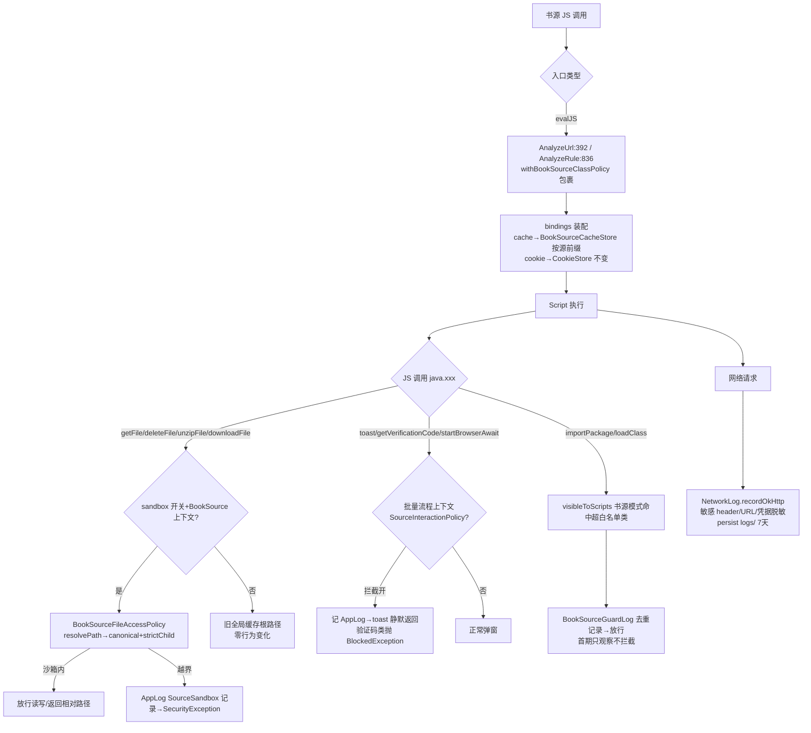

# P0 书源安全加固实施级设计（迁移自 legado_NG，AD-03 观察先行渐进收紧）

> NG 证据源：`F:\...\legado_NG-main`（快照 3.26.082815）；统一事实源 [evidence-pack.md](../evidence-pack.md)；总体设计 [design.md](../design.md)
> 红线：**零书源破坏**。任何拦截类变更首期只记 AppLog；所有安全行为带开关可回退。
> 包结构遵循本项目 `io.legado.app` + Coroutine 链式/AppLog/kotlin.runCatching/NoStackTraceException 规范。

## 1. 目标与非目标

**目标（本期 5 项）**
1. 文件沙箱+存储命名空间：`getFile/readTxtFile/deleteFile/unzipFile/downloadFile` 收敛到 `cache/bookSourceCache/{ns}/`（ns=SHA-256 命名空间），带开关可回退
2. 脚本缓存命名空间：`bindings["cache"]` 由全局 `CacheManager` 换成按源 `BookSourceCacheStore`（删源联动清理）
3. 弹窗拦截：批量流程（搜索/换源/书籍详情）中书源 `toast/longToast/getVerificationCode/startBrowserAwait` 弹窗类受限
4. 类导入策略灰度：`RhinoClassShutter` 接入书源模式，首期 **enabled=true 但只记 AppLog 放行**，收集真实 import 面
5. 网络日志凭据脱敏：现状已具备（见 §3），本期仅回归验证+补漏

**非目标（明确排除）**
- 书籍状态写保护（NativeBook 拦截）→ 后续期（决策表 #5 两阶段）
- 类导入白名单实际拦截（决策表 #12）、按源 Cookie 命名空间（#11）、SharedJsScope scopeNamespace 隔离（evidence-pack B 节：切断跨源 jsLib 生态，不迁）
- NetworkLog 持久化/P5 cookie 修复重构（已领先，见 §3 保护策略）

## 2. NG 源码证据

| # | 机制 | 关键代码位置（文件:行） |
|---|------|------|
| 2.1 | 命名空间=SHA-256("book\0"+sourceUrl) hex64 | `help/source/BookSourceStorageScope.kt:9-13` |
| 2.2 | 沙箱根解析：canonical(cacheRoot)/source/{ns}，requireStrictChild 校验 | `help/source/BookSourceFileAccessPolicy.kt:14-21`；路径解析 resolvePath：绝对路径仅当位于沙箱根内才直用，否则按相对路径拼接+canonical（:23-39）；requireStrictChild 前缀校验抛 SecurityException（:79-88）；删树校验 requireContainedTree 防符号链接逃逸（:48-66） |
| 2.3 | JsExtensions 挂接：`bookSourceFileRoot()`（仅 BookSource 上下文返回沙箱根）+`resolveBookSourceFile(path)`；getFile(:874-877) 命中沙箱则返回沙箱 File，否则回退 externalCache；deleteFile(:923-928) 先 requireContainedTree 再删；unzipFile(:968-984) 解压临时目录+输出均限沙箱内并 requireContainedTree | `help/JsExtensions.kt:101-111, 874-877, 923-928, 968-984` |
| 2.4 | downloadFile 语义：书源上下文写 `bookSourceTarget.file`、返回 `relativePath`（相对沙箱根）；非书源上下文走旧路径回退 | `help/JsExtensions.kt:478-503`（:483-488 写入目标，:501-502 返回值分支） |
| 2.5 | 脚本缓存按源：`BookSourceCacheStore(sourceUrl)`，key 前缀 `book_source_cache_{ns}:`，registry 记账（`book_source_cache_registry_{ns}:` 存 scopedKey 的 ns 摘要）支持 clear(sourceUrl) 前缀清理（CacheManager DB+内存+ACache 文件三处） | `help/source/BookSourceCacheStore.kt:16-103`（:20-25 前缀与 ACache 目录，:29-32 remember，:86-101 clear）；`scriptCacheObject()`：BookSource→BookSourceCacheStore，其他→CacheManager（:151-153） |
| 2.6 | 弹窗拦截：`SourceInteractionPolicy` 为 CoroutineContext Element（AtomicBoolean 可运行中翻转）；`SourceInteractionBlockedException : NoStackTraceException` | `help/source/SourceInteractionPolicy.kt:11-28` |
| 2.7 | JsExtensions 消费：`context[SourceInteractionPolicy]?.blockDialogs`（:116-117）→`requireSourceDialogAllowed(action)` 记 AppLog 后抛异常（:123-127）；挂点 startBrowserAwait"验证网页"(:384)、getVerificationCode"验证码"(:397) | `help/JsExtensions.kt:116-127, 382-399` |
| 2.8 | 批量流程挂载（读 SP 开关） | `model/webBook/SearchModel.kt:46-48`；`ui/book/info/BookInfoViewModel.kt:321`；`ui/book/changesource/ChangeBookSourceViewModel.kt:102`（evidence-pack B 节） |
| 2.9 | 类导入策略：`withBookSourceClassPolicy(enabled, label, block)` ThreadLocal 深度计数可重入+label 恢复（:199-225）；书源模式下 `io.legado.app.*` 仅白名单 {StrResponse}（:56-58），封 `android.webkit.CookieManager/CookieSyncManager`（:60-63）；visibleToScripts 全量判定（:253-273）；挂点 evalJS 包裹 | `modules/rhino/.../com/script/rhino/RhinoClassShutter.kt:56-58,60-63,65-69,199-225,253-273`；`model/analyzeRule/AnalyzeUrl.kt:375`；`model/analyzeRule/AnalyzeRule.kt:831`；扩展入口 `help/source/BaseSourceExtensions.kt:25-32` |
| 2.10 | 网络日志脱敏：敏感 header 集合 11 项（:21-33）+URL query 正则（:34-37）+JSON 引号值正则（:38-41）+form 正则（:42-45）+Bearer/Basic 正则（:46-53） | `help/http/NetworkLog.kt:21-53, 175-219` |
| 2.11 | 回归测试守护：RhinoBookSourceClassPolicyTest（白名单默认拒绝）/NativeBookTest（状态方法 no-op） | evidence-pack H 节；`help/rhino/NativeBook.kt:44-73`、`help/rhino/BookSourceGuardLog.kt:20-30`（观察日志去重模式，本期类策略沿用该模式） |

## 3. 本项目对接点现状（已逐文件 Read 核实）

| 对接点 | 现状（本项目真实代码） | 结论 |
|---|---|---|
| `help/JsExtensions.kt`（interface） | getSource():91 / getTag():92 / context:94 / rhinoContextOrNull；getFile(:700-713)：根=externalCache，校验 canonicalPath 前缀=externalCache.parent（:708-711），返回 File；readTxtFile(:723-740)；deleteFile(:746-749)=getFile+FileUtils.delete；unzipFile(:756-759)→unArchiveFile(:788-794)=getFile+ArchiveUtils.deCompress 固定返回 `TEMP/{md5}`；downloadFile(:426-448) 写 `FileUtils.getCachePath()`(=externalCache，FileUtils.kt:92-94)、返回相对路径(:447)；toast(:1088-1091)/longToast(:1096-1099) 走 appCtx.toastOnUi；getVerificationCode(:354)；startBrowserAwait(:342) | ①②③接入点明确；getFile 根=externalCache 全局共享（跨源互读+越界到 parent 内任意目录） |
| `model/analyzeRule/AnalyzeUrl.kt` | evalJS(:392-421)：`bindings["cookie"]=CookieStore`(:396)、`bindings["cache"]=CacheManager`(:397) | ②④接入点（对应 NG:375） |
| `model/analyzeRule/AnalyzeRule.kt` | evalJS(:836-867)：cache(:840)/cookie(:839) 同上，compileScriptCache(:864-866) 编译缓存 | ②④接入点（对应 NG:831） |
| `help/http/NetworkLog.kt` | **脱敏已具备**：敏感 header 集合(:30-41)+四组正则(:42-61)+formatHeaders/redactHeaderBlockCredentials(:196-257)+redactUrlForLog(:259-263)；**持久化已领先**：persist→logs/network-log-{date}.txt(:148-159)+7 天清理(:161-168)+慢/错上 AppLog(:170-180) | ⑤现状=已实现且为 NG 超集；**本期禁止动此文件语义**，仅回归验证 |
| `modules/rhino/.../RhinoClassShutter.kt` | 仅全局防护：protectedClassNamesMatcher(:48-120)+protectedClasses(:126-143)+visibleToScripts(clazz)(:167-174)+wrapJavaClass(:176-184)+visibleToScripts(name)(:186-188)；**无 bookSource 策略模式** | ④需增量添加（保持全局防护行为不变） |
| `help/source/BaseSourceExtensions.kt` | getShareScope(:11-14)=SharedJsScope.getScope(jsLib,ctx)+cryptoScope 回退，无 policy 参数 | ④本期不改 SharedJsScope（防切断跨源 jsLib），仅在 evalJS 入口包裹 |
| `data/entities/BookSource.kt` | @PrimaryKey bookSourceUrl(:34-35)，@Entity book_sources(:28-31) | ②命名空间种子；**零 schema 变更** |
| `help/source/SourceHelp.kt` | deleteBookSourceParts(:108)/deleteBookSources(:117)→deleteBookSourceInternal(:126)；RssSource 同构(:146/:155) | ②删源清理挂点 |
| `help/CacheManager.kt` + `data/dao/CacheDao.kt` | CacheManager.put/putMemory/getFromMemory(:74,:88,:93)；**无 deleteMemoryByPrefix**；CacheDao **无 getByPrefix/deleteByPrefix**（新增 @Query 不改 schema，免 migration） | ②需补前缀清理能力 |
| 弹窗挂载点 | `model/webBook/SearchModel.kt`、`ui/book/info/BookInfoViewModel.kt`、`ui/book/changesource/ChangeBookSourceViewModel.kt` 均存在 | ③挂载点与 NG 同构 |
| `help/config/AppConfig.kt` | 开关风格：`var recordLog`(:91)、`var recordNetworkLog = getPrefBoolean(PreferKey.recordNetworkLog, false)`(:2794) | §6 开关遵循此风格 |

**已领先部分保护策略**：NetworkLog 持久化+脱敏、CookieStore P5 修复（setCookie 仅补缺失 key）、CookieManager(runBlocking(IO))、全局编译/正则 LruCache 均为只读依赖不回写；本期所有新代码不 import/不修改上述文件；AnalyzeRule evalJS 的 compileScriptCache 路径保持原逻辑，仅外层包 policy。

## 4. 文件变更映射表

| 类型 | 文件（包路径） | 内容 | 预估行数 |
|---|---|---|---|
| 新增 | `io.legado.app.help.source.BookSourceStorageScope` | namespace()（NG 1:1 迁移） | ~20 |
| 新增 | `io.legado.app.help.source.BookSourceFileAccessPolicy` | resolveSourceRoot/resolvePath/requireContainedFile/requireContainedTree（NG 1:1，internal object） | ~95 |
| 新增 | `io.legado.app.help.source.SourceInteractionPolicy` | Element+BlockedException（NG 1:1，异常继承本项目 NoStackTraceException） | ~30 |
| 新增 | `io.legado.app.help.source.BookSourceCacheStore` | NG :16-153 裁剪迁移（不含 BookSourceWebCacheStore，WebView 侧本期不动） | ~110 |
| 新增 | `io.legado.app.help.rhino.BookSourceGuardLog` | 观察日志：去重 ConcurrentHashMap.newKeySet+AppLog.putDebugWithTag，标签 `SourceGuard` | ~40 |
| 新增 | `io.legado.app.help.source.SourceSandboxExtensions` | JsExtensions 私有助手聚合：bookSourceFileRoot()/resolveBookSourceFile()/requireSourceDialogAllowed()/withBookSourceClassPolicy 委托（替代 NG 散在 JsExtensions 的私有方法，JsExtensions 为 interface 不能加实现） | ~70 |
| 修改 | `modules/rhino/.../com.script.rhino.RhinoClassShutter` | 增 bookSourceDirectClassImports/bookSourceProtectedClassNames/ThreadLocal 深度+label/withBookSourceClassPolicy/visibleToScripts 书源分支（**首期命中只 log 放行**）；既有全局防护不动 | +~90 |
| 修改 | `io.legado.app.help.JsExtensions` | getFile/deleteFile/readTxtFile/unzipFile/un7zFile/downloadFile×2：沙箱分支（开关+仅 BookSource 上下文，回退旧路径）；toast/longToast/getVerificationCode/startBrowserAwait 接 requireSourceDialogAllowed | +~80 |
| 修改 | `model/analyzeRule/AnalyzeUrl.kt` | evalJS 包 withBookSourceClassPolicy(:392)；bindings["cache"]→source.scriptCacheObject()(:397) | +~8 |
| 修改 | `model/analyzeRule/AnalyzeRule.kt` | 同上(:836,:840)；compileScriptCache 保持 | +~8 |
| 修改 | `help/source/BaseSourceExtensions.kt` | 增 `BaseSource?.scriptCacheObject()` 扩展；withBookSourceClassPolicy 扩展 | +~18 |
| 修改 | `help/source/SourceHelp.kt` | deleteBookSourceInternal(:126)/deleteRssSourceInternal(:155) 追加 `BookSourceCacheStore.clear(key)` + 删沙箱目录（kotlin.runCatching 包裹） | +~12 |
| 修改 | `data/dao/CacheDao.kt` | 新增 getByPrefix/deleteByPrefix（@Query LIKE，schema 不变免 migration） | +~10 |
| 修改 | `help/CacheManager.kt` | 新增 deleteMemoryByPrefix | +~12 |
| 修改 | `help/config/AppConfig.kt` + `constant/PreferKey.kt` | 4 个开关（§6） | +~16 |
| 修改 | `model/webBook/SearchModel.kt` / `ui/book/info/BookInfoViewModel.kt` / `ui/book/changesource/ChangeBookSourceViewModel.kt` | 协程上下文挂 SourceInteractionPolicy | 3×+~5 |
| 修改 | `app/src/main/assets/updateLog.md` | 交付说明（version-delivery-sync 门禁） | +~6 |

合计：新增 6 文件 ~365 行，修改 13 文件 ~+180 行。**零 DB schema 变更、零 JS API 签名变化**。

## 5. 数据流

## 6. 配置与开关设计

| 开关（PreferKey） | AppConfig 属性 | 默认值 | 灰度策略 | 观察日志 tag |
|---|---|---|---|---|
| `bookSourceFileSandbox` | `var bookSourceFileSandbox = getPrefBoolean(key, true)` | true | 出问题一键回退全局缓存根（语义与升级前完全一致） | `SourceSandbox`：越界路径模式化记录（源 label+操作+路径形态，不记值） |
| `bookSourceBlockDialogs`（搜索/换源/详情各自沿用同键） | `var bookSourceBlockDialogs = getPrefBoolean(key, true)` | true（NG SearchModel:47 同款读法） | 仅批量流程生效；单源调试页不挂 policy 不受影响 | `SourceDialog`：被拦 action+源 label |
| `bookSourceClassPolicyLog` | `var bookSourceClassPolicyLog = getPrefBoolean(key, true)` | true | 首期只有日志档（放行）；观察≥2 周依据数据再开拦截档（新增独立开关） | `SourceGuard`：`[源label] import io.legado.app.XxxClass`（去重） |
| 缓存命名空间（无独立开关） | — | 强制启用 | 回退手段：scriptCacheObject() 在开关关闭时返回 CacheManager（保留一个 PreferKey `bookSourceCacheScoped` 默认 true 以便应急） | `SourceCache`：删源清理失败记录 |

日志统一走 `AppLog.putDebugWithTag(tag, msg, null, Level.INFO)`（对齐 NetworkLog.kt:174-179 用法）；**所有日志只含技术结构（函数名/异常类型/路径形态/源 label），不记录文件内容与 URL 原文**（output-safety 约束）。

## 7. 风险清单

| 风险 | 概率 | 影响 | 缓解 |
|---|---|---|---|
| R1 存量书源依赖 `downloadFile` 返回值拼接绝对路径 | 中 | 图片/音频下载后找不到文件 | 本项目现状(:447)与 NG(:501-502) 均**返回相对路径**，语义不变；相对路径经 getFile 仍在沙箱内解析成功（闭环）。真风险仅限"书源把返回值拼 externalCache 绝对路径再自己 new File"——首期 sandbox=false 可回退 + SourceSandbox 日志定位此类源后按源治理 |
| R2 downloadFile(写)根=getCachePath 与 getFile(读)根=externalCache 原本同根（FileUtils.kt:92-94）；沙箱后写读都迁入 `{ns}/`，旧缓存文件失联 | 中 | 升级后书源读不到旧下载文件（一次性缓存重建，非破坏） | 缓存文件按定义可再生（MD5(url) 重下）；release note 声明；不做旧文件迁移（成本>收益） |
| R3 unzipFile 返回值语义：现状固定 `TEMP/{md5}`（:792），沙箱后为沙箱内相对路径 | 低 | 书源拼接读解压产物失败 | 返回值仍为相对路径形态；requireContainedTree 校验（NG :968-984 模式）保证产物可经 getFile 读回 |
| R4 cache 换 BookSourceCacheStore 后跨源缓存互读场景失效 | 低 | 极少数源以 cache 做跨源共享被破坏 | 书源 cache 语义本应为源私有；SourceCache 日志观察 put/get 前缀命中异常；应急开关回退 CacheManager |
| R5 ThreadLocal 深度计数在协程线程池切换中丢失/泄漏 | 中 | 策略 label 混乱或残留 | NG 同实现已验证（RhinoClassShutter:199-225 finally 恢复）；本项目再加 finally restore 单测；SharedJsScope 不挂 policy（规避共享 scope 线程面） |
| R6 requireStrictChild canonical 化在 Android /data 软链接下误杀 | 低 | 合法路径被拒 | NG 线上同实现（FileAccessPolicy:79-88）；回退开关兜底；日志区分"越界拒绝"vs"canonical 异常" |
| R7 NetworkLog 脱敏已存在，本期改动可能引入回归 | — | — | **该文件零修改**，仅回归验证（§8-L3-5） |
| R8 弹窗拦截误伤正常交互（书源主动 toast 提示） | 低 | 批量搜索中提示消失 | toast 类**不抛异常**只静默+记日志（脚本继续执行）；验证码类抛异常（无人工输入无法继续，属必要中断）；设置页可关 |

## 8. 验证方案

**L1 编译**：`./gradlew assembleAppDebug`（带 App 前缀）；结束后 `stop-daemons.bat` 清场（AGENTS 门禁）。

**L2 真机（复用 ai_tests 体系，`ai_tests\venv\Scripts\python.exe`）**：
- `quick_build_install.py` 编译+安装+L1 到测试包 `io.legado.miss.app.debug`
- 新增 `ai_tests/scripts/` 下脚本（禁止 temp/）：导入含验证码 JS 的测试书源→批量搜索→logcat Grep `SourceDialog|SourceSandbox|SourceGuard`（head_limit≤20，仅提取 tag 行）断言拦截/观察日志出现且无崩溃栈
- `run_e2e.py --tc` 常规回归确认搜索/换源/阅读主链路无异常

**L3 书源 JS 行为断言用例（单元测试思路，对照 NG RhinoBookSourceClassPolicyTest/NativeBookTest）**：
1. **沙箱闭环**：JVM 测试（Policy 纯 java.io 无 Android 依赖）→ `resolvePath(root,"a/../b.png")` 归一在 root 内放行；`resolvePath(root,"../../x")` 抛 SecurityException；绝对路径在根内直用、根外拒绝（对照 NG FileAccessPolicy:23-39,79-88）
2. **downloadFile 语义**：mock 下载后断言返回值为相对路径且 `getFile(返回值)` 读回同一文件（R1 回归锚）
3. **缓存命名空间**：两不同 sourceUrl 的 BookSourceCacheStore 同 key 互不可见；clear(sourceUrl) 后该源 put/get 全空、另一源完好（对照 NG BookSourceCacheStore:86-101）
4. **类策略观察模式**：`withBookSourceClassPolicy(enabled=true){ eval "importClass(io.legado.app.data.AppDatabase)" }` 断言返回 true（放行）且 BookSourceGuardLog 记录一条、重复执行去重；`CookieManager` 命中 protected 集合仅记录（首期不拒）；非书源上下文行为与升级前完全一致（对照 NG 白名单默认拒绝测试，本项目取放行断言）
5. **NetworkLog 脱敏回归**：构造含敏感 header/token query/Bearer 的 Entry，断言 `[已脱敏]` 出现且原值不出现（现状守护测试，防未来回归）

## 9. 工作量估算（按文件粒度，人日）

| 块 | 文件 | 估算 |
|---|---|---|
| 沙箱+命名空间 | StorageScope + FileAccessPolicy + SourceSandboxExtensions + JsExtensions 修改 | 2.0 |
| 脚本缓存 | BookSourceCacheStore + CacheDao + CacheManager + BaseSourceExtensions + AnalyzeUrl/AnalyzeRule + SourceHelp | 1.5 |
| 弹窗拦截 | SourceInteractionPolicy + JsExtensions + 3 个 ViewModel 挂载 | 0.8 |
| 类策略灰度 | RhinoClassShutter + BookSourceGuardLog + 2 个 evalJS 接入 | 1.2 |
| 开关+updateLog | AppConfig/PreferKey/updateLog | 0.5 |
| 验证 | L1/L2 脚本+L3 单测 5 例+真机回归 | 2.0 |
| **合计** | | **≈8 人日**（含缓冲；观察期数据收集 ≥2 周后才进入拦截档设计） |

## 10. 设计决策记录（Y-Statement 简式）

- **D1** 沙箱根选 `externalCache/bookSourceCache/{ns}/` 而非 internalCache：对齐 NG（JsExtensions.kt:104）与本项目 getFile 现状 externalCache 基址，回退开关下路径语义完全一致。
- **D2** 沙箱默认开（true）而非默认关：NG 线上同实现已验证； getFile 现有校验(:708-711)本就偏向拒绝，收紧方向一致；回退成本=一个 SP 键。
- **D3** downloadFile 返回值保持"相对路径"语义不改"绝对路径"：存量书源按文档契约拿相对路径（本项目 :447/NG :501 一致），改动会双倍破坏（R1）。
- **D4** toast 拦截不抛异常仅静默+记日志，验证码/验证网页抛 SourceInteractionBlockedException：toast 中断脚本会让"提示后继续执行"的正常源崩掉；验证码无输入则必然超时，中断是必要语义（NG :123-127 统一抛，本项目收紧差异点）。
- **D5** 类策略首期放行+日志：AD-03 红线；NG 白名单仅 {StrResponse}（RhinoClassShutter:56-58）激进，本项目先用 bookSourceClassPolicyLog 收集真实 import 面，数据驱动二期白名单。
- **D6** SharedJsScope 不接入 policy/namespace：evidence-pack B 节判定 scopeNamespace 隔离切断跨源 jsLib 生态；policy 挂 evalJS 入口已覆盖书源求值路径，避免影响共享 scope 的非书源用户（加密/JS 库）。
- **D7** CacheDao 前缀查询替代 registry 精确清理：本项目 CacheDao 无 getByPrefix（NG Registry 依赖此能力）；LIKE 前缀一次删除更简单，registry 记账表省去；代价=清理多删同前缀无关 key 的理论风险（前缀含 ns hex64，碰撞可忽略）。
- **D8** 本期不迁 BookSourceWebCacheStore：WebView JSBridge 侧按源缓存依赖 StorageScope 但调用面在 WebView 系（evidence-pack A 节#2），与 P5 cookie 命名空间后置决策绑定，避免本期触碰 Cookie/WebView 行为。
- **D9** SourceSandboxExtensions 独立 object 而非 JsExtensions 默认方法：本项目 JsExtensions 为 interface（:91-94 纯声明），NG 的私有助手无法 1:1 落位；独立 internal object 保持 interface 稳定，符合"精准修改"。
