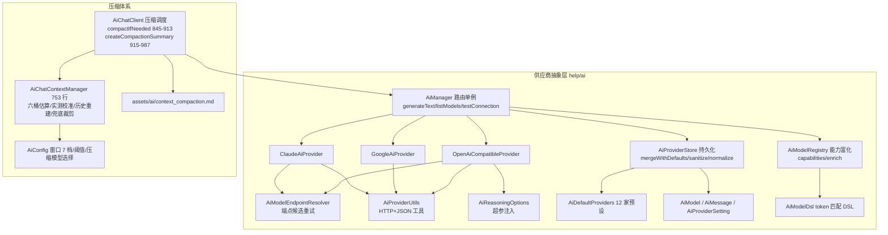
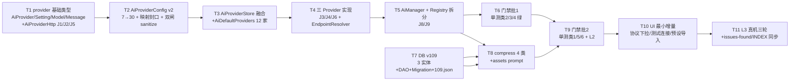

# P1 实施级设计（第三轮深化）— AI 地基：供应商抽象 + 上下文压缩 + DB v109

> 依据 [design.md](../design.md) AD-04（供应商抽象第一切入点、DB 版本链自起重编）+ 决策表 #6 修正（配置融合非双轨）；
> 证据源 [evidence-pack.md](../evidence-pack.md) E 节（AI 体系）+ C 节（数据层基线分叉）。
> NG 根：`F:\myself\github\WeAgentChat\temp\legado_NG_src\legado_NG-main`（下称 NG，路径相对 `app/src/main/java/io/legado/app/`）。
> 本项目根：`f:\myself\github\WeAgentChat\temp\legado`（DB 基线 v108，`data/AppDatabase.kt:126`）。
> 本文所有行号均为本轮逐文件精读实测，非沿用旧口径。
> 总线修订 2026-08-31：DB 规划 v109 已被 video-sniff 4.8e 实占，本分期实施时按 db-version-registry 顺延 v110（master-track AD-02）

---

## 1 目标与非目标

**目标**
1. **供应商抽象层**：`AiProvider` 接口 + 3 协议实现（OpenAI 兼容/Gemini/Claude）+ `AiManager` 路由 + `AiModelRegistry` 能力富化 + 12 家预设，落入 `help/ai/provider/` 子包；与现有 `AiProviderConfig`（7 字段）/供应商管理三件套做**配置融合**（扩展至 30 字段 + 双结构映射封口），不新建双轨。
2. **上下文压缩核心**：NG `AiChatContextManager.kt`（实测 753 行）+ `AiChatClient.kt` 压缩调度段（845-995/1620-1632）拆为 4 个 ≤300 行类沉入 `help/ai/compress/`：`AiTokenEstimator` / `AiContextCompactor` / `AiCompactionModels` / `AiCompactionScheduler`。
3. **DB v108→v109**：新增 `ai_chat_sessions` / `ai_chat_messages` / `ai_compaction_records` 3 表（全列显式 defaultValue，手动 Migration）。
4. **配置 UI 最小增量**：现有 `AiProviderManageActivity` / `AiProviderEditActivity` 叠加协议下拉/测试连接/预设导入，**不新建页面**。

**非目标（P1 明确不做）**
- 流式打通：NG 供应商层为非流式（`OpenAiCompatibleProvider.kt:64` `stream=false`）；本项目流式通道 `AiChatService.chatStream`（:275）保留不动（D5）。
- `AiBalanceProvider` 余额查询裁剪出 P1（D6），`AiProviderSetting.balanceUrl/balanceJsonPath/useCustomBalanceUrl` 字段保留（随 26 字段全量迁移）。
- Agent/Skill/ModeEntryContext 依赖链裁剪至 P4：`syncActiveSkill`/`syncModeEntryContext` 不迁，`AiChatSnapshot` 裁掉 Skill 字段（D4）。
- MCP（P2）、替换既有 `AiContextManager`（P1 并存观察，P4 评估）、密钥 Keystore 加密（记债）（Keystore 本体仍记债；备份 AES 已由 V6 前置至 P1，见 §4.6）。

---

## 2 NG 技术架构与逐类逐函数解读

### 2.1 分层图



### 2.2 供应商层逐类逐函数（行号实测）

**AiProvider.kt:3-33** — `interface AiProvider { listModels(setting); generateText(setting, messages, params) }`（:3-13）；`AiTextParams`（:15-22）= temperature/maxTokens/enableThinking/disableThinking/reasoningEffort/jsonResponse 六参；`AiTextResult`（:24-33）= content/reasoning/model/finishReason/promptTokens/completionTokens/totalTokens/rawPreview 八元。

**AiProviderSetting.kt:5-78** — `AI_PROVIDER_DEFAULT_TIMEOUT_SECONDS=180` / `LEGACY=60`（:5-6）；**26 字段**（:8-61，逐字段）：`id, type(AiProviderType), enabled, builtIn, name, apiKey, baseUrl, model, models(List<AiModel>), availableModelIds, availableModelSelectionInitialized, timeoutSeconds, chatCompletionsPath, modelsUrl, supportsThinking, supportsEffort, thinkingParam, effortParam, disableEffortValue, reasoningOutputField, useCustomModelsUrl, balanceUrl, balanceJsonPath, useCustomBalanceUrl, streamResponseEnabled, supportsStreamUsage`，全字段 `@SerializedName(长名, alternate=[短key])`；`AiProviderType` 枚举（:63-78）OPENAI/GOOGLE/CLAUDE，`from()` 兜底 OPENAI。

**AiManager.kt:3-91** — `object` 单例；三个 Provider `by lazy`（:5-7）；`generateText`（:9-20）：取 setting→`modelId ?: setting.model`→`check(enabled)`→`check(model.isNotBlank)`→`providerFor(setting).generateText(setting.copy(model=...))`；`listModels`（:22-29）拉取后 `enrich + distinctBy + sortedBy`；`fetchAndSaveModels`（:31-48）按 `availableModelSelectionInitialized` 决定是否裁剪可用集后回存；`testConnection`（:50-68）用 system"Reply OK"探针 + `disableThinking=true`，区分"仅 reasoning"与"空 content"两种失败；`testConnectivity`（:70-77）走 listModels 计数；`queryBalance`（:79-82）P1 裁剪；`providerFor`（:84-90）三分支路由。

**AiProviderStore.kt:14-485** — 存储 `PreferKey.aiProvidersJson/aiActiveProviderId`；核心函数链：
- `providers()`（:16-28）：空→`migrateLegacyConfig` 灌默认；非空→`mergeWithDefaults` 且结果变化时回写；
- `readSavedProviders()`（:94-106）：`GSON.fromJson(json, JsonArray)` 逐元素 `parseProvider`（runCatching :108-112）→ **`sanitize`（:227-258）逐字段 runCatching + nullableString/nullableType 兜底**→ 过滤 `id/baseUrl` 非空 —— **Gson 对缺失字段不应用 Kotlin 默认值，sanitize 是必需防线**；
- `mergeWithDefaults`（:114-128）+ `mergeProvider`（:130-162）：按 id 合并，`ifBlank` 回落默认、`mergeTimeoutSeconds`（:211-225）处理 legacy 60s→180s；
- `normalize`（:201-209）：timeout coerce(5,600)、models/modelsUrl/balanceUrl 归一；
- `migrateLegacyConfig`（:164-199）：旧单供应商键名迁移；
- `deleteCustomProvider`（:53-69）：builtIn 禁删、活跃指针迁移到下一个 enabled；
- `normalizeModels`（:316-329）：接受 AiModel/Map/JsonObject/String 四形态，`withClearedCapabilitiesIfNeeded`。

**OpenAiCompatibleProvider.kt:8-168** — `listModels`（:10-38）：`AiModelEndpointResolver.candidates` 逐候选请求，**404/405 转下一候选**（:25-27），其余非 2xx 直接报错（body.take(500)）；`generateText`（:40-106）：组包 model/messages/temperature/max_tokens/jsonResponse→`addReasoningParams`→**`stream=false`（:64）**；URL=`{baseUrl.trimEndSlash()}{chatCompletionsPath.ensureStartSlash()}`（:69）；解析 choices[0].message.content，reasoning 取 `reasoningOutputField`（缺省 `reasoning_content`）→`reasoning` 两级回落（:92-94）；usage 三元提取（:95-103）；`rawPreview=body.take(1000)`。

**GoogleAiProvider.kt:7-100** — 鉴权 `x-goog-api-key`（:18,78）；system 消息合并进 `systemInstruction`（:43-45,62-68）；其余转 contents/parts（assistant→"model"）；`/models/{model}:generateContent`（:77）；usage 从 `usageMetadata`（promptTokenCount/candidatesTokenCount/totalTokenCount，:90-97）；listModels 按 `supportedGenerationMethods` 含 `generateContent` 过滤（:25-28）。

**ClaudeAiProvider.kt:7-89** — 鉴权 `x-api-key` + `anthropic-version: 2023-06-01`（:22,68）；listModels 双头回退：`useCustomModelsUrl` 时同时加 Bearer（:15-20）；system 合并为顶层 `system` 字段（:43-45,50-52）；`{base}/messages`（:66）；finishReason=`stop_reason`、usage=input/output tokens、total 手工求和（:77-87）。

**AiProviderUtils.kt:1-120** — `aiHttpClient(timeoutSeconds)`（:20-28）：基于全局 `okHttpClient.newBuilder()` 四超时 coerce(5,600)s；**HTTP 执行直接 `newCall(request).await()`（:72,83），import 的是 `io.legado.app.help.http.await`** —— 与本项目 `OkHttpUtils.kt:78 Call.await()` 同源，可零改平移；`executeJson`（:70-79）/`executeJsonOrThrow`（:81-87）；URL 工具 `trimEndSlash/ensureStartSlash/buildAiApiEndpoint/normalizeAiApiPath`（:30-68）；JSON 容错取值扩展 6 个（:89-118）；`jsonBody`（:120）。

**AiModelEndpointResolver.kt:3-68** — `useCustomModelsUrl`→单候选；否则按 base 形态生成候选集：CLAUDE→`{base}/models`；含 deepseek 官方域→固定官方 models 地址；以 `/v{n}` 结尾→`{base}/models`+`{base}/v1/models`；默认 `{base}/v1/models`；`knownCompatSuffixes` 9 个 Claude 兼容后缀（:5-15）命中则回退 root 拼接。

**AiReasoningOptions.kt:5-42** — `reasoningOptions(modelId)`：设置值 `ifBlank` 回落 Registry 推断值（thinkingParam/effortParam/reasoningOutputField）；`addReasoningParams`：enableThinking→`{thinkingParam:{type:enabled}}`+`{effortParam: effort|"high"}`；disableThinking→`{thinkingParam:{type:disabled}}` 或 `{effortParam: disableEffortValue}`（商汤类踩坑参数）。

**AiModelRegistry.kt:773-827 / AiModelDsl.kt** — `capabilities(modelId)`（:773-783）= token 匹配取最优分定义集→解析 type/modalities/abilities/reasoning；`enrich(model)`（:785-809）= 声明能力与推断能力**并集合并**，`shouldClearDeclaredCapabilities` 白名单清除机制；数据表 ~989 行（AiModelDsl.kt 205 行 DSL）。

**AiDefaultProviders.kt:5-130** — 12 家预设：openai/claude/gemini/deepseek/siliconflow/openrouter/xiaomi_mimo/sensenova/aliyun_bailian(默认禁用)/volcengine(禁用)/moonshot(禁用)/zhipu(禁用)；sensenova 携带 `effortParam=reasoning_effort + disableEffortValue=none + reasoningOutputField=reasoning + streamResponseEnabled=true` 完整踩坑参数与预置 models；deepseek/siliconflow/openrouter/moonshot 带 balanceUrl 配置。

### 2.3 压缩体系逐函数（AiChatContextManager.kt 实测 753 行）

| 函数 | 行号 | 职责 |
|---|---|---|
| 常量组 | 13-22,608-615 | `SUMMARY_PREFIX="[AI_CONTEXT_COMPACTION_SUMMARY]"`、`MAX_RECENT_USER_TOKENS=20_000`、`MESSAGE_OVERHEAD_TOKENS=12`、`MIN_COMPACTION_SHRINK_CHARS=4_096`、`REVISION_REGEX` |
| `usage()` | 200-224 | 六桶 breakdown + 阈值换算（thresholdPercent==0→threshold=window）+ 校准应用 |
| `calibrationFromHistory()` | 226-254 | 以 provider `usage.promptTokens` 为锚：promptTokens≤0/含 summary/工具调用数不足→null；锚定到最近无 tool_calls 的 assistant 前（:240-247）取本地估算 |
| `trimOldestCompactionHistoryUnit()` | 256-291 | 按 user 消息单元成组删（到下一个 user 前）；无 user 时按 tool_call_id 配对删 |
| `shrinkLargestCompactionMessage()` | 293-313 | 最长 content（≥4096 chars）对半截断 + `[较早的超长内容已在压缩请求中省略]` 标记 |
| `breakdown()` | 315-387 | 六桶分类累计：tool/tool_calls→tool 桶；skill 前缀→投影目录化计 skill+protocol；modeEntry→appContext+protocol；system→systemPrompt+protocol；user→三段拆分（:562-583）conversation/skill/appContext+protocol；其余→conversation+reasoning+protocol；toolDefinitions JSON 整段计 tool 桶（:372-378） |
| `estimateTokens()` | 389-393 | 逐消息 `estimateTextTokens(msg.toString()) + 12` |
| `estimateTextTokens()` | 395-405 | 逐字符加权：CJK 系（:590-598 六个 UnicodeBlock）1.0 / 空白 0.15 / 其他 0.25，ceil 后最少 1 |
| `shouldCompact()` | 407-414 | `contextCompactionEnabled && estimated >= threshold` |
| `buildCompactedHistory()` | 459-495 | 全部 system 深拷贝 + summary 消息（revision=旧+1）+ 预算内 recent users（默认 min(20k, 窗口 20%)，单条超预算整条跳过 :476-478）+ pinned artifacts（:497-522，按 tool_call_id 回溯 assistant+连续 tool 段） |
| `compactionRevision()` | 524-533 | 倒序找 SUMMARY_PREFIX 消息解析 revision，缺省 0 |
| 数据类 | 654-753 | Breakdown(6 桶)/Usage(estimated+local+window+threshold+percent)/TokenCalibration(`estimate()=contextTokens + max(0, local-localContext)` :687-693)/PromptUsageAnchor/Stage(PRE_TURN,MID_TURN)/Event/Record |
| Skill/ModeEntry 组 | 24-198 | **P1 不迁**（依赖 AgentSkillRuntimeDeclaration/AgentModeEntryContext） |

**AiChatClient.kt 压缩调度段**：
- `compactIfNeeded`（845-913）：① 未启用且非 force→`check(estimated < window)` 否则抛"请开启自动压缩"（:855-859）；② 三触发条件：`officialUsageReachedThreshold = calibration?.contextTokens >= threshold`（:861-862）/ `predictedNearWindowLimit = estimated >= window*95%`（`HARD_WINDOW_GUARD_PERCENT=95`，:1625,863-865）/ force；③ STARTED 事件→`createCompactionSummary`→`buildCompactedHistory`→**复检 `check(replacement < threshold)` 否则抛**（:889-892）→ 原地替换 → COMPLETED 事件 + Record(before/after/revision/summary usage)。
- `createCompactionSummary`（915-987）：压缩模型选择 `AiConfig.contextCompactionModel()`（AiConfig.kt:372-380，缺省跟随助手模型）；**`check(setting.type == OPENAI)`"压缩暂只支持 OpenAI 兼容"（:923）**；assets 加载 `ai/context_compaction.md`（:925-927，1623）；历史=非 system 非 pinned；**死循环**：`ensureActive()`（:937）→ 组包（system prompt + 历史 + user"请将以上上下文压缩…"）→ `temperature=0f, disableThinking=true, stream=false`（:954-955）→ `IllegalStateException` 且 `isContextWindowExceeded()`→ `trimOldest || shrinkLargest` 重试，两条都失败抛"压缩模型的上下文窗口不足"（:970-979）；空摘要报错（:980-985）。
- `isContextWindowExceeded`（989-995）：cause 链 message 全拼接 lowercase 后匹配 5 个标记（:1627-1633：maximum context length/context length/context window/context_length/too many tokens）。

---

## 3 本项目对接点现状（本轮实测行号+摘录）

**3.1 配置存储与 UI（融合基础）**
- `ui/main/ai/AiConfigModels.kt:7-15` — `AiProviderConfig` 现有 **7 字段**：`id/name/baseUrl/apiKey/headers/apiMode/promptCache`（apiMode 两常量 ：17-18 区分 chat_completions/responses，单协议 OpenAI 兼容）。
- `help/config/AppConfig.kt:541-556` — `aiProviderList` getter=`readAiProviders()+syncAiState()`，setter=`normalizeAiProviders→persistAiProviders→persistAiModels→syncAiState`（带模型孤儿清理）；`:558-575` `aiCurrentProviderId` 校验写入（无效 id 会 remove）；`:1389` `GSON.fromJsonArray<AiProviderConfig>(...)` **无 sanitize**。
- `constant/PreferKey.kt:424-425` — `aiProviderList` / `aiCurrentProviderId`。
- 管理三件套：`ui/config/AiProviderManageActivity.kt:94-100`（reload 读 AppConfig）/:102-106（openEdit）/:127-146（删除确认+级联模型计数）；`AiProviderEditActivity.kt:225-264`（saveProvider：name/baseUrl 必填校验→copy/新建→`AppConfig.aiProviderList = providers`）/:269-272；`AiConfigFragment.kt:217-223`（入口汇总）。
- 先例：`AiImageProviderConfig`（AiConfigModels.kt:173-203）已有 `order/enabled` 字段惯例。

**3.2 网络层（同源降本点）**
- `help/http/OkHttpUtils.kt:78-94` — `suspend fun Call.await(): Response`（suspendCancellableCoroutine + enqueue + cancel 透传）。NG `AiProviderUtils.kt:7-8` import 的正是 `io.legado.app.help.http.await` + `okHttpClient` —— **两侧同源，HTTP 工具层可直接平移，零适配成本**。
- `AiChatService.kt:496-504` — `aiChatHttpClient`：connect 60s / read-write-call 300s 的 newBuilder 惯例。

**3.3 数据库**
- `data/AppDatabase.kt:126-127` — `version = 108, exportSchema = true`；`:149-194` AutoMigration 链止于 88→89；`:195-207` 手动 Migration 注释惯例（最近：`migration_107_108`）。
- `data/DatabaseMigrations.kt:1367-1379` — `runCatchingSql(db, tag) { sql }`：**按分号拆分逐条 `kotlin.runCatching { db.execSQL }` + AppLog**；`migration_106_107`（:1382-1422）为"纯新增表"标准范例（CREATE TABLE IF NOT EXISTS + 全列 DEFAULT）；`migration_107_108`（:1430+）注明"重建表 DDL 与 Room schema 严格一致"。
- 实体惯例：`data class + @Parcelize + @Entity + 全字段默认值`（checkstyle_rules.md）；v105→106 已建 19 张 AI 表含 2 张 FTS。

**3.4 既有 AI 设施（并存判定）**
- `data/entities/AiAgentSession.kt:8-39` — `ai_agent_sessions` 表：scope/status/currentGoal/contextJson/pendingConfirmationsJson/retryStateJson…… 是 **Agent 运行状态机**，与聊天会话不同构，不复用（D7）。
- `data/dao/` 现有 AI DAO 6 个（AiAgentDao/AiMemoryDao/AiImageGroupDao/AiGeneratedImageDao/AiReadAloudRoleCacheDao/AiReadAloudUsageRecordDao）——**无聊天会话 DAO**，v109 需新建。
- `help/ai/AiContextManager.kt:8-12` — 现聊天压缩：`CHARS_PER_TOKEN=3`、`RECENT_MESSAGE_COUNT=10`、`COMPRESS_TRIGGER_PERCENT=90`、`TARGET_PERCENT=35`；`:93-103` 估算=`ascii/4 + nonAscii + 1`（粗估）；`:105-124` 摘要=逐条 900 字符截断拼接（**无模型参与，纯本地**）。P1 不动（并存观察）。
- `help/ai/AiChatService.kt` — `chat:96→chatStream:275`、`fetchModels:243`、`requestCompletionStream:622`；OpenAI 兼容直连+流式，**冻结不改**。
- `AppConfig.kt:1284-1290` — `aiContextCompressionEnabled`（默认 false）/`aiContextWindowTokens`（默认 258_000，coerce 8k..2M）。
- `help/ai/` 现有 35 文件（Glob 实测），无 `provider/`、无 `compress/` 子包——命名空间干净。

**3.5 结论**：配置"UI+存储+键名"已在但仅 7 字段单协议；协议抽象/超参/能力富化/预设/压缩六桶算法全缺。P1 = 增量融合补地基。

---

## 4 改造方案

### 4.1 AiProviderConfig v2：7 → 30 字段（全字段 Kotlin 草案）

存储结构仍在 `ui/main/ai/AiConfigModels.kt` 原地扩展（Gson 落 `PreferKey.aiProviderList` 同一 JSON，旧配置兼容）；协议语义结构 `AiProviderSetting`（26 字段，NG 原样含 alternate 短 key）落 `help/ai/provider/`；两结构间**映射封口**为两个扩展函数（D10）。

```kotlin
// ui/main/ai/AiConfigModels.kt —— v2 全字段草案（7 存量 + 22 NG 采纳 + 1 项目新增 = 30）
@Keep
data class AiProviderConfig(
    // ── 存量 7 字段（语义不变，旧 JSON 直接兼容）──
    val id: String = UUID.randomUUID().toString(),
    val name: String = "",
    val baseUrl: String = "",
    val apiKey: String = "",
    val headers: String = "",                                   // JSON 串，自定义请求头（本项目独有，J4）
    val apiMode: String = AI_API_MODE_CHAT_COMPLETIONS,          // 存量语义：流式通道用；见边界 E3
    val promptCache: Boolean = false,
    // ── NG 采纳 22 字段（与 AiProviderSetting 一一对应）──
    val protocol: String = AI_PROTOCOL_OPENAI,                  // NG type → String 化（Gson 健壮性），AI_PROVIDER_TYPE.from() 兜底
    val enabled: Boolean = true,
    val builtIn: Boolean = false,                                // 本项目预设=导入模板，默认 false（D3）
    val model: String = "",                                      // 默认模型 id
    val models: List<AiModel> = emptyList(),                     // help/ai/provider/AiModel（含能力四元组）
    val availableModelIds: List<String> = emptyList(),
    val availableModelSelectionInitialized: Boolean = false,
    val timeoutSeconds: Int = 180,
    val chatCompletionsPath: String = "/chat/completions",
    val modelsUrl: String = "",
    val supportsThinking: Boolean = false,
    val supportsEffort: Boolean = false,
    val thinkingParam: String = "",
    val effortParam: String = "",
    val disableEffortValue: String = "",
    val reasoningOutputField: String = "",
    val useCustomModelsUrl: Boolean = false,
    val balanceUrl: String = "",                                 // P1 不消费（D6），字段随迁保完整性
    val balanceJsonPath: String = "",
    val useCustomBalanceUrl: Boolean = false,
    val streamResponseEnabled: Boolean = false,
    val supportsStreamUsage: Boolean = false
    // ── 项目新增 1 字段 ──
    // val order: Int = 0                                        // 管理列表排序（对齐 AiImageProviderConfig 惯例）
)                                                              // 注：order 并入后总计 30 字段
const val AI_PROTOCOL_OPENAI = "openai"
const val AI_PROTOCOL_GOOGLE = "google"
const val AI_PROTOCOL_CLAUDE = "claude"
```

> 字段计数核对：存量 7（id/name/baseUrl/apiKey/headers/apiMode/promptCache）+ NG 采纳 22（protocol/enabled/builtIn/model/models/availableModelIds/availableModelSelectionInitialized/timeoutSeconds/chatCompletionsPath/modelsUrl/supportsThinking/supportsEffort/thinkingParam/effortParam/disableEffortValue/reasoningOutputField/useCustomModelsUrl/balanceUrl/balanceJsonPath/useCustomBalanceUrl/streamResponseEnabled/supportsStreamUsage）+ 新增 1（order）= **30**。

**双结构映射封口**（新文件 `ui/main/ai/AiProviderConfigBridge.kt`，仅 ui→help 单向依赖）：

```kotlin
fun AiProviderConfig.toProviderSetting(): AiProviderSetting = AiProviderSetting(
    id = id, type = AiProviderType.from(protocol), enabled = enabled, builtIn = builtIn,
    name = name, apiKey = apiKey, baseUrl = baseUrl, model = model, models = models,
    availableModelIds = availableModelIds,
    availableModelSelectionInitialized = availableModelSelectionInitialized,
    timeoutSeconds = timeoutSeconds, chatCompletionsPath = chatCompletionsPath,
    modelsUrl = modelsUrl, supportsThinking = supportsThinking, supportsEffort = supportsEffort,
    thinkingParam = thinkingParam, effortParam = effortParam,
    disableEffortValue = disableEffortValue, reasoningOutputField = reasoningOutputField,
    useCustomModelsUrl = useCustomModelsUrl, balanceUrl = balanceUrl,
    balanceJsonPath = balanceJsonPath, useCustomBalanceUrl = useCustomBalanceUrl,
    streamResponseEnabled = streamResponseEnabled, supportsStreamUsage = supportsStreamUsage
)

fun AiProviderSetting.toProviderConfig(order: Int = 0): AiProviderConfig = AiProviderConfig(
    id = id, name = name, baseUrl = baseUrl, apiKey = apiKey,
    headers = "", apiMode = AI_API_MODE_CHAT_COMPLETIONS, promptCache = false, order = order,
    protocol = type.prefValue, /* …其余 22 字段直拷… */
)

fun AiProviderConfig.sanitizeOrNull(): AiProviderConfig?   // 见 4.2 sanitize 闸口
```

### 4.2 provider/ 子包骨架与请求构造注入点 J1-J9

新增文件清单（风格改造点：AppLog / kotlin.runCatching / NoStackTraceException / 中文注释）：

| 文件 | 来源（NG） | 目标行数 | 关键函数 |
|---|---|---|---|
| `help/ai/provider/AiProvider.kt` | 同名 ：3-33 | ~60 | 接口 + AiTextParams/AiTextResult 原样 |
| `help/ai/provider/AiProviderSetting.kt` | 同名 ：5-78 | ~110 | 26 字段（alternate 短 key 保留，与 NG 配置串互通）+ AiProviderType |
| `help/ai/provider/AiProviderHttp.kt` | AiProviderUtils.kt:1-120 | ~130 | `client(timeoutSeconds)`/`executeJson`/`executeJsonOrThrow`/URL 工具/JSON 扩展 |
| `help/ai/provider/AiProviderStore.kt` | AiProviderStore.kt:14-485 | ~300 | 融合改造（下述） |
| `help/ai/provider/AiDefaultProviders.kt` | 同名 ：5-130 | ~140 | 12 家预设原样 |
| `help/ai/provider/AiManager.kt` | 同名 ：3-91 | ~150 | 双版本 `generateText()/generateTextAwait()`（checkstyle 双版本规范） |
| `help/ai/provider/OpenAiCompatibleProvider.kt` | 同名 | ~180 | 含 404/405 候选重试 |
| `help/ai/provider/GoogleAiProvider.kt` / `ClaudeAiProvider.kt` | 同名 | ~100/~90 | 协议差异见 §2.2 |
| `help/ai/provider/AiModelEndpointResolver.kt` | 同名 | ~70 | 原样 |
| `help/ai/provider/AiModel.kt` / `AiReasoningOptions.kt` | 同名 | ~70/~45 | 原样 |
| `help/ai/provider/AiModelRegistry.kt` + `AiModelRegistryData.kt` | 同名 989 行拆 2 | ~120/~1000 | Registry 定义 + capabilities/enrich 逻辑（D9 冻结快照） |
| `ui/main/ai/AiProviderConfigBridge.kt` | 新增 | ~90 | toProviderSetting/toProviderConfig/sanitizeOrNull 封口 |

**AiProviderStore 融合改造（D1）**：底层读写改走 `AppConfig.aiProviderList`（同一 PreferKey `aiProviderList`），NG 的 `aiProvidersJson/aiActiveProviderId` 独立键废弃：
```kotlin
object AiProviderStore {
    // 读路径免锁：providers() 每次新建不可变列表返回，无共享可变状态（写路径才加锁）
    fun providers(): List<AiProviderSetting> {
        val saved = AppConfig.aiProviderList.mapNotNull { it.sanitizeOrNull() }   // 闸口②
            .map { it.toProviderSetting() }
        return mergeWithDefaults(saved)               // 内存合并补齐缺失预设；写回只在显式 save 时
    }
    @Synchronized  // object 单例可变状态守卫（checkstyle 规范），仅写路径
    fun saveProvider(setting: AiProviderSetting) {
        val config = setting.toProviderConfig()
        val list = AppConfig.aiProviderList.toMutableList()
        val idx = list.indexOfFirst { it.id == config.id }
        if (idx >= 0) list[idx] = config else list.add(config)
        AppConfig.aiProviderList = list               // 复用既有 normalize/persist/syncAiState 链
    }
    @Synchronized                                     // 写路径与 saveProvider 同锁
    fun deleteProvider(id: String): Boolean           // builtIn 禁删 + 活跃指针迁移（对齐 AppConfig.aiCurrentProviderId 语义）
    fun activeProviderId(): String                    // aiCurrentProviderId 校验 → 首个 enabled → 首个（NG :78-84 兜底链）
    // mergeWithDefaults/mergeProvider/normalize/mergeTimeoutSeconds/sanitize 系列照搬 NG
}
```

**sanitize 闸口（结论 #5 落地，双闸）**：
- 闸口① `AppConfig.readAiProviders()`（:1386-1390）：`GSON.fromJsonArray` 后逐元素 `runCatching` 解析 + `sanitizeOrNull()`（新 23 字段在旧 JSON 中缺失 → Gson 反射置 null/0/false 而非 Kotlin 默认值 → 逐字段 nullable 兜底：protocol 非法→OPENAI、models 逐元素 runCatching、timeout coerce(5,600)、chatCompletionsPath 空→`/chat/completions`），坏元素丢弃 + `AppLog.putDebugWithTag(TAG_AI, ...)`。
- 闸口② `AiProviderStore.providers()` 读路径再过一层 NG 式 sanitize（防未来绕过 AppConfig 的写入源）。

**请求构造注入点 J1-J9**（与 NG 的 9 处差异/适配点，实施时逐一对照）：

| # | 注入点 | NG 原状 | 本项目落法 |
|---|---|---|---|
| J1 | HTTP 客户端工厂 | `aiHttpClient(timeoutSeconds)`（AiProviderUtils.kt:20-28） | `AiProviderHttp.client(timeoutSeconds)`：`okHttpClient.newBuilder()` 四超时 coerce(5,600)s，沿用全局拦截器链（DoH/解压/异常守卫白得） |
| J2 | HTTP 执行原语 | `newCall(request).await()`（:72,83） | **同源零改**：本项目 `OkHttpUtils.kt:78 Call.await()` 直接 import 平移 |
| J3 | 协议鉴权头 | Bearer / x-goog-api-key / x-api-key+anthropic-version | 3 Provider 原样保留（apiKey 空→不加 Bearer，NG 同款） |
| J4 | 自定义 headers 合并 | NG 无此概念 | `AiProviderConfig.headers` JSON 解析后逐条 `addHeader`；与 J3 协议必需头同名时**协议头优先**（冲突 key 跳过 + debug 日志） |
| J5 | URL 组包 | trimEndSlash/ensureStartSlash/buildAiApiEndpoint/normalizeAiApiPath | 原样平移（AiProviderUtils.kt:30-68） |
| J6 | Reasoning 超参注入 | AiReasoningOptions.kt:5-42 | 原样平移 + Registry 推断回落；sensenova 踩坑参数随预设保留 |
| J7 | 压缩摘要请求通道 | NG 私有 `buildRequestBody+executeJsonChat`（AiChatClient.kt:949-969） | **收敛走 `AiManager.generateText`**（AiTextParams(temperature=0f, disableThinking=true)），保留 `type==OPENAI` 校验 + `apiMode==chat_completions` 校验 |
| J8 | 响应解析/rawPreview | 3 Provider parse 段 + rawPreview=body.take(1000) | 原样平移；rawPreview 仅随 AiTextResult 传递，**禁止入日志** |
| J9 | 日志/脱敏 | NG 无系统化日志规范 | AppLog + 新增 `AppLog.TAG_AI`（TAG_AI 新增，序号按落地顺序顺延；AppLog.kt:13-42 为现状参考）：只记 providerId/HTTP code/token 数/候选 URL 路径模式；apiKey/Authorization 头/完整 URL 禁止出现在任何日志与异常 message（logging_rules 铁律）；**NetworkLog 脱敏补头见 §4.6（V6 红队 HIGH-A1-4，P1 前置必改）** |

### 4.3 压缩核心 4 类骨架与逐桶算法表

| 文件（`help/ai/compress/`） | 来源 | 目标行数 | 内容 |
|---|---|---|---|
| `AiCompactionModels.kt` | AiChatContextManager.kt:654-753 | ~140 | `AiContextBreakdown/AiContextUsage/AiTokenCalibration/AiCompactionRecord/AiCompactionStage/AiCompactionEvent/AiChatSnapshot(messages+toolDefs，裁 Skill 字段)` |
| `AiTokenEstimator.kt` | 同上 :315-405 | ~180 | `estimateTextTokens/estimateTokens/breakdown/splitUserContent/isCjkLike` |
| `AiContextCompactor.kt` | 同上 :200-254,407-414,459-533 | ~240 | `usage/shouldCompact/calibrationFromHistory/buildCompactedHistory/pinnedArtifactMessages(P1 空集签名保留)/compactionRevision` |
| `AiCompactionScheduler.kt` | AiChatClient.kt:845-995,1620-1633 | ~200 | `compactIfNeeded/createCompactionSummary(J7 走 AiManager)/isContextWindowExceeded/兜底裁剪循环`；窗口/阈值读本项目 AppConfig（见 §4.4 配置对齐） |

**逐桶算法表**（六桶桶位保留，skill/appContext 两桶 P1 恒 0、P4 填充）：

| 桶 | 判定条件 | 计算式 | P1 语义 |
|---|---|---|---|
| systemPromptTokens | role==system 且无特殊前缀 | `estimateTextTokens(content)`；溢出部分入 protocol | 活跃 |
| toolTokens | role==tool 或 has(tool_calls)；+ toolDefinitions 整串 | 全量 `estimateTokens(msg)` | 活跃 |
| skillTokens | `[AI_ACTIVE_SKILL]` 前缀 | — | **P1 恒 0**（消息不存在） |
| appContextTokens | `[AI_MODE_ENTRY_CONTEXT]`/附件三段式 | — | **P1 恒 0** |
| conversationTokens | user 三段拆分 conversation 段；assistant content+reasoning | `estimateOptionalTextTokens` | 活跃 |
| protocolTokens | 每条消息的壳开销 | `max(0, full − 已归桶部分)` | 活跃（角色标记/包装） |

估算公式保 NG 原参数不调：CJK 1.0 / 空白 0.15 / 其他 0.25、每消息 +12、向上取整最少 1。

### 4.4 校准五道守卫（G1-G5）

| # | 守卫 | 机制（NG 锚点） |
|---|---|---|
| G1 | 无锚退化 | `calibration==null` → 纯本地估算（AiChatTokenCalibration.estimate 短路，:687-693）；记录估算偏差 debug 日志供后续校准 |
| G2 | 阈值双轨触发 | 官方 usage 达阈值（calibration.contextTokens ≥ threshold，AiChatClient.kt:861-862）**或** 预测达硬窗 95%（:863-865）**或** force |
| G3 | 压缩后复检 | 重建历史 usage 必须 < threshold，否则抛错阻断（:889-892），防"压缩了但没压够"死循环；报错文案补引导："压缩后仍超阈值，请调低阈值百分比"（V6 红队 A3-3） |
| G4 | 锚有效性四拒 | promptTokens≤0 / 历史含 summary / 工具调用数不足 / 无锚定 assistant（AiChatContextManager.kt:234-243）→ 拒建锚 |
| G5 | 硬窗兜底 | 未启用压缩时 `estimated ≥ window` 直接抛错（:855-859），禁止静默超窗请求 |

**压缩滞后带防抖（V6 红队 A3-3 新增）**：
- **压缩后目标线**：`buildCompactedHistory` 的 recent 预算从默认 `min(20k, 窗口 20%)` 收紧为 **重建后 usage ≤ 阈值×0.6**（预算=阈值×0.6 − system − summary 的动态余量），给下一轮对话留出增长带，避免压完就贴着阈值线；
- **防抖跳过**：`compactIfNeeded` 增加前置判断——**距上次压缩（compactionRevision 最新 Record）不足 N 条新消息（N=10，常量 `COMPACTION_DEBOUNCE_MIN_MESSAGES`）且当前估算 < 硬窗 95%** → 跳过本轮压缩（返回不触发），防止小窗口/贴线场景每轮对话都触发压缩抖动（压缩本身也消耗 token 与延迟）；
- 单测覆盖：AiCompactionSchedulerTest 增 2 方法（防抖跳过 / 防抖不拦截硬窗 95% 触发）。

**配置对齐**：压缩开关沿用 `AppConfig.aiContextCompressionEnabled`；窗口/阈值新增两 key（`aiContextWindowTokensV2` 沿 NG 7 档 32k~2M / `aiContextCompactionThresholdPercent` 0+50..95 步进 5），旧 `aiContextWindowTokens`（258k 连续值）保留给旧 AiContextManager——两套配置互不污染（并存期，见 Open Question 4）。新 key `aiContextWindowTokensV2` 默认 258_000（OQ-4 关闭引发；7 档表核对以实列档位数为准——实列为 6 档，"OQ-4 关闭"段中"7 档"已修正为"6 档"）。压缩模型缺省跟随助手模型（AiConfig.kt:372-380 语义）。

### 4.5 兜底裁剪算法（压缩摘要请求自身超窗时）

```
MAX_TRIM_ROUNDS = 50                               // V6 红队 A3-2：迭代上限，防畸形历史死循环
loop:
  ensureActive()                                    // 取消透传
  round ≥ MAX_TRIM_ROUNDS → 抛 NoStackTraceException("压缩裁剪超迭代上限，历史结构异常")
  发送摘要请求（system prompt + 历史 + 固定 user 指令）
  成功 → 返回摘要（空内容报错）
  窗口超限（cause 链匹配 5 标记）→
     单轮裁剪目标 = 阈值×0.6                         // V6 红队 A3-2：单轮足量裁剪，减少请求数
     按目标批量裁剪：
       trimmed = trimOldestCompactionHistoryUnit(历史, 目标)   // user 单元成组删 / tool_call 配对删（NG 单条版改为循环删至估算 ≤ 目标）
            || shrinkLargestCompactionMessage(历史)            // 最长消息 ≥4096 chars 对半截断 + 省略标记
     trimmed 为 false（无可裁）→ 抛 NoStackTraceException("压缩模型的上下文窗口不足")
     continue
  其他异常 → 原样抛出
```

> A3-2 说明：NG 原实现每轮只裁 1 个单元/截 1 条消息，超窗严重时需数十次完整 LLM 请求才能收敛（token/延迟双浪费）。本项目改为单轮循环裁剪至估算 ≤阈值×0.6 再重发请求；迭代上限 50 兜底畸形历史（如 E19 的畸形 tool_call）导致的无法收敛场景。

### 4.6 密钥泄露防线（V6 红队 HIGH 发现落地，P1 前置必改）

**A1-4 NetworkLog 脱敏缺口（HIGH，P1 前置必改项，P2 依赖）**：
- 缺口：`help/http/NetworkLog.kt:30-41` `sensitiveHeaderNames` 敏感头集合未覆盖 Gemini 协议鉴权头 **`x-goog-api-key`**（GoogleAiProvider.kt:18,78 使用）。P1 上线 GoogleAiProvider 即形成完整泄露链：**AI 请求头 → NetworkLog 抓包记录 → MCP network_log_get 返回给外部 LLM**（P2 上线 MCP 后由"本地泄露"升级为"外发泄露"），故必须在 P1 内补齐、P2 前生效；
- 改造：`sensitiveHeaderNames` 集合追加 `x-goog-api-key`（小写归一比对沿用现有机制，与 `authorization`/`x-api-key` 同列）；同步自查集合中已覆盖 Bearer/x-api-key 无缺口；
- 归属：随 T1（首个编译步）落地，单测 AiProviderHttpProtocolTest 增 1 方法断言 Gemini 请求经 NetworkLog 脱敏后头值已替换。

**A1-1/A1-2 aiProviderList 备份明文泄露链（HIGH，OQ-6 从"记债推 P5"升级为 P1 内最小修复）**：
- 缺口：P1 后 `PreferKey.aiProviderList` JSON 含 30 字段（含 `apiKey` 明文）。备份导出（本地/WebDav）沿用了"敏感字段白名单加密"惯例，但白名单只含 `webDavPassword` 等既有字段，新增的 `aiProviderList` 不在列 → 备份文件明文携带全部供应商密钥；Web 备份端点同理；
- 改造（复用 webDavPassword AES 加密先例，**两处同步**）：
  1. `help/backup/Backup.kt:546-549`（本地/WebDav 导出路径）：对 `aiProviderList` 键值走与 `webDavPassword` 相同的 AES 加密分支后再写入备份 JSON；
  2. `controller/BackupController.kt:238-242`（Web 备份路径）：同样追加 `aiProviderList` AES 加密，两处加密逻辑保持同一实现（抽公共函数或复用既有加密工具，防双实现漂移）；
- 顺手修一致性缺口：`BackupController.kt:233-253` Web 备份端点导出键集合**缺 `keyIsNotIgnore` 过滤**（本地路径有过滤、Web 路径漏掉），补齐同一过滤，消除"Web 备份比本地备份多导出内部键"的不一致；
- 导入侧：AES 解密分支对称补齐（Backup.kt 导入路径 + BackupController 导入路径），解密失败回退尝试明文读取（兼容手工编辑的备份文件，失败则该键留空 + AppLog）。

**防线总览（四层，详见 §13 D15）**：① NetworkLog 补敏感头（传输记录层）→ ② 备份 AES 加密（静态存储层）→ ③ AppLog 禁 raw/禁 apiKey（应用日志层，J9/E18）→ ④ P2 MCP Sanitizer（外发出口层，P2 落地）。

---

## 5 数据流

```mermaid
sequenceDiagram
    participant C as 调用方(场景服务/L3)
    participant S as AiCompactionScheduler
    participant E as AiTokenEstimator/Compactor
    participant M as AiManager(路由)
    participant P as AiProvider(3协议)
    participant H as okHttpClient+Call.await
    C->>S: compactIfNeeded(messages, toolDefs, calibration)
    S->>E: usage() 六桶估算 + 校准
    alt G2: 官方usage≥阈值 或 预测≥硬窗95% 或 force
        S->>M: generateTextAwait(压缩prompt+历史, temp=0, 禁thinking)
        M->>P: providerFor(setting).generateText()
        P->>H: POST {base}{chatCompletionsPath} (J1-J6)
        H-->>P: JSON 一次性返回(stream=false)
        P-->>S: AiTextResult(含usage, rawPreview)
        Note over S: 超窗→§4.5裁剪循环; 成功→G3复检→buildCompactedHistory
    end
    C->>M: generateTextAwait(业务messages, params, providerId, modelId)
    M->>P: check(enabled/model) → providerFor()
    P->>H: POST(OpenAI:Bearer / Gemini:x-goog-api-key / Claude:x-api-key)
    H-->>P: JSON(choices/usage)
    P-->>M: AiTextResult → calibrationFromHistory 更新校准锚(G4)
    M-->>C: AiTextResult
```

---

## 6 DB v109 设计

### 6.1 三表 DDL（与实体注解逐列一致，全列显式 defaultValue 吸收 NG 数据层亮点）

```sql
CREATE TABLE IF NOT EXISTS `ai_chat_sessions` (
  `sessionId` TEXT NOT NULL DEFAULT '',
  `title` TEXT NOT NULL DEFAULT '',
  `providerId` TEXT NOT NULL DEFAULT '',
  `modelId` TEXT NOT NULL DEFAULT '',
  `contextWindowTokens` INTEGER NOT NULL DEFAULT 0,
  `compactionEnabled` INTEGER NOT NULL DEFAULT 0,
  `compactionThresholdPercent` INTEGER NOT NULL DEFAULT 90,
  `status` TEXT NOT NULL DEFAULT 'ACTIVE',
  `createdAt` INTEGER NOT NULL DEFAULT 0,
  `updatedAt` INTEGER NOT NULL DEFAULT 0,
  PRIMARY KEY(`sessionId`));
CREATE INDEX IF NOT EXISTS `index_ai_chat_sessions_updatedAt`
  ON `ai_chat_sessions`(`updatedAt`);

CREATE TABLE IF NOT EXISTS `ai_chat_messages` (
  `id` TEXT NOT NULL DEFAULT '',
  `sessionId` TEXT NOT NULL DEFAULT '',
  `parentId` TEXT NOT NULL DEFAULT '',          -- 预留消息树分支（NG AiChatMessageNode 语义）
  `role` TEXT NOT NULL DEFAULT 'user',
  `content` TEXT NOT NULL DEFAULT '',
  `reasoning` TEXT NOT NULL DEFAULT '',
  `toolCallsJson` TEXT NOT NULL DEFAULT '',
  `promptTokens` INTEGER NOT NULL DEFAULT 0,     -- 回填点：请求返回 usage 后回写（真实层）
  `completionTokens` INTEGER NOT NULL DEFAULT 0,
  `totalTokens` INTEGER NOT NULL DEFAULT 0,
  `compactionRevision` INTEGER NOT NULL DEFAULT 0,
  `createdAt` INTEGER NOT NULL DEFAULT 0,
  `updatedAt` INTEGER NOT NULL DEFAULT 0,
  PRIMARY KEY(`id`));
CREATE INDEX IF NOT EXISTS `index_ai_chat_messages_sessionId_createdAt`
  ON `ai_chat_messages`(`sessionId`, `createdAt`);
CREATE INDEX IF NOT EXISTS `index_ai_chat_messages_parentId`
  ON `ai_chat_messages`(`parentId`);

CREATE TABLE IF NOT EXISTS `ai_compaction_records` (
  `id` TEXT NOT NULL DEFAULT '',
  `sessionId` TEXT NOT NULL DEFAULT '',
  `stage` TEXT NOT NULL DEFAULT 'PRE_TURN',
  `beforeTokens` INTEGER NOT NULL DEFAULT 0,
  `afterTokens` INTEGER NOT NULL DEFAULT 0,
  `revision` INTEGER NOT NULL DEFAULT 0,
  `summaryPromptTokens` INTEGER NOT NULL DEFAULT 0,
  `summaryCompletionTokens` INTEGER NOT NULL DEFAULT 0,
  `createdAt` INTEGER NOT NULL DEFAULT 0,
  PRIMARY KEY(`id`));
CREATE INDEX IF NOT EXISTS `index_ai_compaction_records_sessionId_createdAt`
  ON `ai_compaction_records`(`sessionId`, `createdAt`);
```

实体命名：`AiChatSession` / **`AiChatMessageNode`**（规避与 UI 层 `ui.main.ai.AiChatMessage` 撞名，结论 #6）/ `AiCompactionRecord`，均 `data class + @Parcelize + @Entity + 全字段默认值`，Boolean→INTEGER（0/1）。

### 6.2 Migration 草案（仿 DatabaseMigrations.kt:1382-1422 惯例）

```kotlin
// DatabaseMigrations.kt 追加；AppDatabase.kt:126 version 108→109，注册 AiChatDao
private val migration_108_109 = object : Migration(108, 109) {
    override fun migrate(db: SupportSQLiteDatabase) {
        runCatchingSql(db, "108→109 ai_chat_sessions create") { /* §6.1 第 1 段 SQL */ }
        runCatchingSql(db, "108→109 ai_chat_messages create") { /* §6.1 第 2 段 SQL */ }
        runCatchingSql(db, "108→109 ai_compaction_records create") { /* §6.1 第 3 段 SQL */ }
        // OQ-7 关闭引发：一次性导入旧 PreferKey aiChatSessionList JSON（上限 100 条，
        // AppConfig.kt:738 take(100)）→ 拆 ai_chat_sessions/ai_chat_messages 两表；
        // 复用 AppConfig.kt:686-748 现成归一化（companionId 兜底/kind 默认值/空消息过滤）。
        // runCatching 包裹：失败留空表+旧 JSON 不删（可重试）；成功后旧 key 冻结只读不删（防降级回滚）。
        AppLog.put("AppDatabase Migration 108→109: AI 聊天 3 张新表创建成功")
    }
    private fun runCatchingSql(db: SupportSQLiteDatabase, tag: String, sql: () -> String) {
        // 按分号拆分逐条 kotlin.runCatching { db.execSQL } + AppLog（定义于 DatabaseMigrations.kt:1367；106_107/107_108 内另有 :1408/:1466 私有副本）
    }
}
```

要点：a) 纯新增表，无 @DatabaseView 改动，不触发 R1；b) `IF NOT EXISTS` 幂等可重试（R2/R4）；c) DDL 的 `DEFAULT` 子句与 `@ColumnInfo(defaultValue=...)` 逐列一致（Room 运行时校验比对，R6；v105→106 同款做法，区别于 migration_107_108 的"无 DEFAULT 重建"特例）；d) migrations 数组追加 + `aiChatDao` 注册；e) **版本号弹性**：migration 起点号以实施时 AppDatabase.kt version 实际值+1 为准（如 P3 先落地则顺延），文档中 v109 为按 P0→P1→P2→P3 顺序的规划值。

### 6.3 schema 导出与覆盖安装验证

1. 改实体+版本号 → `./gradlew assembleAppDebug` → 编译器自动产出 `app/schemas/109.json`；
2. diff 审查 109.json：3 表逐列（名称/类型/notNull/默认值）与 §6.1 一致、索引齐全；
3. 109.json 入 git（迁移审计物）；
4. **真机覆盖安装**（R5）：v108 包 → 导入测试数据（含 AI 配置）→ 覆盖装 v109 测试包 → 启动无 `IllegalStateException: Migration didn't properly handle` → 数据保留 → logcat 过滤 `AppDatabase` 确认迁移日志。测试包 `io.legado.miss.app.debug`。

### 6.4 DAO

新增 `data/dao/AiChatDao.kt`：`insertSession/upsertMessage/messagesBySession(compactionRevision 升序)/latestCompactionRecord/deleteSession/deleteMessagesBySession`（Flow + suspend 双形态，仿 AiMemoryDao 风格）。P1 只写入与读取审计，不接 UI 列表。

---

## 7 边界条件（19 条）

| # | 边界 | 处理 |
|---|---|---|
| E1 | 旧 7 字段 JSON 反序列化新 30 字段实体 | Gson 缺失字段**不取 Kotlin 默认值**（结论 #5）→ 闸口①②双 sanitize（§4.2），坏元素丢弃不中断 |
| E2 | protocol/枚举字段反序列化失败 | `AiProviderType.from()` 兜底 OPENAI（NG :72-76 同款） |
| E3 | 存量 `apiMode=responses` 供应商走 AiManager | generateText 前置校验拒绝并提示走现有流式通道；AiChatService 不受影响（J7 同款校验） |
| E4 | apiKey 为空 | listModels 不加 Bearer（NG :18-20 同款）；testConnectivity 显式报"API key 为空" |
| E5 | 弱供应商不返回 usage | calibration=null → G1 纯估算退化 + G2 硬窗 95% 守卫；估算/实测偏差记 debug 日志 |
| E6 | usage.promptTokens≤0 或历史已含 summary | calibrationFromHistory 拒建锚（G4） |
| E7 | 压缩摘要请求自身超窗 | §4.5 循环裁剪；两条裁剪均失败→NoStackTraceException 明确报错 |
| E8 | 删除供应商恰为活跃供应商 | 活跃指针迁移到下一个 enabled→首个→空（对齐 AppConfig.aiCurrentProviderId remove 语义 :565-575 与 NG :62-67） |
| E9 | builtIn 预设被误删 | deleteProvider 拒绝 builtIn；mergeWithDefaults 每次读补齐缺失预设（D3 导入模板定位） |
| E10 | timeoutSeconds 越界（0/9999） | coerce(5,600)；legacy 60s 内置供应商静默升 180s（mergeTimeoutSeconds NG :211-225） |
| E11 | chatCompletionsPath 空 / modelsUrl 全 URL | 路径空兜底 `/chat/completions`；normalizeAiApiPath 归一（全 URL 相对化/相等→"/"） |
| E12 | EndpointResolver 全候选失败 | 404/405 逐候选重试后抛 lastError；knownCompatSuffixes 9 后缀回落保留 |
| E13 | 空历史/全 system 历史 | trimOldest 返回 false→shrink 接管；两者都 false 才报错 |
| E14 | 单条 user 超 recent 预算（20k） | buildCompactedHistory 整条跳过（NG :476-478），保证重建后必达 G3 |
| E15 | 覆盖安装迁移中途异常 | runCatchingSql 单语句失败不中断其余语句 + AppLog；幂等 DDL 可重试；最终以 R6 运行时校验为准，L3 真机兜底（R5） |
| E16 | 并发写 providers（UI 编辑 vs fetchAndSaveModels 回存） | AiProviderStore 写路径 `@Synchronized`；AppConfig setter 链已有孤儿模型清理 |
| E17 | 压缩循环期间用户取消 | 每轮 `ensureActive()`；CancellationException 原样上抛（不落 catch 日志，exception_rules 例外条款） |
| E18 | 日志/异常泄密 | 任何异常 message 与日志禁含 apiKey/Authorization/完整 URL；HTTP 错误只透出 code+body 前 500 字符（NG 惯例）+ AppLog 侧再脱敏；源/供应商名称只记 id |
| E19 | 畸形 tool_call 历史（AiChatToolBatchRecovery 未迁，V6 红队 A3-4 已知上限声明） | NG 同目录存在 `AiChatToolBatchRecovery`（畸形 tool_calls 配对修复器），P1 **未迁**：此类历史靠 §4.5 shrink 粗截兜底（最长消息对半截断），可能残留半截 tool_call 文本——功能不劣化但摘要质量下降。二期（P4 压缩替换评估时）评估补迁；触发条件=真机出现畸形 tool_call 导致压缩摘要质量异常 |

---

## 8 规范符合性核查表

| 规范 | 条款 | 符合性落点 |
|---|---|---|
| checkstyle_rules | Coroutine 链式双版本 | AiManager 暴露 `generateText(): Coroutine<AiTextResult>` + `generateTextAwait()`；UI 层走 Coroutine.onError/onSuccess |
| checkstyle_rules | kotlin.runCatching 前缀 | sanitize/migration/JSON 解析全部 `kotlin.runCatching` |
| checkstyle_rules | object 单例 + 并发守卫 | AiManager/AiProviderStore/4 个 compress 类均 object；Store 写路径 @Synchronized |
| checkstyle_rules | isNullOrBlank | 所有字符串判空统一 isNullOrBlank |
| checkstyle_rules | 实体全默认值 | v109 三实体全字段默认值 + AiProviderConfig v2 同 |
| naming_rules | 后缀/关键词 | Store/Manager/Resolver/Estimator/Compactor/Scheduler 语义后缀；挂起函数 Await 后缀；UPPER_SNAKE_CASE 新常量 |
| exception_rules | NoStackTraceException | 新增 `AiProviderException`（继承 NoStackTraceException，覆写 fillInStackTrace）；窗口超限沿用 message 标记检测 + 业务错误统一包装 |
| logging_rules | AppLog 三层 + TAG | 新增 `AppLog.TAG_AI="AiFoundation"`；catch 块 `putDebugWithTag`；关键操作 INFO/WARN；**脱敏铁律 E18**；三维度日志覆盖：新增 catch 块未逐一显式布点处由 Coroutine.wrap 兜底统一覆盖 |
| database-migration-safety | R1-R6 | R1 不涉及；R2 runCatchingSql；R3/R4 仅追加 migration；R5 真机覆盖安装（§6.3）；R6 运行时校验以 109.json+真机双验 |
| architecture_rules | 无 DI / object+lazy | Provider 三实例 by lazy；AppConfig/PreferKey 既有体系扩展；不引框架 |
| global-thinking-checklist | 6 维 | ① 前端入口：管理页/编辑页/设置压缩项 3 处盘点（§4.1/§4.4）；② 后端接口：AiManager 新增、AiChatService 冻结不动；③ 数据库：纯新增 3 表无 view；④ 覆盖安装：v108→v109 真机验证；⑤ 使用场景：供应商管理/测试连接/压缩审计 3 场景逐一覆盖；⑥ 回填点：messages usage 回填（真实层）+ 109.json schema（校验层）+ AppLog token 统计（调试层） |

---

## 9 测试设计

**单测 6 类（`app/src/test/java/io/legado/app/`，JVM，37 方法）**

| 测试类 | 方法数 | 覆盖点 |
|---|---|---|
| AiTokenEstimatorTest | 7 | CJK 样本≈1.0 权重 / 英文 0.25 / 空白 0.15 / 空串最少 1 / 每消息 +12 / 六桶分类（system→systemPrompt、tool_calls→tool、assistant→conversation+protocol）/ 三段拆分 P1 恒 0 桶 |
| AiProviderConfigMappingTest | 6 | toProviderSetting 30→26 逐字段断言 / toProviderConfig 反向 / 旧 7 字段 JSON → sanitize 缺省补齐 / protocol 非法串兜底 OPENAI / sanitize 坏元素返回 null / order 持久化往返 |
| AiProviderStoreTest | 6 | mergeWithDefaults 补齐缺失预设 / mergeProvider ifBlank 回落 / mergeTimeoutSeconds legacy 60→180 / 内置预设禁删 / activeProviderId 三级兜底 / 自定义 id 生成 custom_openai_1 递增 |
| AiProviderHttpProtocolTest（MockWebServer） | 8 | OpenAI 组包（model/messages/temperature/max_tokens/stream=false/response_format/reasoning 参数）/ OpenAI 解析（content+reasoning 两级回落+usage）/ 404→下一候选重试 / Gemini systemInstruction+usageMetadata / Claude system 顶层+x-api-key 头 / 自定义 headers 追加且协议头优先（J4）/ HTTP 500 报错截断 500 / rawPreview=1000 字符 |
| AiContextCompactorTest | 5 | buildCompactedHistory 结构（systems+summary revision+1+recent）/ revision 递增链 / recent 预算反向选取+超大单条跳过（E14）/ calibrationFromHistory 四拒路径（G4）/ estimate() 锚定增量公式 |
| AiCompactionSchedulerTest | 5 | 阈值触发 / 硬窗 95% 触发（G2）/ 未启用且超窗抛错（G5）/ 超窗兜底循环收敛（MockWebServer 先回 context length 错误再成功）/ 压缩后未降阈值抛错（G3） |

**JVM 集成测试（MockWebServer）**：上述协议类用例即该层主体；补充 Room in-memory 建库冒烟（3 实体 CRUD）。注：此层为 JVM 本地集成测试，不计入 L2 编号（对齐 fixed_test_workflow "L2=真机功能验证"定义）。

**L2（真机，`io.legado.miss.app.debug`）**：`ai_tests/scripts/l2_verify_ai_provider.py`（预登记）：管理页导入预设→测试连接→generateText 一次成功。

**L3（真机，`io.legado.miss.app.debug`）**：
1. v108 旧库覆盖装 v109 → 迁移成功 + 数据保留（R5）；
2. 管理页导入 1 家预设 → 填 key → 测试连接返回 OK → 真实 generateText 拿非空 content；
3. 长对话手动触发压缩 → AppLog 观察 before/after token 与 revision 递增；`ai_compaction_records` 落库。

---

## 10 实施顺序依赖图（T1-T11，双门禁=每步「编译通过 + 对应单测绿」）



说明：**updateLog 时点前移：T1 首次编译前基于 git diff 完成首轮 updateLog（版本交付同步门禁①），此后 T 系列每步编译前增量维护**；T7 与 T4/T5 无依赖可并行；T8 依赖 T5（J7 收敛走 AiManager）与 T7（压缩记录实体）；T10 依赖 T3/T5；每步结束过双门禁后才进下一步；T11 完成后执行 daemon 清场（stop-daemons.bat 门禁）。

**规范回灌任务项（对齐 design.md「规范保证与回灌执行机制」，提升清单 P1/交叉验证条目随期回灌）**：实施 tasks.md 强制包含"规范回灌"任务项——① Gson 缺失字段不取 Kotlin 默认值→反序列化入口 sanitize 双闸（P1-D12 → checkstyle_rules.md 新增小节）；② runCatchingSql 三副本收敛公共入口（→ database-migration-safety.md R2）；③ runCatching 禁用于取消信号边界，显式 rethrow CancellationException（→ exception_rules.md）。回灌完成后由验证轮复核规范文件实际变更与提升清单一致；本设计阶段不动规范原文；回灌验收三要素：触发场景+反模式示例+可 Grep 判定。
**规范核查表执行**：实施 tasks.md 同步包含"规范核查表执行"任务项——每完成 §10 一个 T 步，对照 §8 规范符合性核查表逐条打勾（审查可 Grep 复核勾选记录）。

---

## 11 Open Questions（7 条）

1. `apiMode=responses` 存量供应商的长期策略：P2 为 AiManager 适配 Responses API，还是统一收敛 chat_completions？（P1 先拒绝，见 E3）
2. AiProviderConfig 字段继续膨胀时的拆分点：是否拆出 `AiProviderRuntime`（headers/promptCache 等聊天通道专用）？（P1 选单实体扩展，触发条件=再增 5 字段）
3. 双调用通道（AiManager 非流式 vs AiChatService 流式）收敛时点与形态：P2 MCP 期 or P4 应用层期。
4. ✅【已关闭 2026-08-30】上下文窗口默认值：**新 key `aiContextWindowTokensV2` 默认 258_000**（6 档表中段，UI 档位 32k/64k/128k/258k/512k/1M 与旧选择器对齐，AiConfigFragment.kt:655）。证据：① 旧 key 默认即 258k（AppConfig.kt:1289，coerce 8k..2M），生产已验证；② 本项目用户模型分布以 128k 档国产/低价模型居多，若默认 1M，压缩阈值 50%=512k token 永不触发→直接超限 400 报错（"宁早压勿超限"）；③ NG 默认 1M 是其旗舰模型生态取向，非普适；④ 与旧 key 默认一致，并存期无"同用户双窗口值"认知混乱。旗舰模型用户手动上调至 1M 档。引发设计变更：§4 配置对齐段已标注"OQ-4 关闭引发"。
5. AiModelRegistry 冻结快照（~989 行）的更新机制：手工跟 NG / 脚本抓取 / 完全停更走 enrich 兜底。
6. ✅【已关闭（V6 升级为 P1 内最小修复）2026-08-30】密钥 Keystore 加密改造时点：原"备份导出带出明文 apiKey、记债推 P5"方案否决。V6 红队 HIGH-A1-1/A1-2 论证泄露链真实可达（备份文件明文携带全部供应商 apiKey），升级为 **P1 内最小修复**：不引入 Keystore（完整加密体系仍留 P5 评估），仅复用 webDavPassword AES 加密先例对 `aiProviderList` 备份导出/导入做字段级加密（Backup.kt:546-549 本地/WebDav + BackupController.kt:238-242 Web 两处同步），并顺手补 Web 备份端点缺 `keyIsNotIgnore` 过滤的不一致。详见 §4.6；工作量 +0.5d（§12）。引发设计变更：§4.6 新增小节、§12 加行、§13 D15 决策。
7. ✅【已关闭 2026-08-30】旧 `aiChatSessionList` JSON 会话导入：**一次性导入器，P1 迁移期执行（§6.2 migration 内），不放 P2 也不放弃**。证据：① 旧 JSON 上限 100 条会话（AppConfig.kt:738 `take(100)`），数据量小、结构已知，归一化逻辑现成（AppConfig.kt:686-748），导入器约 +0.3d；② 双轨读取反证：AiChatViewModel 12 处读写点（:534/:535/:579/:592/:744/:853/:860/:877/:919/:924/:943/:964）均需改双源合并+会话 ID 去重+删除双写，且旧 setter `take(100)` 并存期会静默丢弃第 101 条会话（数据丢失风险）——长期幽灵成本远超一次性导入；③ 导入 runCatching 兜底：失败留空表+旧 JSON 保留可重试，成功后旧 key 冻结只读不删（防降级回滚）。引发设计变更：§6.2 migration 草案已加导入步骤（标注"OQ-7 关闭引发"），工作量 8.5d→8.8d。

**回滚方案汇总**（实施门禁配套，三条主线）：
- **D1 配置兼容**：v2 30 字段落同一 PreferKey `aiProviderList` JSON，降级回滚后旧版本 Gson 忽略多余字段、旧 7 字段 JSON 仍可读；
- **OQ-7 旧 key 冻结只读**：导入成功后旧 `aiChatSessionList` 不删，降级回滚后旧版本仍可读，导入失败留空表可重试；
- **migration 失败幂等**：`IF NOT EXISTS` DDL + runCatchingSql 单语句隔离，失败可重试（R2/R4），最终以 R6 运行时校验+真机 R5 兜底。

---

## 12 工作量估算（函数粒度，合计 ~9.3 人日）

| 块 | 文件×函数 | 估算 |
|---|---|---|
| provider 基础 | AiProvider/AiProviderSetting/AiModel/AiMessage/AiProviderHttp ≈ 22 函数 | 0.6d |
| Config v2 | 30 字段实体 + Bridge 3 函数 + AppConfig 双闸改造 ≈ 6 函数 | 0.7d |
| Store+预设 | AiProviderStore ≈ 16 函数 + AiDefaultProviders 1 函数 | 1.0d |
| 3 Provider | ≈ 12 函数 + Resolver 2 函数 + ReasoningOptions 2 函数 | 0.9d |
| AiManager+Registry | AiManager ≈ 7 函数；Registry capabilities/enrich/resolve ≈ 10 函数（数据表照搬） | 0.7d |
| DB v109 | 3 实体 + AiChatDao ≈ 8 方法 + migration 2 函数 + schema 审查 | 1.0d |
| 旧 aiChatSessionList 导入器 | OQ-7 关闭引发：§6.2 migration 内一次性导入旧会话 JSON（上限 100 条，复用 AppConfig.kt:686-748 归一化） | 0.3d |
| compress 4 类 | ≈ 28 函数 + assets 1 文件 | 1.5d |
| UI 增量 | 协议下拉/测试连接/预设导入 ≈ 6 函数 | 0.8d |
| V6 红队加固 | §4.6 密钥防线：NetworkLog 补 `x-goog-api-key`（A1-4）+ 备份 AES 加密两处同步与 Web 过滤补齐（A1-1/2）+ §4.5 裁剪迭代上限与单轮目标（A3-2）+ §4.4 滞后带防抖（A3-3）+ 对应单测 3 方法 | 0.5d |
| 测试 | 单测 6 类 37 方法 + L2 场景 + L3 三轮 | 1.5d |
| 文档同步 | updateLog（T1 首编前起，每步编译前增量，T11 收口）/issues-found/INDEX | 0.3d |
| **明细加总** | | **9.8d** |
| 削减依据 | Registry 数据表照搬不逐行评审 -0.3d；AiDefaultProviders 12 家预设参数表直接平移 -0.2d | **-0.5d** |
| **合计（收敛目标）** | | **9.3d** |

---

## 13 设计决策记录

| # | 决策 | 理由 |
|---|---|---|
| D1 | 配置融合非双轨：AiProviderConfig 7→30 承载 NG 26 字段语义；AiProviderStore 底层读写走 `AppConfig.aiProviderList` 同一 PreferKey；废弃 NG 独立键 aiProvidersJson/aiActiveProviderId | 本项目已有管理页+存量用户配置+`aiCurrentProviderId` 级联逻辑（AppConfig.kt:558-578）；双配置源必然漂移（design.md 决策表 #6 修正） |
| D2 | UI 不新建页面，三件套增量叠加 | 满足"最小配置 UI"；完整聊天 UI 不在 P1 |
| D3 | 12 家预设定位"导入模板"（builtIn 默认 false，可删可改），不强制内置启用 | 尊重现有用户自建习惯；预设参数是 NG 踩坑结晶必须保留 |
| D4 | 压缩核心拆 4 类；Skill/ModeEntryContext 消息类型与 Snapshot 字段裁剪至 P4 | NG 753 行单文件是技术债；Agent 依赖 P4 才迁；桶位保留恒 0 保证 P4 无损接入 |
| D5 | 供应商层保持非流式 generateText（NG stream=false 实证 OpenAiCompatibleProvider.kt:64）；流式仍走 AiChatService 冻结通道 | 避免 P1 兼做流式抽象引入不可控面（P2+ 议题） |
| D6 | AiBalanceProvider 裁剪出 P1；balanceUrl/balanceJsonPath 字段随 26 字段全量迁移不消费 | 余额查询依赖各家私有 API，非地基必需；接口留扩展位 |
| D7 | DB 不复用 ai_agent_sessions；v109 新增 3 张最小表 | 现表是 Agent 运行状态机（AiAgentSession.kt:8-39 scope/status/contextJson），与会话表不同构；全列显式 defaultValue 吸收 NG 数据层亮点 |
| D8 | v108→v109 手动 Migration（runCatchingSql 惯例，DatabaseMigrations.kt:1367-1379） | 88 之后项目惯例；幂等 DDL + AppLog + 真机覆盖安装验证闭环 |
| D9 | AiModelRegistry 拆定义/逻辑两文件、冻结 NG 快照；未识别模型 enrich 兜底 | 数据表 ~989 行过重；兜底保证功能不劣化 |
| D10 | 双结构映射封口：AiProviderConfig（存储 DTO，String 化 protocol）↔ AiProviderSetting（NG 协议结构，alternate 短 key 保留）仅经 toProviderSetting/toProviderConfig 互转 | 单一转换点防字段漂移；String 协议规避 Gson 枚举反序列化 null 崩溃；alternate 保留使 NG 配置串可互通 |
| D11 | HTTP 通道零适配平移：AiProviderHttp 直接用本项目 `OkHttpUtils.kt:78 Call.await()` + 全局 okHttpClient | NG AiProviderUtils.kt:7-8 证明同源；白得 DoH/解压/异常守卫拦截器链（重要降本点） |
| D12 | sanitize 双闸：AppConfig.readAiProviders（入口闸）+ AiProviderStore.providers（读取闸） | Gson 缺失字段不取 Kotlin 默认值（结论 #5），任何绕过 AppConfig 的写入源都被第二闸兜住 |
| D13 | 压缩摘要请求收敛走 AiManager.generateText（替代 NG 私有 buildRequestBody+executeJsonChat） | 单一请求出口便于 J1-J9 注入点统一生效与测试替身拦截 |
| D14 | 压缩开关沿用 aiContextCompressionEnabled；窗口/阈值新增独立 key 与旧 AiContextManager 隔离 | 并存期两套语义（3 字符粗估 vs 六桶加权）互不污染，替换评估放 P4 |
| D15 | 密钥防线四层纵深（V6 红队 HIGH 落地）：① NetworkLog `sensitiveHeaderNames` 补 `x-goog-api-key`（NetworkLog.kt:30-41，传输记录层）；② aiProviderList 备份导出/导入复用 webDavPassword AES 加密先例，Backup.kt:546-549 与 BackupController.kt:238-242 两处同步 + Web 端点补 keyIsNotIgnore 过滤（静态存储层）；③ AppLog 禁 raw/禁 apiKey（应用日志层，J9/E18 已有）；④ P2 MCP Sanitizer（外发出口层，P2 落地）。OQ-6 随之关闭（V6 升级为 P1 内最小修复，Keystore 完整体系仍留 P5） | A1-4 泄露链（AI 请求头→NetworkLog→MCP network_log_get→外部 LLM）在 P1 上线 GoogleAiProvider 即触发，等不到 P2；A1-1/2 备份明文泄露链真实可达，"记债推 P5"不可接受；四层各堵一段链路，P1 前置必改（P2 MCP 依赖①④） |
