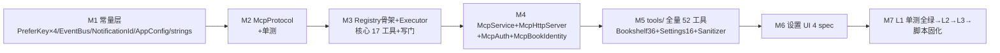

# P2 实施级设计（第三轮深化）— 外部 MCP 服务端迁移（决策表项 #8）

> 前置：P1 收口；依据 design.md AD-04 与 evidence-pack.md §E/§D。
> NG 根：`F:\...legado_NG-main`（快照 3.26.082815）；本项目路径均相对 `app/src/main/java/io/legado/app/`。
> 状态：设计前置，未审查不实施（AD-02）。本文为函数/代码级深化版，覆盖现版。
> 深化基线：NG `web/mcp/McpServer.kt` 实测 **1743 行**（现版记 1650 有偏差）、`BookshelfMcpTools.kt` 实测 **2462 行**（现版记 479 行仅为 schema 段）、`SettingsMcpTools.kt` 771 行、`McpService.kt` 161 行、`McpHttpServer.kt` 21 行、`McpTextSanitizer.kt` 34 行。

## 1 目标与非目标

**目标**
1. 迁移 NG 外部 MCP 服务端：前台服务（生命周期/网络重绑/通知栏 host:port）+ JSON-RPC 协议层（initialize/ping/tools/resources/prompts，POST `/` 与 `/mcp`，批量 RPC）。
2. 将 NG 1743 行单文件 `McpServer` 按代码职责拆为 Protocol / Router / Registry / Executor 四模块，每模块 ≤400 行；消除 NG 三份 Tools 文件中 `toolResult`/`tool()`/`JsonElement` 扩展的 3 处重复（NG McpServer.kt:1623-1639 / BookshelfMcpTools.kt:2337-2392 / SettingsMcpTools.kt:665-748）。
3. 工具集适配：优先复用本项目 `api/controller`（签名已 Read 确认），controller 未覆盖走 dao 直操作；保留 NG 限幅常量与正文脱敏。
4. 四层安全：默认关闭开关 + 设置项 UI + 可选 Bearer token 鉴权 + 写工具二重门（NG 全链无鉴权，McpHttpServer.kt:8-19 铁证）。

**非目标**
- 不迁 MCP 内部通道（`McpInternalToolCatalog`/`McpInternalChannel`/`McpToolExecutionContext`，McpServer.kt:203-221）：本项目 `help/ai/AiToolRegistry.kt`（~70 个 native 工具，AiToolRegistry.kt:138-212 defaultEnabledTools）+ `AiToolExecutor` 已承担内部工具注册与执行，且本项目 AI 已有 outbound 客户端 `AiMcpClient.kt`（经 `AppConfig.aiMcpServerList` 连外部服务器），迁入=双注册表。
- 不迁 `AgentMemoryMcpTools`（4 工具）/`ai_chat_*`（2，McpServer.kt:1175-1256）/`read_aloud_storyboard_debug_get`（:1095-1173）/`bookshelf_character_*`（6，BookshelfMcpTools.kt:1494-1672）：依赖 NG v114 AgentMemory 实体、AI 会话体系、workKey 维度 BookCharacter（同名不同构，evidence-pack.md §C），P3/P4 后补。
- 不支持 SSE/流式（与 NG 一致，GET 返回 405，McpServer.kt:116-120）；不做 `tools/list` cursor 分页（NG 一次性返回全量；本项目自家客户端 AiMcpClient.kt:108-109 的 cursor 循环对无 nextCursor 响应天然兼容）。

## A. MCP 协议技术架构

### A.1 架构图

```mermaid
graph TD
    C1[Claude Desktop<br/>mcp-remote 桥接] -->|HTTP POST JSON-RPC| EP
    C2[mcp-inspector CLI] --> EP
    C3[本项目 AiMcpClient<br/>回环自连/对拍] -->|Bearer + Mcp-Session-Id| EP
    EP[POST / 或 /mcp<br/>mcpPort 默认1124] --> S[McpService 前台服务<br/>serve() 每请求保活]
    S --> HS[McpHttpServer NanoHTTPD<br/>解包 body/content-type]
    HS --> AUTH{McpAuth<br/>mcpToken 非空则校验}
    AUTH -->|401| HS
    AUTH --> R1[McpMethodRouter<br/>isEnabled 守卫/uri 白名单<br/>GET 405/方法分发]
    R1 --> P[McpProtocol<br/>JSON-RPC 2.0 解析<br/>批量/错误码/响应构造]
    R1 --> REG[McpToolRegistry<br/>69 个 McpToolDef 注册表<br/>name→schema+write+handler]
    R1 --> RES[resources/readResource<br/>legado:// 静态资源]
    REG --> EXE[McpToolExecutor<br/>runCatching+toolResult 包装<br/>限幅/超时/串行锁]
    EXE --> D1[api/controller<br/>BookSourceController 等]
    EXE --> D2[WebBook/SearchModel<br/>Debug/ReadBook/CacheBook]
    EXE --> D3[appDb dao 直操作]
    EXE --> D4[McpTextSanitizer<br/>正文出栈脱敏]
```

### A.2 协议要点（逐条对应 NG 实现行号）
| 协议点 | NG 实测行为 | P2 处理 |
|---|---|---|
| 传输 | 仅 POST `/` 与 `/mcp`（uri 白名单 :96-102）；GET→405 "MCP stream is not supported"（:116-120）；notification 无 id→202 ACCEPTED 空体（:105-114） | 原样平移到 Router |
| initialize 握手 | 响应 `protocolVersion="2025-06-18"`（:49）+ `capabilities.tools.listChanged=false` + `capabilities.resources` + `serverInfo{name,version:"0.1.0"}`（:189-201） | 原样；serverInfo.name 改本项目品牌值 |
| notifications/initialized | `id==null && method.startsWith("notifications/")` → 返回 null 静默（:169-171） | 进 Protocol 的 request 归一 |
| tools/list | 一次性返回全部工具数组，无 cursor 分页（:176） | Registry 聚合 69 工具；**新增**每工具 `annotations:{readOnlyHint,destructiveHint}`（NG 无，借 NG McpInternalToolCatalog.kt:20-25 McpToolSideEffect 枚举概念） |
| tools/call | result=`{content:[{type:"text",text:GSON(result)}], structuredContent:result, isError:(result.ok!=true)}`（:679-689） | Executor 统一包装 |
| 批量 RPC | 数组→逐项处理→响应数组；空数组/非对象元素→-32600（:147-160）；**全 notification 批量返回 200 "[]" 而非 202**（handleBatch 恒非 null） | 原样（边界 F2） |
| 错误码 | -32700 空体/解析失败（:130-135）；-32600 非对象/缺 method（:143,167）；-32601 未知方法（:182）；-32603 执行异常兜底（:184-186） | 全部收敛进 Protocol |
| 会话 | 无状态：不校验 Mcp-Session-Id，不维护会话（全文件 0 处） | 保持无状态；本项目 AiMcpClient 发送 Session-Id 头（AiMcpClient.kt:227-228）服务端忽略即兼容 |
| 鉴权 | 无（铁证 McpHttpServer.kt:8-19） | **新增** McpAuth（D 节 L3） |

## B. 四模块拆分逐类逐函数解读

### B.1 模块依赖与拆分原则
NG 的 McpServer 是"schema 表（tools()）+ when 分发（callTool）"双表 + 执行实现混编。拆分原则：**注册表升为单一事实源**——每个工具一条 `McpToolDef(name, schema, write, handler)`，Router 只认方法名，Executor 只提供公共执行设施（包装/限幅/锁/超时），协议纯函数全部下沉 Protocol（可 JVM 单测）。handler 为阻塞式（NanoHTTPD 工作线程 + runBlocking，与本项目 HttpServer.kt:54 同构），超时由各工具自管（latch/withTimeout，同 NG）。

### B.2 McpProtocol.kt（纯 JVM，~230 行）

```kotlin
object McpProtocol {
    const val PROTOCOL_VERSION = "2025-06-18"          // ← NG McpServer.kt:49
    private const val SERVER_NAME = "Legado Native MCP" // ← :50
    const val MIME_JSON = "application/json; charset=utf-8"
    const val MIME_TEXT = "text/plain; charset=utf-8"

    // ← :129-137 空体/解析失败→-32700
    fun parse(postData: String?): JsonElement
    // ← :139-145 数组→批量 / 对象→单请求 / 其他→-32600
    fun dispatch(json: JsonElement, onObject: (JsonObject) -> JsonElement?): JsonElement
    // ← :147-160 批量：空数组→-32600；notification 过滤；全 notification→空数组
    fun handleBatch(batch: JsonArray, onObject: (JsonObject) -> JsonElement?): JsonElement
    // ← :162-187 的 id/notification 提取与异常兜底（when(method) 归 Router 回调）
    fun handleRequest(request: JsonObject, route: (method: String, params: JsonObject?) -> Any?): JsonElement?
    // ← :189-201
    fun initializeResult(serverVersion: String): Map<String, Any>
    // ← :1678-1684 / :1686-1695 / :1697-1703
    fun successResponse(id: JsonElement?, result: Any): JsonObject
    fun errorResponse(id: JsonElement?, code: Int, message: String): JsonObject
    fun jsonResponse(element: JsonElement): String
    // ← :1705-1742 全量平移（四文件唯一副本）
    fun JsonElement?.asStringOrNull(): String?
    fun JsonElement?.asIntOrNull(): Int?          // asLong/asDouble/asBoolean 同
    fun JsonElement?.asRequiredString(name: String): String   // 空白→IllegalArgumentException
    fun JsonElement?.asStringList(argName: String): List<String>  // 数组或逗号串，空→抛
    fun JsonElement?.asLongList(argName: String): List<Long>
}
```

### B.3 McpMethodRouter.kt（~180 行）

```kotlin
object McpMethodRouter {
    // ← :84 isEnabled = BuildConfig.DEBUG || PreferKey.mcpService（isInternalEnabled :86 删）
    fun isEnabled(): Boolean
    // ← :88-127 serve 入口：disabled→404 text；uri∉{"/","/mcp"}→404；POST→Protocol.dispatch，
    //   返回 null→202；GET→405；其他→405。auth 在 HttpServer 层已过（D-L3）。
    fun serve(method: NanoHTTPD.Method, uri: String, postData: String?): NanoHTTPD.Response
    // ← :162-187 的 when(method) 段（9 方法）+ :203-221 内部通道删除
    private fun route(method: String, params: JsonObject?): Any?
    //   "initialize"/"ping"/"tools/list"(→McpToolRegistry.listTools())
    //   "tools/call"(→McpToolRegistry.call()) "prompts/list"(→空数组)
    // ← :582-597 resources 聚合：core 2 条 + tools/ 两文件各 1 条
    private fun resources(): List<Map<String, String>>
    // ← :599-618 readResource：uri 必填；legado://api/mcp→apiSummary()(:1641-1654)；
    //   legado://schema/book-source→McpToolRegistry.bookSourceSchema()(:1656-1676)；
    //   其余回退 tools/ 文件 readResource；未命中→IllegalArgumentException→-32603
    private fun readResource(params: JsonObject?): Map<String, Any>
}
```

### B.4 McpToolRegistry.kt（~300 行，单一事实源）

```kotlin
data class McpToolDef(
    val name: String,
    val description: String,
    val inputSchema: Map<String, Any>,      // ← NG tool() :558-573 / stringSchema :575-580 构造
    val write: Boolean = false,             // ← NG McpInternalToolCatalog.kt:20-25 sideEffect 概念
    val handler: (JsonObject) -> Map<String, Any?>   // 阻塞式，NanoHTTPD 线程内
)

object McpToolRegistry {
    private val tools by lazy {
        McpCoreTools.defs + McpBookshelfTools.defs + McpSettingsTools.defs   // 17+36+16=69
    }
    // → tools/list：schema + annotations(readOnlyHint=!write, destructiveHint=write)
    // D8 单一事实源模式（schema+handler 合一）建议回灌 architecture_rules（V3 提升点登记，仅登记不展开）
    fun listTools(): List<Map<String, Any>>
    // ← NG :620-690 callTool 的骨架段：name 必填校验→resolve→写门→执行→包装
    fun call(name: String, arguments: JsonObject?): Map<String, Any?> {
        val def = resolve(name) ?: throw IllegalArgumentException("Unknown tool: $name")
        if (def.write && !McpAuth.allowWrite()) return writeDenied(name)   // D-L4
        return McpToolExecutor.wrap(def) { def.handler(arguments ?: JsonObject()) }
    }
    fun resolve(name: String): McpToolDef?                  // 未命中 null→-32603 "Unknown tool"
    fun bookSourceSchema(): Map<String, Any>                // ← :1656-1676
    private fun writeDenied(name: String): Map<String, Any?> // ok=false + warnings=["写操作未授权…"]
}

// 核心工具表（NG :223-555 本文件 20 个，删 storyboard/ai_chat 3 个后 17 个；
// handler 委托 Executor，schema 留此，二者物理分离避免 NG 双表漂移）
private object McpCoreTools { val defs: List<McpToolDef> }
```

### B.5 McpToolExecutor.kt（~400 行：核心 17 工具实现 + 公共设施）

```kotlin
object McpToolExecutor {
    // 限幅常量表 ← :53-80（P2 收录子集：book_source 100/300、search 50/200、
    // network_log 20/50 + body 16K/64K、debug_log 20/100 + stack 16K/64K；ai_chat/storyboard 8 组删）
    private val debugRunLock = Any()                        // ← :81

    fun wrap(def: McpToolDef, block: () -> Map<String, Any?>): Map<String, Any?> =
        kotlin.runCatching(block).getOrElse {
            if (it is kotlinx.coroutines.CancellationException) throw it   // 取消透传不吞（V3 修正）
            toolResult(false, "native://error", null,
                warnings = listOf(it.message ?: "Internal error"))   // 异常→ok=false（语义修正 F14）
        }

    private fun toolResult(ok, upstreamEndpoint, normalizedData, rawUpstream=null,
        warnings=emptyList(), sessionId=null): Map<String, Any?>   // ← :1623-1639 唯一副本

    // 实现清单（NG 行号→实现）：
    // legado_ping/legado_get_api_summary ← :629-642 + :1641-1654
    // book_source_list  ← :904-943（dao.all 内存 filter/drop/take，6 字段精简投影）
    // book_source_stats_get ← :945-969（sources+allPart 能力计数）
    // book_source_get   ← :645-651 复用 BookSourceController.getSource(mapOf("url" to listOf(url)))
    // book_source_save  ← :653-659 复用 BookSourceController.saveSource(GSON.toJson(source))
    // book_source_delete/set_enabled ← :692-737（dao delete/enable，requested/deleted/warnings）
    // book_source_debug ← :739-789（mode 前缀映射 explore::/++/--；Debug.callback +
    //   CountDownLatch 超时 + synchronized(debugRunLock) 串行 + Debug.cancelDebug + scope.cancel）
    // book_search / bookshelf_search ← :791-888（SearchModel(scope,callback) + latch(:852) +
    //   close(:853) + 内存分页 drop/take + summary/detail 投影 :1487-1511）
    //   OQ-2 关闭引发：handler 入口加 MCP 侧共享 Mutex 串行守卫——tryLock 失败即返回
    //   isError "上一搜索仍在进行"；不做 UI 忙时检测（SearchModel.workingState 是 UI 搜索页
    //   实例私有暂停语义 SearchModel.kt:41/:209-215，非全局忙标志；MCP 每次独立
    //   SearchModel 实例与 UI 无共享状态，只读搜索并发无害；真正防的是 LLM 连发重入）
    // book_source_explore_kinds_get ← :971-1023（runBlocking(IO)+withTimeout(:983-987)，1..120s）
    // network_log_list/get/clear ← :1025-1093（本项目 NetworkLog.logs/find/clear，
    //   detail 经 NetworkLog 自带脱敏层，见 evidence-pack §A（NetworkLog 持久化条目））
    // debug_log_list/get/clear ← :1258-1316（AppLog.logs 为 List<LogEntry>，
    //   非 NG 的 Triple——投影适配点：time/message/throwable/level，AppLog.kt:46-51）
    // normalizeReturnData ← :890-902（ReturnData.isSuccess/data/errorMsg→toolResult）
}
```

### B.6 NG→模块映射表（行号区间→目标）

| NG 源区间 | 内容 | 目标模块 |
|---|---|---|
| McpServer.kt:49-52 | 协议/服务器/MIME 常量 | Protocol |
| :53-81 | 限幅常量 + debugRunLock | Executor（常量）+ Registry（handler 绑定） |
| :84-86 | isEnabled/isInternalEnabled | Router（后者删） |
| :88-127 | serve() 入口守卫/白名单/202/405 | Router |
| :129-160 | parse+dispatch+handleBatch | Protocol |
| :162-187 | handleRequest | id/notification/兜底→Protocol；when(method)→Router.route |
| :189-201 | initializeResult | Protocol |
| :203-221 | 内部通道入口 | **不迁** |
| :223-555 | 本文件 20 工具 schema | Registry.McpCoreTools（17）+ tools/ 两文件 |
| :558-580 | tool()/stringSchema 构造器 | Registry（schema 构造唯一副本） |
| :582-618 | resources/readResource | Router |
| :620-690 | callTool 骨架+包装 | Registry.call + Executor.wrap |
| :645-658 | 复用 BookSourceController 铁证 | Executor（照抄签名） |
| :692-1023 | 书源族 6 实现+search+exploreKinds | Executor |
| :1025-1093 | network_log 3 实现 | Executor |
| :1095-1256 | storyboard/ai_chat 实现 | **不迁** |
| :1258-1316 | debug_log 3 实现 | Executor（LogEntry 适配） |
| :1318-1614 | 投影/格式化扩展 | Executor 私有扩展（ai_chat 段删） |
| :1623-1639 | toolResult | Executor（唯一副本，灭 3 份重复） |
| :1641-1676 | apiSummary/bookSourceSchema | Router / Registry |
| :1678-1742 | 响应构造+JsonElement 扩展 | Protocol（唯一副本） |
| McpHttpServer.kt:6-20 | NanoHTTPD 壳 | `web/mcp/McpHttpServer.kt` 平移（委托 Router） |
| McpService.kt:29-161 | 前台服务全件 | `service/McpService.kt` 平移 |
| McpTextSanitizer.kt:7-34 | 脱敏+区间归一 | `web/mcp/McpTextSanitizer.kt` 平移 |
| BookshelfMcpTools.kt 全文 | 43 工具（call 表 :519-560） | tools/McpBookshelfTools（36，删 character_* 6，bookshelf_search 并入核心 book_search 别名） |
| SettingsMcpTools.kt 全文 | 16 工具 | tools/McpSettingsTools（16 全收） |

### B.7 两个 Tools 适配文件的裁剪要点
- `tools/McpBookshelfTools.kt`（~400 行）：保留分组 4/书籍 6（book 5+stats 1）/当前书 1/章节正文 4/缓存 3/书签 4/阅读记录 4/换源 2/替换规则含 draft 三件套 8（replace 5+draft 3） = 36 工具；删 `character_*` 6（schema :351-403 + 实现 :1494-1672）。**work_key 解耦**：NG `resolveBook`（:1862-1880）与归一化（:1914-1925）依赖 `BookCharacterProfile.workKey(name,author)` 纯函数（"书名\n作者" 归一），本项目无该实体——移植纯函数为 `web/mcp/McpBookIdentity.kt`（~40 行：workKey/sameIdentity/normalizeIdentityInput，零实体依赖），`resolveBook` 三级回退（work_key→book_url→name+author）保留。内置分组保护（groupId<0 拒改，:596-604）、draft 组名 "AI草稿"（:48）、`selectChapters`（:1927-2014）/`toExclusiveRanges`（:2016-2032）/`limitText`（:2317-2326）/`sha256Hex`（:2457-2461）全量平移。
- `tools/McpSettingsTools.kt`（~250 行）：16 工具全收（txt_toc 5 + replace 5 + dict 5 + stats 1）；保留 snake_case/camelCase 双键兼容（:346-369）与 regex 预校验（validateRegex :655-659）；replace_rule upsert 走本项目 dao 还是 `ReplaceRuleController.saveRule(postData)`（ReplaceRuleController.kt:24-37 签名已核，仅单条不回 id）→ 见 J5 裁决。

## C. 15 组工具规格表（69 个工具，逐组列明）

实现路径缩写：`BSC`=BookSourceController、`dao`=appDb 直操作、`NG:`=NG 原行号。**写**列 = mcpAllowWrite 门控；限幅列默认值/上限。

| # | 工具 | 入参要点 | 返回/实现 | 写 | 限幅/超时 |
|---|---|---|---|---|---|
| G1 | `legado_ping` / `legado_get_api_summary` | 无 | 服务态+工具资源摘要；NG:226,231/629-642 | 否 | — |
| G2 | `book_source_list` | offset/limit/keyword/enabled | dao 内存过滤 6 字段投影；NG:236/904 | 否 | 100/300 |
| | `book_source_stats_get` | 无 | 总数/启停/能力计数；NG:256/945 | 否 | — |
| G3 | `book_source_get` | url* | BSC.getSource(parameters)（BSC.kt:61 签名同构）；NG:261/645 | 否 | — |
| | `book_source_explore_kinds_get` | url*，timeout 1..120s | source.exploreKinds()（本项目 help/source 同名扩展）；NG:269/971 | 否 | 30s |
| G4 | `book_source_save` | source 对象* | BSC.saveSource(GSON)；NG:281/653 | **是** | — |
| | `book_source_delete` | urls[]* | dao mapNotNull+delete；NG:292/692 | **是** | — |
| | `book_source_set_enabled` | urls[]*，enabled | dao enable；NG:303/714 | **是** | — |
| G5 | `book_source_debug` | tag*，key*，mode{auto/search/detail/explore/toc/content}，timeout | Debug.callback+latch+debugRunLock 串行（本项目 Debug.kt:23/81/251 API 已核同构）；NG:318/739 | 否（耗网络） | 30s |
| G6 | `book_search`（`bookshelf_search` 别名） | key*，scope，wait_for_finish，min_results，timeout，offset，limit，include_detail | SearchModel.CallBack（本项目 SearchModel.kt:229-235 同签名）+latch+内存分页；NG:336/791 | 否 | 50/200，30s |
| G7 | `bookshelf_group_list/get/upsert/delete`；`bookshelf_book_list/get/upsert/delete/group_update`；`bookshelf_stats_get` | group_id/group_name/book_urls/mode{add,remove,replace} | dao bookGroupDao/bookDao；内置组拒改；分组位运算；NG BookshelfMcpTools:52-139/565-860 | upsert/delete/update **是** | 列表 50/200 |
| G8 | `bookshelf_current_book_get` / `bookshelf_chapter_list` | 书籍定位，start/end/limit/keyword/include_detail | ReadBook.book+bookDao.lastReadBook；bookChapterDao.getChapterList；NG:141,146/837-908 | 否 | 章节 100/300 |
| G9 | `bookshelf_chapter_content_get` / `text_window_get` / `chapter_snippets_get` | 章节定位+char_limit | BookHelp.getContent（本项目 BookHelp.kt:547 同签名）+McpTextSanitizer.forModel+sha256+截断标记；只读缓存不联网；NG:163,177,191/910-1123 | 否 | 正文 20K/120K；窗口 1/20 章；片段 200/2000，≤80 章 |
| G10 | `bookshelf_cache_status_get/download/clear` | 章节选择 indexes/ranges/start-end/clear_book | BookHelp.hasContent(:488)/delContent(:575)/clearCache(:79)+CacheBook.start(appCtx,book,start,end)（CacheBook.kt:90 同签名）；本地书拒操作；NG:209-249/1125-1239 | download/clear **是** | 状态 500 章 |
| G11 | `bookshelf_bookmark_list/get/upsert/delete` | time 主键 | bookmarkDao；NG:251-286/1241-1366 | upsert/delete **是** | 50/200 |
| G12 | `bookshelf_read_record_list/get/upsert/delete` | book_name，device_id 默认 AppConst.androidId | readRecordDao；NG:288-318/1368-1463 | upsert/delete **是** | 50/200 |
| G13 | `bookshelf_book_sources_get` / `change_source_preview` | 书籍定位 | searchBookDao.getEnabledByNameAuthor 候选预览，不执行换源；NG:332,342/1465-1492 | 否 | — |
| G14 | `bookshelf_replace_rule_list/get/upsert/delete/set_enabled` + `draft_upsert/draft_apply/rollback` | rule/rules 对象，ids | replaceRuleDao；draft 组固定"AI草稿"；NG:405-479/1674-1845 | 6 个 **是** | 50/200 |
| G15 | `settings_rule_stats_get` + `settings_txt_toc_rule_*`(5) + `settings_replace_rule_*`(5) + `settings_dict_rule_*`(5) | id/ids/name/names，rule 对象 | txtTocRuleDao/replaceRuleDao/dictRuleDao（实体本项目均确认存在）；regex 预校验；NG SettingsMcpTools 全文 | upsert/delete/set_enabled 9 个 **是** | 50/200 |
| — | 排除：storyboard/ai_chat 2/agent_memory 4/character 6 | — | 依赖缺失（§1） | — | — |

> 写工具合计 **29 个**；只读 40 个。数字修正：现版"Bookshelf 26 工具"系把组当工具计数，实测收录 36。

## D. 四层安全（代码级）

**L1 默认关闭开关**：`isEnabled() = BuildConfig.DEBUG || appCtx.getPrefBoolean(PreferKey.mcpService, false)`（NG McpServer.kt:84 原样——debug 测试包免配置可测，release 纯靠开关）。关闭时 Router 返回 404 "MCP service is disabled"（NG :89-95 行为）。

**L2 设置项 UI 挂点**：`ui/config/OtherConfigFragment.kt` 的 `numberAction(PreferKey.webPort)`（:415-423）模板之后追加 4 个 spec：①`switch(mcpService)` 开关（联动 McpService.start/stop）②`numberAction(mcpPort)` min=1024 max=65530 ③`switch(mcpAllowWrite)` 默认 false ④`SettingActionSpec(mcpToken)` 点击生成随机 UUID 写入并显示前 8 位。AppConfig 新增 4 属性仿 `webPort` getter/setter（AppConfig.kt:2323-2326 模板）。字符串资源仿 `web_port_title`（values/strings.xml:684）。

**L3 token 鉴权（header 校验点）**：新增 `web/mcp/McpAuth.kt`（~60 行）。校验点在 `McpHttpServer.serve()` 委托 Router 之前（body 解析后）：
```kotlin
object McpAuth {
    fun check(headers: Map<String, String>): Boolean {
        val token = appCtx.getPrefString(PreferKey.mcpToken).orEmpty().trim()  // ***SP 存储
        if (token.isBlank()) return true                    // 未配置=不启用（对齐 D6）
        val auth = headers["authorization"].orEmpty()
        return auth == "Bearer $token"                      // 与本项目 AiMcpClient.kt:198-199 出站格式对齐
    }
    fun allowWrite(): Boolean = appCtx.getPrefBoolean(PreferKey.mcpAllowWrite, false)
}
```
失败→HTTP 401 text "unauthorized"（日志只记长度与结果，不记 token 值）。

**L4 写工具二重门（确认流程）**：Registry.call 中 `def.write && !allowWrite()` → `toolResult(ok=false, warnings=["写操作未授权：请在设置中开启 MCP 写权限后重试"])`（可观测的 isError 结果而非协议错误）。开启后由 `mcpAllowWrite` 全局放行 + token 组成二重门；同时 tools/list 输出 `annotations.destructiveHint=true` 向客户端明示（MCP 标准注解），外部 LLM 侧触发自身确认流。draft 三件套保留 NG"草稿→apply→rollback"确认链（BookshelfMcpTools.kt:453-478 设计意图）。

**Sanitizer 正则清单**（McpTextSanitizer.kt:9-11 平移，只改出栈视图不改缓存原文）：
1. `(?is)]*data:image/[^>]*>` → 提取 alt 或空串（删 base64 内嵌图）
2. `(?is)]*>` → 提取 alt，无 alt→`[图片]`
3. `(?is)\balt\s*=\s*(["'])(.*?)\1` → alt 捕获，trim 后 `take(200)`
4. 区间归一：`mcpInclusiveChapterEnd(start,count)=start.coerceAtLeast(0)+count.coerceAtLeast(1)-1`（:32-34）
5. 限幅标记统一 `\n[truncated by MCP at {n} chars]`（McpServer.kt:1570-1576 / Bookshelf:2317-2326）

## E. 与本项目 Web 服务的关系（裁决）

**裁决：独立 McpService + 独立 McpHttpServer（独立 NanoHTTPD 实例、独立 mcpPort），不复用 WebService/HttpServer。**理由：
1. **NG 同构**：McpService.kt:29 独立 BaseService，McpHttpServer.kt:6 独立 NanoHTTPD 子类。
2. **HttpServer 不可混入**：本项目 HttpServer.kt:55-101 已挂 27 个 HTTP 端点 + AssetsWeb 静态前端回退（:107-111）+ CORS 回显（:143-144），MCP 塞入引入 uri 冲突面（`/` 已被 index.html 占用），且外层已包 ReturnData 语义（MCP 需 JSON-RPC 包裹，返回类型不同）。
3. **生命周期正交**：用户可只开 MCP 不开 Web 服务（NG 行为）；webPort 变更/磁贴/`EventBus.WEB_SERVICE` 消费方（Web 前端）不受影响。
4. **端口天然错开**：webPort 1122 + WebSocketServer 1123（WebService.kt:157-158），MCP 默认 1124 不撞；仍保留 F1 占用检测。
5. 复用件：`BaseService`、`receiver/NetworkChangedListener`（WebService.kt:79-81 同款）、`AppConst.channelIdWeb`、通知模板（McpService.kt:143-160 与 WebService.kt:196-213 同构）、`serve()` 每请求保活机制（McpHttpServer.kt:9）。

## F. 边界条件（14 条）

| # | 场景 | 处理 |
|---|---|---|
| F1 | 端口占用 | NanoHTTPD start 抛 IOException→toast+stopSelf（McpService.kt:106-110 原样）；设置项校验 ≠webPort/1123 |
| F2 | 全 notification 批量 | handleBatch 恒返回非 null→200 "[]"，与单 notification 的 202 分叉——保留 NG 行为并在单测锁定 |
| F3 | 超长 payload | 无前置 Content-Length 校验（NG 同）；兜底=所有返回经限幅（64K body/120K 正文/300 条列表），POST body 解析失败→-32700 |
| F4 | 工具执行超时 | debug/search：latch await(timeout)+cancelDebug/close+scope.cancel（:774-777/:852-854），返回 ok=false+warnings"timed out"；exploreKinds：withTimeout 1..120s（:983-987） |
| F5 | 执行中取消 | 客户端断连时 NanoHTTPD 线程继续跑完（无写端回调）；latch 机制保证最终释放锁与 scope，无泄漏 |
| F6 | 并发请求 | NanoHTTPD 多线程；debugRunLock 串行 debug（:771）；SearchModel 每次 new 实例；dao runBlocking 并发写由 Room 串行化 |
| F7 | 网络切换重绑竞态 | NetworkChangedListener 回调更新地址+通知（McpService.kt:65-69）；upMcpServer 先停旧实例（:93-95）防重复绑定；onStartCommand "serve" 保活幂等（isAlive 检查） |
| F8 | 鉴权失败 | 401 text，body 不回显 token；连续错误不锁定（局域网场景，风险由 L1/L4 兜底） |
| F9 | 未知工具/方法 | 未知 method→-32601（:182）；未知 tool→IllegalArgumentException→-32603（:677）——语义分层保留 |
| F10 | 畸形 JSON | 空体/解析失败→-32700（id=null）；合法 JSON 非对象数组→-32600 |
| F11 | 写工具未确认 | L4 返回 isError 结果；tools/list annotations 提前告知客户端 |
| F12 | 前台服务被杀 | startForegroundServiceCompat 重启语义与 NG 一致；无 sticky 重放，客户端下次调用连接失败→自然报错；无状态协议免会话恢复 |
| F13 | 双服务同开 | WebService（通知 105）+McpService（通知 114）并存；`serve()` 保活互不干扰（各自 companion） |
| F14 | handler 抛业务异常 | NG：IllegalArgumentException 冒泡到 handleRequest 兜底→-32603；P2 修正：Registry.call 先包 `wrap`（B.5）把业务失败转为 `ok=false` 的 isError 结果（-32603 仅留协议层异常），避免"参数缺失"这类可自纠错误升级为协议错误——本项目客户端 AiMcpClient.kt:304-308 遇 JSON-RPC error 对象（含 -32603）即抛 IllegalStateException，isError 则可继续对话 |

## G. 规范符合性核查

| 规范 | 条款 | 符合性 |
|---|---|---|
| checkstyle | 协程 Coroutine 链封装 | MCP 执行体为阻塞式（NanoHTTPD 线程+runBlocking），与 HttpServer.kt:54 同模式；debug/search 内部 CoroutineScope+cancel 与 NG 一致 |
| checkstyle | `kotlin.runCatching` 带前缀 | Executor.wrap/所有 catch 块强制 |
| checkstyle | object 单例+可变状态加锁 | 四模块全 object；debugRunLock 同 NG |
| checkstyle | `isNullOrBlank()` | 参数校验统一用（asStringOrNull/asRequiredString 内） |
| naming | Service/Controller 后缀 | McpService ✓；无新建 Controller（复用） |
| naming | up 前缀/Await 后缀 | upMcpServer 平移 ✓；无新增挂起对外 API |
| naming | 常量风格 | PreferKey 新键 camelCase（同文件既有风格 `@Suppress("ConstPropertyName")`）；MCP 内部常量 UPPER_SNAKE |
| exception | 业务异常继承 NoStackTraceException | MCP 参数错误沿用 NG 的 IllegalArgumentException（协议语义非业务异常）；wrap 内 catch Throwable 转 isError，显式 rethrow 取消异常（V3 修正）；CancellationException 透传不吞 |
| logging | AppLog/禁止 android.util.Log | 服务启停/鉴权失败用 `AppLog.putDebugWithTag(TAG_MCP,…)`；**新增第 27 个 Tag `TAG_MCP="McpService"`**（AppLog 现有 26 个 Tag，AppLog.kt:13-42；logging_rules 模块 Tag 表扩展点） |
| logging | 脱敏铁律 | 服务日志只记端口/结果码；network_log_get 出栈经 NetworkLog 自带 REDACTED 层（NetworkLog.kt:26）；正文经 Sanitizer |
| architecture | 无 DI/NanoHTTPD when 路由/EventBus 常量 | 全符合；EventBus.MCP_SERVICE 新增进 constant/EventBus.kt（WEB_SERVICE 在 :27） |
| architecture | 大列表流式 | 不适用：限幅保证单响应 ≤120K，无需 Pipe |
| 6维·前端入口 | 设置页 4 spec+通知栏；磁贴不动 | 无既有入口改动（OtherConfigFragment 纯追加） |
| 6维·后端接口 | 新增独立端口；27 个既有 HTTP 端点零改动 | ✓（E 节裁决） |
| 6维·数据库 | **零 schema 变更**（无新表/无 migration） | 覆盖安装零风险；SP 新键默认关 |
| 6维·覆盖安装 | 不升 Room version | ✓ |
| 6维·使用场景 | 外部 MCP 客户端/本项目 AiMcpClient 回环/通知栏操作 | 全覆盖（L3 与 AiMcpClient Bearer 格式对齐，可回环自测） |
| 6维·回填点 | 无新 DB 字段；新 SP 键在 AppConfig getter/UI/Service 三点回填 | AppConfig 4 属性+UI 4 spec+Service 读取 |

## H. 测试设计

**单测（JVM，app/src/test）**
| 类 | 方法 |
|---|---|
| `McpProtocolTest` | `parse_blank_returns32700` / `parse_malformed_returns32700` / `dispatch_batchArray` / `handleBatch_empty_returns32600` / `handleBatch_allNotifications_returnsEmptyArray`（F2 锁定）/ `handleRequest_unknownMethod_returns32601` / `handleRequest_notification_silent` / `initializeResult_schema` / `asRequiredString_blankThrows` |
| `McpToolRegistryTest` | `listTools_count69`（数量门禁）/ `listTools_writeToolsHaveDestructiveHint`（=29）/ `call_unknownTool_throws` / `call_writeTool_deniedWhenSwitchOff` |
| `McpToolExecutorTest` | `wrap_businessError_returnsIsError`（F14）/ `toolResult_shape` |
| `McpBookIdentityTest` | `workKey_normalizesCRLF` / `sameIdentity_caseInsensitive`（对拍 NG 纯函数语义） |
| `McpTextSanitizerTest` | `forModel_removesBase64Image_keepsAlt` / `forModel_noAlt_placeholder` / `inclusiveChapterEnd_clamps`（NG 有同名单测可对拍） |
| `McpAuthTest` | `check_noToken_passes` / `check_wrongBearer_fails` / `allowWrite_defaultFalse` |

**L2（真机，测试包 io.legado.miss.app.debug）**
1. 设置开启 MCP（写开关保持关）→启动→通知栏显示 host:port；
2. `npx @modelcontextprotocol/inspector --cli http://<ip>:1124/mcp`：initialize→tools/list（断言 69）→tools/call `legado_ping`、`book_source_list(limit=2)`；
3. curl JSON-RPC 套件：畸形 JSON→-32700、未知方法→-32601、批量数组、notification→202、错误 token→401、写工具→isError；
4. 断网切 Wi-Fi→通知地址随 NetworkChangedListener 刷新（对拍 WebService）；
5. 关闭开关→POST→404。通过后沉淀 `ai_tests/scripts/l2_verify_mcp_smoke.py`（遵循 ai_e2e_testing_workflow）。

**L3（Claude Desktop，mcp-remote 桥接）六场景——人工执行（依赖 Claude Desktop/mcp-remote 外部编排，ai_tests 无法自动化）**：① tools/list 载入 69 工具（可脚本化断言，可下沉 L2 由 l2_verify_mcp_smoke.py 覆盖）；② book_search 实搜+分页；③ chapter_content_get 响应无 `` base64（脱敏生效）；④ 开写开关后 `book_source_set_enabled` 切换一源→App UI 状态同步；⑤ 未开写开关 `book_source_delete`→isError 负路径（可脚本化断言，可下沉 L2 由 l2_verify_mcp_smoke.py 覆盖）；⑥ 配置 token 后本机 AiMcpClient 回环连自家服务端（对拍双向协议一致性）。

## I. 实施顺序依赖图与门禁


门禁：M1-M6 每阶段 `./gradlew assembleAppDebug` 过（构建后 `stop-daemons.bat` 清场）；M2/M3/M5 随段跑对应单测；M7 前 Grep `android.util.Log.d|Log.e` 零残留；updateLog 在 M1 编译前更新；全程不动既有 27 端点与 DB。

## J. Open Questions

1. **isEnabled 的 DEBUG 直通**（NG :84）是否保留——debug 包免配置可测 vs 误开风险（debug 包仅测试机，建议保留，待检查点裁决）。
2. ✅【已关闭 2026-08-30】**book_search 忙时守卫**：裁决为 **MCP 侧串行 Mutex 守卫**（"忙时返回 isError"语义保留，但忙的判定不是 UI 状态）——book_search/bookshelf_search handler 入口 tryLock 共享 Mutex，失败返回 isError "上一搜索仍在进行"。证据：① 本项目 SearchModel.kt:41 `workingState = MutableStateFlow(true)` 实为 UI 搜索页实例私有的**暂停/恢复**语义（pause :209-211 / resume :213-215），非全局"忙"标志，跨模块检测需新增进程级全局状态，违反轻守卫初衷；② MCP 每次触发新建独立 `SearchModel(scope, callback)` 实例（§B.5 :791-888 平移），与 UI 实例无共享可变状态，搜索为只读操作，UI 搜索与 MCP 搜索并发本身无害（NG 亦无此守卫）；③ 真正需要防的是 MCP 自身重入（LLM 客户端连发两次 book_search 抢并发配额）——Mutex 即完整覆盖。实现点：McpToolExecutor.kt book_search handler（§B.5，标注"OQ-2 关闭引发"）。
3. **resources 是否保留**：建议保留（3 条静态 schema，成本 ~40 行，对 LLM 首次发现友好）；prompts/list 恒空数组照 NG。
4. **token 生成方式**：UUID 存 SP 明文（与 webDavPassword 同敏感级，已有先例）vs 只存摘要（校验时比对摘要）——倾向摘要方案，M7 前定。
5. **replace_rule upsert 走 Controller 还是 dao**：Controller.saveRule 仅单条且不回 id（ReplaceRuleController.kt:24-37），批量 upsert/回 id 需 dao；建议 replace 族走 dao、book_source 族走 Controller（与 NG :645-658 一致），实现期微调不另立设计。

## K. 工作量估算（函数粒度）

| 模块 | 粒度 | 估时 |
|---|---|---|
| M1 常量层 | PreferKey 4 键+EventBus 1+NotificationId 1+AppConfig 4 属性+strings 8 条 | 0.25d |
| McpProtocol | parse/dispatch/handleBatch/handleRequest/3 响应构造/8 扩展 + 单测 9 法 | 0.75d |
| McpMethodRouter | serve/route/resources/readResource/apiSummary | 0.5d |
| McpToolRegistry | McpToolDef+listTools/call/resolve+核心 17 schema 迁移 | 1d |
| McpToolExecutor | wrap/toolResult+书源族 8 实现（debug/search 最重各 0.5d）+日志族 6+投影扩展 | 1.5d |
| tools/Bookshelf | 36 工具（resolveBook/selectChapters/draft 链/group 位运算）+McpBookIdentity | 1.5d |
| tools/Settings | 16 工具（三族 upsert 校验） | 0.75d |
| M4 服务层 | McpService 平移改串+HttpServer+Auth+通知 | 0.5d |
| M6 设置 UI | 4 spec+开关联动 | 0.5d |
| M7 测试 | 单测 6 类 23 法+L2 脚本固化+L3 实测 | 1.5d |
| **合计** | | **~8.75 人日** |

## 设计决策记录（第三轮增补）

| # | 决策 | 理由 |
|---|---|---|
| D8 | Registry 单一事实源（McpToolDef 合并 schema+handler），替代 NG"tools() 表+callTool when"双表 | 消除 NG 双表漂移与三文件 3 份 toolResult/扩展重复；工具增删只动一处 |
| D9 | work_key 移植为纯函数 McpBookIdentity，不引 BookCharacterProfile 实体 | 保留 36 个 Bookshelf 工具的稳定书籍寻址，同时不引入 v114 实体（evidence-pack.md §C 同名冲突） |
| D10 | 业务失败返回 isError 结果而非 -32603（F14） | 本项目客户端遇 JSON-RPC error 对象（含 -32603）即抛 IllegalStateException（AiMcpClient.kt:304-308），isError 可继续多轮对话 |
| D11 | McpAuth 校验点在 McpHttpServer（Router 之前），格式 Bearer | 挂最薄层防绕过；与 AiMcpClient 出站格式逐字节对齐以支持回环对拍 |
| D12 | 写门全局开关（mcpAllowWrite）+token 双因素，不做逐工具细粒度授权 | NG capability 级过滤属内部通道设计；外部 29 个写工具逐个授权 UI 成本过高，P2 简化，细粒度留 P4 |
