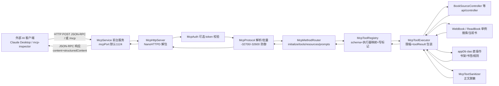

# P2 实施级设计 — 外部 MCP 服务端迁移（决策表项 #8）

> 前置：P1（AI 地基）已收口；依据 design.md AD-04 与 evidence-pack.md §E。
> NG 根：`F:\myself\github\WeAgentChat\temp\legado_NG_src\legado_NG-main`（快照 3.26.082815）；本文路径均相对 `app/src/main/java/io/legado/app/`。
> 状态：设计前置，未审查不实施（AD-02）。

## 1 目标与非目标

**目标**
1. 迁移 NG 外部 MCP 服务端：前台服务（生命周期/网络重绑/通知栏 host:port）+ JSON-RPC 协议层（initialize/tools/resources/prompts，POST `/` 与 `/mcp`，批量）。
2. 将 NG 1600 行单文件 `McpServer` 拆分为 协议解析/方法路由/工具注册表/执行器 四模块，每模块 ≤400 行。
3. 工具集适配：优先映射本项目 `api/controller` 层，controller 未覆盖的走 dao 直操作；保留 NG 限幅常量与文本脱敏。
4. 安全：默认关闭 + 设置项开启 + 可选 token 鉴权 + 写操作独立开关。

**非目标**
- 不迁 MCP 内部通道（`McpInternalToolCatalog`/`McpInternalChannel`/`McpToolExecutionContext`）：本项目已有 `help/ai/AiToolRegistry.kt`+`AiToolExecutor.kt` 承担内部工具，迁入=双注册表。
- 不迁 `AgentMemoryMcpTools`/`ai_chat_*`/`read_aloud_storyboard_debug_get`/`bookshelf_character_*` 工具：分别依赖 NG v114 AgentMemory 实体、NG AI 会话体系、NG workKey 维度 BookCharacter（与本项目同名不同构，design.md §C），等 P4/P3 后补设计。
- 不支持 SSE/流式（与 NG 一致，GET 返回 405，`McpServer.kt:116-120`）。

## 2 NG 源码证据（文件:行）

### 2.1 服务与协议
- `service/McpService.kt:29-52` BaseService，companion `start/stop/serve`；`:61-70` onCreate 注册 `NetworkChangedListener`，网络变化→`updateHostAddress()+startForegroundNotification()+postEvent(EventBus.MCP_SERVICE)`；`:82-90` onDestroy 反注册+停服务+发空事件；`:92-115` `upMcpServer()` 先停旧实例，无 IP→toast+stopSelf；`:117-132` 通知栏列 host:port；`:134-140` `getPort()`=`PreferKey.mcpPort` 默认 1124，范围 1024..65530；`:143-160` 通知（channelIdWeb，点击复制地址，含停止 action，`NotificationId.McpService`）。
- `web/mcp/McpHttpServer.kt:6-20` NanoHTTPD 子类；`:9` 每请求调 `McpService.serve()` 保活；`:13-16` 取 POST body；`:19` 委托 `McpServer.serve(method,uri,postData)`。
- `web/mcp/McpServer.kt`（object，约 1650 行）：`:49` PROTOCOL_VERSION=`"2025-06-18"`；`:84` `isEnabled()`=DEBUG||`PreferKey.mcpService`；`:88-127` `serve()` 仅放行 POST 的 `/` 与 `/mcp`；`:129-145` JSON-RPC 解析（-32700 解析错/-32600 非法请求）；`:147-160` 数组批量处理；`:162-187` 单请求路由 9 方法（initialize/ping/tools/list/tools/call/resources/list/resources/templates/list/resources/read/prompts/list），`:169-171` notification（无 id）静默；`:189-201` initializeResult（capabilities.tools.listChanged=false+resources）；`:679-689` 结果包装 `content(text)+structuredContent+isError`。
- `:223-556` `tools()`：本文件 20 个工具 schema（`:558-573` `tool()` 构造器，`:575-580` stringSchema），`:555` 追加 Bookshelf/Settings/AgentMemory 三文件工具；`:582-618` resources（`legado://api/mcp`、`legado://schema/book-source`）与 readResource。
- `:620-690` `callTool()`：`:645-658` 直接复用 `api.controller.BookSourceController.getSource/saveSource`（NG 复用 api controller 的铁证）；`:674-677` 未命中时回退三 Tools 文件 `.call()`；`:1623` `toolResult(ok,upstreamEndpoint,normalizedData,rawUpstream,warnings)`。
- 执行实现：`:692-737` book_source_delete/set_enabled（dao 直操作）；`:739-789` book_source_debug（`Debug.callback`+CountDownLatch 超时+`debugRunLock:81/771` 串行）；`:791-888` book_search（`SearchModel.CallBack`+latch+内存分页）；`:890-902` `normalizeReturnData` 把 api `ReturnData` 归一为 toolResult；`:904-959` list/stats（dao 内存过滤）。
- 限幅常量 `:53-80` 共 14 组 DEFAULT/MAX 对（network_log 20/50、log body 16K/64K、debug_log 20/100、ai_chat 会话 20/50 消息 100/300 文本 8K/64K、storyboard 段 40/300 等、book_source 100/300、search 50/200）。

### 2.2 工具子文件与脱敏
- `BookshelfMcpTools.kt:53-479` 31 工具（书架组/书/章节/缓存/书签/阅读记录/换源预览/角色/替换规则含 draft+rollback）；`SettingsMcpTools.kt:19-96+` txt_toc_rule/dict_rule/replace_rule 三族；`AgentMemoryMcpTools.kt:22-64` 4 工具。
- `McpInternalToolCatalog.kt:56-199` `writeCapability` 标记（内部会话按 capability 过滤+确认）。
- `McpTextSanitizer.kt:7-30` `forModel()`：去 base64 内嵌图与 ``，保留 alt（截 200 字符）→`[图片]`；`:32-34` 章节区间边界归一。
- NG 全链**无鉴权**（`McpHttpServer.kt:8-19` 无任何 auth 检查）。

## 3 本项目对接点现状（已 Read 确认）

### 3.1 Web 服务架构
- `service/WebService.kt:36-230` 前台服务：`getPort()`=`PreferKey.webPort` 默认 1122（`:185-191`）；同时起 `HttpServer(port)`+`WebSocketServer(port+1)`（`:157-158`）；wakeLock/wifiLock 可选（`:62-75`）；`NetworkChangedListener` 重绑通知（`:92-111`）；磁贴 `WebTileService`（`:216-229`）。
- `web/HttpServer.kt:23-161` NanoHTTPD：POST 路由 14 端点（`:55-71`，如 `/saveBookSource`/`/saveBook`/`/saveReplaceRule`），GET 路由 13 端点（`:86-101`，如 `/getBookshelf`/`/getBookContent`/`/refreshToc`），`runBlocking` 执行（`:54`）；**无鉴权**，CORS 宽松回显 origin（`:40-47`,`:143-144`）。
- `api/controller/` 清单（5 个）：`BackupController`/`BookController`/`BookSourceController`/`ReplaceRuleController`/`RssSourceController`+`ReturnData`。
- 数据/模型锚点（已确认存在）：`help/http/NetworkLog.kt`；实体 `Book/BookSource/BookGroup/Bookmark/ReadRecord/ReplaceRule/TxtTocRule/DictRule`；单例 `model/WebBook.kt`、`model/ReadBook.kt`；`model/Debug`+`CheckSourceService` 调试链。
- `constant/PreferKey.kt`：仅有 `webPort:93`，**无** mcpService/mcpPort → 需新增键。

### 3.2 AiMcpClient 不冲突声明
`help/ai/AiMcpClient.kt:15-43` 是 **outbound 客户端**（sessionMap/toolCache 连外部服务器，响应上限 1MB `:21`），不监听任何端口；P2 为 **inbound 服务端**（监听 mcpPort）。方向相反、零共享状态。唯一对齐点：协议版本两端均为 `2025-06-18`（`AiMcpClient.kt:17` vs `McpServer.kt:49`），服务端实测数据可直接用本项目客户端做回归对拍。

## 4 文件变更映射表

### 4.1 McpServer 四模块拆分（设计重点）

| 动作 | 本项目新路径 | NG 原型（文件:行） | 预估行数 | 职责 |
|---|---|---|---|---|
| 新增 | `web/mcp/McpProtocol.kt` | McpServer.kt:49,129-201 | ~250 | JSON-RPC 解析/批量/错误码(-32700/-32600/-32601/-32603)/notification 过滤/initialize+ping 响应；PROTOCOL_VERSION 常量；纯 JVM 可单测 |
| 新增 | `web/mcp/McpMethodRouter.kt` | McpServer.kt:88-127,162-187,582-618 | ~200 | serve 入口（isEnabled 守卫+/、/mcp 白名单+GET 405）→方法分发→tools/list、resources/prompts 聚合（向 Registry 查询） |
| 新增 | `web/mcp/McpToolRegistry.kt` | McpServer.kt:223-573,628-677 | ~350 | 工具 schema 目录+name→执行函数映射；writeCapability→`annotations.destructiveHint`；`resolve(name)` 未命中返回 Unknown |
| 新增 | `web/mcp/McpToolExecutor.kt` | McpServer.kt:620-959,1623 | ~400 | 工具执行实现（书源 CRUD/搜索/调试/分页过滤）+`normalizeReturnData`+`toolResult` 包装+限幅常量落地 |

### 4.2 服务/安全/Tools 适配

| 动作 | 本项目路径 | NG 原型/依据 | 预估行数 | 说明 |
|---|---|---|---|---|
| 新增 | `service/McpService.kt` | McpService.kt:29-161 平移 | ~160 | EventBus.MCP_SERVICE；复用本项目 `NetworkChangedListener`/`AppConst.channelIdWeb`/`NotificationId` |
| 新增 | `web/mcp/McpHttpServer.kt` | McpHttpServer.kt:6-20 平移 | ~25 | 委托 MethodRouter；每请求 `McpService.serve()` 保活 |
| 新增 | `web/mcp/McpTextSanitizer.kt` | McpTextSanitizer.kt:7-34 平移 | ~35 | 章节正文出栈脱敏（不改缓存原文） |
| 新增 | `web/mcp/McpAuth.kt` | 新设计（NG 无鉴权，§7-R4） | ~60 | 可选 Bearer token 校验（PreferKey.mcpToken 非空时强制），写工具校验 `PreferKey.mcpAllowWrite` |
| 新增 | `web/mcp/tools/BookshelfTools.kt` | BookshelfMcpTools.kt:53-479 裁剪 | ~350 | 保留组/书/章节/缓存/书签/阅读记录/换源预览/替换规则 26 工具；排除 character_* 5 个 |
| 新增 | `web/mcp/tools/SettingsTools.kt` | SettingsMcpTools.kt:19-96+ 裁剪 | ~250 | txt_toc_rule/dict_rule/replace_rule 三族（replace_rule 优先走 controller） |
| 修改 | `constant/PreferKey.kt` / `NotificationId.kt` / `EventBus.kt` | NG 同名键 | +6 | 新增 mcpService/mcpPort/mcpAllowWrite/mcpToken、NotificationId.McpService、EventBus.MCP_SERVICE |
| 修改 | 设置页（Web 服务设置区） | NG 对应设置项 | ~80 | MCP 开关/端口/允许写/token 生成；默认全关 |

## 5 数据流

## 6 工具目录表（P2 收录/排除）

| # | 工具（组） | NG 证据 | 关键参数 | 本项目实现路径 | 写 | 限幅 |
|---|---|---|---|---|---|---|
| 1 | legado_ping / legado_get_api_summary | McpServer.kt:226,231 | 无 | McpToolExecutor 内置 | 否 | — |
| 2 | book_source_list / stats_get | :236,256 / :904-959 | offset/limit/keyword/enabled | appDb.bookSourceDao（内存过滤） | 否 | limit≤300 |
| 3 | book_source_get / explore_kinds_get | :261,269 | url(required)/timeout 30s | BookSourceController.getSource + BookSource.exploreKinds | 否 | — |
| 4 | book_source_save / delete / set_enabled | :281,292,303 / :692-737 | source; urls[]; enabled | BookSourceController.saveSource + dao delete/enable | **是** | — |
| 5 | book_source_debug | :318 / :739-789 | tag/key/mode/timeout | model.Debug + debugRunLock 串行 | 否（耗网络） | timeout 默认 30s |
| 6 | book_search | :336 / :791-888 | key/scope/wait/min/timeout/offset/limit | model.WebBook+SearchModel.CallBack | 否 | limit≤200，timeout 30s |
| 7 | bookshelf_group_* / book_* / bookmark_* / read_record_* | BookshelfMcpTools.kt:53-139,251-318 | id/url/name 等 | BookController（书架/章节/进度）+ bookGroupDao/bookmarkDao/readRecordDao | 是（upsert/delete 类） | 列表分页 limit≤300 |
| 8 | bookshelf_current_book_get / chapter_list | :141,146 | url/index | model.ReadBook + BookController.getChapterList | 否 | — |
| 9 | bookshelf_chapter_content_get / text_window_get / snippets_get | :163,177,191 | url/index/count | BookController.getBookContent + **McpTextSanitizer** | 否 | 文本 64K、窗口段数限幅 |
| 10 | bookshelf_cache_status/download/clear | :209-249 | url/start/end | CacheBookService/DownloadService | 是（download/clear） | — |
| 11 | bookshelf_search / book_sources_get / change_source_preview | :320,332,342 | — | dao 查询 + WebBook 换源预览 | 否 | — |
| 12 | bookshelf_replace_rule_*（含 draft/rollback） | :405-479 | — | ReplaceRuleController.saveRule/delete + dao | 是 | — |
| 13 | settings_txt_toc_rule_* / dict_rule_* | SettingsMcpTools.kt:24-96 | — | TxtTocRuleDao / DictRuleDao（实体已确认） | 是（upsert/delete/enable） | — |
| 14 | network_log_list/get/clear | McpServer.kt:371-423 | offset/limit/type/keyword | help/http/NetworkLog.kt | 是（clear） | limit≤50，body≤64K |
| 15 | debug_log_list/get/clear | :511-554 | — | 本项目 AppLog/LogUtils 内存窗口 | 是（clear） | limit≤100，stack≤64K |
| — | ai_chat_* / storyboard / agent_memory_* / character_* | :425-508、AgentMemoryMcpTools.kt:22-64、BookshelfMcpTools.kt:352-403 | — | **P2 排除**（依赖缺失，见 §1） | — | — |

## 7 风险清单

| # | 风险 | 分析 | 缓解 |
|---|---|---|---|
| R1 | 端口冲突 | WebService 占 webPort+port+1（WebSocketServer），MCP 默认 1124 可能与用户自定义 webPort 撞 | getPort 范围校验同 NG（1024..65530）+启动失败 toast+stopSelf（McpService.kt:106-114 行为）；设置项校验与 webPort/1123 不同 |
| R2 | 并发竞态 | NanoHTTPD 多线程+`runBlocking` dao 写；Debug/SearchModel 全局回调单例 | debugRunLock 模式迁移（McpServer.kt:81,771）；SearchModel 每次 new+latch 超时（:850-854）；执行器统一 `runCatching`+Coroutine.onError（本项目规范） |
| R3 | 注入面 | `book_source_save` 可导入任意书源→书源 JS 执行面（等同于 Web 端 /saveBookSource 暴露面，本项目 HttpServer.kt:56 现状已存在） | 与 Web 端同级风险；save 类工具受 §R4 写开关+token 二重门；文档明示开启后风险 |
| R4 | 越权写 | NG/本项目现状均无鉴权（§2.2/§3.1），局域网任意主机可调用 18 个写工具 | 默认服务关闭；写类工具需独立 `mcpAllowWrite` 开关（默认关）+可选 token；Registry 写标记→annotations.destructiveHint 提示客户端 |
| R5 | 隐私外泄 | 书架正文/网络日志（可能含凭据字段）经 MCP 出栈到外部 LLM | McpTextSanitizer 平移；network_log_get body 限 64K+建议复用 P0 日志脱敏层（evidence-pack §A-3）；默认关闭+通知栏常驻可见 |
| R6 | 单文件回潮 | NG 1650 行单文件直接照搬=技术债 | §4.1 四模块硬约束（各≤400），审查门禁 |

## 8 验证方案

- **L1（编译/单测，无设备）**：`./gradlew assembleAppDebug` 过；`McpProtocolTest`（JVM）：合法单请求/数组批量/畸形 JSON→-32700/未知方法→-32601/notification 静默/initialize 响应 schema 断言。
- **L2（真机，测试包 io.legado.miss.app.debug）**：
  1. 设置开启 MCP（默认写开关仍关）→启动服务→通知栏显示 host:port；
  2. `mcp-inspector` CLI 直连（`npx @modelcontextprotocol/inspector --cli http://<ip>:<port>/mcp` 或 curl POST）：initialize→tools/list（断言工具数=§6 收录数）→tools/call `legado_ping`/`book_source_list`（limit=2）；
  3. 断网切 Wi-Fi→观察通知栏地址随 `NetworkChangedListener` 刷新（对拍 WebService 行为）；
  4. 关闭开关→POST 返回 404 "MCP service is disabled"（McpServer.kt:89-95 行为）。
- **L3（真实客户端实测）**：Claude Desktop（mcp-remote 桥接 Streamable HTTP）直连真机，实测场景：① tools/list 载入；② book_search 实搜→分页 offset/limit；③ bookshelf_chapter_content_get→校验响应无 `` base64（脱敏生效）；④ 开启写开关后 book_source_set_enabled 切换一源→App 内 UI 状态同步；⑤ 未开写开关调用 book_source_delete→返回 isError（负路径）；⑥ 错误 token→401/403。实测通过后沉淀 `ai_tests/scripts` L2 冒烟脚本（JSON-RPC curl 套件，遵循 ai_e2e_testing_workflow）。

## 9 工作量估算

| 项 | 估时 |
|---|---|
| McpService/McpHttpServer 平移+EventBus/通知 | 0.5d |
| 四模块拆分（Protocol/Router/Registry/Executor） | 2.5d |
| Bookshelf/Settings Tools 适配（裁剪+controller 映射） | 2d |
| 安全层（设置项 UI+McpAuth+Sanitizer） | 1d |
| L1 单测+L2/L3 实测+脚本固化 | 1.5d |
| **合计** | **~7.5 人日** |

## 10 设计决策记录

| # | 决策 | 理由 |
|---|---|---|
| D1 | 独立 `McpService`（不挂入 WebService） | 与 NG 同构（McpService.kt:29）；生命周期/通知独立，webPort 语义不混杂；关 Web 服务不影响 MCP |
| D2 | 1600 行 McpServer 拆四模块，各≤400 行 | design.md §0-2 强制；Protocol 纯 JVM 可单测 |
| D3 | 工具映射优先 api/controller，dao 直操作补位 | NG 先例（McpServer.kt:645-658 复用 BookSourceController）；与 Web 端行为一致性最强，controller 未覆盖（group/bookmark/read_record/toc/dict）才走 dao |
| D4 | 内部通道（McpInternalToolCatalog 等）不迁 | 本项目 `help/ai/AiToolRegistry` 已承担内部工具注册，双轨徒增维护面 |
| D5 | agent_memory/ai_chat/storyboard/character 工具排除 | 依赖 NG v114 实体与 AI 体系（P4 范围）；character 同名不同构（design.md §C） |
| D6 | 鉴权=可选 token，不引入强制鉴权 | 对齐本项目 Web 服务现状（无鉴权）与 NG；强制 token 会破坏现有 Web 前端连入；以"默认关闭+写开关"控风险 |
| D7 | 写工具二重门（mcpAllowWrite+token）+destructiveHint | NG 18 个写工具直开局域网风险过高（R4）；MCP annotations 向客户端明示破坏性 |
