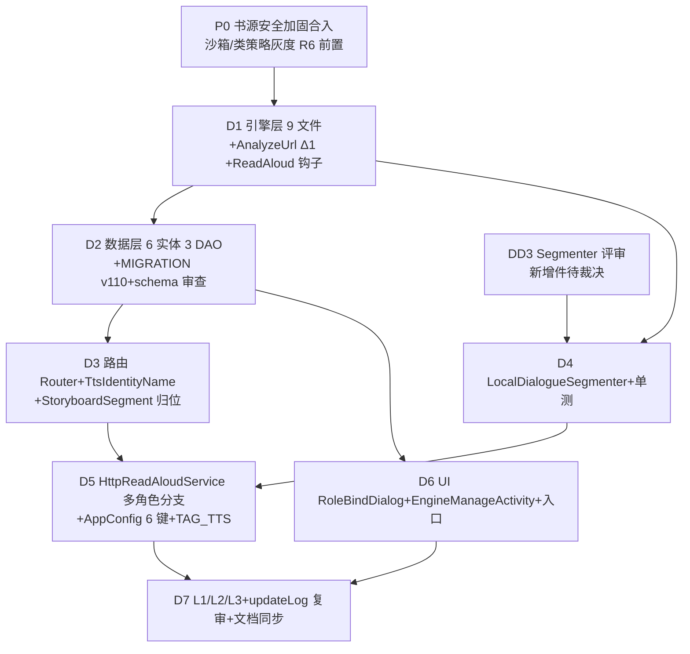

# P3 实施级设计 — 多角色听书一期（非 AI 最小闭环）· 第三轮深化（代码级）

> 状态：Proposed（待检查点裁决，未审查不实施）｜上游：[design.md](../design.md) AD-06 / 决策表 #9（修正版）｜证据：[evidence-pack.md](../evidence-pack.md) F/C 节
> NG 源：`F:\...\legado_NG-main`（快照 3.26.082815，行号为该快照实测）｜本项目 DB v108（`AppDatabase.kt:126`）

## 0.1 与 legadoc C1 朗读原语化的正交声明（总线补登 2026-08-31）

本分期（多角色听书）与 legadoc C1 朗读架构原语化（docs/specs/legadoc-benchmark-analysis/migration-designs/C1-aloud-primitives.md）**正交可叠加，无硬依赖**：C1 对引擎的唯一要求=发布 ReadAloudPosition 位置流；本分期的多角色路由=另一种引擎实现，同样只需消费该流。两分期同改 HttpReadAloudService，编排已固定串行方向：**C1（W2）先行 → 本分期（W4）rebase 后实施**，且 rebase 时须补发布制接线条款（多角色逐段推进经发布层，禁止直写 durChapterPos/moveToNextPage）+ OQ-11 off-by-one 对照覆盖本分期新增调用点（见 master-track-orchestration tasks 5.3.2，X4）。

## 0 继承结论索引（前轮实测，本轮逐条源码复核，全部成立）

| # | 结论 | 本轮复核锚点 |
|---|---|---|
| Δ1 | 本项目 `AnalyzeUrl` 缺 NG 客户端所需 speakVolume/speakPitch/voiceId/voiceName → 最小适配 +4 可选参数（零破坏） | 本项目 `AnalyzeUrl.kt:84-107`（仅 speakText/speakSpeed/currentToneID 等）vs NG 调用点 `TtsScriptEngineClient.kt:302-313`、`TtsHttpForwarderClient.kt:68-78`；模板占位符消费于 `TtsEngineModels.kt:302-320` |
| Δ2 | 迁移清单漏计 `TtsSynthesisText.kt`（实测 34 行：静音判定+对白剥引号），引擎层 8 文件实为 9 文件（~2870+34 行，本轮逐文件实测见 §4.1） | `TtsSynthesisText.kt:1-34` |
| Δ3 | NG 开关是 `AppConfig.readAloudScenarioMode(Int)` 派生（`AppConfig.kt:670-677`），非布尔；本项目无此键 | NG `AppConfig.kt:670-677`；本项目 grep 零命中 |
| Δ4 | 本项目 `HttpReadAloudService.kt` 实测 676 行；自研段间停顿逻辑必须在多角色路径保留 | `:189-198/:265-274/:458-483/:628-631` |
| Δ5 | 多角色下 `upSpeechRate` 只调本地倍速不重建合成（NG `:1687-1692`），行为改进点 | NG `:1687-1692`（仅 applyPlaybackRate+upPlayPos）vs 本项目 `:573-581`（cancel+stop+全量重建） |
| 6 | 本项目无 help/tts 包（Glob 零命中）→ 引擎层全新目录；`ReadAloud.kt:27` 仅 `httpTTS: HttpTTS?`，需增补 engineV2/refreshTtsRoute 钩子 | 本项目 `ReadAloud.kt:24-46`；NG 对照 `ReadAloud.kt:30/36/64-70/193-199` |
| 7 | 自研绑定字段（`AnalyzeUrl.kt:90-94,402-406`）唯一消费方 `AiChatSpeechPlayer.kt:224-236`，与听书路由无调用链交集，并存不合并（DD6） | 双侧 grep 复核 |
| 8 | BookCharacter 同名不同构：本项目 `book_characters`（bookUrl 维度，`BookCharacter.kt:12-57`）vs NG（workKey 维度+FK CASCADE）→ NG 体系改名 Work* 迁入、本项目实体零改动（DD1） | 双侧实体全文比对 |
| 9 | NG 无分镜时全兜底 NARRATION（`AiTtsStoryboardHelper.kt:620-645`）→ 新增 LocalDialogueSegmenter（DD3 待评审） | `segmentsForParagraph :620-645` + 服务侧 `:1449-1469` |
| 10 | DB 目标 v110（门禁以实施时 AppDatabase version+1 为准）；httpTTS 表保留不照搬 NG v113 DROP；6 新表全列显式 defaultValue，Migration 纯建表 | 与 P1 v109 衔接（P1 文档 §6） |
| 11 | 裁剪：流式族 808 行+WS 391 行+CastingCoordinator 1838 行不迁（仅提取 `normalizeIdentityName` 纯函数 `BookTtsCastingCoordinator.kt:303-310`）；DD9 StoryboardSegment 归位 help/tts/ | 见 §4.1 裁剪清单 |
| 12 | R6 引擎脚本沙箱前置依赖 P0 合入；工作量 ~12.4 人日（§13 函数粒度基准） | design.md 决策表 #1/#2/#4 |

## 1 目标与非目标

**目标（一期交付）**
1. TTS 引擎层 9 文件迁移（help/tts/ 新目录）：TtsEngineModels/TtsEngineStore/TtsScriptEngineClient/TtsHttpForwarderClient/TtsCapabilityRegistry/TtsSpeedPolicy/ReadAloudWavValidation/ReadAloudCacheManager/TtsSynthesisText，支持引擎导入/启停/音色目录获取/静音判定/对白剥引号/WAV 截断校验
2. 五级路由 `ReadAloudTtsRouter`（495 行代码级迁移，castRole 级一期数据恒空）+ `TtsIdentityName`（normalizeIdentityName 纯函数）
3. 数据实体最小集：6 新表（Work* 改名族+ttsVoices+ttsEngineRuntime）+ 3 DAO；DB v110（衔接 P1 v109）
4. 手动绑定 UI 最小集：朗读面板多角色入口行 + 角色绑定弹框 + 全局旁白/男/女兜底绑定 + 引擎管理页
5. `HttpReadAloudService` 多角色分支：段落→segment→路由合成→workKey 子目录缓存→播放列表；**段间停顿/静音兜底/错误重试全保留**；单音色路径零改动
6. `AnalyzeUrl` 最小适配（Δ1：+4 可选参数）；`ReadAloud` 增补 engineV2 钩子（结论 6）

**非目标（明确不做）**
- AI 分镜（AiTtsStoryboardHelper ~2800 行）、AI 选角（BookTtsCastingCoordinator 1838 行，仅提取 1 个纯函数）、BookTtsAutomationConfig/BindingPolicy（场景覆盖/AUTO 机制）
- Compose 全屏播放器+6 动效、NextChapterPlaybackPlan 跨章无缝族、ReadAloudAudioPreparation/ReadAloudProgress/ReadAloudMediaItemIdentity 族
- 流式合成播放族（TtsStreamingAudio 280/TtsSoundTouchAudioProcessor 126/TtsPlayerFactory 41，计 447 行）与 WebSocket/SSE 引擎客户端（TtsWebSocketEngineClient 391/TtsSseEngineClient）；一期多角色走"逐段合成→文件缓存→播放列表追加"，与本项目现有节奏一致
- 场景级音色覆盖（voiceAssignments）；BookTtsCastRoleContribution 表
- 多角色路径的并发合成调度器（一期逐段串行，DD15）

## 2 NG 技术架构（逐类逐函数解读）

```mermaid
flowchart LR
    A[HttpReadAloudService<br/>downloadAndPlayAudios] --> B[buildSpeakItemsForContent<br/>段落→StoryboardSegment<br/>无分镜→NARRATION 兜底]
    B --> C[prepareSpeakFilesConcurrently<br/>逐 item: routeFor→缓存名→任务]
    C --> D[ReadAloudTtsRouter.route<br/>五级绑定解析]
    D --> E[prepareSpeakFileWithFallback<br/>fallbackRoutes 候选链逐个尝试]
    E --> F[TtsScriptEngineClient<br/>synthesize→AnalyzeUrl 沙箱请求]
    F --> G[ReadAloudWavValidation<br/>.part 原子写+截断重试]
    G --> H[(缓存<br/>httpTTS/{md5 workKey}/<br/>MD5 title_scenario|audioCacheKey)]
    H --> I[ExoPlayer 播放列表<br/>MediaItem 逐段顺序播放]
    D -.引擎解析.-> S[TtsEngineStore<br/>内置+saved 合并/音色目录]
```

**逐类逐函数**（迁移处置：✅迁 / ✂️裁 / ➕新增）：

| 类/文件（NG 实测行数） | 关键函数（行号） | 职责与要点 | 处置 |
|---|---|---|---|
| ReadAloudTtsRouter（495） | `route :36-93`：character→castRole→dialogueFallback(性别)→dialogueDefault(仅 DIALOGUE/THOUGHT)→narrator(仅非说话段)，engine 仅接受 SCRIPT+enabled（`:53`）；voiceId 三级校验：绑定→engine.activeVoice（`:70-73`）；Route 携带 kind/fallbackUsed/bindingUnavailable/warnOnFailure（`:153-166`）；RouteKind 枚举 `:168-174` | 五级路由主决策 | ✅迁，`scene: StoryboardScene?` 参数保留但 sceneVoiceEnabled 恒 false（AutomationConfig 不迁） |
| 同上 | `fallbackRoutes :95-140`：场景覆盖回退（恒空）→性别兜底→narrator→引擎默认；`distinctBy(engine,voice,style)` 去重+剔除已失败路由（`:135-139`） | 兜底链 | ✅迁 |
| 同上 | `create :249-362`：workKey 查库→characters/castRoles/bindings→别名归一索引（name+aliasesJson→normalizeIdentityName→id，`:304-324`）→性别索引→unavailable/protected 集合；`resolveGlobalBindings :364-383`（narrator 引擎独立键，dialogue 三绑定共用 multiRoleTtsEngineId）；`isBindingUnavailable :455-466`（INHERIT 跳过/AUTO 无音色不可用/音色不在 enabledVoices）；`toRouteBinding :468-480`；`createResolved :393-449`（书内绑定优先于全局兜底，全空返回 null） | 绑定解析 | ✅迁；`BookTtsAutomationConfig.get(workKey)` 调用点（`:353`）替换为常量 false |
| TtsEngineModels（502） | `TtsVoice :19-36`/`styleOptions :119-140`（extra.styles 三形态解析）；`TtsSynthesisContext :38-85`（mode/role/scene/expressive，一期恒 null 但字段结构全保留，避免二期改协议）；能力常量 `:87-95`；`TtsEngineSetting :176-368`：30+ 字段，实现 BaseSource（`:259`），`enabledVoices :266-269`、`supportsVoiceFetch :275-277`（script 含 `function voices(`）、`effectiveSynthesisUrl :302-320`（baseUrl+path+{{speakVolume}}/{{speakSpeed}}/{{voiceId}}/{{speakPitch}}/{{speakText}} 占位符——Δ1 根因）、`effectiveOptionValues :326-355`（random_number 稳定生成）；`TtsScriptOption :370-440` | 引擎模型与能力声明 | ✅迁 |
| TtsEngineStore（~1371） | `engines() :244-301`（内置资产+saved 合并+默认脚本升级+排序）；`saveEngine :332-360`（保存后回调 `ReadAloud.updatePreparedTtsEngine :348` + `httpTtsEngineV2` 同步 `:352` + `upReadAloudClass :355`）；`selectVoice :463-476`；`upsertVoiceList :479-494`（ttsVoices 表 replace）；`ensureVoiceCatalog :501-524`（per-engine Mutex 并发合并：锁内二次检查防重复拉取）；`setVoiceEnabled :527-542`；导入冲突三动作 `TtsEngineImportConflict.resolve :67-101`；默认脚本资产清单 `:223-231`（7 个） | 引擎库存储/合并/导入 | ✅迁；DEFAULT_SCRIPT_ASSETS 裁为 2 个（DD8）；回调点适配本项目 ReadAloud 钩子 |
| TtsScriptEngineClient（801） | `loadOptions :47-58`（Lru16 缓存，键=id:MD5(script)）；`fetchVoices :101-113`；`getSynthesisResponse :115-138`；`prepareSynthesisRequest :202-237`（调 JS `synthesize(text,voice,params,options,ctx)`→parseSynthesisRequest）；`executeWithRetry :239-282`（retry≤3）；`executeRequest :284-333`（**WS 分支一期裁剪**；AnalyzeUrl 传 speakVolume/speakPitch/voiceId/voiceName `:302-313`）；`requireAudioStream :361-373`（JSON/text 响应=错误体抛出）；`audioCacheKey :375-397` 十元组：engineId+MD5(script)+optionValues+voiceId+styleId+speed+volume+pitch+ctx+text 以 `-|-` 连接；`parseSynthesisRequest :461-522`（url 必填/transport 推断/音频字段抽取路径）；`toAudioResponse :623-676`（audioEncoding url→二次 GET / base64→解码） | SCRIPT 引擎 JS 沙箱客户端 | ✅迁；executeRequest 的 `isWebSocket` 分支保留代码但一期路由层拒绝（transport 推断到 ws 时抛 NoStackTraceException 提示一期不支持） |
| TtsSynthesisText（34） | `isReadAloudSynthesisTextSilent :6-8`（blank 或匹配 notReadAloudRegex）；`normalizeStoryboardSynthesisText :13-34`（DIALOGUE/THOUGHT 剥最外层成对引号 `“”‘’「」『』""`，NARRATION 不剥） | 静音判定+对白剥引号 | ✅迁（本项目已有 `AppPattern.notReadAloudRegex`，服务侧 `:164` 在用） |
| TtsSpeedPolicy（19） | `playbackRate :8-10`（(progress+5)/10f，progress∈0..45）；`synthesisSpeed :12-14`（服务端速度=engine.effectiveSpeed） | 服务端速度与本地倍速分离 | ✅迁 |
| TtsCapabilityRegistry（63） | `normalize :40-55`（依赖闭包展开）；`supports :57-58` | 能力注册表 | ✅迁 |
| ReadAloudWavValidation（214） | `writeReadAloudAudioWithWavRetry :25-57`（.part 原子写+检测失败重试 3 次）；`detectAbruptWavTruncation :59-79`（时长<文本 speechUnits×75ms 且尾窗 RMS 高→句中截断）；`readPcmWavMetrics :87-139`（RIFF/WAVE/fmt/data 解析，仅 PCM16）；非 WAV 文件 metrics=null 直接通过 | 音频截断校验 | ✅迁 |
| ReadAloudCacheManager（79） | `ttsCacheDirectory :47-51`（`cacheDir/httpTTS/{md5(workKey)}/`）；`clearTtsAudioCache :56-78`（walkTopDown 删除，保留 .part，清空目录） | 缓存目录与清理 | ✂️裁剪迁移：删 AiTtsStoryboardHelper 依赖（clearCurrentBook :22-45 分镜清理段） |
| TtsHttpForwarderClient（193） | `fetchVoices :47-56`（MultiTTS 协议）/`parseVoices :109-121`/`audioCacheKey :123-140` | 音色转发协议 | ✅迁（SCRIPT 引擎 voices() 返回体复用 parseVoices） |
| HttpReadAloudService（多角色 6 段） | `buildSpeakItemsForContent :1404-1473`（段落×分镜→SpeakItem，**无分镜→单条 NARRATION :1449-1469**）；`toSpeakItem :1475-1502`（silent 过滤 :1486）；`prepareSpeakFilesConcurrently :973-1010`；`prepareSpeakFileWithFallback :1012-1077`（候选逐个尝试，index>0 成功→notifyRoleRouteFallback :1079-1108，AppLog "TTS片段合成失败，改用X继续朗读 :1068-1072"）；`routeCandidates :1160-1172`（primary+fallbackRoutes 去重）；`prepareSpeakFile :1174-1206`（notReadAloudRegex 清洗→空文本 silent_sound 2160B→WAV 校验重试）；`md5SpeakFileName :1535-1559`（`MD5(title)_MD5(scenarioMode multi|single + audioCacheKey)`）；`routeFor :1517-1525`；`SpeakItem :1911-1920`（paragraphIndex/text/start/end/sourceText/synthesisContext/scene/segment）；`upSpeechRate :1687-1692`（Δ5）；`refreshTtsRoute :1694` | 多角色合成主链 | ✂️按本项目结构重写（§4.3 diff 式）；**不迁**并发任务族（prepareReadAloudAudioTasks 属 ReadAloudAudioPreparation） |
| ChapterStoryboardParser 模型 | `StoryboardSegment :49-122`（type/paragraphIndex/text/speakerName/speakerId/castRoleId/speakerGender/start/end+AI 专用 12 字段）；`StoryboardSegmentType :154-160`（NARRATION/DIALOGUE/THOUGHT）；SpeakerGender 常量 `:93-97` | 段落模型 | ✅迁，归位 help/tts/（DD9）；AI 专用字段（performanceContext/emotion 族）保留结构 |
| BookTtsCastingCoordinator | `normalizeIdentityName :303-310`（剥边界标点+空白归一+小写） | 身份归一纯函数 | ➕提取到新 TtsIdentityName.kt（~20 行） |
| AppConfig（NG） | `readAloudScenarioMode :670-674`（Int 0/1）/`readAloudMultiRole :676-677`（派生）；`multiRoleTtsEngineId :780-784`/`defaultNarratorTtsEngineId :786-790`/`defaultNarratorTtsVoiceId :792-796`/`defaultDialogueMaleTtsVoiceId :798-802`/`defaultDialogueFemaleTtsVoiceId :804-808` | 偏好键族（Δ3） | ➕本项目 PreferKey+AppConfig 同名同义补齐 |

## 3 本项目对接点现状（实测行号）

| 对接点 | 现状摘录（已核实） | 结论 |
|---|---|---|
| `service/HttpReadAloudService.kt`（676 行） | 单音色：`downloadAndPlayAudios :149-205` 逐段合成→addMediaItem→**段间停顿插入 `:189-198`**（`AppConfig.ttsParagraphPauseMs>0` 且非末段→`createParagraphPauseFile :458-483` 生成 8kHz/16bit WAV）；`getSpeakStream :348-442`：`AnalyzeUrl(httpTts.url, speakText, speakSpeed=speechRate, source=httpTts)` `:353-360`+loginCheckJs 双路径 `:361-387`+Content-Type 校验 `:388-400`+downloadErrorNo≤5 `:407-440`（网络错 break→null→silent 兜底 `:434-435`）；`md5SpeakFileName :445-447` = `MD5(title)_MD5(url-\|-\|speechRate-\|-\|content)`；静音文件=2160B（`:511`）；`upSpeechRate :573-581` 全量重建；`onMediaItemTransition :624-634` pause_ 前缀跳过段落推进 | 多角色分支并存主战场；单音色路径与缓存键公式不动 |
| `model/ReadAloud.kt` | `:27 var httpTTS: HttpTTS? = null`；`getReadAloudClass :29-41`（ttsEngine 数字→httpTTSDao 查→HttpReadAloudService，否则系统 TTS） | 无 engineV2 钩子 → §4.5 增补 |
| `AnalyzeUrl.kt` | 构造器 `:84-107` 无 speakVolume/speakPitch/voiceId/voiceName（Δ1）；JS bindings `:400-406` 仅 speakText/speakSpeed/currentToneID/currentSpeakerName/currentEmotionName/currentEmotionTag/currentSpeechRouteJson | +4 可选参数+4 bindings 行（DD10） |
| `data/entities/BookCharacter.kt` | 表 `book_characters :12`，bookUrl 维度；speechRouteJson `:42`/roleLevel `:50`/skills `:32`；AI 聊天角色卡用 | 零改动（DD1） |
| 自研字段消费方 | `AiChatSpeechPlayer.kt:224-236`：`AnalyzeUrl(..., currentToneID=route.toneID, currentSpeakerName=..., currentEmotionName/Tag=..., currentSpeechRouteJson=route.toJson())` | 并存不合并（DD6） |
| `help/config/AppConfig.kt` | `speechRatePlay :2094`、`streamReadAloudAudio :2517`、`ttsParagraphPauseMs :2963-2966`；无 readAloudScenarioMode 族 | 补 6 键（Δ3） |
| `data/AppDatabase.kt` | `:126 version = 108`，69 实体 44 DAO；本项目 v108 与 NG 分叉（evidence-pack C 节） | v110 自起重编（§6） |
| 朗读 UI | `ReadAloudDialog.kt`（ComposeDialogFragment `:64`）：`ReadAloudContent :178-418`，AppDialogFrame+rememberAppDialogStyle 取色；语速行 `:339-379`；底部动作行 `:380-412`（"设置"→ReadAloudConfigDialog `:408-410`）；ReadAloudPlayerPanel.kt（5328 行）悬浮/面板体系 | 入口挂 Dialog（§7） |
| `data/entities/BaseSource.kt` | `interface BaseSource : JsExtensions :33`；`evalJS :327`（bindingsConfig DSL 形态，与 NG 直接 map bindings 略异） | TtsEngineSetting 实现 BaseSource 可行；JS 调用形态按本项目 evalJS 适配 |
| httpTTS 表 | 本项目扩展字段在用（evidence-pack C 节） | 保留不 DROP（DD5） |

**自研绑定字段 → 新体系映射表**（DD6）：currentToneID→Route.voiceId（不迁移不互通，AiChatSpeechPlayer 原样传 bindings）；currentSpeakerName→StoryboardSegment.speakerName（语义独立）；currentEmotionName/Tag→TtsSynthesisContext（一期听书路由不注入情绪，二期对齐）；currentSpeechRouteJson→Router.Route（不互通，文档级隔离）；legacy HttpTTS.url 模板（{{speakText}} 等）→完整保留为 single 路径，多角色开关关闭时零行为变化。

## 4 改造方案

### 4.1 help/tts/ 引擎层 9 文件迁移清单（Δ2 修正后）

| 目标文件 | NG 实测行数 | 迁/裁 | 目标行数 |
|---|---|---|---|
| TtsEngineModels.kt | 502 | 迁；裁 WS/SSE 注释段 | ~470 |
| TtsEngineStore.kt | ~1371 | 迁；DEFAULT_SCRIPT_ASSETS 裁 2 个；回调点适配本项目 ReadAloud | ~1150 |
| TtsScriptEngineClient.kt | 801 | 迁；executeRequest WS 分支保留代码+入口拒绝 | ~760 |
| TtsHttpForwarderClient.kt | 193 | 迁 | 193 |
| TtsSynthesisText.kt | 34 | 迁（Δ2） | 34 |
| TtsSpeedPolicy.kt | 19 | 迁 | 19 |
| TtsCapabilityRegistry.kt | 63 | 迁 | 63 |
| ReadAloudWavValidation.kt | 214 | 迁 | 214 |
| ReadAloudCacheManager.kt | 79 | ✂️删分镜清理段 | ~55 |
| ReadAloudTtsRouter.kt | 495 | 迁；AutomationConfig 依赖→常量；StoryboardSegment 引用改 help/tts/ | ~460 |
| TtsIdentityName.kt | ➕ | 自 CastingCoordinator :303-310 提取 | ~20 |
| StoryboardSegment/Scene/Type | ➕归位（DD9） | 自 ui/book/character/ChapterStoryboardParser :5-160 迁模型部分 | ~170 |
| **不迁** | TtsWebSocketEngineClient(391)/TtsSseEngineClient/TtsStreamingAudio(280)/TtsSoundTouchAudioProcessor(126)/TtsPlayerFactory(41)/ReadAloudAudioPreparation(204)/ReadAloudProgress(157)/StoryboardTtsContext(69)/BookTtsCastingCoordinator(1838)/BookTtsAutomationConfig(46)/BookTtsBindingPolicy(118) | 一期裁剪（流式+WS+AI 自动化） | 0 |

引擎层合计迁移源 ≈ 3276+495 行（9 文件 3276 含 TtsSynthesisText 34 = Δ2 "~2870+34" 同量级精化；Router 单列）。

### 4.2 五级路由 route() 算法（kotlin 草案，裁剪自 NG :36-93）

```kotlin
// help/tts/ReadAloudTtsRouter.kt（迁移后）
fun route(
    segment: StoryboardSegment?,
    fallbackEngine: TtsEngineSetting,
    scene: StoryboardScene? = null  // 一期恒 null（DD2），签名保留
): Route {
    // ① character：speakerId∈knownCharacterIds 优先，否则 speakerName 归一后查别名索引
    val characterId = segment?.characterTargetId()          // 仅 DIALOGUE/THOUGHT 段（NG :176-186）
    // ② castRole：characterId 命中失败才尝试（NG :188-197）；一期数据恒空
    val castRoleId = segment?.castRoleTargetId(characterId)
    val characterBinding = characterId?.let(characterBindings::get)
    val castRoleBinding = castRoleId?.let(castRoleBindings::get)
    // ③ dialogue 性别兜底：segment.speakerGender → character/castRole 性别索引（NG :199-206）
    val fallbackGender = segment?.dialogueFallbackGender(characterId, castRoleId)
    val dialogueFallbackBinding = fallbackGender?.let(::genderBinding)
    // ④ dialogue 默认：仅说话段生效
    val isSpokenRole = segment?.type == DIALOGUE || segment?.type == THOUGHT
    val defaultDialogueBinding = dialogueDefaultBinding.takeIf { isSpokenRole }
    // ⑤ narrator：仅非说话段生效
    val binding = characterBinding ?: castRoleBinding ?: dialogueFallbackBinding
        ?: defaultDialogueBinding ?: narratorBinding.takeUnless { isSpokenRole }
    // 引擎门禁：仅 SCRIPT 且 enabled，否则回落全局引擎（NG :53）
    val engine = binding?.engine?.takeIf { it.type == TtsEngineType.SCRIPT && it.enabled }
        ?: fallbackEngine
    // voiceId：绑定音色须在 engine.enabledVoices()，否则引擎当前音色（NG :70-73）
    val voiceId = sceneVoiceId(scene, engine, characterId, castRoleId)  // 一期恒 null
        ?: binding?.voiceId?.takeIf { binding.engine.id == engine.id }
            ?.takeIf { v -> engine.enabledVoices().any { it.id == v } }
        ?: engine.activeVoice()?.id
    return Route(engine, voiceId, styleId = null, kind = when { /* NG :78-92 同款 */ },
        fallbackUsed = isSpokenRole && characterBinding == null && castRoleBinding == null,
        bindingUnavailable = characterId in unavailableCharacterBindings ||
            castRoleId in unavailableCastRoleBindings,
        bindingMode = characterBinding?.bindingMode ?: castRoleBinding?.bindingMode,
        warnOnFailure = isSpokenRole && binding != null &&
            binding.engine.id == dialogueDefaultBinding?.engine?.id)
}
```

fallbackRoutes（NG :95-140 原样迁移）：场景覆盖（恒空）→性别兜底→narrator→引擎默认，`distinctBy Triple(engine.id, voiceId, styleId)` 并剔除失败路由。**双路匹配**=speakerId 精确匹配（LocalDialogueSegmenter 一期产不出 speakerId，恒走第二路）+speakerName 归一匹配（`normalizeIdentityName` 后查 characterNameIndex，别名含 aliasesJson 展开）。`createResolved :393-449`：书内绑定优先、缺失级联到全局兜底绑定（narrator/dialogueMale/dialogueFemale/dialogueDefault），全空返回 null（无任何绑定→多角色开关虽开但路由 null→走单音色，边界 B3）。**角色零绑定告警（V6-A11）**：createResolved 非空（存在旁白/兜底绑定）但只建角色未绑任何音色→说话段①-④全 miss→全段落⑥ engine.activeVoice（对白体验≈单音色）；Router.create 收尾检测 characters 非空且零角色绑定→AppLog.put(TAG_TTS, "角色未绑定音色，对白将使用引擎当前音色")，仅提示不阻断朗读。

### 4.3 LocalDialogueSegmenter 完整设计（NG 无对应物，DD3）

```kotlin
// help/tts/LocalDialogueSegmenter.kt（新增，~150 行）
object LocalDialogueSegmenter {
    // 说话人提示动词表（前置提示：XX道/说/喊…，1-12 字人名窗口）
    private val SAY_VERBS = listOf("道", "说", "喊", "问道", "答道", "笑道", "怒道",
        "喝道", "叫道", "低声道", "沉声道", "冷声道", "轻声道", "开口", "喃喃", "嘀咕",
        "吩咐", "命令道", "说道", "大声道", "淡淡道")
    // 成对引号表（DD16，V6-A1 重写）：弃单一字符类正则（实锤草案 DIALOGUE_REGEX 只含“”""
    // 两类，与"含单引号/直角引号"声明及单测⑤⑥自相矛盾），改为 QUOTE_PAIRS 表驱动
    // 成对栈式扫描：开闭严格配对+栈匹配，杜绝跨风格错配（详见下方切分策略）
    private val QUOTE_PAIRS = mapOf(
        '「' to '」', '『' to '』', '“' to '”', '‘' to '’', '"' to '"')  // 英文直引号开闭同字符
    // 代词词典（DD17）：人称代词不作 speakerName，映射性别喂路由③性别兜底
    private val PRONOUN_GENDER = mapOf("他" to SpeakerGender.MALE, "她" to SpeakerGender.FEMALE)

    /** 段落切分：引号体=DIALOGUE，引号外=NARRATION；speakerName=紧邻前缀(1..12字)+动词捕获 */
    fun segment(paragraphIndex: Int, paragraphText: String): List<StoryboardSegment>
    // 失败兜底：任何异常/零对白 → listOf(narrationSegment(paragraphIndex, paragraphText))
    // 语义对齐 NG AiTtsStoryboardHelper.segmentsForParagraph :633-645 的 ifEmpty 兜底
}
```

- **切分策略（DD16 成对栈式扫描，替换原 DIALOGUE_REGEX.findAll 方案）**：单趟线性扫描字符流（O(n)）：遇开引号→连同其配对闭字符与起始偏移入栈；遇闭引号→仅当与栈顶期望闭字符一致时弹栈（不一致则忽略该字符，防御性跳过）；栈弹空瞬间完成一个完整引号体→生成 DIALOGUE segment（start/end=引号体在原文的偏移区间，含引号——合成文本由 `normalizeStoryboardSynthesisText :13-34` 统一剥引号）；同/异风格嵌套由栈天然支持（他说："你看「书」了吗"整体为一个引号体）；扫描结束栈非空（存在未闭合引号）→整段保守降级 NARRATION（单测④语义）；两段引号之间的区间（trim 后非空且非静音）生成 NARRATION segment。栈匹配保证「开引号只会被其配对闭引号关闭——跨风格错配用例（单测⑨）`「他说："早"` 中「未闭合时 "早" 不得被误切为对白。
- **speakerName 提取**：取引号开始位置向前回溯 ≤16 字符的窗口，匹配 `(人名窗口)(动词)` 结尾模式（动词∈SAY_VERBS，人名窗=非标点非引号连续串 1..12 字）；命中→speakerName=捕获组、evidence="local_prefix"、speakerGender=UNKNOWN（交给路由 ③ 性别索引/兜底链）；未命中→speakerName=null、evidence="local_quote"（走 ④⑤ 兜底）。**代词性别映射（DD17）**：人名窗为人称代词时不捕获为 speakerName（单测⑧语义保留），但按内置代词词典 他→MALE/她→FEMALE 写入 speakerGender 喂给路由 ③ 性别兜底（`dialogueFallbackGender :199-206` 直接消费）——未建角色时"他说…/她…道"即可命中男/女兜底音色，纯查表零成本，替代纯排除策略提升未建角色命中率。
- **segment 结构**：复用 StoryboardSegment（type/paragraphIndex/text/speakerName/evidence/speakerGender/start/end），identityType=NONE、nameType=命中时 PROPER_NAME、AI 专用字段（performanceContext/emotion 族）取默认值。
- **置信度策略**：一期不做数值置信度（与 NG 手动绑定路径一致）；以 evidence 字符串区分 `local_prefix`（高置信）/`local_quote`（低置信），为二期 AI 分镜数据替换留判别位（AI 到达时 segment 来源切回分镜，Segmenter 旁路）。
- **接口边界**：只依赖 StoryboardSegment+StoryboardSegmentType，不查库不碰路由；输入段落已过本项目 `getReadAloudText` 净化链（复用现有 contentList）。
- **单测用例**（JVM，§10）：①无引号段→单 NARRATION；②单引号段+前缀动词→1 DIALOGUE+speakerName；③多引号段夹叙述→N-D-N 交替且 offset 单调；④引号未闭合→栈非空→整段 NARRATION（栈式保守降级，替代原"正则不命中"措辞）；⑤直角引号「」→DIALOGUE；⑥英文直引号成对→DIALOGUE；⑦纯符号引号体→silent 过滤；⑧speakerName 窗口含"他说"人称代词→不捕获 speakerName（排除语义保留），但 speakerGender 按 DD17 代词词典映射（他→MALE/她→FEMALE）喂③性别兜底；⑨跨风格错配防护（V6-A1 新增）：`「他说："早"`→外层「未闭合栈非空→整段 NARRATION，"早"不得误切为 DIALOGUE；⑩异风格嵌套不串扰（V6-A1 新增）：`他说："你看「书」了吗"`→单个 DIALOGUE（内层「」并入引号体不拆分）。

### 4.4 HttpReadAloudService 改造（diff 式）

```kotlin
// ① 新增字段（:98 后）
private var ttsEngineV2: TtsEngineSetting? = null          // 多角色活跃引擎
private var ttsRouter: ReadAloudTtsRouter? = null          // 章级路由器

// ② play() :115-130 分支改造
if (AppConfig.readAloudScenarioMode == 1 && ReadAloud.httpTtsEngineV2?.isScriptEngine == true) {
    ttsEngineV2 = ReadAloud.httpTtsEngineV2
    ttsRouter = ReadAloudTtsRouter.createForCurrentBook()   // 绑定全空返回 null → 走单音色
    downloadAndPlayAudiosMultiRole()
} else { /* 现有 stream/非 stream 双分支原样 */ }            // 单音色路径零改动

// ③ downloadAndPlayAudiosMultiRole()（新增 ~90 行，复用 :149-205 骨架）
//    contentList.forEachIndexed { index, content ->
//        val segments = ttsRouter?.let { LocalDialogueSegmenter.segment(index, content) }
//            ?: listOf(narrationSegment(index, content))     // 无路由→整段旁白（对齐 NG :1449-1469）
//        segments.forEach { seg ->
//            val synthesisText = normalizeStoryboardSynthesisText(seg.text, seg.type)  // Δ2 消费点
//            val route = ttsRouter?.route(seg, ttsEngineV2!!)  // 五级路由（§4.2）
//            val fileName = md5SpeakFileNameMulti(synthesisText, route)  // 见 ⑤
//            if (silent) createSilentSound(fileName) else prepareSpeakFileWithFallback(...)
//            launch(Main) { exoPlayer.addMediaItem(MediaItem.fromUri(Uri.fromFile(file))) }
//        }
//        // 段间停顿保留：pauseMs>0 && index<lastIndex → addMediaItem(createParagraphPauseFile)
//        //   （Δ4：:189-198 逻辑原样搬入多角色分支；pause_ 文件仍放 ttsFolderPath 根，全局复用）
//    }

// ④ prepareSpeakFileWithFallbackMulti()（仿 NG :1012-1077，~60 行）
//    routeCandidates = listOf(primary) + ttsRouter.fallbackRoutes(seg, engineV2, primary)（:1160-1172 同款去重）
//    逐候选：md5 命中→直接返回；未命中→getSpeakStreamMulti（TtsScriptEngineClient.getSynthesisStream,
//    保留 downloadErrorNo≤5 与 ScriptException 直抛语义 :1212-1264）→writeReadAloudAudioWithWavRetry
//    （.part 原子写+截断重试 3 次）；index>0 成功→AppLog.put("改用${kind.displayName()}继续朗读")（NG :1068-1072）

// ⑤ md5SpeakFileNameMulti()（仿 NG :1535-1559）
//    scenarioMode = "multi"；MD5(title)_MD5("multi-|-" + TtsScriptEngineClient.audioCacheKey(
//        engine=route?.engine ?: ttsEngineV2, text, voiceId=route?.voiceId, speed=TtsSpeedPolicy.synthesisSpeed(engine)))
//    文件落 ttsFolderPath = cacheDir/httpTTS/{md5(workKey)}/（ReadAloudCacheManager.ttsCacheDirectory :47-51）
//    removeCacheFile :508-519 改 walkTopDown 遍历子目录（titleMd5 前缀判定不变）

// ⑥ upSpeechRate :573-581 分支改造（Δ5 行为改进）
if (多角色活跃) { exoPlayer.setPlaybackSpeed(TtsSpeedPolicy.playbackRate(AppConfig.speechRatePlay)) }
else { /* 现有 cancel+stop+重建 原样 */ }                     // 单音色保持重建（键含 speechRate）
//    段间停顿语义（DD18，V6 裁决）：setPlaybackSpeed 全局作用于全部 MediaItem，pause_{ms}.wav
//    停顿被等比压缩（800ms@2x→400ms）——裁决=接受该语义（"更快"直觉自洽，停顿非朗读内容不需豁免）；
//    ExoPlayer 逐 MediaItem 豁免（停顿项恒速）留二期，登记于此不阻塞一期

// ⑦ 绑定刷新钩子 refreshTtsRoute()：置空 ttsRouter+ttsEngineV2，按 ② 重新初始化（NG :1694 同义）
```

### 4.5 AnalyzeUrl / ReadAloud / AppConfig 适配

| 文件 | 变更 | Δ行数 |
|---|---|---|
| `AnalyzeUrl.kt` | 构造器 `:84-107` +4 参数：`speakVolume: Int?=null, speakPitch: Int?=null, voiceId: String?=null, voiceName: String?=null`；bindings `:400-411` +4 行（speakVolume/speakPitch/voiceId/voiceName）。全部可空默认 null，现有调用点（书源/AiChatSpeechPlayer）零影响（DD10） | +12 |
| `model/ReadAloud.kt` | `:27` 后增 `var httpTtsEngineV2: TtsEngineSetting? = null`；`updatePreparedTtsEngine(e)`（NG :64-70 同款）；`refreshTtsRoute(context)`（NG :193-199 同款，IntentAction.refreshTtsRoute 需在 IntentAction/BaseReadAloudService.onCommand 补分支） | +40 |
| `help/config/AppConfig.kt`+`constant/PreferKey.kt` | 6 键（Δ3）：readAloudScenarioMode(Int 0/1)+readAloudMultiRole 派生；multiRoleTtsEngineId/defaultNarratorTtsEngineId/defaultNarratorTtsVoiceId/defaultDialogueMaleTtsVoiceId/defaultDialogueFemaleTtsVoiceId（NG :670-808 同名同义） | +50 |
| `constant/AppLog.kt` | 新增 `TAG_TTS = "TtsEngine"` 模块 Tag（logging_rules 模块 Tag 表扩容，引擎层/路由/分段器统一 putDebugWithTag） | +2 |
| `data/AppDatabase.kt` | +6 实体/+3 DAO/version 108→（实施时+1，规划 v110）/MIGRATION 注册 | +75 |

### 4.6 实体 6 新表 Work* 改名清单（DD1）

| NG 类/表 | 本项目类/表 | 裁剪 | 实测行数基准 |
|---|---|---|---|
| BookCharacterProfile / bookCharacterProfiles | **WorkProfile / workProfiles** | 无裁剪（workKey=normalize(书名)\nnormalizeAuthor(作者)，剥"作者:"前缀 `:26-39`） | 41 |
| BookCharacter / bookCharacters | **WorkCharacter / workCharacters** | 裁 imagePrompt/portraitUri（AI 绘图二期）；保留 Gender/RoleTag/Source 常量组 | 82→~72 |
| BookTtsCastRole / bookTtsCastRoles | **WorkTtsCastRole / workTtsCastRoles** | 无裁剪（identityState/isRoutableRole :112-114 保留，DD2） | 115 |
| BookCharacterTtsBinding / bookCharacterTtsBindings | **WorkTtsBinding / workTtsBindings** | 无裁剪（TargetType 5 类/BindingMode 3 类/工厂函数 :73-113 保留） | 114 |
| TtsVoiceEntity / ttsVoices | 同名同表 | 无 | 26 |
| TtsEngineRuntimeEntity / ttsEngineRuntime | 同名同表 | 无 | 20 |
| DAO | **WorkTtsDao**（profile+character+castRole+binding 四表合并，仿 NG BookCharacterDao :18-117 裁 Contribution 段）+ **TtsVoiceDao**（replaceForEngine/deleteByEngine）+ **TtsEngineRuntimeDao** | — | ~180 |

## 5 数据流（一期多角色）

```mermaid
flowchart TD
    A[章节 contentList<br/>现有 getReadAloudText 净化] --> C{readAloudScenarioMode==1<br/>且 SCRIPT 引擎就绪?}
    C -- 否 --> Z[现有单音色路径<br/>AnalyzeUrl(httpTTS.url) 逐段<br/>缓存键 url-|-speechRate-|-content 不变]
    C -- 是 --> D[LocalDialogueSegmenter<br/>引号对白切分/失败→整段 NARRATION]
    D --> E[WorkTtsDao<br/>workKey=norm书名\nnorm作者]
    E --> F[ReadAloudTtsRouter.createResolved<br/>书内绑定→全局兜底级联]
    F --> G{五级路由 route}
    G --> G1["① character(speakerName 归一双路匹配)"]
    G --> G2[② castRole 一期恒空]
    G --> G3[③ dialogue male/female 性别兜底]
    G --> G4[④ dialogue 默认 仅说话段]
    G --> G5[⑤ narrator 仅非说话段]
    G --> G6[⑥ 引擎 activeVoice]
    G1 & G2 & G3 & G4 & G5 & G6 --> H[Route engine/voiceId/kind]
    H --> I[失败→fallbackRoutes 候选链<br/>性别→narrator→引擎默认 去重]
    I --> J[TtsScriptEngineClient<br/>synthesize JS→AnalyzeUrl 沙箱请求<br/>Δ1: speakVolume/Pitch/voiceId/voiceName]
    J --> K[ReadAloudWavValidation<br/>.part 原子写+截断重试≤3]
    K --> L[(httpTTS/{md5 workKey}/<br/>MD5title_Multi-|-十元组键)]
    L --> M[播放列表追加<br/>段间停顿 WAV 项保留 Δ4]
    M --> N[ExoPlayer 顺序播放<br/>TtsSpeedPolicy 本地倍速 Δ5]
```

## 6 DB v110 设计

- **版本衔接**：P1 规划 v109（AI 地基，P1 文档 §6）。P3 目标 **v110**；实施门禁 = 以实施时 `AppDatabase.kt` `version` 实际值 +1 为准（P3 先于 P1 落地则顺延为 109，禁止抢占固定号）。禁止复用 NG 108→114 迁移链（两侧 v108 已分叉，evidence-pack C 节）。**跨版升级声明**：v108→v110 跨版由迁移链串联覆盖（Room 按序执行各段 Migration）；覆盖安装两条路径（逐版 v108→v109→v110 / 跨版直达 v110）均列入门禁②验证。
- **建表顺序**（FK 父表先于子表，Room schema 校验按此序）：workProfiles → workCharacters → workTtsCastRoles → workTtsBindings → ttsVoices → ttsEngineRuntime。
- **Migration 草案**（database-migration-safety R2：runCatching+AppLog；纯 CREATE TABLE/INDEX，无回填无数据搬迁）：

```kotlin
private val MIGRATION_109_110 = object : Migration(109, 110) {
    override fun migrate(db: SupportSQLiteDatabase) {
        kotlin.runCatching {
            // 1 父表（无 FK）
            db.execSQL("""CREATE TABLE IF NOT EXISTS `workProfiles` (
                `workKey` TEXT NOT NULL, `bookName` TEXT NOT NULL DEFAULT '',
                `bookAuthor` TEXT NOT NULL DEFAULT '', `latestBookUrl` TEXT,
                `characterCount` INTEGER NOT NULL DEFAULT 0, `enabled` INTEGER NOT NULL DEFAULT 1,
                `createdAt` INTEGER NOT NULL DEFAULT 0, `updatedAt` INTEGER NOT NULL DEFAULT 0,
                PRIMARY KEY(`workKey`))""")
            // 2 子表（FK CASCADE）：workCharacters/workTtsCastRoles/workTtsBindings 同式
            db.execSQL("""CREATE TABLE IF NOT EXISTS `workCharacters` (
                `id` INTEGER PRIMARY KEY AUTOINCREMENT NOT NULL,
                `workKey` TEXT NOT NULL DEFAULT '', `name` TEXT NOT NULL DEFAULT '',
                `gender` TEXT NOT NULL DEFAULT 'unknown', `roleTag` TEXT NOT NULL DEFAULT 'unknown',
                `identity` TEXT, `aliasesJson` TEXT, `intro` TEXT, `shortIntro` TEXT, `avatarUri` TEXT,
                `enabled` INTEGER NOT NULL DEFAULT 1, `sortOrder` INTEGER NOT NULL DEFAULT 0,
                `source` TEXT NOT NULL DEFAULT 'manual', `confidence` REAL NOT NULL DEFAULT 1,
                `createdAt` INTEGER NOT NULL DEFAULT 0, `updatedAt` INTEGER NOT NULL DEFAULT 0,
                FOREIGN KEY(`workKey`) REFERENCES `workProfiles`(`workKey`)
                    ON UPDATE NO ACTION ON DELETE CASCADE)""")
            // 3 workTtsCastRoles：NG :10-85 全 20 列（identityState/nameType/evidence 族/aliasesJson…）
            // 4 workTtsBindings：复合 PK(workKey,targetType,targetId,engineId)（NG :11）
            // 5 ttsVoices：复合 PK(engineId,id)（NG :9）；6 ttsEngineRuntime：PK engineId（NG :8）
            //   → 逐列 DDL 按 NG 实体 @ColumnInfo(defaultValue) 一一映射，实体侧同步补 @ColumnInfo
            db.execSQL("CREATE INDEX IF NOT EXISTS `index_workCharacters_workKey` ON `workCharacters`(`workKey`)")
            db.execSQL("CREATE UNIQUE INDEX IF NOT EXISTS `index_workCharacters_workKey_name` ON `workCharacters`(`workKey`,`name`)")
            // … castRoles 3 索引 / bindings workKey+复合唯一 / voices engineId 索引，同式
        }.onFailure { AppLog.put("migration_109_110 failed", it) }
    }
}
```

> **风格差异说明（V4a-F3）**：草案为可读性采用整体 `runCatching` 包裹，依赖 `IF NOT EXISTS` 幂等兜底；项目惯例（`DatabaseMigrations.kt:1367`）为逐条 `runCatchingSql` 同构。实施时建议改为逐条 `runCatchingSql`（单条失败不阻断后续 DDL，日志可精确定位失败语句）。

- **实体侧强制**：全部字段显式 `@ColumnInfo(defaultValue = ...)` 与 DDL 一一对应（Room 运行时 schema 校验逐列比对 defaultValue，错一个即 IllegalStateException——R1/R6）；非空列 Kotlin 默认值齐备（checkstyle 实体规约）。
- **FK 级联验证点**：覆盖安装后删除 workProfiles 行→三子表级联清空（真机 R5 必测，NG 同构依赖）。
- **引擎配置主体存 SharedPreferences**（ttsEngineV2SettingsJson+ttsEngineV2ActiveId，NG 同款）：DB 仅音色目录（ttsVoices）与运行态（ttsEngineRuntime）→ 引擎层可独立回退，删表无损（DD7）。
- **httpTTS 表**：保留不动（DD5）；单音色缓存平铺 `cacheDir/httpTTS/`，多角色走 `httpTTS/{md5(workKey)}/` 子目录，旧键公式不变→升级后老缓存仍命中。
- **BookTtsCastRoleContribution 不建**（NG v111 可重建缓存，依赖 AI 分镜）。

## 7 前端改造方案（对齐 ui-standards 四组件族+取色唯一基线）

| 载体 | 位置与归属 | 规范对齐 |
|---|---|---|
| 多角色入口行 | `ReadAloudDialog.kt` `ReadAloudContent`：语速行 `:339-379` 之后、底部动作行 `:380-412` 之前插入 Row——左"多角色朗读"文字+当前状态（关闭时整行隐藏），右 LegadoMiuixSwitch；点击文字→`ReadAloudRoleBindDialog` | 弹框族 A（ComposeDialogFragment 基线）：取色 `style.primaryText/secondaryText`（rememberAppDialogStyle）+ `palette`（AppSettingPalette），开关复用现成 LegadoMiuixSwitch（与 ：329-337 同款）；零硬编码色号、零 MaterialTheme.colorScheme.surface |
| ReadAloudRoleBindDialog（新增 ~450 行） | `ui/book/read/config/ReadAloudRoleBindDialog.kt`（朗读面板同包）；结构=AppDialogFrame：①旁白绑定行（引擎→音色两级选择）②男/女对白兜底行 ③角色列表（WorkTtsDao flowCharacters 驱动）+增删改+每角色绑定 ④别名编辑（逗号分隔）| 弹框内列表行取色 `palette.settings.row`；二级音色选择复用 showComposeChoiceListDialog 工厂（ReadAloudDialog :156 同款）；G4：颜色经 AppDialogStyle 动态取，不依赖 @color 资源限定符 |
| TtsEngineManageActivity（新增 ~500 行） | 新包 `ui/tts/`：引擎列表（AppManagementScaffold+AppManagementTopBar 基线）+导入文本（冲突三动作弹窗：替换/重命名/取消，TtsEngineImportConflict.resolve）+启停 Switch+音色目录刷新（ensureVoiceCatalog）+运行态速度/音量/音高 | 列表管理页基线 B：AppManagementCard/AppManagementListRow+palette.settings；顶栏三基线之一（AppManagementTopBar）；菜单 AppDropdownMenu 渲染层；入口=朗读面板设置（ReadAloudConfigDialog）+"多角色引擎管理"行 |
| 开关联动 | 切换 readAloudScenarioMode → `ReadAloud.upReadAloudClass()`（现有重建路径 :43-46）+ refreshTtsRoute；绑定弹框改动→`ReadAloud.refreshTtsRoute(requireContext())`（服务运行时） | 禁止改动 ReadAloudPlayerPanel.kt（5328 行，一期零触碰）；悬浮窗体系不动 |

## 8 边界条件（24 条；20-24 为 V6 红队补录）

1. 多角色开关开但从未导入引擎→httpTtsEngineV2=null→自动走单音色+AppLog 提示"未配置脚本引擎"。
2. 引擎存在但全部 disabled→同上降级；引擎管理页入口常驻可用。
3. `ReadAloudTtsRouter.createResolved` 全空（无任何绑定且无角色）→router=null→多角色分支退化为"整段旁白+引擎当前音色"（对齐 NG create :419-428 返回 null 语义），仍走 SCRIPT 引擎而非 legacy httpTTS。
4. 活跃引擎为系统 TTS（TTSReadAloudService）→多角色开关在非 HttpReadAloudService 路径无效（路由仅 SCRIPT，Router :53）：开开关不崩，朗读仍系统 TTS；UI 开关旁标注"多角色仅支持脚本引擎"。
5. 书名/作者为空→workKey 退化（"\n"），仍可绑定但与其他空元数据书共享；不崩溃。
6. LocalDialogueSegmenter 正则异常（如极端长段落）→try 兜底整段 NARRATION（永不中断朗读）。
7. 段落全为静音（notReadAloudRegex 命中）→复用 NG :1486 语义：跳过合成但保留 paragraphIndex 推进（updateNextPos 按 SpeakItem.paragraphIndex）。
8. 缓存命中：同段落同绑定二次朗读→md5 命中跳过网络（十元组键含 voiceId→按角色隔离命中）。
9. 绑定的音色在音色目录刷新后消失→toRouteBinding 返回 null（NG :473-477）→级联全局兜底/性别兜底/引擎默认。
10. 绑定的引擎被删除→engine(id)=null→bindingUnavailable=true→notifyUnavailableBinding 告警后走 fallbackRoutes。
11. 合成响应为 JSON/text（错误体）→requireAudioStream :361-373 抛 NoStackTraceException→候选链下一个；链尽→按现网 downloadErrorNo 语义暂停+AppLog toast。
12. 音频为 WAV 且句中截断→重试 3 次后抛错（:53-56）→候选链；mp3/ogg 直接通过（readPcmWavMetrics null）。
13. 连续网络错误>5→沿用现网"暂停阅读"行为（:417-421/:429-432），多角色分支同样适用。
14. 播放中用户修改绑定→refreshTtsRoute 重置 router，**当前已排播放列表不打断**，下一段起生效（NG :1694 同义）。
15. 覆盖安装 v10x→v110：6 新表纯建表，老表零触碰；老缓存（平铺键）继续命中；migration 失败→AppLog+Room 抛错（R5 真机必测）。
16. 删除书→workProfiles 不自动清理（无 bookUrl 反查钩子）；残留由缓存清理+用户手动（引擎管理页"清除本书绑定"入口，一期可后置为 K-5）。
17. streamReadAloudAudio=true 且多角色开→多角色优先走非流式分支（流式与多角色一期互斥，K-2 已裁决：强制非流式+提示，见 §12）；AppLog 提示（TAG_TTS）+ ReadAloudConfigDialog 多角色开关旁静态标注"多角色暂不支持流式合成"（仅提示不联动禁用开关，OQ-K2 关闭引发）。
18. 段间停顿文件 pause_{ms}.wav 在 workKey 子目录外的根目录复用（文件名仅含 durationMs，跨书共享无污染）。
19. engine.defaultSpeed/Voice 等运行态并发写→TtsEngineStore 全 @Synchronized+ensureVoiceCatalog per-engine Mutex（:501-524），与本项目规范 Mutex 并用一致。
20. 引号未闭合跨段（V6 登记）：栈式扫描以单段为作用域，跨段引号（上段开、下段闭）→上段整段 NARRATION，且下段即使以引号开头也不触发 DIALOGUE（无跨段扫描状态机）——登记已知限制；网文跨段对白占比低可接受，二期可引入跨段扫描状态。
21. 破折号（——）/斜杠引语对白为非目标：无引号包裹的对话形态一期不切分、整段 NARRATION——登记防误报（缺引号边界时说话人判定不可靠，误切损失大于漏切）。
22. 非言语引号（标语/牌匾/书名/回忆引文）被误切为 DIALOGUE——接受项（一期无语义分类能力）；可选排除启发：引号前紧邻"写着/写道/心想/念道"等非言语提示词→降级 NARRATION（启发词表一期不做，随 K-1 二期评估）。
23. 称呼后缀说话人提取为二期项："王大哥道/姐姐笑道"等称呼后缀形态（后缀不贴合动词词尾匹配窗口）一期不识别→speakerName=null 走兜底链；词表扩展随 K-1 二期评估。
24. 缓存容量风险（V6 登记）：多角色多音色下同章缓存为 Σ(段×音色) 体积叠加，量级估算 30-75MB/章（长章/WAV/多音色叠加上限情形）——一期对策=绑定页/引擎管理页展示缓存占用入口（walkTopDown 汇总 ttsCacheDirectory :47-51）+沿用现有清理入口（removeCacheFile :508-519 子目录遍历）；自动淘汰（LRU）留二期。

## 9 规范符合性核查表

| 规范 | 核查项 | 符合性 |
|---|---|---|
| checkstyle_rules | 协程：服务侧沿用 Coroutine.async/onError/onSuccess；引擎客户端为 suspend Await 风格（与 WebBook 双版本模式一致） | ✅ |
| 同上 | `kotlin.runCatching` 带 `kotlin.` 前缀（迁移代码 NG 同源已如此，逐处核对）；`isNullOrBlank()` 判空 | ✅ |
| 同上 | 实体：data class+@Parcelize+@Entity+字段全默认值——Work*/Tts* 六实体补 @Parcelize（NG 版无 Parcelable，本项目规约强制加） | ✅（差异点显式适配） |
| 同上 | enum 豁免：TtsEngineType/RouteKind/StoryboardSegmentType 保留 NG enum（GSON @SerializedName 兼容+迁移 diff 最小），不强行 @IntDef（DD12） | ⚠️豁免登记 |
| naming_rules | 新增函数守 `up` 前缀（upSpeechRate 既有）/`Await` 后缀/`is` 布尔；object 单例（Segmenter/Store/Client）可变状态 @Synchronized+Mutex | ✅ |
| exception_rules | 业务异常继承 NoStackTraceException（TtsScriptEngineClient/ReadAloudWavValidation 已如此）；CancellationException 一律 rethrow（:277/:1235）；catch 块 AppLog 覆盖 | ✅ |
| logging_rules | 全部走 AppLog.put/putDebugWithTag；新增 TAG_TTS；URL/密钥脱敏（错误体 body.string 截断 200 字）；禁 android.util.Log | ✅ |
| database-migration-safety | R1 无 @DatabaseView 变更→不适用；R2 runCatching+AppLog ✅；R3/R4 版本递增+不可改已发布迁移 ✅；R5 覆盖安装真机验证（§10-L3）✅；R6 运行时校验→真机启动即验 | ✅ |
| global-thinking-checklist 6 维 | 前端入口=朗读面板 Dialog 1 处+设置页引擎管理 1 处（无第 3 入口，Panel/悬浮窗不动）；后端接口=AnalyzeUrl 构造器向后兼容+ReadAloud 新增钩子不改旧签名；数据库=纯建表；覆盖安装=R5；使用场景=朗读面板/引擎管理/绑定弹框 3 场景逐一落位；回填点=偏好键（UI 读写+路由消费）+workProfile.characterCount（增删角色回填） | ✅ |
| ui-standards architecture | 铁律 1 无硬编码色（取色走 AppDialogStyle/AppSettingPalette）；铁律 2 无 colorScheme.surface 页面级取色；铁律 3 弹框=弹框族 A 基线（ComposeDialogFragment）、管理页=卡片族基线 B（AppManagementCard）、菜单=AppDropdownMenu；门禁 checklist 0-8 逐项过（迁移登记 migration-registry.md 补条目） | ✅ |

## 10 测试设计

**单测（JVM，app/src/test）**
1. Router 类：`createResolved` 级联（书内>全局/INHERIT 跳过/AUTO 无音色不可用 :476-478）；`route` 五级优先序+kind 断言（含 isSpokenRole 门控 narrator）；`fallbackRoutes` 去重+剔除失败路由；SCRIPT 门禁（SYSTEM 引擎绑定回落 fallbackEngine）。
2. Segmenter 类：§4.3 用例 ①-⑩ + offset 连续性/单调性 + 空/超长输入 + 性能时限（V6-A10）：5 万字超长段落栈式扫描断言 ≤100ms（强制单趟 O(n) 实现，防栈操作/子串拷贝退化 O(n²)）。
3. 缓存键类：`md5SpeakFileNameMulti`——同 text 不同 voiceId→键互异；scenarioMode single/multi 隔离；speed 变更→键变更（TtsSpeedPolicy.synthesisSpeed）；`TtsScriptEngineClient.audioCacheKey` 十元组顺序稳定。
4. 实体映射类：Work* 五实体↔Migration DDL defaultValue 逐列一致（Room schema 导出 JSON 对照）；aliasesJson/emotionStyleMapJson round-trip（GSON fromJsonObject getOrNull 容错）。

**L2 真机（测试包 `io.legado.miss.app.debug`，`ai_tests\venv\Scripts\python.exe`，SOP=fixed_test_workflow.md）**
1. 引擎管理页导入 multitts 转发器→启停开关生效；音色目录刷新→ttsVoices 行数>0（adb 查库或 UI 断言）。
2. 建角色（男/女各 1+别名）→绑定不同音色→开多角色→播放含对白章节。
3. 断言 `cache/httpTTS/{md5(workKey)}/` 出现且同段落文件名互异（路由生效）；`adb logcat -s TtsEngine`（AppLog TAG_TTS）断言 RouteKind 分布（"对白兜底/旁白/角色声音"计数>0）。
4. fallback：删除绑定中音色→播放不中断+logcat 出现"改用…继续朗读"。
5. 关闭开关回归：同章节→平铺缓存命中旧键、无 workKey 子目录（回退无副作用）。
6. 段间停顿回归（Δ4）：ttsParagraphPauseMs=800→播放列表含 pause_ 项且段落推进不跳段（onMediaItemTransition :629）。

**L3（run_e2e.py --tc 扩展）**：多音色长章 30 分钟连续听书无崩溃/无连续 5 次下载错误暂停；切书后 workKey 隔离（A 书绑定不污染 B 书）；v10x→v110 覆盖安装数据无损+级联删除验证+logcat 无 `Migration didn't properly handle`。

## 11 实施顺序依赖与门禁



门禁：①每阶段 `quick_build_install.py` 编译+L1 通过（daemon 清场 stop-daemons.bat）；**updateLog 时点前移：首次编译前**即按 version-delivery-sync 基于 git diff 更新 `app/src/main/assets/updateLog.md`（D7 阶段仅复审补漏）；②D2 后覆盖安装冒烟（R5，含逐版/跨版两条路径，见 §6 跨版升级声明）；③D5 后 Grep 无 `android.util.Log.d|e` 残留；④D5 落地 TAG_TTS 时同步 `docs/project-rules/logging_rules.md` 模块 Tag 表（现 26 行，+1 加行 TAG_TTS）；⑤DD3（LocalDialogueSegmenter）评审为 D4 显式前置——DD3 为新增件待评审，未裁决前 D4 无验收标准；⑥D7 updateLog 按 version-delivery-sync 逐文件复审（首编译前已前置更新）；⑦每次构建/打包结束后执行 `stop-daemons.bat` 清场（含 IDE/Run 与直接 gradlew 路径，防 Gradle/Kotlin daemon 残留占内存）；⑧全部完成前 AskUserQuestion 验收。

**规范回灌任务项（对齐 design.md「规范保证与回灌执行机制」，提升清单 P3 来源条目随期回灌）**：实施 tasks.md 强制包含"规范回灌"任务项——① TAG_TTS 回灌（→ logging_rules.md，与门禁④同一落点一次完成）；② 新组件基线登记（ReadAloudRoleBindDialog/TtsEngineManageActivity → components.md）。回灌完成后由验证轮复核规范文件实际变更与提升清单一致；本设计阶段不动规范原文；回灌验收三要素：触发场景+反模式示例+可 Grep 判定。
**规范核查表执行**：实施 tasks.md 同步包含"规范核查表执行"任务项——每完成 §11 一个 D 阶段，对照 §9 规范符合性核查表逐条打勾（审查可 Grep 复核勾选记录）。

## 12 Open Questions

- **K-1 Segmenter 词表可配置性**：SAY_VERBS 硬编码起步；是否暴露"说话人提示词自定义"入设置页？（建议一期不做，观察真实命中率）
- **K-2 ✅【已关闭 2026-08-30】流式与多角色互斥语义**：裁决为**强制非流式 + 提示**（边界 17 维持），不做 UI 联动禁用。证据：① 两者是管线级互斥——多角色=逐段路由+文件缓存播放列表追加（DD15），流式=单音频流边合成边播（TtsStreamingAudio 族 447 行一期已裁剪，DD4），运行时强制非流式是唯一正确分支；② UI 联动禁用不可行：streamReadAloudAudio 是全局键且 3 处消费（HttpReadAloudService.kt:124/:577/:658），联动会误伤非多角色朗读链，且两开关语义正交（播放管线形态 vs 角色路由模式）互相踢开关体验差；③ "运行时优先+提示"与既有回落模式一致（边界 1：引擎未导入自动回落单音色+AppLog）。配套：ReadAloudConfigDialog 多角色开关旁静态标注（不联动禁用），AppLog 用 TAG_TTS（DD13）。引发设计变更：边界 17 已标注"OQ-K2 关闭引发"。
- **K-3 引擎偏好键纳入备份**：ttsEngineV2SettingsJson/6 键加入 backup 键清单机制；workProfiles/workCharacters 是否进书架备份？（建议引擎与绑定键进，角色表二期随 AI 分镜）
- **K-4 内置引擎默认 endpoint 隐私**：NG next_edge_proxy 默认指向第三方 IP（TtsEngineStore :222）；一期仅内置 multitts_forwarder（localhost 语义，无外联），next_edge 走导入？（建议是，DD8 从"2 个"收紧为"1+1 可选"待裁决）
- **K-5 castRole 表延迟建表**：一期无生产者，是否将 workTtsCastRoles 从 v110 挪到 P4（减少 2 列冗余迁移面）？（建议保留 6 表：路由代码已引用结构，晚建反而要二次 ALTER）

## 13 工作量（函数粒度，基准 ~12.4 人日；V2a 实测裁剪文件行数普遍偏小 5%~25%，基准按新行数复核后维持量级不变，实施时按任务清单粒度复核）

| 阶段 | 函数粒度拆解 | 人日 |
|---|---|---|
| D1 引擎层 | TtsEngineModels（TtsEngineSetting 8 个 effective*/styleOptions 3 形态）0.6；TtsEngineStore（engines/saveEngine/selectVoice/upsertVoiceList/ensureVoiceCatalog/setVoiceEnabled/导入冲突 resolve/normalizeEditedEngine 族）0.9；TtsScriptEngineClient（loadOptions/fetchVoices/getSynthesisStream/executeWithRetry/parseSynthesisRequest/toAudioResponse/extractAudioValue）0.7；Forwarder+Registry+SpeedPolicy+WavValidation+CacheManager 裁剪 0.4；TtsSynthesisText+BaseSource 适配（evalJS DSL 形态）0.2 | 2.8 |
| D2 数据层 | 6 实体+WorkTtsDao（4 表 ~15 查询）+2 小 DAO+MIGRATION_109_110 DDL/索引+AppDatabase 接线+schema JSON 审查 | 1.0 |
| D3 路由 | Router（route/fallbackRoutes/create/createResolved/resolveGlobalBindings/isBindingUnavailable/双索引构建）1.0；TtsIdentityName+StoryboardSegment 归位（引用面改 3 处）0.3 | 1.3 |
| D4 分段器 | segment/动词表/引号对表/兜底+8 用例单测 | 0.9 |
| D5 服务改造 | downloadAndPlayAudiosMultiRole/prepareSpeakFileWithFallbackMulti/md5SpeakFileNameMulti/getSpeakStreamMulti/refreshTtsRoute/upSpeechRate 分支/removeCacheFile 子目录+AnalyzeUrl/ReadAloud/AppConfig 适配 | 2.0 |
| D6 UI | ReadAloudRoleBindDialog（角色 CRUD/两级音色选择/别名/兜底绑定 4 区）1.6；TtsEngineManageActivity（列表/导入冲突三动作/启停/目录刷新/运行态）1.6；入口行+开关联动 0.3 | 3.5 |
| D7 测试交付 | 单测 4 类（~40 用例）0.7；L2 脚本 6 步+L3 3 场景 0.8；updateLog/文档同步/issues-found 0.4 | 1.9 |
| **合计** | | **12.4** |

## 14 设计决策记录

- **DD1（同名冲突裁决）**：本项目 `BookCharacter`（book_characters，AI 聊天角色卡）零改动；NG 角色体系类名/表名改 Work* 前缀（WorkProfile/WorkCharacter/WorkTtsCastRole/WorkTtsBinding），workKey 域键语义原样。维度（bookUrl vs workKey）与生命周期（聊天卡 vs 听书演播）不同，合并互相污染。
- **DD2**：castRole 级"结构就位、数据恒空"：五级路由代码完整迁移（含 castRole 索引/绑定/性别索引），生产者（AI 分镜）二期引入；scene 参数签名保留、sceneVoiceEnabled 恒 false，避免二期改 Router 签名。
- **DD3（新增组件待评审）**：LocalDialogueSegmenter 为 NG 无对应物的新增项——无它则无分镜时全兜底 NARRATION（NG :633-645），手动绑定形同虚设；接口与 StoryboardSegment 对齐，二期 AI 分镜数据到达时直接旁路替换。
- **DD4**：流式族 447 行+WS/SSE 客户端 391+ 行+跨章无缝族一期裁剪：路由正确性与文件缓存播放列表模式解耦；WS transport 代码路径保留但入口拒绝。
- **DD5**：httpTTS 表不照搬 NG v113 DROP（破坏性先例）：扩展字段在用且单音色路径长期共存，多角色是增量开关。
- **DD6**：自研 current* bindings（AI 聊天播报链）与听书路由并存不合并：唯一消费方 AiChatSpeechPlayer :224-236 与新调用链无交集；二期统一以 TtsSynthesisContext 为对齐点。
- **DD7**：引擎配置主体存 SharedPreferences（ttsEngineV2SettingsJson），DB 仅 ttsVoices/ttsEngineRuntime→迁移零数据搬迁+引擎层独立回退；代价=备份键清单需纳入（K-3）。
- **DD8**：默认引擎资产最小起步：一期仅 multitts_forwarder（+next_edge 是否随包→K-4），其余走导入，收敛默认外联面。
- **DD9**：StoryboardSegment/Scene/Type 模型归位 help/tts/（原 NG 在 ui/book/character/）：模型属引擎域而非 UI 域，路由/服务/分段器三方 import 更短；原包二期 AI 分镜 UI 再引用引擎域。
- **DD10（Δ1 新增决策）**：AnalyzeUrl +4 可选参数（speakVolume/speakPitch/voiceId/voiceName）+bindings 4 行：引擎模板占位符（TtsEngineModels :302-320）与 client 传参（:302-313）的硬依赖；全部默认 null，现有书源/AiChatSpeechPlayer 调用点零影响——推翻"AnalyzeUrl 不动"旧结论的依据即此硬依赖。
- **DD11（Δ5 行为改进）**：多角色路径 upSpeechRate 只调 `TtsSpeedPolicy.playbackRate` 本地倍速（合成键含服务端 speed，与本地倍速解耦）；单音色路径维持旧重建逻辑（其缓存键含 speechRate，必须重建）——两路径语义各自正确。
- **DD12**：enum 豁免登记：TtsEngineType/RouteKind/StoryboardSegmentType 保留 enum class（GSON 序列化兼容+迁移 diff 最小），不回改 @IntDef；新增本项目自有代码仍守 @IntDef 规约。
- **DD13**：AppLog 新增 TAG_TTS 模块 Tag：logging_rules 模块 Tag 表 7→8，支撑 ai_tests `logcat -s TtsEngine` 过滤（§10-L2 步骤 3 断言依赖）。
- **DD14**：TtsEngineSetting 实现本项目 BaseSource：沙箱（P0 文件沙箱/类灰度/弹窗拦截）与 Cookie/Header/evalJS 能力自动继承；evalJS 调用形态按本项目 `evalJS(jsStr, bindingsConfig)` DSL 适配（BaseSource.kt:327），非 NG map 直传形态。
- **DD15**：多角色合成一期逐段串行（复用本项目"逐段合成→追加播放列表"流水线结构，边播边合成）；NG 并发调度族（prepareReadAloudAudioTasks/ReadAloudAudioTask）随流式二期引入——与现状体验一致、改动面最小。
- **DD16（V6-A1 裁决，§4.3 重写）**：Segmenter 引号识别弃单一字符类正则（实锤草案 DIALOGUE_REGEX 只含“”“”两类，与"含单引号/直角引号"声明及单测⑤⑥自相矛盾），改为 QUOTE_PAIRS 表驱动成对栈式扫描（「」『』“”‘’"" 全表，开闭严格配对+栈匹配，单趟 O(n)）：栈匹配杜绝跨风格错配；未闭合→整段 NARRATION 保守降级；跨段引号为已知限制（边界 20）。
- **DD17（V6 补强）**：内置代词词典 他→MALE/她→FEMALE：人称代词不捕获为 speakerName（单测⑧）的同时将代词映射写入 speakerGender 喂路由③性别兜底（dialogueFallbackGender :199-206 消费）——未建角色时"他说/她道"即可命中男/女兜底音色，纯查表零成本替代纯排除，提升未建角色命中率。
- **DD18（V6 裁决，§4.4⑥）**：多角色本地倍速（DD11）经 setPlaybackSpeed 全局作用于全部 MediaItem→段间停顿 WAV 被等比压缩（800ms@2x→400ms）：裁决=接受该语义（"更快"直觉自洽，停顿非朗读内容不需豁免）；ExoPlayer 逐 MediaItem 豁免留二期。
