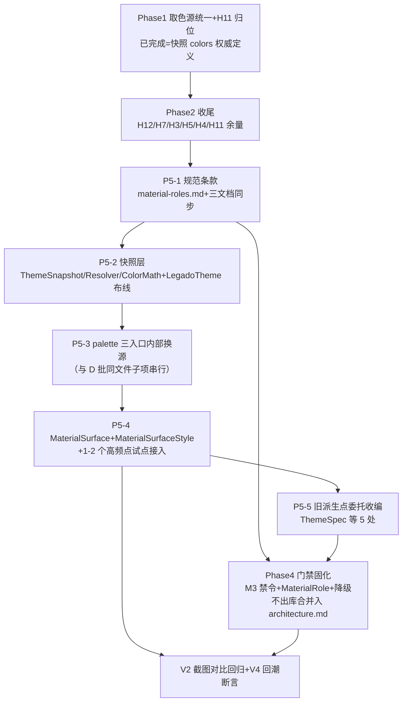

# P4-visual-patterns — NG 视觉体系三模式融入 ui-standards（P5 期实施级设计·第三轮函数级深化）

> 上游依据：总设计 [design.md](../design.md) AD-05（只借三模式不引组件）+ [evidence-pack.md](../evidence-pack.md) G 节
> 本文件性质：**P5 产出=规范条款+组件设计，非代码迁移**；经检查点审查前不实施。本版为第三轮深化：把三模式推进到**函数/代码级**（接口骨架可直接转写为实现），并基于 2026-08-30 源码实读做 2 处勘误（见 §13 AD-P4-7/AD-P4-8）
> 精读输入（本轮实读，行号以此为准）：
> - NG 根 `F:\myself\github\WeAgentChat\temp\legado_NG_src\legado_NG-main`（快照 3.26.082815）：`ui/design/theme/NgThemeResolver.kt`、`NgThemeSnapshot.kt`、`NgAppTheme.kt`、`ui/design/components/compose/NgVisualSurface.kt`
> - 本项目：`lib/theme/ThemeStore.kt`、`lib/theme/ThemeUiPalette.kt`、`lib/theme/UiCorner.kt`、`lib/theme/MaterialValueHelper.kt`、`ui/theme/LegadoTheme.kt`、`ui/widget/components/ThemeSpec.kt`、`ui/widget/components/GlassTopAppBar.kt`、`ui/widget/compose/AppSettingComponents.kt`、`ui/widget/compose/AppComposeDialogs.kt`、`help/config/TopBarConfig.kt`、`help/config/AppConfig.kt`、`base/BaseDialogFragment.kt`
> - 规范：`docs/project-flow/ui-standards/`（architecture/color/theme-architecture）、`docs/project-rules/frontend-ui-standards.md`、`global-thinking-checklist.md`、`docs/specs/ui-style-unify-deep-fix/`（README/design）

## 1 目标与非目标

**目标**：把 NG 视觉体系的三个架构模式本项目化，产出可审查、可执行的 ui-standards 新条款与组件接口设计：

1. 材质语义角色参数化（role→spec）→ 新增 `MaterialRole` 四角色 + 材质参数表条款（`material-roles.md`）
2. 单一材质调度点 + 优雅降级 → 新增 View/Compose 双栈统一入口 `MaterialSurface` / `MaterialSurfaceStyle`
3. ThemeResolver 不可变快照 → 主题解析层收口 `ThemeStore` 直读链路，生成不可变 `ThemeSnapshot`

**非目标（不做清单，继承总设计裁决）**：
- ❌ 液态玻璃/AGSL 效果：`NgLiquidGlassBackdrop`（GraphicsLayer 降饱和+RenderEffect 折射+AGSL+七通道色散）、`NgViewLiquidGlassRenderer` 全族不引入，性能代价高（总设计 §2.2.4）
- ❌ NG 组件代码搬运：`NgVisualSurface.kt` 及 ui/design 35 个 Compose/10 个 View 组件不搬，只吸收其架构模式
- ❌ 视觉体系切换开关：不引入 `NgVisualSystemStore`（TRANSPARENT_GLASS/LIQUID_GLASS 双体系、SP key `ngVisualSystem.v1`）式切换面；本项目单一材质体系无切换面（勘误佐证：本项目 `AppConfig.uiCornerEffectMode` 已退役为固定 `"solid"`，AppConfig.kt:2177-2181（@Deprecated 退役）——效果模式开关有先例且已被废弃，不复活）

## 2 NG 三模式源码机制（逐类逐函数解读）

> NG 路径前缀 `app/src/main/java/io/legado/app/`。

### 2.1 模式三：ThemeResolver 不可变快照

**A. `NgThemeResolver.kt`（484 行）——唯一解析入口**

| 函数/结构 | 位置 | 机制解读 |
|---|---|---|
| `NgLegacyThemeInput` | :36-44 | 旧状态显式建模：primary/accent/background/bottom/error 五个 `@ColorInt` + isDark + isEInk。解析层**不偷偷读偏好**，输入必须显式传入 |
| `resolve(context)` | :53-60 | 对外唯一入口：`if (AppConfig.isEInkMode) return resolveEInk()`（:54）——E-Ink 分支在入口内收，调用方零分支；否则取 `NgColorConfigStore.current` + `ThemeConfig.isDarkTheme` 再委托 |
| `resolveColorScheme` | :71-100 | 按 `colors.mode` 分派 PALETTE（materialkolor HCT 派生）:78-85 / MANUAL（手工四色）:87-91；尾部统一覆写 `onTopBar`（AUTO/LIGHT/DARK 三态 :94-98） |
| `resolve(input: NgLegacyThemeInput)` | :102-163 | **四色→语义推导核心**：opaque 归一（:104-107）→ `contentColorFor` 定前景（:108-110）→ `blend` 派生 primaryContainer（亮 0.16/暗 0.34，:111-115）、surfaceVariant（:116-120）、errorContainer（:122-126）→ 组装 31 槽 `NgColorScheme`（:128-161，含 topBarContainer/cardContainer=withAlpha 0.90/dialogContainer=0.96/drawerContainer=0.94/inputContainer/selectedContainer 7 业务槽） |
| `resolveEInk()` | :332-368 | 全黑白硬编码色板 + `snapshot(colors, isDark=false, isEInk=true)`（:367）——E-Ink 不是"过滤特效"而是**独立完整色板**，杜绝半灰残影 |
| `snapshot(colors,isDark,isEInk)` | :370-396 | 组装快照：E-Ink 时 effects 全禁（blurEnabled=false/各 alpha=1f/blurRadius=0，:378-387）；systemBars 内联推导 `darkStatusBarIcons = NgColorMath.isLight(colors.background)`（:392-394）——系统栏图标随快照，不另立通道 |
| `NgColorMath` object | :404-484 | 色彩数学隔离层：opaque/withAlpha/blend（逐通道线性插值 :416-425）/scaleChroma（HCT 色度缩放 :427-435）/contentColorFor（对比度选黑或白 :437-446）/isLight（Rec.709 亮度 :448）/contrastRatio（WCAG 公式 :450-454）/luminance（sRGB gamma 展开 :456-468）。**全项目唯一的色彩数学出处** |

**B. `NgThemeSnapshot.kt`（109 行）——不可变快照结构**

| 结构 | 位置 | 内容 |
|---|---|---|
| `NgThemeSnapshot` | :11-21 | isDark/isEInk + colors/shapes/spacing/typography/effects/motion/systemBars 九组 token 一次成型；KDoc 明确"View 与 Compose 组件不再分别推导主题语义" |
| `NgColorScheme` | :23-56 | M3 24 语义槽 + topBar/onTopBar/card/dialog/drawer/input/selected 7 业务槽，全部 `@ColorInt` 值类型 |
| `NgEffectTokens` | :89-97 | blurEnabled/containerAlpha=0.50/dialogAlpha=0.88/drawerAlpha=0.80/blurRadiusDp=18/cardElevationDp/overlayElevationDp——**特效随快照分发，不随组件散读** |
| 其余 tokens | :58-87/:99-109 | 形状/间距/排版/动效/系统栏，默认值即 spec |

**C. `NgAppTheme.kt`（220 行）——快照的 Compose 布线**

| 函数/结构 | 位置 | 机制解读 |
|---|---|---|
| `LocalNgThemeSnapshot` | :35-37 | `staticCompositionLocalOf` + 默认值直接 `error(...)`——快照外取用=崩溃，防静默降级 |
| `NgTheme` object | :43-83 | `@ReadOnlyComposable` getter 门面（snapshot/colors/effects/…）；`usesLiquidGlass`（:79-82）= 体系开关 && !isEInk 的**语义收口点** |
| `NgAppTheme(...)` | :86-127 | 组合根：`rememberNgThemeSnapshot` 一次解析（:92）→ SideEffect 应用 systemBars（:102-115）→ `CompositionLocalProvider` 下发（:116-119）→ MaterialTheme 由快照派生（:120-125，`toMaterialColorScheme` :178-204） |
| `rememberNgThemeSnapshot` | :130-149 | `remember(context, themeMode, isDark, colors, darkModeOverride)` 键控缓存；解析层被 remember 包裹保证同输入幂等 |

### 2.2 模式一：材质语义角色参数化（NgVisualSurface.kt 前半）

| 结构 | 位置 | 机制解读 |
|---|---|---|
| `NgMaterialRole` | :30-42 | 11 值语义角色（NAVIGATION/TOP_NAVIGATION/BOTTOM_NAVIGATION/OVERLAY/INTERACTIVE/CONTROL/ICON_ACTION/ACTION/CONTENT/SETTINGS/SOFT_SURFACE）——组件按**语义身份**而非具体组件选材质 |
| `NgLiquidGlassSpec` | :44-58 | 12 参数材质描述（blurRadius/refractionHeight/refractionAmount/surfaceAlphaScale/saturation/depthEffect/chromaticAberration/highlight*/accentAlphaScale/surfaceGlossAlphaScale/depthEdgeAlphaScale） |
| `NgLiquidGlassDefaults.spec(role)` | :60-145 | `when` 全覆盖穷举（无 else——**编译期保证新增角色必须配参数**）：每角色一组实测参数，如 BOTTOM_NAVIGATION :87-97（blur 10dp/surfaceAlpha 0.44/高光 0.65），CONTROL :115-128（surfaceAlpha 0.78 近实心） |

### 2.3 模式二：单一调度点 + 优雅降级（NgVisualSurface.kt 后半）

| 片段 | 位置 | 机制解读 |
|---|---|---|
| 契约 KDoc | :195-200 | "按语义角色选择渲染后端；调用方仍负责页面结构；无 backdrop 时可靠回退，**不伪造背景**"——三句即组件边界 |
| 主函数签名 | :201-215 | `NgVisualSurface(modifier, role, cornerRadius, shape, style, …)`——role 是必选参数，调用方强制声明语义 |
| 降级门 | :216 | `supportsBackdropEffect = Build.VERSION.SDK_INT >= Build.VERSION_CODES.S`——**API 级判断在组件内唯一一处** |
| 快照联动 | :217-219 | `NgTheme.visualSystem` + `NgTheme.snapshot.isEInk` 参与调度——体系开关与特效禁用均从快照/体系 CompositionLocal 读，不经参数 |
| 回退分支 | :222-237 | 三条件任一不满足（非液态体系/无 backdrop/不支持）→ `NgTransparentGlassSurface` 原样返回（:227-236） |
| 双后端分派 | :239-276 | `remember(role){spec}`（:239，role 变更才重算）→ style 按 spec 缩放 alpha（:240-253）→ Compose 后端 :254-264 / View 后端 :265-276 |

**借鉴判定**：模式三=全盘借鉴（职责边界+E-Ink 内收+色彩数学隔离+CompositionLocal 布线）；模式一=只借"语义角色→参数表"结构与穷举式 when，**不借** 12 参数（玻璃折射族参数整体属于液态玻璃非目标）；模式二=只借"降级门在组件内+无 backdrop 不伪造背景"哲学，**不借** backdrop 捕获/双后端 AndroidView 桥。

## 3 本项目现状与痛点

### 3.1 取色三轨并存（实测链路图）

```
主题设置 key（themeCardColor/themeMutedColor/cPrimary.../N 后缀夜键）
  │
  ├─ 轨① View 静态直读（游离链路）─────────────────────────────
  │    ThemeStore.backgroundColor()/primaryColor()/accentColor()… 静态 getter
  │    → 直读 SharedPreferences（ThemeStore.kt:205-213/:305-310/:231-240）
  │    → BaseDialogFragment.kt:85、gsyVideo 3 弹框、ThemeManageActivity 等 9 文件（§3.2）
  │    ⚠️ 不打 signature、不参与 ThemeSync 重组，靠 RECREATE/懒比对兜底
  │
  ├─ 轨② Compose palette 三入口（各自 remember 各自监听）────────
  │    ②a rememberThemeUiPalette（ThemeUiPalette.kt:118-147，自带双 SP 监听+signature）
  │    ②b rememberAppSettingPalette（AppSettingComponents.kt:126-192，内部再调 ②a+②c）
  │    ②c rememberAppDialogStyle（AppComposeDialogs.kt:119-159，读 AppConfig.dialogAlpha+
  │        isEInkMode+themeUiPalette.cardColor，明暗推导 onAccent/stroke）
  │
  └─ 轨③ M3 派生（兜底语义，已被禁令封堵页面级取色）────────────
       ThemeSpec.toM3Scheme()（ThemeSpec.kt:47-152，5 核心色→34 槽 lerp+对比度守卫）
       ← LegadoTheme.kt:91-104（remember 键=ThemeSync.version+5 色）
       ⚠️ surface=lerp(bg,neutral,4~10%) 偏移色——H9/H11 偏色根因（color.md §五）
```

### 3.2 View 侧 `ThemeStore` 直读清单（第三轮复审）

精确模式 `ThemeStore.(themeColors|backgroundColor|primaryColor)(` 全仓复审（2026-08-30）：**18 处 / 9 文件**；上轮登记 22 处为宽口径（含跨行调用 span 与扩展属性间接读），本表以精确行号为准：

| # | 文件:行 | 读点 | 语义 |
|---|---|---|---|
| 1 | `base/BaseDialogFragment.kt:85` | backgroundColor() | D-B 36 家族弹框背景联动（D1 迁移中） |
| 2-6 | `lib/theme/MaterialValueHelper.kt:64/73/98/107/132` | primaryColor/backgroundColor ×5 | 桥接扩展（`Context.primaryColor` 等），View 侧习惯入口 |
| 7 | `help/gsyVideo/SwitchVideoAdapter.kt:56` | backgroundColor() | 视频弹层 |
| 8-9 | `help/gsyVideo/ChoiceSpeedDialog.kt:70/172` | backgroundColor() ×2 | 视频弹框 |
| 10 | `help/gsyVideo/ChoiceEpisodeDialog.kt:66` | backgroundColor() | 视频弹框 |
| 11-14 | `ui/config/ThemeManageActivity.kt:528/542/1233/1241` | primaryColor/backgroundColor ×4 | 主题管理预览 |
| 15 | `ui/book/read/HighlightStyleDialog.kt:81` | backgroundColor() | 阅读高亮弹框 |
| 16-17 | `ui/theme/LegadoTheme.kt:83/85` | primaryColor/backgroundColor | M3 派生源（轨③输入，**合法**） |
| 18 | `ui/video/VideoSettingsPanel.kt:115` | backgroundColor() | 视频设置面板 |

扩域口径：若把 `accentColor/bottomBackground/textColorPrimary/textColorSecondary` 六 getter 全计入，为 **53 处/21 文件**，其中含主题基础设施类（StrokeTextView/AccentBgTextView/SmoothCheckBox/ThemeBottomNavigationView 等主题控件库与桥接层）——这类属"低层能力"合法直读（color.md §四定位），**不入收口清单**；收口对象=表中业务 UI 面读点。另注：`ThemeStore.themeColors` 当前全仓 0 处调用（上轮记载的该读点已不存在）。

### 3.3 派生逻辑重复三处证据（同一语义多处实现）

| 语义 | 实现点 | 重复问题 |
|---|---|---|
| A. 对比度定前景文字色 | ① `ThemeSpec.kt:194-195 contrastOn`（亮底黑/暗底白）② `AppSettingComponents.kt:153`（`isColorLight(accentArgb)`→onAccent）③ `AppComposeDialogs.kt:147`（同式 onAccent）④ `LegadoTheme.kt:89`（isLight 判向） | 同一"明暗→黑白"四实现，与 NG `NgColorMath.contentColorFor`（对比度选优，比二值更准）不一致 |
| B. 面明暗定描边/分隔 | ① `ThemeUiPalette.kt:229-236`（divider：面亮取 BLACK 10%/暗取 WHITE 16%）② `UiCorner.kt:79-83 effectStrokeColor`（亮度>0.5 取 BLACK alpha0.10） | 同语义两套系数，描边/分隔线在弹框与行卡片上可能不一致 |
| C. 容器 alpha 组合 | ① `UiCorner.kt:70-77 layoutAlpha()+surfaceColor()`（alpha=layoutAlpha，pressed+0.08）② `AppComposeDialogs.kt:123-137`（dialogAlpha，E-Ink 强制 1f，fieldAlpha=layoutAlpha+夜偏移）③ `TopBarConfig.kt:299 withOpacity(color,opacity)`（/100f） | alpha"取值+钳制+状态偏移"三处各写各的，同族组件参数漂移无门禁可判 |

### 3.4 材质参数散落证据（role 级聚合缺失）

现有偏好 key 全景（材质相关，全部既有）：`TopBarConfig.Config.tagBarAlpha:56 / wallpaperAlpha:64 / cornerScale:66`（顶栏管理，`STYLE_REGULAR` 时 tagBarAlpha 默认 0=TopBarConfig.kt:99）；`AppConfig.uiLayoutAlpha:2162-2169 / dialogAlpha:2171-2175 / themeCardBackgroundBlur（PreferKey.kt:361-362，ThemeConfig.kt:818 写入 0-250 等级）/ frostedGlassLevel:2147-2151（遗留，无消费）/ elevation:2138-2145（E-Ink 已内置清零）`；`UiCorner.scale/panelRadius/panelBorderAlpha:258-261/panelImageDrawable:150-168`。**问题**：同一"浮层面"的 alpha/blur/描边分散在 3+ 处 key、2 个读取对象、View/Compose 两种消费姿势，没有 role 级聚合点；`themeCardBackgroundBlur` 目前**只有写入与签名消费（ThemeUiPalette.kt:165），无任何渲染消费点**——是现成的"已接线未通电"key。

### 3.5 痛点结论

1. 派生逻辑三处重复（§3.3），无单一解析点——H9 类偏色的结构性温床；
2. 主题切换失效靠各入口独立 signature/监听（轨②）+ RECREATE/懒比对（轨①）双体系，状态不一致窗口存在；
3. View 侧 18 处业务直读（§3.2）游离在规范外，是偏色回潮残余通道；
4. 材质参数无 role 级聚合（§3.4），"同 role 跨组件材质一致"无法用门禁判定。

## 4 三模式本项目化设计（函数/代码级）

### 4.0 总原则

- **快照唯一解析点**：派生逻辑（对比度/明暗/alpha 组合）只允许存在于 `ThemeSnapshotResolver` + `ThemeColorMath`；palette 三入口降级为"快照视图层"。
- **材质不出库**：`SDK_INT`/E-Ink/blur 开关判断只允许出现在 `MaterialSurface`/`MaterialSurfaceStyle`/`ThemeEffectTokens` 解析期三处内部。
- **零新增偏好 key**：材质参数表只引用既有 key（§3.4 全景），`themeCardBackgroundBlur` 由 MaterialSurface 首次通电。

### 4.1 模式三：ThemeSnapshot + ThemeSnapshotResolver + ThemeColorMath

**接口骨架**（落地 `lib/theme/ThemeSnapshot.kt` / `lib/theme/ThemeSnapshotResolver.kt`）：

```kotlin
// lib/theme/ThemeSnapshot.kt
@Immutable
data class ThemeSnapshot(
    val isDark: Boolean,
    val isEInkMode: Boolean,              // AppConfig.isEInkMode（AppConfig.kt:73，themeMode=="3"）
    val colors: ThemeColorSnapshot,
    val effects: ThemeEffectTokens,
    val shapes: ThemeShapeTokens,
)

@Immutable
data class ThemeColorSnapshot(
    val page: Color,          // = Color(context.backgroundColor)，palette.settings.page 同源（H9 权威语义）
    val row: Color,           // = UiCorner.surfaceColor(themeCardColorOrDefault)，palette.row 同源
    val rowPressed: Color,    // = surfaceColor(rowBase, pressed=true)（AppSettingComponents.kt:140 同源）
    val topBar: Color,        // = Color(context.primaryColor)，GlassTopAppBar 默认底同源（GlassTopAppBar.kt:89）
    val bottomBar: Color,     // = custom muted/card 判定 ?: bottomBackground（AppSettingComponents.kt:142-146 同源）
    val overlay: Color,       // = AppDialogStyle.surface 同源：custom card ?: bottomBackground + dialogAlpha
    val input: Color,         // = AppDialogStyle.fieldSurface 同源（blend 5%/10% 保留原系数）
    val divider: Color,       // = themeDividerColorOrDefault（系数原样收编，§3.3-B 单点化）
    val primary: Color, val accent: Color,
    val textPrimary: Color, val textSecondary: Color, val disabledText: Color,
    val onAccent: Color,      // = ThemeColorMath.contentColorFor(accent)（§3.3-A 单点化）
    val border: Color?,       // = UiCorner.panelBorderColor(context)
)

@Immutable
data class ThemeEffectTokens(
    val blurLevel: Int,           // ThemeRuntimeKeys.themeCardBackgroundBlur()（0-250）
    val blurEnabled: Boolean,     // blurLevel>0 && SDK_INT>=31 && !isEInkMode —— 解析期算死，消费侧零分支
    val blurRadiusDp: Int,        // blurLevel→dp 唯一换算点（等级×10→0-250，映射 0-24dp，见 §4.3）
    val containerAlpha: Float,    // = UiCorner.layoutAlpha()（AppConfig.uiLayoutAlpha/100）
    val dialogAlpha: Float,       // = if (isEInkMode) 1f else dialogAlpha/100f（AppComposeDialogs.kt:123-127 语义收编）
    val panelBorderAlpha: Float,  // = UiCorner.panelBorderAlpha(context)/100f
)

@Immutable
data class ThemeShapeTokens(
    val panelRadiusPx: Float,     // = UiCorner.panelRadius(context)
    val actionRadiusPx: Float,    // = composeActionRadius()（AppManagementPalette 同源）
)
```

```kotlin
// lib/theme/ThemeSnapshotResolver.kt
/**
 * 只读旧状态→解析为稳定语义；不读写偏好、不修复旧状态、不决定主题选择。
 * （职责边界对齐 NgThemeResolver.kt:46-50 原文）
 */
object ThemeSnapshotResolver {

    /** signature 短路：未变化直接返回 current，避免全量重推导 */
    fun resolveIfChanged(context: Context, current: ThemeSnapshot?): ThemeSnapshot {
        val sig = context.themeUiSignature()          // 复用现有签名，算法零改动（ThemeUiPalette.kt:149-182）
        if (current != null && current.signature == sig) return current
        return resolve(context, sig)
    }

    fun resolve(context: Context, signature: String = context.themeUiSignature()): ThemeSnapshot

    /** View 侧无 remember 场景的一次性解析入口（MaterialSurfaceStyle 专用） */
    @JvmStatic fun resolveForView(context: Context): ThemeSnapshot
}
```

```kotlin
// lib/theme/ThemeColorMath.kt（吸收 NgColorMath 模式：纯函数 object，可 JVM 单测）
object ThemeColorMath {
    fun opaque(argb: Int): Int
    fun withAlpha(argb: Int, alpha: Float): Int
    fun blend(start: Int, end: Int, ratio: Float): Int          // 逐通道线性插值（NgColorMath.kt:416-425 同式）
    fun contentColorFor(background: Int): Int                    // 对比度选优（:437-446 同式，优于现二值 contrastOn）
    fun isLight(argb: Int): Boolean
    fun contrastRatio(a: Int, b: Int): Double
    // 收编：ThemeSpec.contrastOn(:194) / AppSettingComponents onAccent(:153) / AppDialogs onAccent(:147)
    //      divider 明暗推导（ThemeUiPalette.kt:234-235）/ effectStrokeColor（UiCorner.kt:79-83）
    // 收编=既有调用点改为委托本 object（系数不变），实现 §3.3 三处重复归一
}
```

**ThemeSnapshot 附带 `signature: String` 字段**（上表省略），取值=传入的 `themeUiSignature()`，供 `resolveIfChanged` 与 palette 三入口的 `themeSignature` 字段复用。

**布局步骤（LegadoTheme.kt 修改，无循环依赖论证）**：

```kotlin
// ui/theme/LegadoTheme.kt（修改段）
val LocalThemeSnapshot = staticCompositionLocalOf<ThemeSnapshot> {
    error("ThemeSnapshot is not available outside LegadoTheme")   // 对齐 NgAppTheme.kt:35-37 防静默降级
}

@Composable
@ReadOnlyComposable
fun currentThemeSnapshot(): ThemeSnapshot = LocalThemeSnapshot.current

@Composable
fun LegadoTheme(content: @Composable () -> Unit) {
    val context = LocalContext.current
    // ① 复用现有监听+签名机制（不新增第二套 SP 监听）
    val paletteSignature = rememberThemeUiPalette().signature      // ThemeUiPalette.kt:118-147 原样
    // ② 快照解析：签名/主题令牌变化才重算（幂等）
    val snapshot = remember(context, paletteSignature, ThemeSync.version) {
        ThemeSnapshotResolver.resolve(context, paletteSignature)
    }
    // ③ M3 派生轨保持现状（ThemeSpec.toM3Scheme 输入改从 snapshot.colors 取，语义等价）
    CompositionLocalProvider(LocalThemeSnapshot provides snapshot) {
        MaterialTheme(colorScheme = /* 现逻辑 */, typography = LegadoTypography) { content() }
    }
}
```

无循环论证：`rememberThemeUiPalette` 不读 `LocalThemeSnapshot`（其签名/监听先于快照存在），palette 三入口换源后才读快照——依赖方向单向。

**palette 三入口内部换源（公共 API 不变）**：

| 入口 | 换源方式 | 等价性约束 |
|---|---|---|
| `rememberThemeUiPalette()` | 保持原样（作为签名/监听 owner），仅其 6 面字段实现可改为从快照取 | 字段语义=现直读语义，禁引入 M3 lerp |
| `rememberAppSettingPalette()` | `page/row/border/onAccent/panelRadiusPx` 等改读 `currentThemeSnapshot().colors`；`remember` 键收窄为 snapshot | 与 AppSettingComponents.kt:126-192 逐字段等价（H9 归位成果零回退） |
| `rememberAppDialogStyle()` | `surface/fieldSurface/stroke/dialogAlpha/E-Ink 分支` 改读快照 overlay/input/effects | 与 AppComposeDialogs.kt:119-159 逐字段等价 |

### 4.2 模式一：MaterialRole + MaterialSpec + MaterialDefaults

**接口骨架**（落地 `lib/theme/MaterialTokens.kt`）：

```kotlin
// lib/theme/MaterialTokens.kt
enum class MaterialRole {
    TOP_BAR,      // 顶栏族：MainTopBarView / GlassTopAppBar / AppManagementTopBar
    BOTTOM_BAR,   // 底栏族：底部导航 PillNavigationBar / 多选底栏 / Tab 底
    ITEM_CARD,    // 列表项卡片族：AppManagementCard / SettingsCard / appSettingRowDecoration
    OVERLAY,      // 浮层族：AppDialogFrame / ModernActionPopup / AppDropdownMenu / BottomSheet
}

/** 透明度来源声明（唯一授权表——防双源，审查可判定） */
enum class MaterialAlphaSource {
    UI_LAYOUT_ALPHA,    // AppConfig.uiLayoutAlpha（AppConfig.kt:2162；经 UiCorner.layoutAlpha() 消费）
    DIALOG_ALPHA,       // AppConfig.dialogAlpha（AppConfig.kt:2171；E-Ink 强制 1f）
    TOP_BAR_TAG_ALPHA,  // TopBarConfig.Config.tagBarAlpha(:56)/wallpaperAlpha(:64)（顶栏管理唯一权威）
    OPAQUE,             // 直色面（row 直色已含 layoutAlpha 应用，不再叠加）
}

/** 角色级材质策略（静态 spec；穷举维护于 MaterialDefaults，仿 NgLiquidGlassDefaults.spec 无 else） */
@Immutable
data class MaterialSpec(
    val alphaSource: MaterialAlphaSource,
    val blurAllowed: Boolean,        // 该角色是否允许模糊（TOP_BAR/OVERLAY=true）
    val blurRadiusDp: Int,           // blurAllowed 且 effects.blurEnabled 时生效
    val strokeEnabled: Boolean,
    val strokeWidthDp: Float,
)

/** 运行时解析结果：色面+alpha+blur+描边一次成型（消费侧零再推导） */
@Immutable
data class ResolvedMaterial(
    val containerColor: Color,
    val blurRadiusDp: Int,           // 0=不模糊
    val strokeWidthPx: Float,        // 0=无描边
    val strokeColor: Color?,
)

object MaterialDefaults {
    /** 穷举四角色（编译期保证新增角色必须配 spec）；解析需快照提供 effects/colors */
    fun resolve(role: MaterialRole, snapshot: ThemeSnapshot): ResolvedMaterial
}
```

**材质参数表（规范条款载体；初值=现有基线实测归集，全部既有 key）**：

| Role | alpha 来源（AlphaSource→key） | 色面（快照槽位） | blur | 描边 | 高度 |
|---|---|---|---|---|---|
| TOP_BAR | `TOP_BAR_TAG_ALPHA`：`TopBarConfig.Config.tagBarAlpha`(:56) 壁纸层 `wallpaperAlpha`(:64)；`STYLE_REGULAR` 默认 0(:99) | `colors.topBar`（=primaryColor，GlassTopAppBar.kt:89 同源） | `themeCardBackgroundBlur>0` 且 API≥31 → 18dp | 无 | **不入 spec**：56dp(Main)/48dp(管理) 由组件族基线持有 |
| BOTTOM_BAR | `UI_LAYOUT_ALPHA`：`AppConfig.uiLayoutAlpha`(:2162) | `colors.bottomBar` | 0 | 无 | 由组件族基线持有 |
| ITEM_CARD | `OPAQUE`：row 直色（layoutAlpha 已在 `UiCorner.surfaceColor`:74-77 应用，禁二次叠加） | `colors.row / rowPressed` | 0 | 1dp × `colors.border`（`panelBorderAlpha`:258 已折算） | 自适应 |
| OVERLAY | `DIALOG_ALPHA`：`AppConfig.dialogAlpha`(:2171)；E-Ink→1f（AppComposeDialogs.kt:123-127 语义） | `colors.overlay` | `themeCardBackgroundBlur>0` 且 API≥31 → 18dp | 1dp × `colors.border` | 关联 `shapes.panelRadiusPx`，形态由弹框族基线持有 |

**ui-standards 新条款草案**（落地为 `docs/project-flow/ui-standards/material-roles.md`，条文式可直接并入）：

1. 新增/改造 UI 面必须声明 `MaterialRole`；材质参数（透明度/blur/描边）只允许由 `MaterialDefaults.resolve(role, snapshot)` 提供，禁止组件内自定 alpha/blur/描边组合（判定：出现 `withAlpha|graphicsLayer.*alpha|\.blur\(` 且来源非 ResolvedMaterial → 拒）。
2. 同 role 跨组件、跨 View/Compose 双栈材质必须一致；参数表调整只允许改 `MaterialDefaults` 与 `material-roles.md` 两处，并同步 updateLog。
3. **高度/形态是结构 token 不是材质 token**：高度仍由四组件族基线（architecture.md §三）持有，禁止经 spec 传递，避免双源。
4. `MaterialSurface` 是材质承载层，**不替代四组件族形态选择**——门禁 checklist 1-3（选哪个基线组件）仍先行，第 5 条取色检查扩展为"取色+材质"双检查。
5. 透明度来源唯一授权表（`MaterialAlphaSource`）：每个 role 的 alpha 只能来自表中声明的 key；`frostedGlassLevel`（遗留无消费）与已退役 `uiCornerEffectMode` 禁止接入新链路。
6. blur 双闸门：`effects.blurEnabled`（= `themeCardBackgroundBlur>0` 且 API≥31 且非 E-Ink，解析期算死）；业务代码出现 `Build.VERSION.SDK_INT` 参与材质分支 → 审查拒绝。

**R 编号条款草案（V3b 补全，落地 material-roles.md 时按此编号并入）**：
- **R4**：各 role 的高度/形态权威源=四组件族基线组件定义（ui-standards §三），禁止经材质 spec 传递（承接条款 3，双源禁令同源表述）。
- **R5**：底栏无独立组件族基线，形态由 PillNavigationBar 等持有；role 仅约束材质（呼应 AD-P4-2 BOTTOM_BAR 组件族体系外补充角色）。

### 4.3 模式二：MaterialSurface（Compose）+ MaterialSurfaceStyle（View）

**Compose 唯一入口**（落地 `ui/widget/components/MaterialSurface.kt`）：

```kotlin
@Composable
fun MaterialSurface(
    modifier: Modifier = Modifier,
    role: MaterialRole,
    shape: Shape = RectangleShape,
    containerColor: Color? = null,   // 覆盖仅限登记豁免场景（如媒体画布），缺省由快照按 role 解析
    content: @Composable BoxScope.() -> Unit,
) {
    val snapshot = currentThemeSnapshot()
    // 对齐 NgVisualSurface.kt:239：role/snapshot 变更才重算
    val material = remember(role, snapshot) {
        containerColor?.let { ResolvedMaterial(it, 0, 0f, null) }
            ?: MaterialDefaults.resolve(role, snapshot)
    }
    // 内部分派（对调用方不透明）：
    // ① 无 blur（blurRadiusDp==0）→ 纯 alpha 色面（Box + drawBehind 涂 ResolvedMaterial.containerColor）
    // ② blur 且有面板背景图层（panelImageDrawable 存在）→ 对背景图层施加 RenderEffect
    //    （API≥31 已在 effects.blurEnabled 保证；等级→BlurEffect radius=blurLevel/10f）
    // ③ blur 但无背景图层 → 降级为纯 alpha 色面，不伪造模糊（对齐 NgVisualSurface.kt:198-199
    //    "无 backdrop 时可靠回退，不伪造背景"契约）
    Box(modifier.materialBackground(material, shape)) { content() }
}
```

**blur V1 语义收敛（本设计裁决，见 §13 AD-P4-6）**：`themeCardBackgroundBlur`（0-250 等级，ThemeConfig.kt:818 写入）V1 只作用于**面板背景图层**（`UiCorner.panelImageDrawable` 的 Bitmap/Drawable 源，UiCorner.kt:150-168）——有明确位图源、可用 RenderEffect/预模糊采样低成本实现；无背景图时自动降级纯 alpha 面。不引入 backdrop 屏幕捕获（=液态玻璃非目标）。

**View 侧适配器**（落地 `lib/theme/MaterialSurfaceStyle.kt`；委托 UiCorner 原语，零重复实现）：

```kotlin
// lib/theme/MaterialSurfaceStyle.kt
object MaterialSurfaceStyle {
    /** 一次解析：内部 ThemeSnapshotResolver.resolveForView(context) + MaterialDefaults.resolve */
    @JvmStatic fun resolve(context: Context, role: MaterialRole): ResolvedMaterial

    /** 组装背景 Drawable：委托 UiCorner.panelRounded/rounded（UiCorner.kt:93-122 现有能力），
     *  仅把"色/alpha/描边"来源改为 ResolvedMaterial；供 MainTopBarView/BaseDialogFragment 迁移期接入 */
    @JvmStatic fun background(context: Context, role: MaterialRole, radiusPx: Float): Drawable

    /** 轻量接入：直接 view.background = background(...)（迁移期样板） */
    @JvmStatic fun apply(view: View, role: MaterialRole, radiusPx: Float)
}
```

**降级链规范（条款 6 补充）**：SDK 分支、E-Ink 判定、blur 开关全部封装在 `ThemeEffectTokens`（解析期）与 `MaterialSurface`/`MaterialSurfaceStyle`（消费期）内部；对齐 NG `NgVisualSurface.kt:216` "API 级判断不出库"证据模式。

### 4.4 落地文件位置汇总

| 产物 | 位置 | 类型 |
|---|---|---|
| MaterialRole/MaterialAlphaSource/MaterialSpec/ResolvedMaterial/MaterialDefaults | `lib/theme/MaterialTokens.kt` | 新增 |
| ThemeSnapshot/ThemeColorSnapshot/ThemeEffectTokens/ThemeShapeTokens | `lib/theme/ThemeSnapshot.kt` | 新增 |
| ThemeSnapshotResolver + ThemeColorMath | `lib/theme/ThemeSnapshotResolver.kt`、`lib/theme/ThemeColorMath.kt` | 新增 |
| MaterialSurface（Compose 调度） | `ui/widget/components/MaterialSurface.kt` | 新增 |
| MaterialSurfaceStyle（View 适配） | `lib/theme/MaterialSurfaceStyle.kt` | 新增 |
| 快照布线 LocalThemeSnapshot/currentThemeSnapshot | `ui/theme/LegadoTheme.kt` | 修改 |
| palette 三入口内部换源 | `AppSettingComponents.kt`、`AppComposeDialogs.kt`、`ThemeUiPalette.kt`（仅消费路径） | 修改（API 不变） |
| 对比度/明暗/alpha 旧实现点委托收编 | `ThemeSpec.kt:194`、`AppSettingComponents.kt:153`、`AppComposeDialogs.kt:123-147`、`ThemeUiPalette.kt:229-236`、`UiCorner.kt:79-83` | 修改（等价委托） |

## 5 与 ui-style-unify-deep-fix 的衔接

**实施窗口**（README.md:43-44 实况：Phase1 全量 + Phase2 部分（H6/H9 根背景/H11 5 页/H13/H14）已完成；剩 H12/H7/H3/H5/H4/TxtTocRule + D 批）：

1. **前置（已完成）**：Phase1 取色源统一 + H11 归位——`palette.settings.page/row` 直色语义已确立，即快照 `colors.page/row` 字段的权威定义，等价收编。
2. **本设计实施窗口**：Phase2 收尾（H12/H7/H3/H5/H4/H11 余量）之后、Phase4 门禁固化之前。Phase2 在改文件（Debug 7 页/漫画菜单/AiChat/TitleBar 系）不触碰 `lib/theme/ThemeSnapshot*`/`MaterialTokens*` 新文件，无冲突。
3. **本设计落地同时**：Phase4 门禁条款由"仅 M3 surface 禁令"扩展为"M3 surface 禁令 + MaterialRole 声明 + MaterialSurface 取材质 + 降级不出库"一次合并进 architecture.md §四 checklist，避免两处门禁文案漂移。
4. **S 批（S1-S6）**：改动集中 `RssFragment.kt`，与本设计零文件交集，可并行。

**冲突文件与串行点**：
- `AppSettingComponents.kt`/`AppComposeDialogs.kt` 内部换源 ↔ Phase3 D1/D3 弹框迁移同文件 → **文件级串行**：palette 换源在 D 批当前迁移子项合入后进行（并发规范：同文件 Edit 串行化铁律）。
- `ThemeUiPalette.kt` 内部触碰 `themeUiSignature()` → 签名算法保持不变（快照失效直接复用 ThemeUiPalette.kt:149-182 四因子 `mode|night|eInk|themeStore`），仅消费路径切换。
- `architecture.md`/`color.md` 双 spec 同改 → 与 Phase4 合并为一次文档提交。

**先后依赖**：快照层 colors 字段权威定义依赖 H9/H11 已归位的直读语义（已满足）；Phase4 门禁依赖本设计 `MaterialRole` 条款先行合入（本设计先行）。

## 6 文件变更映射表

| # | 文件 | 变更类型 | 内容 |
|---|---|---|---|
| 1 | `docs/project-flow/ui-standards/material-roles.md` | 新增 | §4.2 条款全文 + 材质参数表 + AlphaSource 授权表 |
| 2 | `docs/project-flow/ui-standards/architecture.md` | 修改 | §二取色链路图加快照层（轨②③之上）；§四门禁第 5 条扩展"取色+材质"双检查+降级不出库；§五文档索引表加 material-roles.md 行（V3b-1.3 遗漏补正） |
| 3 | `docs/project-flow/ui-standards/color.md` | 修改 | §四补"快照为唯一解析点"行；§五补 MaterialSurface 正例与豁免登记格式 |
| 4 | `docs/project-flow/ui-standards/components.md` | 修改 | 登记 MaterialSurface/MaterialTokens/ThemeSnapshot/ThemeColorMath（基线状态） |
| 5 | `docs/project-flow/ui-standards/how-to.md` | 修改 | MaterialSurface/MaterialSurfaceStyle 用法小节 |
| 6 | `lib/theme/MaterialTokens.kt` | 新增 | MaterialRole/MaterialAlphaSource/MaterialSpec/ResolvedMaterial/MaterialDefaults |
| 7 | `lib/theme/ThemeSnapshot.kt` | 新增 | ThemeSnapshot + 三组 token（含 signature 字段） |
| 8 | `lib/theme/ThemeSnapshotResolver.kt` + `lib/theme/ThemeColorMath.kt` | 新增 | resolve/resolveIfChanged/resolveForView；色彩数学纯函数 |
| 9 | `ui/widget/components/MaterialSurface.kt` | 新增 | Compose 调度组件（含降级链/blur V1） |
| 10 | `lib/theme/MaterialSurfaceStyle.kt` | 新增 | View 侧适配器（委托 UiCorner） |
| 11 | `ui/theme/LegadoTheme.kt` | 修改 | LocalThemeSnapshot/currentThemeSnapshot + resolve 布线 |
| 12 | `AppSettingComponents.kt` / `AppComposeDialogs.kt` / `ThemeUiPalette.kt` | 修改 | 内部换源读快照，公共 API/视觉零变化 |
| 13 | `ThemeSpec.kt` 等 5 处旧派生点 | 修改 | 对比度/明暗/alpha 推导改委托 ThemeColorMath（系数不变） |
| 14 | `app/src/main/assets/updateLog.md` | 修改 | 面向用户语言（主题一致性加固；编译前按版本交付规范更新） |

## 7 边界条件（≥10 条）

| # | 边界 | 处理 |
|---|---|---|
| B1 | **E-Ink 模式**（themeMode=="3"，AppConfig.kt:73） | 快照 effects 全禁（blurEnabled=false、dialogAlpha=1f、containerAlpha=1f）；对齐 NG resolveEInk 独立色板思路，但本项目沿用现色板+特效清零（AppConfig.elevation:2138-2145 已有同款先例），不做黑白硬色板（视觉回退风险大） |
| B2 | **夜间模式 N 后缀成对键** | 快照解析统一经 `ThemeRuntimeKeys` 路由（theme-architecture.md 红线 6），禁止手写 `*N` 字符串；signature 已含 night 因子 |
| B3 | **主题切换时序** | 双事件（RECREATE+ThemeSync.bump）是唯一刷新通道（theme-architecture.md 红线 3/4）；快照重组键=signature+ThemeSync.version，禁自造第三通道；豁免页（recreateOnThemeChange=false）必须已有 ThemeSync 订阅兜底（红线 5），快照不替代该兜底 |
| B4 | **Compose 重组/强跳过** | ThemeSnapshot 及子 token 全部 `@Immutable` 值类型（稳定类，规避强跳过引用比较陷阱，frontend-ui-standards §4 红线 5）；`remember(role, snapshot)` 键控；禁止组合体内回写快照 |
| B5 | **View-Compose 混用** | View 侧无 CompositionLocal → `MaterialSurfaceStyle.resolveForView` 一次性解析（valuesChanged 时间戳懒比对由调用方既有 onResume 机制承担）；`AndroidView` 内 Compose 面与 View 面同 role 材质一致由参数表保证 |
| B6 | **覆盖安装** | 零 DB/SP schema 变更（全部既有 key）、零新偏好项 → 覆盖安装天然兼容；无 Room migration |
| B7 | **旧主题包导入** | ThemePackageManager.apply → ThemeConfig.applyTheme 单点 → VALUES_CHANGED 令牌 → signature 变化 → 快照重算；解析层只读不修复旧状态（对齐 NgThemeResolver.kt:47-49 职责） |
| B8 | **API<31 降级** | `effects.blurEnabled` 解析期即 false（blurLevel>0 但 SDK 不满足）→ MaterialSurface 只涂 alpha 面；blur 等级 key 保留（用户升级系统后自动生效） |
| B9 | **快照失效丢失** | signature 计算依赖 SP 读（ThemeUiPalette.kt:149-182），若未来加入非 SP 因子必须同步加入 signature（登记为 resolver 维护规则）；resolveIfChanged 短路以 signature 字符串全等为准，禁止用对象引用判断 |
| B10 | **多窗口/多上下文** | 解析一律用调用点 `LocalContext`/传入 context，禁 `appCtx` 直取（AppConfig 单例读除外——其内部即 appCtx，现状保留）；UiCorner.panelBitmap 全局缓存（UiCorner.kt:33-34）为既有单例，快照不复制位图只引用 Drawable |
| B11 | **面板背景图文件变更/删除** | panelBitmapKey 含 `path:length:lastModified`（UiCorner.kt:242）自动失效；快照不缓存 Drawable 实例，只缓存色值/等级，背景图由 MaterialSurface 每次组合经 UiCorner 现取 |
| B12 | **blur 开关中途切换**（themeCardBackgroundBlur 0↔非 0） | key 已在 signature（ThemeUiPalette.kt:165）→ 监听触发重组 → resolveIfChanged 重算 → MaterialSurface remember(role, snapshot) 失效重建 |
| B13 | **dialogAlpha=0 极端值** | coerceIn(0,100) 保底（AppConfig.kt:2172）；文字/描边色不受 alpha 影响（ResolvedMaterial 只作用于 containerColor），全透明面仍有前景可读性 |

## 8 规范符合性核查表

| 规范条款 | 本设计对应 | 符合性 |
|---|---|---|
| architecture.md 铁律 1（禁硬编码色） | 快照 colors 全部来自既有 key/推导，零新增色值 | ✅ |
| architecture.md 铁律 2（取色唯一基线） | 快照 colors.page/row 语义=palette.settings.page/row 同一定义；M3 lerp 禁令不松动 | ✅ |
| architecture.md 铁律 3（禁自造组件形态） | 条款 4 明文 MaterialSurface=材质承载层非形态基线，门禁 1-3 先行；§9 给出两问互不替代的区分标准 | ✅（R1 缓解） |
| color.md §四（主取色链） | palette 三入口保持第一优先入口地位，仅内部换源；ThemeStore getter 保留低层能力定位 | ✅ |
| color.md §五（M3 派生禁令） | 快照不引入任何 M3 lerp；toM3Scheme 保持兜底语义轨 | ✅ |
| theme-architecture.md 红线 1-7 | B2（键路由）/B3（双事件）/§4.1（禁自建刷新）/palette 不绕 LegadoTheme/豁免页兜底不变 | ✅ |
| frontend-ui-standards §1（Token） | shapes token=UiCorner/AppShapes 现值收编；圆角零新魔数 | ✅ |
| frontend-ui-standards §4 红线 5（强跳过） | B4 @Immutable 值类型 + remember 键控 | ✅ |
| compose-ui-engineering（组件契约） | MaterialSurface=结构+槽位（modifier/slot 齐备）；role 必选参数=语义约束保留 primitive 风格；无多余 slots | ✅ |
| global-thinking-checklist 6 维 | 前端入口=双栈/后端接口=零/DB=零/覆盖安装=B6/场景=四族全覆盖/回填=signature 维护规则 | ✅ |
| AGENTS.md 交付门禁 | updateLog（#14）/L2 真机（§9 V2）/测试包 io.legado.miss.app.debug/构建后清 daemon | ✅ |

## 9 验证方案

**V1 规范可判定性审查清单（Grep 门禁，落地为 Phase4 条款）**：
- `MaterialTheme\.colorScheme\.(surface|surfaceVariant)` 页面/卡片级新增 → 拒（既有，保留）
- `Build\.VERSION\.SDK_INT` 出现于 UI 组件且参与材质/背景分支 → 拒（降级不出库）
- `withAlpha|graphicsLayer.*alpha|\.blur\(` 出现于四族组件内且来源非 ResolvedMaterial → 拒（材质参数外流）
- 新增 Compose UI 面未声明 `role = MaterialRole.*` → 拒
- 区分标准：形态审查看"是否四族基线组件"（checklist 1-3），材质审查看"role 声明+参数出自 spec"（material-roles.md）——两问互不替代

**V2 快照层等价性 L2 截图对比**（`ai_tests\venv\Scripts\python.exe` + `ai_tests/scripts/`，禁入 `temp/`；测试包 `io.legado.miss.app.debug`）：
- 场景×4：主题设置页 / 书源管理页（AppManagementCard）/ 确认弹框（AppDialogFrame）/ 三点菜单（ModernActionPopup）
- 主题×2：日间+夜间；另加"自定义背景色+卡片色 key"一轮（对齐 H9 触发条件）
- 判定：palette 换源提交前后同场景像素 diff=0（等价替换铁证）；切换 themeMode/背景色 key 后截图随动（快照失效正确性）
- 降级链：API<31 模拟器跑一轮 → blur 关闭仅剩 alpha 容器（不出库验证）；E-Ink 模式一轮 → 特效全禁

**V3 解析层单测（必做）**：`ThemeColorMath` 纯函数 JVM 单测（blend/contentColorFor/contrastRatio 边界）；`resolveIfChanged` signature 短路幂等断言。（V4b-F11：ThemeColorMath 收编 4 处既有对比度/明暗实现，需等价性断言兜底，禁止降级为可选）

**V4 回潮回归断言**：ai_tests F-UI-THEME 增加"同 role 材质同源"断言——抽 2 个同 role 组件（如 SettingsCard vs AppManagementCard 均 ITEM_CARD）比对 ResolvedMaterial 解析值相等。

**V5 交付门禁缺项补全（V4b 补正）**：实施批次收尾除上述技术验证外必检两项——① Grep `android\.util\.Log\.(d|e)` 确认无残留调试日志（logging-during-refactoring.md 门禁）；② 触发过 Gradle 构建（gradlew/IDE Run）后执行 `stop-daemons.bat` 清场（纯文档/无构建批次跳过）。

## 10 实施顺序依赖图



串行点：E 与 Phase3 D1/D3 同文件（AppSettingComponents/AppComposeDialogs）Edit 串行化；其余 P5 内部步骤按图序。

## 11 Open Questions

1. `themeCardBackgroundBlur` 等级→dp 映射斜率（0-250 → 0-24dp 线性）初值待真机校准；是否暴露为"界面设置-背景模糊"既有滑杆的原值直用，实施时定。
2. ✅【已关闭 2026-08-30】blend 系数归并命名：**采用 `FIELD_SURFACE_BLEND_DARK = 0.10f` / `FIELD_SURFACE_BLEND_LIGHT = 0.05f`**，归并至 ThemeColorMath object 常量。证据：naming_rules.md §常量命名 :52-55 明确"新增常量优先使用 UPPER_SNAKE_CASE"；两常量为标量系数（非位标志组），无需 camelCase 豁免与 `@Suppress("ConstPropertyName")`。符合规范，无设计变更。
3. ✅【已关闭 2026-08-30】View 侧 18 处直读收敛节奏：**不设独立批次，四路分流**（对照 ui-style-unify-deep-fix/tasks.md §2.3 Phase3 批次实况）：① `BaseDialogFragment.kt:85`（#1）随 **D1 尾批自然消亡**——该基类服务 D-B 36 家族（tasks.md 2.3.1），D1 全清后删基类直读链路，D1 未完结前不提前动；② #7-10+#15 共 **5 处弹框**（gsyVideo SwitchVideoAdapter/ChoiceSpeedDialog/ChoiceEpisodeDialog + HighlightStyleDialog）本就是 D4 批清单成员（tasks.md 2.3.5 已列），随本设计 MaterialSurfaceStyle(View) 试点批顺路收口（净业务读点 7 处/6 文件含 #18 VideoSettingsPanel）；③ #2-6 `MaterialValueHelper` ×5 桥接层**内部换 Resolver 实现**（1 处改动 5 点生效，零 API 变化）；④ #11-14 ThemeManageActivity ×4 属主题编辑器实时读编辑值语义（收口到快照反而错误）+ #16-17 LegadoTheme 已标合法（§3.2）→ 共 6 处**豁免登记**。裁决依据：AD-P4-10"不强制一次性清零"原则 + 18 处中仅约 1/3 落在 Phase3 弹框批次同文件，独立批次收益低于顺路收敛。无设计主体变更（§12 工作量不变，试点文件清单由 1-2 个扩为 6 个）。
4. `ResolvedMaterial` 是否需要导出 `contentColor: Color`（容器上前景色），供 BottomBar 族使用——若四族组件现取文字色路径已够用则不加（避免过度设计，初判不加，试点期复核）。
5. material-roles.md 与 spacing-corner-typography.md 的 shapes token 关系（快照 shapes 是否长期保留 actionRadiusPx）——试点后按实际消费决定去留。

## 12 工作量

| 项 | 估算 |
|---|---|
| 规范条款（material-roles.md + 三文档同步 + how-to） | 0.5 人日 |
| MaterialTokens + ThemeSnapshot + Resolver + ThemeColorMath | 1 人日 |
| MaterialSurface（Compose，含降级链/blur V1） | 1 人日 |
| MaterialSurfaceStyle（View）+ 高频点试点（注：OQ-3 关闭后试点面 1-2→6 文件，试点项按 6 文件复核，预估 +0.5~1 人日） | 0.5-1 人日 |
| palette 三入口换源 + 5 处旧派生点收编 + 编译回归 | 1-1.5 人日 |
| V2 截图对比 + V4 回潮断言回归 | 0.5 人日 |
| **合计** | **4.5-5.5 人日**（不含 Phase4 门禁合并公共成本） |

## 13 设计决策记录

| # | 决策 | Context / Tradeoff |
|---|---|---|
| AD-P4-1 | **只借模式不搬代码**（继承总设计 AD-05） | NG ui/design 是完整设计系统且液态玻璃成本自证；吸收 role→spec/调度点/快照三模式为规范+组件设计。Tradeoff：无玻璃视觉效果短期交付（接受） |
| AD-P4-2 | **MaterialRole 收敛 4 角色，高度不入 spec** | NG 11 角色对应其组件粒度；本项目四大组件族是既定基线，角色映射精确表述：TOP_BAR→顶栏族（1:1）、ITEM_CARD→卡片列表族（1:1）、OVERLAY→弹框族+菜单族（1:2，浮层材质语义趋同）、BOTTOM_BAR→组件族体系外补充角色（形态由 PillNavigationBar 等持有，role 仅约束材质）；高度是结构 token 已由组件族持有，双源必漂移。Tradeoff：浮层子类（菜单 vs 弹框）参数趋同（接受，参数表可登记微调） |
| AD-P4-3 | **快照层不改 palette 公共 API，内部换源** | H9/H11 归位成果以 `palette.settings.page/row` 为锚点，改 API 波及全部已归位页；等价替换=零回归面。Tradeoff：palette 与快照双层暂存（接受，signature 复用保证一致） |
| AD-P4-4 | **降级链封装组件内，API 判断不出库** | 对齐 NgVisualSurface.kt:216 证据模式；业务代码 SDK 分支是历史分裂根源之一。Tradeoff：组件内复杂度略增（接受） |
| AD-P4-5 | **不做液态玻璃/体系切换开关**（非目标固化） | 单一材质体系无切换面；佐证：本项目效果模式开关 `uiCornerEffectMode` 已退役固定 "solid"（AppConfig.kt:2177-2181，@Deprecated 退役），不复活双体系接口 |
| AD-P4-6 | **blur V1 只作用于面板背景图层，无图层自动降级纯 alpha 面** | `themeCardBackgroundBlur` 现为"已接线未通电"key（仅 ThemeConfig.kt:818 写入+签名消费）；全屏 backdrop 捕获=液态玻璃非目标；面板背景图（UiCorner.panelImageDrawable）是唯一低成本合法模糊源。Tradeoff：无背景图时模糊观感缺位（接受，不伪造背景） |
| AD-P4-7 | **【勘误】参数表 alpha 权威源更正**：上轮"TopBarConfig.layoutAlpha"不存在该符号，实为 `TopBarConfig.Config.tagBarAlpha/wallpaperAlpha`（TopBarConfig.kt:56/64，grep layoutAlpha 全仓仅 UiCorner.kt:70 与 AppComposeDialogs.kt:123 命中）+ `UiCorner.layoutAlpha()`=AppConfig.uiLayoutAlpha（AppConfig.kt:2162） | 继承实质不变（只引用既有 key、零新增偏好 key），仅键名引用按源码证据修正；TOP_BAR 优先级裁决不变（顶栏管理 key 唯一权威，spec 不另设来源） |
| AD-P4-8 | **【复审】View 直读精确口径 18 处/9 文件**（上轮 22 处为宽口径）；扩域六 getter 53 处/21 文件含主题基础设施合法直读不入收口；`ThemeStore.themeColors` 现无调用点 | 继承实质不变（游离链路存在需收口）；精确行号清单见 §3.2，收口策略（分批+豁免登记，AD-P4-6 前版 R6）不变 |
| AD-P4-9 | **E-Ink 采用"特效清零"而非 NG "黑白硬色板"** | 本项目 E-Ink 已有 elevation 清零先例（AppConfig.kt:2138-2145）与 dialogAlpha=1f 语义（AppComposeDialogs.kt:123-127）；硬色板会整体推翻现主题视觉。Tradeoff：与 NG 快照结构不完全同构（接受） |
| AD-P4-10 | **View 侧直读不强制一次性清零**（继承） | 大爆炸迁移违反分期收口（总设计 §0.3）；随 D1 弹框迁移顺路收敛 + 豁免登记（Open Question 3 已裁决：四路分流，见 §11-OQ3 关闭记录） |
