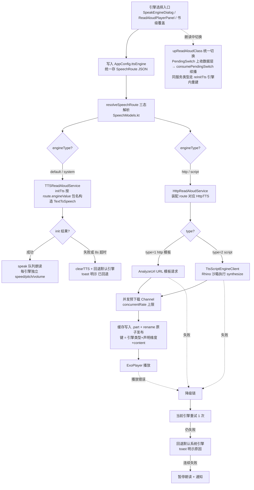
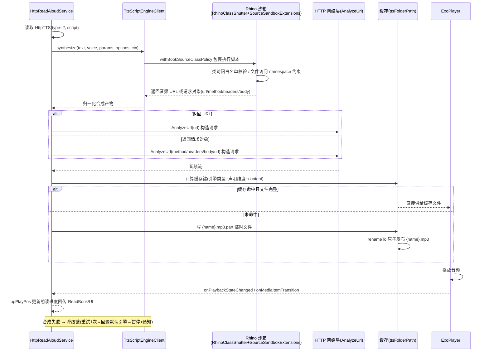

# optimize-tts-engine 设计文档（TTS 朗读引擎统一优化）

> 版本：v1.1 ｜ 更新时间：2026-09-06 ｜ 输入：`temp/tts-design-brief.md`（设计简报，含根因证据）+ NG 参考源码（项目根相对路径 `temp/forks-analysis/legado-ng/`，temp/ 不入库）+ 本仓源码核实
>
> 目标：修复"朗读引擎切换完全不生效"Bug；统一引擎路由架构；新增脚本引擎协议（带沙箱）；内置 MultiTTS/CloneTTS/在线服务模板库；规避 NG/C 版已知缺点（无 DROP 迁移、无硬编码代理端点、脚本强制沙箱、不做上帝文件）。

---

## 1. Technical Approach（技术方法）

### 1.1 引擎路由统一解析层

**现状**

- 写读分裂是本 Bug 的直接根因：`SpeakEngineDialog.selectRoute`（`ui/book/read/config/SpeakEngineDialog.kt:171-187`）写入 `AppConfig.ttsEngine = SpeechRoute.toJson()`（新格式 JSON），而 `TTSReadAloudService.initTts`（`service/TTSReadAloudService.kt:50-61`）仍按 `GSON.fromJsonObject<SelectItem<String>>(ReadAloud.ttsEngine).getOrNull()?.value` 解析——SpeechRoute JSON 中没有 `value` 字段，`.value` 恒为 null，最终 `TextToSpeech(this, this)`（L56）永远落到系统默认引擎。
- HTTP 路由坏死：`ReadAloud.getReadAloudClass`（`model/ReadAloud.kt:29-41`）用 `StringUtils.isNumeric(ttsEngine)`（L34）判断是否为 httpTTS id，SpeechRoute JSON 恒为非数字 → `HttpReadAloudService` 永不生效。
- 附带债务：`ReadAloud.kt:35` 在 `runBlocking(IO)` 中主线程查库；`ReadAloud.httpTTS`（L27）可变单例残留旧值；`SpeechModels.kt:98-141` 的 `fromTtsEngineValue` 已存在 legacy 三态兼容语义但无人统一调用。

**目标**

`SpeechRoute` 成为引擎选择唯一协议：所有读方（`ReadAloud` / `TTSReadAloudService` / 书级覆盖）统一经同一个解析函数拿到结构化路由，不再各自猜测原始字符串格式。

**实现要点**

1. `help/readaloud/speech/SpeechModels.kt` 新增 `resolveSpeechRoute(raw: String?): SpeechRoute`，**纯字符串同步 fast-path 解析，不查库**（类分派只需格式识别，无任何 DB 访问），四态判定：
   - **① 新格式 SpeechRoute JSON**：JSON 含 `engineType` 等特征键 → `SpeechRoute.fromJson(raw)` 直读 `engineType`/`engineValue`；
   - **② 双嵌套 legacy（存量用户）**：SpeechRoute JSON 且 `engineType=system` 且 `engineValue` 本身为 JSON（旧"SelectItem 嵌套进 engineValue"补丁产物）→ 解包内层 SelectItem 的 value 作包名；
   - **③ legacy SelectItem JSON**：含 `title`/`value` 键 → 取 `optString("value")` 作包名（**禁止照抄 `fromTtsEngineValue`（SpeechModels.kt:126-131）现状行为——其把整段 raw JSON 当 engineValue，是遗留地雷而非兼容目标**）；
   - **④ 纯数字**：映射为 `engineType=http`、`engineValue=<id>`（兼容存量 httpTTS 选择数据，不丢用户配置）；空白 → `engineType=default`（系统默认引擎）；
   - 解析失败兜底：坏 JSON（解析抛错）/ 合法 JSON 但 `engineType` 未知 → 回退 `default` 路由并按 AD-08 明示"引擎配置无效已回退"，禁止静默失效。
   `fromTtsEngineValue` 保留为 `@Deprecated` legacy 读兼容（其另两处消费方 `ReadAloudConfigDialog.kt:229`/`SpeechRouteSanitizer` 波及盘点见 AD-05），legacy 判定逻辑不重复实现。
2. `ReadAloud.kt` 改造（**全同步，类签名与调用方零变更**）：
   - `getReadAloudClass()`（L29-41）改为按 `resolveSpeechRoute(ttsEngine).engineType` 分派：`system|default` → `TTSReadAloudService`；`http`（及 `script`，同走 http 服务）→ `HttpReadAloudService`。分派为纯字符串判断不查库，**14 处同步 `aloudClass` 消费点（ReadAloud.kt:54/95/111/128/137/150/160/168/176/189/197/205/213/223）与 4 个调用方（MediaButtonReceiver.kt:109、ReadBookActivity.kt:4176、ReadAloudPlayerPanel.kt:1052、SourceLoginJsExtensions.kt:96）零改动**。修复 HTTP 路由 Bug。
   - 去 `runBlocking(IO)`（L35）的方式是**消除查库需求本身**：`httpTTS` 记录改由 `HttpReadAloudService` 内部按 `route.engineValue` 查库装配（现 `HttpReadAloudService.kt:155/239/447` 三处消费点改为服务内装配；记录缺失时明示报错，不静默回退），同步消解 `runBlocking` 与 `httpTTS` 可变单例残留两个问题。
   - `httpTTS` 单例副作用收敛：`ReadAloud.httpTTS` 可变字段取消跨组件共享，服务启动装配时在服务内部持有，避免残留旧引擎数据（现 `md5SpeakFileName` 的缓存键直接依赖它，见 `service/HttpReadAloudService.kt:447`）。
3. `SpeechVoiceCatalogRepository.systemGroups`（`help/readaloud/speech/SpeechVoiceCatalogRepository.kt:119-149`）删除"SelectItem JSON 嵌套进 engineValue"补丁（**两处**：L131 `GSON.toJson(SelectItem(title, value))` 引擎条目 + L165 `GSON.toJson(SelectItem("系统默认", ""))` 默认条目），改产出结构化 `SpeechRoute`（`engineType=system`、`engineValue=包名`）；`fromTtsEngineValue` 仅保留 legacy 读兼容，新数据不再产生 legacy 格式。**第三处 legacy 生产点** `SpeechVoiceGroupRepository.kt:177`（`SelectItem("系统默认","")`）一并纳入结构化改造（分组 key 存量条目等价性见 AD-05）。

### 1.2 系统引擎服务改造

**现状**

- `TTSReadAloudService.initTts`（`service/TTSReadAloudService.kt:50-61`）按 SelectItem 解析取包名（根因点）；`onInit` 失败仅 toast（L80-82），无超时看门狗——第三方引擎 init 僵死时表现为"静默失效"（archive 原版同病）。
- `clearTTS`+`initTts` 已有 `@Synchronized` 重建链（L63-71、speak ERROR 自愈 L119-124），保留。
- 语速全局单值：`upSpeechRate`（L168-178）只读 `AppConfig.ttsFlowSys` / `AppConfig.ttsSpeechRate`，无每引擎独立参数。

**目标**

initTts 按 `resolveSpeechRoute` 的 `engineValue`（引擎包名）构造 `TextToSpeech`；init 全程有超时兜底与明示降级；每引擎独立语速/音调/音量。

**实现要点**

1. `initTts` 改为：`val route = SpeechRoute.resolveSpeechRoute(ReadAloud.ttsEngine)`；`route.engineType in (system, default)` 时按 `engineValue`（包名，空白=默认引擎）构造 `TextToSpeech(this, this, engine)` / `TextToSpeech(this, this)`。
2. **init 超时看门狗**：主线程 `Handler` 起约 8s 定时，`onInit` 到达后撤销；超时未回调 → `clearTTS()` → 回退默认引擎重建 + toast 明示"引擎 X 初始化失败已回退默认"（回调竞态用主线程 Handler 收敛，`onInit` / 看门狗 / `clearTTS` 均在主线程判定 `textToSpeech` 实例一致性后再动作）。
3. `onInit` 失败（L80-82）同样走"回退默认引擎 + toast 明示"，禁止静默失效。
4. `@Synchronized clearTTS()+initTts()` 重建链保留（供 speak ERROR 自愈与引擎内重建复用，AD-02）。
5. **每引擎独立参数**：`upSpeechRate`（L168-178）扩展为按 route 维度读取独立参数（语速/音调/音量），参数存储沿用 `AppConfig` PreferKey 机制（如 `ttsSpeechRate` 扩展 route 级键或新增 `PreferKey`，见 4.File Changes 中 AppConfig 行），应用顺序：`setSpeechRate` / `setPitch` / 音量经引擎能力或播放链处理；`AppConfig.ttsFlowSys` 跟随系统语义保留。

### 1.3 脚本引擎协议（TtsScriptEngineClient）

**现状**

- 本仓无脚本引擎能力；httpTTS 仅支持 URL 模板合成（`service/HttpReadAloudService.kt` 合成链）。
- NG 参考实现：`temp/forks-analysis/legado-ng/app/src/main/java/io/legado/app/help/tts/TtsScriptEngineClient.kt`（object，options LRU 缓存 L27-37、`callOptionsFunction` 拼接脚本调用 L94-119、`synthesize` 调用 L248-256、返回 url 校验 L503）。
- NG/C 版脚本均无沙箱声明（简报 §2.2 缺点），本仓 P0 已落地书源脚本沙箱基建，必须复用。

**目标**

`HttpTTS` 实体扩展 `type=2` 标识脚本引擎；`HttpReadAloudService` 识别后走新增的 `TtsScriptEngineClient` 执行 JS 合成；强制沙箱；合成产物（URL 或请求对象）映射回现有 `AnalyzeUrl` 请求链，复用全部预下载/缓存/ExoPlayer 基建。

**实现要点**

1. **协议契约**（**出处修正：本项目自定义契约，借鉴 NG 概念，NG 无 `@capabilities` 字面量**，文档/注释不得声称"对齐 NG 字段"）：
   - 脚本头注：`@name` / `@schema` / `@capabilities` / `@defaultSpeed`（`@capabilities` 声明支持维度，未声明维度不进缓存键，见 1.6）；`voices()` 兼容多参调用（无参/带 ctx 均可）；
   - 三函数：`options()` 返回参数定义数组；`voices()` 返回音色目录；`synthesize(text, voice, params, options, ctx)` 返回音频 URL 或 HTTP 请求对象。本期仅支持 HTTP 轮询型；SSE/WS 流式登记后续增强，不阻塞本期（type=2 接入点收口见实现要点 4）。
2. **实体扩展**：`data/entities/HttpTTS.kt` 新增 `type: Int = 1`（1=http 模板默认，2=script）、`script: String = ""` 两列（ALTER TABLE 增列安全迁移，见 AD-04；已核实 `AppDatabase.kt:126` 当前 `version = 109`，且全库无 `@DatabaseView` 引用 httpTTS，增列无视图连锁风险）。**候选过滤（消费侧强制）**：以 `httpTTSDao.all` 为候选池的消费点——AI 聊天语音（AiChatSpeechPlayer.kt:346-347）、多角色朗读（AiReadAloudRoleService.kt:2507/2876）、SpeechVoiceAssigner（SpeechModels.kt:272-273）——统一过滤 `type==1`，type=2 脚本引擎不进入 AI 语音/多角色候选（本期过滤，type=2 支持登记后续）。
3. **客户端**：新增 `help/readaloud/script/TtsScriptEngineClient.kt`（object，参照 NG 结构但按本仓惯例改造：`Coroutine.async` / `kotlin.runCatching` / `NoStackTraceException` / `AppLog.put`）：
   - Rhino 执行 `options()`/`voices()`/`synthesize()`（拼接 IIFE 调用、JSON 序列化返回，参照 NG TtsScriptEngineClient.kt:94-119）；**三函数执行统一包 `withTimeout(10s)`**——Rhino 指令观察器仅协作式取消（RhinoScriptEngine.kt:327,340-344），防不住 `while(true)` 死循环，10s 硬超时为最后防线；**体积限额**：synthesized URL≤8KB、请求体≤256KB、脚本源码≤512KB、voices 目录超限截断并明示；
   - **Rhino 作用域装配（攻击面收敛）**：不向脚本暴露 HttpTTS 对象（复核 `App.kt:465` `RhinoWrapFactory.register(HttpTTS)` 包装面是否收窄），脚本作用域仅获脱敏 `sourceLabel` 与白名单 JsExtensions 面；实施时在 TtsScriptEngineClient 头注维护"暴露面清单"（可访问对象/函数/常量逐项列明）；
   - **沙箱接入（强制）**——已核实本仓真实沙箱组件（`SourceSandboxExtensions` 文件沙箱）：
     - 类访问白名单：`com.script.rhino.RhinoClassShutter`（`modules/rhino/src/main/java/com/script/rhino/RhinoClassShutter.kt`，`classAccessObserver` L70、`withBookSourceClassPolicy(enabled, sourceLabel, block)` L80，L249-254 为 observer 拦截/放行回调点）；
     - **关键启用条件（已核实，勿踩坑）**：`BaseSource.withBookSourceClassPolicy { }`（`help/source/BaseSourceExtensions.kt:23`）内部为 `enabled = this is BookSource`——HttpTTS 只实现 `BaseSource`（HttpTTS.kt:39）而非 BookSource，直接复用该包装对 HttpTTS **不会启用**类策略。TtsScriptEngineClient 必须显式调用底层入口 `RhinoClassShutter.withBookSourceClassPolicy(enabled = true, sourceLabel = <脱敏 ns 短码>) { ... }`（sourceLabel 复用 `SourceSandboxExtensions.nsShortLabel` 脱敏），或经获准后扩展 BaseSourceExtensions 为 HttpTTS 场景增加启用分支；二选一在实施时定，验收以 R4"沙箱拦截"用例通过为准；
     - 文件访问沙箱：`SourceSandboxExtensions`（`help/source/SourceSandboxExtensions.kt:17` 起，internal object，`AppConfig.bookSourceFileSandbox` 开关 + `resolveBookSourceFile`/`requireContainedTree` 目录约束）与 `BookSourceStorageScope`（`help/source/BookSourceStorageScope.kt:12`，internal object，namespace 隔离），脚本文件读写一律经此收敛（两者为 app 模块 internal，TtsScriptEngineClient 位于同模块 `help/readaloud/script/` 可访问）。
   - `voices()` 结果写 `HttpTTS.speakersJson` 缓存（HttpTTS.kt:34 既有字段），复用 `SpeechVoiceCatalogParser.parseSpeakerGroups`（SpeechModels.kt:167）现音色目录机制，UI 零新增。**拉取时机与并发约束**：voices() 在引擎导入/选中后异步拉取（独立协程），与合成链互不阻塞（合成不等待目录）；拉取失败沿用 speakersJson 旧缓存并明示"未获取到音色"；拉取加超时（复用 Coroutine.timeout 惯例，约 8s 与 init 看门狗同级）；大目录（数百音色，如 238 音色集束）全量 JSON 存 speakersJson 字段（数十 KB 量级，DB 字段可承载），不做内存常驻大缓存。
4. **合成链接入点**：`HttpReadAloudService` 在获取合成请求处按 `httpTts.type == 2` 分流，**type=2 接入点统一收口在 `getSpeakStream`**（流式 `downloadAndPlayAudiosStream` 与非流式 `downloadAndPlayAudios` 两路径共用，HttpReadAloudService.kt:233-332；流式路径 loader 线程 runBlocking 内的脚本执行同样受 10s 超时保护）：`TtsScriptEngineClient.synthesize(...)` 产物 →
   - 返回 URL → 直接构造 `AnalyzeUrl(url)` 拉流；
   - 返回请求对象 → **仅承接 url/method/headers/body 四字段**（AnalyzeUrl.kt:244-298 原生支持）映射到现有 `AnalyzeUrl` 走统一请求链；NG 多出的 transport/audioExtract/responseType 等越界字段**拒绝导入并明示**（导入校验层拦截，不静默丢弃）；
   下游的并发预下载（`downloadAndPlayAudios` L149 / `preDownloadAudios` L207）、缓存（`md5SpeakFileName` L445）、ExoPlayer（L73）全部复用，不另起链路。

### 1.4 引擎切换即时生效

**现状**

- 设置路径切换：`SpeakEngineDialog.notifyReadAloudEngineChanged`（`SpeakEngineDialog.kt:223-234`）只调 `ReadAloud.refreshReadAloudClass()`（`ReadAloud.kt:82-85`）重算 aloudClass，不 stop 服务；服务仅在 `onCreate` 执行 `initTts`（TTSReadAloudService.kt:36-43）→ 朗读中切换必然不生效。
- 播放面板已有正确机制：`ReadAloudPlayerPanel.kt:476-498` 的 `pendingTtsEngineSwitch` 在收到 STOP 事件后自动续播（记录 wasPlaying/pageIndex/startPos）。

**目标**

所有切换入口语义统一，续播意图**上收数据层**：朗读中切换 = 先重算（同步）→ stop → 重启/引擎内重建 → 自动续播；未运行时切换 = 仅重算。

**实现要点**

1. **续播意图上收数据层**：`ReadAloud.upReadAloudClass()`（L43-46）作为唯一"切换语义"入口，在 `BaseReadAloudService.isRun` 为真时捕获 `PendingSwitch(wasPlaying=isPlay(), pageIndex, startPos)` 存入 `ReadAloud` 静态记录；播放面板 `onAloudState` 的 STOP 分支改从 `ReadAloud.consumePendingSwitch()` 取续播意图（**替换面板本地字段 `switchingTtsEngine`/`pendingTtsEngineSwitch`**，ReadAloudPlayerPanel.kt:384-385/482-498/1041-1051）。设置界面（`SpeakEngineDialog.notifyReadAloudEngineChanged`，L223-234）改为服务运行中走 `upReadAloudClass()` 后**零额外改动即获续播**，且天然覆盖所有切换入口（含后续新增入口）。`refreshReadAloudClass()`（L82-85）收敛为仅"未运行时重算"。
2. **分支定义**：
   - 新旧路由同为 `TTSReadAloudService` 且服务运行中 → **不下发 STOP**，改发新增 `reInitTts` IntentAction（参照 `upTtsSpeechRate` 先例 ReadAloud.kt:203-209 / BaseReadAloudService.kt:244），服务内 `@Synchronized clearTTS()+initTts()` 引擎内重建；
   - 跨类型（system ↔ http/script）→ stop → 重算（同步解析已无耗时）→ 重启。
3. **竞态对策**：`upReadAloudClass` **先重算（同步）后 stop**——消除"STOP 事件触发面板 play 读旧 aloudClass"的竞态窗口（STOP 后续播读到的一定是新路由）。

### 1.5 内置模板库与导入

**现状**

- 无内置模板；`SpeakEngineViewModel.importDefault`（SpeakEngineViewModel.kt:17-21）仅支持 `DefaultData.importDefaultHttpTTS()`。
- 已核实的外部 TTS App 接口契约（简报 §2.3）：MultiTTS `localhost:8774 /forward`（speed/volume/pitch 为 MultiTTS 自身 0~100 参数域）+ `/voices` 目录；CloneTTS `127.0.0.1:8080 /api/tts`（speed 为 0.5~2.0 倍速语义）+ `/api/legado/all` 批量导出全部音色引擎集束。注意：本仓 speakSpeed 侧取值/换算与上述参数域不同域，映射关系见实现要点 1/2。

**目标**

新增 `app/src/main/assets/defaultData/tts/` 4 个脚本模板 + SpeakEngineDialog 导入入口，默认全部停用，无任何硬编码第三方端点。

**实现要点**

1. `multitts_forwarder.js`：type=2 脚本，`synthesize` 拼 `GET http://localhost:8774/forward?text=&voice=&speed=&volume=&pitch=`；**speed 参数域校准（二轮审查实测修正，纠正旧稿事实错误）**：本仓 `speakSpeed = AppConfig.speechRatePlay + 5`（HttpReadAloudService.kt:93,357），**默认 10 非 5**；MultiTTS 0~100 参数域模板内按 `{{speakSpeed*5}}` 换算（默认 10 → speed 参数 50，假定 50=常态速度）。**真机校准判据：默认语速下 CloneTTS=1.0x / MultiTTS speed 参数=50**（tasks 3.5/3.6 以此为准）；`voices()` 解析 `/voices` 的 `{"data":{"catalog":{...}}}` 目录结构映射为音色组。
2. `clonetts.js`：type=2 脚本，`synthesize` 拼 `GET http://127.0.0.1:8080/api/tts?text=&voice=&speed=`；speed 换算 `{{speakSpeed/10.0}}` 并 clamp 到 [0.5, 2.0]（speakSpeed 域 5~50，默认 10 → 1.0 倍速；真机校准判据：默认语速下 CloneTTS=1.0x）；支持从 `/api/legado/all` 拉取批量导入。
3. `openai_compat.js`：OpenAI `/v1/audio/speech` 兼容 POST 请求体（model/voice/speed/response_format），端点/密钥由用户填写，覆盖主流在线服务自定义端点。
4. `edge_proxy_template.js`：Edge-TTS 代理模板，`@enabled false`、**端点留空由用户填**，不硬编码任何第三方 IP/域名（规避 NG/C 缺点）。
5. 导入入口：`SpeakEngineDialog` 新增"内置模板"入口（逐个导入、启用需用户确认弹窗）；冲突策略借鉴 NG：`OVERWRITE`（按 id 覆盖）/ `KEEP_BOTH`（新 id 保留双份）。CloneTTS 一键导入：解析 `/api/legado/all` JSON 数组批量落 httpTTS 记录（走 `HttpTTS.fromJsonArray`，`data/entities/HttpTTS.kt:91-103`）。**模板加载机制**：参照 DefaultData + `assets/defaultData/httpTTS.json` 先例（help/DefaultData.kt:50-56,118-121），4 模板 JS 以 asset 目录枚举 + 头注解析呈现（模板名/说明/目标端点），导入时写入 httpTTS 表（type=2）。**参数/端点填写入口**：`HttpTtsEditDialog` 增补 script 编辑域（脚本内 CONFIG 区常量由用户编辑端点/密钥），edge 模板"端点留空"语义 = 用户编辑 script CONFIG 区；**本期不做 options() 参数化 UI（登记后续）**。
6. 模板导入小弹窗（可选新增 `TtsTemplateImportDialog.kt`）：展示模板名/说明/目标端点，确认后写入。

### 1.6 缓存键与并发

**现状**

- 缓存键 `md5SpeakFileName`（`service/HttpReadAloudService.kt:445-448`）= 章标题 md5 + `url-|-speechRate-|-content`——只含 URL 与语速，缺 voice/pitch/volume/引擎类型维度：同引擎不同音色、不同引擎同 URL 之间存在串音/串参数风险。
- 缓存写 `createSpeakFile`（L494-504）直接 `outputStream` 写目标 `.mp3`，非原子，并发/中断可留下损坏文件被命中。
- 并发预下载已有 Channel 基建（L149/L207），`HttpTTS.concurrentRate`（HttpTTS.kt:23）已有每源并发声明能力。

**目标**

缓存键按"引擎类型+能力声明维度"扩展；缓存写原子化；脚本引擎默认并发上限。

**实现要点**

1. **缓存键扩展公式**：`md5(章节标题) + "_" + md5(引擎类型(engineType:engineValue) + "-|-" + voice + "-|-" + speed + "-|-" + volume + "-|-" + pitch + "-|-" + content)`；其中 voice/speed/volume/pitch 各维度**仅当引擎 `@capabilities` 声明该维度时才拼入**（未声明维度不进缓存键，防止能力协商污染；http 模板型引擎按实际参与 URL 的参数视为已声明）。
2. **`.part` 原子写**：`createSpeakFile`（L494-504）改为写 `{name}.mp3.part` 临时文件，完整落盘后 `renameTo` 原子发布；命中缓存前校验目标文件存在且非损坏（保留 L486 `hasSpeakFile`）。
3. **引擎级并发上限**：沿用 `concurrentRate` 基建；脚本引擎（type=2）未声明时默认并发 2（避免第三方本地 App 过载），用户可在脚本 `options()` 中声明覆盖。
4. 保留现有 Channel 并发预下载结构不改架构（规避 NG 上帝文件问题，改动收敛在 HttpReadAloudService 内）。

---

## 2. Architecture Decisions（架构决策）

### AD-01: 引擎路由单源化（SpeechRoute 唯一协议 + legacy 四态兼容）
- **Version**: v1.0
- **UpdateTime**: 2026-09-06
- **Context**: 引擎选择数据存在四种历史格式并存：新 SpeechRoute JSON（`SpeechModels.kt:58-71` toJson）、双嵌套 legacy（SpeechRoute JSON 且 `engineType=system` 且 `engineValue` 内嵌 SelectItem JSON，`SpeechVoiceCatalogRepository.kt:131` 旧补丁产出）、legacy SelectItem JSON（`SpeechVoiceGroupRepository.kt:177` 仍在产出）、纯数字 httpTTS id。读方各自猜测格式导致写读分裂：`TTSReadAloudService.initTts`（TTSReadAloudService.kt:53）按 SelectItem 解析 SpeechRoute JSON 恒得 null → 永远默认引擎；`ReadAloud.getReadAloudClass`（ReadAloud.kt:34）`isNumeric` 判定 SpeechRoute JSON 恒 false → HTTP 引擎永不生效。
- **Concern**: 多格式多读方各自解析，任一新格式落地时所有读方必须同步改造，漏改即静默失效（本 Bug 根因）。
- **Decision**: SpeechRoute 成为引擎选择唯一协议。`SpeechModels.kt` 新增 `resolveSpeechRoute(raw): SpeechRoute` **纯字符串同步 fast-path 解析（不查库）**，四态判定（① 新 JSON 直读 engineType/engineValue / ② 双嵌套解包内层 value / ③ SelectItem JSON 取 `optString("value")` 作包名 / ④ 纯数字映射 http id；空白→default）；所有读方（ReadAloud/TTSReadAloudService/书级覆盖）统一经它取路由；类分派同步完成，**14 处 aloudClass 同步消费点与 4 个调用方零改动**；httpTTS 记录由 `HttpReadAloudService` 服务内按 `route.engineValue` 查库装配；`SpeechVoiceCatalogRepository`/`SpeechVoiceGroupRepository` 新数据只产结构化 SpeechRoute。
- **Goal**: 修复切换不生效与 HTTP 引擎失效两个 Bug；后续新增引擎类型只需扩展 route 枚举与单点解析，读方零改动。
- **Tradeoff**: 保留 legacy 四态兼容分支使解析函数永久携带历史格式判断逻辑（约 40 行）；不做一次性数据迁移清洗（避免触碰用户配置风险），legacy 分支长期共存。
- **Status**: Accepted
- **Superseded-by**: 无
- **ChangeLog**: [2026-09-06 初版]

### AD-02: 切换即时生效语义（统一 upReadAloudClass）
- **Version**: v1.0
- **UpdateTime**: 2026-09-06
- **Context**: 现状切换入口语义分裂：`SpeakEngineDialog.notifyReadAloudEngineChanged`（SpeakEngineDialog.kt:223-234）只调 `refreshReadAloudClass`（ReadAloud.kt:82-85）重算不停服务；服务 initTts 仅在 onCreate 执行（TTSReadAloudService.kt:36-43）；播放面板已有正确的 `pendingTtsEngineSwitch` 续播机制（ReadAloudPlayerPanel.kt:476-498）。
- **Concern**: 朗读中切换引擎必然不生效（服务不重建不换引擎），用户感知为"功能坏了"。
- **Decision**: `upReadAloudClass()` 为唯一切换语义入口，**续播意图上收数据层**：服务运行中切换先捕获 `PendingSwitch(wasPlaying/pageIndex/startPos)` 存 `ReadAloud` 静态记录，播放面板 STOP 分支改从 `ReadAloud.consumePendingSwitch()` 取（替换面板本地 `switchingTtsEngine`/`pendingTtsEngineSwitch` 字段，设置界面零改动即获续播）；**分支定义**——新旧路由同为 TTSReadAloudService 且服务运行中不下发 STOP，改发新增 `reInitTts` IntentAction 服务内 `@Synchronized clearTTS()+initTts()` 引擎内重建，跨类型才 stop→重算→重启；**竞态对策**——先重算（同步）后 stop，消除"STOP 事件触发 play 读旧 aloudClass"窗口；`refreshReadAloudClass` 收敛为仅未运行时使用。
- **Goal**: 任意入口切换引擎即时生效且续播无感；切换语义单一可推理。
- **Tradeoff**: 跨服务类型切换（system↔http）必须整服务重建，当前段落进度重置到段首（复用 PendingSwitch 记录 pageIndex/startPos 缓解，不做章内精确续播）；跨服务类型重建致定时关闭倒计时重置（BaseReadAloudService.kt:164-182 onCreate 重读定时配置）为已知行为。
- **Status**: Accepted
- **Superseded-by**: 无
- **ChangeLog**: [2026-09-06 初版]

### AD-03: TTS init 超时与降级明示
- **Version**: v1.0
- **UpdateTime**: 2026-09-06
- **Context**: `TTSReadAloudService.initTts`（TTSReadAloudService.kt:50-61）无超时保护，`onInit` 失败仅 toast（L80-82）后无任何回退动作。第三方系统 TTS 引擎 init 僵死时表现为永久静默失效（archive 原版同病，简报 §2.2）。
- **Concern**: init 僵死或失败时用户无感知、无恢复路径，误以为是应用损坏。
- **Decision**: initTts 增加主线程 Handler 超时看门狗（约 8s）；超时或 onInit 失败统一执行 clearTTS → 回退默认引擎重建 + toast 明示"引擎 X 初始化失败已回退默认"；onInit/看门狗/clearTTS 回调竞态用主线程 Handler 收敛。**补充约束（二轮审查）**：① 终止条件——回退目标已是默认引擎时不再重建（防"回退→init 失败→再回退"死循环），直接暂停朗读 + 通知终态；② 看门狗 Handler 在 `onDestroy`/`stopSelf` 时 `removeCallbacks`，并以实例代际判定防护迟到回调与新实例误杀；③ 回退后的默认引擎初始化**单次不挂看门狗**（失败仅 toast + 停止朗读，不级联回退）。
- **Goal**: 引擎初始化永远有兜底结果；失败原因对用户明示。
- **Tradeoff**: 8s 看门狗对极慢引擎（低配机大模型 TTS）可能误杀触发回退（时长取保守值，回退后用户可再切回）；主线程 Handler 收敛放弃更细粒度的锁方案（复杂度不匹配收益）。
- **Status**: Accepted
- **Superseded-by**: 无
- **ChangeLog**: [2026-09-06 初版]

### AD-04: 脚本引擎协议与 HttpTTS 实体扩展（type+script 增列迁移）
- **Version**: v1.0
- **UpdateTime**: 2026-09-06
- **Context**: NG 版脚本引擎协议成熟（@name/@schema 头注 + options()/voices()/synthesize() 概念，本项目 @capabilities 为自定义扩展、NG 无该字面量，参考项目根相对路径 temp/forks-analysis/legado-ng/.../TtsScriptEngineClient.kt:94-119、248-256），但 NG 的 DB 迁移采用 DROP TABLE httpTTS 重建，丢用户存量数据（简报 §2.2 明确缺点）。本仓 `AppDatabase.kt:126` 当前 version=109，已核实全库无 `@DatabaseView` 引用 httpTTS，`data/entities/HttpTTS.kt` 为既有实体（HttpTTS.kt:15-39）。
- **Concern**: 需要承载脚本引擎（JS 源码 + 类型标识），又不能重蹈 NG DROP TABLE 丢数据覆辙。
- **Decision**: 扩展 HttpTTS 实体新增 `type: Int = 1`（1=http 模板，2=script）、`script: String = ""` 两列，ALTER TABLE 增列增量迁移（version 109→110），不 DROP 不重建；脚本契约为**本项目自定义契约**（借鉴 NG 概念，NG 无 @capabilities 字面量；头注 @name/@schema/@capabilities/@defaultSpeed + 三函数，本期仅 HTTP 轮询型）；新增 `help/readaloud/script/TtsScriptEngineClient.kt` 执行，路由复用 HttpReadAloudService 合成链。**执行与边界约束（二轮审查）**：三函数执行统一包 `withTimeout(10s)`（Rhino 指令观察器仅协作式取消，防不住 `while(true)`）；体积限额 synthesized URL≤8KB/请求体≤256KB/脚本源码≤512KB/voices 目录超限截断并明示；synthesize 请求对象仅承接 url/method/headers/body 四字段（AnalyzeUrl.kt:244-298 原生支持），NG 多出的 transport/audioExtract/responseType 等越界字段拒绝导入并明示；type=2 接入点统一收口 `getSpeakStream`（流式/非流式两路径共用，HttpReadAloudService.kt:233-332）；以 `httpTTSDao.all` 为候选池的消费点（AI 聊天语音/多角色/SpeechVoiceAssigner）统一过滤 `type==1`。
- **Goal**: 脚本引擎能力落地且存量 httpTTS 数据零丢失；迁移覆盖安装可验证。
- **Tradeoff**: HttpTTS 实体字段语义混载（http 模板与脚本共用一张表，type 区分）——接受混载而不新建独立 scriptTTS 表：新表需数据搬迁与双 DAO 双 UI 适配，且迁移失败风险高于增列；另 SSE/WS 流式合成本期不支持（登记后续）。
- **安全边界与残余风险（如实声明）**：脚本仅能产出合成请求（URL/请求对象），HTTP 由宿主 `AnalyzeUrl` 统一发起；脚本本体经 `RhinoClassShutter` 类白名单无 Java 反射/类逃逸能力，文件访问经 `SourceSandboxExtensions`/`BookSourceStorageScope` 收敛。**Rhino 作用域装配（攻击面收敛）**：不向脚本暴露 HttpTTS 对象（复核 App.kt:465 `RhinoWrapFactory.register(HttpTTS)` 包装面），脚本仅获脱敏 sourceLabel 与白名单 JsExtensions 面，实施时输出暴露面清单。**残余风险**：脚本产出的合成 URL 可指向任意地址（含本机/内网端口，即本地服务探测），该能力与用户自配 type=1 httpTTS URL 模板同级，非脚本协议新增攻击面；缓解 = 模板默认停用 + 导入逐个确认（AD-06），不做合成 URL 白名单（登记可选增强）。本机端口语义说明：MultiTTS/CloneTTS 模板指向 localhost:8774/:8080 属功能预期，与恶意探测同通道但意图与来源可控（均为用户显式导入）。
- **Status**: Accepted
- **Superseded-by**: 无
- **ChangeLog**: [2026-09-06 初版]

### AD-05: 系统引擎增强（应用内直选 + 每引擎独立参数）
- **Version**: v1.0
- **UpdateTime**: 2026-09-06
- **Context**: C 版优点：PackageManager/TextToSpeech.engines 枚举系统引擎生成结构化条目 + `TextToSpeech(ctx, cb, enginePackage)` 直选（本仓 systemGroups 已枚举但产出 legacy 格式，SpeechVoiceCatalogRepository.kt:119-149）。本仓现状：语速全局单值（TTSReadAloudService.kt:168-178），`runBlocking(IO)` 主线程查库（ReadAloud.kt:35），sysEngines 死代码 lazy 构造临时 TextToSpeech（SpeakEngineViewModel.kt:10-15）。**legacy 格式生产/消费全景（二轮审查补全）**：生产点共三处——SpeechVoiceCatalogRepository.kt:131（引擎条目）、:165（默认条目）、SpeechVoiceGroupRepository.kt:177（`SelectItem("系统默认","")`）；`fromTtsEngineValue` 另有 2 消费方 ReadAloudConfigDialog.kt:229 与 SpeechRouteSanitizer.kt（:60/71/118/121/130/134/140/161），legacy 语义变更需波及盘点。
- **Concern**: 系统引擎选择数据格式不结构化；参数全局共享无法按引擎区分；主线程阻塞与死代码并存。
- **Decision**: systemGroups 与 SpeechVoiceGroupRepository 三处生产点全部产出结构化 SpeechRoute（engineValue=包名，直选）；分组条目 key 含 engineValue（SpeechVoiceGroupRepository.kt:44/187/191），system engineValue 由 raw JSON 变包名后的**存量条目等价性**：升级后首次加载按新格式重建 key，旧分组条目失效重建，用户无感；`fromTtsEngineValue` 2 处消费方（ReadAloudConfigDialog/SpeechRouteSanitizer）按新语义适配；每引擎语速/音调/音量独立配置（PreferKey 机制扩展 route 级键，SpeechRoute 扩展参数字段承载，新键组登记 allPreferenceKeys 见 tasks 2.10）；`runBlocking` 消除（路由解析不查库，httpTTS 装配收敛 HttpReadAloudService 服务内，见 1.1）；删除 sysEngines 死代码。另：HttpTtsEditViewModel.kt:50 保存后的 `refreshReadAloudClass` 改为服务运行中走 `upReadAloudClass` 语义（与 AD-02 对齐）。
- **Goal**: 系统引擎应用内直选即生效；不同引擎参数互不干扰；消除主线程查库与死代码。
- **Tradeoff**: 每引擎独立参数引入 route 级 PreferKey 数量增长（每引擎 3 键）；不做参数导入导出（本期范围外）。
- **Status**: Accepted
- **Superseded-by**: 无
- **ChangeLog**: [2026-09-06 初版]

### AD-06: 内置引擎模板库（默认停用 + 无硬编码端点）
- **Version**: v1.0
- **UpdateTime**: 2026-09-06
- **Context**: MultiTTS/CloneTTS 均提供本地 HTTP 转发接口（简报 §2.3 已核实：MultiTTS :8774 /forward /voices；CloneTTS :8080 /api/tts、/api/legado/all 官方批量导出）；NG/C 均内置 Edge 代理且硬编码第三方 IP 默认启用（两版共同缺点）。
- **Concern**: 用户接入主流在线服务/本地 TTS App 配置门槛高；直接内置可用代理端点有合规与可用性风险。
- **Decision**: 新增 `assets/defaultData/tts/` 4 模板（multitts_forwarder.js / clonetts.js / openai_compat.js / edge_proxy_template.js）；全部默认停用，启用需用户逐个确认导入；edge 模板端点留空由用户填写；CloneTTS 支持 /api/legado/all 批量导入；导入冲突策略 OVERWRITE/KEEP_BOTH。**speed 换算（二轮审查实测修正）**：`speakSpeed = AppConfig.speechRatePlay + 5`（HttpReadAloudService.kt:93,357），默认 10——CloneTTS 倍速域 `{{speakSpeed/10.0}}`（默认 10→1.0）、MultiTTS 0~100 域 `{{speakSpeed*5}}`（默认 10→50）；真机校准判据：默认语速下 CloneTTS=1.0x/MultiTTS speed 参数=50。**模板加载机制**：参照 DefaultData+assets/defaultData/httpTTS.json 先例（help/DefaultData.kt:50-56,118-121），asset 目录枚举+头注解析呈现，导入写入 httpTTS 表（type=2）。**参数/端点填写入口**：HttpTtsEditDialog 增补 script 编辑域（CONFIG 区常量由用户编辑），本期不做 options() 参数化 UI（登记后续）。
- **Goal**: MultiTTS/CloneTTS/主流在线服务开箱即配；零硬编码第三方端点。
- **Tradeoff**: 模板默认停用增加一步用户操作（换取合规与安全）；本地 App 端口冲突/未启动场景由失败降级链（AD-08）兜底，不做端口探测。
- **隐私提示**：启用 MultiTTS/CloneTTS/在线服务模板即意味着朗读文本将发送至对应端点（本地 App 或用户自填第三方服务）；导入确认弹窗（1.5.6）须明示目标端点与"朗读文本将发送至该端点"提示，用户知情后启用。
- **Status**: Accepted
- **Superseded-by**: 无
- **ChangeLog**: [2026-09-06 初版]

### AD-07: 并发与缓存键增强（能力声明维度 + 原子写）
- **Version**: v1.0
- **UpdateTime**: 2026-09-06
- **Context**: 现缓存键仅含 `url-|-speechRate-|-content`（HttpReadAloudService.kt:445-448），缺 voice/pitch/volume/引擎类型维度；缓存写直接写目标文件（L494-504）非原子；并发预下载已有 Channel 基建与 concurrentRate 声明（HttpTTS.kt:23）。NG 的能力契约（未声明维度不进缓存键）与 .part 原子写为成熟参考。
- **Concern**: 同引擎不同音色/参数命中同一缓存文件造成串音串参数；中断写盘留下损坏缓存被命中。
- **Decision**: 缓存键扩展为 `引擎类型+voice+speed+volume+pitch+content`，且 voice/pitch/volume 维度仅当引擎 `@capabilities` 声明时才拼入（未声明不进键）；缓存写 `.part` 临时文件 + rename 原子发布；引擎级并发上限沿用 concurrentRate 基建，脚本引擎默认 2。
- **Goal**: 缓存正确性（不串音不串参数）与写盘原子性；脚本引擎默认并发保护。
- **Tradeoff**: 缓存键变宽导致旧缓存全部失配（一次性全量重合成，旧文件靠既有 removeCacheFile 生命周期清理）；未声明维度不进键意味着参数在该引擎下不生效时缓存仍命中（这是能力契约的正交语义，非缺陷）。**旧缓存失配处置**：缓存为可再生数据，不做迁移不清空；旧文件保留原地、由既有生命周期清理逐步回收，不集中删除；代价为升级后首次播放每段需重新合成（一次性流量峰值，属预期，非缺陷），长章场景用户可感知首播稍慢。
- **Status**: Accepted
- **Superseded-by**: 无
- **ChangeLog**: [2026-09-06 初版]

### AD-08: 失败降级链与明示
- **Version**: v1.0
- **UpdateTime**: 2026-09-06
- **Context**: 本仓现状失败处理分散且静默：TTS onError 仅 nextParagraph 跳过（TTSReadAloudService.kt:247-253）、speak ERROR 仅重建（L119-124）；C 版优点为失败明示（unavailableReason/回退通知）；AD-03 已覆盖 init 阶段降级。
- **Concern**: 合成/引擎运行期失败静默跳段或卡死，用户无法得知引擎已不可用。
- **Decision**: 统一运行期降级链：当前引擎重试 1 次 → 回退默认系统引擎并 toast 明示原因 → 连续失败暂停朗读并通知；路由解析失败明示"引擎配置无效已回退"，禁止静默失效。init 阶段降级由 AD-03 承担，本条覆盖合成/播放阶段。
- **Goal**: 任何失败路径都有兜底与用户明示；不静默跳段不静默卡死。
- **Tradeoff**: 重试 1 次对瞬时故障之外的持续故障多耗约一个段落时长（次数取小值避免雪崩）；回退默认引擎可能改变用户听感（明示后由用户自行切回）。
- **Status**: Accepted
- **Superseded-by**: 无
- **ChangeLog**: [2026-09-06 初版]

---

## 3. Data Flow（数据流）

### 图1：引擎选择 → 路由解析 → 服务分派 → 失败降级链（flowchart）

**关键分支说明**

- **路由解析四态**（图1 C 节点）：`resolveSpeechRoute(raw)` **纯字符串同步 fast-path 解析（不查库）**，依次判定——① 新 SpeechRoute JSON 直读 engineType/engineValue；② SpeechRoute JSON 且 `engineType=system` 且 `engineValue` 本身为 JSON（双嵌套，存量用户）→ 解包内层 value 作包名；③ legacy SelectItem JSON → 取 `optString("value")` 作包名；④ 纯数字 → legacy httpTTS id，映射 `http` 路由；空白 → `default`。存量用户数据经 ②③④ 无损兼容，新数据只产 ① 格式。
- **降级链三步**（图1 K 节点）：运行期失败先重试 1 次 → 回退默认系统引擎并 toast 明示原因 → 连续失败暂停朗读并通知；init 阶段由看门狗（H1 节点）承担同等降级，路由解析失败明示"引擎配置无效已回退"，全程禁止静默失效。

### 图2：脚本引擎合成时序（sequenceDiagram）

**关键分支说明**

- **synthesize 产物双形态**：脚本可返回纯 URL（直接 `AnalyzeUrl(url)`）或完整请求对象（method/headers/body 映射进 `AnalyzeUrl`），两者汇入同一条既有请求链，下游预下载/缓存/播放零差异。
- **沙箱边界**：脚本在 Rhino 执行期间被 `withBookSourceClassPolicy`（BaseSourceExtensions.kt:23）包裹，类访问受 `RhinoClassShutter` 白名单约束并上报 `classAccessObserver`；文件读写受 `SourceSandboxExtensions`/`BookSourceStorageScope` namespace 约束，越界即拒绝。
- **进度回传**：ExoPlayer 播放状态经 `upPlayPos`（HttpReadAloudService.kt:543）回传 ReadBook 与 UI，与 http 模板链路一致。

---

## 4. File Changes（文件变更）

| 文件 | 变更类型 | 变更摘要 |
|------|---------|---------|
| `app/src/main/java/io/legado/app/model/ReadAloud.kt` | 修改 | 路由解析重构：ttsEngine 经 resolveSpeechRoute 纯同步分派（不查库，14 处 aloudClass 同步消费点与 4 个调用方零改动）；去 runBlocking（httpTTS 装配收敛 HttpReadAloudService 内）；upReadAloudClass 统一切换语义（PendingSwitch 上收数据层 + reInitTts 分支 + 先重算后 stop） |
| `app/src/main/java/io/legado/app/service/TTSReadAloudService.kt` | 修改 | initTts 按 route.engineValue 构造 TextToSpeech；8s 超时看门狗；onInit 失败回退默认引擎+toast 明示；每引擎独立 speed/pitch/volume 应用；新增 reInitTts IntentAction 处理；看门狗 onDestroy/stopSelf removeCallbacks + 实例代际判定 + 回退终止条件 + 回退单次不挂看门狗 |
| `app/src/main/java/io/legado/app/service/HttpReadAloudService.kt` | 修改 | 服务内按 route.engineValue 查库装配 httpTTS（L155/239/447 三点，缺失明示报错）；type=2 识别走 TtsScriptEngineClient 并收口 getSpeakStream（流式/非流式共用）；缓存键扩展（引擎类型+能力声明维度）；.part+rename 原子写；脚本引擎并发上限默认 2 |
| `app/src/main/java/io/legado/app/help/readaloud/speech/SpeechModels.kt` | 修改 | 新增 resolveSpeechRoute 四态解析（新格式/双嵌套 legacy/SelectItem/纯数字 id，纯同步不查库）；SpeechRoute 扩展引擎参数字段；SpeechVoiceAssigner 消费点候选过滤 type==1 |
| `app/src/main/java/io/legado/app/help/readaloud/speech/SpeechVoiceCatalogRepository.kt` | 修改 | systemGroups 产出结构化 SpeechRoute（删除 SelectItem JSON 嵌套补丁，L131/L165）；fromTtsEngineValue 仅保留 legacy 读兼容 |
| `app/src/main/java/io/legado/app/help/readaloud/speech/SpeechVoiceGroupRepository.kt` | 修改 | 第三处 SelectItem 生产点（:177）结构化改造；分组 key 含 engineValue（:44/187/191）的存量条目等价性处理 |
| `app/src/main/java/io/legado/app/ui/book/read/config/ReadAloudConfigDialog.kt` | 修改 | fromTtsEngineValue 消费适配（:229，legacy 语义变更波及）；新 PreferKey 登记 allPreferenceKeys 键组（:149-166） |
| `app/src/main/java/io/legado/app/help/source/SpeechRouteSanitizer.kt` | 修改 | fromTtsEngineValue legacy 语义变更波及盘点与适配（:60/71/118/121/130/134/140/161）；type=2 记录失效清理行为核实 |
| `app/src/main/java/io/legado/app/ui/main/ai/AiChatSpeechPlayer.kt` | 修改 | 候选过滤 type==1（:346-347，type=2 不进 AI 聊天语音候选） |
| `app/src/main/java/io/legado/app/help/ai/AiReadAloudRoleService.kt` | 修改 | 候选过滤 type==1（:2507/2876，type=2 不进多角色候选） |
| `app/src/main/java/io/legado/app/ui/book/read/config/HttpTtsEditDialog.kt` | 修改 | 增补 script 编辑域（CONFIG 区端点/密钥常量由用户编辑） |
| `app/src/main/java/io/legado/app/ui/book/read/config/HttpTtsEditViewModel.kt` | 修改 | 保存后 refreshReadAloudClass 改为服务运行中走 upReadAloudClass 语义（:50） |
| `app/src/main/java/io/legado/app/data/HttpTTSDao.kt` | 无需修改 | 实体增列带默认值，现有查询（含 all 候选查询）无影响；type==1 过滤在调用侧完成 |
| `app/src/main/java/io/legado/app/ui/book/read/config/SpeakEngineDialog.kt` | 修改 | 新增"内置模板"导入入口与冲突策略（OVERWRITE/KEEP_BOTH）；notifyReadAloudEngineChanged 修正为朗读中走 upReadAloudClass |
| `app/src/main/java/io/legado/app/ui/book/read/config/SpeakEngineViewModel.kt` | 修改 | 删除 sysEngines 死代码（L10-15 lazy 临时 TextToSpeech）；新增模板导入/CloneTTS 批量导入逻辑 |
| `app/src/main/java/io/legado/app/ui/book/read/config/SpeechVoiceRoutePicker.kt` | 修改 | 适配结构化 system 路由与脚本引擎条目展示 |
| `app/src/main/java/io/legado/app/ui/book/read/ReadAloudPlayerPanel.kt` | 修改 | selectTtsEngine 统一走 upReadAloudClass 语义；onAloudState STOP 分支改从 `ReadAloud.consumePendingSwitch()` 取续播意图（替换本地 switchingTtsEngine/pendingTtsEngineSwitch 字段，L384-385/482-498/1041-1051） |
| `app/src/main/java/io/legado/app/data/entities/HttpTTS.kt` | 修改 | 新增 `type: Int = 1`、`script: String = ""` 两列；equal() 比对补 type/script 字段；fromJsonDoc 补新列解析 + 缺字段逐条容错；fromJson 系列解析扩展 |
| `app/src/main/java/io/legado/app/data/AppDatabase.kt` + migration | 修改 | **数据库迁移**：version 109→110，`ALTER TABLE httpTTS ADD COLUMN type INTEGER NOT NULL DEFAULT 1` + `ADD COLUMN script TEXT NOT NULL DEFAULT ''`；不 DROP 不重建；覆盖安装真机验证必须通过（含存量 httpTTS 数据完整性核对） |
| `app/src/main/java/io/legado/app/help/config/AppConfig.kt` | 修改（如需） | 每引擎独立语速/音调/音量的 route 级 PreferKey 存取封装 |
| `app/src/main/java/io/legado/app/help/readaloud/script/TtsScriptEngineClient.kt` | 新增 | 脚本引擎客户端：Rhino 执行 options()/voices()/synthesize()（三函数 withTimeout(10s) + 体积限额，不暴露 HttpTTS 对象、维护暴露面清单）；强制沙箱接入（RhinoClassShutter 显式启用类策略（HttpTTS 非 BookSource，见 1.3）+ SourceSandboxExtensions/BookSourceStorageScope）；voices() 结果写 speakersJson 缓存（in-flight 去重 + 同步更新 lastUpdateTime） |
| `app/src/main/assets/defaultData/tts/multitts_forwarder.js` | 新增 | MultiTTS 转发模板：:8774 /forward（speed 按 {{speakSpeed*5}} 换算、volume/pitch 按 MultiTTS 参数域换算，真机校准判据：默认语速下 speed 参数=50）+ /voices 目录映射 |
| `app/src/main/assets/defaultData/tts/clonetts.js` | 新增 | CloneTTS 模板：:8080 /api/tts，speed 换算 {{speakSpeed/10.0}} clamp 0.5~2.0（默认 10→1.0）；支持 /api/legado/all 批量导入解析 |
| `app/src/main/assets/defaultData/tts/openai_compat.js` | 新增 | OpenAI /v1/audio/speech 兼容请求体模板（端点/密钥用户填写） |
| `app/src/main/assets/defaultData/tts/edge_proxy_template.js` | 新增 | Edge-TTS 代理模板：@enabled false、端点留空由用户填写，零硬编码第三方端点 |
| `app/src/main/java/io/legado/app/ui/book/read/config/TtsTemplateImportDialog.kt` | 新增（可选） | 内置模板导入确认小弹窗（展示模板名/说明/目标端点，确认后写入） |
| `app/src/main/res/values/strings.xml` | 修改 | 新增降级明示/模板导入相关文案（引擎初始化失败已回退、模板导入确认等） |
| `app/src/main/assets/updateLog.md` | 修改 | 按 version-delivery-sync 规范在编译前基于 git diff 追加本变更用户可见条目 |
| `docs/INDEX.md` / `docs/project-flow/task-navigation.md` | 修改 | 朗读模块文档锚点同步（朗读引擎路由/脚本引擎/模板库） |

> 数据库迁移约束（database-migration-safety.md）：仅 ALTER TABLE 增列、带默认值、version 递增一档；实施前已核实无 `@DatabaseView` 引用 httpTTS；覆盖安装场景必须真机验证旧数据可读、schema 导出更新。
