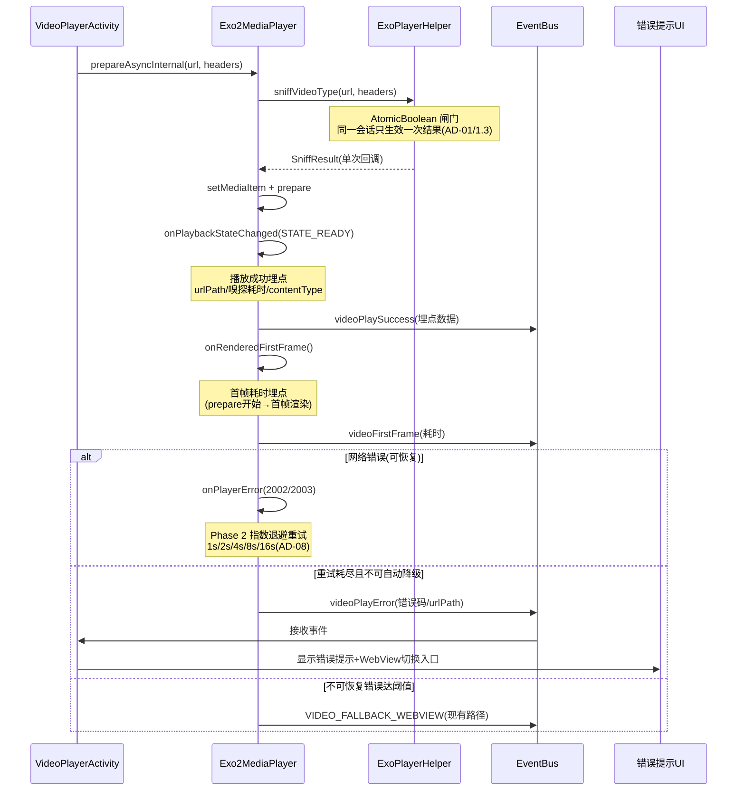
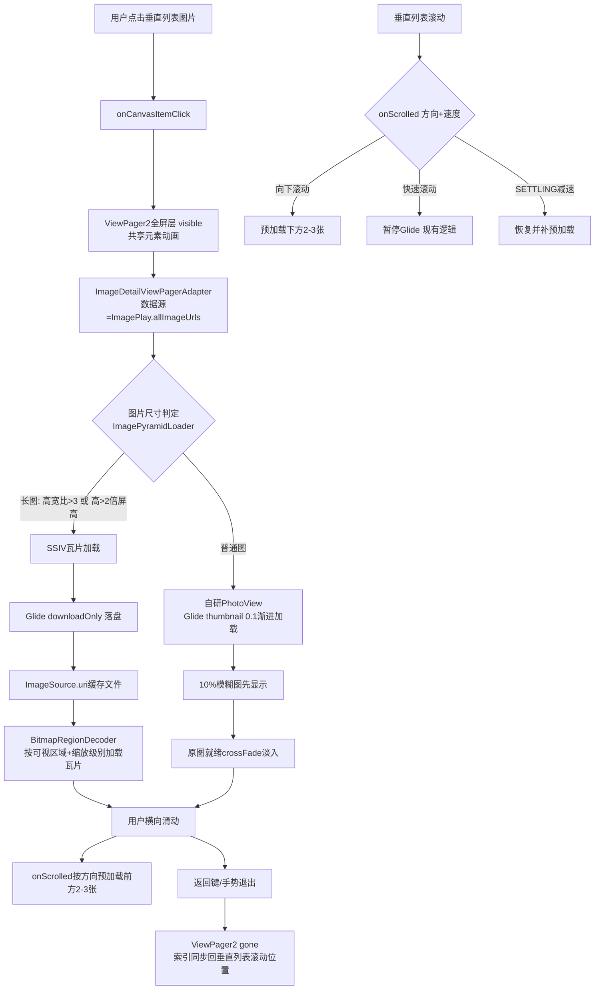
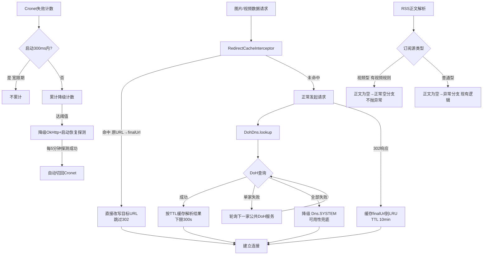
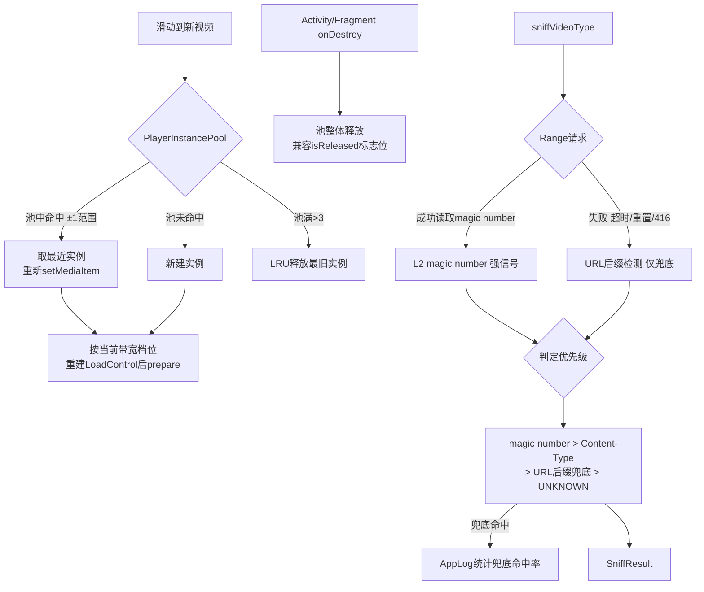

# player-mature-solutions-alignment 设计文档

> **创建时间**：2026-07-26
> **输入依据**：
> - V2 深度架构分析报告：`docs/specs/player-deep-analysis-20260726-v2.md`
> - 行业成熟方案查证报告：`docs/temp-analysis/industry-mature-solutions-verification-report-20260726.md`（49 个权威来源交叉验证）
> - 任务清单：`docs/specs/player-mature-solutions-alignment/tasks.md`
>
> **设计原则**（继承 V2 报告 §7.1）：
> 1. 不重复已实现的功能（三级识别链/降级链/四级降级链等已完成）
> 2. 聚焦日志实证的真实问题（8 个日志问题按优先级）
> 3. 补齐成熟方案遗漏（8 个遗漏按优先级，P0 的 4 个必须实现）
> 4. 补齐用户核心诉求（图片播放器 3 个核心诉求）
> 5. 修正 AI 臆想设计（术语+L3 URL 后缀检测）
> 6. 保持正确决策（不实现域名前置——已被主流 CDN 全部禁用）
>
> **任务覆盖核对**：9 个 P0（P0-1/2/3/9/10/11/12/13/14）+ 8 个 P1（P1-4/5/6/15/16/17/18/19）+ 4 个 P2（P2-8/20/21/22），全部纳入 5 个 Phase，无遗漏。

---

## 1. Technical Approach（技术方案）

### Phase 1: 可观测性+错误反馈闭环（P0，1-2 天）

> 目标：让所有播放结果可量化、所有失败场景用户可感知。这是后续 Phase 效果验收的基础设施，必须先做。

| 任务 | 对应短板 |
|------|---------|
| 1.1 播放成功埋点（STATE_READY + onRenderedFirstFrame） | P0-9 |
| 1.2 重试耗尽后发送 videoPlayError 事件 + UI 错误提示 | P0-1 |
| 1.3 sniffVideoType 双回调竞态修复（AtomicBoolean） | P0-2 |
| 1.4 SniffingMime 日志输出到 logcat | 可观测性基础设施 |

**技术实现思路**：

1. **播放成功埋点（1.1）**
   - 在 `Exo2MediaPlayer` 的播放器事件回调中新增两个观测点：
     - `onPlaybackStateChanged(STATE_READY)`：首次进入 READY 记一次播放成功，发送 `videoPlaySuccess` EventBus 事件 + AppLog 埋点。字段：`urlPath`（脱敏，仅路径模式）、嗅探耗时、contentType、是否命中预加载缓存、当前降级索引。
     - `onRenderedFirstFrame()`：记录首帧渲染耗时（prepare 开始时间 → 首帧回调时间差），用于 Phase 2 首帧预加载效果验收（验收标准：首帧命中率≥80%）。
   - 双标志位防重复埋点：同一 URL 的重复 READY（如 seek 后 rebuffer 恢复）只记一次。
   - 成熟方案参考：developer.android.com ExoPlayer 官方事件指南（STATE_READY / onRenderedFirstFrame 语义）。

2. **重试耗尽失败事件（1.2）**
   - 现状问题：`onPlayerError` 中网络错误重试（`MAX_RETRY=1`）耗尽后，若错误不属于不可恢复类型，既不走降级链也不发任何事件——用户看到 11 个视频全失败但无任何提示（日志实证）。
   - 方案：在 `onPlayerError` 的兜底分支（所有重试/降级路径均未命中时）补发 `videoPlayError` EventBus 事件；`VideoPlayerActivity` 订阅该事件后显示错误提示 UI（Toast + 错误占位页，附"切换 WebView 播放"用户决策入口）。
   - 与现有 `VIDEO_FALLBACK_WEBVIEW` 事件关系：互补不冲突——自动降级仍走旧事件，"重试耗尽但不可自动降级"的场景走新事件。
   - 成熟方案参考：hls.js 错误恢复机制（错误分类 + 终态必须通知上层）。

3. **双回调竞态修复（1.3）**
   - 现状问题：`sniffVideoType` 超时路径（`withTimeoutOrNull` 返回 null → 返回 UNKNOWN）与正常路径可能对同一调用各回调一次，导致上层状态混乱。
   - 方案：在嗅探入口引入 `AtomicBoolean callbackInvoked`，所有结果出口（正常返回/超时兜底/异常兜底）统一经 `compareAndSet(false, true)` 闸门，保证同一 prepare 会话只生效一次结果。
   - 成熟方案参考：Kotlin 协程并发最佳实践（AtomicBoolean/Mutex 闸门模式）。

4. **SniffingMime 日志（1.4）**
   - 方案：`MimeSniffer.sniff` 的判定结果（命中的 magic number 条目、最终 MIME、耗时）输出到 AppLog（tag=`SniffingMime`），与 `sniffVideoType` 埋点串联成完整嗅探链路日志，ai_test 可用 logcat 自动分析嗅探成功率。
   - 日志只输出技术字段（magic number 条目名/MIME 类型/耗时/urlPath 脱敏），不输出业务数据。

**验收标准**：logcat 可统计播放成功率；所有失败场景有 UI 提示；无双回调；ai_test 可分析嗅探日志。

---

### Phase 2: 视频播放器核心能力补齐（P0，2-3 天）

> 目标：对齐短视频行业三大核心能力（动态缓冲/首帧预加载/下一集预加载）+ 重试策略与 MediaSource 选择规范化。

| 任务 | 对应短板 |
|------|---------|
| 2.1 BandwidthMeter 动态调整缓冲参数 | P0-10 |
| 2.2 首帧预加载（I-frame） | P0-11 |
| 2.3 下一个视频预加载（256KB，WiFi 3 个/4G 1 个） | P0-12 |
| 2.4 指数退避重试策略（1s/2s/4s/8s/16s） | P1-17 |
| 2.5 显式指定 MediaSource 类型 | P1-15 |

**技术实现思路**：

1. **BandwidthMeter 动态缓冲（2.1）**
   - 现状问题：`DefaultLoadControl` 缓冲参数两处硬编码（`Exo2MediaPlayer` L402、`ExoPlayerHelper` L594），不同网络环境下缓冲策略不合理。
   - 方案：
     - 注册 `DefaultBandwidthMeter` 全局单例，持续测量有效带宽（滑动窗口算法，ExoPlayer 内置）。
     - 按测量带宽分三档：`弱网（<1Mbps）/ 中网（1-5Mbps）/ 好网（≥5Mbps）`，每档对应一组 `DefaultLoadControl` 参数（弱网：小 buffer 快起播省流量；好网：大 buffer 防 rebuffer）。
     - 工程折中（关键）：media3 的 `LoadControl` 只能在 player 构建时设置，运行时不可热切换。因此档位决策放在 **prepare 前**——每次 `prepareAsyncInternal` 时读取当前档位构建 player；网络切换后新档位在**下一次 prepare** 生效。此折中在 AD-04 中记录。
   - 成熟方案参考：developer.android.com ABR 官方指南（AdaptiveTrackSelection + BandwidthMeter）+ JioCinema 缓冲案例。

2. **首帧预加载（2.2）**
   - 方案：新增 `FirstFramePreloader`：
     - 触发时机：视频列表/切换场景中，对当前位置 ±1 的视频启动预加载。
     - 加载内容：Range 请求拉取视频前 ~1MB（含 MP4 moov box + 第一个 I-frame，或 m3u8 清单 + 首个 ts 分片头部），写入 ExoPlayer 缓存层。
     - 播放时命中缓存直接渲染首帧，不走网络。
   - 复用现有基础设施：嗅探链路已支持 Range 请求与 moov 位置检测（`SniffResult.moovPosition`），预加载器直接复用 `ExoPlayerHelper` 的请求头注入（Referer/Cookie/UA 防盗链）。
   - 埋点：首帧命中/未命中写入 1.1 的埋点字段，验收首帧命中率≥80%（快手官方数据 90%+，考虑本项目源异构性下调至 80%）。
   - 成熟方案参考：快手官方博客（I-frame 预加载，首帧命中率 90%+）。

3. **下一个视频预加载（2.3）**
   - 方案：新增 `VideoPreloader`：
     - 触发时机：当前视频播放进度达 50% 时。
     - 加载内容：下一个视频前 256KB（`Range: bytes=0-262143`，约 1-2 秒数据）。
     - 队列策略：LRU，WiFi 下最多预加载 3 个（当前+下 2），4G 下只预加载 1 个（省流量）。
     - 网络类型判断：`NetworkUtils` 新增 `isWifi()` / `isMobile()`（基于 `ConnectivityManager.getNetworkCapabilities` 的 `TRANSPORT_WIFI` / `TRANSPORT_CELLULAR`）。
   - 与 2.2 的关系：首帧预加载面向"即将播放的相邻视频"，256KB 预加载面向"正在播放的当前视频的下一集"，两者共用缓存层与 LRU，互不重复下载（同一 URL 已预加载则跳过）。
   - 成熟方案参考：抖音官方博客（256KB 预加载 + WiFi 3 个/4G 1 个 + LRU 淘汰）。

4. **指数退避重试（2.4）**
   - 现状问题：网络错误固定立即重试 1 次（`MAX_RETRY=1`），弱网场景抗抖动能力差；且固定间隔重试在多用户同站点场景易造成雪崩。
   - 方案：网络错误（2002/2003/IO_UNSPECIFIED）重试改造为指数退避：第 N 次重试延迟 `2^(N-1)` 秒（1s/2s/4s/8s/16s），最大 5 次，经 `Handler.postDelayed` 调度；每次重试前检查 `isReleased` 与协程活跃性，避免释放后回调。重试耗尽后接入 1.2 的 `videoPlayError` 事件（闭环）。
   - 与降级链关系：指数退避只针对可恢复网络错误；解析错误仍走现有降级链（`tryNextFallback`），互不干扰。
   - 成熟方案参考：hls.js 源码 config.ts（指数退避 1/2/4/8/16s，maxRetryCount=5）。

5. **显式指定 MediaSource 类型（2.5）**
   - 现状：`createMediaSource` 已按 contentType 分发（HLS/DASH/SS/Progressive），但 `MediaItem.setMimeType` 仅在嗅探到 mimeType 时设置，降级链切换时部分路径依赖 ExoPlayer 自动检测（URL 后缀不可靠）。
   - 方案：
     - `createMediaSource` 中所有分支显式设置 mimeType（降级链路径用目标类型的标准 MIME，如 HLS→`application/x-mpegURL`）。
     - `buildFallbackTypes` 降级链构建时同步构建对应 mimeType 列表，类型与 MIME 一一对应，彻底消除"靠 URL 后缀猜类型"。
   - 成熟方案参考：ExoPlayer GitHub issue #1343（官方建议显式指定 MediaSource 类型）。

**验收标准**：不同网络环境缓冲策略合理；首帧命中率≥80%；WiFi 预加载 3 个/4G 1 个；重试间隔 1s/2s/4s/8s/16s；所有 MediaSource 显式指定类型。

---

### Phase 3: 图片播放器核心诉求补齐（P0，2-3 天）

> 目标：补齐用户 3 个核心诉求（点击后左右滚动播放/最大尺寸展示/上下滑动加载不卡顿）+ 长图 OOM 风险消除。

| 任务 | 对应短板 |
|------|---------|
| 3.1 点击图片后切换为左右滚动播放（ViewPager2+PhotoView） | P0-14 |
| 3.2 图片金字塔（多分辨率瓦片，SSIV） | P0-13 |
| 3.3 图片适配性最大尺寸展示 | P1-18 |
| 3.4 图片预加载时机智能判断 | P1-19 |
| 3.5 渐进式加载（JPEG/WebP） | P1-16 |

**技术实现思路**：

1. **点击图片左右滚动播放（3.1）**
   - 现状问题：点击列表项跳转 `ImageDetailActivity`（独立 Activity），切换有断感，且与"单画布垂直滚动"主场景割裂（V2 报告实测匹配度 0%）。
   - 方案：`ImageGalleryActivity` 内实现横向播放模式：
     - 布局层：`activity_image_gallery.xml` 新增全屏 `ViewPager2` 容器（与 RecyclerView 同层，初始 gone）。
     - 点击切换：`onCanvasItemClick` 改为"显示 ViewPager2 层 + 定位到点击的图片索引"，保留共享元素动画（`shared_image_$listPosition` transition 名不变）。
     - Adapter：新增 `ImageDetailViewPagerAdapter`，复用项目自研 `io.legado.app.ui.widget.image.PhotoView`（已支持缩放/旋转/平移，item_image_canvas.xml 已在用），数据源直接读 `ImagePlay.allImageUrls`（与垂直列表同源，无需数据转换）。
     - 返回同步：ViewPager2 层按返回键/手势退出时切回 RecyclerView，并把横向浏览的当前索引同步回垂直列表滚动位置（`imageIndexToListPosition` 已有换算函数，直接复用）。
     - 原 `ImageDetailActivity` 保留（供其他入口使用），本场景不再跳转。
   - 成熟方案参考：BigImageViewer（ViewPager2 + 大图组件的漫画阅读器模式）。

2. **图片金字塔（3.2）**
   - 现状问题：超长图（如条漫，高度可达数万像素）经 Glide 全尺寸解码直接 OOM 风险（V2 报告标记 P0）。
   - 方案：引入 SSIV（SubsamplingScaleImageView，GitHub davemorrissey 项目，瓦片加载成熟实现）：
     - 新增 `ImagePyramidLoader`：判定长图（高宽比 >3 或解码高度 > 屏高 2 倍）→ 走 SSIV 路径；普通图 → 保持现有 PhotoView 路径。判定依据 Glide `RequestListener.onResourceReady` 拿到的实际宽高。
     - SSIV 数据供给：Glide 先下载原图到磁盘缓存（`downloadOnly`），SSIV 用 `ImageSource.uri(缓存文件)` + `BitmapRegionDecoder` 按需加载可视区域瓦片，内存占用与图片尺寸无关。
     - 缩放级别自适应：SSIV 内部按当前缩放级别加载对应分辨率瓦片（即"图片金字塔"的工程实现：1x/2x/4x/8x 多分辨率 + 256x256 瓦片按需加载）。
   - 成熟方案参考：微信读书团队博客（图片金字塔多分辨率瓦片）+ SSIV GitHub 项目。

3. **最大尺寸展示（3.3）**
   - 现状问题：Glide 默认 scaleType + 简单宽高比缩放，未处理极端尺寸（超宽图被压扁、超长图被截断），匹配度 70%。
   - 方案：
     - `ImageCanvasAdapter.bind` 时按屏幕宽度为基准计算目标高度：`targetHeight = screenWidth / aspectRatio`；超宽图（宽高比 >3）按宽度填满、高度自适应；超长图转 SSIV（3.2）。
     - Glide `RequestOptions` 显式设置 `override(targetWidth, targetHeight)` + `DownsampleStrategy.AT_MOST`，避免默认策略二次压缩。
   - 成熟方案参考：微信读书团队博客（长图自适应策略）。

4. **预加载时机智能判断（3.4）**
   - 现状问题：预加载仅在 `onBindViewHolder` 时机触发（前后各 1 张），未结合滚动速度/方向，上下滑动切换下一张时偶发加载不及（匹配度 80%）。
   - 方案：
     - 预加载触发点从单纯 `onBindViewHolder` 扩展为双通道：`onBindViewHolder`（保底的相邻 1 张）+ `RecyclerView.onScrolled`（按滚动方向预加载前方 2-3 张，滚动越快预加载越远）。
     - 快速滚动保护：复用现有 `onScrollStateChanged` 的"快速滚动暂停 Glide"逻辑，SCROLL_STATE_SETTLING 减速时恢复并补预加载。
     - 与 3.1 联动：横向 ViewPager2 模式同样预加载相邻 2 张（PhotoView 场景直接 Glide.preload）。
   - 成熟方案参考：RecyclerView 官方滚动性能最佳实践。

5. **渐进式加载（3.5）**
   - 方案：Glide `thumbnail(0.1f)` 先加载 10% 尺寸模糊图占位，原图就绪后淡入替换（`transition(DrawableTransitionOptions.withCrossFade())`）；WebP/JPEG 渐进式编码由 Glide+OkHttp 流式解码原生支持。
   - 与四级降级链关系：渐进式加载是"成功路径"的体验优化，失败路径仍走现有四级降级链（Glide 重试→OkHttp→WebView→网页模式），不冲突。
   - 成熟方案参考：微信读书团队博客（先模糊后清晰加载顺序）。

**验收标准**：ImageGalleryActivity 内实现横向播放；长图不 OOM；所有图片最大尺寸展示；上下滑动切换不卡顿；图片先模糊后清晰。

---

### Phase 4: 网络层韧性（P1，1-2 天）

> 目标：解决 DNS 污染/重定向浪费/Cronet 误降级/视频型订阅源解析噪音四类日志实证问题。

| 任务 | 对应短板 |
|------|---------|
| 4.1 DoH（绕过 DNS 污染，OkHttp Dns 接口） | P0-3 + P1-5 |
| 4.2 302 重定向缓存（自定义 Interceptor） | P1-6 |
| 4.3 Cronet 降级阈值宽限期 + 恢复探测 | P2-8 |
| 4.4 RSS 正文解析视频型订阅源降级 | P1-4 |

**技术实现思路**：

1. **DoH（4.1）**
   - 现状问题：站点 A 图片 CDN 被本地 DNS 过滤（图片持续失败）；站点 D 连接重置 0% 可用（SNI 阻断/反爬场景）。
   - 方案：新增 `DohDns` 实现 OkHttp `Dns` 接口：
     - 查询路径：`POST {doh-server}/dns-query`，`Content-Type: application/dns-message`，标准 DNS wire format（RFC 8484）。
     - 服务列表：内置多家公共 DoH 服务（按优先级轮询，单家失败自动切下一家）。
     - 缓存：按 DNS 应答 TTL 缓存解析结果（默认下限 300s）。
     - **降级保证（关键）**：DoH 全部失败时降级 `Dns.SYSTEM`（系统 DNS），保证可用性不低于现状。
     - 接入点：图片/视频数据请求的 OkHttpClient 构建处 `dns(DohDns)`；网页请求（WebView/阅读书籍内容）暂不接入，控制爆炸半径。
   - 依赖决策：自研 `Dns` 接口实现（OkHttp 的 `Dns` 是单方法接口，实现量约 120 行）而非引入 `okhttp-dnsoverhttps` 库——零新增三方依赖，且可定制多服务轮询+TTL 缓存。权衡记录于 AD-07。
   - 成熟方案参考：Square 官方博客（DoH on OkHttp）+ GitHub okhttp-dnsoverhttps。

2. **302 重定向缓存（4.2）**
   - 现状问题：同一 URL 反复 302 跳转（日志实证），浪费一次 RTT + 带宽。
   - 方案：新增 `RedirectCacheInterceptor`（OkHttp Interceptor）：缓存 `原URL → finalUrl` 映射（LruCache 500 条 + TTL 10 分钟），命中时直接改写请求目标 URL 跳过 302；缓存项带 Referer/Cookie 维度 key（防盗链场景 finalUrl 可能随 header 变化）。
   - 与嗅探链路协同：`SniffResult.finalUrl` 已有重定向感知能力，302 缓存命中后嗅探直接走 finalUrl，与现有逻辑兼容。
   - 成熟方案参考：OkHttp Interceptor 官方最佳实践。

3. **Cronet 宽限期+恢复探测（4.3）**
   - 现状问题：Cronet 降级阈值过敏感，启动初期冷启动失败被累计导致误降级，且降级后无恢复机制（日志实证）。
   - 方案：`CronetHelper` 改造——启动 300ms 内的失败不累计降级计数（宽限期）；降级到 OkHttp 后启动恢复探测定时器（每 5 分钟一次轻量探测），探测成功自动切回 Cronet。
   - 成熟方案参考：—（日志实证问题修复，无单一权威文档，属业界通用熔断/恢复模式）。

4. **视频型订阅源解析降级（4.4）**
   - 现状问题：RSS 正文解析 100% 走异常分支（日志实证），视频型订阅源正文本就为空，异常噪音大。
   - 方案：RSS 正文解析处检测订阅源类型——配置了视频规则的订阅源，正文为空时不抛异常走正常空内容分支；未配置视频规则的保持现有异常路径（便于发现真实解析故障）。
   - 成熟方案参考：—（日志实证问题修复）。

**验收标准**：站点 A 图片 CDN 可访问；同一 URL 不重复 302；Cronet 启动 300ms 内不累计；视频型订阅源正文为空不抛异常。

---

### Phase 5: 架构优化（P2，1 天）

> 目标：消除内存抖动 + 修正 AI 臆想设计，使架构与 WHATWG 规范对齐。

| 任务 | 对应短板 |
|------|---------|
| 5.1 播放器实例池（3 个实例） | P2-20 |
| 5.2 修正"五级识别链"术语为"三级识别链+URL后缀兜底" | P2-21 |
| 5.3 L3 URL 后缀检测降级为 Range 失败时兜底 | P2-22 |

**技术实现思路**：

1. **播放器实例池（5.1）**
   - 现状问题：播放器实例随视频切换频繁创建/销毁，内存抖动（GC 压力 + 起播延迟）。
   - 方案：新增 `PlayerInstancePool`：
     - 池容量 3 个（当前播放 + 上 1 + 下 1），与 GSYVideoPlayer 成熟实践一致。
     - 复用策略：滑动到新视频时从池中取最近实例重新 `setMediaItem`（而非新建）；池满时释放最旧实例（LRU）。
     - 与 Phase 2 预加载协同：池中实例的 LoadControl 档位在取出复用时按当前网络档位刷新（prepare 前重建，同 2.1 折中方案）。
     - 生命周期：Activity/Fragment onDestroy 时池整体释放；与 `Exo2MediaPlayer.isReleased` 标志位兼容。
   - 成熟方案参考：GSYVideoPlayer（GitHub 38k+ stars，3 实例池）。

2. **术语修正（5.2）**
   - 方案：全部设计文档中"五级识别链"统一修正为"三级识别链+URL 后缀兜底"（WHATWG MIMESNIFF 规范只有 Content-Type → magic number → octet-stream 三级）；涉及文档：V2 报告后续引用、本目录 design.md/tasks.md、exoplayer-resilience 与 player-review-and-optimization 目录的设计文档。
   - 成熟方案参考：WHATWG MIMESNIFF 官方规范。

3. **L3 URL 后缀检测降级（5.3）**
   - 现状问题：当前 7 维度交叉验证中 URL 后缀作为常规维度参与判定（维度 2/3），违反 WHATWG 规范（规范明确 URL 后缀不可靠，禁止用于 MIME 判断）。
   - 方案：`sniffWithRangeRequestR4` 改造——URL 后缀从常规判定维度移除，仅当 Range 请求失败（超时/连接重置/416）无法读取 magic number 时，作为兜底路径启用（此时本就无强信号可用，后缀提示优于完全盲猜）；判定优先级固化为：magic number（强）> Content-Type（弱）> URL 后缀（仅兜底）> UNKNOWN。
   - 埋点：兜底路径命中时输出 AppLog（tag=`SniffingMime`），便于统计兜底命中率、评估是否可进一步收窄。
   - 成熟方案参考：WHATWG MIMESNIFF 官方规范。

**验收标准**：滑动不卡顿、内存稳定；文档术语准确；嗅探逻辑符合 WHATWG 规范。

---

## 2. Architecture Decisions

### AD-01: 播放成功埋点采用 STATE_READY + onRenderedFirstFrame 双埋点
- **Context**: 当前无任何播放成功埋点，播放成功率无法量化，ai_test 无法自动化验收（V2 报告 P0-9：logcat 仅 4 次 Init/Release）。ExoPlayer 提供两个候选事件：`STATE_READY`（缓冲完成可播放）与 `onRenderedFirstFrame`（首帧实际渲染）。
- **Concern**: 单用 STATE_READY 无法度量首帧优化效果（Phase 2 首帧预加载验收需要首帧耗时）；单用 onRenderedFirstFrame 则无法区分"READY 但渲染慢"与"READY 即成功"，且部分场景（纯音频/后台预加载）无渲染回调。
- **Decision**: 两者都用——`STATE_READY` 判定播放成功（统计成功率），`onRenderedFirstFrame` 统计首帧耗时（验收首帧预加载效果）。双标志位防同一 URL 重复埋点。
- **Goal**: logcat 可统计播放成功率与首帧耗时分布；Phase 2 验收（首帧命中率≥80%）有可量化依据；ai_test 可自动化验证。
- **Tradeoff**: 两处事件回调 + 状态去重逻辑，代码复杂度略增（约 +40 行）；需处理 seek/rebuffer 后重复 READY 的去重。
- **Status**: Accepted
- **参考**: developer.android.com ExoPlayer 官方事件指南

### AD-02: 首帧预加载采用 I-frame 预加载（前 ~1MB），不做全量预加载
- **Context**: 首屏速度是短视频场景核心体验指标。候选方案：I-frame 预加载（只拉取含首个关键帧的头部数据）/ 全量预加载（拉取整个视频）/ 不预加载。
- **Concern**: 全量预加载流量代价不可接受（RSS 场景视频时长不可控，可达数十 MB）；不预加载则首屏延迟高（实测嗅探+起播耗时 225ms~3679ms）。
- **Decision**: I-frame 预加载——Range 请求拉取前 ~1MB（含 moov + 第一个 I-frame / m3u8 清单 + 首个分片头部），写入 ExoPlayer 缓存层，播放时命中缓存直接渲染首帧。
- **Goal**: 首帧命中率≥80%（快手官方 90%+，考虑本项目源异构性适度下调）；首屏感知延迟显著降低。
- **Tradeoff**: 每视频 ~1MB 预加载流量（WiFi 场景可接受；4G 场景由 AD-03 的网络感知策略统一约束数量）；MP4 moov 后置场景 1MB 可能不含 moov（复用现有 moovPosition 检测结果规避：moov 后置时扩大 Range 或跳过该视频）。
- **Status**: Accepted
- **参考**: 快手官方博客（I-frame 预加载，首帧命中率 90%+）

### AD-03: 下一个视频预加载采用 256KB + WiFi 3 个/4G 1 个
- **Context**: 上下滑动切换视频时下一条起播慢。候选预加载大小：256KB / 512KB / 1MB；候选队列：WiFi 3 个 / 4G 1 个 vs 统一 1 个。
- **Concern**: 512KB/1MB 预加载更充分但流量翻倍且 WiFi/4G 无差别会引投诉；统一 1 个则 WiFi 下未充分利用带宽。
- **Decision**: 固定 256KB（约 1-2 秒数据，足够起播）+ 网络感知队列（WiFi 最多 3 个 LRU，4G 只 1 个）。当前视频播放进度达 50% 时触发。`NetworkUtils` 新增 `isWifi()`/`isMobile()`。
- **Goal**: 滑动切换流畅（下一条起播命中预加载数据）；4G 流量可控。
- **Tradeoff**: 256KB 对高码率视频不足 1 秒（极端场景起播后仍需等待网络，但首帧已可渲染，体验损失可控）；需新增网络类型判断工具方法（约 +20 行）。
- **Status**: Accepted
- **参考**: 抖音官方博客（256KB 预加载 + WiFi 3 个/4G 1 个 + LRU 淘汰）

### AD-04: BandwidthMeter 动态调整缓冲参数（prepare 前分档，非运行时热切换）
- **Context**: 当前 `DefaultLoadControl` 缓冲参数两处硬编码（Exo2MediaPlayer L402 / ExoPlayerHelper L594），弱网大 buffer 起播慢、好网小 buffer 易 rebuffer。候选：ExoPlayer 默认 / 自定义动态调整 / 不调整。
- **Concern**: media3 的 `LoadControl` 只能在 player 构建时设置，运行时不可热切换——"实时动态调整"在工程上不可行，需要务实折中。
- **Decision**: 自定义动态调整，但采用 **prepare 前分档** 折中：`DefaultBandwidthMeter` 持续测量带宽分三档（弱网 <1Mbps / 中网 1-5Mbps / 好网 ≥5Mbps），每次 `prepareAsyncInternal` 按当前档位构建 LoadControl；网络切换后新档位在下一次 prepare 生效。
- **Goal**: 不同网络环境缓冲策略合理（弱网快起播省流量，好网防 rebuffer）。
- **Tradeoff**: 接受"档位变化延迟到下一次 prepare 生效"（单次播放会话内网络剧烈变化场景无法即时响应）；分档阈值固定（后续可按埋点数据调优）。
- **Status**: Accepted
- **参考**: developer.android.com ABR 官方指南 + JioCinema 缓冲案例

### AD-05: 图片左右滚动播放在 ImageGalleryActivity 内用 ViewPager2 + 自研 PhotoView 实现
- **Context**: 用户核心诉求"点击图片后切换为左右滚动播放"当前未实现（点击跳转独立的 ImageDetailActivity，V2 实测匹配度 0%）。候选：Activity 内 ViewPager2+PhotoView / 维持单独 Activity / 不实现。
- **Concern**: 单独 Activity 切换有断感且与垂直画布场景割裂；不实现则用户核心诉求落空。项目已有自研 PhotoView 组件（io.legado.app.ui.widget.image.PhotoView，支持缩放/旋转/平移）与 ImageDetailActivity 的 ViewPager2 横向滑动实践，可直接复用。
- **Decision**: ImageGalleryActivity 内新增全屏 ViewPager2 层（初始 gone），点击列表项时显示并定位；新增 ImageDetailViewPagerAdapter 复用自研 PhotoView，数据源与垂直列表同源（ImagePlay.allImageUrls）；退出横向模式时同步索引回垂直列表滚动位置。保留共享元素动画。
- **Goal**: 点击→横向滑动浏览→返回垂直列表，全程无 Activity 切换断感；用户核心诉求匹配度 0%→100%。
- **Tradeoff**: Activity 布局与生命周期复杂度增加（双容器显隐管理，约 +120 行）；原 ImageDetailActivity 保留形成两套横向浏览实现（后续可统一，本次控制范围不动它）。
- **Status**: Accepted
- **参考**: BigImageViewer（ViewPager2 + 大图组件漫画阅读器模式）

### AD-06: 图片金字塔采用 SSIV（成熟库），不自研瓦片加载
- **Context**: 超长图（条漫类，高度可达数万像素）Glide 全尺寸解码有 OOM 风险（P0-13）。候选：SSIV（SubsamplingScaleImageView）/ 自研瓦片加载 / 不实现。
- **Concern**: 自研瓦片加载（BitmapRegionDecoder + 多分辨率金字塔 + LRU 瓦片缓存 + 手势）工作量 500+ 行且边界情况多（解码器兼容性/瓦片接缝/内存回收时序），风险高；不实现则长图 OOM 风险持续存在。
- **Decision**: 引入 SSIV 依赖。新增 ImagePyramidLoader 按图片实际尺寸路由：长图（高宽比 >3 或解码高度 > 屏高 2 倍）走 SSIV + BitmapRegionDecoder 按需加载可视区域瓦片；普通图保持 PhotoView。Glide downloadOnly 落地磁盘缓存后 SSIV 从缓存文件读。
- **Goal**: 长图不 OOM（内存占用与图片尺寸无关）；缩放流畅。
- **Tradeoff**: 新增一个三方依赖（SSIV，GitHub 高 star 成熟项目，维护稳定）；Glide 需先全量下载到磁盘（首屏略慢于流式，但磁盘缓存命中后无重复下载）。
- **Status**: Accepted
- **参考**: 微信读书团队博客（图片金字塔）+ SSIV GitHub 项目（davemorrissey）

### AD-07: DoH 采用自研 OkHttp Dns 接口实现 + 系统 DNS 降级，不引入 okhttp-dnsoverhttps 库
- **Context**: 站点 A 图片 CDN 被本地 DNS 过滤（P1-5）、站点 D 连接重置 0% 可用（P0-3）。候选：OkHttp Dns 接口自研 / okhttp-dnsoverhttps 官方库 / 系统 DNS（不实现）。
- **Concern**: 不实现则 DNS 污染场景无解；官方库功能固定（单服务+无定制缓存策略），且本项目需要多服务轮询 + 按 TTL 缓存 + 失败降级的定制行为。
- **Decision**: 自研 `DohDns` 实现 OkHttp `Dns` 接口（单方法接口，约 120 行）：RFC 8484 wire format POST 查询，内置多家公共 DoH 服务轮询，按应答 TTL 缓存（下限 300s），**全部失败时强制降级 Dns.SYSTEM**。接入范围仅限图片/视频数据请求的 OkHttpClient，网页请求不接入控制爆炸半径。
- **Goal**: DNS 污染场景图片/视频可访问；可用性不低于现状（降级兜底）。
- **Tradeoff**: 自研代码需自行维护（但接口简单、RFC 8484 格式稳定）；DoH 增加一次查询 RTT（TTL 缓存摊薄；仅数据请求接入，影响面可控）。
- **Status**: Accepted
- **参考**: Square 官方博客（DoH on OkHttp）+ GitHub okhttp-dnsoverhttps

### AD-08: 网络错误重试采用指数退避（1s/2s/4s/8s/16s，最大 5 次）
- **Context**: 当前网络错误固定立即重试 1 次（MAX_RETRY=1），弱网抗抖动差且固定间隔易雪崩（P1-17）。候选：指数退避 1/2/4/8/16s / 固定间隔 / 不重试（维持现状）。
- **Concern**: 不重试则临时网络抖动（占失败 10%）直接恶化体验；固定间隔在多用户同站点场景同步重试造成雪崩；指数退避总等待最坏 31s 需评估用户容忍度。
- **Decision**: 指数退避 1s/2s/4s/8s/16s，最大 5 次，Handler.postDelayed 调度；仅覆盖可恢复网络错误（2002/2003/IO_UNSPECIFIED），解析错误仍走降级链；重试耗尽接入 AD-01 的 videoPlayError 事件闭环（用户可感知+可手动取消）。
- **Goal**: 弱网抖动场景播放成功率提升；避免重试雪崩；失败终态用户可感知。
- **Tradeoff**: 最坏情况用户等待 31s 才见错误提示（通过 UI 展示重试进度缓解）；调度器需严格检查 isReleased/协程活性，防止释放后回调（复用现有防护模式）。
- **Status**: Accepted
- **参考**: hls.js 源码 config.ts（指数退避 + maxRetryCount=5）

### AD-09: 识别链术语修正为"三级识别链+URL后缀兜底"，L3 降级为 Range 失败时兜底
- **Context**: "五级识别链"是 AI 自创术语，WHATWG MIMESNIFF 规范只有三级（Content-Type → magic number → octet-stream）；且 L3 URL 后缀检测作为常规维度违反规范（规范明确 URL 后缀不可靠、禁止用于 MIME 判断）（P2-21/P2-22）。
- **Concern**: 术语不准误导后续维护者；URL 后缀作为常规维度会把"弱信号"当"常规信号"用，理论上存在误判风险。但完全移除后缀检测会削弱 Range 请求失败场景（超时/重置，实测占比不低）的识别能力。
- **Decision**: 文档术语统一修正为"三级识别链+URL后缀兜底"；代码上 URL 后缀从常规判定维度移除，仅在 Range 请求失败（无法读取 magic number）时作为兜底启用。判定优先级固化：magic number > Content-Type > URL 后缀（仅兜底）> UNKNOWN。兜底命中输出 AppLog 统计。
- **Goal**: 术语与实现双重对齐 WHATWG 规范；Range 失败场景识别能力不退化。
- **Tradeoff**: 需同步修改多份历史设计文档（术语修正成本高但一次性）；兜底路径命中率需埋点观察，若占比过高说明 Range 请求稳定性本身有问题（超出本设计范围）。
- **Status**: Accepted
- **参考**: WHATWG MIMESNIFF 官方规范

### AD-10: 播放器实例池采用 3 个实例（当前+上1+下1）
- **Context**: 播放器实例随切换频繁创建/销毁造成内存抖动与起播延迟（P2-20）。候选池容量：3 个 / 5 个 / 不实现。
- **Concern**: 5 个实例内存压力大（单个 ExoPlayer 实例含解码器缓冲区，低内存设备 5 个实例 OOM 风险显著）；不实现则抖动持续。GSYVideoPlayer（38k+ stars）成熟实践为 3 个。
- **Decision**: 3 个实例（当前播放 + 上 1 + 下 1），LRU 复用（重新 setMediaItem 而非新建），池满释放最旧；与 Phase 2 网络档位协同（复用时按当前档位重建 LoadControl）；onDestroy 整体释放。
- **Goal**: 滑动不卡顿、内存稳定（消除频繁创建/销毁抖动）；低内存设备无新增 OOM 风险。
- **Tradeoff**: 池管理逻辑新增约 120 行（LRU/生命周期/与 isReleased 标志位兼容）；超出 ±1 范围的回跳场景仍需新建实例（命中不了池，与现状持平，不退化）。
- **Status**: Accepted
- **参考**: GSYVideoPlayer（GitHub 38k+ stars，3 实例池实践）

---

## 3. Data Flow（数据流）

### 3.1 Phase 1: 播放埋点与错误反馈闭环



### 3.2 Phase 2: 动态缓冲 + 首帧/下一集预加载

```mermaid
flowchart TD
    A[prepareAsyncInternal 触发] --> B{DefaultBandwidthMeter<br/>读取当前带宽档位}
    B -->|<1Mbps 弱网| C[小buffer LoadControl<br/>快起播省流量]
    B -->|1-5Mbps 中网| D[中buffer LoadControl]
    B -->|≥5Mbps 好网| E[大buffer LoadControl<br/>防rebuffer]
    C --> F[构建Player并prepare]
    D --> F
    E --> F

    G[视频列表/切换场景] --> H[FirstFramePreloader]
    H -->|Range 前~1MB| I[ExoPlayer缓存层]
    F -->|播放时命中缓存| J[首帧立即渲染<br/>命中率埋点≥80%]

    F --> K{播放进度达50%?}
    K -->|是| L[VideoPreloader]
    L --> M{网络类型}
    M -->|WiFi| N[LRU队列预加载3个<br/>各256KB]
    M -->|4G| O[仅预加载1个 256KB]
    N --> I
    O --> I

    P[网络错误] --> Q{指数退避调度}
    Q -->|第N次 delay=2^(N-1)s| R[seekToDefaultPosition+prepare]
    R -->|N≤5| F
    Q -->|N>5 耗尽| S[videoPlayError事件]
```

### 3.3 Phase 3: 图片横向播放 + 金字塔加载



### 3.4 Phase 4: DoH + 302 缓存 + Cronet 宽限



### 3.5 Phase 5: 播放器实例池 + 三级识别链



---

## 4. File Changes（文件变更清单）

> 覆盖 V2 报告全部 9 个 P0 + 8 个 P1 + 4 个 P2 任务。行数为估计值（含注释），实施时以实际为准。

### Phase 1: 可观测性+错误反馈闭环

| # | 文件 | 变更类型 | 行数估计 | 对应任务 | 说明 |
|---|------|---------|---------|---------|------|
| 1 | `app/src/main/java/io/legado/app/help/gsyVideo/Exo2MediaPlayer.kt` | 修改 | +60 | 1.1/1.2 | STATE_READY/onRenderedFirstFrame 双埋点；重试耗尽兜底分支补发 videoPlayError 事件 |
| 2 | `app/src/main/java/io/legado/app/constant/EventBus.kt` | 修改 | +3 | 1.1/1.2 | 新增 videoPlaySuccess / videoPlayError / videoFirstFrame 事件常量 |
| 3 | `app/src/main/java/io/legado/app/ui/video/VideoPlayerActivity.kt` | 修改 | +35 | 1.2 | 订阅 videoPlayError 事件，错误提示 UI + WebView 切换入口 |
| 4 | `app/src/main/java/io/legado/app/help/exoplayer/ExoPlayerHelper.kt` | 修改 | +25 | 1.3/1.4 | sniffVideoType AtomicBoolean 闸门；嗅探结果 AppLog 输出 |
| 5 | `app/src/main/java/io/legado/app/help/exoplayer/MimeSniffer.kt` | 修改 | +12 | 1.4 | 判定结果（命中条目/MIME/耗时）输出 AppLog（tag=SniffingMime） |

### Phase 2: 视频播放器核心能力补齐

| # | 文件 | 变更类型 | 行数估计 | 对应任务 | 说明 |
|---|------|---------|---------|---------|------|
| 6 | `app/src/main/java/io/legado/app/help/gsyVideo/Exo2MediaPlayer.kt` | 修改 | +90 | 2.1/2.4 | prepare 前按带宽档位构建 LoadControl；网络错误指数退避重试（1/2/4/8/16s，最大 5 次） |
| 7 | `app/src/main/java/io/legado/app/help/exoplayer/FirstFramePreloader.kt` | 新增 | ~180 | 2.2 | I-frame 预加载：Range 前 ~1MB 写入缓存层，moov 后置检测复用 SniffResult，命中率埋点 |
| 8 | `app/src/main/java/io/legado/app/help/exoplayer/VideoPreloader.kt` | 新增 | ~150 | 2.3 | 进度 50% 触发，256KB Range 预加载，LRU 队列 WiFi 3 个/4G 1 个，与 FirstFramePreloader 共用缓存层 |
| 9 | `app/src/main/java/io/legado/app/utils/NetworkUtils.kt` | 修改 | +20 | 2.3 | 新增 isWifi() / isMobile()（NetworkCapabilities TRANSPORT 判定） |
| 10 | `app/src/main/java/io/legado/app/help/exoplayer/ExoPlayerHelper.kt` | 修改 | +40 | 2.5 | createMediaSource 全部分支显式 setMimeType；buildFallbackTypes 类型与 MIME 一一对应 |

### Phase 3: 图片播放器核心诉求补齐

| # | 文件 | 变更类型 | 行数估计 | 对应任务 | 说明 |
|---|------|---------|---------|---------|------|
| 11 | `app/src/main/java/io/legado/app/ui/image/ImageGalleryActivity.kt` | 修改 | +120 | 3.1/3.4 | ViewPager2 层显隐管理+索引同步；onScrolled 方向/速度感知预加载 |
| 12 | `app/src/main/java/io/legado/app/ui/image/adapter/ImageDetailViewPagerAdapter.kt` | 新增 | ~100 | 3.1 | 横向 ViewPager2 Adapter，复用自研 PhotoView，数据源 ImagePlay.allImageUrls |
| 13 | `app/src/main/java/io/legado/app/help/image/ImagePyramidLoader.kt` | 新增 | ~80 | 3.2 | 长图判定路由（高宽比>3 或高>2 倍屏高），Glide downloadOnly 落盘 + SSIV 桥接 |
| 14 | `app/src/main/java/io/legado/app/ui/image/adapter/ImageCanvasAdapter.kt` | 修改 | +80 | 3.2/3.3/3.4/3.5 | 长图走 SSIV；按宽高比强制最大尺寸（override+AT_MOST）；预加载双通道；thumbnail(0.1f)+crossFade 渐进加载 |
| 15 | `app/src/main/res/layout/activity_image_gallery.xml` | 修改 | +25 | 3.1 | 新增全屏 ViewPager2 容器（初始 gone，与 RecyclerView 同层） |
| 16 | `app/src/main/res/layout/item_image_detail_page.xml` | 新增 | ~20 | 3.1 | 横向分页 item 布局（PhotoView + SSIV 双容器，按类型切换） |
| 17 | `app/build.gradle` | 修改 | +2 | 3.2 | 引入 SSIV 依赖（davemorrissey subsampling-scale-image-view） |

### Phase 4: 网络层韧性

| # | 文件 | 变更类型 | 行数估计 | 对应任务 | 说明 |
|---|------|---------|---------|---------|------|
| 18 | `app/src/main/java/io/legado/app/help/http/DohDns.kt` | 新增 | ~120 | 4.1 | OkHttp Dns 接口实现：RFC 8484 POST 查询、多服务轮询、TTL 缓存、Dns.SYSTEM 降级 |
| 19 | `app/src/main/java/io/legado/app/help/http/RedirectCacheInterceptor.kt` | 新增 | ~60 | 4.2 | 原URL→finalUrl LRU 缓存（500 条/TTL 10min），命中改写请求目标 |
| 20 | OkHttpClient 配置接入点（图片/视频数据请求构建处） | 修改 | +15 | 4.1/4.2 | 接入 dns(DohDns) + addInterceptor(RedirectCacheInterceptor)，仅数据请求范围 |
| 21 | `app/src/main/java/io/legado/app/lib/cronet/CronetHelper.kt` | 修改 | +35 | 4.3 | 启动 300ms 宽限期不累计；降级后 5 分钟恢复探测定时器 |
| 22 | RSS 正文解析处（Rss 相关解析类） | 修改 | +15 | 4.4 | 视频型订阅源（有视频规则）正文为空走正常空分支不抛异常 |

### Phase 5: 架构优化

| # | 文件 | 变更类型 | 行数估计 | 对应任务 | 说明 |
|---|------|---------|---------|---------|------|
| 23 | `app/src/main/java/io/legado/app/help/gsyVideo/PlayerInstancePool.kt` | 新增 | ~120 | 5.1 | 3 实例 LRU 池：复用 setMediaItem、池满释放最旧、onDestroy 整体释放、带宽档位协同 |
| 24 | `app/src/main/java/io/legado/app/help/exoplayer/ExoPlayerHelper.kt` | 修改 | ~35 | 5.3 | URL 后缀从常规维度移除，降级为 Range 失败兜底；判定优先级固化；兜底命中 AppLog 统计 |
| 25 | 历史设计文档（exoplayer-resilience/design.md、player-review-and-optimization 等） | 修改 | 若干 | 5.2 | "五级识别链"术语统一修正为"三级识别链+URL后缀兜底"（仅文档，不动代码逻辑） |

### 汇总

| 统计维度 | 数量 |
|---------|------|
| 修改文件 | 12 个（含 1 个 gradle、1 个布局、历史文档若干） |
| 新增文件 | 7 个（FirstFramePreloader / VideoPreloader / ImageDetailViewPagerAdapter / ImagePyramidLoader / DohDns / RedirectCacheInterceptor / PlayerInstancePool + 1 个 item 布局） |
| 代码行数估计 | 新增 ~860 行，修改 ~450 行 |
| 新增三方依赖 | 1 个（SSIV）；DoH 自研零依赖 |
| 任务覆盖 | 9 P0 + 8 P1 + 4 P2 全覆盖，无遗漏 |

---

## 5. 风险与缓解

| 风险 | 影响 | 缓解措施 |
|------|------|---------|
| media3 LoadControl 不可运行时热切换 | AD-04 档位变化延迟到下次 prepare | prepare 前分档折中已在 AD-04 明确记录；单次会话内网络剧变场景占比低 |
| SSIV 与 Glide 磁盘缓存联动首屏略慢 | 长图首次加载多一次落盘 | 磁盘缓存命中后无重复下载；长图场景占比低且原方案 OOM 风险更高 |
| DoH 自研实现的 wire format 正确性 | DNS 解析失败影响数据请求 | RFC 8484 格式稳定；Dns.SYSTEM 强制降级兜底可用性；Phase 1 埋点可观测命中率 |
| 指数退避最坏 31s 用户等待 | 极端弱网场景错误提示延迟 | UI 展示重试进度；用户可手动取消；hls.js 同策略为业界验证方案 |
| 实例池与 isReleased 生命周期兼容 | 释放后回调崩溃 | 复用现有 isReleased + 协程活性检查防护模式；onDestroy 池整体释放 |

---

## 6. 验收标准（继承 V2 报告 §7.3）

1. **可量化**：播放成功率从 X% 提升到 Y%（基于 AD-01 埋点统计）；首帧命中率≥80%；图片加载成功率提升可统计
2. **可观测**：嗅探/播放成功/播放失败/降级/首帧预加载/图片金字塔加载/DoH 命中 全部有 logcat 日志
3. **用户无感知失败**：所有失败场景都有 UI 错误提示 + 用户决策入口
4. **0 崩溃/0 ANR/0 OOM**：保持当前稳定性（全天会话验证）
5. **成熟方案对齐**：所有 P0/P1 任务均有成熟方案参考支撑（AD-01~AD-10 逐项标注），无 AI 臆想
6. **ai_test 自动化**：所有验收标准可用 ai_test 脚本自动化验证（测试包 `io.legado.miss.app.debug`）
