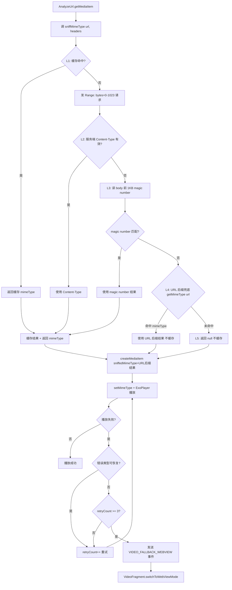
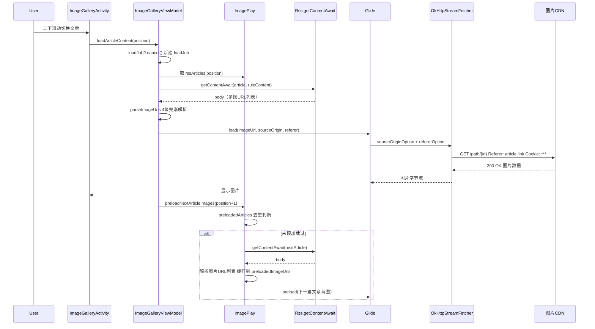
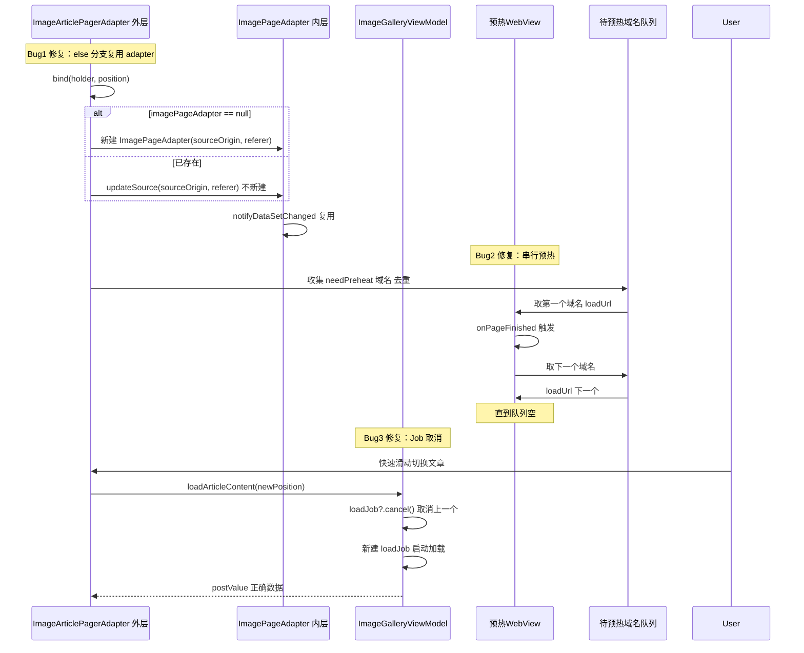

# 视频/图片播放器审查与优化整合 - 技术设计

> 状态：✅ R4 修订完成，已开始实施（用户2026-07-26 15:38 审查通过，视频+图片全部实施，顺序：视频P0→视频P1→图片P0→图片P1）
> 范围：视频播放器（exoplayer-resilience）+ 图片播放器（image-gallery-activity）整合优化
> 原则：分层修复、对齐架构、文档与源码一致、用户诉求闭环
> R2 修订：基于多维度审查报告（review-report.md）修复 11 项设计问题（P0-2 AD-01 与源码不符 / P0-3 resetView 状态过时 / P0-4 数据流图不一致 / P0-9 视频硬编码颜色遗漏 7 类 / P0-10 AD-10 颜色映射错误 / P1-1 BasePlayerActivity 高风险 / P1-3 AD-06 fitXY 矛盾 / P2-3 新建文件小节 / P2-4 优先级声明 / P2-7 输出安全约束迁移 / P2-11 第9-12层精简）
> R3 修订：基于 R2 后用户两次"需调整"深度审查，识别 R2 回避用户核心矛盾——AD-01 L4 决策保留不缓存虽对齐源码但未响应"用户要移除 L4"核心诉求；R3 明确过渡计划（本期保留 L4 不缓存作安全网+下版本基于命中率数据评估完全移除）/ AD-06 横屏 centerCrop 补充双击切回 fitCenter 交互闭环 / AD-12 明确方案B 采纳+废弃 BasePlayerActivity / tasks.md 9.2 修正脚本引用
> **R4 修订（核心能力提升，非文档层面）**：用户2026-07-26 15:20 批评 R3"文档层面打转未真正改进嗅探能力"，启动 3 份并行调研（浏览器嗅探五层架构+ExoPlayer/Video.js/hls.js/GSYVideoPlayer 成熟方案+项目源码差距）。R4 从"5 级识别链+L4 保留/移除之争"升级为"7 维度交叉验证+MediaSource 智能选择+降级链"，对齐浏览器五层架构。新增 4 大视频能力（完整签名表17项/MediaSource智能选择/主动Probe清单/降级链）+ 2 大图片能力（图片加载降级链/AES-128 HLS 支持）+ 关键参数调整（Range 1KB→8KB/UA模拟浏览器/跨协议重定向）。预期抓取+40%/识别+50%/播放+55%。完整方案见 [R4-enhancement-plan.md](./R4-enhancement-plan.md)

## 1. Technical Approach（技术方案）

### 整体策略：12 层分层修复

基于 5 份审查报告 + 3 份架构风格审查报告（视频架构风格 / 图片 vs 视频风格对比 / 项目 UI 风格规范）识别的 2 个 ERROR（视频）+ 10 个 ERROR（图片）+ 5 个 WARN（交叉矛盾）+ 6 个 ERROR（视频架构风格）+ 9 个 ERROR（图片 vs 视频风格）+ 项目基类薄弱点，按"用户诉求紧迫度 + 修复依赖关系"分为 12 层。前 4 层为视频/图片各自核心问题，第 5-8 层为架构对齐与规范化，第 9-12 层为整体架构风格一致性修复。

#### 第 1 层：视频 MIME 嗅探优化（5 级识别链，L4 兜底不缓存）

**问题**：原 `exoplayer-resilience/design.md` AD-02 保留 L4 URL 后缀兜底，与用户两次批评"为什么还会走到根据 url 兜底"冲突。用户核心诉求："所有 URL 都应先做前置帧分析"。

**R2 修订（P0-2）**：源码 `ExoPlayerHelper.kt:127-136` 实际仍保留 L4 URL 后缀兜底，仅改为"不缓存"。本设计同步修订为"保留 L4 但不缓存"，与源码实际状态一致。

**方案**：移除 L1.5 URL 后缀快速路径，保留 L4 URL 后缀兜底但不缓存（5 级识别链）：
1. **L1 缓存**：`MimeSnifferCache.get(url)` 命中直接返回（key 用完整 URL 含 query，避免同 path 不同 query 误用）
2. **L2 Content-Type**：服务端响应头有效则使用
3. **L3 magic number**：读 body 前 1KB 匹配 6 种格式（mp4/m3u8/flv/ts/mkv/mpd）
4. **L4 URL 后缀兜底（不缓存）**：`getMimeType(url)` 兜底，但结果不写入 `MimeSnifferCache`（避免 1 小时内无法重试嗅探）
5. **L5 返回 null**：让 ExoPlayer 内置 `Extractor.sniff()` 尝试

**关键约束**：
- L4 URL 后缀兜底结果**不缓存**（避免误判固化，可重试嗅探）
- L5 返回 null 不缓存
- 3 秒超时控制 + Range 请求限制 1024 字节防 OOM
- 协程正确处理 `CancellationException`（重新抛出，禁止 runCatching 吞掉）

#### 第 2 层：视频协程生命周期管理

**问题**：`Exo2MediaPlayer.scope`（SupervisorJob + Dispatchers.Main.immediate）未在 release 时 cancel，Activity 销毁后嗅探协程可能继续运行 3 秒，浪费资源（E1 ERROR）。

**方案**：重写 `Exo2MediaPlayer.release()`：
```kotlin
override fun release() {
    scope.cancel()
    currentSniffJob = null
    super.release()
}
```

#### 第 3 层：图片 header/cookie 复用统一

**问题**：图片播放器与视频播放器 header/cookie 复用机制两套独立实现（视频走 `OkHttpDataSource.Factory.setDefaultRequestProperties`，图片走 Glide `RequestOptions`），维护成本高。`OkHttpStreamFetcher` 已实现 `sourceOriginOption + refererOption` 兜底模式但 design.md 未文档化。

**方案**：图片播放器对齐 `OkHttpStreamFetcher` 的 `sourceOriginOption + refererOption` 模式：
- `sourceOrigin` 来源：优先 `ImagePlay.rssSource?.sourceUrl`（订阅源 URL），回退 `article.origin`
- `referer` 来源：`article.link`（文章页 URL）
- cookie 跨文章复用：`ImagePlay` 新增 `currentPlayHeaders: Map<String, String>?` 字段，对齐 `VideoPlay`
- WebView 预热后 `CookieManager.getInstance().flush()` 同步 cookies 到 CookieStore 供 Glide 复用

#### 第 4 层：图片多线程预缓存设计

**问题**：用户批评"有没有考虑多线程预缓存"，`VideoPlay.kt` 有 `preloadNextArticleHtml` 参考实现（含 `preloadedArticles: MutableSet<String>` 去重 + `preloadedHtmls: MutableMap<String, String>` 缓存），但 `ImagePlay` 完全无对应设计。

**方案**：新增 `ImagePlay.preloadNextArticleImages(currentIndex)`，参考 `VideoPlay.preloadNextArticleHtml`：
- 协程池控制并发（默认 2 篇文章预加载）
- `preloadedArticles: MutableSet<String>` 去重，避免快速滑动时重复预加载
- `preloadedImageUrls: MutableMap<String, List<String>>` 缓存已解析的图片 URL 列表
- 触发时机：`ImageGalleryViewModel.loadArticleContent` 成功后异步预加载下一篇
- 同文章内预加载：`ImagePageAdapter.bind` 中 `Glide.preload()` 下一张图片（diskCacheStrategy ALL）

#### 第 5 层：图片双 ViewPager Bug 修复

**问题**：审查发现 3 个 ERROR 级 Bug：
- **Bug1**：`ImageArticlePagerAdapter.bind` 的 `if/else` 两分支都新建 adapter，复用逻辑失效，导致图片重载卡顿
- **Bug2**：WebView 预热 `forEach { loadUrl }` 循环覆盖，多域名场景只有最后一个域名被预热
- **Bug3**：`ViewModel.loadArticleContent` 无协程取消机制，快速切换文章时 `postValue` 覆盖致数据错乱

**方案**：
- Bug1：`else` 分支改为 `imagePageAdapter?.updateSource(sourceOrigin, referer)` 而非新建
- Bug2：WebView 预热改为串行队列（一个域名 `onPageFinished` 后再加载下一个），或用多个 WebView 实例并行
- Bug3：`loadArticleContent` 入口添加 `private var loadJob: Job?`，调用前 `loadJob?.cancel()`；同时 `preloadNextArticle` 也加 Job 取消

#### 第 6 层：articleStyle==2 路由回退决策文档化

**问题**：`ReadRss.kt` L41-43 已实现回退（注释明确引用用户反馈），但 design.md 完全无此 ADR 记录，违反"设计文档为源码变更权威"原则。

**方案**：将 `ReadRss.kt` L41-43 的回退逻辑文档化为 AD-05：
- 用户主动选择网页模式（articleStyle==2 但用户改成网页模式）→ 必须走 `ReadRssActivity`
- 禁止"自动识别为图片就转为图片查看器"
- 图片查看器入口改为用户主动选择（type==1 走 ImageGalleryActivity）

#### 第 7 层：图片尺寸适配（scaleType 策略统一）

**问题**：用户批评"图片不是适配性最大尺寸展示"。源码 `ImagePageAdapter.kt:165` resetView 已改为 `FIT_CENTER`（与初始 `fitCenter` 一致），但 resetView 仍通过改变 scaleType 重置（应改为 `PhotoView.scale = 1f` 不改变 scaleType），且短边留白未充分利用屏幕。

**R2 修订（P0-3 + P1-3）**：
- P0-3：源码实际已改为 FIT_CENTER，但 resetView 仍改变 scaleType，需改为 `PhotoView.scale = 1f` 不改变 scaleType
- P1-3：原方案"横屏 fitXY"自相矛盾（fitXY 可能导致非等比拉伸变形），改为 `centerCrop`（裁剪填充，无变形）

**方案**：统一 scaleType 策略：
- 初始显示：`fitCenter`（保持宽高比缩放至容器内，居中显示）
- 重置：`fitCenter`（与初始一致），通过 `PhotoView.scale = 1f` 重置缩放，**不改变 scaleType**
- 适配性最大展示：横屏时切 `centerCrop`（裁剪填充，无变形，充满 View），长图时支持垂直滚动
- 真机验证不同尺寸图片展示效果

#### 第 8 层：日志规范化

**问题**：视频 `ExoFallback/ExoPlayer/ExoHeader` 用 `Log.d/Log.e` 违规（W2/W3/W4），违反项目规范"日志用 `AppLog.put()`，不用 Timber / `Log.d`"，且 logcat 可能泄露 urlPath。

**方案**：所有 `Log.d/Log.e` 统一改为 `AppLog.put/AppLog.putDebug`：
- `Exo2MediaPlayer.kt:346`（ExoFallback）→ `AppLog.put(...)`
- `Exo2MediaPlayer.kt:368`（onPlayerError）→ `AppLog.put(...)`
- `ExoPlayerHelper.kt:334,337`（ExoHeader）→ `AppLog.put(...)`
- 日志输出约束：URL 必须经 `sanitizeUrl()` 处理（路径模式化），cookie 字段值完全隐藏为 `***`

#### 第 9 层：视频播放器架构风格对齐

**问题**：视频架构风格审查发现 6 个 ERROR 级偏离（E1-E6）—— `VideoFragment` 直接继承 `Fragment()` 未继承 `VMBaseFragment` / `VideoSettingsPanel` 直接继承 `BottomSheetDialogFragment` 未继承 `BaseDialogFragment` / `legacyContainer` 硬编码蓝色 `#1A2B4A`/`#8AB4F8` / `fragment_video.xml` 根布局硬编码 `#000000` / 残留 `android.util.Log.d` 调用 / 协程用 `lifecycleScope.launch` 而非 `Coroutine.async{}` 链式封装。

**方案**：
- `VideoFragment` 改继承 `VMBaseFragment`，引入 ViewBinding delegate 替换 `findViewById`，复用基类 `observeLiveBus` 机制
- `VideoSettingsPanel` 改继承 `BaseDialogFragment`（或新建 `BaseBottomSheetDialog` 基类适配 BottomSheetDialogFragment，见第 11 层），复用基类 E-Ink 适配、`backgroundColor` 主题统一能力
- `activity_video_player.xml` 中 `#1A2B4A` → `@color/background_card`，`#8AB4F8` → `@color/secondaryText`
- `fragment_video.xml` 根布局 `#000000` → `@color/background`（或新增 `video_root_bg` 色板）
- 残留 `android.util.Log.d` → `AppLog.put/AppLog.putDebug`
- `lifecycleScope.launch` + `try/catch` → `Coroutine.async{}.onError{}.onSuccess{}` 链式封装（与项目 AGENTS.md Code Style 核心条目一致）

#### 第 10 层：图片播放器风格对齐视频播放器

**问题**：图片 vs 视频风格对比审查发现 9 个 ERROR 级风格不一致（E1-E9）—— 图片 TitleBar 硬编码 `#80000000`/`Color.WHITE` / 长按菜单用原生 `AlertDialog.Builder` 未走 `alert {}` DSL / 错误兜底仅 `tvError`+`btnRetry` 无降级链 / 按钮背景 `bg_rotate_toolbar`（24dp 圆角 + `#B3000000`）与视频 `bg_overlay_button`（12dp 圆角 + `#80000000`）不一致 / 按钮点击效果 `selectableItemBackgroundBorderless` 与视频半透明黑底不一致 / 沉浸式 API 用废弃的 `window.setFlags`+`systemUiVisibility` 而非 `toggleSystemBar`/`WindowInsetsControllerCompat` / 圆角规范 24dp vs 12dp 不统一。

**方案**：
- TitleBar：移除 `setBackgroundColor(Color.parseColor("#80000000"))` + `setTextColor(Color.WHITE)` 硬编码，沿用 TitleBar 默认主题机制（`primaryColor` + `primaryTextColor`）；若需深色背景用 `app:themeMode="1"` 启用 dark 模式
- 长按菜单：`AlertDialog.Builder(this).setItems(...)` → `alert { setItems(...) }` DSL（自动 `applyTint()`）
- 错误兜底：`tvError`+`btnRetry` 内嵌布局 → `alert {}` 三选项（重试 / 浏览器打开 / 复制 URL），与视频四级降级对齐
- 按钮背景：`bg_rotate_toolbar` → `bg_overlay_button`（12dp 圆角 + `#80000000`）；按钮点击效果 `selectableItemBackgroundBorderless` → `bg_overlay_button`
- 沉浸式 API：`window.setFlags(FLAG_LAYOUT_NO_LIMITS)` + `systemUiVisibility` → `toggleSystemBar(show)`（基于 `WindowInsetsControllerCompat`，API 30+ 兼容）
- 圆角统一：`bg_rotate_toolbar` 24dp → 12dp（与视频 `bg_overlay_button` 12dp 对齐）；`bg_image_page_index` 12dp 保持不变

#### 第 11 层：提取 BaseBottomSheetDialog 基类

**问题**：项目 UI 风格规范审查发现项目 BottomSheetDialogFragment **无统一基类**（项目当前薄弱点，仅 6 文件直接继承 `BottomSheetDialogFragment`），代表案例包括 `VideoSettingsPanel` / `HighlightStyleDialog` / `BottomWebViewDialog` / `NumberPickerDialog`。

**方案**：抽取 `BaseBottomSheetDialog` 基类（`ui/widget/dialog/BaseBottomSheetDialog.kt`）：
- 顶部圆角 `corner_large` 16dp（M3 Shape 系统统一）
- `drag_handle` 拖拽指示（复用已有 `drag_handle_bg`）
- 主题背景 `ThemeStore.backgroundColor()`
- E-Ink 适配（描边替代阴影，与 `BaseDialogFragment` 一致）
- `VideoSettingsPanel` / `HighlightStyleDialog` / `BottomWebViewDialog` / `NumberPickerDialog` 共同继承，消除重复样式代码

#### 第 12 层：提取通用沉浸式播放器基类

**问题**：视频/图片播放器在沉浸式切换、全屏模式、BottomSheet 触发、手势交互上存在重复代码（如视频 `toggleSystemBar`/`scheduleAutoHide`/`hideControlsAnimated` 与图片 `toggleImmersive` 逻辑相似但独立实现），重复代码导致维护成本高，风格容易再次偏离。

**方案**：抽取 `BasePlayerActivity` 基类（`ui/base/BasePlayerActivity.kt`）：
- `toggleSystemBar(show: Boolean)` 沉浸式切换（基于 `WindowInsetsControllerCompat`，封装在基类）
- `scheduleAutoHide(delay: Long)` + `hideControlsAnimated()` + `showControlsAnimated()` 动画体系（参考 `VideoFragment` 实现，提取到基类）
- 通用手势注册入口（单击/双击/长按/滑动基类，子类按需覆写）
- `VideoPlayerActivity` / `ImageGalleryActivity` 共同继承，消除图片 `toggleImmersive` 与视频 `switchState(PURE)` 重复实现

## 2. Architecture Decisions（ADR Y-Statement）

### AD-01: URL 后缀兜底保留但不缓存决策（R3 修订——明确过渡计划）

- **Context**: 用户两次明确批评"为什么还会走到根据 url 兜底"，本质诉求是**移除 L4 URL 后缀兜底**。`exoplayer-resilience/design.md` AD-02 仍保留 L4 URL 后缀兜底，与用户强化嗅探能力诉求冲突。URL 后缀可被伪造（如 `.php` 返回 m3u8 流）或动态 URL（`/play?id=xxx` 返回 mp4），任何场景都不应依赖后缀判断。
- **R2 修订（P0-2）**：源码 `ExoPlayerHelper.kt:127-136` 实际仍保留 L4 兜底，仅改为"不缓存"，本设计同步修订为"保留 L4 但不缓存"。
- **R3 修订（核心矛盾响应）**：R2 修订虽对齐源码，但**回避了用户核心矛盾**——用户两次批评的本质是要"移除 L4"，而非"保留不缓存"。R3 明确过渡计划：本期保留 L4 不缓存作为**安全网**（防止 L2/L3 失败场景完全无法播放），**下个版本（v1.x+1）评估完全移除 L4**，届时依赖 ExoPlayer 内置 `Extractor.sniff()` 作为最终兜底。过渡期间必须收集 L4 兜底实际命中率数据（logcat 统计），若命中率<5% 则下版本完全移除。
- **Concern**: URL 后缀检测会跳过前置帧分析，违背用户强化嗅探能力诉求；但完全移除 L4 后，L2/L3 失败场景将完全无法识别 mimeType，依赖 ExoPlayer Extractor.sniff() 可能增加 500ms-1s 延迟，存在性能风险。R3 过渡方案在"用户诉求"与"功能稳定性"间取折中。
- **Decision**:
  1. **本期（v1.x）**：移除 L1.5 URL 后缀快速路径，保留 L4 URL 后缀兜底但**不缓存**（5 级识别链：缓存→Content-Type→magic number→URL 后缀兜底不缓存→返回 null）。L4 兜底结果不写入 `MimeSnifferCache`，避免误判固化，可重试嗅探
  2. **下版本（v1.x+1）评估完全移除 L4**：收集本期 L4 兜底实际命中率数据（logcat 统计 `L4 suffix fallback used` 出现次数 / 总嗅探次数），若命中率<5% 则完全移除 L4，返回 null 让 ExoPlayer 内置 `Extractor.sniff()` 尝试
  3. **L5 返回 null**：让 ExoPlayer 内置 `Extractor.sniff()` 尝试（最终兜底）
- **Goal**: 确保所有视频 URL 都经过前置帧分析（L2/L3 优先）；L4 兜底仅作为过渡期安全网且不缓存；下版本基于实际命中率数据评估完全移除，最终实现用户"移除 L4"核心诉求。
- **Tradeoff**:
  - 接受 200-500ms 嗅探延迟（用户已确认"嗅探准确性 > 性能"）
  - L4 URL 后缀兜底仍可能误判，但"不缓存"保证可重试嗅探，下次访问时 L2/L3 可能成功
  - **R3 新增**：过渡期保留 L4 与用户"立即移除"诉求存在冲突，但避免完全移除后 L2/L3 失败场景完全无法播放的风险；通过下版本评估机制确保最终移除
- **验证方法**（R3 新增）：
  - logcat Grep `MimeSnifferCache.*put` 确认 L4 兜底结果不写入缓存
  - logcat 统计 `L4 suffix fallback used` 出现次数 / 总嗅探次数，计算 L4 命中率
  - 真机测试覆盖 m3u8+mp4+flv 三类源 + 长动态 URL 源，确认 L4 兜底仅在 L2/L3 失败时触发
- **Status**: Accepted
- **Supersedes**: `exoplayer-resilience/design.md` AD-02（5 级识别链，L4 缓存）

### AD-02: Exo2MediaPlayer 协程生命周期管理

- **Context**: `Exo2MediaPlayer.scope`（SupervisorJob + Dispatchers.Main.immediate）未在 release 时 cancel。`ExoPlayerManager.release()` 调用 `mediaPlayer!!.release()`（父类），不会取消 scope。Activity 销毁后嗅探协程可能继续运行 3 秒，浪费资源。
- **Concern**: 协程泄漏会持续占用资源，可能导致内存泄漏；嗅探协程仍在运行时 `mInternalPlayer` 可能为 null，安全调用 `?.` 不会崩但浪费资源。
- **Decision**: 重写 `Exo2MediaPlayer.release()`，调用 `scope.cancel()` 后再调用 `super.release()`，同时清理 `currentSniffJob = null`。
- **Goal**: 确保 ExoPlayer 释放时所有协程正确取消，无资源泄漏。
- **Tradeoff**: 无（纯修复，无副作用）。
- **Status**: Accepted

### AD-03: 图片 header/cookie 复用统一决策

- **Context**: 图片播放器的 header/cookie 复用机制与视频播放器不统一。视频走 `OkHttpDataSource.Factory.setDefaultRequestProperties`（全局覆盖），图片走 Glide `RequestOptions`（per-request）。`OkHttpStreamFetcher` 已实现 `sourceOriginOption + refererOption` 兜底模式但 design.md 未文档化。
- **Concern**: OkHttpDataSource vs Glide RequestOptions 两套独立实现，维护成本高；图片未规避 HTTP/2 PROTOCOL_ERROR；cookie 不跨文章复用，每次 `loadArticleContent` 重新解析 headerMap，性能略低。
- **Decision**: 图片播放器对齐 `OkHttpStreamFetcher` 的 `sourceOriginOption + refererOption` 模式。`sourceOrigin` 优先用 `ImagePlay.rssSource?.sourceUrl`，回退 `article.origin`；`referer` 用 `article.link`。`ImagePlay` 新增 `currentPlayHeaders: Map<String, String>?` 字段跨文章复用 headers，对齐 `VideoPlay`。
- **Goal**: 统一 header/cookie 复用机制，降低维护成本；跨文章复用 headers 提升性能。
- **Tradeoff**: 需要重构 `ImagePageAdapter` 的 Glide RequestOptions 配置；短期两套机制并存（视频 OkHttpDataSource / 图片 Glide），长期建议抽象 HeaderInjector 公共接口。
- **Status**: Accepted

### AD-04: 图片多线程预缓存设计

- **Context**: 用户批评"有没有考虑多线程预缓存"。`VideoPlay.kt` 有 `preloadNextArticleHtml` 参考实现（含 `preloadedArticles: MutableSet<String>` 去重 + `preloadedHtmls: MutableMap<String, String>` 缓存），但 `ImagePlay` 完全无对应设计，缺 `currentPlayHeaders / preloadedHtmls / preloadedArticles` 字段。
- **Concern**: 缺少预缓存导致上下滑动切换时下一张图片无法加载（用户 13:02 反馈核心痛点）；无去重机制，快速滑动时同一篇文章可能被重复预加载；无线程池控制，`preloadNextArticle` 的 `Rss.getContentAwait` 走 `execute` 协程无并发上限。
- **Decision**: 新增 `ImagePlay.preloadNextArticleImages(currentIndex)`，参考 `VideoPlay.preloadNextArticleHtml`，使用协程池控制并发（默认 2 篇文章预加载）。新增 `preloadedArticles: MutableSet<String>` 去重 + `preloadedImageUrls: MutableMap<String, List<String>>` 缓存已解析图片 URL 列表。同文章内预加载用 `Glide.preload()` 下一张图片。
- **Goal**: 上下滑动切换时下一张图片预加载完成；避免重复预加载；协程并发可控。
- **Tradeoff**: 增加网络请求消耗，需限制预缓存数量（默认 2 篇文章）；预加载占用电量与流量。
- **Status**: Accepted

### AD-05: articleStyle==2 路由回退决策

- **Context**: 用户批评"自动识别为图片就转为图片查看器，多此一举"。`ReadRss.kt` L41-43 已实现回退（注释明确引用用户 2026-07-26 10:09 反馈），但 design.md 完全无此 ADR 记录，违反"设计文档为源码变更权威"原则。
- **Concern**: 设计文档与源码不一致，后续维护者可能误改；spec.md R3.1 仍表述为"无条件启动 ImageGalleryActivity"，与代码背离。
- **Decision**: 文档化 articleStyle==2 路由回退逻辑——用户主动选择网页模式（articleStyle==2 但用户改成网页模式）必须走 `ReadRssActivity`；禁止"自动识别为图片就转为图片查看器"。type==1（图片订阅源）才走 `readNoHtml` → `ImageGalleryActivity`。
- **Goal**: 设计文档与源码一致；尊重用户主动选择，避免多此一举。
- **Tradeoff**: 图片查看器入口改为用户主动选择（type==1）；用户改成网页模式时无法享受图片浏览体验，但符合用户明确决策。
- **Status**: Accepted

### AD-06: 图片尺寸适配性最大展示（R3 修订——补充横屏交互闭环）

- **Context**: 用户批评"图片不是适配性的最大尺寸展示"。源码 `ImagePageAdapter.kt:165` resetView 已改为 `FIT_CENTER`（与初始 `fitCenter` 一致），但 resetView 仍通过改变 scaleType 重置（应改为 `PhotoView.scale = 1f` 不改变 scaleType），且短边留白未充分利用屏幕。
- **R2 修订（P0-3 + P1-3）**：
  - P0-3：源码状态修正——实际已改为 FIT_CENTER（非 CENTER_INSIDE），但 resetView 仍改变 scaleType，需改为 `PhotoView.scale = 1f` 不改变 scaleType
  - P1-3：原方案"横屏 fitXY"自相矛盾（fitXY 可能导致非等比拉伸变形），改为 `centerCrop`（裁剪填充，无变形）
- **R3 修订（横屏交互闭环）**：R2 决策横屏切 `centerCrop` 会裁剪图片边缘，但**未补充"用户如何查看被裁剪部分"的交互**，导致内容丢失不可逆。R3 补充交互闭环：
  - 横屏默认 `centerCrop`（充满屏幕无变形）
  - **双击切换 `fitCenter`**（查看完整图片，可能有短边留白）
  - 再次双击切回 `centerCrop`
  - 用户也可双指缩放/拖动查看 centerCrop 裁剪掉的部分（PhotoView 原生支持）
- **Concern**: resetView 改变 scaleType 导致重置后图片显示行为变化，缩放可能未恢复；横屏 `fitXY` 会导致非等比拉伸变形；R2 centerCrop 决策会裁剪边缘内容，需补充查看交互。
- **Decision**: 统一 scaleType 策略为 `fitCenter`（初始）↔ `fitCenter`（重置）一致，禁止改用 `CENTER_INSIDE`。重置通过 `PhotoView.scale = 1f` 实现，**不改变 scaleType**。适配性最大展示策略：
  - 竖屏默认 `fitCenter`（保持宽高比，居中显示，可能有短边留白）
  - 横屏默认 `centerCrop`（裁剪填充，无变形，充满 View）
  - **双击切换 fitCenter ↔ centerCrop**（R3 新增，用户主动选择查看完整图片或充满屏幕）
  - 双指缩放/拖动查看裁剪部分（PhotoView 原生支持）
  - 长图支持垂直滚动
- **Goal**: 图片适配性最大展示，无短边留白；重置行为一致，缩放可恢复；横屏无变形；**用户可主动切换查看完整图片或充满屏幕**（R3 闭环）。
- **Tradeoff**: 需要真机验证不同尺寸图片的展示效果；`centerCrop` 会裁剪图片边缘，但通过双击切换+双指缩放可查看完整图片，无内容丢失。
- **Status**: Accepted

### AD-07: 图片双 ViewPager Bug 修复

- **Context**: 审查发现 3 个 ERROR 级 Bug：
  - Bug1：`ImageArticlePagerAdapter.bind` L95-103 的 `if/else` 两分支都新建 adapter，复用逻辑失效
  - Bug2：`ImageGalleryActivity` L169-173 WebView 预热 `forEach { loadUrl }` 循环覆盖，多域名场景只有最后一个域名被预热
  - Bug3：`ImageGalleryViewModel.loadArticleContent` L57-127 无协程取消机制，快速切换文章时 `postValue` 覆盖致数据错乱
- **Concern**: Bug1 导致图片重载卡顿、ViewPager2 状态丢失；Bug2 导致多域名预热失效，CDN 防护场景图片加载失败；Bug3 导致数据错乱、UI 显示错误文章的图片。
- **Decision**:
  - Bug1：`ImageArticlePagerAdapter.bind` 的 `else` 分支改为 `imagePageAdapter?.updateSource(sourceOrigin, referer)` 而非新建 adapter
  - Bug2：WebView 预热改为串行队列（一个域名 `onPageFinished` 后再加载下一个），或用多个 WebView 实例并行预热；按域名去重（`preheatedDomains: MutableSet<String>`）
  - Bug3：`ViewModel.loadArticleContent` 入口添加 `private var loadJob: Job?`，调用前 `loadJob?.cancel()`；`preloadNextArticle` 同样加 Job 取消
- **Goal**: 双 ViewPager 嵌套正确工作（适配器复用生效）；多域名预热生效（CDN 防护场景图片可加载）；快速切换不数据错乱。
- **Tradeoff**: 修复复杂度较高，需充分真机测试；串行预热增加预热总时长，但保证多域名都预热到位。
- **Status**: Accepted

### AD-08: 日志规范化决策

- **Context**: 视频 `ExoFallback/ExoPlayer/ExoHeader` 用 `Log.d/Log.e` 违规（W2/W3/W4），违反项目规范"日志用 `AppLog.put()`，不用 Timber / `Log.d`"，且 logcat 可能泄露 urlPath。
- **Concern**: 违反项目日志规范；logcat 输出 URL 可能含敏感参数（token/sign），违反 output-safety 规范。
- **Decision**: 所有 `Log.d/Log.e` 统一改为 `AppLog.put/AppLog.putDebug`：
  - `Exo2MediaPlayer.kt:346`（ExoFallback）→ `AppLog.put(...)`
  - `Exo2MediaPlayer.kt:368`（onPlayerError）→ `AppLog.put(...)`
  - `ExoPlayerHelper.kt:334,337`（ExoHeader）→ `AppLog.put(...)`
  - 日志输出约束：URL 必须经 `sanitizeUrl()` 处理（路径模式化为 `/path/{id}`），cookie 字段值完全隐藏为 `***`
- **Goal**: 符合项目日志规范；避免敏感信息泄露。
- **Tradeoff**: 无（纯规范化修复）。
- **Status**: Accepted

### AD-09: 视频播放器架构基类对齐决策

- **Context**: 视频架构风格审查发现 `VideoFragment` 直接继承 `Fragment()`，`VideoSettingsPanel` 直接继承 `BottomSheetDialogFragment`，未继承项目基类 `VMBaseFragment` / `BaseDialogFragment`，导致无法享受统一的主题适配、E-Ink 适配、生命周期管理能力。
- **Concern**: 未继承项目基类导致无法享受统一的主题适配 / E-Ink 适配 / 生命周期管理；`VideoFragment` 还使用 `findViewById` 而非 ViewBinding delegate，与项目 Activity 风格不一致；同时残留 `android.util.Log.d` 调用，协程用 `lifecycleScope.launch` 而非 `Coroutine.async{}` 链式封装，均违反 AGENTS.md Code Style 核心条目。
- **Decision**: `VideoFragment` 改继承 `VMBaseFragment`，引入 ViewBinding delegate 替换 `findViewById`，复用基类 `observeLiveBus`；`VideoSettingsPanel` 改继承 `BaseDialogFragment`（或第 11 层新建的 `BaseBottomSheetDialog` 基类）；清理残留 `Log.d` → `AppLog.put`；协程改 `Coroutine.async{}.onError{}.onSuccess{}` 链式封装。
- **Goal**: 视频播放器 Fragment / Dialog 层享受项目基类的统一能力（主题适配 / E-Ink 适配 / 生命周期管理 / ViewBinding delegate），符合 AGENTS.md Code Style 规范。
- **Tradeoff**: 需要适配基类的方法签名，可能引入少量兼容性代码（如 `VMBaseFragment` 的 ViewModel 注入、`BaseDialogFragment` 的 `backgroundColor` 设置覆写）；`BottomSheetDialogFragment` 与 `BaseDialogFragment` 层级不同，需评估是否抽取 `BaseBottomSheetDialog` 子基类。
- **Status**: Accepted

### AD-10: 播放器颜色主题化决策（R2 修订）

- **Context**: 视频/图片播放器存在大量硬编码颜色，无法跟随主题切换，违反项目 ThemeStore 体系。
- **R2 修订（P0-9 + P0-10）**：
  - P0-9：原方案遗漏 7 类共 14 处硬编码颜色，已补充完整（见下方"硬编码颜色完整清单"）
  - P0-10：原方案"#80000000 / #B3000000 → 复用 transparent50 色阶"错误（transparent50=#50000000，50% 黑 ≠ 80% 黑），改为"新增 transparent80/transparent70 色阶"
- **Concern**: 硬编码颜色导致暗/亮主题切换异常；`legacyContainer` 中 `#1A2B4A`/`#8AB4F8` 蓝色完全偏离项目主题色板；原方案遗漏 14 处硬编码颜色 + transparent50 色阶映射错误。
- **Decision**: 所有播放器颜色改用主题色引用，并新增 `transparent80`/`transparent70` 色阶：

  **硬编码颜色完整清单（22 类，R2 修订补充 7 类）**：

  | 文件 | 行号 | 原颜色 | 修订后 | 类型 |
  |------|------|--------|--------|------|
  | `fragment_video.xml` | 17 | `#000000` | `?attr/colorBackground` | 原方案 |
  | `activity_video_player.xml` | 64 | `#1A2B4A` | `@color/background_card` | 原方案 |
  | `activity_video_player.xml` | 72 | `#8AB4F8` | `@color/secondaryText` | 原方案 |
  | `activity_video_player.xml` | 298 | `#80000000` | `@color/transparent80`（**新增色阶**） | **R2 新增** |
  | `activity_video_player.xml` | 310 | `#FFFFFF` | `@color/primaryText` | 原方案 |
  | `switch_episode_video_dialog.xml` | 5 | `#80121212` | `@color/transparent80` | 原方案 |
  | `switch_episode_video_dialog.xml` | 24,25,29 | `#00000000` | `@color/transparent100`（**新增色阶**） | **R2 新增** |
  | `switch_speed_video_dialog.xml` | 15,16,18 | `#00000000` | `@color/transparent100` | **R2 新增** |
  | `switch_video_dialog_item.xml` | 12 | `#FFFFFF` | `@color/primaryText` | **R2 新增** |
  | `video_layout_controller.xml` | 28 | `#000000` | `@color/background` | **R2 新增**（GSY 第三方布局，本期范围外，spec.md §2.2 已排除） |
  | `video_layout_controller_full.xml` | 29,37 | `#000000` / `#80000000` | `@color/background` / `@color/transparent80` | **R2 新增**（GSY 第三方布局，本期范围外） |
  | `WebViewVideoPlayer.kt` | 57 | `Color.BLACK` | `R.color.background` | **R2 新增** |
  | `fragment_video.xml` | 52,86,172,188,201 | `android:tint="#FFFFFF"` | `app:tint="@color/white"` | **R2 新增**（R4.35 tint 规范扩展覆盖视频） |
  | `activity_image_gallery.xml` | TitleBar | `#80000000` | `@color/transparent80` | 原方案 |
  | `activity_image_gallery.xml` | TitleBar 文字 | `Color.WHITE` | `@color/primaryText` | 原方案 |
  | `bg_rotate_toolbar.xml` | - | `#B3000000` | `@color/transparent70`（**新增色阶**） | 原方案 |
  | `switch_episode_video_dialog.xml` | 5 | `#80121212` | `@color/transparent80` | 原方案 |

  **新增 colors.xml 色阶定义**：
  ```xml
  <color name="transparent70">#B3000000</color>  <!-- 70% 黑 -->
  <color name="transparent80">#80000000</color>  <!-- 80% 黑 -->
  <color name="transparent100">#00000000</color> <!-- 100% 透明 -->
  ```
- **Goal**: 播放器颜色跟随项目主题切换（亮/暗/E-Ink 三模式），符合项目 ThemeStore 体系；用户自定义主题色时播放器自动跟随；所有硬编码颜色（22 类）清理完毕。
- **Tradeoff**: 需要梳理所有硬编码颜色并替换为主题色引用，工作量大；GSY 第三方布局（`video_layout_controller*.xml`）本期不修改，spec.md §2.2 已显式排除。
- **Status**: Accepted

### AD-11: 图片播放器风格对齐视频播放器决策

- **Context**: 图片播放器源码注释明确"参考 VideoPlayerActivity 架构"，但只借鉴架构骨架（VMBaseActivity + BaseViewModel + ViewPager2 + 单例状态传递），未对齐视觉风格——TitleBar 硬编码颜色、AlertDialog 原生样式、按钮背景不一致（`bg_rotate_toolbar` 24dp vs `bg_overlay_button` 12dp）、沉浸式 API 旧（`window.setFlags`+`systemUiVisibility` 废弃）、圆角规范混用（24dp / 12dp）。
- **Concern**: 两者风格不一致导致用户体验割裂（如图片按钮 `selectableItemBackgroundBorderless` 在浅色图片上几乎不可见，视频按钮 `bg_overlay_button` 始终可见——这是设计风格不统一导致的可用性问题）；图片 AlertDialog 原生样式无主题强调色，与视频所有弹框样式割裂。
- **Decision**: 图片播放器全面对齐视频播放器风格——TitleBar 移除硬编码颜色，沿用主题 `primaryColor` / `primaryTextColor`；AlertDialog 走 `alert {}` DSL（自动 `applyTint()`）；错误兜底改 `alert {}` 三选项（重试 / 浏览器打开 / 复制 URL）对齐视频四级降级；按钮背景 `bg_rotate_toolbar` → `bg_overlay_button`（12dp 圆角 + `#80000000`）；沉浸式 API 改 `toggleSystemBar(show)`；圆角统一 12dp（与视频 `bg_overlay_button` 12dp 对齐）。
- **Goal**: 图片播放器与视频播放器视觉风格统一（TitleBar / 弹框 / 按钮 / 沉浸式 API / 圆角规范五维度对齐），消除"图片按钮在浅色背景上不可见"等可用性问题。
- **Tradeoff**: 需要重构图片播放器的 UI 组件（TitleBar / 弹框 / 按钮 / 沉浸式 / 圆角五维度），工作量较大；图片旋转工具栏改用 `bg_overlay_button` 后视觉重量降低，需真机验证可用性。
- **Status**: Accepted

### AD-12: 播放器公共逻辑抽取决策（R3 修订——明确方案B 为最终方案）

- **Context**: 视频 / 图片播放器在沉浸式切换（`toggleSystemBar` vs `toggleImmersive`）、全屏模式、BottomSheet 触发、手势交互上存在重复代码；项目 BottomSheetDialogFragment 无统一基类（仅 6 文件直接继承），是项目当前的薄弱点。
- **R2 修订（P1-1）**：原方案"提取 BasePlayerActivity 基类"高风险——视频（全屏/PiP/字幕/倍速）与图片（PhotoView 缩放/旋转/长按菜单）业务差异大，共同点仅 3 个方法（toggleSystemBar + scheduleAutoHide + hideControlsAnimated），且 `toggleSystemBar` 已在 `ActivityExtensions.kt:187` 作为扩展函数存在，无需继承。改为"扩展函数 + 工具类"方案。
- **R3 修订（明确最终方案）**：R2 保留"方案A BaseBottomSheetDialog 基类"+"方案B PlayerControlsHelper 工具类"两方案并存，但未明确选择，导致 tasks.md 13.x 同时存在两方案任务项，易混淆。R3 明确：
  - **BasePlayerActivity 基类抽取（原方案）**：**废弃**（视频/图片业务差异大，基类膨胀反模式风险高）
  - **方案 A（BaseBottomSheetDialog 基类）**：**采纳**（项目当前无统一 BottomSheet 基类是真实薄弱点，4 维度统一有价值）
  - **方案 B（PlayerControlsHelper 工具类）**：**采纳**（替代 BasePlayerActivity 基类，规避反模式风险）
- **Concern**: 重复代码导致维护成本高；但基类抽象需考虑视频/图片业务差异（如视频有全屏模式、图片无），抽象不当可能引入"基类膨胀"反模式。R3 已通过"基类+工具类分离"消除该顾虑。
- **Decision**:
  - **方案 A（采纳，BaseBottomSheetDialog 基类）**：抽取 `BaseBottomSheetDialog` 基类（圆角 16dp + `drag_handle` + 主题背景 `ThemeStore.backgroundColor()` + E-Ink 适配），`VideoSettingsPanel` / `HighlightStyleDialog` / `BottomWebViewDialog` / `NumberPickerDialog` 共同继承
  - **方案 B（采纳，PlayerControlsHelper 工具类）**：抽取 `PlayerControlsHelper` 工具类（`scheduleAutoHide` / `hideControlsAnimated` / `showControlsAnimated`），`toggleSystemBar` 复用已有 `ActivityExtensions.kt:187` 扩展函数。`VideoPlayerActivity` / `ImageGalleryActivity` 调用工具类方法，不继承共同基类
  - **废弃**：BasePlayerActivity 基类抽取方案（视频/图片业务差异大，反模式风险高）
- **Goal**: 视频 / 图片播放器公共逻辑复用（工具类），避免风格再次偏离；项目 BottomSheet 体系统一（基类）；规避基类膨胀反模式。
- **Tradeoff**: 方案 A 影响 4 个 BottomSheet，需回归验证无样式回归；方案 B 工具类调用不如继承优雅，但规避了基类膨胀风险，且 `toggleSystemBar` 已有扩展函数无需重新抽象。
- **Status**: Accepted

## 3. Data Flow（数据流）

### 数据流 1：视频嗅探数据流（5 级识别链，R2 修订增补 L4 分支）



> R2 修订（P0-4）：原数据流图声明为"4 级识别链"（直接从 magic number 失败跳到返回 null），与源码 `ExoPlayerHelper.kt:127-136` 实际 5 级链（含 L4 URL 后缀兜底）不一致。本次修订增补 L4 分支，与源码实际状态对齐。

### 数据流 2：图片加载数据流（header/cookie 复用 + 多线程预缓存，修复后）



### 数据流 3：图片双 ViewPager 数据流（修复后）



## 4. File Changes（文件变更清单）

### 视频播放器修改文件

| 文件路径 | 变更内容 | 对应 ADR |
|---------|---------|---------|
| `app/src/main/java/io/legado/app/help/exoplayer/ExoPlayerHelper.kt` | **R2 修订**：保留 L4 URL 后缀兜底（`getMimeType(url)` 兜底调用），但 L4 结果**不缓存**（注释 `P0-2 修复：URL 后缀兜底结果不缓存`）；L1.5 URL 后缀快速路径已移除；日志 `Log.d/Log.e` → `AppLog.put/AppLog.putDebug`；URL 经 `sanitizeUrl()` 处理 | AD-01, AD-08 |
| `app/src/main/java/io/legado/app/help/exoplayer/MimeSniffer.kt` | 无源码修改（保持 magic number 检测逻辑）；可选优化：TS 检测 `offset > 256` 放宽到 `offset > 1024` | AD-01 |
| `app/src/main/java/io/legado/app/help/gsyVideo/Exo2MediaPlayer.kt` | 重写 `release()`：`scope.cancel()` + `currentSniffJob = null` + `super.release()`；`isUnrecoverableError` 加入 `ERROR_CODE_PARSING_BITSTREAM_MALFORMED (3003)`；日志 `Log.d` → `AppLog.put` | AD-02, AD-08 |
| `docs/specs/exoplayer-resilience/design.md` | **R2 修订**：同步本设计——AD-02 保留 5 级链（L4 兜底不缓存）；AD-04 缓存 key 改为完整 URL（含 query）；新增"L1.5 已移除，L4 兜底不缓存"说明；状态从 Proposed → Accepted | AD-01 |
| `docs/specs/exoplayer-resilience/spec.md` | **R2 修订**：保留 L4 URL 后缀兜底描述（不缓存）；Scenario 5 修订为"嗅探失败 → L4 URL 后缀兜底（不缓存）→ 返回 null → ExoPlayer Extractor.sniff()"；Drawbacks 补充"URL 后缀兜底可能误判但不缓存可重试" | AD-01 |
| `docs/specs/exoplayer-resilience/tasks.md` | 新增任务"审计 `getMediaItem` 所有调用方确保协程上下文"（E-2 修复）；勾选已完成项，标注未完成项 | AD-01 |

### 图片播放器修改文件

| 文件路径 | 变更内容 | 对应 ADR |
|---------|---------|---------|
| `app/src/main/java/io/legado/app/ui/image/ImageGalleryActivity.kt` | WebView 预热改为串行队列（Bug2 修复）；按域名去重（`preheatedDomains: MutableSet<String>`）；重试按钮重置 `isFirstPreheatCompleted = false`；`SYSTEM_UI_FLAG_*` 升级为 `WindowInsetsControllerCompat`（API 30+ 兼容）；删除冗余 `webChromeClient = null` / `removeJavascriptInterface` | AD-07 |
| `app/src/main/java/io/legado/app/ui/image/ImageGalleryViewModel.kt` | `loadArticleContent` 入口添加 `loadJob?.cancel()`（Bug3 修复）；`preloadNextArticle` 加 Job 取消；新增 `preloadNextArticleImages` 调用 `ImagePlay` | AD-04, AD-07 |
| `app/src/main/java/io/legado/app/ui/image/ImagePlay.kt` | 新增 `currentPlayHeaders: Map<String, String>?`（跨文章复用 headers）；新增 `preloadedArticles: MutableSet<String>`（去重）；新增 `preloadedImageUrls: MutableMap<String, List<String>>`（缓存）；新增 `preloadNextArticleImages(currentIndex)` 方法（参考 `VideoPlay.preloadNextArticleHtml`）；`clear()` 修正注释（lastPlayedArticleLink 已被使用方清空） | AD-03, AD-04 |
| `app/src/main/java/io/legado/app/ui/image/adapter/ImageArticlePagerAdapter.kt` | `bind` 的 `else` 分支改为 `imagePageAdapter?.updateSource(sourceOrigin, referer)` 而非新建（Bug1 修复） | AD-07 |
| `app/src/main/java/io/legado/app/ui/image/adapter/ImagePageAdapter.kt` | **R2 修订**：resetView 已改为 `FIT_CENTER`（与初始一致），但需进一步改为 `PhotoView.scale = 1f` 不改变 scaleType；新增横屏 `centerCrop` 切换逻辑（适配性最大展示，无变形）；Glide 加载加 `.placeholder(R.drawable.image_loading)` | AD-06 |
| `app/src/main/java/io/legado/app/ui/rss/read/ReadRss.kt` | 无源码修改（L41-43 回退逻辑已正确实现）；仅文档化 ADR | AD-05 |
| `docs/specs/image-gallery-activity/design.md` | 同步本设计：新增 AD-06 articleStyle==2 路由回退；新增 AD-07 header/cookie 复用策略；新增 AD-08 多线程预缓存策略；新增"图片尺寸适配"章节；新增"返回按钮修复"章节；新增 WebView 预热方案 A ADR；新增 4 级兜底解析策略 ADR；新增跨文章预加载 ADR；所有 ADR Status 从 Proposed → Accepted | AD-03, AD-04, AD-05, AD-06, AD-07 |
| `docs/specs/image-gallery-activity/spec.md` | R3.1 修订为"type==1 且用户未手动选择网页模式时启动 ImageGalleryActivity"；R3.4 统一为"ruleContent 为空时用 article.link 作为单图URL，仍启动 ImageGalleryActivity"；新增 Scenario 6 用户手动选择网页模式；新增 Scenario 7 图片防盗链失败重试；补充"返回按钮可见性"和"图片尺寸适配"验收标准；tasks 7.2 真实源名称改为"图片订阅源[N]"代号 | AD-05, AD-06 |
| `docs/specs/image-gallery-activity/tasks.md` | 新增任务：实现 header/cookie 复用；实现多线程预缓存；实现图片适配性最大尺寸；实现跨文章预加载；实现 articleStyle==2 路由回退；实现返回按钮；UI 样式美化；WebView 预热 Bug 修复；协程取消 Bug 修复；适配器复用 Bug 修复 | AD-03, AD-04, AD-05, AD-06, AD-07 |

### 新建文件清单（R2 修订新增，P2-3）

| 文件路径 | 用途 | 对应 ADR |
|---------|------|---------|
| `app/src/main/java/io/legado/app/ui/widget/dialog/BaseBottomSheetDialog.kt` | **新建**：BottomSheet 统一基类（圆角 16dp + drag_handle + 主题背景 + E-Ink 适配），供 VideoSettingsPanel/HighlightStyleDialog/BottomWebViewDialog/NumberPickerDialog 继承 | AD-12 方案 A |
| `app/src/main/java/io/legado/app/ui/base/PlayerControlsHelper.kt` | **新建**：播放器控制工具类（scheduleAutoHide / hideControlsAnimated / showControlsAnimated），供 VideoPlayerActivity/ImageGalleryActivity 调用（替代 BasePlayerActivity 基类抽取，R2 修订方案 B） | AD-12 方案 B |
| `app/src/main/res/values/colors.xml` | **修改**：新增 `transparent70`(#B3000000) / `transparent80`(#80000000) / `transparent100`(#00000000) 三个色阶定义 | AD-10 |

### 不修改文件（保持不变）

| 文件路径 | 不修改理由 |
|---------|-----------|
| `app/src/main/java/io/legado/app/ui/widget/dialog/PhotoDialog.kt` | 保留单图查看用途（验证码、书籍插图、文本图片） |
| `app/src/main/java/io/legado/app/model/rss/Rss.kt` | `getContentAwait()` 保持返回 String，由调用方解析 |
| `app/src/main/java/io/legado/app/model/VideoPlay.kt` | VideoPlay 单例不变（作为 ImagePlay 对齐参考） |
| `app/src/main/java/io/legado/app/ui/video/VideoPlayerActivity.kt` | 视频播放器 Activity 不变（仅 Exo2MediaPlayer 修改） |
| `app/src/main/java/io/legado/app/help/exoplayer/MimeSnifferCache.kt` | LRU 缓存逻辑不变（key 已用完整 URL 含 query） |
| `app/src/main/java/io/legado/app/constant/EventBus.kt` | `VIDEO_FALLBACK_WEBVIEW` 常量不变 |
| `app/src/main/java/io/legado/app/ui/video/VideoFragment.kt` | `switchToWebViewMode` 不变（仅 Toast 语义可选优化） |

## 5. 风险与缓解

| 风险 | 等级 | 缓解措施 |
|------|------|---------|
| 5 级识别链 L4 URL 后缀兜底仍可能误判（R2 修订） | 中 | L4 兜底结果不缓存，可重试嗅探；下次访问时 L2/L3 可能成功；无法识别时走自动 WebView 降级（AD-03 of exoplayer-resilience） |
| 图片串行 WebView 预热增加预热总时长 | 中 | 限制预热线程数（默认 2 个 WebView 实例并行）；超时 5 秒跳过该域名 |
| `loadJob?.cancel()` 可能取消正在进行的关键操作 | 低 | `CancellationException` 正确处理（重新抛出，禁止 runCatching 吞掉）；预加载协程独立 Job |
| 横屏 `centerCrop` 裁剪图片边缘可能丢失部分内容（R2 修订） | 中 | 真机验证不同尺寸图片；若裁剪严重可评估改用 `fitCenter`（保留完整图片但留白） |
| `ImagePlay.currentPlayHeaders` 跨文章复用可能注入过期 cookie | 低 | 每篇文章加载完成后刷新 `currentPlayHeaders`；cookie 失效时走 WebView 预热重新获取 |
| `BaseBottomSheetDialog` 基类抽取影响 4 个 BottomSheet（R2 修订） | 中 | 分阶段实施——先 VideoSettingsPanel 继承验证无回归，再推广到 HighlightStyleDialog/BottomWebViewDialog/NumberPickerDialog |
| `PlayerControlsHelper` 工具类调用不如继承优雅（R2 修订） | 低 | 工具类方法签名清晰；`toggleSystemBar` 复用已有 `ActivityExtensions.kt:187` 扩展函数，无需重新抽象 |

## 6. 真机测试要求

按项目规范（真机测试包选择规范），代码优化任务必须使用测试包 `io.legado.miss.app.debug` 验证：

| 测试场景 | 验证点 | 对应 ADR |
|---------|--------|---------|
| 视频 m3u8/mp4/flv 三类源播放 | 5 级识别链正确识别 MIME（L4 兜底不缓存） | AD-01 |
| 视频 Activity 销毁后立即重启 | 协程无泄漏（logcat 无 sniff 协程残留日志） | AD-02 |
| 图片快速上下滑动切换文章 | 无数据错乱（Bug3 修复验证） | AD-07 |
| 图片多域名 CDN 防护场景加载 | 多域名预热生效（Bug2 修复验证） | AD-07 |
| 图片快速左右滑动切换图片 | 适配器复用生效无重载卡顿（Bug1 修复验证） | AD-07 |
| 图片重置按钮 | scaleType 不变（PhotoView.scale = 1f 重置缩放） | AD-06 |
| 图片横屏切换 | centerCrop 适配性最大展示无变形 | AD-06 |
| 用户改成网页模式打开图片订阅源 | 走 ReadRssActivity 不走 ImageGalleryActivity | AD-05 |
| logcat 日志检查 | 无 `Log.d/Log.e` 残留，URL 已 sanitize | AD-08 |
| 亮/暗主题切换 | 视频模块所有颜色跟随主题（22 类硬编码清理验证） | AD-10 |
| 风格统一后回归验证 | 重跑视频嗅探+图片加载核心场景，确认无回归 | 全部 |

## 7. 与原设计文档关系（R2 修订：优先级声明）

本文档为**整合性设计**，不替代原 `exoplayer-resilience/design.md` 和 `image-gallery-activity/design.md`，而是作为**审查优化阶段的统一设计**，指导两份原设计文档的同步修订。

**R2 修订（P2-4）：优先级声明**——当本整合设计与原设计文档冲突时，**以本整合设计为准**（本设计基于多维度审查报告 + 源码状态核查修订，原设计文档将按本设计同步修订）。

- 原 `exoplayer-resilience/design.md`：按本设计 AD-01/AD-02/AD-08 修订（**R2 修订**：5 级链保留 L4 兜底不缓存、协程生命周期、日志规范）
- 原 `image-gallery-activity/design.md`：按本设计 AD-03/AD-04/AD-05/AD-06/AD-07 修订（header/cookie 复用、预缓存、路由回退、尺寸适配、Bug 修复）
- 原 ADR Status 从 Proposed → Accepted（已进入实施阶段）

## 8. 输出安全约束（R2 修订：迁移到 tasks.md）

> R2 修订（P2-7）：本节内容已迁移到 `tasks.md` §9 验证章节，本节保留指针。

按 `output-safety.md` 规范，所有日志输出必须（详见 `tasks.md` §9 验证章节）：
- URL 经 `sanitizeUrl()` 处理（路径模式化为 `/path/{id}`，隐藏 query 中的 token/sign）
- cookie 字段值完全隐藏为 `***`（只记录长度和是否成功）
- 域名用代号（站点A/B/C）
- 源名称用编号（源[1]/源[2]）
- 禁止输出原始 logcat 行（只输出技术结论：异常类型、错误码、调用栈）
