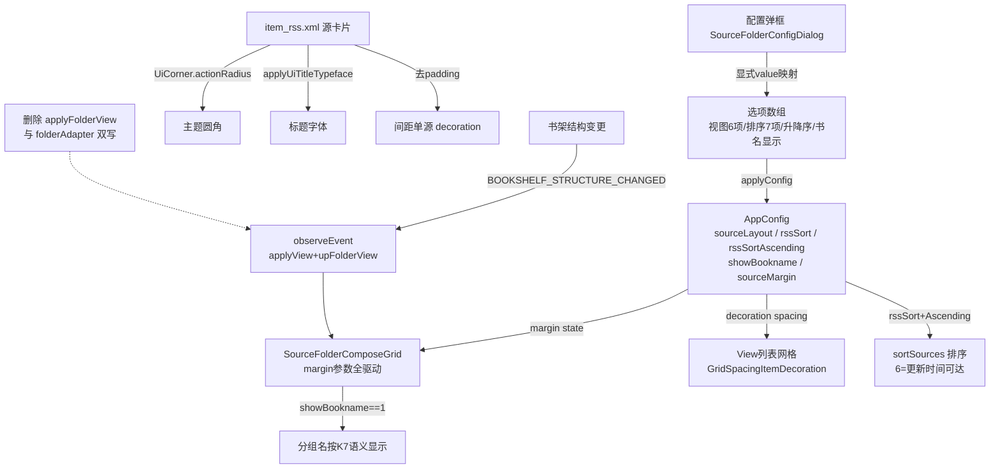
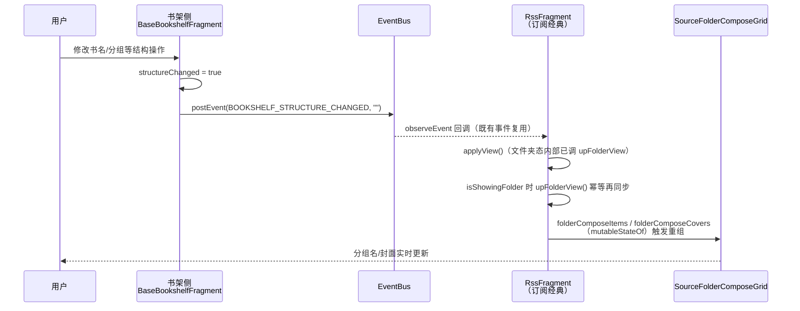
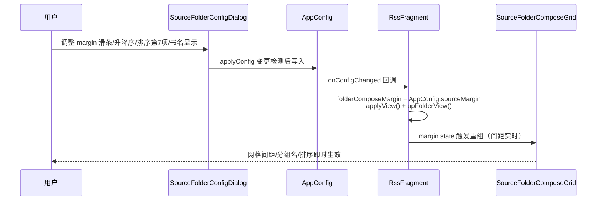

# rss-classic-layout-align 技术设计

> 经典订阅布局管理与书架对齐修复
> 状态：已实核定案（核查报告定案，直接实施）｜日期：2026-08-29
> 关联：`docs/specs/rss-classic-layout-align/tasks.md`（实施清单）

## Technical Approach

### 1. 现状链路（源码核实）

经典订阅页存在**双渲染轨**：文件夹视图走 Compose 网格，列表视图走 View 网格，共享同一组 `AppConfig` 配置（`SourceFolderConfigDialog` 统一写入）。

**配置消费链路**：

| 配置项 | 写入方 | 消费方 | 现状问题 |
|---|---|---|---|
| `sourceMargin` | 弹框滑条（0-60） | `RssFragment.applyListView()`（GridSpacingItemDecoration，RssFragment.kt:1063-1064）；`effectiveSpanCount()` 回退计算（:1086） | **Compose 文件夹网格未消费**（SourceFolderComposeGrid 硬编码 12/12/16dp）→ P1 |
| `rssSortAscending` | **无任何写入方**（AppConfig.kt:2861-2864，默认 true） | `RssFragment.sortSources()`（RssFragment.kt:1362） | 死配置 → P2 |
| `rssSort` | 弹框（6 项 0-5） | `sortSources()`（RssFragment.kt:1353-1360，**6→lastUpdateTime 分支已存在** ：1359） | 弹框数组缺第 7 项，6 不可达 → P3 |
| `showBookname` | 书架弹框（K7 语义 1=显示/0=无书名/2=遮罩） | 订阅 Compose 网格 SourceFolderComposeGrid.kt:87 | **语义反置 `!= 1`**（书架 BookshelfScreen.kt:312 为 `== 1`）；弹框无入口；跨页不联动 → P4 |
| `sourceLayout` | 弹框（7 项 mapIndexed 0-6） | `effectiveSpanCount()`（2..6 显式，0/1 回退自适应） | 「列表/紧凑列表」2 项为摆设（订阅固定卡片网格） → P5 |
| item_rss.xml | — | RssAdapter + RssFragment 头部「订阅源」入口卡片 | radius=12dp 硬编码 / tvName 无标题字体 / 根 padding 16dp 与 decoration 双重间距 → P6 |

**关键代码锚点**（实施基线，行号以 2026-08-29 源码为准）：

- `SourceFolderComposeGrid.kt:61-63`：`contentPadding(12,8,12)` + `spacedBy(12)` + `spacedBy(16)` 全硬编码，未接收 margin。
- `SourceFolderComposeGrid.kt:87`：`if (showBookname != 1)` 控制分组名显示（与书架语义反转）。
- `RssFragment.kt:1090-1102`：`initFolderComposeView()` 向 Compose 网格传 items/covers/spanCount，**不传 margin**；`folderComposeItems/folderComposeCovers` 为 `mutableStateOf`（:182-183），状态驱动重组。
- `RssFragment.kt:1072-1080`：`applyFolderView()` 全项目**无调用点**（applyView 文件夹分支直接走 Compose 轨），死代码。
- `RssFragment.kt:1244/1254`：`upFolderView()` 内 `folderAdapter.setItems(...)`/`folderAdapter.upCovers(...)` 与 Compose 状态双写，View 版文件夹适配器已无消费路径。
- `RssFragment.kt:291-296`：`observeEvent` 消费范式现成（NOTIFY_MAIN），RssFragment **未监听** `EventBus.BOOKSHELF_STRUCTURE_CHANGED`（EventBus.kt:8 定义；书架侧 BaseBookshelfFragment.kt:358 postEvent，BookshelfFragment1/2 已有观察者先例）。
- `BookshelfScreen.kt:279-285`（FolderGroupGridContent）：`margin: Int` 参数 + `val m = margin.coerceAtLeast(2).dp`，contentPadding / horizontalArrangement / verticalArrangement **全由 m 驱动** —— S1 对齐写法的权威参照。
- `SourceFolderConfigDialog.kt:243-251`：layouts 用 `mapIndexed`（index=value），移除前 2 项会使 Grid2-6 值错位 —— **必须改显式 value 映射**；:252-259 sorts 同款（6 项 0-5）。
- `FilletImageView.kt:26-62`：radius 仅在 init 从 styleable 读取一次，四角字段为 `private var`，**无运行时 setter**；`UiCorner.actionRadius(context): Float` 返回 px（`getDimension(R.dimen.ui_action_radius) × UiCorner.scale()`，UiCorner.kt:44-46）。
- `RssAdapter.kt:33-50`：convert 绑定 `tvName.text` + `ivIcon`（ImageLoader）；item_rss.xml 另有唯一消费点 RssFragment.kt:1047（头部固定卡片），两处均需应用视效。
- 字符串资源：`source_sort_0..5` 存在（strings.xml:1980-1985）缺 `source_sort_6`；`layout_list/layout_list_compact/layout_grid2..6` 存在（:65-70、:1641）缺 `layout_auto`。

### 2. 五项修复设计

#### S1 margin 参数化（P1）

`SourceFolderComposeGrid` 新增 `margin: Int` 参数，写法**逐行对齐 BookshelfScreen.kt:279-285**：

```kotlin
@Composable
fun SourceFolderComposeGrid(
    items: List<FolderItem>,
    covers: Map<String, String?>,
    spanCount: Int,
    margin: Int,                    // 新增
    onFolderClick: (FolderItem) -> Unit,
    onFolderLongClick: (FolderItem) -> Unit,
) {
    val m = margin.coerceAtLeast(2).dp
    LazyVerticalGrid(
        columns = GridCells.Fixed(spanCount),
        modifier = Modifier.fillMaxSize(),
        contentPadding = PaddingValues(start = m, top = m, end = m, bottom = m),
        horizontalArrangement = Arrangement.spacedBy(m),
        verticalArrangement = Arrangement.spacedBy(m),
    )
```

调用方 `RssFragment`：

- 新增状态 `private var folderComposeMargin by mutableStateOf(AppConfig.sourceMargin)`（与 folderComposeItems 同款 state 范式，保证弹框变更后重组）；
- `initFolderComposeView()` 传 `margin = folderComposeMargin`；
- `showFolderConfig()` 的 `onConfigChanged` 回调中同步 `folderComposeMargin = AppConfig.sourceMargin` → 滑条应用后网格间距**实时**刷新（无需重启/重进页面）。

#### S2 弹框补齐（P2/P3/P5）

`SourceFolderConfigDialog` 为 Compose 版弹框，选项统一走 `SourceFolderConfigOption(label, value)` 结构（互斥并发注意点：**禁止 mapIndexed 隐式赋值**，全部改显式 value 映射）：

1. **视图模式清理（S2-c）**：layouts 由 7 项改为 6 项——`自动(0)`、`Grid2(2)`…`Grid6(6)`；移除「列表」「紧凑列表」。存量 `sourceLayout=1` 无对应选项，选项匹配时归一为 0（自动），`effectiveSpanCount()` 已天然兜底（0/1 → 屏幕自适应）。新增字符串 `layout_auto`（values + values-zh）。
2. **排序补第 7 项（S2-b）**：sorts 增补 `source_sort_6`（"By Update Time"/"更新时间"），value=6 → `RssFragment.sortSources()` 既有 `6 -> sortedByDescending { lastUpdateTime }` 分支（RssFragment.kt:1359）即可达，无排序逻辑改动。
3. **升降序切换（S2-a）**：排序区新增一枚 tile（复用 `SourceFolderSelectItem` 两 chip 选项机制）：`升序(1)/降序(0)`，映射到 Boolean 写 `AppConfig.rssSortAscending`（默认 true）。`SourceFolderConfigValues` 增加 `sortAscending: Boolean` 字段；仅 `isBookSource == false` 时渲染与写入（当前 create 调用点仅 RssFragment:1167 传 false）。
4. **书名显示入口（S3②）**：新增 tile `显示(1)/隐藏(0)`，写 `AppConfig.showBookname`；初始值归一规则 `if (showBookname == 1) 1 else 0`（存量 2=遮罩为书架专属语义，订阅文件夹网格仅两态，非 1 一律按 0 处理），**写入时同样归一，禁止把 2 写回**。

`applyConfig()` 相应补写三个键（sourceLayout/rssSort/rssSortAscending/showBookname/sourceMargin 各自变更检测后统一 `onConfigChanged`，沿用现有 changed 聚合模式）。

#### S3 showBookname 三重修复（P4）

1. **语义修正（S3①）**：SourceFolderComposeGrid.kt:87 `showBookname != 1` → `showBookname == 1`（K7 语义：1=显示分组名，与书架 BookshelfScreen.kt:311-312 一致）。
2. **弹框入口（S3②）**：见 S2 第 4 点。
3. **跨页刷新（S3③）**：`RssFragment.onFragmentCreated` 增加（复用既有事件，**不新增**）：

```kotlin
observeEvent<String>(EventBus.BOOKSHELF_STRUCTURE_CHANGED) {
    applyView()
    if (isShowingFolder) upFolderView()
}
```

`applyView()` 在文件夹态内部已调 `upFolderView()`（RssFragment.kt:1148），显式再调一次为幂等双保险（防未来 applyView 行为变更）；列表态由 Room flow 自然刷新，此处仅同步文件夹视图的分组标签/封面。仅经典形态生效（`usingModernRss` 时 applyView 操作的容器不可见，无副作用）。

#### S4 item_rss 视效对齐（P6）

| 子项 | 现状 | 改法 |
|---|---|---|
| ① 圆角 | `app:radius="12dp"` 硬编码（item_rss.xml:22） | 移除 XML 属性；`FilletImageView` 新增最小公开 setter（四角字段赋值 + `invalidate()`），`RssAdapter.convert` 与 RssFragment 头部卡片两处调用 `ivIcon.updateCornerRadius(UiCorner.actionRadius(context).roundToInt())`（返回 px，与 styleable 读取的 getDimensionPixelOffset 同单位，无需换算误差） |
| ② 书名字体 | tvName 无标题字体；`android:lines="2"` 固定 | `binding.tvName.applyUiTitleTypeface(context)`（UiTypography.kt:116，View 侧惯例同 MainTopBarView:196）；XML `lines="2"` → `minLines="2"`；注意 applyUiTitleTypeface 会同步标题色（titleTextColor），登记为预期视效变化 |
| ③ 间距单源 | 根布局 `android:padding="16dp"`（:10）与 GridSpacingItemDecoration 叠加 | 移除 item 自身 padding，间距由 `gridSpacingDecoration`（RssFragment.kt:180，applyListView :1062-1065 已按 sourceMargin 设置）单源驱动 |

封面比例 **1:1（50dp）保持不变**，与文件夹网格 3:4 的差异登记（见 AD-04）。

#### S5 死代码清理（P7）

- 删除 `RssFragment.applyFolderView()`（:1071-1080，含注释，全项目无调用点）；
- 删除 `upFolderView()` 内 `folderAdapter.setItems(...)`（:1244）与 `folderAdapter.upCovers(...)`（:1254）双写；
- `FolderItem` 数据类**保留**（ComposeGrid 数据模型）；`SourceFolderAdapter` 类保留（`calculateSpanCount/spacingPx` 仍被 `effectiveSpanCount/applyListView` 引用）；`folderAdapter` 字段若删除双写后无其余引用，连同声明与 import 一并清理（以编译器 unused 告警为准）。
- 登记不修：SourceFolderAdapter.kt:78 存在同款 `showBookname != 1` 语义反置，但其唯一数据源即本次删除的双写，删除后不可达，登记 issues-found 观察项，不在本 spec 扩散修改。

### 3. 修复总览



## Architecture Decisions

**AD-01 margin 参数化对齐书架单源驱动**
In the context of 订阅文件夹 Compose 网格间距硬编码导致 sourceMargin 失效，facing 弹框滑条调节在文件夹视图完全无效且与书架 FolderGroupGridContent 行为不一致的关切，we decided 新增 `margin: Int` 参数并以 `margin.coerceAtLeast(2).dp` 全量驱动 contentPadding 与双向 spacedBy（逐行对齐 BookshelfScreen.kt:279-285），to achieve 弹框单一配置源在双渲染轨（Compose/View）实时生效，accepting 文件夹网格 top/bottom padding 从 8dp 变为随 margin 联动（与书架完全一致，属对齐预期而非回归）。

**AD-02 复用书架结构事件做跨页同步而非新增事件**
In the context of 书架侧分组/书名结构变更后订阅文件夹视图陈旧，facing 新增专用事件会放大事件总线面积且书架已有 `BOOKSHELF_STRUCTURE_CHANGED` 广播语义吻合的关切，we decided RssFragment 直接 `observeEvent` 消费既有事件并幂等地 `applyView()+upFolderView()`，to achieve 零新增事件类型的最小跨页同步闭环，accepting 订阅页会响应书架全部结构类广播（刷新幂等且容器不可见时无副作用，代价可忽略）。

**AD-03 弹框选项清理而非补列表实现（用户决策固定卡片）**
In the context of 视图模式「列表/紧凑列表」在订阅页为不可达摆设（订阅固定卡片网格）且列表实现早已移除，facing 补回列表实现会引入双倍维护面并违背"订阅源默认卡片"用户决策的关切，we decided 仅清理弹框选项（7 项 → 自动/Grid2-6 共 6 项）并将 `mapIndexed` 隐式赋值改为显式 value 映射，to achieve 弹框选项与真实渲染能力一一对应且存量配置值（2-6）零迁移，accepting 存量 `sourceLayout=1` 用户首次打开弹框显示为"自动"（行为本就是自适应回退，无感）。

**AD-04 item_rss 视效对齐范围（比例 1:1 保留）**
In the context of 源卡片圆角/字体/间距与全局主题体系脱节，facing FilletImageView 无运行时 setter、且封面比例与文件夹网格（3:4）不一致的关切，we decided 最小扩展 FilletImageView 公开圆角 setter 并接入 `UiCorner.actionRadius(context)`（px 单位直配）、tvName 走 `applyUiTitleTypeface` View 侧惯例、删除 item 自身 padding 交由 decoration 单源驱动，同时**保留 50dp 1:1 封面比例不改**，to achieve 视效与主题/字体/圆角全局 token 对齐且不扩散到网格形态，accepting 封面比例与文件夹网格 3:4 的差异继续存在（登记为形态差异，非缺陷）。

## Data Flow

跨页同步时序（书架侧结构变更 → 订阅经典页刷新）：



弹框配置流（S1/S2 实时生效）：



## File Changes

| # | 文件 | 类型 | 变更内容 | 关联 |
|---|---|---|---|---|
| 1 | `app/src/main/java/io/legado/app/ui/adapter/SourceFolderComposeGrid.kt` | 修改 | 新增 `margin: Int` 参数全驱动间距（对齐 BookshelfScreen.kt:279-285）；:87 `!= 1` → `== 1` | S1/S3① |
| 2 | `app/src/main/java/io/legado/app/ui/adapter/SourceFolderConfigDialog.kt` | 修改 | layouts 显式映射清理为 6 项；sorts 补第 7 项；新增升降序 tile（写 rssSortAscending）；新增书名显示 tile（写 showBookname，0/1 归一）；`SourceFolderConfigValues` 加 `sortAscending` 字段；applyConfig 补写 | S2/S3② |
| 3 | `app/src/main/java/io/legado/app/ui/main/rss/RssFragment.kt` | 修改 | 新增 `folderComposeMargin` state 并传入网格；新增 `BOOKSHELF_STRUCTURE_CHANGED` 监听（applyView+upFolderView）；删除 `applyFolderView()` 与 `upFolderView` 内 folderAdapter 双写 | S1/S3③/S5 |
| 4 | `app/src/main/res/layout/item_rss.xml` | 修改 | 删根 padding 16dp；删 `app:radius="12dp"`；`lines="2"` → `minLines="2"` | S4 |
| 5 | `app/src/main/java/io/legado/app/ui/main/rss/RssAdapter.kt` | 修改 | convert 中 tvName `applyUiTitleTypeface` + ivIcon 应用 `UiCorner.actionRadius` 主题圆角 | S4 |
| 6 | `app/src/main/java/io/legado/app/ui/widget/image/FilletImageView.kt` | 修改 | 新增运行时圆角 setter（四角赋值 + invalidate；S4 派生最小扩展，定案清单外延已核实必要） | S4① |
| 7 | `app/src/main/res/values/strings.xml`（含 values-zh） | 修改 | 新增 `layout_auto`、`source_sort_6` | S2 |
| 8 | `app/src/main/assets/updateLog.md` | 修改 | `## cronet版本:` 之后追加用户语言交付条目（编译前完成） | 门禁 |
| 9 | `docs/specs/rss-classic-layout-align/`（本目录） | 新增 | design.md / tasks.md；实施完成后沉淀 `how-to.md` | 本 spec |

## 风险与范围边界

- **不覆盖 modern 形态**：所有改动位于经典订阅渲染轨与共享弹框；modern 订阅页（MainTopBarView 轨）零触碰。
- **无硬编码色**：视效统一走 `UiCorner` / 主题 token / `applyUiTitleTypeface`，不引入新色值。
- **复用既有事件**：`BOOKSHELF_STRUCTURE_CHANGED`（EventBus.kt:8）零新增。
- **共享弹框影响面**：`SourceFolderConfigDialog.create` 当前唯一调用点为 RssFragment:1167（isBookSource=false），选项清理不影响书源管理页；isBookSource 分支代码保留不动。
- **SourceFolderAdapter.kt:78 同款语义反置**：登记不修（删除双写后不可达，见 S5）。
- **tvName 字体色变化**：`applyUiTitleTypeface` 会将标题色切至 `titleTextColor`，属对齐预期，验证时按新视效核对。
