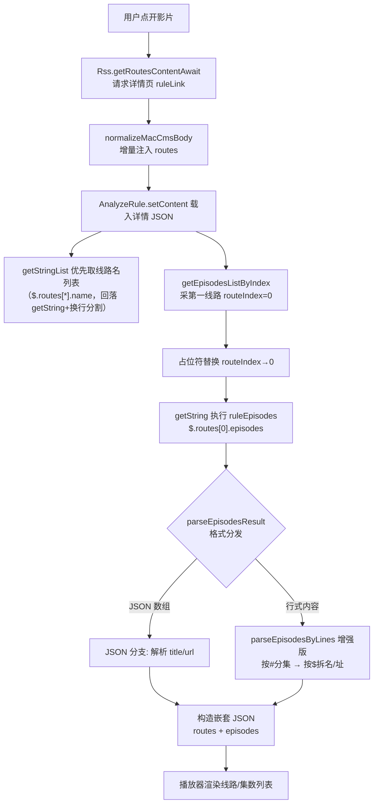
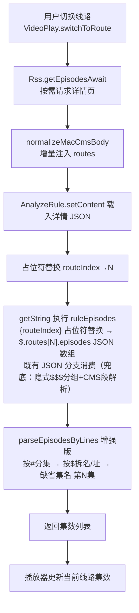

# Design: rss-cms-multiroute-nojs

> 功能：视频订阅源多线路多集零 JS 解析增强 + CMS 采集书源转化
> 日期：2026-08-31 ｜ 状态：设计中
> 同目录文档：proposal.md / spec.md / tasks.md

## 1. 背景与设计目标

基于源码核实的现状结论：

- `ruleRoutes` / `ruleEpisodes` 均经 `AnalyzeRule.getString()` 执行（`Rss.kt` L179 / L232）；`{{...}}` 大括号模板在 `AnalyzeRule.kt` L740-L757 处理，`$.` 开头内容经 `isRule()`（L783-L788）判定为子规则递归执行 → **大括号模板语法已可用，无需新增**。
- 已有能力：`{routeIndex}` / `{routeIndex+1}` 占位符（`Rss.kt` L221-L236，先替换占位符再 `getString`）；`replaceRegex` 语法 `rule##regex##replacement[##first]`（`AnalyzeRule.kt` L770-L780 按 `##` 分段，第 4 段置 `replaceFirst=true`）。
- 缺口一（格式）：`parseEpisodesByLines`（`Rss.kt` L277-L288）只支持多行 URL，不识别 MacCMS 分隔格式 `集名$URL#集名$URL$$$…`；`parseEpisodesResult`（L242-L272）仅支持 JSON 数组 `[{"title","url"}]` / `["url"]` / 多行 URL。
- 缺口二（范式）：书源目录 `ruleToc.chapterList` 走 **`getElements` 列表范式**（`BookChapterList.kt` L206 元素集合 → L236-L242 逐元素 `setContent(item)` + `getString(chapterName/chapterUrl)` 提取）；而视频订阅源 `ruleRoutes` 是 `getString` 单字符串 + `\n` 分割（`Rss.kt` L179-L180）——**不是列表范式**，写 `$.xxx[*].name` 会把数组 toString 成单串导致分割失效。用户明确要求：视频订阅源多线路多集应与书源目录机制同构（"会写目录就会写多线路多集"）。

设计目标（v3）：**数据规范化层（主链路）+ 列表范式升级 + 兜底链路**三层，让 ruleRoutes/ruleEpisodes 与书源目录同构、五种模式随意写、零 JS；MacCMS 扁平格式适配全部沉淀解析层。

## 2. Technical Approach

### 2.1 A. 数据规范化层（主链路）：MacCMS 扁平格式 → 结构化 routes（对齐书源目录范式）

机制：在多线路/集数采集的 `AnalyzeRule.setContent(body)` 之前，对详情响应 JSON 做**增量规范化**——检测到 MacCMS 扁平播放字段（`vod_play_from` / `vod_play_url` 含 `$$$`）时，注入结构化 `routes` 字段，原字段原样保留（不破坏其他规则取数）：

```kotlin
/**
 * MacCMS 扁平播放数据规范化：vod_play_from / vod_play_url 含 $$$ 时，
 * 在原 JSON 增量注入结构化 routes 字段（原字段不动），供列表范式规则随意消费。
 * 非 JSON body / 无 MacCMS 特征字段时原样返回（零侵入）。
 */
private fun normalizeMacCmsBody(body: String): String {
    val json = runCatching { JSONObject(body) }.getOrNull() ?: return body
    val item = json.optJSONArray("list")?.optJSONObject(0) ?: json
    val from = item.optString("vod_play_from")
    val urls = item.optString("vod_play_url")
    if (!from.contains("$$$") && !urls.contains("$$$")) return body
    val names = from.split("\$\$\$")
    val groups = urls.split("\$\$\$")
    val routes = JSONArray()
    names.forEachIndexed { i, name ->
        val eps = JSONArray()
        (groups.getOrNull(i) ?: "").split('#')
            .map { it.trim() }.filter { it.isNotBlank() }
            .forEach { piece ->
                val parts = piece.split('$', limit = 2)
                eps.put(JSONObject().apply {
                    put("title", parts.getOrNull(0)?.ifBlank { "第${eps.length() + 1}集" } ?: "第${eps.length() + 1}集")
                    put("url", parts.getOrNull(1) ?: parts.getOrNull(0) ?: "")
                })
            }
        routes.put(JSONObject().apply { put("name", name.trim()); put("episodes", eps) })
    }
    item.put("routes", routes)
    return json.toString()
}
```

调用点（2 处，均在既有 `setContent` 前）：`Rss.getRoutesContentAwait`（L174）、`Rss.getEpisodesAwait`（L315 附近）——`analyzeRule.setContent(normalizeMacCmsBody(res.body))`。判定开销为一次 JSONObject 解析（详情响应体量小）。

规范化后的数据形态（规则可随意消费的结构化 JSON）：

```json
"routes": [
  {"name": "m3u8", "episodes": [{"title": "第01集", "url": "https://host/path/01.m3u8"}, ...]},
  {"name": "bilibili", "episodes": [...]}
]
```

要点：

1. **增量注入零破坏**：只新增 `routes` 字段，原 `vod_play_from`/`vod_play_url` 原样保留——其他规则/旧源取数不受任何影响。
2. **零侵入判定**：非 JSON body（HTML 详情页）/ 无 MacCMS 特征字段 → 原样返回，规范化层完全不触发。
3. `split('$', limit = 2)`：地址内再次出现 `$` 字符时保留在 URL 部分，不截断；`#` 分割天然兼容单集。
4. 调用点仅 2 处且都在既有 `setContent` 前，不影响列表页/搜索链路。

### 2.2 B. 列表范式升级（ruleRoutes / ruleEpisodes 对齐书源目录）

书源目录范式（`BookChapterList.kt` L206/L236-L242）：`chapterList` 列表选择器 → `getElements` 元素集合 → 逐元素子规则提取。视频订阅源对齐升级：

**ruleRoutes（线路名列表）——列表范式优先**：

- 采集点（`Rss.kt` L179-L180）改为：优先 `analyzeRule.getStringList(ruleRoutes)`，返回非空列表直接作为线路名集合；
- 回落：`getStringList` 空时回落既有 `getString` + `\n` 分割（兼容旧源写法 `$.list[0].vod_play_from##\$\$\$##\n`）；
- 规范化后的标准写法：**`$.routes[*].name`**——纯列表规则，与书源目录 `chapterList` 心智一致。

**ruleEpisodes（集数列表）——列表范式随意写**：

- 规范化后标准写法：**`$.routes[{routeIndex}].episodes`**——`{routeIndex}` 占位符（`Rss.kt` L221-L236 既有机制）替换后即 `$.routes[2].episodes` 纯 JSONPath 下标，`getString` 返回 JSON 数组文本 `[{"title":..,"url":..}]`，由 `parseEpisodesResult` 既有 JSON 分支（L246-L269）直接消费，`title`/`url` 完整保留（第N集命名用源数据，不再强制"第N集"）；
- 五种模式随意写：结构化 JSON 站 JSONPath 下标、网页站 CSS/XPath、复杂逻辑 JS——占位符对全部模式透明生效；
- 兜底（规范化层不触发的异常数据）：v2 隐式 `$$$` 分组保留——`parseEpisodesResult` 加 `routeIndex` 参数（2 处调用点传入），结果非 JSON 数组且含 `$$$` 时分组取第 N 组，组内走 CMS 段解析：

```kotlin
// 兜底层：CMS 段解析（parseEpisodesByLines 增强，规范化层失手时生效）
// 行内含 $ 时：先按 # 分割单集，再按 $ (limit=2) 拆名/址；无 $ 保持旧纯 URL 分支
line.split('#').map { it.trim() }.filter { it.isNotBlank() }
    .forEach { piece ->
        val parts = piece.split('$', limit = 2)
        episodes.add(RssEpisode(
            title = parts.getOrNull(0)?.ifBlank { "第${episodes.size + 1}集" } ?: "第${episodes.size + 1}集",
            url = NetworkUtils.getAbsoluteURL(rssArticle.origin, parts.getOrNull(1) ?: parts[0])
        ))
    }
```

**L2 高级可选写法（v1/v2 正则选段，保留但降级）**：`$.list[0].vod_play_url##(?:.*?\$\$\$){routeIndex}(.*?)(?:\$\$\$.*)?$##$1`（Kotlin `Regex.replace` 语义，替换组 `$1`，`\1` 为字面量禁用；选段结果不含 `$$$` 不触发兜底分组，天然兼容）。仅供精确控制场景，不是推荐写法。

**线路名兜底写法**：`$.list[0].vod_play_from##\$\$\$##\n`（replaceRegex 转行，注意成对 `##` 分段，源 JSON 内 `\` 双写）。

### 2.3 C. 大括号模板链路（{{$.xxx}} 内嵌子规则）

执行链路（`AnalyzeRule.kt`）：

```
splitSourceRule(L538)
  → makeUpRule 拆出 {{...}} 段（ruleParam / ruleType）
  → jsRuleType 分支(L740-L757) → isRule() 判定(L783-L788)
      ├─ "$."开头 → getOrCreateSingleSourceRule + 递归 getString（JSONPath 子规则）
      └─ 非规则串 → evalJS
  → infoVal 重组回填(L730-L767) → rule = 最终字符串
```

- `isRule()` 判定依据：`@` / `$.` / `$[` / `//` 开头视为规则，否则当 JS 求值。
- 典型应用（ruleLink，列表项级模板）：

  ```
  https://{站点A-API域名}/api.php/provide/vod?ac=detail&ids={{$.vod_id}}
  ```

  对 `$.list[*]` 每一项递归取 `vod_id` 并回填，生成逐项的绝对详情 URL。
- `searchUrl` 中的 `{{page}}` / `{{key}}` 走 `AnalyzeUrl` 同源占位符体系，不经过本链路。

### 2.4 D. 每站一源转化（零 JS 书源化）

将 MacCMS 采集站 API 转化为单个订阅源，规则映射表（域名用 `{站点A-API域名}` 占位）：

| 源字段 | 规则 | 说明 |
|--------|------|------|
| ruleArticles | `$.list[*]` | 详情 JSON 列表 |
| ruleTitle | `$.vod_name##\.mp4$` | 去除标题误带后缀（replacement 缺省空串，`SourceRule` L599） |
| ruleImage | `$.vod_pic` | 封面 |
| ruleDescription | `$.vod_remarks` | 备注 / 更新状态 |
| ruleLink | `https://{站点A-API域名}/api.php/provide/vod?ac=detail&ids={{$.vod_id}}` | 绝对 URL + 大括号模板（AD-03） |
| ruleRoutes | `$.routes[*].name` | **列表范式**（规范化层注入 routes 后纯列表规则，与书源目录 chapterList 同心智，AD-02） |
| ruleEpisodes | `$.routes[{routeIndex}].episodes` | **列表范式**（{routeIndex} 占位符 → JSONPath 下标，[{title,url}] 由既有 JSON 分支消费，AD-02） |
| ruleContent | 留空 | 走多线路播放器模式（AD-06） |
| searchUrl | `https://{站点A-API域名}/api.php/provide/vod?ac=detail&pg={{page}}&wd={{key}}` | 搜索 |
| sortUrl | `分类名::URL&&&分类名::URL&&&…` | 静态分类枚举（AD-04，实施时请求 API class 数组生成） |

数据基线（MacCMS 详情字段）：`vod_play_from`（如 `m3u8$$$播放源B`）、`vod_play_url`（如 `第01集$https://host/path/01.m3u8#第02集$https://host/path/02.m3u8$$$第01集$…`）。

落盘注意：规则文本中的 `\` 写入源 JSON 时一律双写（`\\$`）；换行用 JSON `\n` 转义；`{routeIndex}` 为占位符原样保留，不做 JSON 转义。

### 2.5 E. 目标书源逐字段适配样例（MacCMS 聚合采集书源"资源采集" → 量子站订阅源）

原书源每个规则在适配后的去向（原书源 = 用户提供的 MacCMS 聚合采集书源，13 资源站 loginUi 菜单切换）：

| 原书源字段 | 原写法 | 适配后订阅源字段 | 适配说明 |
|-----------|--------|----------------|---------|
| exploreUrl | `@js:` 请求 API 拉 class 数组动态生成分类 | sortUrl | 静态枚举 `分类名::URL&&&…`（分类字段不走解析层，实施时请求真实 class 填入，AD-04） |
| searchUrl | `{{getUrl(ziyuan,M("资源站"))}}/api.php/provide/vod?ac=detail&pg={{page}}&wd={{key}}` | searchUrl | 菜单选站 → 写死该站 API 域名，`{{page}}`/`{{key}}` 占位符保留 |
| ruleSearch.bookUrl | `@js:baseUrl.replace(/&pg=.*/,'&ids={{$.vod_id}}')` | ruleSearch 对应字段（实施时核实 RssSource 搜索字段名） | **JS 改大括号模板**：`https://{站点A-API域名}/api.php/provide/vod?ac=detail&ids={{$.vod_id}}` 绝对 URL |
| ruleSearch.name | `$.vod_name##\.mp4$` | ruleTitle | 原样复用（列表项与搜索项同构） |
| ruleSearch.coverUrl / intro | `$.vod_pic` / `$.vod_content` | ruleImage / ruleDescription | 直接映射；列表项备注用 `$.vod_remarks` |
| ruleToc.chapterList（约 40 行 JS：拆 `$$$`/`#`/`$` + 付费平台拼解析接口） | `@js:` 整段 | ruleRoutes + ruleEpisodes | **全部由规范化层 + 列表范式替代，零 JS**（见 §2.1/§2.2） |
| ruleContent.content | `@js:` 网页嗅探（DPlayer `url:`/`main=` 正则）+ 附加 referer headers | ruleContent | **留空**，播放机制见下 |
| ruleContent.subContent（弹幕拉取转换） | `@js:` dmku 接口弹幕转 XML | 不适配 | Out of Scope（本项目播放器弹幕体系独立，后续批次） |
| loginUi（资源站/解析接口菜单） | `@js:` 生成 select 菜单 | 不适配 | 每站一源（AD-05） |

**ruleContent 留空后的播放机制（嗅探职责转移）**：

1. 多线路模式下 ruleContent 不参与——集数地址由 ruleEpisodes 直接给出进播放器；
2. 地址为 m3u8/mp4 **直链**（MacCMS 采集站主流）→ 直接起播，无需嗅探；
3. 地址为**网页型**（付费平台线路等）→ 播放器内置嗅探链（多路规则嗅探 + 降级链）兜底，职责上替代原书源 ruleContent 内的 `@js` 嗅探段——覆盖面差异需真机验证（任务 5.4，风险表已列）；
4. 差异点：原书源为网页嗅探附加 referer headers，本项目 RssEpisode 暂无 headers 字段；MacCMS 采集站 m3u8 通常无 referer 校验，Drawbacks 已记录接受。

**预计适配后订阅源写法（量子站，域名实施时替换真实值）**：

```json
{
  "rssSourceUrl": "{站点A-API域名}",
  "rssSourceName": "站点A采集",
  "type": 2,
  "sortUrl": "电影::https://{站点A-API域名}/api.php/provide/vod?ac=detail&pg={{page}}&t=1&&&剧集::…t=2&&&…",
  "searchUrl": "https://{站点A-API域名}/api.php/provide/vod?ac=detail&pg={{page}}&wd={{key}}",
  "ruleArticles": "$.list[*]",
  "ruleTitle": "$.vod_name##\\.mp4$",
  "ruleImage": "$.vod_pic",
  "ruleDescription": "$.vod_remarks",
  "ruleLink": "https://{站点A-API域名}/api.php/provide/vod?ac=detail&ids={{$.vod_id}}",
  "ruleRoutes": "$.routes[*].name",
  "ruleEpisodes": "$.routes[{routeIndex}].episodes",
  "ruleContent": ""
}
```

（实际字段名以 RssSource 实体为准，实施时对照；ruleRoutes/ruleEpisodes 的兜底写法见 §2.2 末尾。）

## 3. Architecture Decisions

> Y-Statement 模板：Context / Concern / Decision / Goal / Tradeoff / Status

### AD-01: MacCMS 扁平格式由数据规范化层原生支持（vs 源内 JS / 源内正则）

- **Context**: MacCMS 采集站播放数据为 `集名$URL#集名$URL$$$…` 扁平编码；现有解析层（`parseEpisodesByLines` L277-L288 / `parseEpisodesResult` L242-L272）不识别；书源生态对此同样只能靠 JS，无成熟范式可抄。
- **Concern**: 扁平格式知识若落在源规则（JS 或正则 hack），每个源重复适配、难审计；若散落在播放层，格式知识泄漏到错误层级。
- **Decision**: 解析层新增数据规范化 `normalizeMacCmsBody`——检测 `vod_play_from`/`vod_play_url` 含 `$$$` 时在原 JSON **增量注入**结构化 `routes: [{name, episodes:[{title,url}]}]`（原字段不动、非 JSON/无特征零侵入），在 `setContent` 前（2 处调用点）透明生效。
- **Goal**: 规则引擎面对的永远是结构化数据，五种模式随意写；MacCMS 适配一次沉淀全源复用。
- **Tradeoff**: 解析层多一次 JSONObject 解析开销（详情体量小，可接受）；规范化字段名 `routes` 成为隐式契约，需文档与日志辅助（见风险表）。
- **Status**: Accepted（v3）

### AD-02: ruleRoutes/ruleEpisodes 升级列表范式，对齐书源目录机制（v3 修订）

- **Context**: 书源目录 `ruleToc.chapterList` 是 `getElements` 列表范式（元素集合 → 逐元素子规则提取，`BookChapterList.kt` L206/L236-L242）；视频订阅源 `ruleRoutes` 是 `getString` 单字符串 + `\n` 分割（`Rss.kt` L179-L180），写 `$.xxx[*].name` 列表规则会把数组 toString 成单串导致失效。用户明确要求：多线路多集应与书源目录机制同构，"会写目录就会写多线路多集"。
- **Concern**: 若维持单字符串范式，列表规则不可用，开发者心智割裂（会写书源目录却不会写视频多线路多集）。
- **Decision**: 三层结构——①规范化层（AD-01）注入结构化 routes；②`ruleRoutes` 采集点改 `getStringList` 优先（列表规则直接可用），空时回落 `getString`+`\n`（旧源兼容）；③`ruleEpisodes` 标准写法 `$.routes[{routeIndex}].episodes`（占位符对五种模式透明生效），结果 JSON 数组由既有 `parseEpisodesResult` JSON 分支消费；④兜底链路（隐式 `$$$` 分组 + CMS 段解析）保留，覆盖规范化层不触发的异常数据。
- **Goal**: ruleRoutes/ruleEpisodes 与 chapterList/chapterName 同构；开发者按书源目录习惯随意写五种模式；旧源零回归（回落路径原样保留）。
- **Tradeoff**: `ruleRoutes` 采集点新增 getStringList 分支（一条 if 的复杂度）；规范化 `routes` 字段成为隐式契约；兜底链路使 parseEpisodesResult 签名变更（2 处调用点）。
- **Status**: Accepted（v3，2026-08-31 用户检查点修订，取代 v2 两级策略；v1/v2 正则选段降级为 L2 高级可选写法）

### AD-03: ruleLink 绝对 URL + 大括号模板（vs 相对路径拼接）

- **Context**: `RssParserByRule` 对列表项 link 有 isUrl 处理，相对路径会被自动拼接补全（tvbox 转化曾遇 `vod_id` 被当相对路径误拼的坑）；`AnalyzeRule` 大括号模板已支持 `{{$.xxx}}` 内嵌子规则（`AnalyzeRule.kt` L740-L757、L783-L788）。
- **Concern**: 依赖"相对路径 + 隐式拼接"会与 isUrl 逻辑相互作用，产生 `base+vod_id` 类脏链接，且行为隐蔽、难排查。
- **Decision**: `ruleLink` 直接写绝对 URL 模板 `https://{站点A-API域名}/api.php/provide/vod?ac=detail&ids={{$.vod_id}}`，`vod_id` 由模板内嵌子规则回填。
- **Goal**: 链接语义显式、来源可追溯，规避 isUrl 相对拼接坑。
- **Tradeoff**: API 域名硬编码进源 JSON（域名变更需改源，与每站一源策略一致）；每项多一次模板子规则递归取值。
- **Status**: Accepted

### AD-04: sortUrl 静态分类枚举（vs 动态分类立项）

- **Context**: MacCMS API 提供 class 分类数组；本功能边界是解析增强 + 站点转化。
- **Concern**: 动态分类需要"请求后生成 sortUrl"的新机制或 JS 钩子，扩大改动面、引入新执行路径。
- **Decision**: 实施时一次性请求 API class 数组，静态生成 `分类名::URL&&&…` 格式 sortUrl 写入源 JSON。
- **Goal**: 零新机制、零 JS，交付最小闭环。
- **Tradeoff**: 站点分类调整后需重新生成源（静态性）；接受该维护成本，动态分类留待后续独立立项。
- **Status**: Accepted

### AD-05: 每站一源（vs loginUi 菜单机制移植）

- **Context**: 多个 CMS 采集站接口结构同构，仅域名与个别字段差异。
- **Concern**: 移植 loginUi 菜单机制实现"一源多站切换"需扩展订阅源组件能力，改动大、超出本功能范围。
- **Decision**: 每站一个订阅源 JSON，域名等参数在生成时替换。
- **Goal**: 源结构简单、互不影响、可独立调试；转化过程可批量复制。
- **Tradeoff**: 源数量随站点数线性增长；用可接受的冗余换取零机制成本。
- **Status**: Accepted

### AD-06: ruleContent 留空走多线路模式（vs ruleContent 解析播放地址）

- **Context**: 订阅源视频详情页中 `ruleContent` 有值会走单地址内容解析路径；`ruleRoutes` / `ruleEpisodes` 驱动多线路多集路径（`Rss.kt` `getRoutesContentAwait` L153-L209）。
- **Concern**: 若用 `ruleContent` 解析播放地址，单地址路径与多线路 / 按需采集路径冲突，线路切换能力丢失。
- **Decision**: `ruleContent` 留空，由 `ruleRoutes` + `ruleEpisodes` 驱动嵌套 JSON 与播放器多线路模式。
- **Goal**: 完整保留"首线路即采 + 其余线路按需采"链路与切换体验。
- **Tradeoff**: 不走单地址直连播放的极简路径（本场景本就需多线路，无实际损失）。
- **Status**: Accepted

## 4. Data Flow

### 4.1 链路①：多线路采集（点开影片时全量构建）



### 4.2 链路②：切换线路按需采集



## 5. File Changes

| 文件 | 变更类型 | 变更内容 |
|------|---------|---------|
| `app/src/main/java/io/legado/app/model/rss/Rss.kt` | 修改 | `parseEpisodesByLines` 增强 CMS 格式解析：行内含 `$` 时按 `#` 分集、按 `$`（limit=2）拆名/址，缺名补"第N集"，保留旧多行 URL 分支 |
| 订阅源 JSON（实施产出，存放位置实施时定） | 新增 | 站点A（MacCMS 采集站）视频订阅源 |
| `docs/specs/rss-cms-multiroute-nojs/*` | 新增 | 四文档（proposal / design / spec / tasks） |
| `docs/INDEX.md` | 修改 | 状态流转 |
| `docs/project-flow/modules/rss-subsystem.md` | 修改 | 集数格式支持说明同步（实施完成后） |

## 6. Risks & Mitigations

| 风险 | 缓解 |
|------|------|
| replaceRegex 正则回溯正确性（N=0 取首线路、N=末段、尾部锚定等边界） | 单元用例先行（N=0 / 中间 / 末段 / 越界四类输入），真机验证切换线路链路；正则选段已降级为 L2 可选写法 |
| URL 中含 `#` 或 `$` 字符导致按分隔符误切 | 解析容错：`$` 用 limit=2 保留地址段完整；`#` 误切仅影响个别集并记 `AppLog`，不中断整体解析 |
| 现有多行 URL / JSON 数组格式回归 | `parseEpisodesByLines` 保留旧分支（行内无 `$` 走原逻辑），`parseEpisodesResult` 分发顺序不变；跑既有订阅源回归验证 |
| `RssParserByRule` link 的 isUrl 相对拼接坑 | `ruleLink` 一律绝对 URL + 大括号模板回填 `vod_id`，不依赖相对路径隐式拼接（AD-03） |
| `routeIndex` 越界（线路数与 `vod_play_url` 段数不一致）时正则不匹配返回原串 | 生成源时校验 `vod_play_from` 与 `vod_play_url` 段数一致；解析异常时记日志并返回空列表，不崩溃 |
| routes 字段为规范化层隐式契约，其他数据源若自带 routes 字段会被覆盖 | 注入前检测 item 已有 routes 字段则跳过规范化并记 AppLog |

## 7. 规则语法校验注记（源码实证修正）

以下两处对规则文本做了源码级核实修正，实施时以本文为准：

1. **替换串分组引用必须写 `$1`**：`replaceRegex` 应用侧走 Kotlin `Regex.replace`（`AnalyzeRule.kt` L494-L514），Kotlin 替换串语义（stdlib TextH）中 `\` 仅转义紧随字符，`\1` 输出字面量 `1`，分组引用唯一合法写法为 `$1`（Java `Matcher.appendReplacement` 中 `\1` 同样是字面量，已查证）。
2. **ruleRoutes 分隔符必须为成对 `##`**：`split("##")` 需拆出 rule / regex / replacement 三段，正确写法 `##\$\$\$##\n`；若写成 `##\$\$\$#\n#` 会因缺少第二个 `##` 拼段为单一 regex 导致规则失效（无匹配、原串返回）。
