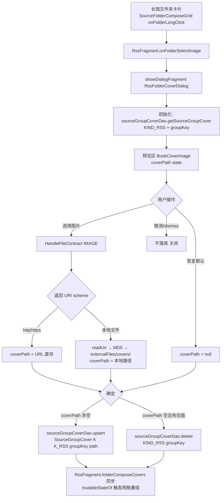

# Design：rss-folder-cover-dialog-align（订阅文件夹封面弹框对齐书架）

## Technical Approach

新建 `RssFolderCoverDialog : ComposeDialogFragment()`（`ui/main/rss/` 包），UI 骨架对齐 `GroupEditDialog`：

```
RssFolderCoverDialog(folder: FolderItem)
 ├─ ComposeDialogFragment 基类（AppDialogSize.Form / CENTER / AnimDialogCenter）
 ├─ AppDialogFrame(title="封面设置", actions=底部按钮行)
 │   ├─ 预览区：Box(90x120dp) + BookCoverImage（coverPath state 驱动）
 │   ├─ 说明行：次级文字提示（选图/恢复默认语义）
 │   └─ actions：LegadoMiuixActionButton ×（恢复默认[条件显示] / 取消 / 确定[primary]）
 ├─ selectImage = registerForActivityResult(HandleFileContract()) — 克隆 GroupEditDialog.selectImage
 │   ├─ http/https → coverPath = uri.toString()
 │   └─ 本地 → readUri → MD5 → externalFiles/covers/ → coverPath = 路径
 └─ 保存：确定 → coverPath 非空 upsert / 为空且有旧值 delete → 更新 RssFragment.folderComposeCovers
```

长按入口改造：`RssFragment.onFolderSelectImage(folder)` 由"launch HandleFileContract"改为"showDialogFragment(RssFolderCoverDialog(folder))"；原 `selectFolderCover` launcher 与直接落库回调迁移进弹框。

文件落库逻辑迁移说明：RssFragment.kt L189-225 的 readUri/MD5/upsert 链路整体移入弹框（与 GroupEditDialog.selectImage 同构），落库时机由"选图回调立即落库"改为"确定时落库"。

## Architecture Decisions

### AD-01: 新建独立弹框而非复用 GroupEditDialog

- **Context**: 书架 GroupEditDialog 强耦合 BookGroup 实体与 GroupViewModel（分组名/排序/删除），订阅分组为字符串标签无实体
- **Concern**: 复用需传伪实体 + 大量禁用分支，修改公共弹框会波及书架
- **Decision**: 新建 RssFolderCoverDialog，骨架克隆标准体系，业务层独立
- **Goal**: 视觉/交互对齐书架，两侧代码互不影响
- **Tradeoff**: 接受容器层骨架相似代码（容器本就是标准组件 AppDialogFrame，重复度低）
- **Status**: Accepted

### AD-02: 存储层保持 source_group_covers 表不变

- **Context**: 书架封面存 BookGroup.cover 字段；订阅封面存 source_group_covers（复合主键 kind+groupName，KIND_RSS）
- **Concern**: 是否统一存储模型
- **Decision**: 不迁移。订阅侧继续 KIND_RSS + groupKey（含特殊 key all_groups/no_group/type_xxx 约定）
- **Goal**: 零 DB 迁移、零风险波及
- **Tradeoff**: 两侧存储位置不同（对用户不可见，可接受）
- **Status**: Accepted

### AD-03: 编辑态语义（确定才落库），放弃现状"选图即落库"

- **Context**: 书架 GroupEditDialog 用 coverPath state 暂存、保存时写库；订阅现状选图回调立即 upsert
- **Concern**: 两种心智模型冲突
- **Decision**: 对齐书架编辑态——弹框内暂存 coverPath，确定时统一 upsert/delete，取消不落库
- **Goal**: 与书架一致的编辑体验；取消可反悔
- **Tradeoff**: 现状用户"选完即生效"变为"需点确定"（与书架一致，属对齐目标本身）
- **Status**: Accepted

### AD-04: http/https URL 直存语义对齐书架

- **Context**: 书架 selectImage 对 http URI 直存字符串；订阅现状一律 readUri 复制（远程链接兼容性存疑）
- **Concern**: 订阅侧 URL 语义分歧
- **Decision**: 选图回调按 scheme 分流：http/https 直存 URL，其余走 readUri 复制（克隆 GroupEditDialog.kt:83-102 逻辑）
- **Goal**: 两侧语义一致；网络封面省一次下载复制
- **Tradeoff**: URL 失效时封面加载失败回退占位图标（书架同款兜底，可接受）
- **Status**: Accepted

### AD-05: 长按直接弹框，移除中间层

- **Context**: 书架长按即弹 GroupEditDialog；订阅现状长按 → HandleFileActivity 操作列表
- **Concern**: HandleFileActivity 入口是否保留
- **Decision**: 长按直接弹 RssFolderCoverDialog；HandleFileContract 保留为弹框内"选择图片"的实现（书架同款）
- **Goal**: 交互链路对齐书架
- **Tradeoff**: HandleFileActivity 不再作为订阅封面直接入口（其通用文件能力不受影响）
- **Status**: Accepted

## Data Flow



加载链路（弹框外）：`upFolderView()` 现有 `getCoversByKind(KIND_RSS) → associate → folderComposeCovers` 不变；弹框保存后为即时反馈直接 patch 该 map（免全量重查）。

渲染链路：`SourceFolderCover`（SourceFolderComposeGrid.kt:124）不改——cover 空显示 FolderOpen 占位、有值走 BookCover.load，天然支持恢复默认与新 URL。

## File Changes

| 文件 | 变更类型 | 内容 |
|------|---------|------|
| `app/src/main/java/io/legado/app/ui/main/rss/RssFolderCoverDialog.kt` | 新增 | 封面编辑弹框（ComposeDialogFragment + AppDialogFrame + 预览 + selectImage + 保存逻辑） |
| `app/src/main/java/io/legado/app/ui/main/rss/RssFragment.kt` | 修改 | ①onFolderSelectImage 改为打开弹框 ②删除 selectFolderCover launcher 与直接落库链路（迁入弹框）③新增 onCoverApplied(groupKey, path?) 回调供弹框更新 folderComposeCovers ④onFolderRestoreCover 独立入口删除（并入弹框） |
| `app/src/main/assets/updateLog.md` | 修改 | 面向用户追加条目 |
| `docs/INDEX.md` | 修改 | 状态流转 |

复用不改动的组件：AppDialogFrame/AppDialogStyle/ComposeDialogFragment（AppComposeDialogs.kt）、BookCoverImage、LegadoMiuixActionButton、HandleFileContract、SourceGroupCoverDao、SourceFolderCover。

## 风险与回退

| 风险 | 缓解 |
|------|------|
| getSourceGroupCover 查询单条为 suspend，弹框初始化异步 | 初始化 loading 态占位，查询完成填充预览 |
| HandleFileContract 在 ComposeDialogFragment 中 registerForActivityResult | GroupEditDialog 同款用法已验证可行（Fragment 基类支持） |
| 删除 selectFolderCover launcher 影响其他调用点 | 全仓 grep 确认仅 onFolderSelectImage 使用后删除 |
