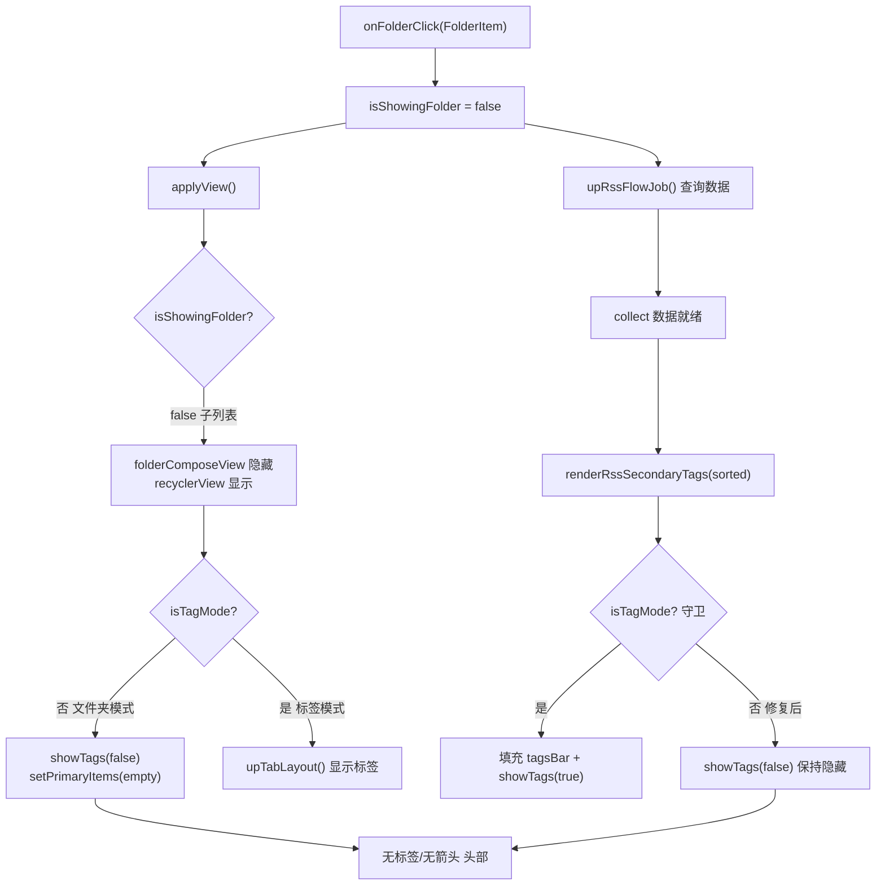

# design.md — 订阅文件夹样式：点进文件夹头部误显标签/箭头

## Technical Approach

订阅页 `RssFragment` 在数据就绪后通过两个独立的流程支配顶栏标签：

1. `applyView()` —— 根据 `isShowingFolder` / `isTagMode` 决定文件夹目录 / 列表 / 标签展示，非标签模式会 `showTags(false)` + `setPrimaryItems(emptyList())`。
2. `upRssFlowJob().collect{...}` → `renderRssSecondaryTags(sorted)` —— 每次数据加载后**无条件** `showTags(true)` 填充 `tagsBar`。

二者在「文件夹样式点进文件夹后的子列表」场景竞争：`applyView()` 已隐藏标签，但数据回调随后把标签重新打开，导致头部错误出现二级源标签与向下箭头。

**修复落点：给 `renderRssSecondaryTags` 施加「标签样式才展示」不变量**，使数据回调不再与 `applyView()` 打架。

## Architecture Decisions

### AD-01: 二级源标签仅标签样式展示

- **Context**: `renderRssSecondaryTags()` 在每次数据加载后无条件 `showTags(true)`；当 `applyView()` 已将非标签样式（文件夹点进子列表）设为隐藏时，该回调覆盖并重新显示标签与向下箭头。
- **Concern**: 文件夹样式点进文件夹后头部误显「向下箭头 + 二级源标签」，与「仅标签样式展示」的用户认知冲突。
- **Decision**: 在 `renderRssSecondaryTags()` 入口增加守卫 `if (!isTagMode) { binding.topBar.showTags(false); return }`，保持原有 `tagsBar` 填充逻辑不动。
- **Goal**: 标签样式下二级源标签/箭头正常；其他形态（含文件夹点进子列表）一律隐藏，行为自洽。
- **Tradeoff**: 「列表平铺」形态的二级源标签同步隐藏（预期变化）；换取单点不变量、改动最小、无回归风险。
- **Status**: Proposed

## Data Flow

时序：`onFolderClick` → `applyView()`（隐藏）→ `upRssFlowJob()`（数据回调）→ `renderRssSecondaryTags`（守卫，保持隐藏）。修复后两者不再冲突。

## File Changes

| 文件 | 变更 |
|------|------|
| `app/src/main/java/io/legado/app/ui/main/rss/RssFragment.kt` | `renderRssSecondaryTags()`（约 L1225）入口新增 `if (!isTagMode)` 守卫；不影响 `tagsBar` 填充逻辑 |

> 唯一改动点，其余文件零变更。