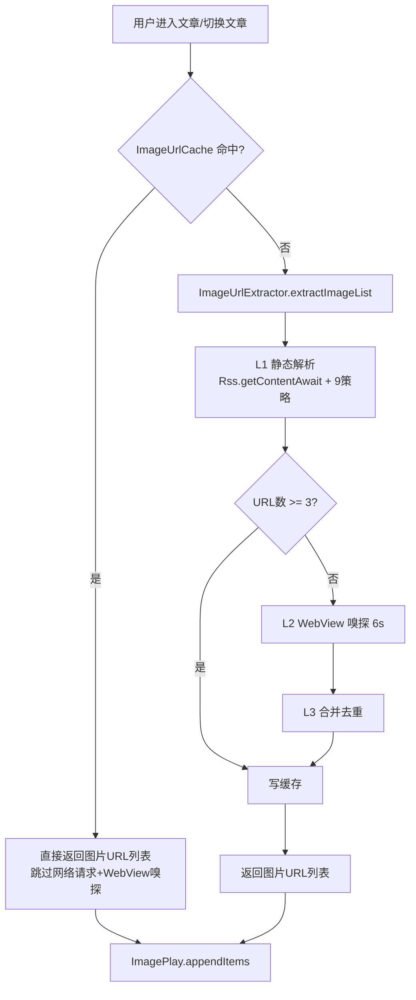
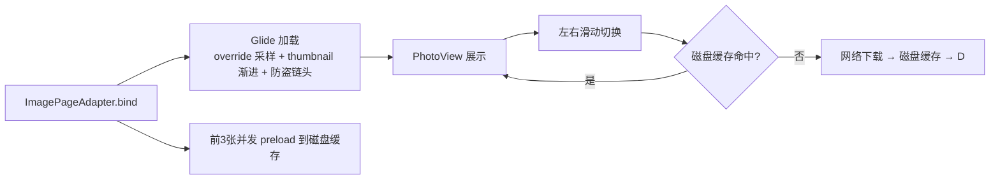

# 图片订阅源加载优化 — 技术设计（design.md）

> 状态：🔄 设计中

## Technical Approach

### 现状对比（订阅源 vs 书源）

| 维度 | 图片订阅源（现有） | 图片书源（参考） |
|------|-------------------|-----------------|
| URL 获取 | 每篇文章网络请求文章页 + L1 静态解析（9 策略）+ 可能触发 L2 WebView 嗅探（6s） | 章节 content 规则直接返回图片 URL 列表，无嗅探 |
| 下载 | Glide 网络直载，单张/下一张 preload | `BookHelp.saveImages` `onEachParallel(concurrency)` 并发下载到本地 |
| 缓存 | Glide 磁盘缓存（DiskCacheStrategy.ALL）+ Glide 内存缓存 | 本地文件（book_cache/images）+ 自建 BitmapLruCache |
| 解码 | 图集模式 `DownsampleStrategy.NONE` + `dontTransform()` 全尺寸解码 | `BitmapUtils.decodeBitmap(本地文件, width, height)` 按目标尺寸采样 |

### 优化方案总览

```
┌─────────────────────────────────────────────────────────────┐
│  图片订阅源加载优化（三层）                                     │
│                                                             │
│  ① URL 缓存层（新增 ImageUrlCache）                          │
│     文章 → 图片URL列表  内存 + ACache 磁盘  TTL=24h           │
│                                                             │
│  ② 图集加载优化（ImagePageAdapter）                          │
│     全尺寸解码 → 按屏幕采样解码 + thumbnail 渐进               │
│                                                             │
│  ③ 并发预下载（进入文章时）                                   │
│     前 N 张（默认3）并发 preload() 到磁盘缓存                 │
└─────────────────────────────────────────────────────────────┘
```

### ① URL 缓存层（ImageUrlCache）

- 位置：`app/src/main/java/io/legado/app/help/image/ImageUrlCache.kt`（object 单例）
- 数据结构：
  - 内存：`ConcurrentHashMap<String, CacheEntry>`（key = article.link hash，value = url 列表 + 时间戳）
  - 磁盘：`ACache.get()`（key = `imageUrlCache_{hash}`，value = JSON 序列化 url 列表）
- 读写流程：
  - 写：`ImageUrlExtractor.extractImageList` 成功后，将「article.link hash → url 列表」写入内存 + 磁盘
  - 读：`extractImageList` 入口先查内存 → 未命中查磁盘（校验 TTL）→ 均未命中走原解析链路
- TTL：24h（常量 `CACHE_TTL_MS`）；容量上限：内存 200 条（超限淘汰最旧）；磁盘由 `ACache` 自身容量约束
- 失效：`clear()` 方法供设置页/手动清理调用；缓存条目含时间戳，读取时校验

### ② 图集加载优化（ImageDetailAdapter — V4 架构实际横向浏览适配器）

> 实施修正（2026-08-24）：初版设计基于旧架构认知写了 ImagePageAdapter，实测确认当前 V4 架构
> （ImageGalleryActivity 单 RecyclerView 垂直画布）下，横向浏览使用的是 `ImageDetailAdapter`
> （点击缩略图进入的全屏 ViewPager2 层，ImageGalleryActivity.setupFullscreenViewPager 使用
> ImageDetailViewPagerAdapter 继承自它）；`ImagePageAdapter`/`ImageArticlePagerAdapter` 为旧架构
> 遗留死代码（当前无任何入口调用）。垂直画布 `ImageCanvasAdapter` 已有采样解码
> （`override(screenW, targetH)` + `thumbnail(0.1f)`，Phase 3.5）与 `preloadAround` 预加载。
> 故本次优化落点改为 ImageDetailAdapter（全尺寸解码 → 采样解码），ImagePageAdapter 同步同款优化保持一致性。

- 现状：`bind()` 中 `ImageLoader.load(...).dontTransform().downsample(DownsampleStrategy.NONE).diskCacheStrategy(ALL)`
  - `DownsampleStrategy.NONE` 会让 Glide 忽略 override 目标尺寸、总是全尺寸解码 —— 这是加载慢的直接原因
- 修改：
  - 移除 `DownsampleStrategy.NONE`（否则 override 不生效）
  - 新增按屏幕尺寸采样：`override(screen.widthPixels, screen.heightPixels)`，Glide 基于 override 目标尺寸做 Downsampler 采样
  - 保留 `dontTransform()`（避免 transform 开销）
  - 新增 `thumbnail(0.1f)` 渐进式：先显示低分辨率模糊图，再加载清晰图
  - 保留 `DiskCacheStrategy.ALL` 与防盗链头注入（`sourceOriginOption/refererOption`）
- 预下载（③）：`bind()` 首次执行时（`initialPreloadDone` flag 守卫，adapter 每次重建重置），
  以当前定位 position 为起点对 `imageItems[position..min(position+2, size-1)]` 逐张
  `ImageLoader.load(...).diskCacheStrategy(ALL).preload()`（并发由 Glide 内部线程池调度）；
  既有「下一张 preload」保留（滑动连续性，抽取为 `preload(url)` 复用）

### ③ 并发预下载

- 触发点：`ImageDetailAdapter.bind()` 首次绑定（进入横向模式定位图片时）；`ImagePageAdapter.updateData(urls)`（旧架构，图片列表就绪时）
- 实现：对起点起 `PRELOAD_COUNT = 3` 张发起 Glide `preload()`（带防盗链头），仅下载到磁盘缓存不占用内存
- 复用现有 `preloadNextArticle`（跨文章预加载第一张，ImageGalleryViewModel）保持不变

## Architecture Decisions

### AD-01: 新增 ImageUrlCache 缓存「文章 → 图片URL列表」
- **Context**: 订阅源每次切换文章都重新网络请求文章页（`Rss.getContentAwait` 无缓存），且当 L1 静态解析 < 3 张时触发 L2 WebView 嗅探（最多 6s）。书源章节内容有缓存归属，无此问题。
- **Concern**: 图片 URL 解析链路是「图片订阅源加载慢」的首要瓶颈，且同一文章可能被多次浏览（列表 → 图集 → 画布）。
- **Decision**: 新增 `ImageUrlCache` 单例，以 article.link hash 为 key 缓存解析结果（内存 + ACache 磁盘），TTL=24h，容量上限 200 条。
- **Goal**: 二次进入同一文章命中缓存，跳过网络请求与 WebView 嗅探，显著缩短首图出现时间。
- **Tradeoff**: 接受缓存过期导致图片失效的风险（TTL 控制）+ 新增一个缓存模块的维护成本。
- **Status**: Accepted（2026-08-24 实施）
- **Superseded-by**: 无

### AD-02: 图集模式改为按屏幕尺寸采样解码
- **Context**: `ImageDetailAdapter`（V4 架构横向浏览适配器）当前用 `DownsampleStrategy.NONE + dontTransform()` 全尺寸解码，大图解码慢且内存占用高；书源 `BitmapUtils.decodeBitmap(file, width, height)` 按目标尺寸采样。垂直画布 `ImageCanvasAdapter` 已采样（Phase 3.5）。
- **Concern**: 全尺寸解码是图片加载慢的直接原因之一，且长图/超清图有 OOM 风险。
- **Decision**: 为 `ImageDetailAdapter` 的 Glide 请求添加 `.override(screenW, screenH)`（触发采样，同时**移除 `DownsampleStrategy.NONE`**，否则 override 被忽略仍是全尺寸解码），保留 `dontTransform()`、`thumbnail(0.1f)` 渐进式与防盗链头。
- **Goal**: 降低解码耗时与内存占用，首图快速显示。
- **Tradeoff**: 放大查看时受采样分辨率限制（渐进式加载缓解画质损失）。
- **Status**: Accepted（2026-08-24 实施）
- **Superseded-by**: 无

### AD-03: 图集内前 3 张并发预下载
- **Context**: 当前仅预加载「下一张」；书源 `BookHelp.saveImages` 用 `onEachParallel(concurrency)` 并发下载整章图片。
- **Concern**: 单张预加载在快速滑动时预取不足，需等待磁盘缓存命中前的网络下载。
- **Decision**: 进入横向模式首次 bind 时，以当前定位为起点对 `PRELOAD_COUNT = 3` 张并发发起 Glide `preload()` 到磁盘缓存（带防盗链头）。
- **Goal**: 图集内左右滑动时后续图片秒开。
- **Tradeoff**: 额外带宽消耗（限制 3 张内，可接受）。
- **Status**: Accepted（2026-08-24 实施）
- **Superseded-by**: 无

### AD-04: 不重写订阅源页面为书源阅读页架构
- **Context**: 用户建议「参考学习图片类型书源的页面及加载方式」；书源阅读页是「章节制 + 本地缓存 + canvas 绘制」架构。
- **Concern**: 订阅源是「流式实时浏览」架构（RSS 文章流 + 分页加载），与书源章节制结构差异大；照搬页面会破坏现有交互（画布/图集/跨文章滑动）。
- **Decision**: 仅借鉴书源的加载机制（缓存 + 采样 + 并发下载），保留订阅源现有页面架构与交互。
- **Goal**: 以最小改动获得书源级别的加载体验，避免大范围重构回归风险。
- **Tradeoff**: 无法 100% 复刻书源阅读页的本地缓存体验，但满足「加载速度」这一核心诉求。
- **Status**: Proposed
- **Superseded-by**: 无

## Data Flow

### 图片 URL 解析（优化后）



### 图片加载（优化后）



## File Changes

| 文件 | 变更类型 | 变更内容 |
|------|---------|---------|
| `app/src/main/java/io/legado/app/help/image/ImageUrlCache.kt` | 新增 | `ImageUrlCache` 单例：内存 + ACache 磁盘缓存、TTL、容量上限、读写/清理方法 |
| `app/src/main/java/io/legado/app/help/image/ImageUrlExtractor.kt` | 修改 | `extractImageList` 入口先查缓存，解析成功后写缓存 |
| `app/src/main/java/io/legado/app/ui/image/adapter/ImageDetailAdapter.kt` | 修改 | **实际优化目标（V4 架构横向浏览）**：移除 `DownsampleStrategy.NONE`，Glide 加 `.override(screenW, screenH)` + `thumbnail(0.1f)`；首次 bind 以当前定位为起点并发 preload 3 张（`PRELOAD_COUNT`），抽取 `preload(url)` 复用 |
| `app/src/main/java/io/legado/app/ui/image/ImagePageAdapter.kt` | 修改 | 旧架构遗留（当前未使用），同步同款优化（`.override` + `thumbnail`；`updateData` 前 3 张并发 preload）保持一致性 |
| `app/src/main/assets/updateLog.md` | 修改 | 按版本交付同步规范记录本次优化 |
| `docs/INDEX.md` | 修改 | 登记本 spec 到「设计中」 |
