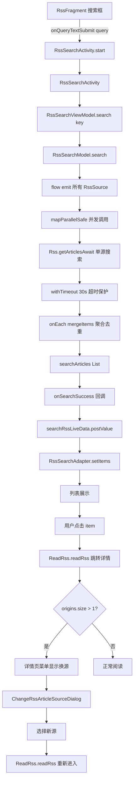

# 订阅源统一搜索 - 技术设计文档 (Design)

## Technical Approach (技术方案)

### 整体架构

订阅源统一搜索功能采用三层架构，完整对标书源搜索（`SearchActivity` + `SearchViewModel` + `SearchModel`）：

| 层级 | 书源搜索（参考） | 订阅源搜索（本次新增） |
|------|-----------------|---------------------|
| UI 层 | `SearchActivity` | `RssSearchActivity` |
| ViewModel 层 | `SearchViewModel` | `RssSearchViewModel` |
| Model 层 | `SearchModel` | `RssSearchModel` |
| 数据模型 | `SearchBook`（持久化） | `SearchRssArticle`（内存） |
| Adapter | `SearchAdapter` | `RssSearchAdapter` |
| 换源 | `ChangeBookSourceDialog` | `ChangeRssArticleSourceDialog` |
| 网络层 | `WebBook.searchBookAwait()` | `Rss.getArticlesAwait()` |
| 入口 | `BookshelfFragment` 搜索框 | `RssFragment` 搜索框 |

### 关键技术点

#### 1. 并发调度（复用书源搜索机制）

参考 [SearchModel.kt#L46-L113](file:///f:/myself/github/WeAgentChat/temp/legado/app/src/main/java/io/legado/app/model/webBook/SearchModel.kt#L46-L113)：

```kotlin
class RssSearchModel(private val scope: CoroutineScope, private val callBack: CallBack) {
    val threadCount = AppConfig.threadCount
    private var searchPool: ExecutorCoroutineDispatcher? = null
    private var mSearchId = 0L  // 当前搜索 ID（用于取消旧搜索）

    private fun initSearchPool() {
        searchPool?.close()
        searchPool = Executors
            .newFixedThreadPool(min(threadCount, AppConst.MAX_THREAD))
            .asCoroutineDispatcher()
    }

    fun search(searchId: Long, key: String) {
        // 取所有已启用且 searchUrl 非空的订阅源
        val rssSources = callBack.getSearchScope().getRssSources()
        if (rssSources.isEmpty()) {
            callBack.onSearchCancel(NoStackTraceException("启用订阅源为空或无 searchUrl"))
            return
        }
        // 阻塞点 11 修复：必须先调用 initSearchPool() 初始化线程池，否则 searchPool!! 会 NPE
        initSearchPool()
        // searchId 检查：连续搜索时取消旧搜索（参考 SearchModel.kt L52-74）
        if (searchId != mSearchId) return
        mSearchId = searchId
        searchJob = scope.launch(searchPool!!) {
            flow {
                for (source in rssSources) {
                    emit(source)
                    workingState.first { it }  // 支持暂停/恢复
                }
            }.onStart {
                callBack.onSearchStart()
            }.mapParallelSafe(threadCount) {
                // 阻塞点 31 修复：mapParallelSafe 内部增加异常日志，避免静默吞掉单个源异常
                try {
                    withTimeout(30000L) {
                        Rss.getArticlesAwait(
                            sortName = "搜索",
                            sortUrl = it.searchUrl!!,
                            rssSource = it,
                            page = 1,
                            key = key
                        )
                    }
                } catch (e: Throwable) {
                    // 遗漏点 31 修复：记录失败源日志，便于排查
                    // 遗漏点 38 修复：异常分类，便于用户感知
                    val errMsg = when (e) {
                        is UnknownHostException -> "源[${it.sourceName}]搜索失败：网络不通"
                        is SocketTimeoutException -> "源[${it.sourceName}]搜索超时（30s）"
                        is ConnectException -> "源[${it.sourceName}]连接被拒绝"
                        else -> "源[${it.sourceName}]搜索失败：${e.localizedMessage}"
                    }
                    AppLog.put(errMsg, e)
                    emptyList()  // 返回空列表，不影响其他源
                }
            }.onEach { (articles, _) ->
                mergeItems(articles, key)
                callBack.onSearchSuccess(searchArticles)
            }.onCompletion {
                if (it == null) callBack.onSearchFinish(searchArticles.isEmpty())
            }.catch {
                AppLog.put("订阅源搜索出错\n${it.localizedMessage}", it)
            }.collect()
        }
    }
}

/**
 * 遗漏点 32 修复：明确 CallBack 接口方法签名
 * 与书源 SearchModel.CallBack 的差异：无 hasMore 参数（AD-07 不支持分页加载）
 */
interface CallBack {
    fun getSearchScope(): RssSearchScope
    fun onSearchStart()
    fun onSearchSuccess(articles: List<SearchRssArticle>)
    fun onSearchFinish(isEmpty: Boolean)  // 无 hasMore，AD-07 不支持分页
    fun onSearchCancel(exception: Throwable? = null)
}
```

#### 2. 多源聚合去重（参考 `SearchBook.origins`）

参考 [SearchModel.kt#L116-L197](file:///f:/myself/github/WeAgentChat/temp/legado/app/src/main/java/io/legado/app/model/webBook/SearchModel.kt#L116-L197) 和 [SearchBook.kt#L83-L87](file:///f:/myself/github/WeAgentChat/temp/legado/app/src/main/java/io/legado/app/data/entities/SearchBook.kt#L83-L87)：

```kotlin
data class SearchRssArticle(
    var title: String = "",
    var pubDate: String? = null,
    var description: String? = null,
    var image: String? = null,
    var type: Int = 0,  // 0=网页, 1=图片, 2=视频
    /** 所有来源的 sourceUrl 集合 */
    val origins: LinkedHashSet<String> = linkedSetOf(),
    /** 每个源对应的 RssArticle 实例（用于换源） */
    val originArticles: HashMap<String, RssArticle> = hashMapOf()
) {
    fun addOrigin(origin: String, article: RssArticle) {
        origins.add(origin)
        originArticles[origin] = article
    }

    /** 去重 key：title + pubDate */
    fun deduplicationKey(): String = "$title|$${pubDate ?: ""}"

    /** 获取默认源（第一个）的 RssArticle */
    fun getDefaultArticle(): RssArticle? = origins.firstOrNull()?.let { originArticles[it] }
}
```

#### 3. mergeItems 去重合并逻辑

参考 [SearchModel.kt#L116-L197](file:///f:/myself/github/WeAgentChat/temp/legado/app/src/main/java/io/legado/app/model/webBook/SearchModel.kt#L116-L197)：

> **与书源 SearchModel 的差异**：书源 `SearchModel.mergeItems` 有 4 个分组（equalData/**tagsData**/containsData/otherData），其中 tagsData 用于 `it.kind?.contains(searchKey) == true` 的文章（书源有 kind 字段）。**RssArticle 没有 kind 字段**，所以 `RssSearchModel.mergeItems` 只用 3 个分组（equalData/containsData/otherData），与 SearchModel 的 4 个分组不同。

> **⚠️ 阻塞点 12 修复说明**：早期设计文档 §3 的 mergeItems 实现存在严重 bug（每次创建局部 equalMap/containsMap/otherMap，最后 `searchArticles = equalData` 直接覆盖，会丢失之前所有源的结果）。本节为修复后的正确实现，**统一采用 §3.2 的成员变量方案**，使用 `searchArticlesMap` 保留去重信息，参考 [SearchModel.kt#L118](file:///f:/myself/github/WeAgentChat/temp/legado/app/src/main/java/io/legado/app/model/webBook/SearchModel.kt#L118) `val copyData = ArrayList(searchBooks)` 先复制已有结果再合并。

```kotlin
// 成员变量：保留已聚合的文章，避免被新源结果覆盖（阻塞点 12 修复）
private val searchArticlesMap = linkedMapOf<String, SearchRssArticle>()  // 按分组顺序保留
private var searchArticles: List<SearchRssArticle> = emptyList()

private suspend fun mergeItems(newArticles: List<RssArticle>, searchKey: String) {
    // 阻塞点 15 修复：批量查询已读状态（按 origin+link 匹配 rssArticles 表）
    val readLinks = appDb.rssArticleDao.getReadLinks(newArticles.map { it.link }).toHashSet()

    for (article in newArticles) {
        currentCoroutineContext().ensureActive()
        val key = "${article.title}|${article.pubDate ?: ""}"

        // 已读状态判断（阻塞点 15）
        val isRead = readLinks.contains("${article.origin}|${article.link}")

        searchArticlesMap[key]?.let { existing ->
            // 已存在：追加源信息
            existing.addOrigin(article.origin, article)
        } ?: run {
            // 新文章：创建 SearchRssArticle 并加入 map
            SearchRssArticle(
                title = article.title,
                pubDate = article.pubDate,
                description = article.description,
                image = article.image,
                type = article.type,
                isRead = isRead  // 阻塞点 15：传递已读状态
            ).apply {
                addOrigin(article.origin, article)
                searchArticlesMap[key] = this
            }
        }
    }

    // 分组排序：标题完全匹配 > 标题包含 > 其他，组内按 origins.size 降序
    val equalData = arrayListOf<SearchRssArticle>()
    val containsData = arrayListOf<SearchRssArticle>()
    val otherData = arrayListOf<SearchRssArticle>()

    searchArticlesMap.values.forEach { article ->
        when {
            article.title == searchKey -> equalData.add(article)
            article.title.contains(searchKey) -> containsData.add(article)
            else -> otherData.add(article)
        }
    }

    equalData.sortByDescending { it.origins.size }
    containsData.sortByDescending { it.origins.size }
    otherData.sortByDescending { it.origins.size }

    searchArticles = equalData + containsData + otherData
}
```

#### 3.1 搜索结果展示布局（`item_rss_search.xml`，融合 `item_rss_article.xml` + `item_search.xml`）

**设计依据**：用户原话"搜索结果参考现在单个订阅源的展现形式，要把图片，名称，时间等字段展现出来"。融合两个布局的优势：
- 参考 [item_rss_article.xml](file:///f:/myself/github/WeAgentChat/temp/legado/app/src/main/res/layout/item_rss_article.xml)：标题/发布日期/图片的字段风格（订阅源栏目原生体验）
- 参考 [item_search.xml](file:///f:/myself/github/WeAgentChat/temp/legado/app/src/main/res/layout/item_search.xml)：`BadgeView` 显示多源数量

**布局结构**（伪 XML，实际实现时由 `item_rss_search.xml` 落地）：

```xml
<ConstraintLayout height="wrap_content" padding="8dp">
    <!-- 左侧：封面图片 80dp×80dp 圆角 -->
    <CoverImageView id="iv_cover" width="80dp" height="80dp" scaleType="centerCrop"
        layout_constraintLeft_toLeftOf="parent" layout_constraintTop_toTopOf="parent" />

    <!-- 右上角：来源数量 BadgeView（origins.size >= 2 时显示） -->
    <BadgeView id="bv_origin_count" layout_constraintRight_toRightOf="parent"
        layout_constraintTop_toTopOf="parent" margin="8dp" />

    <!-- 右侧第 1 行：标题，16sp 加粗，最多 2 行 -->
    <TextView id="tv_title" width="0dp" height="wrap_content" textSize="16sp" textStyle="bold"
        maxLines="2" ellipsize="end"
        layout_constraintLeft_toRightOf="@id/iv_cover" layout_constraintRight_toLeftOf="@id/bv_origin_count"
        layout_constraintTop_toTopOf="parent" marginStart="8dp" />

    <!-- 右侧第 2 行：描述，12sp，最多 2 行（参考 RssArticle.description） -->
    <TextView id="tv_description" width="0dp" height="wrap_content" textSize="12sp"
        maxLines="2" ellipsize="end"
        layout_constraintLeft_toRightOf="@id/iv_cover" layout_constraintRight_toRightOf="parent"
        layout_constraintTop_toBottomOf="@id/tv_title" marginStart="8dp" marginTop="4dp" />

    <!-- 右侧第 3 行：发布日期，12sp 斜体，单行（参考 RssArticle.pubDate） -->
    <TextView id="tv_pub_date" width="0dp" height="wrap_content" textSize="12sp" textStyle="italic"
        maxLines="1" ellipsize="end"
        layout_constraintLeft_toRightOf="@id/iv_cover" layout_constraintRight_toRightOf="parent"
        layout_constraintTop_toBottomOf="@id/tv_description" marginStart="8dp" marginTop="4dp" />
</ConstraintLayout>
```

**字段映射表**：

| 布局字段 | 数据来源 | 显示规则 |
|---------|---------|---------|
| `iv_cover` | `searchRssArticle.image`（取 `origins.first()` 对应文章的 `image`） | 无图时显示 `image_rss_article` 占位图；加载失败时 `gone()`；**必须传递 `origins.first()` 作为 `OkHttpModelLoader.sourceOriginOption`**（参考 [RssArticlesAdapter.kt#L65-L67](file:///f:/myself/github/WeAgentChat/temp/legado/app/src/main/java/io/legado/app/ui/rss/article/RssArticlesAdapter.kt#L65-L67)），否则需要 cookie 的订阅源图片会加载失败 |
| `tv_title` | `searchRssArticle.title` | 已读=灰色 `tv_text_summary`，未读=`primaryText`（参考 `RssArticlesAdapter`）。**已读状态通过 `RssSearchModel.mergeItems` 批量查询 `rssArticles` 表（按 `origin+link` 匹配）判断，避免搜索结果全部显示为未读色**（阻塞点 15 修复） |
| `tv_description` | `searchRssArticle.description` | 空字符串时不显示该行（`gone()`） |
| `tv_pub_date` | `searchRssArticle.pubDate` | 空字符串时不显示该行（`gone()`） |
| `bv_origin_count` | `searchRssArticle.origins.size` | `size >= 2` 时显示并 `setBadgeCount(size)`；`size == 1` 时 `gone()` |

#### 3.2 重复内容判重与展现策略

**判重 key 设计**：`"$title|$pubDate"`（参考书源 `name + author` 策略）

**判重流程**：见 §3 的 `mergeItems` 实现（阻塞点 12 修复后，统一使用成员变量 `searchArticlesMap` 保留去重信息）。

> ⚠️ 早期设计文档在此处提供了另一个 mergeItems 实现，与 §3 重复且实现不一致。为避免实施时混淆，已删除本节的重复实现，统一以 §3 为准。**实施时以 §3 的实现为准**。

**展现策略**：

| 场景 | origins.size | BadgeView 显示 | 行为说明 |
|------|-------------|---------------|---------|
| 单源结果 | 1 | `gone()`（不显示） | 正常点击进入详情 |
| 多源结果 | ≥2 | `visible()` + `setBadgeCount(size)` | 点击进入详情后可通过"换源"菜单切换源 |

**多源聚合时的字段取值**：
- `title`/`description`/`image`/`pubDate`：取 `origins.first()` 对应的 `RssArticle` 字段（即第一个返回该文章的源的字段，后续源的相同文章字段不覆盖展示层）
- `originArticles: HashMap<String, RssArticle>`：保存每个源对应的完整 `RssArticle` 实例，用于换源时取用

**示例**：
- 源 A 返回文章 `{title="AI 进展", pubDate="2026-07-20", description="源A的描述", image="urlA"}`
- 源 B 返回文章 `{title="AI 进展", pubDate="2026-07-20", description="源B的描述", image="urlB"}`
- 聚合后 `SearchRssArticle`：
  - `title="AI 进展"`, `pubDate="2026-07-20"`, `description="源A的描述"`, `image="urlA"`（取源 A 字段）
  - `origins={sourceUrlA, sourceUrlB}`
  - `originArticles={sourceUrlA -> articleA, sourceUrlB -> articleB}`
  - BadgeView 显示 `2`
- 用户点击进入详情：使用 `origins.first()=sourceUrlA` 对应的 `articleA`
- 用户在详情页点击"换源"选择源 B：从 `originArticles[sourceUrlB]` 取出 `articleB`，重新调用 `ReadRss.readRss()`

#### 4. 入口改造（`RssFragment` 顶部搜索框）

参考 [RssFragment.kt#L199-L213](file:///f:/myself/github/WeAgentChat/temp/legado/app/src/main/java/io/legado/app/ui/main/rss/RssFragment.kt#L199-L213)：

```kotlin
private fun initSearchView() {
    searchView.applyTint(primaryTextColor)
    searchView.isSubmitButtonEnabled = true
    searchView.queryHint = getString(R.string.search_rss_key)  // 改为"搜索订阅源内容"
    searchView.setOnQueryTextListener(object : SearchView.OnQueryTextListener {
        override fun onQueryTextSubmit(query: String?): Boolean {
            query?.trim()?.let { key ->
                if (key.isNotEmpty()) {
                    RssSearchActivity.start(requireContext(), key)
                    searchView.setQuery("", false)
                    searchView.clearFocus()
                }
            }
            return true
        }

        override fun onQueryTextChange(newText: String?): Boolean {
            upRssFlowJob(newText)  // 保留：按名称过滤订阅源列表
            return false
        }
    })
}
```

#### 5. 详情跳转 + 换源

复用 [ReadRss.readRss()](file:///f:/myself/github/WeAgentChat/temp/legado/app/src/main/java/io/legado/app/ui/rss.read/ReadRss.kt#L52-L61) 第一个参数是 `Fragment` 类型，方法内部使用 `fragment.viewLifecycleOwner.lifecycleScope`（Fragment 特有 API）。RssSearchActivity 是 `AppCompatActivity` 不是 `Fragment`，无法直接调用。

**解决方案**：在 `ReadRss.kt` 中**新增 Activity 重载方法**（参考已有的 `readRss(activity: AppCompatActivity, record: RssReadRecord)` 重载，[ReadRss.kt#L28](file:///f:/myself/github/WeAgentChat/temp/legado/app/src/main/java/io/legado/app/ui.rss.read/ReadRss.kt#L28)）：

```kotlin
// ReadRss.kt 新增方法
fun readRss(
    activity: AppCompatActivity,
    rssArticle: RssArticle,
    rssSource: RssSource? = null,
    rssArticles: List<RssArticle>? = null,
    sortName: String? = null,
    sortUrl: String? = null,
    nextPageUrl: String? = null,
    page: Int = 1
) {
    val rssReadRecord = rssArticle.toRecord()
    activity.lifecycleScope.launch(IO) {
        appDb.rssReadRecordDao.insertRecord(rssReadRecord)
    }
    val type = rssArticle.type
    if (type == 0) {
        ReadRssActivity.start(activity, rssArticle.origin, rssArticle.title, link = rssArticle.link, sort = rssArticle.sort)
        return
    }
    if (type == 2) {
        // 视频播放：搜索结果传 rssArticles = null（不支持上下滑动切换文章，与 AD-07 简化原则一致）
        VideoPlay.rssArticles = rssArticles  // 搜索场景传 null
        VideoPlay.rssArticleIndex = 0
        VideoPlay.rssSortName = sortName
        VideoPlay.rssSortUrl = sortUrl
        VideoPlay.rssNextPageUrl = nextPageUrl
        VideoPlay.rssArticlePage = page
        VideoPlay.rssArticlesHasMore = !nextPageUrl.isNullOrBlank()
        activity.startActivity<VideoPlayerActivity> {
            putExtra("sourceKey", rssArticle.origin)
            putExtra("sourceType", SourceType.rss)
            putExtra("record", rssArticle.link)
            putExtra("videoTitle", rssArticle.title)
        }
        return
    }
    readNoHtml(activity, rssArticle, rssSource, type)
}
```

```kotlin
// 在 RssSearchAdapter 中点击 item（使用新增的 Activity 重载方法）
override fun registerListener(holder: ItemViewHolder, binding: ItemRssSearchBinding) {
    binding.root.setOnClickListener {
        getItem(holder.layoutPosition)?.let { searchArticle ->
            val article = searchArticle.getDefaultArticle() ?: return@setOnClickListener
            val rssSource = appDb.rssSourceDao.getByKey(article.origin)
            // 传递所有源的 RssArticle 列表，供详情页换源
            RssSearchSourceHolder.articles = searchArticle.originArticles
            // 调用新增的 Activity 重载方法（不是 Fragment 版本）
            ReadRss.readRss(
                activity = context as AppCompatActivity,  // 或通过 callBack 传入 activity
                rssArticle = article,
                rssSource = rssSource,
                rssArticles = null  // 搜索结果不传上下文列表，视频换源不支持上下滑动
            )
        }
    }
}
```

**视频换源限制**：视频文章（`type == 2`）换源时 `rssArticles` 传 `null`，不支持上下滑动切换文章。原因：`VideoPlay.rssArticles: List<RssArticle>?` 与搜索结果 `List<SearchRssArticle>` 结构不兼容（参见 FR-04.5）。

换源对话框 `ChangeRssArticleSourceDialog` 设计：

```kotlin
class ChangeRssArticleSourceDialog : DialogFragment() {
    override fun onCreateView(...): View {
        // 显示 RssSearchSourceHolder.articles 中所有 origin 对应的订阅源名称
        // 点击某项 → 取出对应的 RssArticle → 重新调用 ReadRss.readRss()
    }
}

object RssSearchSourceHolder {
    /** 当前正在阅读的文章的多源映射（用于换源） */
    @Volatile  // 遗漏点 37 修复：跨线程可见性保证（写入在 RssSearchAdapter 主线程，读取可能在换源对话框 IO 线程）
    var articles: HashMap<String, RssArticle>? = null
}
```

**详情页菜单改造**（修改 `res/menu/rss_read.xml` 和 `res/menu/video_play.xml`）：
- 新增 `menu_change_source` 菜单项（标题"换源"）
- 在 `ReadRssActivity.onCreateOptionsMenu` 和 `VideoPlayerActivity.onCreateOptionsMenu` 中：仅当 `RssSearchSourceHolder.articles?.size > 1` 时显示换源菜单
- 在 `onOptionsItemSelected` 中处理 `R.id.menu_change_source`：弹出 `ChangeRssArticleSourceDialog`
- 在 `ReadRssActivity.onDestroy` 和 `VideoPlayerActivity.onDestroy` 中清理 `RssSearchSourceHolder.articles = null`

### 数据流



### 文件变更清单

#### 新增文件

| 文件路径 | 类型 | 说明 |
|---------|------|------|
| `app/src/main/java/io/legado/app/ui/rss.search/RssSearchActivity.kt` | Activity | 跨源搜索页面，模仿 `SearchActivity` |
| `app/src/main/java/io/legado/app/ui/rss.search/RssSearchViewModel.kt` | ViewModel | 搜索 ViewModel，模仿 `SearchViewModel` |
| `app/src/main/java/io/legado/app/ui/rss.search/RssSearchAdapter.kt` | Adapter | 搜索结果列表 Adapter，模仿 `SearchAdapter` |
| `app/src/main/java/io/legado/app/ui/rss.search/RssSearchScope.kt` | 工具类 | 搜索范围状态管理（按分组多选），模仿 `SearchScope` 但不包含 `getBookSourceParts()` 书源特有方法；**不新建 `RssSearchScopeDialog`**，搜索范围选择直接在 `onMenuOpened` 动态生成菜单（参考 [SearchActivity.kt#L118-L156](file:///f:/myself/github/WeAgentChat/temp/legado/app/src/main/java/io/legado/app/ui/book/search/SearchActivity.kt#L118-L156)） |
| `app/src/main/java/io/legado/app/ui/rss.search/RssSearchHistoryAdapter.kt` | Adapter | 历史关键词 Adapter，模仿 `HistoryKeyAdapter` |
| `app/src/main/java/io/legado/app/model/rss/RssSearchModel.kt` | Model | 搜索并发调度核心，模仿 `SearchModel` |
| `app/src/main/java/io/legado/app/data/entities/SearchRssArticle.kt` | Entity | 内存包装类（不持久化），模仿 `SearchBook` |
| `app/src/main/java/io/legado/app/ui/rss.changesource/ChangeRssArticleSourceDialog.kt` | Dialog | 文章换源对话框，模仿 `ChangeBookSourceDialog` |
| `app/src/main/java/io/legado/app/ui/rss.changesource/RssSearchSourceHolder.kt` | Object | 多源文章映射持有者（用于换源时跨页面传递） |
| `app/src/main/res/layout/activity_rss_search.xml` | Layout | 搜索页布局，参考 `activity_book_search.xml` |
| `app/src/main/res/layout/item_rss_search.xml` | Layout | 搜索结果 item 布局，融合 `item_rss_article.xml`（标题/日期/图片）+ `item_search.xml`（BadgeView 源数量），字段：iv_cover/tv_title/tv_description/tv_pub_date/bv_origin_count |
| `app/src/main/res/menu/rss_search.xml` | Menu | 搜索页菜单 |

#### 修改文件

| 文件路径 | 修改内容 |
|---------|---------|
| [app/src/main/java/io/legado/app/ui/main/rss/RssFragment.kt](file:///f:/myself/github/WeAgentChat/temp/legado/app/src/main/java/io/legado/app/ui/main/rss/RssFragment.kt) | `initSearchView()` 修改 `onQueryTextSubmit` 跳转 `RssSearchActivity`；`queryHint` 改为 `R.string.search_rss_key`；保留 `onQueryTextChange` 按名称过滤行为不变 |
| `app/src/main/java/io/legado/app/data/dao/SearchKeywordDao.kt` | 新增按 `type` 查询/删除方法：`flowByTime(type)`、`flowSearch(type, key)`、`deleteAll(type)`、`delete(searchKeyword, type)` |
| `app/src/main/java/io/legado/app/data/entities/SearchKeyword.kt` | 新增 `type: Int = 0` 字段（0=书源，1=订阅源），添加 `@ColumnInfo(defaultValue = "0")` 注解 |
| `app/src/main/java/io/legado/app/data/AppDatabase.kt` | 数据库 version 98→99，新增 `MIGRATION_98_99`（手动 Migration，注册到 `DatabaseMigrations.migrations` 列表） |
| **`app/src/main/java/io/legado/app/ui/book/search/SearchViewModel.kt`** | **必须修改 `saveSearchKey/clearHistory/deleteHistory` 显式传 `type=0`（书源），避免书源搜索历史被订阅源搜索污染**（参见 FR-05.5） |
| **`app/src/main/java/io/legado/app/ui/rss/read/ReadRss.kt`** | **新增 Activity 重载方法 `readRss(activity: AppCompatActivity, rssArticle, ...)`**，参考已有的 `readRss(activity, record)` 重载（参见 §5） |
| **`app/src/main/res/menu/rss_read.xml`** | 新增 `menu_change_source` 菜单项（标题"换源"） |
| **`app/src/main/res/menu/video_play.xml`** | 新增 `menu_change_source` 菜单项（标题"换源"） |
| **`app/src/main/java/io/legado/app/ui/rss/read/ReadRssActivity.kt`** | `onCreateOptionsMenu` 中根据 `RssSearchSourceHolder.articles?.size > 1` 显示换源菜单；`onOptionsItemSelected` 处理 `R.id.menu_change_source` 弹出 `ChangeRssArticleSourceDialog`；`onDestroy` 清理 `RssSearchSourceHolder.articles = null` |
| **`app/src/main/java/io/legado/app/ui/video/VideoPlayerActivity.kt`** | 同 ReadRssActivity，添加换源菜单显示/处理/清理逻辑 |
| `app/src/main/res/values/strings.xml` | 新增 `search_rss_key`、`change_source` 等字符串 |
| `app/src/main/AndroidManifest.xml` | 注册 `RssSearchActivity` |

#### 不修改文件（明确禁止修改，参见 AD-04）

| 文件路径 | 不修改理由 |
|---------|---------|
| [app/src/main/java/io/legado/app/ui/rss/source/manage/RssSourceActivity.kt](file:///f:/myself/github/WeAgentChat/temp/legado/app/src/main/java/io/legado/app/ui/rss/source/manage/RssSourceActivity.kt) | 保持原"按订阅源相关信息搜索订阅源"功能不变（用户反馈明确要求"别把这块的功能给搞没了"） |
| `app/src/main/java/io/legado/app/ui.rss.article/RssSortActivity.kt` | 单源搜索菜单 `R.id.menu_search` 保持不变（Out of Scope） |

### 数据库 Migration

`SearchKeyword` 表新增 `type` 字段 + **复合主键重建**（阻塞点 10 修复），需要数据库 version 升级：

```kotlin
// AppDatabase.kt
@Database(
    entities = [..., SearchKeyword::class, ...],
    version = 99  // 原 version=98 + 1（当前版本是 98，不是 84）
)
abstract class AppDatabase : RoomDatabase() {
    // ...
}

// SearchKeyword.kt（阻塞点 10 修复：复合主键 word+type）
@Entity(
    tableName = "search_keywords",
    primaryKeys = ["word", "type"]  // 复合主键，替代原 @PrimaryKey var word
    // 删除原 indices = [Index(value = ["word"], unique = true)] 唯一索引
)
data class SearchKeyword(
    @PrimaryKey  // 保留字段级注解但实际由 primaryKeys 参数生效
    var word: String = "",
    var usage: Int = 0,
    var lastUseTime: Long = 0,
    @ColumnInfo(defaultValue = "0")  // 0=书源（兼容旧数据），1=订阅源
    var type: Int = 0
)

// Migration（手动 Migration，注册到 DatabaseMigrations.migrations 列表）
// 阻塞点 10 修复：Room 不支持直接修改主键，需 drop+create 重建表
val MIGRATION_98_99 = object : Migration(98, 99) {
    override fun migrate(database: SupportSQLiteDatabase) {
        // 表名是 search_keywords（带下划线，不是 searchKeywords）
        // 1. 创建新表（复合主键 word+type）
        database.execSQL("""
            CREATE TABLE IF NOT EXISTS search_keywords_new (
                word TEXT NOT NULL,
                usage INTEGER NOT NULL DEFAULT 0,
                lastUseTime INTEGER NOT NULL DEFAULT 0,
                type INTEGER NOT NULL DEFAULT 0,
                PRIMARY KEY(word, type)
            )
        """.trimIndent())
        // 2. 迁移旧数据（type 默认 0=书源）
        database.execSQL("""
            INSERT INTO search_keywords_new (word, usage, lastUseTime, type)
            SELECT word, usage, lastUseTime, 0 FROM search_keywords
        """.trimIndent())
        // 3. 删除旧表，重命名新表
        database.execSQL("DROP TABLE search_keywords")
        database.execSQL("ALTER TABLE search_keywords_new RENAME TO search_keywords")
        // 4. 创建索引（可选，用于按 type 查询性能优化）
        database.execSQL("CREATE INDEX IF NOT EXISTS idx_search_keywords_type ON search_keywords(type, lastUseTime)")
    }
}
```

> **⚠️ 阻塞点 10 修复说明**：早期设计文档使用 `ALTER TABLE ... ADD COLUMN type` 简单添加字段，但 `SearchKeyword` 原主键是单字段 `word`（[SearchKeyword.kt#L14-L15](file:///f:/myself/github/WeAgentChat/temp/legado/app/src/main/java/io/legado/app/data/entities/SearchKeyword.kt#L14-L15)），书源搜索 "AI" 插入 `(word="AI", type=0)`，订阅源搜索 "AI" 插入 `(word="AI", type=1)`，INSERT OR REPLACE 策略导致后者覆盖前者，FR-05.6 的 type 隔离设计完全失效。修复方案：复合主键 `(word, type)`，Room 不支持直接修改主键，必须 drop+create 重建表。

**关键约束**：
- 必须遵守 [database-migration-safety.md](../../project-rules/database-migration-safety.md) 规范，新字段必须有默认值，避免覆盖安装时旧数据丢失
- 当前数据库 version = 98（[AppDatabase.kt#L77](file:///f:/myself/github/WeAgentChat/temp/legado/app/src/main/java/io/legado/app/data/AppDatabase.kt#L77)），不是 84
- 表名是 `search_keywords`（带下划线，[SearchKeyword.kt#L1](file:///f:/myself/github/WeAgentChat/temp/legado/app/src/main/java/io/legado/app/data/entities/SearchKeyword.kt#L1) `@Entity(tableName = "search_keywords")`），不是 `searchKeywords`
- 88→89 之后都是手动 Migration（参见 AppDatabase.kt line 134-140 注释），本次延续手动 Migration 模式
- **复合主键重建**：因 Room 不支持直接修改主键，必须 drop+create 重建表，Migration SQL 复杂度上升，但确保 type 隔离设计生效

## Architecture Decisions (架构决策)

### AD-01: 选择新建 `RssSearchActivity` 而非复用 `RssSortActivity`

- **Context**: 订阅源统一搜索需要一个页面展示多源聚合结果。已有 `RssSortActivity` 用于展示单个订阅源的文章列表（带 Tab 切换分类）。
- **Concern**: 应该复用 `RssSortActivity` 改造为支持多源搜索，还是新建 `RssSearchActivity`？
- **Decision**: 新建 `RssSearchActivity`
- **Goal**: 保持 `RssSortActivity` 的单源展示职责清晰；让搜索页专注跨源聚合展示
- **Tradeoff**: 新增一个 Activity 类，但避免了 `RssSortActivity` 的复杂分支逻辑
- **Status**: Proposed

### AD-02: 选择 `SearchRssArticle` 内存包装类而非持久化到 `rssArticles` 表

- **Context**: 搜索结果需要存储 `origins` 多源聚合信息，`RssArticle` 实体无此字段。
- **Concern**: 是修改 `RssArticle` 加 `origins` 字段持久化，还是新建内存类不持久化？
- **Decision**: 新建 `SearchRssArticle` 内存包装类，不持久化
- **Goal**: 避免污染 `rssArticles` 表（搜索结果与正常文章混在一起）；避免数据库 schema 变更
- **Tradeoff**: 退出 Activity 后搜索结果丢失，但搜索结果本质是临时数据
- **Status**: Proposed

### AD-03: 去重 key 选择 `title + pubDate` 而非 `title` 单字段

- **Context**: 同一篇文章可能在多个订阅源有不同 URL，需要去重聚合。
- **Concern**: 去重 key 应该用什么？只用 `title` 可能误判同标题不同文章；用 `title + link` 又无法聚合不同源的同篇文章。
- **Decision**: 使用 `title + pubDate` 作为去重 key
- **Goal**: 平衡去重准确性（同标题+同发布日期视为同一篇）与聚合效果（不同源的同篇文章能聚合）
- **Tradeoff**: 可能漏判（同文章不同发布日期）或误判（不同文章同标题同日期），但参考书源 `name + author` 策略已足够实用
- **Status**: Proposed

### AD-04: 入口采用"职责分离"模式（首屏跨源搜索 + 设置页按名过滤，首屏双语义保留）

- **Context**: 用户原话"订阅源栏目，设置页面顶部的搜索还是根据订阅源的相关信息进行搜索订阅源呢，别把这块的功能给搞没了，只是在订阅源栏目首屏上面的搜索改成统一搜索内容入口呢"。订阅源栏目有两个搜索入口：`RssFragment`（首屏）和 `RssSourceActivity`（设置页）。
- **Concern**: 应该完全替换首屏搜索框行为，还是保留两种行为？设置页搜索框是否需要修改？
- **Decision**: 采用"职责分离"模式：
  - **`RssFragment`（首屏）**：`onQueryTextChange` 保留按名称过滤；`onQueryTextSubmit` 跳转跨源搜索（双语义保留）
  - **`RssSourceActivity`（设置页）**：完全保持原"按订阅源相关信息搜索订阅源"功能不变，禁止修改
- **Goal**: 既满足用户"首屏改成统一搜索内容入口"的需求，又保留首屏按名称过滤的辅助能力；同时确保设置页原功能不丢失
- **Tradeoff**: 首屏搜索框双语义可能让用户初见时产生疑惑（输入时过滤，提交时跳转），但通过 `queryHint` 提示"搜索订阅源内容"引导用户使用提交行为；设置页保留原功能作为"纯过滤"场景的兜底
- **Status**: Proposed

### AD-05: 复用 `SearchKeyword` 表（加 `type` 字段）而非新建 `RssSearchKeyword` 表

- **Context**: 搜索历史需要持久化，书源搜索已使用 `SearchKeyword` 表。
- **Concern**: 是复用现有表加 `type` 字段，还是新建独立表？
- **Decision**: 复用 `SearchKeyword` 表，新增 `type` 字段（0=书源，1=订阅源）
- **Goal**: 减少表数量；统一搜索历史管理
- **Tradeoff**: 需要数据库 migration（version +1），但变更简单（仅加字段带默认值）
- **Status**: Proposed

### AD-06: 换源通过 `RssSearchSourceHolder` 单例传递多源映射

- **Context**: 换源时需要从 `RssSearchActivity` 传递 `SearchRssArticle` 的多源映射到详情页（`ReadRssActivity` 或 `VideoPlayerActivity`）。
- **Concern**: 通过 Intent extra 传递复杂对象（HashMap）序列化成本高且易出错；通过 ViewModel 共享需要详情页感知搜索页 ViewModel。
- **Decision**: 使用 `RssSearchSourceHolder` 单例 Object 临时持有 `originArticles: HashMap<String, RssArticle>?`
- **Goal**: 简化跨页面数据传递；详情页只需读取单例即可换源
- **Tradeoff**: 单例有生命周期管理风险（需在详情页 `onDestroy` 时清理），但参考 `VideoPlay` 单例已有先例
- **Status**: Proposed

### AD-07: 每个源仅取第 1 页结果（不支持分页加载）

- **Context**: 书源搜索支持分页加载（`searchPage`），但订阅源搜索的 `Rss.getArticlesAwait` 返回 `Pair<List<RssArticle>, nextPageUrl>`，跨源分页需要协调多个源的 nextPageUrl。
- **Concern**: 是否支持搜索结果分页加载？
- **Decision**: 不支持分页加载，每个源仅取第 1 页结果聚合
- **Goal**: 简化实现；多数场景下第 1 页结果足够
- **Tradeoff**: 用户无法加载更多结果，但可通过更精确的关键词缩小搜索范围
- **Status**: Proposed

### AD-08: 复用 `Rss.getArticlesAwait()` 而非新建搜索专用方法

- **Context**: `Rss.getArticlesAwait(sortName, sortUrl, rssSource, page, key)` 已支持通过 `key` 参数传递搜索关键词（`AnalyzeUrl` 会处理 searchUrl 中的 `searchKey` 占位符）。
- **Concern**: 是复用 `getArticlesAwait` 还是新建 `searchRssAwait`？
- **Decision**: 复用 `Rss.getArticlesAwait()`，传入 `sortName="搜索"`、`sortUrl=rssSource.searchUrl`、`key=searchKey`
- **Goal**: 减少代码重复；利用现有 `AnalyzeUrl` 对 searchUrl 的解析能力
- **Tradeoff**: `sortName="搜索"` 是硬编码字符串，但参考 `RssSortActivity.upFragments()` 已有此用法（line 372-374）
- **Status**: Proposed

### AD-09: 搜索结果默认展示 `articleStyle = 0`（列表样式）

- **Context**: `RssSource.articleStyle` 字段控制文章列表样式（0=列表/1=紧凑/2=网格/3=瀑布流/4=三列网格）。搜索结果跨多源，无法用单一 `articleStyle`。
- **Concern**: 搜索结果列表用什么样式？
- **Decision**: 搜索结果统一使用 `articleStyle = 0`（标准列表样式），新建 `item_rss_search.xml` 布局
- **Goal**: 简化 UI；保证搜索结果展示一致性
- **Tradeoff**: 不支持用户自定义样式，但搜索结果本身是跨源聚合，自定义样式意义不大
- **Status**: Proposed

### AD-10: 仅搜索"已启用且 `searchUrl` 非空"的订阅源

- **Context**: 不是所有订阅源都配置了 `searchUrl`，未配置的源无法搜索。
- **Concern**: 是否对未配置 `searchUrl` 的源做特殊处理（如提示用户）？
- **Decision**: 仅搜索"已启用且 `searchUrl` 非空"的源，不特殊提示
- **Goal**: 简化实现；与 `RssSortActivity` 菜单 `R.id.menu_search` 的判断逻辑一致（line 282-283）
- **Tradeoff**: 用户可能不知道哪些源支持搜索，但搜索结果中可见源名称，用户可推断
- **Status**: Proposed

### AD-11: RssSearchActivity 布局删除书架搜索区域（rv_bookshelf_search）

- **Context**: `SearchActivity` 布局 [activity_book_search.xml#L52-L64](file:///f:/myself/github/WeAgentChat/temp/legado/app/src/main/res/layout/activity_book_search.xml#L52-L64) 包含 `tv_book_show` + `rv_bookshelf_search`，用于实时搜索书架已有书籍（用户输入关键词时，下方显示书架中匹配的书籍，避免重复搜索网络）。
- **Concern**: 订阅源搜索是否需要类似的"已有文章搜索"？
- **Decision**: **删除** `tv_book_show` 和 `rv_bookshelf_search`，只保留搜索历史关键词列表
- **Goal**: 订阅源无"书架"概念（`RssFavoritesActivity` 是收藏夹，不是"已加入书架"），且订阅源文章不持久化到本地（`RssArticle` 表只存最近阅读的），无法做"已有文章"实时搜索
- **Tradeoff**: 用户无法快速定位已读文章，但搜索本身是跨源查询，用户可通过 `RssFavoritesActivity`（收藏夹）单独管理已收藏文章
- **Status**: Proposed

### AD-12: 搜索历史点击行为简化（不检查书架）

- **Context**: `SearchActivity.searchHistory(key)` ([SearchActivity.kt#L490-L506](file:///f:/myself/github/WeAgentChat/temp/legado/app/src/main/java/io/legado/app/ui/book/search/SearchActivity.kt#L490-L506)) 有复杂逻辑：如果书架已有同名书籍，只填入搜索框不自动搜索（让用户选择看书架还是搜索网络）；否则直接提交搜索。
- **Concern**: 订阅源搜索是否需要类似检查？
- **Decision**: **简化**：直接 `searchView.setQuery(key, true)` 提交搜索，不检查任何"已有"状态
- **Goal**: 订阅源无"书架"概念，用户点击历史关键词的意图就是重新搜索
- **Tradeoff**: 失去了"看书架 vs 搜网络"的选择，但订阅源场景没有这个选择需求
- **Status**: Proposed

### AD-13: FloatingActionButton 搜索完成后总是隐藏

- **Context**: `SearchActivity.searchFinally()` ([SearchActivity.kt#L424-L432](file:///f:/myself/github/WeAgentChat/temp/legado/app/src/main/java/io/legado/app/ui/book/search/SearchActivity.kt#L424-L432)) 中，如果 `!isManualStopSearch && viewModel.hasMore`，显示播放图标（可继续加载下一页）；否则隐藏。
- **Concern**: 订阅源搜索的 FAB 在搜索完成后应该显示还是隐藏？
- **Decision**: **总是隐藏**：搜索完成后 `fbStartStop.invisible()`，不显示播放图标
- **Goal**: 订阅源搜索不支持分页加载（AD-07），`hasMore` 始终 false，无"加载下一页"功能，FAB 显示播放图标无意义
- **Tradeoff**: 用户无法通过 FAB 触发"继续搜索"，但本来就不支持分页
- **Status**: Proposed

### AD-14: 不实现精度搜索（precisionSearch）

- **Context**: `SearchActivity` 有精度搜索菜单（[SearchActivity.kt#L158-L169](file:///f:/myself/github/WeAgentChat/temp/legado/app/src/main/java/io/legado/app/ui/book/search/SearchActivity.kt#L158-L169)），基于 `SearchBook.kind` 字段筛选。
- **Concern**: 订阅源搜索是否需要精度搜索？
- **Decision**: **不实现**精度搜索菜单
- **Goal**: `RssArticle` 无 `kind` 字段，无法做精度筛选；简化实现
- **Tradeoff**: 用户无法用精度搜索缩小结果范围，但可通过更精确的关键词或搜索范围（分组）缩小
- **Status**: Proposed

### AD-15: 不实现滚动加载更多

- **Context**: `SearchActivity` 注册了 `RecyclerView.OnScrollListener`（[SearchActivity.kt#L249-L270](file:///f:/myself/github/WeAgentChat/temp/legado/app/src/main/java/io/legado/app/ui/book/search/SearchActivity.kt#L249-L270)），滚动到底部时调用 `scrollToBottom()` 触发 `viewModel.search("")` 加载下一页。
- **Concern**: 订阅源搜索是否需要滚动加载更多？
- **Decision**: **不实现**滚动加载更多
- **Goal**: 与 AD-07 一致，每个源仅取第 1 页结果聚合，无"下一页"概念
- **Tradeoff**: 用户无法加载更多结果，但第 1 页通常足够；可通过更精确的关键词缩小范围
- **Status**: Proposed

## §6 RssSearchActivity 交互细节（产品角度补充）

> **设计依据**：深度分析 [SearchActivity.kt](file:///f:/myself/github/WeAgentChat/temp/legado/app/src/main/java/io/legado/app/ui/book/search/SearchActivity.kt) 的产品交互细节，明确 RssSearchActivity 的差异化实现。详见 spec.md FR-08。

### 6.1 布局结构差异（vs `activity_book_search.xml`）

```xml
<!-- activity_rss_search.xml 结构（基于 activity_book_search.xml 修改） -->
<ConstraintLayout>
    <!-- 1. TitleBar + SearchView（保留，与 SearchActivity 一致） -->
    <TitleBar id="title_bar" contentLayout="@layout/view_search" />

    <!-- 2. RefreshProgressBar（保留，与 SearchActivity 一致） -->
    <RefreshProgressBar id="refresh_progress_bar" height="2dp" />

    <!-- 3. DynamicFrameLayout 搜索结果列表容器（保留） -->
    <DynamicFrameLayout id="content_view">
        <RecyclerView id="recycler_view" />
    </DynamicFrameLayout>

    <!-- 4. ll_input_help 输入辅助区域（保留，但内容简化） -->
    <LinearLayout id="ll_input_help" visibility="gone">
        <!-- ❌ 删除：tv_book_show + rv_bookshelf_search（书架已有书籍搜索，订阅源无此概念，AD-11） -->
        <!-- ✅ 保留：搜索历史区域 -->
        <LinearLayout horizontal>
            <TextView id="tv_history" text="@string/searchHistory" />
            <TextView id="tv_clear_history" text="@string/clear" />
        </LinearLayout>
        <RecyclerView id="rv_history_key" layoutManager="FlexboxLayoutManager" />
    </LinearLayout>

    <!-- 5. FloatingActionButton（保留，但行为简化，AD-13） -->
    <FloatingActionButton id="fb_start_stop" src="@drawable/ic_stop_black_24dp" visibility="invisible" fabSize="mini" />
</ConstraintLayout>
```

### 6.2 onQueryTextChange 行为

```kotlin
override fun onQueryTextChange(newText: String): Boolean {
    viewModel.stop()                          // 停止当前搜索
    binding.fbStartStop.invisible()           // 隐藏 FAB
    upHistory(newText.trim())                 // 更新历史关键词列表（按 type=1 查询）
    return false
}
```

### 6.3 搜索历史点击行为（简化）

```kotlin
// 与 SearchActivity 差异：不检查书架，直接提交搜索
override fun searchHistory(key: String) {
    searchView.setQuery(key, true)  // 直接提交搜索
}
```

### 6.4 FloatingActionButton 状态机

```
搜索前 ──────────► 搜索中 ──────────► 搜索完成
  │                  │                  │
  │ invisible()      │ visible()        │ invisible()
  │                  │ ic_stop          │ (总是隐藏，AD-13)
  │                  │                  │
  └──────────────────┴──────────────────┘
            用户点击 FAB(搜索中) → viewModel.stop()
```

### 6.5 搜索结果为空的处理

```kotlin
viewModel.searchFinishLiveData.observe(this) { isEmpty ->
    if (!isEmpty || viewModel.searchScope.isAll()) {
        // 结果非空，或范围是"全部" → 不弹对话框（DynamicFrameLayout 自动显示空状态）
        return@observe
    }
    // 范围是某分组且结果为空 → 弹出对话框提示切换到全部分组
    alert("搜索结果为空") {
        setMessage("${viewModel.searchScope.display}分组搜索结果为空，是否切换到全部分组？")
        yesButton { viewModel.searchScope.update("") }
        noButton()
    }
}
```

### 6.6 菜单结构

```xml
<!-- res/menu/rss_search.xml -->
<menu>
    <item id="@+id/menu_search_scope" title="@string/search_scope" />
    <item id="@+id/menu_source_manage" title="@string/rss_source_manage" />
    <item id="@+id/menu_log" title="@string/log" />
    <!-- ❌ 不包含 menu_precision_search（AD-14） -->
    <!-- menu_group_1 / menu_group_2 / menu_1 在 onMenuOpened 中动态生成 -->
</menu>
```

### 6.7 onMenuOpened 动态生成分组菜单

```kotlin
override fun onMenuOpened(featureId: Int, menu: Menu): Boolean {
    menu.transaction {
        menu.removeGroup(R.id.menu_group_1)
        menu.removeGroup(R.id.menu_group_2)
        var hasChecked = false
        val searchScopeNames = viewModel.searchScope.displayNames
        // 已选分组（menu_group_1，带勾选）
        viewModel.searchScope.isSource().let { /* 订阅源搜索不支持单源选择，跳过 */ }
        // 全部源选项（menu_1）
        val allSourceMenu = menu.add(R.id.menu_group_2, R.id.menu_1, Menu.NONE, getString(R.string.all_source)).apply {
            if (searchScopeNames.isEmpty()) { isChecked = true; hasChecked = true }
        }
        // 可选分组（menu_group_2）
        groups?.forEach { group ->
            if (searchScopeNames.contains(group)) {
                menu.add(R.id.menu_group_1, Menu.NONE, Menu.NONE, group).apply {
                    isChecked = true; hasChecked = true
                }
            } else {
                menu.add(R.id.menu_group_2, Menu.NONE, Menu.NONE, group)
            }
        }
        if (!hasChecked) {
            viewModel.searchScope.update("")
            allSourceMenu.isChecked = true
        }
        menu.setGroupCheckable(R.id.menu_group_1, true, false)
        menu.setGroupCheckable(R.id.menu_group_2, true, true)
    }
    return super.onMenuOpened(featureId, menu)
}
```

### 6.8 finish 特殊处理

```kotlin
override fun finish() {
    if (searchView.hasFocus()) {
        searchView.clearFocus()  // 第一次按返回键：清焦点
        return
    }
    super.finish()  // 第二次按返回键：真正 finish
}
```

### 6.9 groups 数据来源

```kotlin
// initData() 中
lifecycleScope.launch {
    appDb.rssSourceDao.flowEnabledGroups().flowOn(IO).collect {
        groups = it  // 订阅源分组列表（已存在的方法）
    }
}
```
