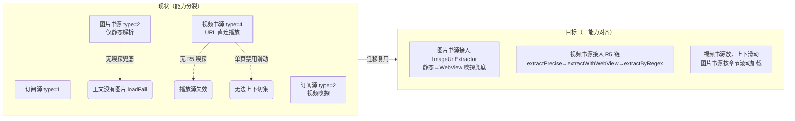

# 嗅探与滑动切换能力迁移至书源（sniff-migration-booksource）

> 状态：🔄 设计中（不完整文档，勿按本文档直接实现，先补全 spec.md/design.md/tasks.md）
> 创建时间：2026-08-08
> 类型：功能迁移 / 能力对齐

## 任务背景

RSS 订阅源经 `image-sniffer-optimization` 与 `rss-video-player-enhancement` 两个阶段，已具备成熟的**图片嗅探兜底**与**视频 R5 嗅探链**，同时支持订阅源/集数列表上下滑动切换；而同类型**书源**（BookSource）仍停留在直接解析正文的阶段，能力明显落后。

- **图片书源（bookSourceType=2）**：`ReadManga.getManageChapter` 仅做 `BookHelp.flowImages` 静态解析，`imageCount == 0` 时直接 `loadFail("正文没有图片")`，无任何嗅探兜底能力
- **视频书源（bookSourceType=4）**：`VideoPlay` 书源分支（L607-669）走 `WebBook.getContent` 拿到正文 URL 后直连播放，未接入 R5 嗅探链，页面型播放源失效
- **滑动切换**：`VideoPlayerActivity.isSinglePage` 判定使视频书源强制单页（`VideoPagerAdapter.kt:22-41` 返回 1），`isUserInputEnabled = !isSinglePage` 禁用了书源模式的上下滑动

## 核心能力

### 1. 图片嗅探 → 图片书源（bookSourceType=2）
- 复用 `ImageUrlExtractor`（三层降级：L1 静态解析 → L2 WebView 嗅探 → L3 合并），当前 `extractImageList` 入参为 `RssArticle/RssSource`，需新增 `BookChapter`/`Book` 重载或解耦为通用入参
- `ReadManga.getManageChapter`（L599-632）静态解析 0 图时，不再直接 `loadFail("正文没有图片")`，改走 `ImageSnifferWebView.sniffImageUrls()`（`IMAGE_SOURCE_REGEX` 匹配，timeout 8000L）嗅探兜底
- L1 失败阈值 3 张、L2 超时 6s、WebView 并发 Mutex 守卫等既有约束需在书源场景下复验

### 2. 视频嗅探 → 视频书源（bookSourceType=4）
- `VideoPlay` 书源分支（L607-669）当前 `WebBook.getContent` → URL 直连，接入 R5 嗅探链（`extractPrecise` → `extractWithWebView` → `extractByRegex`，R5_TIMEOUT 6s）
- 复用 `VideoUrlExtractor.resolvePlayerPageUrl` 统一解析播放器页面 URL，对齐 RSS 分支（L370-604）行为；需评估 `RssArticle` 入参解耦后对 RSS 分支的影响
- 嗅探无结果时保持原有直连+`ContentEmptyException("正文为空")` 兜底语义

### 3. 上下滑动切换 → 视频/图片书源
- 视频书源：放开 `VideoPlayerActivity.kt:432` 的 `isUserInputEnabled = !isSinglePage`（当前 `book != null` 强制单页禁用滑动），使视频书源集数间上下滑动切换
- 图片书源：按章节滚动加载（沿用 `ReadManga` 的 `ReaderLoading`/章节进度机制），与上下滑动章节切换体验对齐
- 需评估 `VideoPagerAdapter.getItemCount()` 在书源模式下 `count=1` 与书源集数列表（episodes）的数量映射

## 验收标准

真机验证点（以下每项均需在测试包 `io.legado.miss.app.debug` 真机通过）：

1. **图片书源嗅探兜底**：构造一个静态解析 0 图的图片书源，进入阅读页后应自动经 WebView 嗅探加载出图片，不再提示"正文没有图片"；静态可解析站点保持原静态解析路径不受影响
2. **视频书源嗅探**：视频书源正文为无直链的播放页 URL 时，应经 R5 链嗅探出真实视频地址并正常播放；普通直链书源行为不变
3. **上下滑动**：视频书源多个集数可实现上下滑动切换（与订阅源一致）；图片书源章节上下滚动加载正常
4. **回归**：RSS 图片源（`ImageCanvasViewModel.kt:284` 调用方）与 RSS 视频分支（VideoPlay L370-604）行为与迁移前完全一致
5. 覆盖安装后旧书源解析结果不因本改动而改变（无 schema 变更）

## 文档索引

| 文档 | 说明 |
|------|------|
| [spec.md](./spec.md) | 需求规格（Intent/Scope/Approach/Requirements/Scenarios，含 6 维门禁盘点） |
| [design.md](./design.md) | 技术设计（解耦方案/BookChapter 重载/嗅探接入点/回归风险） |
| [tasks.md](./tasks.md) | 任务清单（按 X.Y 格式，含 updateLog 同步与真机验证任务） |

## 参考资料（关键源码）

| 主题 | 路径 |
|------|------|
| 图片嗅探复用核心 | `app/src/main/java/io/legado/app/help/image/ImageUrlExtractor.kt`（object 单例，extractImageList 三层降级 L1→L2→L3，IMAGE_SNIFF_JS 5 路 hook） |
| WebView 嗅探器 | `app/src/main/java/io/legado/app/help/image/ImageSnifferWebView.kt`（sniffImageUrls，IMAGE_SOURCE_REGEX，timeout 8000L） |
| 图片源读取 | `app/src/main/java/io/legado/app/model/ReadManga.kt`（getManageChapter L599-632 静态解析 img→MangaPage） |
| 图片 UI | `app/src/main/java/io/legado/app/ui/book/manga/ReadMangaActivity.kt` |
| 视频嗅探核心 | `app/src/main/java/io/legado/app/help/video/VideoUrlExtractor.kt`（extractPrecise/extractWithWebView/extractByRegex/resolvePlayerPageUrl，R5_TIMEOUT 6s） |
| 视频书源播放分支 | `app/src/main/java/io/legado/app/model/VideoPlay.kt`（L607-669 书源分支直连；RSS 嗅探分支 L370-604） |
| 视频 UI | `app/src/main/java/io/legado/app/ui/video/VideoPlayerActivity.kt`（L432 isUserInputEnabled）；`ui/video/VideoPagerAdapter.kt`（L22-41 book!=null→1 单页） |
| 类型映射 | `data/entities/BookSource.kt:40-42`（bookSourceType 0文本/1音频/2图片/3文件/4视频）、`help/source/BookSourceExtensions.kt:130-137`（getBookType image/video） |
| 入口分发 | `utils/ContextExtensions.kt:66-81`、`utils/FragmentExtensions.kt:94-109`、`ui/book/info/BookInfoActivity.kt:1093-1117` |
| 正文语义 | `model/webBook/BookContent.kt:148-159`（video→弹幕、audio→歌词）、`:235`（audio/video 正文不 HTML 化） |

## 关联文档

- 图片嗅探设计源：`docs/specs/image-sniffer-optimization/` | 图片 UI 架构：`docs/specs/image-gallery-activity/`
- RSS 视频播放器：`docs/specs/rss-video-player-enhancement/` | 图片浏览优化：`docs/specs/image-player-vertical-canvas-optimization/`
- 规范速查：`docs/INDEX.md`、`docs/project-flow/task-navigation.md`、`docs/project-rules/version-delivery-sync.md`、`docs/project-rules/ai_e2e_testing_workflow.md`、`docs/project-rules/package-naming.md`