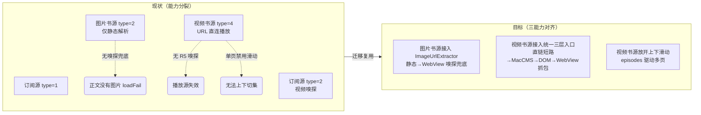

# 嗅探与滑动切换能力迁移至书源（sniff-migration-booksource）

> 状态：✅ 已完成（代码实施 + 编译通过 + RSS 真机回归通过 + 文档同步完成；书源侧真机验证因无测试书源由用户决策改为源码级验证，见 issues-found.md）
> 创建时间：2026-08-08
> 类型：功能迁移 / 能力对齐

## 任务背景

RSS 订阅源经 `image-sniffer-optimization` 与 `rss-video-player-enhancement` 两个阶段，已具备成熟的**图片嗅探兜底**与**视频三层嗅探入口**，同时支持订阅源/集数列表上下滑动切换；而同类型**书源**（BookSource）仍停留在直接解析正文的阶段，能力明显落后。

- **图片书源（bookSourceType=2）**：`ReadManga.getManageChapter` 仅做 `BookHelp.flowImages` 静态解析，`imageCount == 0` 时直接 `loadFail("正文没有图片")`，无任何嗅探兜底能力
- **视频书源（bookSourceType=4）**：`VideoPlay` 书源分支（L607-669）走 `WebBook.getContent` 拿到正文 URL 后直连播放，未接入统一三层入口 `extractVideoUrlForEpisode`，页面型播放源失效
- **滑动切换**：`VideoPlayerActivity.isSinglePage` 判定使视频书源强制单页（`VideoPagerAdapter.kt:22-41` 返回 1），`isUserInputEnabled = !isSinglePage` 禁用了书源模式的上下滑动

## 核心能力

### 1. 图片嗅探 → 图片书源（bookSourceType=2）
- `ImageUrlExtractor` 新增 `sniffBookChapterImages(chapter, book, bookSource)` 薄封装，构造 `ImageSnifferWebView(chapter.url, headerMap, tag)` 复用 `sniffImageUrls()`（`IMAGE_SOURCE_REGEX` 匹配、WebView 池、timeout 6000L/delayTime 1500L）；`ImageSnifferWebView` 构造本就只依赖 (url, headerMap, tag) 无需解耦
- `ReadManga.getManageChapter`（L599-632）静态解析 `imageCount == 0 && !chapter.isVolume` 时，不再直接 `loadFail("正文没有图片")`，改走嗅探兜底；嗅探仍为空才保留原 `loadFail`

### 2. 视频嗅探 → 视频书源（bookSourceType=4）
- `VideoUrlExtractor.extractVideoUrlForEpisode`（L590-680，统一三层入口：isDirectVideoStreamUrl 直链短路→MacCMS 播放页解析→DOM→extractWithWebView）第三参 `rssArticle` 泛化为 `ruleData: RuleDataInterface?`，书源分支传 `chapter`，RSS 调用点行为不变
- `VideoPlay` 书源分支（L607-669）：`content` 以 `<` 开头维持 MPD 文本处理，否则交 `extractVideoUrlForEpisode(content, bookSource, chapter)`，命中即用嗅探结果，null 回退 URL 直连
- 嗅探无结果时保持原有直连 + `ContentEmptyException("正文为空")` 兜底语义

### 3. 上下滑动切换 → 视频/图片书源
- 视频书源：修改 `VideoPlayerActivity.kt` L424/L432 `isSinglePage` 条件（`singleUrl` 或「书源且 episodes 空/单集」才禁用），多集书源 `isUserInputEnabled = true`，`VideoPagerAdapter.getItemCount` 书源分支返回 `episodes.size`（空则 1），垂直滑动切换上/下集
- 图片书源：`buildMangaContent`（L242-268）本已 prev/cur/next 三章连读滚动，`moveToNextChapter`/`moveToPrevChapter`（L274-321）边界管理，本次仅插入 R1 嗅探兜底，不新增滚动架构

## 验收标准

真机验证点（以下每项均需在测试包 `io.legado.miss.app.debug` 真机通过）：

1. **图片书源嗅探兜底**：构造一个静态解析 0 图的图片书源，进入阅读页后应自动经 WebView 嗅探加载出图片，不再提示"正文没有图片"；静态可解析站点保持原静态解析路径不受影响
2. **视频书源嗅探**：视频书源正文为无直链的播放页 URL 时，应经 `extractVideoUrlForEpisode` 统一三层入口嗅探出真实视频地址并正常播放；普通直链书源行为不变
3. **上下滑动**：视频书源多个集数可实现上下滑动切换（与订阅源一致）；图片书源章节上下滚动加载正常
4. **回归**：RSS 图片源（`ImageCanvasViewModel.kt:284` 调用方）与 RSS 视频分支（VideoPlay L370-604）行为与迁移前完全一致
5. 覆盖安装后旧书源解析结果不因本改动而改变（无 schema 变更）

## 文档索引

| 文档 | 说明 |
|------|------|
| [spec.md](./spec.md) | 需求规格（Intent/Scope/Approach/Requirements/Scenarios，含 6 维门禁盘点） |
| [design.md](./design.md) | 技术设计（复用既有统一入口/ruleData 泛化/嗅探接入点/滑动多页驱动/回归风险） |
| [tasks.md](./tasks.md) | 任务清单（按 X.Y 格式，含 updateLog 同步与真机验证任务） |

## 参考资料（关键源码）

| 主题 | 路径 |
|------|------|
| 图片嗅探复用核心 | `app/src/main/java/io/legado/app/help/image/ImageUrlExtractor.kt`（object 单例，extractImageList 三层降级 L1→L2→L3，IMAGE_SNIFF_JS 5 路 hook） |
| WebView 嗅探器 | `app/src/main/java/io/legado/app/help/image/ImageSnifferWebView.kt`（sniffImageUrls，IMAGE_SOURCE_REGEX，timeout 8000L） |
| 图片源读取 | `app/src/main/java/io/legado/app/model/ReadManga.kt`（getManageChapter L599-632 静态解析 img→MangaPage） |
| 图片 UI | `app/src/main/java/io/legado/app/ui/book/manga/ReadMangaActivity.kt` |
| 视频嗅探核心 | `app/src/main/java/io/legado/app/help/video/VideoUrlExtractor.kt`（extractVideoUrlForEpisode 统一三层入口，isDirectVideoStreamUrl/MacCMS/DOM/extractWithWebView，R5_TIMEOUT 6s） |
| 视频书源播放分支 | `app/src/main/java/io/legado/app/model/VideoPlay.kt`（L607-669 书源分支直连；RSS 嗅探分支 L370-604，统一入口调用点 L1326） |
| 视频 UI | `app/src/main/java/io/legado/app/ui/video/VideoPlayerActivity.kt`（L424/L432 isSinglePage 判定）；`ui/video/VideoPagerAdapter.kt`（L22-41 getItemCount 书源分支待扩展） |
| 类型映射 | `data/entities/BookSource.kt:40-42`（bookSourceType 0文本/1音频/2图片/3文件/4视频）、`help/source/BookSourceExtensions.kt:130-137`（getBookType image/video） |
| 入口分发 | `utils/ContextExtensions.kt:66-81`、`utils/FragmentExtensions.kt:94-109`、`ui/book/info/BookInfoActivity.kt:1093-1117` |
| 正文语义 | `model/webBook/BookContent.kt:148-159`（video→弹幕、audio→歌词）、`:235`（audio/video 正文不 HTML 化） |

## 关联文档

- 图片嗅探设计源：`docs/specs/image-sniffer-optimization/` | 图片 UI 架构：`docs/specs/image-gallery-activity/`
- RSS 视频播放器：`docs/specs/rss-video-player-enhancement/` | 图片浏览优化：`docs/specs/image-player-vertical-canvas-optimization/`
- 规范速查：`docs/INDEX.md`、`docs/project-flow/task-navigation.md`、`docs/project-rules/version-delivery-sync.md`、`docs/project-rules/ai_e2e_testing_workflow.md`、`docs/project-rules/package-naming.md`