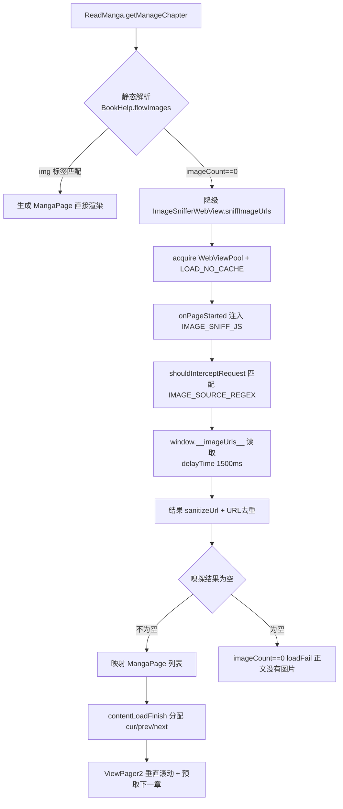
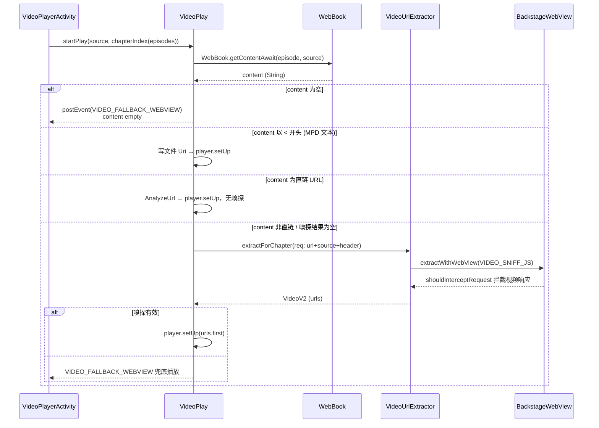
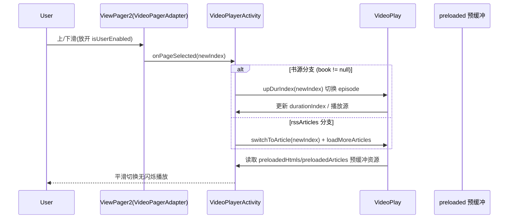

# Design: 嗅探与滑动切换能力迁移至书源

> 功能范围（3 项迁移）：
> 1. 图片嗅探 → 图片书源
> 2. 视频嗅探 → 视频书源
> 3. 上下滑动切换上/下集（视频书源放开滑动，图片书源按章节滚动）
>
> 设计遵循项目代码约束：`object` 单例不用 DI；`Coroutine.async{}...onError{}.onSuccess{}` 链式；`xxx()` 返回 `Coroutine<T>` + `xxxAwait()` 挂起函数双版本；`kotlin.runCatching`；`isNullOrBlank()` 判空；日志用 `AppLog.put()`（禁用 Timber）；业务异常继承 `NoStackTraceException` 并覆写 `fillInStackTrace()`。

## Technical Approach

### 架构概览

能力迁移的核心是"把嗅探与多页滑动能力从 RSS（`RssArticle`/`RssSource`）上下文复用到书源（`BookSource`/`BookChapter`）上下文"。现有嗅探器（`ImageSnifferWebView`、`VideoUrlExtractor`）已经过 RSS 线上验证，本次迁移**不复制嗅探代码**，而是：

- 将 Rss 专属入参（`RssArticle`）抽象为通用提取请求（URL + header + 规则）；
- 在书源分支的静态解析**失败/为空**时，降级接入既有嗅探链路（lazy principle：先走轻量静态解析，嗅探永远只做兜底）；
- 滑动切换复用既有 `ViewPager2` 多页机制，用已有 `episodes`/`MangaChapter` 列表驱动，**不引入新列表模型、不新增数据库字段**。

### 子方案 A：图片嗅探迁移

核心组件：

| 组件 | 角色 | 现状位置 |
|------|------|---------|
| `ImageUrlExtractor`（object 单例） | 三层降级入口 | `app/.../help/image/ImageUrlExtractor.kt` |
| `ImageSnifferWebView` | L2 WebView 嗅探 | `app/.../help/image/ImageSnifferWebView.kt` |
| `ReadManga`（object 单例） | 图片书源解析主链路 | `app/.../model/ReadManga.kt` |
| `WebBook` | 正文网络获取 | `app/.../model/webBook/WebBook.kt` |

现有 RSS 链路事实（保持不变）：
- `ImageUrlExtractor.extractImageList(article: RssArticle, rssSource: RssSource, ruleContent, ruleImage)` 三层降级：**L1 静态解析 → L2 WebView 嗅探 → L3 合并**；
- `IMAGE_SNIFF_JS` 5 路 hook：`Image.src`、`fetch`、`XMLHttpRequest`、`IntersectionObserver`、`document.write`；
- `ImageSnifferWebView.sniffImageUrls()`：`WebViewPool.acquire()/release()`，`settings.blockNetworkImage=false`，`cacheMode=LOAD_NO_CACHE`，`onPageStarted` 注入 JS，`shouldInterceptRequest` 拦截 `IMAGE_SOURCE_REGEX`（`(?i).*https?://[^\s]{12,}\.(?:jpg|jpeg|png|webp|gif|bmp|svg|avif)(?:\?[^\s]*)?.*`），`onPageFinished` 后 `delayTime(1500ms)` 读 `window.__imageUrls__`，全局 `timeout 8000L`，结果经 `sanitizeUrl` 脱敏。

**图片书源现状**：
- `ReadManga.getManageChapter`（L599-632）走 `BookHelp.flowImages(chapter, content)` 静态解析 `img → MangaPage`；
- `contentLoadFinish`（L194-240）：按 `offset 0/-1/1` 分配 `cur/prev/next` 三个 `MangaChapter`；
- `imageCount == 0 → loadFail("正文没有图片")`（**这是迁移点：静态解析 0 图时不应直接判死，应降级嗅探**）；
- `moveToNextChapter`/`moveToPrevChapter`（L274-321）上下集切换；
- `WebBook.getContent`（L363-377）经 `downloadNetworkContent` 拿正文。

改造方案：

1. `ImageUrlExtractor` 增加与 Rss 无关的重载入口（方案 B 同理，入参统一走子方案 B 的通用提取请求容器）：

```kotlin
object ImageUrlExtractor {
    // 原 RSS 入口保持不变
    fun extractImageList(article: RssArticle, rssSource: RssSource,
                         ruleContent: String?, ruleImage: String?): List<String>

    // 新增：书源入口（bookSource 提供 header / 规则，chapter.url 作 WebView 加载源）
    fun extractImageList(request: MediaExtractRequest): List<String> {
        val (url, source, header, ruleContent, ruleImage) = request
        // L1：静态解析正文（规则走 BookSource 的 ruleContent/ruleImage 分支）
        // L2：L1 为空时降级 ImageSnifferWebView.sniffImageUrls()（WebViewPool 加载 url）
        // L3：合并去重（URL 去重 + sanitizeUrl）+ 节流
    }
}
```

2. `ReadManga.getManageChapter` 静态解析 0 图时降级嗅探：

```kotlin
// getManageChapter（约 L599-606）
if (images.isEmpty()) {
    // 图片书源嗅探兜底：在章节简介 / WebView 主域加载 chapter.url
    val sniffed = ImageSnifferWebView.sniffImageUrls(
        url = chapter.url,
        // IS_SNIFF_JS 5 路 hook 复用同一份 IMAGE_SNIFF_JS
    ).sanitizeUrl()
    if (sniffed.isEmpty()) loadFail("正文没有图片")
    else images = sniffed.map { MangaPage(url = it) }
    if (images.isEmpty()) loadFail("正文没有图片")
}
// 仍走 BookHelp.flowImages 产物（MangaPage）与 contentLoadFinish 分配 cur/prev/next
```

触发条件：仅**静态解析返回 0 图**时触发（AD-04），不替代 `flowImages` 主链路；`contentLoadFinish` 的 `imageCount == 0 → loadFail("正文没有图片")` 分支在嗅探成功后不再进入。

### 子方案 B：视频嗅探迁移

核心组件：

| 组件 | 角色 | 说明位置 |
|------|------|---------|
| `VideoUrlExtractor` | R5 嗅探链 | `app/.../help/video/VideoUrlExtractor.kt` |
| `VideoPlay`（object 单例） | 视频播放状态 | `app/.../model/VideoPlay.kt` |
| `WebBook` | 正文网络获取 | `app/.../model/webBook/WebBook.kt` |

现有 RSS 视频嗅探事实（保持不变）：
- `VideoUrlExtractor` 提供 `extractPrecise`（标签/Meta/JSON/JS 变量精确方法）、`extractWithWebView`（`BackstageWebView.shouldInterceptRequest` + `VIDEO_SNIFF_JS`）、`extractByRegex`、`resolvePlayerPageUrl`、`isStrictVideoUrl`、`isValidVideoContentUrl`；链路超时 `R5_TIMEOUT = 6000L`（`R5_DELAY_TIME = 1000L`）。

**视频书源现状（L607-669 书源分支）**：
- `VideoPlay.startPlay` L326 为播放入口；
- RSS 分支（L370-604）：`ruleContent` 空 → `extractPrecise` → 单/多 URL → `extractWithWebView` → `extractByRegex` → 全失败 `postEvent(VIDEO_FALLBACK_WEBVIEW)`；`ruleContent` 非空 → `Rss.getContent` → `parseRssRoutes` → 多线路/单 URL；
- **书源分支（L607-669）**：`(source as BookSource)` → 从 `episodes`/`durVolume` 取章节 → `WebBook.getContent` → `content.trim()` 为空 → `ContentEmptyException`；`content` 以 `<` 开头 → 当 MPD 文本写文件 `Uri`，否则当 URL 直连 → `AnalyzeUrl` → `player.setUp`，**当前没有任何嗅探兜底**（这是迁移缺口）。

改造方案：

1. `VideoUrlExtractor` 增加与 `RssArticle` 无关的入口（输入 `URL + source + header`）：

```kotlin
object VideoUrlExtractor {
    // 原 Rss 入口保持不变
    fun extract(url: String, source: SearchSource?, header: List<Pair<String,String>>): VideoV2

    // 新增：通用入口（供 VideoPlay 书源分支调用）
    fun extractForChapter(request: MediaExtractRequest): VideoV2 {
        return runCatching {
            // 1. extractPrecise(request.url, request.source, request.header)  标签/Meta/JSON/JS 变量
            // 2. 结果为空 → extractWithWebView(...VIDEO_SNIFF_JS)     BackstageWebView.shouldInterceptRequest
            // 3. 仍为空 → extractByRegex(...)                          正则可配置规则兜底
            // 4. resolvePlateerPageUrl 解析播放页 & isStrictVideoUrl/isValidVideoContentUrl 校验
        }.getOrNull() ?: VideoV2.ERROR // 最终失败仍走 VIDEO_FALLBACK_WEBVIEW
    }
}
```

2. `VideoPlay` 书源分支（L607-669）接入 R5 链（content 非直链 / 嗅探结果为空）：

```kotlin
// 原：
val (episode, durDuration) = episodes.getOrNull(durIndex) ?: return
val content = WebBook.getContentAwait(episode.title, episode.url, source)
// 现：
val content = WebBook.getContentAwait(episode.title, episode.url, source)
if (content.isNullOrBlank()) throw ContentEmptyException("正文为空")
if (content.startsWith("<")) {
    // MPD 文本 → 写文件 Uri 直播（原有逻辑保留）
} else if (!parsedUrl.isStrictVideoUrl() && parsedUrl.isEmpty) {
    // 直链无效 → 降级到嗅探（原有直连分支前插入）
    val video = VideoUrlExtractor.extractForChapter(MediaExtractRequest(episode.url, source, header))
    player.setUp(video.urls.firstOrNull() ?: contentUrl)
} else {
    // 原有 AnalyzeUrl → player.setUp 直链逻辑不变
}
```

3. 附带能力：`initSource`（L790-808）保证 source 前置初始化；`upDurIndex`（L916-932）切换集数时复用同一段降级链路；`switchToArticle`（L1144-1193）RSS 分支行为不变。

### 子方案 C：滑动切换上/下集

**视频书源放开滑动（用 `episodes` 列表驱动多页）**：
- 现状（`VideoPlayerActivity`）：L424 `isSinglePage = book != null || singleUrl`；L432 `isUserInputEnabled = !isSinglePage` —— 书源场景因 `book != null` 恒为单页、禁止滑动。
- 改造：书源场景改为「单条 URL 视频 = 单页；有 `episodes` 列表 = 多页」，`isUserInputEnabled` 放开：

```kotlin
// VideoPlayerActivity L424/L432 现有逻辑
val isSinglePage = book != null || singleUrl
viewUserInputEnabled = !isSinglePage

// 改造后：有 episodes 列表的视频书源放开滑动　
val hasEpisated = book != null && episodes.size > 1
val isUserInputEnabled = book == null || hasEpisated // 视频书源放开滑动
```

- `VideoPagerAdapter`（VideoPagerAdapter.kt:22-41）：`getItemCount` 优先序不变（video 单例→1 / singleUrl→1 / rssArticles→size / rssEpisodes→size / 兜底 1）；在书源多集时以 `episodes` 驱动页数。
- `onPageSelected`（L440-465）：书源分支在翻页时借用 `upDurIndex` 切换上/下集（视频）而非 RSS 分支的 `rssArticleIndex/rssEpisodeIndex + loadMoreArticles`；
- 列表刷新基于已有 `episodes`，配合预缓冲 `preloadedHtmls`（正文）与 `preloadedArticles`（RSS 时）——音频/视频正文不上 HTML 化（`BookContent.kt:148-159,235`：video→弹幕，audio→歌词）。

**图片书源按章节滚动**：
- 参考 `ImageCanvasViewModel` 滚动加载模式：外层 `ViewPager2` 垂直方向跨章节，内层逐张图片（复用已验证的嵌套 ViewPager2 方案，参考 `docs/specs/image-gallery-activity/design.md`）；
- `ReadManga` 的 `cur/prev/next` 三章节缓存（`contentLoadFinish` L194-240 的 offset 0/-1/1 分配）在滚动接近边界时（如当前页 index 接近 `prev/next`）异步预取下一章节：
  - `RequestNextChapter` = `moveToNextChapter()`（L274-321 已有实现）；
- 上下滑动语义：上滑 → 上一集，下滑 → 下一集（chapters 为空时不响应，保持兜底 1 页）。

## Architecture Decisions

### AD-01: 复用现有 ImageSnifferWebView / VideoUrlExtractor，而非新建嗅探器

- **Context**: 图片/视频嗅探逻辑已分别封装在 `ImageSnifferWebView`（`IMAGE_SNIFF_JS` 5 路 hook + `IMAGE_SOURCE_REGEX` 拦截 + `WebViewPool`）与 `VideoUrlExtractor`（`extractPrecise`/`extractWithWebView`/`extractByRegex`/`R5_TIMEOUT`），并在 RSS 链路经过线上验证；迁移只需把「入参从 Rss 换书源」以及「触发时机从 RSS 播放换书源播放」
- **Concern**: 若为书源新建一套嗅探器，会复制两份 WebView 注入、拦截正则、超时与生命周期逻辑，容易漂移难维护；书源与 RSS 嗅探行为（hook、脱敏、校验）必须**一致**
- **Decision**: 迁移只做入口包装与调用点改动，底层嗅探器**复用** `ImageSnifferWebView.sniffImageUrls()` / `VideoUrlExtractor` 现有方法，不新建嗅探实现
- **Goal**: 单一嗅探实现来源，行为一致性、维护成本最低
- **Tradeoff**: 书源分支需保证向嗅探器传对 `header`/`source`；WebView 嗅探在无头进程环境较 RSS 更容易受超时影响（由 timeout + 兜底链兜底）
- **Status**: Proposed
- **Superseded-by**: —

### AD-02: 入参解耦：将 `RssArticle` 参数抽象为通用提取请求，而非复制嗅探代码

- **Context**: `ImageUrlExtractor.extractImageList`/`VideoUrlExtractor.extract` 目前绑定 `RssArticle`/`RssSource`；书源侧没有 Rss 概念（是 `BookChapter`/`BookSource`）
- **Concern**: 若为新入口复制 `extractImageList` 到书源分支，会重复三层降级 + JS hook + 正则逻辑；若强行传入 `RssArticle`，语义违和且耦合无关
- **Decision**: 引入轻量通用容器 `MediaExtractRequest`（URL + header + source + 规则字段），`extractImageList` / `extract` 增加以它为入参的重载；Rss 入口保持不变（兼容线上）
- **Goal**: 书源/RSS 共用一个嗅探实现，入参层面解耦，杜绝代码复制
- **Tradeoff**: 新增一个小型数据容器与重载方法（约 20~40 行）；需要保证 header 透传到 `downloadNetworkContent`/WebView 加载
- **Status**: Proposed
- **Superseded-by**: —

### AD-03: 书源视频滑动用 `episodes`（`BookChapter`）列表而非 `rssArticles`（不引入新列表模型）

- **Context**: `VideoPagerAdapter.getItemCount` 已支持 `rssArticles→size / rssEpisodes→size` 两类多页；视频书源滑动切换的上/下集语义对应 `BookChapter.duration`
- **Concern**: 若为书源另建「episode/route 列表模型」会引入新列表数据结构，涉及序列化、Room、适配器三处改动
- **Decision**: 书源多页直接驱动于既有 `episodes`（`BookSource.episodes` 字段）；`onPageSelected` 在书源分支调用 `upDurIndex`（L916-932）而非 RSS 分支的 `rssArticleIndex/rssEpisodeIndex + setContentVersion()`；`BookSource` 无需新增字段
- **Goal**: 零新列表模型、零数据库字段变更；滑动行为与 RSS 视频完全对齐
- **Tradeoff**: 页面数量与 `episodes` 严格绑定，若某书源 `episodes` 为空则回退单页（符合兜底语义）
- **Status**: Proposed
- **Superseded-by**: —

### AD-04: 图片书源嗅探仅作为静态解析失败兜底（0 图触发），不替代 `flowImages` 主链路

- **Context**: `ReadManga.getManageChapter` 已走 `BookHelp.flowImages` 静态解析生成 `MangaPage`；`imageCount == 0` 现直接 `loadFail("正文没有图片")`
- **Concern**: **always WebView** 会拉长首屏、消耗 WebView 池与流量（覆盖秒渲染的静态图片源被拖慢），也偏离项目 lazy principle
- **Decision**: 仅当静态解析结果为 0 张时，才降级到 WebView 嗅探（`SniffWebView.acquire/release` + `LOAD_NO_CACHE`）；嗅探结果仍需经 `sanitizeUrl`/去重；仍失败才报「正文没有图片」
- **Goal**: 静态源零成本，动态源自动降级有兜底，行为既有 lazy 又有兜底
- **Tradeoff**: 动态加载的图片书源需要启动一次 WebView 嗅探（约 8s 超时窗口），首屏略慢；部分 JS 动态站点仍可能嗅探超时 → 最终 `loadFail`
- **Status**: Proposed
- **Superseded-by**: —

### AD-05: 不引入新开关字段（无数据库变更），嗅探行为默认开启

- **Context**: `BookSource` 为 Room 实体（`data class + @Entity`，有 schema 版本 v89，schema 在 `app/schemas/`）；`AppConfig` 已有 `showMangaUi`（默认 true）等开关
- **Concern**: 为「书源嗅探」增加独立开关会新增字段 → 需 `@Migration` + 升级 schema 版本，且覆盖安装与多源行为增加配置复杂度
- **Decision**: 不新增配置字段（零 database migration），嗅探作为书源内置兜底策略**默认开启**；行为受既有 `showMangaUi` 等配置影响即可
- **Goal**: 门禁 6 维「无数据库变更零 migration」「覆盖安装兼容」达标，用户无需配置即可获得兜底能力
- **Tradeoff**: 无从 UI 关闭嗅探；极端动态站点超时消耗流量无开关可挡（可后续如遇真实需求再评估开关）
- **Status**: Proposed
- **Superseded-by**: —

## Data Flow

### 图片书源嗅探兜底流程



### 视频书源接入 R5 嗅探链流程



### 视频书源滑动切换流程



## File Changes

### 新增文件

| 文件路径 | 说明 |
|---------|------|
| `app/src/main/java/io/legado/app/model/extract/MediaExtractRequest.kt`（新） | AD-02 的通用提取请求容器：`url`/`header`/`source`/`ruleContent`/`ruleImage` 数据类，`ImageUrlExtractor`/`VideoUrlExtractor` 书源入口共用 |

### 修改文件

| 文件路径 | 修改内容 |
|---------|---------|
| `app/src/main/java/io/legado/app/model/ReadManga.kt` | `getManageChapter`（L599-632）静态解析 0 图时降级 `sniffImageUrls`；`contentLoadFinish`（L194-240）分配 cur/prev/next 保持不变（只改触发分支）；`moveToNextChapter`/`moveToPrevChapter`（L274-321）增加滚动预取适配 |
| `app/src/main/java/io/legado/app/help/image/ImageUrlExtractor.kt` | 增加 `extractImageList(req: MediaExtractRequest)` 重载（复用三层降级 + IMAGE_SNIFF_JS）；Rss 入口保持不变 |
| `app/src/main/java/io/legado/app/help/image/ImageSnifferWebView.kt` | `sniffImageUrls()` 增加不带 `RssSource` 的重载（入参 URL/header），`WebViewPool`/`IMAGE_SOURCE_REGEX`/`timeout 8000L` 复用 |
| `app/src/main/java/io/legado/app/help/video/VideoUrlExtractor.kt` | 增加 `extract(req: MediaExtractRequest)` 通用入口（封装 `extractPrecise → extractWithWebView → extractByRegex`，`R5_TIMEOUT` 复用）；原 Rss 入口保留 |
| `app/src/main/java/io/legado/app/model/VideoPlay.kt` | 书源分支（L607-669）插入 R5 嗅探兜底：非直链/直链无效 `→ extractForChapter`；`startPlay` L326 入口保持；`upDurIndex`（L916-932）/`switchToArticle`（L1144-1193）/`upRssEpisodeIndex`（L1396-1411）适配书源滑动联动 |
| `app/src/main/java/io/legado/app/ui/video/VideoPlayerActivity.kt` | L424/L432：`isUserInputEnabled` 改为 `book == null \|\| episodes.size > 1`；L440-465 `onPageSelected` 书源分支走 `upDurIndex`（以 episodes 驱动页数） |
| `app/src/main/java/io/legado/app/ui/video/VideoPagerAdapter.kt` | `getItemCount` 支持「episodes 驱动」页数（书源视频）；`createFragment → VideoFragment.newInstance` 不变 |
| `app/src/main/java/io/legado/app/ui/image/ImageSnifferWebView.kt` | 章节滚动预取：`ImageCanvasViewModel` 滚动加载模式，在 `ReadManga` 端预取相邻章节（参考 `docs/specs/image-gallery-activity/design.md` 已验证方案） |

### 不修改文件（保持不变）

| 文件路径 | 不修改理由 |
|---------|-----------|
| `app/src/main/java/io/legado/app/data/entities/BookSource.kt`（L40-44 `bookSourceType`） | 不新增字段——AD-05「零数据库变更」；类型枚举已含 video/image |
| `app/src/main/java/io/legado/app/help/source/BookSourceExtensions.kt`（L130-137） | 已有 `BookType.image/video` 映射，不改 |
| `app/src/main/java/io/legado/app/utils/ContextExtensions.kt`（L66-81）、FragmentExtensions.kt（L94-99） | 入口分发逻辑不变（书源镜像/视频均已有分流） |
| `app/src/main/java/io/legado/app/ui/book/info/BookInfoActivity.kt`（L1093-1112） | 书源类型跳转不变 |
| `app/src/main/java/io/legado/app/model/webBook/BookContent.kt`（L148-159, 235, 264） | video→弹幕、audio→歌词、audio/video 正文不 HTML 化逻辑保持 |
| `app/src/main/java/io/legado/app/model/rss/**`（`Rss`、`RssArticle`、`RssSource`） | RSS 图片/视频链路**不受影响**（门禁 6 维） |
| `app/src/main/java/io/legado/app/help/image/ImageSnifferWebView.kt`（同 ImageUrlExtractor） | 仅增加重载入口，`WebViewPool` 池/`IMAGE_SOURCE_REGEX`/`IMAGE_SNIFF_JS` 实现不动 |

## 技术要点

### 1.  WebView 复用与池化

- 全部走 `WebViewPool.acquire()/release()`，嗅探完成即归还，避免频繁创建 WebView 引发内存压测；并发预取多个章节时控制池内 WebView 上限，超并发排队（`Mutex` 保护，符合 `ReadBook` 全局单例并发纪律）
- `settings.blockNetworkImage=false` + `cacheMode=LOAD_NO_CACHE` 保证嗅探期间不装图片装缓存，`shouldInterceptRequest` 已拦截图片 URL，不重复枚消耗流量

### 2. 超时与节流

- 图片嗅探 `timeout 8000L`，`onPageFinished` 后 `delayTime(1500ms)` 读 `window.__imageUrls__`；视频链路 `R5_TIMEOUT=6000L`（`R5_DELAY_TIME=1000L`，`VideoUrlExtractor.kt:47-48`）
- 兜底仅静态源解析 0 图才触发；滑动预取时对「正在嗅探」的章节加状态锁，避免重复嗅探（URL 去重 + `inFlight` 检查）

### 3. URL 去重与脱敏

- 图片：`sanitizeUrl` + `distinct()` 去重（防止 5 路 hook 重复上报同图）；视频：`resolvePlateerPageUrl` + `isStrictVideoUrl`/`isValidVideoContentUrl` 过滤伪 URL

### 4. 滑动预加载

- 视频：维持 `preloadedHtmls`（正文预缓冲）与 `preloadedArticles`（RSS 分页预取）策略，`onPageSelected` 提前一个窗口预取，`switchToArticle`/`upDurIndex` 切换零闪烁
- 图片：`contentLoadFinish` 中 offset 0/-1/1 分配 `cur/prev/next`，在到达边界章节前预取 `next`，滚动超能力
- 生命周期：页面销毁（`VideoPlayerActivity`/Android）统一 `clearMediaPlay` 清理 WebView 池引用与预缓冲内存，避免单例长持有