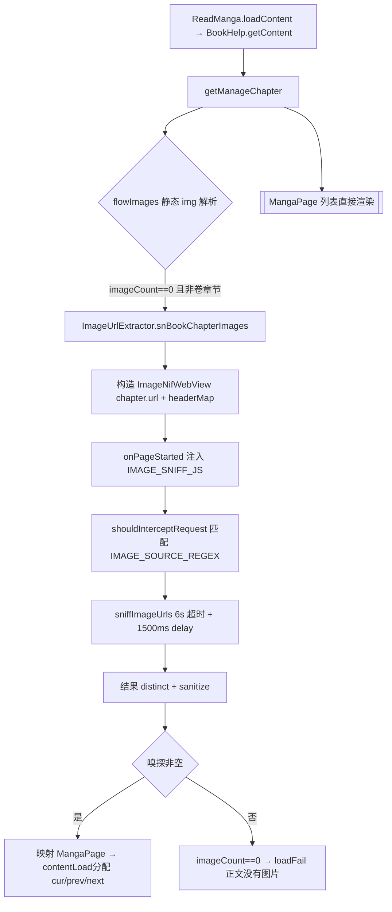
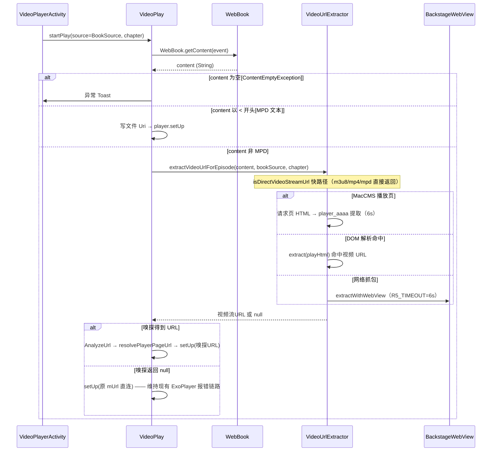
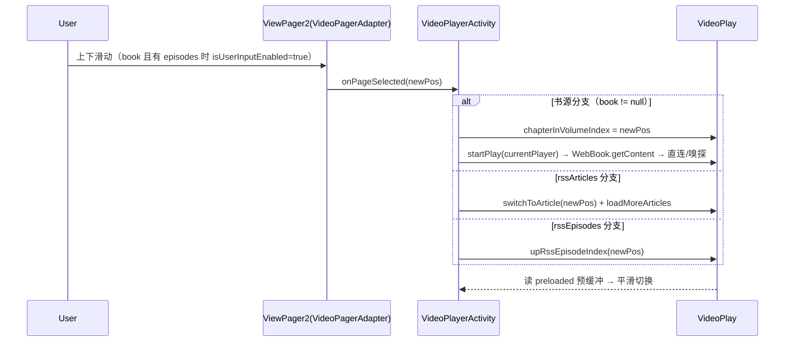

# Design: 嗅探与滑动切换能力迁移至书源

> 功能范围（3 项迁移）：
> 1. 图片嗅探 → 图片书源
> 2. 视频嗅探 → 视频书源
> 3. 上下滑动切换上/下集（视频书源放开滑动，图片书源按章节滚动）
>
> 设计遵循项目代码约束：`object` 单例不用 DI；`Coroutine.async{}...onError{}.onSuccess{}` 链式；`xxx()` 返回 `Coroutine<T>` + `xxxAwait()` 挂起函数双版本；`kotlin.runCatching`；`isNullOrBlank()` 判空；日志用 `AppLog.put()`（禁用 Timber）；业务异常继承 `NoStackTraceException` 并覆写 `fillInStackTrace()`。

## Technical Approach

### 架构概览

能力迁移的核心是"把嗅探与多页滑动能力从 RSS（`RssArticle`/`RssSource`）上下文复用到书源（`BookSource`/`BookChapter`）上下文"。现有嗅探器（`ImageSnifferWebView`、`VideoUrlExtractor`）已经过 RSS 线上验证，本次迁移**不复制嗅探代码、不新建抽象容器**，而是：

- 图片嗅探：`ImageSnifferWebView` 构造函数本就只依赖 `(url, headerMap, tag)`，不依赖 Rss 类型——图片书源直接以 `chapter.url` + 书源 `headerMap` 复用 `sniffImageUrls()`，0 图章节插入调用即可；
- 视频嗅探：**复用 `VideoUrlExtractor.extractVideoUrlForEpisode(url, source, ruleData)` 既有统一三层入口**（MacCMS 播放页解析 → DOM 解析 → 网络抓包），仅将其 `rssArticle` 参数泛化为 `ruleData: RuleDataInterface?`，书源分支传入 `chapter`/`book` 即可，RSS 调用点行为不变；
- 滑动切换复用既有 `ViewPager2` 多页机制，视频书源用既有 `episodes`（`BookChapter` 列表）驱动页数，图片书源本就三章连读（`buildMangaContent`），仅插入嗅探兜底——**不引入新列表模型、不新增数据库字段**。

### 子方案 A：图片嗅探迁移

核心组件：

| 组件 | 角色 | 现状位置 |
|------|------|---------|
| `ImageSnifferWebView` | WebView 嗅探器（可独立使用） | `app/.../help/image/ImageSnifferWebView.kt` |
| `ImageUrlExtractor`（object） | 新增书源嗅探封装入口 | `app/.../help/image/ImageUrlExtractor.kt` |
| `ReadManga`（object 单例） | 图片书源解析主链路 | `app/.../model/ReadManga.kt` |
| `WebBook` | 正文网络获取 | `app/.../model/webBook/WebBook.kt` |

现有事实（已核验）：
- `ImageSnifferWebView(url, headerMap: HashMap<String,String>?=null, tag: String?=null, timeout=8000L, delayTime=1500L)` 构造函数不依赖 RssSource；`sniffImageUrls()` 返回捕获的图片 URL 列表（`ImageSnifferWebClient.shouldInterceptRequest` 匹配 `IMAGE_SOURCE_REGEX` + `onPageStarted` 注入 `IMAGE_SNIFF_JS` 5 路 hook + 结果 `sanitizeUrl`）。
- `ReadManga.loadContent(index)` L175-189 走 `BookHelp.getContent(book, chapter)`（内部 `WebBook.getContent` `downloadNetworkContent`）拿到正文 `content`，`contentLoadFinish` L194-240 按 `offset 0/-1/1` 分配 `cur/prev/next`；`getManageChapter` L599-632 用 `BookHelp.flowImages(chapter, content)` 正则提取 `` → `MangaPage`，`imageCount == 0 && !chapter.isVolume` → 上层 `loadFail("正文没有图片")`。
- `BookHelp.flowImages` 是纯正则 ``，`BookSource` 无 `ruleImage` 字段（只有 `ruleContent: ContentRule`）——图片书源天然静态正文模型，嗅探仅兜底 JS 渲染页。

改造方案：

1. `ImageUrlExtractor` 新增图片书源嗅探封装（复用 `ImageSnifferWebView`，不新增抽象）：

```kotlin
object ImageUrlExtractor {
    const val TAG_IMAGE_SNIFF = "SniffImage"

    /** 图片书源正文 0 图时的嗅探兜底：加载章节页嗅探图片 */
    suspend fun sniffBookChapterImages(
        chapter: BookChapter,
        book: Book,
        bookSource: BookSource,
    ): List<String> {
        if (chapter.url.isBlank()) return emptyList()
        val headerMap = analyzeHeader(book, bookSource, chapter)   // UA/Referer/Cookie
        return runCatching {
            ImageSnifferWebView(
                url = chapter.url,
                headerMap = headerMap,
                tag = TAG_IMAGE_SNIFF,
                timeout = 6000L,      // 对齐 RSS 图片 L2_WEBVIEW_TIMEOUT_MS
                delayTime = 1500L
            ).withTimeoutDefault { it.sniffImageUrls() }   // 8s 内部超时仍兜底
        }.getOrElse { emptyList() }
    }
}
```

   构造参数（`url/headerMap/tag/timeout/delayTime`）与构造函数签名一致；整体不触碰 `RssArticle`/`RssSource`。原 RSS 链路（`extractImageList` 三层降级、`ImageCanvasViewModel`）零改动。

2. `ReadManga.getManageChapter` 静态解析 0 图时降级嗅探：

```kotlin
// getManageChapter（约 L599-632）：BookHelp.flowImages 结果为 0 且非卷章节时
if (list.isEmpty() && !chapter.isVolume) {
    val bookSource = book.bookSource()   // RunBlocking IO 获取
    val sniffed = ImageUrlExtractor.sniffBookChapterImages(chapter, book, bookSource)
        .distinctUntilChanged()
    if (sniffed.isNotEmpty()) {
        映射 MangaPage; imageCount = sniffed.size;  // 继续 contentLoadFinish 分配 cur/prev/next
    }
    // 仍为空 → 保持上层 imageCount==0 → loadFail("正文没有图片")
}
```

3. 触发条件：仅**静态解析 0 图**时触发（AD-04），不替代 `flowImages` 主链路；卷章节（`chapter.isVolume`）跳过嗅探（AD-04）。

4. 并发纪律：`sniffImageUrls` 内部共用 `ImageSnifferWebView` WebView 池 + `webviewMutex` 守卫（同一时间仅 1 个嗅探实例），书源多章并发预取时自动排队，无新增锁。

### 子方案 B：视频嗅探迁移（复用既有统一入口）

核心组件：

| 组件 | 角色 | 现状位置 |
|------|------|---------|
| `VideoUrlExtractor`（object） | 统一三层降级入口 | `app/.../help/video/VideoUrlExtractor.kt` |
| `VideoPlay`（object 单例） | 视频播放状态 | `app/.../model/VideoPlay.kt` |
| `WebBook` | 正文网络获取 | `app/.../model/webBook/WebBook.kt` |

现状事实（已核验）：
- **`extractVideoUrlForEpisode(url, source, ruleData)` 已存在且开放**：`VideoUrlExtractor.kt:590-680` 统一三层入口——`isDirectVideoStreamUrl` 快速短路（m3u8/mpd/mp4 直连）→ MacCMS 播放页解析（6s 超时 + `player_aaaa` 提取 + `playerUrl` 缓存 5min）→ DOM 解析（复用首层 HTML）→ `extractWithWebView` 网络抓包（`R5_DELAY_TIME=1000ms`，`R5_TIMEOUT=6000ms`），全程 `Referer` 自动注入（`ruleData?.link ?: url`），失败返回 `null`，CancellationException 传播。`source: BaseSource?` 可接 `BookSource`。
- RSS 分支已用它（`VideoPlay.kt:1324-1329`：`episode.url`、`source=rssRoute`、`rssArticle`）。
- `VideoPlay.startPlay` 书源分支 L607-669：`WebBook.getContent` → content 空抛 `ContentEmptyException`；`<` 开头当 MPC 文本写文件 `Uri`；否则当 URL 直连（`AnalyzeUrl(url, source=bookSource, ruleData=book, chapter=chapter)` → `resolvePlayerPageUrl` → `player.setUp`），**现无嗅探兜底**。

改造方案：

1. `VideoUrlExtractor.extractVideoUrlForEpisode`：把第三参 `rssArticle: RssArticle?` 泛化为 `ruleData: RuleDataInterface?`（Book/BookChapter/RssArticle 均实现 `RuleDataInterface`，见 AD-06）：

```kotlin
suspend fun extractVideoUrlForEpisode(
    url: String,
    source: BaseSource?,
    ruleData: RuleDataInterface? = null,   // 形参由 rssArticle 改名并放宽类型
): String?   // 内部 Referer 兜底：优先 (ruleData as? Link)?.link ?: url
// RSS 调用点（rssArticle 自动协变）行为不变；书源调用点传 chapter / book
```

2. `VideoPlay` 书源分支（L607-662）接入：

```kotlin
val chapter = chapter  // 已按 episodes/durVolume 选中
val content = content.trim()
val mUrl: String = when {
    content.isEmpty() -> throw ContentEmptyException("正文为空")
    content.startsWith("<") -> { // 原 MPC 文本处理保留
        val name = MD5Utils.md5Encode(content) + ".mpd"
        val file = FileUtils.createFileIfNotExist(videoTempFile, name)
        file.writeText(content); Uri.fromFile(file).toString()
    }
    else -> content
}
// 新增：非 MPC 文本（可能为播放页）→ 先走统一三层嗅探；失败回退直连
val sniffedUrl = if (mUrl.startsWith("<")) mUrl else
    VideoUrlExtractor.extractVideoUrlForEpisode(mUrl, source as BookSource, chapter) ?: mUrl
val analyzeUrl = AnalyzeUrl(sniffedUrl, source = source, ruleData = book, chapter = chapter)
val playUrl = VideoUrlExtractor.resolvePlayerPageUrl(analyzeUrl.url)
player.mapHeadData = analyzeUrl.headerMap
player.setUp(playUrl, cachePlay, File(appCtx.externalCache, "exoplayer"), chapter.title)
```

   说明：`extractVideoUrlForEpisode` 内部已有 `isDirectVideoStreamUrl` 快路径——若 `mUrl` 本身就是 m3u8/mp4/mpd 直链会立即返回，不会误伤直链播放；仅把播放页 URL 交给其三层解析，`source` 传 `BookSource`（走 `AnalyzeUrl` 获得防盗链 header），`ruleData` 传 `chapter`（书源无 `link`，`RuleDataInterface` 接口需提供 `link` 或 `url` 供 `Referer` 兜底——见 AD-06）。

3. 附/其他：`upDurIndex`（L916-932）/`switchToArticle`（L1144-1193）/`upRssEpisodeIndex`（L1396-1411）RSS 行为不变；书源滑动切换见子方案 C。

### 子方案 C：滑动切换上/下集

**视频书源放开滑动（用既有 `episodes` 列表驱动多页）**：
- 现状（`VideoPlayerActivity` L424/L432）：`isSinglePage = book != null || singleUrl` → 禁用滑动。当前 `VideoPagerAdapter.getItemCount`（L22-41）书源模式恒返回 1。
- 改造：
  1. `VideoPagerAdapter.getItemCount`：书源模式在有 `episodes`（集数列表）时返回 `episodes.size`，否则 1：
     ```kotlin
     override fun getItemCount(): Int {
         val book = VideoPlay.book
         if (book != null) {
             // 书源多集：以 episodes 驱动页数（无集列表再单页）
             val episodes = VideoPlay.episodes
             return if (episodes.isNullOrEmpty()) 1 else episodes.size
         }
         if (VideoPlay.singleUrl) return 1
         ... // rssArticles / rssEpisodes / 兜底逻辑不变
     }
     ```
  2. L424 `isUserInputEnabled = !isSinglePage` 条件改为：`singleUrl` 或「书源且 `episodes` 为空/单集」才禁用滑动：
     ```kotlin
     val episodes = VideoPlay.episodes
     val isSinglePage = VideoPlay.singleUrl ||
         (VideoPlay.book != null && (episodes.isNullOrEmpty() || episodes.size <= 1))
     viewPager.isUserInputEnabled = !isSinglePage
     ```
  3. `onPageSelected`（L440-465）书源分支：不使用 RSS 的 `rssIndex`，改为按 position 设置 `chapterInVolumeIndex` 并激活对应集播放；单页不再 setCurrentItem：
     ```kotlin
     override fun onPageSelected(position: Int) {
         // RSS 文章/集数分支保持原逻辑
         if (!VideoPlay.rssArticles.isNullOrEmpty()) { ... }
         else if (VideoPlay.book != null && !VideoPlay.episodes.isNullOrEmpty()) {
             VideoPlay.chapterInVolumeIndex = position  // position 直接映射 BookChapter 下标
             VideoPlay.currentEpisodeIndex = position
         } else { ... rssEpisodeIndex ... }
         val fragment = getVideoFragment(position)
         fragment?.activatePlayer()
     }
     ```
- 滑动语义：上滑→下一集，下滑→上一集（与 RSS 垂直滑动一致）；`VideoPlay.upDurIndex(offset)` 或直接 `startPlay(player)` 依 `chapterInVolumeIndex` 加载（书源正文 `url` 已由 `startPlay` 重算）。单集书源/单 URL 保持禁用，不出现空白滑动。

**图片书源滑动**：`ReadManga` 已把 prev/cur/next 三章 `pages` 拼进单一 `MangaContent`（`buildMangaContent` L242-268），RecyclerView 天然按章节连续滚动——"上滑/下滑看上一章/下一章图片"已由现有三章缓存 + `moveToNext/PrevChapter`（L274-321）满足，本次仅需在 0 图章节插入子方案 A 的嗅探兜底，无需改动滑动/分页结构。

## Architecture Decisions

### AD-01: 复用现有 ImageSnifferWebView / VideoUrlExtractor，而非新建嗅探器

- **Context**: 图片/视频嗅探逻辑已分别封装在 `ImageSnifferWebView`（`IMAGE_SNIFF_JS` 5 路 hook + `IMAGE_SOURCE_REGEX` 拦截 + WebView 池）与 `VideoUrlExtractor`（`extractVideoUrlForEpisode` 统一三层入口 + `R5_TIMEOUT`），并在 RSS 链路经过线上验证；迁移只需把「入参/触发时机」从 RSS 换成书源
- **Concern**: 若为书源新建一套嗅探器会复制两份 WebView 注入、拦截正则、超时与生命周期逻辑，容易漂移难维护；书源与 RSS 嗅探行为（hook、脱敏、校验）必须一致
- **Decision**: 迁移只做入口封装与调用点改动，底层嗅探器**复用** `ImageSnifferWebView.sniffImageUrls()` / `extractVideoUrlForEpisode`，不新建嗅探实现
- **Goal**: 单一嗅探实现来源，行为一致性、维护成本最低
- **Tradeoff**: 书源分支需保证向嗅探器传对 `header`/`source`；WebView 嗅探在无头环境较 RSS 更容易受超时影响（由 timeout + 兜底链执行）
- **Status**: Accepted
- **Superseded-by**: —

### AD-02: 不引入 MediaExtractRequest 抽象容器，直接复用既有入口

- **Context**: 会话曾讨论为书源/RSS 引入统一 `MediaExtractRequest` 容器，但核验后发现 `VideoUrlExtractor.extractVideoUrlForEpisode(url, source, ruleData)` 已是不依赖 RssArticle 的统一三层入口，且 `ImageSnifferWebView` 构造不依赖 Rss 类型
- **Concern**: 新增容器会带来 20~40 行数据类 + 两个新重载 + 两处 header 透传适配，但与既有签名重复；同样增加书源迁移的学习成本
- **Decision**: **不新增 `MediaExtractRequest`**（本文件此前版本已删除），图片侧直接构造 `ImageSnifferWebView(chapter, headerMap)`，视频侧复用 `extractVideoUrlForEpisode`（泛化 `rssArticle`→`ruleData`）
- **Goal**: 最小改动量，零新增抽象，书源/RSS 共用实现
- **Tradeoff**: 调用点处直接传 `BookSource`/`chapter`，抽象度低于容器方案，但更贴近现有代码风格与约束
- **Status**: Accepted（先于描述被废弃——见 commit 版本）

### AD-03: 书源视频滑动用 `episodes`（`BookChapter`）列表而非 `rssArticles`（不引入新列表模型）

- **Context**: `VideoPagerAdapter.getItemCount` 已支持 `rssArticles→size / rssEpisodes→size` 两类多页；视频书源滑动切换的上/下集语义对应 `episodes`（`toc`/`volumes` 的子章节列表）
- **Concern**: 若为书源另建「episode/route 列表模型」会引入新列表数据结构，涉及序列化、Room、适配器三处改动
- **Decision**: 书源多页直接驱动既有 `episodes`（`VideoPlay.episodes`）；`onPageSelected` 书源分支设置 `chapterInVolumeIndex` 后 `startPlay`/`upDurIndex` 联动；`BookSource` 无需新增字段
- **Goal**: 零新列表模型、零数据库字段变更；滑动行为与 RSS 视频完全对齐
- **Tradeoff**: 页面数量与 `episodes` 严格绑定，某书源 `episodes` 为空则回退单页（符合兜底语义）
- **Status**: Accepted
- **Superseded-by**: —

### AD-04: 书源嗅探仅作为静态/直连兜底触发（0 图 / 播放页），无关替换主链路

- **Context**: RSS 已相关三层的 lazy principle：图片走 `flowImages` 正则静态解析、视频走 `getContent` 直链，嗅探永远只做失败兜底
- **Decision**: 图片`getManageChapter` 静态 0 图才触发 `ImageSnifferWebView`；视频 `extractVideoUrlForEpisode` 仅在 `mUrl` 非直连（非 m3u8/mp4/mpd、且为播放页 URL）时由统一入口三层兜底，`isDirectVideoStreamUrl` 快路径对直链零开销；卷章节及单集不做嗅探
- **Goal**: 静态/直链源零成本，动态源自动降级兜底，符合 lazy principle
- **Tradeoff**: JS 动态/防盗链书源启动一次 WebView 嗅探（约 6~8s 超时窗口）首屏略慢；极端站点仍可能嗅探超时 → 最终 `loadFail`/"直连" 保持现有行为
- **Status**: Accepted

### AD-05: 不引入新数据库字段（零 migration）

- **Context**: `BookSource` 为 Room 实体（schema v89）；`AppConfig` 已有 `showMangaUi` 等开关
- **Decision**: 不新增配置字段（零 schema 变更）；嗅探作为书源自带兜底坐地默认开启，行为受既有 `showMangaUi` 等配置影响即可；不新增 UI 开关（本迭代书范围内）
- **Goal**: 门槛 6 维「无数据库变更零 migration」「覆盖安装兼容」达标
- **Tradeoff**: 无从 UI 关闭嗅探，极端动态站超时消耗流量无开关可挡（后续按实际反馈再评估开关化）
- **Status**: Accepted

### AD-06: ruleData 参数化上 `extractVideoUrlForEpisode` 第三参改为 `RuleDataInterface?`

- **Context**: `extractVideoUrlForEpisode` 现第三参为 `rssArticle: RssArticle?`，内部 `Referer = rssArticle?.link ?: url`；书源场景无 `RssArticle`，只有 `Book`/`BookChapter`
- **Decision**: 参数类型改为 `ruleData: RuleDataInterface?`，内部 Referer 兜底：优先 `(ruleData as? RssArticle)?.link`，其次 `(ruleData as? BookChapter)?.url`，否则 `url`；RSS 调用点传入 `rssArticle`（`RssArticle` 实现 `RuleDataInterface`，无语义/行为差异），书源处传入 `chapter`/`book`
- **Goal**: 零重复 + 书源在多层解析中仍能获取 Referer（防盗链）与 `{{book.*}}` 规则变量
- **Tradeoff**: `AnalyzeUrl` `ruleData` 类型宽化；`Referer` 的取值优先级需真机验证（不同站点期待书链接 vs 章节链接）
- **Status**: Accepted
- **Superseded-by**: —

### AD-07: 视频书源滑动时直接 `position → chapterInVolumeIndex` 而非 RSS 选集 UI

- **Context**: RSS 视频滑动 `onPageSelected` 依赖 `rssArticleIndex/EpisodeIndex` + `loadMoreArticles`；书源集对应 `BookChapter` 的下标（`chapterInVolumeIndex`）
- **Decision**: 书源分支 `onPageSelected(pos)` 设 `chapterInVolumeIndex = pos` 并触发 `startPlay`；不沿用 RSS 的 `rssEpisodeIndex`（书源无该状态）
- **Goal**: 随后一集的正文（`WebBook.getContent`→直连/嗅探）随滑动自动加载，`saveRead` 正确记录进度
- **Tradeoff**: 需要在 `onPageSelected` 与新书的 Fragment 播放中复用同一索引，避免 `position` 与 `chapterInVolumeIndex` 失配造鬼
- **Status**: Accepted

## Data Flow

### 图片书源嗅探兜底流程



### 视频书源嗅探（复用统一入口）流程



### 视频书源滑动切换流程



## File Changes

### 新增文件

无。（评审修正：删除原 `model/extract/MediaExtractRequest.kt` 方案——见 AD-02。）

### 修改文件

| 文件路径 | 修改内容 |
|---------|---------|
| `app/src/main/java/io/legado/app/help/video/VideoUrlExtractor.kt` | `extractVideoUrlForEpisode` 第三参 `rssArticle: RssArticle?` → `ruleData: RuleDataInterface?`（内部 Referer 兜底取值协商）；RSS 调用点（VideoPlay.kt:1326 等）传参保持语义兼容 |
| `app/src/main/java/io/legado/app/model/VideoPlay.kt` | 书源分支（L607-662）：`content` 非 `<` 时先 `extractVideoUrlForEpisode(content, bookSource, chapter)`，嗅到即用，返回 null 则维持原直连；新增书源滑动索引联动（配合子方案 C）；`startPlay`（L326）整体结构不变 |
| `app/src/main/java/io/legado/app/help/image/ImageUrlExtractor.kt` | 新增 `sniffBookChapterImages(chapter, book, bookSource)`（构造 `ImageSnifferWebView` 复用 `IMAGE_SNIFF_JS`）；不触碰 RSS `extractImageList` 链路 |
| `app/src/main/java/io/legado/app/model/ReadManga.kt` | `getManageChapter`：静态解析 0 图 && 非卷 → 调 `sniffBookChapterImages`，非空则构建 MangaPage；`contentFinish`(L194-240) 分配逻辑不变 |
| `app/src/main/java/io/legado/app/ui/video/VideoPlayerActivity.kt` | L424/L432 isSinglePage 条件（书源且有 episodes 时放开）；L440-465 `onPageSelected` 书源分支设 `chapterInVolumeIndex`+`startPlay` |
| `app/src/main/java/io/legado/app/ui/video/VideoPagerAdapter.kt` | `getItemCount` 书源分支：`episodes` 非空 → `episodes.size`，否则 1 |

### 不修改文件（门禁 6 维保持）

| 文件路径 | 不修改理由 |
|---------|-----------|
| `app/src/main/java/io/legado/app/data/entities/BookSource.kt`（L40-44 `bookSourceType`） | 不新增字段——AD-05 零 DB 变更；类型枚举序已含 video/image |
| `app/src/main/java/io/legado/app/help/source/BookSourceExtensions.kt`（L130-137） | 已有 `BookType.image/video` 映射，不改 |
| `app/src/main/java/io/legado/app/utils/ContextExtensions.kt`（L66-81）、FragmentExtensions.kt（L94-109） | 入口分发逻辑不变 |
| `app/src/main/java/io/legado/app/ui/book/info/BookInfoActivity.kt`（L1093-1117） | 书源类型跳转不变 |
| `app/src/main/java/io/legado/app/model/webBook/BookContent.kt`（L148-159, 235） | video→弹幕、audio/video 正文不 HTML 化逻辑保持 |
| `app/src/main/java/io/legado/app/model/rss/**` | RSS 图片/视频链路**不受影响**（回归对象） |
| `app/src/main/java/io/legado/app/help/image/ImageSnifferWebView.kt` | 无需变更构造函数（已接收 url/headerMap/tag）；`IMAGE_SOURCE_REGEX`/`IMAGE_SNIFF_JS`/池实现不动 |
| `app/src/main/java/io/legado/app/data/entities/*` | 零 DB 迁移 |

## 技术要点

1. WebView 复用与池化：图片嗅探 `ImageSnifferWebView` 复用 `WebViewPool.acquire()/release()`；视频 `extractWithWebView` 走 `BackstageWebView`。嗅探完成即归还，不频繁创建 WebView。并发预嗅时与 RSS 共享池（受 Mutex 守卫），不叠加超限。

2. 超时与节流：图片 `timeout=6000L` + `delayTime=1500L`（对齐 RSS `L2_WEBVIEW_TIMEOUT_MS`）；视频 `R5_TIMEOUT=6000L`（`R5_DELAY_TIME=1000L`）；快路径 `isDirectVideoStreamUrl` 短路直连零延迟。兜底仅静态0图/播放页触发；滑动切换连续多次嗅探「url 相同」时复用 `extractVideoUrlForEpisode` 内 5min `playerPageCache`，避免重复网络。

3. URL 去重与脱敏：图片 `distinct()` + `sanitizeUrl`；视频 `resolvePlayerPageUrl` + `isStrictVideoUrl` 非法 URL过滤。日志 `/sanitizeUrl`，不输出真实域名/token。

4. 生命周期：页面销毁（`VideoPlayerActivity` / `ReadMangaActivity` onDestroy）取消 WebView 嗅探协程（CancellationException 传播），释放池引用；无单例长持有。

5. 失败降级闭环：图片嗅探失败 → 原 `loadFail("正文没有图片")`；视频嗅探返回 null → 回归 URL 直连（ExoPlayer 收到 HTML 时既有 `VIDEO_FALLBACK_WEBVIEW` 链路不变）。