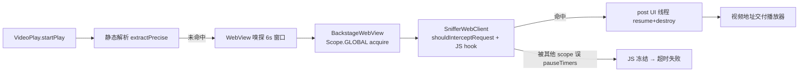
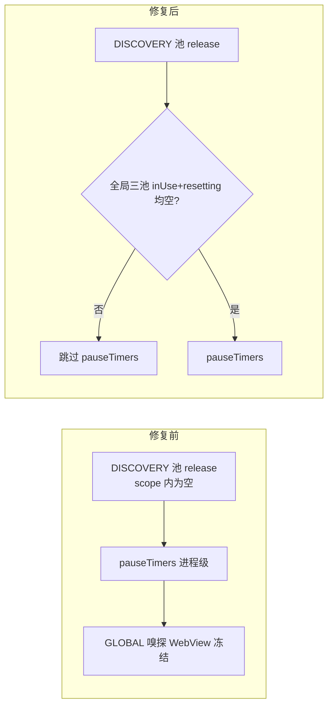
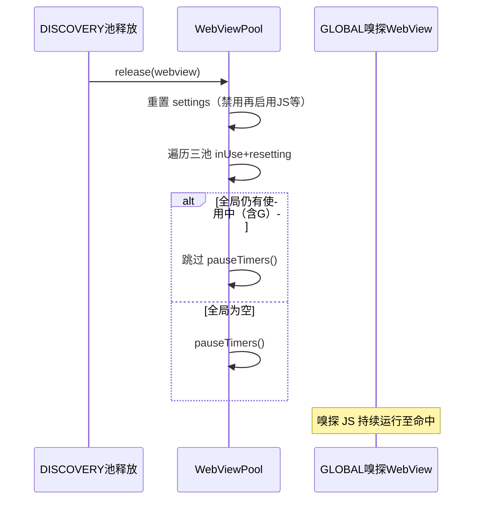

# Design: 嗅探回归与图片订阅源崩溃取证修复

## Technical Approach

### 问题1：进程级 pauseTimers/resumeTimers 的 scope 隔离误判

根因链（已源码核实）：

1. `bbc9d0a89`（08-19）将 WebView 池按场景分层：GLOBAL（嗅探/书源）/ DISCOVERY（发现页）/ RSS（订阅页）
2. [WebViewPool.kt](../../../app/src/main/java/io/legado/app/help/webView/WebViewPool.kt) `release()` L168-170：`if (scopePool.inUsePool.isEmpty()) webview.pauseTimers()` —— `pauseTimers()` 是**进程级 API**（暂停进程内所有 WebView 的 JS 定时器与解析），但判断只看**当前 scope**
3. 场景：发现页/订阅页后台加载的 BackstageWebView 释放时，其 scope 的 inUsePool 已空 → 执行 `pauseTimers()` → **GLOBAL 池中正在嗅探的 WebView JS（fetch/XHR/MediaSource hook）被冻结**
4. 嗅探窗口仅 6 秒（R5_TIMEOUT），期间无人 acquire GLOBAL → 无 `resumeTimers()` → 超时失败
5. 系统浏览器不受 App 进程影响 → "浏览器能播、内置嗅探失败"

修复方案：

- 新增全局方法判断"是否所有 scope 均无使用中 WebView"（遍历三池 inUsePool + resettingPool）
- `release()`：全局为空才 `pauseTimers()`
- `acquire()`：无条件 `resumeTimers()`（幂等；原 L98 语义本就是"取用时确保定时器运行"）

### 问题2：图片订阅源崩溃取证

- 现有 [CrashHandler.kt](../../../app/src/main/java/io/legado/app/help/CrashHandler.kt) 已将崩溃栈写入 `externalCacheDir/crash/crash-*.log`（保留 7 天），但用户导出的日志不含该目录
- 在日志导出入口读取 crash 目录最近的崩溃文件一并导出
- 拿到真实崩溃栈后另起修复任务（图片栈历史前科：crash-2026-07-26 Activity 销毁竞态系列）

### 嗅探链路全景（供回归验证参照）

## Architecture Decisions

### AD-01: 进程级定时器 API 的判断条件全局化
- **Context**: `bbc9d0a89` 将单一 WebView 池重构为三 scope 池，`pauseTimers()`/`resumeTimers()` 的守卫条件沿用单池时代的 `inUsePool.isEmpty()` 写法但作用域被错误收窄到单 scope
- **Concern**: 进程级 API 配 scope 级判断 → 其他 scope 的释放动作误冻结 GLOBAL 嗅探 WebView，嗅探能力回归
- **Decision**: 守卫条件改为跨三 scope 全局判断（inUsePool + resettingPool）；`acquire()` 无条件 `resumeTimers()`
- **Goal**: 恢复重构前"全进程互斥"语义，scoped 池仅隔离缓存容量与闲置回收
- **Tradeoff**: acquire 多一次幂等 resumeTimers 调用 + 全局遍历三池（规模≤6，开销可忽略）
- **Status**: Proposed

### AD-02: 图片崩溃采用取证优先而非防御性盲改
- **Context**: 本次日志包无崩溃栈（0 FATAL 命中），崩溃时刻不在导出窗口内；CrashHandler 已有落盘机制但日志导出未附带 crash 文件
- **Concern**: 无栈盲改（OOM 兜底/渲染进程守卫）可能改不到真根因，且违反"验证强制"门禁
- **Decision**: 本次只补取证链路（导出附带 crash 文件），拿到崩溃栈后二次精准修复
- **Goal**: 最短路径拿到真实根因，避免改 A 坏 B
- **Tradeoff**: 用户需多一轮复现；取证增强本身是真实缺陷修复不白做
- **Status**: Proposed

### AD-03: destroyScope 误杀 inUsePool 风险本次不修
- **Context**: `bbc9d0a89` 的 `destroyScope()` 会销毁 inUsePool 中活动 WebView，造成订阅/发现页偶发加载失败的伴生风险
- **Concern**: 与嗅探回归同源提交，存在诱惑一并重构
- **Decision**: 登记不修（改动面与风险独立，需单独真机评估），在 issues-found 记录
- **Goal**: 本次变更面最小化，嗅探修复可独立归因验证
- **Tradeoff**: 伴生风险延后处理
- **Status**: Proposed

## Data Flow

修复后 release/acquire 判定流：

## File Changes

| 文件 | 变更类型 | 说明 |
|------|---------|------|
| `app/src/main/java/io/legado/app/help/webView/WebViewPool.kt` | 修改 | L98 acquire 无条件 resumeTimers；L168 release 改全局判断（新增跨 scope 遍历方法） |
| 日志导出入口类（实施时定位，`ui/config` 或帮助相关） | 修改 | 导出内容附带 crash 目录最近崩溃文件 |
| `app/src/main/assets/updateLog.md` | 修改 | 面向用户追加两条修复说明（编译前） |
| `docs/INDEX.md` / 本 spec 四文档 | 修改 | 状态流转同步 |
