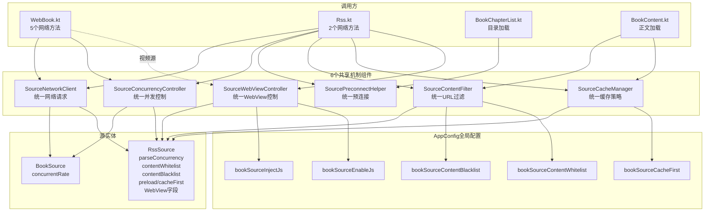
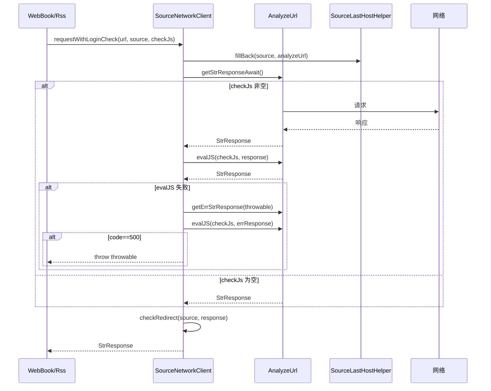
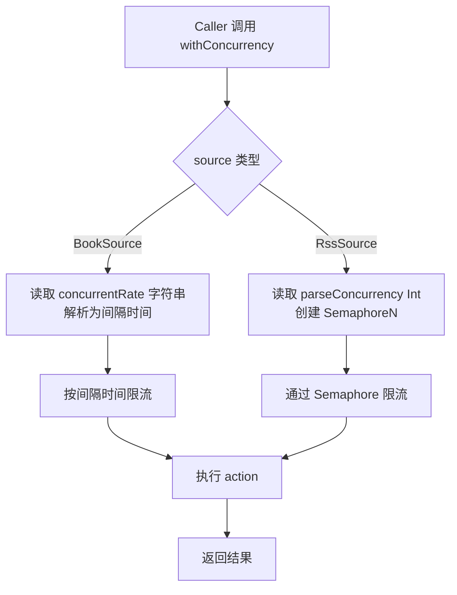
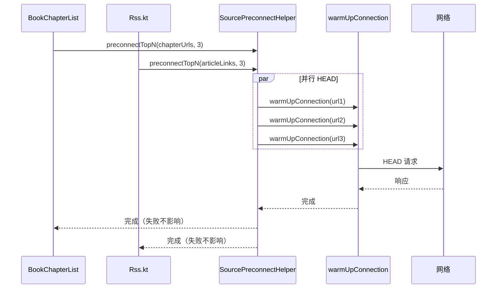
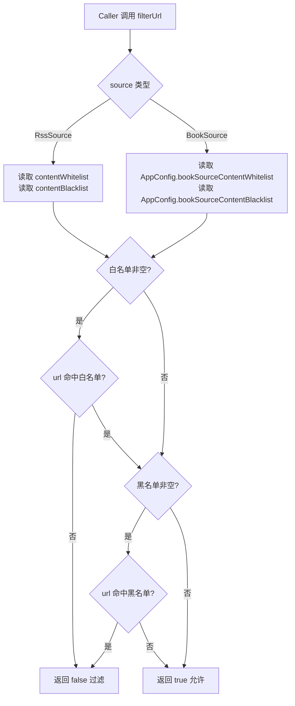

# design.md — 书源/订阅源架构机制层互补（V2）

## Technical Approach（技术方案）

### 总体策略
采用**机制层抽取 + 共享组件复用**策略，抽取 6 个共享机制组件，让 BookSource 和 RssSource 都通过组件接口获得对方优点，**零实体字段增加、零数据库迁移**。

### 6 个组件架构

| 组件 | 职责 | 接口 | 调用方 |
|------|------|------|--------|
| M1 SourceConcurrencyController | 统一并发控制 | `withConcurrency(source, action)` | WebBook/Rss |
| M2 SourceContentFilter | 统一正文URL过滤 | `filterUrl(url, source): Boolean` | BookContent/RssContent |
| M3 SourceCacheManager | 统一缓存策略 | `isCacheFirst(source): Boolean` | BookContent/RssContent |
| M4 SourcePreconnectHelper | 统一预连接 | `preconnectTopN(urls, n=3)` | BookChapterList/Rss |
| M5 SourceWebViewController | 统一WebView控制 | `applyConfig(webView, source)` | BookVideoActivity/RssWebActivity |
| M6 SourceNetworkClient | 统一网络请求 | `requestWithLoginCheck(url, source, checkJs)` | WebBook/Rss |

### 实施分批（按依赖与风险排序）
1. **批次 1：M6 SourceNetworkClient**（最高复用价值，6 处调用点统一）
2. **批次 2：M1 SourceConcurrencyController**（修复 RssSource.parseConcurrency 未落地 BUG）
3. **批次 3：M4 SourcePreconnectHelper**（抽取已有 F-P1-F 实现，低风险）
4. **批次 4：M2 SourceContentFilter**（BookSource 通过 AppConfig 获得过滤能力）
5. **批次 5：M3 SourceCacheManager**（BookSource 通过 AppConfig 获得缓存优先能力）
6. **批次 6：M5 SourceWebViewController**（BookSource 视频源通过 AppConfig 获得 WebView 控制）

每批独立编译 + 单元测试 + L2 真机验证后再合并下一批。

### 关键技术决策
1. **零字段增加**：所有组件通过 `BaseSource` 接口或 `source is BookSource/RssSource` 类型判断读取现有字段
2. **AppConfig 全局配置**：BookSource 获得新能力通过 AppConfig 全局配置（如 `bookSourceContentBlacklist`），不增实体字段
3. **降级机制**：组件调用失败时降级到原 WebBook/Rss 直接调用，不抛异常中断主流程
4. **线程安全**：M1 单例的 Semaphore 缓存用 `@Synchronized` 保护
5. **CancellationException 守卫**：M6 必须保留原有 CancellationException 守卫逻辑
6. **日志可观测**：每个组件调用点增加 AppLog（tag: `TAG_SOURCE_MECHANISM`）

## Architecture Decisions（架构决策）

### AD-01: 机制层抽取 vs 字段借鉴
- **Context**: BookSource 与 RssSource 各自演化，机制层存在重复与互补
- **Concern**: 如何在不增加字段前提下实现机制互补
- **Decision**: 抽取 6 个共享机制组件，让两类源通过组件接口共享能力
- **Goal**: 零字段增加实现机制互补，减少重复代码
- **Tradeoff**: 接受组件接口设计与调用点重构成本，换取零字段增加和机制统一
- **Status**: Proposed
- **Superseded-by**: 无

### AD-02: AppConfig 全局配置 vs 实体字段
- **Context**: BookSource 需要 RssSource 的过滤/缓存/WebView 控制能力
- **Concern**: 如何在不增加 BookSource 实体字段前提下配置这些能力
- **Decision**: 使用 AppConfig 全局配置（如 `bookSourceContentBlacklist`/`bookSourceCacheFirst`），而非实体字段
- **Goal**: BookSource 获得新能力，零实体字段增加，零数据库迁移
- **Tradeoff**: 接受全局配置无法源级精细控制（所有书源共享同一配置），换取零字段增加
- **Status**: Proposed
- **Superseded-by**: 无

### AD-03: M6 SourceNetworkClient 接口设计
- **Context**: WebBook.kt 4 处 + Rss.kt 2 处重复的 `runCatching + checkJs + getErrStrResponse` 模式
- **Concern**: 如何设计统一接口兼容所有调用点的差异
- **Decision**: 提供 `suspend fun requestWithLoginCheck(analyzeUrl: AnalyzeUrl, source: BaseSource, checkJs: String?): StrResponse` 接口，内部封装完整流程
- **Goal**: 6 处调用点统一，行为等同改造前
- **Tradeoff**: 接受接口参数较多（analyzeUrl/source/checkJs），换取完整流程封装
- **Status**: Proposed
- **Superseded-by**: 无

### AD-04: M1 SourceConcurrencyController 类型分发
- **Context**: BookSource 用 `concurrentRate`（字符串），RssSource 用 `parseConcurrency`（Int）
- **Concern**: 如何统一接口处理两类源的并发控制
- **Decision**: 内部用 `when(source)` 类型判断读取对应字段，Semaphore 实例按 source URL 缓存
- **Goal**: RssSource.parseConcurrency 实际落地，BookSource.concurrentRate 解析逻辑统一
- **Tradeoff**: 接受类型判断的轻微耦合，换取统一接口
- **Status**: Proposed
- **Superseded-by**: 无

### AD-05: M4 SourcePreconnectHelper 抽取
- **Context**: Rss.kt 中 F-P1-F 预连接实现是内联代码
- **Concern**: 如何让 BookChapterList 复用此能力
- **Decision**: 抽取为 `SourcePreconnectHelper.preconnectTopN(urls, n=3)` 工具对象，Rss.kt 和 BookChapterList 都调用
- **Goal**: 复用预连接机制，减少重复代码
- **Tradeoff**: 接受 Rss.kt 轻微重构，换取机制共享
- **Status**: Proposed
- **Superseded-by**: 无

### AD-06: M5 SourceWebViewController 双源适配
- **Context**: RssSource 有 8 个 WebView 字段，BookSource 无
- **Concern**: 如何统一 WebView 配置接口
- **Decision**: 接口内 `when(source)` 判断，RssSource 读自身字段，BookSource 读 AppConfig 全局配置
- **Goal**: 两类源共享 WebView 配置逻辑
- **Tradeoff**: 接受接口内部类型判断，换取 BookSource 视频源获得 WebView 控制能力
- **Status**: Proposed
- **Superseded-by**: 无

### AD-07: 分批实施顺序
- **Context**: 6 个组件并行实施风险高
- **Concern**: 如何分批降低风险
- **Decision**: 按依赖与风险排序：M6→M1→M4→M2→M3→M5，每批独立验证
- **Goal**: 每批独立验证，问题快速定位
- **Tradeoff**: 接受分批串行成本，换取风险可控
- **Status**: Proposed
- **Superseded-by**: 无

### AD-08: 降级机制
- **Context**: 组件调用可能失败（如 Semaphore 创建失败、正则编译失败）
- **Concern**: 如何避免组件失败影响主流程
- **Decision**: 组件调用失败时降级到原 WebBook/Rss 直接调用，kotlin.runCatching 包裹，AppLog 记录
- **Goal**: 组件失败不影响主流程
- **Tradeoff**: 接受降级时机制失效，换取主流程稳定
- **Status**: Proposed
- **Superseded-by**: 无

## Data Flow（数据流）

### 整体机制互补架构图

### M6 SourceNetworkClient 调用流程

### M1 SourceConcurrencyController 类型分发

### M4 SourcePreconnectHelper 复用流程

### M2 SourceContentFilter 双源适配

## File Changes（文件变更清单）

### 新增：6 个共享机制组件
| 文件 | 内容 |
|------|------|
| `app/src/main/java/io/legado/app/help/source/SourceConcurrencyController.kt` | M1 统一并发控制单例 |
| `app/src/main/java/io/legado/app/help/source/SourceContentFilter.kt` | M2 统一正文URL过滤工具对象 |
| `app/src/main/java/io/legado/app/help/source/SourceCacheManager.kt` | M3 统一缓存策略单例 |
| `app/src/main/java/io/legado/app/help/source/SourcePreconnectHelper.kt` | M4 统一预连接工具对象 |
| `app/src/main/java/io/legado/app/help/source/SourceWebViewController.kt` | M5 统一WebView控制工具对象 |
| `app/src/main/java/io/legado/app/help/source/SourceNetworkClient.kt` | M6 统一网络请求单例 |

### 修改：网络层调用点重构
| 文件 | 变更内容 |
|------|----------|
| `app/src/main/java/io/legado/app/model/webBook/WebBook.kt` | 4 处网络请求模式替换为 M6 调用 + M1 并发控制 + M2 URL 过滤 |
| `app/src/main/java/io/legado/app/model/rss/Rss.kt` | 2 处网络请求模式替换为 M6 调用 + M1 并发控制 + M4 预连接抽取 |
| `app/src/main/java/io/legado/app/model/webBook/BookChapterList.kt` | 加载完成后调用 M4 预连接前 3 章 |
| `app/src/main/java/io/legado/app/model/webBook/BookContent.kt` | 正文 URL 加载前调用 M2 过滤 + M3 缓存优先分支 |

### 修改：AppConfig 全局配置
| 文件 | 变更内容 |
|------|----------|
| `app/src/main/java/io/legado/app/AppConfig.kt` | 新增 5 个全局配置项：bookSourceContentBlacklist/bookSourceContentWhitelist/bookSourceCacheFirst/bookSourceInjectJs/bookSourceEnableJs |

### 修改：调试层
| 文件 | 变更内容 |
|------|----------|
| `app/src/main/java/io/legado/app/ui/book/source/debug/BookSourceDebugActivity.kt` | 增加并发控制/URL 过滤/缓存策略调试输出 |
| `app/src/main/java/io/legado/app/ui/rss/source/debug/RssSourceDebugActivity.kt` | 增加 parseConcurrency 落地情况调试输出 |

### 修改：资源
| 文件 | 变更内容 |
|------|----------|
| `app/src/main/assets/updateLog.md` | 追加版本交付说明 |

### 修改：文档
| 文件 | 变更内容 |
|------|----------|
| `docs/project-flow/architecture/source-mechanism-components.md` | 新增 6 个组件文档 |
| `docs/project-flow/modules/webbook-search.md` | 更新 WebBook 方法表（标注 M6 调用） |
| `docs/project-flow/modules/rss-subsystem.md` | 更新订阅源模块（标注 M1/M4/M6 调用） |
| `docs/INDEX.md` | 更新状态 |
| `docs/specs/source-arch-mutual-borrow/README.md` | 状态标记更新 |

### 不修改（重要）
- ❌ `BookSource.kt`（零字段增加）
- ❌ `RssSource.kt`（零字段增加）
- ❌ `AppDatabase.kt`（零数据库迁移，保持 v89）
- ❌ `BookSourceDao.kt`/`RssSourceDao.kt`
- ❌ `AnalyzeRule.kt`/`AnalyzeUrl.kt`（核心引擎不动）

## 验证策略

### 单元测试
- M1: withConcurrency 行为测试（BookSource/RssSource 类型分发）
- M2: filterUrl 黑白名单匹配测试
- M3: isCacheFirst 类型分发测试
- M4: preconnectTopN 失败不影响主流程测试
- M5: applyConfig 类型分发测试
- M6: requestWithLoginCheck 行为等同改造前测试（含 CancellationException 守卫）

### 集成测试
- 6 处调用点重构后行为等同测试（S1 场景）
- RssSource.parseConcurrency 实际落地测试（S2 场景）
- BookSource 正文 URL 过滤测试（S3 场景）
- BookSource 章节预连接测试（S4 场景）
- BookSource 视频源 WebView 控制测试（S5 场景）
- BookSource 正文缓存优先测试（S6 场景）
- 现有源 JSON 兼容测试（S7 场景）

### 真机验证（ai_tests）
- 编译打包测试包（`io.legado.miss.app.debug`）
- L2 验证脚本：`ai_tests/scripts/` 下相关脚本
- 真机回归测试：6 处网络请求重构后所有现有源可用

### 回归验证
- 旧 JSON 导入兼容（S7 场景）
- 数据库 schema 不变（v89 保持）
- 现有所有书源/订阅源功能正常
