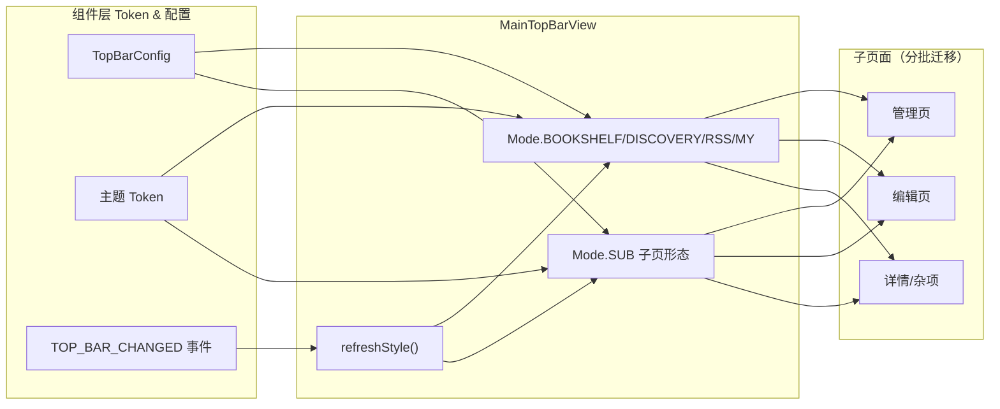

# design.md — 子页面头部统一：全 App TitleBar 子页迁移 MainTopBarView

## Technical Approach

子页面头部统一采用「组件收敛 + 分批迁移」策略：

1. **组件层**：`MainTopBarView` 新增 `Mode.SUB`，补齐子页所需能力（返回导航、菜单、副标题、自定义内容），使其同时服务主 Tab 页与子页面。
2. **接线层**：各 Activity 移除 `setSupportActionBar(TitleBar.toolbar)`，改接 `MainTopBarView`；返回与菜单经 `onBackPressedDispatcher` / 暴露的菜单 API 等价迁移。
3. **迁移层**：按页面优先级分 3 批迁移（管理页 → 编辑页 → 详情/杂项），每批独立编译 + 真机回归。

### 组件形态设计（`Mode.SUB`）

| 能力 | TitleBar 现状 | MainTopBarView `Mode.SUB` |
|------|--------------|---------------------------|
| 返回 | `navigationIcon` + `onSupportNavigateUp` | `titleSelect` 标题 + 返回箭头，点击 `onBackPressedDispatcher.onBackPressed` |
| 菜单 | `setSupportActionBar` 挂 overflow | 暴露 `setMenu` / `moreButton` 承载，页面按需开启 |
| 副标题 | `subtitle` | 暴露 `setSubtitle` |
| 内容插槽 | `contentLayout` | 暴露 `setContentLayout` |
| 样式源 | `topBarColorManaged`（仅背景色） | `TopBarConfig` + 主题 token 全量 |

## Architecture Decisions

### AD-01: 扩展 MainTopBarView 新增 Mode.SUB

- **Context**: 四主页面已用 `MainTopBarView`，但约 18 个子页面用 `TitleBar`，仅能跟随顶栏背景色，观感不一致且多套样式。
- **Concern**: 子页面头部无法被顶栏/主题/样式管理全量管控，与主页面观感割裂。
- **Decision**: 扩展 `MainTopBarView` 新增通用子页形态 `Mode.SUB`，补齐返回/菜单/副标题/自定义内容能力，作为子页面统一头部。
- **Goal**: 子页面与主页面同一组件、观感一致、全量受主题管理。
- **Tradeoff**: `MainTopBarView` 承载面变大（含子页语义）；换取单组件统一、无双实现。
- **Status**: Proposed

### AD-02: 批量迁移 + 每批验证

- **Context**: 18 个 Activity 一次性全改风险高、回归面大。
- **Concern**: 大规模一次性替换易引入遗漏与功能回归。
- **Decision**: 按页面相似度分 3 批迁移（管理页→编辑页→详情/杂项），每批结束即编译 + 目标页面真机回归，全绿再进下一批。
- **Goal**: 控制单次回归面，问题提前暴露、及时收敛。
- **Tradeoff**: 总周期变长；换取稳定交付与可回退性。
- **Status**: Proposed

### AD-03: MaterialToolbar 弹窗不迁移

- **Context**: `dialog_*.xml` 约 18 处头部用 `MaterialToolbar`。
- **Concern**: 弹窗头部语义（紧贴对话框、小尺寸）与页面顶栏不同，套用 `MainTopBarView` 会破坏弹窗观感。
- **Decision**: 弹窗头部本次不迁移，保持 `MaterialToolbar`；仅迁移 Activity 页面级 `TitleBar`。
- **Goal**: 聚焦「页面级头部」统一，避免误伤弹窗。
- **Tradeoff**: 弹窗与页面头部仍属两套样式；属已知边界。
- **Status**: Proposed

## Data Flow

`TOP_BAR_CHANGED` → `MainActivity.refreshMainTopBars` → 各 `MainTopBarView.refreshStyle()` → 子页面头部随主题自动刷新，无 Compose 版本号依赖。

## File Changes

| 文件 | 变更类型 |
|------|---------|
| `app/src/main/java/io/legado/app/ui/widget/MainTopBarView.kt` | 新增 `Mode.SUB` + `setMenu`/`setSubtitle`/`setContentLayout`/返回接线 |
| `app/src/main/java/io/legado/app/ui/main/rss/RssFragment.kt`（如需） | 子页态联动 |
| 约 18 个 `res/layout/activity_*.xml` | `TitleBar` → `MainTopBarView`
| 对应 18 个 Activity（`app/.../ui/**/*Activity.kt`） | 移除 `setSupportActionBar`，改接 `MainTopBarView` |

> 完整页面清单与批次见 `tasks.md`。`TitleBar.kt` 过度期保留。